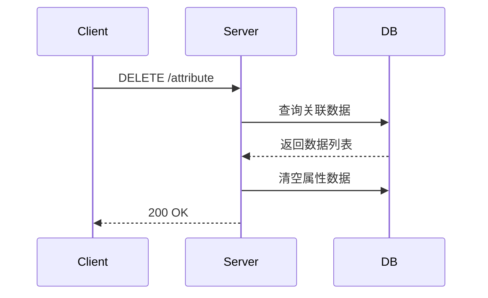
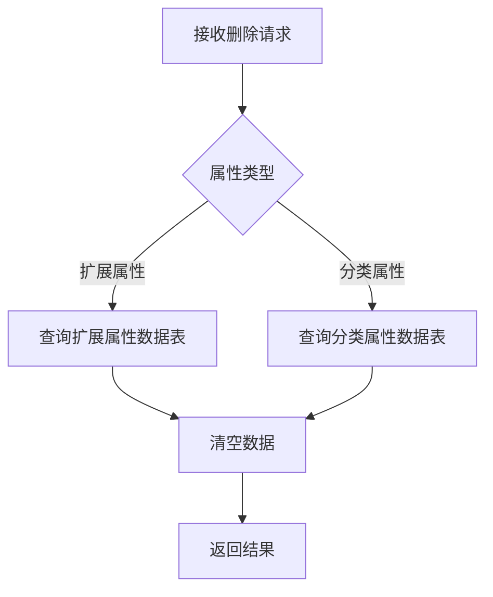
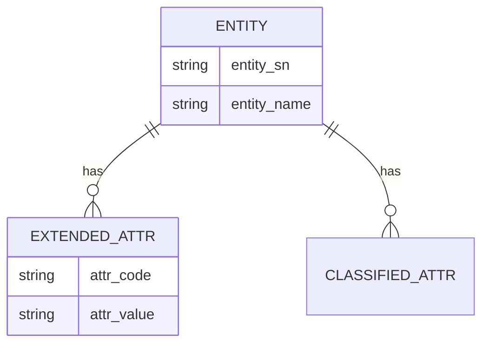
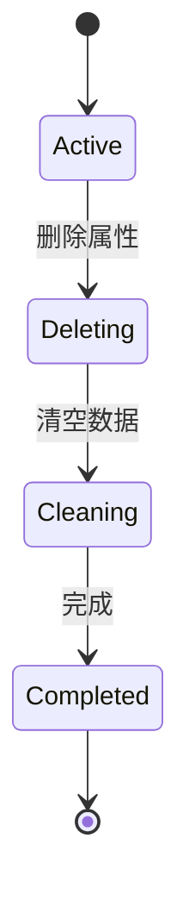

# Markdown 编写指南

## 支持的 Markdown 语法

| 语法 | 写法 | 说明 |
|------|------|------|
| 标题 | `# H1` `## H2` `### H3` | 支持到 H6 |
| 段落 | 普通文本，空行分隔 | - |
| 加粗 | `**粗体**` | - |
| 斜体 | `*斜体*` | - |
| 无序列表 | `- 项目` | 支持嵌套 |
| 有序列表 | `1. 项目` | - |
| 表格 | `\| 列1 \| 列2 \|` | 支持 GFM 表格 |
| 代码块 | ` ```语言 ... ``` ` | 支持语法高亮标记 |
| 链接 | `[文字](URL)` | - |
| 图片 | `` | - |
| 删除线 | `~~删除~~` | GFM 扩展 |
| HTML | 直接内嵌 HTML 标签 | 原样保留到输出 |

## Mermaid 图表

在 Markdown 中使用 ` ```mermaid ` 代码块插入图表。

### 支持的图表类型

| 类型 | 关键字 | 用途 |
|------|--------|------|
| 流程图 | `flowchart` / `graph` | 逻辑分支、处理流程 |
| 时序图 | `sequenceDiagram` | 模块交互、API 调用 |
| 类图 | `classDiagram` | 数据模型设计 |
| 状态图 | `stateDiagram-v2` | 状态流转 |
| ER 图 | `erDiagram` | 实体关系 |
| 甘特图 | `gantt` | 项目排期 |

### 时序图示例

```markdown

```

### 流程图示例

```markdown

```

### ER 图示例

```markdown

```

### 状态图示例

```markdown

```
