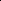

# Adaptive Hyperbolic Kernels: Modulated Embedding in de Branges-Rovnyak Spaces

<!-- Page 1 -->

Adaptive Hyperbolic Kernels: Modulated Embedding in de Branges-Rovnyak Spaces

Leping Si1,2*, Meimei Yang1,2*, Hui Xue1,2†, Shipeng Zhu1,2, Pengfei Fang1,2

1School of Computer Science and Engineering Southeast University, Nanjing 210096, China 2Key Laboratory of New Generation Artificial Intelligence Technology and Its Interdisciplinary Applications (Southeast University), Ministry of Education, China 230248997@seu.edu.cn, meimeiyang01@gmail.com, hxue@seu.edu.cn, shipengzhu@seu.edu.cn, fangpengfei@seu.edu.cn

## Abstract

Hierarchical data pervades diverse machine learning applications, including natural language processing, computer vision, and social network analysis. Hyperbolic space, characterized by its negative curvature, has demonstrated strong potential in such tasks due to its capacity to embed hierarchical structures with minimal distortion. Previous evidence indicates that the hyperbolic representation capacity can be further enhanced through kernel methods. However, existing hyperbolic kernels still suffer from mild geometric distortion or lack adaptability. This paper addresses these issues by introducing a curvature-aware de Branges–Rovnyak space, a reproducing kernel Hilbert space (RKHS) that is isometric to a Poincar´e ball. We design an adjustable multiplier to select the appropriate RKHS corresponding to the hyperbolic space with any curvature adaptively. Building on this foundation, we further construct a family of adaptive hyperbolic kernels, including the novel adaptive hyperbolic radial kernel, whose learnable parameters modulate hyperbolic features in a taskaware manner. Extensive experiments on visual and language benchmarks demonstrate that our proposed kernels outperform existing hyperbolic kernels in modeling hierarchical dependencies.

Code — https://github.com/daslp/De-Branges-Rovnyak-

Kernel.git Extended version — https://doi.org/10.48550/arXiv.2511.09921

## Introduction

Hierarchical structures are prevalent in real-world data across various machine learning domains, such as natural language processing (NLP), computer vision (CV), and social network analysis (Mettes et al. 2024; Peng et al. 2022). Hyperbolic space, owing to its exponential expansion property, provides a more suitable geometric framework for representing such hierarchical data than the commonly used Euclidean space. As illustrated in Figure 1, hyperbolic space allows tree-like data with hierarchical structure to spread out without distortion, whereas embedding tree-like data in Euclidean space often results in crowding and overlap.

*These authors contributed equally. †Corresponding Author Copyright © 2026, Association for the Advancement of Artificial Intelligence (www.aaai.org). All rights reserved.

(a) Euclidean (b) Hyperbolic

**Figure 1.** Embedding of the same tree characterized by identical branching angles and branch lengths (with hierarchical node structure) in Euclidean and hyperbolic spaces. The left figure shows the embedding in Euclidean space, where some branches overlap. The right figure illustrates the embedding in hyperbolic space, where the exponential expansion property enables distortion-free embedding of the tree.

To better capture complex hierarchical structures, hyperbolic geometry has been introduced into machine learning as an alternative to Euclidean geometry. Nickel et al. pioneered hyperbolic embeddings by optimizing them on Riemannian manifolds, demonstrating significant gains in textual data (Nickel and Kiela 2017). Since then, hyperbolic methods have been applied to a wide range of machine learning tasks, such as image classification and graph node prediction, leveraging the strong representational capacity of hyperbolic space (Ganea, B´ecigneul, and Hofmann 2018; Shimizu, Mukuta, and Harada 2021; G¨ulc¸ehre et al. 2018; Chami et al. 2019; Khrulkov et al. 2020; Bdeir, Schwethelm, and Landwehr 2024; Fang et al. 2023).

Recent studies have shown that integrating kernel methods with hyperbolic embeddings can further enhance their representational capacity. Cho et al. introduced the hyperbolic kernel SVM (Cho et al. 2019), which constructs hyperbolic kernels based on an isometric mapping between hyperbolic models. However, these kernels are not positive definite (pd) and assume a fixed curvature value, limiting the stability and flexibility. Fang et al. (Fang, Harandi, and Petersson 2021; Fang et al. 2023) addressed this limitation

The Fortieth AAAI Conference on Artificial Intelligence (AAAI-26)

25437

AI-readable visual equivalent, added: Figure extracted from the paper PDF and converted to an SVG wrapper asset. Use the surrounding page text and caption for interpretation.

<!-- Page 2 -->

by proposing a family of pd hyperbolic kernels with curvature parameters based on the tangent space of Poincar´e ball. But the first-order approximation introduces geometric distortions. Yang et al. (Yang, Fang, and Xue 2023) reduced the distortion by constructing curvature-aware kernels that map data from hyperbolic space to reproducing kernel Hilbert spaces (RKHS) isometrically. Despite their progress, most existing methods still suffer from fixed functional forms, which can lead to over-representation or structural underfitting and then reduce adaptability. Consequently, a key challenge is to design hyperbolic kernels that not only preserve the underlying geometry but also adapt flexibly to taskdriven requirements.

To this end, we first construct a curvature-aware de Branges–Rovnyak space (Ball and Bolotnikov 2014), an RKHS that is isometric to Poincar´e ball, thereby preserving hyperbolic geometry with minimal distortion. Moreover we introduce an adjustable multiplier that allows us to select the appropriate de Branges–Rovnyak space adaptively. Leveraging this mechanism, we further construct a family of adaptive hyperbolic kernels that includes the hyperbolic counterparts of the linear, polynomial, RBF, and Laplacian kernels, along with a distinctive member, the adaptive hyperbolic radial kernel (AHRad). Thanks to the learnable parameters, AHRad can adaptively enhance or suppress hyperbolic features, enabling task-aware modulation of representations. Overall, the framework flexibly controls hyperbolic representations and encodes hierarchical information with minimal distortion across diverse applications.

Our main contributions are summarized as follows: • We construct the curvature-aware de Branges–Rovnyak kernel that realizes an isometric mapping from hyperbolic space with arbitrary curvature to the de Branges–Rovnyak space, thereby providing a rigorous bridge between hyperbolic geometry and RKHS. • We introduce an adjustable multiplier within the curvature-aware de Branges–Rovnyak space, yielding a new formulation of hyperbolic kernels that can adaptively select the RKHS best matched to a hyperbolic space with any given curvature. • We develop a series of adaptive hyperbolic kernels, including hyperbolic linear, polynomial, RBF, and Laplacian kernels, as well as an adaptive hyperbolic radial kernel (AHRad), to enhance both representational power and flexibility. • We validate our approach with extensive experiments on diverse tasks, including zero-shot and few-shot image recognition, as well as semantic textual similarity in NLP (e.g., STS-B), and demonstrate that our adaptive hyperbolic kernels outperform existing methods.

## Related Work

Hyperbolic Kernel Learning Hyperbolic space has shown great potential in modeling hierarchical structures due to its exponential growth property, and kernel methods can further enhance the representational capability of hyperbolic embeddings. Early foundational work introduced hyperbolic embeddings for textual data(Nickel and Kiela 2017) and image (Khrulkov et al. 2020), laying a solid foundation for subsequent hyperbolic kernel learning paradigms.

In 2019, Cho et al. (Cho et al. 2019) first proposed a hyperbolic support vector machine (SVM) equipped with the hyperbolic polynomial kernel, an indefinite kernel defined in the hyperboloid model. Their work demonstrated that the optimization formulation, equipped with the Minkowski inner product in the hyperboloid model, closely resembles Euclidean SVMs. This approach achieved improved classification performance on graph-structured and language data. To address the instability issues caused by indefinite kernels and the limited flexibility arising from a fixed curvature value, Fang et al. proposed various pd hyperbolic kernel functions (Fang, Harandi, and Petersson 2021; Fang et al. 2023). These methods first project hyperbolic data onto the tangent space and then construct hyperbolic kernels by integrating the mapped features into Euclidean kernels. Although these kernels demonstrated strong performance in various computer vision tasks, they still suffer from distortions due to their first-order approximation of hyperbolic geometry. To mitigate such distortions, Yang et al. (Yang, Fang, and Xue 2023) proposed a novel approach inspired by the isometry between hyperbolic spaces and certain RKHSs (Arcozzi et al. 2007). They designed a series of hyperbolic kernels based on this isometry, enhancing hyperbolic representation power and achieving superior performance in graph learning and computer vision tasks.

Notations and Preliminaries Notations

Throughout this paper, we let Rn denote the n-dimensional real vector space, Cn the n-dimensional complex vector space, Bn(c) an open ball of radius 1 √c in Cn, and Dn(c) = (Bn(c), ˆgc) the same ball equipped with the Riemannian metric ˆgc (i.e., the Poincar´e ball model), where the curvature of the corresponding hyperbolic space is −c, c > 0. Moreover, we denote TzDn(c) ⊂Rn as the tangent space at z ∈Dn(c).

Poincar´e Ball Model

Hyperbolic space admits multiple isometric models for representation, among which the most commonly used are the Poincar´e ball model, the Poincar´e half space model, the Klein model, the Lorentz (Hyperboloid) model, and the Hemisphere model (Beltrami 1868; Cannon et al. 1997). The Poincar´e ball model is one of the most widely used models for representing hyperbolic geometry. The n-dimensional Poincar´e ball describes hyperbolic space as a Riemannian manifold equipped with a Riemannian metric ˆgc:

Dn(c) = {z ∈Cn | ∥z∥< 1 √c, c > 0}. (1)

The Riemannian metric is defined by ˆgc(z) = λ2 c(z) · gE, where λc(z) = 1 1−c∥z∥2 is the conformal factor and gE = In is the Euclidean metric. Consequently, the Riemannian metric equips the tangent space with an inner prod-

25438

<!-- Page 3 -->

uct ⟨u, v⟩TzDn(c) = u⊤ˆgc(z)v, ∀u, v ∈TzDn(c) at any point z ∈Dn(c).

We detail several hyperbolic operations based on the M¨obius gyrovector spaces (Ungar 1998, 2008) adopted in this paper as follows.

• Exponential Map at the Origin: The exponential map takes a point v in the tangent space TzDn(c) as a velocity vector and maps it along the geodesic on Dn(c) to a corresponding point. We employ the exponential map to project Euclidean features into hyperbolic space, for which it suffices to consider T0Dn(c):

exp0:T0Dn(c) →Dn(c), v 7→tanh

√c∥v∥ v √c∥v∥, (2)

• M¨obius Self-Mappings and Pseudo-Hyperbolic distance: The Poincar´e ball model possesses its own automorphisms (i.e., the M¨obius self-mappings) and pseudohyperbolic distance. In this work, we introduce a generalized formulation of M¨obius self-mappings defined on Poincar´e balls with arbitrary curvature (Yang, Fang, and Xue 2023). When n = 1, the M¨obius self-mappings are equal to the M¨obius subtraction:

φc zi(zj) = zi −zj 1 −cz∗ i zj

, zi, zj ∈D1(c). (3)

While certain correction terms need to be introduced when n > 1:

φc zi(zj) = zi −P c zi(zj) −sc ziQc zi(zj) 1 −cz∗ i zj

, (4)

where P c zi(zj) = 0 if zi = 0, otherwise z∗ i zj ∥zi∥2 zi. Ad- ditionally, sc zi = p

1 −c∥zi∥2 and Qc zi(zj) = zj − P c zi(zj).

Adaptive Hyperbolic Kernels In this section, we introduce our proposed adaptive hyperbolic kernel framework. We begin by formulating a curvature-aware generalization of the de Branges–Rovnyak space, which serves as the theoretical foundation for our kernel design. Based on this construction, we then present a class of hyperbolic kernels that support curvature flexibility and task-adaptive modulation.

Curvature-aware De Branges-Rovnyak Space We first introduce the de Branges-Rovnyak space, an RKHS defined via a subtractive kernel with a multiplier function (Sautel 2022), and then generalize it to a curvatureaware formulation on Poincar´e balls of arbitrary curvature, enabling adaptive geometric representation. Definition 1. A Hilbert space Hb n on Bn is a de Branges- Rovnyak space if and only if it is the RKHS associated with the following kernel function:

kb(zi, zj) = 1 −b(zi)∗b(zj)

1 −z∗ i zj

, (5)

for some b: Bn →D, z 7→(b1(z), b2(z),..., br(z))⊤and r ∈N ∪{∞}. D denotes an r-dimensional Hilbert space.

To ensure the de Branges-Rovnyak space is well-defined, the kernel kb should be pd (Aronszajn 1950). This condition depends on the choice of the multiplier function b, which must belong to the following multiplier space:

M(H2 n ⊗D, H2 n) = n f: Bn →D fh ∈H2 n

∀h ∈H2 n ⊗D o

,

(6)

where ⊗denotes the tensor product over the complex field and H2 n is the Drury Arveson Hardy space (Drury 1978; Arveson 1998). Here H2 n ⊗D is canonically identified with the vector-valued function space of dimension r with components residing in the Drury Arveson Hardy space. Under this framework, the bounded multiplier f acts on a function h via pointwise multiplication (fh)(z) = Pr i=1 fi(z)hi(z), z ∈Bn, hi ∈H2 n. The following proposition characterizes the condition under which the de Branges-Rovnyak kernel kb remains pd:

Proposition 1. (Sautel 2022) A function b belongs to a multiplier in M(H2 n ⊗D, H2 n) if and only if:

ε2I −b(zi)∗b(zj)

1 −z∗ i zj

⪰0, (7)

for some ε > 0. The infimum of such constants ε is known as the multiplier norm of b, denoted by ∥b∥M(H2 n⊗D,H2 n).

This proposition implies that the kernel kb is pd if and only if the corresponding multiplier function b ∈M(H2 n ⊗ D, H2 n) with ∥b∥M(H2 n⊗D,H2 n) ≤1.

Contractive Space Structure The de Branges-Rovnyak space, using the Drury–Arveson Hardy space H2 n as a bridge, naturally allows an isometric embedding into hyperbolic geometry. Here, the Drury–Arveson Hardy space is the canonical RKHS on the unit ball Bn with reproducing kernel kda(zi, zj) = 1 1−z∗ i zj, and isometric to the Poincar´e ball (Arcozzi et al. 2007; Yang, Fang, and Xue 2023).

Since kb is pd, it follows that the corresponding RKHS Hb n is a subspace of the Drury Arveson Hardy space by the following proposition:

Proposition 2. (Sautel 2022) Given two kernel functions k1 and k2, and their corresponding RKHS H1 and H2, H1 ⊆ H2 if and only if ε2k2 −k1 ⪰0 for some ε > 0.

Setting ε = 1, k1 = kb, and k2 = kda, we obtain kda(zi, zj) −kb(zi, zj) = b(zi)∗b(zj)

1−z∗ j zi =

(b(zi)∗b(zj))kda(zi, zj):= k′(zi, zj) · kda(zi, zj). Since both k′ and kda are pd, kda is also pd by the Schur Product Theorem (Schur 1911), which implies Hb n ⊆H2 n. As a contractive subspace of the Drury Arveson Hardy space, Hb n isometrically embeds into a subspace of the Poincar´e ball, allowing hyperbolic kernels defined on it to map hierarchical data with minimal distortion. Besides, this inherent contraction of the RKHS reduces the scale of hypothesis space and serves as an implicit regularizer, accelerating convergence and improving generalization.

25439

<!-- Page 4 -->

Generalization to Arbitrary Curvature To extend this isometry to Poincar´e balls of any curvature, we introduce the curvature-aware de Branges–Rovnyak kernel:

kb c(zi, zj) = 1 −cb(zi)∗b(zj)

1 −cz∗ i zj zi, zj ∈Dn(c), (8)

where b: Dn(c) →D. This kernel induces a RKHS, namely the curvature-aware de Branges-Rovnyak space denoted by Hb n(c). Under the coordinate rescaling z →√cz, this kernel and its RKHS coincide exactly with the standard Poincar´e ball model at curvature −1 (i.e. c=1), so all positive definiteness and contractive-embedding properties carry over without modification. In this setting, the multiplier norm condition positive definiteness constraint becomes b ∈ M(H2 n(c) ⊗Dn(c), H2 n(c)) with √c∥b∥M(H2 n(c)⊗Dn(c),H2 n(c)) ≤ 1, where H2 n(c) is the RKHS induced by the kernel kda c (zi, zj) = 1 1−cz∗ i zj, en- suring kb c remains a valid kernel. This family of curvature-aware kernels thus provides a seamless way to extend the de Branges–Rovnyak construction to Poincar´e balls of arbitrary curvature, while preserving low-distortion embedding and implicit regularization.

Proposed Hyperbolic Kernels Design of the Multiplier b We modulate the original hyperbolic features via M¨obius self-mappings, enabling the kernel to adaptively enhance or suppress pairwise similarities. Concretely, we define:

b(z) = 1

2 m X i=1 wi φc ai(z) + φc

−ai(z)

= m X i=1 wi

(ca∗ i z)ai −P c ai(z) −sc aiQc ai(z) 1 −(ca∗ i z)2,

(9)

where each weight wi > 0 satisfies P i wi = 1 and ai ∈ Dn(c) are learnable hyperbolic poles. When n = 1, this reduces to:

b(z) = 1 m m X i=1 wi

(ca∗ i z)ai 1 −(ca∗ i z)2. (10)

By the convex combination of M¨obius mappings, the resulting de Branges–Rovnyak kernel:

kb c(zi, zj) = 1 −cb(zi)∗b(zj)

1 −z∗ i zj

(11)

is pd. We clarify its positive definiteness by the following lemma and theorem: Lemma 1. Given ˜b(z) = φc a(z), the kernel k˜b c(zi, zj) = 1−c˜b(zi)∗˜b(zj) 1−cz∗ i zj on Dn(c) is pd for any a ∈Dn(c).

Theorem 1. Given ˆb(z) = Pm i=1 wiφc ai(z), ∀a1,... am ∈ Dn(c) and wi > 0, Pm i=1 wi = 1, the corresponding kernel kˆb c(zi, zj) = 1−cˆb(zi)∗ˆb(zj)

1−cz∗ i zj is always pd for any m ≥1.

Moreover, b satisfies b(0) = 0, b(−z) = −b(z), and kb c(−zi, −zj) = kb c(zi, zj). These symmetry properties preserve the structure of hyperbolic geometry, ensure geometric consistency, and yield stable, interpretable similarity measures. They also constrain the hypothesis space, acting as an implicit regularizer.

Design of Hyperbolic Kernels Following the work of (Yang, Fang, and Xue 2023), we interpret hyperbolic feature similarity as inner products in the de Branges–Rovnyak RKHS. For each data point z, let ˆkb zi ∈Hb n(c) denote the functional in de Branges–Rovnyak space. Then the basic de Branges–Rovnyak kernel is:

kb c(zi, zj) = ⟨ˆkb zi, ˆkb zj⟩= 1 −cb(zi)∗b(zj)

1 −z∗ i zj

. (12)

As in Euclidean kernel design, one may simply replace z by ˆkb zi in standard kernels to obtain four adaptive hyperbolic variants: adaptive hyperbolic linear kernel (AHL): kAHL(zi, zj) = kb c(zi, zj), adaptive hyperbolic polynomial Kernel (AHPoly):

kAHPoly(zi, zj) =

⟨ˆkb zi, ˆkb zj⟩+ b d

, b, d > 0, adaptive hyperbolic RBF kernel (AHRBF):

kAHRBF(zi, zj) = exp

−

∥ˆkb zi−ˆkb zj ∥2

2τ 2

, τ > 0, adaptive hyperbolic Laplacian kernel (AHLap):

kAHLap(zi, zj) = exp

−

∥ˆkb zi−ˆkb zj ∥ τ

, τ > 0.

These kernels are straightforward generalizations, while our main contribution lies in the following adaptive hyperbolic radial kernel (AHRad).

To construct the AHRad, we first define a base kernel as the squared cosine similarity of the normalized representers in the de Branges-Rovnyak space as:

kbase(zi, zj) =

* ˆkb zi ∥ˆkbzi∥

,

ˆkb zj ∥ˆkbzj∥

+

2

(13)

which satisfies 0 ≤kbase(zi, zj) < 1. Subsequently, we can express the AHRad as a nonnegative power series (Jayasumana et al. 2014, 2015):

kAHRad(zi, zj) =

∞ X l=0 αl kbase(zi, zj)

l

+

X l=−1,−2 αlkl(zi, zj),

(14)

where αl ≥0 and P∞ l=−2 αi < ∞. The terms involving k−1 and k−2 are only needed to force exact self-similarity in the infinite expansion and can be dropped in practice since kAHRad(zi, zi) > kAHRad(zi, zj) holds strictly when zi̸ = zj even without these two terms. Moreover, since ∥kbase(zi, zj)∥< 1, the remainder beyond l = K decays geometrically, making this finite expansion both computationally efficient and numerically stable. Therefore, the infinite series can be implemented as:

kAHRad(zi, zj) =

K X l=0 αl kbase(zi, zj)

l. (15)

25440

<!-- Page 5 -->

By construction, kAHRad remains pd. Besides, it aligns with the multi-kernel learning strategy, thus it can accommodate higher-order feature interactions.

## Experiments

We conduct three groups of experiments, including few-shot learning and zero-shot learning on image datasets, and the semantic textual similarity evaluation (STS) task on a text dataset, to demonstrate the superiority of our proposed hyperbolic kernels. The few-shot and zero-shot tasks were run on an NVIDIA RTX 3090 Ti, while the STS task was run on an NVIDIA RTX 4090.

For each task, Euclidean features are first projected onto the Poincar´e ball using the exponential map in Eq. (2) or an alternative mapping (Guo et al. 2022) defined by CLIPβ,ε(x) = βmin n

1, 1−ε √c∥x∥ o x, where ε ∈(0, 1) controls the clipping radius and β is an additional scaling factor.

Few-Shot Learning

Experimental Framework In this section, we consider the task of few-shot image classification, to learn a model capable of rapidly generalizing to novel categories using only a few labeled samples. We adopt Prototypical networks (Snell, Swersky, and Zemel 2017), a classic metric learning-based approach as our backbone, and follow the kernel learning paradigm established by Fang et al. (Fang et al. 2023). Within this framework, we embed our kernel function into the loss function, replacing the original metric.

We compare our proposed kernels against nine hyperbolic kernels, including the Poincar´e Linear kernel (PTang), Poincar´e RBF kernel (PRBF), Poincar´e Laplace kernel (PLap), Poincar´e Binomial kernel (PBin), and Poincar´e Radial kernel (PRad) (Fang et al. 2023), as well as the Curvature-aware Hyperbolic Linear kernel (CHL), Curvature-aware Hyperbolic Polynomial kernel (CHPoly), Curvature-aware Hyperbolic RBF kernel (CHRBF) and Curvature-aware Hyperbolic Laplacian kernel (CHLap) (Yang, Fang, and Xue 2023). We adopt as our baseline a method based on hyperbolic embeddings, where the hyperbolic geodesic distance is used as the similarity metric (Khrulkov et al. 2020).

Datasets and Evaluation We evaluate our kernel functions on two image datasets, CUB (Wah et al. 2011) and mini-ImageNet (Deng et al. 2009), with detailed dataset configurations provided in the supplementary material. We adopt the mean classification accuracy (ACC) as our evaluation metric, and conduct few-shot learning experiments under the settings of 5-way, {1, 5}-shot on both datasets.

Experimental Results According to Table 1, our proposed AHRad achieves the best performance on the mini- ImageNet dataset as well as the 5-way 5-shot task on the CUB dataset. For the 5-way 1-shot task, it ranks just behind the PRad and CHL. These results demonstrate that our kernel exhibits strong competitiveness compared to other kernel functions in few-shot learning. Notably, other adaptive

## Methods

Backbone CUB miniImageNet

5w1s 5w5s 5w1s 5w5s

PTang Conv-4 60.10.3 82.00.2 54.00.2 73.10.2 PRBF Conv-4 61.40.2 82.70.2 54.40.2 73.10.2 PLap Conv-4 62.90.2 81.70.2 53.10.2 71.30.2 PBin Conv-4 62.60.2 83.00.1 53.40.2 72.60.2 PRad Conv-4 65.60.2 82.40.2 53.60.2 72.90.2 CHL Conv-4 65.80.2 82.90.2 53.60.2 72.60.2 CHPoly Conv-4 62.30.2 80.30.2 52.60.2 71.30.2 CHRBF Conv-4 56.70.2 79.90.2 53.50.2 71.90.2 CHLap Conv-4 56.90.2 79.10.2 52.70.2 71.50.2 AHL Conv-4 61.20.2 82.70.1 52.50.2 71.70.2 AHPoly Conv-4 62.00.2 82.20.2 53.80.2 71.70.2 AHRBF Conv-4 60.60.2 82.20.2 52.40.2 72.00.2 AHLap Conv-4 60.90.2 81.60.2 53.00.2 71.50.2 AHRad Conv-4 63.90.2 83.30.2 54.60.2 73.20.2 Baseline Conv-4 59.60.2 78.30.2 52.70.2 71.70.2

**Table 1.** Few-shot learning experimental results. Backbone denotes the backbone feature extraction model adopted. ”CwMs” represents C-way M-shot. The metric is mean classification accuracy (ACC%, ↑). The best result for each dataset and experimental setting is highlighted in bold. Subscripts indicate the 95% confidence interval.

hyperbolic kernels also exhibit comparable or superior performance compared to their corresponding curvature-aware hyperbolic (CH) counterparts, as a reference.

Zero-Shot Learning Experimental Framework We focus on cross-modal zero-shot learning aiming to align semantic and visual modalities on seen classes, and to recognize images from unseen classes during inference (Akata et al. 2015a; Xian et al. 2016). Following the kernel learning paradigm in the work of Fang et al. (Fang et al. 2023), the original Euclidean metric is replaced by our proposed kernels.

We adopt the same comparison methods as those used in the few-shot learning section. Besides, we also adopt additional typical zero-shot learning methods for comparison, including LATEM (Xian et al. 2016), DEVISE (Frome et al. 2013), DEM (Zhang, Xiang, and Gong 2017), ALE (Akata et al. 2015a), SP-AEN (Chen et al. 2018), CRnet (Zhang and Shi 2019) and Kai et al. (Li, Min, and Fu 2019). While the implementation of the baseline follows that of Fang et al. (Fang et al. 2023).

Datasets and Evaluation We validated the zero-shot capability of our kernel function on three image datasets: CUB (Wah et al. 2011), AWA1 (Lampert, Nickisch, and Harmeling 2013), and AWA2 (Akata et al. 2015b). Details of the datasets are also provided in the supplementary material (please refer to the link of extended version). We evaluated the model’s average classification accuracy on both the seen and unseen data, denoted as S and U respectively, to reflect the model’s learning and generalization ability. Additionally,

25441

<!-- Page 6 -->

## Methods

CUB AWA1 AWA2 U S HM U S HM U S HM LATEM 15.2 57.3 24.0 7.3 71.7 13.3 11.5 77.3 20.0 DEVISE 23.8 53.0 32.8 13.4 68.7 22.4 17.1 74.7 27.8 DEM 19.6 57.9 29.2 32.8 84.7 47.3 30.5 86.4 45.1 ALE 23.7 62.8 34.4 16.8 76.1 27.5 14.0 81.8 23.9 SP-AEN 34.7 70.6 46.6 - - - 23.3 90.9 37.1 CRnet 45.5 56.8 50.5 58.1 74.7 65.4 52.6 78.8 63.1 Kai et al. 47.4 47.6 47.5 62.7 77.0 69.1 56.4 81.4 66.7

PTang 40.8 58.1 47.9 52.3 85.2 64.8 37.1 88.5 52.3 PRBF 44.6 57.8 50.3 59.0 84.6 69.5 42.9 89.5 57.9 PLap 46.2 56.1 50.7 60.7 83.5 70.3 54.1 87.1 66.7 PBin 39.8 56.9 46.8 43.7 88.9 58.6 39.8 90.5 55.4 PRad 45.8 57.6 51.0 60.2 86.7 71.1 48.2 90.3 62.8

CHL 43.3 58.3 49.7 51.2 84.7 63.8 44.5 90.8 59.8 CHPoly 41.7 58.9 48.8 51.3 85.4 64.1 42.2 90.9 57.6 CHRBF 45.0 56.7 50.1 56.3 82.7 67.0 45.1 90.1 60.1 CHLap 45.2 56.1 50.1 53.4 88.9 66.7 44.9 90.9 60.1

AHL 46.2 56.1 50.7 55.4 85.3 67.2 49.4 89.4 63.6 AHPoly 49.0 52.8 50.8 58.8 85.3 69.6 46.2 87.6 60.5 AHRBF 44.7 58.3 50.6 59.3 85.2 69.9 48.3 88.6 62.5 AHLap 47.4 55.3 51.0 56.8 82.5 67.3 47.1 86.5 61.0 AHRad 49.0 54.0 51.4 64.9 83.7 73.1 69.3 84.0 75.9

Baseline 18.6 44.6 26.3 29.8 76.4 42.9 25.5 76.4 38.2

**Table 2.** Zero-shot learning experimental results. Backbone denotes the backbone feature extraction model adopted. ”U” and ”S” denote the mean classification accuracy (ACC%, ↑) on the seen and unseen datasets, respectively. ”HM” is the harmonic mean of ”U” and ”S”. The best result for each dataset and experimental setting is highlighted in bold.

we computed the harmonic mean HM of S and U as a comprehensive metric for the model’s overall capability.

Experimental Results Our comparison includes both kernel-based methods—using different kernels within a unified framework—and other few-shot learning approaches that adopt distinct paradigms. As shown in Table 2, AHRad attains the best performance on CUB, AWA1, and AWA2, surpassing the second-best method by 0.4%, 2.0%, and 9.2%, respectively. These results show that our method is at least competitive on CUB and substantially outperforms the second-best approaches on AWA1 and AWA2. Moreover, it consistently yields the highest accuracy on unseen classes, with notable gains over the second-best method, indicating markedly improved generalization. In addition, the other adaptive hyperbolic kernels also achieve comparable or superior performance relative to their curvature-aware counterparts.

Semantic Textual Similarity Evaluation Experimental Framework In this section, we design our experiments on contrastive learning-based semantic textual similarity evaluation. This task requires the model to recognize entailment or contradiction relationships between a

## Methods

Backbone sup

PTang Bert-base-uncased 84.36 PRBF Bert-base-uncased 84.84 PLap Bert-base-uncased 84.63 PBin Bert-base-uncased 84.06 PRad Bert-base-uncased 84.53

CHL Bert-base-uncased 84.70 CHPoly Bert-base-uncased 84.63 CHRBF Bert-base-uncased 83.98 CHLap Bert-base-uncased 84.74

AHL Bert-base-uncased 84.27 AHPoly Bert-base-uncased 84.68 AHRBF Bert-base-uncased 84.33 AHLap Bert-base-uncased 84.48

AHRad Bert-base-uncased 85.16

Baseline Bert-base-uncased 84.24

**Table 3.** Semantic textual similarity evaluation experimental results. Backbone denotes the backbone feature extraction model. ”Sup” indicates experiments conducted under the supervised contrastive learning paradigm. The metric is Spearman’s correlation coefficient (%, ↑). The best result for each dataset and experimental setting is highlighted in bold.

premise sentence and a hypothesis sentence, assigning corresponding similarity scores. Specifically, we employ pretrained BERTbase (Devlin et al. 2019) (uncased) as our base model. Following the SimCSE learning framework (Gao, Yao, and Chen 2021), we perform supervised pre-training and subsequently evaluate it on the semantic textual similarity benchmark (STS-B) task. We also adopt the same comparison methods as those used in the few-shot learning section. Our baseline is the original version of SimCSE, which employs cosine similarity as the metric.

Datasets and Evaluation For the pre-training stage, we adopt the hybrid dataset constructed from MNLI (Williams, Nangia, and Bowman 2018) and SNLI (Bowman et al. 2015); for the evaluation stage, we adopt the STS-B dataset (Cer et al. 2017). Our evaluation metric is the Spearman correlation between the similarity scores computed by the model and the human-annotated ground-truth scores.

Experimental Results The baseline employs cosine similarity over Euclidean features, which is essentially a Euclidean kernel. In comparison, all hyperbolic kernels—except for PBin and CHRBF—consistently outperform the baseline, indicating that hyperbolic space can embed textual data with low distortion. According to table 3, our proposed AHRad achieves the best performance in this experiment, improving the correlation coefficient by 0.92 over the baseline, by 0.32 over the best-performing Poincar´e kernel, and by 0.42 over the best-performing curvatureaware hyperbolic kernel. Notably, according to the original SimCSE results (Gao, Yao, and Chen 2021), upgrading the backbone network to the RoBERTabase model pre-

25442

<!-- Page 7 -->

**Figure 2.** Bar chart visualization of the parameters in Eq. 15, where the x-axis represents the index l of the coefficients, and the y-axis denotes the magnitude of al

trained with a larger-scale corpus leads to an improvement of 1.58 over the baseline, suggesting that our kernel function can, to some extent, enhance the feature representation and serve as a lightweight alternative to larger models. Besides, other adaptive hyperbolic kernels also exhibit comparable or superior performance compared to their corresponding curvature-aware hyperbolic counterparts.

Further Studies

Coefficients Distribution of AHRad

In this section, we conduct zero-shot learning experiments on the CUB dataset and provide a visualization of the linear combination coefficients al of the trained AHRad kernel. The results are presented in Figure 2.

This aims to offer an intuitive understanding of the multikernel learning framework of AHRad. Specifically, we visualize the coefficients al corresponding to the first 50 terms in Equation (15) in our implementation. As shown, the low-order terms with small indices exhibit greater variation in their coefficients, while the high-order terms tend to have more stable coefficients. This indicates that lower-order components play a more significant role in shaping the kernel structure during training.

Kernel Embedding Features

We additionally visualize the features extracted by CHL, AHL, and AHRad on unseen classes (40-49) on AWA2 dataset in zero-shot learning using the t-SNE (Maaten and Hinton 2008) visualization method. We consider two comparative groups: CHL vs. AHL and AHL vs. AHRad. The former comparison illustrates the regularization effect of the de Branges-Rovnyak space, while the latter demonstrates the representational capacity attributed to the multi-kernel learning framework induced by AHRad. In Figure 3, the visual features (point clouds), their corresponding centers (small markers), and the semantic features (large markers) are visualized. Our analysis focuses on the deviation between each class’s visual center and its semantic embedding, which reveals the kernel representation capacity. It can be observed that CHL exhibits the largest overall deviation; AHL reduces

(a) CHL (b) AHL

(c) AHRad

**Figure 3.** Visualization of extracted features (visual and semantic) in the zero-shot learning setting on the AWA2 unseen dataset.

this to some extent, while AHRad achieves a substantially lower deviation than both of them.

## Conclusion

This work proposes a family of adaptive hyperbolic kernels based on the curvature-aware de Branges–Rovnyak spaces. By leveraging isometric embeddings between the Poincar´e ball and these spaces, we effectively reduce the distortion inherent in existing hyperbolic kernels. To further improve adaptability, we incorporate modulation mechanisms that dynamically align the kernels with data geometry. Built upon these foundations, we develop a series of adaptive hyperbolic kernels suitable for different tasks. Extensive experiments on few-shot and zero-shot learning tasks, as well as semantic textual similarity evaluation, demonstrate the superior performance of our proposed method.

## Acknowledgments

This work was supported by the National Natural Science Foundation of China (No. 62476056, T24B2005, 62306070) and the Social Development Science and Technology Project of Jiangsu Province (No. BE2022811). This work was also supported in part by the Southeast University Start-Up Grant for New Faculty under Grant 4009002309. Furthermore, the work was also supported by the Big Data Computing Center of Southeast University. This work was also supported by “the Fundamental Research Funds for the Central Universities(2242025K30024)”.

25443

AI-readable visual equivalent, added: Figure extracted from the paper PDF and converted to an SVG wrapper asset. Use the surrounding page text and caption for interpretation.

AI-readable visual equivalent, added: Figure extracted from the paper PDF and converted to an SVG wrapper asset. Use the surrounding page text and caption for interpretation.

AI-readable visual equivalent, added: Figure extracted from the paper PDF and converted to an SVG wrapper asset. Use the surrounding page text and caption for interpretation.

AI-readable visual equivalent, added: Figure extracted from the paper PDF and converted to an SVG wrapper asset. Use the surrounding page text and caption for interpretation.

AI-readable visual equivalent, added: Figure extracted from the paper PDF and converted to an SVG wrapper asset. Use the surrounding page text and caption for interpretation.

AI-readable visual equivalent, added: Figure extracted from the paper PDF and converted to an SVG wrapper asset. Use the surrounding page text and caption for interpretation.

<!-- Page 8 -->

## References

Akata, Z.; Perronnin, F.; Harchaoui, Z.; and Schmid, C. 2015a. Label-embedding for image classification. IEEE transactions on pattern analysis and machine intelligence, 38(7): 1425–1438. Akata, Z.; Perronnin, F.; Harchaoui, Z.; and Schmid, C. 2015b. Label-Embedding for Image Classification. IEEE Transactions on Pattern Analysis and Machine Intelligence, 1425–1438. Arcozzi, N.; Rochberg, R.; Sawyer, E.; et al. 2007. The diameter space, a restriction of the Drury-Arveson-Hardy space. Contemporary Mathematics, 435: 21–42. Aronszajn, N. 1950. Theory of reproducing kernels. Transactions of the American mathematical society, 68(3): 337– 404. Arveson, W. 1998. Subalgebras ofC*-algebras III: Multivariable operator theory. Acta Mathematica, 181(2): 159– 228. Ball, J. A.; and Bolotnikov, V. 2014. de Branges-Rovnyak spaces: basics and theory. arXiv preprint arXiv:1405.2980. Bdeir, A.; Schwethelm, K.; and Landwehr, N. 2024. Fully Hyperbolic Convolutional Neural Networks for Computer Vision. In The Twelfth International Conference on Learning Representations, ICLR 2024, Vienna, Austria, May 7-11, 2024. OpenReview.net. Beltrami, E. 1868. Teoria fondamentale degli spazii di curvatura costante memoria. F. Zanetti. Bowman, S. R.; Angeli, G.; Potts, C.; and Manning, C. D. 2015. A large annotated corpus for learning natural language inference. In M`arquez, L.; Callison-Burch, C.; Su, J.; Pighin, D.; and Marton, Y., eds., Proceedings of the 2015 Conference on Empirical Methods in Natural Language Processing, EMNLP 2015, Lisbon, Portugal, September 17-21, 2015, 632–642. The Association for Computational Linguistics. Cannon, J. W.; Floyd, W. J.; Kenyon, R.; Parry, W. R.; et al. 1997. Hyperbolic geometry. Flavors of geometry, 31(59- 115): 2. Cer, D. M.; Diab, M. T.; Agirre, E.; Lopez-Gazpio, I.; and Specia, L. 2017. SemEval-2017 Task 1: Semantic Textual Similarity Multilingual and Crosslingual Focused Evaluation. In Bethard, S.; Carpuat, M.; Apidianaki, M.; Mohammad, S. M.; Cer, D. M.; and Jurgens, D., eds., Proceedings of the 11th International Workshop on Semantic Evaluation, SemEval@ACL 2017, Vancouver, Canada, August 3-4, 2017, 1–14. Association for Computational Linguistics. Chami, I.; Ying, Z.; R´e, C.; and Leskovec, J. 2019. Hyperbolic Graph Convolutional Neural Networks. In Wallach, H. M.; Larochelle, H.; Beygelzimer, A.; d’Alch´e-Buc, F.; Fox, E. B.; and Garnett, R., eds., Advances in Neural Information Processing Systems 32: Annual Conference on Neural Information Processing Systems 2019, NeurIPS 2019, December 8-14, 2019, Vancouver, BC, Canada, 4869–4880. Chen, L.; Zhang, H.; Xiao, J.; Liu, W.; and Chang, S.- F. 2018. Zero-Shot Visual Recognition Using Semantics- Preserving Adversarial Embedding Networks. In Proceed- ings of the IEEE Conference on Computer Vision and Pattern Recognition, 1043–1052.

Cho, H.; Demeo, B.; Peng, J.; and Berger, B. 2019. Large- Margin Classification in Hyperbolic Space. In Chaudhuri, K.; and Sugiyama, M., eds., The 22nd International Conference on Artificial Intelligence and Statistics, AISTATS 2019, 16-18 April 2019, Naha, Okinawa, Japan, volume 89 of Proceedings of Machine Learning Research, 1832–1840. PMLR.

Deng, J.; Dong, W.; Socher, R.; Li, L.-J.; Li, K.; and Fei- Fei, L. 2009. Imagenet: A large-scale hierarchical image database. In 2009 IEEE conference on computer vision and pattern recognition, 248–255. Ieee.

Devlin, J.; Chang, M.-W.; Lee, K.; and Toutanova, K. 2019. Bert: Pre-training of deep bidirectional transformers for language understanding. In Proceedings of the 2019 conference of the North American chapter of the association for computational linguistics: human language technologies, volume 1 (long and short papers), 4171–4186.

Drury, S. W. 1978. A generalization of von Neumann’s inequality to the complex ball. Proceedings of the American Mathematical Society, 68(3): 300–304.

Fang, P.; Harandi, M.; Lan, Z.; and Petersson, L. 2023. Poincar´e Kernels for Hyperbolic Representations. Int. J. Comput. Vis., 131(11): 2770–2792.

Fang, P.; Harandi, M.; and Petersson, L. 2021. Kernel Methods in Hyperbolic Spaces. In 2021 IEEE/CVF International Conference on Computer Vision, ICCV 2021, Montreal, QC, Canada, October 10-17, 2021, 10645–10654. IEEE.

Frome, A.; Corrado, G. S.; Shlens, J.; Bengio, S.; Dean, J.; Ranzato, M.; and Mikolov, T. 2013. DeViSE: A Deep Visual-Semantic Embedding Model. In Advances in Neural Information Processing Systems, 2121–2129.

Ganea, O.; B´ecigneul, G.; and Hofmann, T. 2018. Hyperbolic Neural Networks. In Bengio, S.; Wallach, H. M.; Larochelle, H.; Grauman, K.; Cesa-Bianchi, N.; and Garnett, R., eds., Advances in Neural Information Processing Systems 31: Annual Conference on Neural Information Processing Systems 2018, NeurIPS 2018, December 3-8, 2018, Montr´eal, Canada, 5350–5360.

Gao, T.; Yao, X.; and Chen, D. 2021. SimCSE: Simple Contrastive Learning of Sentence Embeddings. In Moens, M.; Huang, X.; Specia, L.; and Yih, S. W., eds., Proceedings of the 2021 Conference on Empirical Methods in Natural Language Processing, EMNLP 2021, Virtual Event / Punta Cana, Dominican Republic, 7-11 November, 2021, 6894– 6910. Association for Computational Linguistics.

G¨ulc¸ehre, C¸.; Denil, M.; Malinowski, M.; Razavi, A.; Pascanu, R.; Hermann, K. M.; Battaglia, P. W.; Bapst, V.; Raposo, D.; Santoro, A.; and de Freitas, N. 2018. Hyperbolic Attention Networks. CoRR, abs/1805.09786.

Guo, Y.; Wang, X.; Chen, Y.; and Yu, S. X. 2022. Clipped hyperbolic classifiers are super-hyperbolic classifiers. In Proceedings of the IEEE/CVF Conference on Computer Vision and Pattern Recognition, 11–20.

25444

<!-- Page 9 -->

Jayasumana, S.; Hartley, R.; Salzmann, M.; Li, H.; and Harandi, M. 2014. Optimizing over radial kernels on compact manifolds. In Basri, R.; Fermuller, C.; Martinez, A.; and Vidal, R., eds., Proceedings - 2014 IEEE Conference on Computer Vision and Pattern Recognition, Proceedings of the IEEE Computer Society Conference on Computer Vision and Pattern Recognition, 3802–3809. United States of America: IEEE, Institute of Electrical and Electronics Engineers. IEEE Conference on Computer Vision and Pattern Recognition 2014, CVPR 2014; Conference date: 23-06- 2014 Through 28-06-2014. Jayasumana, S.; Hartley, R. I.; Salzmann, M.; Li, H.; and Harandi, M. T. 2015. Kernel Methods on Riemannian Manifolds with Gaussian RBF Kernels. IEEE Trans. Pattern Anal. Mach. Intell., 37(12): 2464–2477. Khrulkov, V.; Mirvakhabova, L.; Ustinova, E.; Oseledets, I. V.; and Lempitsky, V. S. 2020. Hyperbolic Image Embeddings. In 2020 IEEE/CVF Conference on Computer Vision and Pattern Recognition, CVPR 2020, Seattle, WA, USA, June 13-19, 2020, 6417–6427. Computer Vision Foundation / IEEE. Lampert, C. H.; Nickisch, H.; and Harmeling, S. 2013. Attribute-based classification for zero-shot visual object categorization. IEEE Transactions on Pattern Analysis and Machine Intelligence, 36(3): 453–465. Li, K.; Min, M. R.; and Fu, Y. 2019. Rethinking zero-shot learning: A conditional visual classification perspective. In Proceedings of the IEEE International Conference on Computer Vision, 3583–3592. Maaten, L. v. d.; and Hinton, G. 2008. Visualizing data using t-SNE. Journal of machine learning research, 9(Nov): 2579–2605. Mettes, P.; Ghadimi Atigh, M.; Keller-Ressel, M.; Gu, J.; and Yeung, S. 2024. Hyperbolic Deep Learning in Computer Vision: A Survey. International Journal of Computer Vision, 132(9): 3484–3508. Nickel, M.; and Kiela, D. 2017. Poincar´e Embeddings for Learning Hierarchical Representations. In Guyon, I.; von Luxburg, U.; Bengio, S.; Wallach, H. M.; Fergus, R.; Vishwanathan, S. V. N.; and Garnett, R., eds., Advances in Neural Information Processing Systems 30: Annual Conference on Neural Information Processing Systems 2017, December 4-9, 2017, Long Beach, CA, USA, 6338–6347. Peng, W.; Varanka, T.; Mostafa, A.; Shi, H.; and Zhao, G. 2022. Hyperbolic Deep Neural Networks: A Survey. IEEE Trans. Pattern Anal. Mach. Intell., 44(12): 10023–10044. Sautel, J. G. 2022. Some Results About Reproducing Kernel Hilbert Spaces of Certain Structure. https://trace.tennessee. edu/utk graddiss/7144. Schur, J. 1911. Bemerkungen zur Theorie der beschr¨ankten Bilinearformen mit unendlich vielen Ver¨anderlichen. Journal f¨ur die reine und angewandte Mathematik, 140: 1–28. Shimizu, R.; Mukuta, Y.; and Harada, T. 2021. Hyperbolic Neural Networks++. In 9th International Conference on Learning Representations, ICLR 2021, Virtual Event, Austria, May 3-7, 2021. OpenReview.net.

Snell, J.; Swersky, K.; and Zemel, R. 2017. Prototypical networks for few-shot learning. Advances in neural information processing systems, 30. Ungar, A. A. 1998. From Pythagoras to Einstein: the hyperbolic Pythagorean theorem. Foundations of physics, 28(8): 1283–1321. Ungar, A. A. 2008. Analytic hyperbolic geometry and Albert Einstein’s special theory of relativity. World Scientific. Wah, C.; Branson, S.; Welinder, P.; Perona, P.; and Belongie, S. 2011. The Caltech-UCSD Birds-200-2011 Dataset. Technical Report CNS-TR-2010-001, California Institute of Technology. Williams, A.; Nangia, N.; and Bowman, S. R. 2018. A Broad-Coverage Challenge Corpus for Sentence Understanding through Inference. In Walker, M. A.; Ji, H.; and Stent, A., eds., Proceedings of the 2018 Conference of the North American Chapter of the Association for Computational Linguistics: Human Language Technologies, NAACL- HLT 2018, New Orleans, Louisiana, USA, June 1-6, 2018, Volume 1 (Long Papers), 1112–1122. Association for Computational Linguistics. Xian, Y.; Akata, Z.; Sharma, G.; Nguyen, Q.; Hein, M.; and Schiele, B. 2016. Latent embeddings for zero-shot classification. In Proceedings of the IEEE conference on computer vision and pattern recognition, 69–77. Yang, M.; Fang, P.; and Xue, H. 2023. Expanding the Hyperbolic Kernels: A Curvature-aware Isometric Embedding View. In Proceedings of the Thirty-Second International Joint Conference on Artificial Intelligence, IJCAI 2023, 19th-25th August 2023, Macao, SAR, China, 4469– 4477. ijcai.org. Zhang, F.; and Shi, G. 2019. Co-representation network for generalized zero-shot learning. In Proceedings of the International Conference on Machine Learning, 7434–7443. Zhang, L.; Xiang, T.; and Gong, S. 2017. Learning a deep embedding model for zero-shot learning. In Proceedings of the IEEE Conference on Computer Vision and Pattern Recognition, 2021–2030.

25445
