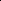
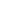

# AEDR: Training-Free AI-Generated Image Attribution via Autoencoder Double-Reconstruction

<!-- Page 1 -->

AEDR: Training-Free AI-Generated Image Attribution via Autoencoder Double-Reconstruction

Chao Wang1,*, Zijin Yang1, Yaofei Wang2, Weiming Zhang1, Kejiang Chen1,†

1Anhui Province Key Laboratory of Digital Security, University of Science and Technology of China 2Hefei University of Technology chaowang0708@mail.ustc.edu.cn, bsmhmmlf@mail.ustc.edu.cn, wyf@hfut.edu.cn, zhangwm@ustc.edu.cn, chenkj@ustc.edu.cn

## Abstract

The rapid advancement of image-generation technologies has made it possible for anyone to create photorealistic images using generative models, raising significant security concerns. To mitigate malicious use, tracing the origin of such images is essential. Reconstruction-based attribution methods offer a promising solution, but they often suffer from reduced accuracy and high computational costs when applied to state-of-the-art (SOTA) models. To address these challenges, we propose AEDR (AutoEncoder Double-Reconstruction), a novel training-free attribution method designed for generative models with continuous autoencoders. Unlike existing reconstruction-based approaches that rely on the value of a single reconstruction loss, AEDR performs two consecutive reconstructions using the model’s autoencoder, and adopts the ratio of these two reconstruction losses as the attribution signal. This signal is further calibrated using the image homogeneity metric to improve accuracy, which inherently cancels out absolute biases caused by image complexity, with autoencoder-based reconstruction ensuring superior computational efficiency. Experiments on eight top latent diffusion models show that AEDR achieves 25.5% higher attribution accuracy than existing reconstruction-based methods, while requiring only 1% of the computational time.

Code — https://github.com/wangchao0708/AEDR

## Introduction

Latent diffusion models (Podell et al. 2023; Batifol et al. 2025; Rombach et al. 2022; Razzhigaev et al. 2023) have emerged as the dominant paradigm in image generation due to their exceptional capabilities in producing high-resolution and photorealistic content. Their effectiveness in modeling complex data distributions has facilitated numerous applications across diverse fields, such as digital art, advertising, and virtual reality (Dhariwal and Nichol 2021). Recent models such as Stable Diffusion 3.5 (Esser et al. 2024) and FLUX.1-dev enable rapid and controllable image synthesis, supporting a wide range of real-world applications.

While the powerful capabilities of AI-generated images are widely embraced, concerns about potential misuse are

*Work partially done during the internship at iFLYTEK. †Coresponding author. Copyright © 2026, Association for the Advancement of Artificial Intelligence (www.aaai.org). All rights reserved.

0.000 0.001 0.002 0.003 L(x∗, x) 0.0

0.5

1.0

Relative Frequency

Belonging Images (SD2base)

Non-Belonging Images (FLUX)

(a) Gradient-based reconstruction using SD2base (∼10−4).

0.00000 0.00005 0.00010 0.00015 0.00020 L(x∗, x)

0.0

0.1

0.2

Relative Frequency

Belonging Images (FLUX)

Non-Belonging Images (SD2base)

(b) Gradient-based reconstruction using FLUX (∼10−5).

**Figure 1.** Gradient-based reconstruction methods exhibit different loss distributions. These differences lead to attribution failures on the latest model, such as FLUX.

growing (Carlini et al. 2023; Chen et al. 2020; Ong et al. 2021; Zhao et al. 2021). For instance, unscrupulous vendors may repurpose outputs from third-party models as their own, falsely promoting model performance and thereby misleading consumers while undermining fair market competition. Furthermore, malicious actors can present outputs from commercial models (Betker et al. 2023) as original creations to gain reputational and financial advantages, flagrantly violating the intellectual property rights of model developers (Li et al. 2024). Therefore, reliable image origin attribution has become indispensable for accurately identifying the responsible entities behind such generated content.

Existing image attribution methods generally fall into three primary categories. Watermark-based methods (Luo et al. 2009; Swanson, Zhu, and Tewfik 1996; Wen et al. 2023; Yang et al. 2024, 2025) embed invisible or semivisible marks during image generation, enabling attribution through watermark detection. Fingerprint-based methods (Ding, Thakur, and Li 2021; Yu et al. 2020, 2021) intro-

The Fortieth AAAI Conference on Artificial Intelligence (AAAI-26)

<!-- Page 2 -->

0.000 0.001 0.002 0.003 0.004 0.005 L(x∗, x)

0.0

0.2

0.4

Relative Frequency

Belonging Images (FLUX) Non-Belonging Images (SD2base)

(a) Distribution of the first loss.

0.000 0.001 0.002 0.003 0.004 0.005 L(x∗∗, x∗)

0.0

0.2

0.4

Relative Frequency

Belonging Images (FLUX) Non-Belonging Images (SD2base)

(b) Distribution of the second loss.

1 3 4 5 6 7 8 9 L(x∗, x) / L(x∗∗, x∗)

0.0

0.2

0.4

Relative Frequency

Belonging Images (FLUX) Non-Belonging Images (SD2base)

(c) Distribution of the loss ratio.

**Figure 2.** Autoencoder-based double-reconstruction loss variation and loss ratio.

duce model-specific signatures during training or by modifying the architecture, and rely on supervised classifiers to detect these fingerprints in generated images. However, some of these methods may degrade the visual quality of the generated images due to additional operations during training or inference. In contrast, passive detection approaches, which do not require modifications to the training process of target models, are more practical and acceptable in real-world applications. Among these, reconstruction-based methods (Wang et al. 2023, 2024) have achieved excellent performance. They use gradient information from the generative model to reconstruct the input image, with the reconstruction loss between the original and reconstructed images serving as the attribution signal. These methods do not modify model parameters or the generation pipeline, and thus preserve generative performance, making them one of the most promising approaches for image attribution.

Existing gradient-based reconstruction methods typically follow this observation: images that belong to the target model generally exhibit lower reconstruction losses than non-belonging images (see Figure 1a). Thus, the two types of images can be distinguished based on a single reconstruction loss value. However, with increasingly powerful generative models such as FLUX (Batifol et al. 2025), these methods (Wang et al. 2023, 2024) tend to produce extremely low reconstruction losses for both belonging and non-belonging images, causing significant overlap in the loss distributions and thereby reducing attribution accuracy (see Figure 1b). Moreover, the gradient-guided reconstruction process is computationally expensive and complex, making these methods impractical for real-world applications.

To address these limitations, we prefer to adopt autoencoder-based reconstruction as the foundation for an efficient attribution. However, using reconstruction loss directly is susceptible to the inherent complexity of the input image (Choi et al. 2024; Ricker, Lukovnikov, and Fischer 2024): Images with simple textures naturally have lower reconstruction loss, while those with complex textures correspondingly have higher reconstruction loss (Further details are provided in Sections 2 and 3 of the Technical Appendix). To mitigate this bias introduced by image complexity, we propose an attribution method based on the loss ratio across double-reconstructions by the autoencoder. The key insight is that the autoencoder has learned to capture representative features of samples from the training distribution. As illustrated in Figure 2a and Figure 2b, we observe that when the autoencoder reconstructs a belonging image twice, the resulting reconstruction losses are nearly identical, since the image lies within the model’s distribution. In contrast, for the non-belonging image, which initially lies outside the model distribution, the first reconstruction effectively projects it into the distribution, leading to a noticeably lower loss in the second reconstruction. Given the pronounced disparity, if we compute the ratio of the first to the second reconstruction loss, the value tends to be close to 1 for belonging images, but significantly greater than 1 for non-belonging images (see Figure 2c).

Motivated by this insight, we propose an image attribution method based on AutoEncoder Double-Reconstruction, namely AEDR. Unlike existing gradient-guided approaches that utilize single reconstruction loss, AEDR employs the loss ratio from double reconstructions, calibrated by an image homogeneity metric. This approach mitigates discrepancies arising from image texture complexity. Additionally, we implement a Kernel Density Estimation method (Kim and Scott 2012) for adaptive threshold selection, which assumes no prior knowledge of underlying data distributions, thereby enhancing the adaptability across diverse generative models.Our contributions are summarized as follows:

• We reveal that existing reconstruction-based image attribution methods, which rely on the single reconstruction loss, face significant challenges when applied to SOTA generative models. We identify a key discrepancy: under autoencoder-based double-reconstruction, belonging images show significantly higher latent feature consistency across reconstructions than non-belonging ones. • We propose AEDR, an training-free passive attribution method that leverages the ratio of losses from two successive reconstructions and calibrates it based on image homogeneity. AEDR performs direct reconstruction using the model’s autoencoder, eliminating the need for gradient-based optimization or additional training. • Extensive experiments on eight SOTA or widely used generative models demonstrate that AEDR improves the attribution accuracy by an average of 25.5% and reduces the attribution time to just 1% of the best baseline.

## Related Work

Image Generative Models. Early frameworks like Generative Adversarial Networks (GANs) (Goodfellow et al. 2014), Variational Autoencoders (VAEs) (Kingma and

<!-- Page 3 -->

Welling 2014), and autoregressive methods such as PixelCNN (Van Den Oord, Kalchbrenner, and Kavukcuoglu 2016) laid the groundwork for realistic image synthesis. However, diffusion models have recently become the leading approach. Denoising Diffusion Probabilistic Models (DDPMs) (Ho, Jain, and Abbeel 2020) achieve remarkable image fidelity by iteratively adding and reversing Gaussian noise, using simplified objectives and U-Net architectures. Building on this, Latent Diffusion Models (LDMs) improved efficiency by processing diffusion within a compact latent space, enabling rapid, high-resolution image generation with significantly lower computational requirements.

Detection of AI-Generated Images. As generative images grow increasingly photorealistic, the need for reliable detection is increasing (Chen, Fu, and Lyu 2023). Early work by Marra combined CycleGAN with steganalysis to identify GAN-generated images, laying a foundation for this field. Most existing methods frame the task as a binary classification problem, distinguishing between real and generated images. These approaches often rely on discriminative texture features (Chen and Yashtini 2024; Konstantinidou, Koutlis, and Papadopoulos 2025; Li et al. 2025) or frequency domain signals (Frank et al. 2020; Dong, Kumar, and Liu 2022; Corvi et al. 2023) as core detection cues. Recent approaches such as AEROBLADE (Ricker, Lukovnikov, and Fischer 2024) and HFI (Choi et al. 2024) adopt reconstruction losses via autoencoders and use LPIPS as a detection metric. Although these methods demonstrate promising performance in generative image detection, they do not address the more challenging task of origin attribution.

Origin Attribution of Generated Images. Current methods for attributing the origin of generated images can be broadly classified into three types: watermark-based methods (Swanson, Zhu, and Tewfik 1996; Wen et al. 2023; Yang et al. 2024, 2025), fingerprint-based methods (Ding, Thakur, and Li 2021; Yu, Davis, and Fritz 2019; Yu et al. 2020, 2021), and reconstruction-based methods (Wang et al. 2023, 2024). Watermark-based methods embed model-specific information into the generated image and retrieve this information during detection to identify the origin. Fingerprintbased methods inject unique patterns into the model during training and rely on dedicated classifiers for attribution. However, both active attribution approaches require additional intervention during image generation or model training and may compromise the quality of the generated images. In contrast, reconstruction-based passive methods enable origin attribution without the need for any extra operations. For example, both RONAN (Wang et al. 2023) and LatentTracer (Wang et al. 2024) adopt gradient-based reconstruction approaches, using the loss between the reconstructed and original images as the attribution signal.

## Method

This section provides a detailed description of AEDR, the passive attribution method proposed in this paper. The process begins with two independent reconstructions of the input image using an autoencoder. The ratio of their reconstruction losses is then computed. To improve robustness, this ratio is further calibrated using an image homogeneity metric, yielding the final attribution signal. The attribution outcome is determined by comparing this signal against a predefined threshold. The overall structure of the AEDR framework is depicted in Figure 3.

## 3.1 Problem Statement and Threat Models

We begin by formalizing the key concepts related to the attribution task, followed by the definition of the attribution goal and the specification of the threat model.

Belonging vs. Non-Belonging Image. Given an image generative model M: I →XM, where I is the input space and XM ⊂X denotes the subset of images produced by M, with X representing the full image space. A test image x is classified as a belonging image if and only if x ∈XM; if x /∈XM, it is classified as a non-belonging image.

Attribution Goal. The goal of the auditor is to determine whether a given image x was generated by the target model M, without modifying the training or inference process of M, and without applying any post-processing to its outputs. This is formulated as a binary function F: {M, x} → {0, 1}, where F(M, x) = 0 indicates that x is attributed to M, and F(M, x) = 1 indicates a non-belonging image.

Threat Model. We assume a white-box setting in which the auditor has access only to the autoencoder R associated with the model M. Specifically, the auditor can query both the encoder and decoder for image reconstruction, but does not have access to model gradients, training data, or internal parameters of M. This is in contrast to prior work, which require full white-box access, including gradient computation. By relying solely on reconstruction queries, AEDR is more practical for deployment in restricted-access scenarios.

## 3.2 Double-Reconstruction via Autoencoder The specific workflow is as follows:

Given the autoencoder R of the target model M and a test image x, we perform two successive reconstructions. The two reconstruction steps are respectively defined in Equations (1) and (2).

x∗= R(x) = D(E(x)), L1 = L(x∗, x). (1) x∗∗= R(x∗) = D(E(x∗)), L2 = L(x∗∗, x∗). (2) Here, x∗and x∗∗denote the reconstructed images obtained from the first and second passes through the autoencoder R. The corresponding reconstruction losses are denoted by L1 and L2, both computed using mean squared error (MSE). The advantage of using MSE is demonstrated in Experiment 4.5. AEDR focuses on analyzing the trend of variation in reconstruction losses for the test image x during the double-reconstruction process. Specifically, we define an uncalibrated attribution signal t as the ratio between the first and second reconstruction losses, formally given by:

t = L1

L2

= L(x∗, x) L(x∗∗, x∗). (3)

## 3.3 Calibration Mechanism

The inherent visual complexity of an image can significantly affect its reconstruction loss. Images with homogeneous backgrounds and low texture variation typically exhibit minimal differences in double-reconstruction losses.

<!-- Page 4 -->

Loss-1

Loss-1 Loss-2

Loss-2

Loss-1 = 0.0035

Loss-2 = 0.0027

Loss-1 = 0.0082

Loss-2 = 0.0025

Origin Images (x) First Reconstruction First Recon-Image (x*) Second Reconstruction Second Recon-Image (x**) Loss Ratio (t)

: Belonging Image: Non-Belonging Image: Origin Image Feature: First Recon-Image Feature: Second Recon-Image Feature

Double-Reconstruction Detailed Process

: VAE Feature Distribution

Double-Reconstruction Sample Images

Calibration KDE Threshold Estimation for the Target Model (Offline)

Double-Reconstruction Test Image

Calibration Origin Attribution

Yes

No

Example Cases of Origin Attribution (Online)

Belonging

Non-Belonging t t t = 3.28 t = 1.30

: Encoded Feature Distribution (Belonging): Encoded Feature Distribution (Non-Belonging)

**Figure 3.** The framework of AEDR. Our method consists of three key modules: double-reconstruction based on autoencoder (Section 3.2), calibration mechanism (Section 3.3), and threshold determination via kernel density estimation (Section 3.4). AEDR employs the ratio of double-reconstruction losses, calibrated by an image homogeneity metric, as the attribution signal. The decision threshold is determined via kernel density estimation and applied for origin attribution.

In contrast, images containing complex textures or dynamic backgrounds often lead to substantial fluctuations in these losses (error examples see Technical Appendix, Section 6). To address this intrinsic bias, we introduce a homogeneityaware loss calibration mechanism, defined as:

H = ℓ−1 X i=0 ℓ−1 X j=0

P(i, j) 1 + |i −j|, (4)

where P(i, j) denotes the co-occurrence probability of grayscale levels i and j at a specified orientation and offset. The parameter ℓrepresents the total number of grayscale levels (default value of 32 to ensure computational efficiency), and |i −j| indicates the absolute difference in intensity between the corresponding pixel pairs. Based on this, the calibrated attribution signal is defined as follows:

t′ = t × H = L1 × H

L2

. (5)

The calibrated metric t′ effectively mitigates the intrinsic complexity bias in attribution assessment, thereby enhancing the overall attribution accuracy of AEDR.

## 3.4 Threshold Determination

Experimental results show that the calibrated attribution signal t′ does not follow a consistent or well-defined probability distribution across different models (see Technical Appendix, Section 5), and may contain a small number of outliers. To address this, we adopt kernel density estimation (KDE) (Kim and Scott 2012), a non-parametric method that makes no assumptions about the underlying distribution and is inherently robust to outliers. The attribution threshold is then derived from the cumulative distribution function (CDF) estimated via KDE, as defined by:

τ = inf n u

Z u

−∞

## 1 N h

N X i=1

K y −t′ i h dy ≥1 −α o

,

(6) where N (set to 500 in our experiments) denotes the number of samples. Specifically, we estimate the distribution using 500 calibrated attribution signals obtained from belonging images. The parameter h represents the bandwidth of the kernel density estimation (Ruckthongsook et al. 2018), and K is the kernel function, for which a Gaussian kernel is used. The variable t′ i denotes the calibrated attribution signal of the i-th image. The quantity 1 −α specifies the target cumulative probability for threshold selection. If the calibrated attribution signal t′ < τ, the x is classified as a belonging image; otherwise, it is considered a non-belonging image.

## Experiments

and Results

We begin by describing the experimental setup. Next, we assess the effectiveness and efficiency of AEDR in comparison to existing reconstruction-based passive attribution methods, specifically RONAN (Wang et al. 2023) and La-

AI-readable visual equivalent, added: Figure extracted from the paper PDF and converted to an SVG wrapper asset. Use the surrounding page text and caption for interpretation.

AI-readable visual equivalent, added: Figure extracted from the paper PDF and converted to an SVG wrapper asset. Use the surrounding page text and caption for interpretation.

AI-readable visual equivalent, added: Figure extracted from the paper PDF and converted to an SVG wrapper asset. Use the surrounding page text and caption for interpretation.

AI-readable visual equivalent, added: Figure extracted from the paper PDF and converted to an SVG wrapper asset. Use the surrounding page text and caption for interpretation.

AI-readable visual equivalent, added: Figure extracted from the paper PDF and converted to an SVG wrapper asset. Use the surrounding page text and caption for interpretation.

AI-readable visual equivalent, added: Figure extracted from the paper PDF and converted to an SVG wrapper asset. Use the surrounding page text and caption for interpretation.

AI-readable visual equivalent, added: Figure extracted from the paper PDF and converted to an SVG wrapper asset. Use the surrounding page text and caption for interpretation.

AI-readable visual equivalent, added: Figure extracted from the paper PDF and converted to an SVG wrapper asset. Use the surrounding page text and caption for interpretation.

<!-- Page 5 -->

M1 M2

RONAN LatentTracer AEDR

TP FP FN TN Acc TP FP FN TN Acc TP FP FN TN Acc

SD1.5

SD2.1 476 475 24 25 50.1% 475 62 25 438 91.3% 493 13 7 487 98.0% SD2base 476 492 24 8 48.4% 475 415 25 459 93.4% 493 13 7 497 98.0% SD3.5 476 460 24 40 51.6% 475 43 25 457 93.2% 493 3 7 497 99.0% SDXL 476 491 24 9 48.5% 475 68 25 432 90.7% 493 10 7 490 98.3% FLUX 476 484 24 16 49.2% 475 78 25 422 89.7% 493 12 7 488 98.1% VQDM 476 499 24 1 47.7% 475 37 25 463 93.8% 493 7 495 98.8% KD2.1 476 471 24 29 50.5% 475 77 25 423 89.8% 493 4 7 496 98.9%

SD2.1

SD1.5 477 487 23 13 49.0% 476 244 24 256 73.2% 499 2 1 498 99.7% SD3.5 477 408 23 92 56.9% 476 288 24 212 68.8% 499 8 1 492 99.1% SDXL 477 500 23 0 47.7% 476 443 24 57 53.3% 499 1 1 499 99.8% FLUX 477 480 23 20 49.7% 476 409 24 91 56.7% 499 4 1 496 99.5% VQDM 477 499 23 1 47.8% 476 340 24 160 63.6% 499 0 1 500 99.9% KD2.1 477 495 23 48.2% 476 372 24 128 60.4% 499 1 1 499 99.8%

SD2base

SD1.5 475 409 25 91 56.6% 480 1 20 499 97.9% 499 11 1 489 98.8% SD3.5 475 387 25 113 58.8% 480 4 20 492 97.2% 499 14 1 486 98.5% SDXL 475 476 25 24 49.9% 480 9 20 491 97.1% 499 6 1 494 99.3% FLUX 475 460 25 40 51.5% 480 28 20 472 95.2% 499 17 1 483 98.2% VQDM 475 497 25 3 47.8% 480 20 495 97.5% 499 1 1 499 99.8% KD2.1 475 437 25 63 53.8% 480 30 20 470 95.0% 499 1 495 99.4%

SD3.5

SD1.5 479 500 21 0 47.9% 478 459 22 41 51.9% 490 7 10 493 98.3% SD2.1 479 499 21 1 48.0% 478 486 22 14 49.2% 490 11 10 489 97.9% SD2base 479 498 21 2 48.1% 478 489 22 11 48.9% 490 7 10 493 98.3% SDXL 479 499 21 1 48.0% 478 500 22 0 47.8% 490 42 10 458 94.8% FLUX 479 479 21 21 50.0% 478 500 22 0 47.8% 490 78 10 422 91.2% VQDM 479 499 21 1 48.0% 478 492 22 8 48.6% 490 2 10 498 98.8% KD2.1 479 467 21 33 51.2% 478 482 22 18 49.6% 490 22 10 478 96.8%

SDXL

SD1.5 474 468 26 32 50.6% 478 227 22 273 75.1% 500 0 495 99.5% SD2.1 474 469 26 31 50.5% 478 340 22 160 63.8% 500 3 0 497 99.7% SD2base 474 494 26 6 48.0% 478 295 22 205 68.3% 500 6 0 494 99.4% SD3.5 474 340 26 160 63.4% 478 292 22 208 68.6% 500 0 495 99.5% FLUX 474 442 26 58 53.2% 478 421 22 79 55.7% 500 15 0 485 98.5% VQDM 474 498 26 2 47.6% 478 349 22 151 62.9% 500 1 0 499 99.9% KD2.1 474 484 26 16 49.0% 478 364 22 136 61.4% 500 2 0 498 99.8%

FLUX

SD1.5 474 500 26 0 47.4% 478 407 22 93 57.1% 495 2 498 99.3% SD2.1 474 499 26 1 47.5% 478 434 22 66 54.4% 495 9 491 98.6% SD2base 474 497 26 3 47.7% 478 460 22 40 51.8% 495 6 494 98.9% SD3.5 474 472 26 28 50.2% 478 465 22 35 51.3% 495 41 459 95.4% SDXL 474 499 26 1 47.5% 478 476 22 24 50.2% 495 117 383 87.8% VQDM 474 305 26 195 66.9% 478 462 22 38 51.6% 495 1 499 99.4% KD2.1 474 469 26 31 50.5% 478 475 22 25 50.3% 495 27 473 96.8%

VQDM

SD1.5 476 487 24 13 48.9% 477 390 23 110 58.7% 469 105 31 395 86.4% SD2.1 476 472 24 28 50.4% 477 415 23 85 56.2% 469 94 31 406 87.5% SD2base 476 493 24 7 48.3% 477 402 23 98 57.5% 469 83 31 417 88.6% SD3.5 476 463 24 37 51.3% 477 446 23 54 53.1% 469 31 31 469 93.8% SDXL 476 490 24 10 48.6% 477 473 23 27 50.4% 469 50 31 450 91.9% FLUX 476 473 24 27 50.3% 477 481 23 19 49.6% 469 37 31 463 93.2% KD2.1 476 468 24 32 50.8% 477 421 23 79 55.6% 469 40 31 460 92.9%

KD2.1

SD1.5 481 483 19 17 49.8% 479 14 21 486 96.5% 472 157 28 343 81.5% SD2.1 481 487 19 13 49.4% 479 40 21 460 93.9% 472 215 28 285 75.7% SD2base 481 495 19 48.6% 479 24 21 476 95.5% 472 155 28 345 81.7% SD3.5 481 497 19 3 48.4% 479 36 21 464 94.3% 472 146 28 354 82.6% SDXL 481 493 19 7 48.8% 479 74 21 426 90.5% 472 188 28 312 78.4% FLUX 481 493 19 7 48.8% 479 82 21 418 89.7% 472 159 28 341 81.3% VQDM 481 497 19 3 48.4% 479 29 21 471 95.0% 472 50 28 450 92.2%

Avg Acc 50.3% 70.4% 95.1%

**Table 1.** Results for distinguishing belonging images and images generated by other models.

<!-- Page 6 -->

## Model

RONAN LatentTracer AEDR (ours)

TP FP FN TN Acc TP FP FN TN Acc TP FP FN TN Acc

SD1.5 476 481 24 19 49.5% 475 83 25 417 89.2% 493 7 494 98.7% SD2.1 477 480 23 20 49.7% 476 417 24 83 55.9% 499 1 1 499 99.8% SD2base 475 469 25 31 50.6% 480 29 20 471 95.1% 499 2 1 498 99.7% SD3.5 479 393 21 107 58.6% 478 499 22 1 47.9% 490 15 10 485 97.5% SDXL 474 479 26 21 49.5% 478 418 22 82 56.0% 500 3 0 497 99.7% FLUX 474 370 26 130 60.4% 478 477 22 23 50.1% 495 25 5 475 97.0% VQDM 476 473 24 27 50.3% 477 476 23 24 50.1% 469 44 31 456 92.5% KD2.1 481 493 19 7 48.8% 479 83 21 417 89.6% 472 72 28 428 90.0%

Avg Acc 52.2% 66.7% 96.9%

**Table 2.** Results for distinguishing belongings and real images. Real images are randomly selected from LAION-5B.

tentTracer (Wang et al. 2024). We then evaluate the generalization capability of AEDR across various autoencoder architectures. Finally, we perform ablation studies to examine the contribution of each component within AEDR.

## 4.1 Experimental Setup

Models. We evaluate AEDR on eight text-to-image Latent Diffusion Models, including five Stable Diffusion variants: SD1.5, SD2base, SD2.1, SDXL, and the latest SD3.5. We also include FLUX.1-dev (FLUX), which uses rectified flows. All models use Variational Autoencoders (VAE), except for two based on quantized autoencoders: Kandinsky 2.1 (KD2.1) with Modulating Quantized Vectors, and VQdiffusion (VQDM) using Vector Quantized VAE.

Dataset. We create a dataset of 9,000 images, comprising 1,000 real images sampled from LAION-5B (Schuhmann et al. 2022) and 8,000 AI-generated images. To minimize image diversity impact, we use the CLIP Interrogator (Pharmapsychotic 2023) to extract prompts from the real images. These prompts are then used to generate images with all eight models. The first 500 generated images are for hyperparameter tuning and threshold setting, while the remaining 500 are for performance evaluation. Further details are in Section 4 of the Technical Appendix.

## 4.2 Effectiveness Distinguishing Belonging Images from Images Generated by Other

Models. We compare our method against existing reconstruction-based passive attribution approaches, RONAN (Wang et al. 2023) and LatentTracer (Wang et al. 2024), to assess efficiency. All methods are tested on the same evaluation dataset across 8 models. For fair comparison, all baselines use official open source implementations.

The experimental results are shown in Table 1, where M1 represents the target model and M2 denotes other models. Our method achieves an average attribution accuracy of 95.1%, substantially outperforming RONAN and Latent- Tracer, which achieve 50.3% and 70.4%, respectively. While LatentTracer attains over 90% accuracy on models such as SD1.5, SD2base, and KD2.1, its performance degrades significantly on the remaining five models. The underlying reason is that when the target model is SD1.5, SD2base, and KD2.1, the reconstruction loss is on the order of 10−4, whereas for stronger models such as FLUX, the reconstruction loss decreases to approximately 10−5 (see Figure 1 and Sections 1 to 3 of the Technical Appendix). And Latent- Tracer lacks any mechanism to calibrate the intrinsic complexity of images, resulting in substantial overlap between the distributions of belonging and non-belonging images, and thus a high false positive rate (FPR). These findings highlight the robustness of AEDR, which improves attribution accuracy by 24.7% over the strongest baseline.

Distinguishing Belonging Images from Real Images. We further assess the ability of AEDR to distinguish belonging images from real images. As shown in Table 2, AEDR achieves an average accuracy of 96.9%, significantly outperforming RONAN (52.2%) and LatentTracer (66.7%). These results confirm that AEDR offers a substantial advantage—30.2% improvement over the best baseline. Notably, both baselines exhibit high FPR, whereas AEDR maintains a low FPR alongside its superior accuracy.

## 4.3 Efficiency

In this section, we evaluate the computational efficiency of our method. We test all 8 models with 1,000 images each, recording the average runtime for comparison. Due to memory constraints, we use bf16 precision for FLUX and SD3.5, while the remaining six models are run with fp32 precision. LatentTracer initializes gradient optimization using encoded representations of the input images, while RO- NAN uses random initialization and thus requires more optimization steps. Hence, our comparison focuses on Latent- Tracer as the more efficient baseline. As shown in Table 3,

## Model

SD1.5 SD2.1 SD2base SD3.5

LatentTracer 29.85s 92.09s 32.89s 29.85s AEDR(ours) 0.27s 0.62s 0.25s 0.69s Speedup 110.6× 148.5× 131.6× 43.3×

## Model

SDXL FLUX VQDM KD2.1

LatentTracer 162.94s 30.64s 12.58s 48.14s AEDR(ours) 1.25s 0.68s 0.06s 0.39s Speedup 130.4× 45.1× 209.7× 123.4×

**Table 3.** Running time on different models.

<!-- Page 7 -->

AEDR achieves an approximately 100× speedup in runtime efficiency by replacing iterative gradient-based optimization with two simple forward passes through the autoencoder.

## 4.4 Generalization

We evaluate the generalization capability of AEDR across three distinct autoencoder architectures: VAE, VQ-VAE, and MoVQ. Table 4 shows that AEDR achieves an attribution accuracy exceeding 96% on VAE-based models. On VQ-VAE, the accuracy reaches 90.85%, and on MoVQ, it drops to 82.93%. The performance degradation primarily stems from the discrete nature of the latent space in quantized models. Specifically, the input tensor is mapped to the nearest latent code during quantization, introducing an error that hampers precise reconstruction and, consequently, fine-grained attribution. Despite this, AEDR outperforms LatentTracer on VQ-VAE. MoVQ remains a more challenging case, pointing to a promising direction for future research.

AE Type Model RONAN LatentTracer AEDR

VAE SD1.5 49.44% 91.39% 98.45% VAE SD2.1 49.86% 61.70% 99.66% VAE SD2base 52.71% 96.43% 99.10% VAE SD3.5 49.98% 48.96% 96.70% VAE SDXL 51.48% 63.98% 99.50% VAE FLUX 52.26% 52.10% 96.65% VQ-VAE VQDM 49.86% 54.44% 90.85% MoVQ KD2.1 48.88% 93.13% 82.93%

**Table 4.** Generalization to different types of AE.

## 4.5 Ablation Studies Impact of Reconstruction Loss

Metric. We evaluate the effect of different reconstruction loss metrics on attribution accuracy using the Stable Diffusion v2-1. We utilized 500 belonging images and 500 randomly selected non-belonging images, including both generated and real images. Four commonly used metrics are compared: Mean Absolute Error (MAE), Mean Squared Error (MSE), Structural Similarity Index (SSIM), and Learned Perceptual Image Patch Similarity (LPIPS). As shown in Table 5, the attribution accuracies are 97.20% (MAE), 99.40% (MSE), 99.10% (SSIM), and 90.70% (LPIPS), respectively. Therefore, we adopt MSE as the default reconstruction loss metric in AEDR.

Metric TP FP FN TN Acc

MAE 497 25 3 475 97.20% MSE 496 2 4 498 99.40% SSIM 495 4 5 496 99.10% LPIPS 494 87 6 413 90.70%

**Table 5.** Results on different loss metrics.

Impact of Homogeneity Calibration. This section investigates the effect of homogeneity calibration in mitigating the influence of inherent image complexity on attribution accuracy. As reported in Table 6, homogeneity calibra- tion leads to notable performance gains for most models, with improvements ranging from 0.18% to 9.09%. However, FLUX and VQDM (Zheng et al. 2022) exhibit slight decreases of 0.15% and 1.95%. Despite minor performance drops in a few cases, the overall advantage of the calibration mechanism clearly outweighs these limitations.

## Model

w/o Calibration w/ Calibration Improvement

SD1.5 96.29% 98.45% +2.16% SD2.1 90.57% 99.66% +9.09% SD2base 93.71% 99.10% +5.39% SD3.5 94.97% 96.70% +1.73% SDXL 99.32% 99.50% +0.18% FLUX 96.80% 96.65% -0.15% VQDM 92.80% 90.85% -1.95% KD2.1 78.35% 82.93% +4.58%

**Table 6.** Effects of homogeneity calibration.

Impact of Quantile Selection. This section investigates how different quantile selections affect attribution accuracy. Due to the significant variation in the distribution of attribution signals across models, we select model-specific quantile parameters. Each model is tested with 1,000 belonging images: 500 are used for threshold estimation, and the remaining 500 for evaluation. For each model, we select the value of α that yields the highest attribution accuracy on the estimation image set. These selected α values are summarized in Table 7; further details in Technical Appendix Section 5.

## Model

Alpha Estimation Evaluation

SD1.5 0.015 98.67% 98.48% SD2.1 0.003 99.73% 99.66% SD2base 0.005 99.20% 98.90% SD3.5 0.035 96.15% 96.70% SDXL 0.003 99.29% 99.44% FLUX 0.02 96.28% 96.65% VQDM 0.085 90.47% 90.61% KD2.1 0.05 83.47% 82.93%

**Table 7.** The Selection of quantile selection.

## 5 Conclusion

This paper addresses the critical challenges faced by current reconstruction-based attribution methods when dealing with state-of-the-art (SOTA) generative models. We propose AEDR (AutoEncoder Double Reconstruction), a novel, training-free passive attribution framework for AI-generated images. AEDR integrates a double-reconstruction scheme using an autoencoder with an effective calibration mechanism based on image homogeneity. By computing the reconstruction loss ratio over two consecutive reconstructions, AEDR efficiently mitigates biases arising from inherent image complexity, resulting in significantly improved attribution performance. Extensive experiments demonstrate that AEDR delivers a 25.5% relative improvement in attribution accuracy while achieving an approximately 100× speedup in inference time compared to leading baseline methods.

<!-- Page 8 -->

## Acknowledgements

This work was supported in part by the National Natural Science Foundation of China under Grant 62472398, U2336206, 62121002, 62402469 and 62302146, and by the Fundamental Research Funds of a State Key Laboratory under CBCT2024KF01.

## References

Batifol, S.; Blattmann, A.; Boesel, F.; Consul, S.; Diagne, C.; Dockhorn, T.; English, J.; English, Z.; Esser, P.; Kulal, S.; et al. 2025. FLUX. 1 Kontext: Flow Matching for In-Context Image Generation and Editing in Latent Space. arXiv e-prints, arXiv–2506. Betker, J.; Goh, G.; Jing, L.; Brooks, T.; Wang, J.; Li, L.; Ouyang, L.; Zhuang, J.; Lee, J.; Guo, Y.; et al. 2023. Improving image generation with better captions. Computer Science. https://cdn. openai. com/papers/dall-e-3. pdf, 2(3): 8. Carlini, N.; Hayes, J.; Nasr, M.; Jagielski, M.; Sehwag, V.; Tramer, F.; Balle, B.; Ippolito, D.; and Wallace, E. 2023. Extracting training data from diffusion models. In 32nd USENIX Security Symposium (USENIX Security 23), 5253– 5270. Chen, C.; Fu, J.; and Lyu, L. 2023. A pathway towards responsible ai generated content. arXiv preprint arXiv:2303.01325. Chen, D.; Yu, N.; Zhang, Y.; and Fritz, M. 2020. Gan-leaks: A taxonomy of membership inference attacks against generative models. In Proceedings of the 2020 ACM SIGSAC conference on computer and communications security, 343– 362. Chen, Y.; and Yashtini, M. 2024. Detecting AI Generated Images Through Texture and Frequency Analysis of Patches. In 2024 4th International Conference on Artificial Intelligence, Virtual Reality and Visualization, 103–110. IEEE. Choi, S.; Park, S.; Lee, J.; Kim, S.; Choi, S. J.; and Lee, M. 2024. HFI: A unified framework for training-free detection and implicit watermarking of latent diffusion model generated images. arXiv preprint arXiv:2412.20704. Corvi, R.; Cozzolino, D.; Poggi, G.; Nagano, K.; and Verdoliva, L. 2023. Intriguing properties of synthetic images: from generative adversarial networks to diffusion models. In Proceedings of the IEEE/CVF conference on computer vision and pattern recognition, 973–982. Dhariwal, P.; and Nichol, A. 2021. Diffusion models beat gans on image synthesis. Advances in neural information processing systems, 34: 8780–8794. Ding, Y.; Thakur, N.; and Li, B. 2021. Does a GAN leave distinct model-specific fingerprints? In BMVC, 22. Dong, C.; Kumar, A.; and Liu, E. 2022. Think twice before detecting gan-generated fake images from their spectral domain imprints. In Proceedings of the IEEE/CVF conference on computer vision and pattern recognition, 7865–7874. Esser, P.; Kulal, S.; Blattmann, A.; Entezari, R.; M¨uller, J.; Saini, H.; Levi, Y.; Lorenz, D.; Sauer, A.; Boesel, F.; et al.

2024. Scaling rectified flow transformers for high-resolution image synthesis. In Forty-first international conference on machine learning.

Frank, J.; Eisenhofer, T.; Sch¨onherr, L.; Fischer, A.; Kolossa, D.; and Holz, T. 2020. Leveraging frequency analysis for deep fake image recognition. In International conference on machine learning, 3247–3258. PMLR.

Goodfellow, I. J.; Pouget-Abadie, J.; Mirza, M.; Xu, B.; Warde-Farley, D.; Ozair, S.; Courville, A.; and Bengio, Y. 2014. Generative adversarial nets. Advances in neural information processing systems, 27.

Ho, J.; Jain, A.; and Abbeel, P. 2020. Denoising diffusion probabilistic models. Advances in neural information processing systems, 33: 6840–6851.

Kim, J.; and Scott, C. D. 2012. Robust kernel density estimation. The Journal of Machine Learning Research, 13(1): 2529–2565.

Kingma, D. P.; and Welling, M. 2014. Auto-Encoding Variational Bayes. In Bengio, Y.; and LeCun, Y., eds., 2nd International Conference on Learning Representations, ICLR 2014, Banff, AB, Canada, April 14-16, 2014, Conference Track Proceedings.

Konstantinidou, D.; Koutlis, C.; and Papadopoulos, S. 2025. Texturecrop: Enhancing synthetic image detection through texture-based cropping. In Proceedings of the Winter Conference on Applications of Computer Vision, 1459–1468.

Li, B.; Wei, Y.; Fu, Y.; Wang, Z.; Li, Y.; Zhang, J.; Wang, R.; and Zhang, T. 2024. Towards reliable verification of unauthorized data usage in personalized text-to-image diffusion models. arXiv preprint arXiv:2410.10437.

Li, J.; Jiang, W.; Shen, L.; and Ren, Y. 2025. Optimized Frequency Collaborative Strategy Drives AI Image Detection. IEEE Internet of Things Journal.

Luo, L.; Chen, Z.; Chen, M.; Zeng, X.; and Xiong, Z. 2009. Reversible image watermarking using interpolation technique. IEEE Transactions on information forensics and security, 5(1): 187–193.

Ong, D. S.; Chan, C. S.; Ng, K. W.; Fan, L.; and Yang, Q. 2021. Protecting intellectual property of generative adversarial networks from ambiguity attacks. In Proceedings of the IEEE/CVF Conference on Computer Vision and Pattern Recognition, 3630–3639.

Pharmapsychotic. 2023. Clip-interrogator. https://github. com/pharmapsychotic/clip-interrogator. Accessed: 2025- 11-26.

Podell, D.; English, Z.; Lacey, K.; Blattmann, A.; Dockhorn, T.; M¨uller, J.; Penna, J.; and Rombach, R. 2023. Sdxl: Improving latent diffusion models for high-resolution image synthesis. arXiv preprint arXiv:2307.01952.

Razzhigaev, A.; Shakhmatov, A.; Maltseva, A.; Arkhipkin, V.; Pavlov, I.; Ryabov, I.; Kuts, A.; Panchenko, A.; Kuznetsov, A.; and Dimitrov, D. 2023. Kandinsky: an improved text-to-image synthesis with image prior and latent diffusion. arXiv preprint arXiv:2310.03502.

<!-- Page 9 -->

Ricker, J.; Lukovnikov, D.; and Fischer, A. 2024. Aeroblade: Training-free detection of latent diffusion images using autoencoder reconstruction error. In Proceedings of the IEEE/CVF Conference on Computer Vision and Pattern Recognition, 9130–9140. Rombach, R.; Blattmann, A.; Lorenz, D.; Esser, P.; and Ommer, B. 2022. High-resolution image synthesis with latent diffusion models. In Proceedings of the IEEE/CVF conference on computer vision and pattern recognition, 10684– 10695. Ruckthongsook, W.; Tiwari, C.; Oppong, J. R.; and Natesan, P. 2018. Evaluation of threshold selection methods for adaptive kernel density estimation in disease mapping. International Journal of Health Geographics, 17: 1–13. Schuhmann, C.; Beaumont, R.; Vencu, R.; Gordon, C.; Wightman, R.; Cherti, M.; Coombes, T.; Katta, A.; Mullis, C.; Wortsman, M.; et al. 2022. Laion-5b: An open largescale dataset for training next generation image-text models. Advances in neural information processing systems, 35: 25278–25294. Swanson, M. D.; Zhu, B.; and Tewfik, A. H. 1996. Transparent robust image watermarking. In Proceedings of 3rd IEEE International Conference on Image Processing, volume 3, 211–214. IEEE. Van Den Oord, A.; Kalchbrenner, N.; and Kavukcuoglu, K. 2016. Pixel recurrent neural networks. In International conference on machine learning, 1747–1756. PMLR. Wang, Z.; Chen, C.; Zeng, Y.; Lyu, L.; and Ma, S. 2023. Where Did I Come From? Origin Attribution of AI- Generated Images. In Thirty-seventh Conference on Neural Information Processing Systems. Wang, Z.; Sehwag Vikash, C., Chen; Lyu, L.; Metaxas, D. N.; and Ma, S. 2024. How to Trace Latent Generative Model Generated Images without Artificial Watermark? In International Conference on Machine Learning. Wen, Y.; Kirchenbauer, J.; Geiping, J.; and Goldstein, T. 2023. Tree-ring watermarks: Fingerprints for diffusion images that are invisible and robust. arXiv preprint arXiv:2305.20030. Yang, Z.; Zeng, K.; Chen, K.; Fang, H.; Zhang, W.; and Yu, N. 2024. Gaussian shading: Provable performance-lossless image watermarking for diffusion models. In Proceedings of the IEEE/CVF Conference on Computer Vision and Pattern Recognition, 12162–12171. Yang, Z.; Zhang, X.; Chen, K.; Zeng, K.; Yao, Q.; Fang, H.; Zhang, W.; and Yu, N. 2025. Gaussian Shading++: Rethinking the Realistic Deployment Challenge of Performance- Lossless Image Watermark for Diffusion Models. arXiv preprint arXiv:2504.15026. Yu, N.; Davis, L. S.; and Fritz, M. 2019. Attributing fake images to gans: Learning and analyzing gan fingerprints. In Proceedings of the IEEE/CVF international conference on computer vision, 7556–7566. Yu, N.; Skripniuk, V.; Abdelnabi, S.; and Fritz, M. 2021. Artificial fingerprinting for generative models: Rooting deepfake attribution in training data. In Proceedings of the

IEEE/CVF International conference on computer vision, 14448–14457. Yu, N.; Skripniuk, V.; Chen, D.; Davis, L.; and Fritz, M. 2020. Responsible disclosure of generative models using scalable fingerprinting. arXiv preprint arXiv:2012.08726. Zhao, H.; Zhou, W.; Chen, D.; Wei, T.; Zhang, W.; and Yu, N. 2021. Multi-attentional deepfake detection. In Proceedings of the IEEE/CVF conference on computer vision and pattern recognition, 2185–2194. Zheng, C.; Vuong, T.-L.; Cai, J.; and Phung, D. 2022. Movq: Modulating quantized vectors for high-fidelity image generation. Advances in Neural Information Processing Systems, 35: 23412–23425.
