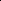
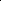

# Analyzing and Mitigating Object Hallucination: A Training Bias Perspective

<!-- Page 1 -->

Analyzing and Mitigating Object Hallucination: A Training Bias Perspective

Yifan Li1,4*, Kun Zhou2*, Wayne Xin Zhao1,4†, Lei Fang3, Ji-Rong Wen1,4

1Gaoling School of Artificial Intelligence, Renmin University of China 2School of Information, Renmin University of China 3DataCanvas Alaya NeW 4Beijing Key Laboratory of Research on Large Models and Intelligent Governance {liyifan0925, batmanfly}@gmail.com

## Abstract

As scaling up training data has significantly improved the general multimodal capabilities of Large Vision-Language Models (LVLMs), they still suffer from the hallucination issue, generating text that is inconsistent with the visual input. This phenomenon motivates us to systematically investigate the role of training data in hallucination. We introduce a new benchmark, POPEv2, which consists of counterfactual images collected from the training data of LVLMs with certain objects masked. Through comprehensive evaluation on POPEv2, we find that current LVLMs suffer from training bias: they fail to fully leverage their training data and hallucinate more frequently on images seen during training. Specifically, they perform poorly on counterfactual images, often incorrectly answering “Yes” to questions about masked objects. To understand this issue, we conduct probing experiments on the models’ internal components, revealing that this training bias is primarily located in the language modeling (LM) head, which fails to correctly translate accurate visual representations into textual outputs. Based on these findings, we propose Obliviate, an efficient and lightweight unlearning method designed to mitigate object hallucination via training bias unlearning. Obliviate identifies the discrepancy between ground-truth labels and model outputs on the training data as a proxy for bias and adopts a parameterand data-efficient fine-tuning strategy that only updates the LM head. Extensive experiments demonstrate the effectiveness of our approach. While only reusing the training data and updating approximately 2% of the parameters, Obliviate notably reduces hallucination across both discriminative and generative tasks. Furthermore, it demonstrates strong scalability with respect to both model size (2B to 72B) and training data volume, and exhibits promising generalization to hallucination types beyond object-level hallucination.

Code — https://github.com/RUCAIBox/POPEv2

## Introduction

Recent advancements in Large Vision-Language Models (LVLMs) have achieved remarkable performance on a variety of multimodal tasks, e.g., visual question answering (OpenAI 2023), cross-modal reasoning (Du et al. 2025) and embodied

*Equal contribution †Corresponding author Copyright © 2026, Association for the Advancement of Artificial Intelligence (www.aaai.org). All rights reserved.

(b) Target Object Selection and Masking

(c) Normal & Counterfactual VQA

Qwen2-VL: Yes, there is a laptop in the image.

InternVL2: Yes, there is a laptop in the image. The laptop is open and placed on a table.

LLaVA-1.5: Yes, there is a laptop in the image, and a woman and a young girl are looking at it.

phone

(a) Training Images Selection

Question: Is there a laptop in the image?

+ Counterfactual Image person1 person2 laptop

Qwen2-VL: Yes, there is a laptop in the image.

InternVL2: Yes, the woman in the image is using a laptop to show something on the screen to her daughter.

LLaVA-1.5: Yes, there is a laptop featured in the image, with both a girl and a woman sitting in front of it.

+ Normal Image

Keep Mask

Random Selection

Training Images

Normal Image Counterfactual Image

Hallucinated!

Hallucinated!

Hallucinated!

Correct!

Correct!

Correct!

**Figure 1.** Data collection pipeline of POPEv2 and the generated cases from LVLMs. POPEv2 consists of normal and counterfactual images with a masked target object.

AI (Li et al. 2024). Modern LVLMs are typically trained on large-scale image-text pairs (Chen et al. 2024a); for example, Qwen2-VL (Wang et al. 2024) is trained on 1.4 trillion tokens comprising images and associated texts. While scaling up training data has significantly improved the general capabilities of LVLMs, it has not fully mitigated the hallucination problem (Li et al. 2023; Rohrbach et al. 2018), where models generate outputs that are inconsistent with the visual input. This persistent issue hinders the broader application of LVLMs in real-world applications. The limited effect of data scaling on reducing hallucinations motivates us to investigate a critical question: how well do LVLMs actually utilize their training data? Surprisingly, we observe that LVLMs may even hallucinate on images they have already seen during training. As illustrated in Figure 1, when an object in a

The Fortieth AAAI Conference on Artificial Intelligence (AAAI-26)

AI-readable visual equivalent, added: Figure extracted from the paper PDF and converted to an SVG wrapper asset. Use the surrounding page text and caption for interpretation.

AI-readable visual equivalent, added: Figure extracted from the paper PDF and converted to an SVG wrapper asset. Use the surrounding page text and caption for interpretation.

AI-readable visual equivalent, added: Figure extracted from the paper PDF and converted to an SVG wrapper asset. Use the surrounding page text and caption for interpretation.

AI-readable visual equivalent, added: Figure extracted from the paper PDF and converted to an SVG wrapper asset. Use the surrounding page text and caption for interpretation.

AI-readable visual equivalent, added: Figure extracted from the paper PDF and converted to an SVG wrapper asset. Use the surrounding page text and caption for interpretation.

AI-readable visual equivalent, added: Figure extracted from the paper PDF and converted to an SVG wrapper asset. Use the surrounding page text and caption for interpretation.

<!-- Page 2 -->

training image is masked out, LVLMs still answer “Yes” to a question asking whether that object is present. This counterintuitive behavior raises an important issue: do LVLMs truly acquire generalizable visual understanding from training data, or do they merely learn training biases such as shallow associations or spurious correlations?

To probe this question, we introduce POPEv2, a benchmark specifically designed to evaluate the model’s reliance on visual evidence. POPEv2 is constructed from images sampled from the model’s training data, paired with binary questions about object existence. For each image, we generate a counterfactual version by masking the target object, creating a minimal yet diagnostic change to test whether the model can ground its predictions in actual visual content. Our empirical findings reveal that existing LVLMs consistently struggle with these counterfactual samples (see Table 1), even though the original images appeared in training. This suggests that current LVLMs often rely on learned biases rather than robust visual grounding when making predictions, which fundamentally contributes to the hallucination problem. To further locate the derivation of such biases, we conduct probing experiments on the hidden states from internal layers within the LVLM. Interestingly, we find that intermediate representations already encode object-level visual information with high fidelity. In contrast, the final language modeling head (LM head) fails to translate these features into faithful textual outputs. This discrepancy suggests that the primary training bias contributing to hallucination resides in the LM head.

Motivated by these findings, we propose Obliviate, a lightweight and efficient hallucination mitigation method by unlearn training biases. Our key idea is to first treat the discrepancy between the model’s generation and the groundtruth labels on training data as a proxy for training biases. Then, we perform gradient ascent specifically on these biased outputs to actively reduce their likelihood, thereby promoting unlearning. To ensure both parameter-level and data-level efficiency, we constrain the updates to only the LM head, which is most responsible for the bias. In practice, Obliviate updates merely 2% of the model parameters and utilizes only 1.5% of the training data (see Table 3). Despite its simplicity, Obliviate is both effective and generalizable. Our experiments show that it significantly reduces hallucination across LVLMs of varying sizes (from 2B to 72B parameters), while preserving the model’s generation capabilities. Compared to strong preference-tuning baselines, Obliviate achieves comparable or even superior performance, with far less computational overhead. Furthermore, Obliviate generalizes well to out-ofdomain hallucination types beyond object-level, demonstrating its potential as a practical debiasing solution for robust multimodal understanding.

POPEv2: Challenging LVLMs with Counterfactual Images from Training Data

To quantitatively analyze the influence of training data on hallucination, we introduce a novel benchmark POPEv2 and conduct an empirical study on representative LVLMs.

Data Collection Pipeline As shown in Figure 1, the data collection of POPEv2 involves three steps. (1) We randomly sample 500 images from the MSCOCO 2017 training set (Lin et al. 2014), a widely-used dataset for both image-text pretraining (Chen et al. 2024c,d) and visual instruction tuning (Liu et al. 2023). (2) For each image, we select a target object and generate a counterfactual version by masking the object with a black patch, aiming to assess whether model rely on visual evidence. (3) Following POPE (Li et al. 2023), we construct binary questions (i.e., “Is there a <object> in the image?”) for both original and counterfactual images. The final dataset includes 500 original images, 500 counterfactual images, and 1000 questions. More details are provided in the supplementary material.

## Evaluation

Setup for POPEv2

## Evaluation

Metrics. POPEv2 can be treated as a binary classification task. We adopt standard classification metrics for evaluation, i.e., Accuracy, Precision, Recall, and F1 Score. We also compute the True Negative Rate (TNR) to specifically evaluate model performance on counterfactual data:

TNR = TN TN + FP, (1)

where TN and FP represent the number of true negatives and false positives. Additionally, we introduce Prediction Balance Offset (PBO), which measures the deviation of the positive and negative ratio in prediction. It is computed as:

PBO =

Positive Predictions

Total Predictions × 100

−50. (2)

A positive PBO means the model prefers affirmative answers.

Evaluated Models. We evaluate representative open-source LVLMs, including LLaVA-1.5-7B/13B, LLaVA-1.5-MoF, LLaVA-NeXT-7B/13B, InternVL2-4B/8B/26B, and Qwen2- VL-2B/7B/72B. Models except LLaVA-1.5 generally employ different strategies to enhance visual understanding capabilities, such as adopting dynamic image resolutions or integrating multiple visual encoders.

Empirical Results We present the evaluation results of representative LVLMs in Table 1, and summarize several interesting observations.

LVLMs Struggle with Seen Images. The evaluation results demonstrate that LVLMs fail to achieve satisfactory performance on POPEv2, despite having seen these images during training. For instance, most models only attain an F1 score of approximately 80%, including advanced models such as LLaVA-Next and the InternVL2 series. Additionally, most models exhibit high recall scores and a positive PBO, indicating that counterfactual images tend to elicit incorrect affirmative answers from the models. Notably, on the TNR metric, which reflects the model’s accuracy in identifying counterfactual images, most models do not even exceed 70%. Furthermore, we provide additional experiments in the supplementary material to analyze the influence of training data

<!-- Page 3 -->

## Model

#DR #HVE

POPEv2

Accuracy Precision Recall PBO F1 Score ↑ TNR ↑

LLaVA-1.5-7B (Liu et al. 2024a) - - 72.20 65.16 95.40 + 23.20 77.44 49.00 LLaVA-1.5-13B (Liu et al. 2024a) - - 72.70 65.83 94.40 + 21.70 77.57 51.00 LLaVA-1.5-MoF-13B (Tong et al. 2024) - ✓ 71.30 65.55 89.80 + 18.50 75.78 52.80

LLaVA-NeXT-7B (Liu et al. 2024b) ✓ - 79.50 73.30 92.80 + 13.30 81.91 66.20 LLaVA-NeXT-13B (Liu et al. 2024b) ✓ - 80.10 73.41 94.40 + 14.30 82.59 65.80

InternVL2-4B (Chen et al. 2024d) ✓ - 76.90 71.52 89.40 + 12.50 79.47 64.40 InternVL2-8B (Chen et al. 2024d) ✓ - 74.50 70.32 84.80 + 10.30 76.88 64.20 InternVL2-26B (Chen et al. 2024d) ✓ - 76.10 71.43 87.00 + 10.90 78.45 65.20

Qwen2-VL-2B (Wang et al. 2024) ✓ - 91.30 93.84 88.40 −2.90 91.04 94.20 Qwen2-VL-7B (Wang et al. 2024) ✓ - 87.00 81.25 96.20 + 9.20 88.10 77.80 Qwen2-VL-72B (Wang et al. 2024) ✓ - 79.40 72.55 94.60 + 15.20 82.12 64.20

**Table 1.** Performance of representative LVLMs on POPEv2 (#DR: Dynamic Resolution, #HVE: Hybrid Vision Encoder).

Visual Encoder

Projection

Layer

Transformer Layer

LM Head

Image

Text

Transformer Layer

…

**Figure 2.** Accuracy on counterfactual images using linear probes trained on hidden states from different components.

on hallucination behavior. These findings collectively suggest that current training paradigms may encode biases, causing models to rely on learned spurious correlations rather than genuine visual evidences. Such biases, rooted in the training process, fundamentally contribute to the persistent hallucination problem in LVLMs.

Image Speaks Louder than Model Size. Another noteworthy observation is that scaling the size of the language model backbone has a limited impact on LVLMs’ performance. For instance, LLaVA-1.5-13B (77.57%) exhibits only marginal gains over its 7B counterpart (77.44%), while Qwen2-VL- 72B (82.12%) underperforms compared to the significantly smaller Qwen2-VL-2B (91.04%). In contrast, models employing dynamic resolution strategy, such as LLaVA-NeXT- 7B (81.91%) and Qwen2-VL-7B (88.10%), achieve markedly better results than the base LLaVA-1.5 (77.44%). These findings suggest that enhancing visual perception capabilities plays a more critical role in accurately identifying counterfactual images than simply scaling up model size.

Ground-truth Hallucinated

Logits Gap!

Frequently co-occur

Rarely co-occur

**Figure 3.** Average inference logits of object tokens in a caption. The ground-truth objects are remote, bed, and person.

Identifying Hallucination Bottlenecks Based on the finding that hallucination may stem from biases learned from the training data, we conduct probing experiments to trace the hidden states within LVLMs, aiming to identify which module primarily contributes to this issue.

Probing Experiments Setup

Hidden States within LVLMs. Typically, LVLMs consist of a visual encoder, a projection layer, multiple stacked Transformer layers within the LLM, and a language modeling head. We conduct probing experiments on the hidden states of these modules. Given an image I and a text instruction T, the LVLM first converts I into image features EI using its visual encoder V:

EI = V(I), EI = [e1,..., en], ei ∈Rd, (3)

where n is the sequence length and d is the hidden size of the image features. The projection layer W maps EI to image embeddings H0

I compatible with the LLM’s hidden space:

H0

I = W · EI, H0

I = [h1,..., hn], hi ∈Rm, (4)

AI-readable visual equivalent, added: Figure extracted from the paper PDF and converted to an SVG wrapper asset. Use the surrounding page text and caption for interpretation.

AI-readable visual equivalent, added: Figure extracted from the paper PDF and converted to an SVG wrapper asset. Use the surrounding page text and caption for interpretation.

<!-- Page 4 -->

where m is the hidden size of the LLM M. These image embeddings H0

I are concatenated with text embeddings H0

T and processed sequentially by each layer of M, producing layer-wise hidden states {H1,..., HL}. Finally, at the last layer L, the hidden state of the final token HL last is passed to the language modeling head (LM head) to predict the next-token probability distribution.

Probing Method. Probing methods are widely used for analyzing the information encoded in the hidden states of neural networks (Alain and Bengio 2017). Here, we utilize a simple yet effective linear probing model consisting of mean pooling and a linear layer with parameters θ ∈R2×m. We train probes using the hidden states of the model to classify whether an image contains a specific object class. Specifically, we set the image input I as a series of images that either contain or do not contain the target object class, and the text instruction as “Is there a <object> in the image?” for the LVLM. Then, we attach linear probes to: (1) image features EI from the visual encoder; (2) image embeddings from the projection layer H0

I; and (3) text and image hidden states of each layer in the LLM {H1, · · ·, HL}. During the training phase, we provide hidden states from normal images and test the trained probes on counterfactual images. We also directly use the probabilities of the “Yes” and “No” tokens to measure the accuracy of the direct generation results of LVLMs. More details are presented in the supplementary materials.

## Analysis

on Linear Probing Results The probing results are presented in Figure 2. From these results, we summarize the following findings:

Hidden States Encode Object Existence. Linear probes trained on the LVLM’s hidden states (for both text and image features) achieve high classification accuracy on counterfactual questions (>95%), demonstrating that these hidden states encode rich object-level information, including both masked and unmasked objects. Notably, within the LLM, the accuracy of probes trained on image-derived features gradually decreases with depth (from 100% to 94.92%). In contrast, probes trained on textual features show improved accuracy after passing through just a single transformer layer and maintain higher accuracy in deeper layers. We attribute this to the causal self-attention mechanism in LLMs, where visual information is progressively integrated into subsequent text tokens. Overall, even with a fixed-resolution visual encoder, the hidden states of LVLMs already contain sufficient visual signals to support simple object-level perception.

Training Bias Lies in LM Head. Despite the richness of visual information in the hidden states, there exists a notable gap between the probing accuracy and the actual generation performance (from 94.92% to 80.79%). This suggests that the LM head, which is responsible for producing output text, fails to fully leverage the object-level signals present in the hidden representations. Therefore, we conclude that the training bias responsible for hallucination in LVLMs mainly stems from the LM head. To make this bias more observable, we analyze the average logits assigned by the LM head to various object tokens during caption generation, as shown in

**Figure 3.** Interestingly, although these objects are all absent from the image, the logits vary significantly depending on their co-occurrence frequency with the ground-truth object (e.g., higher logits for “TV” and “laptop” given the presence of “remote”). This discrepancy illustrates a form of objectlevel co-occurrence bias: the LM head tends to favor objects that are statistically associated with the image content, even if they are not visually present.

## Methodology

Building on previous findings that hallucination in LVLMs stems from training biases embedded within the LM head, we propose a targeted debiasing framework, termed Obliviate (Object Hallucination Mitigation via Efficient Training Bias Unlearning). Obliviate is designed to efficiently mitigate such bias by unlearning hallucinated patterns, while preserving the model’s general capabilities. The full pipeline is depicted in Figure 4. Notably, our method requires no additional annotations and exclusively fine-tunes the LM head, resulting in a highly data- and parameter-efficient solution.

Formalizing and Collecting Training Bias We begin by defining training bias as the discrepancy between the model’s outputs and the annotated ground-truth labels on the training data. This deviation reveals the incorrect or spurious patterns acquired by the model throughout its training process. In our setting, we focus specifically on how such bias contributes to hallucinations. Therefore, we treat hallucinated sub-sequences as concrete manifestations of this bias and target them for unlearning.

To this end, we curate an unlearning dataset by collecting biased predictions from training data. Specifically, we select image captioning instructions from the original LVLM training corpus and denote the collection as D = {(Ii, xi, yi)}N i=1, where Ii is the image, xi is the corresponding text instruction, and yi is the ground-truth caption. We then let the LVLM re-infer on the same input pairs and collect its predictions Y′ = {y′

1,..., y′ N}. By comparing the objects within the ground-truth and inference outputs, we select the subset consisting of hallucinated inference results. However, hallucinated captions often contain both accurate and hallucinated content. Directly unlearning the entire sentence may degrade the model’s ability to generate correct descriptions. An intuitive approach is to only unlearn the hallucinated objects. However, due to the auto-regressive generation pattern of LVLMs, objects are often generated along with relevant context or follows, e.g., “the room also contains a...”. Such context elicits the generation of hallucinated objects, and should also be unlearned. Therefore, we extract sub-sentences that include hallucinated objects as the unit of unlearning. Specifically, we split each predicted caption into sub-sentences using delimiters such as commas and periods. In addition, correctly generated objects are also treated as delimiters to prevent including factual content in the unlearning process. For each hallucinated object, we retain only the sub-sentence corresponding to its first occurrence to avoid repeated penalization. Finally, we obtain the unlearning dataset DHallu = {(Ii, xi, yi, y′ i, {δi,1, · · ·, δi,j, · · · })}M i=1, where δi,j is the j-th hallucinated sub-sentence from y′ i.

<!-- Page 5 -->

LVLM 𝒙𝒊: What do you think is going on in this snapshot?

𝒚𝒊: The image features a cozy bedroom, with a large bed taking up most of the space in the room. Directly behind the head of the bed, there is a … 𝒚𝒊

$: The image features a cozy bedroom … In addi@on to the bed, there is a chair located near the leA side of the room, and a dining table can be seen in the background … The room also contains a clock on the wall …

(a) Re-inference Training Data

(b) Biased Sequence Collection 𝜹𝟏: <, there is a chair>

(c) Efficient Bias Unlearning 𝜹𝟐: <, and a dining table> 𝜹𝟑: <The room also contains a clock>

🔥

LM Head Obliviate

LLM ❄

Projector ❄

Visual Encoder ❄

**Figure 4.** The whole pipeline of proposed Obliviate. We first use the LVLM to re-inference its training data, and then collect the biased sub-sequences within the hallucinated output. Next, we fine-tune the LM head of the LVLM to unlearn the bias by combining the debiased loss and the auto-regressive loss.

Efficient Training Bias Unlearning

Based on the collected biased inference results, we draw inspiration from the concept of machine unlearning (Liu et al. 2024c), which aims to selectively remove specific knowledge or patterns learned by a model. Such approaches provide an efficient way to mitigate targeted bias while preserving the model’s general capabilities. Specifically, we devise the following loss function to forget the biased sub-sentences:

LDB =

N X i=1

|δi,j| X j=1 log p(δi,j|Ii, xi, y′ i,<δi,j), (5)

where y′ i,<δi,j denotes the tokens before the sub-sentence δi,j in the inference result y′ i. However, training only on the unlearning objective will undermine model’s original generation abilities. Therefore, we add the classic auto-regressive loss on the ground-truth output as the regularization term:

LAR = −

N X i=1

|yi| X j=1 log p(yi,j|Ii, xi, yi,<j), (6)

where yi is instructions collected from both the D and other general visual instructions from the training dataset of the model. Finally, we combine the two loss functions for optimizing the parameters of the LM head θLM, denoted as:

arg min θLM LAR + αLDB, (7)

where α is the hyperparameter to adjust the unlearning degree. In this way, we not only force the LM head to unlearn the bias but also guide it to acquire accurate knowledge from the ground-truth. As a result, Obliviate is a data- and parameterefficient method that requires no additional annotations and updates only 2% of the model’s parameters.

## Experiment

## Experiment

Setup

Implementation. We select the LLaVA-150K (Liu et al. 2023) as Y. We then let the target model inference on caption instructions from Y to obtain Y′. Following Rohrbach et al. (2018), we extract hallucinated objects from each caption and construct δ to be unlearned. We adopt Obliviate on multiple LVLMs of varying sizes from 2B to 72B, including LLaVA- 1.5-7/13B, LLaVA-Next-7/13B, Qwen2-VL-2B/7B/72B. For LLaVA-1.5 series, we collect 12,000 hallucinated caption instructions unlearning and another 36,000 visual reasoning samples from LLaVA-150K for the calculation of LAR. For the other models, the number of used unlearning and learning instructions is set to 2,000 and 8,000, respectively.

Benchmarks. Aside from our constructed POPEv2, we also select other hallucination evaluation benchmarks for evaluation. We first select POPE (Li et al. 2023), which detects hallucination by asking models whether the image contains a certain object. For generative evaluation benchmarks, we select Object HalBench (Rohrbach et al. 2018) and MMHal- Bench (Sun et al. 2024). Object HalBench counts the hallucination objects and sentences in model-generated captions. MMHal-Bench adopts GPT-4 to evaluate fine-grained hallucination regarding counting and spatial relationships. We also include LLaVA-Bench (Liu et al. 2023) for evaluating the open-ended generation abilities of models.

Baselines. We compare our method with other hallucination mitigation methods. (1) Decoding-based methods, e.g., VCD (Leng et al. 2024), VDD (Zhang et al. 2024) and OPERA (Huang et al. 2024). (2) Preference learning methods, e.g., HA-DPO (Zhao et al. 2023) and POVID (Zhou et al. 2024). These methods collect human preference data and adopt alignment algorithms like DPO (Rafailov et al. 2023) to align the model with human preference.

AI-readable visual equivalent, added: Figure extracted from the paper PDF and converted to an SVG wrapper asset. Use the surrounding page text and caption for interpretation.

AI-readable visual equivalent, added: Figure extracted from the paper PDF and converted to an SVG wrapper asset. Use the surrounding page text and caption for interpretation.

AI-readable visual equivalent, added: Figure extracted from the paper PDF and converted to an SVG wrapper asset. Use the surrounding page text and caption for interpretation.

AI-readable visual equivalent, added: Figure extracted from the paper PDF and converted to an SVG wrapper asset. Use the surrounding page text and caption for interpretation.

AI-readable visual equivalent, added: Figure extracted from the paper PDF and converted to an SVG wrapper asset. Use the surrounding page text and caption for interpretation.

<!-- Page 6 -->

## Model

POPEv2 Object HalBench MMHal-Bench

LLaVA Bench↑ PBO F1 score ↑ TNR ↑ Resp. ↓ Mention ↓ Info. ↑ Resp.↓

LLaVA-1.5-7B + 23.20 77.44 49.00 46.7 25.1 2.19 0.59 61.50 + Obliviate −1.10 82.91 84.20 34.7 18.3 2.20 0.55 63.50

LLaVA-1.5-13B + 21.70 77.57 51.00 44.7 22.8 2.53 0.56 69.30 + Obliviate + 3.20 81.20 77.40 33.0 16.3 2.60 0.54 72.80

LLaVA-NeXT-7B + 13.30 81.91 66.20 17.7 11.5 2.58 0.58 62.40 + Obliviate + 2.90 83.38 80.00 16.3 10.1 2.80 0.55 73.50

LLaVA-NeXT-13B + 14.30 82.59 65.80 19.7 13.2 2.91 0.53 63.30 + Obliviate + 10.60 82.82 70.40 19.0 11.5 3.10 0.46 74.60

Qwen2-VL-2B −2.70 91.04 94.20 18.0 10.2 3.08 0.44 74.40 + Obliviate + 0.30 91.92 91.60 16.3 10.6 3.57 0.36 75.20

Qwen2-VL-7B + 9.20 88.10 77.80 15.7 9.8 3.55 0.35 84.60 + Obliviate + 0.90 91.38 90.40 15.3 9.4 3.72 0.33 86.20

Qwen2-VL-72B + 15.20 82.12 64.20 15.4 9.7 3.64 0.34 109.3 + Obliviate −2.70 87.36 90.40 15.2 8.2 3.75 0.32 110.3

**Table 2.** Evaluation results of applying Obliviate on representative LVLMs. The better results are denoted in bold.

## Method

#Param VRAM GPU Hours POPEv2

LLaVA-NeXT7B - - - 81.91 + SFT 6.7 B 77 GB 26 80.44 + LoRA 0.02 B 52 GB 26 77.59 + Obliviate 0.13 B 28 GB 10 83.38

**Table 3.** Comparison of computational efficiency between different training strategies on LLaVA-NeXT-7B.

## Experiment

## Results

We present the performance of Obliviate on various LVLMs in Table 2, compare it to other baselines in Table 4, and evaluate its generalization capabilities in Table 5.

Effectiveness across Various Model Families. On POPEv2, Obliviate consistently improves F1 Score and TNR, substantially reducing discriminative hallucinations. For example, LLaVA-1.5-7B’s TNR increases from 49.00% to 84.20%, indicating enhanced perception accuracy on counterfactual images and mitigation of training bias. The absolute PBO also decreases across all models, reflecting reduced response tendencies. On generative hallucination benchmarks like Object HalBench and MMHal-Bench, Obliviate effectively lowers hallucination rates while improving answer informativeness; for instance, LLaVA-Next-13B’s hallucination rate drops from 19.7 to 19.0, and its informativeness score rises from 2.91 to 3.10. Furthermore, on open-ended LLaVA-Bench, models with Obliviate consistently outperform vanilla models. Notably, Obliviate is effective across model sizes ranging from 2B to 72B. Qwen2-VL-7B with Obliviate even surpasses the larger Qwen2-VL-72B on most benchmarks.

Comparison with Baselines. We compare Obliviate with other hallucination mitigation methods on LLaVA-1.5-7B

1k 2k 4k 8k 12k Amount of Caption Data

32

34

36

38

40

42

Resp.

40.7

38.0 37.7

35.2 34.7

Resp. Mention

18

19

20

21

22

Mention

21.5

19.8

19.3

18.9

18.3

**Figure 5.** The effect of scaling caption data on the performance of LLaVA-1.5-7B on Object HalBench.

and observe clear advantages. Unlike decoding-based approaches such as VCD and VDD, which impose constraints during inference and often yield limited gains or even performance drops on generation tasks, Obliviate consistently delivers stronger improvements. For example, it reduces the rate of hallucinated objects on Object HalBench from 25.1 to 18.3 and achieves a lower response error rate on MMHal-Bench (0.55), demonstrating its ability to mitigate hallucinations while preserving generation quality. Compared to preference learning methods like HA-DPO and POVID, Obliviate is also more cost-effective, as it does not require expensive human preference data or RL-style optimization, yet achieves comparable or even superior performance. On POPEv2, Obliviate achieves the highest F1 Score (82.91%) and TNR (84.20%) and matches the best LLaVA-Bench score (63.80), underscoring its effectiveness across different tasks.

Generalization Capabilities. We further evaluate the generalization ability of Obliviate on hallucination types beyond basic object hallucination. Specifically, we use the perception set of MME (Fu et al. 2023), which covers diverse

<!-- Page 7 -->

## Model

POPEv2 POPEadv Object HalBench MMHal-Bench

LLaVA Bench↑ PBO F1 Score ↑ TNR ↑ F1 Score ↑ Resp. ↓ Mention ↓ Info. ↑ Resp.↓

LLaVA-1.5-7B + 23.20 77.44 49.00 77.57 46.7 25.1 2.19 0.59 61.50

+ VCD + 24.10 78.49 49.20 81.33 47.4 25.2 2.12 0.59 62.70 + VDD + 20.30 78.30 50.80 82.22 46.7 25.2 2.22 0.56 63.20 + OPERA + 19.10 79.28 58.60 81.88 45.1 22.3 2.15 0.57 60.30

+ HA-DPO + 20.40 78.41 53.60 82.05 39.9 19.9 1.98 0.60 63.50 + POVID + 16.80 80.53 62.80 82.81 48.1 24.4 2.08 0.56 62.20

+ Obliviate −0.30 82.91 84.20 84.50 34.7 18.3 2.20 0.55 63.80

**Table 4.** Performance of representative hallucination mitigation methods and Obliviate.

## Model

MMEperception ROPE

Count Position Color OCR Sum Wild Homo. Adv. Average

LLaVA-NeXT7B 115 125 115 92.5 1273.26 30.72 66.69 45.34 47.58 + Obliviate 121.67 141.67 153.33 152.5 1364.59 30.85 66.88 45.51 47.75

LLaVA-NeXT13B 116.67 115 155 82.5 1279.42 27.62 63.23 44.97 45.27 + Obliviate 135 126.67 141.67 97.5 1352.64 28.29 64.86 45.03 46.06

**Table 5.** Evaluation results on the perception set of MME.

perception challenges such as counting, positioning, color, and OCR, and the ROPE (Chen et al. 2024b) benchmark, which focuses on multi-object hallucination. As shown in Table 5, Obliviate consistently improves baseline models across nearly all perception sub-tasks. For example, on LLaVA- NeXT-7B, it achieves significant gains in Position (+16.67) and Color (+38.33), raising the overall Sum score by 91.33 (1273.26 →1364.59). Similar improvements are observed on Qwen2-VL-7B, where the Sum score increases from 1682.23 to 1691.68 with consistent gains across all categories. On the ROPE benchmark, Obliviate reduces hallucination across Wild, Homogeneous, and Adversarial settings for both 7B and 13B models. For instance, LLaVA-NeXT-13B improves its average score from 45.27 to 46.06, demonstrating stronger robustness against complex multi-object hallucinations.

Further Analysis

Computational Efficiency. Since Obliviate only updates the LM head of LVLMs, it offers clear advantages in computational efficiency. To demonstrate this, we compare fullparameter supervised fine-tuning (SFT), LoRA (rank = 8), and Obliviate on LLaVA-NeXT-7B. As shown in Table 3. Obliviate achieves the best performance with the least memory and training time. Although LoRA has fewer trainable parameters, its VRAM consumption is nearly twice as high due to storing intermediate activations and gradients across layers. In contrast, Obliviate only computes gradients at the LM head, resulting in a simpler computation graph and much lower memory cost. Notably, both SFT and LoRA degrade model’s performance, likely because unlearning across all layers disrupts the model’s generation patterns. In contrast, Obliviate targets only the LM head, effectively reducing hallucinations without harming generation quality.

Impact of Scaling Caption Data. We further investigate whether increasing the amount of caption data can enhance the performance of our method. To this end, we construct datasets containing 1k, 2k, 4k, and 8k hallucinated captions sampled from LLaVA-150K to fine-tune LLaVA-1.5. We then evaluate the resulting models on Object HalBench and present the results in Figure 5. The results indicate that as the volume of caption data increases, model hallucinations are further mitigated, demonstrating the strong scalability of our approach. We attribute this improvement to the fact that a larger number of hallucinated captions exposes the model to more biased generation patterns, enabling it to better unlearn these patterns and thereby reduce hallucinations.

## Conclusion

In this work, we systematically examined the role of training data in hallucination for LVLMs by the proposed benchmark POPEv2 and revealed that LVLMs exhibit a clear training bias: they hallucinate more frequently even on images seen during training. Through probing experiments, we identified that this bias is mainly rooted in the LM head, which fails to translate accurate visual representations into correct textual outputs. To mitigate this issue, we introduced Obliviate, a lightweight and parameter-efficient unlearning method that targets training bias by only fine-tuning the LM head with biased inference results derived from the original training data. Extensive experiments demonstrated that Obliviate significantly reduces hallucination across different tasks, while maintaining scalability across model sizes and data volumes. Beyond object-level hallucination, our method also shows promising generalization to other hallucination types, providing a new perspective on leveraging training data to enhance the reliability of LVLMs.

<!-- Page 8 -->

## Acknowledgements

This paper was partially supported by the National Natural Science Foundation of China No. 92470205 and 62222215. Xin Zhao is the corresponding author.

## References

Alain, G.; and Bengio, Y. 2017. Understanding intermediate layers using linear classifier probes. In ICLR (Workshop). OpenReview.net. Chen, L.; Li, J.; Dong, X.; Zhang, P.; He, C.; Wang, J.; Zhao, F.; and Lin, D. 2024a. ShareGPT4V: Improving Large Multimodal Models with Better Captions. In ECCV (17), volume 15075 of Lecture Notes in Computer Science, 370–387. Springer. Chen, X.; Ma, Z.; Zhang, X.; Xu, S.; Qian, S.; Yang, J.; Fouhey, D.; and Chai, J. 2024b. Multi-Object Hallucination in Vision Language Models. In NeurIPS. Chen, Z.; Wang, W.; Cao, Y.; Liu, Y.; Gao, Z.; Cui, E.; Zhu, J.; Ye, S.; Tian, H.; Liu, Z.; Gu, L.; Wang, X.; Li, Q.; Ren, Y.; Chen, Z.; Luo, J.; Wang, J.; Jiang, T.; Wang, B.; He, C.;

Shi, B.; Zhang, X.; Lv, H.; Wang, Y.; Shao, W.; Chu, P.; Tu, Z.; He, T.; Wu, Z.; Deng, H.; Ge, J.; Chen, K.; Dou, M.; Lu, L.; Zhu, X.; Lu, T.; Lin, D.; Qiao, Y.; Dai, J.; and Wang, W. 2024c. Expanding Performance Boundaries of Open- Source Multimodal Models with Model, Data, and Test-Time Scaling. CoRR, abs/2412.05271. Chen, Z.; Wang, W.; Tian, H.; Ye, S.; Gao, Z.; Cui, E.; Tong, W.; Hu, K.; Luo, J.; Ma, Z.; Ma, J.; Wang, J.; Dong, X.; Yan, H.; Guo, H.; He, C.; Shi, B.; Jin, Z.; Xu, C.; Wang,

B.; Wei, X.; Li, W.; Zhang, W.; Zhang, B.; Cai, P.; Wen, L.; Yan, X.; Dou, M.; Lu, L.; Zhu, X.; Lu, T.; Lin, D.; Qiao, Y.;

Dai, J.; and Wang, W. 2024d. How Far Are We to GPT-4V? Closing the Gap to Commercial Multimodal Models with Open-Source Suites. CoRR, abs/2404.16821. Du, Y.; Liu, Z.; Li, Y.; Zhao, W. X.; Huo, Y.; Wang, B.; Chen, W.; Liu, Z.; Wang, Z.; and Wen, J.-R. 2025. Virgo: A Preliminary Exploration on Reproducing o1-like MLLM. CoRR, abs/2501.01904. Fu, C.; Chen, P.; Shen, Y.; Qin, Y.; Zhang, M.; Lin, X.; Qiu, Z.; Lin, W.; Yang, J.; Zheng, X.; Li, K.; Sun, X.; and Ji, R. 2023. MME: A Comprehensive Evaluation Benchmark for Multimodal Large Language Models. CoRR, abs/2306.13394. Huang, Q.; Dong, X.; Zhang, P.; Wang, B.; He, C.; Wang, J.; Lin, D.; Zhang, W.; and Yu, N. 2024. OPERA: Alleviating Hallucination in Multi-Modal Large Language Models via Over-Trust Penalty and Retrospection-Allocation. In CVPR, 13418–13427. IEEE. Leng, S.; Zhang, H.; Chen, G.; Li, X.; Lu, S.; Miao, C.; and Bing, L. 2024. Mitigating Object Hallucinations in Large Vision-Language Models through Visual Contrastive Decoding. In CVPR, 13872–13882. IEEE. Li, X.; Zhang, M.; Geng, Y.; Geng, H.; Long, Y.; Shen, Y.; Zhang, R.; Liu, J.; and Dong, H. 2024. ManipLLM: Embodied Multimodal Large Language Model for Object-Centric Robotic Manipulation. In CVPR, 18061–18070. IEEE.

Li, Y.; Du, Y.; Zhou, K.; Wang, J.; Zhao, W. X.; and Wen, J. 2023. Evaluating Object Hallucination in Large Vision- Language Models. In EMNLP, 292–305. Association for Computational Linguistics. Lin, T.; Maire, M.; Belongie, S. J.; Hays, J.; Perona, P.; Ramanan, D.; Dollár, P.; and Zitnick, C. L. 2014. Microsoft COCO: Common Objects in Context. In ECCV (5), volume 8693 of Lecture Notes in Computer Science, 740–755. Springer. Liu, H.; Li, C.; Li, Y.; and Lee, Y. J. 2024a. Improved Baselines with Visual Instruction Tuning. In CVPR, 26286–26296. IEEE. Liu, H.; Li, C.; Li, Y.; Li, B.; Zhang, Y.; Shen, S.; and Lee, Y. J. 2024b. LLaVA-NeXT: Improved reasoning, OCR, and world knowledge. Liu, H.; Li, C.; Wu, Q.; and Lee, Y. J. 2023. Visual Instruction Tuning. In NeurIPS. Liu, S.; Yao, Y.; Jia, J.; Casper, S.; Baracaldo, N.; Hase, P.; Xu, X.; Yao, Y.; Li, H.; Varshney, K. R.; Bansal, M.; Koyejo, S.; and Liu, Y. 2024c. Rethinking Machine Unlearning for Large Language Models. CoRR, abs/2402.08787. OpenAI. 2023. GPT-4V(ision) System Card. https://openai. com/index/gpt-4v-system-card/. Rafailov, R.; Sharma, A.; Mitchell, E.; Manning, C. D.; Ermon, S.; and Finn, C. 2023. Direct Preference Optimization: Your Language Model is Secretly a Reward Model. In NeurIPS. Rohrbach, A.; Hendricks, L. A.; Burns, K.; Darrell, T.; and Saenko, K. 2018. Object Hallucination in Image Captioning. In EMNLP, 4035–4045. Association for Computational Linguistics. Sun, Z.; Shen, S.; Cao, S.; Liu, H.; Li, C.; Shen, Y.; Gan, C.; Gui, L.; Wang, Y.; Yang, Y.; Keutzer, K.; and Darrell, T. 2024. Aligning Large Multimodal Models with Factually Augmented RLHF. In ACL (Findings), 13088–13110. Association for Computational Linguistics. Tong, S.; Liu, Z.; Zhai, Y.; Ma, Y.; LeCun, Y.; and Xie, S. 2024. Eyes Wide Shut? Exploring the Visual Shortcomings of Multimodal LLMs. In CVPR, 9568–9578. IEEE. Wang, P.; Bai, S.; Tan, S.; Wang, S.; Fan, Z.; Bai, J.; Chen, K.; Liu, X.; Wang, J.; Ge, W.; Fan, Y.; Dang, K.; Du, M.; Ren, X.; Men, R.; Liu, D.; Zhou, C.; Zhou, J.; and Lin, J. 2024. Qwen2-VL: Enhancing Vision-Language Model’s Perception of the World at Any Resolution. CoRR, abs/2409.12191. Zhang, Y.; Yu, W.; Wen, Q.; Wang, X.; Zhang, Z.; Wang, L.; Jin, R.; and Tan, T. 2024. Debiasing Multimodal Large Language Models. CoRR, abs/2403.05262. Zhao, Z.; Wang, B.; Ouyang, L.; Dong, X.; Wang, J.; and He, C. 2023. Beyond Hallucinations: Enhancing LVLMs through Hallucination-Aware Direct Preference Optimization. CoRR, abs/2311.16839. Zhou, Y.; Cui, C.; Rafailov, R.; Finn, C.; and Yao, H. 2024. Aligning Modalities in Vision Large Language Models via Preference Fine-tuning. CoRR, abs/2402.11411.
