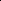

# ARNS: Adaptive Relation-Aware Negative Sampling with Curriculum Learning for Inductive Knowledge Graph Completion

<!-- Page 1 -->

ARNS: Adaptive Relation-Aware Negative Sampling with Curriculum Learning for Inductive Knowledge Graph Completion

Ling Ding1, Zhizhi Yu2*, Di Jin1,3*, Lei Huang1

## 1 School of Computer Science and Technology, Tianjin University, Tianjin,

China. 2 School of Software Engineering, Tianjin University, Tianjin, China. 3 Key Laboratory of Artificial Intelligence Application Technology, Qinghai Minzu University, Xining, China. {dltjdx2022, yuzhizhi, jindi, huanglei}@tju.edu.cn

## Abstract

Inductive knowledge graph completion (KGC) aims to predict missing links involving unseen entities, making it a particularly challenging task for knowledge representation learning. Traditional embedding-based methods often fall short in this setting due to their limited structural reasoning capabilities. Recently, Graph Neural Networks (GNNs) offer a promising alternative by explicitly modeling the graph topology. However, their performance heavily relies on the quality of negative samples during training, which significantly influences the learned representations and generalization ability. To tackle this issue, we propose Adaptive Relation-Aware Negative Sampling (ARNS), a negative sampling approach specifically tailored for GNN-based inductive KGC. It integrates three key strategies: (1) High-quality negatives via Linear WD for discriminative learning, (2) Relation-aware negatives utilizing relation graphs to preserve structural patterns, as well as (3) Adaptive curriculum learning that dynamically adjusts sampling ratios based on performance feedback. Our key innovation lies in a performance-driven adaptation mechanism that monitors training dynamics and modulates negative sample difficulty. This approach starts with easier samples for stability, and progressively introduces challenging negatives. Experiments demonstrate that ARNS outperforms state-of-the-art methods with significant MRR improvements while maintaining training stability. The adaptive design is particularly beneficial in inductive scenarios, where models can infer structural patterns from limited observations.

## Introduction

Knowledge Graph (KG) serves as fundamental infrastructure for various AI applications, encoding structured knowledge as triplets of entities and relations. Knowledge graph completion (KGC) aims to predict missing links in incomplete KGs, which is crucial for downstream tasks such as question answering (Huang et al. 2019), intelligent virtual assistant (Cai and Wang 2018), and recommendation systems (Wang et al. 2019). In real-world scenarios, new entities constantly emerge and need to be integrated into existing KGs, which makes inductive KGC, the ability to handle unseen entities and relations during inference, increasingly important. However, transductive methods such as TransE

*Corresponding Authors. Copyright © 2026, Association for the Advancement of Artificial Intelligence (www.aaai.org). All rights reserved.

(Bordes et al. 2013) fail to generalize to both new entities and new relations, necessitating inductive approaches that learn generalizable patterns from graph structures.

Inductive KGC focuses on predicting missing links involving entities and relations that are unseen during training. Most existing GNN-based inductive approaches perform transductive inference for relations, such as GraIL (Teru, Denis, and Hamilton 2020), which uses relational graph neural networks for subgraph reasoning, and CoMPILE (Mai et al. 2021), which employs compositional message passing networks. These methods assume that all relations are observed during training and remain fixed at inference time, limiting their GNN architectures to learn only entity-level generalizations. However, real-world scenarios often demand semi-inductive inference, where both known and new relations coexist, or the more challenging fully inductive inference, where all relations are unseen during inference. Recently, several fully inductive approaches have been proposed to extend GNN frameworks to support reasoning over previously unseen relations. For example, RMPI (Geng et al. 2023) employs enclosing subgraph sampling with relational message passing neural networks to construct relation-aware GNNs, and InGram (Lee, Chung, and Whang 2023) uses relation graphs with multi-head attention mechanisms to enable unseen relations. These approaches mark significant progress toward enabling true inductive inference by addressing both new entities and relations. However, there is still a persistent challenge named Space Efficiency (Cai and Wang 2018) in this line of research.

Common KGs such as Freebase (Toutanova and Chen 2015) and NELL (Xiong, Hoang, and Wang 2017) by default store only beliefs, rather than disbeliefs (Cai and Wang 2018). As a result, these datasets naturally contain only positive examples during training. Motivated by this, two prevalent approaches have been widely adopted for negative sample construction, namely random sampling and entity typeconstrained sampling. Random sampling corrupts positive triplets by replacing entities with randomly selected alternatives (Bollacker et al. 2008). Methods like InGram (Lee, Chung, and Whang 2023) employ this strategy. However, randomly sampled entities are often completely irrelevant to the original context, resulting in trivially distinguishable negatives. For instance, LocatedIn (Paris, Basketball) is clearly nonsensical and provides little useful training signal.

The Fortieth AAAI Conference on Artificial Intelligence (AAAI-26)

14657

<!-- Page 2 -->

Differently, entity type-constrained sampling uses external ontological knowledge (Krompaß, Baier, and Tresp 2015) to ensure semantic plausibility, but is frequently unavailable or incomplete in real data, thereby limiting practical applicability. More importantly, beyond quality concerns, existing negative sampling approaches suffer from a fundamental limitation: they rely on static, single-strategy methods throughout training. This leads to a critical mismatch between fixed sampling strategies and evolving model capabilities. Random negatives provide weak supervision, while high-quality negatives maintain a constant level of difficulty that may either overwhelm the model in early stages or fail to challenge it later on. Effective learning, therefore, requires a progressive curriculum, where the difficulty of negative samples adapts dynamically to the model’s current state.

To address these limitations, we propose Adaptive Relation-aware Negative Sampling, termed ARNS, a novel approach that synergistically combines multiple complementary negative sampling strategies with performancedriven adaptive control mechanism. Specifically, we first leverage the Linear WD (L-WD) method (Cornell et al. 2024) to generate high-quality negatives based on relationlevel patterns, providing structurally challenging examples that respect local graph topology. Then, inspired by In- Gram’s relation graphs (Lee, Chung, and Whang 2023), we introduce relation-aware negative sampling that captures relation-level semantics, generating negatives that are semantically plausible yet factually incorrect. After that, we incorporate random uniform sampling as a foundational component that ensures training stability and prevents overfitting to specific negative patterns. Finally, drawing inspiration from curriculum learning (Bengio et al. 2009), we recognize that effective learning should progress from simple to complex examples. Our controller continuously monitors model performance through MRR feedback and adjusts the mixture ratios of uniform negatives U(t), L-WD-based negatives L(t), and relation-aware negatives R(t) to optimize training effectiveness at each stage. This performancedriven adaptation ensures that the model receives appropriately challenging negative samples that neither overwhelm the learning process nor provide insufficient training signals, while avoiding reliance on external ontological resources that may be unavailable in practice.

The main contributions of this work are threefold.

• We propose ARNS, a novel approach that synergistically combines L-WD-based structural negatives, relationaware semantic negatives, and uniform random negatives to provide diverse and challenging training examples for inductive KGC models. • We introduce a performance-driven adaptive curriculum learning mechanism that monitors model performance via MRR feedback and dynamically adjusts the mixture ratios of different negative sampling strategies, thereby ensuring optimal learning progression. • We conduct extensive experiments on 3 different inductive scenarios and outperform 15 baseline models. Notably, the gains are particularly pronounced in fully inductive scenarios (100% new relations).

## Preliminaries

We first give the problem formulations, then give the definition of KGC, inductive learning, and negative sampling. Problem Formulation. A KG can be formally defined as G = (V, R, E), where V is a finite set of entities, R is a finite set of relations, and E ⊆V × R × V is a set of facts represented as triplets (h, r, t), where h, t ∈V are the head and tail entities respectively, and r ∈R is the relation. Inductive Learning. In the inductive KGC setting, we are given a training graph Gtr = (Vtr, Rtr, Etr) and need to perform link prediction on an inference graph Ginf = (Vinf, Rinf, Einf), where entities and relations are completely disjoint from the training set. Following the taxonomy in recent work (Lee, Chung, and Whang 2023) and (Ding et al. 2025), we distinguish three scenarios: (1) Traditional-inductive inference: Rtr = Rinf, (2) Semiinductive inference: Rtr ∩Rinf̸ = ∅and Rtr̸ = Rinf, (3) Fully-inductive inference: Rtr ∩Rinf = ∅. Training Objectives. A Knowledge Graph Embedding (KGE) model can be formulated as a scoring function f(h, r, t) that assigns a score to each possible triple. The fundamental assumption underlying KGE models is that the estimated likelihood of a triple being factually correct is monotonically related to its score produced by the scoring function. Higher scores typically indicate greater plausibility of the corresponding triple being true, while lower scores suggest a reduced likelihood of factual correctness. Formally, given a triple (h, r, t), the probability of its truthfulness can be expressed as: P((h, r, t) ∈G) = σ(f(h, r, t)), where σ(·) represents a monotonic activation function that maps the raw score to a probability space [0, 1]. Link Prediction. The link prediction task aims to predict missing triplets in Ginf by learning a scoring function f: Vinf × Rinf × Vinf →R that assigns higher scores to true triplets than to false ones. Given a query (h, r,?) or (?, r, t), the model ranks all candidate entities based on their scores and returns the top-ranked entities as predictions. The training process typically involves optimizing the scoring function using positive triplets from Etr and negative triplets sampled from the complement set, where effective negative sampling strategies become crucial for model performance, particularly in challenging inductive scenarios.

## Methodology

We first give a brief overview, and then introduce the proposed new method in detail.

Overview In this section, we first formalize the inductive KGC setting and demonstrate how different types of KGE models can benefit from improved negative sampling strategies. We then highlight a long-overlooked limitation in existing negative sampling approaches: their fundamental inability to generate high-quality negatives when both entities and relations are completely unseen during inference, which significantly undermines their effectiveness in inductive scenarios. To this end, we propose ARNS, a novel adaptive approach specifically designed to address the unique challenges of induc-

14658

<!-- Page 3 -->

**Figure 1.** The overall approach of ARNS, which combines three negative sampling strategies (Random, L-WD, and Relationaware) with an adaptive controller that dynamically adjusts sampling ratios based on performance feedback.

tive KGC. It consists of three synergistic components: (1) Linear WD Sampling that generates semantically plausible high quality negatives through relation co-occurrence patterns, (2) Relation Co-occurrence Graph Sampling that captures structural relation dependencies via relation graphs to enrich negative candidate pools, as well as (3) Adaptive Curriculum Learning Controller that dynamically adjusts the mixture of different negative sampling strategies based on real-time performance feedback, implementing a progressive learning paradigm from simple to challenging negatives throughout the training process.

Critical Role of Negative Samples Most KGE models, such as TransE (Bordes et al. 2013) and TransH (Wang et al. 2014), are optimized using a Marginal loss function based on contrastive learning frameworks, which heavily rely on the quality of negative samples. The standard training objective can be formulated as:

LM =

X

(h,r,t)∈E

[f(h, r, t) −f(h′, r, t′) + γ]+, (1)

where (h′, r, t′) represents negative samples with corrupted tail and head entities respectively, γ is the margin hyperparameter, and [·]+ denotes the hinge function, or formally (h′, r, t′) ∈{(h′, r, t)|h′ ∈V} ∪{(h, r, t′)|t′ ∈V}.

The effectiveness of this training paradigm critically depends on the semantic plausibility of negative samples. Trivial negatives (e.g., random entity substitutions) fail to pro- vide meaningful learning signals, as they are easily distinguished from positive triples, leading to: (1) Gradient vanishing: ∇L ≈0 when f(h, r, t) ≫f(h, r, t′); (2) Poor generalization: Models struggle with semantically similar but incorrect triples; (3) Inductive limitations: Inability to handle unseen entities and relations. Conversely, high-quality negatives that are semantically plausible, yet factually incorrect, provide informative gradients that guide the model toward learning fine-grained distinctions between true and false statements. This motivates our development of ARNS.

Linear WD Sampling

The Linear WD (L-WD) method, proposed by (Cornell et al. 2024), provides an efficient approach for generating semantically plausible negative samples in KGC (see Algorithm 1). L-WD constructs a global co-occurrence graph that captures how domains and ranges of different relations interact with shared entities. Given a G, L-WD extracts domains (head entities) and ranges (tail entities) for each relation, forming a binary association matrix B ∈R|E|×2·|R| where Bi,j = 1 indicates that entity ei has been observed as a head or tail of relation rj. The method then computes a co-occurrence matrix W = BT B and normalizes it row-wise to generate confidence scores between different domains and ranges. Finally, the relational scores X = BW provide entity-relation association strengths that can guide negative sampling toward semantically reasonable but incorrect candidates.

The matrices utilized in L-WD, including B, W, and the

14659

AI-readable visual equivalent, added: Figure extracted from the paper PDF and converted to an SVG wrapper asset. Use the surrounding page text and caption for interpretation.

<!-- Page 4 -->

## Algorithm

1: L-WD Algorithm (Cornell et al. 2024)

Require: G = {(h, r, t) | (h, r, t) ⊂V × R × V}

1: Set domains D = {(h, r) | ∀(h, r, t) ∈G} 2: Set ranges Rs = {(t, r + |R|) | ∀(h, r, t) ∈G} 3: Set Dr = D ∪Rs 4: B ∈R|V|×2·|R|, Bi,j ∈{0, 1} 5: Set Bi,j = ⊮((vi, xj) ∈Dr) ∀i ∈{1,..., |V|}, j ∈ {1,..., 2 · |R|} 6: Set W = BT B 7: Normalize W row-wise 8: Calculate score matrix X = BW 9: return score matrix X resulting score matrix, exhibit high sparsity, enabling efficient computational operations that can execute within seconds on a standard CPU. Unlike traditional WD approaches (Zangerle et al. 2016), L-WD eliminates the need for averaged squared confidence scores and minimum confidence thresholds, establishing itself as an essentially parameterfree rule mining framework that operates without confidence hyperparameters or iterative refinement processes. While L-WD demonstrates remarkable efficiency in transductive settings, its reliance on historical co-occurrence statistics creates significant limitations in inductive KGC scenarios. When encountering completely unseen entities and relations, the sparse co-occurrence patterns become insufficient for generating semantically meaningful negative samples. To address these challenges, our ARNS enhances the original L-WD foundation by incorporating global relation graphs and adaptive curriculum learning mechanisms.

Relation Co-occurrence Graph Sampling To enhance the quality of L-WD negative samples, we introduce a relation-aware strategy that leverages the semantic structure of KGs at the relation schema level. Our approach builds upon the relation co-occurrence graph model proposed by InGram (Lee, Chung, and Whang 2023), which captures semantic connections between relations through their shared entity patterns. We concentrate on exploiting this relational structure to generate more challenging and semantically plausible negative examples that will form the relation-aware component R(t) of the curriculum learning component. By identifying these semantic relations, we can generate negative samples that respect the relational schema while introducing factual incorrectness, thereby creating more informative training signals for knowledge graph embedding models. Given a relation graph Grel = (R, Erel, W) from the KG (Lee, Chung, and Whang 2023), we first identify semantically related neighbors for each relation. For any relation r, we select its k most strongly connected neighbors based on co-occurrence weights:

Nk(r) = arg max r′∈N (r),|S|=k

X r′∈S w(r, r′), (2)

where N(r) denotes the direct neighbors of relation r in the graph. This neighbor selection mechanism enables us to identify relations that share similar semantic properties, which form the foundation for generating semantically plausible but factually incorrect negative examples.

Building upon the semantic relations captured in the relation co-occurrence graph, we generate relation-aware entity candidates by aggregating entities from neighbor relations. The key insight is that semantically related relations often share similar entity types in their head and tail positions, making their associated entities natural candidates for creating challenging negative samples. For a given relation r and position pos ∈{head, tail}, we collect candidate entities from its semantic neighbors:

Cpos(r) =

[ r′∈Nk(r)

Epos(r′), (3)

Ehead(r) = {h|∃t: (h, r, t) ∈G},

Etail(r) = {t|∃h: (h, r, t) ∈G}. (4)

This candidate generation process creates pools of entities that are semantically reasonable for a given relation context but may not participate in facts, thereby providing a rich source of challenging negative examples that compel models to learn fine-grained relation distinctions. Our enhanced negative sampling strategy integrates relation-aware negatives with existing L-WD and random sampling approaches. The relation-aware component generates semantically plausible but factually incorrect negatives by replacing entities in positive triples with candidates drawn from related relations. For a positive triple (h, r, t), we create challenging negatives through strategic entity substitution:

R(t) ={(h′, r, t)|h′ ∈Sample(Chead(r), kent)}∪

{(h, r, t′)|t′ ∈Sample(Ctail(r), kent)}, (5)

where S ∈{Chead(r), Ctail(r)} and Sample(S, k) perform random sampling of k elements from set S. This creates negative examples that maintain semantic coherence at the relational level while introducing factual incorrectness, forcing embedding models to learn subtle distinctions between semantically similar but factually distinct KG triples.

The theoretical motivation behind this relation-aware sampling strategy lies in its ability to generate high-quality negative examples that challenge models in semantically meaningful ways. Unlike random negatives that may be trivially distinguishable, or purely structural negatives that focus only on entity-level patterns, relation-aware negatives respect the semantic organization of the knowledge graph while systematically violating factual constraints. This generates a more informative training signal that encourages models to develop a fine-grained understanding of both relational semantics and factual precision, ultimately leading to more robust and discriminative KG embeddings.

Adaptive Curriculum Learning Controller Inspired by curriculum learning principles (Bengio et al. 2009), we propose an Adaptive Curriculum Learning Controller that dynamically balances different negative sampling strategies throughout the training process. Our controller continuously monitors model performance and adjusts the composition of training samples to maintain optimal learning progression while preventing training collapse.

14660

<!-- Page 5 -->

Formally, we integrate three complementary negative sampling strategies into a unified curriculum:

T −= U(t) ∪L(t) ∪R(t), (6)

where U(t) represents random uniform negatives that provide foundational learning signals, L(t) denotes L-WDbased high-quality negatives for progressive difficulty enhancement, and R(t) consists of relation-aware negatives that introduce semantic challenges. The relative proportions of these strategies are governed by time-dependent mixing ratios αU(t): αL(t): αR(t), which evolve according to predetermined schedules and real-time performance feedback.

The curriculum scheduling mechanism operates through a two-stage adaptive process. Initially, base scheduling functions establish the fundamental progression trajectory, following established curriculum learning paradigms (Graves et al. 2017). The proportion of challenging negatives grows according to smooth progression functions:

αbase

L (t) = αmax

L · σ t

Ts

, αbase

R (t) = αmax

R · tanh t

Ts

, αbase

U (t) = 1 −αbase

L (t) −αbase

R (t),

(7)

where σ(·) denotes the sigmoid function and tanh(·) represents the hyperbolic tangent function, both providing smooth, non-linear transitions that prevent abrupt difficulty changes during training. The parameter Ts controls the progression speed, with larger values leading to more gradual curriculum advancement. These base schedules ensure a principled transition from predominantly random negatives (αbase

U (0) ≈1) in early training stages to a balanced composition that emphasizes semantic and structural challenges (αbase

L + αbase

R →αmax

L + αmax

R) in later stages. Building upon this foundation, the controller incorporates a performance-driven adaptation mechanism that responds to real-time training dynamics. By monitoring validation performance changes ∆MRR(t) = MRR(t) −MRR(t −1), we compute an adaptive factor β(t) that modulates the base scheduling functions. The final sampling ratios emerge through exponential moving averages that ensure stable transitions while maintaining responsiveness to performance signals. Following the momentum principles of Adam optimization (Kingma and Ba 2015), the adaptive sampling ratios can be calculated as:

αL(t) = µ · αL(t −1) + (1 −µ) · β(t) · αbase

L (t), αR(t) = µ · αR(t −1) + (1 −µ) · β(t) · αbase

R (t), αU(t) = 1 −αL(t) −αR(t).

(8)

where µ = 0.3 is the momentum coefficient that balances stability against adaptability. This exponential moving average formulation ensures that the controller can respond quickly to performance changes without introducing excessive volatility in the sampling strategy.

This adaptive curriculum framework embodies several important key design principles that distinguish it from existing approaches. The early training phase emphasizes random negatives to establish stable gradient flows and prevent mode collapse, gradually transitioning to incorporate structured challenges as the model develops representational capacity. The progressive introduction of L-WD and relationaware negatives creates a natural and smooth difficulty progression that challenges the model with increasingly sophisticated negative examples. Through this combination of principled scheduling and adaptive feedback, our controller maintains optimal learning trajectories while ensuring robust convergence across diverse KG datasets.

## Experiments

We first give the experimental setup, and then compare our approach with state-of-the-art methods on inductive and traditional inductive link prediction. For inductive link prediction, we evaluate performance under both semi-inductive and fully inductive scenarios with respect to relations. Finally, we present comprehensive ablation studies to analyze the contributions of individual components in our approach.

## Experimental Setup

Datasets. We conduct KGC link prediction experiments on two commonly used public datasets, namely FB15K-237 (Toutanova and Chen 2015) and NELL995 (Xiong, Hoang, and Wang 2017). Due to the differences in experimental scenarios compared to traditional KGC methods, we adopt the approach by (Lee, Chung, and Whang 2023) to design and process FB15K-237 and NELL995 into six distinct datasets, corresponding to traditional inductive learning scenarios (without new relations) and inductive scenarios. These inductive datasets are NL-50, FB-50, NL-100, and FB-100, where Vtrain̸ = Vinf, Rtrain̸ = Rinf, the dataset suffix -100 indicates that 100% new relations, and -50 indicates that 50% of new relations. For the entity part, we follow the assumption made by (Teru, Denis, and Hamilton 2020), where all entities in Ginf are considered new entities. Baselines. We compare ARNS with 15 models: CompGCN (Vashishth et al. 2020), NodePiece (Galkin et al. 2022), NeuralLP (Yang, Yang, and Cohen 2017), DRUM (Sadeghian et al. 2019), BLP (Daza, Cochez, and Groth 2021), QBLP (Ali et al. 2022), NBFNet (Zhu et al. 2021), RED-GNN (Zhang and Yao 2022), RAILD (Gesese, Sack, and Alam 2022), SE-GNN (Li et al. 2022), GreenKGC (Wang et al. 2023), GraIL (Teru, Denis, and Hamilton 2020), CoMPILE (Mai et al. 2021), RMPI (Geng et al. 2023) and InGram (Lee, Chung, and Whang 2023). Note that all the existing negative sampling models are not chosen as baselines, since they are specific to transductive KGC and fail to work on most of the datasets in our experiment. Implementation Details. To ensure fair evaluation, we configure both our approach and all baseline methods with dimensions d = 32 and ˆd = 32. We employ standard Glorot initialization (Glorot and Bengio 2010) for entity and relation, and adopt the Adam optimizer (Kingma and Ba 2015) along with PyTorch’s default initialization settings.

Inductive Link Prediction This experimental comparison demonstrates the performance of various methods on inductive link prediction

14661

<!-- Page 6 -->

FB-100 NL-100 FB-50 NL-50 Model MR ↓MRR Hit@10 Hit@1 MR ↓MRR Hit@10 Hit@1 MR ↓MRR Hit@10 Hit@1 MR ↓MRR Hit@10 Hit@1

CompGCN 1239.2 0.014 0.022 0.010 887.3 0.007 0.017 0.003 2331.9 0.003 0.006 0.002 1188.7 0.003 0.006 0.000 NodePiece 1111.1 0.007 0.008 0.001 777.2 0.015 0.017 0.004 1311.2 0.019 0.048 0.005 835.7 0.037 0.081 0.012 NeuralLP 977.5 0.025 0.061 0.009 558.9 0.078 0.191 0.030 1451.8 0.081 0.188 0.048 789.4 0.099 0.191 0.065 DRUM 980.0 0.033 0.070 0.010 583.8 0.073 0.133 0.040 833.8 0.066 0.127 0.035 453.1 0.155 0.328 0.072 BLP 890.2 0.018 0.037 0.007 561.1 0.021 0.047 0.009 571.3 0.070 0.157 0.035 428.5 0.037 0.095 0.013 QBLP 812.6 0.015 0.023 0.004 693.3 0.003 0.003 0.000 532.4 0.068 0.134 0.033 341.6 0.051 0.101 0.029 NBFNet 431.4 0.076 0.166 0.030 221.2 0.090 0.203 0.035 735.8 0.133 0.255 0.068 318.3 0.213 0.335 0.151 RAILD 698.3 0.038 0.061 0.022 571.5 0.023 0.047 0.011 N/A N/A N/A N/A N/A N/A N/A N/A SE-GNN 936.5 0.004 0.011 0.005 395.8 0.020 0.035 0.001 461.1 0.008 0.009 0.001 1717.7 0.002 0.003 0.000 GraIL N/A N/A N/A N/A 915.4 0.133 0.178 0.115 N/A N/A N/A N/A 818.7 0.155 0.258 0.101 CoMPILE N/A N/A N/A N/A 743.8 0.125 0.212 0.070 N/A N/A N/A N/A 449.6 0.187 0.307 0.135 RMPI N/A N/A N/A N/A 142.8 0.222 0.377 0.140 N/A N/A N/A N/A 470.1 0.188 0.307 0.100 GreenKGC 4953.3 0.001 0.002 0.000 1524.1 0.004 0.006 0.001 1994.6 0.138 0.254 0.083 1215.9 0.197 0.343 0.126 RED-GNN 361.3 0.113 0.258 0.050 196.8 0.210 0.378 0.111 1153.8 0.128 0.250 0.073 631.3 0.171 0.287 0.116 InGram 192.0 0.131 0.273 0.058 111.6 0.251 0.418 0.156 398.4 0.089 0.181 0.039 113.8 0.259 0.422 0.168

ARNS 151.9 0.251 0.436 0.172 129.7 0.293 0.489 0.217 452.5 0.123 0.235 0.068 144.1 0.266 0.424 0.181

**Table 1.** Inductive link prediction. The best results are boldfaced and the second-best results are underlined.

tasks across both fully inductive scenarios (-100) and semiinductive scenarios (-50). On FB-100, our ARNS dominates all evaluation criteria with MR of 151.9, MRR of 0.251, Hit@10 of 0.436, and Hit@1 of 0.172, representing substantial improvements over competing methods. Similarly, on NL-100, ARNS achieves the best results with MRR of 0.293 and Hit@10 of 0.489, demonstrating its robust ability to handle completely unseen data. In contrast, methods specifically designed for inductive scenarios, such as NBFNet, InGram, and RED-GNN, show markedly better performance. InGram consistently achieves second-best results across multiple datasets, particularly excelling in MR reduction, while NBFNet demonstrates strong performance in the Hit@10 metric on several datasets. The comparison between semi-inductive and fully inductive scenarios also reveals interesting patterns, with some methods showing improved performance when partial entity information is available (FB-50 vs FB-100), such as GreenKGC. “N/A” denotes result not available: Scalability issues with enclosing subgraph sampling let us fail to provide the results of GraIL, CoMPILE, and RMPI on FB dataset. The prohibition against new and unknown relations prevents us from offering RAILD results on FB-50 and NL-50.

Traditional Inductive Link Prediction

This auxiliary experiment provides interesting performance patterns that highlight the different strengths of various approaches across these two distinct inductive settings. On the NELL995-v1 dataset, ARNS demonstrates strong competitive performance despite not being specifically optimized for traditional inductive scenarios. While NBFNet achieves the best MR score of 7.2, ARNS secures second place with 9.2 and shows superior performance in MRR (0.637 vs 0.611) and Hit@1 (0.535 vs 0.503). This suggests that ARNS’s architectural innovations, originally designed for handling unseen relations, also contribute effectively to traditional entity-level induction. Notably, NodePiece achieves excep- tional performance in MRR (0.672) and Hit@10 (0.858), indicating its particular strength in entity representation learning, while methods like GraIL and CoMPILE show solid overall performance across multiple metrics. This performance difference suggests that while ARNS can handle traditional inductive scenarios reasonably well, its specialized design for relation-level challenges may not provide the same level of optimization for pure entity-level induction. The fact that ARNS still maintains competitive performance validates its robustness. Details are in Table 2.

## Model

MR MRR Hit@10 Hit@1

GraIL 18.9 0.489 0.588 0.398 CoMPILE 19.9 0.477 0.558 0.393 RMPI 52.2 0.468 0.557 0.422 CompGCN 13.9 0.289 0.740 0.006 NodePiece 10.2 0.672 0.858 0.543 NeuralLP 35.4 0.557 0.787 0.411 DRUM 33.0 0.525 0.732 0.400 BLP 40.1 0.164 0.474 0.050 QBLP 17.5 0.332 0.575 0.245 NBFNet 7.2 0.611 0.834 0.503 RED-GNN 15.6 0.552 0.698 0.488 RAILD 115.3 0.063 0.221 0.001 SE-GNN 76.1 0.027 0.035 0.005 GreenKGC 56.5 0.179 0.345 0.085 InGram 11.1 0.402 0.625 0.230

ARNS 9.2 0.637 0.835 0.535

**Table 2.** Traditional inductive link prediction.

Ablation Study

This ablation study demonstrates the importance of ARNS’s sophisticated sampling strategies over random approaches. The comparison between sampling methods reveals the core innovation that only random sampling achieves significantly

14662

<!-- Page 7 -->

lower performance (MRR of 0.131 on FB-100 and 0.251 on NL-100) compared to the full ARNS model (0.251 and 0.293), highlighting the value of structured sampling in relational-level inductive reasoning. Both L-WD sampling and RelGraph sampling contribute meaningfully and complementarily to overall performance, removing L-WD drops FB-100 MRR to 0.217 and NL-100 to 0.262, while removing RelGraph results in similar degradation (0.211 and 0.259). The comparable performance loss from eliminating either sampling component indicates that they serve distinct yet equally important functions in capturing relational patterns. The synergistic effect of combining both strategies outperforms any individual approach, validating ARNS’s design philosophy that structured, knowledge-aware sampling is essential for effectively handling unseen relations, far superior to naive random sampling baselines.

FB-100 NL-100 MRR Hit@10 Hit@1 MRR Hit@10 Hit@1 w/o relation layer 0.155 0.225 0.113 0.135 0.299 0.071 w/o L-WD 0.217 0.335 0.121 0.262 0.435 0.172 w/o RelGraph 0.211 0.387 0.116 0.259 0.411 0.169 only random 0.131 0.273 0.058 0.251 0.418 0.156 w/o mean agg. 0.244 0.384 0.170 0.279 0.467 0.178 w/o sum agg. 0.188 0.285 0.129 0.211 0.343 0.166

ARNS 0.251 0.436 0.172 0.293 0.489 0.217

**Table 3.** Ablation study on FB-100 and NL-100 datasets.

Related Works

Inductive KGC. Inductive KGC aims to predict missing links that involve unseen entities and relations during training (Teru, Denis, and Hamilton 2020). Early inductive methods can be categorized into rule-based and embeddingbased approaches. For example, rule-based methods like AMIE+ (Gal´arraga et al. 2013) extract logical rules from the training graph and apply them to new entities, but often suffer from limited coverage and scalability issues. Embeddingbased methods represent the mainstream approach, with GraIL (Teru, Denis, and Hamilton 2020) pioneering the use of graph neural networks to learn inductive representations. Subsequent works like TACT (Chen et al. 2021) and CoM- PILE (Mai et al. 2021) further improve inductive performance through graph topologies awareness and compositional reasoning, respectively. More recent approaches based on GNN, such as NBFNet (Zhu et al. 2021) and RED- GNN (Zhang and Yao 2022), focus on learning generalizable graph structures and relational patterns.

Negative Sampling in KGC. Negative sampling is crucial for KGC. Traditional approaches employ uniform random sampling by corrupting head or tail entities in positive triplets (Bordes et al. 2013), but this strategy suffers from an excessive proportion of easy negative samples that provide limited learning signals, leading to slow convergence and suboptimal performance under the open-world assumption. Several improved strategies are proposed to address these limitations. For instance, RotatE (Sun et al. 2019) introduces self-adversarial sampling that weights negative samples by current scores to focus on high-quality samples. NSCaching (Zhang et al. 2019) improves computational efficiency through caching mechanisms. Weight Decay (Zangerle et al. 2016) dynamically adjusts entity sampling weights based on occurrence frequency and maintains these weights via linear decay, effectively balancing the sampling distribution. KBGAN (Cai and Wang 2018) employs adversarial networks to generate negative samples.

Relation-Aware Methods. Relations play a crucial role in KGC, as they encode semantic connections between entities and often exhibit more stable patterns compared to entity-specific features. This stability is particularly important in inductive settings where relation patterns learned from training entities must generalize to new entities (Chen et al. 2021). Traditional relation modeling approaches focus on learning relation embeddings through various geometric transformations. Methods like TransR (Lin et al. 2015) project entities into relation-specific spaces, while Dist- Mult (Yang et al. 2014) and model relations through multiplicative interactions. These approaches primarily capture relation semantics through embedding geometry, but fail to explicitly model relation co-occurrence patterns. Graphbased methods leverage the multi-relational structure of KGs to improve relation understanding. Recent works have begun to explore relation co-occurrence patterns in KGs. For example, RMPI (Geng et al. 2023) employs enclosing subgraph sampling to construct relational message passing networks. InGram (Lee, Chung, and Whang 2023) uses the relation degrees to construct relation graphs to generalize unknown domains. The potential of relation graphs for guiding negative sample generation has not been systematically investigated, particularly in inductive settings where relation patterns provide crucial generalization signals.

## Conclusion

We introduce ARNS, which demonstrates that combining relation-aware structural patterns with performance-driven curriculum learning significantly outperforms static sampling approaches across diverse inductive scenarios. Our key insight is that effective negative sampling must balance multiple complementary strategies rather than relying on a single approach. The adaptive framework we propose provides a principled solution to this challenge, achieving substantial improvements while maintaining training stability. The success across various inductive settings validates the importance of curriculum-driven learning in KGC. This work opens new directions for adaptive learning strategies in structured prediction tasks, highlighting the potential of performance-feedback mechanisms in dynamic knowledge environments. Our work represents a significant step toward more effective inductive KGC, providing a principled model that addresses both the quality and adaptivity challenges in negative sampling for dynamic KG scenarios.

14663

<!-- Page 8 -->

## Acknowledgments

This work was supported by the National Key Research and Development Program of China (No. 2023YFB2603904), and the National Natural Science Foundation of China (No. 92370111, No. 62272340, No. 62402337).

## References

Ali, M.; Berrendorf, M.; Galkin, M.; Thost, V.; Ma, T.; Tresp, V.; and Lehmann, J. 2022. Improving Inductive Link Prediction Using Hyper-Relational Facts. In Proceedings of the 31st International Joint Conference on Artificial Intelligence, 5259–5263. Bengio, Y.; Louradour, J.; Collobert, R.; and Weston, J. 2009. Curriculum learning. In Proceedings of the 26th Annual International Conference on Machine Learning, 41–48. Bollacker, K. D.; Evans, C.; Paritosh, P. K.; Sturge, T.; and Taylor, J. 2008. Freebase: a collaboratively created graph database for structuring human knowledge. In Proceedings of the ACM SIGMOD International Conference on Management of Data, 1247–1250. Bordes, A.; Usunier, N.; Garc´ıa-Dur´an, A.; Weston, J.; and Yakhnenko, O. 2013. Translating Embeddings for Modeling Multi-relational Data. In Advances in Neural Information Processing Systems, 2787–2795. Cai, L.; and Wang, W. Y. 2018. KBGAN: Adversarial Learning for Knowledge Graph Embeddings. In Proceedings of the 2018 Conference of the North American Chapter of the Association for Computational Linguistics: Human Language Technologies, 1470–1480. Chen, J.; He, H.; Wu, F.; and Wang, J. 2021. Topology- Aware Correlations Between Relations for Inductive Link Prediction in Knowledge Graphs. In Proceedings of the 35th AAAI Conference on Artificial Intelligence, 6271–6278. Cornell, F.; Jin, Y.; Karlgren, J.; and Girdzijauskas, S. 2024. Are We Wasting Time? A Fast, Accurate Performance Evaluation Framework for Knowledge Graph Link Predictors. CoRR, abs/2402.00053. Daza, D.; Cochez, M.; and Groth, P. 2021. Inductive Entity Representations from Text via Link Prediction. In Proceedings of the 21th ACM Web Conference, 798–808. Ding, L.; Huang, L.; Yu, Z.; Jin, D.; and He, D. 2025. Towards global-topology relation graph for inductive knowledge graph completion. In Proceedings of the AAAI Conference on Artificial Intelligence, volume 39, 11581–11589. Gal´arraga, L. A.; Teflioudi, C.; Hose, K.; and Suchanek, F. 2013. AMIE: association rule mining under incomplete evidence in ontological knowledge bases. In Proceedings of the 22nd International Conference on World Wide Web, 413– 422. Galkin, M.; Denis, E. G.; Wu, J.; and Hamilton, W. L. 2022. NodePiece: Compositional and Parameter-Efficient Representations of Large Knowledge Graphs. In Proceedings of the 10th International Conference on Learning Representations. Geng, Y.; Chen, J.; Pan, J. Z.; Chen, M.; Jiang, S.; Zhang, W.; and Chen, H. 2023. Relational Message Passing for

Fully Inductive Knowledge Graph Completion. In Proceedings of the 39th IEEE International Conference on Data Engineering, 1221–1233. Gesese, G. A.; Sack, H.; and Alam, M. 2022. RAILD: Towards Leveraging Relation Features for Inductive Link Prediction In Knowledge Graphs. In Proceedings of the 11th International Joint Conference on Knowledge Graphs, 82– 90. Glorot, X.; and Bengio, Y. 2010. Understanding the Difficulty of Training Deep Feedforward Neural Networks. In Proceedings of the 13th International Conference on Artificial Intelligence and Statistics, 249–256. Graves, A.; Bellemare, M. G.; Menick, J.; Munos, R.; and Kavukcuoglu, K. 2017. Automated curriculum learning for neural networks. In Proceedings of International Conference on Machine Learning, 1311–1320. Huang, X.; Zhang, J.; Li, D.; and Li, P. 2019. Knowledge Graph Embedding Based Question Answering. In Proceedings of the 12th ACM International Conference on Web Search and Data Mining, 105–113. Kingma, D. P.; and Ba, J. 2015. Adam: A Method for Stochastic Optimization. In Proceedings of the 3rd International Conference on Learning Representations. Krompaß, D.; Baier, S.; and Tresp, V. 2015. Type- Constrained Representation Learning in Knowledge Graphs. In Proceedings of the 14th International Semantic Web Conference, 640–655. Lee, J.; Chung, C.; and Whang, J. J. 2023. InGram: Inductive Knowledge Graph Embedding via Relation Graphs. In Proceedings of International Conference on Machine Learning, 18796–18809. Li, R.; Cao, Y.; Zhu, Q.; Bi, G.; Fang, F.; Liu, Y.; and Li, Q. 2022. How Does Knowledge Graph Embedding Extrapolate to Unseen Data: A Semantic Evidence View. In Proceedings of the 36th AAAI Conference on Artificial Intelligence, 5781–5791. Lin, Y.; Liu, Z.; Sun, M.; Liu, Y.; and Zhu, X. 2015. Learning Entity and Relation Embeddings for Knowledge Graph Completion. In Proceedings of the 29th AAAI Conference on Artificial Intelligence, 2181–2187. Mai, S.; Zheng, S.; Yang, Y.; and Hu, H. 2021. Communicative Message Passing for Inductive Relation Reasoning. In Proceedings of the 35th AAAI Conference on Artificial Intelligence, 4294–4302. Sadeghian, A.; Armandpour, M.; Ding, P.; and Wang, D. Z. 2019. DRUM: End-To-End Differentiable Rule Mining On Knowledge Graphs. In Advances in Neural Information Processing Systems, 15321–15331. Sun, Z.; Deng, Z.; Nie, J.; and Tang, J. 2019. RotatE: Knowledge Graph Embedding by Relational Rotation in Complex Space. In Proceedings of the 7th International Conference on Learning Representations. Teru, K. K.; Denis, E. G.; and Hamilton, W. L. 2020. Inductive Relation Prediction by Subgraph Reasoning. In Proceedings of the 37th International Conference on Machine Learning, volume 119, 9448–9457.

14664

<!-- Page 9 -->

Toutanova, K.; and Chen, D. 2015. Observed Versus Latent Features for Knowledge Base and Text Inference. In Proceedings of the 3rd Workshop on Continuous Vector Space Models and their Compositionality, 57–66. Vashishth, S.; Sanyal, S.; Nitin, V.; and Talukdar, P. P. 2020. Composition-based Multi-Relational Graph Convolutional Networks. In Proceedings of the 8th International Conference on Learning Representations. Wang, X.; Wang, D.; Xu, C.; He, X.; Cao, Y.; and Chua, T. 2019. Explainable Reasoning over Knowledge Graphs for Recommendation. In Proceedings of the Thirty-Third AAAI Conference on Artificial Intelligence, 5329–5336. Wang, Y.; Ge, X.; Wang, B.; and Kuo, C. J. 2023. GreenKGC: A Lightweight Knowledge Graph Completion Method. In Proceedings of the 61st Annual Meeting of the Association for Computational Linguistics, 10596–10613. Wang, Z.; Zhang, J.; Feng, J.; and Chen, Z. 2014. Knowledge graph embedding by translating on hyperplanes. In Proceedings of the 28th AAAI Conference on Artificial Intelligence. Xiong, W.; Hoang, T.; and Wang, W. Y. 2017. DeepPath: A Reinforcement Learning Method for Knowledge Graph Reasoning. CoRR, abs/1707.06690. Yang, B.; Yih, W.-t.; He, X.; Gao, J.; and Deng, L. 2014. Embedding entities and relations for learning and inference in knowledge bases. arXiv preprint arXiv:1412.6575. Yang, F.; Yang, Z.; and Cohen, W. W. 2017. Differentiable Learning of Logical Rules for Knowledge Base Reasoning. In Advances in Neural Information Processing Systems, 2319–2328. Zangerle, E.; Gassler, W.; Pichl, M.; Steinhauser, S.; and Specht, G. 2016. An Empirical Evaluation of Property Recommender Systems for Wikidata and Collaborative Knowledge Bases. In Proceedings of the 12th International Symposium on Open Collaboration. Zhang, Y.; and Yao, Q. 2022. Knowledge Graph Reasoning with Relational Digraph. In Proceedings of the 22th ACM Web Conference, 912–924. Zhang, Y.; Yao, Q.; Shao, Y.; and Chen, L. 2019. NSCaching: simple and efficient negative sampling for knowledge graph embedding. In Proceedings of the 2019 IEEE 35th International Conference on Data Engineering, 614–625. Zhu, Z.; Zhang, Z.; Xhonneux, L. A. C.; and Tang, J. 2021. Neural Bellman-Ford Networks: A General Graph Neural Network Framework for Link Prediction. In Advances in Neural Information Processing Systems, 29476–29490.

14665
