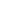

# AT-Field: Rethinking the Games in Adversarial Training

<!-- Page 1 -->

AT-Field: Rethinking the Games in Adversarial Training

Yixiao Xu1,2,3,4, Mohan Li2,3,4, ∗, Zhijie Shen5, Yuan Liu2,3,4, Zhihong Tian2,3,4, *

1Beijing University of Posts and Telecommunications 2Cyberspace Institute of Advanced Technology, Guangzhou University 3Guangdong Key Laboratory of Industrial Control System Security 4Huangpu Research School of Guangzhou University 5Surfilter Network Technology Co., Ltd.

## Abstract

Adversarial training is often modeled as a two-player zero-sum game, relying on strong assumptions that limit its practical guidance. In this paper, we instead analyze the interactions between training samples and show that even the fundamental objective—minimizing training loss—may not converge. To address this, we propose AT-Field, an adversarial training framework guided by sample-wise game-theoretic relationships. Specifically, we prove that training samples across different batches can form a none-potential game, where gradient descent induces cyclic behaviors, preventing convergence. By strategically searching and grouping these samples within the same batch, AT-Field transforms none-potential games into exact potential games, which are more effectively optimized using gradient-based methods. Experiments demonstrate that AT-Field integrates seamlessly with existing adversarial training techniques, enhancing both accuracy and robustness.

## Introduction

Adversarial attacks (Shen et al. 2024; Cheng et al. 2024; Cui et al. 2024) have raised growing concerns with the expanding applications (e.g., autonomous driving (Ando et al. 2023), authentication (George and Marcel 2021), etc.). As a basic countermeasure of adversarial attacks, adversarial training (Goodfellow, Shlens, and Szegedy 2015a; Madry et al. 2018; Zhang et al. 2019) provides a generalized ability against adversarial examples, thus becomes the fundamental of many other defense strategies (Tram`er et al. 2018; Adam et al. 2019).

A major challenge of adversarial training is the contradiction between the robustness and the accuracy of the target model (Benz et al. 2020), which promoted the study of different assumptions and empirical solutions (Su et al. 2018; Zhang et al. 2019; Yin et al. 2023). On the theoretical front, a series of efforts modeled and analyzed adversarial training as a two-player zero-sum game (Bul`o et al. 2017; Pal and Vidal 2020; Bose et al. 2020; Pinot et al. 2020; Meunier et al. 2021; Balcan et al. 2023). This modeling provided theoreticalpromised solutions for simple machine learning models. For example, Balcan et al. (Balcan et al. 2023) proved that even

*Corresponding authors: Mohan Li and Zhihong Tian (limohan@gzhu.edu.cn, tianzhihong@gzhu.edu.cn) Copyright © 2026, Association for the Advancement of Artificial Intelligence (www.aaai.org). All rights reserved.

**Figure 1.** Comparison of the Tain/Test Acc of AT-Field and the state-of-the-art method TDAT (Tong et al. 2024).

though a unique pure Nash equilibrium exists, the alternating best response training strategy of linear models may not converge. These game-theory-based methods help to better understand the adversarial training process and the trade-off between robustness and accuracy.

However, it is difficult to transfer these results to more complex deep learning scenarios due to their strong hypotheses. Some work assumed that model decisions are based on independent features (Balcan et al. 2023), which is not satisfied in deep classifiers where features are related to each others (Zhang et al. 2021). It is also difficult to find a closedform solution of adversarial examples compared to linear situations (Bose et al. 2020). These factors lead to a performance gap between game-theory-based algorithms and empirical solutions (Tong et al. 2024).

To address these challenges, we propose AT-Field, an adversarial training framework guided by sample-wise gametheoretic relationships. As the theoretical foundation of AT- Field, we explore the relationships between the training samples. In this game, the shared goal is to minimize the training loss. This game is not a zero-sum game, since the total training loss keeps changing. Specifically, we prove that samples in the same batch play a potential game, which can be effi-

The Fortieth AAAI Conference on Artificial Intelligence (AAAI-26)

27368

AI-readable visual equivalent, added: Figure extracted from the paper PDF and converted to an SVG wrapper asset. Use the surrounding page text and caption for interpretation.

<!-- Page 2 -->

ciently solved using gradient-based optimizers (Balduzzi et al. 2018). However, training samples across different batches can form a none-potential game, where gradient descent induces cyclic behaviors, preventing convergence. Therefore, AT-Field introduces a similarity-based sample matching strategy to search for corresponding samples and transform nonepotential games into potential games. As shown in Fig. 1, AT-Field promotes convergence of the training process. Our contributions are as follows.

• We propose AT-Field, an adversarial training framework guided by sample-wise game relationships. We provide a new perspective at the sample level for the analysis of games in adversarial training. • We prove that training samples across different batches can form a none-potential game, which leads to no convergence. Therefore, AT-Field introduces a similarity-based sample matching strategy to transform none-potential games into potential games. • AT-Field can integrate seamlessly with existing adversarial training techniques. Experiments show that it enhances both the accuracy and the robustness of the target model.

Games in Adversarial Training Preliminaries Adversarial Training Game A fundamental game can be denoted by a three-tuple (N, S, U), where N = {N1, N2,..., Nn} is the set of players, S = {S1, S2,..., Sn} is the set of strategy spaces of each player, and U = {U1, U2,...Un} is the set of payoff functions of each player, respectively. In this paper, we consider adversarial training as a n-player game among training samples in one training epoch. Under this assumption, Ni ∈N denotes the i-th training sample in the training dataset (consists of benign and adversarial examples), Si ∈S is the set of possible modifications of Ni on the model parameters, and Ui ∈U represents the training loss function visible to Ni.

Potential Game In game theory, potential games (Monderer and Shapley 1996) are a special kind of complete information games where the changes in the payoffs of all players can be expressed by a single global function. If a game is a potential game, then the Nash equilibrium can be computed (Rosenthal 1973) and first-order methods such as gradient decent provides acceptable results (Panageas, Piliouras, and Wang 2019). Formally, a game is called an exact potential game if there exists a potential function P: S →R satisfies that for every player Ni ∈N and for every strategy group S−i ∈S/Si,

Ui(S−i, Sij) −Ui(S−i, Sik) = P(S−i, Sij) −P(S−i, Sik)

, for every Sij, Sik ∈Si,

(1)

where S−i denotes the complementary set of Si.

Game in One Batch We first explore the game relationships of training samples in the same training batch. We can come up with several straightforward conclusions under this condition according to the definition of the training process. First, all players in this game share the same goal to minimize the training loss of this batch. Second, this is a complete information game since the payoff and the strategy space of each player is visible to others. Therefore, we propose Theorem 1. Theorem 1. Denote the set of n training samples in the same batch as N = {N1, N2,..., Nn}. If the corresponding payoff functions {U1, U2,...Un} satisfy that for every Ssub ∈S, U1(Ssub) = U2(Ssub) =... = Un(Ssub), then the game is an exact potential game.

The proof of Theorem 1 can be drawn from the definition of exact potential game directly:

Proof. Set a global payoff function U(Ssub) = U1(Ssub) = U2(Ssub) = · · · = Un(Ssub). Then we have:

Ui(S−i, Sij) −Ui(S−i, Sik) = U(S−i, Sij) −U(S−i, Sik)

= P(S−i, Sij) −P(S−i, Sik)

for every Sij, Sik ∈Si.

(2) According to Equation 1, the global payoff function U satisfies the definition of exact potential function. Therefore, the game defined in Theorem 1 is an exact potential game.

Previous work has demonstrated that first-order methods such as gradient decent can converge to a fixed point of the potential function when faced with potential games (Balduzzi et al. 2018). This fixed point is a local minimum or saddle of the potential function, which leads to a local Nash equilibrium, i.e., first-order methods are effectively in one batch.

Game in Different Batches The game relationship of training samples in different batches is more complex. Without loss of generality, we consider two groups of training samples Na = {Na1, Na2,..., Nan} and Nb = {Nb1, Nb2,..., Nbn} from two training bathes. The goal of each player is to minimize the training loss of its own batch. Therefore, players in different batches play an incomplete information game since the payoff is only visible in the same batch. Thus the game in different batches is not a potential game which requires complete information. Given that first-order methods may not converge when dealing with specific types of games (Balduzzi et al. 2018), there is a requirement of further analysis.

For a two-player incomplete information games, Harsanyi et al. (Harsanyi 1967) introduced a virtual player to determine the type of player one according to its real distribution. Then the player two play the game with imperfect believed prior distribution of the player one. So the fundamental problem is how to divide training samples into different types and determine the corresponding distributions. Here we divide players into two types according to the relationships of their potential functions, which provides with several useful conclusions in the following part of this section.

According to Theorem 1, players in Na and Nb play two potential games. Denote the potential function of Na and Nb as Pa and Pb, we can estimate the relationship of Na and Nb

27369

<!-- Page 3 -->

in a one-step gradient-based update using linear approximation. Therefore, we propose Lemma. 1.

Lemma 1. Denote the learning rate as µ, if for all ϵ that satisfies ||ϵ|| ≤µ, Pa(Ssub+ϵ)−Pa(Ssub) > 0 or Pa(Ssub+ ϵ) −Pa(Ssub) < 0, then for all ϵ that satisfies ||ϵ|| ≤µ, Pb(Ssub+ϵ)−Pb(Ssub) > 0 or Pb(Ssub+ϵ)−Pb(Ssub) < 0.

In other words, in a small area of strategy space, Pa and Pb are either positive correlated or negative correlated. Lemma 1 is based on the assumption that changes of the training loss is monotonic when the changes of parameter is small (learning rate). This assumption is the necessary condition for the training process to converge with a specific learning rate. Therefore, Lemma 1 can be proofed as follows.

Proof. Denote the parameter of the target network as θ and the training sample as X, Pa(Ssub) and Pb(Ssub) can be rewrite as Pa(θ, X) and Pb(θ, X). Since Pa and Pb are at least first-order differentiable with respect to θ and X. Then we can write the Taylor expansion of Pa(θ, X) and Pb(θ, X) at (θ0, X0) as:

P(θ, X) =P(θ0, X0)

+(θ −θ0)P′ θ(θ0, X0)

+(X −X0)P′

X(θ0, X0) + (0)n

≈P(θ0, X0) + (θ −θ0)P′ θ(θ0, X0)

+(X −X0)P′

X(θ0, X0).

(3)

When ||θ −θ0|| ≤µ, P(θ, X) can be approximated by the linear function F(θ, X)′ = P(θ0, X0) + (θ − θ0)P′ θ(θ0, X0)+(X −X0)P′

X(θ0, X0) which is monotonic. Therefore, in a small area of the strategy space Pa and Pb are approximately monotonic.

Since Pa and Pb can be considered as monotonic, there exists two possible relationships between Pa and Pb, namely positive correlated and negative correlated. Then we can divide the player one (samples in the first batches) into two types and discuss in different cases.

Case One (Pa ∝Pb). In this case, the game between samples from different batches can be modeled as a ordinate potential game.

Theorem 2. Denote the potential functions of samples in batch one and batch two as Pa and Pb, respectively. If Pa ∝ Pb, then all samples play an ordinate potential game.

Combining Theorem 1 and the definition of the potential game, we can get the proof of Theorem 2 as follows:

Proof. Note that for every player Ni ∈N and for every strategy group S−i ∈S/Si, we have

Ui(S−i, Sij) −Ui(S−i, Sik) = P(S−i, Sij) −P(S−i, Sik)

, for every Sij, Sik ∈Si.

Let Pglobal = Pa+Pb, if Ui(S−i, Sij)−Ui(S−i, Sik) > 0, then we have Pa(S−i, Sij) −Pa(S−i, Sik) > 0.

According to the assumption, Pa ∝ Pb, thus Pb(S−i, Sij) −Pb(S−i, Sik) > 0. Consequently, we have Pglobal(S−i, Sij) −Pglobal(S−i, Sik) > 0.

Conversely, it is straightforward that if Pglobal(S−i, Sij)− Pglobal(S−i, Sik) > 0, then Pa(S−i, Sij)−Pa(S−i, Sik) > 0 and Pb(S−i, Sij) −Pb(S−i, Sik) > 0, which means Ui(S−i, Sij) −Ui(S−i, Sik) > 0.

Therefore, Ui(S−i, Sij) −Ui(S−i, Sik) > 0 iff Pglobal(S−i, Sij) −Pglobal(S−i, Sik) > 0, where Pglobal matches the definition of an ordinate potential function.

In this case, samples from different batches play an ordinate potential game, thus gradient-decent-like methods are likely to behave well as in computing exact potential games.

Case Two (Pa ∝−Pb). In this case, the game in samples from different batches can not be modeled as a potential game. Instead, samples play a non-cooperative game where a increment of the payoff in one batch will strictly cause a decrement of the payoff in the other batch. Therefore, gradient-decentlike methods will not converge in player one in this case while searching for a fixed point for player two.

Basic Training v.s. Adversarial Training Theorem. 2 illustrates the possible none-potential game for training samples from different batches, we further discuss the probability of this game occurring in basic training and adversarial training process, respectively. Theorem 3. Denote the target model as F, the feature extractor of F as f, two training samples from different batches as (X1, y1) and (X2, y2). Then if ||f(X1) −f(X2)|| ≤ϵ and y1̸ = y1, (X1, y1) and (X2, y2) play a none-potential game.

Proof. Given that ||f(X1) −f(X2)|| ≤ ϵ, then the output probabilities satisfy PX1 ≈PX2, where P = {p1, p2,..., pn} denotes the output probabilities of N categories and satisfies p1 + p2 +... + pn = 1. Denote the potential functions of batch one and bath two, namely the crossentropy training loss functions, as L1 and L2, then we have L1(θ, X1, y1) = −log(py1 x1), L2(θ, X2, y2) = −log(py2 x2). Since PX1 ≈PX2, so py2 x2 ≈py2 x1 = 1−P i∈N/y1 pi x1. Therefore, L2(θ, X2, y2) ≈−log(1 −P i∈N/{y1,y2} pi x1 −py1 x1), which is negative related to L1(θ, X1, y1). Therefore, according to Case Two in Theorem. 2, (X2, y2) play a nonepotential game.

Theorem 3 lists three requirements for samples to play none-potential games: (1) they are from different batches; (2) they are close to each other in the latent feature space; (3) they belong to different categories. In basic training, benign samples may satisfy requirement (1) and (3), but naturally distributed samples from different categories may rarely be close to each other in the latent space. Nevertheless, adversarial examples are naturally projected by the model into the target latent space, which increases the probability that requirement (2) is satisfied.

Summarizing the above analysis, we can come up with the following conclusions.

27370

<!-- Page 4 -->

Theoretical Conclusions

## Conclusion

1: Training samples in the same batch play an exact potential game, which can be effectively solved using gradient decent. (Theorem 1) Conclusion 2: Training samples from different batches play an ordinate potential game if their own potential functions are positive related to each other. (Lemma 1, Theorem 2) Conclusion 3: Training samples from different batches play a none-potential game if they satisfy three requirements. (Lemma 1, Theorem 3) Conclusion 4: Compared to basic training, nonepotential games occur in adversarial training with a higher probability. (Theorem 3)

AT-Field We derive a practical strategy from the theoretical insights: if samples satisfying specific conditions are grouped into the same training batch, a none-potential game can be transformed into an exact potential game. Based on this, we propose AT-Field, an adversarial training framework that dynamically re-groups samples by similarity.

However, computing the entire dataset’s features at every step would introduce unacceptable computational overhead. To address this, AT-Field updates the cache of clean features only once every K iterations, rather than at every epoch or batch. This design leverages Conclusion 4, which states that none-potential games are more likely to emerge between clean and adversarial pairs than among clean samples alone. Thus, the model only recomputes clean features intermittently while maintaining matching accuracy.

Formally, given a current model F(·) and clean training dataset Dclean = {(Xi, yi)}N i=1, AT-Field periodically computes normalized features:

zclean i = F(Xi), ∀i = 1,..., N.

These features are stored along with their corresponding inputs and labels in a clean feature cache, which is reused across multiple training steps until the next update.

During training, for each adversarial batch Xadv, we compute the normalized adversarial features zadv = F(Xadv). Then, cosine similarity is computed between each adversarial feature and all cached clean features:

sim(Xadv i, Xclean j) = ˜zadv i · ˜zclean j.

For each adversarial example Xadv i, we identify the most similar clean sample index:

j∗= arg max j sim(Xadv i, Xclean j). (4)

Once the best-matching clean sample (Xj∗, yj∗) is found, the total loss is computed by combining the baseline adversarial loss and the matched clean loss:

Ladv = (1 −λ) · Lbase(X, y) + λ · Lbase(Xmatch, ymatch), (5)

## Algorithm

1: AT-Field

Require: Model Fθ, dataset D, interval K, weight λ

1: Initialize clean feature cache (Zclean, Yclean) ←∅ 2: for each step t = 1 to T do 3: if t mod K = 0 then 4: Update (Zclean, Yclean) with features from D

5: Sample (X, y) ∼D; generate Xadv via FGSM 6: Zadv ←Fθ(Xadv) 7: Find most similar clean samples by cosine similarity 8: Compute L1 = Lbase(Xadv, y) 9: Compute L2 = Lbase(Xmatch, ymatch) 10: L = (1 −λ)L1 + λL2 11: Update θ using ∇θL where Lbase denotes the loss function used in baseline adversarial training (e.g., cross-entropy with label smoothing), and λ is a balancing hyperparameter.

The additional time complexity introduced by AT-Field mainly stems from the similarity computation process. In practice, we only update the cache every K steps (e.g., K = 100). Algorithm. 1 provides the pseudo-code for AT-Field.

Experimental Results In this section, we evaluate AT-Field on different datasets and compare its performances with different baseline methods.

Experimental Settings Dataset and Models We evaluate AT-Field on three widelyused datasets, CIFAR-10 (Krizhevsky, Hinton et al. 2009), CIFAR-100 (Krizhevsky, Hinton et al. 2009), and Tiny- ImageNet (Deng et al. 2009). CIFAR-10 and CIFAR-100 contain 60,000 images (32×32) across 10 and 100 classes, respectively, and Tiny-ImageNet consists of 100,000 images (64×64) spanning 200 classes. Following previous methods (Jia et al. 2024; Tong et al. 2024), we conduct experiments on ResNet-18 (He et al. 2016).

Baseline Methods We utilize 9 state-of-the-art Adversarial Training methods: FGSM-RS (Wong, Rice, and Kolter 2020), Free (Shafahi et al. 2019), GAT (Sriramanan et al. 2020), FGSM-SDI (Jia et al. 2022b), FGSM-PGI (Jia et al. 2022a), GradAlign (Andriushchenko and Flammarion 2020), N-FGSM (de Jorge Aranda et al. 2022), FGSM-LAW (Jia et al. 2024), and TDAT (Tong et al. 2024).

For adversarial attacks, we adopt FGSM (Goodfellow, Shlens, and Szegedy 2015b), BMI (Kurakin, Goodfellow, and Bengio 2017), PGD (Madry et al. 2018), C&W (Carlini and Wagner 2017), and Auto-Attack (AA) (Croce and Hein 2020) with different iterations to evaluate defense methods.

## Evaluation

Metrics We use the Clean Accuracy (CA) and the Robust Accuracy (RA) against different attacks to show the effect of different adversarial training methods on model usability and robustness, respectively.

Implementation Details The experiments are conducted on 64-bit Ubuntu 22.04.5 LTS system with NVIDIA A800 GPUs and the CUDA version of 12.4.

27371

<!-- Page 5 -->

## Method

Clean FGSM BIM PGD-10 PGD-50 C&W APGD AA

FGSM-RS (ICLR’20) Best 83.69 62.00 47.20 47.66 45.96 46.10 46.13 42.80 Last 83.69 62.00 47.20 47.66 45.96 46.10 46.13 42.80

Free (NeurIPS’19) Best 81.38 60.81 48.74 49.07 47.62 46.98 47.90 44.37 Last 81.38 60.81 48.74 49.07 47.62 46.98 47.90 44.37

GAT (NeurIPS’20) Best 81.53 64.18 53.72 54.05 52.95 49.76 53.23 47.68 Last 81.88 64.30 52.89 53.23 51.86 49.71 52.05 47.08

FGSM-SDI (TIP’22) Best 83.55 63.60 51.46 51.94 50.34 49.09 50.61 46.31 Last 83.73 63.75 51.28 51.88 50.09 49.42 50.43 46.34

FGSM-PGI (ECCV’22) Best 81.71 65.02 54.87 55.26 54.38 50.88 54.62 48.60 Last 81.71 65.02 54.87 55.26 54.38 50.88 54.62 48.60

GradAlign (NeurIPS’20) Best 80.45 60.56 48.80 49.11 47.63 46.94 47.85 43.92 Last 80.45 60.56 48.80 49.11 47.63 46.94 47.85 43.92

N-FGSM (NeurIPS’22) Best 80.35 60.93 49.59 49.83 48.51 47.37 48.59 44.54 Last 80.35 60.93 49.59 49.83 48.51 47.37 48.59 44.54

FGSM-LAW (TIFS’24) Best 82.19 65.53 56.58 57.14 55.94 51.40 56.03 48.12 Last 82.19 65.53 56.58 57.14 55.94 51.40 56.03 48.12

TDAT (AAAI’24) Best 82.25 66.15 56.57 56.85 55.90 50.18 55.94 48.33 Last 82.25 66.15 56.57 56.85 55.90 50.18 55.94 48.33

AT-Field (Ours) Best 83.07 66.14 57.03 57.37 56.73 51.54 55.94 48.58 Last 83.84 66.54 56.58 56.94 56.22 51.16 55.53 48.36

**Table 1.** Comparison of different ATs on CIFAR-10. The best and second-best results are shown in bold and underlined, respectively. Best indicates the best checkpoint during training, and Last indicates the accuracy of the last checkpoint.

The implementation of AT-Field is based on TDAT, for fair comparison, we keep the parameters in TDAT unchanged and compare experimental results with the results reported in TDAT. For FGSM-LAW, we follow the reported implementation details and reproduce the results in the same environment as TDAT. For AT-Field, the two hyperparameter K and λ are set to 100 and 0.1 in main experiments, respectively. Please refer to the supplementary materials for further details.

Performance Comparison Results on CIFAR-10 Tab. 1 shows the evaluation results of AT-Field and baseline methods on CIFAR-10. AT-Field achieves the highest robust accuracy at the best checkpoint against FGSM (+0.39%), BIM (+0.45%), PGD-10 (+0.23%), PGD-50 (+0.79%), and C&W (+0.14%) compared to other methods, and ranks second against APGD (-0.09%) and AA (- 0.02%). More importantly, AT-Field improves clean accuracy by 0.88% and 0.82% over FGSM-LAW and TDAT, respectively, showing its ability to balance robustness and accuracy. In addition, AT-Field shows stable performance, as the last checkpoint also achieves 2 best and 3 second-best results.

## Results

on CIFAR-100 Tab. 2 shows the evaluation results on CIFAR-100. A similar trend can be observed in Tab. 2 like Tab. 1. AT-Field achieves the highest robust accuracy at the best checkpoint against FGSM (+0.92%), BIM (+0.27%), PGD-10 (+0.75%), and PGD-50 (+0.83%) compared to other methods. It also improves clean accuracy by 0.88% and 2.09% over FGSM-LAW and TDAT, respectively.

**Figure 2.** Blank experiments of AT-Field with different sample-matching strategies on CIFAR-10.

## Results

on Tiny-ImageNet Due to length constraints, we have included the experimental results for Tiny-ImageNet in Tab. 1 of the supplementary materials.

Ablation Study

Blank Experiment Given that the key design of AT-Field is similarity-based sample matching, it is straightforward to design blank experiments with different matching strategies. As depicted in Fig. 2, by replacing the most similar sample matching strategy with random matching and least similar sample matching, the accuracy and robustness of AT-Field degrades to the same level as baseline methods, proving the validity of our theoretical analysis and the proposed method.

27372

AI-readable visual equivalent, added: Figure extracted from the paper PDF and converted to an SVG wrapper asset. Use the surrounding page text and caption for interpretation.

<!-- Page 6 -->

## Method

Clean FGSM BIM PGD-10 PGD-50 C&W APGD AA

FGSM-RS (ICLR’20) Best 51.67 31.02 22.42 22.61 21.75 20.92 21.87 18.72 Last 51.67 31.02 22.42 22.61 21.75 20.92 21.87 18.72

Free (NeurIPS’19) Best 52.06 32.13 24.48 24.74 24.04 22.43 23.99 20.23 Last 52.06 32.13 24.48 24.74 24.04 22.43 23.99 20.23

GAT (NeurIPS’20) Best 57.49 36.77 28.91 29.14 28.30 25.14 28.42 23.11 Last 57.58 36.85 28.87 29.06 28.30 24.97 28.43 23.02

FGSM-SDI (TIP’22) Best 58.64 37.23 28.60 28.78 27.67 25.85 27.83 23.27 Last 58.54 37.19 28.53 28.71 27.72 25.55 27.89 23.18

FGSM-PGI (ECCV’22) Best 58.78 40.02 31.43 31.94 31.19 28.23 31.21 25.65 Last 58.82 39.83 31.22 31.65 30.89 27.75 30.93 25.43

GradAlign (NeurIPS’20) Best 54.90 35.28 26.77 27.13 26.22 25.10 26.39 22.30 Last 55.22 35.11 26.82 27.12 26.24 24.94 26.52 22.19

N-FGSM (NeurIPS’22) Best 54.41 35.00 26.99 27.01 26.34 25.08 26.31 22.81 Last 54.41 35.00 26.99 27.01 26.34 25.08 26.31 22.81

FGSM-LAW (TIFS’24) Best 58.53 41.26 32.64 31.73 31.38 28.91 33.24 25.62 Last 58.53 41.26 32.64 31.73 31.38 28.91 33.24 25.62

TDAT (AAAI’24) Best 57.32 40.29 33.33 33.56 33.06 28.47 33.15 26.61 Last 57.32 40.29 33.33 33.56 33.06 28.47 33.15 26.61

AT-Field (Ours) Best 59.41 42.18 33.60 34.31 33.89 28.82 33.03 26.51 Last 59.41 42.18 33.60 34.31 33.89 28.82 33.03 26.51

**Table 2.** Accuracy Comparisons of Different AT Methods on CIFAR-100. The best and second-best results are shown in bold and underlined, respectively. Best indicates the best checkpoint during training, and Last indicates the accuracy of the last checkpoint.

Value Clean FGSM BIM PGD-50 AA

TDAT - 82.25 66.15 56.57 55.90 48.33

K

100 83.07 66.14 57.03 56.73 48.58 200 83.84 65.41 56.59 56.13 48.42 400 83.81 65.31 56.43 55.92 47.96 λ

0.05 83.19 66.18 56.49 56.18 48.30 0.1 83.07 66.14 57.03 56.73 48.58 0.2 84.18 65.31 56.34 55.97 47.94 0.3 85.95 65.13 55.43 55.22 46.85 0.4 86.65 63.65 53.58 53.19 43.48 0.5 87.84 62.04 51.89 50.23 40.54

**Table 3.** Ablation results on CIFAR-10 with different hyperparameters. The best results are shown in bold.

Hyperparameter Selection AT-Field has two hyperparameters, the updating frequency K and the weight parameter λ. Tab. 3 provides the ablation results of hyperparameters with different values. According to Algorithm 1, a smaller K value results in more accurate sample matching, but is also more computational expensive. As shown in Tab. 3, K = 100 yielding the best performance, as expected. Meanwhile, K = 200 and k = 400 also achieve comparable results, providing alternative choices for balancing effectiveness and efficiency.

Hyperparameter λ balances the weight of the original loss of baseline methods and the clean matching loss of AT-Field. Therefore, Increasing λ will cause the model to focus on elim-

Epoch TDAT (Best) AT-Field (Best)

CA RA CA RA

50 80.37 55.59 82.36 ↑ 56.03 ↑ 70 81.30 56.39 83.68 ↑ 56.08 ↓ 90 82.07 56.46 82.88 ↑ 56.91 ↑ 110 82.25 56.85 83.07 ↑ 57.37 ↑ 130 82.53 56.98 83.25 ↑ 57.34 ↑ 150 82.61 57.08 83.72 ↑ 57.76 ↑

**Table 4.** Comparison of TDAT and AT-Field with different training epochs on CA and RA (PGD-10).

inating non-potential games. However, excessive λ will also result in a trade-off between robustness and accuracy. The experimental results in Tab. 3 are consistent with expectations. As the value of λ increases from 0.05 to 0.5, the accuracy of the model gradually increases, while its robustness first improves and then decreases. It is worth noting that this change is gradual, demonstrating the stability of AT-Field.

Different Training Epochs We compare TDAT and AT- Field with different training epochs on CIFAR-10. As shown in Tab. 4, AT-Field outperforms TDAT in both rapid training and long-term improvement. This is because AT-Field eliminates non-potential games in real time during training, thereby accelerating convergence and promoting the achievement of local Nash equilibrium.

27373

<!-- Page 7 -->

## Method

Clean BIM PGD-10 PGD-50 AA

FGSM-LAW 82.19 56.58 57.14 55.94 48.12 FGSM-LAW (+) 83.64 ↑ 57.10 ↑ 57.45 ↑ 56.64 ↑ 48.57 ↑

TDAT 82.25 56.57 56.85 55.90 48.33 TDAT (+) 83.07 ↑ 57.03 ↑ 57.37 ↑ 56.73 ↑ 48.58 ↑

**Table 5.** Comparison of AT-Field with different backbone methods on CIFAR-10. (+) indicates that AT-Field is added.

**Figure 3.** Comparison of time and GPU overhead.

Different Backbone Methods As shown in Tab. 5, we evaluate AT-Field with different backbone methods. Since the new matching mechanism introduced by AT-Field does not conflict with existing methods, it can be seamlessly integrated with them. Experimental results show that AT-Field can improve the accuracy and robustness of existing AT methods.

Time & GPU Overhead Similarity-based sample matching and similarity storage incur additional computational and storage overhead. Fig. 3 shows the additional overhead of AT- Field compared to the baseline method. Since the overhead of TDAT is significantly lower than most other baselines (Tong et al. 2024), the total overhead of AT-Field is acceptable.

## Related Work

Adversarial Training (AT) Standard AT Adversarial training formulates adversarial defense as a min-max optimization problem, where adversarial examples are crafted to maximize the training loss, and the model is updated to minimize it (Goodfellow, Shlens, and Szegedy 2015a). Standard AT aims to improve both robustness and accuracy. To achieve this goal, Madry et al. (Madry et al. 2018) proposed to generate strong adversarial examples using the PGD Attack for AT.

Later works explored to balance clean and robust accuracy. Zhang et al. (Zhang et al. 2019) proposed TRADES, which adds a boundary error term to the loss function to manage the trade-off. Yin et al. (Yin et al. 2023) introduced a feature similarity loss to further guide training. More recently, dataaugmentation-based methods (Wang et al. 2023; Bartoldson et al. 2024) use diffusion models to create extra training data, improving generalization of AT. However, these approaches usually require high overhead.

Fast AT To improve efficiency, Fast ATs (Shafahi et al. 2019; Wong, Rice, and Kolter 2020) replaced the muti-step

PGD Attack with the single step FGSM Attack (Goodfellow, Shlens, and Szegedy 2015a). To maintain robustness under limited computation, Fast ATs often introduce strong inductive biases. For example, Sriramanan et al. (Sriramanan et al. 2020) introduced a relaxation term to the standard loss to help converges. Andriushchenko et al. (Andriushchenko and Flammarion 2020) proposed GradAlign, which reduces overfitting by aligning adversarial gradients.

Recent Fast ATs (Jia et al. 2024; Tong et al. 2024) systematically evaluated different inductive biases introduced in Fast AT and achieved performances close to standard ATs with far less computational overhead. Therefore, we mainly consider Fast ATs in this paper.

Game Theory in Adversarial Training Since adversarial training naturally involves competition between attackers and defenders, game theory provides a useful framework for analysis. Pal et al. (Pal and Vidal 2020) showed that, under a local linear model, fast gradient attacks and randomized defenses can form a Nash equilibrium. Pinot et al. (Pinot et al. 2020) modeled the problem as an infinite zero-sum game and showed that no Nash equilibrium exists when both attacker and defender are deterministic. Meunier et al. (Meunier et al. 2021) extended this by showing that randomized strategies remove the duality gap, guaranteeing an approximate Nash equilibrium. Balcan et al. (Balcan et al. 2023) proved that even if a pure Nash equilibrium exists, training with alternating best responses may still fail to converge. It also discussed the cyclic behavior in the AT of linear models. However, most existing theories are high-level and rely on strict assumptions (e.g., linear assumptions), making them less practical for guiding AT of deep learning models.

## Conclusion

In this paper, we model adversarial training as a multi-player non-zero-sum game among training samples and show that none-potential games between samples from different batches can lead to cyclic behavior and hinder convergence. To address this, we propose AT-Field, an adversarial training framework that uses pairwise game relationships to group similar samples and turn none-potential games into exact potential games. Experiments demonstrate that AT-Field integrates seamlessly with existing adversarial training methods and improves both accuracy and robustness.

## Limitations

Although AT-Field uses approximation algorithms, it still requires a 20-50% increase in training costs, which may lead to higher defense overhead. The most relevant future work is to find more efficient data structures and mapping algorithms to avoid none-potential games.

## Acknowledgments

This work was supported by National Natural Science Foundation of China(U2436208, 62372129, 62372126), Guangdong S&T Program (2024B0101010002), Project of Guangdong Key Laboratory of Industrial Control System Security, (2024B1212020010), Guangdong Basic and Applied Basic Research Foundation (2023A1515030142), Guangzhou Basic and Applied Basic Research Foundation (2025A04J2947),

27374

AI-readable visual equivalent, added: Figure extracted from the paper PDF and converted to an SVG wrapper asset. Use the surrounding page text and caption for interpretation.

<!-- Page 8 -->

the Academician Fang Binxing Workstation in Hainan Province, China (Grant No. YSGZZ2023003), the specific research fund of The Innovation Platform for Academicians of Hainan Province, China (Grant No. YSPTZX202506)

## References

Adam, G.; Smirnov, P.; Haibe-Kains, B.; and Goldenberg, A. 2019. Reducing Adversarial Example Transferability Using Gradient Regularization. CoRR, abs/1904.07980. Ando, A.; Gidaris, S.; Bursuc, A.; Puy, G.; Boulch, A.; and Marlet, R. 2023. RangeViT: Towards Vision Transformers for 3D Semantic Segmentation in Autonomous Driving. In IEEE/CVF Conference on Computer Vision and Pattern Recognition, CVPR 2023, Vancouver, BC, Canada, June 17- 24, 2023, 5240–5250. Andriushchenko, M.; and Flammarion, N. 2020. Understanding and Improving Fast Adversarial Training. In Larochelle, H.; Ranzato, M.; Hadsell, R.; Balcan, M.; and Lin, H., eds., Advances in Neural Information Processing Systems 33: An- nual Conference on Neural Information Processing Systems 2020, NeurIPS 2020, December 6-12, 2020, virtual. Balcan, M.; Pukdee, R.; Ravikumar, P.; and Zhang, H. 2023. Nash Equilibria and Pitfalls of Adversarial Training in Adversarial Robustness Games. In International Conference on Artificial Intelligence and Statistics, 25-27 April 2023, Palau de Congressos, Valencia, Spain, volume 206 of Proceedings of Machine Learning Research, 9607–9636. Balduzzi, D.; Racani`ere, S.; Martens, J.; Foerster, J. N.; Tuyls, K.; and Graepel, T. 2018. The Mechanics of n-Player Differentiable Games. In International Conference on Machine Learning, ICML 2018, Stockholmsm¨assan, Stockholm, Sweden, July 10-15, 2018, volume 80 of Proceedings of Machine Learning Research, 363–372. Bartoldson, B. R.; Diffenderfer, J.; Parasyris, K.; and Kailkhura, B. 2024. Adversarial Robustness Limits via Scaling-Law and Human-Alignment Studies. In Forty-first International Conference on Machine Learning, ICML 2024, Vienna, Austria, July 21-27, 2024. JMLR.org.

Benz, P.; Zhang, C.; Karjauv, A.; and Kweon, I. S. 2020. Robustness May Be at Odds with Fairness: An Empirical Study on Class-wise Accuracy. In NeurIPS 2020 Workshop on Pre-registration in Machine Learning, 11 December 2020, Virtual Event, volume 148 of Proceedings of Machine Learn- ing Research, 325–342. Bose, A. J.; Gidel, G.; Berard, H.; Cianflone, A.; Vincent, P.; Lacoste-Julien, S.; and Hamilton, W. L. 2020. Adversarial Example Games. In Annual Conference on Neural Information Processing Systems, NeurIPS 2020, December 6-12, 2020, virtual. Bul`o, S. R.; Biggio, B.; Pillai, I.; Pelillo, M.; and Roli, F. 2017. Randomized Prediction Games for Adversarial Machine Learning. IEEE Transactions on Neural Networks and Learning Systems., 28(11): 2466–2478. Carlini, N.; and Wagner, D. A. 2017. Towards Evaluating the Robustness of Neural Networks. In IEEE Symposium on Security and Privacy, SP 2017, San Jose, CA, USA, May 22-26, 2017, 39–57.

Cheng, Z.; Liu, Z.; Guo, T.; Feng, S.; Liu, D.; Tang, M.; and Zhang, X. 2024. BadPart: Unified Black-box Adversarial Patch Attacks against Pixel-wise Regression Tasks. In International Conference on Machine Learning, ICML 2024, Vienna, Austria, July 21-27, 2024.

Croce, F.; and Hein, M. 2020. Reliable evaluation of adversarial robustness with an ensemble of diverse parameter-free attacks. In International Conference on Machine Learning, ICML 2020, 13-18 July 2020, Virtual Event, volume 119 of Proceedings of Machine Learning Research, 2206–2216. Cui, X.; Aparcedo, A.; Jang, Y. K.; and Lim, S. 2024. On the Robustness of Large Multimodal Models Against Image Adversarial Attacks. In IEEE/CVF Conference on Computer Vision and Pattern Recognition, CVPR 2024, Seattle, WA, USA, June 16-22, 2024, 24625–24634. de Jorge Aranda, P.; Bibi, A.; Volpi, R.; Sanyal, A.; Torr, P. H. S.; Rogez, G.; and Dokania, P. K. 2022. Make Some Noise: Reliable and Efficient Single-Step Adversarial Training. In Advances in Neural Information Processing Systems 35: An- nual Conference on Neural Information Processing Systems 2022, NeurIPS 2022, New Orleans, LA, USA, November 28 - December 9, 2022. Deng, J.; Dong, W.; Socher, R.; Li, L.; Li, K.; and Fei-Fei, L. 2009. ImageNet: A large-scale hierarchical image database. In 2009 IEEE Computer Society Conference on Computer Vision and Pattern Recognition (CVPR 2009), 20-25 June 2009, Miami, Florida, USA, 248–255. George, A.; and Marcel, S. 2021. Cross Modal Focal Loss for RGBD Face Anti-Spoofing. In IEEE Conference on Computer Vision and Pattern Recognition, CVPR 2021, virtual, June 19-25, 2021, 7882–7891. Goodfellow, I. J.; Shlens, J.; and Szegedy, C. 2015a. Explaining and Harnessing Adversarial Examples. In International Conference on Learning Representations, ICLR 2015, San Diego, CA, USA, May 7-9, 2015, Conference Track Proceedings. Goodfellow, I. J.; Shlens, J.; and Szegedy, C. 2015b. Explaining and Harnessing Adversarial Examples. In International Conference on Learning Representations, ICLR 2015, San Diego, CA, USA, May 7-9, 2015, Conference Track Proceedings. Harsanyi, J. C. 1967. Games with incomplete information played by “Bayesian” players, I–III Part I. The basic model. Management science, 14(3): 159–182. He, K.; Zhang, X.; Ren, S.; and Sun, J. 2016. Deep Residual Learning for Image Recognition. In IEEE Conference on Computer Vision and Pattern Recognition, CVPR 2016, Las Vegas, NV, USA, June 27-30, 2016, 770–778.

Jia, X.; Chen, Y.; Mao, X.; Duan, R.; Gu, J.; Zhang, R.; Xue, H.; Liu, Y.; and Cao, X. 2024. Revisiting and Exploring Efficient Fast Adversarial Training via LAW: Lipschitz Regularization and Auto Weight Averaging. IEEE Transactions on Information Forensics and Security., 19: 8125–8139. Jia, X.; Zhang, Y.; Wei, X.; Wu, B.; Ma, K.; Wang, J.; and Cao, X. 2022a. Prior-Guided Adversarial Initialization for Fast Adversarial Training. In Computer Vision - ECCV 2022 - 17th European Conference, Tel Aviv, Israel, October 23-27,

27375

<!-- Page 9 -->

2022, Proceedings, Part IV, volume 13664 of Lecture Notes in Computer Science, 567–584. Springer. Jia, X.; Zhang, Y.; Wu, B.; Wang, J.; and Cao, X. 2022b. Boosting Fast Adversarial Training With Learnable Adversarial Initialization. IEEE Transactions on Image Processing., 31: 4417–4430. Krizhevsky, A.; Hinton, G.; et al. 2009. Learning Multiple Layers of Features from Tiny Images. Kurakin, A.; Goodfellow, I. J.; and Bengio, S. 2017. Adversarial Machine Learning at Scale. In 5th International Conference on Learning Representations, ICLR 2017, Toulon, France, April 24-26, 2017, Conference Track Proceedings.

OpenReview.net. Madry, A.; Makelov, A.; Schmidt, L.; Tsipras, D.; and Vladu, A. 2018. Towards Deep Learning Models Resistant to Adversarial Attacks. In International Conference on Learning Representations, ICLR 2018, Vancouver, BC, Canada, April 30 - May 3, 2018, Conference Track Proceedings. Meunier, L.; Scetbon, M.; Pinot, R.; Atif, J.; and Chevaleyre, Y. 2021. Mixed Nash Equilibria in the Adversarial Examples

Game. In International Conference on Machine Learning, ICML 2021, 18-24 July 2021, Virtual Event, volume 139 of Proceedings of Machine Learning Research, 7677–7687. Monderer, D.; and Shapley, L. S. 1996. Potential games. Games and economic behavior, 14(1): 124–143. Pal, A.; and Vidal, R. 2020. A Game Theoretic Analysis of Additive Adversarial Attacks and Defenses. In Annual Conference on Neural Information Processing Systems, NeurIPS 2020, December 6-12, 2020, virtual. Panageas, I.; Piliouras, G.; and Wang, X. 2019. First-order methods almost always avoid saddle points: The case of vanishing step-sizes. In Annual Conference on Neural Information Processing Systems 2019, NeurIPS 2019, December 8-14, 2019, Vancouver, BC, Canada, 6471–6480. Pinot, R.; Ettedgui, R.; Rizk, G.; Chevaleyre, Y.; and Atif, J. 2020. Randomization matters How to defend against strong adversarial attacks. In International Conference on Machine Learning, ICML 2020, 13-18 July 2020, Virtual Event, volume 119 of Proceedings of Machine Learning Research, 7717–7727. Rosenthal, R. W. 1973. A class of games possessing purestrategy Nash equilibria. International Journal of Game Theory, 2: 65–67.

Shafahi, A.; Najibi, M.; Ghiasi, A.; Xu, Z.; Dickerson, J. P.; Studer, C.; Davis, L. S.; Taylor, G.; and Goldstein, T. 2019. Adversarial training for free! In Annual Conference on Neural Information Processing Systems, NeurIPS 2019, December 8-14, 2019, Vancouver, BC, Canada, 3353–3364. Shen, M.; Li, C.; Li, Q.; Lu, H.; Zhu, L.; and Xu, K. 2024. Transferability of White-box Perturbations: Query-Efficient Adversarial Attacks against Commercial DNN Services. In USENIX Security Symposium, USENIX Security 2024, Philadelphia, PA, USA, August 14-16, 2024. Sriramanan, G.; Addepalli, S.; Baburaj, A.; and R., V. B. 2020. Guided Adversarial Attack for Evaluating and Enhancing Adversarial Defenses. In Larochelle, H.; Ranzato, M.;

Hadsell, R.; Balcan, M.; and Lin, H., eds., Advances in Neural Information Processing Systems 33: Annual Conference on Neural Information Processing Systems 2020, NeurIPS 2020, December 6-12, 2020, virtual. Su, D.; Zhang, H.; Chen, H.; Yi, J.; Chen, P.; and Gao, Y. 2018. Is Robustness the Cost of Accuracy? - A Comprehensive Study on the Robustness of 18 Deep Image Classification Models. In European Conference on Computer Vision ECCV, Munich, Germany, September 8-14, 2018, Proceedings, Part XII, volume 11216 of Lecture Notes in Computer Science, 644–661. Tong, K.; Jiang, C.; Gui, J.; and Cao, Y. 2024. Taxonomy Driven Fast Adversarial Training. In Thirty-Eighth AAAI Conference on Artificial Intelligence, AAAI 2024, Thirty-Sixth Conference on Innovative Applications of Artificial Intelligence, IAAI 2024, Fourteenth Symposium on Educational Advances in Artificial Intelligence, EAAI 2014, February 20- 27, 2024, Vancouver, Canada, 5233–5242. AAAI Press. Tram`er, F.; Kurakin, A.; Papernot, N.; Goodfellow, I. J.; Boneh, D.; and McDaniel, P. D. 2018. Ensemble Adversarial Training: Attacks and Defenses. In 6th International Conference on Learning Representations, ICLR 2018, Vancouver, BC, Canada, April 30 - May 3, 2018, Conference Track Proceedings. OpenReview.net.

Wang, Z.; Pang, T.; Du, C.; Lin, M.; Liu, W.; and Yan, S. 2023. Better Diffusion Models Further Improve Adversarial Training. In International Conference on Machine Learning, ICML 2023, 23-29 July 2023, Honolulu, Hawaii, USA, volume 202 of Proceedings of Machine Learning Research, 36246–36263. PMLR. Wong, E.; Rice, L.; and Kolter, J. Z. 2020. Fast is better than free: Revisiting adversarial training. In International Conference on Learning Representations, ICLR 2020, Addis Ababa, Ethiopia, April 26-30, 2020.

Yin, J.; Chen, B.; Zhu, W.; Chen, B.; and Liu, X. 2023. Push Stricter to Decide Better: A Class-Conditional Feature Adaptive Framework for Improving Adversarial Robustness. IEEE Transactions on Information Forensics and Security., 18: 2119–2131. Zhang, H.; Xie, Y.; Zheng, L.; Zhang, D.; and Zhang, Q. 2021. Interpreting Multivariate Shapley Interactions in DNNs. In Thirty-Fifth AAAI Conference on Artificial Intelligence, AAAI 2021, Thirty-Third Conference on Innovative Applica- tions of Artificial Intelligence, IAAI 2021, The Eleventh Symposium on Educational Advances in Artificial Intelligence, EAAI 2021, Virtual Event, February 2-9, 2021, 10877–10886. AAAI Press. Zhang, H.; Yu, Y.; Jiao, J.; Xing, E. P.; Ghaoui, L. E.; and Jordan, M. I. 2019. Theoretically Principled Trade-off between Robustness and Accuracy. In International Conference on Machine Learning, ICML 2019, 9-15 June 2019, Long Beach, California, USA, volume 97 of Proceedings of Machine Learning Research, 7472–7482.

27376
