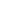

# Attribute-guided Dynamic Prompt Learning for Graph Neural Networks

<!-- Page 1 -->

Attribute-guided Dynamic Prompt Learning for Graph Neural Networks

Zhuomin Liang1, Liang Bai1*, Xian Yang2

## 1 Institute of Intelligent Information Processing, Shanxi University, Taiyuan, 030006, China 2 Alliance Manchester Business

School, The University of Manchester, Manchester, M13 9PL, UK 202112407007@email.sxu.edu.cn, bailiang@sxu.edu.cn, xian.yang@manchester.ac.uk

## Abstract

Graph Neural Networks (GNNs) have achieved remarkable success in analyzing graph-structured data, with their performance dependent on the graph structure. However, models trained on high-quality graph structures often suffer a significant performance drop when evaluated on perturbed graphs. Existing methods tackle this problem by improving the robustness of GNNs, but they often overlook representation deviation caused by structural changes. To address this limitation, we propose an attribute-guided dynamic prompt learning model that generates prompt vectors to approximate the intrinsic information of nodes. With these prompt vectors, the trained GNNs are expected to maintain their performance under perturbed graph structures. Unlike previous prompt-based methods that learn unified prompt vectors for all nodes, we obtain node-level prompts by encoding node attributes that provide unique information. Given the diversity of perturbed graph structures during inference, we introduce a structureaware adaptation mechanism that adjusts the prompt vectors based on the input graph. Furthermore, we apply gradientbased attacks to generate perturbed graphs, encouraging the model to generalize to unseen structures. Extensive experiments on multiple benchmark datasets demonstrate the effectiveness and robustness of our model.

Code — https://github.com/graphlearning1/AttrPrompt

## Introduction

Graph Neural Networks (GNNs) have emerged as powerful tools for analyzing graph-structured data, achieving great success in various applications, such as social network analysis (Sun et al. 2023b), recommender systems (Jung, Kim, and Park 2023), and traffic prediction (Jia et al. 2023). Their effectiveness stems from the message-passing mechanism, which updates node representations by aggregating information from neighboring nodes (Wu et al. 2021). This process is based on a key assumption: the most relevant information for classifying or embedding a node is contained in its local neighborhood (Mostafa, Nassar, and Majumdar 2021). Therefore, the performance of GNNs is inherently dependent on the quality and stability of graph structure.

*Liang Bai is the corresponding author. Copyright © 2026, Association for the Advancement of Artificial Intelligence (www.aaai.org). All rights reserved.

Mathematics Computer science

Correct Wrong Representation deviation

Decision Boundary

Class center

(a) Rep. deviation (b) Impact of structural degradation

**Figure 1.** Illustration of the effects of structural degradation.

In real-world scenarios, dynamic environments or adversarial perturbations (Wu et al. 2024a; Jin et al. 2020) cause the graph structure at inference to differ from that during training. These changes cause structural degradation via noisy or missing edges, which disrupt the aggregation process in GNNs. As a result, node representations drift away from their true class centers and be closer to incorrect ones (Ye et al. 2020), as shown in Figure 1(a), which is referred to as representation deviation. For example, as shown in Figure 1(b), a computer science author in a citation network may also collaborate with mathematicians. If links to computer science collaborators are removed, the node’s neighborhood may be dominated by mathematicians, making it to be misclassified into the mathematics category. Such representation deviation caused by structural degradation can significantly impair the performance of GNNs (Xia et al. 2023). Since structural degradations are often unknown and unpredictable, developing effective strategies to improve the robustness of GNNs remains a critical challenge.

To address this challenge, existing methods improve the robustness of GNNs by encouraging consistent predictions between the original graph and its augmentation (Xia et al. 2023; Wu et al. 2022). As illustrated in Figure 2a, these methods often retrain GNNs using carefully designed modules. Although they help establish well-defined decision boundaries (Yang et al. 2020), they remain dependent on reliable structures and cannot handle severely degraded topology. Meanwhile, some methods attempt to reconstruct a new graph based on the perturbed structures (Li et al. 2024), as illustrated in Figure 2b. However, the reconstruction process inherently depends on the current local structure, limiting its effectiveness in low-quality structure.

Graph prompt learning introduces task-specific knowledge into pre-trained models, helping to align downstream

The Fortieth AAAI Conference on Artificial Intelligence (AAAI-26)

23442

<!-- Page 2 -->

**Figure 2.** Comparison between the existing methods.

objectives with the pre-training tasks (Sun et al. 2023c). Inspired by this, we aim to inject node-level information into the trained GNNs to preserve representation consistency under perturbed graph structures. However, existing prompt learning methods rely on shared prompt vectors for all nodes, which limits their ability to capture node-specific information and makes them less adaptable to various structural degradation. Node attributes capture the unique information of each node (Wang et al. 2020; Zhao et al. 2023), which serves as a reliable source for maintaining representation consistency. Therefore, we learn prompt vectors from node attributes, as illustrated in Figure 2c. These prompt vectors provide auxiliary information that approximates disrupted neighborhood representations.

In this paper, we propose an Attribute-guided dynamic Prompt learning model for graph neural networks, namely AttrPrompt, which aims to improve the effectiveness of GNNs under structural degradation. Unlike most previous studies that retrain or fine-tune GNNs, AttrPrompt adapts the input data to frozen GNNs via dynamically generated attribute-guided prompts. These prompt vectors guide GNNs to make consistent predictions across both wellstructured and perturbed graphs. To achieve this, we learn fixed prompt vectors from node attributes and personalize them based on the perturbed graph structure generated through gradient-based attacks. These perturbed graph structures expose the model to the worst-case structural variations during training, improving its generalization to unseen graph structure. The main contributions are as follows:

• We learn adaptive prompt vectors from node attributes to adjust the predictions of trained GNNs. Without modifying the parameters of GNNs, our method maintains robust performance across perturbed graph structures. • We design a prompt adaptation module that adjusts prompt vectors, allowing GNNs to generalize across diverse perturbed graph structure. • The results on multiple benchmark datasets demonstrate that our method enables GNNs to achieve performance comparable to that on the original data when tested on low-quality graph structures.

## Related Work

GNN and Their Sensitivity to Structure Graph Neural Networks (GNNs) encode complex graphstructure data into low-dimensional representations (Wu et al. 2019). GCN (Kipf and Welling 2017) aggregates neighborhood information through iterative message passing over the graph topology. GAT (Velickovic et al. 2018) introduces an attention mechanism to adaptively learn aggregation weights, thereby mitigating the influence of noisy edges. APPNP (Klicpera, Bojchevski, and G¨unnemann 2019) leverages personalized PageRank to propagate transformed node features, which improves the efficiency of representation learning. Given the rapid progress in this area, a detailed summary of related work is available in (Wu et al. 2021; Zhang et al. 2024). These methods rely on the quality of the graph structure and are highly sensitive to structural changes during inference.

Robust GNNs against Structural Degradation Although GNNs have achieved great success in many graph applications, the performance of trained GNNs is affected by the graph structure. To address this limitation, recent studies have explored strategies for improving model robustness through graph data augmentation. For example, EERM (Wu et al. 2022) introduces adversarial context generators to create multiple environments for invariant representations. Xia et al. (Xia et al. 2023) propose a cluster information transfer mechanism that generates cross-cluster nodes, thereby promoting the learning of invariant representations. CaNet (Wu et al. 2024b) employs causal intervention to learn the correlations between ego-graph features and target nodes’ labels, reducing the impact of the environment on the prediction results. StruRW (Liu et al. 2023b) estimates edge probabilities based on pseudo labels for neighbor sampling. To avoid retraining GNNs, GraphTTA (Chen et al. 2022) fine-tunes the trained GNNs using a contrastive learning variant as a selfsupervised task. GOOD-AT (Li et al. 2024) enhances the robustness of GNNs during testing by leveraging an ensemblebased detector to refine the graph structure before prediction. Matcha (Bao et al. 2025) adaptively integrates multi-hop information, which is supervised by the prediction-informed clustering loss. However, these methods overlook the representation deviation induced by structural degradation.

Graph Prompt Learning Prompt-based learning facilitates the adaptation of pretrained models to downstream tasks by incorporating learned prompts into the input space (Liu et al. 2023a). As a parameter-efficient approach that avoids modifying parameters of the pre-trained models, it has recently gained increasing attention in the field of graph learning (Zi et al. 2024). GPPT (Sun et al. 2022) formulates the downstream node classification problem as an edge prediction task. Allin-one (Sun et al. 2023a) integrates a learnable prompt graph into the original graph to narrow the gap between pretraining and downstream tasks. To be applicable to diverse pre-training strategies, GPF and GPF-plus (Fang et al. 2023) introduce additional learnable prompt vectors into node attributes. MultiGPrompt (Yu et al. 2024) designs a set of pretext tokens during pre-training and introduces a dual-prompt mechanism for prompt learning. However, these methods primarily focus on aligning the objectives of pre-training and downstream tasks. Since prior work demonstrates that prompt vectors implicitly modify graph structures (Fang

23443

<!-- Page 3 -->

et al. 2023), we leverage prompt learning to enhance the robustness of GNNs against structural degradation.

Preliminary Notations Let G = (X, A) be a graph with a set of nodes V = {v1, v2,..., vN}. Here, X ∈RN×D is the attribute matrix that encodes node features. A ∈RN×N represents a symmetric adjacency matrix that captures the relationships between the nodes, where ai,j = 1 indicates an edge between nodes vi and vj; otherwise, ai,j = 0. The label matrix Y ∈RN×C contains one-hot vectors, where each row yi ∈RC indicates the class of node vi among the C classes.

Graph Neural Networks Graph Neural Networks (GNNs) have been widely applied to node classification tasks, aiming to predict node labels from learned representations. Given a graph G = (X, A), GNNs update each node’s representation by iteratively aggregating information from its neighbors. After k iterations of aggregation, the representation z(k)

i of node vi will be r(k)

i = AGGREGATE(k) n z(k−1)

j: j ∈Ni o

, z(k)

i = COMBINE(k)

z(k−1)

i, r(k)

i

,

(1)

where Ni are the neighbors of vi defined by A, z(0)

i is initialized to xi. The function AGGREGATE(k) aggregates the representations from the neighbors of nodes, while COMBINE(k) updates node representations. The output of GNN is Z = fGNN(A, X), with node predictions given by ˜Y = softmax(Z). Since aggregation depends heavily on the local graph structure, the quality of A directly affects the learned representations and final predictions. Existing GNNs typically use the same adjacency matrix A during both training and inference phases. However, in realworld scenarios, the graph structure often changes over time, which degrades model performance.

Effect of Graph Structure on GNNs We conduct experiments to investigate the impact of structural degradation on the performance of GNNs. Specifically, GNNs are trained on the original graph structure, while inference is performed on perturbed graphs generated by randomly adding or removing edges. The perturbation ratio varies from 0 to 0.75 in increments of 0.25. Figure 3 shows the prediction accuracy of GCN (Kipf and Welling 2017) and APPNP (Klicpera, Bojchevski, and G¨unnemann 2019). As shown in the figure, both edge addition and deletion cause a drop in GNN performance, and the drop becomes more pronounced as the perturbation ratio increases. These results highlight the vulnerability of GNNs to graph structure. To address this issue, we introduce attribute-guided prompt vectors that approximate the missing neighborhood information and incorporate them into the input space, improving the robustness of the trained GNN without modifying their parameters.

+ 0.75+ 0.5+ 0.25 Raw- 0.25- 0.5- 0.75

40

60

80

100

ACC (%)

Perturbation Ratio

Cora Citeseer A-Photo A-Comp.

(a) GCN

Perturbation Ratio

+ 0.75+ 0.5+ 0.25 Raw- 0.25- 0.5- 0.75

40

60

80

100

(b) APPNP

**Figure 3.** Accuracy of GNNs under different structure perturbations. “+” / “-” indicate randomly adding/removing edges, and “Raw” represents the original graph.

## Method

Given a trained GNN fGNN(·) and a perturbed structure A′, our objective is to learn prompt vectors ˆP that are adapted to A′. These vectors are added to the original node attributes, enabling the GNN to make accurate predictions via ˜Y ∗= softmax(fGNN(A′, X + ˆP)). To achieve this, we propose a model named AttrPrompt, as illustrated in Figure 4, which consists of three modules: prompt learning module, prompt adaptation module and adversarial graph perturbation.

Prompt Learning Module In our model, prompt vectors serve as auxiliary signals that are injected into node features to compensate for corrupted neighborhood information. When the structure is degraded, we assume that node attributes remain highly correlated with the task. Therefore, we learn node-level prompt vectors (Zi et al. 2024) using node attributes that contain essential information of nodes. However, attribute vectors are often highdimensional and sparse, making it difficult to capture local structural patterns. To incorporate local structure, we construct an attribute-based KNN graph Gf = (Af, X), which encodes local similarity relationships in the attribute space:

af i,j =

1, xj ∈knn(xi), 0, otherwise, (2)

where af i,j denotes the entry at the i-th row and j-th column of Af, and knn(xi) denotes the k nearest neighbors of node vi based on the Euclidean distance. Based on the graph Gf, we apply a GNN encoder to generate fixed prompt vectors:

P = g(Af, X), (3) where g(·) is the encoder defined in Eq. (1), P ∈RN×D denotes the matrix of prompt vectors, and pi is the prompt for node vi. By learning prompts from stable and attributederived graphs, the model benefits from contextual guidance even when the graph structure is unreliable.

Prompt Adaptation Module Fixed prompts struggle to effectively mitigate the effects of structural degradation, which are often random and affect nodes differently. To address this, we introduce a structureaware adaptation mechanism that adaptively adjusts each

23444

<!-- Page 4 -->

...

Encoder

AGG MLP

KNN

Prediction

Prediction

Adversarial Graph Perturbation Prompt Adaptation Module

Prompt Learning Module

Trained GNN

Element-wise Addition Hadamard Product Trainable Frozen

**Figure 4.** Framework of AttrPrompt. Specifically, a fixed prompt P is generated from node attributes X. To adapt to a preturbed structure A′, the prompt is transformed into ˆP and fused with X to obtain prompted attributes X∗. X∗is fed into a frozen GNN along with A′ for prediction. A′ is adversarially generated during training and used as the input graph during testing.

prompt vector based on the local structure of the perturbed graph. Given a perturbed adjacency matrix A′, we learn element-wise adaptation on the prompt vector pi using a scaling-based transformation technique (Liu, Nguyen, and Fang 2021). The scaling vectors are learned via a linear transformation of aggregated neighborhood features from the perturbed graph, which is formulated as:

Γ = LeakyReLU(W A′X), (4)

where Γ is a vector of scaling factors, W is a shared learnable weight matrix, and LeakyReLU(·) is a activation function. The adapted prompt vector is then obtained as:

ˆpi = (γi + 1) ⊙pi, (5)

where 1 is a vector of ones to ensure that the scaling factors are centered around one, γi is the ith of Γ, and ⊙denotes element-wise multiplication. We generate the prompted attributes by injecting the adapted prompt vectors into the original attribute matrix, which is formulated as follows:

X∗= {x1 + ˆp1, x2 + ˆp2,..., xN + ˆpN}. (6)

During inference, the prompted attributes X∗replace the original attributes X for prediction by the trained GNN.

Adversarial Graph Perturbation

Since perturbed graph structures are often unpredictable, we generate worst-case perturbations using gradient-based attacks on the original graph. Specifically, we introduce a differentiable perturbation matrix ∆, initialized as a zero matrix, which represents learnable edge noise added to the original adjacency. The perturbed graph structure is then initialized as: A′ = A + ∆. To encourage prediction consistency between the original graph G = (A, X) and the perturbed graph G′ = (A′, X), we minimize their prediction discrepancy using the Kullback–Leibler (KL) divergence loss LKL(G′, G). To update ∆towards a worst-case perturbation, we employ the Fast Gradient Sign Method (FGSM) (Goodfellow, Shlens, and Szegedy 2015), which estimates the direction that maximally increases the discrepancy in a single step. Then, ∆is updated using the gradient ∇∆LKL with respect to the perturbation matrix ∆, which is formulated as:

∆←Proj[−ϵ,ϵ] (∆+ η · sign(∇∆Lkl)), (7)

where η is the step size, and Proj[−ϵ,ϵ](·) denotes an elementwise projection operation that constrains each entry of ∆ within the range [−ϵ, ϵ]. After the update, we obtained the worst-case perturbed adjacency matrix as:

A′ = Clamp(A + ∆, 0, 1), (8)

where Clamp(·) clips each element to lie within the interval [0, 1], thereby maintaining a valid adjacency. The generated matrix is then used to generate prompt vectors and train the model under perturbations.

Loss Function With the prompt vectors, we expect the frozen GNN to yield consistent predictions on both the original and perturbed graphs. To achieve this, the prompt vectors need to compensate for the information loss due to structural degradation by capturing information complementary to the graph structure. Therefore, we introduce two dedicated loss functions.

KL Divergence Loss. We align the predictions from the perturbed graph with those from the original graph. Specifically, we adopt the soft predictions of the original graph as targets and define the KL divergence loss as follows:

LKL = KL(˜Y || ˜Y ∗) = 1

N

N X i=1

1 C

C X j=1

˜yijlog ˜yij

˜y∗ ij

, (9)

where ˜yij and ˜y∗ ij are the ith row and jth column of ˜Y and ˜Y ∗and C is the number of classes. ˜Y and ˜Y ∗denote the

23445

<!-- Page 5 -->

soft prediction obtained from original and perturbed graphs, respectively. The predictions are computed as:

˜Y = softmax(fGNN(X, A)), ˜Y ∗= softmax(fGNN(X∗, A′)).

(10)

Mutual Information Loss. We minimize mutual information I(ˆP; G′) to encourage prompts to complement the perturbed graph. To make this estimation tractable, we first encode the perturbed graph G′ into representation vectors H using the trained GNN. We then estimate the mutual information between the prompt vector ˆP and the encoded representations H. However, estimating precise MI is hard. Therefore, we derive a upper bound estimator of it using CLUB method (Cheng et al. 2020). By minimizing the upper bound, we get the loss function as:

LMI =Ep(ˆP,H)

h log p(H | ˆP)

i

−Ep(ˆP)p(H)

h log p(H | ˆP)

i

,

(11)

where the first term represents the conditional log-likelihood of positive pairs, and the second term approximates the loglikelihood of negative pairs, generated by randomly shuffling the representations. Since p(H | ˆP) is unknown, we approximate it with a variational Gaussian distribution qθ(H | ˆP), where θ denotes the learnable parameters.

The final objective function of AttrPrompt is:

L = LKL + LMI. (12)

The overall algorithm flow is shown in Algorithm 1.

## Experiments

Datasets and Baselines We conduct comprehensive experiments on four real-world benchmark datasets that are broadly utilized by the graph community, including Cora (Kipf and Welling 2017), Citeseer (Kipf and Welling 2017), Amazon-Computer (A- Comp.) (Shchur et al. 2018) and Amazon-Photo (A-Photo) (Shchur et al. 2018). These datasets vary in feature dimensions and graph sizes, enabling a comprehensive evaluation of our model. Detailed dataset statistics can be found in Appendix A. Our study focuses on homophilic graphs, whose local neighborhoods are crucial for GNNs, leaving heterophilic graphs, which depend on non-local patterns, for future work. We compare our method with five state-of-theart models: EERM (Wu et al. 2022), CITGCN (Xia et al. 2023), StruRW (Liu et al. 2023b), CaNet (Wu et al. 2024b) and GOOD-AT (Li et al. 2024). See the Related Work section for more details about these methods.

## Experiment

Settings We evaluate all models on the node classification task (Kipf and Welling 2017). For the Cora and Citeseer datasets, we adopt the standard data splits provided in (Kipf and Welling 2017). For A-Comp. and A-Photo, we randomly select 20 nodes per class for training, 30 nodes per class for validation, and use the remaining nodes for testing. We train the

## Algorithm

1: The algorithm of AttrPrompt Input:The graph G = {A, X}, label matrix Y, and number of training epochs τ. Initialize:GNN model fGNN, prompt module fθ. Output:GNN model fGNN, prompt module fθ.

1: Train GNN fGNN on (A, X) with label Y. 2: Construct the KNN graph based on node attributes X. 3: for epoch in 1 to τ do 4: if epoch mod 2 = 0 then 5: Initialize ∆←0. 6: end if 7: Update perturbed adjacency A′ by Eq. (8). 8: Generate fixed prompt vectors P by Eq. (3). 9: Personalize prompt vectors ˆP by Eq. (5). 10: Obtain prompted attributes X∗= X + ˆP. 11: Get prediction ˜Y ∗from the perturbed graph. 12: Get prediction ˜Y from the original graph. 13: Compute loss LKL by Eq. (9). 14: if epoch mod 2 = 0 then 15: Compute gradient ∇∆LKL and update ∆by Eq. (7). 16: else 17: Train the model by minimizing L in Eq. (12). 18: end if 19: end for model on the original graph and test it on new graphs with structural degradation. To train the GNNs (Kipf and Welling 2017; Klicpera, Bojchevski, and G¨unnemann 2019), we follow the parameter settings from their original paper. Our model is then trained using the Adam optimizer. The learning rate is 0.01 for Cora/Citeseer and 0.001 for A-Comp./A- Photo, with weight decay set to 0.0001 and 0.0005, respectively. We select k in {10, 20, 30, 40, 50, 60}, and η in [0.01, 0.05] with a step of 0.01. A sensitivity analysis of these parameters is provided in the Appendix B.

Node Classification with Graph Perturbation Following (Xia et al. 2023), we simulate perturbed graphs during inference by randomly adding 50% / 75% new edges, or removing 20% / 50% of existing edges. The model is evaluated on the test set using classification accuracy and macro- F1 score as the evaluation metrics. Table 1 presents the mean accuracies and standard deviations over 10 runs with different random seeds. See the Appendix C for more results under different perturbations. From the results, we can see that our method consistently achieves the best or secondbest performance across all datasets and different perturbation ratios. EERM and StruRW are designed to handle distributional changes in graph structures, assuming that training and test graphs share an invariant pattern. However, this assumption is violated under random perturbations, leading to a degradation in their performance. CITGCN slightly alleviates the impact of perturbed structure on GCN by learning invariant representations. GOOD-AT and CaNet exhibit good performance in certain cases, particularly for edge ad-

23446

<!-- Page 6 -->

ADD-0.5 Method Cora Citeseer A-Photo A-Comp. ACC Macro-f1 ACC Macro-f1 ACC Macro-f1 ACC Macro-f1 GCN 76.36±0.43 75.46±0.41 65.55±0.71 62.62±0.79 75.05±25.03 73.57±21.95 69.76±12.18 65.25±15.70 EERM-GCN 68.23±1.37 67.71±1.11 51.38±3.02 48.98±3.14 71.82±4.11 69.46±4.97 OOM OOM CITGCN 76.27±0.25 75.23±0.31 65.86±0.49 63.19±0.40 80.09±13.32 78.66±14.82 73.83±10.95 70.56±12.66 StruRW 70.35±1.77 69.58±1.62 54.67±2.01 52.44±1.93 53.92±12.58 53.63±13.64 OOM OOM CaNet 70.60±2.91 68.76±2.64 62.62±1.62 59.69±1.66 82.63±2.64 81.25±2.85 73.74±3.16 69.97±3.58 GOOD-AT 77.57±8.58 76.60±7.16 66.10±0.87 63.53±0.75 78.69±18.07 77.87±9.00 75.31±2.04 72.84±4.99 AttrPrompt 78.20±0.18 76.96±0.27 67.78±0.62 63.54±1.03 82.82±5.54 80.59±9.69 78.04±2.15 73.04±5.22 ADD-0.75 GCN 72.59±0.71 71.62±0.92 64.74±0.95 61.82±0.78 67.28±47.41 65.59±36.33 62.41±25.22 53.95±32.52 EERM-GCN 65.28±1.70 65.32±1.44 48.86±3.34 46.48±3.62 63.62±6.66 60.43±7.81 OOM OOM CITGCN 72.91±0.70 71.71±0.66 64.16±0.27 61.98±0.25 73.23±28.72 71.81±31.93 67.57±24.81 60.88±33.68 StruRW 65.56±1.99 65.14±1.80 52.12±3.14 49.99±3.24 43.27±13.15 43.05±12.75 OOM OOM CaNet 69.24±2.54 67.75±2.76 61.76±1.92 59.08±1.93 79.70±3.05 78.39±3.30 68.81±4.16 62.41±6.28 GOOD-AT 76.32±13.14 75.45±10.80 65.12±0.50 62.33±0.42 72.09±39.46 71.82±19.57 69.36±5.39 63.99±17.96 AttrPrompt 74.43±0.21 73.34±0.41 65.82±1.18 61.49±1.71 77.73±5.81 74.21±10.14 74.16±2.34 65.62±6.00 Dele-0.5 GCN 76.99±0.14 75.49±0.17 67.81±0.22 64.76±0.10 88.44±1.73 86.97±2.35 79.88±1.56 78.53±1.69 EERM-GCN 64.63±2.28 64.97±1.60 49.29±2.88 47.52±1.90 68.01±5.59 65.28±4.81 OOM OOM CITGCN 77.17±0.31 75.50±0.32 68.79±0.33 66.01±0.27 89.14±0.33 87.38±0.88 79.69±0.52 78.39±0.97 StruRW 71.89±1.21 70.78±1.13 58.60±1.19 56.35±1.07 80.47±11.53 76.27±16.91 OOM OOM CaNet 70.44±1.94 68.86±2.00 62.64±1.26 59.83±1.25 89.51±1.16 87.77±1.06 81.01±1.23 78.81±1.52 GOOD-AT 70.41±0.72 69.70±0.99 65.61±1.11 62.94±0.64 89.76±0.29 88.02±0.29 82.66±0.35 81.51±0.50 AttrPrompt 78.92±0.34 77.34±0.49 71.83±0.10 67.99±0.06 89.80±0.80 88.58±1.46 81.24±1.32 79.91±1.63 Dele-0.2 GCN 79.99±0.22 78.97±0.22 70.04±0.12 66.77±0.10 90.27±1.66 88.69±1.93 81.35±1.67 80.46±1.21 EERM-GCN 71.86±2.58 71.73±2.14 54.16±2.21 52.20±2.16 78.80±3.15 76.77±3.18 OOM OOM CITGCN 80.19±0.10 78.99±0.08 69.93±0.20 67.17±0.15 90.78±0.30 89.00±0.44 81.34±0.62 80.51±0.29 StruRW 74.74±1.33 74.08±1.27 60.43±1.12 57.90±1.00 81.30±11.49 77.11±16.94 OOM OOM CaNet 72.50±1.78 70.97±1.71 63.74±0.93 60.79±0.93 90.54±1.21 88.88±1.17 82.66±1.13 80.84±1.30 GOOD-AT 76.66±1.66 75.81±1.38 67.38±1.25 64.70±0.48 90.72±0.26 89.00±0.32 83.20±0.35 82.36±0.42 AttrPrompt 81.48±0.31 80.43±0.24 72.29±0.28 68.29±0.22 91.55±0.82 90.29±0.95 82.74±1.55 81.97±1.05

**Table 1.** Results under perturbed graph structures (ACC %). Best and second-best are in bold and underlined.

dition. These methods have inherent advantages in eliminating noise in the graph structure, but cannot alleviate the information loss caused by structural perturbations. Moreover, our method performs better under edge deletion than addition, as node attributes can compensate for the missing structural information, whereas the information introduced by noisy edges is harder to correct.

Effect of Different Prompting Methods

To evaluate the effectiveness of our prompt learning strategies, we replace it with several existing prompting strategies while keeping the rest of the model unchanged. Specifically, GPF (Fang et al. 2023) learns a single prompt vector shared for all nodes, while GPF-plus (Fang et al. 2023) introduces a set of fixed basis vectors and adaptively aggregates them to generate prompts for each nodes. We also consider a vector-based method that assigns each node an independent and learnable prompt vector. Figure 5 presents the performance with all prompt learning methods. We can have the following observations. GPF-plus consistently outperforms GPF on all datasets by considering the diversity of each node. The vector-based method also learns individualized prompts, achieving competitive results on smallscale datasets with high-dimensional features. However, its performance degrades on large-scale datasets with lowdimensional features. In contrast, our method consistently outperforms others across all datasets, demonstrating strong adaptability to graph size and feature dimensionality.

Ablation Study

To evaluate the effectiveness of each component, we compare our model with the following variants: (1) F-Prompt: uses fixed prompts with adversarial training; (2) Dy- Prompt: employs dynamically learned prompt vectors via the prompt adaptation module; (3) Full: the complete model with mutual information regularization in Eq. (11). Table 2 presents the ablation results in four perturbation settings across four datasets. The results show that fixed prompt vectors learned from node attributes help mitigate the impact of structural degradation during inference. However, their performance is limited by the lack of flexibility in adapting to various structural changes. In contrast, our prompt adaptation module allows prompts to dynamically adjust to local structural degradation, resulting in improved robustness and better generalization. AttrPrompt, the full model, consistently outperforms all variants in all perturbation settings. By minimizing mutual information, the model extracts attribute information that is complementary to the graph structure, which is crucial when the structure is corrupted. These results confirm that the attribute-guided AttrPrompt provides more informative and adaptive prompts, enabling the model to better deal with both edge addition and deletion scenarios.

23447

<!-- Page 7 -->

Add 0.5Add 0.75Dele 0.5Dele 0.2

0

20

40

60

80

ACC (%)

GPF GPF-plus Vector Ours

ACC (%)

Add 0.5Add 0.75Dele 0.5Dele 0.2

Add 0.5Add 0.75Dele 0.5Dele 0.2

0

20

40

60

80

100 (a) Cora Perturbation Ratio Perturbation Ratio

Perturbation Ratio Perturbation Ratio

Add 0.5Add 0.75Dele 0.5Dele 0.2

(b) Citeseer

(c) A-Comp. (d) A-Photo

**Figure 5.** Effect of different prompting methods.

Ratio F-Prompt Dy-Prompt Full

Cora

+0.5 77.49±0.41 77.90±0.63 78.20±0.18 +0.75 73.17±1.46 74.27±0.94 74.43±0.21 -0.5 78.38±0.52 78.73±0.29 78.92±0.34 -0.2 81.01±0.71 81.21±0.43 81.48±0.31

Citeseer

+0.5 66.67±0.68 67.53±0.90 67.78±0.62 +0.75 65.54±0.91 65.75±1.55 65.82±1.18 -0.5 70.71±0.12 71.64±0.51 71.83±0.10 -0.2 71.70±0.13 72.07±0.41 72.29±0.28

A-Photo

+0.5 82.24±8.29 82.70±5.82 82.82±5.54 +0.75 77.24±11.66 77.72±7.46 77.73±5.81 -0.5 89.39±1.10 89.75±1.02 89.80±0.80 -0.2 91.11±1.28 91.54±1.09 91.55±0.82

A-Comp.

+0.5 76.93±2.81 77.83±2.26 78.04±2.15 +0.75 72.65±4.25 73.72±3.44 74.16±2.34 -0.5 79.98±2.45 81.10±1.82 81.24±1.32 -0.2 81.40±2.93 82.56±1.95 82.75±1.58

**Table 2.** Ablation study about different modules (ACC %).

Representation Consistency under Perturbation We analyze the cosine similarity between node representations from the original and perturbed graphs. We focus on nodes that are misclassified after perturbation, but correctly classified by our model. Figure 6 illustrates the representations learned from the graph after removing 50% of the existing edges, a perturbation that severely disrupts the neighbor information of the nodes and significantly degrades GNN performance. As shown in Figure 6, incorporating prompts significantly increases the similarity between perturbed and original node representations, indicating that our method effectively restores representations distorted by perturbations. Moreover, the peak of the cosine similarity distribution for our method is closer to 1 and exhibits a tighter concentration, demonstrating that the restored representations are not only more similar to the originals but also more stable and consistent. Here, we report results on Cora and A-Photo. Additional results are provided in the Appendix

Perturbed vs Raw

(a) Cora Cosine Similarity

Density

0.2 0.4 0.6 0.8 1.0 1.2 0

1

2

3

4

Ours vs Raw

(b) A-Photo Cosine Similarity

10

8

6

4

2

0 0.6 0.7 0.8 0.9 1.0 1.1

**Figure 6.** Cosine similarity between original representations and perturbed/prompt-based representations.

Add 0.5Add 0.75Dele 0.5 Dele 0.2

60

70

80

90

ACC (%)

(a) Cora

APPNP CITAPPNP Ours

Perturbation Ratio Perturbation Ratio

Add 0.5 Add 0.75 Dele 0.5 Dele 0.2

60

70

80

90

(b) A-Photo

**Figure 7.** Performance comparison of different methods using APPNP as the base model.

D. We further analyze the running time of our model in Appendix E and conduct a visualization study in Appendix F.

Performance Comparison on APPNP

While the effectiveness of AttrPrompt has been demonstrated on GCN, different GNN architectures may exhibit varying levels of sensitivity to structural changes. To evaluate the generalization of our model, we assess the performance of AttrPrompt using APPNP as the backbone. The results in Figure 7 indicate that AttrPrompt consistently improves performance over the vanilla APPNP and CITAPPNP (Xia et al. 2023), demonstrating its adaptability across different GNN backbones.

## Conclusion

In this paper, we experimentally demonstrate that structural degradation leads to decreased performance of existing GNNs during inference. To address this problem, we propose an attribute-guided dynamic prompt learning for GNNs, namely AttrPrompt. AttrPrompt generates prompt vectors from node attributes to remedy the information loss caused by the structural changes. By adding these vectors to the node attributes, the trained GNN can preserve its performance under perturbations without changing its parameters. Extensive experiments across multiple benchmarks show that AttrPrompt consistently outperforms both conventional GNNs and state-of-the-art methods.

23448

AI-readable visual equivalent, added: Figure extracted from the paper PDF and converted to an SVG wrapper asset. Use the surrounding page text and caption for interpretation.

AI-readable visual equivalent, added: Figure extracted from the paper PDF and converted to an SVG wrapper asset. Use the surrounding page text and caption for interpretation.

<!-- Page 8 -->

## Acknowledgments

This work is supported by the National Natural Science Foundation of China (No.62432006, U21A20473, 62276159) and the Fundamental Research Program of Shanxi Province (No. 202303021223004).

## References

Bao, W.; Zeng, Z.; Liu, Z.; Tong, H.; and He, J. 2025. Matcha: Mitigating Graph Structure Shifts with Test-Time Adaptation. In The Thirteenth International Conference on Learning Representations. Chen, G.; Zhang, J.; Xiao, X.; and Li, Y. 2022. Graphtta: Test time adaptation on graph neural networks. arXiv preprint arXiv:2208.09126. Cheng, P.; Hao, W.; Dai, S.; Liu, J.; Gan, Z.; and Carin, L. 2020. Club: A contrastive log-ratio upper bound of mutual information. In International conference on machine learning, 1779–1788. PMLR. Fang, T.; Zhang, Y.; Yang, Y.; Wang, C.; and Chen, L. 2023. Universal prompt tuning for graph neural networks. Advances in Neural Information Processing Systems, 36: 52464–52489. Goodfellow, I. J.; Shlens, J.; and Szegedy, C. 2015. Explaining and Harnessing Adversarial Examples. In Bengio, Y.; and LeCun, Y., eds., 3rd International Conference on Learning Representations, ICLR 2015, San Diego, CA, USA, May 7-9, 2015, Conference Track Proceedings. Jia, X.; Wu, P.; Chen, L.; Liu, Y.; Li, H.; and Yan, J. 2023. HDGT: Heterogeneous Driving Graph Transformer for Multi-Agent Trajectory Prediction via Scene Encoding. IEEE Transactions on Pattern Analysis and Machine Intelligence, 45(11): 13860–13875. Jin, W.; Ma, Y.; Liu, X.; Tang, X.; Wang, S.; and Tang, J. 2020. Graph structure learning for robust graph neural networks. In Proceedings of the 26th ACM SIGKDD international conference on knowledge discovery & data mining, 66–74. Jung, H.; Kim, S.; and Park, H. 2023. Dual Policy Learning for Aggregation Optimization in Graph Neural Networkbased Recommender Systems. In Proceedings of the ACM Web Conference 2023, WWW 2023, 1478–1488. ACM. Kipf, T. N.; and Welling, M. 2017. Semi-Supervised Classification with Graph Convolutional Networks. In 5th International Conference on Learning Representations, ICLR 2017, Toulon, France, April 24-26, 2017, Conference Track Proceedings. Klicpera, J.; Bojchevski, A.; and G¨unnemann, S. 2019. Predict then Propagate: Graph Neural Networks meet Personalized PageRank. In 7th International Conference on Learning Representations, ICLR 2019, New Orleans, LA, USA, May 6-9, 2019. Li, K.; Chen, Y.; Liu, Y.; Wang, J.; He, Q.; Cheng, M.; and Ao, X. 2024. Boosting the adversarial robustness of graph neural networks: An ood perspective. In The Twelfth International Conference on Learning Representations.

Liu, P.; Yuan, W.; Fu, J.; Jiang, Z.; Hayashi, H.; and Neubig, G. 2023a. Pre-train, prompt, and predict: A systematic survey of prompting methods in natural language processing. ACM computing surveys, 55(9): 1–35. Liu, S.; Li, T.; Feng, Y.; Tran, N.; Zhao, H.; Qiu, Q.; and Li, P. 2023b. Structural re-weighting improves graph domain adaptation. In International conference on machine learning, 21778–21793. PMLR. Liu, Z.; Nguyen, T.-K.; and Fang, Y. 2021. Tail-gnn: Tail-node graph neural networks. In Proceedings of the 27th ACM SIGKDD Conference on Knowledge Discovery & Data Mining, 1109–1119. Mostafa, H.; Nassar, M.; and Majumdar, S. 2021. On local aggregation in heterophilic graphs. arXiv preprint arXiv:2106.03213. Shchur, O.; Mumme, M.; Bojchevski, A.; and G¨unnemann, S. 2018. Pitfalls of Graph Neural Network Evaluation. ArXiv. Sun, M.; Zhou, K.; He, X.; Wang, Y.; and Wang, X. 2022. Gppt: Graph pre-training and prompt tuning to generalize graph neural networks. In Proceedings of the 28th ACM SIGKDD Conference on Knowledge Discovery and Data Mining, 1717–1727. Sun, X.; Cheng, H.; Li, J.; Liu, B.; and Guan, J. 2023a. All in one: Multi-task prompting for graph neural networks. In Proceedings of the 29th ACM SIGKDD Conference on Knowledge Discovery and Data Mining, 2120–2131. Sun, X.; Cheng, H.; Liu, B.; Li, J.; Chen, H.; Xu, G.; and Yin, H. 2023b. Self-Supervised Hypergraph Representation Learning for Sociological Analysis. IEEE Transactions on Knowledge and Data Engineering, 35(11): 11860–11871. Sun, X.; Zhang, J.; Wu, X.; Cheng, H.; Xiong, Y.; and Li, J. 2023c. Graph Prompt Learning: A Comprehensive Survey and Beyond. ArXiv, abs/2311.16534. Velickovic, P.; Cucurull, G.; Casanova, A.; Romero, A.; Li`o, P.; and Bengio, Y. 2018. Graph Attention Networks. In 6th International Conference on Learning Representations, ICLR 2018, Vancouver, BC, Canada, April 30 - May 3, 2018, Conference Track Proceedings. Wang, X.; Zhu, M.; Bo, D.; Cui, P.; Shi, C.; and Pei, J. 2020. AM-GCN: Adaptive Multi-channel Graph Convolutional Networks. In Proceedings of the ACM SIGKDD Conference on Knowledge Discovery and Data Mining. Wu, M.; Zheng, X.; Zhang, Q.; Shen, X.; Luo, X.; Zhu, X.; and Pan, S. 2024a. Graph learning under distribution shifts: A comprehensive survey on domain adaptation, out-of-distribution, and continual learning. arXiv preprint arXiv:2402.16374. Wu, Q.; Nie, F.; Yang, C.; Bao, T.; and Yan, J. 2024b. Graph out-of-distribution generalization via causal intervention. In Proceedings of the ACM Web Conference 2024, 850–860. Wu, Q.; Zhang, H.; Yan, J.; and Wipf, D. 2022. Handling Distribution Shifts on Graphs: An Invariance Perspective. In The Tenth International Conference on Learning Representations, ICLR 2022, Virtual Event, April 25-29, 2022.

23449

<!-- Page 9 -->

Wu, Z.; Pan, S.; Chen, F.; Long, G.; Zhang, C.; and Yu, P. S. 2019. A Comprehensive Survey on Graph Neural Networks. IEEE Transactions on Neural Networks and Learning Systems, 32: 4–24. Wu, Z.; Pan, S.; Chen, F.; Long, G.; Zhang, C.; and Yu, P. S. 2021. A Comprehensive Survey on Graph Neural Networks. IEEE Transactions on Neural Networks and Learning Systems, 32(1): 4–24. Xia, D.; Wang, X.; Liu, N.; and Shi, C. 2023. Learning invariant representations of graph neural networks via cluster generalization. In Proceedings of the 37th International Conference on Neural Information Processing Systems, 45602–45613. Yang, Y.; Khanna, R.; Yu, Y.; Gholami, A.; Keutzer, K.; Gonzalez, J. E.; Ramchandran, K.; and Mahoney, M. W. 2020. Boundary thickness and robustness in learning models. Advances in Neural Information Processing Systems, 33: 6223–6234. Ye, H.-J.; Chen, H.-Y.; Zhan, D.-C.; and Chao, W.-L. 2020. Identifying and compensating for feature deviation in imbalanced deep learning. arXiv preprint arXiv:2001.01385. Yu, X.; Zhou, C.; Fang, Y.; and Zhang, X. 2024. Multigprompt for multi-task pre-training and prompting on graphs. In Proceedings of the ACM Web Conference 2024, 515–526. Zhang, B.; Fan, C.; Liu, S.; Huang, K.; Zhao, X.; Huang, J.; and Liu, Z. 2024. The expressive power of graph neural networks: A survey. IEEE Transactions on Knowledge and Data Engineering. Zhao, J.; Qu, M.; Li, C.; Yan, H.; Liu, Q.; Li, R.; Xie, X.; and Tang, J. 2023. Learning on Large-scale Text-attributed Graphs via Variational Inference. In The Eleventh International Conference on Learning Representations. Zi, C.; Zhao, H.; Sun, X.; Lin, Y.; Cheng, H.; and Li, J. 2024. ProG: A Graph Prompt Learning Benchmark. In The Thirtyeight Conference on Neural Information Processing Systems Datasets and Benchmarks Track.

23450
