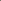

# Axis-Aligned Document Dewarping

<!-- Page 1 -->

Axis-Aligned Document Dewarping

Chaoyun Wang1, I-Chao Shen2, Takeo Igarashi2, Caigui Jiang1*

1National Key Laboratory of Human-Machine Hybrid Augmented Intelligence, National Engineering Research Center of Visual Information and Applications, and Institute of Artificial Intelligence and Robotics, Xi’an Jiaotong University

2The University of Tokyo chaoyunwang@stu.xjtu.edu.cn, jdilyshen@gmail.com, takeo@acm.org, cgjiang@xjtu.edu.cn

## Abstract

Document dewarping is crucial for many applications. However, existing learning-based methods rely heavily on supervised regression with annotated data without fully leveraging the inherent geometric properties of physical documents. Our key insight is that a well-dewarped document is defined by its axis-aligned feature lines. This property aligns with the inherent axis-aligned nature of the discrete grid geometry in planar documents. Harnessing this property, we introduce three synergistic contributions: for the training phase, we propose an axis-aligned geometric constraint to enhance document dewarping; for the inference phase, we propose an axis alignment preprocessing strategy to reduce the dewarping difficulty; and for the evaluation phase, we introduce a new metric, Axis-Aligned Distortion (AAD), that not only incorporates geometric meaning and aligns with human visual perception but also demonstrates greater robustness. As a result, our method achieves state-of-the-art performance on multiple existing benchmarks, improving the AAD metric by 18.2% to 34.5%.

Code — https://github.com/chaoyunwang/AADD

## Introduction

The digitization of documents dramatically facilitates our lives by converting information on physical documents into electronic data that can be used with digital devices. However, traditional scanners, which require fixed positioning for precise acquisition, have limitations when dealing with paper deformation. With the widespread use of mobile phones and cameras, photography has become a primary tool for digitization. Nonetheless, images captured by handheld cameras often suffer from geometric distortions and uneven lighting, which degrade the reading experience and hinder downstream tasks like optical character recognition (OCR).

In early research, many studies defined this problem as surface reconstruction from different imaging devices, including multi-view images (Tsoi and Brown 2007; Liang, DeMenthon, and Doermann 2008), stereo cameras (Ulges, Lampert, and Breuel 2004), and structured light cameras (Brown and Seales 2001; Meng et al. 2014). Subsequent

*Corresponding Author. Copyright © 2026, Association for the Advancement of Artificial Intelligence (www.aaai.org). All rights reserved.

studies on single-view images have leveraged various document priors, such as document boundaries (Brown and Tsoi 2006), text lines (Kil et al. 2017; Kim, Koo, and Cho 2015). However, the performance of these methods is often limited by the robustness of low-level feature detection.

With the recent development of deep learning, convolutional neural networks began to learn 2D deformation field mapping from deformed images to expected dewarping results (Ma et al. 2018; Das et al. 2019; Xie et al. 2020; Feng et al. 2021; Ma et al. 2022; Li et al. 2023b,a; Feng et al. 2022; Jiang et al. 2022; Yu et al. 2024). Data-driven methods perform supervised learning dewarping under the guidance of various supervision signals with synthetic annotations (Ma et al. 2018; Li et al. 2023b; Verhoeven, Magne, and Sorkine-Hornung 2023), such as depth (Das et al. 2019), geometric semantics (Markovitz et al. 2020), control points (Verhoeven, Magne, and Sorkine-Hornung 2023; Xie et al. 2021; Yu et al. 2024), layout (Li et al. 2023b).

Although prior methods perform well on simple deformations, they often fail on document images with complex deformations. This is mainly because previous studies rely on strong supervision signals, such as control points, which are effective but have no geometric meaning, and text lines, which are meaningful but difficult to extract and often exhibit poor generalization. These methods often overlook the fundamental geometric properties of paper documents—a gap our work aims to fill.

In this paper, we perform document dewarping using a lightweight convolutional neural network that predicts a 2D unwarping grid from the distorted image. Our key insight, as illustrated in Figure 1(a), is that the defining characteristic of a successfully rectified document is the alignment of its feature lines with the coordinate axes. We term this fundamental observation the “axis-aligned property”—a principle rooted in the inherent discrete grid geometry of planar documents.

Inspired by this single, powerful principle, we systematically integrate it into all three key stages of our deep learning pipeline, as outlined in Figure 1(b): For training, we design an axis-aligned geometric constraint that explicitly guides the network to learn this property, significantly improving dewarping performance. For inference, we introduce a novel axis-alignment preprocessing strategy. This strategy leverages the property to normalize the document’s orientation

The Fortieth AAAI Conference on Artificial Intelligence (AAAI-26)

<!-- Page 2 -->

Geometric Constraint

(Sec3.1)

## Evaluation

Training Inference (b) Contributions

Preprocessing

(Sec3.3)

Metric (Sec4.2) Axis-aligned property

(a) Motivation

**Figure 1.** Our research motivation and main contributions. (a) A warped document (left) and its target rectified version (right). The key characteristic of the rectified version is the alignment of its feature lines (highlighted by dotted lines) with the axes. We term this the “axis-aligned property”. (b) Inspired by (a), we integrate this axis-aligned property into the training, inference, and evaluation stages of our deep learning method.

beforehand, simplifying the task for the network and boosting its robustness against various rotations and scales. Finally, for evaluation, we propose a new metric, Axis-Aligned Distortion (AAD), which directly quantifies how well the dewarped result adheres to the axis-aligned property, offering a measure that is both geometrically meaningful and consistent with human perception.

Our contributions are as follows.

• We introduce an axis-aligned geometric constraint, significantly enhancing the performance of learning-based document dewarping. • We propose an axis alignment preprocessing strategy in the inference phase which boosts the dewarping performance robustly. • We propose a new evaluation metric, AAD, that not only incorporates geometric meaning and aligns with human visual perception but also demonstrates enhanced robustness.

## Related Work

Current research on document dewarping can be broadly categorized into traditional optimization methods and deep learning-based methods. As mentioned in Section 1, traditional approaches to document dewarping primarily involve image processing and 3D reconstruction, preceding the advent of deep learning.

Research in image processing has focused on modeling the most commonly used low-level features extracted from document images, including letters/words, boundaries, spacing, and text lines, and to correct perspective and page curl distortion through local line spacing and cell shape, which can be formulated as an energy minimization optimization problem (Ulges, Lampert, and Breuel 2005; Stamatopoulos et al. 2010; Kim, Koo, and Cho 2015; Takezawa, Hasegawa, and Tabbone 2017). More recently, Jiang et al. (Jiang et al. 2022) applied deep learning to extract boundaries and document lines, followed by geometric constraint optimization.

However, reliably detecting such low-level features in heavily distorted images is challenging, limiting the applicability of these methods.

In 3D reconstruction research, variations in shadows from a single image or across different imaging devices, along with other input cues, have been utilized to reconstruct 3D surfaces (Tan et al. 2005; Wada, Ukida, and Matsuyama 1997; Zhang et al. 2009; Liang, DeMenthon, and Doermann 2008; He et al. 2013). Some studies model these surfaces as special types, such as cylindrical surfaces (Cao, Ding, and Liu 2003) and developable surfaces (Meng et al. 2014). Recently, Luo et al. (Luo and Bo 2022) treat the document as a developable surface and employ a recently proposed isometric constraint for modeling (Jiang et al. 2020). However, these methods rely on detecting document feature lines, resulting in long optimization times and limited generality.

Deep learning methods leverage large amounts of data generated by rendering techniques and dataset collection, such as Doc3D (Das et al. 2019), Inv3D (Hertlein, Naumann, and Philipp 2023), Simulated paper (Li et al. 2023b), UVDoc (Verhoeven et al. 2023). These data-driven approaches can be categorized into forward mapping methods (Ma et al. 2018; Li et al. 2019; Jiang et al. 2022) and backward mapping methods (Das et al. 2019, 2021; Feng et al. 2021, 2022). To further improve optimization, some methods incorporate additional supervision signals, such as text lines, masks, boundaries, layouts, angles, and curvatures to further improve optimization (Zhang et al. 2022; Feng et al. 2021; Dai et al. 2023; Li et al. 2023a,b). However, extracting these additional cues can introduce extra noise and lack generalizability.

An effective approach is to fully exploit the inherent geometric properties of the document, which are independent of annotated labels and generally more robust. As Xie et al. (Xie et al. 2020) exploited the continuity property of document deformation by incorporating local fairing constraints into the displacement prediction process. Furthermore, the recent work (Wang et al. 2024, 2025), based on grid surface modeling, achieves accurate and robust optimization by learning the intrinsic geometric properties.

In this paper, we study and leverage the intrinsic geometric properties for document dewarping.

## 3 Method

We adopt the convolutional neural network architecture from UVDoc (Verhoeven et al. 2023) as the foundation for our document dewarping network. This fully convolutional deep neural network simultaneously predicts the document’s 3D grid mesh and corresponding 2D unwarping grid in a dual-task framework, which is inspired by the work of Xie et al. (Xie et al. 2020, 2021)

In the following sections, Section 3.1 details the axis-aligned geometric constraint introduced during training, Section 3.2 analyzes the loss functions employed during network training, and Section 3.3 describes the preprocessing strategy for axis alignment during inference.

AI-readable visual equivalent, added: Figure extracted from the paper PDF and converted to an SVG wrapper asset. Use the surrounding page text and caption for interpretation.

AI-readable visual equivalent, added: Figure extracted from the paper PDF and converted to an SVG wrapper asset. Use the surrounding page text and caption for interpretation.

AI-readable visual equivalent, added: Figure extracted from the paper PDF and converted to an SVG wrapper asset. Use the surrounding page text and caption for interpretation.

<!-- Page 3 -->

UV Space Image Space

Horizontal

Decomposition

Vertical

Interpolate

Grid-Net

GT

GT Q Q ver  hor 

AL 

P GT P

Predict

**Figure 2.** Axis-aligned geometric constraints were enforced during document dewarping network training. The top row shows the predicted 2D unwarping grid (obtained from Grid- Net in UVDoc (Verhoeven et al. 2023)), and the bottom row displays its transformation into UV space based on the ground truth, facilitating the computation of the corresponding axis-aligned geometric constraints loss along horizontal and vertical directions.

## 3.1 Axis-Aligned Geometric Constraints

Figure 2 illustrates the pipeline for computing the axisaligned geometric constraint loss during training. Our approach takes advantage of the inherent geometric properties of planar paper, where the corresponding discrete grid geometry is aligned along the horizontal and vertical axes (as shown by QGT in Figure 2). This property aligns with the horizontal and vertical orientations of the document’s feature lines in image space. Therefore, we can assess the axis alignment distortion of these feature lines in the dewarped image by computing the corresponding deviation of the unwrapped grid in planar space. However, since the current predictions are in image space, directly calculating this error is challenging.

To address this issue, we first employ an interpolation function to map the predicted 2D unwarping grid from image space P to UV space Q. In the UV space, the deviation from horizontal and vertical alignment is effectively quantified by computing the position variance along each row and column. By integrating these axis-aligned geometric constraints into the training process, we can guide the network in learning to dewarp distorted document feature lines toward the axis-aligned direction.

Given a distorted document image, a deep convolutional network predicts a 2D unwrapped grid points with sizes h × w × 2. Each point on the grid can be represented as:

P = {pi,j}h,w i=1,j=1, pi,j = (xi,j, yi,j). (1)

During training, the corresponding ground truth grid is:

P GT = {pGT i,j }h,w i=1,j=1, pGT i,j = (xGT i,j, yGT i,j). (2)

In UV space, these ground truth grid are a uniform grid:

QGT = {qGT i,j }h,w i=1,j=1, qGT i,j = (uGT i,j, vGT i,j). (3)

To quantify the distortion of the prediction results, we distort the correspondence points in QGT according to the relative grid-position relationships in image space:

q = f(p) = Interpolate qGT; pGT, P

. (4)

Thus, each predicted 2D grid point is transformed into the UV space as follows:

Q = {qi,j}h,w i=1,j=1, qi,j = f(pi,j) = (ui,j, vi,j). (5)

In UV space, the axis-aligned error of 2D grid Q consists of two components. The horizontal error is quantified by the variance of the v values along each row, and the vertical error by the variance of the u values along each column, computed as follows:

Lhor =

Xh j=1 Var

{v1,j, v2,j,..., vw,j}

,

Lver =

Xw i=1 Var

{ui,1, ui,2,..., ui,h}

.

(6)

The overall axis-aligned geometric constraint loss is then defined as:

LAL = Lhor + Lver. (7) Minimizing LAL encourages the predicted 2D unwarping grid, when mapped to the UV space, to align with the axes as closely as possible.

## 3.2 Loss Function

Let I ∈RH×W ×3 be the input image. The network predicts 2D unwarping grid G2D ∈Rh×w×2 and corresponding 3D grid mesh G3D ∈Rh×w×3. The dewarped image Id is obtained via an interpolation and grid sampling using I and G2D. Our overall training loss is composed of the following components:

Grid 2D and 3D Losses. Following UVDoc (Verhoeven et al. 2023), we supervise the network with the losses:

L2D = ∥G2D −Ggt

2D∥1, L3D = ∥G3D −Ggt 3D∥1. (8)

where Ggt

2D and Ggt 3D denote the ground truth 2D grid and 3D coordinates, respectively. Axis-Aligned Geometric Constraint Loss. We impose axis-aligned geometric constraints LAL in the UV space, guiding the network to achieve effective axis alignment dewarping of feature lines, as depicted in Section 3.1.

SSIM Loss. Since geometric dewarping may introduce artifacts (e.g., shadows) in the dewarped images, a pixellevel MSE loss might over-constrain model optimization and lead to instability. Hence, we incorporate an SSIM (Structural Similarity Index Measure) loss to measure the similarity between the dewarped image and the ground truth, capturing both local structure and global consistency, which helps the model converge effectively:

LSSIM = 1 −SSIM(I, Id). (9)

The overall loss is defined as:

Lall = α L2D + β L3D + γ LAL + λ LSSIM. (10)

with hyperparameters set as α = β = 1, γ = 0.2, λ = 0.05, in our experiments.

AI-readable visual equivalent, added: Figure extracted from the paper PDF and converted to an SVG wrapper asset. Use the surrounding page text and caption for interpretation.

AI-readable visual equivalent, added: Figure extracted from the paper PDF and converted to an SVG wrapper asset. Use the surrounding page text and caption for interpretation.

AI-readable visual equivalent, added: Figure extracted from the paper PDF and converted to an SVG wrapper asset. Use the surrounding page text and caption for interpretation.

<!-- Page 4 -->

## 3.3 Axis Alignment Preprocessing for Inference

During inference, previous methods employ additional segmentation and deformation models for preprocessing (Ma et al. 2022; Feng et al. 2021) to improve dewarping robustness under diverse input conditions. Essentially, these methods distinguish between the background and the document region, enabling the model to focus on the document area and reducing dewarping difficulty. However, they do not directly address the elimination of geometric distortion.

Drawing on the insights from Figure 1(a), axis alignment is central to the dewarping process. So, we propose an axis alignment preprocessing strategy, as illustrated in Figure 3. For a given input image, we first compute the minimum-area rotation rectangle using the positional information from the predicted 2D unwarping grid. Subsequently, we rotate the image to align the document’s principal axes and clip the target area. This preprocessed image is then fed back into the network for a refined prediction. If necessary, this process can be iteratively repeated to achieve further improvement under varying conditions. As shown in Figure 3, the fine results obtained after preprocessing outperform the coarse results, effectively reducing the influence of the target position on the overall correction.

Preprocessing

Inference

…

…

Coarse result

Interpolation &Remapping

Distored image1

Distored image2 Fine result

**Figure 3.** Illustration of the dewarping inference process with axis alignment preprocessing. The red grid represents the predicted 2D unwarping grid, while the blue rectangle indicates the minimum-area rotated rectangle computed from it.

Unlike prior methods that rely on external segmentation models (Ma et al. 2022; Feng et al. 2021), our preprocessing is self-contained. It directly leverages the predicted 2D unwarping grid to extract object region information, rendering the method more efficient and elegant. A detailed analysis is provided in Section 4.5.

## Experiments

The experimental section introduces the training data, test benchmarks, evaluation metrics, and implementation details, subsequently, we analyze the experimental results both quantitatively and qualitatively.

## 4.1 Datasets and Benchmarks Training Datasets We used two datasets,

Doc3D (Das et al. 2019) and UVDoc (Verhoeven et al. 2023), for alternative optimization models following the setting of (Verhoeven et al. 2023).

Doc3D (Das et al. 2019) is the largest distortion dewarping dataset, containing 100K distorted images. It was created using approximately 4,000 authentic document images and rendering software. The labels for each distorted document image include 3D coordinate maps, albedo maps, normals, depth maps, UV maps, and backward mapping maps.

UVDoc (Verhoeven et al. 2023) aims to reduce the domain gap between the synthetic Doc3D dataset (Das et al. 2019)—commonly used for training document unwarping models—and real document photographs. This dataset contains 20K pseudo-photorealistic document images and provides all the necessary information to train a coarse gridbased document unwarping neural network.

Benchmarks We evaluated our method on the following two benchmarks:

DocUNet (Ma et al. 2018): This benchmark comprises 130 distorted images captured in natural scenes using mobile devices. Following previous methods, 25 rich-text images were selected for OCR evaluation, and according to DocGeoNet (Feng et al. 2022), the 127th and 128th images (which did not match the labels) were rotated by 180◦.

DIR300 (Feng et al. 2022): Captured with a moving camera, this benchmark contains 300 images of real distorted documents with complex backgrounds, varying degrees of distortion, and diverse lighting conditions. In line with previous studies, 90 rich-text images were selected for OCR evaluation.

## 4.2 Evaluation Metrics

We evaluate our approach using image similarity metrics and optical character recognition (OCR) performance.

MS-SSIM, LD and AD. Following Ma et al. (Ma et al. 2018), we employ multi-scale structural similarity (MS- SSIM) and local distortion (LD) to assess image similarity. Additionally, we use the aligned distortion (AD) metric introduced in (Ma et al. 2022) to overcome the limitations of earlier measures.

CER and ED. Consistent with previous work, we measure OCR performance using Character Error Rate (CER) (Morris, Maier, and Green 2004) and Edit Distance (ED) (Levenshtein 1966). Our experiments utilize OCR recognition with Tesseract v5.4.0.20240606 and PyTesseract v0.3.13 1.

Subsequently, we introduce the newly proposed metric.

AAD Metric As illustrated in Figure 1(a), our visual evaluation of dewarped documents primarily relies on the axis alignment error of the document’s feature lines, which carries clear geometric significance. However, existing metrics fail to capture this characteristic effectively. We introduce the AAD (Axis-Aligned Distortion) metric, which quantifies distortion by measuring the axial alignment error of the

1https://pypi.org/project/pytesseract/

AI-readable visual equivalent, added: Figure extracted from the paper PDF and converted to an SVG wrapper asset. Use the surrounding page text and caption for interpretation.

AI-readable visual equivalent, added: Figure extracted from the paper PDF and converted to an SVG wrapper asset. Use the surrounding page text and caption for interpretation.

AI-readable visual equivalent, added: Figure extracted from the paper PDF and converted to an SVG wrapper asset. Use the surrounding page text and caption for interpretation.

AI-readable visual equivalent, added: Figure extracted from the paper PDF and converted to an SVG wrapper asset. Use the surrounding page text and caption for interpretation.

AI-readable visual equivalent, added: Figure extracted from the paper PDF and converted to an SVG wrapper asset. Use the surrounding page text and caption for interpretation.

AI-readable visual equivalent, added: Figure extracted from the paper PDF and converted to an SVG wrapper asset. Use the surrounding page text and caption for interpretation.

<!-- Page 5 -->

dewarped results. It is conceptually identical to our geometric constraint (Section 3.1), with the key difference being its application: it is computed on image pairs during evaluation, rather than on 2D grid pairs during training.

Let y denote the ground truth image. The optical flow field from y to its dewarped version is computed using the SIFTflow algorithm (Liu, Yuen, and Torralba 2010), yielding flow components vx and vy along the horizontal and vertical directions, respectively. The directional gradients of y are then extracted using the Sobel operator (Sobel, Feldman et al. 1968) along each axis and normalized:

˜gi = |Sobeli(y)| max (|Sobeli(y)|), i ∈{x, y}. (11)

For each row i and column j, we compute the gradientweighted means and the corresponding deviations as follows:

mi =

P j vy(i, j) ˜gy(i, j) P j ˜gy(i, j) + ϵ, drow i,j = ˜gy(i, j) · |vy(i, j) −mi|, nj =

P i vx(i, j) ˜gx(i, j) P i ˜gx(i, j) + ϵ, dcol i,j = ˜gx(i, j) · |vx(i, j) −nj|.

(12) Here, mi and nj denote the gradient-weighted mean of the vertical flow in the ith row and the horizontal flow in the jth column, respectively, while drow i,j and dcol i,j measure the corresponding deviations in pixel (i, j).

Define the pixel-wise overall deviation as the Euclidean combination of the row and column deviations, and let the AAD be their average over all N pixels:

di,j = q drow i,j

2 + dcol i,j

2, AAD = 1

N

X i,j di,j. (13)

The AAD metric uses the normalized image direction gradient weight to calculate the axial alignment error of the feature line in the row and column, lower values indicate a better dewarping effect.

**Figure 4.** shows an example visualization of the AAD metric. For two different dewarped results, the alignment of table feature lines and the horizontal alignment of text lines serve as the primary evaluation criteria. By overlaying the horizontal (row) and vertical (col) components of the AAD heatmap onto the dewarped results, the corresponding axis alignment errors are displayed in detail. The heatmap colors correlate well with the calculated values, offering a perceptual measure of axis alignment.

**Figure 5.** illustrates the superiority of our proposed AAD metric over the existing AD metric. In (b), our dewarped result is visibly superior to that of UVDoc (Verhoeven et al. 2023) due to better text-line alignment, although the two appear broadly similar. The AD metric, however, fails on two counts: its heatmap in (c) is uninterpretable, and its numerical score contradicts this visual reality by rating our result as worse. In contrast, our AAD metric is founded on a clear geometric principle. This gives its heatmap in (d) a highly interpretable meaning, where brighter areas directly correspond to distorted feature lines. As a result, both its visual heatmap and numerical score correctly identify our result

AAD_H: 0.044

Ground Truth Dewarped Result1

AAD_V: 0.053 AAD: 0.089

AAD_H: 0.038 AAD_V: 0.012 AAD: 0.046 x G y G

Dewarped Result2

**Figure 4.** Example of visualizing AAD metrics. The first row is the ground truth image and its gradient heatmap in the horizontal (Gy) and vertical (Gx) directions; the second and third rows correspond to the two different dewarped results and their overlay heatmaps for AAD and its horizontal (AAD H) and vertical (AAD V) components, the ↔ and ↕arrows indicate the directions for visualizing the axisaligned error of the dewarped feature lines.

as superior, which is consistent with human judgment. This ability to distinguish subtle differences is essential for guiding the next stage of research as performance gaps between state-of-the-art models narrow.

AAD=0.100

AD=0.380

AD=0.442

AAD=0.159

(a) GT & Gradient (b) Dewarped images (c) AD (d) AAD

**Figure 5.** Visualization and comparison of the AD and AAD metrics on a example. (a) The ground truth image (top) and its corresponding gradient map (bottom). (b) Dewarped results from (Verhoeven et al. 2023) (top) and our method (bottom). (c) Heatmaps of the AD metric for the results shown in (b). (d) Corresponding heatmaps of our proposed AAD metric.

AI-readable visual equivalent, added: Figure extracted from the paper PDF and converted to an SVG wrapper asset. Use the surrounding page text and caption for interpretation.

AI-readable visual equivalent, added: Figure extracted from the paper PDF and converted to an SVG wrapper asset. Use the surrounding page text and caption for interpretation.

AI-readable visual equivalent, added: Figure extracted from the paper PDF and converted to an SVG wrapper asset. Use the surrounding page text and caption for interpretation.

AI-readable visual equivalent, added: Figure extracted from the paper PDF and converted to an SVG wrapper asset. Use the surrounding page text and caption for interpretation.

AI-readable visual equivalent, added: Figure extracted from the paper PDF and converted to an SVG wrapper asset. Use the surrounding page text and caption for interpretation.

AI-readable visual equivalent, added: Figure extracted from the paper PDF and converted to an SVG wrapper asset. Use the surrounding page text and caption for interpretation.

AI-readable visual equivalent, added: Figure extracted from the paper PDF and converted to an SVG wrapper asset. Use the surrounding page text and caption for interpretation.

AI-readable visual equivalent, added: Figure extracted from the paper PDF and converted to an SVG wrapper asset. Use the surrounding page text and caption for interpretation.

AI-readable visual equivalent, added: Figure extracted from the paper PDF and converted to an SVG wrapper asset. Use the surrounding page text and caption for interpretation.

AI-readable visual equivalent, added: Figure extracted from the paper PDF and converted to an SVG wrapper asset. Use the surrounding page text and caption for interpretation.

AI-readable visual equivalent, added: Figure extracted from the paper PDF and converted to an SVG wrapper asset. Use the surrounding page text and caption for interpretation.

AI-readable visual equivalent, added: Figure extracted from the paper PDF and converted to an SVG wrapper asset. Use the surrounding page text and caption for interpretation.

AI-readable visual equivalent, added: Figure extracted from the paper PDF and converted to an SVG wrapper asset. Use the surrounding page text and caption for interpretation.

AI-readable visual equivalent, added: Figure extracted from the paper PDF and converted to an SVG wrapper asset. Use the surrounding page text and caption for interpretation.

AI-readable visual equivalent, added: Figure extracted from the paper PDF and converted to an SVG wrapper asset. Use the surrounding page text and caption for interpretation.

AI-readable visual equivalent, added: Figure extracted from the paper PDF and converted to an SVG wrapper asset. Use the surrounding page text and caption for interpretation.

AI-readable visual equivalent, added: Figure extracted from the paper PDF and converted to an SVG wrapper asset. Use the surrounding page text and caption for interpretation.

AI-readable visual equivalent, added: Figure extracted from the paper PDF and converted to an SVG wrapper asset. Use the surrounding page text and caption for interpretation.

AI-readable visual equivalent, added: Figure extracted from the paper PDF and converted to an SVG wrapper asset. Use the surrounding page text and caption for interpretation.

<!-- Page 6 -->

## Method

DocUNet benchmark DIR300 benchmark

MS↑ LD↓ AD↓ AAD↓ ED↓ CER↓ MS↑ LD↓ AD↓ AAD↓ ED↓ CER↓

DewarpNet(Das et al. 2019) 0.474 8.362 0.398 0.164 824.5 0.225 0.492 13.944 0.332 0.147 1076.8 0.336 DDCP(Xie et al. 2021)∗ 0.472 8.982 0.428 0.159 1124.7 0.280 0.552 11.02 0.357 0.132 739.3 0.257 DocTr(Feng et al. 2021) 0.509 7.773 0.369 0.151 708.6 0.185 0.616 7.189 0.255 0.107 698.4 0.211 PaperEdge(Ma et al. 2022) 0.473 7.967 0.368 0.121 731.4 0.183 0.584 7.968 0.255 0.091 447.4 0.177 DocGeoNet(Feng et al. 2022) 0.504 7.717 0.381 0.158 695.0 0.187 0.638 6.403 0.241 0.106 672.5 0.206 FTDR(Li et al. 2023a) 0.497 8.416 0.377 0.151 688.3 0.176 0.607 7.680 0.243 0.108 639.4 0.198 LADoc(Li et al. 2023b)† 0.525 6.706 0.300 0.121 689.8 0.180 0.652 5.702 0.195 0.087 495.4 0.173 UVDoc(Verhoeven et al. 2023) 0.545 6.827 0.316 0.125 754.2 0.193 0.621 7.730 0.219 0.101 614.0 0.237

Ours (Baseline, w/o AL, AP) 0.538 6.897 0.322 0.124 638.1 0.167 0.615 7.691 0.215 0.100 633.0 0.243 Ours (+ AL only) 0.549 6.566 0.291 0.105 718.0 0.183 0.629 7.880 0.176 0.076 498.9 0.206 Ours (+ AP only) 0.536 6.767 0.308 0.120 628.5 0.165 0.694 4.303 0.152 0.069 541.6 0.153 Ours (Full, AL+AP) 0.543 6.249 0.278 0.099 603.1 0.150 0.702 4.261 0.131 0.057 405.8 0.132

Improvements -0.4% 6.8% 7.3% 18.2% 12.4% 14.8% 7.7% 25.3% 32.8% 34.5% 9.3% 23.7%

Note: For a fair OCR metrics comparison, all evaluations are performed at the original input resolution. The dewarped images from DDCP ∗ are upscaled and those from LADoc † are downscaled to match this resolution before metric calculation.

**Table 1.** Quantitative evaluation and ablation study on the DocUNet and DIR300 benchmarks. We compare our method with previous methods and ablate our components: Axis-aligned geometric constraint Loss (AL) and Axis alignment Preprocessing (AP). “↑” indicates higher is better, “↓” means lower is better. Bold denotes the best result, and underline indicates second-best. The “Improvements” row shows the relative gain of our full model over the previous state-of-the-art.

## 4.3 Implementation Details Our model is implemented using the

PyTorch framework (Paszke et al. 2017). The dewarping model is trained on two datasets: Doc3D (Das et al. 2019) (88k images) and UVDoc (Verhoeven et al. 2023) (20k images). The input images are resized to 712×488 pixels, while the output 2D grid is set to 45×31. We optimize the model using the AdamW optimizer (Loshchilov 2017) with a batch size of 72, with an initial learning rate of 1 × 10−5 and a linear decay schedule. The network is trained for 30 epochs on two NVIDIA 4090 GPUs, which takes approximately 15 hours. During inference (see Section 3.3), we apply preprocessing once for the DocUNet benchmark and twice for DIR300 to better handle its smaller target objects.

## 4.4 Experimental Results We quantitatively and qualitatively evaluate our method against others on the

DocUNet and DIR300 benchmarks.

Section 4.2 summarizes the quantitative evaluation. On the DocUNet benchmark, our approach demonstrates significant improvements across most metrics, achieving performance comparable to UVDoc (Verhoeven et al. 2023) on the MS metric and delivering a notable 18.2% improvement on the proposed AAD metric. The improvements are even more pronounced on the larger DIR300 benchmark, where our method achieves gains across all metrics, including a 34.5% improvement in AAD and a significant boost to OCR performance, with the CER reaching 23.7%.

Qualitative results for both benchmarks are shown in Figure 6. To highlight distortion areas more clearly, we overlay the dewarped results with heatmaps generated from the horizontal and vertical components of our AAD metric (an example is provided in Figure 4). For our method, the re- sulting heatmaps appear consistently fainter on documents from both datasets, indicating substantially reduced axisalignment error. As expected from the dewarping results in Figure 1(a), this yields more axis-aligned feature lines in the final dewarped images.

## 4.5 Ablation Study

We conducted ablation experiments to evaluate the impact of two key components: the axis-aligned geometric constraint used during training (Section 3.1) and the axis alignment preprocessing applied during inference(Section 3.3).

As summarized in Section 4.2, both components independently enhance performance across two benchmark datasets. Specifically, for the DocUNet benchmark—where a large proportion of targets are present—the axis-aligned geometric constraint yields greater performance improvements than the axis alignment preprocessing. Conversely, in the DIR300 benchmark, which contains a smaller proportion of targets, the benefits of the preprocessing strategy are more pronounced. Importantly, the combination of both modules produces the best overall performance, demonstrating their complementary advantages in different scenarios.

**Figure 7.** provides several examples from our ablation experiments. For targets with a smaller proportion (middle row), the preprocessing strategy improves target integrity, while the addition of the axis-aligned geometric constraint further enhances the dewarping performance. For targets with a larger proportion (first and last rows), the performance gains from the axis-aligned geometric constraint are more prominent. Overall, the optimal dewarped results are achieved by applying both components simultaneously, which aligns with the improvements observed in the qualitative metrics in Section 4.2.

<!-- Page 7 -->

Input DocGeoNet Ours UVDoc LADoc FTDR

**Figure 6.** Qualitative evaluation. The figure shows the dewarped results along with the corresponding heatmap overlays of the AAD component metric. The horizontal (↔) and vertical (↕) arrows indicate the directions for visualizing the axis-aligned error of the dewarped feature lines.

Input -- / -- AL / -- AL / AP -- / AP

**Figure 7.** Qualitative results of our dewarping ablation study. From left to right: the distorted input and dewarped outputs from different settings. The overlaid heatmaps visualize the horizontal component of the AAD metric.

## 5 Conclusion

This paper proposes a document dewarping method that exploits the inherent axis-aligned property of planar documents’ underlying grid geometry. To this end, we introduce two key components: an axis-aligned geometric constraint for training and an alignment preprocessing strategy for inference. Experimental results confirm that these components are both independently effective and complementary. As a result, our full model outperforms state-of-theart methods, demonstrating both significant quantitative improvements and clear qualitative advantages. To apply our geometric insight to the evaluation process itself, we introduce a novel evaluation metric AAD, which provides a clear geometric interpretation, aligns well with human visual perception, and exhibits enhanced robustness. Unlike previous work focused on network architectures or datasets, our approach leverages the intrinsic geometry of documents to improve dewarping performance. This principle-driven strategy demonstrates the significant value of exploiting such properties. Future work will involve extending this principle to other image rectification tasks.

AI-readable visual equivalent, added: Figure extracted from the paper PDF and converted to an SVG wrapper asset. Use the surrounding page text and caption for interpretation.

AI-readable visual equivalent, added: Figure extracted from the paper PDF and converted to an SVG wrapper asset. Use the surrounding page text and caption for interpretation.

AI-readable visual equivalent, added: Figure extracted from the paper PDF and converted to an SVG wrapper asset. Use the surrounding page text and caption for interpretation.

AI-readable visual equivalent, added: Figure extracted from the paper PDF and converted to an SVG wrapper asset. Use the surrounding page text and caption for interpretation.

AI-readable visual equivalent, added: Figure extracted from the paper PDF and converted to an SVG wrapper asset. Use the surrounding page text and caption for interpretation.

AI-readable visual equivalent, added: Figure extracted from the paper PDF and converted to an SVG wrapper asset. Use the surrounding page text and caption for interpretation.

AI-readable visual equivalent, added: Figure extracted from the paper PDF and converted to an SVG wrapper asset. Use the surrounding page text and caption for interpretation.

AI-readable visual equivalent, added: Figure extracted from the paper PDF and converted to an SVG wrapper asset. Use the surrounding page text and caption for interpretation.

AI-readable visual equivalent, added: Figure extracted from the paper PDF and converted to an SVG wrapper asset. Use the surrounding page text and caption for interpretation.

AI-readable visual equivalent, added: Figure extracted from the paper PDF and converted to an SVG wrapper asset. Use the surrounding page text and caption for interpretation.

AI-readable visual equivalent, added: Figure extracted from the paper PDF and converted to an SVG wrapper asset. Use the surrounding page text and caption for interpretation.

AI-readable visual equivalent, added: Figure extracted from the paper PDF and converted to an SVG wrapper asset. Use the surrounding page text and caption for interpretation.

AI-readable visual equivalent, added: Figure extracted from the paper PDF and converted to an SVG wrapper asset. Use the surrounding page text and caption for interpretation.

AI-readable visual equivalent, added: Figure extracted from the paper PDF and converted to an SVG wrapper asset. Use the surrounding page text and caption for interpretation.

AI-readable visual equivalent, added: Figure extracted from the paper PDF and converted to an SVG wrapper asset. Use the surrounding page text and caption for interpretation.

AI-readable visual equivalent, added: Figure extracted from the paper PDF and converted to an SVG wrapper asset. Use the surrounding page text and caption for interpretation.

AI-readable visual equivalent, added: Figure extracted from the paper PDF and converted to an SVG wrapper asset. Use the surrounding page text and caption for interpretation.

AI-readable visual equivalent, added: Figure extracted from the paper PDF and converted to an SVG wrapper asset. Use the surrounding page text and caption for interpretation.

AI-readable visual equivalent, added: Figure extracted from the paper PDF and converted to an SVG wrapper asset. Use the surrounding page text and caption for interpretation.

AI-readable visual equivalent, added: Figure extracted from the paper PDF and converted to an SVG wrapper asset. Use the surrounding page text and caption for interpretation.

AI-readable visual equivalent, added: Figure extracted from the paper PDF and converted to an SVG wrapper asset. Use the surrounding page text and caption for interpretation.

AI-readable visual equivalent, added: Figure extracted from the paper PDF and converted to an SVG wrapper asset. Use the surrounding page text and caption for interpretation.

AI-readable visual equivalent, added: Figure extracted from the paper PDF and converted to an SVG wrapper asset. Use the surrounding page text and caption for interpretation.

AI-readable visual equivalent, added: Figure extracted from the paper PDF and converted to an SVG wrapper asset. Use the surrounding page text and caption for interpretation.

AI-readable visual equivalent, added: Figure extracted from the paper PDF and converted to an SVG wrapper asset. Use the surrounding page text and caption for interpretation.

AI-readable visual equivalent, added: Figure extracted from the paper PDF and converted to an SVG wrapper asset. Use the surrounding page text and caption for interpretation.

AI-readable visual equivalent, added: Figure extracted from the paper PDF and converted to an SVG wrapper asset. Use the surrounding page text and caption for interpretation.

AI-readable visual equivalent, added: Figure extracted from the paper PDF and converted to an SVG wrapper asset. Use the surrounding page text and caption for interpretation.

AI-readable visual equivalent, added: Figure extracted from the paper PDF and converted to an SVG wrapper asset. Use the surrounding page text and caption for interpretation.

AI-readable visual equivalent, added: Figure extracted from the paper PDF and converted to an SVG wrapper asset. Use the surrounding page text and caption for interpretation.

AI-readable visual equivalent, added: Figure extracted from the paper PDF and converted to an SVG wrapper asset. Use the surrounding page text and caption for interpretation.

AI-readable visual equivalent, added: Figure extracted from the paper PDF and converted to an SVG wrapper asset. Use the surrounding page text and caption for interpretation.

AI-readable visual equivalent, added: Figure extracted from the paper PDF and converted to an SVG wrapper asset. Use the surrounding page text and caption for interpretation.

AI-readable visual equivalent, added: Figure extracted from the paper PDF and converted to an SVG wrapper asset. Use the surrounding page text and caption for interpretation.

AI-readable visual equivalent, added: Figure extracted from the paper PDF and converted to an SVG wrapper asset. Use the surrounding page text and caption for interpretation.

AI-readable visual equivalent, added: Figure extracted from the paper PDF and converted to an SVG wrapper asset. Use the surrounding page text and caption for interpretation.

AI-readable visual equivalent, added: Figure extracted from the paper PDF and converted to an SVG wrapper asset. Use the surrounding page text and caption for interpretation.

AI-readable visual equivalent, added: Figure extracted from the paper PDF and converted to an SVG wrapper asset. Use the surrounding page text and caption for interpretation.

AI-readable visual equivalent, added: Figure extracted from the paper PDF and converted to an SVG wrapper asset. Use the surrounding page text and caption for interpretation.

AI-readable visual equivalent, added: Figure extracted from the paper PDF and converted to an SVG wrapper asset. Use the surrounding page text and caption for interpretation.

AI-readable visual equivalent, added: Figure extracted from the paper PDF and converted to an SVG wrapper asset. Use the surrounding page text and caption for interpretation.

AI-readable visual equivalent, added: Figure extracted from the paper PDF and converted to an SVG wrapper asset. Use the surrounding page text and caption for interpretation.

AI-readable visual equivalent, added: Figure extracted from the paper PDF and converted to an SVG wrapper asset. Use the surrounding page text and caption for interpretation.

AI-readable visual equivalent, added: Figure extracted from the paper PDF and converted to an SVG wrapper asset. Use the surrounding page text and caption for interpretation.

AI-readable visual equivalent, added: Figure extracted from the paper PDF and converted to an SVG wrapper asset. Use the surrounding page text and caption for interpretation.

AI-readable visual equivalent, added: Figure extracted from the paper PDF and converted to an SVG wrapper asset. Use the surrounding page text and caption for interpretation.

AI-readable visual equivalent, added: Figure extracted from the paper PDF and converted to an SVG wrapper asset. Use the surrounding page text and caption for interpretation.

AI-readable visual equivalent, added: Figure extracted from the paper PDF and converted to an SVG wrapper asset. Use the surrounding page text and caption for interpretation.

AI-readable visual equivalent, added: Figure extracted from the paper PDF and converted to an SVG wrapper asset. Use the surrounding page text and caption for interpretation.

AI-readable visual equivalent, added: Figure extracted from the paper PDF and converted to an SVG wrapper asset. Use the surrounding page text and caption for interpretation.

AI-readable visual equivalent, added: Figure extracted from the paper PDF and converted to an SVG wrapper asset. Use the surrounding page text and caption for interpretation.

AI-readable visual equivalent, added: Figure extracted from the paper PDF and converted to an SVG wrapper asset. Use the surrounding page text and caption for interpretation.

AI-readable visual equivalent, added: Figure extracted from the paper PDF and converted to an SVG wrapper asset. Use the surrounding page text and caption for interpretation.

AI-readable visual equivalent, added: Figure extracted from the paper PDF and converted to an SVG wrapper asset. Use the surrounding page text and caption for interpretation.

AI-readable visual equivalent, added: Figure extracted from the paper PDF and converted to an SVG wrapper asset. Use the surrounding page text and caption for interpretation.

AI-readable visual equivalent, added: Figure extracted from the paper PDF and converted to an SVG wrapper asset. Use the surrounding page text and caption for interpretation.

AI-readable visual equivalent, added: Figure extracted from the paper PDF and converted to an SVG wrapper asset. Use the surrounding page text and caption for interpretation.

AI-readable visual equivalent, added: Figure extracted from the paper PDF and converted to an SVG wrapper asset. Use the surrounding page text and caption for interpretation.

AI-readable visual equivalent, added: Figure extracted from the paper PDF and converted to an SVG wrapper asset. Use the surrounding page text and caption for interpretation.

AI-readable visual equivalent, added: Figure extracted from the paper PDF and converted to an SVG wrapper asset. Use the surrounding page text and caption for interpretation.

AI-readable visual equivalent, added: Figure extracted from the paper PDF and converted to an SVG wrapper asset. Use the surrounding page text and caption for interpretation.

AI-readable visual equivalent, added: Figure extracted from the paper PDF and converted to an SVG wrapper asset. Use the surrounding page text and caption for interpretation.

AI-readable visual equivalent, added: Figure extracted from the paper PDF and converted to an SVG wrapper asset. Use the surrounding page text and caption for interpretation.

AI-readable visual equivalent, added: Figure extracted from the paper PDF and converted to an SVG wrapper asset. Use the surrounding page text and caption for interpretation.

AI-readable visual equivalent, added: Figure extracted from the paper PDF and converted to an SVG wrapper asset. Use the surrounding page text and caption for interpretation.

AI-readable visual equivalent, added: Figure extracted from the paper PDF and converted to an SVG wrapper asset. Use the surrounding page text and caption for interpretation.

AI-readable visual equivalent, added: Figure extracted from the paper PDF and converted to an SVG wrapper asset. Use the surrounding page text and caption for interpretation.

AI-readable visual equivalent, added: Figure extracted from the paper PDF and converted to an SVG wrapper asset. Use the surrounding page text and caption for interpretation.

AI-readable visual equivalent, added: Figure extracted from the paper PDF and converted to an SVG wrapper asset. Use the surrounding page text and caption for interpretation.

AI-readable visual equivalent, added: Figure extracted from the paper PDF and converted to an SVG wrapper asset. Use the surrounding page text and caption for interpretation.

AI-readable visual equivalent, added: Figure extracted from the paper PDF and converted to an SVG wrapper asset. Use the surrounding page text and caption for interpretation.

AI-readable visual equivalent, added: Figure extracted from the paper PDF and converted to an SVG wrapper asset. Use the surrounding page text and caption for interpretation.

AI-readable visual equivalent, added: Figure extracted from the paper PDF and converted to an SVG wrapper asset. Use the surrounding page text and caption for interpretation.

AI-readable visual equivalent, added: Figure extracted from the paper PDF and converted to an SVG wrapper asset. Use the surrounding page text and caption for interpretation.

AI-readable visual equivalent, added: Figure extracted from the paper PDF and converted to an SVG wrapper asset. Use the surrounding page text and caption for interpretation.

<!-- Page 8 -->

## Acknowledgments

This work was supported by the National Natural Science Foundation of China (Grant No. 62495092), the Natural Science Basic Research Plan of Shaanxi Province, China (No. 2025SYS-SYSZD-023), and the China Scholarship Council (No. 202406280284).

## References

Brown, M. S.; and Seales, W. B. 2001. Document restoration using 3D shape: a general deskewing algorithm for arbitrarily warped documents. In Proceedings Eighth IEEE International Conference on Computer Vision. ICCV 2001, volume 2, 367–374. IEEE. Brown, M. S.; and Tsoi, Y.-C. 2006. Geometric and shading correction for images of printed materials using boundary. IEEE Transactions on Image Processing, 15(6): 1544–1554. Cao, H.; Ding, X.; and Liu, C. 2003. A cylindrical surface model to rectify the bound document image. In Proceedings Ninth IEEE international conference on computer vision, 228–233. IEEE. Dai, B.; Xie, Q.; Li, Y.; Qin, X.; Zhang, C.; Yao, K.; Han, J.; et al. 2023. Matadoc: margin and text aware document dewarping for arbitrary boundary. arXiv preprint arXiv:2307.12571. Das, S.; Ma, K.; Shu, Z.; Samaras, D.; and Shilkrot, R. 2019. Dewarpnet: Single-image document unwarping with stacked 3d and 2d regression networks. In Proceedings of the IEEE/CVF international conference on computer vision, 131–140. Das, S.; Singh, K. Y.; Wu, J.; Bas, E.; Mahadevan, V.; Bhotika, R.; and Samaras, D. 2021. End-to-end piece-wise unwarping of document images. In Proceedings of the IEEE/CVF International Conference on Computer Vision, 4268–4277. Feng, H.; Wang, Y.; Zhou, W.; Deng, J.; and Li, H. 2021. DocTr: Document Image Transformer for Geometric Unwarping and Illumination Correction. In Proceedings of the 29th ACM International Conference on Multimedia, 273– 281. Feng, H.; Zhou, W.; Deng, J.; Wang, Y.; and Li, H. 2022. Geometric representation learning for document image rectification. In European Conference on Computer Vision, 475– 492. Springer. He, Y.; Pan, P.; Xie, S.; Sun, J.; and Naoi, S. 2013. A book dewarping system by boundary-based 3D surface reconstruction. In 2013 12Th international conference on document analysis and recognition, 403–407. IEEE. Hertlein, F.; Naumann, A.; and Philipp, P. 2023. Inv3D: a high-resolution 3D invoice dataset for template-guided single-image document unwarping. International Journal on Document Analysis and Recognition (IJDAR). Jiang, C.; Wang, C.; Rist, F.; Wallner, J.; and Pottmann, H. 2020. Quad-mesh based isometric mappings and developable surfaces. ACM Transactions on Graphics (TOG), 39(4): 128–1.

Jiang, X.; Long, R.; Xue, N.; Yang, Z.; Yao, C.; and Xia, G.-S. 2022. Revisiting document image dewarping by grid regularization. In Proceedings of the IEEE/CVF Conference on Computer Vision and Pattern Recognition, 4543–4552. Kil, T.; Seo, W.; Koo, H. I.; and Cho, N. I. 2017. Robust document image dewarping method using text-lines and line segments. In 2017 14Th IAPR international conference on document analysis and recognition (ICDAR), volume 1, 865–870. IEEE. Kim, B. S.; Koo, H. I.; and Cho, N. I. 2015. Document dewarping via text-line based optimization. Pattern Recognition, 48(11): 3600–3614. Levenshtein, V. 1966. Binary codes capable of correcting deletions, insertions, and reversals. Proceedings of the Soviet physics doklady. Li, H.; Wu, X.; Chen, Q.; and Xiang, Q. 2023a. Foreground and text-lines aware document image rectification. In Proceedings of the IEEE/CVF International Conference on Computer Vision, 19574–19583. Li, P.; Quan, W.; Guo, J.; and Yan, D.-M. 2023b. Layoutaware single-image document flattening. ACM Transactions on Graphics, 43(1): 1–17. Li, X.; Zhang, B.; Liao, J.; and Sander, P. V. 2019. Document rectification and illumination correction using a patch-based CNN. ACM Transactions on Graphics (TOG), 38(6): 1–11. Liang, J.; DeMenthon, D.; and Doermann, D. 2008. Geometric rectification of camera-captured document images. IEEE transactions on pattern analysis and machine intelligence, 30(4): 591–605. Liu, C.; Yuen, J.; and Torralba, A. 2010. Sift flow: Dense correspondence across scenes and its applications. IEEE transactions on pattern analysis and machine intelligence, 33(5): 978–994. Loshchilov, I. 2017. Decoupled weight decay regularization. arXiv preprint arXiv:1711.05101. Luo, D.; and Bo, P. 2022. Geometric rectification of creased document images based on isometric mapping. arXiv preprint arXiv:2212.08365. Ma, K.; Das, S.; Shu, Z.; and Samaras, D. 2022. Learning from documents in the wild to improve document unwarping. In ACM SIGGRAPH 2022 Conference Proceedings, 1– 9. Ma, K.; Shu, Z.; Bai, X.; Wang, J.; and Samaras, D. 2018. Docunet: Document image unwarping via a stacked u-net. In Proceedings of the IEEE conference on computer vision and pattern recognition, 4700–4709. Markovitz, A.; Lavi, I.; Perel, O.; Mazor, S.; and Litman, R. 2020. Can you read me now? content aware rectification using angle supervision. In Computer Vision–ECCV 2020: 16th European Conference, Glasgow, UK, August 23– 28, 2020, Proceedings, Part XII 16, 208–223. Springer. Meng, G.; Wang, Y.; Qu, S.; Xiang, S.; and Pan, C. 2014. Active flattening of curved document images via two structured beams. In Proceedings of the IEEE Conference on Computer Vision and Pattern Recognition, 3890–3897.

<!-- Page 9 -->

Morris, A. C.; Maier, V.; and Green, P. D. 2004. From WER and RIL to MER and WIL: improved evaluation measures for connected speech recognition. In Interspeech, 2765– 2768. Paszke, A.; Gross, S.; Chintala, S.; Chanan, G.; Yang, E.; DeVito, Z.; Lin, Z.; Desmaison, A.; Antiga, L.; and Lerer, A. 2017. Automatic differentiation in pytorch. Sobel, I.; Feldman, G.; et al. 1968. A 3x3 isotropic gradient operator for image processing. a talk at the Stanford Artificial Project in, 1968: 271–272. Stamatopoulos, N.; Gatos, B.; Pratikakis, I.; and Perantonis, S. J. 2010. Goal-oriented rectification of camera-based document images. IEEE transactions on image processing, 20(4): 910–920. Takezawa, Y.; Hasegawa, M.; and Tabbone, S. 2017. Robust perspective rectification of camera-captured document images. In 2017 14th IAPR International Conference on Document Analysis and Recognition (ICDAR), volume 6, 27–32. IEEE. Tan, C. L.; Zhang, L.; Zhang, Z.; and Xia, T. 2005. Restoring warped document images through 3d shape modeling. IEEE Transactions on Pattern Analysis and Machine Intelligence, 28(2): 195–208. Tsoi, Y.-C.; and Brown, M. S. 2007. Multi-view document rectification using boundary. In 2007 IEEE Conference on Computer Vision and Pattern Recognition, 1–8. IEEE. Ulges, A.; Lampert, C. H.; and Breuel, T. 2004. Document capture using stereo vision. In Proceedings of the 2004 ACM symposium on Document engineering, 198–200. Ulges, A.; Lampert, C. H.; and Breuel, T. M. 2005. Document image dewarping using robust estimation of curled text lines. In Eighth International Conference on Document Analysis and Recognition (ICDAR’05), 1001–1005. IEEE. Verhoeven, F.; Magne, T.; and Sorkine-Hornung, O. 2023. Uvdoc: Neural grid-based document unwarping. In SIG- GRAPH Asia 2023 Conference Papers, 1–11. Wada, T.; Ukida, H.; and Matsuyama, T. 1997. Shape from shading with interreflections under a proximal light source: Distortion-free copying of an unfolded book. International Journal of Computer Vision, 24: 125–135. Wang, C.; Wang, J.; Tang, C.; Zheng, N.; and Jiang, C. 2025. Interactive design of developable surfaces by patch-based learning. Computer-Aided Design, 103970. Wang, C.; Xin, J.; Zheng, N.; and Jiang, C. 2024. GSO-Net: Grid Surface Optimization via Learning Geometric Constraints. In Proceedings of the AAAI Conference on Artificial Intelligence, volume 38, 8163–8171. Xie, G.-W.; Yin, F.; Zhang, X.-Y.; and Liu, C.-L. 2020. Dewarping document image by displacement flow estimation with fully convolutional network. In Document Analysis Systems: 14th IAPR International Workshop, DAS 2020, Wuhan, China, July 26–29, 2020, Proceedings 14, 131–144. Springer. Xie, G.-W.; Yin, F.; Zhang, X.-Y.; and Liu, C.-L. 2021. Document dewarping with control points. In Document Analysis and Recognition–ICDAR 2021: 16th International Conference, Lausanne, Switzerland, September 5–10, 2021, Proceedings, Part I 16, 466–480. Springer. Yu, F.; Xie, Y.; Wu, L.; Wen, Y.; Wang, G.; Ren, S.; Chen, X.; Mao, J.; and Li, W. 2024. DocReal: Robust Document Dewarping of Real-Life Images via Attention- Enhanced Control Point Prediction. In Proceedings of the IEEE/CVF Winter Conference on Applications of Computer Vision, 665–674. Zhang, J.; Luo, C.; Jin, L.; Guo, F.; and Ding, K. 2022. Marior: Margin Removal and Iterative Content Rectification for Document Dewarping in the Wild. In Proceedings of the 30th ACM International Conference on Multimedia, 2805– 2815. Zhang, L.; Yip, A. M.; Brown, M. S.; and Tan, C. L. 2009. A unified framework for document restoration using inpainting and shape-from-shading. Pattern Recognition, 42(11): 2961–2978.
