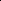

# Beyond Conservation: Flexible Molecular Assembly with Unbalanced Diffusion Bridge

<!-- Page 1 -->

Beyond Conservation: Flexible Molecular Assembly with

Unbalanced Diffusion Bridge

Rongchao Zhang1, Yiwei Lou1, Yu Huang2* Yi Xin3, Yongzhi Cao1, Hanpin Wang1

1Key Laboratory of High Confidence Software Technologies (Peking University), Ministry of Education, School of Computer Science, Peking University, Beijing, China 2National Engineering Research Center for Software Engineering, Peking University, Beijing, China 3National Key Laboratory for Novel Software Technology, Nanjing University, Nanjing, China rcz@stu.pku.edu.cn, hy@pku.edu.cn

## Abstract

Molecular assembly (MA) has long been a fundamental task in chemistry and biology, with the potential to create new materials and enable novel functions beyond the molecular scale. However, its vast conformational search space poses substantial challenges, and current generative models remain limited in capturing molecular flexibility and preventing nonphysical poses. In this paper, we propose AssemUDB, a diffusion bridge–based framework that learns transport mappings between two distinct flexible domains for molecular assembly generation. We reformulate the marginal matching constraint of diffusion bridges as a coupling distribution governed by unbalanced transport rather than imposing strict conservation. Subsequently, we employ a progressive process from structural relaxation in Euclidean space to assembly on the SE(3) manifold. This relaxation of marginal conservation grants the generative model greater flexibility and leads to more physically plausible atom placements. Comprehensive experiments demonstrate the superior performance of AssemUDB. Notably, we find that the method demonstrates performance comparable to, or even better than, mature tools such as PackMol for packing tasks.

## Introduction

Molecular assembly (MA) aims to model and predict how molecular clusters organize into larger structures and functional systems, and has become a widely used framework for probing diverse molecular phenomena across chemistry, biology, and other molecular sciences (Peng et al. 2025; Guo, Bengio, and Liu 2025; Liu et al. 2024c; Szuromi 2017). Despite its broad applicability, MA poses substantial computational challenges due to the complexity of intermolecular interactions and the coupling of multiscale dynamic behaviors. Over the past decades, extensive efforts have been devoted to developing and refining high-precision simulation algorithms for MA (Rebek 1996; Kummel 2003; Bai, Luo, and Liu 2016). Nevertheless, supervised screening of the entire search space is computationally costly for large-scale applications due to the immense combinatorial complexity of the search space. As molecular sciences continue to advance in tandem with rapid developments in computational

*Corresponding author. Copyright © 2026, Association for the Advancement of Artificial Intelligence (www.aaai.org). All rights reserved.

methodologies (Liu et al. 2025a, 2024a, 2025b), generative modeling (Zhang et al. 2024, 2025a; Zhou et al. 2025) has emerged as a promising pathway for alleviating these challenges. By sampling directly from a distribution of ideal molecular states, they offer a diverse and effective pathway to circumvent exhaustive enumeration of all possible configurations (Guo, Bengio, and Liu 2025; Liu et al. 2024c).

Despite substantial research progress, there are observed limitations in the current approaches to MA. Unlike other data modalities such as text or images, molecules face additional challenges as they have to adhere to strict physical principles and obey the constraints of the 3D spatial geometric. Although molecular conformers typically remain largely unchanged during assembly due to intramolecular rigidity (Guo, Bengio, and Liu 2025; Yang et al. 2025), their relative contributions can vary substantially, and strict rigidity restricts the effective search space of conformational degrees of freedom. On the other hand, while bond lengths and angles tend to be stable, atomic spatial arrangements and interaction strengths can change markedly throughout the assembly process. Diffusion models (Grosz and Jain 2025; Zhang et al. 2025c), which iteratively refine samples through a probabilistic denoising process over intermediate states, offer powerful generative capabilities and high sample quality (Susladkar et al. 2025), making them an appealing direction for MA. For training stability, one central barrier in constructing diffusion models over large molecular spaces lies in designing an appropriate noise scheduling process, which typically incurs significant inference delays (Pan et al. 2025; Xue et al. 2024). Recent advances in flow matching (FM) models (Martin et al. 2025; Lipman et al. 2023), mitigate this issue by replacing stochastic noise with direct path interpolation in vector fields. This often involves the sophisticated design of optimal transport couplings, which impose strict marginal conservation (Lipman et al. 2023; Corso et al. 2025)—a constraint that is itself impractical in weights altered settings.

In this paper, we propose AssemUDB, a novel diffusion bridge-based generative model capable of mapping transport between flexible domains for molecular assembly generation. Draw inspiration from unbalanced optimal formulations (Corso et al. 2025; Choi, Choi, and Kang 2024; Wang et al. 2024), we formulate the task as an unbalanced trans-

The Fortieth AAAI Conference on Artificial Intelligence (AAAI-26)

28364

<!-- Page 2 -->

port problem between the prior distribution of weakly correlated molecular conformations and the target distribution of highly correlated crystal structures. Unlike deterministic FM training, which can be stuck in long and complex conditional and marginal flows when diverse data pairings are limited (Choi, Choi, and Kang 2024), AssemUDB trains the policy to penalize the marginals of the coupling distribution. AssemUDB explicitly considers the possibility that marginal non-conservation allows the flexibility to explore generated samples at each step. We then learn transitions from Euclidean relaxation to SE(3) assembly to direct molecular position updates based on a progressive rigidity process. This design facilitates coordinated atomic placement and substantially improves the physical plausibility of the resulting molecular assemblies.

Our main contributions are as follows:

• We propose AssemUDB, a novel framework for molecular assembly generation that tackles key challenges in modeling flexible assemblies by relaxing marginal conservation in diffusion bridges and applying a progressively rigid optimization process. • AssemUDB innovatively introduces unbalanced transport theory to address the marginal mismatch between prior and target distributions, along with an SE(3)equivariant diffusion bridge learning mechanism to preserve molecular rigidity. • Through comprehensive evaluations on molecular assembly tasks, we demonstrate the effectiveness of AssemUDB, highlighting its ability to generate high-quality and physically plausible molecular assemblies.

## Related Work

Molecular Assembly Modeling. The goal of molecular assembly modeling is to describe the spontaneous organization process in which rigid molecules transition from weakly correlated random arrangements to highly ordered and strongly correlated structures (Guo, Bengio, and Liu 2025; Liu et al. 2024c). For example, some prior studies explored the dynamics of molecular assembly within limited temporal and spatial scales using numerical simulation methods, such as molecular dynamics simulations (Mart´ınez et al. 2009) and computational tools like GROMACS (Van Der Spoel et al. 2005). While theoretically robust, these methods are too computationally expensive for large-scale applications (Guo, Bengio, and Liu 2025), prompting a strong demand for more efficient generative modeling techniques. Progress in deep learning has catalyzed advancements across diverse fields, offering powerful tools for complex data modeling (Yan et al. 2025; Liao et al. 2025; Li et al. 2023; Wu et al. 2024) and processing (Zheng et al. 2025b; Zeng et al. 2025b; Lou et al. 2024; Zeng et al. 2025a). Consequently, a wide range of deep learning–based assembly modeling methods has emerged. For example, DiffCSP (Jiao et al. 2023) follows the second approach by jointly generating lattice structures and atomic positions with a periodic E(3)-equivariant denoising model, introducing fractional coordinates to streamline and enhance the generation. However, the periodic nature of the lattice is not predefined, but rather emerges naturally after the crystallization process is complete (Liu et al. 2024c). As a result, some studies (Liu et al. 2024c; Guo, Bengio, and Liu 2025) have moved toward lattice-free molecular assembly approaches, focusing on the intrinsic geometry of molecular clusters instead of assuming periodic structures. For example, the recently proposed AssembleFlow (Guo, Bengio, and Liu 2025) introduces an inertial-frame formulation to construct a reference coordinate system, enabling precise tracking of intracluster orientations and motions. By decomposing molecular SE(3) transformations into translations in R3 and rotations in SO(3), the method explicitly enforces translational and rotational rigidity at each generation step within the flow-matching framework. Despite these advances, there remains a substantial gap to bridge before generative models can be effectively applied to molecular assembly modeling.

Diffusion Models. Diffusion models (Grosz and Jain 2025; Zhang et al. 2025c) have emerged as one of the most powerful classes of deep generative models, demonstrating state-of-the-art performance across images (Wu et al. 2025), videos (Ji et al. 2025), and diverse scientific domains. Diffusion models operate by learning to reverse a forward noising process that gradually perturbs data into a simple Gaussian prior, typically an isotropic high-variance normal distribution. During generation, the model begins from this Gaussian noise and iteratively refines samples through a learned denoising process, effectively transforming an unstructured prior into complex data distributions. Recently, diffusion models have also shown substantial promise in scientific discovery, particularly in molecular design and the generation of complex chemical structures (Zhang et al. 2025b,c).

Schr¨odinger Bridge Problem. The Schr¨odinger bridge problem (SBP), originally rooted in quantum mechanics, can be reformulated as an entropy-regularized optimal transport problem (Pedrotti, Maas, and Mondelli 2024; L´eonard and,Modal-X. Universit´e Paris Ouest, Bˆat. G, 200 av. de la R´epublique. 92001 Nanterre 2014; Schr¨odinger 1932). SBP seeks an optimal stochastic process that minimizes the KL divergence from a reference dynamics while matching prescribed marginal distributions at the initial and terminal times. This formulation bears a close conceptual connection to diffusion models (Pedrotti, Maas, and Mondelli 2024; Feng et al. 2023), particularly in the context of unconditional generative modeling (Bortoli et al. 2021; Kim et al. 2025), where the prior distribution takes the form of Gaussian noise (Zhu et al. 2024). Building on SBP, diffusion bridge (DB) methods (Liu et al. 2025c; Huang et al. 2024) provide a unified generative framework that learns optimal stochastic transport by training on sample pairs drawn from two marginal distributions. In contrast to other mainstream score-based generative models (Pedrotti, Maas, and Mondelli 2024), the DB exhibits broader applicability. Notably, DB imposes no strict constraints on the specific form of the noise perturbation process, allowing more flexible and diverse noise scheduling strategies (Zheng et al. 2025a), thereby providing greater design freedom for various application scenarios (Liu et al. 2025c; Huang et al. 2024; Zhu et al. 2024). In this work, we build upon unbalanced trans-

28365

<!-- Page 3 -->

port formalization (Corso et al. 2025; Choi, Choi, and Kang 2024) to develop a diffusion-bridge framework tailored to improve the prediction quality of molecular assembly.

Preliminary

Problem Statement. Molecules are fundamental units that form through the linkage of multiple atoms via chemical bonds. Generally, a molecular assembly system can be represented as a pair of initial and target cluster structures (α, s), where α = [α1, α2,..., αn] ∈Rn×3 denotes the sequence of n atoms in the weakly correlated initial state with αi ∈R3 indicating the Cartesian coordinate of the i-th atom, and s = [s1, s2,..., sn] ∈Rn×3 denotes the strongly correlated assembly structure with si representing the Cartesian coordinate of the i-th atom in the final assembly conformation. The molecular assembly problem aims to automatically infer the final strongly correlated assembly structure s given the initial weakly correlated conformation α. Hence, an ideal model, parameterized by θ, should be able to learn the underlying mapping from weakly correlated conformations to their corresponding strongly correlated state distributions pθ(s | α).

Diffusion Bridge. Given an initial data distribution q0(s0), diffusion models (Zhou et al. 2024; Zheng et al. 2025a) define a forward stochastic differential equation (SDE) that progressively perturbs samples s0 ∼q0:

dst = f(st, t)dt + g(t)dwt, (1)

where t ∈[0, T] denotes a time horizon, wt ∈Rd is a standard Wiener process, f: Rd × [0, 1] →Rd and g: [0, 1] →R are termed as the drift coefficient and scalar diffusion coefficient of st, respectively. Diffusion models require either the initial distribution q0 or the terminal distribution qT to be a simple and tractable distribution (e.g., isotropic Gaussian). However, in many scientific applications such as molecular design (Zhu et al. 2024; Igashov et al. 2024), the initial state may deviate from a Gaussian distribution. This structural restriction limits the ability of standard diffusion models to construct stochastic paths between arbitrary, potentially highly structured distributions, thereby motivating the development of more general DB formulations that extend beyond Gaussian priors.

The diffusion bridges (Chen et al. 2025; Zhou et al. 2024; Zheng et al. 2025a; He et al. 2024) address this limitation by simulating a stochastic process that interpolates between paired distributions, conditioning the trajectory to terminate at a specified endpoint sT = α. This is achieved through Doob’s h-transform (Doob and Doob 1986; Rogers and Williams 2000), which modifies the reference diffusion in Eqn. (1) to enforce the terminal constraint. The results are given by:

dst = [f(st, t) + g2(t)∇st log q(sT = α|st)]dt

+g(t)dwt, (2)

with boundary conditions s0 ∼q0 = qdata, sT = α, (3)

where q(sT = α|st) denotes the transition kernel of the reference diffusion from time t to T.

Denote by {qt}T t=0 the marginal distributions induced by Eqn. (2). It can be shown that the key property of the forward bridge SDE is that its conditional diffusion distribution qt|0T (st | s0, sT) = pt|0T (st | s0, sT) is conditioned on both endpoints and takes the form of an analytically tractable Gaussian distribution. The forward process is associated with a reverse SDE and a probability flow ODE initiated from the terminal constraint sT = α. The reverse SDE is given by:

dst = [f(st, t) −g2(t)(∇st log q(st|sT = α)

−∇st log p(sT = α|st))]dt + g(t)dwt, (4)

where ∇st log q(st|sT = α) denotes the bridge score function and wt is the reverse-time Wiener process. The only unknown term q(st|sT = α) can be approximated by a neural network sθ(st, t, α) through denoising bridge score matching. The training objective is:

L(θ) = EtEs0,α∼qdata(s0,α)Est∼q(st|s0,sT =α)

[w(t)∥sθ(st, t, α) −∇st log q(st | s0, sT = α)∥2

2], (5)

where w(t) is a positive weighting function. By replacing the theoretical score function ∇st log q(st|sT = α) in Eqn. (5) with the learned score sθ(st, t, α), we obtain practical bridge SDEs and probability-flow ODEs that can be solved numerically. This enables efficient sampling of the learned diffusion bridge and thus allows the model to generate new samples consistent with the target endpoint distribution.

## Methodology

AssemUDB Algorithm Diffusion bridges enable the transformation between arbitrary distributions (Zhu et al. 2025) through reverse SDEs or probability-flow ODEs, thereby removing the restrictive assumption that the initial state follow a Gaussian prior. This property is particularly important for molecular assembly problems, as the sampled distributions derived from initial molecular conformations typically exhibit complex multimodal patterns. In our setting, we take the weakly correlated molecular conformation sT as the prior distribution. We wish to approximate an optimal stochastic transport process that maps qT to the distribution q0, in order to generate physically plausible molecular assembly conformations.

Unbalanced Coupling Formalization. As previously discussed, for a pair of samples (s, α) ∼ps,α(s, α), diffusion bridge models typically assume strict marginal distribution preservation when constructing endpoint-conditioned diffusion processes, i.e., under ideal conditions, the initial and target points s0 = s and sT = α are assumed to exactly match the marginal distributions of the training data through a sequence of random variables (st)T t=0. However, when the underlying coupling structure exhibits high complexity or multimodality, enforcing exact marginal conservation can constrain the learning, often resulting in unstable training and degraded approximation quality. To relax this overly rigid requirement, we draw inspiration from unbalanced optimal

28366

<!-- Page 4 -->

𝒔𝑻 𝒔𝒕 𝒔𝒕#𝟏 𝒔𝟎

Weakly Correlated

Conformation

Strongly Correlated

Conformation 𝑠& = 𝛼 𝑠' ~ 𝑝()*)

Probabilistic Inductive Assembly

Process 𝑞𝑠!,# 𝑠$,#, 𝑠%,# = 𝒩 𝜇̂!,#, 𝜎*!,#

& Ι and 𝑞𝑠!,' 𝑠$,', 𝑠%,' = 𝒩 𝜇̂!,', 𝜎*!,'

& Ι 𝑠𝑠!,#, 𝑡, 𝛼, 𝑇= ∇(!,# log 𝑞(𝑠!,#|𝑠%,#) and 𝑠𝑠!,', 𝑡, 𝛼, 𝑇= ∇(!,$ log 𝑞(𝑠!,'|𝑠%,')

Interpolation

Score Prediction

AssemUDB

**Figure 1.** Overview of AssemUDB. The process begins by coupling weakly and strongly correlated pairs, followed by establishing probabilistic paths through a diffusion bridge. The forward process involves learning a scoring function via interpolation, while the reverse process leverages this learned function to reconstruct the target conformation with strong structural relevance.

transport formalizations, which relax marginal preservation by introducing mass-variation penalties based on the R´enyi divergence of order 2 (Corso et al. 2025; Choi, Choi, and Kang 2024; Wang et al. 2024). Specially, let q(s0, sT) represent the coupling between the source distribution s0 and the target distribution sT. Instead of requiring the learned bridge to match the marginals exactly, we introduce the marginal deviation penalty term (Corso et al. 2025). Formally, we consider the following objective:

LUDB(θ) =EtEs0,αEst∼q(st|s0,sT =α)M0(s0, t, α)

+ D2(q0 | qs0) + D2(qsT | qT), (6)

where M0(s0, t, α) is equal to w(t)∥sθ(st, t, α) − ∇st log q(st | s0, sT = α)∥2

2, and D2(· | ·) denotes the second-order R´enyi divergence, which quantifies the quality difference between the generated distribution and the target marginal distribution. Note that we need to keep the marginal deviation low for all t and q(s0, sT), consistent with the principles of diffusion-bridge modeling. In fact, the two R´enyi divergence terms in the objective Eqn. (6) can be regarded as explicit regularizers for marginal deviation. However, the complexity of q(s0, sT) far exceeds the expressive capacity of the model itself, making this objective computationally intractable in general (Corso et al. 2025).

Bound Approximation. To obtain a tractable training objective, we approximate the coupling distribution q and then optimize θ while keeping q fixed. Following an argument analogous to unbalanced transport formulations, we can derive the upper bound:

min q,θ LUDB(θ) ≤min q EtE(s0,sT)∼qw(t)∥∇st log q(st | s0, sT = α)∥2

2 + D2(q0 | qs0) + D2(qsT | qT). (7) Conceptually, this means that as the bridge distribution q(st | s0, sT = α) varies smoothly with respect to its conditions (i.e., exhibits a small gradient norm), and if its marginals qs0, qsT are close to the desired distributions q0, qT, then the overall loss tends to be small. SBP seeks the most likely stochastic process connecting two marginal distributions by minimizing the KL divergence to a reference diffusion. According to diffusion bridge theory (Zhou et al. 2024; Zheng et al. 2025a), when the reference process is a Gaussian diffusion and the conditional distribution q(st | s0, sT = α) forms a Gaussian bridge, the score term admits a closed-form solution. Upon combining with Eqn. (7), it is clear that the minimization of minq,θ LUDB(θ) can be interpreted as an upper bound for the unbalanced optimal transport problem. The model does not need to explicitly model the high-order structure of the path distribution. Instead, it implicitly shapes the diffusion trajectory by penalizing discrepancies at the endpoints and marginal distributions. That is, it stabilizes path generation and reduces computational complexity by constraining marginal divergences and endpoint mismatches. Thus, we can optimize the parameters θ using stochastic gradient descent, thereby simplifying the training process, i.e.,

LUDB(θ; q) = EtEs0,α∼qdata(s0,α)Est∼q(st|s0,sT =α) [w(t)∥sθ(st, t, α) −∇st log q(st | s0, sT = α)∥2

2]. (8)

Flexible Assembly on SE(3). For a molecular cluster s with m molecules and n atoms, we define a diffusion process for each SE(3)-invariant measure (Pollard 2011; Ito et al. 2025) of s on the product space SO(3)×R3, where the SO(3) term for each atom encodes its rotational freedom in three-dimensional space, while the R3 component describes its translational degrees of freedom in the 3D Euclidean space. There are various methods to represent SO(3). Directly modeling rotation matrices requires ensuring both orthogonality and determinant (Guo, Bengio, and Liu 2025), which can lead to numerical instability and additional constraints during optimization. Following prior work, we adopt a quaternion representation and implement it through eigendecomposition (Guo, Bengio, and Liu 2025; Horn, Hilden, and Negahdaripour 1988; Bar-Itzhack 2000). This representation is particularly useful for smooth and uniform rotational transformations, as the resulting matrix variables satisfy orthogonality and maintain a determinant of 1, ensuring the validity of the rotation matrix.

28367

AI-readable visual equivalent, added: Figure extracted from the paper PDF and converted to an SVG wrapper asset. Use the surrounding page text and caption for interpretation.

<!-- Page 5 -->

Interpolation in R3. Accordingly, given the coupling (s0,r, sT,r) ∼q decomposed over the R3 space by s, we define its transition kernel as q(st,r | s0,r, sT,r) = N(ˆµt,r, ˆσ2 t,rI), where

ˆµt,r = at,r aT,r

SNRT,r

SNRt,r sT,r + at,rs0,r(1 −SNRT,r

SNRt,r

), (9)

and ˆσ2 t,r = σ2 t,r(1 −SNRT,r

SNRt,r

). (10)

at,r is a fixed signal scaling factor and normally takes the value of 1.0. σt,r defines the noise schedule, and SNRt,r = a2 t,r/σ2 t,r represents the signal-to-noise ratio at time t.

Interpolation in SO(3). We begin with a unit quaternionbased parameterization for the rotation SO(3) group, where the initial and final orientations are represented as s0,e and sT,e, respectively. Similarly, the forward transition kernel is defined as q(st,e | s0,e, sT,e) = N(ˆµt,e, ˆσ2 t,eI), where

ˆµt,e = sin((1 −SNRT,e/SNRt,e)ω)s0,e/ sin(ω)

+ sin(SNRT,e/SNRt,e)ω)sT,e/ sin(ω), (11)

and ˆσ2 t,e = σ2 t,e(1 −SNRT,e

SNRt,e

). (12)

ω is the angle between s0,e and sT,e, σt,e denotes the noise schedule, and SNRt,e = a2 t,e/σ2 t,e is the signal-tonoise ratio at time t. This formulation preserves geometric consistency in quaternion space and forms a smooth, structure-preserving rotational diffusion bridge through SE(3)-equivariant interpolation and controllable covariance.

Training. For the diffusion bridge in R3, we adopt score matching, using a neural network to approximate the true bridge score term q(st,r | sT,r). This leads to the following loss function:

LR3(θr; q) = EtEs0,r,α∼qdataEst,r∼q(st,r|s0,r,sT,r)[wr (t)∥sθr(st,r, t, α) −∇st,r log q(st,r | s0,r, sT,r)∥2

2]. (13) In the rotation space SO(3), we employ a parameterized neural network θe to approximate the rotational score function of the bridge distribution score term q(st,e | sT,e), which is optimized at time t by minimizing

LSO(θe; q) = EtEs0,e,α∼qdataEst,e∼q(st,e|s0,e,sT,e)[we (t)∥sθe(st,e, t, α) −∇st,e log q(st,e | s0,e, sT,e)∥2

2]. (14) Then the overall loss L for training AssemUDB can be given by

L = LR3(θr; q) + LSO(θe; q). (15) For coupling q, we consider two molecular configurations to form a valid coupling pair if their assembly satisfies a prescribed similarity cost.

Inference. In the sampling phase, we initialize the starting point of the diffusion trajectory from the given initial distribution qT (sT), and perform reverse sampling of the bridge process iteratively at each time step t. Upon completing the sampling, the resulting trajectories are transformed from the SE(3)-invariant space back into the Cartesian coordinate system by applying quaternion-based rotation and translation to the local reference frame (Guo, Bengio, and Liu 2025).

## Model

Architecture The network θ consists of multiple graph attention layers (Velickovic et al. 2018) and equivariant message passing layers (Brandstetter et al. 2022), which jointly capture translational and rotational spatiotemporal information. Specifically, we extract features from the molecular graph via TransformerConv, and incorporates a temporal MLP layer to enhance time dependency. To ensure translational and rotational equivariance, MLP layers are separately designed in R3 and SO(3) group spaces, which generate translational and rotational diffusion scores by predicting edge features and basis function coefficients. Finally, the network outputs the information of molecular clusters via a scatter mean operation across the graph, which is then used to drive the generation of molecular diffusion bridge trajectories.

## Experiments

## Experimental Setup

## Evaluation

Dataset. We evaluate the performance of our method on the widely used COD-Cluster17 benchmark dataset (Liu et al. 2024c), which is derived from the Crystallography Open Database (Graˇzulis et al. 2009). To guarantee uniform chemical environments, the dataset is filtered using rigorous criteria, retaining only crystal structures with a single local environment. Given the complexity of polymer crystals, those formed through intermolecular polymerization are excluded due to their potential to extend across infinite unit cells in 1D, 2D, or 3D, which would impose extra periodic constraints and long-range interactions. The final dataset consists of 133k molecular crystal structures, covering a diverse range of chemical spaces and molecular topologies (Graˇzulis et al. 2009).

Implementation details. In terms of architecture parameters, we set both the embedding dimension and hidden layer dimension to 128, the network depth to 5 layers, and use 8 attention head. For distance cutoff parameters, the interaction cutoff radius between atoms is set to 5˚ A, while the clustering analysis cutoff is extended to 50˚ A to capture longrange intermolecular interactions while maintaining computational feasibility. We adopt the Adam optimizer (Kingma and Ba 2015) with an initial learning rate of 1 × 10−4, and apply cosine annealing scheduling (Loshchilov and Hutter 2017) for learning rate decay. The dataset is split into training, validation, and test sets with a ratio of 8: 1: 1. The experiments are implemented using the PyTorch 2.2.2, with all models trained on a single NVIDIA GeForce RTX 4090 GPU equipped with 24 GB of memory.

Metrics. Following prior work (Guo, Bengio, and Liu 2025), we primarily use five evaluation metrics. i) Collision rate: It measures the frequency of atomic collisions in the predicted assemblies. We use covalent bond radii as the criterion for detecting atomic collisions, since they offer a pre-

28368

<!-- Page 6 -->

## Model

Packing Matching Score Validity PMS (center) (↓) PMS (atom) (↓) Compactness (↑) Collision (↓) Separation (↑)

Cluster-5k

GNN-MD 13.80 ± 0.07 13.67 ± 0.06 100 ± 0.00 27.53 ± 0.49 0.22 ± 0.11 CrystalFlow-VP 17.10 ± 1.89 15.71 ± 2.69 4.87 ± 1.09 1.38 ± 0.04 35.43 ± 0.88 CrystalSDE-VP 19.15 ± 4.46 18.15 ± 3.02 34.00 ± 30.75 0.84 ± 0.14 53.13 ± 12.89 AssembleFlow 6.13 ± 0.10 7.27 ± 0.04 100 ± 0.00 0.33 ± 0.00 97.64 ± 0.36 AssemUDB (Ours) 5.93 ± 0.08 6.97 ± 0.02 100 ± 0.00 0.34 ± 0.02 98.08 ± 0.13

Cluster-10k

GNN-MD 13.90 ± 0.05 13.83 ± 0.06 100 ± 0.00 27.88 ± 0.49 0.23 ± 0.11 CrystalFlow-VP 16.01 ± 3.13 19.39 ± 4.37 4.23 ± 0.48 1.44 ± 0.03 33.35 ± 0.55 CrystalSDE-VP 21.39 ± 1.50 22.20 ± 3.29 16.83 ± 18.09 0.53 ± 0.35 52.48 ± 15.44 AssembleFlow 6.21 ± 0.05 7.38 ± 0.03 99.93 ± 0.05 0.31 ± 0.00 97.73 ± 0.16 AssemUDB (Ours) 6.04 ± 0.07 7.12 ± 0.09 100.00 ± 0.08 0.31 ± 0.02 98.06 ± 0.23

Cluster-113k

GNN-MD 14.51 ± 0.82 22.30 ± 12.04 98.77 ± 1.73 24.29 ± 4.58 4.13 ± 5.60 CrystalFlow-VP 13.28 ± 0.48 13.50 ± 0.44 6.61 ± 3.17 1.51 ± 0.02 33.06 ± 1.31 CrystalSDE-VP 20.02 ± 3.70 18.03 ± 4.56 6.88 ± 2.82 0.55 ± 0.19 48.78 ± 1.70 AssembleFlow 6.21 ± 0.01 7.37 ± 0.01 99.98 ± 0.00 0.31 ± 0.00 98.15 ± 0.22 AssemUDB (Ours) 6.06 ± 0.02 7.12 ± 0.01 99.99 ± 0.01 0.31 ± 0.01 95.97 ± 0.32

**Table 1.** Performance comparison with molecular assembly baselines on the COD-Cluster 17 with 5k, 10k, and 113k datasets. Evaluation metrics include validity and packing matching score-related measures. The best results are highlighted in bold.

Metric PackMol AssembleFlow AssemUDB

Cluster-5k

PM (center) 6.05 ± 0.04 6.13 ± 0.10 5.93 ± 0.08 PM (atom) 7.10 ± 0.05 7.27 ± 0.04 6.97 ± 0.02 Collision 0.32 ± 0.00 0.33 ± 0.00 0.34 ± 0.02 Separation 99.56 ± 0.08 97.64 ± 0.36 98.08 ± 0.13

Cluster-10k

PM (center) 6.11 ± 0.01 6.21 ± 0.05 6.04 ± 0.07 PM (atom) 7.16 ± 0.01 7.38 ± 0.03 7.12 ± 0.09 Collision 0.30 ± 0.00 0.31 ± 0.00 0.31 ± 0.02 Separation 99.45 ± 0.10 97.73 ± 0.16 98.06 ± 0.23

Cluster-113k

PM (center) 6.09 ± 0.01 6.21 ± 0.01 6.06 ± 0.02 PM (atom) 7.15 ± 0.01 7.37 ± 0.01 7.12 ± 0.01 Collision 0.30 ± 0.00 0.31 ± 0.00 0.31 ± 0.01 Separation 99.42 ± 0.03 98.15 ± 0.22 95.97 ± 0.32

**Table 2.** Comparison results for molecular packing design.

cise physical lower bound for bonding distances. ii) Separation: A molecular cluster is considered geometrically valid if the minimum distance between molecules exceeds 0.5˚ A (Court et al. 2020). This metric evaluates the effectiveness of avoiding unphysical interactions at the molecular level. iii) Compactness: Measured by the proportion of simulated clusters with maximum atomic pairwise distances under 100˚ A. Higher compactness reflects more efficient spatial arrangement, minimizing voids between molecules and yielding denser crystal forms, in line with real crystalline packing principles. iv) & v) Packing Match Score (PMS): This consists of atomic-level and centroid-level packing metrics, evaluating how closely the generated assemblies resemble reference crystal structures in spatial arrangement and packing density (Chisholm and Motherwell 2005).

Molecular Assembly

We compare the proposed AssemUDB method with several mainstream generative baselines on the assembly structure generation task, including GNN-MD (Liu et al. 2024b), AssembleFlow (Guo, Bengio, and Liu 2025), CrystalFlow-VP (Liu et al. 2024c), and CrystalSDE-VP (Liu et al. 2024c). For fair comparison, all methods are uniformly reproduced num 493 num 748 num 1683 num 697

Initial positions AssembleFlow AssemUDB

**Figure 2.** Weakly correlated initial positions and strongly correlated assemblies generated by different approaches.

under our same preprocessed dataset and experimental settings. As shown in Table 1, our AssemUDB method achieves the best performance on most evaluation metrics. In particular, for validity-related metrics, AssemUDB achieves the lowest PMS (atom) (6.97–7.12) and the lowest PMS (center) (5.93 −6.06), significantly outperforming the conventional GNN-MD. Figure 2 provides a visual comparison of the molecular assembly results under varying atomic scales. Notably, AssemUDB yields more compact and orderly structures, with particularly pronounced advantages in the 1683atom configuration.

Molecular Packing Design

Due to the high time cost and substantial resource consumption of wet-lab validation, large-scale systematic evaluation becomes infeasible. Therefore, to evaluate the applicability of AssemUDB in molecular design scenarios, we ad-

28369

AI-readable visual equivalent, added: Figure extracted from the paper PDF and converted to an SVG wrapper asset. Use the surrounding page text and caption for interpretation.

AI-readable visual equivalent, added: Figure extracted from the paper PDF and converted to an SVG wrapper asset. Use the surrounding page text and caption for interpretation.

AI-readable visual equivalent, added: Figure extracted from the paper PDF and converted to an SVG wrapper asset. Use the surrounding page text and caption for interpretation.

AI-readable visual equivalent, added: Figure extracted from the paper PDF and converted to an SVG wrapper asset. Use the surrounding page text and caption for interpretation.

AI-readable visual equivalent, added: Figure extracted from the paper PDF and converted to an SVG wrapper asset. Use the surrounding page text and caption for interpretation.

AI-readable visual equivalent, added: Figure extracted from the paper PDF and converted to an SVG wrapper asset. Use the surrounding page text and caption for interpretation.

AI-readable visual equivalent, added: Figure extracted from the paper PDF and converted to an SVG wrapper asset. Use the surrounding page text and caption for interpretation.

AI-readable visual equivalent, added: Figure extracted from the paper PDF and converted to an SVG wrapper asset. Use the surrounding page text and caption for interpretation.

AI-readable visual equivalent, added: Figure extracted from the paper PDF and converted to an SVG wrapper asset. Use the surrounding page text and caption for interpretation.

AI-readable visual equivalent, added: Figure extracted from the paper PDF and converted to an SVG wrapper asset. Use the surrounding page text and caption for interpretation.

AI-readable visual equivalent, added: Figure extracted from the paper PDF and converted to an SVG wrapper asset. Use the surrounding page text and caption for interpretation.

AI-readable visual equivalent, added: Figure extracted from the paper PDF and converted to an SVG wrapper asset. Use the surrounding page text and caption for interpretation.

<!-- Page 7 -->

<300 300-600 800-900 1000-1200 >1400 25.0

27.5

30.0

32.5

35.0

37.5

40.0

LCN Value

31.5

29.6

34.5

32.3

27.0

33.6

31.7

37.5

34.8

30.3

Average Local Coordination Number

<300 300-600 800-900 1000-1200 >1400 0.034

0.036

0.038

0.040

0.042

0.044

Density (atoms / ų)

0.0420

0.0385

0.0367

0.0431

0.0344

0.0421

0.0395 0.0391

0.0433

0.0361

Packing Density (atoms / ų) AssembleFlow Ours

**Figure 3.** Comparison of geometric compactness properties. The average local coordination number quantifies the number of neighboring atoms within 4.5˚ A. Packing density is computed using the volume of the axis-aligned bounding box.

w/ Unbalanced

Attention/ Head Layer

Packing Matching Score Validity PMS (center) PMS (atom) Compactness Collision Separation ✘ ✔ 6.12 ± 0.08 7.18 ± 0.01 100.00 ± 0.00 0.35 ± 0.01 96.29 ± 0.17 ✔ ✘ 6.08 ± 0.07 7.06 ± 0.03 100.00 ± 0.00 0.34 ± 0.00 97.08 ± 0.22 ✔ ✔ 5.93 ± 0.08 6.97 ± 0.02 100.00 ± 0.00 0.34 ± 0.02 98.08 ± 0.13

**Table 3.** Ablation analysis of AssemUDB.

ditionally compare its performance to PackMol (Mart´ınez et al. 2009) in molecular packing tasks. PackMol is a mature and widely adopted tool, serving as a standard solution for chemists and materials scientists for many years (Guo, Bengio, and Liu 2025). As shown in Table 2, AssemUDB performs comparably to the PackMol tool and even slightly outperforms it on certain metrics. It shows potential to replace PackMol in practical molecular design applications.

Geometric Compactness

We also evaluate the additional geometric compactness of the generated assemblies. To quantify local atomic aggregation, we compute the average local coordination number (Pan et al. 2021), i.e., the number of neighboring atoms within a 4.5˚ A. Packing density is also computed using the volume of the axis-aligned bounding box, measured in atoms/˚ A3 to reflect how densely atoms are packed within a unit volume. As illustrated in Figure 3, AssemUDB outperforms AssembleFlow across most molecular size ranges by producing assemblies with higher coordination numbers and improved densities. Notably, significant advantages are observed in the 800–900 and over 1400 atom count ranges.

Ablation Study

We conduct ablation experiments on the Cluster17-5k dataset, and the results are shown in Table 3. The results indicate that eliminating the umbalance strategy causes a noticeable degradation in PMS and separation performance. Similarly, reducing the number of attention layers in the neural network to 6 also resulted in a decline in performance, confirming that deeper attention stacks are essential for cap- turing the geometric dependencies. Thus, future efforts can focus on optimising networks. The complete AssemUDB yields optimal results, validating that each technical module contributes meaningfully to overall model performance.

## Conclusion

and Limitation

In this work, we proposed an unbalanced diffusion bridge method, a novel generative framework designed to learn mappings between two flexible distributions. We applied this framework to the molecular assembly task, where it achieved outstanding performance across various benchmarks. Comprehensive experiments demonstrate the superior performance of AssemUDB. Despite its effectiveness, it still has several limitations: Real-world applications frequently suffer from limited data availability and high data acquisition costs. The modeling of specific physicochemical constraints still requires further refinement. In addition, the diffusion process involves multi-step sampling, resulting in longer inference times relative to one-shot approaches, potentially limiting its applicability in real-time scenarios.

## Acknowledgments

This paper was supported by National Key R&D Program of China (2024YFE0202700), National Natural Science Foundation of China under Grants (62436006, 62172016, 62572007), Sanya Science and Technology Special Fund (No. 2024KFJX04), Beijing Natural Science Foundation (No. L257018) and Beijing Nova Program.

28370

<!-- Page 8 -->

## References

Bai, Y.; Luo, Q.; and Liu, J. 2016. Protein self-assembly via supramolecular strategies. Chem. Soc. Rev., 2756–2767. Bar-Itzhack, I. Y. 2000. New method for extracting the quaternion from a rotation matrix. J. Guid. Control Dyn., 1085–1087. Bortoli, V. D.; Thornton, J.; Heng, J.; and Doucet, A. 2021. Diffusion Schr¨odinger Bridge with Applications to Score- Based Generative Modeling. In NeurIPS. Brandstetter, J.; Hesselink, R.; van der Pol, E.; Bekkers, E. J.; and Welling, M. 2022. Geometric and Physical Quantities improve E(3) Equivariant Message Passing. In ICLR. Chen, W.; Li, S.; Li, J.; Yang, J.; Paisley, J.; and Zeng, D. 2025. Dequantified Diffusion-Schr¨odinger Bridge for Density Ratio Estimation. CoRR. Chisholm, J. A.; and Motherwell, S. 2005. COMPACK: a program for identifying crystal structure similarity using distances. J. Appl. Crystallogr., 228–231. Choi, J.; Choi, J.; and Kang, M. 2024. Scalable Wasserstein Gradient Flow for Generative Modeling through Unbalanced Optimal Transport. In ICML. Corso, G.; Somnath, V. R.; Getz, N.; Barzilay, R.; Jaakkola, T. S.; and Krause, A. 2025. Composing Unbalanced Flows for Flexible Docking and Relaxation. In ICLR. Court, C. J.; Yildirim, B.; Jain, A.; and Cole, J. M. 2020. 3-D inorganic crystal structure generation and property prediction via representation learning. J. Chem. Inf. Model., 4518–4535. Doob, J. L.; and Doob, J. 1986. Classical potential theory and its probabilistic counterpart. Springer, 274–274. Feng, B. T.; Smith, J.; Rubinstein, M.; Chang, H.; Bouman, K. L.; and Freeman, W. T. 2023. Score-Based Diffusion Models as Principled Priors for Inverse Imaging. In ICCV. Graˇzulis, S.; Chateigner, D.; Downs, R. T.; Yokochi, A. F. T.; Quir´os, M.; Lutterotti, L.; Manakova, E.; Butkus, J.; Moeck, P.; and Le Bail, A. 2009. Crystallography Open Database - an open-access collection of crystal structures. J. Appl. Crystallogr., 726–729. Grosz, S. A.; and Jain, A. K. 2025. Universal Fingerprint Generation: Controllable Diffusion Model With Multimodal Conditions. IEEE Trans. Pattern Anal. Mach. Intell., 1028– 1041. Guo, H.; Bengio, Y.; and Liu, S. 2025. AssembleFlow: Rigid Flow Matching with Inertial Frames for Molecular Assembly. In ICLR. He, G.; Zheng, K.; Chen, J.; Bao, F.; and Zhu, J. 2024. Consistency Diffusion Bridge Models. In NeurIPS. Horn, B. K. P.; Hilden, H. M.; and Negahdaripour, S. 1988. Closed-form solution of absolute orientation using orthonormal matrices. J. Opt. Soc. Am. A Opt. Image Sci. Vis., 1127. Huang, Y.; Zhang, O.; Wu, L.; Tan, C.; Lin, H.; Gao, Z.; Li, S.; and Li, S. Z. 2024. Re-Dock: Towards Flexible and Realistic Molecular Docking with Diffusion Bridge. In ICML. Igashov, I.; Schneuing, A.; Segler, M. H. S.; Bronstein, M. M.; and Correia, B. E. 2024. RetroBridge: Modeling Retrosynthesis with Markov Bridges. In ICLR.

Ito, Y.; Taniai, T.; Igarashi, R.; Ushiku, Y.; and Ono, K. 2025. Rethinking the role of frames for SE(3)-invariant crystal structure modeling. In ICLR. Ji, L.; Zhong, L.; Wei, P.; and Li, C. 2025. PoseTraj: Pose- Aware Trajectory Control in Video Diffusion. In CVPR. Jiao, R.; Huang, W.; Lin, P.; Han, J.; Chen, P.; Lu, Y.; and Liu, Y. 2023. Crystal Structure Prediction by Joint Equivariant Diffusion. In NeurIPS. Kim, J. H.; Kim, S.; Moon, S.; Kim, H.; Woo, J.; and Kim, W. Y. 2025. Discrete Diffusion Schr¨odinger Bridge Matching for Graph Transformation. In ICLR. Kingma, D. P.; and Ba, J. 2015. Adam: A Method for Stochastic Optimization. In ICLR. Kummel, A. C. 2003. Chemistry. How to assemble a molecular junction. Science, 69–70. L´eonard, C.; and,Modal-X. Universit´e Paris Ouest, Bˆat. G, 200 av. de la R´epublique. 92001 Nanterre. 2014. A survey of the Schr¨odinger problem and some of its connections with optimal transport. Discrete Contin. Dyn. Syst. Ser. A. Li, H.; Zhao, J.; Bazin, J.; Kim, P.; Joo, K.; Zhao, Z.; and Liu, Y. 2023. Hong Kong World: Leveraging Structural Regularity for Line-Based SLAM. IEEE Trans. Pattern Anal. Mach. Intell., (11): 13035–13053. Liao, B.; Zhao, Z.; Li, H.; Zhou, Y.; Zeng, Y.; Li, H.; and Liu, P. 2025. Convex Relaxation for Robust Vanishing Point Estimation in Manhattan World. In CVPR. Lipman, Y.; Chen, R. T. Q.; Ben-Hamu, H.; Nickel, M.; and Le, M. 2023. Flow Matching for Generative Modeling. In ICLR. Liu, J.; Liu, Y.; Shang, F.; Liu, H.; Liu, J.; and Feng, W. 2025a. Improving Generalization in Federated Learning with Highly Heterogeneous Data via Momentum-Based Stochastic Controlled Weight Averaging. In ICML. Liu, J.; Shang, F.; Liu, Y.; Liu, H.; Li, Y.; and Gong, Y. 2024a. FedBCGD: Communication-Efficient Accelerated Block Coordinate Gradient Descent for Federated Learning. In ACM MM. Liu, J.; Shang, F.; Tian, Y.; Liu, H.; and Liu, Y. 2025b. Consistency of Local and Global Flatness for Federated Learning. In ACM MM. Liu, S.; Cheng, B.; Ma, Y.; Wu, L.; Ma, A.; Wu, X.; Leng, D.; and Yin, Y. 2025c. Bridge Diffusion Model: Bridge Chinese Text-to-Image Diffusion Model with English Communities. In AAAI. Liu, S.; weitao Du; Li, Y.; Li, Z.; Bhethanabotla, V. C.; Rampal, N.; Yaghi, O. M.; Borgs, C.; Anandkumar, A.; Guo, H.; and Chayes, J. T. 2024b. A Multi-Grained Symmetric Differential Equation Model for Learning Protein-Ligand Binding Dynamics. In ICLR. Liu, S.; Yan, D.; Guo, H.; and Anandkumar, A. 2024c. An Equivariant Flow Matching Framework for Learning Molecular Crystallization. In ICML. Loshchilov, I.; and Hutter, F. 2017. SGDR: Stochastic Gradient Descent with Warm Restarts. In ICLR.

28371

<!-- Page 9 -->

Lou, Y.; Xu, D.; Zhang, R.; Zhang, J.; Cao, Y.; Wang, H.; and Huang, Y. 2024. MR Image Quality Assessment via Enhanced Mamba: A Hybrid Spatial-Frequency Approach. In BIBM. Martin, S. T.; Gagneux, A.; Hagemann, P.; and Steidl, G. 2025. PnP-Flow: Plug-and-Play Image Restoration with Flow Matching. In ICLR. Mart´ınez, L.; Andrade, R.; Birgin, E. G.; and Mart´ınez, J. M. 2009. PACKMOL: A package for building initial configurations for molecular dynamics simulations. J. Comput. Chem. Pan, H.; Ganose, A. M.; Horton, M.; Aykol, M.; Persson, K. A.; Zimmermann, N. E. R.; and Jain, A. 2021. Benchmarking coordination number prediction algorithms on inorganic crystal structures. Inorg. Chem., 1590–1603. Pan, Z.; Zhuang, B.; Huang, D.; Nie, W.; Yu, Z.; Xiao, C.; Cai, J.; and Anandkumar, A. 2025. T-Stitch: Accelerating Sampling in Pre-Trained Diffusion Models with Trajectory Stitching. In ICLR. Pedrotti, F.; Maas, J.; and Mondelli, M. 2024. Improved Convergence of Score-Based Diffusion Models via Prediction-Correction. Trans. Mach. Learn. Res. Peng, R.; Xu, X.; Nepal, B.; Gong, Y.; Li, F.; Ferretti, M. B.; Zhou, M.; Lynch, K. W.; Burslem, G. M.; Kortagere, S.; Marmorstein, R.; and Chang, Y.-W. 2025. Molecular basis of influenza ribonucleoprotein complex assembly and processive RNA synthesis. Science, eadq7597. Pollard, D. 2011. Cambridge series in statistical and probabilistic mathematics: A user’s guide to measure theoretic probability series number 8. Cambridge University Press. Rebek, J., Jr. 1996. Molecular assembly and encapsulation. Pure Appl. Chem., 1261–1266. Rogers, L. C. G.; and Williams, D. 2000. Cambridge mathematical library diffusions, Markov processes and martingales: Ito calculus volume 2. Cambridge University Press. Schr¨odinger, E. 1932. Sur la th´eorie relativiste de l’´electron et l’interpr´etation de la m´ecanique quantique. Annales de l’institut Henri Poincar´e, 269–310. Susladkar, O. K.; Gupta, J. S.; Sehgal, C.; Mittal, S.; and Singhal, R. 2025. MotionAura: Generating High-Quality and Motion Consistent Videos using Discrete Diffusion. In ICLR. Szuromi, P. 2017. A framework for molecular assembly. Science, 920–922. Van Der Spoel, D.; Lindahl, E.; Hess, B.; Groenhof, G.; Mark, A. E.; and Berendsen, H. J. C. 2005. GROMACS: fast, flexible, and free. J. Comput. Chem., 1701–1718. Velickovic, P.; Cucurull, G.; Casanova, A.; Romero, A.; Li`o, P.; and Bengio, Y. 2018. Graph Attention Networks. In ICLR. Wang, Z.; Shen, Y.; Zavlanos, M. M.; and Johansson, K. H. 2024. Outlier-Robust Distributionally Robust Optimization via Unbalanced Optimal Transport. In NeurIPS. Wu, S.; Liu, Z.; Zhang, B.; Zimmermann, R.; Ba, Z.; Zhang, X.; and Ren, K. 2024. Do as I Do: Pose Guided Human Motion Copy. IEEE Trans. Dependable Secur. Comput., (6): 5293–5307.

Wu, S.; Zhang, H.; Liu, Z.; Chen, H.; and Jiao, Y. 2025. Enhancing Human Pose Estimation in Internet of Things via Diffusion Generative Models. IEEE Internet Things J., (10): 13556–13567. Xue, S.; Liu, Z.; Chen, F.; Zhang, S.; Hu, T.; Xie, E.; and Li, Z. 2024. Accelerating Diffusion Sampling with Optimized Time Steps. In CVPR. Yan, S.; Wang, Y.; Zhao, K.; Shi, P.; Zhao, Z.; Zhang, Y.; and Li, J. 2025. HeMoRa: Unsupervised Heuristic Consensus Sampling for Robust Point Cloud Registration. In CVPR. Yang, H.-B.; Lu, Y.-X.; Yue, X.; Liu, Z.-X.; Sun, W.-B.; Zheng, W.-P.; Guan, Q.-F.; and Yu, S.-H. 2025. Multiscale integral synchronous assembly of cuttlebone-inspired structural materials by predesigned hydrogels. Nat. Commun. Zeng, S.; Chang, X.; Xie, M.; Liu, X.; Bai, Y.; Pan, Z.; Xu, M.; and Wei, X. 2025a. FutureSightDrive: Thinking Visually with Spatio-Temporal CoT for Autonomous Driving. In NeurIPS. Zeng, S.; Qi, D.; Chang, X.; Xiong, F.; Xie, S.; Wu, X.; Liang, S.; Xu, M.; and Wei, X. 2025b. Janusvln: Decoupling semantics and spatiality with dual implicit memory for vision-language navigation. arXiv preprint arXiv:2509.22548. Zhang, R.; Huang, Y.; Cao, Y.; and Wang, H. 2025a. Mole- Bridge: Synthetic Space Projecting with Discrete Markov Bridges. In NeurIPS. Zhang, R.; Huang, Y.; Lou, Y.; Ding, W.; Cao, Y.; and Wang, H. 2025b. Synergistic Attention-Guided Cascaded Graph Diffusion Model for Complementarity Determining Region Synthesis. IEEE Trans. Neural Networks Learn. Syst., (7): 11875–11886. Zhang, R.; Huang, Y.; Lou, Y.; Xin, Y.; Chen, H.; Cao, Y.; and Wang, H. 2025c. Exploit Your Latents: Coarse-Grained Protein Backmapping with Latent Diffusion Models. In AAAI. Zhang, R.; Lou, Y.; Xu, D.; Cao, Y.; Wang, H.; and Huang, Y. 2024. A Learnable Discrete-Prior Fusion Autoencoder with Contrastive Learning for Tabular Data Synthesis. In AAAI. Zheng, K.; He, G.; Chen, J.; Bao, F.; and Zhu, J. 2025a. Diffusion Bridge Implicit Models. In ICLR. Zheng, Y.; Zhong, B.; Liang, Q.; Zhang, S.; Li, G.; Li, X.; and Ji, R. 2025b. Towards universal modal tracking with online dense temporal token learning. IEEE Transactions on Pattern Analysis and Machine Intelligence. Zhou, L.; Lou, A.; Khanna, S.; and Ermon, S. 2024. Denoising Diffusion Bridge Models. In ICLR. Zhou, P.; Peng, X.; Song, J.; Li, C.; Xu, Z.; Yang, Y.; Guo, Z.; Zhang, H.; Lin, Y.; He, Y.; et al. 2025. OpenING: A Comprehensive Benchmark for Judging Open-ended Interleaved Image-Text Generation. In CVPR. Zhu, K.; Pan, M.; Ma, Y.; Fu, Y.; Yu, J.; Wang, J.; and Shi, Y. 2025. UniDB: A Unified Diffusion Bridge Framework via Stochastic Optimal Control. In ICML. Zhu, Y.; Wu, J.; Li, Q.; Yan, J.; Yin, M.; Wu, W.; Li, M.; Ye, J.; Wang, Z.; and Wu, J. 2024. Bridge-IF: Learning Inverse Protein Folding with Markov Bridges. In NeurIPS.

28372
