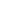

# Beyond Local Patterns: Multiscale Inconsistency Learning for Graph Anomaly Detection

<!-- Page 1 -->

Beyond Local Patterns: Multiscale Inconsistency Learning for

Graph Anomaly Detection

Jie Lian1,2*, Zhihao Wu1*, Jielong Lu1, Jiajun Yu1, Qianqian Shen1, Haishuai Wang1†

1Zhejiang Key Laboratory of Accessible Perception and Intelligent Systems, College of Computer Science and Technology, Zhejiang University, Hangzhou, China

2College of Computer and Data Science, Fuzhou University, Fuzhou, China linj2680157@gmail.com, zhihaowu1999@gmail.com, jielonglu2022@163.com, jiajunyu1999@gmail.com, shenqq377@zju.edu.cn, haishuai.wang@zju.edu.cn

## Abstract

Graph anomaly detection is emerging as a critical technology for addressing increasingly complex and dynamic risk environments. Although unsupervised graph anomaly detection has advanced under the graph representation learning, directly applying these paradigms remains fundamentally misaligned with anomaly detection objectives. In this work, we highlight two key insights: graph neural networks are often suboptimal as feature extractors due to neighborhood aggregation diluting anomaly signals, and reliance on local inconsistency mining is inadequate for comprehensive anomaly detection, as it often fails to identify anomalies hidden within camouflaged communities. Based on these insights, we propose multiscale inconsistency learning for graph anomaly detection (MI-GAD), a novel framework that integrates both local and global anomaly signals. Specifically, individual node representations are projected onto a common hypersphere to ensure uniformity. At the local scale, the graph structure is leveraged for affinity-aware modeling via group discrimination. At the global scale, we introduce node deviation, a metric that distinguishes anomalies by optimizing representation centers. This unified approach enables robust and comprehensive detection of diverse graph anomalies. Experiments on seven real datasets demonstrate that our method consistently outperforms state-of-the-art baselines in both effectiveness and scalability.

## Introduction

Graph Anomaly Detection (GAD) constitutes a fundamental graph task dedicated to identifying nodes that exhibit significant deviations from normal structural or attribute patterns. Driven by the prevalence of graph-structured data, GAD has attracted substantial research interest due to critical applications in several pivotal fields (Gu, Qiao, and Li 2025), like social spam mitigation (Deng et al. 2023), telecom fraud prevention (Hu et al. 2022), and financial security (Huang et al. 2022). In real-world scenarios, graph anomalies exhibit highly diverse and complex patterns, arising from various sources such as community outliers, attribute corruption (Tu et al. 2024a; Wu et al. 2024), and structural pertur-

*These authors contributed equally. †Corresponding author: Haishuai Wang. Copyright © 2026, Association for the Advancement of Artificial Intelligence (www.aaai.org). All rights reserved.

Normal Anomaly

(b) Community Camouflage (a) GNN versus MLP

**Figure 1.** (a) Performance comparison between GNN and MLP on two anomaly scoring objectives: reconstruction loss (RL) and local affinity (LA), across Facebook and Reddit datasets. (b) Illustration of community camouflage phenomenon and similarity distributions for normal and abnormal node pairs on T-Finance (More in Appendix A).

bations (Chen et al. 2025; Zhuang et al. 2025). Such irregularities often pose severe challenges to graph analytical models (Wu et al. 2023). This inherent complexity, compounded by the extreme scarcity of labeled anomaly data, establishes unsupervised graph anomaly detection (UGAD) as a highly challenging research topic.

Driven by the success of graph representation learning paradigms (Wu, Zhang, and Fan 2023; Li et al. 2022; Yu et al. 2024), most methods seek to migrate techniques from traditional graph tasks to GAD. These methods exploit inconsistency signals in graph structures by effectively aggregating neighborhood information. Reconstruction-based methods, inspired by graph autoencoders (Ding et al. 2019), detect anomalies by minimizing the reconstruction loss of both node attributes and graph structure. In parallel, contrastive-based frameworks, motivated by graph contrastive learning methods such as DGI (Veliˇckovi´c et al. 2019), utilize carefully designed pretext tasks (e.g., nodesubgraph contrast) to capture discriminative representations indicative of local abnormality (Liu et al. 2021; Zhao et al. 2025). Hybrid-based methods (Zheng et al. 2021; Zhang, Wang, and Chen 2022; Lian et al. 2024) combine the strengths of generative and contrastive methods to obtain diverse self-supervised signals. More recently, methods such as TAM (Qiao and Pang 2023) further enhance anomaly detection by quantifying inconsistencies via local node affinity.

The Fortieth AAAI Conference on Artificial Intelligence (AAAI-26)

15216

<!-- Page 2 -->

Graph Neural Network

Graph Contrastive Learning

Graph Auto Encoder

Graph Representation Learning

Graph Anomaly Detection

No GNN Needed

Local Affinity Alone

Global Compactness

Graph Anomaly Detection

**Figure 2.** Illustration of GAD challenges in graph representation learning and our design points based on our insights.

Despite recent advances, we argue that the inductive biases of graph representation learning, particularly neighborhood smoothness, are fundamentally misaligned with the objectives of GAD. This realization leads to two key insights that guide the design of an effective UGAD framework: Insight 1-Graph neural networks (GNNs) are not always suitable as feature extractors. Although GNNs excel at conventional graph tasks, their inherent smoothing and neighborhood aggregation tend to dilute graph anomalies. To validate this intuition, we constructed two simple baselines: one based on reconstruction loss and another on local affinity, training each with both GNNs and Multilayer Perceptrons (MLPs). As shown in Figure 1(a), in both anomaly scoring criteria, MLPs even outperform their GNN counterparts. Insight 2-While local inconsistency mining is effective, it remains insufficient. While local inconsistency mining can detect fine-grained structural anomalies, local topology alone is often insufficient for comprehensive anomaly detection. Across multiple real-world datasets, we empirically observe a common anomaly phenomenon known as community camouflage, where anomalous communities maintain high local similarity comparable to that of normal nodes. This high similarity makes abnormal nodes difficult to distinguish from normal ones based on their relationships with neighbors. As shown in Figure 1(b), abnormal node pairs in the T-Finance dataset even exhibit higher similarity than normal node pairs, posing a significant challenge for UGAD.

Following the above insights, we propose Multiscale Inconsistency learning for Graph Anomaly Detection (MI- GAD), a simple yet effective framework that detects graph anomalies by jointly modeling inconsistencies across local and global views. Figure 2 shows the dilemma of existing methods based on graph representation learning and our corresponding design solutions. To eliminate neighborhoodinduced bias, MI-GAD employs an MLP backbone that disentangles node attributes from graph topology, preserving individual node representations. Subsequently, all node embeddings are mapped onto a common hypersphere, which alleviates embedding imbalance and provides a unified criterion for measuring distributional deviations. At the local scale, the graph structure is leveraged as a distributional prior by training a discriminative model to distinguish between neighbor and non-neighbor pairs, promoting strong affinity awareness among normal nodes. At the global scale, we introduce a novel metric, node deviation, which reinforces global compactness by optimizing a learnable representation center and quantifies the separation of abnormal nodes from the normal attribute distribution. By modeling local affinity and global compactness separately within a GNN-free framework, MI-GAD effectively captures neighborhood-level inconsistencies and global distributional shifts in a decoupled yet complementary manner. Details of the proposed framework are shown in Figure 3. The contributions of our paper are summarized as follows:

• We introduce two key insights in designing UGAD frameworks, moving beyond the limitation of directly applying existing graph learning methods to GAD. • We propose MI-GAD, a novel framework that projects node representations onto a common hypersphere and jointly models local affinity and global compactness. • We are the first to propose node deviation as a global anomaly score that captures global inconsistency via divergence from the overall attribute distribution. • Extensive experiments on various datasets demonstrate that MI-GAD achieves superior accuracy, efficiency, and scalability over state-of-the-art baselines.

## Related Work

Self-supervised Learning Paradigm on Graph Selfsupervised learning has emerged as a key paradigm for graph representation learning (Tu et al. 2024b; Zhuo et al. 2024; Lu et al. 2025), particularly in unsupervised scenarios, as it enables effective embedding extraction without manual labels. Existing methods are mainly classified as generationbased and contrast-based (Liu et al. 2022; Cai et al. 2025). Generation-based models use graph autoencoders to reconstruct graph information (Wang et al. 2024; Tu et al. 2025), while contrast-based models maximize mutual information between positive pairs by contrasting different graph views, such as node or graph-level augmentations (Veliˇckovi´c et al. 2019; Xu et al. 2025a). These advances in self-supervised graph learning also inspire recent developments in UGAD.

Unsupervised Graph Anomaly Detection The early work (Perozzi and Akoglu 2016) employed ego network information to detect anomalous neighbors. (Li et al. 2017) analyzed the attribute information residuals and their consistency representation. In addition, (Peng et al. 2018) combined residual analysis with CUR decomposition for anomaly detection. Most recently, deep learning-based algorithms, especially GNN-based methods, have been increasingly explored with impressive achievements (Cai, Zhang, and Fan 2025; Zhang et al. 2024). These GNNbased methods can be divided into three main categories. (1) Reconstruction-based methods: (Ding et al. 2019) quantified anomaly degree by computing the reconstruction loss of node attributes and graph structure via a graph autoencoder. (Luo et al. 2022) offered a community-aware, tailored GNN to mitigate the over-smoothing of abnormal nodes. (Bei et al. 2025) proposed a framework with auxiliary encoders and correlation constraints to enhance GNN robustness against anomalies in unsupervised graph anomaly detection. (Wei

15217

<!-- Page 3 -->

Anomaly Scoring

𝐇

MLP

Global Inconsistency Modeling

Representation Center Detection Boundary

Node Deviation

෩𝒉𝒊−𝒄𝟐

𝟐

Positive

Local Affinity Discrimination

Positive Negative Target Node Pos/Neg Score

Local Affinity

Close

Hypersphere Node Embedding

Individual Node Encoding

Hypersphere Space Mapping

0.23

0.18

0.33

0.35

0.91

LocalScore

GlobalScore

Pos Neg

Disc

**Figure 3.** Architecture of MI-GAD. The framework operates in four stages: (1) Hypersphere Node Embedding: Raw node features are transformed by MLPs into discriminative representations and projected onto a unit hypersphere; (2) Local Affinity Discrimination: Positive (neighbor) and negative (non-neighbor) groups (shown in blue and red, respectively) are constructed, and anomaly scores are measured via similarity-based group discrimination; (3) Global Inconsistency Modeling: Node deviation is quantified by measuring the distance of each node to the global feature center c; (4) The final anomaly score is obtained by integrating both local discrimination signals and global inconsistency measures.

et al. 2025) proposed the graph evidential learning framework, which models feature and topology uncertainty via evidential distributions to improve graph anomaly detection. (2) Contrastive-based methods: (Liu et al. 2021) leveraged an approach using metric instance pairs for node-subgraph contrast. (Chen et al. 2024) designed a two-stage contrastbased method that combines local inconsistency mining with hybrid attention-based message passing. (Xu et al. 2025b) enhances anomaly detection under structural imbalance via neighbor pruning for head nodes and anomaly-guided neighbor completion for tail nodes. (3) Hybrid-based methods: (Zheng et al. 2021) presented a hybrid-based method from the joint perspective of contrast-based methods and generation-based methods. (Zhang, Wang, and Chen 2022) improved hybrid-based methods by utilizing a multi-view mechanism that includes raw and diffusion views. However, few existing methods systematically integrate both local and global inconsistency modeling, which motivates our work.

Preliminary Notations For a given attributed network G = (V, E, X), where V represents the set of N nodes, E represents the set of edges, and X ∈RN×F denotes the attribute matrix for all nodes. The neighborhood set Ni ⊆V of node vi is defined as the set of nodes directly connected to vi, that is: Ni = {vj | (vi, vj) ∈E}.

Problem Definition The focus of this paper is the unsupervised graph anomaly detection problem. For a given attributed network G = (V, E, X), the objective of this task is to compute a score and rank the abnormality degree of each node vi by defining a valid anomaly function, which can be formalized as score (·): Rm →R. Typically, nodes with high scores are considered abnormal nodes.

## Methodology

## Limitations

of GNN-based UGAD Methods. Most existing UGAD methods adopt GNNs as the default backbone, following the standard graph representation learning paradigm without critically examining their underlying principles. Notably, measuring node–neighbor relationships, particularly local affinity, is a well-established and highly effective approach for GAD. To further investigate Insight 1, we critically examine the operation of existing GNN-based UGAD methods and establish a theoretical connection between GNNs and local affinity scores to better understand their limitations. Theorem 1 (Informal). The graph convolution operator in GNNs essentially minimizes the following local affinity score between sample pairs (hi, hj):

JLA = −

N X i=1

1 |Ni|

X vj∈Ni

˜h⊤ i ˜hj. (1)

The formal theorem and proof are deferred to Appendix B. Theorem 1 indicates that standard GNNs implicitly optimize local affinity scores. However, this optimization has two main limitations. During feature extraction, repeated neighborhood smoothing in message passing mixes individual representations with neighborhood information, weakening the effectiveness of local affinity as an anomaly score.

15218

<!-- Page 4 -->

For local affinity optimization, implicit affinity updates lack flexible control over the direction and strength of similarity adjustments, further obscuring anomaly patterns. These issues motivate us to decouple individual node feature extraction from local affinity score optimization.

Hypersphere Node Embedding To achieve unified and discriminative node representations of normal patterns, we introduce a hyperspherical node embedding scheme.

Individual Node Encoding. First, we obtain nodespecific features by employing a simple MLP:

hi = f(xi; W), (2)

where H, X denote the node feature embedding and the attribute matrix, W denotes a learnable weight matrix, b denotes the bias, and H = {hi}n i=1 and hi represents the embedding of node vi.

Hypersphere Space Mapping. Then, we project node embeddings from the original space Rd into the hypersphere space Sd−1 = {˜hi: ∥˜hi∥2 = 1} via a map function Map(·): Rd →Sd−1, as:

˜hi = Map (hi) = hi ∥hi∥2

, (3)

where hi is the representation of node vi. This mapping avoids an uneven distribution of node representations in space, thereby avoiding optimization difficulties and stability issues that arise during training.

Local Affinity Discrimination To flexibly optimize local affinity, we retain the local modeling capability of GNNs and represent it as an affinityoriented soft loss. Inspired by (Zheng et al. 2022), we implement this loss within a group discrimination paradigm to achieve scalable local affinity optimization.

Affinity Pair Construction. We treat positive and negative edge pairs as two distinct groups. Then, we obtain the local affinity score by calculating the similarity between a node and its neighbors. The score of positive pairs J (+)

LA (vi) can be formalized as follows:

J (+)

LA (vi; W) = −1

|Ni|

X vj∈Ni

˜h⊤ i ˜hj, (4)

where Ni is the neighbor set of node vi. Moreover, the score of negative pairs ls(−)

i can be formalized as follows:

J (−)

LA (vi; W) = − 1 |V\Ni|

X vk∈V\Ni

˜h⊤ i ˜hk, (5)

where V\Ni is the non-neighbor set of node vi. However, incorporating all non-neighbor nodes during training leads to excessive memory consumption. To maintain scalability, we randomly sample a subset of non-neighboring nodes in each epoch that matches the number of neighboring nodes.

Neighborhood Alignment. For J (+)

LA (vi) and J (−)

LA (vi), we optimize them using binary cross entropy (BCE) loss, which is formalized as:

min

W Llocal:= −

N X i=1 log

J (+)

LA (vi; W)

+ log

1 −J (−) LA (vi; W)

.

(6)

Ideally, normal nodes develop effective discriminatory abilities through training, whereas abnormal nodes do not. While local affinity measures based on neighbor relationships are effective for nodes in rich structural contexts, as noted in Insight 2, they struggle to handle more complex cases, such as community camouflage. To address this limitation, we shift the focus from local neighborhoods to a global perspective.

Global Inconsistency Modeling Global anomalies manifest as outliers in the overall feature distribution of graphs, representing a critical yet underexplored perspective (Qiao et al. 2025). Motivated by one-class learning (Ruff et al. 2018), we introduce node deviation, a novel scoring function that assesses global compactness based on conformity to the global attribute distribution.

Node Deviation. For the mapped representation ˜hi, we define the node representation center c and propose the node deviation. JND (vi) to measure global anomalies, which is formulated as follows:

JND (vi; W) =

˜hi −c

2

2, c = 1 N

N X i=1

˜hi, (7)

Based on the node deviation, we further propose the global inconsistency loss function:

min

W Lglobal:= 1

N

N X i=1

JND (vi; W) + γ

L X l=1

Wl

2

F, (8)

By minimizing the distance to the representation center c in Eq. (8), normal nodes are progressively pulled closer to c during training, while anomalies remain distant due to their inherent deviation from dominant patterns. This naturally induces a decision boundary in the representation space, separating anomalies from normal samples.

Loss Function. Our model is trained jointly by Llocal and Lglobal, which are formalized as follows:

min

W L:= Llocal + λLglobal. (9)

where λ is a trade-off parameter to balance between discriminative loss and centralization loss.

Anomaly Scoring. During inference, the local anomaly score is computed using the neighbor affinity, while the centrality loss serves as the global anomaly score. Specifically, the total anomaly score is computed as follows:

si = J (+)

LA (vi; W∗) | {z } Local

+ λJND (vi; W∗) | {z } Global

. (10)

where λ balances the scores of the two modules, consistent with Eq. (9). The algorithmic process of the proposed method is presented in Algorithm 1.

15219

<!-- Page 5 -->

## Algorithm

1: The algorithmic process of MI-GAD

Require: An attributed network G = (V, E, X); Number of training epoch T; Balance parameters λ. Ensure: Anomaly score list for all nodes.

1: Initialize trainable parameters W. 2: for t = 1 →T do 3: Obtain the individual node representation H by the MLP encoder. 4: Map node representations hi to the hypersphere via Eq. (3). 5: // Local Affinity Discrimination 6: Calculate the local affinity of neighbor and nonneighbor nodes respectively via Eqs. (4), (5), and compute the contrastive loss Llocal via Eq. (6). 7: // Global Inconsistency Modeling 8: Obtain the node representation center c and compute the centrality loss Lglobal by Eq. (8). 9: Back propagate and update the trainable parameters. 10: end for 11: Return Anomaly score for all nodes by Eq. (10).

Complexity Analysis

Assuming the input graph has N nodes and E edges. Let D be the hidden dimension of encoders, we analyze the time complexity by considering the two main modules, respectively. First, we obtain individual node representations through an MLP layer with a time complexity of O(ND2). Second, local affinity mining computes the similarity of nodes on the edges with a complexity of O(ED), while the global center-aware module derives its complexity from the computational center c with a complexity of O(ND). In total, the overall model complexity is O(ND2 + ND + ED). We compare the time complexity of our method with baseline methods in Appendix C.

## Experiments

Experimental settings

Datasets. Experiments are conducted on seven real-world datasets, including Facebook, Amazon, Reddit, T-Finance, Yelp, Elliptic, and T-Social. Dataset statistics and detailed descriptions are provided in Appendix D.

Baselines. We compare the proposed method with eight deep learning-based baseline methods, including: DOM- INANT (Ding et al. 2019), CoLA (Liu et al. 2021), PREM (Pan et al. 2023), VGOD (Huang et al. 2023), TAM (Qiao and Pang 2023), GADAM (Chen et al. 2024), HUGE (Pan et al. 2025), and SmoothGNN (Dong et al. 2025). Details of baselines can be found in Appendix D.

## Evaluation

Metric. The anomaly detection performance of all methods is evaluated using two widely adopted metrics: the Area Under the Receiver Operating Characteristic Curve (AUROC) and the Area Under the Precision-Recall Curve (AUPRC). Higher AUROC/AUPRC indicates better performance. To account for the impact of randomness, each experiment is repeated 10 times, and both the mean and standard deviation of the results are reported for comparison.

Parameter Settings. In all experiments, the learning rate r is uniformly set to 0.002 (0.001 for Elliptic), and the training epochs are fixed to 100. The hidden dimension is set to 64. Furthermore, the parameter λ performs a grid search between 0.1 and 0.9. For other baselines, we retain their original experimental configurations to ensure the reporting of optimally tuned results. More parameter settings can be found in Appendix D.

Experimental Results Performance Comparison. The ROC curves of all methods on four benchmark datasets are shown in Figure 4. Simultaneously, the AUROC and AUPRC results on seven GAD datasets are reported in Table 1. From the results, we make the following key observations: (1) The proposed method achieves excellent performance. In particular, on the T-Finance dataset, the AUROC improvement over the second-best result is as high as 18.80%. (2) Across all baselines, the models that consider global metrics (GADAM, HUGE, SmoothGNN) typically outperform other baselines. However, our approach achieves more promising results by directly modeling the inconsistency of global anomalies. (3) Our method also demonstrates high efficiency on large-scale datasets, achieving state-of-the-art results on the 5M-node T- Social graph dataset. This underscores its potential for practical applications requiring massive graph data processing.

Efficiency and Scalability Analysis. To systematically assess efficiency and scalability, we record both the total running time and peak GPU memory usage. As shown in Figure 5 (More in Appendix E), on both the Facebook and Reddit datasets, the proposed method consistently achieves strong AUROC performance while requiring significantly less running time and memory compared to several prominent baselines. Overall, our method demonstrates a clear advantage by effectively balancing computational cost and detection performance.

Performance across Different Node Degrees. To further evaluate the effectiveness of our method across different node degrees, we present results in Figure 6 (More in Appendix E). The proposed method consistently outperforms baselines in most degree intervals, with especially notable improvements for low-degree nodes.

Visualization. Figure 7 (More in Appendix E) displays the anomaly score distributions across different baseline methods. Our proposed method exhibits a significantly more concentrated anomaly score distribution for normal nodes than the baselines, while demonstrating clearer separation between normal and abnormal distributions. This improved separability is attributed to the joint consideration of local and global perspectives.

Ablation Study As detailed in Table 2, we conduct rigorous ablation studies to evaluate three core components of our framework:

15220

<!-- Page 6 -->

(a) Facebook (b) Reddit (c) Amazon (d) Yelp

**Figure 4.** ROC curves comparison on four benchmark datasets. A larger area under the AUROC curve indicates better anomaly detection performance. The black dotted lines refers to the “random line”, indicating the performance under random guessing.

Metric M / D Facebook Reddit Amazon Yelp T-Finance Elliptic T-Social

AUROC

DOMINANT 55.40±1.10 51.82±5.78 59.87±1.35 OOM OOM OOM OOM CoLA 84.67±2.25 59.49±0.67 25.55±0.74 49.88±0.18 24.92±0.64 OOM OOM PREM 89.78±0.53 54.62±0.29 43.30±12.98 51.36±0.41 58.44±10.17 OOM OOM VGOD 85.95±0.63 54.17±2.48 76.03±0.53 49.95±3.22 OOM OOM OOM TAM 88.93±0.59 57.66±2.48 70.03±2.32 OOM OOM OOM OOM GADAM 94.02±0.77 57.55±0.62 43.89±2.65 48.73±1.95 33.78±7.76 41.23±1.55 61.80±1.81 HUGE 96.43±0.64 58.62±0.53 88.65±0.05 56.33±0.58 64.94±9.46 OOM OOM SmoothGNN 44.46±1.08 56.87±1.69 83.17±0.88 57.48±0.06 75.85±0.11 66.08±5.12 65.87±2.84 Ours 98.37±0.10 61.07±0.29 90.99±0.12 63.84±0.19 94.65±0.70 78.38±0.97 69.52±3.61

AUPRC

DOMINANT 2.65±0.10 3.53±0.53 7.61±0.25 OOM OOM OOM OOM CoLA 25.15±4.74 4.22±0.11 5.82±0.15 14.25±0.05 3.17±0.08 OOM OOM PREM 15.39±0.69 4.08±0.01 10.40±11.32 15.84±1.75 7.61±7.94 OOM OOM VGOD 10.66±0.40 3.84±0.39 18.76±0.48 14.76±1.30 OOM OOM OOM TAM 28.18±2.40 4.38±0.05 20.76±3.13 OOM OOM OOM OOM GADAM 30.10±4.14 4.51±0.18 5.59±0.30 13.85±0.78 3.62±0.60 7.20±0.31 3.55±0.18 HUGE 25.71±5.72 4.79±0.37 76.92±0.23 17.98±0.43 9.07±4.68 OOM OOM SmoothGNN 1.95±0.04 4.17±0.16 39.05±2.33 18.18±0.03 14.09±0.03 14.93±3.29 4.92±0.80 Ours 51.79±2.19 5.30±0.10 78.74±0.43 30.86±0.35 63.45±4.86 20.18±1.38 5.99±0.85

**Table 1.** Comparative results on real-world datasets with AUROC and AUPRC (mean%±std%). The best results are highlighted in bold. OOM means out-of-memory error (with 24GB of GPU memory).

**Figure 5.** Memory usage and running time (per 100 epochs) for compared methods on Facebook and Reddit. (The radius of the circle represents the memory usage.)

Individual Node Representation. To assess the importance of explicit node representation learning, we replace

(a) Facebook (b) Amazon

**Figure 6.** Performance comparison of the top 5 methods across node degree intervals.

the encoder MLP with a GNN (w/ GNN). This substitution induces performance degradation due to feature coupling effects in GNN-based propagation. These results highlight the

15221

AI-readable visual equivalent, added: Figure extracted from the paper PDF and converted to an SVG wrapper asset. Use the surrounding page text and caption for interpretation.

AI-readable visual equivalent, added: Figure extracted from the paper PDF and converted to an SVG wrapper asset. Use the surrounding page text and caption for interpretation.

AI-readable visual equivalent, added: Figure extracted from the paper PDF and converted to an SVG wrapper asset. Use the surrounding page text and caption for interpretation.

AI-readable visual equivalent, added: Figure extracted from the paper PDF and converted to an SVG wrapper asset. Use the surrounding page text and caption for interpretation.

AI-readable visual equivalent, added: Figure extracted from the paper PDF and converted to an SVG wrapper asset. Use the surrounding page text and caption for interpretation.

<!-- Page 7 -->

(a) VGOD (b) HUGE (c) SmoothGNN (d) Ours

**Figure 7.** Distribution of anomaly scores for the top 4 methods with AUROC values on Amazon dataset. (The scores are normalized to a range of 0 to 1.)

Variant Facebook Reddit Amazon Yelp T-Finance Elliptic

AUROC AUPRC AUROC AUPRC AUROC AUPRC AUROC AUPRC AUROC AUPRC AUROC AUPRC w/ GNN 72.36 8.32 60.75 5.18 83.83 40.95 47.76 18.84 86.50 34.63 61.77 12.86 w/o HSM 91.29 38.85 58.44 5.27 54.59 8.33 55.21 17.51 94.49 63.25 51.07 8.92 w/o LAD 33.91 1.99 55.20 3.81 66.06 10.44 59.26 19.31 81.76 61.63 48.40 9.50 w/o GIM 94.48 41.76 58.61 5.28 75.80 25.65 48.02 13.59 21.32 2.77 68.06 13.85 Ours 98.37 51.79 61.07 5.30 90.99 78.74 63.84 30.86 94.65 63.45 78.38 20.18

**Table 2.** Ablation study: AUROC and AUPRC (%) on six datasets. Best and second-best per column are highlighted by orange and light orange, respectively.

necessity of using MLP to obtain individual representations.

Hypersphere Space Mapping Strategy. We ablate the hypersphere space mapping module (w/o HSM) to evaluate its necessity. This removal consistently degrades performance across all datasets, indicating the crucial role that mapping plays in optimizing the training process.

Multiscale Inconsistency Metrics. We assess the contributions of the Local Affinity Discrimination (LAD) and Global Inconsistency Modeling (GIM) branches by removing each component in turn. Results show that LAD is especially important for social graphs, while GIM is critical for transaction networks. Importantly, the best performance is achieved only when both branches are combined, underscoring their complementary strengths.

Parameters Sensitivity Effect of Trade-off Parameter. Figure 8 (Detailed in Appendix E) illustrates the impact of the balance parameter λ across different datasets. The parameter λ controls the relative importance of the local and global anomaly detectors. It is observed that different balance parameters are required on different datasets. Specifically, we set λ to [0.2, 0.2, 0.3, 0.2, 0.5, 0.4, 0.3] for Facebook, Reddit, Amazon, Yelp, T- Finance, Elliptic, and T-Social, respectively.

Effect of Hidden Layer Dimension. Figure 8 also illustrates the impact of the hidden dimension in different datasets. In most datasets, performance improves initially with an increase in the hidden dimension but then begins to decline as the dimension continues to grow. We empirically determined 64 as the optimal embedding dimension to maximize performance while containing computational costs.

**Figure 8.** Results of parameter sensitivity experiments w.r.t. trade-off parameter λ and hidden dimension.

## Conclusion

In this paper, we challenge the prevailing practice of applying graph learning paradigms to unsupervised graph anomaly detection and identify two key insights: GNNs are not always suitable as feature extractors, and relying solely on local inconsistency mining is insufficient, particularly in challenging scenarios like community camouflage. To address these issues, we propose MI-GAD, a framework that systematically integrates local and global inconsistency modeling. MI-GAD maps node embeddings into hypersphere space for discriminative representations, quantifies local inconsistency through group discrimination, and measures global inconsistency by node deviation from the representation center. Experiments demonstrate that MI-GAD consistently outperforms existing methods. In future work, we will further explore graph anomaly detection in more complex settings.

15222

AI-readable visual equivalent, added: Figure extracted from the paper PDF and converted to an SVG wrapper asset. Use the surrounding page text and caption for interpretation.

AI-readable visual equivalent, added: Figure extracted from the paper PDF and converted to an SVG wrapper asset. Use the surrounding page text and caption for interpretation.

<!-- Page 8 -->

## Acknowledgements

This work was supported by the National Natural Science Foundation of China (Grant Nos. 62202422 and 62372408), the Medical Innovation Research Special Project of Shanghai Municipal Science and Technology Commission Fund (No. 22Y11912300), and Shanghai Municipal Health Commission Fund (No. 202340207).

## References

Bei, Y.; Zhou, S.; Shi, J.; Ma, Y.; Wang, H.; and Bu, J. 2025. Guarding Graph Neural Networks for Unsupervised Graph Anomaly Detection. IEEE Transactions on Neural Networks and Learning Systems, 1–14. Cai, J.; Zhang, Y.; and Fan, J. 2025. Self-Discriminative Modeling for Anomalous Graph Detection. In Forty-second International Conference on Machine Learning. Cai, J.; Zhang, Y.; Liu, F.; and Ng, S. 2025. Leveraging Diffusion Model as Pseudo-Anomalous Graph Generator for Graph-Level Anomaly Detection. In Forty-second International Conference on Machine Learning. Chen, J.; Zhu, G.; Yuan, C.; and Huang, Y. 2024. Boosting Graph Anomaly Detection with Adaptive Message Passing. In The Twelfth International Conference on Learning Representations, 1–22. Chen, Z.; Wu, Z.; Sadikaj, Y.; Plant, C.; Dai, H.; Wang, S.; Cheung, Y.; and Guo, W. 2025. ADEdgeDrop: Adversarial Edge Dropping for Robust Graph Neural Networks. IEEE Transactions on Knowledge and Data Engineering, 37(9): 4948–4961. Deng, L.; Wu, C.; Lian, D.; Wu, Y.; and Chen, E. 2023. Markov-Driven Graph Convolutional Networks for Social Spammer Detection. IEEE Transactions on Knowledge and Data Engineering, 35(12): 12310–12322. Ding, K.; Li, J.; Bhanushali, R.; and Liu, H. 2019. Deep anomaly detection on attributed networks. In Proceedings of the 2019 SIAM International Conference on Data Mining, 594–602. Dong, X.; Zhang, X.; Sun, Y.; Chen, L.; Yuan, M.; and Wang, S. 2025. SmoothGNN: Smoothing-aware GNN for unsupervised node anomaly detection. In Proceedings of the ACM on Web Conference 2025, 1225–1236. Gu, J.; Qiao, Z.; and Li, Z. 2025. SpectralGap: Graph- Level Out-of-Distribution Detection via Laplacian Eigenvalue Gaps. In Proceedings of the Thirty-Fourth International Joint Conference on Artificial Intelligence, 5244– 5252. Hu, X.; Chen, H.; Liu, S.; Jiang, H.; Chu, G.; and Li, R. 2022. BTG: A Bridge to Graph machine learning in telecommunications fraud detection. Future Generation Computer Systems, 137: 274–287. Huang, X.; Yang, Y.; Wang, Y.; Wang, C.; Zhang, Z.; Xu, J.; Chen, L.; and Vazirgiannis, M. 2022. Dgraph: A large-scale financial dataset for graph anomaly detection. In Advances in Neural Information Processing Systems, 22765–22777. Huang, Y.; Wang, L.; Zhang, F.; and Lin, X. 2023. Unsupervised graph outlier detection: Problem revisit, new insight, and superior method. In 2023 IEEE 39th International Conference on Data Engineering (ICDE), 2565–2578. IEEE. Li, J.; Dani, H.; Hu, X.; and Liu, H. 2017. Radar: Residual analysis for anomaly detection in attributed networks. In Proceedings of the Twenty-Sixth International Joint Conference on Artificial Intelligence, volume 17, 2152–2158. Li, S.; Liu, F.; Jiao, L.; Chen, P.; Liu, X.; and Li, L. 2022. MFNet: A novel GNN-based multi-level feature network with superpixel priors. IEEE Transactions on Image Processing, 31: 7306–7321. Lian, J.; Wang, X.; Lin, X.; Wu, Z.; Wang, S.; and Guo, W. 2024. Graph Anomaly Detection via Multi-View Discriminative Awareness Learning. IEEE Transactions on Network Science and Engineering, 11(6): 6623–6635. Liu, Y.; Jin, M.; Pan, S.; Zhou, C.; Zheng, Y.; Xia, F.; and Philip, S. Y. 2022. Graph self-supervised learning: A survey. IEEE Transactions on Knowledge and Data Engineering, 35(6): 5879–5900. Liu, Y.; Li, Z.; Pan, S.; Gong, C.; Zhou, C.; and Karypis, G. 2021. Anomaly detection on attributed networks via contrastive self-supervised learning. IEEE Transactions on Neural Networks and Learning Systems, 33(6): 2378–2392. Lu, J.; Wu, Z.; Yu, J.; Bu, J.; and Wang, H. 2025. Multi- Omics Analysis for Cancer Subtype Inference via Unrolling Graph Smoothness Priors. In Proceedings of the Thirty- Fourth International Joint Conference on Artificial Intelligence, 5842–5850. Luo, X.; Wu, J.; Beheshti, A.; Yang, J.; Zhang, X.; Wang, Y.; and Xue, S. 2022. Comga: Community-aware attributed graph anomaly detection. In Proceedings of the Fifteenth ACM International Conference on Web Search and Data Mining, 657–665. Pan, J.; Liu, Y.; Zheng, X.; Zheng, Y.; Liew, A. W.-C.; Li, F.; and Pan, S. 2025. A Label-Free Heterophily-Guided Approach for Unsupervised Graph Fraud Detection. In Proceedings of the AAAI Conference on Artificial Intelligence, volume 39, 12443–12451. Pan, J.; Liu, Y.; Zheng, Y.; and Pan, S. 2023. PREM: A Simple Yet Effective Approach for Node-Level Graph Anomaly Detection. In 2023 IEEE International Conference on Data Mining, 1253–1258. Peng, Z.; Luo, M.; Li, J.; Liu, H.; Zheng, Q.; et al. 2018. ANOMALOUS: A Joint Modeling Approach for Anomaly Detection on Attributed Networks. In Proceedings of the Twenty-Seventh International Joint Conference on Artificial Intelligence, 3513–3519. Perozzi, B.; and Akoglu, L. 2016. Scalable anomaly ranking of attributed neighborhoods. In Proceedings of the 2016 SIAM International Conference on Data Mining, 207–215. Qiao, H.; and Pang, G. 2023. Truncated affinity maximization: One-class homophily modeling for graph anomaly detection. In Advances in Neural Information Processing Systems, volume 36. Qiao, H.; Tong, H.; An, B.; King, I.; Aggarwal, C.; and Pang, G. 2025. Deep Graph Anomaly Detection: A Survey and New Perspectives. IEEE Transactions on Knowledge & Data Engineering, (01): 1–20.

15223

<!-- Page 9 -->

Ruff, L.; Vandermeulen, R.; Goernitz, N.; Deecke, L.; Siddiqui, S. A.; Binder, A.; M¨uller, E.; and Kloft, M. 2018. Deep one-class classification. In International Conference on Machine Learning, 4393–4402. PMLR. Tu, W.; Guan, R.; Zhou, S.; Ma, C.; Peng, X.; Cai, Z.; Liu, Z.; Cheng, J.; and Liu, X. 2024a. Attribute-Missing Graph Clustering Network. 15392–15401. Tu, W.; Liao, Q.; Zhou, S.; Peng, X.; Ma, C.; Liu, Z.; Liu, X.; Cai, Z.; and He, K. 2024b. RARE: Robust Masked Graph Autoencoder. IEEE Transactions on Knowledge and Data Engineering, 36(10): 5340–5353. Tu, W.; Zhou, S.; Liu, X.; Cai, Z.; Zhao, Y.; Liu, Y.; and He, K. 2025. WAGE: Weight-Sharing Attribute-Missing Graph Autoencoder. IEEE Transactions on Pattern Analysis and Machine Intelligence, 47(7): 5760–5777. Veliˇckovi´c, P.; Fedus, W.; Hamilton, W. L.; Li`o, P.; Bengio, Y.; and Hjelm, R. D. 2019. Deep Graph Infomax. In International Conference on Learning Representations, 1–17. Wang, L.; Tao, X.; Liu, Q.; and Wu, S. 2024. Rethinking Graph Masked Autoencoders through Alignment and Uniformity. In Proceedings of the AAAI Conference on Artificial Intelligence, 15528–15536. Wei, C.; Hu, W.; Hao, X.; Wang, Y.; Chen, Y.; Bai, B.; and Wang, F. 2025. Graph Evidential Learning for Anomaly Detection. arXiv preprint arXiv:2506.00594. Wu, Z.; Chen, Z.; Du, S.; Huang, S.; and Wang, S. 2024. Graph Convolutional Network with elastic topology. Pattern Recognition, 151: 110364. Wu, Z.; Lin, X.; Lin, Z.; Chen, Z.; Bai, Y.; and Wang, S. 2023. Interpretable Graph Convolutional Network for Multi- View Semi-Supervised Learning. IEEE Transactions on Multimedia, 25: 8593–8606. Wu, Z.; Zhang, Z.; and Fan, J. 2023. Graph Convolutional Kernel Machine versus Graph Convolutional Networks. In Advances in Neural Information Processing Systems. Xu, Y.; Huang, S.; Zhang, H.; and Li, X. 2025a. Why does dropping edges usually outperform adding edges in graph contrastive learning? In Proceedings of the AAAI Conference on Artificial Intelligence, volume 39, 21824–21832. Xu, Y.; Peng, Z.; Shi, B.; Hua, X.; Dong, B.; Wang, S.; and Chen, C. 2025b. Revisiting Graph Contrastive Learning on Anomaly Detection: A Structural Imbalance Perspective. In Proceedings of the AAAI Conference on Artificial Intelligence, volume 39, 12972–12980. Yu, J.; Wu, Z.; Cai, J.; Jia, A. L.; and Fan, J. 2024. Kernel Readout for Graph Neural Networks. In Proceedings of the Thirty-Third International Joint Conference on Artificial Intelligence, 2505–2514. Zhang, J.; Wang, S.; and Chen, S. 2022. Reconstruction Enhanced Multi-View Contrastive Learning for Anomaly Detection on Attributed Networks. In Proceedings of the Thirty-First International Joint Conference on Artificial Intelligence, 2376–2382. Zhang, Y.; Sun, Y.; Cai, J.; and Fan, J. 2024. Deep Orthogonal Hypersphere Compression for Anomaly Detection. In The Twelfth International Conference on Learning Representations.

Zhao, Y.; Liu, Y.; Li, S.; Chen, Q.; Zheng, Y.; and Pan, S. 2025. Freegad: A training-free yet effective approach for graph anomaly detection. In Proceedings of the 34th ACM International Conference on Information and Knowledge Management. Zheng, Y.; Jin, M.; Liu, Y.; Chi, L.; Phan, K. T.; and Chen, Y.-P. P. 2021. Generative and Contrastive Self-Supervised Learning for Graph Anomaly Detection. IEEE Transactions on Knowledge and Data Engineering, 35(12): 12220– 12233. Zheng, Y.; Pan, S.; Lee, V.; Zheng, Y.; and Yu, P. S. 2022. Rethinking and scaling up graph contrastive learning: An extremely efficient approach with group discrimination. Advances in Neural Information Processing Systems, 35: 10809–10820. Zhuang, S.; Wu, Z.; Chen, Z.; Dai, H.; and Liu, X. 2025. Refine then Classify: Robust Graph Neural Networks with Reliable Neighborhood Contrastive Refinement. In Proceedings of the AAAI Conference on Artificial Intelligence, 13473–13482. Zhuo, J.; Qin, F.; Cui, C.; Fu, K.; Niu, B.; Wang, M.; Guo, Y.; Wang, C.; Wang, Z.; Cao, X.; and Yang, L. 2024. Improving Graph Contrastive Learning via Adaptive Positive Sampling. In IEEE/CVF Conference on Computer Vision and Pattern Recognition, 23179–23187.

15224
