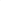

# Beyond Monotonicity: Revisiting Factorization Principles in Multi-Agent Q-Learning

<!-- Page 1 -->

Beyond Monotonicity: Revisiting Factorization Principles in Multi-Agent

Q-Learning

Tianmeng Hu1*, Yongzheng Cui2*, Rui Tang2*, Biao Luo2†, Ke Li1†

1Department of Computer Science, University of Exeter, United Kingdom 2School of Automation, Central South University, China th743@exeter.ac.uk, {yongzhengcui, ruitang02}@csu.edu.cn, biao.luo@hotmail.com, k.li@exeter.ac.uk

## Abstract

Value decomposition is a central approach in multi-agent reinforcement learning (MARL), enabling centralized training with decentralized execution by factorizing the global value function into local values. To ensure individual-global-max (IGM) consistency, existing methods either enforce monotonicity constraints, which limit expressive power, or adopt softer surrogates at the cost of algorithmic complexity. In this work, we present a dynamical systems analysis of nonmonotonic value decomposition, modeling learning dynamics as continuous-time gradient flow. We prove that, under approximately greedy exploration, all zero-loss equilibria violating IGM consistency are unstable saddle points, while only IGM-consistent solutions are stable attractors of the learning dynamics. Extensive experiments on both synthetic matrix games and challenging MARL benchmarks demonstrate that unconstrained, non-monotonic factorization reliably recovers IGM-optimal solutions and consistently outperforms monotonic baselines. Additionally, we investigate the influence of temporal-difference targets and exploration strategies, providing actionable insights for the design of future valuebased MARL algorithms.

## Introduction

Cooperative learning is fundamental to enabling complex collective intelligence in multi-agent systems (MAS), with broad applicability across domains such as multi-robot coordination (Long et al. 2018; Duan et al. 2025), autonomous driving (Chu et al. 2019; Li et al. 2022; Zhang et al. 2024; Chen et al. 2024), and smart grid control (Roesch et al. 2020; Chung et al. 2020). Multi-agent reinforcement learning (MARL) (Tan 1993; Sunehag et al. 2018; Lowe et al. 2017; Hu et al. 2023) offers a unified framework for learning both cooperative and competitive behaviors in complex environments. Within this framework, the paradigm of centralized training with decentralized execution (CTDE) has emerged as a standard approach for addressing cooperative tasks (Lowe et al. 2017; Sunehag et al. 2018). A central component of CTDE is Value Function Factorization (VFF), which approximates the global joint action-value function

*These authors contributed equally. †Corresponding authors. Copyright © 2026, Association for the Advancement of Artificial Intelligence (www.aaai.org). All rights reserved.

Qtot by aggregating individual agent value functions Qi. This decomposition not only enables effective credit assignment but also enhances scalability in multi-agent learning (Rashid et al. 2018).

The effectiveness of VFF methods hinges on satisfying the Individual-Global-Max (IGM) principle, which ensures that decentralized greedy action selections by individual agents are aligned with the globally optimal joint action. One of the earliest approaches, Value-Decomposition Networks (VDN) (Sunehag et al. 2018), achieves IGM by assuming a simple additive decomposition of the global value function. However, this assumption significantly limits its representational capacity. To overcome this limitation, QMIX (Rashid et al. 2018) introduces a more flexible monotonicity constraint, requiring that ∂Qtot

∂Qi ≥0, which permits complex nonlinear relationships between Qtot and the individual Qi values. This constraint is enforced via a structured mixing network with non-negative weights. The success of QMIX marked a milestone in MARL research and established a dominant design paradigm: ensuring IGM through structured architectural constraints.

While effective in ensuring IGM, the monotonicity constraint limits the model’s expressive power (Son et al. 2019; Wang et al. 2021). To overcome this bottleneck, subsequent research has explored more expressive architectures capable of representing the full class of IGM-consistent functions. For instance, QTRAN (Son et al. 2019) introduces an auxiliary value function to reformulate the optimization objective, while QPLEX (Wang et al. 2021) proposes a sophisticated duplex dueling architecture to capture richer value structures. Although these methods expand representational power in theory, they often suffer from instability or excessive architectural complexity in practice. Meanwhile, an alternative line of work attributes the failure in non-monotonic tasks to the phenomenon of relative overgeneralization, arguing that simplistic exploration strategies such as ϵ-greedy are insufficient to escape suboptimal equilibria. This has motivated the development of more elaborate coordinationaware exploration mechanisms, exemplified by methods like MAVEN (Mahajan et al. 2019) and UneVEn (Gupta et al. 2021). However, we observe that prior work typically analyzes IGM-relevant algorithmic behavior in matrix games under a uniformly random exploration policy (Wang et al. 2021).

The Fortieth AAAI Conference on Artificial Intelligence (AAAI-26)

21876

<!-- Page 2 -->

Under such settings, both monotonic and non-monotonic variants of QMIX fail to learn IGM-optimal solutions. In contrast, practical Q-learning commonly employs approximately greedy exploration strategies conditioned on the evolving value function. Motivated by this, we conducted preliminary experiments using a non-monotonic variant of QMIX combined with an ϵ-greedy exploration policy on a challenging matrix game. Surprisingly, the algorithm consistently converged to IGM-consistent optimal solutions.

This empirical finding leads us to hypothesize that the underlying learning dynamics are fundamentally altered under approximately greedy policies. Specifically, we conjecture that the feedback loop between the learned value function and the policy induces an implicit self-correcting mechanism, which naturally drives the system away from suboptimal, IGM-inconsistent solutions and toward globally optimal ones—without requiring explicit structural constraints. To validate our theoretical findings, we perform a novel dynamical-systems analysis of non-monotonic valuedecomposition Q-learning. Our main contributions are:

• We formulate the non-monotonic value-decomposition Q-learning update as a continuous-time gradient flow and derive its learning dynamics. • We prove that under approximately greedy exploration policies, every zero-loss fixed point that violates the IGM principle becomes an unstable saddle point, from which the learning trajectory naturally escapes. We further show that only IGM-consistent solutions are stable attractors of the flow. • Extensive experiments on matrix games and challenging multi-agent benchmarks confirm our theory. Results show that unconstrained QMIX reliably recovers IGMconsistent optimal solutions in matrix games and outperforms monotonic baselines. • We explore the impact of SARSA-style TD targets (Rummery and Niranjan 1994) and intrinsic-reward–driven exploration mechanisms on the stability and performance of non-monotonic value decomposition.

## Preliminaries

Dec-POMDPs

Cooperative multi-agent tasks are commonly modeled as decentralized partially observable Markov decision processes (Dec-POMDPs) (Bernstein et al. 2002). A Dec-POMDP is formally defined as a tuple G = ⟨N, S, {Ai}, P, r, {Ωi}, O, γ⟩, where:

• N is the number of agents. • S is the global state space of the environment. • A = A1×· · ·×An denotes the joint action space, where Ai denotes the discrete action space of agent i. • P(s′ | s, a): S × A × S →[0, 1] is the state transition function. • r(s, a): S × A →R is the shared reward function, assigning the same team reward to all agents at each time step.

• O = O1 × · · · × On is the joint observation space. Z: S →O is the observation function, where each agent i receives a local observation oi t = Z(st)i.

• γ ∈[0, 1) is the discount factor.

All agents act according to their individual policies µ = (π1,..., πN), with the collective objective of maximizing the expected cumulative discounted team return:

J(π) = Es0,at,st+1

" ∞ X t=0 γtr(st, at)

µ

#

. (1)

Value Function Factorization

Value function factorization (VFF) aims to learn a joint action-value function Qtot(s, a) for cooperative multi-agent settings. This factorization is typically implemented via a mixing function that takes as input the individual agent values Qi and, optionally, the global state s, and outputs the global value Qtot. For example, VDN adopts a simple additive form:

Qtot(s, a) = n X i=1

Qi(ηi, ai), (2)

where ηi denotes agent i’s action-observation history. QMIX employs a nonlinear mixing network gmix:

Qtot(s, a) = gmix ({Qi(ηi, ai)}n i=1, s). (3)

These methods are trained end-to-end by minimizing the joint Bellman error. The typical loss function is defined as:

L(θ) = Es,a,r,s′ h ytot −Qtot(s, a; θ)

2i

, (4)

where the target value is given by ytot = r + γ max a′ Qtot(s′, a′; θ−), and θ and θ−denote the parameters of the current and target networks, respectively.

IGM Consistency

A value decomposition is said to satisfy the Individual- Global-Max (IGM) principle if, for any state s, the optimal joint action with respect to the global value function Qtot can be obtained by independently maximizing each agent’s local utility function. Formally, this condition is defined as:

arg max a∈A Qtot(s, a)

= arg max a1∈A1 Q1(η1, a1),..., arg max an∈An Qn(ηn, an)

.

(5) The IGM principle is crucial because it enables decentralized execution: when the condition holds, each agent can independently select its action by greedily maximizing its own local utility Qi, and the resulting joint action will be globally optimal with respect to the learned Qtot.

21877

<!-- Page 3 -->

## Analysis

We begin our analysis by simplifying the original Dec- POMDP problem into a single-state matrix game. Conceptually, a single-state game can be viewed as a localized coordination subproblem embedded within any Dec-POMDP state. Instead of using a temporal-difference target, we assume a known, fixed ground-truth payoff function y(a). The formal definition is as follows: Definition 1 (Single-State Game). Consider a singlestate matrix game involving N agents. Each agent i ∈ {1,..., N} has a discrete action set Ai. The joint action is denoted as a = (a1,..., aN), and the corresponding ground-truth reward is y(a) ∈R. We assume the existence of a unique globally optimal joint action:

a∗= arg max a y(a). (6)

The value function is represented by a parameterized value decomposition network. For a given parameter vector θ, the network outputs local values Qi(ai; θ) for each agent. A mixing network fmix then aggregates these local values into a joint value:

Qtot(a; θ) = fmix

Q1(a1; θ),..., QN(aN; θ); θ

. (7) To facilitate theoretical analysis, we define a global state vector q ∈R

P i |Ai| that concatenates all local Q-values:

q:=

Q1(a1,1),..., Q1(a1,|A1|),

...,

QN(aN,1),..., QN(aN,|AN|)

⊤

.

(8)

From this perspective, each Qi(ai) is a component of the vector q, and the joint value function Qtot(a; q) is treated as a function that directly takes q as input, with its specific form determined by the structure of fmix. We assume that fmix satisfies a local non-degeneracy condition: it is locally Lipschitz continuous in each coordinate direction, and its Jacobian with respect to q has full rank on the normal subspace at the points considered in our analysis.

The learning objective is to minimize the mean squared error loss weighted by a behavior policy µ(a; q):

L(q) =

X a µ(a; q) (y(a) −Qtot(a; q))2. (9)

Fixed Uniform Policy We begin by considering a fixed, uniform behavior policy µ0 that is independent of q, i.e., µ0(a) = 1/|A|N. Under this setting, the loss simplifies to:

L0(q) = 1 |A|N

X a

(y(a) −Qtot(a; q))2. (10)

This learning problem reduces to a standard supervised regression task, where the goal is to fit Qtot to a fixed target function y(a). The gradient of the loss with respect to q is given by:

∇qL0(q)

= − 2 |A|N

X a

(y(a) −Qtot(a; q)) ∇qQtot(a; q).

(11)

Theorem 1 (Zero-Loss Points Without IGM Consistency). Under the fixed uniform policy, there exists a set of zero-loss points M0 = {q | L0(q) = 0} containing infinitely many elements, and this set includes points that do not satisfy IGM consistency.

Proof. Due to the universal approximation capability of fmix, there may exist many local Q-value configurations q that violate the IGM condition but can still perfectly fit the target payoff function y(a) via appropriate mixing function parameters. At such points, the loss is exactly zero, and the gradient vanishes accordingly. The inherent ambiguity in credit assignment leads to a multiplicity of solutions. Consequently, the learning process may converge to any of these zero-loss solutions without any inherent bias toward IGMconsistent ones.

Approximately Greedy Policy When using an approximately greedy policy, the behavior policy depends on the current value estimates, resulting in a value-coupled dynamical system. Directly analyzing ϵ-greedy policies is challenging due to the nondifferentiability of the arg max operator. To circumvent this issue, we introduce a smooth and differentiable surrogate based on the softmax policy with temperature parameter τ > 0:

πτ i (ai | q):= eQi(ai)/τ P b∈Ai eQi(b)/τ, (12)

µτ(a | q) =

N Y i=1 πτ i (ai | q). (13)

The corresponding smooth loss function is defined as:

Lτ(q) =

X a µτ(a | q) (y(a) −Qtot(a; q))2. (14)

Lemma 1. Let {τk}∞ k=1 be a sequence of temperatures such that τk ↓0. Suppose that at parameter point q, each agent has a unique greedy action and the mixing function fmix satisfies the local non-degeneracy condition. Then, lim k→∞∇qLτk(q) ∈∂C q L0(q), (15)

where ∂C denotes the Clarke generalized gradient, and L0 corresponds to the limiting loss as τ →0 in the softmax policy µτ.

Lemma 1 provides a theoretical justification for using the smooth surrogate system to analyze the stability properties of the original non-smooth objective.

In contrast to the fixed uniform policy case, the gradient of Lτ(q) now consists of two distinct components:

∇qLτ(q) =

X a

(∇qµτ(a | q)) (y(a) −Qtot)2

| {z } policy gradient term

−2

X a µτ(a | q) (y(a) −Qtot) ∇qQtot

| {z } value gradient term

.

(16)

21878

<!-- Page 4 -->

The first term (the policy gradient term) alters the learning dynamics compared to the uniform case. We model the learning process as a continuous-time gradient flow, represented by the following ordinary differential equation (ODE):

˙q = −∇qLτ(q). (17) The local stability of a fixed point q∗is determined by the spectrum of its Jacobian matrix, given by Jτ(q∗) = −Hτ(q∗), where Hτ = ∇2 qLτ is the Hessian matrix of the loss. If Hτ(q∗) is positive definite, then q∗is asymptotically stable. If it has at least one negative eigenvalue, then q∗is unstable.

We now focus on the set of all zero-loss points and analyze their stability. These points form a zero-loss manifold M, defined as the set of parameter configurations that perfectly fit the ground-truth payoff:

M:= {q | Qtot(a; q) = y(a), ∀a}. (18)

Every point within M is a fixed point of the gradient flow. The local stability of such points is governed by the curvature of the loss function, as characterized by the Hessian matrix. Theorem 2 establishes that for any perturbation direction that alters a local greedy action to a suboptimal one, the corresponding quadratic form is strictly positive. As a result, the fixed point q∗is locally asymptotically stable along the center-stable manifold. Theorem 2 (Stability of IGM-Consistent Fixed Points). Suppose the following conditions hold:

(H1) For every q ∈M, each agent’s greedy action arg maxai Qi(ai) is unique.

(H2) The Jacobian of the mixing function fmix has full rank on the normal subspace of M (local non-degeneracy).

(H3) The softmax temperature τ > 0 is sufficiently small such that the induced policy is dominated by greedy actions.

Then for any zero-loss fixed point q∗∈M that satisfies IGM consistency (i.e., g(q∗) = u∗), the Hessian Hτ(q∗) is positive definite on the normal subspace (Tq∗M)⊥.

Proof. We determine the spectral properties of the Hessian Hτ(q∗) by analyzing the sign of its quadratic form v⊤Hτ(q∗)v along critical directions.

We aim to show that Hτ(q∗) is positive definite on the normal subspace (Tq∗M)⊥. Consider an arbitrary perturbation direction v in this subspace, such as v = eiu′ i −eiu∗ i, where u′ i̸ = u∗ i. This perturbation attempts to flip agent i’s greedy action from the optimal u∗ i to a suboptimal alternative u′ i. On the zero-loss manifold M, the quadratic form of the Hessian in this direction can be computed explicitly as:

v⊤Hτ(q∗)v

= 1 τ

X a µτ(a | q∗)

h

1[ai = u′ i] −πτ i (u′ i)

−

1[ai = u∗ i ] −πτ i (u∗ i)

i2

.

(19)

In the low-temperature limit τ →0, the policy µτ(a | q∗) concentrates its mass on the greedy joint action u∗. For this dominant term a = u∗, we have πτ i (u′ i) →0, πτ i (u∗ i) →1, and the indicator functions yield 1[ai = u′ i] = 0, 1[ai = u∗ i ] = 1. The expression inside the brackets thus converges to a nonzero constant. Since the quadratic form is a weighted sum of squared terms with the dominant contribution strictly positive, we conclude that v⊤Hτ(q∗)v > 0. Therefore, Hτ(q∗) is positive definite in all directions that perturb the optimal greedy action, ensuring that q∗is asymptotically stable.

Theorem 3 (Instability of IGM-Inconsistent Fixed Points). Under the same assumptions (H1) – (H3) as in Theorem 2, consider a zero-loss fixed point q∗∈M that violates IGM consistency (i.e., g(q∗)̸ = u∗). Then there exists an agent i and a perturbation direction v = ei,u∗ i −ei,gi(q∗) (20)

such that v⊤Hτ(q∗)v ≈−2 τ [y(u∗) −y(g(q∗))] < 0, (21)

indicating that Hτ(q∗) has a negative eigenvalue, and q∗is a structurally unstable saddle point.

Proof. If g(q∗)̸ = u∗, we aim to show that Hτ(q∗) admits at least one negative eigenvalue. Let gi = gi(q∗) denote the suboptimal greedy action selected by agent i. We construct a perturbation direction intended to ”correct” this suboptimal choice:

v = eiu∗ i −eigi. (22)

This perturbation attempts to redirect the greedy policy toward an action with potentially higher reward.

In the low-temperature regime, the softmax policy induces a gradient amplification effect that makes the Hessian’s curvature primarily governed by reward differences. It can be shown that the quadratic form in this direction approximately satisfies:

v⊤Hτ(q∗)v ≈−C τ [y(g′) −y(g(q∗))], (23)

where C > 0 is a constant, and g′ is the new greedy joint action induced by the perturbation. Since g(q∗) is not globally optimal, there always exists a local improving direction such that y(g′) > y(g(q∗)). This implies that the quadratic form is strictly negative in the direction v, i.e., v⊤Hτ(q∗)v < 0, thereby confirming the existence of a negative eigenvalue in the Hessian. Consequently, the fixed point q∗is a saddle point.

Combining Theorems 2 and 3, we conclude that the set of IGM-consistent zero-loss solutions forms the unique centerstable manifold of the learning dynamics, while any IGMinconsistent zero-loss point is a saddle point and hence unstable. Under continued exploration (e.g., ϵ–greedy), the system is guaranteed to escape from these unstable saddle points and ultimately converge to the stable submanifold:

MIGM = {q ∈M | g(q) = u∗}. (24)

21879

<!-- Page 5 -->

## Methodology

In this section, we investigate a non-monotonic variant of the QMIX algorithm and its two extensions designed to address the challenges introduced by removing the monotonicity constraint.

Non-Monotonic Mixing Function

We investigate a non-monotonic variant of the QMIX algorithm. Standard QMIX imposes a monotonicity constraint on the mixing network, requiring that the joint action-value function Qtot be non-decreasing with respect to each individual agent’s utility Qi. Formally, ∂Qtot

∂Qi ≥0, which is enforced by constraining the mixing network weights to be non-negative. While this constraint guarantees IGM consistency by design, it restricts the expressive capacity of the model.

In contrast, our approach removes this structural constraint, allowing the mixing network to learn an arbitrary aggregation function of the individual values:

Qtot(s, a) = gmix

{Qi(ηi, ai)}n i=1, s

, (25)

where s denotes the global state, ηi represents the local observation history of agent i, and gmix is implemented by a feed-forward neural network. Apart from the removal of the monotonicity constraint, the architecture remains identical to QMIX.

Our central hypothesis is that under approximately greedy exploration policies, the learning dynamics are sufficient to drive the system towards IGM-consistent solutions, even in the absence of explicit architectural constraints. The network is trained end-to-end by minimizing the joint Bellman error:

L(θ) = Es,a,r,s′ ytot −Qtot(s, a; θ)

2

, (26)

where the target is computed using a target network, ytot = r + γ max a′ Qtot(s′, a′; θ−). (27)

SARSA-Style Updating with TD(λ)

Removing the monotonicity constraint introduces a potential issue: during the learning process, IGM consistency can no longer be guaranteed prior to convergence. In standard Qlearning, this may lead to undesirable effects because the target ytot

Q = r + γ max a′ Qtot(s′, a′; θ−), (28)

which relies on the maxa′ operator, is no longer a reliable training signal in the absence of IGM.

To address this issue, we adopt a SARSA-style update rule that removes the problematic max operator. Instead of computing the target based on the maximum over all possible next actions, we use the joint action a′ that was actually sampled from the replay buffer:

ytot

SARSA = r + γQtot(s′, a′; θ−), (29)

where a′ is the next joint action executed by the behavior policy. This formulation aligns the training signal with the policy’s actual behavior and mitigates the bias caused by the max operator. We then incorporate the TD(λ) algorithm:

ytot λ = (1 −λ)

∞ X n=1 λn−1ytot

(n), (30)

where ytot

(n) denotes the n-step return. By averaging over multiple step returns, TD(λ) smooths the learning signal, mitigates variance, and improves credit assignment over longer horizons, which is particularly beneficial for nonmonotonic value decomposition.

It is worth noting that SARSA-type updates are theoretically on-policy and would typically require off-policy corrections, such as importance sampling. However, prior work by Hernandez-Garcia and Sutton (2019) has shown that, in the context of deep RL, applying such corrections to SARSA often degrades performance. Therefore, we omit off-policy corrections in our implementation.

Intrinsic Reward Driven Exploration-Exploitation

In our preliminary experiments, we observed that simply increasing the exploration rate in the original QMIX algorithm provided no benefit. In contrast, for our non-monotonic variant of QMIX, a higher degree of exploration consistently improved performance. Motivated by this observation, we integrate a curiosity-driven exploration mechanism based on Random Network Distillation (RND)(Burda et al. 2018). RND encourages exploration by assigning intrinsic rewards for visiting novel states. It employs two neural networks: (i) a fixed, randomly initialized target network that maps states to feature embeddings, and (ii) a predictor network trained to approximate the target network’s output for visited states. The prediction error of the predictor network then serves as the intrinsic reward signal. The total reward used to train the value function is given by:

r = rext + β · rint, (31)

where rext is the extrinsic team reward from the environment, rint is the intrinsic curiosity reward generated by RND. This curiosity-driven mechanism serves as a more sophisticated alternative to ϵ–greedy exploration and allows us to investigate the role of exploration in non-monotonic value factorization.

## Experiments

We evaluate our approach on three representative benchmarks: one-step matrix games, the StarCraft Multi-Agent Challenge (SMAC) (Whiteson et al. 2019), and Google Research Football (GRF) (Kurach et al. 2020). We compare our method against three strong baselines: QMIX, QPLEX, and QTRAN. These baselines were selected to cover the major paradigms in value factorization: a strictly monotonic approach (QMIX), a refined architecture that preserves a relaxed form of monotonicity (QPLEX), and a non-monotonic method based on an alternative factorization principle (QTRAN).

21880

<!-- Page 6 -->

u1 u2 A B C

A 12 -12 -12 B -12 0 0 C -12 0 0

(a) Payoff of Game A

Q1

Q2 A(7.4) B(-4.0) C(-4.1)

A(8.1) 12.0 -12.0 -12.0 B(-4.3) -12.0 0.0 0.0 C(-4.3) -12.0 0.0 0.0

(b) Our method on Game A

Q1

Q2 A(-5.2) B(0.1) C(0.1)

A(-5.3) -12.0 -12.0 -12.0 B(0.1) -12.0 0.0 -0.1 C(0.1) -12.0 -0.0 -0.0

(c) QMIX on Game A u1 u2 A B C

A 12 0 10 B 0 0 10 C 10 10 10

(d) Payoff of Game B

Q1

Q2 A(6.0) B(-3.7) C(2.5)

A(6.2) 12.0 0.0 10.0 B(-4.4) 0.0 0.0 10.0 C(1.7) 10.0 10.0 10.0

(e) Our method on Game B

Q1

Q2 A(-0.6) B(-0.6) C(0.5)

A(-0.6) 0.1 0.1 4.1 B(-0.6) 0.1 0.1 4.1 C(0.5) 5.6 5.6 10.0

(f) QMIX on Game B

**Table 1.** True payoff matrices and estimated value functions for two matrix games. Each row corresponds to one game: the left column shows the ground-truth payoff matrix, the middle column shows value estimates from our non-monotonic QMIX variant, and the right column shows estimates from standard QMIX. Top row: Game A. Bottom row: Game B.

Matrix Game We begin by evaluating non-monotonic QMIX with SARSA-style updates on two one-step matrix games, which are adapted from (Son et al. 2019). Among them, Game B is more challenging than Game A, as it contains stronger local optima that are more difficult to escape. In addition, unlike previous studies on matrix games that employ uniformly random policies, we adopt an ϵ-greedy strategy, which is consistent with our theoretical analysis.

The results, summarized in Table 1, show that our method successfully learns the correct global payoff matrix. In contrast, QMIX fails to recover the true payoffs. These findings provide initial empirical evidence that, under appropriate exploration–exploitation mechanisms, removing the monotonicity constraint enables the algorithm to accurately recover IGM-optimal solutions in non-monotonic settings.

SMAC and GRF In order to validate our propositions, we implemented RND to generate intrinsic exploration rewards for non-monotonic QMIX with SARSA-style updates, and conducted experiments in complex, high-dimensional SMAC and GRF environments. As shown in Figures 1 and 2, our method demonstrates clear advantages over the baselines across a variety of maps. QTRAN, despite its success in the matrix game, performs poorly in these complex environments. Similarly, QMIX and QPLEX struggle to find optimal solutions in these non-monotonic sequential decision-making problems due to their inherent structural constraints.

## Discussion

The empirical results provide strong evidence supporting our theoretical analysis. The observed learning dynamics closely align with our model of stable and unstable equilibria. Our unconstrained approach leverages broad exploration. This enables the value function to be estimated across a wider range of joint actions, mitigating the risk of premature convergence to suboptimal solutions caused by relative overgeneralization.

We initially expected non-monotonic QMIX to perform comparably to the original QMIX. Surprisingly, however, on several challenging SMAC tasks, our method not only consistently outperforms the original QMIX but also converges significantly faster. We hypothesize that this advantage arises from the removal of the monotonicity constraint, which substantially enhances the expressiveness of the mixing network. Under an appropriate exploration mechanism, this increased flexibility allows non-monotonic QMIX to more effectively discover optimal policies. In addition, both QPLEX and QTRAN enhance the representational capacity of the value function through specialized network architectures and additional soft constraints. However, on the challenging tasks we evaluated, neither method demonstrated superior performance. We hypothesize that the increased algorithmic complexity of these approaches may reduce their robustness and heighten sensitivity to hyperparameter choices, thereby limiting their practical effectiveness compared to our simpler unconstrained formulation.

It is worth noting that in the GRF tasks, our method shows slower reward growth during the early stage of training, followed by a sharp improvement later. We attribute this behavior to the existence of multiple zero-loss solutions in the initial learning dynamics, including suboptimal ones. During this exploratory phase, the algorithm navigates the policy space and transiently approaches unstable saddle points. The system eventually escapes these unstable regions and converges to the stable, IGM-consistent submanifold, resulting in a rapid performance surge and superior final results.

## Related Work

Value Function Factorization (VFF) is a central branch of the CTDE paradigm in multi-agent reinforcement learning. VFF methods seek to learn a global joint action-value function Qtot and decompose it into per-agent value functions Qi. This factorized structure is designed to ensure that optimizing each local utility Qi leads to the optimization of the global objective Qtot, while enabling decentralized execution based solely on local observations.

One of the earliest VFF methods, Value-Decomposition Networks (VDN)(Sunehag et al. 2018), assumes that the global joint action-value function is the sum of individual agent values. This additive assumption simplifies credit assignment but severely limits representational capacity, failing to capture nonlinear agent interactions. QMIX (Rashid

21881

<!-- Page 7 -->

Ours QMIX QPLEX QTRAN 3s_vs_5z(Hard) Corridor(Super Hard) 3s5z_vs_3s6z(Super Hard)

0

25

50

75

100

0 2.5 5.0 7.5 10.0

Win Rate (%)

0

25

50

75

100

0

25

50

75

100

0 2.5 5.0 7.5 10.0 0 2.5 5.0 7.5 10.0 Environment Step (M)

**Figure 1.** Comparisons of test win rate on SMAC maps: 3s vs 5z, corridor, and 3s5z vs 3s6z. The results are averaged over five independent runs, with the 25%–75% interquartile range shown as a shaded region.

academy_3_vs_1_with_keeper academy_counterattack_easy academy_counterattack_hard

0

25

50

75

100

0

25

50

75

100

0

20

40

60

80

0 2.5 5.0 7.5 10.0 0 2.5 5.0 7.5 10.0 0 2.5 5.0 7.5 10.0

Win Rate (%)

Environment Step (M)

Ours QMIX QPLEX QTRAN

**Figure 2.** Comparisons of test win rate on GRF tasks: academy 3 vs 1 keeper, academy counterattack easy, and academy counterattack hard. The results are averaged over five independent runs.

et al. 2018) extends VDN by introducing a nonlinear mixing network, thereby enhancing expressiveness. QMIX imposes a constraint that requires Qtot to be a monotonically non-decreasing function with respect to each individual Qi. Although more expressive than VDN, this constraint still restricts the representation of tasks with inherently nonmonotonic value functions.

To overcome the expressiveness limitations imposed by the monotonicity constraint, subsequent research has explored two main directions. The first focuses on enhancing the mixing network. WQMIX (Rashid et al. 2020) introduces a weighting mechanism in the projection step of monotonic value decomposition, emphasizing more promising joint actions and biasing learning toward better solutions. Qatten (Yang et al. 2020) applies multi-head attention to adaptively learn interaction weights among agents, enabling a more flexible nonlinear combination.

Another line aims to develop more general frameworks capable of representing the full class of IGM functions. QTRAN (Son et al. 2019) introduces a transformed surrogate value function, reformulating the IGM condition as a set of linear constraints and incorporating them via soft regularization. While QTRAN is theoretically more expressive, it often suffers from instability during training and performs suboptimally in practice. QPLEX (Wang et al. 2021) introduces a duplex dueling architecture, which factorizes Qtot into a state-value term V (s) and a joint advantage function A(s, u). The IGM constraint is enforced by imposing monotonicity only on the advantage component. QPLEX theoretically covers the complete IGM function class and achieves strong empirical performance, though at the cost of increased architectural complexity.

Current research in VFF largely focuses on designing increasingly complex network architectures and decomposition schemes to enhance representational capacity, aiming to capture a broader range of tasks while preserving IGM guarantees. In contrast, our work offers a different perspective: we argue that under standard approximately greedy exploration strategies, the learning dynamics may exhibit an implicit stabilizing mechanism. This mechanism can naturally guide unconstrained learning process toward IGMconsistent optimal solutions.

## Conclusion

This paper challenges the prevailing assumption that structural monotonicity is necessary for multi-agent value decomposition to ensure IGM consistency. We model nonmonotonic learning process as a continuous-time gradient flow and theoretically demonstrate that, under approximately greedy exploration, the dynamics themselves provide an implicit self-correction mechanism. This mechanism drives IGM-inconsistent solutions to unstable saddle points, while establishing IGM-consistent solutions as stable attractors. Experiments on matrix games, SMAC, and GRF support our theory, showing that removing monotonicity constraints not only recovers optimal solutions but also outperform monotonic baselines. Although our formal analysis is developed in the single-state setting, these findings suggest that leveraging the natural dynamics of learning rather than imposing rigid architectural constraints offers a promising direction for designing more expressive, and more effective value-based MARL algorithms.

21882

AI-readable visual equivalent, added: Figure extracted from the paper PDF and converted to an SVG wrapper asset. Use the surrounding page text and caption for interpretation.

AI-readable visual equivalent, added: Figure extracted from the paper PDF and converted to an SVG wrapper asset. Use the surrounding page text and caption for interpretation.

AI-readable visual equivalent, added: Figure extracted from the paper PDF and converted to an SVG wrapper asset. Use the surrounding page text and caption for interpretation.

AI-readable visual equivalent, added: Figure extracted from the paper PDF and converted to an SVG wrapper asset. Use the surrounding page text and caption for interpretation.

AI-readable visual equivalent, added: Figure extracted from the paper PDF and converted to an SVG wrapper asset. Use the surrounding page text and caption for interpretation.

AI-readable visual equivalent, added: Figure extracted from the paper PDF and converted to an SVG wrapper asset. Use the surrounding page text and caption for interpretation.

<!-- Page 8 -->

## Acknowledgments

This work was supported by the UKRI Future Leaders Fellowship under Grant MR/S017062/1 and MR/X011135/1; in part by National Natural Science Foundation of China under Grant 62373375, U2341216, 62376056 and 62076056; in part by the Science and Technology Innovation Program of Hunan Province under Grant 2024RC1011 and the Natural Science Foundation of Hunan Province under Grant 2025JJ10007; in part by the Royal Society Faraday Discovery Fellowship (FDF/S2/251014), BBSRC Transformative Research Technologies (UKRI1875), Royal Society International Exchanges Award (IES/R3/243136), Kan Tong Po Fellowship (KTP/R1/231017); and the Amazon Research Award and Alan Turing Fellowship.

## References

Bernstein, D. S.; Givan, R.; Immerman, N.; and Zilberstein, S. 2002. The complexity of decentralized control of Markov decision processes. Mathematics of operations research, 27(4): 819–840. Burda, Y.; Edwards, H.; Storkey, A.; and Klimov, O. 2018. Exploration by random network distillation. arXiv preprint arXiv:1810.12894. Chen, L.; Wu, P.; Chitta, K.; Jaeger, B.; Geiger, A.; and Li, H. 2024. End-to-end autonomous driving: Challenges and frontiers. IEEE Transactions on Pattern Analysis and Machine Intelligence, 46(12): 10164–10183. Chu, T.; Wang, J.; Codec`a, L.; and Li, Z. 2019. Multiagent deep reinforcement learning for large-scale traffic signal control. IEEE Transactions on Intelligent Transportation Systems, 21(3): 1086–1095. Chung, H.-M.; Maharjan, S.; Zhang, Y.; and Eliassen, F. 2020. Distributed deep reinforcement learning for intelligent load scheduling in residential smart grids. IEEE Transactions on Industrial Informatics, 17(4): 2752–2763. Duan, J.; Wang, W.; Xiao, L.; Gao, J.; Li, S. E.; Liu, C.; Zhang, Y.-Q.; Cheng, B.; and Li, K. 2025. Distributional Soft Actor-Critic With Three Refinements. IEEE Transactions on Pattern Analysis and Machine Intelligence, 47(5): 3935–3946. Gupta, T.; Mahajan, A.; Peng, B.; B¨ohmer, W.; and Whiteson, S. 2021. Uneven: Universal value exploration for multiagent reinforcement learning. In Proc. International Conference on Machine Learning, 3930–3941. PMLR. Hernandez-Garcia, J. F.; and Sutton, R. S. 2019. Understanding multi-step deep reinforcement learning: A systematic study of the DQN target. arXiv preprint arXiv:1901.07510. Hu, T.; Luo, B.; Yang, C.; and Huang, T. 2023. MO-MIX: Multi-objective multi-agent cooperative decision-making with deep reinforcement learning. IEEE Transactions on Pattern Analysis and Machine Intelligence, 45(10): 12098– 12112. Kurach, K.; Raichuk, A.; Sta´nczyk, P.; et al. 2020. Google research football: A novel reinforcement learning environment. In Proc. AAAI conference on artificial intelligence, volume 34, 4501–4510.

Li, Q.; Peng, Z.; Feng, L.; Zhang, Q.; Xue, Z.; and Zhou, B. 2022. Metadrive: Composing diverse driving scenarios for generalizable reinforcement learning. IEEE Transactions on Pattern Analysis and Machine Intelligence, 45(3): 3461–3475. Long, P.; Fan, T.; Liao, X.; Liu, W.; Zhang, H.; and Pan, J. 2018. Towards optimally decentralized multi-robot collision avoidance via deep reinforcement learning. In Proc. IEEE International Conference on Robotics and Automation, 6252–6259. Lowe, R.; Wu, Y. I.; Tamar, A.; Harb, J.; Pieter Abbeel, O.; and Mordatch, I. 2017. Multi-agent actor-critic for mixed cooperative-competitive environments. In Proc. Advances in Neural Information Processing Systems, 6382–6393. Mahajan, A.; Rashid, T.; Samvelyan, M.; and Whiteson, S. 2019. Maven: Multi-agent variational exploration. Advances in Neural Information Processing Systems, 32(1): 7613–7624. Rashid, T.; Farquhar, G.; Peng, B.; and Whiteson, S. 2020. Weighted qmix: Expanding monotonic value function factorisation for deep multi-agent reinforcement learning. Advances in Neural Information Processing Systems, 33: 10199–10210. Rashid, T.; Samvelyan, M.; Schroeder, C.; Farquhar, G.; Foerster, J.; and Whiteson, S. 2018. QMIX: Monotonic Value Function Factorisation for Deep Multi-Agent Reinforcement Learning. In Proc. International Conference on Machine Learning, 4295–4304. Roesch, M.; Linder, C.; Zimmermann, R.; Rudolf, A.; Hohmann, A.; and Reinhart, G. 2020. Smart grid for industry using multi-agent reinforcement learning. Applied Sciences, 10(19): 6900. Rummery, G. A.; and Niranjan, M. 1994. On-line Qlearning using connectionist systems, volume 37. University of Cambridge, Department of Engineering Cambridge, UK. Son, K.; Kim, D.; Kang, W. J.; Hostallero, D. E.; and Yi, Y. 2019. Qtran: Learning to factorize with transformation for cooperative multi-agent reinforcement learning. In Proc. International Conference on Machine Learning, 5887–5896. Sunehag, P.; Lever, G.; Gruslys, A.; Czarnecki, W. M.; Zambaldi, V.; Jaderberg, M.; Lanctot, M.; Sonnerat, N.; Leibo, J. Z.; Tuyls, K.; et al. 2018. Value-Decomposition Networks For Cooperative Multi-Agent Learning Based On Team Reward. In Proc. International Conference on Autonomous Agents and MultiAgent Systems, 2085–2087. Tan, M. 1993. Multi-agent reinforcement learning: Independent vs. cooperative agents. In Proc. International Conference on Machine Learning, 330–337. Wang, J.; Ren, Z.; Liu, T.; Yu, Y.; and Zhang, C. 2021. QPLEX: Duplex Dueling Multi-Agent Q-Learning. In Proc. International Conference on Learning Representations, 1– 11. Whiteson, S.; Samvelyan, M.; Rashid, T.; De Witt, C.; Farquhar, G.; Nardelli, N.; Rudner, T.; Hung, C.; Torr, P.; and Foerster, J. 2019. The StarCraft multi-agent challenge. In Proc. International Conference on Autonomous Agents and MultiAgent Systems, 2186–2188.

21883

<!-- Page 9 -->

Yang, Y.; Hao, J.; Liao, B.; Shao, K.; Chen, G.; Liu, W.; and Tang, H. 2020. Qatten: A general framework for cooperative multiagent reinforcement learning. arXiv preprint arXiv:2002.03939. Zhang, R.; Hou, J.; Walter, F.; Gu, S.; Guan, J.; R¨ohrbein, F.; Du, Y.; Cai, P.; Chen, G.; and Knoll, A. 2024. Multi-agent reinforcement learning for autonomous driving: A survey. arXiv preprint arXiv:2408.09675.

21884
