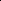

# Bidirectional Noise Injection: Enhancing Diffusion Models via Coordinated Input-Output Perturbation

<!-- Page 1 -->

Bidirectional Noise Injection: Enhancing Diffusion Models via Coordinated Input-Output Perturbation

Tianyi Zheng1*, Jiayang Gao2*, Peng-Tao Jiang1, Fengxiang Yang1, Ben Wan2,

Hao Zhang1, Jinwei Chen1, Jia Wang2†, Bo Li 1†

1vivo Mobile Communication Co., Ltd, Shanghai, China 2Shanghai Jiao Tong University, Shanghai, China zhengtianyi@vivo.com, gjy0515@sjtu.edu.cn, jiawang@sjtu.edu.cn, libra@vivo.com

## Abstract

Diffusion models have demonstrated remarkable success in image generation, yet a persistent challenge remains: the bias between model predictions and the target distribution. In this paper, we propose a Bidirectional Noise Injection framework for enhancing diffusion models, implemented via Coordinated Input-Output Perturbation (CIOP). Our approach mitigates this bias by randomly applying synchronized noise injection to both the model inputs and the prediction targets during the training stage. This stochastic, synchronized noise injected acts as a smoothing mechanism that effectively reduces the 2-Wasserstein distance between the predicted and target distributions, as substantiated by our theoretical analysis based on optimal transport theory. Extensive experiments on multiple benchmark datasets and various generative tasks demonstrate that our method improves generation quality and training efficiency without incurring additional computational cost. Furthermore, the design of CIOP enables seamless integration with existing diffusion model improvements and advanced frameworks, thereby broadening its applicability. These results highlight the potential of Bidirectional Noise Injection via CIOP to alleviate bias in diffusion-based generative models across a wide range of settings.

## Introduction

Diffusion-based generative models (Ho, Jain, and Abbeel 2020; Song et al. 2021) have become powerful tools across text (Li et al. 2022), image (Rombach et al. 2022; Zheng et al. 2024a, 2025; Chen et al. 2024c; Shen, Gan, and Ling 2025), and video generation (Ho et al. 2022; Chen et al. 2025b, 2024a, 2025a). Consequently, improving the generated sample quality is of increasing interest. In training, these models gradually add Gaussian noise to the data, creating a series of noised distributions over which denoising score-matching losses are minimized. In inference, the noise is reversed to generate new samples.

While in the field of image generation, the diffusion model has replaced the adversarial generation model as the most popular generation model (Dhariwal and Nichol 2021).

*These authors contributed equally. †Corresponding authors. Copyright © 2026, Association for the Advancement of Artificial Intelligence (www.aaai.org). All rights reserved.

Therefore, Many improvement strategies have been proposed to improve generation quality further. For example, P2-Weight (Choi et al. 2022), Min-SNR (Hang et al. 2023), and ANT (Go et al. 2024) optimize the weight of loss function, while methods such as DDPM-BS (Zheng et al. 2024b), AN-UT (Kim et al. 2024), BB-TDM (Zheng et al. 2025), E- TSDM (Yang et al. 2024), and SpeeD (Wang et al. 2025) improve the timestep sampling method for diffusion models. Besides, methods such as iDDPM (Nichol and Dhariwal 2021), ADM (Dhariwal and Nichol 2021), DiT (Peebles and Xie 2022), and Switch-DiT (Park et al. 2024a) optimize the model architecture of diffusion models. LDM (Rombach et al. 2022) and DCTdiff (Ning et al. 2025) improve computational efficiency by compressing the diffusion space. However, all these methods overlook the issue of input bias in the model during both the training and inference stages. Since each inference step is based on the results of the previous one, even small errors become magnified, indicating that there is still room for improvement in the generation quality of the diffusion model.

Recently, several works (Ren et al. 2024; Ning et al. 2023; Deng, Kojima, and Rush 2023; Zhang et al. 2025) find that the discrepancy between the predicted distribution and the real distribution leads to the sub-optimal performance of the diffusion model. Specifically, the DDPM-IP (Ning et al. 2023) design input perturbation to reduce prediction error based on their empirical observations. However, as demonstrated in Proposition 2, DDPM-IP may excessively perturb the marginal distributions. This over-perturbation disrupts the alignment between the predicted and target distributions and may compromise the performance of models. Meanwhile, W++ (Yu and Zhan 2025), SS (Deng, Kojima, and Rush 2023), AEB (Zhang et al. 2025), and MDSS (Ren et al. 2024) methods propose designing additional correction terms to mitigate this bias problem. But these designs introduce more extra computations, reduce the training efficiency of the diffusion model, and are difficult to be compatible with other improvement strategies. Moreover, CEP (Chen et al. 2024b) finds that slight condition perturbation benefits diffusion models. However, CEP can only be applied in conditional generation tasks. Given the tangible benefits already realized from such studies, further in-depth analysis of alleviating this bias problem is crucial for improving the

The Fortieth AAAI Conference on Artificial Intelligence (AAAI-26)

28866

<!-- Page 2 -->

generation quality of the diffusion model.

In this paper, we propose Bidirectional Noise Injection (BNI) to effectively mitigate the bias between model predictions and the target distribution while avoiding the adverse effects of unilateral noise injection. Serving as a soft smoothing mechanism, BNI brings the predicted distribution closer to the target distribution while preserving its beneficial structural properties. By applying coordinated perturbations to both the input and the prediction targets, BNI preserves the alignment of their marginal distributions, ensuring that the injected noise reduces bias without introducing undesirable side effects. Accordingly, we refer to our method as Coordinated Input-Output Perturbation (CIOP). Notably, we observe that always applying synchronized noise injection may cause the perturbed target to deviate from the ground truth. To address this, we adopt a stochastic strategy where the synchronized noise injection is applied with a certain probability, while standard DDPM training is retained in the remaining iterations. This design maintains the benefits of noise-induced smoothing and bias reduction while ensuring that the target distribution remains sufficiently close to the true distribution. Subsequently, we conduct an in-depth theoretical analysis of CIOP using optimal transport theory (Villani et al. 2009). Our results demonstrate that CIOP effectively narrows the 2-Wasserstein distance between model predictions and the target distribution. Moreover, our analysis does not rely on strong a priori assumptions about the underlying distributions in each diffusion stage, thereby exhibiting robust generalization. Consequently, the theoretical guarantees support the application of CIOP across various advanced diffusion frameworks.

Finally, we empirically validate the effectiveness of CIOP on several benchmark datasets and diverse generation tasks. Our experiments show that CIOP significantly improves generation quality and training efficiency compared to the baseline. Furthermore, CIOP incurs no additional computational overhead and exhibits excellent plug-and-play compatibility. This enables seamless integration with advanced diffusion model training techniques such as timestep resampling (Zheng et al. 2024b) and loss re-weighting methods (Choi et al. 2022; Hang et al. 2023). Moreover, since our design specifically targets the intrinsic properties of the diffusion process, CIOP is applicable to a wide range of diffusion models, spaces (e.g., pixel and latent spaces), and prediction targets (e.g., noise and velocity predictions). Additionally, CIOP can be used to further boost the performance of already converged diffusion models. These empirical findings, together with our theoretical analysis, underscore the versatility and effectiveness of CIOP. We summarize our contributions as follows.

• Coordinated Input-Output Perturbation: We design a novel Coordinated Input-Output Perturbation (CIOP) method to enhance the generation quality of diffusion models. By randomly applying synchronized noise injection to both the inputs and outputs during training, our method effectively mitigates the bias between the model’s prediction and the target distributions while preserving the original signal’s integrity. This stochastic strategy balances the benefits of noise-induced smoothing with maintaining a close approximation to the ground truth, incurs no additional computational cost, and can be seamlessly integrated with various existing improvement strategies for diffusion models.

• Theoretical Guarantees: Using optimal transport theory, we demonstrate that CIOP effectively reduces the deviation between the predicted and target distributions. This means that the predicted distribution can more accurately approximate the target distributions. Therefore, the denoising network trained by CIOP can predict the noise more accurately, thus improving the generation quality of the diffusion model.

• Empirical Validation: We conduct extensive experiments on various generation tasks. The results show that CIOP generalizes well across diverse generative tasks and can be plugged into other existing improvement strategies. Moreover, CIOP can further boost the performance of converged diffusion models.

## Related Work

Diffusion Models. Diffusion models are a series of generative models that add noise to the data and learn the reverse denoising process. Recently, various methods have been proposed to enhance diffusion models, including model generation quality, inference speed, and training efficiency. For example, P2-Weight (Choi et al. 2022), Min-SNR (Hang et al. 2023), ANT (Go et al. 2024), and Debias (Yu et al. 2023) propose different re-weight loss functions to improve the model generation quality. Recently, REPA (Yu et al. 2025) propose the representation alignment based on the pre-trained visual encoders. iDDPM (Nichol and Dhariwal 2021), ADM (Dhariwal and Nichol 2021), and DTR (Park et al. 2024b) design new model architectures to enhance the diffusion model. DDPM-IP (Ning et al. 2023) and MDSS (Ren et al. 2024) focus on the exposure bias problem in the diffusion model. Moreover, CEP (Chen et al. 2024b) uses noisy label learning to improve the performance of the diffusion model by adding the noise in condition embedding. DDPM-ES (Ning et al. 2024) and TS-DPM (Li et al. 2024) design improved inference method to alleviate the discrepancy between the training and inference. While our study aligns with the above works, we provide theoretical proof of the validity of the method under weaker assumptions. Furthermore, our method can combine with many above works to further enhance the diffusion model in generative tasks. Optimal Transport. The theory of optimal transport (OT), originally proposed by Monge, serves as a powerful analytical tool for the discrepancies between distinct probability distributions (Ambrosio, Gigli, and Savar´e 2005; Villani et al. 2009). One of the core of OT theory is the use of the 2-Wasserstein distance, which analyzes the differences between distributions. Unlike KL-divergence, 2-Wasserstein distance is a distance and therefore has good mathematical properties such as symmetry, which provides a more efficient mathematical analysis. The 2-Wasserstein distance is defined in Equation 1, where the term Γ(P, Q) denotes cou-

28867

<!-- Page 3 -->

Bidirectional Noise Injection

Distance

Distance

Converged Predict Target DDPM

Converged

CIOP

DDPM

CIOP

Inference

Distance

Noise Velocity

Predict Target

Random Use

**Figure 1.** The framework of CIOP. During the training of the diffusion model, we employ a stochastic approach to noise injection, randomly deciding whether to inject noise from the same distribution into the model’s inputs and prediction targets.

pling (Villani et al. 2009).

W 2

2 (P, Q) = inf γ∈Γ(P,Q) E(X,Y)∼γ[∥X −Y ∥2], (1)

Recently, the convergence of diffusion models has been theoretically analyzed and optimized based on OT theory (Khrulkov et al. 2023; Gu et al. 2023; Liang, Dharmakeerthi, and Koriyama 2024; Gao and Zhu 2024). However, these methods are often limited to small-scale synthetic datasets. Differently, DPM-OT (Li et al. 2023) accelerates the diffusion model generation process by trying directly to solve the semidiscrete OT problem. However, the OT problem is difficult to solve directly in higher dimensional spaces. In contrast, our approach does not need to solve the complex OT problem directly and can improve the quality of diffusion model generation in real data.

## Method

## Preliminaries

In this section, we first provide the necessary background on diffusion models (Song et al. 2021; Ho, Jain, and Abbeel 2020; Song and Ermon 2019). Let q(x0) represent the data distribution over Rn. During the forward diffusion stage, the data distribution is transformed into a noise distribution using a stochastic differential equation (SDE).

dxt = f(xt, t)dt + g(t)dw. (2)

In Equation 2, f(xt, t) is the drift coefficient, g(t) is the diffusion coefficient, and w denotes a Wiener process. For DDPM (Ho, Jain, and Abbeel 2020), the conditional distribution at any time t is based on the pre-defined αt and σt.

qt (xt | x0) = N xt | αtx0, σ2 t I

. (3)

The reverse diffusion transforms the noise distribution into the data distribution q(x0) based on the following reverse SDE equation (Song et al. 2021; Anderson 1982).

dxt = f (xt, t) −g2(t)∇x log qt (xt)

dt + g(t)d ¯w. (4)

Specially, ∇x log qt(xt) is the score function (Hyv¨arinen 2005) of the qt(xt) and ¯w is a standard Wiener process in the reverse time. Therefore, diffusion models train a neural network ϵθ to estimate the −σt∇x log qt(xt). In the training stage, diffusion models learn the −σt∇x log qt(xt) using score matching (Song and Ermon 2019; Hyv¨arinen 2005) loss L(θ).

Et∼U(0,T),x0∼q0(x0),ϵ∼N (0,I)

h

∥ϵθ (αtx0 + σtϵ, t) −ϵ∥2

2 i

. (5) However, previous works (Ning et al. 2023; Ren et al. 2024) point out the discrepancy between the trained models ϵθ and the ground truth −σt∇x log qt(xt) always exists. During inference, the model demands tens to hundreds of recursive network calls, which causes even slight errors to be cumulatively amplified (Ning et al. 2023), ultimately resulting in the generation of sub-optimal samples.

Bidirectional Noise Injection Since the discrepancy between the training and inference stages can lead to the accumulation of bias and the generation of biased samples, we propose a Bidirectional Noise Injection (BNI) method to alleviate these biases.The key of our design is the construction of a smoothing mechanism that enables two distributions to get closer while preserving their beneficial structural properties (Goldfeld et al. 2020; Goldfeld and Greenewald 2020). Specifically, we employ Coordinated Input-Output Perturbation (CIOP) to reduce distributional bias by ensuring that the 2-Wasserstein distance between the predicted and target distributions does not increase after noise injection. This means that the predicted distribution can more accurately approximate the target distributions. However, exclusively using noise injection during training might condition the model to consistently predict the injected target distribution, bias from the true ground truth. To address this, we adopt a stochastic strategy where noise injection is applied with a certain probability, thereby preserving the ground truth in some training iterations while

28868

AI-readable visual equivalent, added: Figure extracted from the paper PDF and converted to an SVG wrapper asset. Use the surrounding page text and caption for interpretation.

AI-readable visual equivalent, added: Figure extracted from the paper PDF and converted to an SVG wrapper asset. Use the surrounding page text and caption for interpretation.

AI-readable visual equivalent, added: Figure extracted from the paper PDF and converted to an SVG wrapper asset. Use the surrounding page text and caption for interpretation.

AI-readable visual equivalent, added: Figure extracted from the paper PDF and converted to an SVG wrapper asset. Use the surrounding page text and caption for interpretation.

AI-readable visual equivalent, added: Figure extracted from the paper PDF and converted to an SVG wrapper asset. Use the surrounding page text and caption for interpretation.

AI-readable visual equivalent, added: Figure extracted from the paper PDF and converted to an SVG wrapper asset. Use the surrounding page text and caption for interpretation.

AI-readable visual equivalent, added: Figure extracted from the paper PDF and converted to an SVG wrapper asset. Use the surrounding page text and caption for interpretation.

AI-readable visual equivalent, added: Figure extracted from the paper PDF and converted to an SVG wrapper asset. Use the surrounding page text and caption for interpretation.

<!-- Page 4 -->

still benefiting from the smoothing effect of noise injection. This balance guarantees that the effective distributional bias is reduced without sacrificing the fidelity of the target distribution.

The CIOP framework in Figure 1, features bidirectional synchronized noise injection into both the input and prediction targets of the denoising network in the training stage. Given the contraction property of the Gaussian distribution as a heat kernel, along with its symmetry and tractability, we inject noise using a zero-mean Gaussian distribution. This choice avoids introducing systematic bias, thereby preserving the semantic integrity of the original distribution (Choi et al. 2022). In Section, we explore noise injection methods based on other distributions, which also effectively improve the quality of model generation. Additionally, the distribution of the injected noise is the same for both input and output, ensuring no negative impact from this design (Section). Thus, we call our method Coordinated Input-Output Perturbation (CIOP). Note that while injected noise is sampled from the same distribution, it is not equal between the input and output. Therefore, CIOP is not equivalent to the time shift. Different from the conditional distribution in Equation 3, the conditional distribution after bidirectional synchronized noise is injected in the forward diffusion stage is qt (x′ t | x0) = N x′ t | αtx0, (σ2 t + δ2 inj)I

. (6)

The δ2 inj is the variance of the injected noise distribution used to control the injected noise magnitude. For simplicity, we denote q σ2 t + δ2 inj as σ′ t. Moreover, we also inject noise into the predicted target based on the same distribution. Therefore, the loss function in the training stage when using CIOP is shown in Equation 7.

Et∼U(0,T),x0∼q0(x0),ϵ∼N (0,I)

h

∥ϵθ (αtx0 + σ′ tϵ, t) −ϵ′∥2

2 i

. (7) In the loss function 7, the σ′ t is the original noise with the injected noise. Meanwhile, the ϵ′ is the original predicted target with output injected noise, which is not a standard Gaussian distribution. The detailed training process of CIOP is shown in Algorithm 1. p is a random number sampled from a uniform distribution. We use CIOP training when p < pδ; otherwise, we use DDPM standard training. This means that CIOP is randomly applied during the training stage.

Theoretical Analysis In this section, we theoretically analyze the CIOP algorithm and prove that our CIOP can reduce distributional bias. The only assumption we need is the data distribution has a bounded second moment for each diffusion timestep t. Assumption 1 (Second moment bound). The distribution in the diffusion stage has a bounded second moment:

Mt:= Eqt∥x∥2 < ∞. (8) Assumption 1 is commonly adopted in related works (Gao and Zhu 2024; Chen et al. 2023; Ghimire et al. 2023) to ensure the existence of the 2-Wasserstein distance at every timestep. Next, we demonstrate that under the CIOP design, the 2-Wasserstein distance between any two distributions post-noise injection will not exceed their initial distance.

## Algorithm

1: Training of CIOP

Require: Noise Injection Magnitude δ2 inj. Probability of Noise Injection pδ. 1: x0 ∼q(x0) 2: t ∼U(0, T), ϵ ∼N(0, I), p ∼U(0, 1) 3: if p < pδ then 4: ϵin, ϵout ∼N(0, δ2 injI) {Coordinated Sample} 5: σ′ t ←σt + ϵin {Input Injected Noise} 6: ϵ′ ←ϵ + ϵout {Predicted Target Injected Noise} 7: ∇θ ∥ϵ′ −ϵθ (x′ t, t)∥2 {CIOP Training} 8: else 9: ∇θ ∥ϵ −ϵθ (xt, t)∥2 {No CIOP Training} 10: end if

Theorem 1 (Bidirectional Noise Injection under W2 Distance). Let P and Q be two probability distributions on Rn with finite second moments. Let Gδinj:= N(0, δ2 injIn) be an isotropic Gaussian distribution with variance δ2 inj. Define

P ′:= P ∗Gδinj, Q′:= Q ∗Gδinj, (9)

where ∗denotes the convolution (i.e., the injection of noise). The P ′ and Q′ is the noise-injected distribution. Then we have the following inequality.

W2(P ′, Q′) ≤ W2(P, Q). (10)

The detailed proof of Theorem 1 is presented in Appendix. Note that the only assumption in this theorem is the existence of the 2-Wasserstein distance. We do not require P and Q to be specific types of distributions. Therefore, our theoretical analysis can be extended to other diffusion models like EDM (Karras et al. 2022), and Flow Matching (Lipman et al. 2023). Moreover, Theorem 2 indicates the magnitude of the injected noise δinj should be controlled.

Theorem 2 (Controlled Bidirectional Noise Injection under W2 Distance). Let P and Q be two probability distributions on Rn with finite second moments. Let Gδinj:= N(0, δ2 injIn) be an isotropic Gaussian distribution with variance δ2 inj. Define

P ′:= P ∗Gδinj, Q′:= Q ∗Gδinj, (11)

where ∗denotes the convolution (i.e., the injection of noise). The P ′ and Q′ are the noise-injected distributions. For δinj > 0, we also have the following bound on the difference between the noise-injected and original distributions:

|W2(P ′, Q′) −W2(P, Q)| ≤2 q

(δ2 inj)(n + 2). (12)

The detailed proof of Theorem 2 is presented in Appendix. Specifically, as δinj increases, the difference between the smoothed distribution and the original distribution increases at a rate bounded by the term 2 q

(δ2 inj)(n + 2). Therefore, ensuring that δinj is controlled helps maintain the effectiveness of the noise injection while avoiding large deviations from the original distribution.

28869

<!-- Page 5 -->

## Method

Low-Resolution Diffusion Model High-Resolution Diffusion Model Latent-Level Diffusion Model

CIFAR CelebA ImageNet FFHQ-128 AFHQ-D CelebAHQ FFHQ-256 CelebAHQ MS-COCO

Baseline 3.47 3.56 3.33 14.07 17.21 16.32 12.06 8.82 5.95 Baseline + CIOP 2.46 2.75 2.86 6.65 13.02 11.42 9.96 6.49 5.74

**Table 1.** Comparison of FID score on different resolution benchmark datasets and diffusion models.

## Method

IS↑ FID↓ Precision↑ Recall↑

DiT-S/2 35.53 49.23 0.479 0.534 DiT-S/2 + NaiveCIOP 34.25 49.98 0.462 0.556 DiT-S/2 + CIOP 35.62 46.53 0.480 0.558

DiT-B/2 70.70 20.65 0.646 0.528 DiT-B/2 + NaiveCIOP 68.73 21.47 0.632 0.543 DiT-B/2 + CIOP 71.16 20.23 0.646 0.560

DiT-L/2 132.02 11.78 0.733 0.528 DiT-L/2 + NaiveCIOP 131.75 12.45 0.776 0.576 DiT-L/2 + CIOP 137.46 10.26 0.783 0.618

**Table 2.** Comparison of different evaluation metrics on Class-Conditional ImageNet-256 with different DiT architectures. We use classifier-free guidance (Ho and Salimans 2021) with a guidance scale of 1.5 in the inference stage.

Furthermore, since the 2-Wasserstein distance for the Gaussian distribution is analytically (Villani et al. 2009; Dowson and Landau 1982; Ferradans et al. 2013) derived as shown in Equation 13, we provide a simple example to demonstrate the applicability of Theorem 1 to Gaussian distributions, following the DDPM settings (Ho, Jain, and Abbeel 2020).

W2

N(µ1, σ2

1), N(µ2, σ2 2)

= p

(µ1 −µ2)2 + (σ1 −σ2)2.

(13) Proposition 1 (CIOP under Gaussian Distributions). Let P = N µ1, σ2

1 and Q = N µ2, σ2

2 be two Gaussian distributions on R with variances σ2

1, σ2 2 ≥0. Based on Equation 9, we have P ′:= N µ1, σ2

1 + δ2 inj

, Q′:= N µ2, σ2

2 + δ2 inj

, where δ2 inj > 0. Then the 2-Wasserstein distance satisfies W2

P ′, Q′

≤ W2

P, Q

. In other words, adding a bidirectional synchronized noise injection to both Gaussian distributions does not increase the 2- Wasserstein distance; if σ1̸ = σ2, it strictly decreases.

The detailed proof is shown in Appendix. Moreover, IP (Ning et al. 2023) proposes only to add an unsynchronized perturbation. In the next numerical case, we show that this unsynchronized design may harm fitting distributions. Proposition 2 (Simple numerical case illustration). P = N(0.1, 1.0) and Q = N(0, 1.1) are two distributions with a 2-Wasserstein distance of W2(P, Q) ≈0.1414. Case 1: Unsynchronized noise injection. Inject noise δ ∼ N(0, 0.12) into Q, yielding Q′ = Q ∗N(0, 0.12) = N(0, 1.1045). Then, the 2-Wasserstein distance between P and Q′ is W2(P, Q′) ≈0.1446 > W2(P, Q). Case 2: Synchronized noise injection (CIOP). Inject the same noise δ ∼N(0, 0.12) into both P and Q, yielding P ′ = N(0.1, 1.0050) and Q′ = N(0, 1.1045). Thus, the 2-Wasserstein distance between P ′ and Q′ becomes W2(P ′, Q′) ≈0.1411 < W2(P, Q).

Therefore, the unsynchronized noise injection may negatively influence the diffusion model in some scenarios. Due to its synchronized design, CIOP has strict theoretical guarantees and can be applied to various diffusion models with good generalization. Furthermore, CIOP can be integrated with other advanced diffusion training designs.

+ Debias + P2-Weight + Min-SNR + DDPM-BS 0.0

2.5

5.0

7.5

10.0

12.5

15.0

17.5

FID

15.91 14.76 14.27 14.08

11.83 12.14 12.53 12.59

Vanilla FID w/o CIOP FID w CIOP

**Figure 2.** Comparison of FID when combining CIOP with other improved methods.

Overfitting

Performance Gain

**Figure 3.** CIOP can boost the converged diffusion models.

## Experiments

## Experiment

Setup We experiment with the CIOP method in pixel space and latent space. In pixel space, we experiment with ADM (Dhariwal and Nichol 2021) and EDM (Karras et al. 2022) frameworks separately. In Latent space, we first transform the image from pixel space to latent space using VAE (Kingma and

28870

AI-readable visual equivalent, added: Figure extracted from the paper PDF and converted to an SVG wrapper asset. Use the surrounding page text and caption for interpretation.

<!-- Page 6 -->

Diffuison Space Pixel-Level Diffusion Model. Latent-Level Diffusion Model.

## Method

CIFAR 32×32 FFHQ 128×128 AFHQ-D 256×256 CelebAHQ 256×256 FFHQ 256×256 CelebAHQ 256×256

FID↓ sFID↓ FID↓ sFID↓ FID↓ sFID↓ FID↓ sFID↓ FID↓ sFID↓ FID↓ sFID↓

DDPM (Dhariwal and Nichol 2021) 3.47 5.05 14.07 12.89 17.21 49.03 16.32 25.20 12.06 18.91 8.82 17.28 Min-SNR (Hang et al. 2023) 3.43 4.96 12.46 12.85 17.03 47.94 14.37 24.87 10.03 18.62 7.55 16.46 P2-Weight (Choi et al. 2022) 3.42 4.99 11.96 12.74 16.18 47.88 14.38 22.14 11.02 19.76 8.30 16.82 DDPM-IP (Ning et al. 2023) 2.72 4.54 7.07 8.35 15.26 46.69 14.19 21.74 10.48 18.16 7.75 16.23 DDPM-BS (Zheng et al. 2024b) 3.30 4.87 10.73 11.75 14.08 45.47 13.67 21.17 10.84 18.78 7.91 16.73

CIOP 2.46 3.99 6.65 8.24 13.02 43.76 11.42 19.11 9.96 18.14 6.60 15.81

**Table 3.** Comparison of FID and sFID scores with other state-of-the-art methods on different datasets in pixel and latent spaces.

Welling 2014). We use U-ViT (Bao et al. 2023), DiT (Peebles and Xie 2022) and SiT (Ma et al. 2024) architectures in latent space. Throughout the diffusion process, we follow the previous experimental setup (Yu et al. 2023; Ning et al. 2023) and set T = 1000. We perform experiments on a variety of benchmark datasets of different resolutions and sizes, including CIFAR (32×32), AFHQ-D (256×256) (Choi et al. 2020), CelebAHQ (256×256) (Karras et al. 2017), FFHQ (128×128, 256×256) (Karras, Laine, and Aila 2021), MS- COCO (256×256) (Lin et al. 2014), and ImageNet (32×32, 256×256) (Deng et al. 2009) datasets. In terms of evaluation metrics, we use FID (Heusel et al. 2017), sFID (Nash et al. 2021), improved Precision, and Recall (Kynk¨a¨anniemi et al. 2019) to evaluate. More details are shown in the Appendix.

**Figure 4.** MSE loss between predictive and target distributions. CIOP effectively reduces the MSE loss.

Quantitative Comparison Comparison to Baseline. We compare CIOP to the baseline across various settings. Experimental results in pixel spaces are presented in Table 1, where CIOP significantly outperforms the baseline in FID scores. The results in latent space on FFHQ (256×256) and CelebAHQ are shown in Table 1 right column. CIOP also outperforms the baseline in different datasets. Moreover, CIOP also demonstrates strong performance on the Text-to-Image (T2I) generation task using the MS-COCO dataset. Additionally, we validate CIOP on the larger ImageNet-256 dataset for conditional generation tasks. As shown in Table 2, we find that NaiveCIOP (i.e., injecting noise in every iteration) leads to performance degradation. This occurs because constantly perturbing the train- ing targets prevents the model from ever seeing the true distribution, which induces a persistent bias in the predictions. In contrast, our stochastic strategy allows the model to train on unperturbed data, thereby reducing the bias away from the true distribution. As a result, CIOP consistently outperforms the baseline in different settings.

CIOP DDPM GT

**Figure 5.** Reconstruction results based on the noisy inputs.

Comparison to SOTA methods. Recently, various techniques have been proposed to enhance diffusion model quality, including adjustments to loss functions and timestep sampling. We present a comparison of the CIOP method with these SOTA methods in Table 3. The table shows that while many methods generally improve diffusion model performance, CIOP exhibits the best overall performance. Orthogonality of CIOP. Since CIOP is specifically designed for coordinated noise injection into the model’s inputs and prediction targets, it is orthogonal to other improvement strategies. We observe in Figure 2 that each improved method yields superior performance compared to the vanilla method. We integrate CIOP with these improved methods during the training stage, and Figure 2 shows that adding CIOP further boosts performance.

## Method

CIFAR 32×32 AFHQ-D 256×256

EDM 2.70 15.42 EDM + CIOP 2.59 13.84

**Table 4.** Comparison of FID on CIFAR and AFHQ-D.

Boost the Converged Models. As shown in Figure 3, the model converges after 400K iterations on the AFHQ-D dataset, and further training leads to performance degradation. However, we find that CIOP enhances the performance of the converged model.

28871

AI-readable visual equivalent, added: Figure extracted from the paper PDF and converted to an SVG wrapper asset. Use the surrounding page text and caption for interpretation.

AI-readable visual equivalent, added: Figure extracted from the paper PDF and converted to an SVG wrapper asset. Use the surrounding page text and caption for interpretation.

AI-readable visual equivalent, added: Figure extracted from the paper PDF and converted to an SVG wrapper asset. Use the surrounding page text and caption for interpretation.

<!-- Page 7 -->

150 200 250 300 350 400 450 500 Training iterations (K)

2.50

2.75

3.00

3.25

3.50

3.75

4.00

4.25

FID

DDPM CIOP

(a) CIFAR (32×32)

100 150 200 250 300 350 400 450 Training iterations (K)

14

16

18

20

22

24

FID

DDPM CIOP

(b) AFHQ-D (256×256)

60 65 70 75 80 85 90 95 100 Training iterations (K)

10

12

14

16

18

FID

DDPM CIOP

(c) FFHQ (256×256)

**Figure 6.** FID scores concerning the number of training iterations on various datasets.

Different Sampler SiT (Vanilla) SiT + CIOP

FID↓ sFID↓ FID↓ sFID↓

ODE Sampler-150 6.94 15.98 6.58 15.96 SDE Sampler-150 6.93 16.69 6.31 16.68

**Table 5.** Comparison of different samplers on CelebAHQ.

Faster Training Speed of CIOP. Figures 6a, 6b and 6c compare the FID scores versus training iterations. Our results show that CIOP not only produces higher-quality samples but also accelerates the training process.

Ablation Study of pδ Evlatution Metric pδ: Probability of CIOP FID↓ sFID↓

Baseline 8.82 17.28 with pδ = 1 (NaiveCIOP) 8.93 18.86 with pδ = 0.9 6.83 16.02 with pδ = 0.8 6.60 15.81 with pδ = 0.6 6.78 16.04

**Table 6.** Ablation for injection probability on CelebAHQ.

Ablation Distribution Amplitude (Gaussian)

FID↓ sFID↓ δ2 inj FID↓ sFID↓

Baseline 17.21 49.03 0.05 14.44 45.50 + Gaussian 13.02 43.76 0.10 13.02 43.76 + Uniform 14.46 45.27 0.20 19.22 53.28

**Table 7.** Ablation studies for injection distribution and injection amplitude on AFHQ-D.

Generalizability Analysis and Ablation Study

Effectiveness of CIOP Design. In Figure 4, we compare the prediction abilities of CIOP and DDPM. The figure shows that CIOP’s prediction error is smaller than DDPM’s in the high SNR region, which is crucial for generation quality. This high SNR region corresponds to the image’s highfrequency details (Choi et al. 2022), posing the most challenging prediction task (Kim et al. 2025). Although CIOP slightly perturbs the model’s prediction target, its smoothing mechanism brings the model’s predictions closer to the Ground Truth (GT), thereby enhancing the model’s generative performance. Moreover, we input the noise data for reconstruction. As shown in Figure 5, the CIOP-reconstructed image is more similar to the GT. CIOP to More Diffusion Framework. We also integrated the CIOP method with EDM and tested it on the different datasets. We find that CIOP can enhance the EDM in Table 4. Moreover, we integrate CIOP with Flow Matching (Lipman et al. 2023) using the SiT architecture (Ma et al. 2024). As shown in Table 5, CIOP enhances model performance and demonstrates robustness to different samplers. The Impact of BNI. In the CIOP, we introduce an additional perturbation parameter δ2 inj, which controls the magnitude of injected noise. Therefore, we experiment with different δ2 inj parameters to verify its impact. The results are shown in Table 7, we find that δ2 inj = 0.10 achieve best performance. Meanwhile, excessive δ2 inj leads to degradation of model performance. In addition to Gaussian noise injection, we experiment with the uniform distribution. The experimental results in Table 7 indicate that other methods also enhance model performance. The Impact of pδ. Based on our stochastic design, we introduce a parameter pδ to control the probability of noise injection during training. We experiment with various values to assess its impact (Table 6). Our results indicate that a noise injection probability of 80% yields the best performance, while a higher probability may negatively affect the model. We also show qualitative analysis in the Appendix.

## Conclusion

In this paper, we propose CIOP to enhance the generation quality of diffusion models. CIOP randomly applies BNI during training and benefits a wide range of generative tasks. Moreover, CIOP is compatible with various diffusion frameworks and can be seamlessly integrated with other improved designs. Another key contribution of our work is the theoretical analysis of CIOP under a simple assumption, guaranteeing the effectiveness of the CIOP. Our experimental results and theoretical analysis provide evidence for the effectiveness and generalizability of CIOP.

28872

<!-- Page 8 -->

## Acknowledgments

This work was supported in part by the National Natural Science Foundation of China (NSFC) under Grant U24A20220 and the Shanghai Municipal Commission of Economy and Informatization, under Grant No. 2024-GZL-RGZN-01008.

## References

Ambrosio, L.; Gigli, N.; and Savar´e, G. 2005. Gradient flows: in metric spaces and in the space of probability measures. Springer Science & Business Media. Anderson, B. D. 1982. Reverse-time diffusion equation models. Stochastic Processes and their Applications, 12(3): 313–326. Bao, F.; Nie, S.; Xue, K.; Cao, Y.; Li, C.; Su, H.; and Zhu, J. 2023. All are Worth Words: A ViT Backbone for Diffusion Models. In CVPR, 22669–22679. IEEE. Chen, C.; Shu, J.; He, G.; Wang, C.; and Li, Y. 2025a. Motion-Zero: A Zero-Shot Trajectory Control Framework of Moving Object for Diffusion-Based Video Generation. In AAAI, 2016–2024. Chen, C.; Yang, L.; Yang, X.; Chen, L.; He, G.; Wang, C.; and Li, Y. 2024a. FIND: Fine-tuning Initial Noise Distribution with Policy Optimization for Diffusion Models. In ACMMM, 6735–6744. Chen, C.; Yang, X.; Shu, J.; Wang, C.; and Li, Y. 2025b. LMP: Leveraging Motion Prior in Zero-Shot Video Generation with Diffusion Transformer. arXiv preprint arXiv:2505.14167. Chen, H.; Han, Y.; Misra, D.; Li, X.; Hu, K.; Zou, D.; Sugiyama, M.; Wang, J.; and Raj, B. 2024b. Slight Corruption in Pre-training Data Makes Better Diffusion Models. NeurIPS. Chen, S.; Chewi, S.; Lee, H.; Li, Y.; Lu, J.; and Salim, A. 2023. The probability flow ODE is provably fast. In NeurIPS. Chen, Z.; Li, B.; Wu, S.; Jiang, K.; Ding, S.; and Zhang, W. 2024c. Content-based unrestricted adversarial attack. NeurIPS, 36. Choi, J.; Lee, J.; Shin, C.; Kim, S.; Kim, H.; and Yoon, S. 2022. Perception Prioritized Training of Diffusion Models. In CVPR, 11462–11471. IEEE. Choi, Y.; Uh, Y.; Yoo, J.; and Ha, J. 2020. StarGAN v2: Diverse Image Synthesis for Multiple Domains. In CVPR, 8185–8194. Computer Vision Foundation / IEEE. Deng, J.; Dong, W.; Socher, R.; Li, L.-J.; Li, K.; and Fei- Fei, L. 2009. Imagenet: A large-scale hierarchical image database. In CVPR. Deng, Y.; Kojima, N.; and Rush, A. M. 2023. Markupto-Image Diffusion Models with Scheduled Sampling. In ICLR. Dhariwal, P.; and Nichol, A. Q. 2021. Diffusion Models Beat GANs on Image Synthesis. In NeurIPS, 8780–8794. Dowson, D.; and Landau, B. 1982. The Fr´echet distance between multivariate normal distributions. Journal of multivariate analysis, 12(3): 450–455.

Ferradans, S.; Xia, G.-S.; Peyr´e, G.; and Aujol, J.-F. 2013. Static and dynamic texture mixing using optimal transport. In Scale Space and Variational Methods in Computer Vision: 4th International Conference, SSVM 2013, Schloss Seggau, Leibnitz, Austria, June 2-6, 2013. Proceedings 4, 137–148. Springer. Gao, X.; and Zhu, L. 2024. Convergence analysis for general probability flow ODEs of diffusion models in Wasserstein distances. arXiv preprint arXiv:2401.17958. Ghimire, S.; Liu, J.; Comas, A.; Hill, D.; Masoomi, A.; Camps, O.; and Dy, J. 2023. Geometry of score based generative models. arXiv preprint arXiv:2302.04411. Go, H.; Lee, Y.; Lee, S.; Oh, S.; Moon, H.; and Choi, S. 2024. Addressing negative transfer in diffusion models. NeurIPS, 36. Goldfeld, Z.; and Greenewald, K. H. 2020. Gaussian- Smoothed Optimal Transport: Metric Structure and Statistical Efficiency. In AISTATS. Goldfeld, Z.; Greenewald, K. H.; Niles-Weed, J.; and Polyanskiy, Y. 2020. Convergence of Smoothed Empirical Measures With Applications to Entropy Estimation. IEEE Trans. Inf. Theory. Gu, X.; Yang, L.; Sun, J.; and Xu, Z. 2023. Optimal Transport-Guided Conditional Score-Based Diffusion Model. In NeurIPS. Hang, T.; Gu, S.; Li, C.; Bao, J.; Chen, D.; Hu, H.; Geng, X.; and Guo, B. 2023. Efficient Diffusion Training via Min- SNR Weighting Strategy. In ICCV, 7407–7417. IEEE. Heusel, M.; Ramsauer, H.; Unterthiner, T.; Nessler, B.; and Hochreiter, S. 2017. GANs Trained by a Two Time-Scale Update Rule Converge to a Local Nash Equilibrium. In NeurIPS, 6626–6637. Ho, J.; Chan, W.; Saharia, C.; Whang, J.; Gao, R.; Gritsenko, A. A.; Kingma, D. P.; Poole, B.; Norouzi, M.; Fleet, D. J.; and Salimans, T. 2022. Imagen Video: High Definition Video Generation with Diffusion Models. CoRR, abs/2210.02303. Ho, J.; Jain, A.; and Abbeel, P. 2020. Denoising Diffusion Probabilistic Models. In NeurIPS. Ho, J.; and Salimans, T. 2021. Classifier-Free Diffusion Guidance. In NeurIPS 2021 Workshop on Deep Generative Models and Downstream Applications. Hyv¨arinen, A. 2005. Estimation of Non-Normalized Statistical Models by Score Matching. J. Mach. Learn. Res., 6: 695–709. Karras, T.; Aila, T.; Laine, S.; and Lehtinen, J. 2017. Progressive Growing of GANs for Improved Quality, Stability, and Variation. CoRR, abs/1710.10196. Karras, T.; Aittala, M.; Aila, T.; and Laine, S. 2022. Elucidating the Design Space of Diffusion-Based Generative Models. In NeurIPS. Karras, T.; Laine, S.; and Aila, T. 2021. A Style-Based Generator Architecture for Generative Adversarial Networks. IEEE TPAMI, 43(12): 4217–4228.

28873

<!-- Page 9 -->

Khrulkov, V.; Ryzhakov, G. V.; Chertkov, A.; and Oseledets, I. V. 2023. Understanding DDPM Latent Codes Through Optimal Transport. In ICLR. Kim, J.-Y.; Go, H.; Kwon, S.; and Kim, H.-G. 2025. Denoising Task Difficulty-based Curriculum for Training Diffusion Models. In ICLR. Kim, M.; Ki, D.; Shim, S.; and Lee, B. 2024. Adaptive Non- Uniform Timestep Sampling for Diffusion Model Training. CoRR, abs/2411.09998. Kingma, D. P.; and Welling, M. 2014. Auto-Encoding Variational Bayes. In ICLR. Kynk¨a¨anniemi, T.; Karras, T.; Laine, S.; Lehtinen, J.; and Aila, T. 2019. Improved Precision and Recall Metric for Assessing Generative Models. In NeurIPS, 3929–3938. Li, M.; Qu, T.; Yao, R.; Sun, W.; and Moens, M.-F. 2024. Alleviating Exposure Bias in Diffusion Models through Sampling with Shifted Time Steps. In ICLR. Li, X.; Thickstun, J.; Gulrajani, I.; Liang, P.; and Hashimoto, T. B. 2022. Diffusion-LM Improves Controllable Text Generation. In NeurIPS. Li, Z.; Li, S.; Wang, Z.; Lei, N.; Luo, Z.; and Gu, X. D. 2023. DPM-OT: A New Diffusion Probabilistic Model Based on Optimal Transport. In ICCV. Liang, T.; Dharmakeerthi, K.; and Koriyama, T. 2024. Denoising Diffusions with Optimal Transport: Localization, Curvature, and Multi-Scale Complexity. arXiv preprint arXiv:2411.01629. Lin, T.; Maire, M.; Belongie, S. J.; Hays, J.; Perona, P.; Ramanan, D.; Doll´ar, P.; and Zitnick, C. L. 2014. Microsoft COCO: Common Objects in Context. In ECCV. Lipman, Y.; Chen, R. T. Q.; Ben-Hamu, H.; Nickel, M.; and Le, M. 2023. Flow Matching for Generative Modeling. In ICLR. Ma, N.; Goldstein, M.; Albergo, M. S.; Boffi, N. M.; Vanden-Eijnden, E.; and Xie, S. 2024. SiT: Exploring Flow and Diffusion-based Generative Models with Scalable Interpolant Transformers. ECCV. Nash, C.; Menick, J.; Dieleman, S.; and Battaglia, P. W. 2021. Generating images with sparse representations. In ICML, volume 139, 7958–7968. PMLR. Nichol, A. Q.; and Dhariwal, P. 2021. Improved Denoising Diffusion Probabilistic Models. In ICML, volume 139, 8162–8171. PMLR. Ning, M.; Li, M.; Su, J.; Jia, H.; Liu, L.; Beneˇs, M.; Salah, A. A.; and Ertugrul, I. O. 2025. DCTdiff: Intriguing Properties of Image Generative Modeling in the DCT Space. ICML. Ning, M.; Li, M.; Su, J.; Salah, A. A.; and Ertugrul, I. ¨O. 2024. Elucidating the Exposure Bias in Diffusion Models. ICLR. Ning, M.; Sangineto, E.; Porrello, A.; Calderara, S.; and Cucchiara, R. 2023. Input Perturbation Reduces Exposure Bias in Diffusion Models. In ICML. Park, B.; Go, H.; Kim, J.-Y.; Woo, S.; Ham, S.; and Kim, C. 2024a. Switch Diffusion Transformer: Synergizing Denoising Tasks with Sparse Mixture-of-Experts. ECCV.

Park, B.; Woo, S.; Go, H.; Kim, J.-Y.; and Kim, C. 2024b. Denoising Task Routing for Diffusion Models. In ICLR. Peebles, W.; and Xie, S. 2022. Scalable Diffusion Models with Transformers. arXiv preprint arXiv:2212.09748. Ren, Z.; Zhan, Y.; Ding, L.; Wang, G.; Wang, C.; Fan, Z.; and Tao, D. 2024. Multi-Step Denoising Scheduled Sampling: Towards Alleviating Exposure Bias for Diffusion Models. In AAAI. Rombach, R.; Blattmann, A.; Lorenz, D.; Esser, P.; and Ommer, B. 2022. High-Resolution Image Synthesis with Latent Diffusion Models. In CVPR, 10674–10685. IEEE. Shen, Y.; Gan, L.; and Ling, C. 2025. Information Theoretic Learning for Diffusion Models with Warm Start. arXiv:2510.20903. Song, Y.; and Ermon, S. 2019. Generative Modeling by Estimating Gradients of the Data Distribution. In NeurIPS, 11895–11907. Song, Y.; Sohl-Dickstein, J.; Kingma, D. P.; Kumar, A.; Ermon, S.; and Poole, B. 2021. Score-Based Generative Modeling through Stochastic Differential Equations. In ICLR. OpenReview.net. Villani, C.; et al. 2009. Optimal transport: old and new, volume 338. Springer. Wang, K.; Zhou, Y.; Shi, M.; Yuan, Z.; Shang, Y.; Peng, X.; Zhang, H.; and You, Y. 2025. A Closer Look at Time Steps is Worthy of Triple Speed-Up for Diffusion Model Training. In CVPR. Yang, Z.; Feng, R.; Zhang, H.; Shen, Y.; Zhu, K.; Huang, L.; Zhang, Y.; Liu, Y.; Zhao, D.; Zhou, J.; and Cheng, F. 2024. Eliminating Lipschitz Singularities in Diffusion Models. ICLR. Yu, H.; Shen, L.; Huang, J.; Zhou, M.; Li, H.; and Zhao, F. 2023. Debias the Training of Diffusion Models. CoRR, abs/2310.08442. Yu, M.; and Zhan, K. 2025. Frequency Regulation for Exposure Bias Mitigation in Diffusion Models. In ACM MM. Yu, S.; Kwak, S.; Jang, H.; Jeong, J.; Huang, J.; Shin, J.; and Xie, S. 2025. Representation Alignment for Generation: Training Diffusion Transformers Is Easier Than You Think. In ICLR. Zhang, J.; Liu, D.; Park, E.; Zhang, S.; and Xu, C. 2025. Anti-Exposure Bias in Diffusion Models via Prompt Learning. In ICLR. Zheng, G.; Liu, Y.; Dai, W.; Li, C.; Zou, J.; and Xiong, H. 2024a. MC-DiT: Contextual Enhancement via Cleanto-Clean Reconstruction for Masked Diffusion Models. In NeurIPS. Zheng, T.; Geng, C.; Jiang, P.; Wan, B.; Zhang, H.; Chen, J.; Wang, J.; and Li, B. 2024b. Non-uniform Timestep Sampling: Towards Faster Diffusion Model Training. In ACM MM. Zheng, T.; Zou, J.; Jiang, P.-T.; Zhang, H.; Chen, J.; Wang, J.; and Li, B. 2025. Bidirectional Beta-Tuned Diffusion Model. IEEE Transactions on Pattern Analysis and Machine Intelligence, 1–15.

28874
