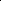

# Breaking the Stealth-Potency Trade-off in Clean-Image Backdoors with Generative Trigger Optimization

<!-- Page 1 -->

Breaking the Stealth-Potency Trade-off in Clean-Image Backdoors with Generative

Trigger Optimization

Binyan Xu1, Fan Yang1, Di Tang2*, Xilin Dai3, Kehuan Zhang1*

1The Chinese University of Hong Kong, Hong Kong, Hong Kong 2Sun Yat-sen University, Shenzhen, China 3Zhejiang University, Hangzhou, China {binyxu, yf020, khzhang}@ie.cuhk.edu.hk, tangd9@mail.sysu.edu.cn, xilin2023@zju.edu.cn

## Abstract

Clean-image backdoor attacks, which use only label manipulation in training datasets to compromise deep neural networks, pose a significant threat to security-critical applications. A critical flaw in existing methods is that the poison rate required for a successful attack induces a proportional, and thus noticeable, drop in Clean Accuracy (CA), undermining their stealthiness. This paper presents a new paradigm for cleanimage attacks that minimizes this accuracy degradation by optimizing the trigger itself. We introduce Generative Clean- Image Backdoors (GCB), a framework that uses a conditional InfoGAN to identify naturally occurring image features that can serve as potent and stealthy triggers. By ensuring these triggers are easily separable from benign task-related features, GCB enables a victim model to learn the backdoor from an extremely small set of poisoned examples, resulting in a CA drop of less than 1%. Our experiments demonstrate GCB’s remarkable versatility, successfully adapting to six datasets, five architectures, and four tasks, including the first demonstration of clean-image backdoors in regression and segmentation. GCB also exhibits resilience against most of the existing backdoor defenses.

Code — https://github.com/binyxu/GCB Extended version — https://arxiv.org/abs/2511.07210

## Introduction

Deep Neural Networks (DNNs) are widely used in applications like facial recognition (An et al. 2023), autonomous driving (Han et al. 2022), and medical image diagnosis (Li et al. 2021). However, backdoor attacks threaten their widespread adoption. By poisoning a small fraction of the training data (Li et al. 2022), an adversary can implant a hidden backdoor, causing the model to generate targeted mispredictions when a specific trigger is present in inputs. A particularly insidious variant is the clean-image backdoor, where the attack is executed without any image modification, typically by manipulating labels. This poses a significant threat in scenarios where data annotation is outsourced. For instance, CIB (Chen et al. 2022) demonstrated a one-to-one backdoor in multilabel classification by simply relabeling all qualified images

*Corresponding author. Copyright © 2026, Association for the Advancement of Artificial Intelligence (www.aaai.org). All rights reserved.

Our method: 92.1% ASR with only 0.5% Poisoning and 0.6% CA Drop

Baseline: poison 10% for 50.9% ASR, causing 8.6% CA drop

**Figure 1.** Breaking the Stealth-Potency Trade-off. Average Attack Success Rate (ASR) vs. Clean Accuracy (CA) drop across all datasets. Baselines must sacrifice stealth (CA drop) for attack success. In contrast, our method (GCB, ⋆) delivers a highly effective attack with negligible CA drop.

from a source to a target class. More recently, FLIP (Jha, Hayase, and Oh 2024) proposed a label-optimization technique to mimic the behavior of a surrogate poisoned-image model, extending the attack’s applicability.

Although existing methods can achieve high Attack Success Rates (ASR), their stealthiness is fundamentally limited by a clear trade-off between attack potency and model accuracy, as visualized in Fig. 1. The figure, which averages performance across six datasets, shows that all existing methods follow a distinct curve: to achieve higher ASR, they must accept a significantly higher Clean Accuracy (CA) Drop. For example, to exceed 50% ASR, state-of-the-art methods like FLIP (Jha, Hayase, and Oh 2024) often incur an average CA Drop of over 8%. This conspicuous degradation compromises stealthiness and undermines its practicality in real-world scenarios where model performance is closely monitored.

This drop in CA is not an artifact of a specific method but a direct consequence of the clean-label attack paradigm, attributed to what (Rong et al. 2024) term the ”natural backdoor trigger” effect. When a subset of training images is relabeled, the i.i.d. nature of the data dictates that a similar proportion of the benign test set will naturally share the features that correlate with the mislabeling. The victim model learns this spurious correlation, leading to a CA drop that is directly proportional to the poison rate. This establishes a clear tradeoff: greater stealthiness (a lower CA drop) demands a lower poison rate, which traditionally weakens the attack. The cen-

The Fortieth AAAI Conference on Artificial Intelligence (AAAI-26)

27197

AI-readable visual equivalent, added: Figure extracted from the paper PDF and converted to an SVG wrapper asset. Use the surrounding page text and caption for interpretation.

AI-readable visual equivalent, added: Figure extracted from the paper PDF and converted to an SVG wrapper asset. Use the surrounding page text and caption for interpretation.

AI-readable visual equivalent, added: Figure extracted from the paper PDF and converted to an SVG wrapper asset. Use the surrounding page text and caption for interpretation.

<!-- Page 2 -->

Property↓ CIB FLIP CIBA GCB (ours)

CA Drop ≤1% ✗ ✗ ✗ ✓ Poison Rate ≤1% ✗ ✗ ✗ ✓ ASR ≥90% ✓ ✓ ✗ ✓ Scalability (Datasets) ✓ ✗ ✗ ✓ Transferability (Architectures) ✓ ✗ ✓ ✓ Generalizability (Tasks) ✗ ✗ ✗ ✓

**Table 1.** Comparison between SOTA clean-image backdoors.

tral challenge, therefore, becomes: How can we break this trade-off, designing a trigger so potent that its corresponding backdoor is both highly effective and exceptionally stealthy?

This paper addresses this challenge head-on. We introduce Generative Adversarial Clean-Image Backdoors (GCB), a novel framework that creates such highly effective triggers, enabling successful attacks with a poison rate as low as 0.1%. This, in turn, reduces the average CA drop to a mere 0.2% and a maximum of 0.5% for any class. However, this optimization is non-trivial, as we must identify features that already exist within benign data, subject to 3 constraints: (1) Existence: The optimized trigger pattern must naturally exist in the training set. (2) Separability: Images with and without the trigger must be easily distinguishable for the model to learn the backdoor from a very low poison rate. (3) Irrelevancy: The trigger features must be orthogonal to the primary classification task to avoid degrading clean accuracy.

To simultaneously satisfy these constraints, we develop C-InfoGAN, a novel conditional generative framework. C- InfoGAN is designed to find an optimal ”trigger function” by using a GAN architecture in a new way: (a) For Existence, we employ an adversarial discriminator to constrain the generator’s output to the natural data manifold, guaranteeing that any identified trigger pattern is a valid, naturally occurring feature. (b) For Separability, we build on Info- GAN by training a generator with two distinct latent codes (representing triggered and benign states) and maximizing the distance in the feature space between the images they produce. (c) For Irrelevancy, we condition all components of the framework on the ground-truth class labels, forcing the framework to find trigger features that are independent of the class-discriminative features.

Our extensive experiments validate the superior stealth and effectiveness of GCB. Across 6 datasets including MNIST, CIFAR-10, CIFAR-100, GTSRB, Tiny-ImageNet, and ImageNet, GCB achieves ASRs up to 100% (e.g., 97.9% on CIFAR-10) with less than a 1% CA drop, using a mere 0.5% poison rate per source class. The method is robust across architectures (ResNet, VGG, ViT) and shows remarkable generalizability, extending for the first time to complex vision tasks like multi-label classification, regression, and segmentation. Even in a challenging scenario where the adversary accesses only 10% of the training data, GCB achieves a 90.3% ASR with a 0.15% CA drop on CIFAR-10. Furthermore, GCB demonstrates resilience against most of existing SOTA backdoor defenses. A summary comparison is provided in Table 1.

Our contributions are three-fold: • Breaking the Stealth-Potency Trade-off: We are the first to demonstrate a clean-image backdoor that is simulta- neously highly potent (≥90% ASR) and exceptionally stealthy (negligible CA drop ≤1% with ≤0.5% poison rate) on all datasets, effectively breaking the conventional trade-off that plagues existing methods. • Broad Applicability and Generalization: Our method demonstrates exceptional adaptability across 6 datasets, 5 architectures, and 4 tasks. Crucially, it is the first cleanimage attack framework shown to be effective for regression and segmentation tasks, dramatically expanding the threat landscape. • Novel Attack Method: We introduce a novel attack methodology based on a conditional InfoGAN, which uniquely reframes the generator as a trigger function and a recognizer as a score function to solve the complex co-optimization problem inherent to creating separable, existing, and irrelevant clean-image backdoor triggers.

## Related Work

Data Poisoning Backdoor Backdoor attacks have evolved from using conspicuous triggers (Gu et al. 2019) to more stealthy methods employing blended images (Chen et al. 2017), natural reflections (Liu et al. 2020), and clean-label perturbations (Turner, Tsipras, and Madry 2019). Our work GCB, is a clean-image backdoor attack, meaning it does not alter images in training datasets.

However, prior clean-image methods face critical limitations. CIB (Chen et al. 2022) is designed for multi-label classification and does not generalize to standard classification tasks. FLIP (Jha, Hayase, and Oh 2024) requires impractical knowledge of the victim model’s architecture and fails to scale beyond simple datasets. CIBA (Rong et al. 2024) is ineffective, achieving less than 50% Attack Success Rate (ASR) even on CIFAR-10. GCB is designed to overcome these shortcomings.

GAN-Based Representation Learning To enhance our backdoor’s efficiency, GCB utilizes a novel GAN architecture. Research in Generative Adversarial Networks (GANs) has progressed from foundational models (Goodfellow et al. 2014) toward controllable representation learning with cGAN (Mirza and Osindero 2014), InfoGAN (Chen et al. 2016), and StyleGAN (Karras, Laine, and Aila 2019). While these models excel at manipulating generated images, editing real images often requires complex GAN Inversion techniques (Xia et al. 2022), which add significant overhead. In this paper, we propose C-InfoGAN, a new architecture that integrates interpretable feature editing directly into the GAN framework.

Preliminary Threat Model We adopt the same threat model as other clean-image backdoors (Jha, Hayase, and Oh 2024; Chen et al. 2022): investigating the risks posed by malicious third-party annotators in the context of externally annotated datasets. Specially, attackers have partial or full access to view the training dataset, but their malicious actions are limited to subtly mislabeling

27198

<!-- Page 3 -->

Dataset (𝒙𝒙, 𝒚𝒚)

Bernoulli Distribution

𝟎𝟎 𝟏𝟏 𝒄𝒄∈𝟎𝟎, 𝟏𝟏

Horse

I. Attack Preparation

II. Poisoning

Stage

III. Inference

Stage

Score Function

Cat Horse

Ship Car

0.9 0.8

0.4 0.2

Quantile

Poison

Cat

Cat

0.9

Clean Images

Poisoned Data Set

Victim Model

Trigger Function

ෝ𝒙𝒙, 𝒚𝒚|𝒄𝒄= 𝟎𝟎

ෝ𝒙𝒙, 𝒚𝒚|𝒄𝒄= 𝟏𝟏

Victim Model Triggered

Images

Cat Cat

Cat Cat

Clean Dataset 𝒄𝒄𝒄 Real / False

GAN Loss

Predict Condition

Information

Loss 𝒄𝒄= 𝟏𝟏

0.8

ෝ𝒙𝒙, 𝒚𝒚|𝒄𝒄= 𝟏𝟏

**Figure 2.** Framework of Generative Adversarial Clean-Image Backdoors (GCB). In the preparation stage, a specific clean feature (e.g., background color here) is extracted as a backdoor trigger.

a small portion of the dataset, without the ability to modify any images in the training dataset or influence other training aspects like the architecture or training strategy.

Notation In this study, we consider a supervised learning scenario for a model, f, defined by y = f(x), where x is the input and y is the output label. In our GCB attack, the attacker divides the input set X into benign (X0) and malicious (X1) subsets. The malicious subset X1 is uniformly relabeled with a target label yt, forming (X1, Y1) = {(x, yt): x ∈X1}. The entire dataset then becomes (X, Y ′) = (X0, Y0) ∪(X1, Y1), where (X0, Y0) retains the original benign labels. The cardinality of X1 is constrained by the poison rate pr, such that |X1| = pr · |X|. During testing, a trigger function T(·) converts benign inputs x into triggered inputs ˆx = T(x), activating the backdoor to mislead the victim model to predict the target class yt = f ∗ θ (T(x)).

## Methodology

Overview GCB aims to minimize the CA drop while maintaining a high ASR for clean-image backdoors. In these scenarios, a portion of training images are deliberately mislabeled, but the images themselves remain unchanged. To select images to mislabel, we introduce a new network C-InfoGAN, that is trained to recognize patterns present in some training images but distinct from those patterns used for benign tasks. The GCB framework is illustrated in Fig. 2. GCB comprises three stages: attack preparation, poisoning, and inference. During attack preparation, the C-InfoGAN is trained to identify these specific patterns. Subsequently, we utilize the Q component of C-InfoGAN to identify training images with the pattern and mislabel them. In the inference stage, we use the G component to convert any image into a triggered input, misleading the victim model to predict yt.

C-InfoGAN Essentially, given a fixed poison rate (limiting the number of mislabeled images), our goal is to maximize both ASR and CA. However, it is a challenge in clean-image backdoor settings, as we can only modify the labels of images, leading to a discrete hard-label issue. Even advanced discrete optimization methods like GCG can only maximize ASR but struggle to maintain a high CA.

Our observations lead us to model this problem as a divergence maximization problem constrained by three factors: (a) Existence: The trigger pattern must be present within the training data, enabling backdoor injection via label manipulation alone. (b) Separability: The images with and without the trigger must be distinctly separable, allowing easier backdoor learning and reducing the required poison rate. (c) Irrelevancy: The trigger should not interfere with benign class features to prevent a significant CA drop, as feature overlap can disrupt class semantics. To satisfy these constraints, we introduce Conditional Information Maximizing GANs (C-InfoGAN). In C-InfoGAN, we introduce a discrete random variable c following a Bernoulli distribution as the latent variable. The generator G, conditioned on c, generates two distinct series of images depending on whether c is 0 or 1.

(a) Existence. A crucial property of clean-image backdoors is that the trigger pattern must exist within the clean image set. To satisfy this, we employ a standard GAN framework (Goodfellow et al. 2014). Training the discriminator D ensures that all images generated by the generator G follow the same distribution as real images. By conditioning G on the latent variable c, we can generate images with (c = 1) or without (c = 0) the trigger pattern. Consequently, one of the two image series generated, P(ˆx|c = 1), becomes a subset of the real image distribution. This series, P(ˆx|c = 1), can thus be safely used as the trigger function, guaranteeing its existence within the original image set.

(b) Separability. To ensure separability, we follow the concept of InfoGAN (Chen et al. 2016), which maximizes the mutual information between selected latent variables and the generated data to learn interpretable and disentangled representations. The recognition network Q (originating from InfoGAN) is tasked with distinguishing between images generated with c = 1 and c = 0 as accurately as possible by introducing an information loss term Linfo. Q converges once it can easily determine which series an image belongs to, indicating strong separability.

(c) Irrelevancy. Another crucial attribute of backdoors is

27199

AI-readable visual equivalent, added: Figure extracted from the paper PDF and converted to an SVG wrapper asset. Use the surrounding page text and caption for interpretation.

<!-- Page 4 -->

5%

3%

1%

3% 1%

0.1% 0.3% 0.5%

10%

2%

5%

5%

2% 1% 0.5% 0.1%

10%

5%

3% 1%

10%

5%

3% 2% 1%

0.3% 0.1% 0.3% 0.5% 1% 2% 3%

25%

15%

10% 5% 2% 0.1% 0.3%0.5% 1%

10% 10%

5% 5%

3% 2% 0.5% 1% 2% 2% 3%

5%

10%

5%

3%

0.01% 0.02% 0.03% 0.05%0.1%

0.3%

GTSRB Tiny-ImageNet

MNIST CIFAR-10 CIFAR-100

ImageNet

0.1% 0.3% 0.5% 1% 3%

5%

10%

5%

2% X% Poison Rate

Attack Success Rate (%) Attack Success Rate (%) Attack Success Rate (%) 0 20 40 60 80 100 0 20 40 60 80 100 0 20 40 60 80 100

Clean Accuracy(%) Clean Accuracy(%)

98

96

94

92

90

98 96 94

92 90 88 86

94

92

90

88

86

58

56

54

52

50

70

68

66

64

72

70

68

66

**Figure 3.** Stealth-potency trade-off of clean-image backdoor methods across datasets. Marker size and text indicate poison rates on each point. Our method, GCB, achieves ≥90% attack success with ≤1% drop in clean accuracy.

that the trigger should not interfere with the benign task. This indicates that the trigger pattern needs to be irrelevant to the patterns utilized for the benign task. To ensure this, we use the input image’s ground-truth label y as an auxiliary input to both the GAN generator G and discriminator D, along with the condition variable c, ensuring c is independent of y. Thus, when c = 1 (triggered image), the generated image is unrelated to the input image class, minimizing the trigger’s impact on the benign task.

Objective Function. Our loss function combines the vanilla GAN loss (Goodfellow et al. 2014) and the mutual information loss (Chen et al. 2016). The GAN loss is LGAN = −Ex∼PX log D(x)

−Eˆx∼Pg log

1 −D(ˆx)

, where PX represents the distribution of real inputs and Pg denotes the distribution generator’s outputs, penalizing for the low consistency between these two distributions. The loss of mutual information is Linfo = −Ec∼Pc,x∼PX[log Q(c|G(x, c))], where Pc is the Bernoulli distribution, representing the negative log-likelihood to predict c based on the generated images G(x, c). The general loss function integrates these two components as L = LGAN + λLinfo, where λ is the tradeoff hyperparameter.

Theoretical Analysis. In the Appendix, we present a theoretical foundation for our GCB attack, demonstrating why optimizing C-InfoGAN supports the clean-image backdoor objective. From an information-theoretic viewpoint, C- InfoGAN maximizes the mutual information I(c; G(x, c)), which corresponds to maximizing the weighted Jensen- Shannon divergence JSD(p(ˆx0) ∥p(ˆx1)), where ˆx0 = G(x, c = 0) and ˆx1 = G(x, c = 1). Given that C-InfoGAN ensures p(ˆx0) ≈p(x0) and p(ˆx1) ≈p(x1), this maximization enhances the distinguishability of p(x0) and p(x1), enabling the scoring function s(x) to effectively isolate the poisoned subset X1. Additionally, we prove that maximizing JSD(p(x1|y) ∥p(x0|y)) reduces the conditional entropy H(Y ′|X) of the poisoned labels Y ′, making the backdoor task readily learnable by the victim model. This alignment with C-InfoGAN’s objectives ensures a high ASR.

Attack Deployment

Poisoning Stage. We select a subset X1 from the original training set X and change their labels to the target label yt. The key challenge is selecting which images to manipulate. We introduce a score function to assign poison scores to each clean image, where a higher score indicates greater suitability for label manipulation. The recognition network Q from InfoGAN effectively serves as this score function. Q is trained to recognize the value of c in generated images

ˆx. Since the GAN has converged, x and ˆx follow the same distribution, allowing Q can recognize both generated ˆx and real images x. After scoring all input images, we apply a top-k quantile threshold to select the top-scoring images, where k is the total number of poisoned samples needed. These selected images have their labels flipped and are then submitted to train the victim model.

Inference Stage. During the inference stage, to create a triggered image, we input any image x into the generator G conditioned on c = 1, producing G(x, c = 1), which contains the trigger pattern. The triggered images exactly correspond to the selected images in the poisoning stage, thereby effectively activating the backdoor to mislead the victim model into predicting the target label yt.

## Evaluation

## Experimental Setup

Datasets and Models. We use BackdoorBench (Wu et al. 2024) to evaluate on six datasets: MNIST (LeCun et al. 1998), CIFAR-10/100 (Krizhevsky 2009), GTSRB (Stallkamp et al. 2012), Tiny-ImageNet (Russakovsky et al. 2015), and ImageNet-1K (Deng et al. 2009). We employ PreActRes- Net18 as the default victim model with a poison rate of 1%. All results follow an all-to-one attack scenario.

Baselines. Our clean-image backdoor baselines include CIB (Chen et al. 2022), FLIP (Jha, Hayase, and Oh 2024), CIBA (Rong et al. 2024), and FLIP-opt. FLIP-opt combines

27200

AI-readable visual equivalent, added: Figure extracted from the paper PDF and converted to an SVG wrapper asset. Use the surrounding page text and caption for interpretation.

AI-readable visual equivalent, added: Figure extracted from the paper PDF and converted to an SVG wrapper asset. Use the surrounding page text and caption for interpretation.

AI-readable visual equivalent, added: Figure extracted from the paper PDF and converted to an SVG wrapper asset. Use the surrounding page text and caption for interpretation.

AI-readable visual equivalent, added: Figure extracted from the paper PDF and converted to an SVG wrapper asset. Use the surrounding page text and caption for interpretation.

AI-readable visual equivalent, added: Figure extracted from the paper PDF and converted to an SVG wrapper asset. Use the surrounding page text and caption for interpretation.

AI-readable visual equivalent, added: Figure extracted from the paper PDF and converted to an SVG wrapper asset. Use the surrounding page text and caption for interpretation.

AI-readable visual equivalent, added: Figure extracted from the paper PDF and converted to an SVG wrapper asset. Use the surrounding page text and caption for interpretation.

AI-readable visual equivalent, added: Figure extracted from the paper PDF and converted to an SVG wrapper asset. Use the surrounding page text and caption for interpretation.

<!-- Page 5 -->

**Figure 4.** GCB’s test ASR on CIFAR-10 converges fast, but its train ASR lags, resisting fast-learning defenses like ABL.

Attack Success Rate (%)

100

80

60

40

20

0

Access Rate (%) 0 10 20 30 40 50

(a) CIFAR-10

Access Rate (%) 0 10 20 30 40 50

(b) CIFAR-100

**Figure 5.** Results with error bars under low access rates.

FLIP and Narcissus (Zeng et al. 2023) for trigger optimization. Specifically, we first generate an optimized trigger using Narcissus, then determine the best label assignments for poisoning using FLIP. Additionally, we found that FLIP is highly sensitive to the victim model’s architecture, relying on alignment between the victim and surrogate models used in attack preparation. To ensure a fair comparison, we report FLIP results under both aligned and unaligned conditions, labeled as FLIP-align and FLIP.

Metrics. We use two metrics in our experiments: Clean Accuracy (CA) and Attack Success Rate (ASR). CA measures the victim model’s accuracy on clean test data, while ASR indicates the percentage of test instances with embedded triggers that are classified as the target class by the model.

Attack Performance. ASR VS. CA. We compare GCB with several clean-image backdoor baselines in Fig. 3. Our experiments demonstrate that GCB significantly outperforms all baselines across all datasets. With less than a 0.5% drop in CA, GCB achieves over 90% ASR on small datasets such as MNIST, CIFAR-10, and CIFAR-100. For more complex datasets like GTSRB and Tiny-ImageNet, GCB maintains over 90% ASR with a CA drop within 1%. In contrast, all tested baselines only succeed on simple datasets like CIFAR-10 and CIFAR-100, incurring CA drops exceeding 5%. Moreover, they fail on relatively complex datasets such as GTSRB and Tiny-ImageNet, and surprisingly even on the simple MNIST dataset. This failure on MNIST is likely because MNIST consists of grayscale, feature-poor images. Consequently, intuitively selected triggers (e.g., sinusoidal triggers) cannot be effectively constructed using clean image combinations.

Convergence Speed and Asymmetric Trigger. Our key

Dataset Attack ASR ↑ MAP ↑ MAP (src) ↑

VOC07 CIB 87.5±14.2 91.8±1.1 74.8±3.1 GCB 67.5±7.2 93.9±0.3 93.5±0.3

VOC12 CIB 85.2±13.0 91.3±1.4 72.6±4.9 GCB 70.1±8.5 93.7±0.4 93.4±0.3

**Table 2.** Results on multi-label classification. “src” denotes source class. GCB succeeds with almost no drop in MAP.

Task → Regression Segmentation Dataset → ColorCIFAR10 VOC2012 Metrics → AE ↓ CE ↓ AE ↓ CE ↓ Clean 0.2964 0.0128 1.207 0.211 1% Poison 0.0290 0.0141 0.303 0.214 3% Poison 0.0204 0.0156 0.277 0.217

**Table 3.** Performance of GCB on other vision tasks. AE: Attack Mean Square Error. CE: Clean Mean Square Error.

idea is to make the trigger easier for the victim model to learn by optimizing separability. An important question is how quickly the victim model can learn this trigger. Fig. 4 shows that our method converges to nearly 100% ASR in just 4 epochs, whereas the simplest backdoor attack, Bad- Nets, requires 11 epochs to converge. This indicates that our backdoor task is even easier for neural networks than BadNets. Compared to peer clean-image backdoor methods, FLIP takes over 20 epochs to achieve a successful attack and remains unstable after 20 epochs.

Robustness to Architecture. As introduced in the baseline settings, FLIP is highly sensitive to the victim model’s architecture. In contrast, GCB exhibits high ASR across four distinct architectures: PreActResNet18, EfficientNet-B0, VGG- 11, and ViT-B-16, as shown in our extended version. In our experiments, all four architectures achieve ASR exceeding 90% on every tested dataset, with an average ASR above 96%. This demonstrates that our method is architecture-agnostic.

Generalized Threat Model. Our threat model can be extended to weaker assumptions. We propose a generalized threat model where attackers can access only a small portion of the entire dataset and subsequently poison an even smaller subset of the accessed data. This extension broadens the clean-image backdoor threat to individual annotators with very limited dataset access. As shown in Fig. 5, when accessing only 10% of the training dataset, GCB achieves an ASR of 90.3% on CIFAR-10 and 68.2% on CIFAR-100. In comparison, the current SOTA baseline FLIP achieves only 20.4% and 1.3% ASR on CIFAR-10 and CIFAR-100, respectively, with the same data access.

Other Vision Tasks. Our method (GCB) is adaptable to various supervised vision tasks because C-InfoGAN is designed without specific assumptions about the target task. We simply adjust the label condition y for different tasks—using one-hot encoding for classification and no embedding for regression—enabling seamless adaptation. For multi-label classification, we compared our approach with CIB (Chen et al. 2022) using a 5% poison rate on the VOC07 and VOC12 datasets. As shown in Table 3, CIB achieves approximately 15% higher ASR but significantly underperforms in Mean

27201

AI-readable visual equivalent, added: Figure extracted from the paper PDF and converted to an SVG wrapper asset. Use the surrounding page text and caption for interpretation.

AI-readable visual equivalent, added: Figure extracted from the paper PDF and converted to an SVG wrapper asset. Use the surrounding page text and caption for interpretation.

AI-readable visual equivalent, added: Figure extracted from the paper PDF and converted to an SVG wrapper asset. Use the surrounding page text and caption for interpretation.

<!-- Page 6 -->

poison rate→1% 0.5% 0.1% CIFAR-10 (w/o LGAN) 8.97 4.14 1.90 (w/o Linfo) 42.9 11.4 2.87 (w/o LC) 98.9 93.1 85.3 Ours 100.0 100.0 98.5 CIFAR-100 (w/o LGAN) 3.41 1.80 0.45 (w/o Linfo) 28.7 8.12 1.34 (w/o LC) 84.7 68.4 34.6 Ours 96.7 92.1 45.9

**Table 4.** Ablation Study.

Corruptions↓ CA ASR Test-Time JPEG 77.6 100 Color Shift 84.4 98.4 Color Shrink 84.9 100 Affine 84.2 99.9 Training-Time JPEG 93.0 100 Color Shift 92.1 97.6 Color Shrink 92.3 99.8 Affine 91.8 100

**Table 5.** Robustness Under Different Corruptions.

Average Precision (MAP), dropping by about 2% overall and around 20% for the source class. This reduction in MAP compromises its stealthiness. Additionally, our method extends to Image Regression and Semantic Segmentation tasks, where existing clean-image backdoors are ineffective. As illustrated in Table 3, our attack succeeds in these tasks, demonstrated by a substantial decrease in Attack Mean Square Error (AE) compared to the clean dataset.

Ablation Study. We conducted ablation studies on three key components of our design: GAN loss (for Existence), information loss (for Separability), and label condition (for Irrelevancy). The results are presented in Table 4.

(a) GAN Loss. We eliminate the discriminator D from C- InfoGAN and apply an l∞-norm constraint to the generator. Experiments show that this approach completely loses effectiveness because, without adversarial training, the trigger feature quickly overfits and becomes an adversarial attack on the recognition network Q, ceasing to function as an effective backdoor.

(b) Information Loss. Removing the information loss transforms our network into a standard Pix2Pix GAN. To perform the attack, we intuitively select the darkest 1% of images in the dataset as poisoned images to construct the trigger feature, modeling the trigger-wrapping problem as a style-transfer scenario solvable by Pix2Pix GAN. Under this setup, GCB significantly degrades in performance, indicating that manually designed triggers are ineffective.

(c) Label Condition. We remove y as a prior condition from all components in C-InfoGAN. The results show only a minor decrease in ASR, likely because the UNet generator preserves the original appearance, reducing the reliance on label conditioning. However, we observe that removing LC increases the likelihood of mode collapse, causing C-InfoGAN to generate uniform features.

Stealthiness and Robustness Measure. Stealthiness of GCB. We evaluated the stealthiness of our method using seven metrics from BackdoorBench (Wu et al. 2024). As shown in Fig. 6, clean-image backdoor attacks, such as FLIP and GCB, are significantly stealthier than poison-image backdoors like Blended (Chen et al. 2017) and IA (Nguyen and Tran 2020). Clean-image methods leverage

(a) CIFAR-10. (b) Tiny-ImageNet.

**Figure 6.** Difference from clean images. Closeness to “Clean” values indicates stealthiness.

0 600 1200 Neurons pruned

0 200 400

CA or ASR

1.0

0.8

0.6

GTSRB Tiny-ImageNet CIFAR-10 CIFAR-100

0 200 400 0 200 400 Neurons pruned Neurons pruned Neurons pruned

**Figure 7.** Fine-pruning.

benign features for the backdoor, creating poisoned data that closely resembles clean images. This makes them difficult to detect using image-quality metrics like SSIM and BRISQUE. While the Frechet Inception Distance (FID) assesses distributional differences, our experiments show that GCB excels here as well, with its triggered images closely matching the clean distribution across all tested metrics.

Robustness of GCB. To evaluate the robustness of GCB, we apply several common image corruption techniques, including JPEG Compression (Xue et al. 2023), Gaussian Smoothing (Xu, Evans, and Qi 2018), Color Shift (Jiang et al. 2023), Color Shrink (Xu, Evans, and Qi 2018), and Affine Transformation (Qiu et al. 2021). These transformations are widely recognized for their effectiveness in mitigating backdoor attacks. In our experiments, we apply these transformations at test time to each input image before feeding them into the victim model. The results in Table 5 demonstrate that GCB remains highly robust against these corruptions. While the CA drops by more than 10% in all cases, the ASR consistently remains close to 100%.

Defenses Classic Defenses

Neural Cleanse (NC). NC (Wang et al. 2019) uses anomaly scores to detect backdoors in DNN models. However, Fig. 8 shows that NC is hard to differentiate backdoor-attacked datasets and clean ones, because their scores are similar and below the 2.0 threshold. This is due to NC’s focus on static adversarial patches, while our attack uses a dynamic, global trigger function, making trigger reconstruction difficult.

STRIP. STRIP (Gao et al. 2019) measures class prediction entropy through input perturbations. Fig. 9 shows a notable similarity in entropy distribution for clean and poisoned subsets. Since C-InfoGAN uses benign features of various intensities as triggers, it can yield similar STRIP behaviors for samples with or without trigger. Therefore, our GCB attack is resilient to STRIP defense.

27202

AI-readable visual equivalent, added: Figure extracted from the paper PDF and converted to an SVG wrapper asset. Use the surrounding page text and caption for interpretation.

AI-readable visual equivalent, added: Figure extracted from the paper PDF and converted to an SVG wrapper asset. Use the surrounding page text and caption for interpretation.

AI-readable visual equivalent, added: Figure extracted from the paper PDF and converted to an SVG wrapper asset. Use the surrounding page text and caption for interpretation.

AI-readable visual equivalent, added: Figure extracted from the paper PDF and converted to an SVG wrapper asset. Use the surrounding page text and caption for interpretation.

AI-readable visual equivalent, added: Figure extracted from the paper PDF and converted to an SVG wrapper asset. Use the surrounding page text and caption for interpretation.

AI-readable visual equivalent, added: Figure extracted from the paper PDF and converted to an SVG wrapper asset. Use the surrounding page text and caption for interpretation.

<!-- Page 7 -->

Defense→ ABL D-BR CLP EP NAB ASD MSPC ReBack PIPD Average Attack↓ CA ASR CA ASR CA ASR CA ASR CA ASR CA ASR CA ASR CA ASR CA ASR ASR BadNet 41.0 72.5 91.0 1.5 91.5 4.5 92.8 12.7 86.3 0.3 92.0 2.1 92.8 0.3 91.7 4.3 92.2 0.5 11.0 Blend 58.6 0.0 85.1 0.0 93.1 91.6 92.5 95.6 88.8 43.8 93.0 5.3 92.7 0.7 91.7 2.4 92.4 5.3 27.2 BPP 49.3 18.3 88.5 85.5 91.6 3.4 90.5 10.5 84.5 79.4 92.5 99.4 90.5 2.8 90.1 1.8 92.4 0.9 33.6 IA 62.5 31.5 85.3 84.8 84.7 10.3 90.1 6.7 90.2 74.4 92.3 19.8 92.5 5.3 87.9 1.7 91.3 4.0 26.5 SIG 54.3 50.1 91.3 49.6 93.1 79.0 92.1 83.6 90.1 82.1 92.2 99.5 91.0 10.3 87.4 29.9 92.5 13.6 55.3 SSBA 59.8 82.6 83.1 3.0 93.2 1.1 92.2 99.9 88.9 49.1 93.3 7.1 90.9 21.5 85.1 6.6 89.9 17.2 32.0 WaNet 77.3 26.2 84.3 60.2 90.5 0.8 89.9 63.3 89.9 11.7 91.7 8.8 93.0 54.2 90.2 84.4 92.7 11.4 35.7 FLIP 50.0 99.0 83.9 22.1 92.2 20.6 90.0 80.9 79.3 70.2 86.9 62.2 91.6 17.2 90.0 39.7 90.7 66.9 53.2 GCB 69.3 100.0 84.2 100.0 92.4 100.0 90.6 100.0 88.8 100.0 90.9 100.0 91.5 23.9 88.7 71.6 91.8 87.7 87.0

**Table 6.** Comparison of different attack methods against advanced backdoor defense methods.

**Figure 8.** NC Defense.

Dataset→ CIFAR10 CIFAR100 Method↓ CA ASR CA ASR SPL 91.9 100 67.2 78.2 PRL 89.7 100 66.8 87.6 BootStrap 88.4 100 57.6 93.9 DivideMix 92.1 100 73.4 86.7 MentorMix 89.9 100 69.0 92.7

**Table 7.** Noisy training mitigation.

CIFAR-10 CIFAR-100 GTSRB Tiny-ImageNet

Probability without trigger with trigger

0.3

0.2

0.1

0.0 0.5 1.0 2.5 5.0 7.5 0 2 4 0 50

**Figure 9.** STRIP normalized entropy distribution of GCB.

Fine-Pruning. Fine-Pruning (Liu, Dolan-Gavitt, and Garg 2018), which prunes high-activation neurons, is ineffective against our attack. Because our backdoor uses natural benign features, it creates a complex activation pattern that evades detection. Consequently, as shown in Fig. 7, the ASR on CIFAR-10 remains constant during pruning. On CIFAR-100, the ASR initially drops but then increases sharply, demonstrating the defense’s failure.

SOTA Backdoor Defenses As shown in Table 6, we evaluated our attack against nine state-of-the-art (SOTA) backdoor defenses, including six since 2023 (Zheng et al. 2022; Liu, Sangiovanni-Vincentelli, and Yue 2023; Gao et al. 2023; Ma et al. 2024; Chen, Wu, and Zhou 2024; Pal et al. 2024). The proposed method, GCB, exhibits strong resistance against most of them. Only one defense, MSPC (Pal et al. 2024), proved effective, but most of the other attacks suffer from greater performance degradation. Even the latest defenses like ReBack (Ma et al. 2024) and PIPD (Chen, Wu, and Zhou 2024) failed to remove the backdoor, only slightly lowering the ASR. We attribute this robustness to the attack’s inherent asymmetric trigger, where the training and testing triggers are different. This design bypasses the common assumption of latent separability (Qi et al. 2022) that many defenses rely on.

Frequency (%)

6

4

2

0 0.0 0.2 0.4 0.6 0.8 1.0 Confidence (a) Noisy label.

0.0 0.2 0.4 0.6 0.8 1.0 Confidence (b) Poisoned label.

**Figure 10.** Confidence for two different label issues.

Adaptive Defenses Noisy Training. Clean-image backdoors embed triggers by poisoning only labels. As a result, training techniques that are robust to label noise might diminish the effectiveness of these faulty labels. We evaluated five noisy training methods: Self-Paced Learning (SPL) (Kumar, Packer, and Koller 2010), Perturbation Robust Learning (PRL) (Wong and Kolter 2020), Bootstrap (Reed et al. 2014), DivideMix (Li, Socher, and Hoi 2020), and MentorMix (Jiang et al. 2020). As shown in Table 7, none of these methods effectively defend against our attack. This is likely because GCB’s incorrect labels constitute misleading knowledge rather than random noise, which contradicts the basic assumption of noisy training.

Label Cleaning. We evaluated the effectiveness of advanced label cleaning against GCB using CleanLab (Northcutt, Jiang, and Chuang 2021), a prominent tool for detecting label errors. Such methods work by flagging data with low model confidence. This successfully identifies random label noise, as the model cannot learn a coherent mapping, leading to low confidence scores (Fig. 10). In contrast, GCB intentionally creates a strong, learnable association between images and target labels. This results in poisoned samples having high confidence scores, rendering them indistinguishable from or even more confident than benign samples and making label cleaning an ineffective defense.

## Conclusion

We introduced Generative Adversarial Clean-Image Backdoors (GCB), a stealthy and adaptive backdoor attack that uses C-InfoGAN to optimize trigger patterns embedded within training images. Experiments across 6 datasets, 5 architectures, and 4 tasks showed high attack success rates with minimal drop in clean accuracy and low poison rates. GCB resists existing defenses, highlighting the need for more robust protections.

27203

AI-readable visual equivalent, added: Figure extracted from the paper PDF and converted to an SVG wrapper asset. Use the surrounding page text and caption for interpretation.

AI-readable visual equivalent, added: Figure extracted from the paper PDF and converted to an SVG wrapper asset. Use the surrounding page text and caption for interpretation.

AI-readable visual equivalent, added: Figure extracted from the paper PDF and converted to an SVG wrapper asset. Use the surrounding page text and caption for interpretation.

AI-readable visual equivalent, added: Figure extracted from the paper PDF and converted to an SVG wrapper asset. Use the surrounding page text and caption for interpretation.

AI-readable visual equivalent, added: Figure extracted from the paper PDF and converted to an SVG wrapper asset. Use the surrounding page text and caption for interpretation.

AI-readable visual equivalent, added: Figure extracted from the paper PDF and converted to an SVG wrapper asset. Use the surrounding page text and caption for interpretation.

AI-readable visual equivalent, added: Figure extracted from the paper PDF and converted to an SVG wrapper asset. Use the surrounding page text and caption for interpretation.

AI-readable visual equivalent, added: Figure extracted from the paper PDF and converted to an SVG wrapper asset. Use the surrounding page text and caption for interpretation.

<!-- Page 8 -->

## References

An, S.; Yao, Y.; Xu, Q.; Ma, S.; Tao, G.; Cheng, S.; Zhang, K.; Liu, Y.; Shen, G.; Kelk, I.; et al. 2023. ImU: Physical Impersonating Attack for Face Recognition System with Natural Style Changes. In 2023 IEEE Symposium on Security and Privacy (SP), 899–916. IEEE Computer Society. Chen, K.; Lou, X.; Xu, G.; Li, J.; and Zhang, T. 2022. Cleanimage backdoor: Attacking multi-label models with poisoned labels only. In The Eleventh International Conference on Learning Representations. Chen, X.; Duan, Y.; Houthooft, R.; Schulman, J.; Sutskever, I.; and Abbeel, P. 2016. Infogan: Interpretable representation learning by information maximizing generative adversarial nets. Advances in neural information processing systems, 29. Chen, X.; Liu, C.; Li, B.; Lu, K.; and Song, D. 2017. Targeted backdoor attacks on deep learning systems using data poisoning. arXiv preprint arXiv:1712.05526. Chen, Y.; Wu, H.; and Zhou, J. 2024. Progressive poisoned data isolation for training-time backdoor defense. In Proceedings of the AAAI Conference on Artificial Intelligence, volume 38, 11425–11433. Deng, J.; Dong, W.; Socher, R.; Li, L.-J.; Li, K.; and Fei- Fei, L. 2009. Imagenet: A large-scale hierarchical image database. In 2009 IEEE conference on computer vision and pattern recognition, 248–255. Ieee. Gao, K.; Bai, Y.; Gu, J.; Yang, Y.; and Xia, S.-T. 2023. Backdoor defense via adaptively splitting poisoned dataset. In Proceedings of the IEEE/CVF Conference on Computer Vision and Pattern Recognition, 4005–4014. Gao, Y.; Xu, C.; Wang, D.; Chen, S.; Ranasinghe, D. C.; and Nepal, S. 2019. STRIP: A Defence Against Trojan Attacks on Deep Neural Networks. In 35th Annual Computer Security Applications Conference (ACSAC).

Goodfellow, I.; Pouget-Abadie, J.; Mirza, M.; Xu, B.; Warde- Farley, D.; Ozair, S.; Courville, A.; and Bengio, Y. 2014. Generative adversarial nets. Advances in neural information processing systems, 27. Gu, T.; Liu, K.; Dolan-Gavitt, B.; and Garg, S. 2019. Badnets: Evaluating backdooring attacks on deep neural networks. IEEE Access, 7: 47230–47244. Han, X.; Xu, G.; Zhou, Y.; Yang, X.; Li, J.; and Zhang, T. 2022. Physical backdoor attacks to lane detection systems in autonomous driving. In Proceedings of the 30th ACM International Conference on Multimedia, 2957–2968. Jha, R.; Hayase, J.; and Oh, S. 2024. Label poisoning is all you need. Advances in Neural Information Processing Systems, 36. Jiang, L.; Huang, D.; Liu, M.; and Yang, W. 2020. Beyond synthetic noise: Deep learning on controlled noisy labels. In International conference on machine learning, 4804–4815. PMLR. Jiang, W.; Li, H.; Xu, G.; and Zhang, T. 2023. Color Backdoor: A Robust Poisoning Attack in Color Space. In Proceedings of the IEEE/CVF Conference on Computer Vision and Pattern Recognition, 8133–8142.

Karras, T.; Laine, S.; and Aila, T. 2019. A style-based generator architecture for generative adversarial networks. In Proceedings of the IEEE/CVF conference on computer vision and pattern recognition, 4401–4410. Krizhevsky, A. 2009. Learning Multiple Layers of Features from Tiny Images. Master’s thesis, University of Tront. Kumar, M.; Packer, B.; and Koller, D. 2010. Self-paced learning for latent variable models. Advances in neural information processing systems, 23. LeCun, Y.; Bottou, L.; Bengio, Y.; and Haffner, P. 1998. Gradient-based learning applied to document recognition. Proceedings of the IEEE, 86(11): 2278–2324. Li, J.; Socher, R.; and Hoi, S. C. 2020. DivideMix: Learning with Noisy Labels as Semi-supervised Learning. In International Conference on Learning Representations. Li, Y.; Jiang, Y.; Li, Z.; and Xia, S.-T. 2022. Backdoor learning: A survey. IEEE Transactions on Neural Networks and Learning Systems. Li, Y.; Zhao, J.; Lv, Z.; and Li, J. 2021. Medical image fusion method by deep learning. International Journal of Cognitive Computing in Engineering, 2: 21–29. Liu, K.; Dolan-Gavitt, B.; and Garg, S. 2018. Fine-pruning: Defending against backdooring attacks on deep neural networks. In International symposium on research in attacks, intrusions, and defenses, 273–294. Springer. Liu, M.; Sangiovanni-Vincentelli, A.; and Yue, X. 2023. Beating Backdoor Attack at Its Own Game. In Proceedings of the IEEE/CVF International Conference on Computer Vision, 4620–4629. Liu, Y.; Ma, X.; Bailey, J.; and Lu, F. 2020. Reflection backdoor: A natural backdoor attack on deep neural networks. In Computer Vision–ECCV 2020: 16th European Conference, Glasgow, UK, August 23–28, 2020, Proceedings, Part X 16, 182–199. Springer. Ma, Z.; Yang, Y.; Liu, Y.; Yang, T.; Liu, X.; Li, T.; and Qin, Z. 2024. Need for Speed: Taming Backdoor Attacks with Speed and Precision. In 2024 IEEE Symposium on Security and Privacy (SP), 1217–1235. IEEE. Mirza, M.; and Osindero, S. 2014. Conditional generative adversarial nets. arXiv preprint arXiv:1411.1784. Nguyen, T. A.; and Tran, A. 2020. Input-aware dynamic backdoor attack. Advances in Neural Information Processing Systems, 33: 3454–3464. Northcutt, C. G.; Jiang, L.; and Chuang, I. L. 2021. Confident Learning: Estimating Uncertainty in Dataset Labels. Journal of Artificial Intelligence Research (JAIR), 70: 1373–1411. Pal, S.; Yao, Y.; Wang, R.; Shen, B.; and Liu, S. 2024. Backdoor Secrets Unveiled: Identifying Backdoor Data with Optimized Scaled Prediction Consistency. In The Twelfth International Conference on Learning Representations. Qi, X.; Xie, T.; Li, Y.; Mahloujifar, S.; and Mittal, P. 2022. Revisiting the assumption of latent separability for backdoor defenses. In International Conference on Learning Representations.

27204

<!-- Page 9 -->

Qiu, H.; Zeng, Y.; Guo, S.; Zhang, T.; Qiu, M.; and Thuraisingham, B. 2021. Deepsweep: An evaluation framework for mitigating DNN backdoor attacks using data augmentation. In Proceedings of the 2021 ACM Asia Conference on Computer and Communications Security, 363–377. Reed, S.; Lee, H.; Anguelov, D.; Szegedy, C.; Erhan, D.; and Rabinovich, A. 2014. Training deep neural networks on noisy labels with bootstrapping. arXiv preprint arXiv:1412.6596. Rong, D.; Shen, S.; Fu, X.; Qian, P.; Chen, J.; He, Q.; Fu, X.; and Wang, W. 2024. Clean-image Backdoor Attacks. arXiv preprint arXiv:2403.15010. Russakovsky, O.; Deng, J.; Su, H.; Krause, J.; Satheesh, S.; Ma, S.; Huang, Z.; Karpathy, A.; Khosla, A.; Bernstein, M.; et al. 2015. Imagenet large scale visual recognition challenge. International journal of computer vision, 115: 211–252. Stallkamp, J.; Schlipsing, M.; Salmen, J.; and Igel, C. 2012. Man vs. computer: Benchmarking machine learning algorithms for traffic sign recognition. Neural networks, 32: 323–332. Turner, A.; Tsipras, D.; and Madry, A. 2019. Label-consistent backdoor attacks. arXiv preprint arXiv:1912.02771. Wang, B.; Yao, Y.; Shan, S.; Li, H.; Viswanath, B.; Zheng, H.; and Zhao, B. Y. 2019. Neural cleanse: Identifying and mitigating backdoor attacks in neural networks. In 2019 IEEE Symposium on Security and Privacy (SP). IEEE. Wong, E.; and Kolter, J. Z. 2020. Learning perturbation sets for robust machine learning. arXiv preprint arXiv:2007.08450. Wu, B.; Chen, H.; Zhang, M.; Zhu, Z.; Wei, S.; Yuan, D.; Zhu, M.; Wang, R.; Liu, L.; and Shen, C. 2024. BackdoorBench: A Comprehensive Benchmark and Analysis of Backdoor Learning. arXiv:2407.19845. Xia, W.; Zhang, Y.; Yang, Y.; Xue, J.-H.; Zhou, B.; and Yang, M.-H. 2022. Gan inversion: A survey. IEEE Transactions on Pattern Analysis and Machine Intelligence, 45(3). Xu, W.; Evans, D.; and Qi, Y. 2018. Feature Squeezing: Detecting Adversarial Examples in Deep Neural Networks. In Proceedings 2018 Network and Distributed System Security Symposium. Internet Society. Xue, M.; Wang, X.; Sun, S.; Zhang, Y.; Wang, J.; and Liu, W. 2023. Compression-resistant backdoor attack against deep neural networks. Applied Intelligence, 1–16. Zeng, Y.; Pan, M.; Just, H. A.; Lyu, L.; Qiu, M.; and Jia, R. 2023. Narcissus: A practical clean-label backdoor attack with limited information. In Proceedings of the 2023 ACM SIGSAC Conference on Computer and Communications Security, 771–785. Zheng, R.; Tang, R.; Li, J.; and Liu, L. 2022. Pre-activation distributions expose backdoor neurons. Advances in Neural Information Processing Systems, 35: 18667–18680.

27205
