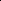

# Bridging Day and Night: Target-Class Hallucination Suppression in Unpaired Image Translation

<!-- Page 1 -->

Bridging Day and Night: Target-Class Hallucination Suppression in Unpaired

Image Translation

Shuwei Li1, Lei Tan1, Robby T. Tan1, 2

## 1 National University of Singapore 2 ASUS Intelligent Cloud

Services (AICS) shuwei@u.nus.edu, lei.tan@nus.edu.sg, robby.tan@nus.edu.sg

## Abstract

Day-to-night unpaired image translation is important to downstream tasks but remains challenging due to large appearance shifts and the lack of direct pixel-level supervision. Existing methods often introduce semantic hallucinations, where objects from target classes such as traffic signs and vehicles, as well as man-made light effects, are incorrectly synthesized. These hallucinations significantly degrade downstream performance. We propose a novel framework that detects and suppresses hallucinations of target-class features during unpaired translation. To detect hallucination, we design a dual-head discriminator that additionally performs semantic segmentation to identify hallucinated content in background regions. To suppress these hallucinations, we introduce class-specific prototypes, constructed by aggregating features of annotated target-domain objects, which act as semantic anchors for each class. Built upon a Schr¨odinger Bridge-based translation model, our framework performs iterative refinement, where detected hallucination features are explicitly pushed away from class prototypes in feature space, thus preserving object semantics across the translation trajectory. Experiments show that our method outperforms existing approaches both qualitatively and quantitatively. On the BDD100K dataset, it improves mAP by 15.5% for dayto-night domain adaptation, with a notable 31.7% gain for classes such as traffic lights that are prone to hallucinations.

## Introduction

Unpaired image-to-image (I2I) translation has been actively explored in autonomous driving for adapting annotated datasets from daytime to nighttime conditions, supporting downstream tasks such as nighttime object detection (Zhang et al. 2023; Murez et al. 2018; Kim et al. 2019; Huang et al. 2024) and semantic segmentation (Jiang, Tao, and Fu 2019; Cherian and Sullivan 2019; Peng et al. 2023; Wang et al. 2024). Its ability to operate without paired images makes it a flexible and scalable approach, particularly given the difficulty of collecting pixel-aligned image pairs.

However, existing unpaired I2I methods, including both GAN-based (Zhu et al. 2017; Huang et al. 2018; Lee et al. 2018; Park et al. 2020) and diffusion-based approaches (Sasaki, Willcocks, and Breckon 2021; Su et al. 2023; Wu and la Torre 2023), typically do not utilize dataset

Copyright © 2026, Association for the Advancement of Artificial Intelligence (www.aaai.org). All rights reserved.

annotations. As a result, they often fail to preserve objects from target classes such as traffic signs and vehicles.

To address this, several instance-aware unpaired I2I methods have been proposed that leverage bounding box annotations and class information available during training. INIT (Shen et al. 2019) performs separate instancelevel and global translations. DUNIT (Bhattacharjee et al. 2020) incorporates object detectors to enhance the modeling of target-class regions. MGUIT (Jeong et al. 2021) introduces a memory module to store class-aware styles, while InstaFormer (Kim et al. 2022) leverages a transformer (Vaswani et al. 2017) encoder to improve instancelevel translation. As shown in Fig.1, while these methods enhance the translation of annotated foreground objects, they lack mechanisms to constrain the background (unannotated) regions. Without explicit background control, these models often introduce hallucinated content resembling target classes. As illustrated in Table 1, using such data for object detection can lead to significant degraded performance.

In this paper, we tackle the challenge of semantic hallucinations in day-to-night unpaired translation by introducing a framework that explicitly detects and suppresses hallucinated features related to target classes, i.e., classes annotated in the dataset. Our method builds upon a Schr¨odinger Bridge-based multi-step translation framework, which progressively refines the image through intermediate stages. This formulation reduces the difficulty of bridging large domain gaps and allows greater diversity in translation.

Target-class hallucinated pixels appear outside of annotated bounding boxes. Pixel-level segmentation masks are required to precisely localize which pixels have targetclasses features. However, object detection datasets often provide only bounding box annotations, lacking the segmentation labels. To effectively train a segmentation model, we generate pseudo segmentation masks using a foundation segmentation model (Ravi et al. 2024), with the bounding boxes serving as prompts. This enables our model to detect hallucinated pixels beyond annotated object boundaries. Conventional discriminators often rely on superficial style cues to distinguish real from fake images. In day-to-night translation, this bias encourages generators to insert hallucinated lights and target-like artifacts (e.g., traffic signals, headlights) to mimic nighttime style. To counter this, we integrate target-class hallucination segmentation into a dual-

The Fortieth AAAI Conference on Artificial Intelligence (AAAI-26)

<!-- Page 2 -->

(c) InstaFormer (b) UNSB (d) Ours (a) Daytime images

**Figure 1.** Existing unpaired image-to-image (I2I) translation methods often introduce hallucinations that mimic or falsely suggest target classes, such as fake taillights for cars or spurious green and red signals for traffic lights (see yellow boxes).

head discriminator, allowing it to detect and penalize semantic inconsistencies rather than relying solely on style cues.

To suppress the detected hallucinations, we construct target-class prototypes by aggregating features of annotated instances in the target domain. These prototypes act as semantic anchors, and hallucinated features detected during intermediate translation steps are pushed away from the anchors via contrastive learning, thus enforcing semantic boundaries between background and foreground.

We evaluate our framework on multiple datasets and tasks. On the BDD100K (Yu et al. 2020) dataset, our method improves mAP by 15.5% for day-to-night domain adaptation on object detection, with a 31.7% boost for challenging classes such as traffic lights that are particularly prone to hallucinations. Our method also achieves state-of-the-art performance on cross-dataset translation and cross-weather tasks. In summary, our contributions are: 1. Hallucination-Suppression Translation Framework: detects and suppresses target-class hallucinations in a multi-step unpaired I2I framework, ensuring semantic consistency between translations and annotations. 2. Hallucination-Aware Discriminator: augments the style discriminator with a segmentation head that explicitly predicts target-class hallucinations; pixel-level pseudo masks, obtained by utilizing dataset’s bounding boxes as prompt, supervise this head. 3. Prototype-Based Suppression: regulates hallucinated features by contrasting them against target-class prototypes derived from real target domain features. 4. Empirical Validation: demonstrates substantially fewer target-class hallucinations and large improvements in downstream detection accuracy across diverse datasets.

## Related Work

Image-to-Image Translation Early I2I methods like Pix2Pix (Isola et al. 2017) achieved strong results with conditional GANs (Goodfellow et al. 2014), but required paired data. To relax this constraint, unpaired methods emerged, notably CycleGAN (Zhu et al. 2017), which introduced cycle-consistency loss, an idea widely adopted (Choi et al. 2018; Hoffman et al. 2018; Huang et al. 2018; Kim et al. 2017; Lee et al. 2018; Yi et al. 2017). However, later work (Wu et al. 2024) revealed that bypassing cycleconsistency can cause semantic errors.

To reduce complexity, contrastive approaches like CUT (Park et al. 2020) and F-LSeSim (Wang, Zhang, and

Li 2022), inspired by InfoNCE (Oord, Li, and Vinyals 2018), replaced cycle loss but lack object-level constrain. These models often hallucinate or distort targetclass features in large domain shifts (e.g., day-to-night). Diffusion-based models recently advanced unpaired translation: SDEdit (Meng et al. 2021) perturbs and denoises inputs; Cycle-Diffusion (Wu and la Torre 2022) translates via a shared latent space; DDIB (Su et al. 2022) uses dual diffusion bridges for cycle consistency; InstructPix2Pix (Brooks, Holynski, and Efros 2023) and Pix2Pix-Zero (Parmar et al. 2023) perform text-guided edits. UNSB (Kim et al. 2023) reformulates I2I as multi-step stochastic transport via Schr¨odinger Bridge, enabling smoother domain shifts.

Despite these advances, most approaches suffer from inversion artifacts (Parmar et al. 2024), lack realism in structured scenes, and offer no mechanism for hallucination detection or suppression, leading to semantic distortions in challenging domains like day-to-night translation. Instance-Aware Image-to-Image Translation Several methods have explored instance-aware I2I translation to improve the fidelity of annotated objects by leveraging bounding box supervision. InstaGAN (Mo, Cho, and Shin 2018) uses segmentation masks to translate only foreground instances while keeping the background unchanged. INIT (Shen et al. 2019) translate instances separately with background regions. DUNIT (Bhattacharjee et al. 2020) integrates object detection to preserve the position and scale of instances but fails to prevent hallucinations in unannotated regions. Subsequent approaches such as MGUIT (Jeong et al. 2021) incorporate a memory bank to store class-aware styles, while InstaFormer (Kim et al. 2022) replaces CNN encoders with transformers (Vaswani et al. 2017) and applies contrastive loss within bounding boxes.

Although these methods improve translation quality inside annotated regions, they overlook semantic inconsistencies outside the boxes. As a result, under large domain shifts such as day-to-night translation, target-class instances are often hallucinated as background artifacts (e.g., headlights, taillights, traffic lights), degrading the performance of downstream detection models trained on these datasets.

Proposed Method Our goal is to learn a mapping from the source domain X (daytime) to the target domain Y (nighttime) while preserving semantic consistency with annotated target classes. We assume access to object annotations: bounding boxes and class labels during training, but not at test time. To address

AI-readable visual equivalent, added: Figure extracted from the paper PDF and converted to an SVG wrapper asset. Use the surrounding page text and caption for interpretation.

AI-readable visual equivalent, added: Figure extracted from the paper PDF and converted to an SVG wrapper asset. Use the surrounding page text and caption for interpretation.

AI-readable visual equivalent, added: Figure extracted from the paper PDF and converted to an SVG wrapper asset. Use the surrounding page text and caption for interpretation.

AI-readable visual equivalent, added: Figure extracted from the paper PDF and converted to an SVG wrapper asset. Use the surrounding page text and caption for interpretation.

<!-- Page 3 -->

target classes

......

target-class prototypes contrastive loss

Intermediate Hallucination Suppression

𝐺!"# 𝐺$!# 𝑥%(𝑥&!)

reference images

𝐺!"# 𝑥%(𝑥&") 𝑥&!

𝐺!"# 𝐺$!#

× 𝒊

𝜨(0, 𝜎'(%𝑰) 𝑥)

𝑥&" 𝑥&"#$ sg when target-class hallucinations are generated…

Real / Fake

𝐷!"#

𝐷*!+

𝐷*,-

...

Segmented Hallucination

Target-Class Hallucination Segmentation

**Figure 2.** Model overview. Given a source image x0, our framework models image-to-image translation as a multi-step transport process that progressively refines the translation. At each step j ∈[0, i], the generator processes the current state xtj and predicts an intermediate target image x1(xtj). The next state xtj+1 is obtained by mixing xtj, x1(xtj), and Gaussian noise. This process continues until xti, the final intermediate state before training. Hallucinations in the x1(xti) are detected by the segmentation head Dseg, while reference images provide annotated objects to generate target-class prototypes of the target domain. Intermediate hallucination suppression then pushes detected hallucinated features away from the prototypes.

hallucinations related to annotated classes, we propose a Schr¨odinger Bridge-based translation framework with two tightly integrated components: (1) Target-Class Hallucination Segmentation, which detects hallucinated pixels within a dual-head discriminator, and (2) Intermediate Hallucination Suppression, which regulates hallucinated features using class-specific prototypes.

Schr¨odinger Bridge Multi-Step Translation Our generator follows the Unpaired Neural Schr¨odinger Bridge (UNSB (Kim et al. 2023)) framework, which models unpaired image-to-image translation as a sequence of stochastic transport steps between intermediate distributions. Instead of directly mapping a source image to its translated counterpart in a single step, the model progressively refines the transformation by constructing a sequence of intermediate states, enabling a smoother and more stable transition from the source domain to the target domain.

As illustrated in Fig. 2, given a source image x0 ∈X, the translation process is formulated as a Markov chain. Given a partition {tj}N j=0 of the unit interval [0, 1], each step tj produces an intermediate image xtj. The key idea is to first estimate a target-domain image from the current state:

x1(xtj) ∼qθ(x1|xtj), (1) where qθ(x1|xtj) is a neural network θ that predicts the target-domain counterpart of xtj. This prediction is then used to generate the next state xtj+1 as a mixture of the current state, the predicted target image, and Gaussian noise: xtj+1 = sj+1x1(xtj)+(1−sj+1)xtj+σj+1ϵ, ϵ ∼N(0, I),

(2) where sj+1 = tj+1−tj

1−tj controls the interpolation between xtj and x1(xtj), and σj+1 determines the level of Gaussian noise. This iterative process constructs a trajectory xt0, xt1,..., xtN, where the final state xtN ∈Y represents the refined translation in the target domain.

To train the model, in each iteration, the model executes the translation process until a random step ti, iteratively generating xt1, xt2,..., xti following the above process. The generator then predicts its target-like counterpart x1(xti), which is used to compute the training losses and update the parameters θ. Since i is sampled uniformly from all steps, training losses are not limited to a single frame. During inference, the model runs the complete Markov chain from x0 to xtN, producing the final translated image.

Target-Class Hallucination Segmentation

Conventional discriminators assess image realism by focusing on global style, which unintentionally reinforces artifacts that mimic frequent patterns in the target domain. In day-to-night translation, for example, the model can hallucinate traffic signals or vehicle headlights, as the discriminator misinterprets these features as essential style elements.

To address this, we design a hallucination-aware discriminator with a dual objective: evaluating global style and detecting hallucinations. As illustrated in Fig. 2, the discriminator includes two heads: Dsty for style assessment and Dseg for hallucination segmentation. Both heads share a frozen backbone encoder Denc, based on the hierarchical vision transformer from SAM2 (Ravi et al. 2024; Ryali et al. 2023).

Hallucination Segmentation Head Bounding box annotations can train a detector that enforces coarse semantic consistency during translation, but they can miss the subtle artifacts: a hallucination may appear as a lone car headlight or a hint of a traffic signal. Therefore, we train a segmentation model for pixel-level hallucination detection with only bounding box annotations provided by the datasets.

AI-readable visual equivalent, added: Figure extracted from the paper PDF and converted to an SVG wrapper asset. Use the surrounding page text and caption for interpretation.

AI-readable visual equivalent, added: Figure extracted from the paper PDF and converted to an SVG wrapper asset. Use the surrounding page text and caption for interpretation.

AI-readable visual equivalent, added: Figure extracted from the paper PDF and converted to an SVG wrapper asset. Use the surrounding page text and caption for interpretation.

AI-readable visual equivalent, added: Figure extracted from the paper PDF and converted to an SVG wrapper asset. Use the surrounding page text and caption for interpretation.

AI-readable visual equivalent, added: Figure extracted from the paper PDF and converted to an SVG wrapper asset. Use the surrounding page text and caption for interpretation.

AI-readable visual equivalent, added: Figure extracted from the paper PDF and converted to an SVG wrapper asset. Use the surrounding page text and caption for interpretation.

AI-readable visual equivalent, added: Figure extracted from the paper PDF and converted to an SVG wrapper asset. Use the surrounding page text and caption for interpretation.

<!-- Page 4 -->

𝑥!(𝑥"!)

𝐷#$% 𝐷&#' reference image

𝐷#$%

𝐷&#'

𝑆𝐴𝑀 dec annotations segmentation prediction pseudo label annotations segmentation prediction

𝐿&#' segmented hallucination

...

Training Segmentation Head Hallucination Segmentation During Generator Training

**Figure 3.** Discriminator training. Left panel: The segmentation head Dseg is trained using SAM2 (Ravi et al. 2024)-generated pseudo labels, with the segmentation loss Lseg. Right panel: In the generator training stage, translated images are evaluated by the discriminator. Hallucinations are segmented by comparing the segmentation prediction with the annotations. The segmented hallucinations will be utilized by the intermediate hallucination suppression. The style head is not shown in this figure.

As shown in Fig. 3, the segmentation head Dseg is implemented as a UNet (Ronneberger, Fischer, and Brox 2015) decoder connected to the encoder Denc. It is trained on the target domain using SAM2-generated pseudo labels. Given a reference image and its annotations (cn, xn, yn, wn, hn), where cn denotes the class and (xn, yn, wn, hn) the bounding box, SAM2 produces instance-level segmentations.

We convert these instance masks into a semantic segmentation map S ∈RW ×H:

S(w, h) = c if (w, h) belongs to class c, 0 if (w, h) belongs to background, (3)

where overlapping regions are resolved using confidence scores. This generates a standard semantic pseudo label.

Although SAM2 is generally robust on nighttime due to its large training data, its masks can still miss fine object boundaries. To improve pseudo-label quality, we enlarge each bounding box by 10% and using it as a new prompt to obtain a second mask. If the second mask achieves an IoU > 0.9 with the original mask, we keep S as the pseudo label. Otherwise, we discard that region. Using S as pseudo labels, the segmentation head Dseg is trained to produce pixel-wise predictions on target domain images.

Hallucination Loss In Generator Training When applied to a translated image x1(xti), Dseg outputs a semantic segmentation map S′ ∈R(C+1)×W ×H, where C is the number of foreground classes and 1 represents the background.

To penalize hallucinations, we define a hallucination loss Lhl that suppresses the prediction of target classes in unannotated regions:

Lhl = 1 |Sbg|

X

(w,h)∈Sbg

C X c=1 softmax(ˆS)cwh

2

, (4)

where softmax(ˆS)cwh is the probability of class c at pixel (w, h), and Sbg is the set of background pixels. This loss reduces false activations of target classes in unannotated regions, which is critical in structured environments like driving scenes. Without this constraint, background areas may be incorrectly translated into objects such as headlights or traffic lights, degrading the utility of the translated images for downstream tasks.

Intermediate Hallucination Suppression Existing instance-aware methods (Mo, Cho, and Shin 2018; Shen et al. 2019; Bhattacharjee et al. 2020; Jeong et al. 2021; Kim et al. 2022) focus on refining features within bounding boxes using category information to guide object-level translation. However, regions outside these bounding boxes are equally important. They represent the background and should exhibit features that are clearly distinct from those of foreground objects. Ignoring this distinction causes background regions to drift toward target-class hallucinations.

To address this, we treat foreground features from reference images as negative examples for background regions. This encourages the generator to maintain a clear separation between target classes and background during translation. Directly using instance features from training batches presents two challenges. First, some classes may be absent from individual batches, introducing instability if batchspecific features are used. Second, high intra-class variability makes it difficult to enforce a consistent separation between foreground and background. To overcome these issues, we maintain class-wise prototypes. They are mean feature representations aggregated across batches, which serve as stable anchors for each class.

Prototype Formulation Let C = {c1, c2,..., ck} be the set of foreground classes, with each class ci associated with a prototype pci. For each instance of ci in the reference image, we extract a set of feature vectors {f (j)

ci } from the encoder Genc within the bounding box. The prototype pci is computed by averaging these features:

pci = 1 Nci

Nci X j=1 f (j)

ci, (5)

where Nci is the total number of feature vectors extracted for class ci in the batch.

AI-readable visual equivalent, added: Figure extracted from the paper PDF and converted to an SVG wrapper asset. Use the surrounding page text and caption for interpretation.

AI-readable visual equivalent, added: Figure extracted from the paper PDF and converted to an SVG wrapper asset. Use the surrounding page text and caption for interpretation.

AI-readable visual equivalent, added: Figure extracted from the paper PDF and converted to an SVG wrapper asset. Use the surrounding page text and caption for interpretation.

AI-readable visual equivalent, added: Figure extracted from the paper PDF and converted to an SVG wrapper asset. Use the surrounding page text and caption for interpretation.

AI-readable visual equivalent, added: Figure extracted from the paper PDF and converted to an SVG wrapper asset. Use the surrounding page text and caption for interpretation.

AI-readable visual equivalent, added: Figure extracted from the paper PDF and converted to an SVG wrapper asset. Use the surrounding page text and caption for interpretation.

AI-readable visual equivalent, added: Figure extracted from the paper PDF and converted to an SVG wrapper asset. Use the surrounding page text and caption for interpretation.

<!-- Page 5 -->

(a) Input (b) InstaFormer (c) MGUIT (d) UNSB (e) Ours

**Figure 4.** Qualitative comparison of day-to-night translation results on the BDD100K dataset. Yellow boxes highlight regions containing target-class hallucinations or inconsistencies with the original annotations, which may introduce label noise. Our method (e) preserves both the realistic nighttime style and semantic consistency with the input annotations, whereas existing state-of-the-art methods (b–d) often produce hallucinated objects or fail to align with the source semantics.

To keep prototypes up to date, we apply an exponential moving average (EMA) update across training batches:

pnew ci = α · pci + (1 −α) · 1 Nbatch

Nbatch X j=1 f (j)

ci, (6)

where α is a momentum parameter. Hallucinated Feature Suppression To identify hallucinated pixels Shl, we detect background pixels that resemble foreground classes. A pixel (w, h) is considered hallucinated if the highest softmax score across foreground classes exceeds that of the background:

max c∈{1,...,C} softmax(ˆS)cwh > softmax(ˆS)0,wh, (7)

where softmax(ˆS)cwh is the predicted probability for class c, and softmax(ˆS)0,wh is for background.

To suppress these hallucinations, we apply an InfoNCE loss (Oord, Li, and Vinyals 2018) using contrastive learning. The anchor ˆv = Genc(ˆy) is the feature at the hallucinated pixel in the translated image ˆy. The positive sample v+ = Genc(x) is the feature at the corresponding pixel in the source image x, and the negatives v−are features from other locations. Class prototypes are used as additional negatives to enhance separation. The hallucination suppression loss is defined as:

Lsupp(ˆv, v+, {v− n }N n=1) =

−log exp(ˆv · v+/τ)

exp(ˆv · v+/τ) + PN n=1 exp(ˆv · v− n /τ) + PDist

(8)

where PDist = PC c=1 exp(ˆv · pci/τ). Variable τ is the temperature, N is the number of negative samples, and C is the number of prototypes. PDist aggregates the distances between the hallucinated feature and prototypes, enforcing feature separation between background and target classes.

Loss Functions In addition to Lhl and Lsupp, we optimize our model using a weighted combination of several loss terms. Adversarial Loss To encourage the translated images consistent with the target style, we adopt an adversarial loss Ladv through with the style head Dsty in the discriminator. Schr¨odinger Bridge Loss To encourage semantic alignment and promote diversity in translations, we adopt the Schr¨odinger Bridge loss from UNSB (Kim et al. 2023). At each step ti, this loss minimizes the transport cost between intermediate and target samples, while maximizing entropy to allow diverse and plausible outputs:

LSB = Eqθ(xti,x1)

∥xti −x1∥2

−2τ(1 −ti) · H(qθ(xti, x1)),

(9)

where τ controls the noise level and H(·) denotes entropy. Regularization Loss To ensure consistency between the input image and the translated output, we apply featurelevel regularization on the generator using contrastive learning (Oord, Li, and Vinyals 2018). This loss is implemented using a two-layer MLP on top of encoder features, promoting semantic alignment while suppressing hallucinations:

• Lcont operates over all features, aligning corresponding spatial locations, similar to CUT (Park et al. 2020). • Lsupp is restricted to hallucinated regions and incorporates class prototypes as negative samples.

Segmentation Loss To supervise the segmentation head Dseg using SAM2-generated pseudo labels, we apply a softmax cross-entropy loss. Total Loss The final objective is a weighted sum of the individual components:

Ltotal = λ1Ladv+λ2LSB+λ3Lseg+λ4Lcont+λ5Lsupp+λ6Lhl, where each λi is the scaler of its respective loss term.

AI-readable visual equivalent, added: Figure extracted from the paper PDF and converted to an SVG wrapper asset. Use the surrounding page text and caption for interpretation.

AI-readable visual equivalent, added: Figure extracted from the paper PDF and converted to an SVG wrapper asset. Use the surrounding page text and caption for interpretation.

AI-readable visual equivalent, added: Figure extracted from the paper PDF and converted to an SVG wrapper asset. Use the surrounding page text and caption for interpretation.

AI-readable visual equivalent, added: Figure extracted from the paper PDF and converted to an SVG wrapper asset. Use the surrounding page text and caption for interpretation.

AI-readable visual equivalent, added: Figure extracted from the paper PDF and converted to an SVG wrapper asset. Use the surrounding page text and caption for interpretation.

AI-readable visual equivalent, added: Figure extracted from the paper PDF and converted to an SVG wrapper asset. Use the surrounding page text and caption for interpretation.

AI-readable visual equivalent, added: Figure extracted from the paper PDF and converted to an SVG wrapper asset. Use the surrounding page text and caption for interpretation.

AI-readable visual equivalent, added: Figure extracted from the paper PDF and converted to an SVG wrapper asset. Use the surrounding page text and caption for interpretation.

AI-readable visual equivalent, added: Figure extracted from the paper PDF and converted to an SVG wrapper asset. Use the surrounding page text and caption for interpretation.

AI-readable visual equivalent, added: Figure extracted from the paper PDF and converted to an SVG wrapper asset. Use the surrounding page text and caption for interpretation.

AI-readable visual equivalent, added: Figure extracted from the paper PDF and converted to an SVG wrapper asset. Use the surrounding page text and caption for interpretation.

AI-readable visual equivalent, added: Figure extracted from the paper PDF and converted to an SVG wrapper asset. Use the surrounding page text and caption for interpretation.

AI-readable visual equivalent, added: Figure extracted from the paper PDF and converted to an SVG wrapper asset. Use the surrounding page text and caption for interpretation.

AI-readable visual equivalent, added: Figure extracted from the paper PDF and converted to an SVG wrapper asset. Use the surrounding page text and caption for interpretation.

AI-readable visual equivalent, added: Figure extracted from the paper PDF and converted to an SVG wrapper asset. Use the surrounding page text and caption for interpretation.

<!-- Page 6 -->

## Methods

mAP Person Car Rider Bus Truck Bike Motor T. Light T. Sign

Lower Bound 13.75 12.99 25.21 8.71 18.93 15.73 8.45 6.88 8.28 18.55 Upper Bound 17.86 14.43 32.59 10.25 26.50 23.83 8.96 8.43 11.93 23.83 DRIT 12.68 11.84 25.16 8.24 14.89 15.46 9.05 3.84 6.49 19.18 CycleGAN 13.16 12.52 26.08 7.46 17.36 16.01 9.46 5.70 4.60 19.29 CUT 14.10 14.13 28.31 8.27 20.22 16.21 9.96 5.29 5.36 19.19 Cycle-Diffusion 13.62 13.54 26.49 8.31 20.32 17.02 10.11 6.22 4.91 17.88 DDIB 10.67 10.75 20.40 6.66 15.83 13.42 7.87 4.82 3.80 12.49 InstructPix2Pix 10.84 11.89 21.76 6.82 15.33 13.71 8.56 4.97 3.45 12.07 UNSB 14.27 14.65 28.35 8.95 22.83 17.14 9.68 6.02 5.93 14.88 DUNIT 14.87 14.49 28.03 9.05 23.38 19.47 10.15 6.38 4.43 18.42 MGUIT 15.08 14.52 27.48 8.79 23.41 19.08 10.93 6.53 6.18 18.83 InstaFormer 14.93 14.04 27.25 8.58 21.67 19.48 10.98 7.83 6.33 18.19 Ours 17.40 15.35 30.01 10.92 26.02 23.48 11.74 8.44 8.55 22.01

**Table 1.** Comparison on the BDD100K Day-to-Night Translation Task. The Lower Bound represents the detector trained in the daytime, while the Upper Bound represents the detector trained in the nighttime. All methods are trained on daytime images and translated nighttime images and tested at nighttime. Reported AP is the averaged AP over IoUs 0.5 to 0.95.

## Experiments

Implementation Details All experiments are conducted on eight RTX 3090 GPUs. Our framework is trained for 100 epochs using the Adam optimizer (Kingma and Ba 2014), with a batch size of 8 and an initial learning rate of 0.0001. A step decay scheduler adjusts the learning rate. Loss weights are set as λ1 to λ5 = 1, and λ6 = 0.2. We use the Hiera vision transformer (Hiera-T) (Ryali et al. 2023) as the frozen shared encoder. For object detection, we adopt Faster R-CNN (Ren et al. 2016) with a ResNet-50 backbone (He et al. 2016) and FPN head, implemented in Detectron2 (Wu et al. 2019). The detector is pretrained on ImageNet (Deng et al. 2009) and then trained for 40,000 iterations.

Datasets We evaluate our method across two benchmarks: (1) BDD100K (Yu et al. 2020): we evaluate dayto-night domain adaptation using the BDD100K dataset, which presents strong appearance shifts and frequent hallucinations in nighttime scenes. The training set includes 36,728 day and 27,971 night images; 3,929 night images with bounding box annotations are used for evaluation. (2) KITTI→Cityscapes: we translate KITTI (7.5k train / 7.5k test) to the Cityscapes target domain (5k fine annotations) and evaluate detection on the four classes: person, car, truck, and bicycle. We follow prior work (Kim et al. 2022), using 85% for training and 15% for testing, and conduct weather translation experiments.

Domain Adaptive Object Detection

To evaluate the effectiveness and reliability of translated data, we conduct domain adaptation experiments on object detection across two settings: day-to-night adaptation and cross-dataset adaptation. In these translation tasks, hallucinations can degrade detection performance by introducing label noise and false positives, particularly for visually ambiguous or light-sensitive categories.

## Methods

mAP Person Car Truck Bike DT 31.2 28.5 40.7 25.9 29.7 DAF 38.5 39.2 40.2 25.7 48.9 DARL 45.3 46.4 58.7 27.0 49.1 DAOD 46.1 47.3 59.1 28.3 49.6 DUNIT 54.1 60.7 65.1 32.7 57.7 MGUIT 54.6 58.3 68.2 33.4 58.4 InstaFormer 55.5 61.8 69.5 35.3 55.3 Ours 57.4 62.6 69.5 37.8 59.8

**Table 2.** KITTI →Cityscapes Domain Adaptation. Per-class comparison is shown.

Day-to-Night Experiment We evaluate our method on the BDD100K dataset (Yu et al. 2020), a challenging benchmark due to the large visual gap between day and night scenes. Existing I2I methods often introduce background hallucinations (e.g., light artifacts), which lead to false detections and reduced semantic consistency during training. We define the Lower Bound as the performance of a detector trained on real daytime images (36,728), and the Upper Bound as that of a model trained on real nighttime images (27,971). We compare against unpaired I2I models (Zhu et al. 2017; Park et al. 2020; Parmar et al. 2024), including Diffusion-based methods (Meng et al. 2021; Wu and la Torre 2022; Su et al. 2022; Brooks, Holynski, and Efros 2023; Parmar et al. 2023; Kim et al. 2023) and instance-aware models (Bhattacharjee et al. 2020; Jeong et al. 2021; Kim et al. 2022), training all detectors on a mix of real daytime and translated nighttime images. Input images are resized to 512 × 512 in this experiment. As shown in Table 1, our method improves mAP by 13.1% over the previous state-of-the-art and approaches the Upper Bound. It even exceeds the Upper Bound in several categories: truck, bike, rider, and person, an outcome not seen in prior work. Some baselines fall below the Lower

<!-- Page 7 -->

## Methods

mAP Person Car Rider Bus Truck Bike Motor T. Light T. Sign Lower Bound 13.75 12.99 25.21 8.71 18.93 15.73 8.45 6.88 8.28 18.55 w/o Lhl & Lsupp 14.11 14.08 27.14 8.31 19.66 18.42 9.66 4.48 5.48 19.82 w/o Lsupp 15.55 14.80 27.69 9.00 22.15 20.10 11.84 8.42 7.01 18.94 w/o Lhl 16.43 15.26 29.65 10.22 25.49 20.42 11.12 7.97 7.45 20.34 All Components 17.40 15.35 30.01 10.92 26.02 23.48 11.74 8.44 8.55 22.01

**Table 3.** Ablation study on the mAP for BDD100K day-to-night domain adaptation. Lhl refers to the hallucination segmentation loss, and Lsupp denotes the hallucination feature suppression loss.

Bound, indicating that their translations harm detection. In contrast, our method yields consistent gains across classes. For instance, while all other models degrade on traffic light, ours achieves a 30.7% boost over the previous best.

KITTI to Cityscapes Experiment Following prior work (Bhattacharjee et al. 2020; Jeong et al. 2021; Kim et al. 2022), we evaluate our method on the cross-dataset adaptation task from KITTI (Geiger, Lenz, and Urtasun 2012) to Cityscapes (Cordts et al. 2016), and input images are resized to 416 × 416 in this experiment. We adopt the evaluation setup from (Kim et al. 2022) and compare against domain adaptation methods (Inoue et al. 2018; Saito et al. 2019; Kim et al. 2019; Lopez-Rodriguez and Mikolajczyk 2019) and instance-aware I2I approaches (Bhattacharjee et al. 2020; Jeong et al. 2021; Kim et al. 2022). Our method consistently achieves the highest accuracy across most object classes, demonstrating that our translated datasets offer stronger support for cross-domain object detection.

Image Quality Evaluation Qualitative Evaluation We compare visual results on the day-to-night translation task using the BDD100K dataset. As shown in Fig. 4, our method produces visually superior outputs, especially in key elements such as traffic lights, taillights, and headlights. These features are crucial for alignment with annotations, as they serve as key indicators for target class detection. Our model generates more realistic lighting, avoiding the overexposed or dim effects often seen in baselines and better preserves the semantic boundaries of foreground objects. It also effectively suppresses background hallucinations, maintaining semantic fidelity. By accurately transferring style while preserving object structure, our method produces translations better suited for downstream tasks that depend on object integrity.

Ablation Study To evaluate the contribution of each component in our framework, we conduct ablation experiments on the BDD100K day-to-night domain adaptation task. The goal is to isolate the effects of the hallucination segmentation loss Lhl and the feature suppression loss Lsupp on the translation quality and their impact on the downstream task. Effect of Hallucination Suppression Components As shown in Table 3, removing both Lhl and Lsupp yields only a slight improvement over the lower bound (14.11 vs. 13.75 mAP), indicating that hallucination control is critical. The

(a) Original Image (b) w/o 𝐿!"##

(d) Ours (c) w/o 𝐿$%

**Figure 5.** Ablation study. The fewest hallucinations are observed when both components are incorporated.

best performance, 17.40 mAP, is achieved when both components are enabled, delivering the highest accuracy across nearly all classes, with substantial gains in challenging categories like traffic lights and traffic signs. Notably, average precision for traffic lights only exceeds the lower bound when both losses are applied, underscoring the importance of jointly suppressing and detecting hallucinated features. Qualitative Impact Visual comparisons in Fig. 5 further support these findings. The full model produces translations with fewer hallucinations and greater consistency in object placement, lighting, and style. These results show that Lhl and Lsupp work together to improve translation fidelity and boost downstream detection performance.

## Conclusion

Target-class hallucinations are a critical yet overlooked issue in unpaired image-to-image translation, as they significantly impair downstream tasks. To address this, we propose a framework that explicitly detects and suppresses hallucinations in annotated classes. Our method combines a hallucination-aware discriminator with a prototype-based suppression mechanism to separate foreground objects from background regions during translation. By utilizing targetclass prototypes, it preserves semantic consistency and prevents background artifacts from imitating annotated classes. Extensive experiments across multiple datasets show consistent gains in translation quality and downstream object detection performance.

AI-readable visual equivalent, added: Figure extracted from the paper PDF and converted to an SVG wrapper asset. Use the surrounding page text and caption for interpretation.

AI-readable visual equivalent, added: Figure extracted from the paper PDF and converted to an SVG wrapper asset. Use the surrounding page text and caption for interpretation.

AI-readable visual equivalent, added: Figure extracted from the paper PDF and converted to an SVG wrapper asset. Use the surrounding page text and caption for interpretation.

AI-readable visual equivalent, added: Figure extracted from the paper PDF and converted to an SVG wrapper asset. Use the surrounding page text and caption for interpretation.

<!-- Page 8 -->

## References

Bhattacharjee, D.; Kim, S.; Vizier, G.; and Salzmann, M. 2020. DUNIT: Detection-Based Unsupervised Image-to- Image Translation. In Proceedings of the IEEE/CVF Conference on Computer Vision and Pattern Recognition (CVPR), 4787–4796. Brooks, T.; Holynski, A.; and Efros, A. A. 2023. Instructpix2pix: Learning to follow image editing instructions. In Proceedings of the IEEE/CVF conference on computer vision and pattern recognition, 18392–18402. Cherian, A.; and Sullivan, A. 2019. Sem-GAN: Semantically-consistent image-to-image translation. In 2019 ieee winter conference on applications of computer vision (wacv), 1797–1806. IEEE. Choi, Y.; Choi, M.; Kim, M.; Ha, J.-W.; Kim, S.; and Choo, J. 2018. StarGAN: Unified Generative Adversarial Networks for Multi-Domain Image-to-Image Translation. In Proceedings of the IEEE Conference on Computer Vision and Pattern Recognition (CVPR), 8789–8797. Cordts, M.; Omran, M.; Ramos, S.; Rehfeld, T.; Enzweiler, M.; Benenson, R.; Franke, U.; Roth, S.; and Schiele, B. 2016. The Cityscapes Dataset for Semantic Urban Scene Understanding. In Proceedings of the IEEE Conference on Computer Vision and Pattern Recognition (CVPR), 3213– 3223. Deng, J.; Dong, W.; Socher, R.; Li, L.-J.; Li, K.; and Fei- Fei, L. 2009. Imagenet: A large-scale hierarchical image database. In 2009 IEEE conference on computer vision and pattern recognition, 248–255. Ieee. Geiger, A.; Lenz, P.; and Urtasun, R. 2012. Are we ready for autonomous driving? The KITTI vision benchmark suite. In Proceedings of the IEEE Conference on Computer Vision and Pattern Recognition (CVPR), 3354–3361. Goodfellow, I.; Pouget-Abadie, J.; Mirza, M.; Xu, B.; Warde-Farley, D.; Ozair, S.; Courville, A.; and Bengio, Y. 2014. Generative Adversarial Nets. In Proceedings of the Advances in Neural Information Processing Systems (NeurIPS), 2672–2680. He, K.; Zhang, X.; Ren, S.; and Sun, J. 2016. Deep Residual Learning for Image Recognition. In Proceedings of the IEEE Conference on Computer Vision and Pattern Recognition (CVPR), 770–778. Hoffman, J.; Tzeng, E.; Park, T.; Zhu, J.-Y.; Isola, P.; Saenko, K.; Efros, A. A.; and Darrell, T. 2018. CyCADA: Cycle-Consistent Adversarial Domain Adaptation. In International Conference on Machine Learning (ICML), 1989– 1998. PMLR. Huang, T.; Chen, Y.-C.; Yang, M.-Y.; Hsu, W.; and Wang, Y.-C. F. 2024. BlenDA: Domain Adaptive Object Detection through Diffusion-Based Blending. arXiv preprint arXiv:2401.12345. Huang, X.; Liu, M.-Y.; Belongie, S.; and Kautz, J. 2018. Multimodal Unsupervised Image-to-Image Translation. In Proceedings of the European Conference on Computer Vision (ECCV), 172–189.

Inoue, N.; Furuta, R.; Yamasaki, T.; and Aizawa, K. 2018. Cross-domain Weakly-supervised Object Detection through Progressive Domain Adaptation. In Proceedings of the IEEE Conference on Computer Vision and Pattern Recognition (CVPR), 5001–5009. Isola, P.; Zhu, J.-Y.; Zhou, T.; and Efros, A. A. 2017. Imageto-image translation with conditional adversarial networks. In Proceedings of the IEEE conference on computer vision and pattern recognition, 1125–1134. Jeong, S.; Kim, Y.; Lee, E.; and Sohn, K. 2021. Memory- Guided Unsupervised Image-to-Image Translation. In Proceedings of the IEEE/CVF Conference on Computer Vision and Pattern Recognition (CVPR), 6558–6567. Jiang, S.; Tao, Z.; and Fu, Y. 2019. Segmentation Guided Image-to-Image Translation with Adversarial Networks. In Proceedings of the IEEE/CVF Conference on Computer Vision and Pattern Recognition Workshops, 0–0. Kim, B.; Kwon, G.; Kim, K.; and Ye, J. C. 2023. Unpaired image-to-image translation via neural schr\” odinger bridge. arXiv preprint arXiv:2305.15086. Kim, S.; Baek, J.; Park, J.; Kim, G.; and Kim, S. 2022. InstaFormer: Instance-aware image-to-image translation with transformer. In Proceedings of the IEEE/CVF Conference on Computer Vision and Pattern Recognition, 18321–18331. Kim, T.; Cha, M.; Kim, H.; Lee, J. K.; and Kim, J. 2017. Learning to Discover Cross-Domain Relations with Generative Adversarial Networks. arXiv preprint arXiv:1703.05192. Kim, T.; Jeong, M.; Kim, S.; and Choi, C. 2019. Diversify and Match: A Domain Adaptive Representation Learning Paradigm for Object Detection. In Proceedings of the IEEE Conference on Computer Vision and Pattern Recognition (CVPR), 12456–12465. Kingma, D. P.; and Ba, J. 2014. Adam: A Method for Stochastic Optimization. arXiv preprint arXiv:1412.6980. Lee, H.-Y.; Tseng, H.-Y.; Huang, J.-B.; Singh, M.; and Yang, M.-H. 2018. Diverse Image-to-Image Translation via Disentangled Representations. In Proceedings of the European Conference on Computer Vision (ECCV), 35–51. Lopez-Rodriguez, A.; and Mikolajczyk, K. 2019. Domain Adaptation for Object Detection via Style Consistency. arXiv preprint arXiv:1911.10033. Meng, C.; He, Y.; Song, Y.; Song, J.; Wu, J.; Zhu, J.-Y.; and Ermon, S. 2021. Sdedit: Guided image synthesis and editing with stochastic differential equations. arXiv preprint arXiv:2108.01073. Mo, S.; Cho, M.; and Shin, J. 2018. InstaGAN: Instance-aware Image-to-Image Translation. arXiv preprint arXiv:1812.10889. Murez, Z.; Kolouri, S.; Kriegman, D.; Ramamoorthi, R.; and Kim, K. 2018. Image to Image Translation for Domain Adaptation. In Proceedings of the IEEE Conference on Computer Vision and Pattern Recognition (CVPR), 4500– 4509. Oord, A. v. d.; Li, Y.; and Vinyals, O. 2018. Representation Learning with Contrastive Predictive Coding. arXiv preprint arXiv:1807.03748.

<!-- Page 9 -->

Park, T.; Efros, A. A.; Zhang, R.; and Zhu, J.-Y. 2020. Contrastive Learning for Unpaired Image-to-Image Translation. In Proceedings of the European Conference on Computer Vision (ECCV), 319–345. Parmar, G.; Kumar Singh, K.; Zhang, R.; Li, Y.; Lu, J.; and Zhu, J.-Y. 2023. Zero-shot image-to-image translation. In ACM SIGGRAPH 2023 conference proceedings, 1–11. Parmar, G.; Park, T.; Narasimhan, S.; and Zhu, J.-Y. 2024. One-Step Image Translation with Text-to-Image Models. arXiv preprint arXiv:2403.12036. Peng, D.; Hu, P.; Ke, Q.; and Liu, J. 2023. Diffusionbased Image Translation with Label Guidance for Domain Adaptive Semantic Segmentation. In Proceedings of the IEEE/CVF International Conference on Computer Vision (ICCV). Ravi, N.; Gabeur, V.; Hu, Y.-T.; Hu, R.; Ryali, C.; Ma, T.; Khedr, H.; R¨adle, R.; Rolland, C.; Gustafson, L.; et al. 2024. Sam 2: Segment anything in images and videos. arXiv preprint arXiv:2408.00714. Ren, S.; He, K.; Girshick, R.; and Sun, J. 2016. Faster R- CNN: Towards real-time object detection with region proposal networks. IEEE transactions on pattern analysis and machine intelligence, 39(6): 1137–1149. Ronneberger, O.; Fischer, P.; and Brox, T. 2015. U-Net: Convolutional Networks for Biomedical Image Segmentation. In Medical Image Computing and Computer-Assisted Intervention (MICCAI), 234–241. Springer. Ryali, C.; Hu, Y.-T.; Bolya, D.; Wei, C.; Fan, H.; Huang, P.-Y.; Aggarwal, V.; Chowdhury, A.; Poursaeed, O.; Hoffman, J.; et al. 2023. Hiera: A hierarchical vision transformer without the bells-and-whistles. In International Conference on Machine Learning, 29441–29454. PMLR. Saito, K.; Ushiku, Y.; Harada, T.; and Saenko, K. 2019. Strong-Weak Distribution Alignment for Adaptive Object Detection. In Proceedings of the IEEE Conference on Computer Vision and Pattern Recognition (CVPR), 6956–6965. Sasaki, H.; Willcocks, C. G.; and Breckon, T. P. 2021. Unit-DDPM: Unpaired Image Translation with Denoising Diffusion Probabilistic Models. arXiv preprint arXiv:2104.05358. Shen, Z.; Huang, M.; Shi, J.; Xue, X.; and Huang, T. S. 2019. Towards Instance-Level Image-to-Image Translation. In Proceedings of the IEEE/CVF Conference on Computer Vision and Pattern Recognition (CVPR), 3683–3692. Su, X.; Song, J.; Meng, C.; and Ermon, S. 2022. Dual diffusion implicit bridges for image-to-image translation. arXiv preprint arXiv:2203.08382. Su, X.; Song, J.; Meng, C.; and Ermon, S. 2023. Dual Diffusion Implicit Bridges for Image-to-Image Translation. In International Conference on Learning Representations (ICLR). Vaswani, A.; Shazeer, N.; Parmar, N.; Uszkoreit, J.; Jones, L.; Gomez, A. N.; Kaiser, Ł.; and Polosukhin, I. 2017. Attention is All You Need. In Proceedings of the Advances in Neural Information Processing Systems (NeurIPS), 5998– 6008.

Wang, H.; Zhang, Q.; and Li, P. 2022. FlexIT: Towards Flexible Semantic Image Translation. arXiv preprint arXiv:2203.04705. Wang, Z.; Yang, Y.; Chen, Y.; Yuan, T.; Sermesant, M.; Delingette, H.; and Wu, O. 2024. Diffusion based Zeroshot Medical Image-to-Image Translation for Cross Modality Segmentation. arXiv preprint arXiv:2404.01102. Wu, C. H.; and la Torre, F. D. 2022. Unifying Diffusion Models’ Latent Space, with Applications to CycleDiffusion and Guidance. In ArXiv. Wu, C.-H.; and la Torre, F. D. 2023. A Latent Space of Stochastic Diffusion Models for Zero-Shot Image Editing and Guidance. In IEEE International Conference on Computer Vision (ICCV). Wu, S.; Chen, Y.; Mermet, S.; Hurni, L.; Schindler, K.; Gonthier, N.; and Landrieu, L. 2024. StegoGAN: Leveraging Steganography for Non-Bijective Image-to-Image Translation. In Proceedings of the IEEE/CVF Conference on Computer Vision and Pattern Recognition, 7922–7931. Wu, Y.; Kirillov, A.; Massa, F.; Lo, W.-Y.; and Girshick, R. 2019. Detectron2. https://github.com/facebookresearch/ detectron2. Yi, Z.; Zhang, H.; Tan, P.; and Gong, M. 2017. DualGAN: Unsupervised Dual Learning for Image-to-Image Translation. In Proceedings of the IEEE International Conference on Computer Vision (ICCV), 2849–2857. Yu, F.; Chen, H.; Wang, X.; Xian, W.; Chen, Y.; Liu, F.; Madhavan, V.; and Darrell, T. 2020. Bdd100k: A diverse driving dataset for heterogeneous multitask learning. In Proceedings of the IEEE/CVF conference on computer vision and pattern recognition, 2636–2645. Zhang, S.; Zhang, L.; Liu, Z.; and Feng, H. 2023. FIT: Frequency-based Image Translation for Domain Adaptive Object Detection. In Neural Information Processing: 29th International Conference, ICONIP 2022, Virtual Event, November 22–26, 2022, Proceedings, Part III, 240–252. Springer. Zhu, J.-Y.; Park, T.; Isola, P.; and Efros, A. A. 2017. Unpaired Image-to-Image Translation Using Cycle-Consistent Adversarial Networks. In Proceedings of the IEEE International Conference on Computer Vision (ICCV), 2223–2232.
