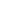
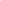

# CCAHCL: Multi-Level Hypergraph Contrastive Learning for Connected Component Awareness

<!-- Page 1 -->

CCAHCL: Multi-Level Hypergraph Contrastive Learning for

Connected Component Awareness

Zhuo Li1, Gengyu Lyu1, Yuena Lin1, Ziang Chen2, Zhiyuan Ma3, Zhen Yang1, Zun Li*4

1College of Computer Science, Beijing University of Technology 2Beijing-Dublin International College, Beijing University of Technology 3Department of Computer Science, University of Illinois Urbana-Champaign 4School of Information Science and Technology, Beijing University of Technology {zhuoli, ziangchen}@emails.bjut.edu.cn, lyugengyu@gmail.com, yuenalin@126.com, zm25@illinois.edu,

{yangzhen, zunli}@bjut.edu.cn

## Abstract

Hypergraph contrastive learning has emerged as a powerful unsupervised paradigm for hypergraph representation learning. Traditional hypergraph contrastive learning methods typically leverage neighbor aggregation strategy to obtain entity (node and hyperedge) representations within each connected component, and then utilize contrastive losses (e.g., node- or hyperedge-level) to update the encoders. However, since entities are usually focused equally on their respective losses, large connected components with numerous entities tend to provide a dominant contribution to the whole learning process, which inevitably hinders the effective learning of entity representations within small connected components. To address this issue, we propose a novel Connected- Component-Aware Hypergraph Contrastive Learning method (CCAHCL). Different from previous methods that only construct node or hyperedge representations, our method additionally constructs the connected component representations, and accordingly designs a hierarchical contrastive loss to balance the model’s focus on different scales of connected components. Specifically, we first use the traditional neighbor aggregation strategy to aggregate and update entity (node and hyperedge) representations. Then, these entity representations are further aggregated to generate the connected component representations, where entity features are incorporated into connected components and their structural information is propagated back to enrich their corresponding entities. Afterwards, we employ node-level and hyperedge-level losses to learn the enriched entity representations, and further propose a novel connected-component-level contrastive loss to balance the model’s focus on all different connected components, naturally alleviating the learning bias on large connected components. Extensive experiments on various datasets demonstrate that our proposed model achieves superior performance against other state-of-the-art methods.

Code — https://github.com/zhuoliyun/CCAHCL

## Introduction

Graphs have broad applications in various domains (Fu et al. 2025; Huang et al. 2025). However, in many complex sys-

*Corresponding author. Copyright © 2026, Association for the Advancement of Artificial Intelligence (www.aaai.org). All rights reserved.

**Figure 1.** Neighbor aggregation strategy naturally incorporates the structural information of the connected components into corresponding entity representations. Since entities are usually focused equally on their respective losses, large connected components with numerous entities tend to provide a dominant contribution to the whole learning process.

tems and real-world applications, interactions between entities often extend beyond pairwise relationships, forming more complex higher-order relationships that graphs struggle to capture effectively. As an extension of graphs, hypergraphs naturally overcome the limitation by modeling complex higher-order relationships and emerge as a powerful tool. Recently, hypergraphs have gained more attention in various domains, including recommendation systems (Xia, Huang, and Zhang 2022; Zhang et al. 2024), cross-modal retrieval (Li et al. 2024), sociological analysis (Sun et al. 2023), and traffic flow prediction (Zhao et al. 2023). Early studies on hypergraphs (Cai et al. 2022; Kim et al. 2024) mainly focused on exploring effective hypergraph encoders, such as HGNN (Feng et al. 2019), AllSet (Chien et al. 2022), and UniGNN (Huang and Yang 2021). Most of them adopted a two-stage neighbor aggregation strategy, aggregating information from nodes to hyperedges and then from hyperedges back to nodes. However, as most of these methods are trained in a (semi-) supervised way, their reliance on labeled data easily overfits and is hard to generalize, naturally limiting the applications. Therefore, selfsupervised learning (Liu et al. 2023; Li, Jing, and Tong

The Fortieth AAAI Conference on Artificial Intelligence (AAAI-26)

23355

AI-readable visual equivalent, added: Figure extracted from the paper PDF and converted to an SVG wrapper asset. Use the surrounding page text and caption for interpretation.

<!-- Page 2 -->

2022) has gained widespread attention, and Hypergraph Contrastive Learning (HCL) has emerged as a particularly prominent area in this field. Most HCL methods first generate two augmented views and utilize the above aggregation strategy to encode these views. Then, the contrastive losses such as node-level and hyperedge-level losses are employed to update the encoder by maximizing consistency between the two augmented views, thereby generating expressive entity (node and hyperedge) representations. During the learning process, these HCL methods typically leverage the neighbor aggregation strategy to aggregate and update the entity representations, naturally incorporating the structural information of the connected components into their corresponding entities, which is shown in Figure 1. However, since these entities are usually focused equally on their respective losses (e.g., node-level and hyperedge-level contrastive losses), large connected components with numerous entities naturally provide a dominant contribution to the whole learning process, which inevitably hinders the effective learning of entity representations within small connected components, thereby generating less expressive entity representations.

To address the issue, we propose a novel Connected- Component-Aware Hypergraph Contrastive Learning framework (CCAHCL). Different from previous HCL methods that only construct the node or hyperedge representations, our method additionally constructs the representations of connected components, and accordingly designs a hierarchical contrastive loss to balance the model’s focus on differentscale connected components. Specifically, on one hand, we first use the traditional neighbor aggregation strategy to aggregate and update entity representations. Then, these representations are further aggregated to generate the representations of connected components, where entity features are incorporated into the connected components and their structural information is propagated back to enrich their corresponding hyperedge representations. Finally, these enriched hyperedge representations are propagated back to nodes, thereby obtaining more expressive representations at the node, hyperedge, and connected component levels. On the other hand, we employ the node-level and hyperedge-level contrastive losses to effectively learn enriched entity representations. Additionally, we introduce a novel connected component-level contrastive loss to balance the model’s focus on all different connected components, naturally alleviating the learning bias on the large connected components. Extensive experiments on six widely used datasets demonstrate the effectiveness of CCAHCL, which achieves excellent performance compared with state-of-the-art methods.

• We propose a novel Connected-Component-Aware Hypergraph Contrastive Learning framework (CCAHCL), which balances the model’s focus on different scales of connected components and further reduces the learning bias on large connected components.

• Different from previous methods that only construct node or hyperedge representations, we additionally construct connected component representations, and accordingly design a hierarchical contrastive loss to effectively learn the entity representations as well as the structural information within all connected components, thereby obtaining more expressive entity representations. • Extensive experiments on multiple widely used hypergraph datasets demonstrate that our proposed model achieves excellent performance for downstream tasks, and outperforms the existing state-of-the-art methods.

## Related Work

Hypergraph Neural Networks

Hypergraphs have gained significant attention recently due to their ability to model higher-order relationships within complex data. HGNN (Feng et al. 2019) first introduced the concept of the hypergraph neural network, which employs truncated Chebyshev polynomials to efficiently approximate the hypergraph Laplacian, thereby extending convolutional operations from graph to hypergraph. HyperGCN (Yadati et al. 2019) utilized a mediated hypergraph Laplacian to transform the hypergraph into an approximate graph structure for convolution, avoiding the complexity of clique expansion. HyperConv (Bai, Zhang, and Torr 2021) integrated attention mechanisms with hypergraph convolution. Most of the early works typically redefine hypergraph message aggregation strategies based on the clique expansion, which may cause structural distortion of hypergraphs. On the other hand, some works explored directly leveraging the hypergraph structure for convolution, explicitly dividing message passing into two stages: hyperedge aggregates features from nodes, then propagates the information back to nodes. UniGCN (Huang and Yang 2021) utilized this message passing mechanism and further proposed a unified framework for both graphs and hypergraphs. AllSet (Chien et al. 2022) further generated hypergraph neural network layers as compositions of two multiset functions. These works lay a solid foundation for hypergraph contrastive learning.

Hypergraph Contrastive Learning

Early hypergraph representation learning methods are primarily trained in a (semi-)supervised way. However, their reliance on labels often tends to limit their generalization ability in some cases. Therefore, hypergraph contrastive learning has gained widespread attention recently. H-GCL (Zhu et al. 2023) augmented the views from both the graph and the hypergraph, followed the HyperGCN’s encoding method, and then introduced diffusion models to exchange information between views. TriCL (Lee and Shin 2023) encoded the hypergraph using the two-stage message passing, then updated the model by node-level, hyperedge-level, and nodehyperedge-level losses. CHGNN (Song et al. 2024) considered hyperedge homogeneity to fuse information effectively, while MMACL (Lee and Chae 2024) mixed the pairwise relationships from the graph and the higher-order relationships from the hypergraph. CCL (Wu et al. 2024) proposed collaborative contrastive learning to incorporate the information from graph into hypergraph, thereby obtaining expressive representations. Most of these methods leverage a neighbor aggregation strategy to obtain entity representations and

23356

<!-- Page 3 -->

**Figure 2.** Overview of our method. First, our model generates two semantically similar augmented views by randomly augmenting the multiple incidence matrices and node features from the hypergraph H. Then, we propose a Connected-Component- Aware encoder to generate the node, hyperedge, and connected component representations P(l), Q(l), and R(l) in l-th layer. After passing their representations into the projection heads, we integrate hyperedge information into node representations, and further leverage node-level, hyperedge-level, and connected-component-level contrastive losses to update the model.

then utilize losses to update the encoders. However, since entities are usually focused equally on their respective losses, large connected components with numerous entities naturally provide a dominant contribution to the whole learning process, which inevitably hinders the effective learning of entity representations within small connected components.

The Proposed Method

In this section, we comprehensively elaborate on our proposed CCAHCL. As illustrated in Figure 2, we first augment the hypergraph to generate two augmented views. Subsequently, these augmented views are encoded by our proposed Connected-Component-Aware encoder, further obtaining the representations of nodes, hyperedges, and connected components, respectively. Finally, we leverage a hierarchical contrastive loss to update the model. The CCAHCL is detailed in the following subsections.

Notation and Preliminaries

A general hypergraph is represented as H = (V, E, X), where V = {v1, v2,..., v|V |} denotes the set of nodes, and E = {e1, e2,..., e|E|} denotes the set of hyperedges. Each node vi ∈V is associated with a d-dimensional feature vector xi, forming the node feature matrix X ∈R|V |×d. Accordingly, we construct the connected components as C = {c1, c2,..., c|C|}. To adequately capture the intricate relationships among the nodes, hyperedges, and connected components, we introduce three fundamental incidence matrices along with their related degree matrices:

(1) HV E ∈{0, 1}|V |×|E| is represented as the nodehyperedge incidence matrix, where HV E(i, j) = 1 if the node vi belongs to the hyperedge ej. Then, we define two diagonal matrices: the node degree matrix DV ∈R|V |×|V |, which represents the number of hyperedges incident to the nodes and the hyperedge degree matrix DE ∈R|E|×|E| indicates the number of nodes contained in the hyperedges.

(2) The hyperedge-connected-component incidence matrix is HEC ∈{0, 1}|E|×|C|, where HEC(j, k) = 1 if the hyperedge ej belongs to the connected component ck. Then, we define the diagonal matrix DEC ∈R|C|×|C|, indicating the number of hyperedges contained in each connected component and the diagonal matrix DCE ∈R|E|×|E|, which represents the number of connected components incident to the hyperedges.

(3) The node-connected-component incidence matrix is HV C ∈{0, 1}|V |×|C|, where HV C(i, k) = 1 if the node vi belongs to the connected component ck. We define a corresponding diagonal matrix DV C ∈R|C|×|C|, indicating the number of nodes contained in each connected component.

Hypergraph Augmentation

We utilize H = (HV E, HV C, HEC, X) to represent the hypergraph, and then leverage random masking for both the node features and the incidence matrices to generate two

23357

AI-readable visual equivalent, added: Figure extracted from the paper PDF and converted to an SVG wrapper asset. Use the surrounding page text and caption for interpretation.

<!-- Page 4 -->

augmented hypergraphs. For node feature masking, we do not generate masks for each node’s feature independently. Instead, motivated by the previous research (Lee and Shin 2023), our model generates a shared feature mask using the Bernoulli distribution and applies it to all nodes, which has been shown to achieve excellent results. For the incidence matrices HV E, HV C, and HEC, we similarly employ the Bernoulli distribution to randomly mask their internal membership connections. Different from the node feature masking, where a shared mask is applied, we leverage the masking operation for each membership connection independently. Finally, the generated two augmented hypergraphs H1 = (HV E1, HV C1, HEC1, X1) and H2 = (HV E2, HV C2, HEC2, X2) are formed for the subsequent hypergraph encoder.

Connected-Component-Aware Encoder

Traditional hypergraph encoders (Huang and Yang 2021) typically follow the two-stage neighbor aggregation strategy, aggregating information from the nodes to hyperedges and then from the hyperedges back to nodes. However, although the aggregation process naturally incorporates the structural information of connected components into their entities (node and hyperedge), these hypergraph encoders tend to focus more on the structural information within the large ones, which contain numerous entities, leading to inadequate perception and poorly learned structural information in the small ones. To overcome the issue, we extend the two-stage neighbor aggregation strategy by proposing a connected-component-aware encoder, which additionally constructs the connected component representations to capture the structural information within different scales of the connected components, and further propagates the information back to enrich their corresponding entities, thereby obtaining more expressive entity representations within all connected components. Specifically, the encoder receives the augmented hypergraph Ha (a=1, 2) as input, and the encoding process can be summarized as follows: (1) We obtain the hyperedge representations Q′ by aggregating information from the node representations. (2) We further aggregate the node and hyperedge representations to generate their corresponding representations of connected components R. (3) The structural information of connected components is propagated back to the corresponding hyperedges, and then combined with Q′ to obtain the final hyperedge representations Q. (4) The information of the hyperedge representations is propagated back to update the node representations P.

The first stage follows existing methods, aggregating the node representations to generate Q′. For the l-th encoding layer, the update process for the first stage is defined as:

Q′(l) = σ

D−1

E HT

V EP(l−1)Θ(l)

E + b(l)

E

, (1)

where Θ(l)

E is a trainable weight and b(l)

E is a trainable bias. For the first layer (l=1), the input P(0) is the feature matrix X, and σ denotes the PReLU activation function. To comprehensively capture the structural information within connected components, we construct the representations of connected components by incorporating weighted information from their constituent nodes and hyperedges. Therefore, the second aggregation stage is defined as follows:

R(l) = σ

(1 −αc)D−1

ECHT

ECQ′(l)Θ(l)

EC

+ αcD−1

V CHT

V CP(l−1)Θ(l)

V C + b(l)

C

,

(2)

where Θ(l)

EC and Θ(l)

V C are the training weights, b(l)

C is the training bias and αc is the adaptive weight.

After obtaining the connected component representations, we propagate their structural information back to associated hyperedges, aiming to enrich these hyperedge representations and further enhance their expressiveness. Therefore, the third stage of the encoding process is formulated as:

Q(l) = w1Q′(l) + w2σ

D−1

CEHECR(l)Θ(l)

CE + b(l)

CE

, (3) where w1 and w2 are the weights. The Θ(l)

CE is the trainable weight and b(l)

CE is the trainable bias. Finally, the enriched hyperedge representations infused with the structural information of connected components are propagated back to the nodes, and the last stage is defined as follows:

P(l) = σ

D−1

V HV EQ(l)Θ(l)

V + b(l)

V

, (4)

where Θ(l)

V is the trainable weight and b(l)

V is the trainable bias. Finally, our proposed connected-component-aware encoder generates the node, hyperedge, and connected component representations P(l), Q(l), and R(l), respectively. These representations are then passed to their corresponding projection heads and subsequently used for our proposed hierarchical contrastive loss.

Projection Head It has been demonstrated that including a non-linear transformation called projection heads which map representations into a latent space where contrastive loss is applied, helps to improve the quality of representations (Chen et al. 2020; Lee and Shin 2023; Song et al. 2024). Therefore, in this paper, we utilize the projection heads to map the P(l), Q(l), and R(l), obtaining the node, hyperedge, and connected component representations Za v, Za e, and Za c, respectively, where a = 1, 2 for the two augmented views. All the projection heads are implemented with a two-layer MLP and ELU activation function.

Hierarchical Contrastive Loss Existing hypergraph contrastive learning methods (Lee and Shin 2023; Lee and Chae 2024) typically use node-level or hyperedge-level loss to update the model, aiming to fully capture the entity (node and hyperedge) information. However, since the entities are usually focused equally on their respective losses, the large connected components with numerous entities naturally provide a dominant contribution to the whole learning process, inevitably hindering the effective learning of entity representations within the small

23358

<!-- Page 5 -->

connected components. To address the challenge of learning bias within different scales of the connected components, we design a hierarchical contrastive loss that contains the node-level, hyperedge-level, and connected-componentlevel losses, aiming to effectively learn the information of these entities as well as the structural information within each connected component, thereby obtaining more expressive entity representations. These contrastive losses introduced by our model are described below.

Node-level loss Many studies (Lee and Shin 2023; Song et al. 2024) demonstrate that the node and hyperedge representations Zv and Ze capture different but complementary feature information within the hypergraph. Therefore, we design a node-level loss to simultaneously maximize both intra-node consistency and node-hyperedge consistency across the two augmented views, allowing the model to learn the associations between nodes, and between nodes and hyperedges. First, we leverage the corresponding hyperedge representations zej to enhance the node representations zvi, and the enhancement process is designed as follows:

z∗ vi = βzvi + (1 −β) 1 dv(vi)

X ej:vi∈ej zej, (5)

where β is a hyperparameter and dv(vi) is the degree of vi. Then, we employ InfoNCE loss (Oord, Li, and Vinyals 2018) to construct our losses. For any node vi, its corresponding enhanced representation z∗1 vi from the first augmented view is set as the anchor. Then we treat the representation z∗2 vi from the second augmented view as a positive sample, while the other enhanced representations from the second view z∗2 vm, where m̸ = i as the negative samples. Therefore, the loss for each positive node pair is defined as:

ℓv(z∗1 vi, z∗2 vi, τv) = −log es(z∗1 vi,z∗2 vi)/τv P|V | m=1 es(z∗1 vi,z∗2 vm)/τv, (6)

where τv is a temperature parameter and s(·) denotes the cosine similarity function. In practice, we symmetrize this loss by setting the node representation of the second view as the anchor. Therefore, our node-level loss is defined as:

Lv = 1 2|V |

|V | X i=1 ℓv(z∗1 vi, z∗2 vi, τv) + ℓv(z∗2 vi, z∗1 vi, τv)

. (7)

Hyperedge-level loss We further introduce a hyperedgelevel loss to maximize the consistency for hyperedges across two augmented views, thereby promoting the model to capture more sufficient entity information. Similar to node-level loss, for the two hyperedge representations z1 ej and z2 em in different views, we treat them as positive samples if m = j; Otherwise, they are treated as negative samples. The loss for each positive hyperedge pair is defined as:

ℓe(z1 ej, z2 ej, τe) = −log e s(z1 ej,z2 ej)/τe P|E| m=1 e s(z1 ej,z2 em)/τe, (8)

where τe is a temperature parameter, and our hyperedgelevel contrastive loss is defined as:

Le = 1 2|E|

|E| X j=1 ℓe(z1 ej, z2 ej, τe) + ℓe(z2 ej, z1 ej, τe)

. (9)

Connected-Component-level loss This loss is designed to overcome the learning bias of structural information on different-scale connected components and further obtain more expressive entity representations. Specifically, we leverage the connected-component-level loss to maximize the consistency for connected components across two augmented views, enabling the encoder to effectively capture the structural information within each connected component. For the two connected component representations z1 ck and z2 cm in different augmented views, we consider them as positive samples if m = k; Otherwise, they are treated as negative samples. In this process, the different scales of the connected components are assigned equal weight, naturally promoting the model to balance the focus on different-scale connected components. Then, the loss for each positive connected component pair is defined as follows:

ℓc(z1 ck, z2 ck, τc) = −log es(z1 ck,z2 ck)/τc P|C| m=1 es(z1 ck,z2 cm)/τc, (10)

where τc is a temperature parameter and the final connectedcomponent-level loss is defined as:

Lc = 1 2|C|

|C| X k=1 ℓc(z1 ck, z2 ck, τc) + ℓc(z2 ck, z1 ck, τc)

. (11)

The connected-component-level loss enables the model to directly perceive and learn the structural information within different scales of connected components during learning the entity representations, naturally reducing the learning bias of structural information within the large connected components. Furthermore, after the structural information is updated within each connected component, it is further propagated back to the corresponding entity representations in the subsequent encoding process, naturally obtaining more expressive entity representations. Finally, we define the hierarchical loss as the weighted sum of the above losses:

L = Lv + ωeLe + ωcLc, (12)

where ωe and ωc are the weights of Le and Lc, respectively.

## Experiments

## Experimental Setup

Datasets We conduct the experiments on six widely used datasets from three categories, including: (1) Co-citation datasets [Cora-C, Citeseer, and Pubmed] (Sen et al. 2008). (2) Co-authorship datasets [Cora-A] (Lee and Shin 2023) and [DBLP] (Rossi and Ahmed 2015). (3) Computer vision and graphics dataset [ModelNet40] (Wu et al. 2015).

Baselines We evaluate our proposed method CCAHCL on two classical tasks (Node Classification and Clustering), and we compare its performance against the following baselines: GCN (Kipf and Welling 2017), DGI (Veliˇckovi´c et al. 2019), HGNN (Feng et al. 2019), GRACE (Zhu et al. 2020), UniGCN (Huang and Yang 2021), Hyper- Conv (Bai, Zhang, and Torr 2021), AllSet (Chien et al. 2022), TriCL (Lee and Shin 2023), MMACL (Lee and Chae

23359

<!-- Page 6 -->

Dataset Cora-C Citeseer Cora-A Pubmed DBLP ModelNet40 A.R.

GCN 77.11 ± 1.8 66.07 ± 2.4 73.66 ± 1.3 82.63 ± 0.6 87.58 ± 0.2 91.67 ± 0.2 9.5 DGI 78.17 ± 1.4 68.81 ± 1.8 76.94 ± 1.1 80.83 ± 0.6 88.00 ± 0.2 92.18 ± 0.2 7.3 HGNN 77.50 ± 1.8 66.16 ± 2.3 74.38 ± 1.2 83.52 ± 0.7 88.32 ± 0.3 92.23 ± 0.2 7.5 UniGCN 77.91 ± 1.9 66.40 ± 1.9 77.30 ± 1.4 84.08 ± 0.7 90.31 ± 0.2 94.62 ± 0.2 5.5 GRACE 79.11 ± 1.7 68.65 ± 1.7 76.59 ± 1.0 80.08 ± 0.7 89.03 ± 0.4 90.68 ± 0.3 7.6 HyperConv 76.19 ± 2.1 64.12 ± 2.6 73.52 ± 1.0 83.42 ± 0.6 88.83 ± 0.2 91.84 ± 0.1 9.0 AllSet 76.21 ± 1.7 67.83 ± 1.8 76.94 ± 1.3 82.85 ± 0.9 90.07 ± 0.3 96.85 ± 0.2 6.3 TriCL 81.57 ± 1.1 72.02 ± 1.2 82.15 ± 0.9 84.26 ± 0.6 91.12 ± 0.1 97.08 ± 0.1 2.5 MMACL 81.02 ± 1.1 72.51 ± 1.3 81.74 ± 1.0 83.20 ± 0.5 OOM 96.41 ± 0.2 4.2 CHGNN 80.42 ± 1.2 72.98 ± 1.4 82.57 ± 0.8 84.11 ± 0.6 OOM 96.26 ± 0.1 3.2

CCAHCL 83.51 ± 0.9 73.84 ± 1.1 84.06 ± 1.0 84.86 ± 0.6 91.40 ± 0.1 97.63 ± 0.1 1.0

**Table 1.** Comparison results of node classification accuracy. For each dataset, the best and second-best performances are highlighted in bold and underlined, respectively. The A.R. column ranks the methods based on their average performance across all six employed datasets. And the OOM denotes out of memory on a 24GB GPU.

## Method

Cora-C Citeseer Cora-A Pubmed DBLP ModelNet40 A.R. NMI F1 NMI F1 NMI F1 NMI F1 NMI F1 NMI F1

DGI 54.8 60.1 40.1 51.7 45.2 52.5 30.4 53.0 58.0 57.7 79.6 61.7 4.1 GRACE 44.4 45.6 33.3 45.7 37.9 43.3 16.7 41.9 53.6 49.8 79.4 59.9 6.1 HyperConv 43.3 45.0 41.1 50.6 36.4 38.7 28.7 52.5 54.8 54.0 91.0 90.2 5.3 TriCL 54.5 60.6 44.1 57.4 49.8 56.7 30.0 51.7 63.1 63.0 95.6 94.7 2.6 MMACL 54.9 58.6 45.4 56.5 49.4 50.1 26.4 50.2 OOM OOM 95.4 95.1 3.5 CHGNN 55.6 53.3 46.7 52.0 47.6 44.6 34.9 56.3 OOM OOM 87.5 79.6 3.5

CCAHCL 58.8 62.1 47.1 56.7 50.5 56.4 31.6 56.8 63.9 63.6 95.7 94.8 1.3

**Table 2.** The evaluation of the node representations learned by our proposed methods using K-means clustering. Larger NMI and F1 indicate better performance, and A.R. denotes the average ranking.

2024), and CHGNN (Song et al. 2024). For graph representation learning methods, we convert hypergraph into graph structure using clique expansion and then apply these methods for comparisons. The experiments are conducted on a NVIDIA GeForce RTX 3090 GPU with 24GB of memory.

Performance on Node Classification

In this section, we utilize the node classification task to evaluate the node representations learned by our proposed model. For this task, we follow a standard linear evaluation protocol (Veliˇckovi´c et al. 2019): the encoder is first trained in an unsupervised manner to obtain the node representations. Then, the trained model is frozen, and a linear classifier is trained on these node representations. For all datasets, we follow the 10%, 10%, and 80% splits for the training, validation, and testing sets, respectively, and then report the average results in 10 independent experiments. All the experimental results are shown in Table 1.

**Table 1.** reports that our proposed CCAHCL achieves excellent performance across the six widely used datasets. Firstly, our proposed method significantly outperforms traditional graph representation learning methods (e.g., GCN and DGI). These graph methods require the conversion of hypergraphs into graph structures (e.g., via clique expansion),

which may cause structural distortion of the hypergraphs, thereby limiting the performance of these methods.

Furthermore, CCAHCL notably outperforms the existing hypergraph representation learning methods from both the unsupervised and the semi-supervised paradigms. For example, compared with TriCL (Lee and Shin 2023), the bestperforming unsupervised method, we achieve significant improvements consistently (e.g., 1.94% on Cora-C, 1.82% on Citeseer). Moreover, we also surpass the semi-supervised approaches like CHGNN (Song et al. 2024) across most datasets. These excellent performances show that our proposed Connected-Component-Aware encoder and hierarchical loss enable the model to effectively learn the structural information from different-scale connected components and further generate more expressive representations.

Performance on Clustering

To better demonstrate the performance of our model, we assess the quality of representations using the k-means clustering by operating it on the frozen node representation. Specifically, we employ the local Lloyd algorithm and adopt the evaluation metrics: Normalized Mutual Information (NMI) and Pairwise F1 Score to quantify the consistency between the clustering results and the true labels.

23360

<!-- Page 7 -->

Lv Le Lc Cora-C Citeseer Cora-A Pubmed DBLP ModelNet40

✓ - - 82.10 ± 1.0 73.25 ± 1.1 83.70 ± 0.9 84.20 ± 0.9 91.27 ± 0.1 97.43 ± 0.1 - ✓ - 79.32 ± 1.9 70.41 ± 1.7 77.46 ± 1.9 82.93 ± 0.7 86.83 ± 0.2 97.12 ± 0.1 - - ✓ 64.40 ± 3.0 67.57 ± 2.2 75.56 ± 2.1 80.78 ± 1.0 82.87 ± 0.2 96.96 ± 0.1 ✓ ✓ - 83.08 ± 1.0 73.60 ± 1.0 83.91 ± 0.8 84.73 ± 0.8 91.35 ± 0.1 97.57 ± 0.1 ✓ - ✓ 82.36 ± 0.8 73.72 ± 1.1 83.74 ± 0.8 84.35 ± 0.9 91.29 ± 0.1 97.53 ± 0.1 - ✓ ✓ 79.97 ± 2.0 70.80 ± 1.3 78.03 ± 2.0 82.95 ± 0.7 87.71 ± 0.1 97.13 ± 0.1 ✓ ✓ ✓ 83.51 ± 0.9 73.84 ± 1.1 84.06 ± 1.0 84.86 ± 0.6 91.40 ± 0.1 97.63 ± 0.1

**Table 3.** The node classification accuracy across various datasets, evaluating different combinations of our proposed contrastive losses: Lv (node-level), Le (hyperedge-level), and Lc (connected component-level).

(a) TriCL’s visualization results.

(b) CCAHCL’s visualization results.

**Figure 3.** Visualization of node classification on connected components, and black nodes indicate the correctly classified nodes while red nodes indicate the misclassified nodes. (a) presents that TriCL leads to considerable misclassified nodes in small connected components. (b) shows that CC- AHCL achieves excellent performance in small ones.

**Table 2.** presents the clustering performance of our model. To ensure the robustness of the results, we conduct five independent experiments and report their average as the outcomes. The results show that our model achieves superior clustering performance in most datasets (e.g., 58.8 NMI and 62.1 F1 in Cora-C), surpassing existing baseline methods in two metrics. Although CCAHCL does not achieve absolute top pairwise F1 performance in some datasets, its scores remain highly competitive and close to the best.

Visualization Results on Connected Components To visually demonstrate the effectiveness of CCAHCL in addressing the issue of effectively learning entities in small connected components, Figure 3 provides a comparative vi- sualization of the node classification performance on the Cora-C dataset between our proposed method CCAHCL and the classical hypergraph contrastive learning method TriCL (Lee and Shin 2023). As illustrated in (a), TriCL exhibits insufficient learning for the nodes within the small connected components. This is evidenced by a number of misclassified nodes in these connected components, showing the limitations of traditional approaches when handling the entity within small connected components. In contrast, (b) reveals fewer misclassified nodes within the small connected components, indicating that our method successfully overcomes the learning bias and obtains more expressive node representations within the small ones.

Ablation Study To conduct a comprehensive study of CCAHCL, we perform ablation studies on our proposed three loss functions. Table 3 presents that the Lv alone establishes a strong performance across datasets (e.g., 82.10% on Cora-C), both Le and Lc exhibit comparatively lower individual performance. Moreover, we observe that integrating other losses within Lv consistently enhances the accuracy, and the joint application of all three losses achieves the highest node classification accuracy across all datasets (e.g., 83.51% on Cora-C, 73.84% on Citeseer). The node classification demonstrates that our proposed hierarchical contrastive loss effectively learn the entity (node and hyperedge) representations as well as the structural information within all connected components, thereby obtaining more expressive entity representations. indicates that the simultaneous application of these three loss functions achieves the best performance.

## Conclusion

In this paper, we propose a Connected-Component-Aware Hypergraph Contrastive Learning method CCAHCL. Different from previous methods that only construct node or hyperedge representations, our method additionally constructs the representations of connected components, and accordingly designs a hierarchical contrastive loss to effectively learn the entity representations as well as balance the model’s focus on different scales of connected components, naturally avoiding the learning bias on the large connected components. Extensive experiments on various datasets demonstrate that our proposed model achieves superior performance against other state-of-the-art methods.

23361

AI-readable visual equivalent, added: Figure extracted from the paper PDF and converted to an SVG wrapper asset. Use the surrounding page text and caption for interpretation.

AI-readable visual equivalent, added: Figure extracted from the paper PDF and converted to an SVG wrapper asset. Use the surrounding page text and caption for interpretation.

<!-- Page 8 -->

## Acknowledgements

This work was supported by the National Key Research and Development Program of China (No. 2023YFB3107100), National Natural Science Foundation of China (No. 62306020), Beijing Natural Science Foundation (No. L244009), the Central Guidance for Local Scientific and Technological Development Fund (No.2024ZY0124), and the Young Elite Scientist Sponsorship Program by BAST (BYESS2024199).

## References

Bai, S.; Zhang, F.; and Torr, P. H. 2021. Hypergraph convolution and hypergraph attention. Pattern Recognition, 110: 107637. Cai, D.; Song, M.; Sun, C.; Zhang, B.; Hong, S.; and Li, H. 2022. Hypergraph Structure Learning for Hypergraph Neural Networks. In International Joint Conference on Artificial Intelligence, 1923–1929. Chen, T.; Kornblith, S.; Norouzi, M.; and Hinton, G. 2020. A Simple Framework for Contrastive Learning of Visual Representations. In International Conference on Machine Learning, 1597–1607. Chien, E.; Pan, C.; Peng, J.; and Milenkovic, O. 2022. You are AllSet: A Multiset Function Framework for Hypergraph Neural Networks. In International Conference on Learning Representations, 1–24. Feng, Y.; You, H.; Zhang, Z.; Ji, R.; and Gao, Y. 2019. Hypergraph neural networks. In AAAI conference on artificial intelligence, 3558–3565. Fu, L.; Deng, B.; Huang, S.; Liao, T.; Zhang, C.; and Chen, C. 2025. Learn from Global Rather Than Local: Consistent Context-Aware Representation Learning for Multi-View Graph Clustering. In International Joint Conference on Artificial Intelligence, 5145–5153. Huang, J.; and Yang, J. 2021. UniGNN: a Unified Framework for Graph and Hypergraph Neural Networks. In International Joint Conference on Artificial Intelligence, 2563– 2569. Huang, S.; Fu, L.; Zhuang, S.; Qiu, Y.; Huang, B.; Cui, Z.; and Zhang, T. 2025. Going Beyond Consistency: Targetoriented Multi-view Graph Neural Network. In International Joint Conference on Artificial Intelligence, 5426– 5434. Kim, S.; Lee, S. Y.; Gao, Y.; Antelmi, A.; Polato, M.; and Shin, K. 2024. A survey on hypergraph neural networks: an in-depth and step-by-step guide. In ACM SIGKDD Conference on Knowledge Discovery and Data Mining, 6534– 6544. Kipf, T. N.; and Welling, M. 2017. Semi-Supervised Classification with Graph Convolutional Networks. In International Conference on Learning Representations, 1–14. Lee, D.; and Shin, K. 2023. I’m me, we’re us, and i’m us: Tri-directional contrastive learning on hypergraphs. In AAAI conference on artificial intelligence, 8456–8464. Lee, J.; and Chae, D.-K. 2024. Multi-view Mixed Attention for Contrastive Learning on Hypergraphs. In ACM SIGIR

Conference on Research and Development in Information Retrieval, 2543–2547. Li, B.; Jing, B.; and Tong, H. 2022. Graph Communal Contrastive Learning. In ACM Web Conference, 1203—-1213. Li, M.; Zhou, S.; Chen, Y.; Huang, C.; and Jiang, Y. 2024. EduCross: Dual adversarial bipartite hypergraph learning for cross-modal retrieval in multimodal educational slides. Information Fusion, 109: 102428. Liu, Y.; Jin, M.; Pan, S.; Zhou, C.; Zheng, Y.; Xia, F.; and Yu, P. S. 2023. Graph Self-Supervised Learning: A Survey. IEEE Transactions on Knowledge & Data Engineering, 35(06): 5879–5900. Oord, A. v. d.; Li, Y.; and Vinyals, O. 2018. Representation learning with contrastive predictive coding. arXiv preprint arXiv:1807.03748. Rossi, R.; and Ahmed, N. 2015. The network data repository with interactive graph analytics and visualization. In AAAI conference on artificial intelligence, 1–2. Sen, P.; Namata, G.; Bilgic, M.; Getoor, L.; Galligher, B.; and Eliassi-Rad, T. 2008. Collective classification in network data. AI magazine, 29(3): 93–93. Song, Y.; Gu, Y.; Li, T.; Qi, J.; Liu, Z.; Jensen, C. S.; and Yu, G. 2024. CHGNN: a semi-supervised contrastive hypergraph learning network. IEEE Transactions on Knowledge and Data Engineering, 36(9). Sun, X.; Cheng, H.; Liu, B.; Li, J.; Chen, H.; Xu, G.; and Yin, H. 2023. Self-supervised hypergraph representation learning for sociological analysis. IEEE Transactions on Knowledge and Data Engineering, 35(11): 11860–11871. Veliˇckovi´c, P.; Fedus, W.; Hamilton, W. L.; Li`o, P.; Bengio, Y.; and Hjelm, R. D. 2019. Deep Graph Infomax. In International Conference on Learning Representations, 1–17. Wu, H.; Li, N.; Zhang, J.; Chen, S.; Ng, M. K.; and Long, J. 2024. Collaborative contrastive learning for hypergraph node classification. Pattern Recognition, 146: 109995. Wu, Z.; Song, S.; Khosla, A.; Yu, F.; Zhang, L.; Tang, X.; and Xiao, J. 2015. 3d shapenets: A deep representation for volumetric shapes. In IEEE conference on computer vision and pattern recognition, 1912–1920. Xia, L.; Huang, C.; and Zhang, C. 2022. Self-supervised hypergraph transformer for recommender systems. In ACM SIGKDD conference on Knowledge Discovery and Data Mining, 2100–2109. Yadati, N.; Nimishakavi, M.; Yadav, P.; Nitin, V.; Louis, A.; and Talukdar, P. 2019. Hypergcn: A new method for training graph convolutional networks on hypergraphs. In Advances in Neural Information Processing Systems, 1–12. Zhang, D.; Geng, Y.; Gong, W.; Qi, Z.; Chen, Z.; Tang, X.; Shan, Y.; Dong, Y.; and Tang, J. 2024. Recdcl: Dual contrastive learning for recommendation. In ACM Web Conference, 3655–3666. Zhao, Y.; Luo, X.; Ju, W.; Chen, C.; Hua, X.-S.; and Zhang, M. 2023. Dynamic hypergraph structure learning for traffic flow forecasting. In International Conference on Data Engineering, 2303–2316.

23362

<!-- Page 9 -->

Zhu, J.; Zeng, W.; Zhang, J.; Tang, J.; and Zhao, X. 2023. Cross-view graph contrastive learning with hypergraph. Information Fusion, 99: 101867. Zhu, Y.; Xu, Y.; Yu, F.; Liu, Q.; Wu, S.; and Wang, L. 2020. Deep Graph Contrastive Representation Learning. In ICML Workshop on Graph Representation Learning and Beyond.

23363
