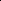

# Comprehensive Urban Region Representation Learning via Multi-View Joint Learning and Contrastive Learning

<!-- Page 1 -->

Comprehensive Urban Region Representation Learning via Multi-view Joint

Learning and Contrastive Learning

Yingde Lin1,2, Yuanbo Xu1,2*, Lu Jiang3, Pengyang Wang4

1College of Computer Science and Technology, Jilin University 2MIC Lab, College of Computer Science and Technology, Jilin University 3College of Computer Science and Technology, Dalian Maritime University 4Department of Computer and Information Science, University of Macau linyd24@mails.jlu.edu.cn, yuanbox@jlu.edu.cn, jiangl761@dlmu.edu.cn, pywang@um.edu.mo

## Abstract

Urban region embedding, which learns dense vector representations for urban zones, plays a foundational role in datadriven urban intelligence. These representations are critical for downstream applications like public safety management and infrastructure development, requiring nuanced understanding of urban functionality. A core challenge remains effective fusion of multi-view data (e.g., human mobility flows and static regional attributes) into unified zone representations. To this end, we propose MVJC, a Multi-view Joint Learning and Contrastive Learning framework, which employs: (1) Multi-view Joint Learning (MVJL) layer to model intra-view dependencies to extract view-specific features and (2) Multi-view Contrastive Learning (MVCL) layer to perform cross-region aggregation to derive consensus representations while capturing the regional complementarity. We further introduce a structure-aware contrastive loss that mitigates false negatives by aligning representations through region topology instead of instance identity. Extensive experiments on New York City datasets demonstrate MVJC’s superiority: it reduces crime prediction MAE by 9.1% (vs. 66.9 baseline) and improves land use clustering F-measure by 55.6% (vs. 0.45 baseline) over state-of-the-art method, which is attributed to MVJC’s synergy of joint and contrastive learning, yielding representations that are simultaneously predictive and semantically discriminative.

Code — https://github.com/MichistaLin/MVJC

## Introduction

Learning high-quality embeddings for urban regions is a critical task in urban computing. These embeddings distill complex, multi-view data to support downstream tasks like crime prediction (Yao et al. 2018) and land use clustering (Huang et al. 2018), which are essential for building smart cities.

## Methods

have evolved from single-view models (Wang and Li 2017; Yao et al. 2018) to multi-view (e.g., human mobility, POIs, building footprints) approaches (Zhang et al. 2021; Zheng, Yuan, and Guan 2022; Sun et al. 2024; Li et al. 2024). In practice, these heterogeneous data views are

*Corresponding author. Copyright © 2026, Association for the Advancement of Artificial Intelligence (www.aaai.org). All rights reserved.

rarely independent. For instance, the functional characteristics of a geographic area (e.g., commercial zones vs. residential zones, as defined by POIs) are a key determinant of its pedestrian flow dynamics, including peak times and overall patterns. Therefore, it is imperative to develop a framework that leverages the interdependence of these views for their mutual enhancement.

Most recently, contrastive learning has emerged as a powerful self-supervised paradigm for aligning representations from different views (Zhang et al. 2023b,a; Li et al. 2023, 2024). The standard objective, however, creates a fundamental conflict when applied to clustering. By strictly treating any two different regions as a negative pair, it erroneously forces the model to push apart representations of regions that, while distinct, share the same functional role (e.g., two residential zones), as illustrated in Figure 1. This critical“false negative” problem directly undermines the goal of functional clustering by penalizing the semantic similarity that the model is designed to capture (Yan et al. 2023).

To overcome these challenges, we propose the Multiview Joint learning and Contrastive learning (MVJC) framework, as shown in Figure 2. MVJC’s hierarchical architecture directly addresses these limitations in two stages. First, a Multi-view Joint Learning (MVJL) module refines each view’s features through cross-view interaction, creating enhanced view-specific embeddings. Then, a Multi-view Contrastive Learning (MVCL) module generates a consensus representation. It employs a structure-aware objective to mitigate the “false negative” problem by using learned structural relationships to align functionally similar regions, preventing their incorrect separation. This design yields robust and semantically discriminative urban region embeddings.

The main contributions of this paper are as follows: • We propose MVJC, a novel hierarchical framework that operates in two stages: it first refines view-specific embeddings via a Multi-view Joint Learning (MVJL) module to enhance their quality, and then generates a robust consensus representation using a global, structureaware Multi-view Contrastive Learning (MVCL) module. This design yields robust and comprehensive urban region embeddings that are resilient to noise and viewspecific distortions. • We apply the global and cross-view feature aggregation (GCFA) and structure-aware contrastive learning

The Fortieth AAAI Conference on Artificial Intelligence (AAAI-26)

15261

<!-- Page 2 -->

Residential Zones

Region a

Region b view1 view2 view1 view2

+

-

- bring closer strongly push apart

Residential Zones

Region a

Region b view1 view2 view1 view2

+

-

- bring closer weakly push apart strong structural relationship calculating structural relationship calculating structural relationship + positive sample

- negative sample anchor sample

(a)Typical contrastive learning (b)Structure-aware contrastive learning(ours)

**Figure 1.** (a) Typical contrastive learning usually considers different views of the same region as positive sample pairs, and views of different regions as negative sample pairs. (b) If two different regions actually belong to the same functional area, their representations should also be similar.

(SACL) module to the field of urban region representation learning for the first time, and effectively integrate it with the multi-view joint learning framework to replace the traditional per-view fusion. This module utilizes the structural information of the entire dataset to learn a consistent representation for each region, thereby effectively mitigating the impact of noisy views. • We conduct a comprehensive experimental validation on large-scale, real-world datasets from New York City. The results demonstrate that MVJC achieves new state-ofthe-art performance on multiple challenging urban prediction tasks, significantly outperforming a wide range of baseline methods.

## Preliminaries

Urban Region. A city can be partitioned into n disjoint urban regions by census blocks, denoted as R = {r1, r2,..., rn}. Human mobility. We define urban human mobility as a set of trip records that occur in urban areas. We denote a human mobility dataset as M and each entity in M is a tuple consisted of source and destination of the trip:

M = {m0, m1,..., m|M|}, mi = (rs, rd, t), ∀mi ∈M, where rs is the start region, rd is the destination region, and t is the trip start time. Region attributes. The region attributes are the inherent social and geographic features of urban regions. A certain type of attribute of regions can be denoted as A as follows:

A = {⃗a1,⃗a2,...,⃗an},⃗ai ∈RF, ∀⃗ai ∈A, where⃗ai is the corresponding feature of i-th region and F is the number of dimensions of that feature. In our work, multiple region attributes, like POIs and check-ins, are considered.

Region Representation Learning. Given the human mobility M of a set of regions R and attribute features A of regions, we aim to learn a set of low dimensional embedding E to represent each region: E = {e1, e2,..., en}, ei ∈Rd, where ei ∈E is the d-dimension embedding of the region ri ∈R and n is the number of regions.

## Methodology

Framework Overview

As shown in Figure 2, the MVJC framework comprises two modules: (1) the Multi-view Joint Learning (MVJL) module aims to refine and generate high-quality, view-specific representations; (2) the Multi-view Contrastive Learning (MVCL) module aggregates cross-region and cross-view features to learn a global consensus representation.

Multi-view Joint Learning

To learn robust representations, we jointly consider region correlations from multiple views, constructing graphs based on both human mobility and static region attributes (e.g., POIs, check-ins).

Region Correlations Based on Human Mobility Following the formulation in MGFN (Wu et al. 2022), we model raw human mobility data as a sequence of directed, weighted graphs over time. A single mobility graph at time interval t is defined as Gt = (V, Et), where V is the set of region nodes {v1,..., vn} corresponding to R. An edge et ij = (vi, vj, ωt ij) ∈Et represents the volume of flow ωt ij from region ri to region rj during interval t. The complete human mobility dataset is a time-series multi-graph, G = ST −1 t=0 Gt. Then the multi-graphs are processed by the encoder Multi-Graph Fusion Networks to obtain the initial human mobility view representation Emob.

15262

<!-- Page 3 -->

Graph Construction

Graph Embedding

MVJL MVCL

Fusion

Downstream Tasks

(b) Multi-View Joint Learning

Self Attention

Fusion

…

…

…

…

𝟏−𝜶 𝜶

Multi-view Data

(a) Multi-view Region Graph

(c) Multi-View Contrastive Learning

…

MLP

…

MLP

Cat

SACL

SACL

MLP GCFA … …

𝓩𝟏

𝓩𝐌

𝓩 ෡𝓩 ෢ 𝓗

(d) Global and Cross-view Feature Aggregation multi-graph

𝓖𝒑𝒐𝒊

𝓖𝒄𝒉𝒌

𝓖𝒔

𝓖𝒅

MVJL MVCL input input

𝓩

𝐐𝟏 𝐐𝟐 𝐑

𝐒

෡𝓩

𝐖𝐐𝟏 𝐖𝐐𝟐 𝐖𝐑

𝓗𝟏

𝓗𝐌

𝓔 ෡𝓔

෩𝓔

**Figure 2.** The framework of MVJC.

Region Correlations Based on Region Attributes The inherent region attributes are the meta-knowledge that describes the geographic and social nature of a region. Given a type of attributes of n regions A = {⃗ai}n i=1, the corresponding region correlations are computed as

Cij = sim(⃗ai,⃗aj), (1)

where sim(·) refers to cosine similarity. We compute regionto-region similarity matrices Cpoi and Cchk based on the cosine similarity of their respective TF-IDF feature vectors. From these matrices, we construct two graphs, Gpoi and Gchk. In each graph, every region node is connected to its k-nearest neighbors, forming a sparse graph that captures local attribute-based similarities.

From these similarity matrices, we construct sparse k-NN graphs (Gpoi, Gchk) for each attribute view. We then employ a standard Graph Attention Network (GAT) as an encoder to learn representations Epoi and Echk from these graphs.

Multi-View Interaction The interaction module (Figure 2(c)) achieves cross-view integration in two steps. It first employs a self-attention mechanism to propagate information among all view representations. A subsequent fusion layer then adaptively combines the resulting representations.

We employ the self-attention mechanism to propagate information across the representations of different views. Given the representations from M different views as {Ei ∈ Rn×d}M i=1. For each representation Ei, we associate a key matrix Ki ∈Rn×k and a query matrix Qi ∈Rn×k with it as follows:

Ki = EiWk, Qi = EiWq. (2)

For each view, we then propagate information among all views as follows:

[Ai]M i=1 = softmax

QiKT i √ k

M i=1

!

, ˆEi =

M X i=1

AiEi. (3)

In our case, ˆEi is considered as the relevant global information for i-th view. To incorporate this information in the learning process, we compute

E′ i = α ˆEi + (1 −α)Ei, 0 ≤α ≤1, (4)

where E′ i is the representation for i-th view with global information, and α is the weight of global information.

In order to make full use of the information of other views to strengthen the representation of its own view, we employ a fusion layer that learns adaptive weights for different views as follows:

E =

M X i wiEi, wi = σ(EiWf + bf), (5)

where wi is the weight of i-th view, which is learned by a single layer MLP network with the i-th embeddings as input. To ensure the adaptive weights in the fusion layer are properly learned, we incorporate the fused representation E back into each view-specific learning objective. Formally, we update the representation of each view as:

˜Ei = (ˆEi + E)/2. (6) We adopt this residual-like connection to balance viewspecificity and consensus, ensuring the final representation ˜Ei incorporates shared knowledge while retaining its uniquely enhanced characteristics. In this paper, the three views output are ˜Emob, ˜Epoi and ˜Echk, respectively.

15263

AI-readable visual equivalent, added: Figure extracted from the paper PDF and converted to an SVG wrapper asset. Use the surrounding page text and caption for interpretation.

AI-readable visual equivalent, added: Figure extracted from the paper PDF and converted to an SVG wrapper asset. Use the surrounding page text and caption for interpretation.

AI-readable visual equivalent, added: Figure extracted from the paper PDF and converted to an SVG wrapper asset. Use the surrounding page text and caption for interpretation.

AI-readable visual equivalent, added: Figure extracted from the paper PDF and converted to an SVG wrapper asset. Use the surrounding page text and caption for interpretation.

<!-- Page 4 -->

Learning Objectives Following HDGE (Wang and Li 2017), we use region embeddings to estimate the distribution of mobility, and learn the embedding by minimizing the difference between the true distribution and the estimated distribution. Given the source vi, we calculate the transition probability of the destination vj:

pω(vj|vi) = ωij P vj∗∈N(vi) ωij∗. (7)

Then, given the region embedding ˜Ei mob, ˜Ej mob for region vi, vj, we estimate the transition probability:

ˆpω(vj|vi) = exp(˜Ei mob

T ˜Ej mob) P j∗∈N(vi) exp(˜Ei mob

T ˜Ej∗ mob)

. (8)

Finally, the objective function of human mobility view can expressed as:

Lmob =

X i,j

−pω(vj|vi) log ˆpω(vj|vi). (9)

We design a correlation reconstruction task to ensure that the learned embeddings preserve similarities between regions across various attributes. Take POI attribute as an example, the learning objective is defined as follows:

Lpoi =

X i,j

Cij poi −(˜Ei poi)T ˜Ej poi

2

. (10)

Similarly, we define the learning objective Lchk of checkin attribute. In this way, The learning objective of the multiview joint learning part is:

Lr = Lmob + Lpoi + Lchk. (11)

Multi-view Contrastive Learning This module is designed to discover complex correlation patterns across different data views. By doing so, it identifies clusters of urban regions that share similar comprehensive characteristics, which facilitates the learning of more discriminative and robust urban region representations.

Regions that receive human flows from the same sources or send human flows to the same targets usually play similar roles and are considered close to each other from the human mobility view (Yao et al. 2018). In this module, we define the source and destination context of a region based on inter-region interactions. Given a set of human mobility M, the interaction weight from region ri to region rj is computed as: wri rj = |{(rs, rd) ∈M|rs = ri, rd = rj}|, where |.| counts the set size. Then the source and destination contexts of a region ri are described by distributions ps(r|ri) and pd(r|ri) as follows:

ps(r|ri) = wr ri P r wrri

, pd(r|ri) = wri r P r wri r

. (12)

Based on the source and destination context of each region, we define two types of correlations as follows,

Cij s = sim(ps(r|ri), ps(r|rj)), (13)

Cij d = sim(pd(r|ri), pd(r|rj)), (14) where Cij s is the source correlation and Cij d represents the destination correlation. We still follow the previous method to construct graphs Gs, Gd, Gpoi and Gchk based on region correlations Cs, Cd, Cpoi and Cchk. Then apply the GAT encoder to obtain view representation Zs, Zd, Zpoi and Zchk and concatenate them together, denoted as Z = [Z1, Z2,..., ZM], where Zi ∈Rn×d, Z ∈Rn×Md.

Global and Cross-view Feature Aggregation Conventional fusion methods generate a region’s representation using only its own multi-view data, which is considered a suboptimal approach. Our approach enhances a region’s consensus representation by aggregating information not just from its own views, but also from other structurally similar regions across the entire dataset. This is achieved by learning a global structure relationship matrix to guide the aggregation, as shown in Figure 2(d).

Inspired by the idea of the transformer attention mechanism (Vaswani et al. 2017), we map Z into different feature spaces by the WR to achieve the cross-view fusion of all views, i.e.,





R1: R2:

... Rn:



=



 z1

1 z2

1 · · · zM

1 z1

2 z2

2 · · · zM

2............ z1 n z2 n · · · zM n









WR1: WR2:

... WRM:



, (15)

that is Rj:= PM k=1 zk j WRk:. Similarity, the Q1 and Q2 is obtained by WQ1, WQ2, i.e.,

Q1 = ZWQ1, Q2 = ZWQ2, (16)

where Q1 ∈Rn×d, Q2 ∈Rn×d. Here, we use the matrix WZ = {WQ1, WQ2, WR} to denote the parameters.

The structure relationship among samples is denoted as:

S = softmax

Q1QT

2 √ d

. (17)

The learned representation matrix R is enhanced by the global structure relationship matrix S. Conceptually, the representation of each sample is updated by aggregating information from other highly correlated samples. This process pulls the representations of samples from the same cluster closer together, thereby increasing their similarity.

ˆZi = n X j=1

SijRj, ˆZ = [ ˆZ1; ˆZ2;...; ˆZn], (18)

where Rj ∈R1×d is the j-th row elements of R, denotes the j-th sample representation, Sij denotes the relationship between the i-th sample and the j-th sample, ˆZ ∈Rn×d. Since ˆZ is learnt from the concatenation of all views Z, it usually contains redundancy information. Next, the output is passed through the fully connected nonlinear and linear layer to eliminate the redundancy information. The expression is described as the following equation:

ˆH = W3 max(0, (Z + ˆZ)W1 + b1)W2 + b2

+ b3.

(19)

15264

<!-- Page 5 -->

Structure-aware Contrastive Learning The learnt consensus representation ˆH is enhanced by global structure relationship of all samples in a batch, these data consensus representations from different views of samples in the same cluster are similar. Hence, the consensus representation H and view-specific representation Hv from the same cluster should be mapped close together. Inspired by contrastive learning methods (Chen et al. 2020), we set the consensus representation and view-specific representation from the same sample as positive pairs. However, designating all other pairs as negative can lead to inconsistencies among the representations of different samples within the same cluster, which conflicts with the clustering objective. Hence, we employ a structure-aware multi-view contrastive learning module (Yan et al. 2023). Specifically, we introduce cosine distance to compute the similarity between consensus presentation ˆH and view-specific presentation Hv:

C

ˆHi,:, Hv i

=

ˆHT i,:Hv i ∥ˆHi,:∥∥Hv i ∥

. (20)

The loss function of structure-aware multi-view contrastive learning can be defined as:

Lc = −1

2N

N X i=1

V X v=1 log eC(ˆ Hi,:,Hv i)/τ PN j=1 e(1−Sij)C(ˆ Hi,:,Hv j)/τ−e1/τ,

(21) where τ denotes the temperature parameter, Sij is from Eq. (17). This equation implies that a smaller value of Sij results in a larger value of C(ˆHi,:, Hv j). In other words, when the structure relationship Sij between the i-th and j-th sample is low (not from the same cluster), their corresponding representations are inconsistent; otherwise, their corresponding representations are consistent, which solves the problem caused by other contrastive learning methods that distinguish positive and negative pairs at the sample level.

Overall Learning Objectives In the proposed framework, the loss in our network consists of two parts:

L = Lr + Lc. (22) We use simple concatenation for the final fusion to preserve the rich information from both the enhanced view-specific representations(˜E) and the global consensus representation(ˆH) without loss. This combined embedding is then fed to downstream task heads, allowing them to learn the optimal way to utilize these concatenated features.

˜H = concat(˜Emob, ˜Epoi, ˜Echk, ˆH). (23)

## Experiments

Experimental Settings Dataset We utilize a variety of real-world data from NYC Open Data specific for the Manhattan, New York area, where Taxi trips are used as human mobility. We divide the Manhattan area into 180 regions based on the community boards. The detailed description of datasets is shown in Table 1. publication.

Dataset Description Regions 180 regions in Manhattan. Taxi trips 10M taxi trips during one month. POI data 20K POIs with 13 categories. Check-in data 100K check-in records. Crime data 40K crime records during one year.

**Table 1.** Data description(K = 103, M = 106).

Crime Prediction Land Use

MAE↓ RMSE↓R2↑ NMI↑ ARI↑ FM↑ node2vec 75.09 104.97 0.49 0.58 0.35 0.10 HDGE 72.65 96.36 0.58 0.59 0.29 0.11 ZE-Mob 101.98 132.16 0.20 0.61 0.39 0.09 MV-PN 92.30 123.96 0.30 0.38 0.16 0.07 MVURE 69.28 96.51 0.57 0.78 0.62 0.41 MGFN 70.21 89.60 0.63 0.68 0.58 0.43 HREP 67.40 86.29 0.65 0.75 0.45 0.43 ReCP 66.90 86.13 0.65 0.78 0.48 0.45

MVJC 60.80 80.72 0.70 0.82 0.72 0.70

Impr. 9.12% 6.28% 7.69% 5.13% 16.13% 55.55%

**Table 2.** Performance comparison of different methods on two tasks.The indicator FM stands for F-measure.

Baseline Solutions We compare the performance of MVJC with several state-of-the-art region embedding methods. Our baselines cover single-view approaches that rely on mobility data, such as HDGE (Wang and Li 2017), which learns from flow and spatial graphs, and ZE-Mob (Yao et al. 2018), which models regional co-occurrence patterns. We also include a range of multi-view methods: node2vec uses multi-view graphs of regions and concatenate the embeddings of each view (Grover and Leskovec 2016); MV- PN (Fu et al. 2019) focuses on POI and spatial structures; MVURE (Zhang et al. 2021) and MGFN (Wu et al. 2022) utilizes attention-based fusion for mobility and attributes; and HREP (Zhou et al. 2023) employs relationaware heterogeneous graph embedding. Finally, we benchmark against ReCP (Li et al. 2024), a strong contemporary method based on multi-view contrastive learning.

Main Performance Comparison To comprehensively evaluate the effectiveness of our proposed MVJC model, we compared it with several state-ofthe-art baseline methods on two challenging downstream tasks: crime prediction and land use clustering. The experimental results are shown in Table 2.

From the results in Table 2, we can observe the following:

## 1 Limitations of Single-View Methods:

## Methods

that use only a single data source (e.g., human mobility), such as HDGE and ZE-Mob, perform relatively poorly on both tasks. This result supports the premise that a single data source is insufficient to capture the multifaceted functions and semantics of urban regions, underscoring the

15265

<!-- Page 6 -->

necessity of multi-view approaches. 2. Superiority of Multi-View Methods: Methods that integrate multiple information sources (e.g., POIs, checkins data, and mobility), such as MVURE, MGFN, HREP, and ReCP, generally outperform single-view methods. This validates that fusing multi-dimensional data can generate more comprehensive and robust region representations. Among them, models employing more advanced fusion strategies (like attention mechanisms or contrastive learning), such as MVURE, HREP, and ReCP, typically perform better than those with simple concatenation or weighted averaging, like MV-PN. 3. Exceptional Performance of MVJC: Our model, MVJC, establishes a new state-of-the-art. For crime prediction, it reduces MAE by 9.12% compared to the best baseline ReCP. For land use clustering, it notably improves the F-measure by 55.6%. This substantial 55.6% F-measure improvement on a clustering-oriented task provides the strongest evidence for our central claim: the structure-aware module effectively resolves the “false negative” issue, enabling the model to correctly group regions by their underlying function rather than pushing them apart based on instance identity.

The superiority of MVJC is primarily attributed to its unique framework design. The Multi-View Joint Learning module effectively enhances the quality of each view-specific representation through inter-view interactions. Meanwhile, the structure-aware contrastive learning module learns a high-quality consensus representation that contains both view-common and view-specific characteristics through global structure aggregation and alignment. This effectively addresses the “false negative” problem in traditional contrastive learning, enabling it to achieve leading performance in both regression and clustering tasks.

Ablation Study and Parameter Analysis

Ablation Study of Modules To validate the effectiveness of the key modules in the MVJC model, we designed an ablation study. We compared the performance of the full MVJC model with two of its variants:

• w/o JL: This variant removes the Multi-view Joint Learning (JL) module. The encoders for each view learn independently, and their initial representations are directly fed into the subsequent structure-aware contrastive learning module. • w/o CL: This variant removes the Multi-view Contrastive Learning (CL) module and uses only the output of the multi-view joint learning module for representation fusion.

The results of the ablation study are shown in Figure 3. From the analysis, we can draw the following conclusions:

## 1 Effectiveness of Joint Learning (JL):

Removing JL causes a sharp decline in crime prediction (R2 drops from 0.70 to 0.33), underscoring the importance of early cross-view interaction. While w/o JL yields a slight, coincidental gain in clustering due to aggressive contrastive w/o JL w/o CL

MVJC

60

70

80

90

MAE w/o JL w/o CL

MVJC

80

90

100

110

120

RMSE w/o JL w/o CL

MVJC

0.3

0.4

0.5

0.6

0.7

R2

(a) Crime Prediction w/o JL w/o CLMVJC

0.65

0.70

0.75

0.80

NMI w/o JL w/o CLMVJC

0.4

0.5

0.6

0.7

ARI w/o JL w/o CLMVJC

0.5

0.6

0.7

F-measure

(b) Land Usage Classification

**Figure 3.** Performance comparison of different modules.

Crime Prediction Land Use

MAE↓ RMSE↓ R2↑ NMI↑ ARI↑ FM↑

MVURE 69.28 96.51 0.57 0.78 0.62 0.41 ReCP 66.90 86.13 0.65 0.78 0.48 0.45 w/o-Mob 96.75 134.84 0.42 0.54 0.46 0.42 w/o-POI 78.19 95.48 0.61 0.68 0.57 0.59 w/o-Chk 64.35 85.54 0.68 0.78 0.68 0.65

MVJC 60.80 80.72 0.70 0.82 0.72 0.70

**Table 3.** Impact of various input views.

focus, the substantial loss in prediction highlights the module’s necessity for model generalizability. 2. Effectiveness of Contrastive Learning (CL): Removing CL degrades performance across tasks, most notably in land use clustering (ARI decreases by 45.8%). This confirms that structure-aware contrastive learning is crucial for generating discriminative representations by effectively grouping functionally similar regions in the embedding space.

In summary, the results of the ablation study strongly demonstrate the indispensability and effectiveness of the two core modules of the MVJC model. It is the synergy of these two modules that enables MVJC to learn high-quality urban region representations.

Ablation Study of Input Views To assess the contribution of each view, we evaluated variants excluding Mobility (w/o-Mob), POI (w/o-POI), and Check-ins (w/o-Chk), comparing them against the full model and baselines (MVURE, ReCP). Results in Table 3 indicate that mobility is the most critical view, particularly for crime prediction, followed by POI. Notably, even the w/o-Chk variant outper-

15266

<!-- Page 7 -->

5 15 25 35 K 0.2 0.4 0.6 0.8

Temperature

0.0

0.2

0.4

0.6

R2

(a) R2

5 15 25 35 K 0.2 0.4 0.6 0.8

Temperature

0.0

0.2

0.4

0.6

F-measure

(b) F-measure

**Figure 4.** Parameter analysis of K and Temperature.

(a) Ground Truth (b) MVURE (c) MGFN

(d) HREP (e) ReCP (f) MVJC

**Figure 5.** Districts in Manhattan and region clusters.

forms MVURE and ReCP across all tasks (e.g., improving clustering F-measure by 44.44% over the best baseline), demonstrating MVJC’s robust feature extraction capability even with reduced inputs.

Parameter Analysis K is the number of neighbors when graphs construct, and the temperature parameter describes the consistency-tolerance dilemma of contrast loss. We vary the parameter K from 5 to 40 in increments of 5, and the temperature parameter from 0.2 to 0.8 in increments of 0.1. The evaluation indicators R2 and F-measure change accordingly as shown in Figure 4. When setting K=20 and temperature=0.6, MVJC achieves satisfactory performance.

Case Study To intuitively evaluate our model, we visualize the land use clustering results in Figure 5. The visualization confirms that MVJC’s identified clusters align significantly better with ground-truth districts than the baselines. For instance, MVJC correctly groups large, functionally coherent zones, such as commercial hubs, which other methods tend to fragment. This is primarily due to our structureaware mechanism that mitigates the “false negative” prob- lem. Unlike standard contrastive learning that separates all distinct instances, MVJC preserves the similarity between functionally-alike regions, preventing their incorrect separation. This capability is the key driver behind the 55.6% F-measure improvement in the land use clustering task.

## Related Work

Urban Region Representation Learning

Early efforts in urban region representation focused on single-view mobility data, using flow or co-occurrence graphs (Wang and Li 2017; Yao et al. 2018). Subsequent research shifted to multi-view learning, integrating static attributes like POIs (Fu et al. 2019; Zhang et al. 2021) and semantic mobility patterns (Wu et al. 2022). Recent works have further diversified data sources by incorporating urban imagery (Li et al. 2022; Chen et al. 2024) or proposing advanced graph-based aggregation methods (Veliˇckovi´c et al. 2018; Huang et al. 2023; Zhao et al. 2023; Kim and Yoon 2025). Moreover, sophisticated techniques such as prompt learning (Zhou et al. 2023) and information-theoretic contrastive prediction (Li et al. 2024) have been introduced to enhance representation quality.

Multi-view Contrastive Learning

Contrastive learning has become a dominant paradigm for self-supervised representation learning (Chen et al. 2020). The core idea is to learn an embedding space where different views of the same instance are pulled together, while views of different instances are pushed apart. This has been applied to multi-view data (Lin et al. 2021; Yan et al. 2023; Sun et al. 2024; Li et al. 2024), where the different data modalities of a single region are treated as multiple views. However, as previously discussed, this standard formulation presents a “false negative” problem for clustering tasks, as it incorrectly tries to separate all distinct instances. GCFAgg (Yan et al. 2023) introduced the concept of structure-guided contrastive learning to solve this. By first learning a global similarity structure among all samples and then using this structure to downweight the repulsive force between “false negative” pairs, it aligns the contrastive objective with the clustering objective. MVJC adopts and integrates this advanced contrastive mechanism, which is a primary reason for its superior performance in the land use clustering task, as it enables the model to learn representations that are not only discriminative but also form coherent clusters.

## Conclusion

In this paper, we propose MVJC, a framework that addresses key challenges in urban region representation, including sub-optimal fusion and the “false negative” problem in contrastive learning. By synergizing multi-view joint learning with a structure-aware contrastive mechanism, MVJC achieves state-of-the-art performance. The core principles are generalizable and could be extended in future work by incorporating more data modalities or adapting the embeddings for specific tasks.

15267

<!-- Page 8 -->

## Acknowledgments

This work is supported by the Natural Science Foundation of China No. 62472196, Jilin Science and Technology Research Project 20230101067JC

## References

Chen, M.; Li, Z.; Huang, W.; Gong, Y.; and Yin, Y. 2024. Profiling urban streets: A semi-supervised prediction model based on street view imagery and spatial topology. In Proceedings of the 30th ACM SIGKDD Conference on Knowledge Discovery and Data Mining, 319–328. Chen, T.; Kornblith, S.; Norouzi, M.; and Hinton, G. 2020. A simple framework for contrastive learning of visual representations. In International conference on machine learning, 1597–1607. PmLR. Fu, Y.; Wang, P.; Du, J.; Wu, L.; and Li, X. 2019. Efficient region embedding with multi-view spatial networks: A perspective of locality-constrained spatial autocorrelations. In Proceedings of the AAAI conference on artificial intelligence, volume 33, 906–913. Grover, A.; and Leskovec, J. 2016. node2vec: Scalable feature learning for networks. In Proceedings of the 22nd ACM SIGKDD international conference on Knowledge discovery and data mining, 855–864. Huang, C.; Zhang, J.; Zheng, Y.; and Chawla, N. V. 2018. DeepCrime: Attentive hierarchical recurrent networks for crime prediction. In Proceedings of the 27th ACM international conference on information and knowledge management, 1423–1432. Huang, W.; Zhang, D.; Mai, G.; Guo, X.; and Cui, L. 2023. Learning urban region representations with POIs and hierarchical graph infomax. ISPRS Journal of Photogrammetry and Remote Sensing, 196: 134–145. Kim, N.; and Yoon, Y. 2025. Effective urban region representation learning using heterogeneous urban graph attention network (HUGAT). IEEE Access. Li, T.; Xin, S.; Xi, Y.; Tarkoma, S.; Hui, P.; and Li, Y. 2022. Predicting multi-level socioeconomic indicators from structural urban imagery. In Proceedings of the 31st ACM international conference on information & knowledge management, 3282–3291. Li, Y.; Huang, W.; Cong, G.; Wang, H.; and Wang, Z. 2023. Urban region representation learning with openstreetmap building footprints. In Proceedings of the 29th ACM SIGKDD Conference on Knowledge Discovery and Data Mining, 1363–1373. Li, Z.; Huang, W.; Zhao, K.; Yang, M.; Gong, Y.; and Chen, M. 2024. Urban region embedding via multi-view contrastive prediction. In Proceedings of the AAAI Conference on Artificial Intelligence, volume 38, 8724–8732. Lin, Y.; Gou, Y.; Liu, Z.; Li, B.; Lv, J.; and Peng, X. 2021. Completer: Incomplete multi-view clustering via contrastive prediction. In Proceedings of the IEEE/CVF conference on computer vision and pattern recognition, 11174–11183. Sun, F.; Qi, J.; Chang, Y.; Fan, X.; Karunasekera, S.; and Tanin, E. 2024. Urban region representation learning with attentive fusion. In 2024 IEEE 40th International Conference on Data Engineering (ICDE), 4409–4421. IEEE. Vaswani, A.; Shazeer, N.; Parmar, N.; Uszkoreit, J.; Jones, L.; Gomez, A. N.; Kaiser, Ł.; and Polosukhin, I. 2017. Attention is all you need. Advances in neural information processing systems, 30. Veliˇckovi´c, P.; Cucurull, G.; Casanova, A.; Romero, A.; Li`o, P.; and Bengio, Y. 2018. Graph Attention Networks. In International Conference on Learning Representations. Wang, H.; and Li, Z. 2017. Region representation learning via mobility flow. In Proceedings of the 2017 ACM on Conference on Information and Knowledge Management, 237– 246. Wu, S.; Yan, X.; Fan, X.; Pan, S.; Zhu, S.; Zheng, C.; Cheng, M.; and Wang, C. 2022. Multi-Graph Fusion Networks for Urban Region Embedding. In The Thirty-First International Joint Conference on Artificial Intelligence (IJCAI-22). International Joint Conference on Artificial Intelligence (IJCAI). Yan, W.; Zhang, Y.; Lv, C.; Tang, C.; Yue, G.; Liao, L.; and Lin, W. 2023. Gcfagg: Global and cross-view feature aggregation for multi-view clustering. In Proceedings of the IEEE/CVF conference on computer vision and pattern recognition, 19863–19872. Yao, Z.; Fu, Y.; Liu, B.; Hu, W.; and Xiong, H. 2018. Representing urban functions through zone embedding with human mobility patterns. In Proceedings of the Twenty- Seventh International Joint Conference on Artificial Intelligence (IJCAI-18). Zhang, M.; Li, T.; Li, Y.; and Hui, P. 2021. Multi-view joint graph representation learning for urban region embedding. In Proceedings of the twenty-ninth international conference on international joint conferences on artificial intelligence, 4431–4437. Zhang, Q.; Huang, C.; Xia, L.; Wang, Z.; Li, Z.; and Yiu, S. 2023a. Automated spatio-temporal graph contrastive learning. In Proceedings of the ACM Web Conference 2023, 295– 305. Zhang, Q.; Huang, C.; Xia, L.; Wang, Z.; Yiu, S. M.; and Han, R. 2023b. Spatial-temporal graph learning with adversarial contrastive adaptation. In International Conference on Machine Learning, 41151–41163. PMLR. Zhao, Y.; Qi, J.; Trisedya, B. D.; Su, Y.; Zhang, R.; and Ren, H. 2023. Learning region similarities via graph-based deep metric learning. IEEE Transactions on Knowledge and Data Engineering, 35(10): 10237–10250. Zheng, S.; Yuan, W.; and Guan, D. 2022. Heterogeneous information network embedding with incomplete multi-view fusion. Frontiers of Computer Science, 16(5): 165611. Zhou, S.; He, D.; Chen, L.; Shang, S.; and Han, P. 2023. Heterogeneous region embedding with prompt learning. In Proceedings of the AAAI conference on artificial intelligence, volume 37, 4981–4989.

15268
