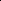

# Cross-View Progressive Feature Filtering for Multi-View Graph Clustering in Remote Sensing

<!-- Page 1 -->

Cross-View Progressive Feature Filtering for Multi-View Graph

Clustering in Remote Sensing

Bowen Liu1, Xin Peng1, Wenxuan Tu1,2, Chengyao Wei1, Xiangyan Tang1,2

Jieren Cheng1,2, Miao Yu2

1School of Computer Science and Technology, Hainan University, Haikou, China 2Hainan Blockchain Technology Engineering Research Center, Haikou, China {newborne, twx}@hainanu.edu.cn

## Abstract

Multi-view clustering of remote sensing data plays a vital role in Earth observation analysis. Recently, deep graph clustering methods based on contrastive learning have significantly improved feature representation capabilities. However, most existing approaches treat all views equally, neglecting the inherent uniqueness and heterogeneity across views, which often results in two major issues: 1) discriminative features from clustering-friendly views are underexplored; and 2) redundant or noisy information from less informative views can degrade the shared representation. To address these challenges, we propose a novel multi-view graph clustering framework termed CF-MVGC for remote sensing data, which dynamically preserves discriminative features and suppresses redundancy by assessing view affinity. Specifically, we employ a dual-stage representation learning strategy to extract both view-specific discriminative features and cross-view consistent representations. To further exploit and adaptively integrate complementary information across views, we design a progressive feature filtering model that dynamically evaluates view affinity using two novel metrics, i.e., view fidelity index (VFI) and view criticality index (VCI). Based on these assessments, the module adaptively modulates feature update and reset signals, reinforcing informative views while suppressing noisy or redundant ones. Views with high affinity receive strengthened update signals to retain valuable features, while those with low affinity are subjected to enhanced reset operations to eliminate noise and redundancy. The resulting high-quality, discriminative representations lead to improved clustering performance, establishing a positive feedback loop. Experimental results on four benchmark datasets demonstrate the effectiveness and superiority of CF-MVGC against its competitors.

Code — https://github.com/newborne/CF-MVGC

## Introduction

With the advancement of remote sensing technology, largescale acquisition of multimodal Earth observation data has become possible, offering tremendous potential for applications in critical fields such as urban planning and agricultural monitoring (Guo et al. 2024; Peng et al. 2024a).

Copyright © 2026, Association for the Advancement of Artificial Intelligence (www.aaai.org). All rights reserved.

Corresponding author: Wenxuan Tu

2.87 3.88

(a)

Fusion 20

40

60

80

30

50

70

ACC (%)

HSI EMP LBP Gabor

(b) HSI-DSM HSI-MSI HSI-DSM-MSI

ACC (%)

20

25

30

35

40

15

3.52

Other views SAR view Views without SAR Views with SAR Single-view View in fusion

Fused view Gabor view

**Figure 1.** Comparison of clustering performance under individual views and consensus views. (a) Clustering accuracy of single-view models, individual views within the fusion framework, and the fused consensus view on the XuZhou dataset. (b) Clustering accuracy of the fusion model with various combinations of views on the MDAS dataset.

However, the effective exploitation of remote sensing data remains heavily dependent on high-quality annotations, the acquisition of which typically demands considerable human effort and incurs significant costs (Hoxha et al. 2024; Wang et al. 2023; Liu et al. 2024). Consequently, deep multi-view clustering (DMVC), as an unsupervised learning paradigm, has emerged as a promising solution to address these challenges (Yang et al. 2025; Peng et al. 2024b).

The core idea of DMVC methods is to employ encoders to map raw data from different perspectives into a shared lowdimensional latent space, thereby facilitating subsequent clustering (Chen et al. 2023). Within this paradigm, contrastive learning (CL) has emerged as a widely adopted core technique, achieving impressive results (Guan et al. 2024a; Cai et al. 2023). Current CL-based DMVC methods for remote sensing data have incorporated various tailored strategies, such as structure refinement (Peng et al. 2025) and hard sample mining (Tu et al. 2024b; Guan et al. 2024b). The essence of these methods lies in emphasizing view alignment during network optimization (Moujahid and Dornaika 2025), while representations from different views are fused statically for clustering. Throughout the entire process, little attention is paid to the order or distinctiveness of individual views (Liang, Yang, and Xie 2022). Such viewequivalent strategies may hinder the effective extraction of view-specific information, which is particularly problematic

The Fortieth AAAI Conference on Artificial Intelligence (AAAI-26)

23649

<!-- Page 2 -->

for remote sensing data clustering, where different views often exhibit substantial heterogeneity. Consequently, applying these strategies to remote sensing clustering can lead to suboptimal representation learning and degraded clustering performance.

To investigate the aforementioned issue, we conduct an empirical study using the state-of-the-art method SAMVGC (Guan et al. 2025) and observe two intriguing yet counterintuitive phenomena: 1) A single view may outperform multi-view clustering. As illustrated in Fig. 1(a), for the XuZhou dataset, the Gabor view alone achieves superior clustering performance, while incorporating additional views fails to yield further improvement and even degrades the performance. These findings suggest that SAMVGC may lose clustering-friendly view information during the multi-view learning process, leading to overall performance degradation. 2) More views are not always beneficial. As depicted in Fig. 1(b), the inclusion of SAR views diminishes the clustering accuracy within the MDAS dataset, a phenomenon that may be attributed to the inherent speckle noise characteristic of SAR. Nevertheless, SAR views possess the ability to capture unique structural information, such as surface roughness obtained through radar backscattering, which serves as a complement to the perspectives provided by other views. This indicates that when confronted with noise interference within the view, SAMVGC is incapable of extracting meaningful information, thereby adversely affecting the overall results. These observations highlight that, for remote sensing data clustering, it is essential to not only emphasize clustering-friendly features but also to uncover complementary information masked by noise and inter-view differences.

Based on the above observations, we propose a Crossview progressive feature Filtering Multi-View Graph Clustering (CF-MVGC) framework for remote sensing data. Specifically, we introduce two complementary metrics: the View Fidelity Index (VFI), which quantifies the preservation of discriminative information from each view in the consensus representation; and the View Criticality Index (VCI), which evaluates the contribution of each view to the overall clustering quality. By integrating these metrics and view prior knowledge, we are able to comprehensively evaluate the affinity of each view, thereby effectively guiding the multi-view learning process. For the workflow of CF- MVGC, we first employ a dual-stage representation learning strategy to decouple single-view and multi-view representation learning, while a view-specific consistency loss is introduced to preserve view-specific information. Subsequently, we propose a cross-view progressive feature filtering module that utilizes view affinity as a criterion for view feature selection. By updating and resetting the feature fusion weights, this mechanism generates high-quality discriminative representations, thereby enhancing clustering performance. Finally, the improved clustering results are further fed back into the computation of VCI and VFI to update the affinity assessment, forming an alternating enhancement loop that continuously improves the effectiveness of the model in extracting multi-view information. We summarize the contributions of this work:

• We propose CF-MVGC, a novel cross-view progressive feature filtering framework. To the best of our knowledge, we first reveal the challenges faced by DMVC applications on remote sensing data, i.e., view uniqueness and heterogeneity. • We design two metrics, i.e., VFI and VCI, to quantitatively assess view affinity, which guide the proposed cross-view progressive feature filtering module to update and reset view fusion signals for better clustering. • Extensive experiments on four benchmark remote sensing datasets demonstrate the effectiveness and superiority of CF-MVGC.

## Related Work

Remote Sensing Data Clustering Annotating remote sensing data is often prohibitively expensive, motivating the development of clustering-based approaches as an effective alternative (Wang et al. 2023; Hoxha et al. 2024). Early methods, such as spectral clustering (Hu et al. 2015), rely on handcrafted features and linear assumptions. The advent of deep learning has resulted in autoencoders being used more widely in unsupervised clustering (Liu et al. 2022). More recently, deep learning-based methods have evolved into multi-view clustering paradigms (Liu et al. 2020; Wang, Zhong, and Zhang 2024), where neural networks are employed to extract nonlinear features from diverse data sources. The integration of contrastive learning has further enhanced representation quality, leading to significant performance improvements (Ma et al. 2023; Dong et al. 2025; Luo et al. 2024). However, a key limitation remains: most existing approaches treat multi-view data as homogeneous inputs (Zhang et al. 2024), overlooking the distinct and complementary information embedded in clustering-relevant views. This assumption fundamentally restricts the discriminative capacity and accuracy of multi-view clustering models.

Multi-view Graph Clustering Graph clustering captures intrinsic structural relationships by constructing topological graphs among samples (Tu et al. 2024a; Zhao et al. 2025; Tu et al. 2025), making multiview graph clustering (MVGC) a powerful paradigm for integrating heterogeneous remote sensing data (Cai et al. 2024). MVGC leverages the complementarity across multiple views while preserving local structural dependencies to facilitate holistic and fine-grained land-cover clustering in complex environments. However, most methods rely on static view fusion strategies and lack adaptive assessment of view quality (Liang, Yang, and Xie 2022; Zhou et al. 2025), making it impossible to suppress low-information or noisy views during the fusion process. (Wu et al. 2025). As a result, irrelevant or redundant components accumulate and propagate through the learning process, gradually degrading representation consistency and discriminability (Liang et al. 2025; Bi, Dornaika, and Charafeddine 2025). Ultimately, such restrictions cause the clustering results to differ from the true distribution, which affects the reliability of existing MVGC methods in real-world remote sensing scenarios.

23650

<!-- Page 3 -->

Memory emb Memory emb

Encoder

Decoder

Decoder

Encoder

Shared Encoder

VFI

VCI

Update more

Reset more

P

S

S

P

Reset unit

Memory emb

Filtered emb

Update unit

Clustering Map

Input emb View fidelity index

View criticality index view

Memory unit view view view view view model

View priority evaluation

Shared view model

Consensus view

Specific views

Feature filtering guidance

Distribution

Sort view view

K-means view

Reset

Weight scaling unit

Feature fusion Scaled weight Feature matching Scale coefficient Memory updating Memory loading

Refined emb

Memory initialization

S Superpixel segmentation P PCA pre-processing view view view

Cross-view progressive feature filtering view model View affinity assessment

**Figure 2.** Overview of the proposed CF-MVGC. Data are first pre-processed and transformed into graph representations. Each view is independently encoded to extract view-specific features, while a shared encoder learns consensus representations across views. View affinity is dynamically evaluated using the view fidelity index (VFI) and view criticality index (VCI), which guide the progressive feature filtering process. The resultant fused features are finally clustered to generate the clustering map.

## Methods

Notations and Definitions

Given a set of multi-view remote sensing data X = {Xv}V v=1, where V is the number of views and each Xv ∈ RW ×H×Dv consists of W ×H pixels with Dv feature channels. Following the previous method (Guan et al. 2025), we preprocess each view by applying PCA for feature reduction and SLIC superpixel segmentation to construct graph structures, thereby obtaining M spatially coherent regions. The node features ˆXv ∈RM×dv are aggregated from pixel statistics within each superpixel, where dv is the reduced feature dimension. Based on node features, an initial adjacency matrix Av ∈RM×M is constructed using a knearest neighbor strategy. Each view thus yields an initial graph Gv = {Av, ˆXv}, and the multi-view graph set is G = {Gv}V v=1, serving as input for subsequent representation learning and clustering.

Definition 1: View Fidelity Index (VFI). This metric evaluates how well the discriminative information of each view is retained during joint representation learning by measuring the similarity between the sub-view embedding and its original single-view embedding.

Definition 2: View Criticality Index (VCI). This metric quantifies the contribution of each view to the overall clustering by measuring the change in clustering quality when that view is excluded from the fusion process.

Dual-Stage View Representation Learning

Existing methods frequently suffer from the dilution of discriminative information from individual views during the consistency learning process. To overcome this challenge, an intuitive solution is to conduct these two steps: 1) We perform multi-view joint optimization through a shared encoder to achieve cross-view consensus representations. 2) We additionally train independent single-view models to extract undiluted discriminative features that serve as fidelity references for assessing information preservation.

First, we employ a shared graph encoder to jointly optimize all views, enabling the learning of cross-view consistent representations as follows:

Zv = Fshare(ˆXv, Av; Θs). (1)

To promote cross-view consistency and robustness, we design a structure-driven contrastive loss Ls that leverages multi-view graph structural information to guide consensus learning. We define an index matrix Q ∈RM×M based on the fused adjacency matrix Af = PV v=1 Av:

Qi,j =

1 if ai,j ∈Γα (Af) 0 otherwise, (2)

where ai,j is the (i, j)-th element of Af, and Γα(·) selects the top α values of each row. The structure-driven contrastive loss is:

Ls = −

V X p̸=q

M X i=1 log eΩ(zp i,zq i)/τ + P

Qi,j̸=0 eΩ(zp i,zq j)/τ PM j=1,i̸=j eΩ(zp i,zq j)/τ,

(3) where zp i and zq j are node embeddings from views p and q, Ω(·, ·) denotes cosine similarity, and τ is the temperature parameter. This loss encourages structurally similar nodes

23651

AI-readable visual equivalent, added: Figure extracted from the paper PDF and converted to an SVG wrapper asset. Use the surrounding page text and caption for interpretation.

AI-readable visual equivalent, added: Figure extracted from the paper PDF and converted to an SVG wrapper asset. Use the surrounding page text and caption for interpretation.

AI-readable visual equivalent, added: Figure extracted from the paper PDF and converted to an SVG wrapper asset. Use the surrounding page text and caption for interpretation.

<!-- Page 4 -->

across views to have consistent representations, providing high-quality inputs for subsequent progressive feature filtering and clustering.

Next, previous studies have demonstrated that single-view models, such as autoencoders, can maximally extract the discriminative features of each view, thereby providing highquality references for subsequent fusion (Luo et al. 2024). Accordingly, we additionally train independent graph encoders F(·) and decoders D(·) for each view, with all parameters trained separately:

ˆZv = F(ˆXv, Av; Θv), ¯Xv = D(ˆZv, Av; Φv). (4) The reconstruction loss for each view is defined as:

Lr = ∥¯Xv −ˆXv∥2

F, (5) where ∥·∥F denotes the Frobenius norm. This loss constrains the embedding to preserve essential information from the original features. To constrain the multi-view features and prevent dilution of discriminative information during consensus learning, we introduce a view-specific consistency loss:

Lu = 1

M

M X i=1

1 −(zv i)⊤ˆzv i ∥zv i ∥∥ˆzv i ∥

, (6)

which encourages the shared embeddings to be similar to the single-view embeddings and mitigates the dilution of discriminative features.

Cross-View Progressive Feature Filtering In multi-view remote sensing data clustering, each view provides a unique perspective on the data, often containing both complementary and partially redundant information. Previous methods employ static fusion strategies that treat all views indiscriminately. However, not all views contribute equally to the clustering objective. Therefore, before introducing the cross-view progressive feature filtering module, we first present the two designed metrics to evaluate the contribution of each view.

View Affinity Assessment The VFI for view v is computed as the mean normalized cosine similarity between the sub-view consensus embedding Zv and the original singleview embedding ˆZv:

VFIv = 1

M

M X i=1

1 + (zv i)⊤ˆzv i ∥zv i ∥∥ˆzv i ∥ 2. (7)

The VCI for view v measures the relative decrease in clustering quality when the view is masked:

VCIv =

S

1 V

PV i=1 Zi

−S

1 V −1

P i̸=v Zi

S

1 V

PV i=1 Zi

, (8)

where S(·) computes the silhouette coefficient (Rousseeuw 1987). These metrics are combined to form the affinity score:

av = VFIv × VCIv, (9) ensuring that only views excelling in both fidelity preservation and clustering contribution are strongly promoted. Subsequently, the assessment of view affinity serves as a crucial signal to guide the module in feature exploration.

Progressive Filtering Mechanism Previous methods often lead to the dilution of discriminative information as well as the accumulation of redundancy or noise. To overcome these limitations, we propose a progressive filtering mechanism that adaptively integrates and selects features from multiple views in a sequential and dynamic manner. The core of this mechanism is a memory unit, which accumulates and updates cross-view discriminative information throughout the fusion process based on VCI and VFI.

Specifically, the memory is initially set as the mean value of the consensus embeddings from all sub-views, denoted as H0 = 1 V

PV v=1 Zv. Inspired by curriculum learning (Peng et al. 2023), we determine the learning sequence of views based on the prior knowledge of the average spectral similarity among superpixel nodes within each view, designating views with lower noise as dominant to guide feature exploration in subsequent views. Formally, the prior weight of view v is defined as:

wv prior = 1 M 2

M X i=1

M X j=1

(ˆxv i)⊤ˆxv j ∥ˆxv i ∥∥ˆxv j∥, (10)

where M is the number of superpixel nodes in view v, and

ˆxv i denotes the i-th node feature. Views are processed in descending order of wv prior. The progressive filtering process refines embeddings by iteratively suppressing redundancy and integrating valid information. At each step t ∈{1, 2,..., V }, the reset unit suppresses redundancy or noise in the current input embedding Zt, producing a filtered embedding. This is concatenated with the current memory state Ht and transformed to generate a refined embedding, after which the update unit adaptively integrates the current input and refined embedding to produce the updated memory Ht+1. Specifically, the reset and update weights are generated by neural network layers based on the concatenation of the current input embedding and the memory embedding:

rt = σ(Wr · [Zt, Ht]), ut = σ(Wu · [Zt, Ht]), (11)

where Wr and Wu are learnable weight matrices, σ(·) is the sigmoid activation function, and [·, ·] denotes feature concatenation. The reset unit first suppresses redundancy or noise in the current input embedding:

˜Zt = (1 −rt) ⊙Zt, (12)

where ⊙denotes element-wise multiplication. The filtered embedding ˜Zt is then concatenated with the current memory embedding Ht and transformed to obtain the refined embedding:

˜Ht = tanh(Wm · [˜Zt, Ht]), (13)

where Wm is a learnable transformation matrix, and ˜Ht is the refined embedding at step t. Finally, the update unit adaptively determines the fusion ratio between the current input embedding and the refined embedding to produce the updated memory:

Ht+1 = ut ⊙Zt + (1 −ut) ⊙˜Ht, (14)

where ⊙denotes element-wise multiplication.

23652

<!-- Page 5 -->

## Algorithm

1: Learning Procedure of CF-MVGC

Require: Multi-view data X, learning rate η, epochs E Ensure: Clustering results P

1: Preprocess each view to obtain node features ˆXv and adjacency matrix Av. 2: Obtain the consensus embeddings Zv by eq. (1) 3: for v = 1 to V do 4: Obtain the view-specific embedding ˆZv by eq. (4) 5: end for 6: Calculate VFI, VCI, and affinity score av by eqs. (7)-(9) 7: Obtain the prior weight wv prior by eq. (10) 8: for t = 1 to V do 9: Compute and scale weights rt, ut by at by eq. (16) 10: Update memory Ht+1 by eq. (14) 11: end for 12: Compute clustering consistency loss Lc by eq. (17) 13: Jointly optimize all modules by minimizing L by eq. (18) 14: Apply K-means on Zf to obtain P 15: return P

During progressive filtering, the affinity score av is used to adaptively scale the reset and update weights for each view. Specifically, for the view of step t, let at be its affinity score and ¯a be the mean affinity score across all views. The scaling coefficient is computed as:

st = β · |at −¯a|, (15) where β controls the modulation strength. Based on this coefficient, the scaled weights are computed as:

ut =

( u1/(1+st)

t at ≥¯a ut at < ¯a, rt =

( rt at ≥¯a r1/(1+st)

t at < ¯a.

(16) The scaled weights ut and rt are then substituted into eqs. (11)-(14) to replace the original units. High-affinity views receive enhanced update signals to retain valuable features, while low-affinity views undergo enhanced reset operations to filter redundancy, ensuring that the final memory state Zf provides a robust and discriminative fused representation for clustering.

Cluster Consistency Learning To enhance cross-view consistency, we introduce a cluster consistency loss that aligns the cluster-wise feature distributions of all views with the fused representation. Specifically, for each sample, we obtain the clustering assignment by applying Kmeans to the fused features Zf, yielding cluster labels Pf ∈ {1,..., K}M. Let Ck = {i | Pf(i) = k} denote the set of node indices assigned to cluster k. The mean feature vector of cluster k in view v is µv k = 1 |Ck|

P i∈Ck zv i, and similarly for the fused representation µf k. The cluster consistency loss is defined as:

Lc = 1

V

V X v=1

1 K

K X k=1 µv k −µf k

2

2, (17)

where V is the number of views, and ∥· ∥2 denotes the ℓ2normalization.

Datasets Samples Clusters Views Features MDAS 88,026 14 4 242/2/1/12 XuZhou 68,877 9 4 436/45/436/90 Salinas 54,129 16 3 204/45/90 Trento 30,214 6 2 63/2

**Table 1.** Dataset summary.

## Model

Optimization During the training phase, CF-MVGC is optimized with three loss functions:

L = Lc + λ1Lu + λ2Ls, (18)

where λ1 and λ2 are balancing hyperparameters for the view-specific consistency loss and the structure-driven multi-view contrastive loss, respectively. The time complexity of the proposed CF-MVGC could be discussed from the network, view affinity assessment and loss computation aspects. The overall time complexity for each training iteration is O

V MdH + V M 2d + V MKTd + V 2αM 2d

≈ O

M 2

, where H is the number of GNN layers, K is the number of clusters, and T is the number of K-means iterations. The detailed learning procedure is presented in Algorithm 1.

## Experiments

## Experiment

Setup Datasets We evaluate CF-MVGC on four publicly available multi-view remote sensing datasets, as summarized in Table 1, including MDAS (Hu et al. 2023), XuZhou (Guan et al. 2024a), Salinas (Guan et al. 2024b), and Trento (Guan et al. 2025).

Baselines We compare CF-MVGC with eight state-of-theart multi-view clustering methods, including GCFAgg (Xu et al. 2022), SDMVC (Yan et al. 2023), AMKSC (Cai et al. 2024), CMSCGC (Guan et al. 2024a), MDFL (Li et al. 2024), EMVCC (Luo et al. 2024), CDD (Liu and Chang 2025), and SAMVGC (Guan et al. 2025).

Implementation Details To ensure fair comparison, all experiments are conducted on a NVIDIA 3090 GPU. We repeat each experiment 10 times and report averages with standard deviations. For baseline methods, we use their source code and report the reproduced performance. We use a threelayer GNN with hidden dimensions of 128, 256, and 512. Drawing from SAMVGC, SLIC superpixel segmentation with 3500 anchor points is applied, and all features are normalized. The Adam optimizer with a learning rate of 1e-5 is used. Based on sensitivity testing, we set λ1 = 0.1, λ2 = 1, α = 0.01, and β = 2. To clearly demonstrate the performance, we employ five evaluation metrics: Accuracy (ACC), Kappa coefficient, Normalized Mutual Information (NMI), Adjusted Rand Index (ARI), and Purity (PUR).

Performance Comparison We evaluate CF-MVGC against eight state-of-the-art baselines on four datasets, as summarized in Table 2. The fol-

23653

<!-- Page 6 -->

Datasets Metric GCFAgg SDMVC AMKSC CMSCGC MDFL EMVCC CDD SAMVGC CF-MVGC CVPR23 TKDE23 TNNLS24 TGRS24 AAAI24 MM24 TCSVT25 AAAI25 OURS

MDAS

ACC 23.70±0.55 29.73±0.12 27.85±1.83 40.24±1.43 25.03±1.69 41.54±4.35 30.79±3.29 38.20±1.41 47.90±0.92 Kappa 14.17±0.11 11.74±0.04 18.62±1.43 20.99±2.10 11.96±2.04 23.89±8.85 18.58±2.61 27.96±1.08 33.35±1.25

NMI 16.96±1.16 9.55±0.06 24.23±0.38 25.95±1.22 12.93±3.35 21.99±9.20 20.11±2.55 33.22±0.98 33.96±0.90 ARI 5.05±0.57 2.89±0.19 12.47±0.97 25.95±1.77 5.97±3.10 17.13±7.68 10.66±2.68 16.76±2.44 26.18±1.75 PUR 53.87±1.42 49.69±0.05 59.01±0.05 60.84±0.44 32.78±2.83 58.66±5.65 56.42±1.75 64.82±0.62 65.54±1.08

XuZhou

ACC 68.84±0.45 59.89±0.03 71.92±5.16 72.06±2.35 61.78±1.59 72.18±5.10 56.65±4.45 72.20±2.53 80.42±1.53 Kappa 61.53±0.52 51.08±0.06 66.26±5.49 66.62±1.48 62.76±2.54 65.99±5.95 48.15±4.65 66.42±2.67 75.81±1.83

NMI 63.92±1.49 58.10±0.04 69.77±1.74 66.01±1.32 60.88±1.32 66.21±5.84 52.30±1.75 70.60±1.67 72.20±1.77 ARI 63.25±0.75 55.78±0.02 61.20±7.79 72.36±1.83 59.72±1.44 59.37±8.11 47.59±6.50 61.16±6.39 73.77±1.23 PUR 77.46±0.67 67.65±0.01 80.29±0.05 81.54±2.10 70.07±1.79 76.47±4.20 67.17±1.69 82.90±1.12 84.01±1.48

Salinas

ACC 57.80±5.14 70.85±0.01 70.35±2.71 70.19±1.71 38.19±2.33 71.45±2.33 60.07±2.78 76.44±0.56 81.40±1.97 Kappa 54.39±5.27 67.71±0.01 66.99±2.67 66.83±2.85 32.85±1.59 68.46±2.54 55.18±3.08 74.15±0.60 79.34±2.15

NMI 69.43±1.34 77.45±0.03 80.30±2.62 76.03±2.21 54.37±2.17 78.54±2.91 70.88±3.41 79.84±0.37 82.12±0.95 ARI 47.31±4.29 56.97±0.02 61.40±4.10 55.93±1.44 30.77±1.76 58.32±4.12 54.11±5.30 65.65±1.70 77.68±2.29 PUR 70.68±1.92 77.10±0.04 74.41±1.39 75.06±1.54 55.30±2.79 75.89±2.43 62.01±2.44 80.89±0.69 84.13±1.18

Trento

ACC 56.05±4.64 63.46±1.14 93.90±1.97 88.74±2.14 86.01±2.17 78.01±4.06 70.83±6.38 94.13±0.72 95.55±0.13 Kappa 42.25±4.99 48.34±1.26 91.85±2.58 88.59±2.16 69.45±1.19 71.93±5.09 62.43±7.81 92.18±0.97 94.04±0.18

NMI 47.78±4.78 39.13±1.04 88.21±1.20 85.05±2.88 59.90±1.77 71.46±5.83 64.45±4.69 88.55±1.48 89.40±0.35 ARI 32.92±5.95 38.22±0.11 92.83±1.94 82.45±2.19 60.23±1.55 69.76±5.67 60.93±6.89 92.96±1.65 94.57±0.30 PUR 57.36±4.00 63.46±0.54 93.90±1.75 90.05±1.92 76.01±2.24 86.49±4.29 79.28±4.41 95.30±0.43 95.73±0.14

**Table 2.** Performance evaluation of clustering methods across multiple datasets (mean±std %). Best and second-best results are highlighted in bold and underlined, respectively.

XuZhou MDAS

GCFAgg GT SDMVC MDFL CMSCGC AMKSC Ours CDD EMVCC SAMVGC

GT SDMVC MDFL CMSCGC AMKSC CDD Ours SAMVGC EMVCC GCFAgg

Lakes Coals Cement Crops_2 Trees Bareland_2 Crops_1 Red-tiles Bare_land_1

Forest Park Residential Industrial Farm Gemetery Allotments Meadow Commercial Ground Retail Scrub Grass Health

**Figure 3.** Clustering maps of the compared methods on the MDAS and XuZhou datasets. GT shows ground truth labels.

lowing key observations can be made: 1) Remote sensingspecific MVC methods consistently outperform generalpurpose approaches, implying the importance of domaintailored designs to address challenges unique to remote sensing, such as multi-view data fusion and spectral variability. 2) On the complex MDAS dataset, CF-MVGC achieves 6.36% higher accuracy than EMVCC. This significant improvement demonstrates the effectiveness of our progressive filtering strategy, which selectively enhances informative views while mitigating noise via targeted cross-view graph fusion. 3) CF-MVGC consistently outperforms all baselines across datasets. For example, it shows improvements in ACC by 4.96% on Salinas and 1.42% on Trento. Notably, it demonstrates strong robustness in handling multi-view het- erogeneity, such as suppressing SAR speckle noise while retaining critical discriminative features.

Visualization Analysis

**Fig. 3.** presents visual comparisons between baseline models and CF-MVGC across the four-view MDAS and XuZhou datasets. Key observations derived from the comparison between predicted clustering maps and ground truth are as follows: 1) CF-MVGC consistently outperforms baseline methods, producing predictions that closely align with ground truth, with fewer misclassified pixels and sharper cluster boundaries. On the XuZhou dataset, CF-MVGC accurately distinguishes tree regions, which are frequently misclassified as crops by baseline models due to visual similar-

23654

AI-readable visual equivalent, added: Figure extracted from the paper PDF and converted to an SVG wrapper asset. Use the surrounding page text and caption for interpretation.

AI-readable visual equivalent, added: Figure extracted from the paper PDF and converted to an SVG wrapper asset. Use the surrounding page text and caption for interpretation.

AI-readable visual equivalent, added: Figure extracted from the paper PDF and converted to an SVG wrapper asset. Use the surrounding page text and caption for interpretation.

AI-readable visual equivalent, added: Figure extracted from the paper PDF and converted to an SVG wrapper asset. Use the surrounding page text and caption for interpretation.

AI-readable visual equivalent, added: Figure extracted from the paper PDF and converted to an SVG wrapper asset. Use the surrounding page text and caption for interpretation.

AI-readable visual equivalent, added: Figure extracted from the paper PDF and converted to an SVG wrapper asset. Use the surrounding page text and caption for interpretation.

AI-readable visual equivalent, added: Figure extracted from the paper PDF and converted to an SVG wrapper asset. Use the surrounding page text and caption for interpretation.

AI-readable visual equivalent, added: Figure extracted from the paper PDF and converted to an SVG wrapper asset. Use the surrounding page text and caption for interpretation.

AI-readable visual equivalent, added: Figure extracted from the paper PDF and converted to an SVG wrapper asset. Use the surrounding page text and caption for interpretation.

AI-readable visual equivalent, added: Figure extracted from the paper PDF and converted to an SVG wrapper asset. Use the surrounding page text and caption for interpretation.

AI-readable visual equivalent, added: Figure extracted from the paper PDF and converted to an SVG wrapper asset. Use the surrounding page text and caption for interpretation.

AI-readable visual equivalent, added: Figure extracted from the paper PDF and converted to an SVG wrapper asset. Use the surrounding page text and caption for interpretation.

AI-readable visual equivalent, added: Figure extracted from the paper PDF and converted to an SVG wrapper asset. Use the surrounding page text and caption for interpretation.

AI-readable visual equivalent, added: Figure extracted from the paper PDF and converted to an SVG wrapper asset. Use the surrounding page text and caption for interpretation.

AI-readable visual equivalent, added: Figure extracted from the paper PDF and converted to an SVG wrapper asset. Use the surrounding page text and caption for interpretation.

AI-readable visual equivalent, added: Figure extracted from the paper PDF and converted to an SVG wrapper asset. Use the surrounding page text and caption for interpretation.

AI-readable visual equivalent, added: Figure extracted from the paper PDF and converted to an SVG wrapper asset. Use the surrounding page text and caption for interpretation.

AI-readable visual equivalent, added: Figure extracted from the paper PDF and converted to an SVG wrapper asset. Use the surrounding page text and caption for interpretation.

AI-readable visual equivalent, added: Figure extracted from the paper PDF and converted to an SVG wrapper asset. Use the surrounding page text and caption for interpretation.

<!-- Page 7 -->

(b)

XuZhou Trento

(a)

ACC (%)

ACC (%)

**Figure 4.** Hyper-parameter analysis on XuZhou and Trento Datasets. (a) λ1 and λ2; (b) α and β.

ity, highlighting its superior clustering capability in multiview settings. 2) On the complex MDAS dataset, SAMVGC struggles to distinguish between semantically similar regions. In contrast, CF-MVGC exhibits significantly fewer misclassifications, producing purer clusters with higher label consistency. These results suggest that CF-MVGC effectively captures category-specific features from selected views, thereby mitigating inter-class confusion.

Ablation Study

We assess the contributions of key components in CF- MVGC through an ablation study, where each module is selectively removed. The experimental variants are defined as follows: 1) “w/o CF” removes the cross-view progressive feature filtering; 2) “w/o VFI” removes the View Fidelity Index; 3) “w/o VCI” removes the View Criticality Index; and 4) “w/o prior” excludes the spectral similarity prior. The results in Table 3 lead to the following key observations: 1) Excluding CF results in the most significant performance degradation, with an average ACC drop of 11.89% across all datasets. This underscores the importance of the progressive filtering mechanism in effectively suppressing noise and preserving discriminative features. 2) VFI and VCI exhibit strong synergy, forming a positive feedback loop. On the Salinas dataset, their joint presence achieves 81.40% ACC, whereas removing either leads to a decline exceeding 3.00%, highlighting their complementary roles in guiding feature fidelity and assessing view contributions. 3) Prior knowledge proves essential in heterogeneous settings. The “w/o prior” variant shows a pronounced performance drop on the highly heterogeneous XuZhou dataset, indicating that ordered views outperform unordered views.

Datasets Variants ACC Kappa NMI ARI PUR

MDAS w/o CF 33.01 22.42 26.98 11.81 59.73 w/o VFI 43.27 23.25 31.87 23.63 62.71 w/o VCI 42.67 23.86 30.59 21.85 61.33 w/o prior 45.33 26.67 31.72 23.84 62.80 Ours 47.90 33.35 33.96 26.18 65.54

XuZhou w/o CF 66.21 59.33 62.31 53.94 78.06 w/o VFI 80.01 75.24 71.21 71.06 83.96 w/o VCI 76.84 71.49 68.82 66.16 81.53 w/o prior 74.89 69.17 67.53 65.37 79.69 Ours 80.42 75.81 72.20 73.77 84.01

Salinas w/o CF 65.65 62.24 74.73 55.80 74.16 w/o VFI 78.37 76.06 80.59 71.94 82.34 w/o VCI 76.48 73.93 79.86 68.66 80.00 w/o prior 78.29 75.95 80.27 70.13 80.10 Ours 81.40 79.34 82.12 77.68 84.13

Trento w/o CF 92.85 90.41 86.18 92.32 94.19 w/o VFI 94.59 92.75 88.31 93.74 95.16 w/o VCI 94.36 92.41 87.14 92.40 94.62 w/o prior 94.80 93.02 87.93 93.55 95.12 Ours 95.55 94.04 89.40 94.57 95.73

**Table 3.** Ablation study results of different variants.

Hyper-parameter Sensitivity Analysis

We conduct a sensitivity analysis of key hyperparameters, as illustrated in Fig. 4, including the loss weights λ1 and λ2, the positive sample ratio α, and the affinity scaling factor β. The results indicate that increasing λ2 enhances cross-view consistency, but excessively large values may obscure discriminative signals. λ1 contributes positively within a moderate range, while overly high values introduce alignment bias. A proper setting of α enriches neighborhood information, whereas excessive values inject noise. Similarly, β should be carefully tuned to avoid disrupting the progressive filtering mechanism. Overall, CF-MVGC demonstrates robustness across a broad range of hyperparameter configurations. Unless otherwise specified, we use λ1 = 0.1, λ2 = 1, α = 0.01, and β = 2 in all experiments.

## Conclusion

This paper focuses on the challenging task of multi-view graph clustering in remote sensing, where treating all views equally may suppress discriminative signals from clusteringfriendly views and introduce redundant or noisy information that degrades fused representations. To tackle this, we propose a cross-view progressive feature filtering framework, termed CF-MVGC. The framework enables adaptive selection and integration of valuable features and suppresses redundancy or noise, which can substantially improve the discriminability and robustness of the fused representations for clustering. Extensive experiments on four benchmark datasets demonstrate that CF-MVGC consistently outperforms state-of-the-art baselines and yields more robust fused representations for clustering. In future work, we will study end-to-end clustering to integrate representation learning and clustering into a unified pipeline.

23655

AI-readable visual equivalent, added: Figure extracted from the paper PDF and converted to an SVG wrapper asset. Use the surrounding page text and caption for interpretation.

AI-readable visual equivalent, added: Figure extracted from the paper PDF and converted to an SVG wrapper asset. Use the surrounding page text and caption for interpretation.

AI-readable visual equivalent, added: Figure extracted from the paper PDF and converted to an SVG wrapper asset. Use the surrounding page text and caption for interpretation.

AI-readable visual equivalent, added: Figure extracted from the paper PDF and converted to an SVG wrapper asset. Use the surrounding page text and caption for interpretation.

<!-- Page 8 -->

## Acknowledgments

This work was supported by the National Natural Science Foundation of China (Grant No. 62506102, 62562026), the Natural Science Foundation of Hainan University (Grant No. XJ2400009401), the Key Research and Development Program of Hainan Province (Grant No. ZDYF2024GXJS014, ZDYF2023GXJS163), and the Collaborative Innovation Project of Hainan University (Grant No. XTCX2022XXB02).

## References

Bi, J.; Dornaika, F.; and Charafeddine, J. 2025. Linear Projection Fused Graph-Based Semi-Supervised Learning On Multi-View Data. Artificial Intelligence Review, 58(10): 309. Cai, Y.; Zhang, Z.; Ghamisi, P.; Rasti, B.; Liu, X.; and Cai, Z. 2023. Transformer-Based Contrastive Prototypical Clustering For Multimodal Remote Sensing Data. Information Sciences, 649: 119655. Cai, Y.; Zhang, Z.; Liu, X.; Ding, Y.; Li, F.; and Tan, J. 2024. Learning Unified Anchor Graph For Joint Clustering Of Hyperspectral And LiDAR Data. IEEE Transactions on Neural Networks and Learning Systems, 36(4): 6341–6354. Chen, Z.; Fu, L.; Yao, J.; Guo, W.; Plant, C.; and Wang, S. 2023. Learnable Graph Convolutional Network And Feature Fusion For Multi-View Learning. Information Fusion, 95: 109–119. Dong, R.; Xia, J.; Jiao, L.; Zhao, J.; Hong, L.; and Yun, Z. 2025. DBA-RMCL: Refined Metric Contrastive Learning With Dual-Branch Attention For Few-Shot Remote Sensing Image Scene Classification. IEEE Transactions on Geoscience and Remote Sensing, 63: 1–16. Guan, R.; Li, Z.; Tu, W.; Wang, J.; Liu, Y.; Li, X.; Tang, C.; and Feng, R. 2024a. Contrastive Multiview Subspace Clustering Of Hyperspectral Images Based On Graph Convolutional Networks. IEEE Transactions on Geoscience and Remote Sensing, 62: 1–14. Guan, R.; Tu, W.; Li, Z.; Yu, H.; Hu, D.; Chen, Y.; Tang, C.; Yuan, Q.; and Liu, X. 2024b. Spatial-spectral Graph Contrastive Clustering with Hard Sample Mining for Hyperspectral Images. IEEE Transactions on Geoscience and Remote Sensing, 62: 1–16. Guan, R.; Tu, W.; Wang, S.; Liu, J.; Hu, D.; Tang, C.; Feng, Y.; Li, J.; Xiao, B.; and Liu, X. 2025. Structure-Adaptive Multi-View Graph Clustering For Remote Sensing Data. In Proceedings of the AAAI Conference on Artificial Intelligence, 16933–16941. Guo, X.; Lao, J.; Dang, B.; Zhang, Y.; Yu, L.; Ru, L.; Zhong, L.; Huang, Z.; Wu, K.; Hu, D.; et al. 2024. Skysense: A Multi-Modal Remote Sensing Foundation Model Towards Universal Interpretation for Earth Observation Imagery. In Proceedings of the IEEE/CVF Conference on Computer Vision and Pattern Recognition, 27672–27683. Hoxha, G.; Sumbul, G.; Henkel, J.; M¨ollenbrok, L.; and Demir, B. 2024. Annotation Cost-Efficient Active Learning for Deep Metric Learning Driven Remote Sensing Image

Retrieval. IEEE Transactions on Geoscience and Remote Sensing, 62: 1–11.

Hu, F.; Xia, G.-S.; Wang, Z.; Huang, X.; Zhang, L.; and Sun, H. 2015. Unsupervised Feature Learning Via Spectral Clustering Of Multidimensional Patches For Remotely Sensed Scene Classification. IEEE Journal of Selected Topics in Applied Earth Observations and Remote Sensing, 8(5): 2015– 2030.

Hu, J.; Liu, R.; Hong, D.; Camero, A.; Yao, J.; Schneider, M.; Kurz, F.; Segl, K.; and Zhu, X. X. 2023. MDAS: A New Multimodal Benchmark Dataset For Remote Sensing. Earth System Science Data, 15(1): 113–131.

Li, D.; Xie, W.; Zhang, J.; and Li, Y. 2024. MDFL: Multi- Domain Diffusion-Driven Feature Learning. In Proceedings of the AAAI Conference on Artificial Intelligence, 8653– 8660.

Liang, J.; Dong, X.; Wang, P.; Xu, J.; Wu, D.; and Nie, F. 2025. Multi-View Graph Clustering Via Dual View-Cluster- Order Interactivity Mining. IEEE Transactions on Circuits and Systems for Video Technology.

Liang, N.; Yang, Z.; and Xie, S. 2022. Incomplete Multi- View Clustering With Sample-Level Auto-Weighted Graph Fusion. IEEE Transactions on Knowledge and Data Engineering, 35(6): 6504–6511.

Liu, B.; Yu, A.; Yu, X.; Wang, R.; Gao, K.; and Guo, W. 2020. Deep Multiview Learning For Hyperspectral Image Classification. IEEE Transactions on Geoscience and Remote Sensing, 59(9): 7758–7772.

Liu, J.; Wu, Z.; Xiao, L.; and Wu, X.-J. 2022. Model Inspired Autoencoder For Unsupervised Hyperspectral Image Super-Resolution. IEEE Transactions on Geoscience and Remote Sensing, 60: 1–12.

Liu, S.; and Chang, L. 2025. Conditional Dual Diffusion For Multimodal Clustering Of Optical And SAR Images. IEEE Transactions on Circuits and Systems for Video Technology, 35(6): 5318–5330.

Liu, Y.; Zhu, E.; Wang, Q.; Li, J.; Liu, S.; Hu, Y.; Han, Y.; Zhou, G.; and Guan, R. 2024. Spatial-spectral Adaptive Graph Convolutional Subspace Clustering for Hyperspectral Image. IEEE Journal of Selected Topics in Applied Earth Observations and Remote Sensing, 18: 1139–1152.

Luo, F.; Liu, Y.; Gong, X.; Nan, Z.; and Guo, T. 2024. EMVCC: Enhanced Multi-View Contrastive Clustering For Hyperspectral Images. In Proceedings of the ACM International Conference on Multimedia, 6288–6296.

Ma, J.; Lin, W.; Tang, X.; Zhang, X.; Liu, F.; and Jiao, L. 2023. MultiPretext-Task Prototypes Guided Dynamic Contrastive Learning Network For Few-Shot Remote Sensing Scene Classification. IEEE Transactions on Geoscience and Remote Sensing, 61: 1–16.

Moujahid, A.; and Dornaika, F. 2025. Advanced Unsupervised Learning: A Comprehensive Overview of Multi-View Clustering Techniques. Artificial Intelligence Review, 58(8): 234.

23656

<!-- Page 9 -->

Peng, X.; Cheng, J.; Tang, X.; Deng, Z.; Tu, W.; and Xiong, N. 2024a. Hsnet: An Intelligent Hierarchical Semanticaware Network System for Real-time Semantic Segmentation. IEEE Transactions on Systems, Man, and Cybernetics: Systems, 54(7): 4318–4330. Peng, X.; Cheng, J.; Tang, X.; Liu, J.; and Wu, J. 2023. Dual Contrastive Learning Network for Graph Clustering. IEEE Transactions on Neural Networks and Learning Systems, 35(8): 10846–10856. Peng, X.; Cheng, J.; Tang, X.; Zhang, B.; and Tu, W. 2024b. Multi-view Graph Imputation Network. Information Fusion, 102: 102024. Peng, X.; Liu, B.; Guan, R.; and Tu, W. 2025. Multi-view Graph Clustering with Dual Structure Awareness for Remote Sensing Data. In Inproceedings of the ACM International Conference on Multimedia, 2313–2322. Rousseeuw, P. J. 1987. Silhouettes: A Graphical Aid To The Interpretation And Validation Of Cluster Analysis. Journal of Computational And Applied Mathematics, 20: 53–65. Tu, W.; Liao, Q.; Zhou, S.; Peng, X.; Ma, C.; Liu, Z.; Liu, X.; Cai, Z.; and He, K. 2024a. RARE: Robust Masked Graph Autoencoder. IEEE Transactions on Knowledge and Data Engineering, 36(10): 5340–5353. Tu, W.; Zhou, S.; Liu, X.; Cai, Z.; Zhao, Y.; Liu, Y.; and He, K. 2025. WAGE: Weight-Sharing Attribute-Missing Graph Autoencoder. IEEE Transactions on Pattern Analysis and Machine Intelligence, 47(7): 5760–5777. Tu, W.; Zhou, S.; Liu, X.; Ge, C.; Cai, Z.; and Liu, Y. 2024b. Hierarchically Contrastive Hard Sample Mining for Graph Self-supervised Pre-training. IEEE Transactions on Neural Networks and Learning Systems, 35(11): 16748–16761. Wang, J.; Zhong, Y.; and Zhang, L. 2024. Contrastive Scene Change Representation Learning For High-Resolution Remote Sensing Scene Change Detection. IEEE Transactions on Geoscience and Remote Sensing, 62: 1–18. Wang, X.; Chen, L.; Ban, T.; Lyu, D.; Guan, Y.; Wu, X.; Zhou, X.; and Chen, H. 2023. Accurate Label Refinement From Multiannotator of Remote Sensing Data. IEEE Transactions on Geoscience and Remote Sensing, 61: 1–13. Wu, M.; Zhu, J.; Yan, W.; Chen, B.; and Zheng, Q. 2025. Relationship Completion For Incomplete Multi-View Clustering. Neural Networks, 191: 107791. Xu, J.; Ren, Y.; Tang, H.; Yang, Z.; Pan, L.; Yang, Y.; Pu, X.; Yu, P. S.; and He, L. 2022. Self-Supervised Discriminative Feature Learning For Deep Multi-View Clustering. IEEE Transactions on Knowledge and Data Engineering, 35(7): 7470–7482. Yan, W.; Zhang, Y.; Lv, C.; Tang, C.; Yue, G.; Liao, L.; and Lin, W. 2023. GCFAGG: Global And Cross-View Feature Aggregation For Multi-View Clustering. In Proceedings of the IEEE/CVF Conference on Computer Vision and Pattern Recognition, 19863–19872. Yang, J.; Chen, W.; Liu, F.; Zhou, P.; Wang, Z.; Liang, X.; and Jiang, B. 2025. Multi-view Clustering via Multigranularity Ensemble. In Proceedings of the International Joint Conference on Artificial Intelligence, 6794–6802.

Zhang, Y.; Yan, S.; Zhang, L.; and Du, B. 2024. Fast Projected Fuzzy Clustering With Anchor Guidance For Multimodal Remote Sensing Imagery. IEEE Transactions on Image Processing, 33: 4640–4653. Zhao, Z.; Wang, T.; Xin, H.; Wang, R.; and Nie, F. 2025. Multi-View Clustering Via High-Order Bipartite Graph Fusion. Information Fusion, 113: 102630. Zhou, Y.; Wang, C.; Ji, L.; and Zhang, J. 2025. Straightforward Tensorized Anchor Graph Learning For Multi-View Clustering. Digital Signal Processing, 167: 105443.

23657
