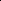

# Deformable Polygonal Flow Matching with Informed Priors and Hierarchical Graph Constraints

<!-- Page 1 -->

Deformable Polygonal Flow Matching with Informed Priors and Hierarchical

Graph Constraints

Arnaud Gueze1, 2, Matthieu Ospici2, Damien Rohmer1, Marie-Paule Cani1

1LIX, CNRS, Ecole Polytechnique, Institut Polytechnique de Paris, Palaiseau, France 2Homiwoo, Paris, France {arnaud.gueze, damien.rohmer, marie-paule.cani}@polytechnique.edu matthieuo@homiwoo.com

## Abstract

This paper presents a novel method, called Deformable Polygonal Flow Matching (DPFM), for the generation of polygonal arrangements such as jigsaw puzzles and floor plans. DPFM is a Flow Matching framework that enables the generation process to deform, rotate, and translate polygons while decoupling these transformation, allowing to toggle them individually. Able to combine the spatial reasoning capabilities of arrangement models with the flexibility of position-based models, it covers a wide range of applications within a unified formulation, from noiseless puzzle solving using rigid alignments to unconstrained floor plan generation. We represent data using a hierarchical graph composed of a topological subgraph encoding connectivity information and semantics (such as room types for floor plans), and a geometrical subgraph encoding the 1D polygonal loop of each shape. DPFM also leverages Flow Matching’s arbitrary prior distributions for geometric constraints by designing priors with domain knowledge. Rather than starting the generation process from uninformed distributions, the generation is constrained through the informed priors at the initialization stage. The qualitative and quantitative evaluations of our method, ran on the RPLAN and jigsaw puzzle datasets, demonstrate strong performance. DPFM outperforms taskspecific methods, becoming the new state-of-the-art for 2D arrangement generation. Our results show that DPFM is able to solve novel tasks, such as puzzle denoising, where pieces are reconstructed from noisy versions and arranged into a valid puzzle in parallel.

## Introduction

Modeling of structured geometries, represented as the arrangement of a set of finer grain elements, recently attracted considerable interest and saw tremendous progress in various research fields. These advances have, for the most part, been sparked by the rise of Diffusion Models (DM) (Ho, Jain, and Abbeel 2020; Song et al. 2021) and more recently Flow Matching (FM) methods (Lipman et al. 2023; Liu, Gong, and Liu 2023; Albergo, Boffi, and Vanden-Eijnden 2023). Since then, there has been an ever increasing number of contributions for the design of structured geometries based on generative models. The applications span from architecture, where indoor layouts can be suggested given a

Copyright © 2026, Association for the Advancement of Artificial Intelligence (www.aaai.org). All rights reserved.

building’s footprint (Shabani, Hosseini, and Furukawa 2023; Chen, Deng, and Furukawa 2023), to biology where amino acids are arranged into a protein structure (Jing, Berger, and Jaakkola 2024; Campbell et al. 2024), molecular generation (Hoogeboom et al. 2022; Vignac et al. 2023; Dunn and Koes 2024), and puzzle solving (Hossieni et al. 2023; Scarpellini et al. 2024; Xu et al. 2024).

Two types of approaches can be distinguished. Firstly, position-based methods generate new geometries by directly regressing them, such as generating atom positions in a molecule. While they can be used for constrained generation (Gueze et al. 2023; Stark et al. 2023), there is no guarantee that any geometrical constraint on the input can be retained throughout the generation process. Secondly, arrangementbased methods predict arrangements through rigid transformations of sub-shapes, effectively accounting for translation and rotation of the constraints. They are typically used for protein folding (Jumper et al. 2021; Yim et al. 2023; Campbell et al. 2024) and puzzle solving (Hossieni et al. 2023). Since this framework preserves the geometry of subshapes, it only focuses on noise-free constraint matching. Despite great spatial reasoning capabilities, it therefore lacks the flexibility to consider soft constraints and generate, if needed, more adapted geometries.

How could we deal with problems that simultaneously require both arrangement and denoising capabilities? In this work, we consider the task of arrangement reconstruction where, from a set of noisy constraint shapes, a noisefree arrangement needs to be predicted. Since arrangementbased methods would fail to estimate missing information while position-based methods might output invalid configurations, we introduce a new method addressing both issues at once: We propose Deformable Polygonal Flow Matching (DPFM), an adaptation of Flow Matching that generates arrangements of polygons while allowing each of them to deform locally. DPFM predicts three distinct transformations for each polygon: translation, rotation, and deformation. Each of these transformations can be toggled individually, resulting in flexible sampling. DPFM makes it possible to generate a rigid transformation for all the polygons and only deform a selection. It allows, in a unified framework, to solve problems involving rigid arrangements as well as local geometry generation, and to combine the two. In addition, this framework can be used to solve new tasks, such as

The Fortieth AAAI Conference on Artificial Intelligence (AAAI-26)

21405

<!-- Page 2 -->

DPFM DPFM

Hierarchical Graph

Geometrical

Deformation Rotation Translation

Topological

DPFM

² Local deformation

Rigid frame estimation

Local representations at each polygon

Regular polygon prior Rigid transformation to the global frame

Initial State

**Figure 1.** Overview of our DPFM framework applied to floor plan generation. We plot the transformations’ state at the central room during the sampling process: deformation, rotation and translation respectively. We initialize our sampling process according to our regular polygon prior. Deformations are only applied in each room’s local frame. The state of the rigid transformations at each corner can be seen in transparency (arrows for rotation and points for translation), while the mean state for the room is shown in full opacity. We can observe that the rigid transformations converge to a single state during the sampling process. We use the mean rigid state for plotting the global arrangement throughout the sampling process.

puzzle denoising from noisy constraints.

To the best of our knowledge, our method is the first one that builds on the flexible priors offered by the FM framework for a spatial reconstruction task. This is achieved through two main mechanisms, used to constrain the generation both topologically and geometrically: We first introduce a hierarchical graph structure, which naturally encodes the topological relationships between polygons as a first layer, as well as the polygonal loops themselves in a second layer. Second, we make use of a prior distribution informed by domain knowledge. The latter allows the model to directly process and modify the geometrical constraints, instead of starting from an uninformed distribution (such as a Gaussian). The quantitative evaluation of our method is carried out on three main tasks, namely room layout arrangement/puzzle solving, floor plan generation, and puzzle denoising. We demonstrate that DPFM outperforms current state-of-the-art methods by significant margins on arrangement tasks and is able to solve new, more complex tasks. These results demonstrate the importance of spatial reasoning when dealing with structured geometry. Furthermore, we show that informed priors are an excellent way to constrain polygon generation in a flow matching framework, enabling flexibility and efficiency.

In summary, in this paper we propose i) DPFM that enables global rigid arrangements and local deformations within the more general Flow Matching framework. ii) a constraint scheme for polygonal arrangements based on a hierarchical graph and prior distributions informed by do- main knowledge iii) a set of new tasks, more challenging than solving jigsaw puzzles, demonstrating reconstruction capabilities.

## Related Work

Point Cloud Generation. Diffusion Models (Ho, Jain, and Abbeel 2020; Song et al. 2021), and lately Flow Matching (Lipman et al. 2023; Liu, Gong, and Liu 2023; Albergo, Boffi, and Vanden-Eijnden 2023), have emerged as one of the most successful form of generative modeling across a broad range of domains and applications (Dhariwal and Nichol 2021; Kim, Kim, and Yoon 2022; Rombach et al. 2022; Abramson et al. 2024). Among those we can find different forms of geometric structure generation. Point cloud generation has seen great improvements, especially through the lens of Molecular Conformation Generation (Hoogeboom et al. 2022; Vignac et al. 2023; Hassan et al. 2024) which seeks to generate atom positions within a molecule. Some approaches jointly predicts the molecular structure and conformation resulting in Molecular Design (Vignac et al. 2023; Stark et al. 2023; Irwin et al. 2024) by leveraging Discrete Diffusion/Flow Models (Campbell et al. 2024; Gat et al. 2024). In the domain of polygonal generation, floor plan generation aims at solving a similar problem in 2D where a model generates the layout of an apartment as a set of polygons. HouseDiffusion (Shabani, Hosseini, and Furukawa 2023) used a diffusion model to generate a floor plan conditioned on a connectivity graph between rooms. (Gueze et al. 2023) further constrained the generation us-

21406

AI-readable visual equivalent, added: Figure extracted from the paper PDF and converted to an SVG wrapper asset. Use the surrounding page text and caption for interpretation.

AI-readable visual equivalent, added: Figure extracted from the paper PDF and converted to an SVG wrapper asset. Use the surrounding page text and caption for interpretation.

AI-readable visual equivalent, added: Figure extracted from the paper PDF and converted to an SVG wrapper asset. Use the surrounding page text and caption for interpretation.

AI-readable visual equivalent, added: Figure extracted from the paper PDF and converted to an SVG wrapper asset. Use the surrounding page text and caption for interpretation.

AI-readable visual equivalent, added: Figure extracted from the paper PDF and converted to an SVG wrapper asset. Use the surrounding page text and caption for interpretation.

AI-readable visual equivalent, added: Figure extracted from the paper PDF and converted to an SVG wrapper asset. Use the surrounding page text and caption for interpretation.

AI-readable visual equivalent, added: Figure extracted from the paper PDF and converted to an SVG wrapper asset. Use the surrounding page text and caption for interpretation.

AI-readable visual equivalent, added: Figure extracted from the paper PDF and converted to an SVG wrapper asset. Use the surrounding page text and caption for interpretation.

AI-readable visual equivalent, added: Figure extracted from the paper PDF and converted to an SVG wrapper asset. Use the surrounding page text and caption for interpretation.

AI-readable visual equivalent, added: Figure extracted from the paper PDF and converted to an SVG wrapper asset. Use the surrounding page text and caption for interpretation.

AI-readable visual equivalent, added: Figure extracted from the paper PDF and converted to an SVG wrapper asset. Use the surrounding page text and caption for interpretation.

AI-readable visual equivalent, added: Figure extracted from the paper PDF and converted to an SVG wrapper asset. Use the surrounding page text and caption for interpretation.

AI-readable visual equivalent, added: Figure extracted from the paper PDF and converted to an SVG wrapper asset. Use the surrounding page text and caption for interpretation.

AI-readable visual equivalent, added: Figure extracted from the paper PDF and converted to an SVG wrapper asset. Use the surrounding page text and caption for interpretation.

AI-readable visual equivalent, added: Figure extracted from the paper PDF and converted to an SVG wrapper asset. Use the surrounding page text and caption for interpretation.

AI-readable visual equivalent, added: Figure extracted from the paper PDF and converted to an SVG wrapper asset. Use the surrounding page text and caption for interpretation.

AI-readable visual equivalent, added: Figure extracted from the paper PDF and converted to an SVG wrapper asset. Use the surrounding page text and caption for interpretation.

<!-- Page 3 -->

PSA GSA

Scale, Shift

Layer Norm

Scale Scale

Layer Norm

Scale, Shift

FeedForward

Scale

MLP x N x M

Graph Embedding Topological

Subgraph Geometrical

Subgraph

Timestep Embedding

Graph Embedding

Position Embedding

Rigid Embedding

HGT Block

Polygon centering

AdaLN

Rotation

Norm Position

MLP

Translation

MLP Rotation

MLP

Topological

GT

**Figure 2.** Our Hierarchical Graph Transformer architecture. Each subgraph is embedded separately, we then encode our topological features with a Graph Transformer. The geometric quantities at each corner are then decoded conditioned on the topological features thanks to our HGT Block.

ing a set of partial shapes to reconstruct the floor plan in its entirety. Polydiffuse (Chen, Deng, and Furukawa 2023) uses guidance networks to predict different noise distributions per polygon. We showed that when dealing with constrained generation such as jigsaw puzzle denoising, pointwise methods tend to rely on distorting the constraints instead of searching for the best spatial arrangement which hinders their reconstruction capabilities.

Arrangement Generation. These methods aim at coherently assembling a predefined set of pieces. Following the seminal work of (Jumper et al. 2021) arranging aminoacids into a protein structure, Diffusion/Flow Models were used (Yim et al. 2023; Campbell et al. 2024; Yim et al. 2024). Similar methods were developed to reconstruct fragmented 3D objects (Scarpellini et al. 2024; Xu et al. 2024). PuzzleFusion (Hossieni et al. 2023) applied this methodology to 2D puzzle solving as well as for arranging room layouts into a coherent floor plan. Although these approaches demonstrate great spatial reasoning capabilities, they lack the flexibility to deal with noisy environments as they only rely on rigid transformations to move the pieces.

Priors as Constraints. Flow Matching enables generation between arbitrary distributions allowing for user defined priors. This provides a natural mechanism for incorporating constraints into the generation process. It was used in a broad range of domains from computer vision (Albergo et al. 2024b; Gode et al. 2024) to molecular design (Stark et al. 2023; Wu et al. 2025). In this work, we build on this approach but use it as a constraint mechanism for reconstruction tasks.

Deformable Polygonal Flow Matching (DPFM) The core concept of DPFM, a unified approach combining rigid transformations with non-rigid deformations, is summarized in Figure 1. The remainder of this paper details the key technical contributions enabling an effective implementation of this framework. We first present the hierarchical graph structure that models our polygon sets, followed by the changes made to the common flow-based rigid formulation extending it with a deformation term. We finally discuss the decoupling strategy between the deformation and rigid transformations, followed by the informed priors design.

Hierarchical Graph Representation The first constraint mechanism implemented in DPFM is the Hierarchical Graph representation, which captures both the topological and geometric aspects of polygonal arrangements. This graph structure serves two purposes: it encodes the data processed by DPFM while simultaneously imposing structural constraints on the generation process. We represent our data as a two-level hierarchical graph G = (Vp ∪Vc, Ep ∪Ec ∪Ea). The first level, pi ∈Vp, represents the topological nodes which are high-level concepts such as ”puzzle pieces” or ”rooms” with a node per polygon. The second level, ci j ∈Vc represents geometric vertices/corners of the polygons pi. Ep contains topological edges (for example, room connectivity within a floor plan) (pi, pj) ∈Ep. Ec contains geometric edges (ci j, ci k) ∈Ec that form the polygonal ring of pi. Ea connects each topological node to its geometric vertices (pi, ci j) ∈Ei a and Ea = S i Ei a. This structure can be viewed as a topological subgraph Gtop = (Vp, Ep) and a geometrical subgraph Ggeo = (Vc, Ec) interconnected by Ea.

Data Parametrization Following PuzzleFusion (Hossieni et al. 2023), we parameterize pi as a rigid frame (ri, si) ∈SE(2), with SE(2) the Special Euclidean Group in 2D, ri a rotation parameterized as a 2D unit vector, and si a 2D translation. In addition, we retain the redundant representation that associates a rigid frame with each corner ci j. Since we consider the case where the constraints can be noisy, we add a displacement term to each corner ci j = (xi j, ri j, si j) where xi j is the position of ci j in the local frame, (ri j, si j) is the frame estimate of pi at ci j. For brevity, we refer to the full corner sequence as C = {ci j}|Vc|.

Flow Matching on R2 × SE(2) Our DPFM approach extends classical Flow Matching by simultaneously integrating three types of transformations: translations, rotations, and deformations. For each corner, we consider a product space R2 × SE(2). We extend the formulation from previous works (Yim et al. 2023) that generated rigid frames and integrate the deformation transformation. We define the probability path pt|1(Ct |C1, C0) as a factorization over the three transformations with C0 ∼ρprior a sample from the prior distribution and C1 ∼ρdata a sample from the data distribution. We define independent noise levels for each transformation (Albergo et al. 2024a; Campbell et al. 2024) tx, tr, ts and ˜t = (tx, tr, ts). This allows

21407

AI-readable visual equivalent, added: Figure extracted from the paper PDF and converted to an SVG wrapper asset. Use the surrounding page text and caption for interpretation.

AI-readable visual equivalent, added: Figure extracted from the paper PDF and converted to an SVG wrapper asset. Use the surrounding page text and caption for interpretation.

AI-readable visual equivalent, added: Figure extracted from the paper PDF and converted to an SVG wrapper asset. Use the surrounding page text and caption for interpretation.

<!-- Page 4 -->

Input

Input

AB PB Ours GT Crosscut Voronoi AB PB Ours GT

Input

Input

Input Input

Input

Input

**Figure 3.** Puzzle denoising inferences with a noise level of 8. We show 6 puzzles, 3 for Crosscut and 3 for Voronoi. The columns show the following approaches: AB, PB, Ours and GT. Enabling the deformation transformation enables us to successfully retrieve a good approximation of the noise-free puzzle even when confronted with great noise levels, demonstrating good robustness.

for flexible sampling and training by fixing some transformations depending on the task we want to solve. We choose to directly estimate the clean data ˆC1 from the noised data C˜t. We then minimize the following loss with an extra deformation term:

LDPFM = E

" D X d=1

ˆxd

1(C˜t) −xd tx

2

(1 −tx)2 +

ˆsd

1(C˜t) −sd ts

2

(1 −ts)2

+ logrd tr (ˆrd

1(C˜t)) −logrd tr (rd

1)

2

(1 −tr)2

#

(1)

where the expectation is over tx, tr, ts ∼U(0, 1), C1 ∼ ρdata, C0 ∼ρprior, C˜t ∼p˜t|1(C˜t |C1, C0).

Furthermore, we use the matching loss proposed in (Hossieni et al. 2023) and apply it only when tx, tr, ts > 0.5. The total loss is defined as the sum of the two losses Ltotal = LDPFM + Lmatch.

In order to sample our model, we simulate the ODE trajectory using a Euler solver. Depending on the task, one can selectively generate any combination of transformations. In order to keep a transformation fixed, tk has to be set equal to 1 where k ∈{x, r, s}.

Transformation Decoupling and Shape Alignment A critical challenge in DPFM is to ensure that each transformation fulfills its intended role. The translation and ro- tation transformations are intrinsically decoupled. However, deformations could be used to achieve translations or rotations, leading to ambiguities and unstable generation. We introduce two constraints to the prior samples in their local frames to decouple them.

We constrain the centroid of each polygon to be centered at the origin taken as the arithmetic mean of the corner positions. Centered polygons are denoted as xi centered 0. Then, we normalize the orientation of these polygons, according to the singular value decomposition (SVD) of their covariance matrix Covi =(xi centered 0)T xi centered 0 = UΣV T ∈R2×2 such that xi orient 0 = xi centered 0SV where S = sign(θV) · diag(1, det(V)) and sign(θV) the sign of the angle of rotation θV ∈[−π, π]. The regularizer S ensures that V ∈SO(2) so that no reflection is applied to the polygons and constrains the SVD to a positive angle which prevents oscillations between θV and θV +π. Once the prior samples are normalized, we center and align the data polygons xi centered 1 with the prior polygons xi orient 0 using the Kabsch algorithm (Kabsch 1976; Umeyama 1991). At training time, this decoupling step results in the polygons continuously deforming into the target shape with minimal edge crossings during the interpolation, reducing the distance traveled by each corner.

Informed Priors Flow Matching allows one to choose the prior distribution for the generation, as long as we are able to sample it to initialize the sampling process. Domain knowledge can then

21408

AI-readable visual equivalent, added: Figure extracted from the paper PDF and converted to an SVG wrapper asset. Use the surrounding page text and caption for interpretation.

AI-readable visual equivalent, added: Figure extracted from the paper PDF and converted to an SVG wrapper asset. Use the surrounding page text and caption for interpretation.

AI-readable visual equivalent, added: Figure extracted from the paper PDF and converted to an SVG wrapper asset. Use the surrounding page text and caption for interpretation.

AI-readable visual equivalent, added: Figure extracted from the paper PDF and converted to an SVG wrapper asset. Use the surrounding page text and caption for interpretation.

AI-readable visual equivalent, added: Figure extracted from the paper PDF and converted to an SVG wrapper asset. Use the surrounding page text and caption for interpretation.

AI-readable visual equivalent, added: Figure extracted from the paper PDF and converted to an SVG wrapper asset. Use the surrounding page text and caption for interpretation.

AI-readable visual equivalent, added: Figure extracted from the paper PDF and converted to an SVG wrapper asset. Use the surrounding page text and caption for interpretation.

AI-readable visual equivalent, added: Figure extracted from the paper PDF and converted to an SVG wrapper asset. Use the surrounding page text and caption for interpretation.

AI-readable visual equivalent, added: Figure extracted from the paper PDF and converted to an SVG wrapper asset. Use the surrounding page text and caption for interpretation.

AI-readable visual equivalent, added: Figure extracted from the paper PDF and converted to an SVG wrapper asset. Use the surrounding page text and caption for interpretation.

AI-readable visual equivalent, added: Figure extracted from the paper PDF and converted to an SVG wrapper asset. Use the surrounding page text and caption for interpretation.

AI-readable visual equivalent, added: Figure extracted from the paper PDF and converted to an SVG wrapper asset. Use the surrounding page text and caption for interpretation.

AI-readable visual equivalent, added: Figure extracted from the paper PDF and converted to an SVG wrapper asset. Use the surrounding page text and caption for interpretation.

AI-readable visual equivalent, added: Figure extracted from the paper PDF and converted to an SVG wrapper asset. Use the surrounding page text and caption for interpretation.

AI-readable visual equivalent, added: Figure extracted from the paper PDF and converted to an SVG wrapper asset. Use the surrounding page text and caption for interpretation.

AI-readable visual equivalent, added: Figure extracted from the paper PDF and converted to an SVG wrapper asset. Use the surrounding page text and caption for interpretation.

AI-readable visual equivalent, added: Figure extracted from the paper PDF and converted to an SVG wrapper asset. Use the surrounding page text and caption for interpretation.

AI-readable visual equivalent, added: Figure extracted from the paper PDF and converted to an SVG wrapper asset. Use the surrounding page text and caption for interpretation.

AI-readable visual equivalent, added: Figure extracted from the paper PDF and converted to an SVG wrapper asset. Use the surrounding page text and caption for interpretation.

AI-readable visual equivalent, added: Figure extracted from the paper PDF and converted to an SVG wrapper asset. Use the surrounding page text and caption for interpretation.

AI-readable visual equivalent, added: Figure extracted from the paper PDF and converted to an SVG wrapper asset. Use the surrounding page text and caption for interpretation.

AI-readable visual equivalent, added: Figure extracted from the paper PDF and converted to an SVG wrapper asset. Use the surrounding page text and caption for interpretation.

AI-readable visual equivalent, added: Figure extracted from the paper PDF and converted to an SVG wrapper asset. Use the surrounding page text and caption for interpretation.

AI-readable visual equivalent, added: Figure extracted from the paper PDF and converted to an SVG wrapper asset. Use the surrounding page text and caption for interpretation.

AI-readable visual equivalent, added: Figure extracted from the paper PDF and converted to an SVG wrapper asset. Use the surrounding page text and caption for interpretation.

AI-readable visual equivalent, added: Figure extracted from the paper PDF and converted to an SVG wrapper asset. Use the surrounding page text and caption for interpretation.

AI-readable visual equivalent, added: Figure extracted from the paper PDF and converted to an SVG wrapper asset. Use the surrounding page text and caption for interpretation.

AI-readable visual equivalent, added: Figure extracted from the paper PDF and converted to an SVG wrapper asset. Use the surrounding page text and caption for interpretation.

AI-readable visual equivalent, added: Figure extracted from the paper PDF and converted to an SVG wrapper asset. Use the surrounding page text and caption for interpretation.

AI-readable visual equivalent, added: Figure extracted from the paper PDF and converted to an SVG wrapper asset. Use the surrounding page text and caption for interpretation.

AI-readable visual equivalent, added: Figure extracted from the paper PDF and converted to an SVG wrapper asset. Use the surrounding page text and caption for interpretation.

AI-readable visual equivalent, added: Figure extracted from the paper PDF and converted to an SVG wrapper asset. Use the surrounding page text and caption for interpretation.

AI-readable visual equivalent, added: Figure extracted from the paper PDF and converted to an SVG wrapper asset. Use the surrounding page text and caption for interpretation.

AI-readable visual equivalent, added: Figure extracted from the paper PDF and converted to an SVG wrapper asset. Use the surrounding page text and caption for interpretation.

AI-readable visual equivalent, added: Figure extracted from the paper PDF and converted to an SVG wrapper asset. Use the surrounding page text and caption for interpretation.

AI-readable visual equivalent, added: Figure extracted from the paper PDF and converted to an SVG wrapper asset. Use the surrounding page text and caption for interpretation.

AI-readable visual equivalent, added: Figure extracted from the paper PDF and converted to an SVG wrapper asset. Use the surrounding page text and caption for interpretation.

AI-readable visual equivalent, added: Figure extracted from the paper PDF and converted to an SVG wrapper asset. Use the surrounding page text and caption for interpretation.

AI-readable visual equivalent, added: Figure extracted from the paper PDF and converted to an SVG wrapper asset. Use the surrounding page text and caption for interpretation.

AI-readable visual equivalent, added: Figure extracted from the paper PDF and converted to an SVG wrapper asset. Use the surrounding page text and caption for interpretation.

AI-readable visual equivalent, added: Figure extracted from the paper PDF and converted to an SVG wrapper asset. Use the surrounding page text and caption for interpretation.

AI-readable visual equivalent, added: Figure extracted from the paper PDF and converted to an SVG wrapper asset. Use the surrounding page text and caption for interpretation.

AI-readable visual equivalent, added: Figure extracted from the paper PDF and converted to an SVG wrapper asset. Use the surrounding page text and caption for interpretation.

AI-readable visual equivalent, added: Figure extracted from the paper PDF and converted to an SVG wrapper asset. Use the surrounding page text and caption for interpretation.

AI-readable visual equivalent, added: Figure extracted from the paper PDF and converted to an SVG wrapper asset. Use the surrounding page text and caption for interpretation.

AI-readable visual equivalent, added: Figure extracted from the paper PDF and converted to an SVG wrapper asset. Use the surrounding page text and caption for interpretation.

AI-readable visual equivalent, added: Figure extracted from the paper PDF and converted to an SVG wrapper asset. Use the surrounding page text and caption for interpretation.

AI-readable visual equivalent, added: Figure extracted from the paper PDF and converted to an SVG wrapper asset. Use the surrounding page text and caption for interpretation.

AI-readable visual equivalent, added: Figure extracted from the paper PDF and converted to an SVG wrapper asset. Use the surrounding page text and caption for interpretation.

AI-readable visual equivalent, added: Figure extracted from the paper PDF and converted to an SVG wrapper asset. Use the surrounding page text and caption for interpretation.

AI-readable visual equivalent, added: Figure extracted from the paper PDF and converted to an SVG wrapper asset. Use the surrounding page text and caption for interpretation.

AI-readable visual equivalent, added: Figure extracted from the paper PDF and converted to an SVG wrapper asset. Use the surrounding page text and caption for interpretation.

AI-readable visual equivalent, added: Figure extracted from the paper PDF and converted to an SVG wrapper asset. Use the surrounding page text and caption for interpretation.

AI-readable visual equivalent, added: Figure extracted from the paper PDF and converted to an SVG wrapper asset. Use the surrounding page text and caption for interpretation.

AI-readable visual equivalent, added: Figure extracted from the paper PDF and converted to an SVG wrapper asset. Use the surrounding page text and caption for interpretation.

AI-readable visual equivalent, added: Figure extracted from the paper PDF and converted to an SVG wrapper asset. Use the surrounding page text and caption for interpretation.

AI-readable visual equivalent, added: Figure extracted from the paper PDF and converted to an SVG wrapper asset. Use the surrounding page text and caption for interpretation.

AI-readable visual equivalent, added: Figure extracted from the paper PDF and converted to an SVG wrapper asset. Use the surrounding page text and caption for interpretation.

AI-readable visual equivalent, added: Figure extracted from the paper PDF and converted to an SVG wrapper asset. Use the surrounding page text and caption for interpretation.

AI-readable visual equivalent, added: Figure extracted from the paper PDF and converted to an SVG wrapper asset. Use the surrounding page text and caption for interpretation.

AI-readable visual equivalent, added: Figure extracted from the paper PDF and converted to an SVG wrapper asset. Use the surrounding page text and caption for interpretation.

AI-readable visual equivalent, added: Figure extracted from the paper PDF and converted to an SVG wrapper asset. Use the surrounding page text and caption for interpretation.

AI-readable visual equivalent, added: Figure extracted from the paper PDF and converted to an SVG wrapper asset. Use the surrounding page text and caption for interpretation.

AI-readable visual equivalent, added: Figure extracted from the paper PDF and converted to an SVG wrapper asset. Use the surrounding page text and caption for interpretation.

AI-readable visual equivalent, added: Figure extracted from the paper PDF and converted to an SVG wrapper asset. Use the surrounding page text and caption for interpretation.

AI-readable visual equivalent, added: Figure extracted from the paper PDF and converted to an SVG wrapper asset. Use the surrounding page text and caption for interpretation.

AI-readable visual equivalent, added: Figure extracted from the paper PDF and converted to an SVG wrapper asset. Use the surrounding page text and caption for interpretation.

AI-readable visual equivalent, added: Figure extracted from the paper PDF and converted to an SVG wrapper asset. Use the surrounding page text and caption for interpretation.

AI-readable visual equivalent, added: Figure extracted from the paper PDF and converted to an SVG wrapper asset. Use the surrounding page text and caption for interpretation.

AI-readable visual equivalent, added: Figure extracted from the paper PDF and converted to an SVG wrapper asset. Use the surrounding page text and caption for interpretation.

AI-readable visual equivalent, added: Figure extracted from the paper PDF and converted to an SVG wrapper asset. Use the surrounding page text and caption for interpretation.

AI-readable visual equivalent, added: Figure extracted from the paper PDF and converted to an SVG wrapper asset. Use the surrounding page text and caption for interpretation.

AI-readable visual equivalent, added: Figure extracted from the paper PDF and converted to an SVG wrapper asset. Use the surrounding page text and caption for interpretation.

AI-readable visual equivalent, added: Figure extracted from the paper PDF and converted to an SVG wrapper asset. Use the surrounding page text and caption for interpretation.

AI-readable visual equivalent, added: Figure extracted from the paper PDF and converted to an SVG wrapper asset. Use the surrounding page text and caption for interpretation.

AI-readable visual equivalent, added: Figure extracted from the paper PDF and converted to an SVG wrapper asset. Use the surrounding page text and caption for interpretation.

AI-readable visual equivalent, added: Figure extracted from the paper PDF and converted to an SVG wrapper asset. Use the surrounding page text and caption for interpretation.

AI-readable visual equivalent, added: Figure extracted from the paper PDF and converted to an SVG wrapper asset. Use the surrounding page text and caption for interpretation.

AI-readable visual equivalent, added: Figure extracted from the paper PDF and converted to an SVG wrapper asset. Use the surrounding page text and caption for interpretation.

AI-readable visual equivalent, added: Figure extracted from the paper PDF and converted to an SVG wrapper asset. Use the surrounding page text and caption for interpretation.

AI-readable visual equivalent, added: Figure extracted from the paper PDF and converted to an SVG wrapper asset. Use the surrounding page text and caption for interpretation.

AI-readable visual equivalent, added: Figure extracted from the paper PDF and converted to an SVG wrapper asset. Use the surrounding page text and caption for interpretation.

<!-- Page 5 -->

be used to bootstrap the generation process instead of starting from an uninformed distribution. By constructing such informed priors we are effectively constraining the generation process at initialization. This is our second constraint mechanism.

We consider different priors depending on the task and constraint levels: i) Translation prior: we sample s0 ∼ N(0, f(|Vp|)2I) where f(|Vp|) is a linear function of the number of puzzle pieces/rooms |Vp| (Irwin et al. 2024). The sampling has a larger spread when there are more pieces accounting for the fact that we are generating a larger puzzle/floor plan. ii) Rotation prior: we sample from the uniform distribution of 2D rotations rd

0 ∼U(SO(2)). iii) Regular polygon prior: we construct a regular n-gon with a circumradius given by a linear function of the number of vertices. iv) Shape denoising prior: each ground-truth polygon pi has a noised counterpart ˜pi which we take as prior sample.

Hierarchical Graph Transformer Architecture

We introduce Hierarchical Graph Transformer (HGT), a graph neural network responsible for processing our hierarchical graph G. We aim to provide a flexible architecture, well suited for a vast array of settings where the relevant information is directly specified through the input hierarchical graph. Figure 2 shows an overview of the proposed architecture.

When Gtop admits a graph structure and Ep̸ = ∅, we augment our feature embeddings with graph positional encoding (Ramp´aˇsek et al. 2022; Ma et al. 2023) based on k-step random walks, and the spectral decomposition of the graph Laplacian of G. On the other hand when Ep = ∅, we simply mask those features. The encoder is a 4 layer Graph Transformer (GT) (Dwivedi and Bresson 2020; Ma et al. 2023) in charge of processing the semantic information embedded in Gtop. The decoder is another GT that processes Ggeo conditioned on the topological features. As proposed by PuzzleFusion, we use 2 attention modules: Polygonal Self-Attention (PSA) and Global Self Attention (GSA). PSA is a sparse attention module where a corner embedding zi j only attends to other corners zi k from the same polygon, GSA is a regular self attention module. Furthermore, taking inspiration from (Peebles and Xie 2023; Huang et al. 2024), we condition our decoder on our topological features using AdaLN modules. This module fits our hierarchical structure, enabling the application of the same function of pi to all of its corners {ci j}N j=1, conditioning Ggeo on Gtop following the edges from Ea.

## Experiments

We have implemented the system with Pytorch (Paszke 2019) and Pytorch Geometric (Fey and Lenssen 2019), using a workstation with a 3.90GHz Intel(R) Xeon(R) W-2245 CPU and a single NVIDIA RTX A5000 GPU. We use the AdamW optimizer (Loshchilov and Hutter 2019; Kingma and Ba 2014) with β1 = 0.9, β2 = 0.999 and a weight decay value of 0.05. We set the learning rate at 10−4 and use a One Cycle scheduler (Smith and Topin 2019) with a cosine annealing strategy, the warm-up lasts 5% of the total steps.

Ours GT PuzzleFusion

CJP VJP

**Figure 4.** Comparison between Puzzlefusion and our proposition on CJP and VJP. Our method produces excellent arrangements even for cases where PuzzleFusion fails.

Depending on the task we train a model from 200k steps to 500k steps, where it takes from 12 to 36 hours to train. A training takes up to 16GB of VRAM with a batch size of 256 using FlashAttention (Dao et al. 2022; Dao 2024).

Tasks and Datasets

We conducted our evaluation of DPFM across multiple tasks. First, we showcase DPFM’s unique capability to perform Puzzle Denoising (PD), a novel task that requires to reconstruct a puzzle from a set of noisy puzzle pieces. Second, we evaluated it on three rigid arrangement tasks: Room Layout Arrangement (RLA), Voronoi Jigsaw Puzzles (VJP), and Cross-cut jigsaw puzzles (CJP). Finally, we assessed DPFM’s performance on Floor Plan Generation (FPG). 2-σ standard errors are given for our results in every table. We use three datasets that have been used in previous works.

Crosscut Dataset (CJP and PD) Introduced by (Harel and Ben-Shahar 2021), the dataset consists of puzzles formed by cutting a convex polygon by a set of 3 to 5 lines. We follow the train/test splits used in (Hossieni et al. 2023). Noisy versions of the dataset are also used for evaluation with noise levels 0, 1, 2. We add an extreme noise level 8, following the original authors method. We evaluate our method following the metrics proposed in the literature: Overlap that computes the average IoU score of each piece against the ground-truth, Precision and Recall which relates the connectivity score among pieces.

Voronoi Dataset (VJP and PD) We use the dataset provided by (Hossieni et al. 2023) using the same train/test splits. The dataset is composed of voronoi cells generated by sampling 3 to 15 points within a rectangular boundary. As Crosscut, four noise levels are used 0, 1, 2 and 8. We use the same evaluation metrics as CJP.

21409

AI-readable visual equivalent, added: Figure extracted from the paper PDF and converted to an SVG wrapper asset. Use the surrounding page text and caption for interpretation.

<!-- Page 6 -->

Dataset Overlap (↑) Precision (↑) Recall (↑)

Noise level 1 2 8 1 2 8 1 2 8

Crosscut

AB 0.95±.00 0.89±.00 0.63±.01 0.98±.00 0.98±.00 0.59±.01 0.97±.00 0.87±.00 0.29±.01 PB 0.99±.00 0.97±.00 0.82±.02 0.99±.01 0.98±.01 0.80±.03 0.99±.01 0.98±.01 0.81±.03 Ours 0.98±.00 0.97±.00 0.85±.01 0.98±.00 0.98±.00 0.84±.01 0.99±.00 0.98±.00 0.85±.00

Voronoi

AB 0.96±.00 0.89±.00 0.65±.00 0.98±.00 0.97±.00 0.70±.00 0.98±.00 0.98±.00 0.30±.00 PB 0.97±.00 0.95±.00 0.66±.00 0.99±.00 0.97±.00 0.64±.00 0.99±.00 0.98±.00 0.66±.00 Ours 0.97±.00 0.95±.00 0.73±.00 0.98±.00 0.97±.00 0.73±.00 0.98±.00 0.97±.00 0.74±.00

**Table 1.** Quantitative results with Overlap, Recall and Precision for the new Puzzle Denoising task. Metrics are computed against the noise-free GT of each puzzle on both Crosscut and Voronoi at increasing noise levels. Adding the deformation term yields consistent improvements at every noise level. Our approach is compared against the AB and PB baselines.

Dataset Overlap (↑) Precision (↑) Recall (↑)

Noise level 0 1 2 0 1 2 0 1 2

Crosscut

Harel et al. 2021 0.91 0.70 0.30 0.95 0.77 0.33 0.99 0.78 0.30 PuzzleFusion 0.94 0.94 0.93 0.97 0.95 0.93 0.91 0.92 0.91 Ours 0.99±.00 0.98±.00 0.96±.00 0.99±.00 0.98±.00 0.90±.01 0.99±.00 0.98±.00 0.93±.01

Voronoi

Harel et al. 2021 × × × PuzzleFusion 0.70 0.68 0.67 0.78 0.75 0.74 0.60 0.57 0.55 Ours 0.97±.00 0.96±.00 0.94±.00 0.98±.00 0.98±.00 0.96±.00 0.98±.00 0.97±.00 0.96±.00

**Table 2.** Comparison between our proposition, Harel et al. (does not support VJP) and PuzzleFusion on the CJP and VJP arrangement tasks. Our method consistently produces better results across all datasets, significantly outperforming PuzzleFusion on the Voronoi dataset.

Dataset Small RPLAN Full RPLAN

Metrics GED (↓) MPE (↓) GED (↓) MPE (↓)

Shabani et al. 2021 1.28 29.44 × × PuzzleFusion 0.90 8.65 0.97 10.55 Ours 0.16±.01 2.32±.14 0.22±.01 2.02±.09

**Table 3.** RLA quantitative results with two metrics: GED and Mean Positional Error (MPE) on Small and Full RPLAN. Our method significantly outperforms all existing methods on all metrics.

RPLAN (RLA and FPG) We use RPLAN (Wu et al. 2019) which is a dataset of japanese floor plans. We follow the train/test splits proposed in (Shabani, Hosseini, and Furukawa 2023). The metrics for this task are Graph Edit Distance (GED) between the sample and groud-truth connectivity graph, the Self-Overlap (SO) which is the sum of the 2 by 2 overlapping areas between each room in the sample normalized by the sum of room areas, and Compactness (Polsby and Popper 1991; Schwartzberg 1965) that computes the ratio between the sample’s footprint area (not double counting the overlaps) and the area of its convex hull. For RLA, we also use a small RPLAN dataset (Hossieni et al. 2023) composed only of floor plans with up to 6 rooms as (Shabani et al. 2021) does not scale to larger floor plans. As for the metrics we follow the literature and report Mean Positional

## Method

GED (↓) SO (↓) Compactness (↑)

HouseDiffusion 2.5±.00 0.01±.00 0.87±.00 Ours 2.8±.00 0.04±.00 0.85±.00

**Table 4.** FPG quantitative results with three metrics: GED, Self-Overlap (SO) and Compactness on RPLAN dataset. HouseDiffusion is slightly better in all metrics.

Error in pixels (MPE) and GED1.

Puzzle Denoising We introduce puzzle denoising as a novel task that requires simultaneously solving two challenges: (1) deforming noisy puzzle pieces to recover their original shape, and (2) arranging these pieces into the correct global configuration. This task exemplifies the need for our unified framework, as it cannot be effectively addressed by either rigid arrangement or point-based generation methods alone. To evaluate the performance of this task, we compare three variants of our formulation with the same backbone model. The first, Arrangement-based (AB) baseline solely performs rigid transformations, i.e translations and rotations. The second, Position-based (PB) baseline, similar to (Gueze et al. 2023), predicts the final noise-free puzzle from a Gaussian

1In Puzzlefusion(RLA) they use a buffer distance for door-door connections which is not used in HouseDiffusion(FPG). We therefore change our graph estimation algorithm for fair comparison.

21410

<!-- Page 7 -->

distribution (without any rigid transformations) with the normalized noisy pieces given as constraints to the model. We finally compare our DPFM model that arranges and deforms the pieces starting from the noisy pieces at initialization. We compute all metrics against the noise-free ground-truth puzzles to assess reconstruction quality. Table 1 presents the results for all models across different noise levels, and Figure 3 shows denoising examples. The AB baseline expectably fails as the shapes get noisier. It is unable to retrieve the noise-free pieces by construction. The PB baseline also performs worse with high noise levels as the model often does not converge to the right spatial configuration for the puzzle. It is able to generate compact samples, but tends to distort the constraints instead of searching for the best arrangement, showing that the model lacks spatial reasoning abilities for this reconstruction task. DPFM demonstrates clear advantages as the noise level gets higher, it is more stable than the PB baseline in finding the correct spatial configuration and, unlike the AB baseline, is still able to apply modifications to the initial shapes to better approximate the noise-free puzzle. The fact that, at the highest noise level, our model shows clear improvements further highlights that our approach builds from the two approaches and combines their respective strengths.

Arrangement Generation (CJP, VJP and RLA) To evaluate the rigid arrangement generation tasks, we compare our results with those of (Harel and Ben-Shahar 2021; Hossieni et al. 2023) for CJP and VJP, and with (Shabani et al. 2021; Hossieni et al. 2023) for RLA. PuzzleFusion is the main competing method for these tasks as it is the stateof-the-art method for 2D arrangement generation. Results are shown in Table 2 for CJP/ VJP and some samples in Figure 4. Table 3 depicts the results for RLA. For fair comparison, we mask all room connectivity information from our model. DPFM demonstrates remarkable performance on rigid arrangement tasks across all datasets. For CJP and VJP, we consistently outperform all previous works by a substantial margin. Table 3 provides results for RLA where our method significantly outperforms the state-of-the-art across all metrics. Compared to PuzzleFusion, DPFM explicitly models rotations on the SO(2) manifold and normalizes the orientation of each polygon in their local frame leading to stronger performance. Our model sets a new state-of-the-art for 2D arrangements, across both tasks of 2D puzzle solving and RLA. Furthermore, consistent superiority across different types of datasets and noise levels highlights the robustness of our approach.

Floor Plan Generation We evaluate our method compared to HouseDiffusion (Shabani, Hosseini, and Furukawa 2023) for the FPG task. Our framework demonstrates competitive performance, as shown in Table 4 and Figure 5. DPFM performs slightly worse than HouseDiffusion, with higher SO and lower Compactness. These performances can be attributed to the fact that our model produces small gaps and overlaps at the interaction zones between different rooms. While HouseDiffusion diffuses all corners in the same frame, directly lead-

5 rooms 8 rooms

HouseDiffusion Ours

**Figure 5.** Comparison of inference between our proposal and HouseDiffusion on the FPG task. In line with the metrics, HouseDiffusion produces slightly better samples than our approach, particularly with regard to the overlap between rooms.

ing to clean interactions between rooms. Our method balances between small changes to the room shapes in their local frames and global coherency of the floor plan, through rigid transformations in the global frame.

## Limitations

and Future Work

Our method faces limitations, as demonstrated by the FPG task. When fully generating all the transformations, the polygons do not meet as cleanly as in other existing works. Rooms often slightly overlap each others, or the floor plan presents small gaps. This is due to the fact that the transformations have to agree instead of correcting for each other. The study of these interactions zones is paramount for enhancing the precisions of geometric incident relationships such as parallelism and orthogonality. In addition, the study of a scheduling mechanism between transformations during the sampling process would be of great interest, enabling the deformation to clean up the generated sample.

One other key aspect to explore is the development of more data efficient representations through the lens of Equivariant Networks (Satorras, Hoogeboom, and Welling 2021; Aykent and Xia 2025), offering a better inductive bias and potentially enabling large-scale predictions.

## Conclusion

This paper introduces DPFM, an end-to-end flow-based framework capable of solving a wide range of tasks by jointly arranging polygonal shapes and deforming them locally. The proposed approach is designed to be highly modular using decoupled transformations that can be individually toggled, task-dependent prior distributions and a flexible graph structure for constraint specification. DPFM is competitive against existing methods in all tasks evaluated, sets a new state-of-the-art for 2D arrangement generation, and exhibits good properties for reconstruction tasks in noisy environments.

21411

AI-readable visual equivalent, added: Figure extracted from the paper PDF and converted to an SVG wrapper asset. Use the surrounding page text and caption for interpretation.

<!-- Page 8 -->

## Acknowledgements

This project was provided with computer and storage resources by GENCI at IDRIS thanks to the grant 2024- AD011015182 on the supercomputer Jean Zay.

## References

Abramson, J.; Adler, J.; Dunger, J.; Evans, R.; Green, T.; Pritzel, A.; Ronneberger, O.; Willmore, L.; Ballard, A. J.; Bambrick, J.; et al. 2024. Accurate structure prediction of biomolecular interactions with AlphaFold 3. Nature, 630(8016): 493–500. Albergo, M.; Lindsey, M.; Boffi, N.; and Vanden-Eijnden, E. 2024a. Multimarginal Generative Modeling With Stochastic Interpolants. In 12th International Conference on Learning Representations. Publisher Copyright: © 2024 12th International Conference on Learning Representations, ICLR 2024. Albergo, M. S.; Boffi, N. M.; and Vanden-Eijnden, E. 2023. Stochastic interpolants: A unifying framework for flows and diffusions. arXiv preprint arXiv:2303.08797. Albergo, M. S.; Goldstein, M.; Boffi, N. M.; Ranganath, R.; and Vanden-Eijnden, E. 2024b. Stochastic interpolants with data-dependent couplings. In Proceedings of the 41st International Conference on Machine Learning, 921–937. Aykent, S.; and Xia, T. 2025. Gotennet: Rethinking efficient 3d equivariant graph neural networks. In The Thirteenth International Conference on Learning Representations. Campbell, A.; Yim, J.; Barzilay, R.; Rainforth, T.; and Jaakkola, T. 2024. Generative flows on discrete state-spaces: enabling multimodal flows with applications to protein codesign. In Proceedings of the 41st International Conference on Machine Learning, ICML’24. JMLR.org. Chen, J.; Deng, R.; and Furukawa, Y. 2023. Polydiffuse: Polygonal shape reconstruction via guided set diffusion models. In Advances in Neural Information Processing Systems, volume 36, 1863–1888. Dao, T. 2024. FlashAttention-2: Faster Attention with Better Parallelism and Work Partitioning. In International Conference on Learning Representations (ICLR). Dao, T.; Fu, D. Y.; Ermon, S.; Rudra, A.; and R´e, C. 2022. FlashAttention: Fast and Memory-Efficient Exact Attention with IO-Awareness. In Advances in Neural Information Processing Systems (NeurIPS). Dhariwal, P.; and Nichol, A. 2021. Diffusion models beat gans on image synthesis. Advances in neural information processing systems, 34: 8780–8794. Dunn, I.; and Koes, D. R. 2024. Mixed Continuous and Categorical Flow Matching for 3D De Novo Molecule Generation. CoRR, abs/2404.19739. Dwivedi, V. P.; and Bresson, X. 2020. A generalization of transformer networks to graphs. arXiv preprint arXiv:2012.09699. Fey, M.; and Lenssen, J. E. 2019. Fast Graph Representation Learning with PyTorch Geometric. In ICLR Workshop on Representation Learning on Graphs and Manifolds.

Gat, I.; Remez, T.; Shaul, N.; Kreuk, F.; Chen, R. T.; Synnaeve, G.; Adi, Y.; and Lipman, Y. 2024. Discrete flow matching. Advances in Neural Information Processing Systems, 37: 133345–133385. Gode, S.; Nayak, A.; Oliveira, D. N.; Krawez, M.; Schmid, C.; and Burgard, W. 2024. Flownav: Combining flow matching and depth priors for efficient navigation. arXiv preprint arXiv:2411.09524. Gueze, A.; Ospici, M.; Rohmer, D.; and Cani, M.-P. 2023. Floor plan reconstruction from sparse views: Combining graph neural network with constrained diffusion. In Proceedings of the IEEE/CVF International Conference on Computer Vision, 1583–1592. Harel, P.; and Ben-Shahar, O. 2021. Crossing cuts polygonal puzzles: Models and Solvers. In Proceedings of the IEEE/CVF Conference on Computer Vision and Pattern Recognition, 3084–3093. Hassan, M.; Shenoy, N.; Lee, J.; St¨ark, H.; Thaler, S.; and Beaini, D. 2024. Et-flow: Equivariant flow-matching for molecular conformer generation. Advances in Neural Information Processing Systems, 37: 128798–128824. Ho, J.; Jain, A.; and Abbeel, P. 2020. Denoising diffusion probabilistic models. In Advances in neural information processing systems, volume 33, 6840–6851. Hoogeboom, E.; Satorras, V. G.; Vignac, C.; and Welling, M. 2022. Equivariant diffusion for molecule generation in 3d. In International conference on machine learning, 8867– 8887. PMLR. Hossieni, S. S.; Shabani, M. A.; Irandoust, S.; and Furukawa, Y. 2023. PuzzleFusion: unleashing the power of diffusion models for spatial puzzle solving. In Advances in Neural Information Processing Systems, volume 36, 9574– 9597. Huang, H.; Sun, L.; Du, B.; and Lv, W. 2024. Learning joint 2-d and 3-d graph diffusion models for complete molecule generation. IEEE Transactions on Neural Networks and Learning Systems. Irwin, R.; Tibo, A.; Janet, J. P.; and Olsson, S. 2024. Efficient 3D Molecular Generation with Flow Matching and Scale Optimal Transport. In ICML 2024 AI for Science Workshop. Jing, B.; Berger, B.; and Jaakkola, T. 2024. AlphaFold meets flow matching for generating protein ensembles. In Proceedings of the 41st International Conference on Machine Learning, ICML’24. JMLR.org. Jumper, J.; Evans, R.; Pritzel, A.; Green, T.; Figurnov, M.; Ronneberger, O.; Tunyasuvunakool, K.; Bates, R.; ˇZ´ıdek, A.; Potapenko, A.; et al. 2021. Highly accurate protein structure prediction with AlphaFold. nature, 596(7873): 583– 589. Kabsch, W. 1976. A solution for the best rotation to relate two sets of vectors. Acta Crystallographica Section A, 32(5): 922–923. Kim, H.; Kim, S.; and Yoon, S. 2022. Guided-tts: A diffusion model for text-to-speech via classifier guidance. In International Conference on Machine Learning, 11119– 11133. PMLR.

21412

<!-- Page 9 -->

Kingma, D. P.; and Ba, J. 2014. Adam: A method for stochastic optimization. arXiv preprint arXiv:1412.6980. Lipman, Y.; Chen, R. T.; Ben-Hamu, H.; Nickel, M.; and Le, M. 2023. Flow Matching for Generative Modeling. In The Eleventh International Conference on Learning Representations. Liu, X.; Gong, C.; and Liu, Q. 2023. Flow Straight and Fast: Learning to Generate and Transfer Data with Rectified Flow. In The Eleventh International Conference on Learning Representations (ICLR). Loshchilov, I.; and Hutter, F. 2019. Decoupled Weight Decay Regularization. In International Conference on Learning Representations. Ma, L.; Lin, C.; Lim, D.; Romero-Soriano, A.; Dokania, P. K.; Coates, M.; Torr, P.; and Lim, S.-N. 2023. Graph inductive biases in transformers without message passing. In International Conference on Machine Learning, 23321– 23337. PMLR. Paszke, A. 2019. Pytorch: An imperative style, highperformance deep learning library. arXiv preprint arXiv:1912.01703. Peebles, W.; and Xie, S. 2023. Scalable diffusion models with transformers. In Proceedings of the IEEE/CVF international conference on computer vision, 4195–4205. Polsby, D. D.; and Popper, R. D. 1991. The third criterion: Compactness as a procedural safeguard against partisan gerrymandering. Yale L. & Pol’y Rev., 9: 301. Ramp´aˇsek, L.; Galkin, M.; Dwivedi, V. P.; Luu, A. T.; Wolf, G.; and Beaini, D. 2022. Recipe for a general, powerful, scalable graph transformer. Advances in Neural Information Processing Systems, 35: 14501–14515. Rombach, R.; Blattmann, A.; Lorenz, D.; Esser, P.; and Ommer, B. 2022. High-resolution image synthesis with latent diffusion models. In Proceedings of the IEEE/CVF conference on computer vision and pattern recognition, 10684– 10695. Satorras, V. G.; Hoogeboom, E.; and Welling, M. 2021. E (n) equivariant graph neural networks. In International conference on machine learning, 9323–9332. PMLR. Scarpellini, G.; Fiorini, S.; Giuliari, F.; Moreiro, P.; and Del Bue, A. 2024. Diffassemble: A unified graph-diffusion model for 2d and 3d reassembly. In Proceedings of the IEEE/CVF Conference on Computer Vision and Pattern Recognition, 28098–28108. Schwartzberg, J. E. 1965. Reapportionment, gerrymanders, and the notion of compactness. Minn. L. Rev., 50: 443. Shabani, M. A.; Hosseini, S.; and Furukawa, Y. 2023. Housediffusion: Vector floorplan generation via a diffusion model with discrete and continuous denoising. In Proceedings of the IEEE/CVF conference on computer vision and pattern recognition, 5466–5475. Shabani, M. A.; Song, W.; Odamaki, M.; Fujiki, H.; and Furukawa, Y. 2021. Extreme structure from motion for indoor panoramas without visual overlaps. In Proceedings of the IEEE/CVF International Conference on Computer Vision, 5703–5711.

Smith, L. N.; and Topin, N. 2019. Super-convergence: Very fast training of neural networks using large learning rates. In Artificial intelligence and machine learning for multidomain operations applications, volume 11006, 369–386. SPIE. Song, Y.; Sohl-Dickstein, J.; Kingma, D. P.; Kumar, A.; Ermon, S.; and Poole, B. 2021. Score-Based Generative Modeling through Stochastic Differential Equations. In International Conference on Learning Representations. Stark, H.; Jing, B.; Barzilay, R.; and Jaakkola, T. 2023. Harmonic Prior Self-conditioned Flow Matching for Multi- Ligand Docking and Binding Site Design. In NeurIPS 2023 AI for Science Workshop. Umeyama, S. 1991. Least-squares estimation of transformation parameters between two point patterns. IEEE Transactions on Pattern Analysis & Machine Intelligence, 13(04): 376–380. Vignac, C.; Osman, N.; Toni, L.; and Frossard, P. 2023. Midi: Mixed graph and 3d denoising diffusion for molecule generation. In Joint European Conference on Machine Learning and Knowledge Discovery in Databases, 560–576. Springer. Wu, J.; Kong, X.; Sun, N.; Wei, J.; Shan, S.; Feng, F.; Wu, F.; Peng, J.; Zhang, L.; Liu, Y.; and Ma, J. 2025. FlowDesign: Improved Design of Antibody CDRs Through Flow Matching and Better Prior Distributions. bioRxiv. Wu, W.; Fu, X.-M.; Tang, R.; Wang, Y.; Qi, Y.-H.; and Liu, L. 2019. Data-driven Interior Plan Generation for Residential Buildings. ACM Transactions on Graphics (SIGGRAPH Asia), 38(6). Xu, Q.-C.; Chen, H.-X.; Hua, J.; Zhan, X.; Yang, Y.-L.; and Mu, T.-J. 2024. FragmentDiff: A Diffusion Model for Fractured Object Assembly. In SIGGRAPH Asia 2024 Conference Papers, 1–12. Yim, J.; Campbell, A.; Mathieu, E.; Foong, A. Y. K.; Gastegger, M.; Jimenez-Luna, J.; Lewis, S.; Satorras, V. G.; Veeling, B. S.; Noe, F.; Barzilay, R.; and Jaakkola, T. 2024. Improved motif-scaffolding with SE(3) flow matching. Transactions on Machine Learning Research. Yim, J.; Trippe, B. L.; De Bortoli, V.; Mathieu, E.; Doucet, A.; Barzilay, R.; and Jaakkola, T. 2023. SE (3) diffusion model with application to protein backbone generation. In Proceedings of the 40th International Conference on Machine Learning, 40001–40039.

21413
