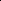

# Distributional Priors Guided Diffusion for Generating 3D Molecules in Low Data Regimes

<!-- Page 1 -->

Distributional Priors Guided Diffusion for Generating 3D Molecules in Low Data Regimes

Haokai Hong1, Wanyu Lin1,2,*, Ming Yang3, Kay Chen Tan1

1The Department of Data Science and Artificial Intelligence, The Hong Kong Polytechnic University, Hong Kong SAR, China. 2The Department of Computing, The Hong Kong Polytechnic University, Hong Kong SAR, China. 3The Department of Applied Physics, The Hong Kong Polytechnic University, Hong Kong SAR, China. haokai.hong@connect.polyu.hk, {wan-yu.lin,kevin.m.yang,kctan}@polyu.edu.hk

## Abstract

Can we train a 3D molecule generator using data from dense regions to generate samples in sparse regions? This challenge can be framed as an out-of-distribution (OOD) generation problem. While prior research on OOD generation predominantly targets property shifts, structural shifts— such as differences in molecular scaffolds or functional groups—represent an equally critical source of distributional shifts. This work introduces the Geometric OOD Diffusion Model (GODD), a novel diffusion-based framework that enables training on data-abundant molecular distributions while generalizing to data-scarce distributions under distributional structural shifts. Central to our approach is a designated equivariant asymmetric autoencoder to capture distributional structural priors. The asymmetric design allows the model to generalize to unseen structural variations by capturing distributional priors representing distinct distributions. The encoded structural-grained priors guide generation toward sparse regions without requiring explicit training on such data. Evaluated across standard benchmarks encompassing OOD structural shifts (e.g., scaffolds, rings), GODD achieves an improvement of 12.6% in success rate, defined based on molecular validity, uniqueness, and novelty. Furthermore, the framework demonstrates promising performance and generalization on canonical fragment-based drug design tasks, highlighting its utility in learning-based molecular discovery.

## Introduction

Geometric generative models are proposed to approximate the distribution of complex geometries and are used to generate feature-rich geometries (Watson et al. 2023; Xie et al. 2022). There has been fruitful research progress on 3D molecule generation based on geometric generative modeling. Recent representative models for generating 3D molecules in silico include autoregressive (Luo and Ji 2022), flow-based models (Garcia Satorras et al. 2021), and diffusion models (Hoogeboom et al. 2022). Among others, diffusion models have demonstrated their superior performance (Hoogeboom et al. 2022). However, these generative models require tremendous data to mimic the training distribution. They can barely generate samples that are rare or

*Corresponding author. Copyright © 2026, Association for the Advancement of Artificial Intelligence (www.aaai.org). All rights reserved.

QM9 Scaffold Propotion (%)

Domains In-dist OOD I OOD II # Molecules 100,000 15,000 15,831 # Scaffolds 1,054 2,532 12,075

Dataset 76.4 11.5 12.1

EDM 91.4 2.7 4.9 GeoLDM 90.6 3.5 5.9

**Table 1.** Preliminary results on QM9. In distribution, OOD I and OOD II encompass molecules with high-, low-, and rare-frequency scaffolds, respectively.

even absent in the training set, hindering their applicability to de novo molecule generation (Walters and Murcko 2020).

Taking a canonical molecule dataset – QM9 as our running example, diverse scaffolds of molecules have varying proportions and frequencies in nature (Ramakrishnan et al. 2014; Wu et al. 2018). Our initial findings indicate that existing diffusion-based molecular generative models, such as EDM (Hoogeboom et al. 2022) and GeoLDM (Xu et al. 2023), effectively capture the training data distribution, generating molecules with high-frequency scaffolds. However, these models struggle to generate molecules with rare scaffolds (see Table 1). With the expressive power of state-ofthe-art diffusion-based generators, we ask: Can we train a diffusion model using data from dense regions to generate realistic and valid 3D samples in sparse regions?

To address the data scarcity issue, we propose leveraging the concept of out-of-distribution (OOD) generalization and framing the problem as OOD generation. Our objective, therefore, is to train a generator with data-abundant distribution and steer it to generate samples in sparse regions. The distribution shift generally comes from properties or core structures, such as certain types of scaffolds, ring-structures, fragments, or any sub-structures of molecules (Wu et al. 2018; Zhuang et al. 2023). Certain sets of fragments or properties depict distinct distributions. On the one hand, current fragment-based methodologies focus on in-distribution molecule generation, which is hard to generalize to generate new samples with fragments lying in sparse regions (Ayadi et al. 2024; Igashov et al. 2024). On the other hand, existing works on OOD generation mainly focus on prop-

The Fortieth AAAI Conference on Artificial Intelligence (AAAI-26)

21743

<!-- Page 2 -->

erty shifts (Lee, Jo, and Hwang 2023; Klarner et al. 2024). They usually utilize a naive property predictor for guidance, where the properties are scalars. Due to the sparsity of certain 3D structures, it is imperative to design new OOD generative frameworks to deal with structural shifts.

This paper presents a novel Geometric OOD Diffusion Model (GODD) that employs distributional structural priors to guide 3D molecule generation in data-sparse regions. To enable OOD generation under structural shifts, GODD learns generalizable and equivariant structural representations, termed distributional structural priors, which are integrated into the denoising process. We utilize an asymmetric encoder-decoder architecture, inspired by the success of asymmetric autoencoders in generalizable representation learning, to characterize these priors. This design facilitates transferable learning across distributions, enabling generalization to unseen structural variations, such as OOD scaffolds or ring structures. The GODD workflow is illustrated in Figure 1, with our main contributions outlined below:

First, to the best of our knowledge, we are the first study to tackle 3D molecule generation in data-sparse regions and frame the problem as an out-of-distribution generation problem under structural shift. We ensure and theoretically prove that the structural priors extracted by the designed asymmetric autoencoder are SE(3)-equivariant. Our proposed framework does not require additional training on OOD data.

Second, we evaluate out-of-distribution generation setting with benchmarking datasets. We compare it with alternative baselines, including vanilla generative models, fragmentbased drug design methods, and OOD generative models. Besides, we empirically validate the effectiveness of asymmetric design in OOD generation with ablation studies. Extensive experimental results show that the structural priors enable the model to generate molecules with desired OOD structural variations in data-sparse regions. The success rate of molecules generated by GODD is improved by up to 12.6% compared with existing methods. Third, we demonstrate that our generative framework, guided by structural priors, can be applied to fragmentbased OOD generation. We verify that our framework can be readily adapted to link multiple fragments under OOD settings. Specifically, we evaluate our method with a canonical fragment-based drug design task—linker design—and showed that the proposed method exhibits promising performance in fragment linking within the OOD context (Igashov et al. 2024).

Problem Setup Notations: Let d be the dimensionality of node features; a 3D molecule can be represented as a point cloud denoted as G = →x, h↑, where x = (x1,..., xN) ↓RN→3 is the atom coordinate matrix and h = (h1,..., hN) ↓RN→d is the node feature matrix containing atomic type, charge features, etc. For a given molecule G, the core structure 1 is a subgraph of the original molecule, represented as Gf = →xf, hf↑.

1We recognize the distinct use of “structure” here versus in “structure-based drug design” but retain it to denote molecular substructures for clarity and readability in this work.

We explore three important substructures in this work, including scaffold, ring-structure, and fragments. Specifically, the scaffold is its structural framework (Bemis and Murcko 1996), termed as “chemotypes”. The ring structures are also essential substructures in chemistry and biology (Karageorgis, Warriner, and Nelson 2014; Ward and Beswick 2014; Ritchie and Macdonald 2009), which could also be a factor that incurs the distribution shift. Fragment, in drug design and biology, refers to a small, low molecular weight compound that binds weakly but specifically to a biological target, serving as a foundational scaffold in fragment-based drug discovery (FBDD) (Murray and Rees 2009; Ayadi et al. 2024; Igashov et al. 2024). Out-of-Distribution (OOD) Generation Problem: We consider the problem of OOD generation in the following two scenarios: OOD scaffold and OOD ring-structure generation, respectively. Given a collection of molecules as training samples and corresponding in distributional substructure set (including scaffold, ring-structure, or fragments) denoted as {GI}, {Gf

I }, respectively. OOD generation aims to learn a generative model that can generate valid and novel molecules falling into a new distribution, where the corresponding structure set is {Gf

O}, and the OOD structure set is unseen during training, a.k.a. {Gf

I } ↔{Gf

O} = ↗. We review OOD generation and fragment-based drug design in Appendix L.

## 3 Method

Equivariant Asymmetric Autoencoder

Distributional Structural Prior. For a given substructure Gf = →xf, hf↑, the distributional structural prior learned from the substructure (F) is defined as F = →fx, fh↑.

Asymmetric Autoencoder. The asymmetric autoencoder comprises an encoder E, which maps substructure Gf to a latent space, represented as fx, fh = E(xf, hf). Additionally, it includes a decoder D that reconstructs the latent representation back to the original molecular space, denoted as ˆx, ˆh = D(fx, fh). Our autoencoder reconstructs the input by predicting the coordinates and features of complete atoms. The loss function computes the mean squared error (MSE) between the reconstructed and original molecules in the original molecular space. The autoencoder can be trained by minimizing the reconstruction objective, expressed as f(G, D(E(Gf))). The encoder of the autoencoder functions solely on the substructure Gf, while the decoder reconstructs the input from the latent representation to the complete molecule G. This asymmetric encoder-decoder design offers promising generalization (He et al. 2022) to the latent features. These features serve as structural priors and empower the model to generate molecules with unseen substructures.

Equivariant Asymmetric Autoencoder. However, naively applying an autoencoder in the geometric domain is non-trivial. The diffusion model within the overall framework operates in 3D molecular space and necessitates conditions to be either equivariant or invariant. Therefore, it is crucial to ensure the equivariance of the conditions extracted

21744

<!-- Page 3 -->

Noise

Indistribution

OOD

OOD Structures

OOD structures as structural prior to steer the generation

Distributional

Structural

Prior! "

Diffusion Denoising

Steering the generation

Training Generating

Core structures

(a) (b)

**Figure 1.** The Illustration of the Proposed GODD Framework. (a): GODD leverages OOD structures as priors to guide generation toward data-sparse regions. (b): Training pipeline and generation pipeline for our proposed GODD framework.

by the autoencoder. To achieve this, we design our asymmetric autoencoder based on the Equivariant Graph Neural Networks (EGNNs) (Satorras, Hoogeboom, and Welling 2021), thereby incorporating equivariance into both the encoder Eω and decoder Dε, where ω and ε are two learnable EGNNs. equivariant design ensures that the latent representations fx and fh encoded by the encoder from substructures are 3- D equivariant and k-d invariant, respectively. Consequently, Equivariant Asymmetric Autoencoder (EAAE) extracts both invariant and equivariant conditions, as expressed below:

Rfx + t, fh =Eω(Rxf + t, hf) (1)

Rˆx + t, ˆh =Dε(Rfx + t, fh), (2)

for all rotations R and translations t. Detailed architecture information about the asymmetric autoencoder can be found in Appendix B. The point-wise latent space adheres to the inherent structure of geometries Gf, which facilitates learning conditions for the diffusion model and results in high-quality molecule design.

Following (Hoogeboom et al. 2022), to ensure that linear subspaces with the center of gravity always being zero can induce translation-invariant distributions, we define distributions of substructures xf, structural priors fx, and reconstructed ˆx on the subspace that!

i xf i (or fx,i and ˆxi) = 0. Then the encoding and decoding processes can be formulated by qω(fx, fh|xf, hf) = N(Eω(xf, hf), ϑ0I) and pε(x, h|fx, fh) = "N i=1 pε(xi, hi|fx, fh) and the EAAE can be optimized by:

LEAAE(G, Gf) = Eqω(fx,fh|xf,hf)pε(x, h|fx, fh)

↘KL[qω(fx, fh|xf, hf)||

N # i

N(fx,i, fh,i|0, I)],

(3)

where Eqω(fx,fh|xf,hf)pε(x, h|fx, fh) is the asymmetric reconstruction loss and is calculated as L2 norm or cross-entropy for continuous or discrete features. KL[qω(fx, fh|xf, hf)|| "N i N(fx, fh|0, I]) is a regularization term between qω and standard Gaussians. LEAAE is the standard VAE loss and is the variational lower bound of loglikelihood. The equivariance of the loss, which is crucial for geometric graph generation, is expressed as follows: Theorem 3.1 If LEAAE is an SE(3)-invariant variational lower bound to the log-likelihood, i.e., for any substructure →xf, hf↑and molecule →x, h↑, we have ≃R and t, LEAAE(x, h, xf, hf) = LEAAE(Rx+t, h, Rxf + t, hf).

Theorem 3.1 guarantees that the asymmetric autoencoder is SE(3)-equivariant, ensuring that the extracted conditioning features obey the required symmetry constraints and that the conditional denoising step of the geometric diffusion model remains equivariant. The full proof is provided in Appendix C. In summary, EAAE encodes the structural prior Gf with the encoder E to produce equivariant latent features fx and invariant latent features fh. These features serve two roles: they are fed to the decoder D for reconstruction, which regularizes the latent space, and they are used as symmetryaware conditions to guide the diffusion denoising process. The precise conditioning mechanism is detailed in the next section.

Structural Prior Steered Diffusion Model Generally, geometric diffusion models are capable of controllable generation with given conditions s by modeling conditional distributions p(z|s). This modeling in DMs can be implemented with conditional denoising networks ϖϑ(z, t, s) with the critical difference that it takes additional inputs s. However, an underlying constraint of such use is the assumption that s is invariant. By contrast, a fundamental challenge for our method is that the conditions for the DM contain not only invariant features fh but also equivariant features fx. This requires the distribution pϑ(z0:T) of our DMs to satisfy the critical invariance:

≃R, pϑ(zx, zh, fx, fh) = pϑ(Rzx, zh, Rfx, fh), (4) where zx and zh are the noises. To achieve this, we should ensure that (1) the initial distribution p(zx,T, zh,T, fx, fh) is invariant, which is already satisfied since zx,T is projected down by subtracting its center of gravity after sampling from standard Gaussian noise. With the fx, fh is

21745

AI-readable visual equivalent, added: Figure extracted from the paper PDF and converted to an SVG wrapper asset. Use the surrounding page text and caption for interpretation.

AI-readable visual equivalent, added: Figure extracted from the paper PDF and converted to an SVG wrapper asset. Use the surrounding page text and caption for interpretation.

AI-readable visual equivalent, added: Figure extracted from the paper PDF and converted to an SVG wrapper asset. Use the surrounding page text and caption for interpretation.

AI-readable visual equivalent, added: Figure extracted from the paper PDF and converted to an SVG wrapper asset. Use the surrounding page text and caption for interpretation.

AI-readable visual equivalent, added: Figure extracted from the paper PDF and converted to an SVG wrapper asset. Use the surrounding page text and caption for interpretation.

AI-readable visual equivalent, added: Figure extracted from the paper PDF and converted to an SVG wrapper asset. Use the surrounding page text and caption for interpretation.

AI-readable visual equivalent, added: Figure extracted from the paper PDF and converted to an SVG wrapper asset. Use the surrounding page text and caption for interpretation.

AI-readable visual equivalent, added: Figure extracted from the paper PDF and converted to an SVG wrapper asset. Use the surrounding page text and caption for interpretation.

AI-readable visual equivalent, added: Figure extracted from the paper PDF and converted to an SVG wrapper asset. Use the surrounding page text and caption for interpretation.

<!-- Page 4 -->

obtained by equivariant Eω (Equations 1); (2) the conditional reverse processes via ϱ, which is expressed as pϑ(zx,t↑1, zh,t↑1|zx,t, zh,t, fx, fh), are equivariant:

≃R, pϑ(zx,t↑1, zh,t↑1|zx,t, zh,t, fx, fh) = pϑ(Rzx,t↑1, zh,t↑1, |Rzx,t, zh,t, Rfx, fh), (5)

this can be realized by implementing the denoising network ωϑ with EGNN that satisfy the following equivariance:

≃R and t, Rzx,t↑1 + t, zh,t↑1 = ωϑ(Rzx,t + t, zh,t, Rfx + t, fh, t). (6)

To keep translation invariance, all the intermediate states zx,t, zh,t are also required to lie on the subspace by!

i zx,t,i = 0 by moving the center of gravity. Analogous to the equation in training diffusion model (Ho, Jain, and Abbeel 2020), now we can train the Distributional Prior Steered Diffusion Model (DSDM) by minimizing the loss:

LDSDM(G, Gf) =

EG,E(Gf),ϖ,t

$ w(t)⇐ω ↘ωϑ(zx,t, zh,t, fx, fh, t)⇐2%

,

(7)

with w(t) simply set as 1 for all steps t, where w(t) = ϱt 2ς2 t φt(1↑¯φt) is the reweighting term (Ho, Jain, and Abbeel 2020). As the EGNN only receives atomic coordinates and features zx,t and zh,t, we concatenate fx and fh to the node features zh,t. Specifically, with node features zh,t ↓RN→d, a time-step embedding t ↓RN→1, fx ↓RN →→3, and fh ↓RN →→k, the EGNN within the denoising network ωϑ processes coordinates zx,t ↓RN→3 and concatenated features zh,t ↓RN→(d+3+k+1). Since the number of atoms of the substructure (N ↓) is less than the number of atoms of the molecule (N), zeros are padded to fx and fh. We briefly introduced diffusion models in Appendix A.

Training and Generating OOD Samples Training. The training loss of the entire framework can be formulated as L = LEAAE + LDSDM. To make the training loss tractable, we also show that L is theoretically an SE(3)invariant variational lower bound of the log-likelihood, and we can have: Theorem 3.2 Let L:= LEAAE + LDSDM. With certain weights w(t), L is an SE(3)-invariant variational lower bound to the log-likelihood.

Given the above training loss and Theorem 3.2, we can optimize GODD via back-propagation with the reparameterizing trick (Kingma and Welling 2013). We provide the detailed proof of Theorem 3.2 in Appendix D, and a formal description of the optimization procedure in Algorithm 1 in Appendix F. We follow the process of EDM (Hoogeboom et al. 2022) regarding the representation for continuous features x and categorical features h. For clarity, we provide the details in Appendix B.

Generating OOD Molecules. With GODD trained on dataset {GI} and given an OOD scaffold/ring-structure Gf

O, we can perform OOD molecule generation (a scaffold OOD generative process is illustrated in Figure 8 in Appendix K). To sample from the model, one first inputs the Gf

O into the encoder Eω and obtains the latent representation of Gf

O denoted as structural prior →fx, fh↑via reparameterization. With the OOD structural prior as condition, the framework first samples zx,T, zh,T ⇒ Nx,h(0, I) and then iteratively samples zx,t↑1, zh,t↑1 ⇒pϑ(zx,t↑1, zh,t↑1|zx,t, zh,t, fx, fh). Finally, the output molecule represented as →x, h↑is sampled from p(zx,0, zh,0|zx,1, zh,1, fx, fh). The pseudo-code of the OOD generation is provided in Algorithm 2 in Appendix F.

## Experiments

## Experiment

Setup

Datasets and Tasks. We evaluate over QM9 (Ramakrishnan et al. 2014) and the GEOM-DRUG (Axelrod and G´omez- Bombarelli 2022). Specifically, QM9 is a standard dataset that contains molecular properties and atom coordinates for 130,000 3D molecules with up to 9 heavy atoms and up to 29 atoms. GEOM-DRUG encompasses around 450,000 molecules, each with an average of 44 atoms and a maximum of 181. Dataset details and experimental parameters are presented in Appendices G, H, and E.

Ring-Structure Molecule Generation. Ring-structure variations cause distribution shifts in this task. Using RD- Kit (Landrum et al. 2016), we classified QM9 dataset molecules into nine groups (0–8 rings), with molecule counts decreasing as ring numbers increase. The QM9 dataset was split into training (0–3 rings) and five target distributions (4–8 rings). Figure 5 in the Appendix shows example molecules with 0–8 rings. For the GEOM-DRUG dataset, molecules have 0–14 or 22 rings. The training set includes 0–10 rings, with five target distributions (11–14 and 22 rings), each containing fewer than 100 molecules, indicating data-sparse regions.

Scaffold Molecule Generation. Scaffold variations in this task cause distribution shifts. Using RDKit (Landrum et al. 2016), we analyzed the scaffolds of molecules in the QM9 dataset, marking those without scaffolds as ‘-’ and including them in the total scaffold count. The dataset was split based on scaffold frequency: the in-distribution set comprised 100,000 molecules and 1,054 scaffolds, most appearing ⇑100 times; out-of-distribution I (OOD I) included 15,000 molecules and 2,532 scaffolds, most appearing 10–100 times; and out-of-distribution II (OOD II) contained 15,831 molecules and 12,075 scaffolds, each appearing < 10 times. We aim to train a generative model on the in-distribution data to produce effective molecules for target distributions, such as OOD I and II.

Linker Design. We evaluated the framework on the linker design task, demonstrating GODD’s proof-of-concept in canonical fragment-based design under out-of-distribution (OOD) settings. Notably, the GEOM-LINKER dataset exhibits fragment shifts driven by molecular ring counts, with molecules having more than eight rings being highly sparse. For evaluation, we divided the GEOM-LINKER dataset by ring count, designating molecules with sparse ring numbers as the OOD test set. Additional details on the GEOM-

21746

<!-- Page 5 -->

LINKER dataset and related work are provided in Appendices I and L.

Baselines. We evaluate four methodological categories for comprehensive performance comparisons: unconditional generation, conditional generation, OOD generation, and fragment-based drug design frameworks. 1. Unconditional Generation: We benchmark four state-of-the-art 3D unconditional molecule diffusion models—EDM (Hoogeboom et al. 2022), GeoLDM (Xu et al. 2023), EquiFM (Song et al. 2023a), and GeoBFN (Song et al. 2023b)—to assess the OOD generation capabilities of our proposed GODD. 2. Conditional Generation: We adapt EEGSDE (Bao et al. 2023) and modify EDM and GeoLDM (denoted C- EDM, C-GeoLDM, and EEGSDE) for scalar-based conditional generation using ring counts as the conditional feature to evaluate GODD’s performance in OOD ringstructure generation. 3. OOD-Specific Frameworks: We compare GODD against MOOD (Lee, Jo, and Hwang 2023) and CGD (Klarner et al. 2024), two dedicated OOD generative frameworks, for ring-structure molecule generation tasks. 4. Fragment-Based Methods: We evaluate DiffLinker (Igashov et al. 2024) and LinkerNet (Guan et al. 2024) as fragment-based baselines, using the same scaffold/ring-structure/fragment inputs as GODD. DiffLinker employs a diffusion model for multi-fragment linking, while LinkerNet uses Riemannian manifold-based diffusion for enhanced geometric fidelity.

Metrics. Our objective is to generate effective 3D molecules in data-sparse regions. A generated sample is effective only when it falls into the target distribution while it is valid, unique, and novel simultaneously. Therefore, our evaluation metrics can be defined as follows:

## 1 Proportion (P):

Given an OOD scaffold/ring set {Gf O}, proportion describes the percentage of molecules that contain the desired scaffold/ring-structure in {Gf

O} among generated valid samples; 2. Coverage (C): Coverage describes the percentage of scaffold set of the generated samples (denoted as {Gf

G}) in the OOD scaffold set {Gf

O}, which is expressed as C = |{Gf

G}|/|{Gf

O}|; 3. Target atom stability (AS): The ratio of atoms that has the correct valency with the desired scaffold/ring-structure among all generated molecules; 4. Target molecule stability (MS): The ratio of generated molecules contains the desired scaffold/ringstructure, and all atoms are stable. GEOM-DRUG dataset has nearly 0% molecule-level stability, so this metric is generally ignored on GEOM-DRUG (Hoogeboom et al. 2022); 5. Target validity (V): The percentage of valid molecules among all the desired molecules, which is measured by RDkit (Landrum et al. 2016) and widely used for calculating validity (Hoogeboom et al. 2022; Xu et al. 2023)); 6. Target novelty (N): The percentage of novel molecules among all the desired valid molecules, the novel molecule is different from training samples; 7. Success rate (S): The ratio of generated valid, unique, and novel molecules that contain the desired scaffold/ring-structure.

## Results

and Analysis

Ring-Structure Molecule Generation.

QM9 Dataset. All models were trained on identical datasets containing molecules with 0–3 rings. We evaluated their in-distribution (0–3 rings) and out-of-distribution (OOD; 4–8 rings) generation performance. Results for 10,000 generated molecules per ring-count distribution are shown in Table 2. Atom stability, molecule stability, validity, novelty, and success rate are averaged across four training distributions and five target distributions (full results in Appendix J). 1) Table 2 demonstrates that uncontrollable baseline methods (e.g., EDM, GeoLDM, EquiFM, GeoBFN) exhibit limited success in OOD generation, achieving ⇓7.0% success rates for 4–8 ring molecules (Table 2), signifying the challenge of OOD generation under the structural shift. 2) Incorporating explicit ring-count controls (C-EDM, C- GeoLDM, EEGSDE) and dedicated OOD methods (e.g., MOOD, CGD) moderately improves OOD performance (up to 26.2%), underscoring the difference between property shift and structural shift and the inherent difficulty of the latter. 3) Fragment-based approaches (DiffLinker, Linker- Net), while using identical input data as our method, underperform across all metrics, particularly in OOD settings. This highlights both the limitations of existing fragmentbased frameworks in generalization and the critical role of our distributional prior representations in guiding molecular generative models. 4) Our GODD achieves a 40.5% success rate. Moreover, we observe that most methods (i.e., C-GeoLDM, C-EDM, and EEGSDE) and OOD methods (MOOD and CGD) cannot generate 8-ring molecules, re- flecting the difficulty of generating those complex and sparse molecules in the original QM9 (only 36 8-ring molecules). Our results validate that GODD achieves robust OOD 3D molecule generation, even under challenging ring-structure shifts and data-sparse distributional regimes. These findings underscore the necessity of domain-specific inductive biases for generalizable molecular generation in low-data settings.

GEOM-DRUG Dataset. Table 3 presents statistical comparisons of molecular generation methods for rare ring systems (11–14 and 22 rings) on the GEOM-DRUG dataset, where molecules with higher ring counts exhibit extreme sparsity. Both unconditional baselines (EDM, GeoLDM, EquiFM, and GeoBFN) and OOD baselines (MOOD and CGD) fail to generate molecules exceeding 10 rings. Although DiffLinker and LinkerNet incorporate OOD structural priors, they underperform GODD across all metrics, including proportion (p < 0.1015), validity (11.0% vs. 5.01% and 7.92%), and novelty (13.8% vs. 6.25% and 9.73%). These results further confirm that fragment-based drug design methods inherently lack OOD generalization capabilities. In contrast, GODD achieves an average success rate of 13.8% for OOD ring counts despite being trained exclusively on molecules containing 0–10 rings, demonstrating robust generalization.

Scaffold Molecule Generation. In the task of OOD scaffold molecule generation, the structural sparsity of scaffolds (12,075 unique scaffolds among 15,831 molecules) precludes effective classifier training or the definition of specific scalar properties for conditional or existing OOD generative models. Consequently, conditional and OOD-

21747

<!-- Page 6 -->

Metrics → P (%) in Distributions P (%) in OOD Generation AS MS V N S

## Rings 0 1 2 3 4 5 7 8 Averaged Metrics (%)

QM9 10.2 39.3 27.6 15.1 4.4 2.7 0.6 0.2 0.0 99.0 95.2 97.7 - -

EDM 10.5 39.8 28.0 14.5 4.0 2.9 0.2 0.1 0.0 11.0 9.7 10.5 6.8 6.3 GeoLDM 12.0 38.6 27.0 15.3 4.6 2.2 0.2 0.1 0.0 10.9 9.1 10.4 6.4 5.9 EquiFM 12.1 44.1 29.8 11.8 1.7 0.5 0.0 0.0 0.0 11.0 9.7 10.4 6.8 6.3 GeoBFN 2.8 41.5 32.1 15.7 4.7 2.7 0.3 0.1 0.0 10.9 9.1 10.4 6.7 6.1

C-EDM 98.9 94.2 80.8 64.4 12.6 26.8 0.3 0.1 0.0 41.3 33.9 38.0 27.3 24.1 C-GeoLDM 97.1 89.4 74.2 52.4 22.3 22.7 0.9 0.2 0.0 39.1 31.5 35.7 28.3 25.0 EEGSDE 98.4 92.2 77.6 58.2 14.1 17.6 0.3 0.0 0.0 39.1 31.1 35.7 27.2 24.2

MOOD 80.7 87.1 86.1 73.3 34.1 32.3 10.3 0.2 0.0 44.3 39.0 42.1 27.7 25.5 CGD 82.3 84.8 86.2 83.6 34.4 22.4 10.3 10.1 0.0 45.5 40.0 43.2 28.4 26.2

DiffLinker 99.7 99.9 99.0 91.4 84.7 75.6 74.6 63.2 59.4 78.8 53.7 70.3 48.4 26.4 LinkerNet 99.8 99.6 88.8 87.2 83.2 73.7 66.1 64.7 59.2 76.0 51.6 72.2 54.4 37.0

GODD 99.9 99.8 99.1 97.6 92.5 89.7 78.7 88.2 82.1 83.1 54.0 77.9 70.3 40.5

C-: C-EDM and C-GeoLDM are trained with conditioning on ring counts.

**Table 2.** Results of molecule proportion in terms of ring-number (P), atom stability (AS), molecule stability (MS), validity (V), novelty (N), and success rate (S). QM9 contains 36 eight-ring molecules, and the proportion is nearly 0.

Averaged metrics (%) ⇔ Method P AS V N S GEOM-DRUG 0.00 86.50 99.90 - - EDM 0.00 0.00 0.00 0.00 0.00 GeoLDM 0.00 0.00 0.00 0.00 0.00 EquiFM 0.00 0.00 0.00 0.00 0.00 GeoBFN 0.00 0.00 0.00 0.00 0.00 MOOD 0.00 0.00 0.00 0.00 0.00 CGD 0.00 0.00 0.00 0.00 0.00 DiffLinker 6.29 5.21 5.01 6.25 4.16 LinkerNet 10.15 8.36 7.92 9.73 7.75 GODD 13.8 11.4 11.0 13.8 10.9

**Table 3.** Results of molecule proportion in terms of ring number (P), atom stability (AS), molecule validity (V), novelty (N), and success rate (S). The number of molecules with above 11 rings in GEOM-DRUG is lower than 100.

specific frameworks are excluded from consideration. All baseline methods were trained exclusively on in-distribution data. Upon completion of training, each model generated 15,000 molecules under in-distribution, OOD-I, and OOD- II settings. Quantitative results across evaluation metrics are presented in Table 4, Table 5, and Figure 2. Baseline methods (EDM, GeoLDM, EquiFM, GeoBFN) produce molecules with scaffold proportions closely resembling the training distribution but fail to adequately approximate the target OOD-I and OOD-II distributions (Table 4). Fragmentbased methods (DiffLinker, LinkerNet) achieve reasonable in-distribution performance but demonstrate marked degradation in OOD generation, with a 12% reduction in scaffold coverage for the highly sparse OOD-II scaffolds. This further corroborates the limitations of fragment-based approaches in OOD scenarios. In contrast, our proposed GODD framework successfully generates OOD molecules

GODD

**Figure 2.** Visualization of Coverage. Molecules generated by the proposed method cover more OOD scaffolds.

containing specified target scaffolds when provided with molecular substructures, achieving scaffold proportions exceeding 95% for both OOD distributions. The method demonstrates consistent performance across in-distribution and OOD settings, validating the efficacy of leveraging distributional priors to steer 3D molecular generation.

Notably, for OOD-II—which comprises over 12,000 distinct rare scaffolds—only GODD achieves 85.7% scaffold coverage, underscoring the critical contribution of our EAAE. GODD operates without requiring OOD training data, instead leveraging molecular substructures as structural priors to circumvent data scarcity constraints. Under the same condition with baselines DiffLinker and Linker- Net, the framework achieves improvements of up to 22.3% in molecular novelty and 12.6% in success rate relative to fragment-based baselines. As evidenced by the atom- and molecule-level stability metrics in Table 5, GODD demonstrates superior capability in generating chemically stable molecules with target scaffolds compared to existing approaches.

21748

<!-- Page 7 -->

Distributions In Distribution (%) OOD I (%) OOD II (%)

Metric → P C V N S P C V N S P C V N S

Data 76.4 100.0 97.7 - - 11.5 100.0 97.7 - - 12.1 100.0 97.7 - -

EDM 91.4 56.5 83.2 58.2 52.0 5.9 26.5 5.3 3.7 3.3 2.7 17.0 2.4 1.7 1.5 GeoLDM 90.6 54.3 81.7 57.8 51.0 5.9 26.7 5.3 3.8 3.3 3.5 19.0 3.2 2.3 2.0 EquiFM 91.0 56.3 86.2 48.9 46.3 5.4 27.8 5.1 2.9 2.7 3.6 17.4 0.0 0.0 0.0 GeoBFN 91.1 54.4 86.8 60.5 57.7 6.0 27.3 5.7 4.0 3.8 2.9 19.9 2.7 1.9 1.8

DiffLinker 91.8 74.8 83.9 52.8 47.7 90.3 81.8 79.0 79.9 58.7 80.4 60.1 66.2 59.7 42.8 LinkerNet 89.4 74.5 82.1 62.5 49.9 87.9 83.0 76.2 75.8 64.3 79.9 61.0 65.2 58.0 53.2

GODD 99.2 92.5 90.7 67.6 52.4 97.0 97.1 80.0 84.5 68.9 95.5 85.7 83.3 82.0 65.8

**Table 4.** Results of proportion (P), scaffold coverage (C), molecule validity (V), molecule novelty (N), and success rate (S).

Distributions In-dist (%) OOD I (%) OOD II (%) # Metric⇔ AS MS AS MS AS MS Data 99.0 95.2 99.0 95.2 99.0 95.2 EDM 90.4 73.3 5.8 4.7 2.6 2.1 GeoLDM 89.1 75.6 5.8 4.9 3.5 3.0 EquiFM 90.0 80.4 5.3 4.8 3.6 3.2 GeoBFN 90.3 82.8 5.9 5.5 2.9 2.6 DiffLinker 89.6 57.5 85.6 29.5 76.5 30.3 LinkerNet 87.3 69.2 83.5 37.3 71.5 30.6 GODD 96.1 71.3 89.5 45.6 89.0 35.1

**Table 5.** Results of atom stability and molecule stability.

GEOM-LINKER QED ⇔ SA ↖ V (%) ⇔ S (%) ⇔ DiffLinker 0.56 3.92 42.17 14.45 LinkerNet 0.56 3.89 48.5 18.9 GODD 0.57 3.63 65.2 22.61

**Table 6.** Results on the quantitative estimate of drug-likeness (QED), synthetic accessibility (SA), validity (v), and success rate (S) on the OOD linker design task.

## Evaluation

on the Task of Linker Design. Beyond validity and uniqueness, we incorporate established metrics from prior work, including quantitative drug-likeness (QED) and synthetic accessibility (SA) scores. Benchmark analyses reveal that existing linker design methods underperform in out-of-distribution (OOD) fragment linking, with validity rates below 50%. In contrast, our framework achieves 65.2% validity. Furthermore, our approach yields molecules with higher QED and lower SA scores, demonstrating advantages in both drug-likeness and synthesizability. These results demonstrate GODD as a robust solution for OOD fragment linking, surpassing conventional methods in critical performance metrics.

Ablation Study for Evaluating the Significance of the Asymmetric Autoencoder. We present the ablation study in Table 7 featuring a variation of the proposed method, GODD*, which utilizes a symmetric autoencoder. Specifically, the autoencoder of GODD receives and reconstructs only the substructure. The results indicate that

Distribution In-dist (%) OOD I (%) OOD II (%) Metrics⇔ P C V P C V P C V GODD* 99.2 98.5 85.1 95.1 96.9 58.3 94.3 84.0 35.0 GODD 99.2 92.5 90.7 97.0 97.1 80.0 95.5 85.7 83.3 Metrics⇔ AS MS S AS MS S AS MS S GODD* 89.2 68.4 52.1 82.0 12.8 41.8 75.1 10.4 31.0 GODD 96.1 71.3 52.4 89.5 45.6 68.9 89.0 35.1 65.8

→GODD* with a symmetric autoencoder.

**Table 7.** Results of proportion (P), scaffold coverage (C), molecule validity (V), molecule success rate (S), atom stability (AS), and molecule stability (MS).

GODD* demonstrates promising in-distribution generation and achieves better performance in scaffold coverage, aligning with the performance of traditional autoencoders in the in-distribution tasks. However, GODD* performs worse than GODD in OOD generation. Although GODD* achieves similar proportions and coverage by receiving OOD substructures, its generation quality is worse, particularly regarding stability and validity. This suggests that even with substructures, GODD* is still hard to generalize to generate valid molecules in OOD scenarios. These observations underscore the effectiveness of using asymmetric autoencoder.

## 5 Conclusion

This paper investigated the problem of OOD molecule generation in the context of structural shifts and proposed an asymmetric autoencoder to represent substructures as structural priors to steer the generation toward data-sparse regions. Our quantitative experiments demonstrated that the proposed method surpasses existing techniques, including unconditional, conditional, and OOD approaches, in generating valid, unique, and novel OOD molecules with desired substructures in data-sparse regions. Extensive quantitative results in successful OOD generation validated the ability of asymmetric autoencoder to encode unseen structure and the potential of GODD in steering generation through the encoded structural priors. Furthermore, the linker design experiment confirmed the proposed method’s applicability to fragment-based drug design. Additionally, our framework is generative model-agnostic; it can be seamlessly integrated into other generative models, such as latent diffusion (Xu et al. 2023) or flow-based models (Song et al. 2023a).

21749

<!-- Page 8 -->

## Acknowledgments

This work was partially supported by the Research Grants Council (RGC) of the Hong Kong (HK) SAR (Grant No. 15208725 and 15208222), the Young Scientists Fund of National Natural Science Foundation of China (NSFC) (Grant No. 62206235), and the Hong Kong Polytechnic University (Grant No. A0046682 and P0057774).

## References

Axelrod, S.; and G´omez-Bombarelli, R. 2022. GEOM, Energy-Annotated Molecular Conformations for Property Prediction and Molecular Generation. Scientific Data, 9(1): 185.

Ayadi, S.; Hetzel, L.; Sommer, J.; Theis, F.; and G¨unnemann, S. 2024. Unified Guidance for Geometry- Conditioned Molecular Generation. Advances in Neural Information Processing Systems, 37: 138891–138924.

Bao, F.; Zhao, M.; Hao, Z.; Li, P.; Li, C.; and Zhu, J. 2023. Equivariant Energy-Guided SDE for Inverse Molecular Design. In The Eleventh International Conference on Learning Representations.

Bemis, G. W.; and Murcko, M. A. 1996. The Properties of Known Drugs. 1. Molecular Frameworks. Journal of Medicinal Chemistry, 39(15): 2887–2893.

Bian, Y.; and Xie, X.-Q. 2018. Computational fragmentbased drug design: current trends, strategies, and applications. The AAPS Journal, 20: 1–11.

Celeghini, E.; Giachetti, R.; Sorace, E.; and Tarlini, M. 1991. The Three-Dimensional Euclidean Quantum Group E(3) Q and Its R-Matrix. Journal of Mathematical Physics, 32(5): 1159–1165.

Congreve, M.; Carr, R.; Murray, C.; and Jhoti, H. 2003. A’rule of three’for fragment-based lead discovery? Drug Discovery Today, 8(19): 876–877.

Garcia Satorras, V.; Hoogeboom, E.; Fuchs, F.; Posner, I.; and Welling, M. 2021. E(n) Equivariant Normalizing Flows. In Advances in Neural Information Processing Systems, volume 34, 4181–4192. Curran Associates, Inc.

Gebauer, N.; Gastegger, M.; and Sch¨utt, K. 2019. Symmetry-Adapted Generation of 3D Point Sets for The Targeted Discovery of Molecules. In Advances in Neural Information Processing Systems, volume 32. Curran Associates, Inc.

Guan, J.; Peng, X.; Jiang, P.; Luo, Y.; Peng, J.; and Ma, J. 2024. LinkerNet: Fragment Poses and Linker Co-design with 3D Equivariant Diffusion. Advances in Neural Information Processing Systems, 36.

He, K.; Chen, X.; Xie, S.; Li, Y.; Doll´ar, P.; and Girshick, R. 2022. Masked Autoencoders Are Scalable Vision Learners. In Proceedings of the IEEE/CVF Conference on Computer Vision and Pattern Recognition (CVPR), 16000–16009.

Ho, J.; Jain, A.; and Abbeel, P. 2020. Denoising Diffusion Probabilistic Models. In Advances in Neural Information Processing Systems, volume 33, 6840–6851.

Hong, H.; Lin, W.; and Tan, K. C. 2025. Accelerating 3D Molecule Generation via Jointly Geometric Optimal Transport. In The Thirteenth International Conference on Learning Representations. Hoogeboom, E.; Satorras, V. G.; Vignac, C.; and Welling, M. 2022. Equivariant Diffusion for Molecule Generation in 3D. In Proceedings of the 39th International Conference on Machine Learning, volume 162, 8867–8887. PMLR. Igashov, I.; St¨ark, H.; Vignac, C.; Schneuing, A.; Satorras, V. G.; Frossard, P.; Welling, M.; Bronstein, M.; and Correia, B. 2024. Equivariant 3D-Conditional Diffusion Model for Molecular Linker Design. Nature Machine Intelligence, 1– 11. Jin, W.; Barzilay, R.; and Jaakkola, T. 2018. Junction Tree Variational Autoencoder for Molecular Graph Generation. In Proceedings of the 35th International Conference on Machine Learning, 2323–2332. PMLR. Karageorgis, G.; Warriner, S.; and Nelson, A. 2014. Efficient Discovery of Bioactive Scaffolds by Activity-Directed Synthesis. Nature Chemistry, 6(10): 872–876. Kingma, D.; and Ba, J. 2015. Adam: A Method for Stochastic Optimization. In International Conference on Learning Representations (ICLR). San Diega, CA, USA. Kingma, D. P.; and Welling, M. 2013. Auto-Encoding Variational Bayes. In 2nd International Conference on Learning Representations. Kingma, D. P.; and Welling, M. 2014. Auto-Encoding Variational Bayes. In 2nd International Conference on Learning Representations, ICLR 2014, Banff, AB, Canada, April 14- 16, 2014, Conference Track Proceedings. Klarner, L.; Rudner, T. G.; Morris, G. M.; Deane, C. M.; and Teh, Y. W. 2024. Context-Guided Diffusion for Out-of- Distribution Molecular and Protein Design. In Proceedings of the 41th International Conference on Machine Learning. Landrum, G.; et al. 2016. Rdkit: Open-Source Cheminformatics Software. Open-source Cheminformatics. Lee, S.; Jo, J.; and Hwang, S. J. 2023. Exploring Chemical Space with Score-Based Out-of-distribution Generation. In Proceedings of the 40th International Conference on Machine Learning, volume 202, 18872–18892. PMLR. Liu, Q.; Allamanis, M.; Brockschmidt, M.; and Gaunt, A. 2018. Constrained Graph Variational Autoencoders for Molecule Design. In Bengio, S.; Wallach, H.; Larochelle, H.; Grauman, K.; Cesa-Bianchi, N.; and Garnett, R., eds., Advances in Neural Information Processing Systems, volume 31. Curran Associates, Inc. Luo, S.; and Hu, W. 2021. Diffusion Probabilistic Models for 3D Point Cloud Generation. In Proceedings of the IEEE/CVF Conference on Computer Vision and Pattern Recognition (CVPR), 2837–2845. Luo, Y.; and Ji, S. 2022. An Autoregressive Flow Model for 3D Molecular Geometry Generation from Scratch. In International Conference on Learning Representations. Murray, C. W.; and Rees, D. C. 2009. The rise of fragmentbased drug discovery. Nature Chemistry, 1(3): 187–192.

21750

<!-- Page 9 -->

Peng, X.; Guan, J.; Liu, Q.; and Ma, J. 2023. MolDiff: Addressing the Atom-Bond Inconsistency Problem in 3D Molecule Diffusion Generation. arXiv preprint arXiv:2305.07508.

Ramakrishnan, R.; Dral, P. O.; Rupp, M.; and von Lilienfeld, O. A. 2014. Quantum Chemistry Structures and Properties of 134 Kilo Molecules. Scientific Data, 1(1): 140022.

Ritchie, T. J.; and Macdonald, S. J. 2009. The Impact of Aromatic Ring Count on Compound Developability – Are Too Many Aromatic Rings A Liability in Drug Design? Drug Discovery Today, 14(21): 1011–1020.

Ruddigkeit, L.; van Deursen, R.; Blum, L. C.; and Reymond, J.-L. 2012. Enumeration of 166 Billion Organic Small Molecules in the Chemical Universe Database GDB- 17. Journal of Chemical Information and Modeling, 52(11): 2864–2875. PMID: 23088335.

Satorras, V. G.; Hoogeboom, E.; and Welling, M. 2021. E(n) Equivariant Graph Neural Networks. In Meila, M.; and Zhang, T., eds., Proceedings of the 38th International Conference on Machine Learning, volume 139, 9323–9332. PMLR.

Serre, J.-P.; et al. 1977. Linear Representations of Finite Groups, volume 42. Springer.

Shi, C.; Xu, M.; Zhu, Z.; Zhang, W.; Zhang, M.; and Tang, J. 2020. GraphAF: a Flow-Based Autoregressive Model for Molecular Graph Generation. In International Conference on Learning Representations.

Sohl-Dickstein, J.; Weiss, E.; Maheswaranathan, N.; and Ganguli, S. 2015. Deep Unsupervised Learning using Nonequilibrium Thermodynamics. In Bach, F.; and Blei, D., eds., Proceedings of the 32nd International Conference on Machine Learning, volume 37, 2256–2265. PMLR.

Song, Y.; Gong, J.; Qu, Y.; Zheng, M.; Zhou, H.; Liu, J.; and Ma, W.-Y. 2024. Unified Generative Modeling of 3D Molecules with Bayesian Flow Networks. In The Twelfth International Conference on Learning Representations.

Song, Y.; Gong, J.; Xu, M.; Cao, Z.; Lan, Y.; Ermon, S.; Zhou, H.; and Ma, W.-Y. 2023a. Equivariant Flow Matching with Hybrid Probability Transport for 3D Molecule Generation. Advances in Neural Information Processing Systems, 36.

Song, Y.; Gong, J.; Zhou, H.; Zheng, M.; Liu, J.; and Ma, W.-Y. 2023b. Unified Generative Modeling of 3D Molecules with Bayesian Flow Networks. In The Twelfth International Conference on Learning Representations.

Walters, W. P.; and Murcko, M. 2020. Assessing the Impact of Generative AI on Medicinal Chemistry. Nature Biotechnology, 38(2): 143–145.

Ward, S. E.; and Beswick, P. 2014. What Does the Aromatic Ring Number Mean for Drug Design? Expert Opinion on Drug Discovery, 9(9): 995–1003. PMID: 24955724.

Watson, J. L.; Juergens, D.; Bennett, N. R.; Trippe, B. L.; Yim, J.; Eisenach, H. E.; Ahern, W.; Borst, A. J.; Ragotte, R. J.; Milles, L. F.; Wicky, B. I. M.; Hanikel, N.; Pellock,

S. J.; Courbet, A.; Sheffler, W.; Wang, J.; Venkatesh, P.; Sappington, I.; Torres, S. V.; Lauko, A.; De Bortoli, V.; Mathieu, E.; Ovchinnikov, S.; Barzilay, R.; Jaakkola, T. S.; Di- Maio, F.; Baek, M.; and Baker, D. 2023. De Novo Design of Protein Structure and Function with RFdiffusion. Nature, 620(7976): 1089–1100. Wu, J.-N.; Wang, T.; Chen, Y.; Tang, L.-J.; Wu, H.-L.; and Yu, R.-Q. 2024. t-SMILES: A Fragment-based Molecular Representation Framework for de novo Ligand Design. Nature Communications, 15(1): 4993. Wu, L.; Gong, C.; Liu, X.; Ye, M.; and qiang liu. 2022. Diffusion-Based Molecule Generation with Informative Prior Bridges. In Oh, A. H.; Agarwal, A.; Belgrave, D.; and Cho, K., eds., Advances in Neural Information Processing Systems. Wu, Z.; Ramsundar, B.; Feinberg, E. N.; Gomes, J.; Geniesse, C.; Pappu, A. S.; Leswing, K.; and Pande, V. 2018. MoleculeNet: A Benchmark for Molecular Machine Learning. Chem Sci, 9(2): 513–530. Xie, T.; Fu, X.; Ganea, O.-E.; Barzilay, R.; and Jaakkola, T. S. 2022. Crystal Diffusion Variational Autoencoder for Periodic Material Generation. In International Conference on Learning Representations. Xu, M.; Powers, A. S.; Dror, R. O.; Ermon, S.; and Leskovec, J. 2023. Geometric Latent Diffusion Models for 3D Molecule Generation. In International Conference on Machine Learning, 38592–38610. PMLR. Yang, S.; Hwang, D.; Lee, S.; Ryu, S.; and Hwang, S. J. 2021. Hit and Lead Discovery with Explorative RL and Fragment-based Molecule Generation. In Advances in Neural Information Processing Systems, volume 34, 7924–7936. Curran Associates, Inc. Zhuang, X.; Zhang, Q.; Ding, K.; Bian, Y.; Wang, X.; Lv, J.; Chen, H.; and Chen, H. 2023. Learning Invariant Molecular Representation in Latent Discrete Space. Advances in Neural Information Processing Systems, 36: 78435–78452.

21751
