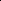

# DRSoRec: Dual-Rectification of Social Networks for Recommendation

<!-- Page 1 -->

DRSoRec: Dual-Rectification of Social Networks for Recommendation

Liangxun Yang1,2, Tianzi Zang1,2*, Jiayi Sun1, Juan Li1, Yicong Li1

## 1 Nanjing University of Aeronautics and Astronautics, Nanjing, China 2 Key Laboratory of Safety-Critical Software,

Ministry of Industry and Information Technology, Nanjing, China

{152230216, zangtianzi, sun jiayi02, juanli}@nuaa.edu.cn, liyicong123@outlook.com

## Abstract

Leveraging social homophily to enhance user preference modeling, social recommendation has become a cornerstone of modern recommender systems. However, the raw social network contains inherent unreliability as it teems with noise—misclicks, bot-generated and transient ties—while many meaningful links remain unobserved. In this study, we propose DRSoRec, a dual-rectification model to rectify the raw social networks by simultaneously removing noisy signals and preserving useful information. Specifically, the invariant social rationale discovery module distills each user’s influential core social circle of the current recommendation, whereas the adaptive social connection refinement module employs a mixture-of-experts structure learner to prune spurious edges and uncover latent links. A contrastive optimization objective is designed to align and mutually enhance these two modules, and the refined user representations are fused with collaborative representations generated from interactions for the final recommendation. Experiments on three public datasets confirm that DRSoRec consistently gains over state-of-the-art baselines.

## Introduction

With the rapid development of social media, users’ social relationships have become richer and more complex. According to the social homophily theory (Mcpherson, Smith- Lovin, and Cook 2001), people who are socially connected are more likely to share similar interests. For this reason, researchers have incorporated social relationships between users as auxiliary information to enhance recommendation performance, which is known as Social Recommendation.

Considering the leverage of social information, existing social recommendation methods can be broadly classified into three categories. The first category (Ma et al. 2008; Jamali and Ester 2010) applies matrix factorization that jointly decomposes the user-item interaction and user-user social matrices, injecting social influence through a shared userfeature matrix. With advances in deep learning, the second category (Fan et al. 2019; Yang et al. 2021) employs graph neural networks (GNNs) to capture high-order connectivity information by jointly performing message propagation and

Copyright © 2026, Association for the Advancement of Artificial Intelligence (www.aaai.org). All rights reserved.

*Corresponding author.

implicit edge observed edge

(a) (b)

"I’ve been printing pictures of my little dog in that fun oldschool style. "

"I love taking photos of my cat and then making cool blackand-white prints!"

Lucy Alice

Jimmy Tom

Lucy Alice influential edge irrelevant edge

**Figure 1.** Motivated examples. (a) The latent yet meaningful links. (b) The diversity of core social circles regarding different recommendation targets.

aggregation on both the user-item interaction graph and the social network. More recently, the third category (Wu et al. 2022a; Xia et al. 2023) extends GNN-based methods with self-supervised techniques such as contrastive learning, generating extra supervisory signals to strengthen model training. However, real social networks often contain links created by misclicks, bot-generated, or transient interactions. Overlooking these unreliable ties can introduce noise and degrade recommendation performance.

To mitigate the effects of unreliable links, recent studies have focused on the denoising of social networks. Specifically, early methods rely on statistical metrics (e.g., cointeraction counts (Ma et al. 2011) and co-friendships (Wang et al. 2016)) to estimate the strength of each social connection, and realize denoising by removing weak links. Subsequent studies (Xu et al. 2020; Wu et al. 2022b) improve these methods by adopting graph attention mechanisms to adaptively learn the importance of social connections, assigning lower weights to unreliable neighbors to achieve denoising. Some methods leverage the denoising capability of diffusion models to directly generate denoised user social representations (Li, Xia, and Huang 2024; Li and Wang 2024; Li and Yang 2025). Additionally, some researchers (Yang et al. 2024; Sun et al. 2024) exploit a paradigm in which a learnable module is designed to construct a denoised social graph and promote the learning of it by extra-defined objectives.

Despite effectiveness, existing social recommendation methods still face three inherent limitations: (1) Neglect of

The Fortieth AAAI Conference on Artificial Intelligence (AAAI-26)

16101

AI-readable visual equivalent, added: Figure extracted from the paper PDF and converted to an SVG wrapper asset. Use the surrounding page text and caption for interpretation.

AI-readable visual equivalent, added: Figure extracted from the paper PDF and converted to an SVG wrapper asset. Use the surrounding page text and caption for interpretation.

AI-readable visual equivalent, added: Figure extracted from the paper PDF and converted to an SVG wrapper asset. Use the surrounding page text and caption for interpretation.

AI-readable visual equivalent, added: Figure extracted from the paper PDF and converted to an SVG wrapper asset. Use the surrounding page text and caption for interpretation.

AI-readable visual equivalent, added: Figure extracted from the paper PDF and converted to an SVG wrapper asset. Use the surrounding page text and caption for interpretation.

AI-readable visual equivalent, added: Figure extracted from the paper PDF and converted to an SVG wrapper asset. Use the surrounding page text and caption for interpretation.

AI-readable visual equivalent, added: Figure extracted from the paper PDF and converted to an SVG wrapper asset. Use the surrounding page text and caption for interpretation.

<!-- Page 2 -->

latent yet meaningful links. In addition to noisy connections, there exist meaningful links that are unobserved in the original social networks due to privacy constraints, data corruption, or potential friends with similar interests. As illustrated in Figure 1 (a), Lucy and Alice exhibit very similar aesthetic preferences, and there is an observed link between their friends. It is reasonable to infer that there is a potential connection between them. (2) No identification of diverse core social circles regarding different recommendation targets. When users interact with different items, the friends that actually influence their behaviors are different. As shown in Figure 1 (b), when the target item is a book, the user may be influenced by Lucy and Alice as they both enjoy reading. When aiming to watch a movie, he will consider the interactions of Jimmy and Tom as they are movie buffs. (3) Lack of effective knowledge integration mechanisms. Considering the heterogeneity and complementarity of knowledge from different sources, it is crucial to integrate them effectively to facilitate recommendations.

To overcome these limitations, in this paper, we propose DRSoRec, a Dual-Rectification model that rectifies the original social networks for enhancing Social Recommendation. Specifically, in the social view, two parallel branches jointly rectify the structure of the social networks. Among them, the invariant social rationale discovery module extracts informative signals from each user’s social circle to distill essential rationales that influence the current recommendation. It constructs a social rationale graph for social information encoding and a masked graph for self-supervised extraction enhancement. The adaptive social connection refinement module prunes spurious edges and uncovers latent yet meaningful links via an improved mixture-of-expert structure learner. We further design a social-knowledge contrastive objective to align and mutually enhance these two branches. Finally, user representations from both rectification branches are adaptively fused with interaction-view representations and combined with the target-item representation to generate the recommendation.

The contributions of this study are highlighted as follows: • We identify inherent unreliability of raw social information for social recommendation and propose DRSoRec to perform dual rectification of social networks to remove noisy signals while preserving useful information. • We design two parallel branches to rectify the social network: an invariant social rationale discovery module distills essential rationales that influence the current recommendation, and an adaptive social connection refinement module simultaneously prunes spurious edges and uncovers latent yet meaningful links. • We conduct extensive experiments on three real-world datasets to demonstrate the effectiveness of DRSoRec over state-of-the-art baselines, confirming the effectiveness of our dual-rectification strategy.

## Related Work

Social Recommendation Social information has been widely integrated into recommendation systems to address data sparsity. Early methods utilized matrix factorization with social regularization, while recent advances leverage GNN-based models to capture complex user-item and social relations, such as GCN, GAT, HetGNN (Chen and Wong 2021), and HyperGNN (Yu et al. 2021b). GAT employs the attention mechanism to ascertain the significance of social connections. HetGNN models heterogeneous neighbors of a node using type-specific encoders and fuses them to enhance representation learning. Hyper- GNN captures high-order social structures by treating useritem-user motifs as hyperedges in a hypergraph, enabling information aggregation beyond pairwise relations. To reduce noise in social networks, researchers have proposed various denoising strategies. For instance, GDMSR (Quan et al. 2023) introduces a self-correcting curriculum learning mechanism combined with adaptive denoising; DSL (Wang, Xia, and Huang 2023) mitigates personalized cross-view knowledge transfer noise through adaptive semantic alignment in the embedding space; and HDSR (Hu et al. 2025) jointly addresses intra-domain noise from multi-faceted social links and inter-domain noise caused by heterogeneous relational entanglement. However, these methods still struggle to extract truly informative social subgraphs that serve as robust and interpretable rationales for recommendations.

Graph Denoising

Graph denoising tackles noise in relational data to reveal underlying structures. Early graph denoising relied on matrix factorization to decompose noisy adjacency structures into low-rank representations (Cand`es et al. 2011). Spectral methods further refined this by filtering graph signals based on frequency domains (Sandryhaila and Moura 2013). The rise of GNNs revolutionized the field: attention mechanisms (Velickovic et al. 2018) dynamically weighted edges to suppress noise, while robust aggregation functions (Geisler et al. 2021) explicitly defended against adversarial perturbations. These advancements established core paradigms for topology refinement.

The integration of graph denoising techniques has significantly advanced recommendation robustness. Early adopters like KGAT (Wang et al. 2019) pioneered attention-based filtering of noisy knowledge graph relations. This paradigm was extended to model user sessions as graphs, employing gated edge pruning to eliminate noisy sequential interactions (Wu et al. 2019b). Subsequent innovations refined these concepts: Contrastive regularization (Yu et al. 2021a) suppressed noise through topology-aware invariance learning, while adversarial disentanglement (Zang et al. 2023) isolated transferable signals by filtering domain-specific perturbations. The paradigm recently shifted toward generative denoising, where diffusion models (Li, Sun, and Li 2024) refine noisy interactions into stable preference distributions.

## Problem Formulation

Let U = {u1, u2,..., uN} and I = {i1, i2,..., iM} denote the sets of users and items, respectively, where N and M are the total numbers of users and items. The useritem interactions are denoted by a matrix A ∈RN×M and the user social relations are encoded as S ∈RN×N.

16102

<!-- Page 3 -->

Adaptive multi-view representation fusion

U Η c I T U UI Η H Y  ˆ Recommendation loss: rec 

Joint learning

Multi-expert similarity learning Residual connection

Graph sparsification u1 u2 u3 u4 u5 u6 r U Η s U H m U Η u1 u2 u3 u4 u5 u6 u2 u3 u4 u5 u6

0.4 0.3

0.1 0.2

Social circle for u5

Rationale score calculation

Q W K W s U Z r U Z cl 

Social knowledge contrastive enhancement

Reparameterization m U Z pruned edge uncovered edge task-irrelevant edge masked edge

Reconstructing with rationale masking

Social network

Initial social embedding s U E i1 u1 i2 u3 i3 u4 u2

Interation graph

LightGCN LightGCN LightGCN

......

c U Η c I Η

Masked graph u1 u2 u3 u4 u5 u6 m s 

Rationale graph u1 u2 u3 u4 u5 u6 r s 

Invariant social rationale discovery

Adaptive social connection refinement Social View

Interaction View

S 

A 

S~

Sˆ s MLP r MLP

Neighbor -weighted encoding

Rationale

-aware information encoding rρ m ρ Graph encoder

Semantic alignment

ELBO m    Reconstruction loss

**Figure 2.** The architecture of our proposed DRSoRec model. It contains an interaction view and a social view for collaborative and social information modeling. The social view consists of two parallel branches (i.e., the invariant social rationale discovery module and the adaptive social connection refinement module) for dual-rectification on the initial social network.

Based on these matrices, we construct an interaction graph GA = (U ∪I, A), where Au,i = 1 indicates that user u has interacted with item i, and Au,i = 0 otherwise, and Nv denotes the set of neighbors of node v on GA. We also construct a social graph GS = (U, S), where Su,u′ = 1 implies an observed social connections between users u and u′, and Su,u′ = 0 otherwise.

For social recommendation, the goal is to recommend a top-k list of items ˆru = {i(1)

u, i(2)

u,..., i(k)

u } that a user u is most likely to interact with considering both the interaction and social information.

Proposed Model In this section, we present our proposed DRSoRec model for social recommendation.

Overview As illustrated in Figure 2, DRSoRec comprises an interaction and a social view to capture the collaborative and social information, respectively. The social view consists of two parallel branches: the invariant social rationale discovery module distills essential rationales that influence the current recommendation; the adaptive social connection refinement module uncovers latent yet meaningful links and prunes spurious edges in the social network. This view further contains a social knowledge contrastive enhancement module for aligning and mutually enhancing these two branches.

Representations from both branches and views are adaptively fused for recommendation.

Invariant Social Rationale Discovery This module aims to extract informative signals from each user’s social circle, discovering invariant social rationales that are influential and beneficial for the current recommendation. Rationale score calculation. We first adopt a multi-head self-attention mechanism as the quantifiable function to infer the probability of each existing social edge serving as an informative rationale. The kth head’s score of a connection between two users u and v is calculated as follows:

f k

(u,v) =

(es uWk

Q) · (es vWk

K)⊤ p d/K

, (1)

where Wk

Q and Wk

K ∈Rd× d

K represent the learnable transformation matrices, es u and es v denote initial user embeddings of the social view. K is the number of heads.

We then aggregate the rationale scores by applying a softmax function to capture information from diverse semantic spaces and convert the rationale scores to a probability distribution over the social network:

α(u,v) =

PK k=1 exp(f k

(u,v)) P v′∈N S u

PK k=1 exp(f k

(u,v′))

, (2)

16103

<!-- Page 4 -->

where N S u denote neighbors of u in the social network, α(u,v) indicates the probability of an edge (u, v) being an informative rationale in u’s social circle. Social rationale graph construction. Based on the inferred rationale scores, we construct a rationale-preserving graph that emphasizes socially beneficial and influential connections in each user’s social circle.

Specifically, we first scale the rationale scores with node degrees |N S u | to highlight the importance of highly connected nodes. To enhance the model’s robustness to noise, we perturb the scaled rationale scores with Gumbel noise, and the specific formula is as follows:

ˆγ(u,v) = |N S u | · α(u,v) −log (−log(ϵ)), (3)

where ϵ is a random variable sampled from a uniform distribution among (0, 1).

We then select connections with low rationale scores:

CS = {(u, v) | ˆγ(u,v) ∈topk(−Γ; ρr)}, (4)

where −Γ denotes the distribution inversely correlated with the perturbed and scaled rationale scores (i.e., ˆγ(u,v)). ρr is a hyperparameter that controls the selection ratio.

Treating connections with low rationale scores as taskirrelevant links, we filter out edges in CS from the original social network and derive the social rationale graph Gr

S = GS/CS, which retains the most essential social rationales for current recommendation. Rationale-aware social information encoding. After constructing the social rationale graph Gr

S, we apply L-layer rationale-aware knowledge aggregation on it to update user representations with information from truly influential neighbors according to reweighted importance:

hr,(l)

u = 1 |N ru|

X v∈N r u α(u,v)hr,(l−1)

v + hr,(l−1)

u, (5)

where l indicates the layer, N r u denotes neighbors of u in the rationale graph, hr,(l)

u denotes the user representation in the lth layer, hr,(0)

u = es u. The final rationale-aware user social representation hr u is derived by combining embeddings learned in each layer through summation. Reconstructing with rationale masking. To facilitate the learning of this module, we further design a self-supervised objective to ensure the extracted rationales effectively capture essential and beneficial social information.

Opposite to the construction of the social rationale graph Gr

S, we mask the edges with top-ρm percent highest rationale scores (denoted as MS) from the original social network GS and obtain a masked graph Gm

S. We then perform information aggregation operations on Gm

S as described in equation (5) and obtain user masked representations hm u. We further feed hm u into two independent fully-connected layers to generate the mean µm and standard deviation σm. The user representation zm u on the masked graph is generated using the reparameterization trick as follows:

zm u = µm + ξ ⊙σm, ξ ∼N(0, I), (6)

where ⊙denotes multiplication by element, ξ is a randomly sampled standard Gaussian noise vector.

The model is then trained to reconstruct the masked edges to empower the capability of recovering high-rationale knowledge. Specifically, we maximize the likelihood of the node pair (u, v) that is connected by a masked edge. In practice, we approximate the log-likelihood using the evidence lower bound (ELBO):

log p(MS | Gm

S) ≥ELBO = −Lm, (7)

Lm = E(u,v)∼MS

−log σ zm u

⊤· zm v

+ β ·

X x∈{u,v}

DKL (qϕ(zm x | Gm

S) ∥p(zm x))

, (8)

where σ(·) denotes the sigmoid function, DKL(·∥·) denotes the Kullback–Leibler divergence, β denotes a weighting coefficient, qϕ(·) denotes the reparameterized posterior, and p(·) denotes the prior distribution of latent representation.

Adaptive Social Connection Refinement This module aims to rectify the initial social network by jointly pruning spurious edges as well as uncovering latent yet meaningful links. Specifically, we adopt a multi-expert similarity metric learning technique.

For each expert p, the similarity score between any user pair (u, v) is calculated through cosine similarity: gp

(u,v) = cos(wp⊙es u, wp⊙es v), where wp denotes the expert-specific projection vector. To combine the opinions of all P experts, we adopt a simple yet effective average aggregation strategy:

˜S(u,v) = 1

P

P X p=1 gp

(u,v). (9)

Graph sparsification. As the learned social adjacency matrix ˜S is fully connected, which may introduce noisy information from unrelated nodes as well as bring high computational load, we apply a threshold-based sparsification operation (Chen, Wu, and Zaki 2020) which masks out entries below a similarity threshold ∆:

ˆS(u,v) =

˜S(u,v), ˜S(u,v) ≥∆ 0, otherwise. (10)

This procedure also filters out low-confidence links, retaining only those edges that are truly meaningful. Residual Connection. Moreover, we adopt a warm-up strategy by introducing a residual connection between the original social structure S and the learned structure ˆS, which alleviates early-stage noise from randomly initialized embeddings and facilitates a more stable learning process:

ˆS ←µS + (1 −µ) ˆS, (11) where µ balances the influence of the initial graph S. It is worth mentioning that to ensure a cleaner and more trustworthy prior for the graph structure learning process, we only retain the bidirectional social connections that reflect mutually followed relationships between users in S.

Applying a similar neighbor-weighted knowledge aggregation operation as described in equation (5), we obtain the user representation hs u on the refined social network.

16104

<!-- Page 5 -->

Social Knowledge Contrastive Enhancement To align and mutually enhance the invariant social rationale discovery module and the adaptive social connection refinement module, we further design this module to enhance knowledge consistency and complementarity.

Considering that hr u and hs u may lie in different semantic spaces, we first project them using separate MLP layers to enable semantic alignment:

zr u = MLPr(hr u), zs u = MLPs(hs u). (12)

We then define positive samples as identical users across two modules, while distinct users serve as negatives. We adopt the InfoNCE loss to estimate mutual information. This objective encourages alignment between positive samples while pushing apart negatives, fostering robust and discriminative representations (Jing et al. 2024). Formally, the contrastive loss is defined as:

Lcl = Eu∼U

−log exp (ψ(zr u, zs u)/τ) P u′∈U exp (ψ(zru, zs u′)/τ)

, (13)

where ψ(·): Rd × Rd →R denotes cosine similarity, and τ is a temperature hyperparameter that controls the sharpness of the similarity distribution.

Adaptive Multi-view Representation Fusion In addition to modeling on the social network, we also perform LightGCN (He et al. 2020) on the user-item interaction graph to capture collaborative signals between users and items and generate their representations as follows:

hc,l+1 v =

X v′∈Nv hc,l v′ p

|Nv| p

|Nv′|

, v ∈U ∪I. (14)

To integrate user representations from multiple views and generate expressiveness final representations, we design an adaptive fusion mechanism that follows a two-layer attention structure, formulated as:

P = σ (W2 · ReLU (W1 · stack(Hr

U, Hs

U, Hc

U))), (15)

HU =

V X v=1 stack(Hr

U, Hs

U, Hc

U)v ⊙Pv, (16)

where Hr

U, Hs

U, Hc

U denote the representations of all users from the social rationale graph, the refined social graph, and the user-item interaction graph, respectively. W1 ∈ R d r ×d, W2 ∈Rd× d r are dimensional transformation matrices, and r denotes the compression ratio. The operator stack(·) vertically concatenates matrices along a new axis to yield a tensor P ∈RN×V ×d, where each slice P:,v,: encodes the attention weights specific to view v. Here, the number of view is 3. HU is the final user representations after multi-view fusion.

## Model

Optimization To estimate the likelihood of the interaction between user u and item i, we employ a standard dot-product decoder between hu ∈HU and hc i ∈Hc

I, defined as ˆyui = h⊤ u hc i.

Datasets Delicious Ciao Yelp

#Users 17236 #Items 69224 106797 38341 #Interactions 103719 201135 193735 #Density 0.0802% 0.0255% 0.0293% #Social Links 14661 111172 143764 #Social Density 0.4200% 0.2040% 0.0484%

**Table 1.** Statistics of Datasets.

For model parameter optimization, we choose the Bayesian Personalized Ranking (BPR) loss (Rendle et al. 2009):

Lrec = E(u,i,j)∼O [−log σ(ˆyui −ˆyuj)], (17)

where O = {(u, i, j) | (u, i) ∈O+, (u, j) ∈O−}. Here, O+ is the set of observed interactions and O−is the randomly selected negative samples. Triplets are sampled online from O for pairwise learning during training.

To optimize all three loss functions, we use a joint learning approach with the following overall loss function:

L = Lrec + λ1Lm + λ2Lcl + λ3∥Θ∥2

2. (18)

Here, λ1 and λ2 are the weights for the reconstruction loss and the social knowledge contrastive loss, while λ3 controls the strength of the l2 regularization term.

## Experiments

Datasets We conducted experiments on three public real-world datasets— Delicious, Ciao, and Yelp. For each dataset, we randomly split the interactions into training, validation, and test sets with a ratio of 8: 1: 1. Following common practice, we treat ratings ≥4 as positive feedback. We only retain users with at least five interactions, along with their corresponding item interactions and social links. Table 1 summarizes the statistics of these datasets.

Baselines To evaluate the effectiveness of DRSoRec, we compared it with ten representative baselines: SoRec (Ma et al. 2008) jointly factorizes the rating and social matrices. GraphRec (Fan et al. 2019) adopts attention to fuse user-item interactions and social networks for user representation. DiffNet (Wu et al. 2019a) and its extension DiffNet++ (Wu et al. 2022b) model social influence with graph neural networks, the latter unifying high-order diffusion with interest propagation. LightGCN (He et al. 2020) simplifies the GCN by removing nonlinearities and transformation matrices. Design (Tao et al. 2022) incorporates graph knowledge distillation for social recommendation. MADM (Ma et al. 2024) extends Design by incorporating graph structure learning and self-supervised objectives. SSD-ICGA (Sun et al. 2024) and GBSR (Yang et al. 2024) remove social noise through independent cascade graph augmentation and the information bottleneck principle, respectively. RGCML (Xiong et al. 2025) contrasts multiple views of denoised social relations and global user intents.

16105

<!-- Page 6 -->

Datasets Delicious Ciao Yelp

## Methods

Recall@10 NDCG@10 Recall@20 Recall@10 NDCG@10 Recall@20 Recall@10 NDCG@10 Recall@20

SoRec 0.2221 0.2759 0.3345 0.0674 0.0669 0.1365 0.0250 0.0302 0.1052 GraphRec 0.1184 0.1544 0.2164 0.4173 0.4361 0.5149 0.6084 0.4704 0.7679 DiffNet 0.2208 0.2897 0.3446 0.3943 0.4181 0.5079 0.6171 0.4637 0.7761 LightGCN 0.3290 0.4492 0.4009 0.4402 0.4601 0.5497 0.6350 0.4855 0.8078 DiffNet++ 0.3071 0.4030 0.3854 0.4385 0.4795 0.5311 0.6811 0.5386 0.8193 Design 0.3276 0.4471 0.3831 0.4823 0.5154 0.5861 0.7007 0.5490 0.8415 MADM 0.3263 0.4456 0.3839 0.4696 0.5030 0.5755 0.4904 0.4044 0.6137 SSD-ICGA 0.3339 0.4533 0.4047 0.4641 0.4929 0.5708 0.7072 0.5557 0.8382 GBSR 0.3411 0.4657 0.3912 0.4816 0.5179 0.5831 0.7157 0.5708 0.8439 RGCML 0.3353 0.4523 0.4069 0.4789 0.5098 0.5792 0.4933 0.5310 0.5965

DRSoRec 0.3485* 0.4697* 0.4221* 0.5046* 0.5437* 0.6044* 0.7278* 0.5770* 0.8635* %Improv. +2.17% +0.86% +3.74% +4.62% +4.98% +3.12% +1.69% +1.09% +2.32%

**Table 2.** Overall performance of our proposed method on different recommendation tasks. ∗indicates the statistical significance for p < 0.01 compared with the best baseline method based on the paired t-test.

## Evaluation

We evaluate all methods with two standard Top-K metrics: Recall@K and Normalized Discounted Cumulative Gain (NDCG@K). For each test user, we randomly sample 100 items that the user has not interacted with, mix them with the user’s positive test items, and generate a ranked list. We report the results for K = 10 and K = 20.

Hyperparameter Settings All experiments run on an NVIDIA RTX 4090. Parameters are initialized with Xavier and optimized with Adam. Unless noted, the embedding size is set to 64 and the learning rate is 10−3. The reconstruction loss weight λ1 is 10−1, the contrastive loss λ2 is 10−2, and the l2 regularization coefficient λ3 is 10−5. The KL divergence weight β is set to 10−4 for Ciao and Yelp, and 0 for Delicious. The masking ratio ρm = 0.1, the rationale selection ratio ρr = 0.4, and the temperature τ = 0.2 for Yelp, 0.5 for Delicious and Ciao. The similarity threshold ∆is set to 0 and the number of experts P is set to 4. For graph-based models, the number of propagation layers l is fixed at 2.

Overall Performance Comparison As presented in Table 2, DRSoRec consistently outperforms all baseline methods on every dataset and across every metric, achieving state-of-the-art performance. Based on the results, we have the following observations:

• DRSoRec effectively captures informative signals from social networks. Inadequate modeling of noisy social relations can obscure crucial information. For instance, models like DiffNet and DiffNet++, which indiscriminately incorporate all social ties, often introduce harmful information. On Delicious and Ciao, they even fall behind LightGCN, which ignores social information. • DRSoRec demonstrates superior performance in scenarios with low social density. On the Yelp dataset, with the lowest social density of 0.0484% among the three

Datasets Ciao Yelp

## Methods

R@10 N@10 R@20 R@10 N@10 R@20 w/o-cl 0.4963 0.5312 0.5965 0.7210 0.5680 0.8588 w/o-isrd 0.4775 0.5046 0.5847 0.7067 0.5632 0.8340 w/o-ascf 0.4796 0.5053 0.5855 0.7123 0.5667 0.8369 w/o-fus 0.5010 0.5386 0.6004 0.7248 0.5742 0.8610

DRSoRec 0.5046 0.5437 0.6044 0.7278 0.5770 0.8635

**Table 3.** Ablation studies of DRSoRec. R represents the Recall metric and N represents the NDCG metric.

datasets, DRSoRec performs clearly superiority due to the ability to dynamically infer latent but meaningful social links, thereby enhancing the effectiveness of leveraging social networks to alleviate data sparsity. • Compared with advanced social self-supervised methods, DRSoRec consistently achieves superior performance across all evaluation metrics and datasets. Specifically, compared to the strongest baseline GBSR, our model achieves improvements of 4.75% in Recall@10, 4.98% in NDCG@10, and 3.65% in Recall@20 on the Ciao dataset. These performance gains are attributed to the design of two semantically complementary views in DRSoRec, which serve as inputs for contrastive learning.

Ablation Study

To demonstrate the effectiveness of the key components in DRSoRec, we conduct an ablation study on the Ciao and Yelp datasets, as shown in Table 3. We use w/o-cl to denote the removal of the contrastive learning loss, w/o-isrd for the invariant social rationale discovery module, w/oascf for the adaptive social connection refinement module, and w/o-fus for replacing the adaptive representation fusion module with average pooling. The results show that w/o-isrd and w/o-ascf cause the most significant performance degradation. On the Ciao dataset, w/o-isrd drops Recall@10 and

16106

<!-- Page 7 -->

c U H r U H s U H U H

**Figure 3.** Distribution of user representations learned from the Delicious dataset. The upper half illustrates feature distributions on the unit circle, while the lower half presents density estimates for different angles.

0.722

0.725

0.727

Recall@10

0 0.001 0.01 0.05 0.1 1 ¸1

0.570

0.575

NDCG@10

0.720

0.725

0 0.001 0.01 0.05 0.1 1 ¸2

0.565

0.570

0.575

0.722

0.725

0.727

Recall@10

0.1 0.2 0.3 0.4 0.5 0.6 ¿

0.573

0.575

NDCG@10

0.700

0.725

0 1 2 3 4 5 l

0.525

0.550

0.575

**Figure 4.** Parameter sensitivity.

NDCG@10 by 5.37% and 7.19%, respectively, while w/oascf leads to 4.95% and 7.07% decreases. Moreover, w/o-cl yields moderate degradation, with 1.64% and 2.31% drops in Recall@10 and NDCG@10, confirming the contribution of contrastive learning in enhancing knowledge consistency and complementarity. w/o-fus leads to only a minor decline. Similar trends are observed on the Yelp dataset.

Hyperparameter Analysis

Due to space limitations, we report only Recall@10 and NDCG@10 on the Yelp dataset, and we focus on the study of four pivotal hyperparameters: the reconstruction loss weight λ1, the contrastive loss weight λ2, the temperature τ, and the number of propagation layers l. Figure 4 illustrates that peak performance is reached when λ1 = 0.1, λ2 = 0.01, τ = 0.2, and l = 2. Across all settings, performance first increases and then gradually declines as the value of each hyperparameter grows. Specifically, λ1 = 0.1 improves NDCG@10 by 1.32% compared with the zero baseline, confirming that the reconstruction task is vital for enhancing the social-view embeddings. Similarly, the carefully chosen λ2 and τ yield NDCG@10 gains of 1.58% and 1.10%, respectively, highlighting the importance of careful hyperparameter tuning in maximizing the benefits of contrastive learning for achieving knowledge consistency and complementarity. The same rise-and-fall pattern is observed for the number of propagation layers l.

Visualization To further investigate the effectiveness of each module, we randomly selected 400 users and projected their embeddings into a 2D space using t-SNE. As shown in Figure 3, the distributions of these representations are visualized: the interaction view Hc

U, the invariant social rationale discovery module Hr

U, the adaptive social connection refinement module Hs

U, and the final fused representations HU. In the first row, Hr

U and Hs

U exhibit complementary semantic patterns, with dense regions in one aligning with sparse areas in the other. This complementarity is further evidenced in the second row, where their density peaks occupy distinct locations. HU captures all the salient characteristics, indicating semantically richer and more complete user representations.

Conclusions and Future Work We propose DRSoRec, a dual-rectification framework that jointly rectifies the structure of the social network through invariant social rationale discovery and adaptive social connection refinement. The invariant social rationale discovery module extracts informative signals from users’ core social circles, while the adaptive refinement module prunes noisy connections and uncovers latent relations. These modules are aligned and mutually enhanced via contrastive learning and fused with interaction information to support the final recommendation. Experimental results demonstrate the effectiveness of DRSoRec and the complementary of its two modules. For future work, we will explore lightweight social connection refinement by leveraging generative techniques.

16107

AI-readable visual equivalent, added: Figure extracted from the paper PDF and converted to an SVG wrapper asset. Use the surrounding page text and caption for interpretation.

<!-- Page 8 -->

## Acknowledgments

This research is supported in part by the National Science Foundation of China (No. 62402215, No. 62202224, No. 62502204), the Natural Science Foundation of Jiangsu Province under Grant BK20241399, BK20220882 and BK20251381, the China Postdoctoral Science Foundation under Grant Number 2023M741685 and 2022TQ0154, the Fundamental Research Funds for the Central Universities (NJ2024030), Collaborative Innovation Center of Novel Software Technology and Industrialization. This work is partially supported by High Performance Computing Platform of Nanjing University of Aeronautics and Astronautics.

## References

Cand`es, E. J.; Li, X.; Ma, Y.; and Wright, J. 2011. Robust principal component analysis? J. ACM, 58(3): 11:1–11:37. Chen, T.; and Wong, R. C. 2021. An Efficient and Effective Framework for Session-based Social Recommendation. In WSDM ’21, The Fourteenth ACM International Conference on Web Search and Data Mining, Virtual Event, Israel, March 8-12, 2021, 400–408. ACM. Chen, Y.; Wu, L.; and Zaki, M. J. 2020. Iterative Deep Graph Learning for Graph Neural Networks: Better and Robust Node Embeddings. In Advances in Neural Information Processing Systems 33: Annual Conference on Neural Information Processing Systems 2020, NeurIPS 2020, December 6-12, 2020, virtual. Fan, W.; Ma, Y.; Li, Q.; He, Y.; Zhao, Y. E.; Tang, J.; and Yin, D. 2019. Graph Neural Networks for Social Recommendation. In The World Wide Web Conference, WWW 2019, San Francisco, CA, USA, May 13-17, 2019, 417–426. ACM. Geisler, S.; Schmidt, T.; Sirin, H.; Z¨ugner, D.; Bojchevski, A.; and G¨unnemann, S. 2021. Robustness of Graph Neural Networks at Scale. In Advances in Neural Information Processing Systems 34: Annual Conference on Neural Information Processing Systems 2021, NeurIPS 2021, December 6-14, 2021, virtual, 7637–7649. He, X.; Deng, K.; Wang, X.; Li, Y.; Zhang, Y.; and Wang, M. 2020. LightGCN: Simplifying and Powering Graph Convolution Network for Recommendation. In Proceedings of the 43rd International ACM SIGIR conference on research and development in Information Retrieval, SIGIR 2020, Virtual Event, China, July 25-30, 2020, 639–648. ACM. Hu, Z.; Nakagawa, S.; Zhuang, Y.; Deng, J.; Cai, S.; Zhou, T.; and Ren, F. 2025. Hierarchical Denoising for Robust Social Recommendation. IEEE Trans. Knowl. Data Eng., 37(2): 739–753. Jamali, M.; and Ester, M. 2010. A matrix factorization technique with trust propagation for recommendation in social networks. In Proceedings of the 2010 ACM Conference on Recommender Systems, RecSys 2010, Barcelona, Spain, September 26-30, 2010, 135–142. ACM. Jing, M.; Zhu, Y.; Zang, T.; and Wang, K. 2024. Contrastive Self-supervised Learning in Recommender Systems: A Survey. ACM Trans. Inf. Syst., 42(2): 59:1–59:39.

Li, A.; and Yang, B. 2025. Dual Graph Denoising Model for Social Recommendation. In Proceedings of the ACM on Web Conference 2025, WWW 2025, Sydney, NSW, Australia, 28 April 2025- 2 May 2025, 347–356. ACM. Li, J.; and Wang, H. 2024. Graph Diffusive Self-Supervised Learning for Social Recommendation. In Proceedings of the 47th International ACM SIGIR Conference on Research and Development in Information Retrieval, SIGIR 2024, Washington DC, USA, July 14-18, 2024, 2442–2446. ACM. Li, Z.; Sun, A.; and Li, C. 2024. DiffuRec: A Diffusion Model for Sequential Recommendation. ACM Trans. Inf. Syst., 42(3): 66:1–66:28. Li, Z.; Xia, L.; and Huang, C. 2024. RecDiff: Diffusion Model for Social Recommendation. In Proceedings of the 33rd ACM International Conference on Information and Knowledge Management, CIKM 2024, Boise, ID, USA, October 21-25, 2024, 1346–1355. ACM. Ma, H.; Yang, H.; Lyu, M. R.; and King, I. 2008. SoRec: social recommendation using probabilistic matrix factorization. In CIKM, 931–940. ACM. Ma, H.; Zhou, D.; Liu, C.; Lyu, M. R.; and King, I. 2011. Recommender systems with social regularization. In Proceedings of the Forth International Conference on Web Search and Web Data Mining, WSDM 2011, Hong Kong, China, February 9-12, 2011, 287–296. ACM. Ma, W.; Wang, Y.; Zhu, Y.; Wang, Z.; Jing, M.; Zhao, X.; Yu, J.; and Tang, F. 2024. MADM: A Model-agnostic Denoising Module for Graph-based Social Recommendation. In Proceedings of the 17th ACM International Conference on Web Search and Data Mining, WSDM 2024, Merida, Mexico, March 4-8, 2024, 501–509. ACM. Mcpherson, M.; Smith-Lovin, L.; and Cook, J. 2001. Birds of a Feather: Homophily in Social Networks. Annual Review of Sociology, 27: 415–. Quan, Y.; Ding, J.; Gao, C.; Yi, L.; Jin, D.; and Li, Y. 2023. Robust Preference-Guided Denoising for Graph based Social Recommendation. In Proceedings of the ACM Web Conference 2023, WWW 2023, Austin, TX, USA, 30 April 2023 - 4 May 2023, 1097–1108. ACM. Rendle, S.; Freudenthaler, C.; Gantner, Z.; and Schmidt- Thieme, L. 2009. BPR: Bayesian Personalized Ranking from Implicit Feedback. In UAI 2009, Proceedings of the Twenty-Fifth Conference on Uncertainty in Artificial Intelligence, Montreal, QC, Canada, June 18-21, 2009, 452–461. AUAI Press. Sandryhaila, A.; and Moura, J. M. F. 2013. Discrete signal processing on graphs: Graph filters. In IEEE International Conference on Acoustics, Speech and Signal Processing, ICASSP 2013, Vancouver, BC, Canada, May 26-31, 2013, 6163–6166. IEEE. Sun, Y.; Sun, Z.; Du, Y.; Zhang, J.; and Ong, Y. S. 2024. Self-Supervised Denoising through Independent Cascade Graph Augmentation for Robust Social Recommendation. In Proceedings of the 30th ACM SIGKDD Conference on Knowledge Discovery and Data Mining, KDD 2024, Barcelona, Spain, August 25-29, 2024, 2806–2817. ACM.

16108

<!-- Page 9 -->

Tao, Y.; Li, Y.; Zhang, S.; Hou, Z.; and Wu, Z. 2022. Revisiting Graph based Social Recommendation: A Distillation Enhanced Social Graph Network. In WWW ’22: The ACM Web Conference 2022, Virtual Event, Lyon, France, April 25 - 29, 2022, 2830–2838. ACM. Velickovic, P.; Cucurull, G.; Casanova, A.; Romero, A.; Li`o, P.; and Bengio, Y. 2018. Graph Attention Networks. In 6th International Conference on Learning Representations, ICLR 2018, Vancouver, BC, Canada, April 30 - May 3, 2018, Conference Track Proceedings. OpenReview.net. Wang, T.; Xia, L.; and Huang, C. 2023. Denoised Self- Augmented Learning for Social Recommendation. In Proceedings of the Thirty-Second International Joint Conference on Artificial Intelligence, IJCAI 2023, 19th-25th August 2023, Macao, SAR, China, 2324–2331. ijcai.org. Wang, X.; He, X.; Cao, Y.; Liu, M.; and Chua, T. 2019. KGAT: Knowledge Graph Attention Network for Recommendation. In Proceedings of the 25th ACM SIGKDD International Conference on Knowledge Discovery & Data Mining, KDD 2019, Anchorage, AK, USA, August 4-8, 2019, 950–958. ACM. Wang, X.; Lu, W.; Ester, M.; Wang, C.; and Chen, C. 2016. Social Recommendation with Strong and Weak Ties. In Proceedings of the 25th ACM International Conference on Information and Knowledge Management, CIKM 2016, Indianapolis, IN, USA, October 24-28, 2016, 5–14. ACM. Wu, J.; Fan, W.; Chen, J.; Liu, S.; Li, Q.; and Tang, K. 2022a. Disentangled Contrastive Learning for Social Recommendation. In Proceedings of the 31st ACM International Conference on Information & Knowledge Management, Atlanta, GA, USA, October 17-21, 2022, 4570–4574. ACM. Wu, L.; Li, J.; Sun, P.; Hong, R.; Ge, Y.; and Wang, M. 2022b. DiffNet++: A Neural Influence and Interest Diffusion Network for Social Recommendation. IEEE Trans. Knowl. Data Eng., 34(10): 4753–4766. Wu, L.; Sun, P.; Fu, Y.; Hong, R.; Wang, X.; and Wang, M. 2019a. A Neural Influence Diffusion Model for Social Recommendation. In Proceedings of the 42nd International ACM SIGIR Conference on Research and Development in Information Retrieval, SIGIR 2019, Paris, France, July 21- 25, 2019, 235–244. ACM. Wu, S.; Tang, Y.; Zhu, Y.; Wang, L.; Xie, X.; and Tan, T. 2019b. Session-Based Recommendation with Graph Neural Networks. In The Thirty-Third AAAI Conference on Artificial Intelligence, Honolulu, Hawaii, USA, January 27 - February 1, 2019, 346–353. AAAI Press. Xia, L.; Shao, Y.; Huang, C.; Xu, Y.; Xu, H.; and Pei, J. 2023. Disentangled Graph Social Recommendation. In 39th IEEE International Conference on Data Engineering, ICDE 2023, Anaheim, CA, USA, April 3-7, 2023, 2332– 2344. IEEE. Xiong, F.; Zhang, T.; Pan, S.; Luo, G.; and Wang, L. 2025. Robust Graph Based Social Recommendation Through Contrastive Multi-View Learning. In AAAI-25, Sponsored by the Association for the Advancement of Artificial Intelligence, February 25 - March 4, 2025, Philadelphia, PA, USA, 12890–12898. AAAI Press.

Xu, H.; Huang, C.; Xu, Y.; Xia, L.; Xing, H.; and Yin, D. 2020. Global Context Enhanced Social Recommendation with Hierarchical Graph Neural Networks. In 20th IEEE International Conference on Data Mining, ICDM 2020, Sorrento, Italy, November 17-20, 2020, 701–710. IEEE. Yang, L.; Liu, Z.; Dou, Y.; Ma, J.; and Yu, P. S. 2021. ConsisRec: Enhancing GNN for Social Recommendation via Consistent Neighbor Aggregation. In SIGIR ’21: The 44th International ACM SIGIR Conference on Research and Development in Information Retrieval, Virtual Event, Canada, July 11-15, 2021, 2141–2145. ACM. Yang, Y.; Wu, L.; Wang, Z.; He, Z.; Hong, R.; and Wang, M. 2024. Graph Bottlenecked Social Recommendation. In Proceedings of the 30th ACM SIGKDD Conference on Knowledge Discovery and Data Mining, KDD 2024, Barcelona, Spain, August 25-29, 2024, 3853–3862. ACM. Yu, J.; Yin, H.; Gao, M.; Xia, X.; Zhang, X.; and Hung, N. Q. V. 2021a. Socially-Aware Self-Supervised Tri-Training for Recommendation. In KDD ’21: The 27th ACM SIGKDD Conference on Knowledge Discovery and Data Mining, Virtual Event, Singapore, August 14-18, 2021, 2084–2092. ACM. Yu, J.; Yin, H.; Li, J.; Wang, Q.; Hung, N. Q. V.; and Zhang, X. 2021b. Self-Supervised Multi-Channel Hypergraph Convolutional Network for Social Recommendation. In WWW ’21: The Web Conference 2021, Virtual Event / Ljubljana, Slovenia, April 19-23, 2021, 413–424. ACM / IW3C2. Zang, T.; Zhu, Y.; Liu, H.; Zhang, R.; and Yu, J. 2023. A Survey on Cross-domain Recommendation: Taxonomies, Methods, and Future Directions. ACM Trans. Inf. Syst., 41(2): 42:1–42:39.

16109
