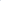

# Dual Mamba for Node-Specific Representation Learning: Tackling Over-Smoothing with Selective State Space Modeling

<!-- Page 1 -->

Dual Mamba for Node-Specific Representation Learning: Tackling Over-Smoothing with Selective State Space Modeling

Xin He1, Yili Wang1, Yiwei Dai1, Xin Wang1*

1School of Artificial Intelligence Jilin University hex23@mails.jlu.edu.cn, wangyili@jlu.edu.cn, daiyw25@mails.jlu.edu.cn,xinwang@jlu.edu.cn

## Abstract

Over-smoothing remains a fundamental challenge in deep Graph Neural Networks (GNNs), where repeated message passing causes node representations to become indistinguishable. While existing solutions, such as residual connections and skip layers, alleviate this issue to some extent, they fail to explicitly model how node representations evolve in a node-specific and progressive manner across layers. Moreover, these methods do not take global information into account, which is also crucial for mitigating the over-smoothing problem. To address the aforementioned issues, in this work, we propose a Dual Mamba-enhanced Graph Convolutional Network (DMbaGCN), which is a novel framework that integrates Mamba into GNNs to address over-smoothing from both local and global perspectives. DMbaGCN consists of two modules: the Local State-Evolution Mamba (LSEMba) for local neighborhood aggregation and utilizing Mamba’s selective state space modeling to capture node-specific representation dynamics across layers, and the Global Context- Aware Mamba (GCAMba) that leverages Mamba’s global attention capabilities to incorporate global context for each node. By combining these components, DMbaGCN enhances node discriminability in deep GNNs, thereby mitigating oversmoothing. Extensive experiments on multiple benchmarks demonstrate the effectiveness and efficiency of our method.

Code — https://github.com/hexin5515/DMbaGCN Datasets — https://github.com/hexin5515/DMbaGCN Extended version — https://arxiv.org/abs/2511.06756

## Introduction

Graph Neural Networks (GNNs) have become a dominant framework for learning on graph-structured data, achieving impressive performance across domains such as social networks (Yang et al. 2024), recommendation systems (Khan et al. 2025), molecular property prediction (Sypetkowski et al. 2024), and knowledge graph reasoning (Wang et al. 2023). A key strength of most GNNs lies in the messagepassing paradigm (Miao et al. 2024; Wang et al. 2025c), where each node updates its representation by aggregating information from its neighbors. While message pass-

*Corresponding author Copyright © 2026, Association for the Advancement of Artificial Intelligence (www.aaai.org). All rights reserved.

**Figure 1.** Comparison between GCN and Mamba (top), and comparison between Transformer and Mamba (bottom).

ing enables GNNs to aggregate local information effectively, it lacks an explicit mechanism for modeling how node representations evolve across layers in a progressive and node-specific manner. This is a key factor behind the oversmoothing (Roth and Liebig 2024) phenomenon in GNNs.

To tackle this problem, we seek a mechanism that can explicitly model how each node’s representation evolves with GNN depth, capturing both its layer-wise progression and node-specific dynamics. Inspired by recent advances in state space modeling, we consider Mamba, which captures long-range dependencies through input-dependent recurrence and has shown success in NLP (Waleffe et al. 2024) and CV (Wang et al. 2025a) tasks. Unlike standard GNNs (Veliˇckovi´c 2023; Yang et al. 2025a), Mamba inherently supports selective, position-aware modeling of sequential inputs, making it well-suited to guide how node features change layer by layer. As illustrated in Figure 1(a), this property allows Mamba to adaptively shape each node’s representation trajectory, thereby mitigating over-smoothing. This motivates an important question: How can we apply Mamba to deep GNNs for effectively modeling the layerwise evolution of node representations?

The Fortieth AAAI Conference on Artificial Intelligence (AAAI-26)

21672

AI-readable visual equivalent, added: Figure extracted from the paper PDF and converted to an SVG wrapper asset. Use the surrounding page text and caption for interpretation.

<!-- Page 2 -->

Even though Mamba effectively captures the layer-wise evolution of node representations, its modeling remains confined to local receptive fields and lacks access to global context (Fu et al. 2025). Existing solutions often rely on Transformer-based models (Hatamizadeh and Kautz 2025; Wang et al. 2025b) to introduce global attention as they allow nodes to aggregate long-range information directly. However, recent studies (Ali, Zimerman, and Wolf 2024; Gao et al. 2024) have demonstrated that Mamba can emulate global attention mechanisms similar to those used in Transformers. More importantly, as shown in Figure 1(b), Mamba achieves this global modeling capability with significantly lower time complexity compared to Transformers. This motivates another important question: How can we leverage Mamba’s global modeling capability to efficiently inject global context into deep GNNs?

To address the above issues, we propose a Dual Mambaenhanced Graph Convolutional Network (DMbaGCN), which introduces two key modules: the Local State- Evolution Mamba (LSEMba) and the Global Context- Aware Mamba (GCAMba). LSEMba integrates multi-hop message passing with Mamba’s selective state space mechanism to track how node representations evolve across layers, while preserving local neighborhood information. This enables LSEMba to capture node-specific representation changes, mitigating over-smoothing as depth increases.

On the other hand, GCAMba introduces a bidirectional Mamba model to capture global dependencies across the graph efficiently. Unlike standard GNNs that primarily focus on local neighborhood aggregation, GCAMba uses a bidirectional approach to ensure that each node can aggregate information from all other nodes, providing richer global context. This enables GCAMba to efficiently capture global dependencies without the high computational cost of attentionbased methods like Transformers.

By combining LSEMba and GCAMba, DMbaGCN offers a unified solution that effectively handles both node-specific evolution and global context aggregation. The two modules work together to provide both localized and global information to each node, ensuring that node representations evolve progressively and capturing long-range global dependencies efficiently for mitigating over-smoothing in GNNs.

The contributions of this work are summarized as follows:

• We propose DMbaGCN, a novel framework that integrates Mamba with GNNs to tackle the over-smoothing problem from both local and global perspectives. • To address the challenge of modeling the layer-wise evolution of node representations, DMbaGCN introduces a Local State-Evolution Mamba (LSEMba), which sequentially captures neighborhood information and models node representation evolution. • For capturing global dependencies efficiently, DMbaGCN incorporates the Global Context-Aware Mamba (GCAMba), which leverages global attention mechanism with linear computational complexity. • Extensive experiments on multiple benchmark datasets demonstrate that DMbaGCN achieves competitive performance and improves computational efficiency.

## Related Work

Over-smoothing in GNNs Over-smoothing occurs when repeated message passing makes node representations indistinguishable (Li, Han, and Wu 2018), leading to performance drops in tasks requiring fine-grained distinction (Liu et al. 2024). Prior works address this by decoupling propagation and transformation (Chen et al. 2020), limiting neighborhood ranges (Wu et al. 2023; Shen et al. 2024b), or randomly dropping edges (Chen et al. 2025). Attention-based methods also help by focusing on important neighbors (Veliˇckovi´c et al. 2017).

Graph Transformer Graph Transformers have gained increasing attention for their ability to capture long-range dependencies through global attention mechanisms (Choi et al. 2024). Unlike traditional GNNs (Wang et al. 2024b; Shen et al. 2025b) that rely on local message passing (Shen et al. 2025a), Graph Transformers compute pairwise interactions between all nodes, making them well-suited for tasks requiring global context. This global view also helps alleviate over-smoothing, as each node can attend to distant yet relevant nodes without relying on deep propagation (Lin et al. 2024). Recent works further improve efficiency by introducing sparse attention patterns or structural encoding to adapt Transformers to graph data (Chen et al. 2024b; Fu et al. 2024).

Graph Mamba Mamba (Han et al. 2024; Patro and Agneeswaran 2024) was originally designed for sequence modeling, offering both selective information filtering and efficient global dependency modeling through a linear-time recurrence mechanism. Although its application to graph learning is still emerging, recent works have explored combining Mamba with GCNs to enhance long-range interaction modeling (Behrouz and Hashemi 2024; Ding et al. 2024) and track oversmoothing (He et al. 2025). However, these works primarily leverage Mamba’s ability to model dependencies in long sequences with selective state space. In this work, we propose a unified framework that integrates Mamba into the GNNs, leveraging its selective filtering to preserve node-level distinction and its global modeling capacity to enhance representation expressiveness in deep networks.

Preliminary Problem Statement Given an undirected graph G = (V, E) with N nodes and M edges, the adjacency matrix A ∈RN×N is defined such that Aij = 1 if there is an edge between node vi and node vj, and Aij = 0 otherwise. Let X ∈RN×d represent the node feature matrix, where each node vi has a corresponding ddimensional feature vector.

In node classification tasks, the goal is to predict node labels based on their features and the graph structure. Even as the network depth increases (which can lead to oversmoothing, where node representations converge and become indistinguishable), the model’s prediction accuracy should not be affected.

21673

<!-- Page 3 -->

**Figure 2.** The Framework of DMbaGCN. LSEMba models the evolution of node representations across GNN layers using Mamba’s selective state space modeling. GCAMba aggregates global information for each node through bidirectional Mamba.

General Graph Mamba Graph Mamba Networks (GMNs) (Song et al. 2024; Wang et al. 2024a) models the sequence of nodes in a graph iteratively, where each node’s representation evolves not only based on its features but also the representations of all preceding nodes in the graph. This iterative process allows GMNs to capture long-range dependencies across the graph, while maintaining linear time complexity. At each iteration, the representation of node is updated by considering all preceding nodes in the sequence, which can be formulated as:

h′ t = Pht + Qxt, (1) yt = Rht, (2) where ht ∈RN represents the hidden state of the node, xt ∈RN is the input node representations, and P ∈RN×N, Q ∈RN, R ∈RN are parameters generated by small neural networks that depend on the node-specific initial representations. This means that each position generates its transition parameters, endowing Mamba with an input-dependent attention mechanism while still keeping linear computational complexity. To enable efficient training, the continuous-time model is discretized to improve computational efficiency:

¯P = exp(∆· P), (3) ¯Q = (∆· P)−1 (exp(∆· P) −I) · ∆Q, (4) where ∆is a learned discretization step size. This results in a discrete-time update rule:

ht = ¯Pht−1 + ¯Qxt, (5) yt = Rht. (6)

The above selective state space model is equivalent to a convolution operation (Dao and Gu 2024), where the kernel K = (R ¯Q, R¯P ¯Q,..., R¯PL−1 ¯Q) is computed efficiently in O(N). This contrasts with the global attention mechanism in Graph Transformers, which attends to all nodes at once, causing quadratic complexity O(N 2). In this work, we leverage Mamba’s selective state space modeling and global attention mechanism to enhance node discriminability, allowing the model to learn from both local and global context, thereby significantly reducing over-smoothing.

DMbaGCN The framework of DMbaGCN, shown in Figure 2, integrates two key modules: LSEMba (Local State-Evolution Mamba) and GCAMba (Global Context-Aware Mamba). These Mamba-based modules are specifically designed to handle both the progressive evolution of node representations and efficient aggregation of global dependencies. The following sections detail each module’s role.

Local State-Evolution Mamba (LSEMba) LSEMba integrates two key components: local neighborhood aggregation and adaptive representation evolution. First, it aggregates information from a node’s local neighborhood through stacked graph convolution layers, capturing high-order neighborhood features. Then, it models the progressive evolution of node representations across layers using Mamba’s selective state space modeling, which enables each node’s representation to adapt layer by layer.

21674

AI-readable visual equivalent, added: Figure extracted from the paper PDF and converted to an SVG wrapper asset. Use the surrounding page text and caption for interpretation.

<!-- Page 4 -->

This combined approach allows LSEMba to maintain nodespecific dynamics while preserving local features, effectively addressing the over-smoothing problem in GNNs.

The above process begins with neighborhood aggregation (Yang et al. 2025c,b; Huang et al. 2025), where each node gathers multi-hop information from its local neighborhood. This multi-scale local context then serves as the input for the representation evolution process, allowing LSEMba to track and adapt node representations across layers, ensuring node discriminability as depth increases. The node representation at depth l is computed as:

X(l) = ˜D−1

2 A ˜D−1 2 X(l−1), (7)

where ˜D is the diagonal degree matrix, and A is the adjacency matrix. X(l−1) and X(l) refer to the node representations after aggregating information from the (l −1)-hop and l-hop neighborhoods, respectively.

These node representations across layers are then ordered by ascending depth to form a sequence. For node vi, the sequence of its representations is:

Si = [x(0)

i, x(1)

i,..., x(L)

i ], (8)

where Si is the sequence of node representations for node vi, x(l)

i is the representation of node vi at layer l, with l ranging from 0 to L. L is the total number of layers in the GNNs. These sequences are then modeled by Mamba using its selective state space mechanism, which recursively models how each node’s representation adaptive evolves across layers while preserving node-specific features.

To model the adaptive evolution of node representations across layers, LSEMba utilizes Mamba’s state space mechanism. The first step involves initializing the Mamba parameters QF, RF, and learnable step size ∆F based on the sequence of node representations S, which is formulated as:

QF = fθ1(S), RF = fθ2(S), ∆F = fθ3(S), (9)

where θ1, θ2 and θ3 are learnable parameters. These parameters govern the selective state evolution and control how node features change layer by layer.

Next, the initialized parameters PF and QF undergo discretization to enable efficient training and optimization:

¯PF = exp(∆FPF), (10) ¯QF = (∆FPF)−1(exp(∆FPF) −I) · ∆FQF, (11)

where ¯PF and ¯QF represent the discretized parameters. This discretization enables efficient computation during training, ensuring that LSEMba can model long-range dependencies and adaptively track node evolution across layers without sacrificing computational efficiency.

To integrate multi-hop neighborhood information and generate expressive node representations for downstream tasks, we iterate through the sequence of neighborhood information for each node. This process starts from shallow layers and progresses to deeper layers, using the initialized model parameters. The parameter ¯PF t controls the retention of low-order neighborhood information at each step, ¯QF t determines the amount of corresponding-order neighborhood information injected into the node features, and RF t generates the output representation for downstream tasks. The iterative process is formulated as:

hF t = ¯PF t ·hF t−1 + ¯QF t · x(t), (12)

yF i,t = RF t · hF t, (13) where xt is the node representation that includes the t-hop neighborhood information, hF t is the hidden state after integrating the t-hop neighborhood information, and yF i,t is the output representation for node vi.

LSEMba effectively integrates multi-hop neighborhood information and adapts node representations through local aggregation. While it successfully mitigates over-smoothing by preserving node-specific feature evolution, it is limited in its ability to capture global dependencies across the graph. This focus on local context restricts its capacity to maintain distinct node features, which are essential for tackling over-smoothing in deeper GNNs. To address this gap, we introduce the Global Context-Aware Mamba (GCAMba).

Global Context-Aware Mamba (GCAMba) GCAMba addresses the limitations of local aggregation by enabling the model to capture global dependencies across the entire graph. By adopting a bidirectional Mamba model, GCAMba allows information to flow in both directions through the node sequence. This bidirectional approach ensures that each node aggregates global context, enriching its representation with long-range dependencies. As a result, GCAMba provides a more complete and expressive node representation, complementing LSEMba by overcoming the constraints of local neighborhood aggregation.

To capture global dependencies across the entire graph, GCAMba processes the node sequence, which is constructed by concatenating the initial representations of all nodes. Specifically, the sequence is defined as:

F = [x(0)

1, x(0) 2, · · ·, x(0) N ], (14) where F is the input sequence, constructed by concatenating the initial representations of all nodes. x(0)

i denotes the original representation of node vi, and N is the number of nodes in the graph. We initialize the Mamba parameters ¯PG, ¯QG, RG, and ∆G in GCAMba using the same strategy as in LSEMba, and omit the detailed formulation here for brevity.

To enhance node discriminability, GCAMba iteratively processes the node representation sequence. This iterative process is formulated as follows:

hG

1 = ¯QG 1 x(0) 1,hG 2 = ¯PG 2 ¯QG 1 x(0) 1 + ¯QG

2 x(0) 2, (15)

yG

1 = RG 1 ¯QG 1 x(0) 1,yG 2 = RG 2 ¯PG 2 ¯QG 1 x(0) 1 + RG

2 ¯QG 2 x(0) 2, (16) continuing this process, the general form of the iterative process can be expressed as follows:

hG t = t X j=1

(Πt k=j+1 ¯PG k) ¯QG j x(0)

j, (17)

yG t = RG t t X j=1

(Πt k=j+1 ¯PG k) ¯QG j x(0)

j, (18)

21675

<!-- Page 5 -->

where hG t represents the hidden state at step t, aggregating information from all previous nodes in the sequence. x(0)

j denotes the initial representation of node vj. yG t is the representation of node vt after aggregating global context information across all previous nodes in the sequence.

Unidirectional Mamba only captures dependencies between the current node and its preceding nodes, which limits its ability to model global relationships that involve future nodes in the sequence. To address this limitation, GCAMba uses a bidirectional Mamba model, allowing information to flow in both directions through the node sequence. This enables each node to aggregate global context from all other nodes in the graph, resulting in more comprehensive node representations that enhance node discriminability. The modeling process is defined as follows:

ˆYG = (1 −β)(fφ(F) + Re(fφ(Re(F)))) + βX(0), (19)

where φ is learnable parameters of the Mamba model fφ(·) in GCAMba, constructed similarly to those in the LSEMba. Re(·) denotes the operation that reverses the input sequence. F is the initial representation matrix for all nodes, and ˆYG represents the final output after aggregating complete global context from both directions. The hyperparameter β denotes the hyperparameter for the residual connection.

Finally, DMbaGCN adopts a simple yet effective strategy to integrate the node representations from LSEMba and GCAMba, producing the final node representations Z used for downstream tasks, which is formulated as follows:

Z = αYF

L + (1 −α) ˆYG, (20)

where YF

L denotes the output from LSEMba, which captures the layer-wise evolution of node representations based on local neighborhoods. ˆYG denotes the output from GCAMba, encoding comprehensive global contextual information for each node. α is a hyperparameter that controls the contribution of each component. These two representations enhance the discriminability of node representations from both local and global perspectives, jointly alleviating the oversmoothing problem in GNNs. The detailed implementation of DMbaGCN is shown in Algorithm 1.

## Algorithm

1: DMbaGCN Input: Adjacency matrix A ∈RN×N, feature matrix X ∈RN×d, state matrixs PF, PG, learnable parameters θ = {θ1, θ2, θ3}, φ = {φ1, φ2, φ3}. Output: The updated node representations Z.

1: while not convergent do 2: Compute X(1), X(2), · · ·, X(L), via Eq.7; 3: Compute QF(G), RF(G) and ∆F(G) via Eq.9; 4: Compute YF

L via Eq.13 and Eq.14; 5: Compute ˆYG via Eq.19; 6: Compute Z via Eq.20; 7: Update learnable parameters via back propagation; 8: end while 9: return Final node representations Z.

## Experiment

To validate the effectiveness and efficiency of DMbaGCN, we conduct comprehensive experiments on several benchmark datasets. aiming to answer three key questions:

• Q1: Does DMbaGCN outperform baseline models across various datasets? • Q2: Can DMbaGCN effectively mitigate the oversmoothing problem in deep GNNs? • Q3: Is DMbaGCN more efficient than previous global attention-based models for capturing global information?

Experimental Setting ▷Dataset: We evaluate our proposed method on the widely used benchmark datasets from different domains, including two citation graphs (CoraFull, Pubmed) (Shen et al. 2024a), two web graphs (Computers, Photo) (Chen et al. 2024a), and two co-authorship graphs (CS, Physics) (Fu et al. 2024). These datasets provide a diverse yet consistent evaluation setting for node classification under fully supervised scenarios. For each dataset, we use the publicly available node features and labels. Following prior work (Fu et al. 2024), we randomly split the nodes into training, validation, and test sets with a fixed ratio of 60%/20%/20%. All results are averaged over 10 random splits to ensure robustness. The detailed of each dataset can be found in the Appendix A.1. ▷Baselines: To validate the effectiveness and efficiency of DMbaGCN, we compare DMbaGCN with several kinds of GNN models, including classical models GCN (Kipf and Welling 2016), GAT (Veliˇckovi´c et al. 2017), and SGC (Wu et al. 2019), deep GNN models APPNP (Gasteiger, Bojchevski, and G¨unnemann 2018), GCNII (Chen et al. 2020), GPRGNN (Chien et al. 2020), SSGC (Zhu and Koniusz 2021), graph transformer models GT (Dwivedi and Bresson 2020), Graphormer (Ying et al. 2021), SAN (Kreuzer et al. 2021), GraphGPS (Ramp´aˇsek et al. 2022), Spexphormer (Shirzad et al. 2024) and graph mamba model MbaGCN (He et al. 2025). Additional information of the baseline models is available in Appendix A.2.

Performance Evaluation (Q1) We evaluate DMbaGCN on six benchmark datasets against a broad range of baseline models. As shown in Table 1, it consistently achieves competitive or superior performance. We analyze the results from three perspectives: ▷Performance against GNNs and Deep GNNs: Compared to shallow GNNs (e.g., GCN, GAT, SGC), which suffer from limited receptive fields, and deep GNNs (e.g., GC- NII, GPRGNN, SSGC), which rely on static propagation schemes, DMbaGCN delivers better performance across all datasets—achieving 97.13% on Physics and 96.00% on CS. These gains come from the adaptive depth-wise modeling of LSEMba and the global integration of GCAMba, which together enhance representational power. ▷Performance against Graph Transformer: While Transformer-based models (e.g., Graphormer, GraphGPS) capture global dependencies, they incur high time and memory costs, and often fail on large graphs due to scalability issues. In contrast, DMbaGCN maintains strong perfor-

21676

<!-- Page 6 -->

CoraFull Pubmed Computers Photo CS Physics

GNN

GCN 70.69 ± 0.37 87.82 ± 0.30 91.07 ± 0.39 93.77 ± 0.31 93.75 ± 0.26 96.34 ± 0.21 GAT 71.42 ± 0.15 88.72 ± 0.17 90.94 ± 0.18 93.81 ± 0.19 93.84 ± 0.11 96.43 ± 0.12 SGC 70.04 ± 0.25 87.91 ± 0.36 91.62 ± 0.35 93.61 ± 0.43 93.44 ± 0.18 96.43 ± 0.20

Deep GNN

APPNP 69.37 ± 0.35 88.94 ± 0.31 89.51 ± 0.31 94.10 ± 0.35 95.65 ± 0.17 97.01 ± 0.17 GCNII 72.23 ± 0.50 90.15 ± 0.31 84.71 ± 0.40 92.46 ± 0.70 95.46 ± 0.14 97.09 ± 0.13 GPRGNN 71.16 ± 0.50 89.64 ± 0.40 91.80 ± 0.35 94.97 ± 0.12 95.49 ± 0.19 97.05 ± 0.13 SSGC 70.51 ± 0.25 88.39 ± 0.41 91.98 ± 0.36 94.28 ± 0.33 93.99 ± 0.23 96.60 ± 0.15

Graph Transformer

GT 61.05 ± 0.38 88.79 ± 0.12 91.18 ± 0.17 94.74 ± 0.13 94.64 ± 0.13 97.05 ± 0.05 Graphormer OOM OOM OOM 92.74 ± 0.14 94.64 ± 0.13 OOM SAN 59.01 ± 0.34 88.22 ± 0.15 89.93 ± 0.16 94.86 ± 0.10 94.51 ± 0.15 OOM GraphGPS 55.76 ± 0.23 88.94 ± 0.16 OOM 95.06 ± 0.13 93.93 ± 0.15 OOM Spexphormer 71.84 ± 0.25 89.87 ± 0.19 91.09 ± 0.08 95.33 ± 0.49 95.00 ± 0.15 96.70 ± 0.05

Graph Mamba

MbaGCN 71.76 ± 0.31 89.32 ± 0.24 90.39 ± 0.21 94.41 ± 0.75 95.33 ± 0.12 96.64 ± 0.08

DMbaGCN w/o GCAMba 71.51 ± 0.37 89.67 ± 0.47 91.74 ± 0.34 94.44 ± 0.30 95.32 ± 0.15 96.37 ± 0.16

DMbaGCN w/o LSEMba 62.15 ± 0.52 88.14 ± 0.39 84.18 ± 0.47 89.99 ± 0.50 93.71 ± 0.23 95.71 ± 0.14

DMbaGCN (ours) 72.26 ± 0.20 90.49 ± 0.33 92.49 ± 0.37 95.61 ± 0.18 96.00 ± 0.21 97.13 ± 0.14

**Table 1.** Summary of classification accuracy (%). The best result for each benchmark is highlighted in bold, and the second-best result is emphasized with an underline.

mance without such limitations, owing to GCAMba’s use of Mamba for efficient global modeling with linear complexity. ▷Performance against Graph Mamba: Compared to MbaGCN, which applies Mamba only locally, the dual Mamba integration strategy of DMbaGCN leads to consistent improvements across multiple datasets, with a notable +1.17% increase on Pubmed and +1.20% on Photo. These results confirm the advantage of DMbaGCN’s approach, which jointly models both node-specific representation evolution and global context.

Layer-Wise Performance Trends (Q2) To assess whether DMbaGCN effectively alleviates oversmoothing in deep GNNs, we conduct experiments with varying layer depths on the Photo and Pubmed datasets (Table 2). The experimental results for the other four datasets (CoraFull, Computer, CS and Physics) can be found in Appendix B.1. We analyzes the results from two perspectives: ▷Performance against GNNs and Deep GNNs: Traditional GNNs like GCN and SGC suffer severe performance degradation as depth increases, due to indiscriminate neighbor aggregation that leads to over-smoothing. For instance, GCN’s accuracy on Photo drops from 93.77% (2 layers) to 24.03% (32 layers). Deep GNNs such as GC- NII and SSGC improve stability, but still rely on static propagation schemes that limit adaptability. For example, SSGC drops from 94.13% to 93.16%. In contrast, DMbaGCN remains consistently robust across depths, achieving 95.46% on Photo and 90.44% on Pubmed at 32 layers. This strong depth resilience stems from LSEMba’s ability to model node-specific representation evolution across layers, and GCAMba’s role in incorporating global context. ▷Performance against Graph Mamba: The Graph Mamba model MbaGCN shows a slight performance drop with increasing depth, likely due to optimization challenges from its complex architecture (e.g., 94.77% to 91.99% on Photo and 89.23% to 89.14% on Pubmed). In contrast, DMbaGCN not only adopts a simpler structure but also incorporates global context through GCAMba, resulting in more stable performance (e.g., 94.59% to 95.61% on Photo and 90.12% to 90.49% on Pubmed) across depths and consistently competitive results under various layer configurations.

Efficiency Analysis (Q3)

We compare the efficiency of GCN, GT, Spexphormer, our method (DMbaGCN) and its ablation without GCAMba in four datasets, evaluating memory and time costs. Memory and time performance are discussed separately. ▷Memory Consumption Analysis: As shown in Figure 3 (a), GCN consumes the least memory (103 MB) due to its simple structure. GT incurs the highest memory cost (104 MB) as it replaces GAT’s attention with a Transformer. Spexpormer reduces memory usage to 103 MB through structural optimization. Our DMbaGCN achieves similarly low memory consumption, benefiting from Mamba’s efficient design. Its ablation variant matches GCN’s memory cost, indicating that GCAMba accounts for most of the overhead. ▷Time Cost Analysis: As shown in Figure 3(b), although Spexpormer significantly reduces memory usage compared to GT, its additional sampling strategy leads to a higher time cost (103 ms). In contrast, GT avoids sampling and maintains a simpler design, keeping time consumption at the 102 ms scale. DMbaGCN achieves even better efficiency, staying within the 102 ms range—lower than Spexpormer and slightly below GT. This efficiency comes from Mamba’s linear-time global modeling, which captures global context without costly attention or sampling. These results highlight

21677

<!-- Page 7 -->

Layers 2 4 8 16 32 2 4 8 16 32

Dataset Photo Pubmed

GCN 93.77±0.31 91.39±0.26 85.97±0.71 43.63±0.48 24.03±0.56 87.82±0.30 85.76±0.31 84.29±0.29 77.94±3.98 45.69±3.09 SGC 93.61±0.43 92.07±0.56 89.76±0.27 86.33±0.54 79.19±0.90 87.91±0.36 85.91±0.30 84.47±0.38 83.46±0.23 82.34±0.33

APPNP 94.05±0.39 93.95±0.41 94.10±0.35 94.08±0.38 94.07±0.41 88.86±0.39 88.94±0.31 88.92±0.43 88.93±0.41 88.94±0.36 GCNII 91.96±0.49 91.46±0.65 91.93±0.58 92.07±0.92 92.46±0.70 89.66±0.34 89.56±0.32 89.19±0.27 88.64±0.27 90.15±0.31 GPRGNN 94.77±0.31 94.90±0.22 94.97±0.12 94.90±0.11 94.77±0.28 89.54±0.30 89.58±0.39 89.61±0.27 89.64±0.40 89.45±0.32 SSGC 94.13±0.35 94.28±0.33 94.03±0.39 93.60±0.37 93.16±0.29 88.24±0.29 88.39±0.41 87.22±0.23 87.61±0.25 87.17±0.30

MbaGCN 94.77±0.52 93.87±0.31 92.47±0.17 92.23±0.34 91.99±0.34 89.23±0.17 89.18±0.42 89.13±0.39 89.16±0.33 89.14±0.45

DMbaGCN w/o GCAMba 94.42±0.41 94.44±0.30 94.24±0.20 94.28±0.27 94.43±0.29 89.65±0.43 89.61±0.37 89.65±0.41 89.43±0.37 89.67±0.47

DMbaGCN

(ours) 94.59±0.33 94.42±0.32 95.35±0.24 95.61±0.18 95.46±0.37 90.21±0.34 90.29±0.36 90.49±0.33 90.41±0.33 90.44±0.37

**Table 2.** Classification accuracy (%) comparison under different layer configurations. The best result across different layer configurations is highlighted in bold, and the second-best result is emphasized with an underline.

Mamba’s advantage in modeling high-order dependencies while maintaining overall efficiency.

Ablation Study

To verify the contribution of each module, we include ablation studies in above experiments. Based on the results, we analyze the contribution of the two modules to DMbaGCN. ▷Impact of GCAMba: As shown in Table 1, the ablation version DMbaGCN w/o GCAMba consistently shows a performance drop across all datasets (e.g., 89.67% to 90.49% on Pubmed), indicating that the global information captured by GCAMba contributes to improving the quality of node representations. This effect becomes even more pronounced in Table 2, where GCAMba enhances performance at all depth settings, with the improvement being especially significant in deeper networks (e.g., 94.28% to 95.61% on Photo under 16 layers). In addition, Figure 3 shows that DMbaGCN w/o GCAM has memory and time consumption comparable to GCN. Despite this, GCAMba remains significantly more efficient than Transformer-based methods, highlighting Mamba’s ability to capture global context with low computational and memory overhead. ▷Impact of LSEMba: The ablation version of DMbaGCN without LSEM (DMbaGCN w/o LSEM) relies solely on GCAMba to aggregate global information. As shown in Table 1, its performance is consistently lower than the full model across all datasets, indicating that local information is essential for effective graph representation learning. Without LSEMba, DMbaGCN struggles to capture multi-hop structure and track node-specific representation evolution across layers, which limits its expressiveness. This demonstrates that relying solely on global context is insufficient. Instead, the combination of global context with strong local features is crucial, as it enhances the model’s ability to discriminate and capture complex node relationships.

## Conclusion

This work presents a Dual Mamba-enhanced Graph Convolutional Network (DMbaGCN), which addresses the oversmoothing issue in deep Graph Neural Networks (GNNs). Over-smoothing is a significant challenge where node repre-

Photo Computers CS Physics (a) Memory Consumption

103

104

MegaBytes (mb)

GCN Spexphormer GT Ours Ours w/o GCAMba

Photo Computers CS Physics (b) Time Cost

101

102

103

Seconds (ms)

**Figure 3.** Comparison of Time and Memory Consumption.

sentations become indistinguishable due to excessive message passing. DMbaGCN tackles this problem by integrating a selective state-space model named Mamba into the GNN framework in two distinct ways. First, it uses the Local State-Evolution Mamba (LSEMba) to manage the evolution of node representations. Second, it employs the Global Context-Aware Mamba (GCAMba) to capture global dependencies. Extensive experiments on various datasets shows the superiority of DMbaGCN over deep GNN models and graph transformers, both in terms of classification performance and efficiency.

## Acknowledgments

This work was supported by a grant from the National Natural Science Foundation of China under grants (No.62372211, 62272191), and the Science and Technology Development Program of Jilin Province (No.20250102216JC).

21678

<!-- Page 8 -->

## References

Ali, A.; Zimerman, I.; and Wolf, L. 2024. The hidden attention of mamba models. arXiv preprint arXiv:2403.01590. Behrouz, A.; and Hashemi, F. 2024. Graph mamba: Towards learning on graphs with state space models. In Proceedings of the 30th ACM SIGKDD Conference on Knowledge Discovery and Data Mining, 119–130. Chen, J.; Liu, H.; Hopcroft, J.; and He, K. 2024a. Leveraging contrastive learning for enhanced node representations in tokenized graph transformers. Advances in Neural Information Processing Systems, 37: 85824–85845. Chen, M.; Wei, Z.; Huang, Z.; Ding, B.; and Li, Y. 2020. Simple and deep graph convolutional networks. In International conference on machine learning, 1725–1735. PMLR. Chen, S.; Chen, J.; Zhou, S.; Wang, B.; Han, S.; Su, C.; Yuan, Y.; and Wang, C. 2024b. SIGformer: Sign-aware graph transformer for recommendation. In Proceedings of the 47th international ACM SIGIR conference on research and development in information retrieval, 1274–1284. Chen, Z.; Wu, Z.; Sadikaj, Y.; Plant, C.; Dai, H.-N.; Wang, S.; Cheung, Y.-M.; and Guo, W. 2025. Adedgedrop: Adversarial edge dropping for robust graph neural networks. IEEE Transactions on Knowledge and Data Engineering. Chien, E.; Peng, J.; Li, P.; and Milenkovic, O. 2020. Adaptive universal generalized pagerank graph neural network. arXiv preprint arXiv:2006.07988. Choi, Y. Y.; Park, S. W.; Lee, M.; and Woo, Y. 2024. Topology-informed graph transformer. arXiv preprint arXiv:2402.02005. Dao, T.; and Gu, A. 2024. Transformers are ssms: Generalized models and efficient algorithms through structured state space duality. arXiv preprint arXiv:2405.21060. Ding, Y.; Orvieto, A.; He, B.; and Hofmann, T. 2024. Recurrent Distance Filtering for Graph Representation Learning. In Forty-first International Conference on Machine Learning. Dwivedi, V. P.; and Bresson, X. 2020. A generalization of transformer networks to graphs. arXiv preprint arXiv:2012.09699. Fu, D.; Hua, Z.; Xie, Y.; Fang, J.; Zhang, S.; Sancak, K.; Wu, H.; Malevich, A.; He, J.; and Long, B. 2024. Vcrgraphormer: A mini-batch graph transformer via virtual connections. arXiv preprint arXiv:2403.16030. Fu, L.; Deng, B.; Huang, S.; Liao, T.; Zhang, C.; and Chen, C. 2025. Learn from Global Rather Than Local: Consistent Context-Aware Representation Learning for Multi-View Graph Clustering. In Proceedings of the Thirty-Fourth International Joint Conference on Artificial Intelligence, IJCAI 2025, Montreal, Canada, August 16-22, 2025, 5145–5153. Gao, Y.; Huang, J.; Sun, X.; Jie, Z.; Zhong, Y.; and Ma, L. 2024. Matten: Video generation with mamba-attention. arXiv preprint arXiv:2405.03025. Gasteiger, J.; Bojchevski, A.; and G¨unnemann, S. 2018. Predict then propagate: Graph neural networks meet personalized pagerank. arXiv preprint arXiv:1810.05997.

Han, D.; Wang, Z.; Xia, Z.; Han, Y.; Pu, Y.; Ge, C.; Song, J.; Song, S.; Zheng, B.; and Huang, G. 2024. Demystify mamba in vision: A linear attention perspective. Advances in neural information processing systems, 37: 127181–127203. Hatamizadeh, A.; and Kautz, J. 2025. Mambavision: A hybrid mamba-transformer vision backbone. In Proceedings of the Computer Vision and Pattern Recognition Conference, 25261–25270. He, X.; Wang, Y.; Fan, W.; Shen, X.; Juan, X.; Miao, R.; and Wang, X. 2025. Mamba-based graph convolutional networks: Tackling over-smoothing with selective state space. arXiv preprint arXiv:2501.15461. Huang, S.; Fu, L.; Liao, T.; Deng, B.; Zhang, C.; and Chen, C. 2025. FedBG: Proactively Mitigating Bias in Cross- Domain Graph Federated Learning Using Background Data. In Proceedings of the Thirty-Fourth International Joint Conference on Artificial Intelligence, 5408–5416. Khan, B.; Wu, J.; Yang, J.; and Ma, X. 2025. Heterogeneous hypergraph neural network for social recommendation using attention network. ACM Transactions on Recommender Systems, 3(3): 1–22. Kipf, T. N.; and Welling, M. 2016. Semi-supervised classification with graph convolutional networks. arXiv preprint arXiv:1609.02907. Kreuzer, D.; Beaini, D.; Hamilton, W.; L´etourneau, V.; and Tossou, P. 2021. Rethinking graph transformers with spectral attention. Advances in Neural Information Processing Systems, 34: 21618–21629. Li, Q.; Han, Z.; and Wu, X.-M. 2018. Deeper insights into graph convolutional networks for semi-supervised learning. In Proceedings of the AAAI conference on artificial intelligence, volume 32. Lin, H.; Ma, Z.; Hong, X.; Shangguan, Q.; and Meng, D. 2024. Gramformer: Learning crowd counting via graphmodulated transformer. In Proceedings of the AAAI Conference on Artificial Intelligence, volume 38, 3395–3403. Liu, W.; Zhang, Z.; Li, X.; Hu, J.; Luo, Y.; and Du, J. 2024. Enhancing recommendation systems with GNNs and addressing over-smoothing. In 2024 4th International Conference on Electronic Information Engineering and Computer Communication (EIECC), 1184–1189. IEEE. Miao, R.; Zhou, K.; Wang, Y.; Liu, N.; Wang, Y.; and Wang, X. 2024. Rethinking Independent Cross-Entropy Loss For Graph-Structured Data. In Proceedings of the 41st International Conference on Machine Learning, volume 235, 35570–35589. PMLR. Patro, B. N.; and Agneeswaran, V. S. 2024. Simba: Simplified mamba-based architecture for vision and multivariate time series. arXiv preprint arXiv:2403.15360. Ramp´aˇsek, L.; Galkin, M.; Dwivedi, V. P.; Luu, A. T.; Wolf, G.; and Beaini, D. 2022. Recipe for a general, powerful, scalable graph transformer. Advances in Neural Information Processing Systems, 35: 14501–14515. Roth, A.; and Liebig, T. 2024. Rank collapse causes oversmoothing and over-correlation in graph neural networks. In Learning on Graphs Conference, 35–1. PMLR.

21679

<!-- Page 9 -->

Shen, X.; Lio, P.; Yang, L.; Yuan, R.; Zhang, Y.; and Peng, C. 2024a. Graph rewiring and preprocessing for graph neural networks based on effective resistance. IEEE Transactions on Knowledge and Data Engineering, 36(11): 6330–6343. Shen, X.; Liu, Y.; Dai, Y.; Wang, Y.; Miao, R.; Tan, Y.; Pan, S.; and Wang, X. 2025a. Understanding the Information Propagation Effects of Communication Topologies in LLM-based Multi-Agent Systems. arXiv preprint arXiv:2505.23352. Shen, X.; Liu, Y.; Wang, Y.; Miao, R.; Dai, Y.; Pan, S.; Chang, Y.; and Wang, X. 2025b. Raising the bar in graph ood generalization: Invariant learning beyond explicit environment modeling. arXiv preprint arXiv:2502.10706. Shen, X.; Wang, Y.; Zhou, K.; Pan, S.; and Wang, X. 2024b. Optimizing ood detection in molecular graphs: A novel approach with diffusion models. In Proceedings of the 30th ACM SIGKDD Conference on Knowledge Discovery and Data Mining, 2640–2650. Shirzad, H.; Lin, H.; Venkatachalam, B.; Velingker, A.; Woodruff, D. P.; and Sutherland, D. J. 2024. Even sparser graph transformers. Advances in Neural Information Processing Systems, 37: 71277–71305. Song, Y.; Huang, S.; Cai, J.; Wang, X.; Zhou, C.; and Lin, Z. 2024. Breaking the Bottleneck on Graphs with Structured State Spaces. In Proceedings of the 33rd ACM International Conference on Information and Knowledge Management, 2138–2147. Sypetkowski, M.; Wenkel, F.; Poursafaei, F.; Dickson, N.; Suri, K.; Fradkin, P.; and Beaini, D. 2024. On the scalability of gnns for molecular graphs. Advances in Neural Information Processing Systems, 37: 19870–19906. Veliˇckovi´c, P. 2023. Everything is connected: Graph neural networks. Current Opinion in Structural Biology, 79: 102538. Veliˇckovi´c, P.; Cucurull, G.; Casanova, A.; Romero, A.; Lio, P.; and Bengio, Y. 2017. Graph attention networks. arXiv preprint arXiv:1710.10903. Waleffe, R.; Byeon, W.; Riach, D.; Norick, B.; Korthikanti, V.; Dao, T.; Gu, A.; Hatamizadeh, A.; Singh, S.; Narayanan, D.; et al. 2024. An empirical study of mamba-based language models. arXiv preprint arXiv:2406.07887. Wang, C.; Tsepa, O.; Ma, J.; and Wang, B. 2024a. Graphmamba: Towards long-range graph sequence modeling with selective state spaces. arXiv preprint arXiv:2402.00789. Wang, F.; Wang, J.; Ren, S.; Wei, G.; Mei, J.; Shao, W.; Zhou, Y.; Yuille, A.; and Xie, C. 2025a. Mamba-Reg: Vision Mamba Also Needs Registers. In Proceedings of the Computer Vision and Pattern Recognition Conference, 14944– 14953. Wang, J.; Chen, M.; Karaev, N.; Vedaldi, A.; Rupprecht, C.; and Novotny, D. 2025b. Vggt: Visual geometry grounded transformer. In Proceedings of the Computer Vision and Pattern Recognition Conference, 5294–5306. Wang, Y.; Liu, Y.; Liu, N.; Miao, R.; Wang, Y.; and Wang, X. 2025c. AdaGCL+: An Adaptive Subgraph Contrastive Learning Towards Tackling Topological Bias. IEEE Transactions on Pattern Analysis and Machine Intelligence.

Wang, Y.; Liu, Y.; Shen, X.; Li, C.; Ding, K.; Miao, R.; Wang, Y.; Pan, S.; and Wang, X. 2024b. Unifying unsupervised graph-level anomaly detection and out-of-distribution detection: A benchmark. arXiv preprint arXiv:2406.15523. Wang, Y.; Yasunaga, M.; Ren, H.; Wada, S.; and Leskovec, J. 2023. Vqa-gnn: Reasoning with multimodal knowledge via graph neural networks for visual question answering. In Proceedings of the IEEE/CVF international conference on computer vision, 21582–21592. Wu, F.; Souza, A.; Zhang, T.; Fifty, C.; Yu, T.; and Weinberger, K. 2019. Simplifying graph convolutional networks. In International conference on machine learning, 6861– 6871. PMLR. Wu, X.; Ajorlou, A.; Wu, Z.; and Jadbabaie, A. 2023. Demystifying oversmoothing in attention-based graph neural networks. Advances in Neural Information Processing Systems, 36: 35084–35106. Yang, L.; Cai, Y.; Ning, H.; Zhuo, J.; Jin, D.; Ma, Z.; Guo, Y.; Wang, C.; and Wang, Z. 2025a. Universal Graph Self- Contrastive Learning. In IJCAI, 3534–3542. Yang, L.; Li, Z.; Zhuo, J.; Liu, J.; Ma, Z.; Wang, C.; Wang, Z.; and Cao, X. 2025b. Graph Contrastive Learning with Joint Spectral Augmentation of Attribute and Topology. In AAAI, 21983–21991. Yang, L.; Liu, Y.; Zhuo, J.; Jin, D.; Wang, C.; Wang, Z.; and Cao, X. 2025c. Do We Really Need Message Passing in Brain Network Modeling? In ICML. Yang, Y.; Wu, L.; Wang, Z.; He, Z.; Hong, R.; and Wang, M. 2024. Graph bottlenecked social recommendation. In Proceedings of the 30th ACM SIGKDD Conference on Knowledge Discovery and Data Mining, 3853–3862. Ying, C.; Cai, T.; Luo, S.; Zheng, S.; Ke, G.; He, D.; Shen, Y.; and Liu, T.-Y. 2021. Do transformers really perform badly for graph representation? Advances in neural information processing systems, 34: 28877–28888. Zhu, H.; and Koniusz, P. 2021. Simple spectral graph convolution. In International conference on learning representations.

21680
