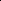

# EarthCrafter: Scalable 3D Earth Generation via Dual-Sparse Latent Diffusion

<!-- Page 1 -->

EarthCrafter: Scalable 3D Earth Generation via Dual-Sparse Latent Diffusion

Shang Liu1,2*, Chenjie Cao1,2,3*, Chaohui Yu1,2†, Wen Qian1,2, Jing Wang1,2, Fan Wang1

1DAMO Academy, Alibaba Group 2Hupan Lab 3Fudan University {liushang.ls,caochenjie.ccj,huakun.ych, qianwen.qian, yunfei.wj, fan.w}@alibaba-inc.com

## Abstract

Despite the remarkable developments achieved by recent 3D generation works, scaling these methods to geographic extents, such as modeling thousands of square kilometers of Earth’s surface, remains an open challenge. We address this through a dual innovation in data infrastructure and model architecture. First, we introduce Aerial-Earth3D, the largest 3D aerial dataset to date, consisting of 50k curated scenes (each measuring 600m) captured across the U.S. mainland, comprising 45M multi-view Google Earth frames. Each scene provides pose-annotated multi-view images, depth maps, normals, semantic segmentation, and camera poses, with explicit quality control to ensure terrain diversity. Building on this foundation, we propose EarthCrafter, a tailored framework for large-scale 3D Earth generation via sparse-decoupled latent diffusion. Our architecture separates structural and textural generation: 1) Dual sparse 3D-VAEs compress high-resolution geometric voxels and textural 2D Gaussian Splats (2DGS) into compact latent spaces, largely alleviating the costly computation suffering from vast geographic scales while preserving critical information. 2) We propose condition-aware flow matching models trained on mixed inputs (semantics, images, or neither) to flexibly model latent geometry and texture features independently. Extensive experiments demonstrate that EarthCrafter performs substantially better in extremely largescale generation. The framework further supports versatile applications, from semantic-guided urban layout generation to unconditional terrain synthesis, while maintaining geographic plausibility through our rich data priors from Aerial-Earth3D.

Project — https://github.com/whiteinblue/EarthCrafter

## Introduction

The field of 3D generation has witnessed remarkable progress in recent years, evolving from object-level (Liu et al. 2023; Shi et al. 2023a; Liu et al. 2024a; Xiang et al. 2025; Ren et al. 2024a; Zhao et al. 2025) to scene-level (Ren et al. 2024b; Zhou et al. 2024; Gao* et al. 2024; Li et al. 2024; Yang et al. 2024; Zhang et al. 2025) synthesis, yielding impressive photorealistic and structurally coherent outcomes. Moreover, recent works have pushed these capabilities toward urbanscale generation under diverse conditions (Xie et al. 2024,

* denotes equal contribution † denotes corresponding author Copyright © 2026, Association for the Advancement of Artificial Intelligence (www.aaai.org). All rights reserved.

2025b; Deng et al. 2024; Engstler et al. 2025). These achievements lead to new applications in computer graphics, virtual reality, and high-fidelity geospatial modeling.

Despite these achievements, a critical gap remains in scaling 3D generation to extensive geographic-scale—a domain requiring holistic modeling of both anthropogenic structures and natural terrains. We identify two fundamental limitations in existing approaches: 1) Most urban generation frameworks solely focus on the city generation within constrained semantic scopes (Xie et al. 2025b; Deng et al. 2024; Engstler et al. 2025), neglecting other diverse natural formations (e.g., mountains, lakes, and deserts). This requires comprehensive aerial datasets encompassing multi-terrain formations and well-designed models containing scalable capacity to handle the general Earth generation. 2) Since the large-scale 3D generation is inherently intractable, existing generative methods heavily depend on various conditions, including images, semantics, height fields, captions, or combinations of them (Xie et al. 2024, 2025a; Shang et al. 2024; Yang et al. 2024). While these conditions improve the results, they constrain generative flexibility. Conversely, unconditional generation at geographic scales often collapses into geometric incoherence or textural ambiguity, failing to produce satisfactory outcomes.

To address these challenges, we improve both data curation and model architecture to enhance geographic-scale generation. Formally, we present Aerial-Earth3D, the largest 3D aerial dataset created to date. This dataset comprises 50,028 meticulously curated scenes, each spanning 600m×600m, sourced across the mainland U.S. with 45 million multi-view frames captured from Google Earth. To effectively cover valid and diverse regions with limited viewpoints, we carefully design heuristic camera poses based on simulated 3D scenes built upon DEM, OSM, and MS-Building datasets. Since Google Earth does not provide source meshes, we reconstruct 3D meshes via InstantNGP (M¨uller et al. 2022), applying several post-processing techniques to extract surface planes, fix normals, and refine mesh connectivity. Then these meshes are voxelized as the ground truth for structural generation. Additionally, we employ AIE-SEG (Xu et al. 2023) to create semantic maps as mesh attributes, comprising 25 distinct classes. As summarized in Table 1, Aerial-Earth3D stands out as a large-scale 3D aerial dataset characterized by its diverse terrains and 3D annotations, significantly advancing both 3D generation and reconstruction efforts.

The Fortieth AAAI Conference on Artificial Intelligence (AAAI-26)

<!-- Page 2 -->

Semantic Conditions

Generated Voxel Geographic Renders

(a) Results of EarthCrafter conditionedon 1-view semantic (c) Results of unconditional generationfromEarthCrafter

Geographic Renders Generated Voxel

RGBD Conditions

(b) Results of EarthCrafter conditioned on1-view RGBD (d) Diverse results of EarthCrafter conditioned on the same semantic

**Figure 1.** EarthCrafter enjoys impressive generations conditioned on various guidance, including (a) 1-view aerial semantic and (b) 1-view RGBD. (c) EarthCrafter is powerful enough to handle unconditional generation, sampling reasonable geographic-scale 3D assets from the prior distribution. (d) EarthCrafter is enabled to produce diverse outcomes.

Building upon this robust dataset, we present Earth- Crafter, a novel framework designed for geographic-scale 3D generation through dual-sparse latent diffusion. Following Trellis (Xiang et al. 2025), EarthCrafter inherits the advantages of disentangled structure and texture generations with flexible conditioning and editing capabilities. However, Trellis focuses on object-level generation rather than the geographic scene, while the latter instance contains 10 times more voxels for the geometric modeling, presenting significant challenges in feature storage efficiency, geometric compression, network design, and input condition alignment. Thus, we propose several key innovations to extend this method to a geographic scale. Specifically, EarthCrafter integrates dual-sparse VAEs (Xiang et al. 2025) and Flow Matching (FM) diffusion models (Esser et al. 2024) for structure and texture generations, respectively. During the training of the texture VAE, which directly decodes 2D Gaussian Splatting (2DGS) (Huang et al. 2024) as textural representation, we find that high-resolution voxel features within low channels (Labs et al. 2025) substantially outperform spatially compressed voxel features with large channels (Oquab et al. 2023) in large-scale 3D generation, while the former enjoys a lighter I/O overhead. In contrast to (Xiang et al. 2025), we further spatially compress voxel representations of structured VAE via elaborate sparse network design, which allows us to efficiently represent detailed geographic shapes with 97.1% structural accuracy. Additionally, we improve the model designs for both textual and structural FM models to tame the extremely large-scale generation. These models can be flexibly conditioned on images, semantics, or operate without conditions. Especially, we employ a novel coarse-to-fine framework for structural FM, which begins by classifying the full voxel initialization into a coarse voxel space, followed by a refinement phase that converts to a fine voxel space while predicting the related latents. This coarse-to-fine modeling enables more precise structures compared to the one-stage dense modeling.

We conduct extensive experiments to verify the effectiveness of the proposed method. The key contributions of this paper can be summarized as follows:

• Aerial-Earth3D is presented as the largest 3D aerial dataset, comprising images captured from diverse structures and natural terrains with annotated 3D presentations. • Dual-sparse VAEs are designed for structural and textural encoding, facilitating efficient I/O, superior appearance, and detailed structures for large-scale generation. • Tailored flow matching models are proposed to enhance

AI-readable visual equivalent, added: Figure extracted from the paper PDF and converted to an SVG wrapper asset. Use the surrounding page text and caption for interpretation.

AI-readable visual equivalent, added: Figure extracted from the paper PDF and converted to an SVG wrapper asset. Use the surrounding page text and caption for interpretation.

AI-readable visual equivalent, added: Figure extracted from the paper PDF and converted to an SVG wrapper asset. Use the surrounding page text and caption for interpretation.

AI-readable visual equivalent, added: Figure extracted from the paper PDF and converted to an SVG wrapper asset. Use the surrounding page text and caption for interpretation.

AI-readable visual equivalent, added: Figure extracted from the paper PDF and converted to an SVG wrapper asset. Use the surrounding page text and caption for interpretation.

AI-readable visual equivalent, added: Figure extracted from the paper PDF and converted to an SVG wrapper asset. Use the surrounding page text and caption for interpretation.

AI-readable visual equivalent, added: Figure extracted from the paper PDF and converted to an SVG wrapper asset. Use the surrounding page text and caption for interpretation.

AI-readable visual equivalent, added: Figure extracted from the paper PDF and converted to an SVG wrapper asset. Use the surrounding page text and caption for interpretation.

AI-readable visual equivalent, added: Figure extracted from the paper PDF and converted to an SVG wrapper asset. Use the surrounding page text and caption for interpretation.

AI-readable visual equivalent, added: Figure extracted from the paper PDF and converted to an SVG wrapper asset. Use the surrounding page text and caption for interpretation.

AI-readable visual equivalent, added: Figure extracted from the paper PDF and converted to an SVG wrapper asset. Use the surrounding page text and caption for interpretation.

<!-- Page 3 -->

Dataset Area Images Sites Class Source

UrbanScene3D (Lin et al. 2022) 136 128K 16 1 Synth/Real CityTopia (Xie et al. 2025a) 36 3.75K 11 7 Synth CityDreamer (Xie et al. 2024) 25 24K 400 6 Real Building3D (Wang 2023) 998 - 16 1 Synth MatrixCity (Li et al. 2023) 28 519K 2 - Synth STPLS3D (Chen et al. 2022) 17 62.6K 67 32 Synth/Real SensatUrban (Hu et al. 2021) 7.6 - 13 Synth/Real

Ours 18010 45M 50K 25 Real

**Table 1.** Comparison of aerial-view 3D scene datasets.

the modeling of latent spaces, while the coarse-to-fine strategy is incorporated for precise structural generation.

## Related Work

3D Generative Models Recent advances in 3D generative models have garnered significant attention. Particularly, the rise of 2D generation models (Rombach et al. 2022; Esser et al. 2024; Labs et al. 2025) has led to an exploration of their potential for 3D-aware generation. One line of research involves fine-tuning 2D diffusion models to allow for poseconditioned Novel View Synthesis (NVS) in objects (Shi et al. 2023b; Wang and Shi 2023) or scenes (H¨ollein et al. 2024; Wu et al. 2024; Gao* et al. 2024; Cao et al. 2024). Since their outcomes are primarily multi-view 2D images, converting them into high-quality 3D representations remains a challenge due to inherent view inconsistencies. Pioneering work has also been done in distilling priors from 2D diffusion models while optimizing 3D representations (Mildenhall et al. 2021; Kerbl et al. 2023) via Score Distillation Sampling (SDS) (Kim et al. 2023; Zhu and Zhuang 2023; Wang et al. 2023). However, the test-time SDS is not efficient enough and often produces inferior 3D assets due to over-saturation and multi-face Janus artifacts. Additionally, some research has achieved the creation of large 3D scenes by iteratively stitching 3D representations within depth warping and inpainting novel views (Yu et al. 2024b; Liang et al. 2024; Shriram et al. 2024; Yu et al. 2024a), suffering from the prohibitive inference cost of test-time dataset updates.

Aerial-Earth3D Dataset The Aerial-Earth3D dataset was developed through a rigorous process of data curation. Initially, high-quality scenes were sampled from the “things of to do” recommends from Google Earth, which yielded approximately 150,745 sites of interest across the continental United States. Then, we integrated the OSM driving roads, DEM terrain, and MS-Building height Subsequently, we utilize the InstantNGP (M¨uller et al. 2022) to reconstruct each scene and use marching cube to export 3D scene meshes, and then those meshes are refined through topological repairs. At last, we draw attributes of color, normal, feature, and semantic to those meshes by a score aggregation algorithm. In detail, we use the IE-SEG (Xu et al. 2023) model for semantic predictions and utilize the Flux- VAE (Labs et al. 2025) encoder to export features; this process is shown in Figure 2. Ultimately, we successfully yielded

**Figure 2.** The overall data pipeline of Aerial-Earth3D. InstantNGP is utilized to achieve source meshes, which are refined with heuristic strategies. Multi-view Flux-VAE features and semantic maps are aggregated on meshes. Then, these featured meshes are voxelized as inputs to TexVAE.

50,028 high-quality 3D scenes, and details are presented in the supplementary.

## Method

Overview We show the overall pipeline of EarthCrafter in Figure 3(c), comprising separate structure and texture generations. Given randomly initialized 3D noise grid coordinates G ∈R(L

8)3×3, the structural flow matching model (StructFM) generates structural latents SLa ∈R(L

8)3×cs with optional depth or semantic conditions, where cs indicates the channel of SLa. Then, the structural VAE (Struct- VAE) decoder is utilized to decode SLa to high-resolution voxel coordinates Vc ∈RL3×3. Subsequently, the textural flow matching model (TexFM) generates textural latent TLa ∈RL3×ct based on Vc within optional image and semantic conditions, where ct indicates the channel of TLa. We employ the textural VAE (TexVAE) decoder to recover voxel 2DGS VGS ∈RL3×16 as the final 3D presentation.

Dual-Sparse VAEs

StructVAE Differing from the dense architecture of Trellis (Xiang et al. 2025), which suffers from a fixed lowresolution voxel space, we propose StructVAE, leveraging a spatially compressed structural latent space within sparse voxel modeling to enhance efficiency. As shown in Figure 4(a), StructVAE utilizes an encoder-decoder framework to compress the full voxel coordinates Vc ∈RL3×3 into SLa ∈R(L

8)3×cs, achieving a reduction to 1/256 of the original size, where cs = 32. We first incorporate positional encoding into Vc. Subsequently, 4 transformer layers and one sparse 3D convolution layer (Williams et al. 2024) with a stride of 2 are applied to conduct the voxel downsampling. We should claim that upsampling sparse voxels presents greater challenges than downsampling. Because it is non-trivial to restore accurate sparse geometry after the naive upsample strategies as shown in Figure 4(c). Thus, we present the novel Pseudo-Sparse to Sparse (PSS) block to enable precise upsampling of sparse geometry via sparse pixel shuffle and voxel classification, as detailed in Figure 4(b). Specifically, the tailored pixel shuffle layer is designed to upsample sparse representations, with upsampled voxels termed

AI-readable visual equivalent, added: Figure extracted from the paper PDF and converted to an SVG wrapper asset. Use the surrounding page text and caption for interpretation.

<!-- Page 4 -->

Voxel Feat 𝑽𝒇𝒆𝒂𝒕

TexVAE

Encoder

Textural Latent 𝑻𝑳&

TexVAE

Decoder

Voxel 2DGS 𝑽𝑮𝑺 Voxel Coord 𝑽𝒄

Structural Latent 𝑺𝑳𝒂

StructVAE

Encoder

StructVAE

Decoder

TexFM StructVAE

Decoder

Structural Latent 𝑺𝑳𝒂

StructFM

Voxel Coord 𝑽𝒄

Grid Coord 𝑮 Voxel Coord 𝑽𝒄 Textural Latent 𝑻𝑳𝒂 (c) Overall pipeline of EarthCrafter

(a) Sparse 2DGS VAE (TexVAE) (b) Sparse Structural VAE (StructVAE)

TexVAE

Decoder

Voxel 2DGS 𝑽𝑮𝑺

Depth/Semantic Image/Semantic

Render Projection 𝑳/𝟖𝟑 L𝟑 L𝟑 L𝟑

L𝟑 L𝟑 L𝟑 L𝟑 L𝟑

𝑳/𝟖𝟑

𝑳/𝟖𝟑

**Figure 3.** Overview of EarthCrafter. EarthCrafter separately models texture and structure in the latent space compressed by TexVAE and StructVAE as illustrated in (a) and (b), respectively. EarthCrafter also contains textural and structural flow-matching models, i.e., TexFM and StructFM, to model related latent presentations. We show the overall pipeline of EarthCrafter in (c), while dashed boxes denote optional conditions.

**Figure 4.** StructVAE. (a) Overview of encoder-decoder based StructVAE. (b) Pseudo-Sparse to Sparse (PSS) block is used to upsample voxels and then classify them from pseudosparse voxels into sparse outcomes.

as pseudo-sparse voxels. This definition indicates that some upsampled voxels are invalid and should be discarded to maintain accurate geometry with reasonable sparsity. Consequently, we propose to employ a classification module to recover valid sparse voxels for each PSS block during the upsampling as shown in Figure 4(c). Moreover, sparse Swin transformer (Xiang et al. 2025) is leveraged to improve the upsample learning of PSS blocks, while full attention layers show superior capacity to learn low-resolution features with (L

8)3. StructVAE adheres to the VAE learning objective from XCube (Ren et al. 2024a). The innovative StructVAE’s architecture achieves both spatially compressed geometry and 97.1% accuracy of structural reconstruction to save the computation of the following generation.

TexVAE 1) Voxelized Features. Following Trellis (Xiang et al. 2025), we aggregate features from images to inject appearance information into geometric voxels. However, challenges persist in the large-scale learning of TexVAE. While we have implemented spatial compression for StructVAE, applying similar feature compression in TexVAE significantly degrades texture recovery performance, as confirmed by our pilot studies. Additionally, learning TexVAE with high-dimensional voxelized features is I/O intolerable; for instance, utilizing 1024-d features from DINOv2 (Oquab et al. 2023) in Trellis (Xiang et al. 2025) would require approximately 471M storage for each scene. Therefore, we propose to use fine-grained, low-channel features instead of coarse, large-channel features for large-scale texture VAE learning. Formally, we select the VAE features trained for FLUX (Labs et al. 2025) (16-channel) as our feature extractor, significantly reducing the feature dimensionality compared to DINOv2. Although FLUX-VAE is tailored for image generation, it demonstrates impressive reconstruction capabilities for texture recovery in our study. To further improve the presentation, we employ the hierarchical FLUX-VAE features through nearest resizing, denoted as [f0; f1; f2] ∈R16∗3=48, where the features are concatenated at scales of 1/1, 1/2, and 1/4, respectively. Moreover, we incorporate the cross-shaped RGB pixels frgb ∈R5∗3=15 and normal features fn ∈R3 as additional features. The final voxelized feature can be expressed as the concatenation:

ffeat = [f0; f1; f2; frgb; fn] ∈R66, (1)

which only occupies 31M storage for each scene (6.4% compared to DINOv2). Following VCD-Texture (Liu et al. 2024b), we utilize the score-aggregation to aggregate voxelized features into Vfeat according to distances between projected pixels and voxels, as well as view scores.

2) Model Designs and Learning Objectives. The network architecture of TexVAE follows Trellis (Xiang et al. 2025), utilizing an encoder-decoder model enhanced with 12 sparse Swin transformer layers for each component. The encoder of TexVAE converts the voxelized features Vfeat ∈RL3×66 to textural latents TLa ∈RL3×ct, ct = 8, while the decoder is utilized to translate latent features to 2DGS presentations. These representations consist of offset oi, scaling si, opacity αi, rotation matrix Ri, and spherical harmonics ci. The loss function of TexVAE comprises L1, LPIPS (Zhang et al. 2018),

AI-readable visual equivalent, added: Figure extracted from the paper PDF and converted to an SVG wrapper asset. Use the surrounding page text and caption for interpretation.

<!-- Page 5 -->

**Figure 5.** Overview of the coarse-to-fine StructFM. (a) Condition branch of StructFM, which receives optional inputs: image, semantic, or empty conditions. (b) The coarse stage is devoted to classifying activated voxels. (c) The fine-grained stage focuses on refining voxel coordinates and predicting structural latents based on the outcome from the coarse stage.

and SSIM losses, and we combine both VGG and AlexNet LPIPS losses to achieve superior visual quality. Additionally, we empirically find that discarding the encoder of TexVAE hinders feature continuity, leading to inferior 2DGS results.

Latent Flow Matching (FM) Diffusion Models Structural Flow Matching (StructFM) To handle both accurate voxel classification and structural latent feature prediction, we introduce a coarse-to-fine framework as shown in Figure 5. This framework consists of two stages, each of which serves distinctly different predicting objectives. Specifically, the coarse stage is built with pure transformer blocks, focusing on classifying activated voxels, which predicts the coarse grid ˆGclass ∈R(L

8)3×1. The target for this classification can be represented as a binomial distribution Gclass ∈{−1, 1}. So the flow matching of coarse stage models the distribution as p(Gclass|G, Ccond), where G ∼N(0, 1) indicates the randomly initialized noise grid; and Ccond ∈{Cimg, Cseg, None}, denoting optional image condition Cimg, semantic segmentation Cseg, or no condition-based generation. Note that all conditions should be projected into a 3D space. For this projection, monocular depth is estimated from the image condition, while semantic and non-condition inputs are assigned a dummy depth, i.e., z=128. The conditional network (CondNet) is built within Swin transformer blocks (Liu et al. 2021), utilizing crossattention mechanisms to align the condition with voxel features. Based on the coarse grid results ˆGclass ∈{−1, 1}, we set the threshold of 0, where values greater than 0 indicate valid voxels, while those less than or equal to 0 are deemed invalid. For the fine-grained stage, our model is built within a Swin attention (Liu et al. 2021) based U-Net, which takes the threshold filtered results Gc as the sparse input, and further predicts the structural latent SLa ∈R(L

8)3×cs, where cs = 32. It is crucial to note that the outcomes from this fine-grained stage can also be used to refine the structural coordinates. We set the features of invalid voxels to zero, retaining only those voxels where more than 50% of their channels exceed the threshold of SLa > 0.3. Additionally, to alleviate the domain gap between two stages, we propose voxel dilation augmentation to strengthen the training of the fine-grained stage. Overall, the coarse-to-fine learning of StructFM substantially enhances structural precision, as confirmed by our experiments.

Textural Flow Matching (TexFM) Given voxel coordinates Vc ∈RL3×3 decoded from StructVAE, TexFM produces textural latent features TLa ∈RL3×ct with ct = 8 channels. To overcome the computational challenges associated with large-scale texture generation (up to 0.22 million voxels per scene), we enhance the efficiency of the TexFM model through a specialized U-Net architecture. Our approach integrates sparse Swin transformer layers with fullattention layers to effectively focus on local and global feature learning, respectively. We empirically find that Swin attention performs well in capturing high-resolution features at scales of 1/1, 1/2, and 1/4, while full attention provides a broader receptive field for low-resolution features at a scale of 1/8. Such a complementary U-Net architecture achieves good balance between the texture quality and learning efficiency. Moreover, TexFM also adopts flexible conditions, including images and semantic segmentations like StructFM. More details about TexFM are presented in our supplementary.

## Experiments

Implementation Details We employ the AdamW optimizer with a learning rate of 1×10−4, following a polynomial decay policy. The models are trained for 200,000 iterations using a batch size of 64 across 32 H20 GPUs. Regarding data augmentation, we implement voxel cropping and voxel flipping for 3D sparse voxels, with the corresponding camera pose also being transformed. These two basic augmentations are applied across all model training sessions. For TexVAE, StructVAE, and TexFM, we sample training voxels with a maximum count limit of 250k. To improve the hole-filling capability of StructFM, we incorporate a condition voxel dropping policy based on the condition voxel normal. During inference, the CFG strength and sampling steps are set to 3 and 25 separately.

Data Preparation We begin the data preparation process with a filtered set of 50k featured scene meshes. We first extract a central mesh of size 500 m × 500 m and perform a sliding crop to obtain 9 training meshes with size of 200 m × 200 m. These training meshes are then voxelized with a voxel count of L = 360 to generate voxel features Vfeat, where each voxel represents an area of 0.56 m3, calculated as 200/360. This process results in 450k voxel features, and each voxel feature contains 220K voxels on average, which is 10 times larger than Trellis voxel count. Next, we construct a global training and validation dataset through height sampling, yielding 447k training and 3, 068 validation samples. Additionally, an ablation dataset is sampled from

AI-readable visual equivalent, added: Figure extracted from the paper PDF and converted to an SVG wrapper asset. Use the surrounding page text and caption for interpretation.

<!-- Page 6 -->

**Figure 6.** Qualitative Comparison. CityDreamer* means that showing results with similar camera distances compared to EarthCrafter.

the New York region, consisting of 3k training items and 300 validation items.

## Results

of Generation Qualitative Comparison In this section, we first compare our generation results to other methods. As we focus on BEV scene generation under various conditions. To our knowledge, no research shares similar settings to ours. For example, SCube uses multiple images to generate an FPV scene, and CityDreamer uses strong semantic 3D geometry conditions, which are lifted from a 2D height map and a semantic map. So we just provide qualitative comparisons. Figure 6 shows the results, and the results of EarthCrafter are generated under 2D semantic map conditions without the height condition. Through qualitative comparison, we observe that SceneDreamer exhibits notable limitations in generating photo-realistic results, particularly manifesting in significant structural artifacts and geometric distortions in architectural elements. While CityDreamer demonstrates improved geometric fidelity at a macro level, closer inspection reveals limitations in texture realism and a lack of diversity in both scene geometry and ground-level object distribution. In contrast, our proposed EarthCrafter framework demonstrates superior performance across multiple aspects, generating results with enhanced photo-realism and greater scene diversity compared to existing baseline methods. Moreover, we show the qualitative results of EarthCrafter based on various conditions in Figure 1, demonstrating flexible capacities.

Infinite Scene Generation Due to the constraint of a voxel length L = 256, we can generate a scene area of 146 m2 in a single forward pass. Drawing inspiration from mask-based inpainting techniques, which leverage previously generated results to extend the scale of generation, we develop an approach to generate infinite scenes. This method utilizes a large semantic map as condition to facilitate the generation of extensive earth scenes using a sliding window manner. Constrained by GPU memory limitations in 2DGS rendering,

ID FeatType L Channel Net PSNR↑ L1↓ TexA DinoSmall 200 768 Tube 17.76 0.069 TexB f0 200 16 Tube 17.36 0.070 TexC f0 360 16 Tube 18.90 0.061 TexD f0, f1, f2 360 48 Tube 19.20 0.058 TexE ffeat 360 66 Tube 19.49 0.056 TexF ffeat 360 66 UNet-2 16.22 0.098

**Table 2.** Ablation studies of TexVAE data type and network. L denotes voxel count in training mesh, Tube represents TexVAE without any downsampling, UNET-2 means that TexVAE has two hierarchy layers.

## Method

Data PixShuffle C-BLock FullAttn Time Acc↑ Xcube* ablation 29.1 94.3 ablation 14.8 79.2 ablation ✓ 15.7 94.3 StructVAE ablation ✓ ✓ 16.8 95.3 ablation ✓ ✓ ✓ 19.5 94.9 global ✓ ✓ 79.3 96.6 global ✓ ✓ ✓ 91 97.1

**Table 3.** Ablation results of StructVAE on ablation and train data. Xcube* is re-implemented as StructVAE with the same blocks. PixShuffle means upsample layer in decoder, C-Block means convolution blocks, FullAttn means full attention transformer on lowest resolution layers.

we generate large scenes encompassing 412 m2 with semantic size of 648 × 648. The results are shown in Figure 7, and more visuals are displayed in supplementary. Note: we obtain large vertical semantic map from validation patch’s source scene mesh, which has overlap with training patches.

Ablation Studies TexVAE We first assess voxel feature preparation policy, The experimental results are summarized in Table 2, from which we can draw the following conclusions: 1) Comparing TexA and TexB, under the same voxel resolution L = 200, more voxel feature channels can obtain better results. 2) Comparing TexB with TexC, we can conduct fine voxel resolution can achieve significant improvement; Comparing TexA with TexC, we find fine-grained and low-channel voxel features are much better than features with large-channel features and coarse resolution. 3) Comparing TexD and TexE with TexC, we find that large field features and local low-level features can continuously improve performance. 4) Results between TexE and TexF prove that voxel feature can be compressed in the channel dimension, but can’t be compressed in the spatial dimension, which largely degrades performance. Based on the above analysis, we choose mixed features ffeat as the basic voxel feature schema, which takes 31M buffers for each ffeat in average. In addition, because TexVAE can’t be compressed in spatial, we disentangle structure and texture generation, apply a tube-shaped network for TexVAE to compress in channel dimension, and employ a U-Net-shaped network for StructVAE for spatial compression.

StructVAE StruceVAE ablations are listed in Table 3, verifying the effectiveness of proposed modules. First, PixShuffle

AI-readable visual equivalent, added: Figure extracted from the paper PDF and converted to an SVG wrapper asset. Use the surrounding page text and caption for interpretation.

<!-- Page 7 -->

**Figure 7.** Infinite scene (412m2) generation under large semantic condition map.

## Method

S-Num S-Index mIoU 3↑ mIoU 0↑ DenseSFM 1 1 82.8 18.9 ClassSFM 2 1 84.7 - LatentSFM 2 2 86.1 25.4 ClassSFM† 2 1 83.9 - LatentSFM† 2 2 84.3 23.3

**Table 4.** Results of StructFlows on train data under image condition. S-Num denotes total stage number, S-Index denotes stage index, mIoU 3 and mIoU 0 denote voxel structure metric at L/8 level and L level.

largely boosts the performance, which proves the importance of unambiguity upsample in sparse structure. Next, applying mixed blocks by inserting one convolution block every four Swin transformer blocks can improve performances, too many C-Blocks can’t achieve continuous improvement. To capture global information, we utilize full attention to replace Swin attention at the lowest resolution layer. However, it observed a decline in ablation dataset, but shows consistent improvement in global training set. We empirically think geometry in a small dataset prefers local features, but a large dataset prefers global features. In addition, we also implement the XCube method with the same block channels, which applies a fully sparse convolution block network, as shown in Table 3. Our transformer based StructVAE achieves superior performance to convolution based XCube, while taking less training time.

StructFM To prove the effectiveness of our two-stage sparse struct-latent generation pipeline in a coarse-to-fine manner, we implement a one-stage dense struct flow model (DenseSFM) to generate sparse struct-latents from dense noised latent volume, and DenseSFM conducts voxel classification and latent generation in one model and applies the same classification schema as the fine stage in StuctFM. Table 4 shows the results of different structure generation methods. The pure classification flow model ClassSFM (the first stage in StructFM) achieves better accuracy than Dens- eSFM. This means latent generation and voxel classification have a conflict in a dense manner, which leads to performance degradation. However, if we feed the coarse, sparse voxels from ClassSFM to LatentSFM (the second stage in StructFM), we obtain sustained performance gains in voxel classification. In total, compared to the one-stage dense manner, our two-stage method achieves significantly increased classification accuracy(+3.3). Additionally, for the fine-level performance, our two-stage approach also obtains considerable improvement over the one-stage method. This proves the effectiveness of our two-stage coarse-to-fine method.

## Conclusion

In this work, we introduce significant advancements in geographic-scale 3D generation through the development of Aerial-Earth3D and EarthCrafter. By providing the largest 3D aerial dataset to date, we have established a robust foundation for effectively modeling a diverse range of terrains and structures. Our dual-sparse VAE framework and innovative flow matching models not only enhance the efficiency of generating detailed textures and structures but also address key challenges associated with large-scale computation and data management. The proposed coarse-to-fine structural flow matching model further ensures accurate structural representation while allowing for flexible conditioning based on various inputs. Additionally, we propose to use lowdimensional features from FLUX-VAE to represent voxel textures, enjoying superior reconstruction. The rigorous experiments validate the effectiveness and superiority of our method compared to existing approaches.

## References

Cao, C.; Yu, C.; Liu, S.; Wang, F.; Xue, X.; and Fu, Y. 2024. MVGenMaster: Scaling Multi-View Generation from Any Image via 3D Priors Enhanced Diffusion Model. arXiv preprint arXiv:2411.16157. Chen, M.; Hu, Q.; Yu, Z.; Thomas, H.; Feng, A.; Hou, Y.; McCullough, K.; Ren, F.; and Soibelman, L. 2022. Stpls3d:

AI-readable visual equivalent, added: Figure extracted from the paper PDF and converted to an SVG wrapper asset. Use the surrounding page text and caption for interpretation.

<!-- Page 8 -->

A large-scale synthetic and real aerial photogrammetry 3d point cloud dataset. arXiv preprint arXiv:2203.09065. Deng, J.; Chai, W.; Huang, J.; Zhao, Z.; Huang, Q.; Gao, M.; Guo, J.; Hao, S.; Hu, W.; Hwang, J.-N.; et al. 2024. Citycraft: A real crafter for 3d city generation. arXiv preprint arXiv:2406.04983. Engstler, P.; Shtedritski, A.; Laina, I.; Rupprecht, C.; and Vedaldi, A. 2025. SynCity: Training-Free Generation of 3D Worlds. arXiv preprint arXiv:2503.16420. Esser, P.; Kulal, S.; Blattmann, A.; Entezari, R.; M¨uller, J.; Saini, H.; Levi, Y.; Lorenz, D.; Sauer, A.; Boesel, F.; et al. 2024. Scaling rectified flow transformers for high-resolution image synthesis. In Forty-first international conference on machine learning. Gao*, R.; Holynski*, A.; Henzler, P.; Brussee, A.; Martin- Brualla, R.; Srinivasan, P. P.; Barron, J. T.; and Poole*, B. 2024. CAT3D: Create Anything in 3D with Multi-View Diffusion Models. Advances in Neural Information Processing Systems. H¨ollein, L.; Boˇziˇc, A.; M¨uller, N.; Novotny, D.; Tseng, H.-Y.; Richardt, C.; Zollh¨ofer, M.; and Nießner, M. 2024. Viewdiff: 3d-consistent image generation with text-to-image models. In Proceedings of the IEEE/CVF conference on computer vision and pattern recognition, 5043–5052. Hu, Q.; Yang, B.; Khalid, S.; Xiao, W.; Trigoni, N.; and Markham, A. 2021. Towards semantic segmentation of urbanscale 3D point clouds: A dataset, benchmarks and challenges. In Proceedings of the IEEE/CVF conference on computer vision and pattern recognition, 4977–4987. Huang, B.; Yu, Z.; Chen, A.; Geiger, A.; and Gao, S. 2024. 2d gaussian splatting for geometrically accurate radiance fields. In ACM SIGGRAPH 2024 conference papers, 1–11. Kerbl, B.; Kopanas, G.; Leimk¨uhler, T.; and Drettakis, G. 2023. 3D Gaussian Splatting for Real-Time Radiance Field Rendering. ACM Trans. Graph., 42(4): 139–1. Kim, S.; Lee, K.; Choi, J. S.; Jeong, J.; Sohn, K.; and Shin, J. 2023. Collaborative score distillation for consistent visual editing. Advances in Neural Information Processing Systems, 36: 73232–73257. Labs, B. F.; Batifol, S.; Blattmann, A.; Boesel, F.; Consul, S.; Diagne, C.; Dockhorn, T.; English, J.; English, Z.; Esser, P.; Kulal, S.; Lacey, K.; Levi, Y.; Li, C.; Lorenz, D.; M¨uller, J.; Podell, D.; Rombach, R.; Saini, H.; Sauer, A.; and Smith, L. 2025. FLUX.1 Kontext: Flow Matching for In-Context Image Generation and Editing in Latent Space. arXiv:2506.15742. Li, X.; Lai, Z.; Xu, L.; Qu, Y.; Cao, L.; Zhang, S.; Dai, B.; and Ji, R. 2024. Director3d: Real-world camera trajectory and 3d scene generation from text. Advances in Neural Information Processing Systems, 37: 75125–75151. Li, Y.; Jiang, L.; Xu, L.; Xiangli, Y.; Wang, Z.; Lin, D.; and Dai, B. 2023. Matrixcity: A large-scale city dataset for cityscale neural rendering and beyond. In Proceedings of the IEEE/CVF International Conference on Computer Vision, 3205–3215. Liang, Y.; Yang, X.; Lin, J.; Li, H.; Xu, X.; and Chen, Y. 2024. Luciddreamer: Towards high-fidelity text-to-3d generation via interval score matching. In Proceedings of the IEEE/CVF Conference on Computer Vision and Pattern Recognition, 6517–6526. Lin, L.; Liu, Y.; Hu, Y.; Yan, X.; Xie, K.; and Huang, H. 2022. Capturing, Reconstructing, and Simulating: the Urban- Scene3D Dataset. In ECCV, 93–109. Liu, M.; Shi, R.; Chen, L.; Zhang, Z.; Xu, C.; Wei, X.; Chen, H.; Zeng, C.; Gu, J.; and Su, H. 2024a. One-2-3-45++: Fast single image to 3d objects with consistent multi-view generation and 3d diffusion. In Proceedings of the IEEE/CVF conference on computer vision and pattern recognition, 10072– 10083. Liu, R.; Wu, R.; Van Hoorick, B.; Tokmakov, P.; Zakharov, S.; and Vondrick, C. 2023. Zero-1-to-3: Zero-shot one image to 3d object. In Proceedings of the IEEE/CVF international conference on computer vision, 9298–9309. Liu, S.; Yu, C.; Cao, C.; Qian, W.; and Wang, F. 2024b. VCD- Texture: Variance Alignment based 3D-2D Co-Denoising for Text-Guided Texturing. In European Conference on Computer Vision, 373–389. Springer. Liu, Z.; Lin, Y.; Cao, Y.; Hu, H.; Wei, Y.; Zhang, Z.; Lin, S.; and Guo, B. 2021. Swin transformer: Hierarchical vision transformer using shifted windows. In Proceedings of the IEEE/CVF international conference on computer vision, 10012–10022. Mildenhall, B.; Srinivasan, P. P.; Tancik, M.; Barron, J. T.; Ramamoorthi, R.; and Ng, R. 2021. Nerf: Representing scenes as neural radiance fields for view synthesis. Communications of the ACM, 65(1): 99–106. M¨uller, T.; Evans, A.; Schied, C.; and Keller, A. 2022. Instant Neural Graphics Primitives with a Multiresolution Hash Encoding. ACM Trans. Graph., 41(4): 102:1–102:15. Oquab, M.; Darcet, T.; Moutakanni, T.; Vo, H.; Szafraniec, M.; Khalidov, V.; Fernandez, P.; Haziza, D.; Massa, F.; El- Nouby, A.; et al. 2023. Dinov2: Learning robust visual features without supervision. arXiv preprint arXiv:2304.07193. Ren, X.; Huang, J.; Zeng, X.; Museth, K.; Fidler, S.; and Williams, F. 2024a. Xcube: Large-scale 3d generative modeling using sparse voxel hierarchies. In Proceedings of the IEEE/CVF conference on computer vision and pattern recognition, 4209–4219. Ren, X.; Lu, Y.; Liang, H.; Wu, Z.; Ling, H.; Chen, M.; Fidler, S.; Williams, F.; and Huang, J. 2024b. Scube: Instant large-scale scene reconstruction using voxsplats. Advances in Neural Information Processing Systems. Rombach, R.; Blattmann, A.; Lorenz, D.; Esser, P.; and Ommer, B. 2022. High-resolution image synthesis with latent diffusion models. In Proceedings of the IEEE/CVF conference on computer vision and pattern recognition, 10684–10695. Shang, Y.; Lin, Y.; Zheng, Y.; Fan, H.; Ding, J.; Feng, J.; Chen, J.; Tian, L.; and Li, Y. 2024. UrbanWorld: An Urban World Model for 3D City Generation. arXiv preprint arXiv:2407.11965. Shi, R.; Chen, H.; Zhang, Z.; Liu, M.; Xu, C.; Wei, X.; Chen, L.; Zeng, C.; and Su, H. 2023a. Zero123++: a Single Image to Consistent Multi-view Diffusion Base Model. arXiv:2310.15110.

<!-- Page 9 -->

Shi, Y.; Wang, P.; Ye, J.; Long, M.; Li, K.; and Yang, X. 2023b. Mvdream: Multi-view diffusion for 3d generation. arXiv preprint arXiv:2308.16512. Shriram, J.; Trevithick, A.; Liu, L.; and Ramamoorthi, R. 2024. Realmdreamer: Text-driven 3d scene generation with inpainting and depth diffusion. arXiv preprint arXiv:2404.07199. Wang, P.; and Shi, Y. 2023. Imagedream: Image-prompt multi-view diffusion for 3d generation. arXiv preprint arXiv:2312.02201. Wang, S. Y. H., Ruisheng. 2023. Building3D: A urban-scale dataset and benchmarks for learning roof structures from point clouds. In Proceedings of the IEEE/CVF International Conference on Computer Vision, 20076–20086. Wang, Z.; Lu, C.; Wang, Y.; Bao, F.; Li, C.; Su, H.; and Zhu, J. 2023. Prolificdreamer: High-fidelity and diverse text-to-3d generation with variational score distillation. Advances in Neural Information Processing Systems, 36. Williams, F.; Huang, J.; Swartz, J.; Klar, G.; Thakkar, V.; Cong, M.; Ren, X.; Li, R.; Fuji-Tsang, C.; Fidler, S.; et al. 2024. fvdb: A deep-learning framework for sparse, large scale, and high performance spatial intelligence. ACM Transactions on Graphics (TOG), 43(4): 1–15. Wu, R.; Mildenhall, B.; Henzler, P.; Park, K.; Gao, R.; Watson, D.; Srinivasan, P. P.; Verbin, D.; Barron, J. T.; Poole, B.; et al. 2024. Reconfusion: 3d reconstruction with diffusion priors. In Proceedings of the IEEE/CVF conference on computer vision and pattern recognition, 21551–21561. Xiang, J.; Lv, Z.; Xu, S.; Deng, Y.; Wang, R.; Zhang, B.; Chen, D.; Tong, X.; and Yang, J. 2025. Structured 3D Latents for Scalable and Versatile 3D Generation. In Proceedings of the IEEE/CVF Conference on Computer Vision and Pattern Recognition. Xie, H.; Chen, Z.; Hong, F.; and Liu, Z. 2024. Citydreamer: Compositional generative model of unbounded 3d cities. In Proceedings of the IEEE/CVF conference on computer vision and pattern recognition, 9666–9675. Xie, H.; Chen, Z.; Hong, F.; and Liu, Z. 2025a. City- Dreamer4D: Compositional Generative Model of Unbounded 4D Cities. arXiv 2501.08983. Xie, H.; Chen, Z.; Hong, F.; and Liu, Z. 2025b. GaussianCity: Generative Gaussian splatting for unbounded 3D city generation. In Proceedings of the IEEE/CVF Conference on Computer Vision and Pattern Recognition. Xu, H.; Man, Y.; Yang, M.; Wu, J.; Zhang, Q.; and Wang, J. 2023. Analytical insight of earth: a cloud-platform of intelligent computing for geospatial big data. arXiv preprint arXiv:2312.16385. Yang, Y.; Shao, J.; Li, X.; Shen, Y.; Geiger, A.; and Liao, Y. 2024. Prometheus: 3D-Aware Latent Diffusion Models for Feed-Forward Text-to-3D Scene Generation. arXiv preprint arXiv:2412.21117. Yu, H.-X.; Duan, H.; Herrmann, C.; Freeman, W. T.; and Wu, J. 2024a. WonderWorld: Interactive 3D Scene Generation from a Single Image. arXiv preprint arXiv:2406.09394.

Yu, H.-X.; Duan, H.; Hur, J.; Sargent, K.; Rubinstein, M.; Freeman, W. T.; Cole, F.; Sun, D.; Snavely, N.; Wu, J.; et al. 2024b. Wonderjourney: Going from anywhere to everywhere. In Proceedings of the IEEE/CVF Conference on Computer Vision and Pattern Recognition, 6658–6667.

Zhang, R.; Isola, P.; Efros, A. A.; Shechtman, E.; and Wang, O. 2018. The unreasonable effectiveness of deep features as a perceptual metric. In Proceedings of the IEEE conference on computer vision and pattern recognition, 586–595. Zhang, S.; Wang, J.; Xu, Y.; Xue, N.; Rupprecht, C.; Zhou, X.; Shen, Y.; and Wetzstein, G. 2025. Flare: Feed-forward geometry, appearance and camera estimation from uncalibrated sparse views. arXiv preprint arXiv:2502.12138. Zhao, Z.; Lai, Z.; Lin, Q.; Zhao, Y.; Liu, H.; Yang, S.; Feng, Y.; Yang, M.; Zhang, S.; Yang, X.; et al. 2025. Hunyuan3d

2.0: Scaling diffusion models for high resolution textured 3d assets generation. arXiv preprint arXiv:2501.12202. Zhou, S.; Fan, Z.; Xu, D.; Chang, H.; Chari, P.; Bharadwaj, T.; You, S.; Wang, Z.; and Kadambi, A. 2024. Dreamscene360:

Unconstrained text-to-3d scene generation with panoramic gaussian splatting. In European Conference on Computer Vision, 324–342. Springer.

Zhu, J.; and Zhuang, P. 2023. HiFA: High-fidelity Text-to-3D Generation with Advanced Diffusion Guidance. arXiv:2305.18766.
