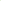

# Exploring Domain Generalization and Subpopulation Shift for Generalizable Graph-Level Anomaly Detection

<!-- Page 1 -->

Exploring Domain Generalization and Subpopulation Shift for Generalizable

Graph-Level Anomaly Detection

Xiaoxiang Li1, Xihe Xie2, Hai Wan1, Xibin Zhao1*

## 1 BNRist, KLISS, and School of Software, Tsinghua University 2 Hunan Qiangzhi Technology Development

Co., Ltd. {xx-li24}@mails.tsinghua.edu.cn, {xiesongjun}@qzdatasoft.com, {wanhai,zxb}@tsinghua.edu.cn

## Abstract

Graph-level anomaly detection (GLAD), which identifies rare or atypical graphs within a graph set, is crucial for applications such as image analysis, industrial defect inspection and fraud detection. However, existing GLAD approaches typically rely on the in-distribution hypothesis while lacking generalization capability for out-of-distribution (OOD) scenarios, which largely limits the application in the real world. In this paper, we are the first to formulate the OOD generalization problem for GLAD, where testing data exhibit significant distribution shifts from training data. To tackle two common types of distributional shifts, domain generalization and subpopulation shift, we propose the Fine-Grained Subpopulation Graph-Level Anomaly Detection (FGS-GLAD). First, we propose a Graph Information Bottleneck-based Anomaly Detection Module (GIB4AD) that implements graph reverse distillation and graph information bottleneck on the graph to enhance task-relevant feature extraction for generalization. Second, we propose a Fine-Grained Subpoulation Inference Module (FGSI) to predict fine-grained subpopulations and focus on critical inter-subpopulation features through a supervised contrastive mechanism. Experiments on seven benchmark datasets demonstrate our model’s superiority in handling domain generalization and subpopulation shift.

## Introduction

Graph-level anomalies refer to the rare or atypical individual graphs within a graph set (Li et al. 2024). The detection of such anomalies has significant implications across various domains, including image analysis for identifying structural anomalies (An et al. 2024), industrial defect inspection for detecting irregularities in manufacturing processes (Wu, Dai, and Tang 2021), and the detection of fraudulent activities in social networks (Wang et al. 2024). Compared to node-level and edge-level anomaly detection within a single graph, graph-level anomaly detection (GLAD) is inherently more complex. This complexity arises from the need to analyze not only the unique spatial structure and attributes of nodes/edges within each graph but also the structural and attribute patterns across graphs to identify potential anomalies within the graph set (Jin et al. 2025).

*Corresponding author. Copyright © 2026, Association for the Advancement of Artificial Intelligence (www.aaai.org). All rights reserved.

Training Set Domain Generalization

Subpopulation Shift

GLAD Unseen Domain Seen Domain

Training Set

Old Subpopulation

New Subpopulation

How to deal with a combination of domain generalization and subpopulation shift?

**Figure 1.** An illustration of generalizable graph-level anomaly detection task. This task faces both domain generalization and subpopulation shift challenges, leading to performance degradation of state-of-the-art baselines.

Current GLAD methods typically assume that training and testing data are drawn from the same distribution. However, this assumption does not hold in out-of-distribution (OOD) scenarios, where testing data may exhibit significant distributional shifts (Yu, Liang, and He 2023). Such OOD challenges are prevalent in real-world applications of GLAD and can result from various natural variations, such as differences in substructures, graph sizes, or semantic patterns (Gui et al. 2022). For example, in molecular property analysis, new compounds tested after deployment may belong to chemical families never seen during training. Therefore, the inability to generalize under OOD conditions severely limits the deployment and reliability of GLAD models in realworld settings.

As shown in Fig 1, OOD scenarios for GLAD typically involve a combination of domain generalization and subpopulation shift (Chung et al. 2024; Koh et al. 2021). That

The Fortieth AAAI Conference on Artificial Intelligence (AAAI-26)

15144

AI-readable visual equivalent, added: Figure extracted from the paper PDF and converted to an SVG wrapper asset. Use the surrounding page text and caption for interpretation.

<!-- Page 2 -->

is, the testing data may contain graphs from entirely new domains not seen during training, as well as graphs from the same domains but with different relative proportions compared to the training set. To this end, it becomes crucial to address both challenges jointly. (i) Domain Generalization (Gulrajani and Lopez-Paz 2020; Zhang et al. 2023): This challenge arises when unseen domains are introduced in the test set, where each domain may differ in substructure, size, and so on. In this case, models are expected to generalize to new domains without access to target domain data during training (Yu and Yu 2025; Liu, Yu, and Luo 2025; Yu et al. 2024). For GLAD, this is particularly challenging since anomalies are rare by nature, and the structural variations across domains can obscure the underlying signals that distinguish anomalies from normal graphs. An effective GLAD model must therefore extract domain-invariant but task-relevant features that are robust across diverse domains. (ii) Subpopulation Shift (Santurkar, Tsipras, and Madry 2020; Yang et al. 2023): This challenge arises when the training and testing datasets partly share the same domains, but the relative proportions or distributions of subpopulations within these domains differ. A model that overfits to the dominant subpopulations in the training set may struggle to detect anomalies in shifted subpopulations at test time. Therefore, handling subpopulation shift requires the ability to capture fine-grained differences among subpopulations and maintain balanced generalization, avoiding bias towards frequent training patterns.

To the best of our knowledge, we are the first to address out-of-distribution generalization problem for GLAD task. In this paper, we introduce Fine-Grained Subpopulation Graph-Level Anomaly Detection (FGS-GLAD), the first method designed to address the dual challenges of domain generalization and subpopulation shift in GLAD task. At its core, FGS-GLAD integrates two key components: (i) Graph Information Bottleneck-based Anomaly Detection Module (GIB4AD), which leverages graph reverse distillation and graph information bottleneck theory to enhance task-relevant feature extraction for better domain generalization; (2) Fine-Grained Subpopulation Inference Module (FGSI), which identifies fine-grained subpopulations and employs a supervised fine-grained contrastive mechanism to learn fine-grained patterns, ensuring the model focuses on critical yet challenging features during training. This holistic approach not only improves abilities for domain generalization but also mitigates the impact of fine-grained subpopulation shift.

In summary, this paper makes three key contributions:

• To the best of our knowledge, we make the first attempt to explore out-of-distribution generalization for graph-level anomaly detection, thereby extending the applicability of traditional methods to various real-world scenarios.

• We introduce FGS-GLAD, a novel method to address domain generalization and subpopulation shift for generalizable graph-level anomaly detection. It combines GIB4AD for task-relevant representation extraction and FGSI for subpopulation inference with supervised finegrained contrastive learning.

• Extensive experiments on seven benchmark datasets and ten state-of-the-art baselines demonstrate the superiority of our model in effectively addressing both domain generalization and subpopulation shift.

## Related Work

Graph-Level Anomaly Detection. Graph-level anomaly detection (GLAD) identifies anomalous graphs within graph sets, with important applications in fraud detection, industrial inspection, and image analysis. Recent approaches have employed various advanced techniques including knowledge distillation (Ma et al. 2022), one-class classification (Zhao and Akoglu 2023), transformation learning (Qiu et al. 2022), deep Random Walk Kernel (Zhang et al. 2022), and differential evolutionary algorithms (Ma et al. 2023). However, they are not designed to handle OOD problems where test data may exhibit significant distribution shift. Besides, they fail to capture fine-grained subpopulations, which are statistically coherent subsets of data points sharing specific attributes within the broader distribution. These flaws restrict their generalization capability for GLAD task. Graph Out-Of-Distribution Generalization. Addressing distribution shifts in graphs has gained attention (Li et al. 2022), with this paper focusing on OOD generalization for graph-level prediction. Recent work falls into three categories: (i) Data: Augmenting graphs to improve diversity (Kong et al. 2022; Liu et al. 2022); (ii) Model: Disentanglement or causality-based models for robust representations (Yang et al. 2020; Chen et al. 2022); (iii) Learning Strategy: Training with invariant or adversarial objectives for OOD robustness (Miao, Liu, and Li 2022; You et al. 2020). Despite progress, challenges in domain generalization and subpopulation shift for GLAD remain unsolved.

Problem Definition

Given a set of graphs G = {G1, G2,..., GN}, where each graph Gi = (Vi, Ei, Xi) consists of nodes Vi, edges Ei, and node attributes Xi, the goal of graph-level anomaly detection (GLAD) is to learn a model f: G →[0, 1] that assigns an anomaly score f(Gi) to each graph, indicating how likely it is to be anomalous with respect to normal graphs.

We formally define the generalizable GLAD problem under the OOD setting. Let the training set consist of graphs sampled from a set of domains Dtrain = {D1, D2,..., DK}, where each domain Dk represents a set of graphs with shared characteristics (e.g., originating from the same source, process, or environment). The test set contains graphs from a new set of domains Dtest with distribution shifts from Dtrain. In this paper, we focus on two common types of shifts: domain generalization and subpopulation shift. For domain generalization, the test set contains graphs from some unseen domains, i.e., Dtest \ Dtrain̸ = ∅. For subpopulation shift, the relative proportions of the overlapping seen domains Dtrain ∩Dtest differs between training set and test set. Under these settings, the objective of generalizable GLAD is to train a model on Gtrain ∼Dtrain that can accurately detect graph-level anomalies on Gtest ∼Dtest, despite the presence of distribution shift.

15145

<!-- Page 3 -->

Proposed Method Overview As shown in Figure 2, FGS-GLAD consists of two primary modules. First, GIB4AD is proposed to extract taskrelevant subgraphs through an encoder-bottleneck-decoder architecture, which leverages graph reverse distillation and information bottleneck theory for capturing discriminative patterns and detecting anomalies via reconstruction discrepancies. Second, FGSI is proposed to address subpopulation shift through supervised fine-grained contrastive learning, which identifies specific graph subtypes and mines finegrained subpopulation information.

Graph Information Bottleneck-based Anomaly Detection Challenge Analysis. Recent advancement in anomaly detection built upon the Reverse Distillation framework has achieved state-of-the-art results and shown promise in tackling out-of-distribution generalization problem (Cao, Zhu, and Pang 2023). However, its application to graph-structured data remains unexplored due to the inherent challenges of adapting reverse distillation to graphs. Besides, the performance of existing method is suboptimal, primarily due to the reliance on naive alignment strategies that use randomly selected normal samples for training and testing distributions. Method Rationale. We propose a novel encoder-bottleneckdecoder architecture that boasts two fundamental properties: (i) the implementation of reverse distillation on graph-structured data, where the student decoder learns to reconstruct the teacher’s representations in reverse order—systematically transferring the rich hierarchical knowledge from the teacher model to the student model. This significantly enhances anomaly detection by forcing the student model to capture structural patterns at multiple granularities. The student’s focused training on reconstructing graph patterns enables the model to make structural deviations and anomalies more distinguishable when encountered during inference; and (ii) the enhancement of OOD generalization capabilities through graph information bottleneck principle, which extracts a compressive yet taskrelevant subgraph containing only the essential structural information necessary for prediction. This approach improves robustness against distribution shifts and enables more accurate identification of anomalies. Graph Reverse Distillation. The Graph Reverse Distillation process consists of three main parts:

• Graph Teacher Encoder (ET): An encoder that extracts multi-scale graph representations. • Graph Information Bottleneck (Φ): A bottleneck that identifies and preserves task-relevant subgraphs. • Graph Student Decoder (DS): A trainable decoder that reconstructs the original graph from bottleneck representations.

It can be seen that rather than simultaneously feeding raw data into both the teacher and student models, our approach processes the low-dimensional embeddings through the student decoder. This design enables the student to emulate the teacher’s behavior by reconstructing the teacher’s multiscale representations. From a regression standpoint, our reverse distillation framework employs the student network to predict the teacher model’s hierarchical features.

Given an input graph G with adjacency matrix A and corresponding node features X, the encoder ET extracts hierarchical features Hl where l denotes the layer number. The graph information bottleneck Φ then transforms these features into a compressed representation Z = Φ(HL), where HL is the representation from the final encoder layer. Unlike conventional bottlenecks that perform simple dimensionality reduction, our graph information bottleneck selectively retains subgraph structures that are most informative for the anomaly detection task. Finally, the student decoder DS attempts to reconstruct the original hierarchical features:

ˆHl = Dl

S(Z), where ˆHl represents the reconstructed features at layer l.

Our approach reverses traditional knowledge distillation. The teacher model ET is pre-trained on in-distribution data and remains frozen, serving as a reference for normal graph patterns. The student decoder DS minimizes the reconstruction error:

Ldistill = 1

L

L X l=1

MSE(Hl, ˆHl) (1)

Graph Information Bottleneck. As an intermediate component between the Teacher Model and Student Model, we construct a graph information bottleneck layer to extract a compressive yet informative representation (Wu et al. 2020). The Information Bottleneck (IB) principle formalizes learning as a trade-off between compressing input X into a minimal sufficient representation Z while preserving maximal predictive information about the target Y.

Specifically, we aim to extract task-relevant subgraph structures while filtering out redundant information. For a given graph G with adjacency matrix A and node features X, we identify the most informative subgraph structures for anomaly detection. To generate the task-relevant subgraph, our approach learns a subgraph extractor gϕ based on the stochastic attention mechanism. For each edge (u, v), the concatenated representations of the source node and destination node (hu, hv) are mapped to a relevance score puv ∈[0, 1] computed as:

puv = σ(W · [hu∥hv] + b) (2)

where σ is the sigmoid function, W and b are learnable parameters, and ∥denotes concatenation. During the forward pass of each training iteration, each edge is sampled from a Bernoulli distribution αuv ∼Bern(puv). To make the sampling process differentiable, we employ the Gumbel- Softmax reparameterization trick:

αuv = exp log(puv)+g1 τ exp log(puv)+g1 τ

+ exp log(1−puv)+g2 τ

(3)

15146

<!-- Page 4 -->

Graph Student Decoder ࡰࡿ

Graph Teacher Encoder ࡱࢀ

Adjacency

Matrix ࡭

Input Graph ࡳ

Node Feature ࢄ

Reconstructed Adjacency Matrix ෡࡭

खୗ୊େ୐

ࢠ࢏

MLP 0.3 0.1 0.2

0.4

Subpopulation

Classifier

Encoder Decoder

Encoder

Encoder

Decoder

Decoder

ࡴൌሾࡴ૚ǡ ࡴ૛, ࡴ૜ሿ

෡ࡴൌ ෢ ሾࡴ૚, ෢ ࡴ૛, ෢ ࡴ૜ሿ

खࢊ࢏࢙࢚ ࢏࢒࢒

Bottleneck Subgraph ࡳࡿ

࡭ࡿ

ࢄࡿ

ख࢘ࢋࢉ࢕࢔

Graph Information Bottleneck-based Anomaly Detection Fine-Grained Subpopulation Inference

READOUT

ࢠ૚

ࢠ૛

····

ࢠ࡮

····

Graph Information Bottleneck ઴

GNN Edge Embed

MLP

GNN

࢖

ࢻ

ࢻ̱ ۰܍ܚܖሺ࢖ሻٖ

࡭ ࡭ࡿ

ࢄࡿ Share Weights

Subpopulation

Probability

Subpopulation

Label

**Figure 2.** The main framework of the proposed FGS-GLAD. The framework consists of two modules, including a Graph Information Bottleneck-based Anomaly Detection module (the yellow part) and a Fine-Grained Subpopulation Inference module (the blue part).

where g1, g2 are samples drawn from the Gumbel(0, 1) distribution and τ is a temperature parameter that controls the discreteness of the samples.

After this process, we extract the task-relevant adjacency matrix AS by applying an attention-guided edge mask α to the original adjacency matrix, formulated as:

AS = α ⊙A (4)

Here αuv represents the importance of edge (u, v) in the task-relevant subgraph and ⊙denotes the entry-wise product. The task-relevant components are retained and passed to the derivation of compressive and informative representations Xsub and the decoder for reconstruction.

Fine-Grained Subpopulation Inference Challenge Analysis. While existing GLAD approaches address the imbalance between normal and anomalous classes, they overlook the fine-grained subpopulation shift within each coarse category—a limitation that substantially hinders OOD generalization in GLAD task. Subpopulation shift refers to a scenario where the training and test data share some domains, but the balance or statistical properties of subpopulations within these domains shift. These biases manifest as heightened false positive rates when legitimate but underrepresented patterns emerge during inference.

Annotating fine-grained subpopulations demands greater expertise than coarse-grained labeling, making datasets with subpopulation annotations prohibitively expensive to obtain. This creates an urgent need for methods that can discover and leverage fine-grained subpopulations using only coarsegrained supervision. Current unsupervised approaches predominantly employ post-hoc clustering techniques, which fail to align with the anomaly detection objective and cannot be optimized end-to-end, yielding sub-optimal results.

## Method

Rationale. To address these challenges, we propose to discover and leverage fine-grained subpopulations within data distributions. Unlike conventional approaches that treat normality as a monolithic concept, FGSI decomposes graph patterns into a spectrum of fine-grained subpopulations, each characterizing a distinct mode in the data manifold. Central to our approach is the insight that finegrained subpopulation information can be learned in an unsupervised manner through a carefully designed supervised fine-grained contrastive objective that encourages subpopulation discovery while maintaining class coherence and discriminability. Subpopulation Classifier. The subpopulation classifier serves as the cornerstone of FGSI, tasked with inferring probabilistic assignments of normal instances to discovered fine-grained subpopulations. Formally, given a bottleneck subgraph GS with adjacency matrix AS and node features XS, along with a global bottleneck graph embedding ZB obtained by pooling and readout operations, the classifier outputs a probability distribution over C fine-grained subpopulations. The classifier architecture comprises a multilayer graph neural network followed by a softmax layer:

p(yf|G) = softmax(Wc · GNN(AS, XS, ZB) + bc) (5)

where Wc and bc are learnable parameters, yf ∈ {1, 2,..., C} represents the fine-grained subpopulation index, and y is the graph-level embedding obtained from the encoder. Supervised Fine-Grained Contrastive. Building upon the subpopulation classifier, we introduce a Supervised Finegrained Contrastive Learning (SFCL) framework that simultaneously enhances representation discriminability and addresses the subpopulation imbalance problem. The SFCL loss is formulated as:

15147

AI-readable visual equivalent, added: Figure extracted from the paper PDF and converted to an SVG wrapper asset. Use the surrounding page text and caption for interpretation.

<!-- Page 5 -->

LSFCL = 1

|B|

X i∈B log Ni

Di

, (6)

where B denotes the mini-batch of samples, Ni captures the fine-grained differences in contrastive learning:

Ni =

X p∈P (i)∧p/∈f(i)

exp zi · zp τ

+ α

X p∈P (i)∧p∈f(i)

exp zi · zp τ

(7)

where P(i) represents the set of positive samples sharing the same coarse-grained class as sample i, and f(i) identifies samples from the same fine-grained subpopulation as i. The hyperparameter α > 1 amplifies the contribution of samesubpopulation samples. The set A(i) comprises all samples in the batch excluding i, and τ is the temperature parameter controlling the concentration of the similarity distribution. In addition, Di normalizes over all non-identical samples:

Di =

X a∈A(i)

exp(zi · za/τ). (8)

Reconstruction. After the Graph Information Bottleneck Φ extracts the bottleneck subgraph GS, the Student Decoder transforms GS through multiple layers to ultimately produce the representation necessary to synthesize the original adjacency matrix that captures graph connectivity patterns. The reconstruction error is defined as:

Lrecon = 1

N

N X i=1

∥Ai −ˆAi∥2

2, (9)

where Ai represents the i-th row of the original adjacency matrix, ˆAi denotes the corresponding reconstructed row by the Student Decoder using the bottleneck representation GS, and N is the total number of nodes in the graph. This rowwise computation ensures that the model captures both local connectivity patterns and global structural properties.

During training, we simultaneously optimize the subpopulation classifier with our supervised contrastive objective and the reconstruction model, creating a mutually beneficial relationship: better subpopulation classification improves reconstruction guidance, while lower reconstruction errors validate the discovered fine-grained structure. Overall Objective. The overall objective of our framework integrates the GIB4AD and FGSI components into a unified training objective:

L = Lrecon + αLSFCL + βLdistill, (10)

where α and β are parameters controlling the relative importance of each component.

## Experiment

Setup In this section, we introduce the experimental setup, including the datasets, baselines, evaluation metrics and implementation details.

Datasets We conduct experiments on seven benchmarks that explicitly incorporate distribution shifts between training and testing environments. For multiclass datasets, we designate all instances with non-zero labels as normal and zero-labeled instances as anomalous.

• GOOD Dataset. Five datasets from the GOOD benchmark (Gui et al. 2022) include: Motif-Base and Motif- Size, synthetic graphs with house/cycle motifs undergoing base structure and size shifts respectively; CMNIST- Color, graph-transformed MNIST digits with color distribution shifts; and HIV-Scaffold and HIV-Size, molecular graphs for HIV inhibition with scaffold and size distribution shifts. • DrugOOD Dataset. Two datasets from DrugOOD (Ji et al. 2023) include: DrugOOD-IC50-Scaffold and DrugOOD-IC50-Size—represent bioactive molecules with challenging scaffold and size shifts, simulating the real-world drug discovery scenarios.

Baselines We compare our model with several representative state-ofthe-art methods, which can be divided into two groups:

• Graph Out-Of-Distribution. Four graph out-ofdistribution methods: GSAT (Miao, Liu, and Li 2022), CIGA (Chen et al. 2022), PGIB (Seo, Kim, and Park 2024) and IGM (Jia et al. 2024). • Graph-Level Anomaly Detection. Three graph-level anomaly detection methods: SIGNET (Liu et al. 2023), MUSE (Kim et al. 2024) and iGAD (Zhang et al. 2022).

Implementation Details We implement our graph anomaly detection framework using PyTorch and PyTorch Geometric. All experiments are performed on an NVIDIA V100 GPU with 16GB memory. For optimization, we use Adam optimizer with learning rate 0.001, weight decay 1e-5, and train for 200 epochs with early stopping based on validation loss. Following prior works (Kim et al. 2024), we employ Recall, ROC-AUC and F1-Score as evaluation metrics. All experiments are conducted with five random seeds.

## Results

and Analysis In this section, we conduct experiments regarding anomaly detection performance, ablation study, hyperparameter sensitivity, and visualization to validate FGS-GLAD.

Anomaly Detection Performance In this section, we compare the GLAD performance of FGS- GLAD with various state-of-the-art baselines under distribution shift scenarios. The results are shown in Table 1 and Table 2. We can have the following observations:

(1) Graph OOD baselines exhibit inconsistent performance across datasets and shift settings, demonstrating limited capability in handling fine-grained imbalance issues. For example, PGIB achieves 57.01% F1-Score and GSAT

15148

<!-- Page 6 -->

GOOD-CMNIST Dataset Metric GSAT CIGA PGIB IGM iGAD MUSE SIGNET Ours

Color

Recall 44.46±0.67 58.13±0.24 59.56±0.93 52.86±0.23 65.44±0.66 38.18±0.49 32.47±1.08 70.21±2.30 F1-Score 42.40±0.56 37.17±0.48 34.21±0.54 38.78±1.06 56.04±0.79 13.57±1.02 11.68±1.28 61.49±1.21 ROC-AUC 70.30±1.13 69.72±0.53 71.05±1.02 69.89±0.75 75.61±0.17 44.24±0.78 36.76±1.24 80.01±1.42

GOOD-HIV Dataset Metric GSAT CIGA PGIB IGM iGAD MUSE SIGNET Ours

Scaffold

Recall 71.41±1.03 67.48±1.45 70.70±2.06 68.13±2.12 59.08±1.07 48.17±1.58 54.71±1.99 76.23±1.75 F1-Score 66.55±1.71 55.84±0.87 70.29±2.13 69.08±1.96 47.92±2.14 60.87±0.82 70.31±1.61 75.45±1.89 ROC-AUC 56.90±0.97 63.27±1.12 66.79±1.39 63.26±1.80 57.18±2.57 52.98±1.03 58.14±0.67 71.92±1.22

Size

Recall 69.37±0.75 68.74±2.32 66.09±1.12 63.16±1.96 52.63±1.60 49.10±2.16 49.62±4.00 74.56±1.44 F1-Score 55.90±1.36 63.67±0.91 65.49±1.54 60.75±0.93 48.91±1.19 63.18±2.88 65.84±3.54 70.95±2.13 ROC-AUC 55.98±1.20 62.08±1.01 61.32±2.61 62.76±1.45 53.60±0.90 48.82±1.57 47.15±2.87 68.79±1.36

GOOD-Motif Dataset Metric GSAT CIGA PGIB IGM iGAD MUSE SIGNET Ours

Base

Recall 70.35±0.72 73.01±1.56 72.61±1.17 70.60±0.92 63.45±0.62 40.06±0.77 39.16±1.11 78.32±1.24 F1-Score 66.34±1.52 72.02±1.04 71.38±1.42 68.56±1.03 62.76±0.98 35.58±0.79 36.09±1.20 77.13±1.15 ROC-AUC 73.62±1.46 63.05±1.23 77.07±0.79 79.59±1.26 72.24±1.29 55.28±1.19 53.00±0.28 84.68±0.98

Size

Recall 56.58±0.51 34.14±2.71 67.38±1.45 68.79±0.45 56.87±1.97 52.81±1.06 54.15±0.97 73.85±1.18 F1-Score 24.65±0.76 28.72±3.80 57.01±0.81 51.09±0.97 56.42±1.04 34.66±0.58 38.52±1.29 61.08±1.35 ROC-AUC 63.29±0.24 58.06±0.81 60.45±1.32 46.58±0.42 54.15±0.81 41.35±1.58 42.27±2.52 66.37±0.92

**Table 1.** Graph-level anomaly detection performance on the GOOD dataset. Color, Scaffold, Base and Size are the basis for dividing ID and OOD graphs. Best and runner-up results are highlighted with bold and underline, respectively.

DrugOOD-IC50 Dataset Metric GSAT CIGA PGIB IGM iGAD MUSE SIGNET Ours

Scaffold

Recall 66.55±0.93 60.34±1.83 65.98±0.61 67.19±0.45 52.98±1.74 48.34±2.36 47.28±1.65 71.94±1.02 F1-Score 57.11±0.54 56.80±1.31 63.35±0.33 65.70±0.52 51.51±1.44 25.11±1.73 24.69±0.45 69.87±0.81 ROC-AUC 57.99±0.60 63.32±1.74 66.19±0.45 66.32±0.48 50.39±0.78 50.05±1.23 48.47±1.37 70.89±0.92

Size

Recall 63.46±1.24 61.41±1.51 51.68±0.46 66.08±1.62 58.73±1.46 53.17±1.52 50.20±2.35 70.65±1.39 F1-Score 57.64±0.98 63.42±1.10 55.17±0.51 60.36±0.78 51.46±0.37 29.19±0.89 23.01±0.93 67.81±0.76 ROC-AUC 54.22±0.85 65.46±0.72 60.57±0.87 57.05±1.45 58.92±1.61 52.23±1.91 48.80±1.71 69.98±0.94

**Table 2.** Graph-level anomaly detection performance on the DrugOOD dataset. Scaffold and Size are the basis for dividing ID and OOD graphs. Best and runner-up results are highlighted with bold and underline, respectively.

reaches 63.29% ROC-AUC in GOOD-Motif Size shift, yet their performance degrades significantly in other settings. IGM achieves 79.59% ROC-AUC on GOOD-Motif-Base but fails to maintain consistent performance across distribution shift scenarios.

(2) Traditional GLAD baselines generally underperform compared to Graph OOD methods, exhibiting substantially lower F1-Scores across all datasets. MUSE and SIGNET achieve merely 13.57% and 11.68% on GOOD-CMNIST Color, respectively. While iGAD shows improved performance in certain scenarios, These methods primarily target in-distribution settings and lack effective mechanisms for distribution shift handling. Performance deteriorates considerably when confronting complex distribution shift patterns, particularly in molecular datasets like DrugOOD-IC50.

(3) FGS-GLAD consistently outperforms all baseline methods across diverse datasets and metrics, achieving average improvements of 4.57% ROC-AUC, 4.75% Recall, and 5.13% F1-Score compared to the best baseline performance. This superior performance stems from two key modules:

the Graph Information Bottleneck-based Anomaly Detection module that effectively handles distribution shifts while preserving task-relevant information, and the fine-grained subpopulation inference module that addresses subpopulation shift through fine-grained pattern focus. The synergistic integration enables robust performance maintenance in challenging scenarios including GOOD-Motif Size shift and DrugOOD-IC50 Scaffold shift, where most baselines struggle significantly.

Ablation Study In this section, we analyze FGS-GLAD through comprehensive ablation studies. We consider the following variants:

• Baseline: The original GSAT backbone. • Baseline-F: GSAT enhanced with our FGSI module. • Baseline-G: GSAT integrated with our GIB4AD module. • FGS-GLAD: Our proposed model.

**Table 3.** presents performance comparisons across four datasets with distribution shifts. The ablation results reveal

15149

<!-- Page 7 -->

## Method

GOOD-CMNIST-Color GOOD-HIV-Scaffold GOOD-Motif-Base DrugOOD-IC50-Scaffold Recall F1-Score ROC-AUC Recall F1-Score ROC-AUC Recall F1-Score ROC-AUC Recall F1-Score ROC-AUC Baseline 44.46 42.40 70.30 71.41 66.55 56.90 70.35 66.34 73.62 66.55 57.11 57.99 Baseline-F 58.37 52.67 74.82 73.67 69.20 63.45 74.52 70.84 77.98 68.94 62.58 63.76 Baseline-G 65.18 58.14 76.29 74.89 72.16 68.35 76.45 74.28 82.53 69.45 65.97 67.43 FGS-GLAD 70.21 61.49 80.01 76.23 75.45 71.92 78.32 77.13 84.68 71.94 69.87 70.89

**Table 3.** Ablation study results. The best results are shown in bold type and the runner-ups are underlined.

**Figure 3.** Hyper-parameter sensitivity analysis results for hyper-parameters α and β.

the following key insights:

(1) Baseline shows limited efficacy due to GSAT’s inability to address domain generalization and subpopulation shift. FGSI augmentation improves ROC-AUC by 4.52%, 6.55%, 4.36%, 5.77% across four datasets, validating its effectiveness in mitigating fine-grained subpopulation shift.

(2) Baseline-G ranks second consistently, achieving 8.91% and 9.44% ROC-AUC gains over Baseline on GOOD-Motif-Base and DrugOOD-IC50-Scaffold respectively, confirming GIB4AD’s ability to enhance taskrelevant feature extraction.

(3) FGS-GLAD outperforms all variants across metrics. Results validate the theoretical framework, demonstrating the necessity of GIB4AD and FGSI for graph-level anomaly detection under distribution shifts.

Hyperparameter Sensitivity

In this section, we perform hyper-parameter sensitivity analysis on 3 representative datasets to investigate the impact of α and β on FGS-GLAD by conducting a grid search for their optimal values. Initially, we set β = 0.1 and vary α, followed by fixing α = 0.5 while varying β. The experimental

**Figure 4.** Computational analysis results on three representative datasets.

results are illustrated in the Figure 3. Overall, FGS-GLAD maintains solid performance with different parameter settings. The optimal performance is observed when α = 0.5 and β = 0.1, indicating its strongest capability under this setting.

Computational Complexity To validate the efficiency of FGS-GLAD, we compare it with state-of-the-art methods (PGIB and SIGNET) across datasets of varying sizes. Results are concluded in Figure 4. FGS-GLAD trains 26.7% faster than PGIB and 36.8% faster than SIGNET by avoiding PGIB’s costly graph prototypes and SIGNET’s cross-view hypergraph computations, while using 14.3% less memory than PGIB and 28.6% less than SIGNET through selective information processing. These advantages make FGS-GLAD highly scalable for large-scale graph anomaly detection.

## Conclusion

In this paper, we propose Fine-Grained Subpopulation Graph-Level Anomaly Detection (FGS-GLAD), the first method designed to address the dual challenges of domain generalization and subpopulation shift in generalizable graph-level anomaly detection task. Our approach consists of two novel modules: the GIB4AD module which enhances task-relevant representation extraction under OOD scenarios by leveraging graph reverse distillation and graph information bottleneck theory, and the FGSI module which infers fine-grained subpopulations and employs a supervised finegrained contrastive mechanism to mine hard-to-learn finegrained patterns. Extensive experiments on seven benchmark datasets demonstrate the superiority of FGS-GLAD in handling domain generalization and subpopulation shift.

15150

<!-- Page 8 -->

## Acknowledgments

This work was partially supported by the Ministry of Industry and Information Technology of China, the National Key Research and Development Program of China (No. 2023YFB3307500), the Guangdong S&T Programme (No. 2024B0101030002), the NSFC (No. 6212780016).

## References

An, W.; Zhong, W.; Jiang, F.; Ma, H.; and Huang, J. 2024. Causal Subgraphs and Information Bottlenecks: Redefining OOD Robustness in Graph Neural Networks. In European Conference on Computer Vision, 473–489. Springer. Cao, T.; Zhu, J.; and Pang, G. 2023. Anomaly detection under distribution shift. In Proceedings of the IEEE/CVF International Conference on Computer Vision, 6511–6523. Chen, Y.; Zhang, Y.; Bian, Y.; Yang, H.; Kaili, M.; Xie, B.; Liu, T.; Han, B.; and Cheng, J. 2022. Learning causally invariant representations for out-of-distribution generalization on graphs. Advances in Neural Information Processing Systems, 35: 22131–22148. Chung, H.-H.; Chaudhari, S.; Wald, Y.; Han, X.; and Ghosh, J. 2024. Novel Node Category Detection Under Subpopulation Shift. In Joint European Conference on Machine Learning and Knowledge Discovery in Databases, 196–212. Springer. Gui, S.; Li, X.; Wang, L.; and Ji, S. 2022. Good: A graph out-of-distribution benchmark. Advances in Neural Information Processing Systems, 35: 2059–2073. Gulrajani, I.; and Lopez-Paz, D. 2020. In Search of Lost Domain Generalization. In International Conference on Learning Representations. Ji, Y.; Zhang, L.; Wu, J.; Wu, B.; Li, L.; Huang, L.-K.; Xu, T.; Rong, Y.; Ren, J.; Xue, D.; et al. 2023. Drugood: Outof-distribution dataset curator and benchmark for ai-aided drug discovery–a focus on affinity prediction problems with noise annotations. In Proceedings of the AAAI Conference on Artificial Intelligence, volume 37, 8023–8031. Jia, T.; Li, H.; Yang, C.; Tao, T.; and Shi, C. 2024. Graph invariant learning with subgraph co-mixup for out-ofdistribution generalization. In Proceedings of the AAAI Conference on Artificial Intelligence, volume 38, 8562–8570. Jin, W.; Ma, H.; Zhang, Y.; Li, Z.; and Chang, L. 2025. Dualview graph-of-graph representation learning with graph Transformer for graph-level anomaly detection. Neural Networks, 187: 107291. Kim, S.; Lee, S. Y.; Bu, F.; Kang, S.; Kim, K.; Yoo, J.; and Shin, K. 2024. Rethinking reconstruction-based graphlevel anomaly detection: Limitations and a simple remedy. Advances in Neural Information Processing Systems, 37: 95931–95962. Koh, P. W.; Sagawa, S.; Marklund, H.; Xie, S. M.; Zhang, M.; Balsubramani, A.; Hu, W.; Yasunaga, M.; Phillips, R. L.; Gao, I.; et al. 2021. Wilds: A benchmark of in-the-wild distribution shifts. In International conference on machine learning, 5637–5664. PMLR.

Kong, K.; Li, G.; Ding, M.; Wu, Z.; Zhu, C.; Ghanem, B.; Taylor, G.; and Goldstein, T. 2022. Robust optimization as data augmentation for large-scale graphs. In Proceedings of the IEEE/CVF conference on computer vision and pattern recognition, 60–69. Li, H.; Wang, X.; Zhang, Z.; and Zhu, W. 2022. Ood-gnn: Out-of-distribution generalized graph neural network. IEEE Transactions on Knowledge and Data Engineering, 35(7): 7328–7340. Li, Z.; Liang, S.; Shi, J.; and van Leeuwen, M. 2024. Crossdomain graph level anomaly detection. IEEE Transactions on Knowledge and Data Engineering. Liu, S.; Ying, R.; Dong, H.; Li, L.; Xu, T.; Rong, Y.; Zhao, P.; Huang, J.; and Wu, D. 2022. Local augmentation for graph neural networks. In International conference on machine learning, 14054–14072. PMLR. Liu, Y.; Ding, K.; Lu, Q.; Li, F.; Zhang, L. Y.; and Pan, S. 2023. Towards self-interpretable graph-level anomaly detection. Advances in Neural Information Processing Systems, 36: 8975–8987. Liu, Z.; Yu, H.; and Luo, X. 2025. Federated Graph Anomaly Detection via Disentangled Representation Learning. In Proceedings of the ACM on Web Conference 2025, 1216–1224. Ma, R.; Pang, G.; Chen, L.; and van den Hengel, A. 2022. Deep graph-level anomaly detection by glocal knowledge distillation. In Proceedings of the fifteenth ACM international conference on web search and data mining, 704–714. Ma, X.; Wu, J.; Yang, J.; and Sheng, Q. Z. 2023. Towards graph-level anomaly detection via deep evolutionary mapping. In Proceedings of the 29th ACM SIGKDD Conference on Knowledge Discovery and Data Mining, 1631–1642. Miao, S.; Liu, M.; and Li, P. 2022. Interpretable and generalizable graph learning via stochastic attention mechanism. In International Conference on Machine Learning, 15524– 15543. PMLR. Qiu, C.; Kloft, M.; Mandt, S.; and Rudolph, M. 2022. Raising the bar in graph-level anomaly detection. Proceedings of the Thirty-First International Joint Conference on Artificial Intelligence. Santurkar, S.; Tsipras, D.; and Madry, A. 2020. BREEDS: Benchmarks for Subpopulation Shift. In International Conference on Learning Representations. Seo, S.; Kim, S.; and Park, C. 2024. Interpretable prototypebased graph information bottleneck. Advances in Neural Information Processing Systems, 36. Wang, Z.; Luo, X.; Song, E.; Bai, Q.; and Lin, F. 2024. Imbalanced Graph-Level Anomaly Detection via Counterfactual Augmentation and Feature Learning. In Proceedings of the 36th International Conference on Scientific and Statistical Database Management, 1–12. Wu, T.; Ren, H.; Li, P.; and Leskovec, J. 2020. Graph information bottleneck. Advances in Neural Information Processing Systems, 33: 20437–20448. Wu, Y.; Dai, H.-N.; and Tang, H. 2021. Graph neural networks for anomaly detection in industrial Internet of Things. IEEE Internet of Things Journal, 9(12): 9214–9231.

15151

<!-- Page 9 -->

Yang, Y.; Feng, Z.; Song, M.; and Wang, X. 2020. Factorizable graph convolutional networks. Advances in Neural Information Processing Systems, 33: 20286–20296. Yang, Y.; Zhang, H.; Katabi, D.; and Ghassemi, M. 2023. Change is hard: a closer look at subpopulation shift. In Proceedings of the 40th International Conference on Machine Learning, 39584–39622. You, Y.; Chen, T.; Sui, Y.; Chen, T.; Wang, Z.; and Shen, Y. 2020. Graph contrastive learning with augmentations. Advances in neural information processing systems, 33: 5812– 5823. Yu, H.; Wen, J.; Sun, Y.; Wei, X.; and Lu, J. 2024. CA- GNN: A competence-aware graph neural network for semisupervised learning on streaming data. IEEE Transactions on Cybernetics. Yu, H.; and Yu, H. 2025. Enhancing Zero-Shot Knowledge Graph Relation Prediction through Large Language Models and Contrastive Learning. In Companion Proceedings of the ACM on Web Conference 2025, 1490–1494. Yu, J.; Liang, J.; and He, R. 2023. Mind the label shift of augmentation-based graph ood generalization. In Proceedings of the IEEE/CVF Conference on Computer Vision and Pattern Recognition, 11620–11630. Zhang, G.; Yang, Z.; Wu, J.; Yang, J.; Xue, S.; Peng, H.; Su, J.; Zhou, C.; Sheng, Q. Z.; Akoglu, L.; et al. 2022. Dualdiscriminative graph neural network for imbalanced graphlevel anomaly detection. Advances in Neural Information Processing Systems, 35: 24144–24157. Zhang, X.; He, Y.; Xu, R.; Yu, H.; Shen, Z.; and Cui, P. 2023. Nico++: Towards better benchmarking for domain generalization. In Proceedings of the IEEE/CVF conference on computer vision and pattern recognition, 16036–16047. Zhao, L.; and Akoglu, L. 2023. On using classification datasets to evaluate graph outlier detection: Peculiar observations and new insights. Big Data, 11(3): 151–180.

15152
