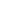

# FairGSE: Fairness-Aware Graph Neural Network Without High False Positive Rates

<!-- Page 1 -->

FairGSE: Fairness-Aware Graph Neural Network Without High False Positive

Rates

Zhenqiang Ye1, 2*, Jinjie Lu1, 2*, Tianlong Gu1, 2†, Fengrui Hao1, 2, Xuemin Wang3

1College of Cyber Security, Jinan University 2Engineering Research Center of Trustworthy AI (Ministry of Education) 3School of Computer Science and Information Security, Guilin University of Electronic Technology yzq66f@stu.jnu.edu.cn, lujinjie0424@stu2023.jnu.edu.cn, gutianlong@jnu.edu.cn, haofengrui@stu2021.jnu.edu.cn, wangxuemin@guet.edu.cn

## Abstract

Graph neural networks (GNNs) have emerged as the mainstream paradigm for graph representation learning due to their effective message aggregation. However, this advantage also amplifies biases inherent in graph topology, raising fairness concerns. Existing fairness-aware GNNs provide satisfactory performance on fairness metrics such as Statistical Parity and Equal Opportunity while maintaining acceptable accuracy trade-offs. Unfortunately, we observe that this pursuit of fairness metrics neglects the GNN’s ability to predict negative labels, which renders their predictions with extremely high False Positive Rates (FPR), resulting in negative effects in high-risk scenarios. To this end, we advocate that classification performance should be carefully calibrated while improving fairness, rather than simply constraining accuracy loss. Furthermore, we propose Fair GNN via Structural Entropy (FairGSE), a novel framework that maximizes two-dimensional structural entropy (2D-SE) to improve fairness without neglecting false positives. Experiments on several real-world datasets show FairGSE reduces FPR by 39% vs. state-of-the-art fairness-aware GNNs, with comparable fairness improvement.

## Introduction

Graph neural networks (GNNs) have developed as one of the most prominent techniques for modeling graphstructured data. The outstanding performance of GNNs can be attributed to the message aggregation mechanism (Ying et al. 2019), which iteratively updates a node representation by aggregating the feature information from its neighbors. However, recent studies (Agarwal, Lakkaraju, and Zitnik 2021; Dai and Wang 2021) have shown that message aggregation can introduce biases inherent in graph topology. Such biases inflict discrimination on specific sensitive groups, which are represented by subsets of nodes sharing the same sensitive attribute (e.g., gender (Lambrecht and Tucker 2019), race (Agarwal, Lakkaraju, and Zitnik 2021)), raising group fairness concerns of GNNs in highstakes scenarios. Group fairness in GNNs is often evaluated using metrics like Statistical Parity (∆SP) (Dwork et al.

*These authors contributed equally. †Corresponding author. Copyright © 2026, Association for the Advancement of Artificial Intelligence (www.aaai.org). All rights reserved.

FairINV DAB-GNN FairGP FairSIN 0

2

3

4

5

ΔSP & ΔEO (%)

ΔSP ↓ ΔEO ↓ FPR ↓

60

70

80

90

100

FPR (%)

**Figure 1.** FPR, ∆SP and ∆EO of Fairness-aware GNNs on Credit dataset.

2012) and Equal Opportunity (∆EO) (Hardt, Price, and Srebro 2016). Recent state-of-the-art (SOTA) fairness-aware GNNs achieve a reasonable trade-off between accuracy and group fairness.

However, enhancing group fairness such as ∆SP and ∆EO alone may encourage models to adopt a misguided shortcut, called FPR shortcut, in which fairness is improved at the cost of excessively lifting the false positive rates (FPR). As shown in Fig. 1, despite mitigating both ∆SP and ∆EO, existing fairness-aware methods exhibit extremely high false positive rates in the Credit defaulter graph(Yeh and Lien 2009). In particular, the FairSIN FPR (Yang et al. 2024a) is close to 100%, indicating that it classifies nearly all customers as credit card defaulters, which is clearly unreasonable. This phenomenon cannot be captured by ∆SP and ∆EO, which primarily focus on the probability of positive predictions within each sensitive group. Fairness-aware GNNs are often deployed in high-stakes scenarios, such as assessing credit risk on the German credit graph (Dua, Graff et al. 2017) or deciding bail eligibility on the Recidivism graph (Jordan and Freiburger 2015). In these contexts, models with high FPR tend to misclassify high-risk offenders as low-risk or incorrectly assess poor-credit users as reliable, raising serious trustworthy concerns.

In this paper, we pioneer how to improve the fairness of GNNs while avoiding the FPR shortcut. To this end, we formulate the fairness-FPR trade-off as an optimiza-

The Fortieth AAAI Conference on Artificial Intelligence (AAAI-26)

16163

<!-- Page 2 -->

tion problem constrained by an upper bound on a twodimensional structural entropy (2D-SE) objective. Furthermore, we propose FairGSE (Fair GNN via two-dimensional Structural Entropy), a framework that adaptively reweights graph edges to maximize 2D-SE. FairGSE can provide balanced message aggregation across sensitive groups, discouraging reliance on the FPR shortcut to achieve fairness.

Our contributions are as follows:

• We pioneer an important yet underexplored issue in fairness-aware GNNs: the tendency to improve fairness by excessively lifting high FPR.

• We formulate the trade-off between fairness and FPR as an upper-bound optimization problem based on twodimensional structural entropy.

• We propose FairGSE, a novel GNN framework that adaptively reweights graph edges to maximize the twodimensional structural entropy objective.

• We evaluate FairGSE on multiple real-world datasets. Experimental results demonstrate that FairGSE achieves competitive accuracy and group fairness compared to SOTA methods without significantly lifting FPR.

## Related Work

Fairness in Graph Fairness in GNNs is typically studied under two paradigms: group fairness (Agarwal, Lakkaraju, and Zitnik 2021; Dai and Wang 2021; Dong et al. 2022b; Cong et al. 2023) and individual fairness (Dong et al. 2021; Kang et al. 2020; Zhang, Yuan, and Pan 2024). Group fairness, commonly measured by Statistical Parity (∆SP) (Dwork et al. 2012) and Equal Opportunity (∆EO) (Hardt, Price, and Srebro 2016), aims to ensure equal treatment across sensitive groups, and has been the primary focus in fair GNN research. For instance, FairGNN (Dai and Wang 2021) leverages adversarial learning to minimize reliance on sensitive attributes, while FairVGNN (Wang et al. 2022) and FairINV (Zhu et al. 2024) employ dynamic masking and invariant learning to suppress spurious correlations, respectively. Representation-level interventions such as ED- ITS (Dong et al. 2022a) adjust features and structure distributions to mitigate bias, DAB-GNN (Lee, Shin, and Kim 2025) further utilizes the Wasserstein distance to constrain the differences between various representations in order to debias. FairSIN (Yang et al. 2024a) neutralizes sensitive information using a heterogeneous neighbor mean representation estimator. Recently, group fairness has been extended to Graph Transformers (Luo et al. 2025). Despite these advances, most existing methods focus solely on optimizing fairness metrics (e.g., ∆SP and ∆EO). As we show in this work, enforcing group fairness alone can lead to trivial or misleading solutions, such as classifying most nodes as positive, achieving optimal fairness at the cost of a high FPR.

Structural Entropy Information entropy (a.k.a. Shannon entropy) (Shannon 1948) is a fundamental measure in information theory that quantifies the uncertainty of a random variable or probability distribution. Extending this concept to the graph domain, structural entropy (SE) (Li and

Pan 2016) is designed to measure the uncertainty associated with the hierarchical partition of graphs. Specifically, the nodes of a graph can be partitioned into different groups (e.g., communities or clusters), and each group can be further divided into hierarchical subgroups. This hierarchical partition of the graph can be naturally abstracted as an encoding tree (Li and Pan 2016; Li et al. 2018), and each tree node represents a specific group. N-dimensional structural entropy, which quantifies the number of bits required to encode a graph given an n layers encoding tree, has been increasingly adopted in various graph learning tasks, including adversarial robustness (Liu et al. 2022a), node classification (Duan et al. 2024), and anomaly detection (Zeng, Peng, and Li 2024; Yang et al. 2024b; Xian et al. 2025). In our work, we leverage two-dimensional structural entropy, which is defined over a one-step partition of nodes based on sensitive attributes, as a principled measure to balance message aggregation across sensitive groups and to avoid FPR shortcut.

## Preliminaries

Notation In this paper, we denote matrices with boldface uppercase letters (e.g., H) and represent the (i, j)-th entry of H as H(i,j). We denote sets with calligraphic fonts (e.g., V) and the number of elements in the set V as |V|. Given an undirected attribute graph G = (V, A, X), where V = {v1, v2,..., vn} is the set of nodes, X ∈Rn×d is the feature matrix of dimension d and A ∈Rn×n is the adjacency matrix. For weighted graphs, A(i,j) denotes the edge weight between vi and vj; for unweighted graphs, A ∈{0, 1}n×n, where A(i,j) = 1 indicates the existence of an edge e(i,j). We use yi to denote the ground-truth label of node vi. For simplicity, we follow previous work(Dai and Wang 2021; Wang et al. 2022; Dong et al. 2022a; Yang et al. 2024a) and assume that each node vi has a binary sensitive attribute si ∈{0, 1} and a binary ground-truth label yi ∈{0, 1}, which we define yi = 1 as a positive label and yi = 0 as a negative label. We use S = {s1, s2, · · ·, sn} and Y = {y1, y2, · · ·, yn} to denote the set of sensitive attributes and ground-truth labels, respectively. A GNN model f consists of a GNN encoder fθ and a linear classifier cϕ. For the node classification task, a GNN model f learns the prediction of the label ˆyi = cϕ(fθ(vi, G)) for node vi ∈V.

Fairness Metrics To quantify group fairness, we follow studies (Dwork et al. 2012; Hardt, Price, and Srebro 2016) to adopt statistical parity (∆SP):

∆SP = |P(ˆyv = 1|sv = 0) −P(ˆyv = 1|sv = 1)|, (1)

where P(ˆyv = 1|sv = i) denotes the probability that a node v with the sensitive attribute sv = i is predicted as a positive outcome (ˆyv = 1), which can be interpreted as the acceptance rate of a sensitive group. And equal opportunity (∆EO):

∆EO = |P(ˆyv = 1|sv = 0, yv = 1)

−P(ˆyv = 1|sv = 1, yv = 1)|, (2)

where P(ˆyv = 1|sv = i, yv = 1)| denotes the probability that a node v with the sensitive attribute sv = i and the positive label yv = 1 is predicted as a positive outcome (ˆyv = 1),

16164

<!-- Page 3 -->

which can be considered the true positive rate of a sensitive group. Therefore, ∆SP and ∆EO measure the disparity in acceptance rates (i.e., positive predictions) and true positive rates between different sensitive groups, respectively. Note that a model with lower ∆SP and ∆EO implies better group fairness performance. In the context of node classification, a model that predicts all nodes as positive outcomes implies that both acceptance rate and true positive rate are equal to 1, thereby leading to perfect fairness, i.e., ∆SP = ∆EO = 0. However, this may result in an excessively high FPR.

Theoretical Analysis To address the above problem, we refine the notion of twodimensional structural entropy proposed in (Li and Pan 2016), which measures the uncertainty of a graph given by the partition of nodes. To incorporate this notion, we formally define the two-dimensional structural entropy w.r.t. sensitive attribute as follows: Definition 1 (2D-SE w.r.t. sensitive attribute) Given a graph G, the node set V of G is partitioned by PS = {VS0, VS1}, where the sensitive group VSi denotes a group of nodes with the same sensitive attribute. The two-dimensional structural entropy (2D-SE) w.r.t. sensitive attribute HPS(G) of G is:

HPS (G) = −

X

VSi ∈PS vol(VSi)

vol(G)

X v∈VSi dv vol(VSi) log dv vol(VSi)

−

X

VSi ∈PS g(VSi) vol(G) log vol(VSi)

vol(G),

(3)

where the degree of node v is dv = P u∈N(v) A(v,u) and N(v) is the set of neighbors of v. For a sensitive group VSi ∈ PS, the volume vol(VSi) is defined as the sum of the degrees of all nodes in VSi. The volume vol(G) denotes the sum of the degrees of all nodes in G. g(VSi) is the sum of the weights of the edges with exactly one endpoint in VSi.

Our motivation for using HPS(G) stems directly from the intuition behind its definition. From the perspective of fairness in GNNs, a higher HPS(G) encourages message aggregation across different sensitive groups, preventing GNNs from overfitting to group-specific information. This reduces the dependency of node representations on sensitive attributes and thereby improves fairness. From the perspective of GNN prediction, a higher HPS(G) suggests that nodes with different labels within each sensitive group tend to exhibit more uniform degrees, which may help alleviate the issue of insufficient message aggregation for the negative label and thus reduce FPR.

To demonstrate the feasibility of optimizing HPS(G) for reducing fairness metrics (∆SP, ∆EO) and FPR, we provide the following analysis: Lemma 1 (Optimization Feasibility) Under two assumptions: (1) vol(G) > 0; (2) vol(VSi) > 0, ∀VSi ∈PS. the 2D-SE HPS(G) is differentiable w.r.t. every edge A(i,j)(> 0), with:

∂HPS(G)

∂A(i,j)

= 1 ln 2

X i∈{0,1}

(αSi + βSi), (4)

where αSi and βSi are scalar coefficients that are only related to the degrees of the nodes within the sensitive group VSi, the detailed proof of this lemma is given in Appendix. Hence HPS(G) is differentiable and enables gradient-based optimization.

Theorem 1 (Fairness via 2D-SE bound) Maximizing the 2D-SE of the sensitive attribute partition yields provable upper bounds on both ∆SP and ∆EO. Formally,

∆SP ≤ q

2(Hmax −HPS(G)), (5)

∆EO ≤ q

2(Hmax −HPS(G)), (6)

where Hmax = log2 |V| −P

VSi∈PS

|VSi|

|V| log2

|VSi|

|V| is the maximum achievable 2D-SE under the partition PS when the graph is fully random and every node has uniform degree.

Proof Sketch. (1) We first rewrite HPS(G) as the entropy of a single-step random walk encoding. (2) Applying the dataprocessing inequality yields I(H; S) ≤Hmax −HPS(G), where I(H; S) represents the mutual information between the node representation H = fθ(V, G) and sensitive attribute S. (3) Pinsker-type inequalities bound ∆SP and ∆EO by p

2I(H; S). Full proofs are deferred to Appendix.

Theorem 2 (FPR via 2D-SE bound) Let r = |{v|yv=0}|

|V| be the proportion of negative label. For any classifier cϕ trained on node representations H:

FPR ≤ r 1 + r + q

2(Hmax −HPS(G)). (7)

Proof Sketch. (1) The FPR is decomposed as a weighted average over sensitive groups conditioned on the negative label. (2) Using the Jensen-Shannon Pinsker inequality, we bound the difference in FPRs between sensitive groups by Hmax −HPS(G). (3) Under the worst-case configuration where the difference in FPR between sensitive groups is maximal, the overall FPR is upper-bounded by combining this disparity with the ratio r and full proofs are deferred to the Appendix. Summary. Theorems 1 and 2 show that optimizing the graph structure to maximize 2D-SE can improve GNN fairness and avoid FPR shortcuts. This encourages more balanced message aggregation from different sensitive groups, and effectively reduces the influence of group imbalance in node representations.

The Proposed Framework: FairGSE Overview

Guided by the theoretical insights above, FairGSE aims to enhance fairness and avoid FPR shortcut by optimizing the 2D-SE of the graph structure, while preserving the critical information in the original graph structure through contrastive learning. An overview of FairGSE is illustrated in Figure 2. First, a graph structure learner qω learns a trainable adjacency matrix Al by optimizing edge weights via

16165

<!-- Page 4 -->

**Figure 2.** Overview of FairGSE, which consists of graph structure learner, contrastive learning component and structure bootstrapping mechanism.

2D-SE maximization. Second, a contrastive learning component constructs two graph views: the original graph as the anchor view, and the learner view, defined as the learnable graph Gl formed by Al. Both views are encoded by a shared GNN, and their projected node representation are aligned using a contrastive loss to preserve structural consistency while promoting fairness. Finally, we employ a structure bootstrapping mechanism to progressively refine the anchor view, aiming to mitigate inherited biases from the original graph and prevent potential overfitting during training.

Graph Structure Learner The graph structure learner qω in FairGSE learns a learnable graph Gl by optimizing a trainable adjacency matrix Al, with the goal of maximizing the 2D-SE HPS(Gl). Initially, qω associates each existing edge e(i,j) in the original graph (where A(i,j) > 0) with a trainable parameter a(i,j). During each training step, these parameters are transformed via a sigmoid function σ(·) to produce edge weights in (0, 1): Al

(i,j) = σ(a(i,j)), thus constructing the weighted adjacency matrix Al of Gl. The 2D-SE HPS(Gl) is then computed on Gl according to Definition 1. To maximize HPS(Gl), we minimize the negative entropy objective:

min LSE = −HPS(Gl). (8) Gradients are backpropagated through the computational graph to update the parameters a(i,j). Specifically, the gradient with respect to each a(i,j) is:

∇a(i,j)HPS(Gl) = ∂HPS(Gl)

∂Al · ∂Al

∂σ(a(i,j)) · ∂σ(a(i,j))

∂a(i,j)

. (9)

Contrastive Learning Component We note that only using the 2D-SE may struggle to optimize due to two fundamental challenges: (1) Optimization instability. qω updates the entire adjacency matrix Al at each training step, continuously changing the graph structure and hindering stable optimization of the GNN encoder. (2) Structure distortion. Optimizing the learnable graph Gl may lead to deviations from the original graph structure, which can indirectly degrade the classification performance. To mitigate such deviations, we incorporate a contrastive learning objective. Graph View Establishment. Anchor view supplies the critical information in the original graph by adopting the original adjacency matrix A. We init anchor view as Ga = (V, Aa, X) = (V, A, X). To provide a more effective fairness enhancement, anchor view is not updated by gradient descent but a structure bootstrapping mechanism, which will be introduced in the next subsection. Unlike standard graph contrastive learning, our learner view Gl is optimized by graph structure learner qω, which enables simultaneous fairness enhancement and representation learning. The learner view is denoted as Gl = (V, Al, X).

Both views share the same GNN encoder fθ and projector gφ (2-layer MLP):

Za = gφ(fθ(V, Ga)) = gφ(Ha),

Zl = gφ(fθ(V, Gl)) = gφ(Hl), (10)

where Ha, Hl are the node representation matrices and Za, Zl are the projected node representation matrices for anchor view and learner view, respectively.

A symmetric normalized temperature-scaled crossentropy loss (NT-Xent) (Chen et al. 2020) is then applied to maximize the agreement between the corresponding projected node representation:

Lcont = 1

2n n X i=1 h l

Za

(i,:), Zl

(i,:)

+ l

Zl

(i,:), Za

(i,:)

i

, (11)

16166

AI-readable visual equivalent, added: Figure extracted from the paper PDF and converted to an SVG wrapper asset. Use the surrounding page text and caption for interpretation.

<!-- Page 5 -->

where Za

(i,:) and Zl

(i,:) denote the i-th row of Za and Zl, and l

Za

(i,:), Zl

(i,:)

= log esim(Za i,:,Zl

(i,:))/t Pn k=1 esim(Za

(i,:),Zl

(k,:))/t, (12)

sim(·, ·) is the cosine similarity function, and t > 0 is the temperature parameter. l

Zl

(i,:), Za

(i,:)

is computed follow- ing l

Za

(i,:), Zl

(i,:)

. Intuitively, the contrastive loss Lcont is leveraged to enforce maximizing the agreement between the projected representation Za

(i,:) and Zl

(i,:) of the same node i on anchor view and learner view. This joint update maximizes 2D- SE while constraining the deviation of Gl from the original graph structure. Theoretical support for this approach is provided by Theorem 2 in (Ling et al. 2023), which states that −Lcont ≤I(Ga, Gl). This inequality indicates that minimizing the contrastive loss Lcont is equivalent to maximizing the mutual information I(Ga, Gl) between the anchor view and learner view, thereby ensuring that the learned representations capture the essential structural information of the graph.

Structure Bootstrapping Mechanism While fixing the anchor view as the original graph structure Aa = A simplifies contrastive learning, it introduces two barriers to fairness optimization: (1) Inherited Bias. The anchor view inherits biases from the original graph, which fundamentally limits the fairness performance of FairGSE. (2) Progressive Overfitting. Due to the fixed anchor view, the learner view is repeatedly trained to align with the bias hidden within the anchor view, ultimately inheriting similar unfairness.

To address these issues, inspired by (Grill et al. 2020; Liu et al. 2022b), we design a structure bootstrapping mechanism to provide a self-enhancing anchor view. The core idea of our approach is to update the anchor structure Aa with a slow-moving augmentation of the learned structure Al. In particular, given a decay rate τ ∈[0, 1], the anchor structure Aa is updated in epochs as follows:

Aa = τAa + (1 −τ)Al, (13)

where τ are set to 0.9999 in this paper. Benefiting from the structure bootstrapping mechanism, FairGSE gradually increases the uncertainty of sensitive attribute in the anchor view by incorporating high 2D-SE from Al into Aa.

Training Objective Assembling the previously discussed components, the final objective function of FairGSE is depicted in Equation 14:

min L = Ltask + λ1Lcont −λ2LSE. (14)

This loss function consists of three parts and is controlled by the tunable hyperparameters λ1 and λ2 to balance the contributions of the various elements in the overall loss function. Since we focus on the task of node classification, the first term Ltask aims to minimize the classification loss.

Specifically, the prediction ˆyi for node vi is obtained by passing Ga into the GNN encoder fθ, followed by a linear classifier cϕ, i.e., ˆyi = cϕ(fθ(vi, Ga)). The classification loss is defined as Ltask = 1 |V|

Pn i=1[yi log(ˆyi) + (1 − yi) log(1 −ˆyi)].

## Experiments

In this section, we evaluate and analyze the effectiveness of FairGSE. Specifically, we aim to answer the following questions: RQ1: Does FairGSE outperform baselines in addressing FPR shortcut?. RQ2: What is the impact of each component in the FairGSE framework on its overall performance and fairness? RQ3: How sensitive is the performance of FairGSE to the hyperparameters λ1 and λ2?

## Experimental Setup

Datasets. Three real-world fairness datasets, namely Credit (Yeh and Lien 2009), Pokec n and Pokec z (Takac and Zabovsky 2012), are employed in our experiments. Table 2 provides key statistics for these datasets (more details in Appendix). Baselines. We compare FairGSE with eight baselines, including Vanilla GCN with two layers and seven SOTA fairness-aware GNN methods: FairGNN (Dai and Wang 2021), EDITS (Dong et al. 2022a), FairVGNN (Wang et al. 2022), FairSIN (Yang et al. 2024a), FairINV (Zhu et al. 2024), DAB-GNN (Lee, Shin, and Kim 2025) and FairGP (Luo et al. 2025). We use the source codes provided by the authors. Evaluation Metrics. To evaluate the utility performance, we use ACC, F1, AUC and FPR as the metrics. To evaluate group fairness, we employ the fairness metrics ∆SP and ∆EO. Implementation Details. We use Vanilla GCN as the backbone for both the baselines and FairGSE. Hyperparameter settings for all baseline methods adhere to the guidelines provided by the respective authors. For FairGSE, we use a 2-layer GCN with a hidden layer of size 64, the projector with a 32-dimensional 2-layer MLP and the classifier with a 2-layer MLP. The hyperparameter λ1 for contrastive learning is tuned within the range of {0.1, 1}, λ2 for 2D-SE is tuned within {0.5, 5}. We use the same learning rate and weight decay for all datasets, and they are 0.001 and 1e-5, respectively. Following previous studies, all the methods are evaluated by using a node classification task and splitting the nodes into training(50% or the default setting of the number of label nodes), validation(25%), and test (25%) sets. All evaluations of FairGSE are conducted on a single NVIDIA RTX 3090 GPU with 24GB memory. All models are implemented with PyTorch and PyTorch-Geometric.

Comparison Results (RQ1) To answer RQ1, we compare FairGSE with eight baseline methods across three real-world datasets. As shown in Table 1, FairGSE consistently outperforms all baselines in terms of AUC and FPR, while achieving competitive fairness performance.

On the imbalanced Credit dataset (78% positive labels, cf. Table 2), FairGSE reduces the FPR by 9.81% compared to Vanilla GCN, while decreasing ∆SP and ∆EO by 65.21% and 72.62%, respectively. When compared to the SOTA fairness

16167

<!-- Page 6 -->

Datasets Metrics Vanilla GCN FairGNN EDITS FairVGNN FairSIN FairINV DAB-GNN FairGP FairGSE

Credit

ACC 75.710.47 73.403.49 73.350.40 70.790.90 77.880.01 57.4218.73 77.021.74 77.967.00 75.080.13 AUC 74.071.40 70.262.94 71.630.66 70.790.90 71.990.86 71.062.60 62.2313.15 64.235.82 74.530.39 F1 83.970.84 81.983.62 81.770.45 87.600.07 87.560.01 59.9230.12 86.112.21 87.110.31 83.290.16 FPR(↓) 45.9611.38 46.4821.67 42.732.32 90.708.44 99.760.37 70.869.13 78.3625.23 84.679.92 41.451.23 ∆SP(↓) 14.634.27 8.613.86 11.544.81 3.062.85 0.520.45 4.853.31 1.612.19 0.740.72 5.091.81 ∆EO(↓) 12.314.14 6.843.19 9.664.81 1.431.38 0.400.34 3.173.52 1.341.71 0.870.37 3.371.91

Pokec n

ACC 69.720.71 69.750.84 OOM 68.521.00 67.081.39 68.790.29 68.120.30 64.231.22 71.100.41 AUC 75.221.76 76.301.44 OOM 75.160.36 71.390.89 73.680.12 73.700.10 67.431.99 77.240.15 F1 68.080.70 64.991.97 OOM 67.180.56 62.882.07 65.300.45 67.550.05 54.254.73 67.220.70 FPR(↓) 27.063.58 19.106.44 OOM 30.435.30 23.928.89 23.780.12 32.451.29 18.984.10 18.460.34 ∆SP(↓) 1.681.28 2.451.53 OOM 0.940.84 1.060.93 1.010.88 1.961.56 1.060.75 0.900.46 ∆EO(↓) 2.441.22 2.671.57 OOM 2.530.95 1.991.02 2.511.17 2.391.62 1.932.00 1.381.10

Pokec z

ACC 69.620.77 70.060.69 OOM 61.964.45 65.673.78 69.510.23 68.540.62 66.961.05 70.300.07 AUC 75.771.06 77.430.30 OOM 72.570.82 73.520.52 76.050.21 73.850.32 72.282.36 78.080.13 F1 70.041.06 70.050.78 OOM 69.001.77 68.151.73 70.430.22 69.580.91 67.952.71 70.040.12 FPR(↓) 27.565.96 27.226.20 OOM 58.9626.78 38.4922.38 26.620.21 29.922.92 32.3011.83 22.800.75 ∆SP(↓) 2.281.75 1.300.71 OOM 2.950.77 1.400.75 4.750.70 0.960.73 3.191.48 0.960.25 ∆EO(↓) 2.131.62 2.570.84 OOM 2.400.77 1.010.84 3.500.50 3.460.51 3.822.30 1.380.11

**Table 1.** Comparison results of FairGSE and baseline fairness methods on GCN. In each row, the best result is indicated in bold, while the runner-up result is marked with an underline. OOM: out-of-memory on a GPU with 24GB memory.

Dataset Credit Pokec n Pokec z

## Nodes 30,000 66,569 67,797 # Features 14 266 277 # Edges 2,873,716 1,100,663 1,303,712 Positive label ratio 0.78 0.51 0.54 Sensitive attribute Age Region Region Avg. degree 95.79 16.53 19.23 Avg. inter-edge 3.84 0.73 0.90

**Table 2.** Dataset statistics. ‘Avg.’ means ‘Average number of’, ‘inter-edge’ means the edge with the two endpoints that have different sensitive attributes.

method FairSIN, FairGSE improves AUC by 4.88% and reduces FPR by 58.45%, albeit with slightly higher ∆SP and ∆EO values. Notably, several baselines achieve near-perfect fairness (e.g., ∆SP and ∆EO close to zero) by exploiting the FPR shortcut, as evidenced by their significantly high FPR values.

On the Pokec n and Pokec z datasets, which have more balanced label, FairGSE achieves the best or second-best performance across all evaluation metrics. For instance, on Pokec n, FairGSE achieves the best ∆SP performance and reduces the FPR by nearly 39.34% compared to the secondbest method.

Overall, Table 1 illustrates that FairGSE achieves the most favorable trade-off between group fairness and FPR control among all evaluated methods. These gains are attributed to its principled joint optimization strategy, which maximizes 2D-SE while preserving critical information in the original graph structure through contrastive learning.

Ablation Study (RQ2) We conduct an ablation study to evaluate the impact of removing individual components from the core modules of FairGSE. Specifically, we consider the following variants: (a) FairGSE without Graph Structure Learner (w/o GSL): this variant retains only the contrastive learning component. We follow the data augmentation strategy described in GraphCL (You et al. 2020), including random edge dropout, feature masking, and node dropping. (b) FairGSE without Contrastive Learning (w/o CL): this variant removes the contrastive learning objective and trains the model solely by optimizing the adjacency matrix A to maximize 2D-SE, while keeping all other settings unchanged. (c) FairGSE without Structure Bootstrapping Mechanism (w/o SBM): In this variant, we evaluate the impact of removing the structure bootstrapping mechanism on model performance and fairness. The results across three datasets — Credit, Pokec n, and Pokec z — are shown in Figure 3, from which we make the following observations: • (a) FairGSE w/o GSL: When graph structure learner is removed and only contrastive learning is used, the model exhibits a significantly higher FPR on the imbalanced Credit dataset. However, fairness metrics (∆SP and ∆EO) remain relatively strong. This is due to the fairness-enhancing effect of augmentations used in GraphCL, such as edge drop and feature masking, which have been shown in prior work to mitigate bias (Spinelli et al. 2021). Nevertheless, fairness strategies alone tend to cause a high FPR on imbalanced data, confirming our earlier analysis. • (b) FairGSE w/o CL: When contrastive learning is removed and the model is trained solely via 2D-SE maximization, both FPR and group fairness metrics improve compared to Vanilla GCN. However, performance is less

16168

<!-- Page 7 -->

Credit Pokec_n Pokec_z 0

10

20

30

40

50

60

70

80

(%)

AUC

Credit Pokec_n Pokec_z 0

20

40

60

80

100 FPR

Credit Pokec_n Pokec_z 0.0

2.5

5.0

7.5

10.0

12.5

15.0

17.5

ΔSP

Credit Pokec_n Pokec_z 0

2

4

6

8

10

12

14

16

ΔEO

Vanilla w/o GSL w/o CL w/o SBM FairGSE

**Figure 3.** Ablation study results for FairGSE on all datasets. Higher value indicating better performance for AUC, and lower values preferred for FPR, ∆SP and ∆EO.

stable and falls short of the optimal trade-off achieved by the full FairGSE. This suggests that while graph structure learner can promote fairness, it continuously altering the graph structure and hindering stable optimization, thereby degrading classification performance. • (c) FairGSE w/o SBM: Our experimental results show that even without the structure bootstrapping mechanism, the model maintains comparable performance metrics to the full FairGSE. However, on the Credit dataset, we observe a notable improvement in fairness when the structure bootstrapping mechanism is included. This is because, without bootstrapping, the structure learner repeatedly aligns with a fixed, potentially biased anchor view. Then, the model is easier to learn the bias within the anchor view.

These findings underscore the importance of FairGSE’s joint optimization strategy: maximizing 2D-SE to promote fairness and reduce FPR while using contrastive learning to preserve the critical information in the original graph structure. As shown in Figure 3, full FairGSE achieves the highest AUC on Credit while effectively reducing FPR. Moreover, contrastive learning improves training stability and generalization beyond what 2D-SE alone can provide. These results validate our theoretical hypothesis — that entropy-guided re-weighting, combined with contrastive learning, is key to breaking the ‘fairness–FPR’ trade-off.

Hyperparameters Analysis (RQ3)

We explore the sensitivity of FairGSE with respect to two key hyperparameters: λ1 and λ2. We assess the impact of these hyperparameters on the FairGSE’s performance and fairness by conducting experiments where λ1 and λ2 are varied across the set {0.1, 0.2, · · ·, 0.9, 1.0} and {0.5, 1, · · ·, 4.5, 5}, respectively. We use the imbalanced dataset Credit as a case study, the outcomes are depicted in Figure 4. The results indicate a clear trend: an increase in λ1 generally leads to better fairness, which means FairGSE benefited from the learner view by contrastive loss. This is attributed to the maximum 2D-SE strategy, which enhances the fairness of GNN. Correspondingly, when λ1 continuous growth, FairGSE is also affected by the anchor view, which causes high FPR. When λ1 is 0.5, FairGSE achieves the

0.2 0.4 0.6 0.8 1.0 λ1

1 2 3 4 5 λ2

5

10 5

10

70

75

80

70

80

40

60

5

10

0

5

70

75

80

70

75

80

40

60

ΔSP ΔEO ACC AUC FPR

**Figure 4.** The hyperparameters study results on the Credit.

best trade-off of fairness-FPR. The coefficient λ2 controls the magnitude of the 2D-SE maximization. Since the objective is to minimise −λ2LSE, if λ2 is set too large, the loss term itself becomes dominated by its magnitude, preventing the optimizer from effectively maximizing the 2D-SE. As shown in Figure 4, the smaller λ2 will have a better tradeoff of ‘fairness-FPR’.

## Conclusion

In this work, we investigate the problem of high false positive rates (FPR) in fairness-aware GNNs. To address this challenge, we introduce two-dimensional structural entropy (2D-SE) and theoretically formulate the trade-off between fairness and FPR as a 2D-SE maximization problem. Based on this insight, we propose a novel framework, FairGSE, which leverages contrastive learning to preserve critical structural information from the original graph while optimizing 2D-SE. Experiments demonstrated that FairGSE significantly outperforms existing methods in terms of both fairness metrics (∆SP and ∆EO) and prediction reliability (AUC and FPR). As future work, we aim to extend FairGSE to handle more complex tasks (e.g., multi-class or edge prediction) and the case of limited or unavailable sensitive attributes.

16169

<!-- Page 8 -->

## Acknowledgments

This work was supported by the National Natural Science Foundation of China (Grant No. U22A2099 and Grant No.62336003).

## References

Agarwal, C.; Lakkaraju, H.; and Zitnik, M. 2021. Towards a unified framework for fair and stable graph representation learning. In Uncertainty in Artificial Intelligence, 2114– 2124.

Chen, T.; Kornblith, S.; Norouzi, M.; and Hinton, G. E. 2020. A Simple Framework for Contrastive Learning of Visual Representations. In Proceedings of the 37th International Conference on Machine Learning, volume 119, 1597– 1607.

Cong, Z.; Shi, B.; Li, S.; Yang, J.; He, Q.; and Pei, J. 2023. FairSample: Training fair and accurate graph convolutional neural networks efficiently. IEEE Transactions on Knowledge and Data Engineering, 36(4): 1537–1551.

Dai, E.; and Wang, S. 2021. Say no to the discrimination: Learning fair graph neural networks with limited sensitive attribute information. In Proceedings of the 14th ACM International Conference on Web Search and Data Mining, 680– 688.

Dong, Y.; Kang, J.; Tong, H.; and Li, J. 2021. Individual fairness for graph neural networks: A ranking based approach. In Proceedings of the 27th ACM SIGKDD Conference on Knowledge Discovery and Data Mining, 300–310.

Dong, Y.; Liu, N.; Jalaian, B.; and Li, J. 2022a. Edits: Modeling and mitigating data bias for graph neural networks. In Proceedings of the ACM Web Conference, 1259–1269.

Dong, Y.; Wang, S.; Wang, Y.; Derr, T.; and Li, J. 2022b. On structural explanation of bias in graph neural networks. In Proceedings of the 28th ACM SIGKDD Conference on Knowledge Discovery and Data Mining, 316–326.

Dua, D.; Graff, C.; et al. 2017. UCI machine learning repository, 2017. URL http://archive. ics. uci. edu/ml, 7(1): 62.

Duan, L.; Chen, X.; Liu, W.; Liu, D.; Yue, K.; and Li, A. 2024. Structural entropy based graph structure learning for node classification. In Proceedings of the AAAI Conference on Artificial Intelligence, volume 38, 8372–8379.

Dwork, C.; Hardt, M.; Pitassi, T.; Reingold, O.; and Zemel, R. 2012. Fairness through awareness. In Proceedings of the 3rd Innovations in Theoretical Computer Science Conference, 214–226.

Grill, J.-B.; Strub, F.; Altch´e, F.; Tallec, C.; Richemond, P.; Buchatskaya, E.; Doersch, C.; Avila Pires, B.; Guo, Z.; Gheshlaghi Azar, M.; et al. 2020. Bootstrap your own latenta new approach to self-supervised learning. In Advances in Neural Information Processing Systems, volume 33, 21271– 21284.

Hardt, M.; Price, E.; and Srebro, N. 2016. Equality of Opportunity in Supervised Learning. In Advances in Neural Information Processing Systems, volume 29, 3315–3323.

Jordan, K. L.; and Freiburger, T. L. 2015. The effect of race/ethnicity on sentencing: Examining sentence type, jail length, and prison length. Journal of Ethnicity in Criminal Justice, 13(3): 179–196. Kang, J.; He, J.; Maciejewski, R.; and Tong, H. 2020. Inform: Individual fairness on graph mining. In Proceedings of the 26th ACM SIGKDD Conference on Knowledge Discovery and Data Mining, 379–389. Lambrecht, A.; and Tucker, C. 2019. Algorithmic bias? An empirical study of apparent gender-based discrimination in the display of STEM career ads. Management Science, 65(7): 2966–2981. Lee, Y.-C.; Shin, H.; and Kim, S.-W. 2025. Disentangling, Amplifying, and Debiasing: Learning Disentangled Representations for Fair Graph Neural Networks. In Proceedings of the AAAI Conference on Artificial Intelligence, volume 39, 12013–12021. Li, A.; and Pan, Y. 2016. Structural information and dynamical complexity of networks. IEEE Transactions on Information Theory, 62(6): 3290–3339. Li, A.; Yin, X.; Xu, B.; Wang, D.; Han, J.; Wei, Y.; Deng, Y.; Xiong, Y.; and Zhang, Z. 2018. Decoding topologically associating domains with ultra-low resolution Hi-C data by graph structural entropy. Nature communications, 9(1): 3265. Ling, H.; Jiang, Z.; Luo, Y.; Ji, S.; and Zou, N. 2023. Learning fair graph representations via automated data augmentations. In International Conference on Learning Representations, 1–13. Liu, W.; Liu, J.; Zhang, Z.; Liu, Y.; and Zhu, L. 2022a. Residual Entropy-based Graph Generative Algorithms. In Proceedings of the 21st International Conference on Autonomous Agents and Multiagent Systems, 816–824. Liu, Y.; Zheng, Y.; Zhang, D.; Chen, H.; Peng, H.; and Pan, S. 2022b. Towards unsupervised deep graph structure learning. In Proceedings of the ACM Web Conference, 1392– 1403. Luo, R.; Huang, H.; Lee, I.; Xu, C.; Qi, J.; and Xia, F. 2025. FairGP: A scalable and fair graph transformer using graph partitioning. In Proceedings of the AAAI Conference on Artificial Intelligence, volume 39, 12319–12327. Shannon, C. E. 1948. A mathematical theory of communication. The Bell System Technical Journal, 27(3): 379–423. Spinelli, I.; Scardapane, S.; Hussain, A.; and Uncini, A. 2021. Fairdrop: Biased edge dropout for enhancing fairness in graph representation learning. IEEE Transactions on Artificial Intelligence, 3(3): 344–354. Takac, L.; and Zabovsky, M. 2012. Data analysis in public social networks. In International Scientific Conference and International Workshop Present Day Trends of Innovations, volume 1, 1–6. Wang, Y.; Zhao, Y.; Dong, Y.; Chen, H.; Li, J.; and Derr, T. 2022. Improving fairness in graph neural networks via mitigating sensitive attribute leakage. In Proceedings of the 28th ACM SIGKDD Conference on Knowledge Discovery and Data Mining, 1938–1948.

16170

<!-- Page 9 -->

Xian, Y.; Li, P.; Peng, H.; Yu, Z.; Xiang, Y.; and Yu, P. S. 2025. Community detection in large-scale complex networks via structural entropy game. In Proceedings of the ACM Web Conference, 3930–3941. Yang, C.; Liu, J.; Yan, Y.; and Shi, C. 2024a. FairSIN: Achieving Fairness in Graph Neural Networks through Sensitive Information Neutralization. In Proceedings of the AAAI Conference on Artificial Intelligence, volume 38, 9241–9249. Yang, Y.; Wu, Q.; He, B.; Peng, H.; Yang, R.; Hao, Z.; and Liao, Y. 2024b. Sebot: Structural entropy guided multi-view contrastive learning for social bot detection. In Proceedings of the 30th ACM SIGKDD Conference on Knowledge Discovery and Data Mining, 3841–3852. Yeh, I.-C.; and Lien, C.-h. 2009. The comparisons of data mining techniques for the predictive accuracy of probability of default of credit card clients. Expert Systems with Applications, 36(2): 2473–2480. Ying, Z.; Bourgeois, D.; You, J.; Zitnik, M.; and Leskovec, J. 2019. GNNExplainer: Generating Explanations for Graph Neural Networks. In Advances in Neural Information Processing Systems, volume 33, 9240–9251. You, Y.; Chen, T.; Sui, Y.; Chen, T.; Wang, Z.; and Shen, Y. 2020. Graph contrastive learning with augmentations. In Advances in Neural Information Processing Systems, volume 33, 5812–5823. Zeng, X.; Peng, H.; and Li, A. 2024. Adversarial socialbots modeling based on structural information principles. In Proceedings of the AAAI Conference on Artificial Intelligence, volume 38, 392–400. Zhang, H.; Yuan, X.; and Pan, S. 2024. Unraveling privacy risks of individual fairness in graph neural networks. In 2024 IEEE 40th International Conference on Data Engineering, 1712–1725. Zhu, Y.; Li, J.; Bian, Y.; Zheng, Z.; and Chen, L. 2024. One Fits All: Learning Fair Graph Neural Networks for Various Sensitive Attributes. In Proceedings of the 30th ACM SIGKDD Conference on Knowledge Discovery and Data Mining, 4688–4699.

16171
