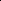

# FedBRICK: Structural Bias Aware Heterogeneous Foundation Model Federated Tuning

<!-- Page 1 -->

FedBRICK: Structural Bias Aware Heterogeneous Foundation Model Federated

Tuning

Yuhang Zhang1, Xianda Wang1, Wei Sun1,2, Jiaxuan Chen1,2, Fangxin Wang1,2,3*

1School of Science and Engineering, The Chinese University of Hong Kong, Shenzhen 2Shenzhen Future Network of Intelligence Institute 3The Guangdong Provincial Key Laboratory of Future Networks of Intelligence {yuhangzhang@link., xiandawang@link., weisun2@link., jiaxuanchen@link., wangfangxin@}cuhk.edu.cn

## Abstract

Model-heterogeneous federated tuning (MHFT) enables the privacy-preserving fine-tuning of foundation models in heterogeneous systems by allowing clients and the server to adopt different model architectures. Depth partial training—where each client updates only a subset of the model’s layers—alleviates system heterogeneity but exacerbates client drift, which stems from clients optimizing different objectives and therefore degrades overall performance. Beyond the well-known statistical bias—where non-IID data leads to client drift—we identify a structural bias arising from clients deploying only partial layers of the global model, which serves as an important cause of drift. We further provide a theoretical analysis showing that the possible range of structural bias expands linearly with the number of missing layers. To counter this effect, we introduce FedBRICK (Federated Bias Recovery via Inserted Calibrative Kernels), which inserts tiny BRICKs into each client’s subnetwork. We employ a dual-end layer-wise distillation scheme to train these blocks using both client-side local data and a small public proxy set on the server. This design effectively mitigates the structural bias caused by layer dropping, reduces client drift, and remains practical for storage-constrained devices. Extensive experiments on federated learning benchmarks confirm that FedBRICK delivers up to a 5% average accuracy gain while requiring no more than 1.44% extra storage per client.

## Introduction

Foundation models like GPT (Brown et al. 2020; Achiam et al. 2023), BERT (Devlin et al. 2019), and ViT (Dosovitskiy et al. 2020) have greatly advanced NLP and computer vision. To adapt these large pre-trained models to downstream tasks with privacy protection, federated tuning (FT) has emerged as an important solution (Xu et al. 2024; Zhang et al. 2024; Wu et al. 2024; Sun et al. 2024). In FT, each client fine-tunes the model locally, and a central server aggregates the updates, so the global model learns from diverse users without accessing raw data.

However, the large size of foundation models makes them difficult to deploy across heterogeneous systems (Kairouz et al. 2021; Li et al. 2020; Su, Li, and Xue 2024), particularly on resource-constrained edge devices that lack the ca-

*Corresponding author Copyright © 2026, Association for the Advancement of Artificial Intelligence (www.aaai.org). All rights reserved.

pacity to store or train the full model (Varghese et al. 2016). Model-Heterogeneous Federated Tuning (MHFT) addresses this issue by allowing clients and the server to deploy models of different sizes and architectures (Su, Li, and Xue 2024; Yao et al. 2023). A widely adopted solution is partial training (Diao, Ding, and Tarokh 2020; Horvath et al. 2021; Su, Li, and Xue 2024; Kim et al. 2022), where each client trains only a subnetwork of the global model that aligns with its local resource constraints. This approach enables direct parameter aggregation, simultaneously ensuring both structural consistency and privacy preservation.

Nonetheless, emerging studies and empirical evidence suggest that the architecture of partial training can increase the susceptibility of the global model to client drift (Alam et al. 2022; Saadati, Rostami, and Amini 2025). This refers to the growing mismatch between local and global objectives during training (Karimireddy et al. 2020; Gao et al. 2022; Shi et al. 2022), which can substantially negatively affect the overall performance of MHFT.

We investigate the structural factors contributing to client drift by analyzing the Jacobian under depth partial training (DPT), where clients train only a subset of the global model’s layers (Su, Li, and Xue 2024; Kim et al. 2022). While client drift is commonly attributed to data distribution bias (referred to as statistical bias), we further identify a form of structural bias introduced by DPT. Our theoretical analysis reveals that this structural bias results in a significant amplification of client drift, with the possible range of the drift subspace (i.e., its dimensionality) increasing linearly with the number of missing layers.

To mitigate structural bias, we propose FedBRICK (Federated Bias Recovery via Inserted Calibrative Kernels), which addresses this issue by introducing the BRICK—a lightweight module (typically 0.3%-0.5% of the original layer’s parameters)—which is systematically embedded into client-side subnetworks reconstruct cross-layer information lost under model partitioning. These blocks are trained via a dual-end layer distillation strategy, which allows them to capture layer-specific behaviors using local training data on clients and a small proxy dataset on the server, while avoiding the transmission of potentially privacy-sensitive logits. This approach effectively mitigates the structural bias introduced by DPT, while imposing minimal computational and storage overhead on clients, thereby accommodating system

The Fortieth AAAI Conference on Artificial Intelligence (AAAI-26)

28528

<!-- Page 2 -->

Client 1

Client 1

Client k Server

Stage I

Stage II

Client 1

Client 2

Client k inconsistent objectives

C1

C2

Ck

Global Model 𝐦𝒌

(𝒕)

LoRAs

BRICKs

𝓛𝑴𝑺𝑬

𝓛𝒕𝒂𝒔𝒌

𝓛𝒕𝒂𝒔𝒌

𝓛𝒓𝒆𝒈_𝒐𝒓𝒊𝒈 𝓛𝒓𝒆𝒈_𝒄𝒍𝒊𝒄

Structural Compensation Training

Parallel Soft Distillation

②

③

④ ⑤

⑤

BRICK module

Opt.

𝓛𝑴𝑺𝑬

①Layer-wise Distillation 𝐦𝒌

(𝒕) = [𝟏 𝟎 𝟏 𝟏 𝟏]

Distill

(a) (b)

**Figure 1.** (a) Structural bias issue in DPT, where client models only contain partial layers of the full model, causing gradient distortion and suboptimal optimization. (b) Overview of our proposed framework, consisting of four stages: (i) server-side layerwise knowledge distillation (①); (ii) subnet transmission and BRICK deployment (②); (iii) client-side two-stage personalization (③④); and (iv) federated aggregation (⑤).

26 51 75 100 Round

70

75

80

85

90

(a)

alpha=0.01 alpha=1 alpha=10 alpha=100

26 51 75 100 Round

0

22

45

67

90

(b)

layer=4 layer=6 layer=10 layer=12

**Figure 2.** Accuracy (%) over time with varying data (left) and structural heterogeneity (right). High structural heterogeneity (fewer retained layers) causes greater performance degradation than high data heterogeneity (smaller alpha).

heterogeneity in federated tuning.

Our main contributions are summarized as follows: • We provide a theoretical analysis of structural bias in DPT, further revealing that the possible range of client drift grows linearly with the number of missing layers—complementing the commonly recognized statistical bias perspective. • We propose FedBRICK, a structural bias-aware framework for federated tuning that introduces BRICKs—lightweight modules designed to restore structural bias by reconstructing gradient flow on clients. • We demonstrate through extensive experiments that FedBRICK effectively mitigates structural bias, improves model performance under system heterogeneity, and maintains efficiency for storage-constrained clients.

## Related Work

Federated Distillation When client models are heterogeneous, traditional Federated Averaging (FedAvg) (McMahan et al. 2017) fails due to parameter mismatches. Federated Distillation (FD) transfers knowledge across heterogeneous models but has drawbacks.

For example, FedDistill (Jeong et al. 2018) and FedDistill+ (Yao et al. 2023) require clients to upload class-wise mean predictions for server aggregation, while FedAD (Gong et al. 2021) uploads outputs and intermediate features to enhance distillation. Methods like FedGKD (Yao et al. 2023) and FedLMD (Lu et al. 2023) use global model outputs as teachers for local models. These approaches either upload outputs or features—posing privacy risks of label distribution reconstruction—or force clients to synchronize with the global model, increasing system complexity.

Partial Training To address FD limitations, Partial Training (PT) splits the global model into subnetworks of different sizes, allowing heterogeneous clients to participate in direct parameter aggregation. PT methods fall into two main categories: width partial training (WPT) and depth partial training (DPT). WPT methods (e.g., HeteroFL (Diao, Ding, and Tarokh 2020), FjORD (Horvath et al. 2021), ScaleFL (Ilhan, Su, and Liu 2023)) partition the model by channels, but often disrupt channel mapping and degrade performance. DPT methods split by layers: some (e.g., DepthFL (Kim et al. 2022), InclusiveFL (Liu et al. 2022)) select early layers, while others (e.g., FedRA (Su, Li, and Xue 2024)) randomly choose a subset of layers. DPT better preserves structural integrity and aligns with layer specialization theories (Kumar et al. 2024; Gromov et al. 2024), making it more promising. But recent studies indicate that PT can exacerbate client drift. To address these issues, we propose FedBRICK, which introduces compensation modules within subnetworks, effectively improving model performance in MHFT while maintaining low client-side overhead and privacy protection.

Observation Previous work shows that diversity in client model architectures worsens client drift in federated learning (Alam et al.

28529

AI-readable visual equivalent, added: Figure extracted from the paper PDF and converted to an SVG wrapper asset. Use the surrounding page text and caption for interpretation.

AI-readable visual equivalent, added: Figure extracted from the paper PDF and converted to an SVG wrapper asset. Use the surrounding page text and caption for interpretation.

<!-- Page 3 -->

2022; Saadati, Rostami, and Amini 2025), yet most studies focus on data heterogeneity, neglecting structural factors. Here, we review the common view that statistical bias (Figure 2a) drives client drift, and further introduce structural bias (Figure 2b) caused by incomplete architectures (Figure 1a). Addressing both biases enables a more complete analysis of client drift in depth partial training.

Statistical Bias In federated foundation model fine-tuning, the server maintains a shared base model w ∈Rd for all K clients, with the goal of minimizing the global empirical risk without aggregating raw data centrally:

min w F(w) =

K X k=1 pk Fk(w) (1)

where Fk(w) = E(x,y)∼Dk ℓ f(x; w), y

, pk = nk/P jnj is determined by each client’s sample size nk, f(·; w) represents the complete base model, and ℓ(·) denotes the downstream task loss function, and Dk denotes the local data distribution on client k ∈K.

In practice, clients often have highly heterogeneous (i.e., non-IID) data. As a consequence, the gradient computed on a specific client can be decomposed as

∇Fk(w) = ∇F(w) + bk(w) (2)

with bk(w) ≜ ∇Fk(w) −∇F(w). Here, bk(w) is the statistical bias that quantifies the discrepancy between the local descent direction on client k and the true global descent direction. This bias directly arises from the differences in data distributions across clients. In the classic FedAvg framework, clients perform E consecutive steps of stochastic gradient descent (SGD) locally:

∆(t)

k = −η

E−1 X e=0

∇Fk w(e)

t

(3)

= −Eη

∇F(wt) + bk(wt)

(4)

If P k pkbk̸ = 0, then after server aggregation wt+1 =wt +

X k pk∆(t)

k (5)

the global model will continue to progress along such a distorted direction. This accumulated statistical bias is one of the major causes of client drift.

Structural Bias Within the DPT framework, denote the entire network of L layers as a composition of functions: f(x; w) = fL ◦ fL−1 ◦· · · ◦f1(x), where w = {w1,..., wL} denotes the collection of all layer parameters. Given an arbitrary sample (x, y) and a scalar loss function L(·, y), we define the forward activations by aℓ= fℓ(aℓ−1; wℓ), and the final loss as L = L(aL, y). Let dℓdenote the output dimension. Define the Jacobian matrix of fℓwith respect to its parameters wℓ as

Jwℓfℓ= ∂fℓ(aℓ−1; wℓ)

∂wℓ ∈Rdℓ×|wℓ| (6)

In the absence of truncation, the gradient of the loss with respect to the parameters wℓis given by:

g⋆ ℓ= J⊤ wℓfℓ





L Y j=ℓ+1

Jj



∇aLL (7)

When employing DPT at round t, the binary mask for client k is denoted by m(t)

k = [m(t)

k,1,..., m(t)

k,L], where a value of 1 indicates that the corresponding layer is retained, and 0 indicates that it is skipped. Accordingly, the set of trainable sub-layers for client k at round t is defined as S(t)

k = {ℓ| m(t)

k,ℓ= 1}. We denote by S

(t) k,ℓthe set of Nskip skipped (i.e., missing) layers after layer ℓfor client k at round t, that is, S

(t) k,ℓ= {ℓ′ ∈{ℓ+1,...,L} | ℓ′ /∈S(t)

k } and the retained layers are S(t)

k,ℓ= {ℓ′ ∈{ℓ+1,...,L}| ℓ′ ∈S(t)

k }. Then, during backpropagation on the client side, the removal of certain layers creates a gap where no meaningful adjustment occurs in the gradient flow. As a result, the backpropagation process treats each missing layer by replacing its Jacobian Jj∈S

(t) k,ℓwith an identity matrix I. As a result, the approximate gradient can be expressed as:

˜gℓ= J⊤ wℓfℓ



 

Y j∈S(t)

k,ℓ

Jj



 ∇aLL (8)

By subtracting the approximate gradient from the corresponding actual gradient (Equation (7)), we obtain the structural gradient distortion, which quantifies the error introduced by the approximation: Definition 1 The structural gradient distortion at layer ℓ is defined as the discrepancy between the approximate and true gradients:

εℓ:= ˜gℓ−g⋆ ℓ (9)

= J⊤ wℓfℓ



 

Y j∈S(t)

k,ℓ

Jj



 



I −

Y i∈S

(t) k,ℓ

Ji



∇aLL. (10)

Then, we can theoretically characterize the relationship between the mean squared norm of the error εℓand the number of skipped layers as follows (see Appendix D for a detailed proof): Theorem 1 Consider each Jik (for 1 ≤k ≤Nskip) being a non-identity d×d matrix, and define {Ji1,..., JiNskip }

linearly independent. Let U:= J⊤ wℓfℓ

Q j∈S(t)

k,ℓJj

∈

R|wℓ|×d, M:= QNskip k=1 Jik ∈Rd×d and v:= ∇aLL ∈Rd. Then the structural gradient distortion at layer ℓcan be written as εℓ= U (I −M) v (11) Assume that Nskip ≪d, Nskip ≪rank(U) and the skipped Jacobians introduce Nskip linearly independent deviations from identity. As v varies over all of Rd, the set of all possible εℓforms a linear subspace of dimension Nskip:

dim εℓ| v ∈Rd

= Nskip (12)

28530

<!-- Page 4 -->

In other words, skipping Nskip linearly independent, nonidentity layers after ℓmakes the possible error space Nskipdimensional.

Remark 1 This result quantifies that as more independent and nontrivial (i.e., non-identity) layers are skipped, the dimensionality of the subspace in which the structural gradient distortion resides increases linearly with Nskip.

Unified Bias Formulation Define the accumulated structural gradient distortion across all layers as:

sk(w) =

X ℓ∈S(t)

k εk,ℓ(w) (13)

By accounting for both sources of bias, we obtain an explicit formula for the effective gradient used in the DPT method:

˜∇Fk(wt) = ∇F(wt) + bk(wt) + sk(wt) (14)

Letting δk(w) ≜bk(w) + sk(w), we use δk to collectively denote the biases arising from both statistical effects (bk) and structural factors (sk). In E-step local SGD within FedAvg-type algorithms using learning rate η, the client update can be uniformly expressed as

∆(t)

k = −Eη [∇F(wt) + δk(wt)] (15)

After server aggregation, the global model is updated as wt+1 = wt −Eη

"

∇F(wt) +

K X k=1 pkδk(wt)

#

(16)

WhenPK k=1 pk δk(wt)̸ = 0, the global model updates along a distorted direction. This distortion is jointly influenced by: bk, stemming from data heterogeneity (statistical bias); sk, arising from layer dropping (structural bias).

## Methodology

The core idea behind FedBRICK is to employ a set of BRICK modules that emulate the functionality of the omitted layers in the original model, thereby compensating for the bias introduced by their absence. To achieve global and local alignment, we adopt a dual-end distillation strategy: on the server side, multiple rounds of training with small proxy data are used for global alignment, while on the client side, a few local training steps are performed using the clients’ own data. This approach not only mitigates structural bias and reduces client drift, but also substantially decreases the computational burden on clients compared to methods such as (Kim et al. 2022), which require precise local alignment. The overall process is depicted in Figure 1b.

BRICK The objective of BRICK is to mimic the transformations of missing backbone layers with lightweight blocks. Unlike conventional methods, where LoRA (Hu et al. 2022) is used as an additive component over a linear layer, we employ

LoRA directly as a standalone linear layer. Each BRICK module comprises two parallel LoRA linear pathways:

x1 = (B1A1)x, (17) x2 = (B2A2)x, (18) Eℓ(x) = x ⊙σ(x1) + x2 + x (19)

where x ∈Rd is the input feature, σ(·) is the softmax function, and r ≪d is the LoRA rank. The multiplicative residual x ⊙σ(x1) restores nonlinear interactions among latent features while the additive residual x2 preserves direct linear information flow.

Since we transmit only the two low-rank matrices A, B (instead of a full d×d weight), each BRICK requires merely 4rd trainable scalars, i.e. 0.3% - 0.5% of the parameters of the original block under the typical setting r=8, using ViT or Mixer as the base model.

Server-side: Layer-wise Distillation

In federated learning, participants are often naturally divided into multiple domains C = {1,..., C} (e.g., by context or geography). The server owns only a small portion of public proxy data D(c)

proxy for each domain. To maximize domain alignment, the server does not mix data across domains; instead, it independently distills a set of BRICKs for each domain, using layer-wise distillation.

At the beginning of the t-th communication round, the server holds the global backbone parameters w(t) and C domain-specific BRICK module parameters {θ(t)

c,ℓ}C,L c=1,ℓ=1. For each domain c, it conducts layer-wise distillation independently, utilizing a mean squared error loss:

min θc,ℓEx∼D(c)

pub

Ec,ℓ(x) −fℓ(x; w(t)

ℓ)

2

2

(20)

After distillation, each client k receives only the backbone parameters associated with their domain c(k) (as indicated by mask m(t)

k = 1), and the full set of domain-specific BRICKs θ(t)

c(k),:. If PEFT methods (Houlsby et al. 2019; Hu et al. 2022) are used, only the trainable parameters are sent.

By repeatedly distilling on small proxy sets, this approach balances privacy, efficiency, and fine-grained domain alignment, enabling high-quality and scalable deployment to diverse domains without requiring extensive labeled data.

Client-side: Two-stage Tuning

Upon receiving the server-broadcasted model parameters, client k performs Two-stage Tuning on its local dataset Dk. The overall approach involves first applying some of the BRICKs to fill the structural gaps and training the reconstructed model (Stage I), followed by lightweight parallel soft distillation to align BRICKs with retained backbone layers (Stage II).

Stage I: Structural Compensation Training. At positions where layers are missing (ℓ/∈Sk), BRICK modules Eℓare inserted to form a complete gradient flow. Both the retained backbone layer parameters {wk,ℓ}ℓ∈Sk

28531

<!-- Page 5 -->

and BRICK parameters corresponding to the missing layers {θc(k),ℓ}ℓ/∈Sk are set to be trainable. The optimization objective is:

min wk,ℓ, θc(k),ℓ

E(x,y)∼Dk h

Ltask y, ˆy

+ λw

X ℓ∈Sk wk,ℓ−w(t)

ℓ

2

2

+ λθ

X ℓ/∈Sk θc(k),ℓ−θ(t)

c(k),ℓ

2

2 i

(21)

where Ltask represents the downstream task loss (e.g., crossentropy). The two ℓ2 terms respectively tether the backbone weights and the BRICK weights to the global versions on the server, thereby stabilizing training and, to some extent, ensuring that the update objective approaches the global ones.

Stage II: Parallel Soft Distillation. After structural compensation of the missing layers in Stage I, Stage II performs a lightweight enhancement of the BRICKs corresponding to the retained backbone layers using local data. This stage focuses on refining the representations of these blocks through a soft distillation process, without introducing significant computational overhead.

For each retained backbone layer ℓ∈Sk, connecting the layer in parallel with its BRICK Eℓ. Let E2 represent the number of training steps in Stage II. Define the linear annealing coefficient as α(e) = 1 −e

E2, e = 0, 1,..., E2 (22)

which satisfies α(0) = 1 and α(E2) = 0. which ensures a gradual transition from teacher-guided learning to autonomous and global representation refinement:

˜aℓ= α(e) abk ℓ + (1 −α(e)) ase ℓ (23)

where abk ℓ = fℓ(aℓ−1; wk,ℓ), ase ℓ= Eℓ(aℓ−1; θk,ℓ) For ℓ/∈Sk, which are the missing layers, only the output of the corresponding Eℓis used. The network then continues with forward propagation to produce the final output ˆz.

The overall training objective integrates the supervised task loss with a distillation loss that encourages the BRICKs to emulate the behavior of their corresponding backbone layers on locally retained components:

min {θk,ℓ}ℓ∈Sk

E(x,y)∼Dk h

Ltask y, ˆz

+ λd

|Sk|

X ℓ∈Sk

Ek,ℓ(x; θk,ℓ) −fℓ(x; wk,ℓ)

2

2 i (24)

where λd is the hyperparameter that controls the weight of the distillation loss, and |Sk| denotes the number of retained layers.

Stage II is designed to be lightweight and adaptive. Each client performs only a few local steps to efficiently initialize its BRICKs. Clients with limited resources retain fewer layers and thus train fewer BRICKs, making the procedure naturally match device capability. This approach effectively prepares models for subsequent server-side distillation, while maintaining low computational cost and accommodating device heterogeneity.

The use of a linearly annealed coefficient ensures training begins with a focus on faithfully mimicking the original backbone features, and gradually transitions toward enhanced autonomous representation learning. This progressive shift allows each BRICK to learn more task-adaptive and effective local feature representations.

Convergence Analysis

Previous work has demonstrated that global model parameters converge to stationary points of the overall objective, even with arbitrary partial participation and heterogeneous data (Su, Li, and Xue 2024) (see Appendix B for details). Importantly, the convergence rate is linearly affected by both data and structural heterogeneity, quantified by δ2 stat and δ2 struct, respectively. Our FedBRICK improves upon the original DPT by effectively reducing the influence of δ2 struct, thereby enhancing overall convergence.

Compared to basic DPT, FedBRICK replaces each missing layer with a quadratic surrogate that locally matches the Jacobian of the original layer at the expansion point. This significantly reduces the accumulated structural bias across missing layers, since the local Jacobian discrepancy ∆ℓof a well-fitted surrogate is much smaller than that of identity substitution. See Appendix C for a formal proof.

Let Eℓdenote the BRICK surrogate for the ℓ-th missing layer, defined in a neighborhood of its expansion point x0,ℓ. Define the Jacobian discrepancy for layer ℓas ∆ℓ:= Ex∼µ∥JEℓ(x) −Jℓ(x)∥2, where JEℓand Jℓare the Jacobians of the surrogate and original block, respectively, and µ is the data distribution at the expansion point.

Theorem 2 Suppose there are Nskip missing layers in

S

(t) k,ℓ, and assume that for each such layer ℓ, the operator norm of all Jacobians along the computation path is uniformly bounded by Kℓ> 0. Assume also that the mean squared norm of the loss gradient and the Jacobians of the retained path are bounded, i.e., E∥∇aLL∥2

2 ≤G and Q j∈S(t)

k,ℓJj

2 ≤B for some constants G, B > 0. Then the total structural bias incurred by skipping and replacing these layers is upper bounded as δ2 struct ≤B2G



 

Y ℓ∈S(t)

k,ℓ

Kℓ



 

X ℓ∈S(t)

k,ℓ

∆ℓ (25)

where C:= B2G is a constant independent of the number of skipped layers.

Remark 2 If the missing layers are replaced by the identity map (i.e., conventional DPT), the per-block Jacobian discrepancy is ∆id ℓ = Ex∼µ∥I −Jℓ(x)∥2, which is typically much larger than that of well-fitted quadratic surrogates, i.e., ∆ℓ≪∆id ℓ. Therefore, δ2 struct,FedBRICK ≪δ2 struct,DPT (26)

as long as the BRICKs provide sufficiently accurate local approximations (i.e., small ∆ℓ).

28532

<!-- Page 6 -->

clipart (12) infograph (10) painting (8) quickdraw (6) real (5) sketch (4) Average

DomainNet

ViT

AllLayers (ceiling) 84.91 55.18 80.38 72.57 89.54 78.26 76.81 InclusiveFL KDD22 78.67 32.82 55.68 10.71 71.35 51.16 50.07 DepthFL ICLR23 80.79 38.16 59.88 20.83 73.79 55.36 54.80 FedRA 83.11 56.58 77.02 26.94 83.36 64.87 65.31 FedBRICK (Ours) 84.34 (+1.23) 59.75 (+3.17) 78.10 (+1.08) 46.98 (+20.04) 84.68 (+1.32) 68.13 (+3.26) 70.33 (+5.02)

Mixer

AllLayers (ceiling) 75.25 43.03 70.62 58.57 83.57 65.99 66.17 InclusiveFL KDD22 69.36 24.78 50.69 9.67 67.87 35.60 43.00 DepthFL ICLR23 70.06 30.69 53.78 12.73 68.98 38.21 45.74 FedRA 73.83 42.13 64.83 15.73 74.73 44.99 52.71 FedBRICK (Ours) 76.34 (+2.51) 43.00 (+0.87) 66.28 (+1.45) 23.67 (+7.94) 78.64 (+3.91) 49.72 (+4.73) 56.28 (+3.57)

autumn (12) dim (10) grass (8) outdoor (6) rock (5) water (4) Average

NICO++

ViT

AllLayers (ceiling) 92.08 88.95 93.38 89.96 90.83 90.31 90.92 InclusiveFL KDD22 91.53 79.30 85.21 78.19 81.56 71.23 81.17 DepthFL ICLR23 90.71 79.54 83.47 76.00 80.16 67.27 79.53 FedRA 91.69 88.31 90.18 85.14 87.30 78.13 86.79 FedBRICK (Ours) 92.52 (+0.83) 89.07 (+0.76) 91.88 (+1.7) 86.79 (+1.65) 88.12 (+0.82) 80.29 (+2.16) 88.11 (+1.32)

Mixer

AllLayers (ceiling) 86.04 80.98 86.37 82.56 82.92 81.23 83.35 InclusiveFL KDD22 84.66 63.81 75.40 68.15 68.50 58.34 69.81 DepthFL ICLR23 82.62 68.21 74.91 68.33 68.77 58.39 70.21 FedRA 85.10 78.06 82.19 73.87 75.91 66.23 76.89 FedBRICK (Ours) 85.76 (+0.66) 79.10 (+1.04) 83.10 (+0.91) 75.94 (+2.07) 78.40 (+2.49) 67.64 (+1.41) 78.32 (+1.43)

**Table 1.** Performance of various methods across DomainNet and NICO++ datasets with different backbones and layer settings.

## Experiments

## Experimental Setup

Models. Following the FedLoRA setup, we adopt two pretrained models—ViT with 12 Transformer layers and Mixer with 12 MLP layers—to demonstrate the general applicability of our method to any foundation models with multi-layer structures. (See Appendix A.1 for detailed configurations)

Datasets. We conduct experiments on the Domain- Net(Peng et al. 2019) and NICO++(Zhang et al. 2023) datasets to evaluate foundation model fine-tuning in realistic scenarios, 5% of the data designated as proxy data on the server. Dataset statistics and selection details are provided in the Appendix A.2.

Implementation Details. Experiments were conducted on a Linux system with 8×A100 GPUs using PyTorch. For 100 federated rounds, the server trains BRICKs for 10 epochs, and six clients were randomly selected per round, each performing one local epoch with a learning rate of 0.01 in both stages. Layer allocation followed the default FedRA strategy. Model optimization employed standard FedAvg (McMahan et al. 2017), with a server learning rate of 1e-4 and hyperparameters λw = λd = 0.01, λθ = 0.005. Each experiment is averaged over three runs. Ablation studies are provided in the appendix.

Baselines. To evaluate the effectiveness of FedBRICK, we compared it with the following baselines: (1) AllLayers: Assumes all clients can fine-tune the entire model, serving as the ideal upper bound. (2) InclusiveFL (Liu et al. 2022): Trains a shared set of initial layers in each round and employs momentum distillation to enhance shallow layers. (3) DepthFL (Kim et al. 2022): Extends InclusiveFL by introducing multiple classification heads at different depths and updating them via self-distillation. (4) FedRA (Su, Li, and Xue 2024): Randomly allocates sub-networks of the global model to clients for training.

2 26 51 75 100 Round

40 47

55 62

70

2 26 51 75 100 Round

70

75

80

85

90

Alllayers

FedRA FedRA+BRICK

DepthFL DepthFL+BRICK

InclusiveFL InclusiveFL+BRICK

**Figure 3.** Accuracy(%) trajectory over communication rounds for base DPT and BRICK-enhanced DPT using ViT on DomainNet (left) and NICO++ (right); round 1 is pruned.

The Main Results Uneven Resource Distribution. Table 1 reports the performance of different models on various datasets, when each client is restricted to deploying a different number of layers (the number of layers available to each domain is indicated in parentheses). Observations are as follows: (1) Overall, FedBRICK significantly outperforms all baseline methods. Compared to the best-performing baselines, FedBRICK improves performance by 5 and 4 points for ViT and MLP- Mixer models, respectively, on the DomainNet dataset, and by 1–2 points on the NICO++ dataset. (2) The improvement is especially pronounced on clients equipped with fewer layers (6, 5, or 4), indicating that FedBRICK effectively mitigates the structural bias. (3) On the quickdraw domain of DomainNet, where the DPT method previously exhibited severe client drift, FedBRICK achieves a marked recovery (8- 20 points). This considerable boost demonstrates not only better accuracy, but also reduced variance among client performances. This suggests that FedBRICK facilitates clients in learning more generalizable representations, thus alleviating client drift. (4) As illustrated in Figure 3, incorporating

28533

<!-- Page 7 -->

clipart (6) infograph (6) painting (6) quickdraw (6) real (6) sketch (6) Average

ViT FedRA 65.61 34.99 60.52 28.36 76.68 54.54 53.45 FedBRICK (Ours) 77.70 (+12.09) 46.13 (+11.14) 71.3 (+10.78) 48.42 (+20.06) 84.37 (+7.69) 66.69 (+12.15) 65.77 (+12.32)

Mixer FedRA 39.22 13.28 36.35 16.08 52.48 25.40 30.47 FedBRICK (Ours) 41.98 (+2.76) 16.48 (+3.20) 43.42 (+7.07) 18.67 (+2.59) 60.65 (+8.17) 30.98 (+5.58) 35.36 (+4.90)

clipart (4) infograph (4) painting (4) quickdraw (4) real (4) sketch (4) Average

ViT FedRA 16.40 7.16 21.63 5.26 25.18 13.75 14.90 FedBRICK (Ours) 54.43 (+38.03) 28.72 (+21.56) 50.05 (+28.42) 21.25 (+15.99) 68.30 (+43.12) 40.43 (+26.68) 43.86 (+28.97)

Mixer FedRA 20.33 7.61 19.26 4.02 26.69 9.22 14.52 FedBRICK (Ours) 20.50 (+0.17) 8.36 (+0.75) 22.59 (+3.33) 6.66 (+2.64) 32.75 (+6.06) 12.24 (+3.02) 17.18 (+2.66)

**Table 2.** Performance under severe resource constraints and significant structural bias across DomainNet dataset.

20 40 60 80 100 Round

0.6

0.7

0.8

0.9

FedRA FedRA+BRICK

0 25 50 75 100 Round

0.55

0.60

0.65

FedRA FedRA+BRICK

**Figure 4.** Avg. distance of intermediate representations across clients (left) and Avg. distance of parameter update directions between client and server (right).

BRICKs into various DPT methods consistently raises the convergence ceiling. This empirically validates the conclusion of Theorem 2, demonstrating the stability and generalization capability of FedBRICK. Furthermore, faster and more stable convergence is observed throughout training, implying better adaptation dynamics during federated optimization.

Severely Limited Resources. Table 2 presents the results when no client is able to deploy the full set of layers—a scenario incurring the most severe structural bias. Across different models, FedBRICK yields improvements ranging from 3 to 30 points, highlighting its strong capacity to recover performance even in highly constrained environments. This robustness underlines the practical relevance of FedBRICK for real-world federated learning deployments, where resource constraints can be unpredictable and substantial.

Mitigation of Client Drift

Under the client settings of Tabel 1, we further investigate the underlying reasons behind FedBRICK’s effectiveness in alleviating client drift. As shown in Figure 4, we measure the distances between representations and parameters using the cosine distance metric (1 −cos(x1, x2)). Specifically, intermediate representations refer to the outputs of the final model layer, which accumulate the structural bias introduced by missing layers, while parameter changes correspond to the updates of the head parameters, where the largest drift typically occurs due to task variation. We observe that, after introducing FedBRICK, both the divergence in intermediate representations among clients and the discrepancy between the parameter update directions of clients and the server are

All Layer Lora Head BRICK

ViT 86.4M 7.1M 43.0K 76.9k 24.5K Mixer 59.6M 4.9M 35.3K

**Table 3.** Comparison of parameter counts.

substantially reduced. These results indicate that our method encourages clients to learn more generalizable representations and promotes greater consistency in parameter update directions, thereby effectively mitigating client drift resulting from structural bias.

Overhead Analysis As shown in Table 3, each BRICK contains 0.3–0.5% of an original layer’s parameters, resulting in a total client-side footprint of just 0.3–1.0% for ViT and 0.4–1.4% for Mixer under the settings in Table 1. Thus, the storage overhead is negligible. Runtime and communication costs are also modest: the slowest client requires 19.38s per round (≈1.35Wh), and communication per round is 1.08MB (bf16), remaining lightweight in typical deployment environments.

## Conclusion

& Limitations We identify structural bias as a key driver of client drift in MHFT, especially under DPT. Our theory shows this bias grows with the number of missing layers, degrading global performance. To counter it, we introduce FedBRICK—a lightweight framework that reduces structural bias using minimal client modules and dual-end distillation, achieving effective mitigation with negligible client overhead. Our results highlight the need to account for structural factors in federated tuning, enabling more robust and scalable foundation model deployment across heterogeneous systems.

Some limitations should be noted. Our study focuses on depth partitioning, and extending FedBRICK to other partitioning strategies warrants further investigation. The method introduces additional client computation, adjustable server-side distillation cost, and extra communication overhead. Although these trade-offs are generally acceptable and yield notable performance gains (+5%, and up to +28% in resource-constrained settings), they may still pose challenges in extremely limited environments. Future work will seek to mitigate these overheads and broaden applicability.

28534

<!-- Page 8 -->

## Acknowledgments

The work was supported in part by the National Key Research and Development Program of China (No. 2024YFB2907000), the Basic Research Project No. HZQB- KCZYZ-2021067 of Hetao Shenzhen-HK S&T Cooperation Zone, the NSFC with Grant No. 62471423, the Shenzhen Science and Technology Program with Grant No. JCYJ20241202124021028 and Grant No. JCYJ20230807114204010, the Guangdong Special Support Program (Grant No. 2024TQ08X346), the Shenzhen Outstanding Talents Training Fund 202002, the Young Elite Scientists Sponsorship Program of CAST (Grant No. 2022QNRC001), the Guangdong Provincial Key Laboratory of Future Networks of Intelligence (Grant No. 2022B1212010001) and the Shenzhen Key Laboratory of Big Data and Artificial Intelligence (Grant No. SYSPG20241211173853027).

## References

Achiam, J.; Adler, S.; Agarwal, S.; Ahmad, L.; Akkaya, I.; Aleman, F. L.; Almeida, D.; Altenschmidt, J.; Altman, S.; Anadkat, S.; et al. 2023. Gpt-4 technical report. arXiv preprint arXiv:2303.08774. Alam, S.; Liu, L.; Yan, M.; and Zhang, M. 2022. Fedrolex: Model-heterogeneous federated learning with rolling submodel extraction. Proc. Conf. on Neural Information Processing Systems (NeurIPS), 35: 29677–29690. Brown, T.; Mann, B.; Ryder, N.; Subbiah, M.; Kaplan, J. D.; Dhariwal, P.; Neelakantan, A.; Shyam, P.; Sastry, G.; Askell, A.; et al. 2020. Language models are few-shot learners. Proc. Conf. on Neural Information Processing Systems (NeurIPS), 1877–1901. Devlin, J.; Chang, M.-W.; Lee, K.; and Toutanova, K. 2019. Bert: Pre-training of deep bidirectional transformers for language understanding. In Proc. Conf. of the North American chapter of the association for computational linguistics: human language technologies, 4171–4186. Diao, E.; Ding, J.; and Tarokh, V. 2020. HeteroFL: Computation and Communication Efficient Federated Learning for Heterogeneous Clients. In Proc. Int. Conf. on Learning Representations (ICLR). Dosovitskiy, A.; Beyer, L.; Kolesnikov, A.; Weissenborn, D.; Zhai, X.; Unterthiner, T.; Dehghani, M.; Minderer, M.; Heigold, G.; Gelly, S.; et al. 2020. An image is worth 16x16 words: Transformers for image recognition at scale. arXiv preprint arXiv:2010.11929. Gao, L.; Fu, H.; Li, L.; Chen, Y.; Xu, M.; and Xu, C.-Z. 2022. Feddc: Federated learning with non-iid data via local drift decoupling and correction. In Proc. IEEE/CVF Conf. on Computer Vision and Pattern Recognition (CVPR), 10112–10121. Gong, X.; Sharma, A.; Karanam, S.; Wu, Z.; Chen, T.; Doermann, D.; and Innanje, A. 2021. Ensemble attention distillation for privacy-preserving federated learning. In Proc. IEEE/CVF Conf. on Computer Vision and Pattern Recognition (CVPR), 15076–15086.

Gromov, A.; Tirumala, K.; Shapourian, H.; Glorioso, P.; and Roberts, D. A. 2024. The unreasonable ineffectiveness of the deeper layers. arXiv preprint arXiv:2403.17887. Horvath, S.; Laskaridis, S.; Almeida, M.; Leontiadis, I.; Venieris, S.; and Lane, N. 2021. Fjord: Fair and accurate federated learning under heterogeneous targets with ordered dropout. Proc. Conf. on Neural Information Processing Systems (NeurIPS), 34: 12876–12889. Houlsby, N.; Giurgiu, A.; Jastrzebski, S.; Morrone, B.; De Laroussilhe, Q.; Gesmundo, A.; Attariyan, M.; and Gelly, S. 2019. Parameter-efficient transfer learning for NLP. In Proc. Int. Conf. on Machine Learning (ICML), 2790–2799. PMLR. Hu, E. J.; Shen, Y.; Wallis, P.; Allen-Zhu, Z.; Li, Y.; Wang, S.; Wang, L.; Chen, W.; et al. 2022. Lora: Low-rank adaptation of large language models. Proc. Int. Conf. on Learning Representations (ICLR), 1(2): 3. Ilhan, F.; Su, G.; and Liu, L. 2023. ScaleFL: Resource- Adaptive Federated Learning With Heterogeneous Clients. In Proc. IEEE/CVF Conf. on Computer Vision and Pattern Recognition (CVPR), 24532–24541. Jeong, E.; Oh, S.; Kim, H.; Park, J.; Bennis, M.; and Kim, S.- L. 2018. Communication-efficient on-device machine learning: Federated distillation and augmentation under non-iid private data. arXiv preprint arXiv:1811.11479. Kairouz, P.; McMahan, H. B.; Avent, B.; Bellet, A.; Bennis, M.; Bhagoji, A. N.; Bonawitz, K.; Charles, Z.; Cormode, G.; Cummings, R.; et al. 2021. Advances and open problems in federated learning. Foundations and trends® in machine learning, 14(1–2): 1–210. Karimireddy, S. P.; Kale, S.; Mohri, M.; Reddi, S.; Stich, S.; and Suresh, A. T. 2020. Scaffold: Stochastic controlled averaging for federated learning. In Proc. Int. Conf. on Machine Learning (ICML), 5132–5143. PMLR. Kim, M.; Yu, S.; Kim, S.; and Moon, S.-M. 2022. Depthfl: Depthwise federated learning for heterogeneous clients. In Proc. Int. Conf. on Learning Representations (ICLR). Kumar, S.; Sumers, T. R.; Yamakoshi, T.; Goldstein, A.; Hasson, U.; Norman, K. A.; Griffiths, T. L.; Hawkins, R. D.; and Nastase, S. A. 2024. Shared functional specialization in transformer-based language models and the human brain. Nature Communications, 15(1): 5523. Li, T.; Sahu, A. K.; Zaheer, M.; Sanjabi, M.; Talwalkar, A.; and Smith, V. 2020. Federated optimization in heterogeneous networks. Proc. of Machine learning and systems, 2: 429–450. Liu, R.; Wu, F.; Wu, C.; Wang, Y.; Lyu, L.; Chen, H.; and Xie, X. 2022. No one left behind: Inclusive federated learning over heterogeneous devices. In Proc. of the ACM SIGKDD Conf. on Knowledge Discovery and Data Mining (KDD), 3398–3406. Lu, J.; Li, S.; Bao, K.; Wang, P.; Qian, Z.; and Ge, S. 2023. Federated learning with label-masking distillation. In Proc. of ACM International Conf. on Multimedia, 222–232. McMahan, B.; Moore, E.; Ramage, D.; Hampson, S.; and y Arcas, B. A. 2017. Communication-efficient learning of

28535

<!-- Page 9 -->

deep networks from decentralized data. In Artificial Intelligence and Statistics, 1273–1282. PMLR. Peng, X.; Bai, Q.; Xia, X.; Huang, Z.; Saenko, K.; and Wang, B. 2019. Moment matching for multi-source domain adaptation. In Proc. of the IEEE/CVF International Conf. on Computer Vision, 1406–1415. Saadati, Y.; Rostami, M.; and Amini, M. H. 2025. pmixfed: Efficient personalized federated learning through adaptive layer-wise mixup. arXiv preprint arXiv:2501.11002. Shi, Y.; Zhang, Y.; Xiao, Y.; and Niu, L. 2022. Optimization strategies for client drift in federated learning: A review. Procedia Computer Science, 214: 1168–1173. Su, S.; Li, B.; and Xue, X. 2024. Fedra: A random allocation strategy for federated tuning to unleash the power of heterogeneous clients. In European Conf. on Computer Vision, 342–358. Springer. Sun, Y.; Li, Z.; Li, Y.; and Ding, B. 2024. Improving lora in privacy-preserving federated learning. arXiv preprint arXiv:2403.12313. Varghese, B.; Wang, N.; Barbhuiya, S.; Kilpatrick, P.; and Nikolopoulos, D. S. 2016. Challenges and opportunities in edge computing. In 2016 IEEE international Conf. on smart cloud (SmartCloud), 20–26. IEEE. Wu, F.; Li, Z.; Li, Y.; Ding, B.; and Gao, J. 2024. Fedbiot: Llm local fine-tuning in federated learning without full model. In Proc. of the ACM SIGKDD Conf. on Knowledge Discovery and Data Mining (KDD), 3345–3355. Xu, M.; Yin, W.; Cai, D.; Yi, R.; Xu, D.; Wang, Q.; Wu, B.; Zhao, Y.; Yang, C.; Wang, S.; et al. 2024. A survey of resource-efficient llm and multimodal foundation models. arXiv preprint arXiv:2401.08092. Yao, D.; Pan, W.; Dai, Y.; Wan, Y.; Ding, X.; Yu, C.; Jin, H.; Xu, Z.; and Sun, L. 2023. FedGKD: Toward heterogeneous federated learning via global knowledge distillation. IEEE Transactions on Computers, 73(1): 3–17. Zhang, J.; Vahidian, S.; Kuo, M.; Li, C.; Zhang, R.; Yu, T.; Wang, G.; and Chen, Y. 2024. Towards building the federatedgpt: Federated instruction tuning. In IEEE International Conf. on Acoustics, Speech and Signal Processing (ICASSP), 6915–6919. IEEE. Zhang, X.; He, Y.; Xu, R.; Yu, H.; Shen, Z.; and Cui, P. 2023. Nico++: Towards better benchmarking for domain generalization. In Proc. IEEE/CVF Conf. on Computer Vision and Pattern Recognition (CVPR), 16036–16047.

28536
