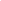

# FourierPET: Deep Fourier-based Unrolled Network for Low-count PET Reconstruction

<!-- Page 1 -->

FourierPET: Deep Fourier-based Unrolled Network for Low-count PET

Reconstruction

Zheng Zhang1, Hao Tang1*, Yingying Hu2, Zhanli Hu3, Jing Qin1

1School of Nursing, The Hong Kong Polytechnic University 2The Department of Nuclear Medicine, Sun Yat-sen University Cancer Center 3Research Center for Medical AI, Shenzhen Institute of Advanced Technology, Chinese Academy of Sciences zheng1.zhang@connect.polyu.hk, {howard-hao.tang, harry.qin}@polyu.edu.hk, huyy@sysucc.org.cn, zl.hu@siat.ac.cn

## Abstract

Low-count positron emission tomography (PET) reconstruction is a challenging inverse problem due to severe degradations arising from Poisson noise, photon scarcity, and attenuation correction errors. Existing deep learning methods typically address these in the spatial domain with an undifferentiated optimization objective, making it difficult to disentangle overlapping artifacts and limiting correction effectiveness. In this work, we perform a Fourier-domain analysis and reveal that these degradations are spectrally separable: Poisson noise and photon scarcity cause high-frequency phase perturbations, while attenuation errors suppress lowfrequency amplitude components. Leveraging this insight, we propose FourierPET, a Fourier-based unrolled reconstruction framework grounded in the Alternating Direction Method of Multipliers. It consists of three tailored modules: a spectral consistency module that enforces global frequency alignment to maintain data fidelity, an amplitude–phase correction module that decouples and compensates for high-frequency phase distortions and low-frequency amplitude suppression, and a dual adjustment module that accelerates convergence during iterative reconstruction. Extensive experiments demonstrate that FourierPET achieves state-of-the-art performance with significantly fewer parameters, while offering enhanced interpretability through frequency-aware correction.

## Introduction

Positron emission tomography (PET) is a molecular imaging modality widely used in oncology and neurology to visualize abnormal metabolic activity. It reconstructs radiotracer distributions from coincident photon measurements along lines of response (LORs). To reduce radiation dose and scan time, clinical protocols often operate in low-count regimes, which degrade reconstruction quality through three main factors: (i) Poisson noise lowers the signal-to-noise ratio (SNR); (ii) photon starvation diminishes fine structural detail (Yan et al. 2016); and (iii) attenuation correction (AC) errors introduce systematic intensity bias (Wang et al. 2020; Chen and An 2017). Although these effects have distinct physical causes, they are intertwined in the image domain, making targeted compensation difficult.

*Corresponding author. Copyright © 2026, Association for the Advancement of Artificial Intelligence (www.aaai.org). All rights reserved.

Existing PET reconstruction methods fall into three categories: (i) iterative algorithms with physics-based priors (Hudson and Larkin 1994; Shepp and Vardi 2007; Hutchcroft et al. 2016); (ii) end-to-end networks mapping sinograms to images (Zhang et al. 2024; Xie et al. 2025; Wang and Liu 2020; Kaviani et al. 2023; Cui et al. 2024b,a; Hu and Liu 2022); and (iii) post-hoc refinements (Han et al. 2023; Tang et al. 2024; Xue et al. 2025). Despite their success, most methods address degradation effects in an undifferentiated manner, without exploiting potential separability in representational space. Spectral modeling, which has facilitated such separation in other modalities (Haller et al. 2021; Zhou et al. 2023, 2024), has seen limited exploration in PET. This motivates a central question: Can we design frequency-aware models that selectively isolate and correct degradations rooted in distinct physical processes?

Key observation. Our analyses reveal that, despite spatial entanglement, low-count PET degradations manifest separable spectral patterns. Specifically, Poisson noise and photon scarcity induce high-frequency phase perturbations that degrade structural sharpness, while AC bias introduces smooth multiplicative fields that suppress low-frequency amplitude. We validate this with clinical data (Fig. 1): (1) high-frequency phase variance intensifies with reduced counts due to stochastic noise; (2) low-frequency amplitude is systematically attenuated by AC bias. These findings suggest that targeting amplitude and phase components separately may offer a more principled correction strategy than unified image-domain penalties.

Our idea. We make the spectral factorization actionable in a model-based objective. Let x denote the reconstructed PET image, A the PET system matrix, and y the measured sinograms. We formulate min x L(Ax, y) | {z } data fidelity

+λa Ramp

|F(x)|

| {z } LF amplitude correction

+λp Rphase

∠F(x)

| {z } HF phase stabilization

,

(1) where F(·) is the Fourier transform, |·| and ∠(·) extract amplitude and phase, and Ramp, Rphase are spectrally targeted priors tailored to AC bias and low-count noise, respectively.

FourierPET. To solve this objective, we derive an Alternating Direction Method of Multipliers (ADMM)-based

The Fortieth AAAI Conference on Artificial Intelligence (AAAI-26)

12997

<!-- Page 2 -->

Swap

Low-Count Full-Count

Phase

Amplitude Amplitude

Phase

DFT

DFT

(c) Frequency Deviation Profiles

UDPET Amplitude

In-House Amplitude

In-House Phase

UDPET Phase

Radial frequency

Deviation Profiles of Amplitude and Phase

Deviation magnitude

(a) Qualitative Analysis

Low-Count RMSE

UDPET In-House

PSNR

UDPET In-House

SUVmax Error

Low-Count

UDPET In-House

Low-Count

(b) Quantitative Evaluation

UDPET

Magnitude

Radial frequency

Magnitude

Radial frequency

Magnitude In-House

Radial frequency

Magnitude

Radial frequency

Subband Amplitude

Deviation

Subband Phase

Deviation

Subband Amplitude

Deviation

Subband Phase

Deviation

**Figure 1.** Motivation. (a) Qualitative and (b) quantitative analyses demonstrate that low-count degradations exhibit separable spectral patterns: Poisson noise and photon starvation mainly perturb the phase, degrading structural fidelity, while attenuationcorrection (AC) errors suppress low-frequency amplitude, inducing global intensity bias. (c) Frequency-deviation profiles reveal that phase errors concentrate in high frequencies, whereas amplitude distortions dominate low-frequency bands.

variable-splitting scheme and unroll it into a learnable architecture (see Fig. 2): (1) x-update (Spectral Consistency Module (SCM)) that enforces data fidelity via the system matrix and promotes global frequency alignment through state-space Fourier neural operators (SSFNO); (2) z-update (Amplitude–Phase Correction Module (APCM)) that explicitly restores low-frequency amplitude suppressed by AC errors and stabilizes high-frequency phase degraded by Poisson noise and photon scarcity; and (3) u-update (Dual- Adjustment Module (DAM)) that dynamically coordinates x and z variables to accelerate and stabilize convergence. This design preserves the interpretability of model-based optimization while injecting frequency-selective, physically motivated corrections.

Contributions. (i) We present a frequency-domain perspective linking low-count degradations to distinct amplitude/phase patterns, validated across multiple PET datasets. (ii) We propose FourierPET, an ADMM-unrolled framework that integrates spectral data fidelity with directional priors for interpretable, frequency-aware correction. (iii) We design SCM to enforce reconstruction fidelity in both spatial and frequency domains; APCM to rectify low-frequency amplitude suppression from AC bias and high-frequency phase drift from low-count conditions; and DAM to ensure stable and efficient convergence. (iv) Extensive experiments show improved fidelity, accuracy, and robustness, with ablations confirming the impact of spectral targeting.

Preliminary Study Motivation. Low-count PET is degraded by three intertwined factors: (i) Poisson noise from reduced photon statis- tics, (ii) photon starvation due to low-dose or shortened acquisition, and (iii) systematic AC bias induced by anatomical mismatch. These effects are spatially entangled and strain conventional reconstruction. We posit that, although entangled in the image domain, these degradations manifest separable spectral signatures when the image is decomposed into amplitude and phase. Intuitively, count fluctuations predominantly perturb edge geometry and fine structures (captured by phase), while AC-related gain shifts act as varying intensity modulations (captured by low-frequency amplitude). Guided by this hypothesis, we perform a threestage spectral analysis (Fig. 1) to reveal actionable decomposition patterns. Amplitude–Phase Swap Analysis. We begin by probing whether degradations can be spectrally disentangled. Specifically, we reconstruct hybrid PET images by interchanging amplitude and phase components between full-count and low-count scans using Discrete Fourier Transform (DFT)based decomposition:

IHybrid = F−1(AA · ejϕB), where AA and ϕB denote the amplitude and phase spectra from scans A and B, respectively. Two hybrid variants are synthesized: (1) AF ull + ϕLow, and (2) ALow + ϕF ull. As shown in Fig. 1(a), phase substitution significantly reduces blurring and noise in metabolic regions but fails to restore contrast. Conversely, amplitude substitution recovers global intensity while leaving structural fidelity impaired. These observations suggest functional separation: photon statistics chiefly affect phase, whereas AC-related effects primarily alter amplitude.

12998

AI-readable visual equivalent, added: Figure extracted from the paper PDF and converted to an SVG wrapper asset. Use the surrounding page text and caption for interpretation.

AI-readable visual equivalent, added: Figure extracted from the paper PDF and converted to an SVG wrapper asset. Use the surrounding page text and caption for interpretation.

AI-readable visual equivalent, added: Figure extracted from the paper PDF and converted to an SVG wrapper asset. Use the surrounding page text and caption for interpretation.

AI-readable visual equivalent, added: Figure extracted from the paper PDF and converted to an SVG wrapper asset. Use the surrounding page text and caption for interpretation.

AI-readable visual equivalent, added: Figure extracted from the paper PDF and converted to an SVG wrapper asset. Use the surrounding page text and caption for interpretation.

AI-readable visual equivalent, added: Figure extracted from the paper PDF and converted to an SVG wrapper asset. Use the surrounding page text and caption for interpretation.

AI-readable visual equivalent, added: Figure extracted from the paper PDF and converted to an SVG wrapper asset. Use the surrounding page text and caption for interpretation.

AI-readable visual equivalent, added: Figure extracted from the paper PDF and converted to an SVG wrapper asset. Use the surrounding page text and caption for interpretation.

AI-readable visual equivalent, added: Figure extracted from the paper PDF and converted to an SVG wrapper asset. Use the surrounding page text and caption for interpretation.

AI-readable visual equivalent, added: Figure extracted from the paper PDF and converted to an SVG wrapper asset. Use the surrounding page text and caption for interpretation.

AI-readable visual equivalent, added: Figure extracted from the paper PDF and converted to an SVG wrapper asset. Use the surrounding page text and caption for interpretation.

AI-readable visual equivalent, added: Figure extracted from the paper PDF and converted to an SVG wrapper asset. Use the surrounding page text and caption for interpretation.

AI-readable visual equivalent, added: Figure extracted from the paper PDF and converted to an SVG wrapper asset. Use the surrounding page text and caption for interpretation.

AI-readable visual equivalent, added: Figure extracted from the paper PDF and converted to an SVG wrapper asset. Use the surrounding page text and caption for interpretation.

AI-readable visual equivalent, added: Figure extracted from the paper PDF and converted to an SVG wrapper asset. Use the surrounding page text and caption for interpretation.

AI-readable visual equivalent, added: Figure extracted from the paper PDF and converted to an SVG wrapper asset. Use the surrounding page text and caption for interpretation.

<!-- Page 3 -->

x-update z-update u-update

FourierPET

Stage

…

…

…

Primal Variable Auxiliary Variable Dual Variable Measured Sinogram

FourierPET

Stage

FourierPET

Stage

FourierPET

Stage

**Figure 2.** Overview of the proposed FourierPET architecture. Given a measured sinogram y, FourierPET performs K unrolled ADMM iterations to iteratively refine the primal variable x, auxiliary variable z, and dual variable u. Each iteration comprises three steps: (1) the x-update enforces measurement consistency and spectral alignment; (2) the z-update applies frequency-aware regularization to mitigate degradation; (3) the u-update promotes convergence by reconciling x and z. The final reconstruction is obtained after K iterations.

Quantitative Evaluation. To validate these qualitative insights, we conduct quantitative evaluations across two datasets: the UDPET dataset (206 subjects) and an in-house cohort (60 subjects). Four configurations are compared: (i) low-count baseline, (ii) phase-corrected (ϕF ull+ALow), (iii) amplitude-corrected (ϕLow +AF ull), and (iv) full-count reference. Metrics include PSNR, RMSE, and SUVmax (surrogate for lesion detectability). Fig. 1(b) shows that both correction strategies yield substantial gains over the low-count baseline, demonstrating complementary roles. Frequency Deviation Profiling. To further explore degradation localization in frequency space, we analyze spectral deviations of amplitude and phase over radial frequency bands. While DFT offers global analysis, Discrete Wavelet Transform (DWT) enables decomposition into four directional frequency subbands: high–high (HH), high–low (HL), low– high (LH), and low–low (LL). Our findings (Fig. 1(c)) reveal two consistent patterns: (1) phase variance concentrates in high-frequency HH, indicating structure-related perturbations; (2) amplitude deviations dominate the low-frequency LL band, consistent with global gain shifts attributable to AC bias. These profiles provide empirical grounding for frequency-specific priors in downstream correction. Summary. Though low-count degradations appear spatially entangled, frequency analysis reveals two orthogonal failure modes: (1) high-frequency phase disruptions caused by photon scarcity and Poisson noise, and (2) low-frequency amplitude suppression induced by AC bias. This decomposition is both diagnostic and prescriptive: correcting each component along its spectral axis enables precise, interpretable improvements. We leverage this insight to design FourierPET, which explicitly regularizes high-frequency phase while correcting low-frequency amplitude bias.

## Methodology

Problem Formulation. In low-count PET imaging, the objective is to reconstruct the underlying radiotracer distribution x from sparse and noisy sinogram measurements y, which are modeled as y = Ax + n, where n approximates combined measurement corruption from Poisson noise and electronic perturbations. This gives rise to the following in- verse problem with regularization:

x∗= arg min x

1 2∥y −Ax∥2 2 + λ g(x), (2)

where g(x) imposes prior constraints to compensate for the ill-posedness of the reconstruction, and λ > 0 controls the trade-off between data fidelity and prior strength.

Optimization via ADMM. However, when g(x) is nondifferentiable or computationally complex, direct optimization of Eq. (2) can be challenging. To address this, we introduce an auxiliary variable z, such that x = z, and solve the constrained optimization using the Alternating Direction Method of Multipliers (ADMM) (Boyd et al. 2011). The augmented Lagrangian is:

Lρ(x, z, u) = 1

2∥y−Ax∥2 2+g(z)+ ρ 2∥x−z+u∥2 2−ρ 2∥u∥2 2, (3) where u is the scaled dual variable and ρ > 0 is the penalty parameter. The ADMM iterations proceed as follows:

xk+1 = arg min x

1 2∥y −Ax∥2 2 + ρ 2∥x −zk + uk∥2 2, (4a)

zk+1 = arg min z g(z) + ρ

2∥z −(xk+1 + uk)∥2 2, (4b)

uk+1 = uk + (xk+1 −zk+1). (4c)

Deep Unrolling with FourierPET. To combine the interpretability of iterative optimization with the representational power of deep learning, we propose FourierPET, a learnable reconstruction network derived by unrolling K iterations of ADMM into a feed-forward architecture. Each stage emulates one iteration of Eq. (4), preserving the modularity of ADMM while allowing neural components to be inserted into specific subproblems. Specifically:

• x-update (Eq. (4a)): Performs a reconstruction step that ensures fidelity to the measured sinogram. We further enhance this step with global spectral refinement to eliminate measurement-inconsistent components. • z-update (Eq. (4b)): Acts as a prior-guided regularization step. We introduce a domain-specific regularizer

12999

AI-readable visual equivalent, added: Figure extracted from the paper PDF and converted to an SVG wrapper asset. Use the surrounding page text and caption for interpretation.

AI-readable visual equivalent, added: Figure extracted from the paper PDF and converted to an SVG wrapper asset. Use the surrounding page text and caption for interpretation.

<!-- Page 4 -->

(a) x-update: SCM

FFN

1×1conv

FFN

FFT

IFFT SSD

…

1×1conv

1×1conv

Gate

(c) u-update: DAM

(b) z-update: APCM

FFT

IFFT

DWT

IDWT

Phase

Branch Amp

Branch

1×1conv

1×1conv conv conv conv

Back-projection matrix DWconv

DWconv 3x3 DW

5x5 DW SSD State-Space Duality

3x3 DW, dilation 1 3x3 DW, dilation 2 3x3 DW, dilation 4 conv conv conv

SSFNO

DWconv DWconv

(1) (2)

(1) (2)

(3)

**Figure 3.** Structure of a single FourierPET iteration, with three sequential components: (a) the x-update via SCM, (b) the z-update via APCM, and (c) the u-update via DAM.

based on Frequency Deviation Profiling, which compensates for low-frequency amplitude attenuation (to enhance contrast) and corrects high-frequency phase deviation (to suppress noise). • u-update (Eq. (4c)): Coordinates between x and z through a learnable dual update, promoting stable convergence in the unrolled architecture. An overview of our FourierPET is illustrated in Fig. 2. Each stage of the network explicitly mirrors one ADMM iteration, enabling structured updates that jointly enforce measurement consistency, spectral correction, and optimization convergence. This principled design leads to robust and highfidelity reconstructions under low-count conditions.

x-update: Spectral Consistency Module The x-update step in Eq. (4a) involves solving the following normal equation:

xk+1 =

A⊤A + ρI

−1

A⊤y + ρ zk −uk

, (5)

which is computationally expensive in large-scale PET reconstruction due to the matrix inversion. Although iterative solvers can provide numerical approximations, they often neglect critical structural and spectral priors—particularly problematic in low-count PET settings where noise severely degrades signal fidelity.

To address these limitations, we introduce the Spectral Consistency Module (SCM) as a learnable surrogate for the inverse operator (A⊤A + ρI)−1. SCM integrates domain knowledge through back-projection matrix A⊤, ensuring consistency with measured sinogram y, and simultaneously learns to incorporate spatial and spectral priors essential for accurate reconstruction.

As shown in Fig. 3(a), SCM consists of two cascaded components: (1) Spatial Module via DWConvs: We first

Amp Branch

FFN

Gate

1×1 Conv BNorm2D

GELU

Phase Branch

FFN

Cross-FFN

1×1 Conv

Gate

BNorm2D

GELU

**Figure 4.** APCM Core modules. The Amp Branch (left) restores suppressed low-frequency components, while the Phase Branch (right) corrects high-frequency drifts. Together, these submodules provide targeted, frequency-aware compensation for degradations in low-count PET.

apply parallel depthwise-separable convolutions with kernel sizes 3 × 3 and 5 × 5 to the initialized features. These layers extract local metabolic structures across multiple scales, enhancing denoising capacity and robustness to low SNR. (2) Spectral Module via SSFNO: The enriched spatial features are then fed into a stack of N State-Space Fourier Neural Operator (SSFNO) blocks, which model global dependencies in the frequency domain. Specifically, we perform a Fast Fourier Transform (FFT) to obtain real and imaginary components R, I, which are flattened as R′ = Flatten(R) and I′ = Flatten(I), and subsequently processed by a State- Space Duality (SSD) module (Lee, Choi, and Kim 2025):

ˆR, ˆI, h = SSD (R′, I′, hprev), (6)

where h denotes a hidden recurrent state passed across stages for information flow and cross-stage consistency.

Remark. The term “Spectral Consistency” reflects SCM’s ability to maintain coherence in the global frequency domain via SSFNO, while maintaining measurement consistency with the sinogram by incorporating A⊤as a fixed physical constraint at each iteration. This hybrid design enables SCM to approximate the inverse operator in Eq. (4a) in a data-driven yet physically constrained manner, promoting both convergence stability and high-fidelity reconstruction.

z-update: Amplitude-Phase Correction Module The z-update step in Eq. (4b) introduces a frequency-aware regularizer defined as:

g(z) = λa Ramp

|F(z)|

+ λp Rphase

∠F(z)

, (7)

which targets two characteristic degradation modes in lowcount PET: (i) low-frequency amplitude attenuation induced by AC bias, and (ii) high-frequency phase drifts from photon scarcity and Poisson noise. In principle, zk+1 should be obtained by solving the proximal mapping:

zk+1 = proxg/ρ xk+1 + uk

, (8)

yet the coupled nonlinearity of g(z) precludes a closed-form solution. Iterative solvers can approximate Eq. (8), but they are computationally expensive and fail to explicitly decouple amplitude suppression from phase perturbations.

13000

<!-- Page 5 -->

## Method

BrainWeb (20% Count) In-House (1% Count) UDPET DRF-100 (1% Count) Params

(M)↓ SSIM↑ PSNR↑ RMSE↓ SSIM↑ PSNR↑ RMSE↓ SSIM↑ PSNR↑ RMSE↓

OSEM 0.9078 28.35 0.0447 0.7456 23.59 0.0745 0.7607 19.87 0.1108 – AutoContextCNN 0.9816 33.64 0.0233 0.9339 33.66 0.0226 0.8794 26.29 0.0541 42.56 DeepPET 0.9746 30.08 0.0331 0.8820 32.24 0.0263 0.8218 25.28 0.0581 62.94 CNNBPnet 0.9560 30.62 0.0329 0.9240 34.62 0.0200 0.7750 25.06 0.0621 42.69 FBPnet 0.9327 33.62 0.0231 0.9592 34.19 0.0210 0.8907 27.36 0.0463 21.35 LCPR-Net 0.9769 33.75 0.0224 0.9222 34.95 0.0206 0.8919 27.77 0.0446 75.93 Sino-cGAN 0.9641 30.76 0.0306 0.9704 33.58 0.0223 0.8646 25.54 0.0569 46.57 DGLM u 0.9785 33.58 0.0230 0.9551 32.93 0.0245 0.8905 25.95 0.0552 0.68 RED 0.9664 34.45 0.0210 0.9472 34.15 0.0192 0.8890 26.51 0.0474 28.93

FourierPET (Ours) 0.9859 35.36 0.0198 0.9740 35.19 0.0188 0.9083 27.98 0.0437 0.44

**Table 1.** Quantitative comparison of PET reconstruction methods on BrainWeb simulated (20% Count), In-House (1% Count), and UDPET DRF-100 (1% Count) datasets.

OSEM 0.829 / 21.88 0.081 0.948 / 29.63 0.033 0.961 / 31.70 0.026 0.931 / 28.49 0.038

0.967 / 32.24 0.024 SSIM↑ / PSNR ↑ RMSE↓ FBPNet Sino-cGAN DGLM_u Ours Full-Count

**Figure 5.** Qualitative comparison on the In-House dataset. Top: axial slices and corresponding error maps. Bottom: coronal and sagittal views of the same subjects, with red lines indicating axial slice locations. Orange rectangles highlight localized errors in the tumor region of interest (ROI).

To derive a learnable, single-step approximation to Eq. (8), we make two mild assumptions: (A1) Band-wise near separability: after partitioning the frequency spectrum into coarse bands, the penalty in Eq. (7) approximately decomposes into band-wise terms acting on localized Fourier spectra. (A2) Per-frequency decoupling: within each band, the proximal operator on the complex spectrum V = F(v) can be approximated by independent shrinkage on its magnitude and phase components. Based on these assumptions, we design the Amplitude–Phase Correction Module (APCM), a learnable surrogate that enforces Eq. (7) in the spectral domain through three steps (Fig. 3(b)): (1) Spectral sharding. Given v = xk+1 + uk, we first apply a single-level Haar DWT to decompose the image into four sub-bands LL, HL, LH, HH. For each band B, parallel DWConv layers with dilation rates 1, 2, 4 extract multiscale spatial features. A local 2D FFT is then applied to obtain its complex spectrum VB = F(vB), which is further decomposed into amplitude and phase as (AB, ΦB) = (|VB|, ∠VB). The band-wise structure is preserved throughout, in accordance with assumption (A1). (2) Directional corrections (Fig. 4). Following (A2), amplitude and phase are corrected by separate branches:

Amplitude branch: Each AB is processed by a 1×1 DW- Conv, followed by batch normalization and GELU activation. To targeted address low-frequency amplitude suppression induced by AC bias, ALL is further refined through a two-layer feed-forward network (FFN). A gated residual selectively reinjects the original A, restoring suppressed con- trast while avoiding overcorrection, thereby explicitly implementing Ramp in Eq. (7).

Phase branch: Each phase spectrum ΦB is encoded as (cos ΦB, sin ΦB) for numerical stability. A high-frequencyfocused FFN corrects Poisson-induced angular drifts in HH, followed by cross-band fusion to enforce spectral coherence, thus realizing Rphase. (3) Spectral fusion. Corrected spectra (b AB, bΦB) are combined as bVB = b AB ⊙e ibΦB, followed by inverse FFT per band and inverse DWT to reconstruct as zk+1 = iDWT

{F−1(bVB)}B

. This single forward pass efficiently approximates the proximal mapping in Eq. (8) under assumptions (A1)–(A2).

Remark. APCM serves as a learnable one-step surrogate for proxg/ρ by (1) partitioning the spectrum into coarse bands where g is approximately separable, and (2) applying per-band amplitude and phase corrections aligned with the penalties in Eq. (7). This design reduces the cost of iterative solvers, preserves physical interpretability, and yields spectrally coherent reconstructions consistent with ADMM.

u-update: Dual Adjustment Module In standard ADMM, the dual variable u accumulates the primal residual x −z with a fixed step size µ:

uk+1 = uk + µ(xk+1 −zk+1). (9) However, choosing an appropriate µ is non-trivial in lowcount PET reconstruction: the primal residual varies considerably across iterations, and a fixed value can either slow

13001

AI-readable visual equivalent, added: Figure extracted from the paper PDF and converted to an SVG wrapper asset. Use the surrounding page text and caption for interpretation.

AI-readable visual equivalent, added: Figure extracted from the paper PDF and converted to an SVG wrapper asset. Use the surrounding page text and caption for interpretation.

AI-readable visual equivalent, added: Figure extracted from the paper PDF and converted to an SVG wrapper asset. Use the surrounding page text and caption for interpretation.

AI-readable visual equivalent, added: Figure extracted from the paper PDF and converted to an SVG wrapper asset. Use the surrounding page text and caption for interpretation.

AI-readable visual equivalent, added: Figure extracted from the paper PDF and converted to an SVG wrapper asset. Use the surrounding page text and caption for interpretation.

AI-readable visual equivalent, added: Figure extracted from the paper PDF and converted to an SVG wrapper asset. Use the surrounding page text and caption for interpretation.

AI-readable visual equivalent, added: Figure extracted from the paper PDF and converted to an SVG wrapper asset. Use the surrounding page text and caption for interpretation.

AI-readable visual equivalent, added: Figure extracted from the paper PDF and converted to an SVG wrapper asset. Use the surrounding page text and caption for interpretation.

AI-readable visual equivalent, added: Figure extracted from the paper PDF and converted to an SVG wrapper asset. Use the surrounding page text and caption for interpretation.

AI-readable visual equivalent, added: Figure extracted from the paper PDF and converted to an SVG wrapper asset. Use the surrounding page text and caption for interpretation.

AI-readable visual equivalent, added: Figure extracted from the paper PDF and converted to an SVG wrapper asset. Use the surrounding page text and caption for interpretation.

AI-readable visual equivalent, added: Figure extracted from the paper PDF and converted to an SVG wrapper asset. Use the surrounding page text and caption for interpretation.

<!-- Page 6 -->

(b) 3D Log‑Magnitude Error Surfaces

(a) Log‑Magnitude Error Maps

OSEM FBPNet Sino-cGAN DGLM_u Ours

**Figure 6.** Fourier-domain log-magnitude error analysis on the In-House dataset. (a) 2D error maps and (b) 3D surfaces show the per-frequency deviations between low-count PET reconstructions and the full-count reference in the log-magnitude spectrum. Here, red and blue regions denote overestimation and underestimation in the frequency spectrum, respectively.

down convergence or cause oscillatory behavior. To address this, we introduce the Dual Adjustment Module (DAM) (Fig. 3(c)), which parameterizes µ as a learnable scalar optimized jointly with other network parameters during unrolled training. This eliminates manual tuning and automatically adapts the dual ascent step size, improving convergence stability without altering the ADMM formulation.

Remark. DAM preserves the dual ascent interpretation while enabling automatic, data-driven calibration of the update strength. This removes the need for heuristic tuning and improves convergence stability.

Optimization To effectively supervise the reconstruction process, we employ a composite loss function between the reconstructed output xout and the corresponding full-count ground truth xgt, which integrates three complementary components:

Ltotal = λ1 LSmooth-L1 + λ2 LSSIM + λ3 Lfreq. (10)

where LSmooth-L1 denotes the Smooth L1 loss, LSSIM = 1 −SSIM(xout, xgt) denotes the Structural Similarity Index Measure (SSIM) loss (Wang et al. 2004), and Lfreq = |F(xout) −F(xgt)|1 is the frequency-domain loss. The weighting coefficients λ1, λ2, and λ3 are empirically set to 0.5, 0.3, and 0.01, respectively, to balance pixel-wise accuracy, structural consistency, and frequency preservation.

## Experiment

## Experimental Setup

Datasets. We evaluate FourierPET on three low-count PET datasets: (1) BrainWeb (Aubert-Broche et al. 2006): This dataset comprises 20 simulated brain volumes (3, 200 slices) with dose levels of 20% and 40%. A leave-one-out cross-validation protocol is employed for evaluation. (2) Inhouse: This dataset contains 60 whole-body pediatric PET scans (40, 440 slices), each paired with synthetically generated acquisitions at 1% and 10% of the standard dose. The data are split into 48 subjects for training and validation and

OSEM FBPNet Sino-cGAN DGLM_u Ours Full-Count 0.857 / 19.34 0.941 / 28.56 0.898/ 26.32 0.936 / 27.73 0.948 / 29.15 SSIM↑ / PSNR ↑

0.108 0.037 0.048 0.041 0.034 RMSE↓

**Figure 7.** UDPET qualitative results. Top: axial reconstructions with zoomed-in ROIs (orange rectangles); Bottom: error maps computed against the full-count reference.

12 subjects for testing. (3) UDPET (Xue et al. 2022): This dataset consists of 206 brain scans (26,368 slices) acquired with a dose reduction factor (DRF) of 100, of which 170 subjects are used for training and validation, while 36 subjects are reserved for testing. All experiments use 128 × 128 low-count sinograms as input and full-count OSEM (Hudson and Larkin 1994) reconstructions as ground truth.

Implementation Details. The proposed FourierPET architecture is implemented in PyTorch and trained on an NVIDIA RTX 4090 GPU. We adopt the AdamW optimizer with parameters β1 = 0.9 and β2 = 0.999, and employ a cosine annealing schedule to progressively decrease the learning rate from 1 × 10−3 to 1 × 10−5. To balance reconstruction accuracy and efficiency, we fix the number of unrolled stages at K = 3 and use a shared internal iteration count N = 2 for both SCM and APCM. The reconstruction quality is quantitatively assessed using three widely adopted metrics: PSNR, SSIM, and RMSE.

Comparative Evaluation We evaluate FourierPET against several state-of-the-art PET reconstruction methods, including AutoContextCNN (Xiang et al. 2017), DeepPET (H¨aggstr¨om et al. 2019), CNNBPnet (Zhang et al. 2020), FBPnet (Wang and Liu 2020), LCPR-Net (Xue et al. 2021), Sino-cGAN (Liu, Ye, and Liu 2022), DGLM u (Zhang et al. 2024), and RED (Ai et al.

13002

AI-readable visual equivalent, added: Figure extracted from the paper PDF and converted to an SVG wrapper asset. Use the surrounding page text and caption for interpretation.

AI-readable visual equivalent, added: Figure extracted from the paper PDF and converted to an SVG wrapper asset. Use the surrounding page text and caption for interpretation.

AI-readable visual equivalent, added: Figure extracted from the paper PDF and converted to an SVG wrapper asset. Use the surrounding page text and caption for interpretation.

AI-readable visual equivalent, added: Figure extracted from the paper PDF and converted to an SVG wrapper asset. Use the surrounding page text and caption for interpretation.

AI-readable visual equivalent, added: Figure extracted from the paper PDF and converted to an SVG wrapper asset. Use the surrounding page text and caption for interpretation.

AI-readable visual equivalent, added: Figure extracted from the paper PDF and converted to an SVG wrapper asset. Use the surrounding page text and caption for interpretation.

AI-readable visual equivalent, added: Figure extracted from the paper PDF and converted to an SVG wrapper asset. Use the surrounding page text and caption for interpretation.

AI-readable visual equivalent, added: Figure extracted from the paper PDF and converted to an SVG wrapper asset. Use the surrounding page text and caption for interpretation.

AI-readable visual equivalent, added: Figure extracted from the paper PDF and converted to an SVG wrapper asset. Use the surrounding page text and caption for interpretation.

AI-readable visual equivalent, added: Figure extracted from the paper PDF and converted to an SVG wrapper asset. Use the surrounding page text and caption for interpretation.

AI-readable visual equivalent, added: Figure extracted from the paper PDF and converted to an SVG wrapper asset. Use the surrounding page text and caption for interpretation.

<!-- Page 7 -->

SCM APCM In-House UDPET

SSIM↑PSNR↑RMSE↓ SSIM↑PSNR↑RMSE↓

0.940 33.15 0.0237 0.891 25.95 0.055 ✓ 0.971 34.62 0.0200 0.894 27.36 0.046 ✓ 0.967 34.05 0.0210 0.880 26.22 0.053 ✓ ✓ 0.974 35.19 0.0190 0.908 27.98 0.044

**Table 2.** Ablation study of our core components.

SCM Variant SSIM ↑ PSNR ↑ RMSE ↓ w/o A⊤ 0.8328 22.55 0.0849 w/o SSFNO 0.9530 33.69 0.0224 w/o Spatial Module 0.9681 34.43 0.0205 Full SCM 0.9740 35.19 0.0188

**Table 3.** Ablation study of SCM components.

Phase Amp In-House UDPET

SSIM↑PSNR↑RMSE↓ SSIM↑PSNR↑RMSE↓

✓ 0.968 33.95 0.0216 0.886 26.01 0.054 ✓ 0.958 34.01 0.0212 0.878 26.00 0.054 ✓ ✓ 0.967 34.05 0.0210 0.880 26.22 0.053

**Table 4.** Effect of phase (Phase) and amplitude (Amp) branches in APCM.

2025). All models are trained on identical data partitions to ensure a fair comparison, while their original loss functions and architectural settings are preserved. As summarized in Tab. 1, FourierPET consistently achieves the highest PSNR and SSIM, along with the lowest RMSE, while requiring fewer trainable parameters than competing methods.

Qualitative comparisons are provided in Fig. 5 and Fig. 7, showcasing reconstructed images and corresponding error maps. Even under extreme low-count conditions, Fourier- PET preserves structure and contrast with minimal artifacts. Furthermore, Fig. 6 visualizes log-magnitude errors in the Fourier domain. Across both 2D and 3D visualizations, FourierPET demonstrates the lowest spectral distortion, highlighting its superior frequency-domain fidelity.

Ablation Studies and Analyses Effectiveness of Core Components. We begin with a baseline unrolled ADMM network in which both the xupdate and z-update steps are implemented using three-layer 3×3 convolutional blocks with LeakyReLU activations. To assess the individual contributions of our proposed modules, we successively replace the x-update with SCM and the zupdate with APCM. As summarized in Tab. 2, each component yields a noticeable performance improvement over the baseline, and their combination restores the full advantage of FourierPET, highlighting their complementary effects.

Efficacy of SCM Submodules. We conduct ablation experiments on the in-house dataset to assess the contributions of the SSFNO, the spatial module, and the A⊤-based con-

Ours Full-Count 0.930/30.30 0.031 SSIM/PSNR RMSE FBPNet 0.656/24.7 0.058 DGLM_u 0.853/21.96 0.080

**Figure 8.** Zero-shot adaptation on low-count, in vivo mouse PET. Top: axial reconstructions and corresponding error maps. Bottom: coronal and sagittal views of the same subject. Reconstructions are generated from a model pretrained on human data, shown alongside full-count references.

straint within the SCM. As reported in Tab. 3, removing any of these submodules leads to a noticeable degradation in reconstruction quality, indicating that all three are essential for preserving spectral coherence, maintaining structural fidelity, and ensuring measurement consistency.

Effect of Phase/Amplitude Branches in APCM. We perform an ablation study on the APCM by isolating its phase and amplitude branches to evaluate their individual contributions. As shown in Tab. 4, the phase branch primarily enhances structural fidelity by stabilizing high-frequency components, leading to higher SSIM values. The amplitude branch focuses on low-frequency corrections, effectively reducing global bias and improving both PSNR and RMSE. Combining both branches yields the best overall performance, highlighting the importance of joint spectral targeting. The slight reduction in SSIM observed in the combined setup suggests a trade-off, where amplitude correction enhances global fidelity at the expense of a marginal loss in local structural sharpness.

## Analysis

of Zero-Shot Generalization. To evaluate the model’s generalization capability, we perform a zero-shot adaptation experiment by directly applying models pretrained on human PET data to in vivo mouse scans acquired under a low-count protocol. As illustrated in Fig. 8, Fourier- PET maintains high reconstruction quality across domains, highlighting its robustness and strong potential for crossspecies transfer and future clinical translation.

## Conclusion

This paper presents a novel frequency-domain perspective for low-count PET reconstruction, establishing a direct link between data degradations and their spectral signatures: high-frequency phase drift induced by Poisson noise and photon scarcity, and low-frequency amplitude suppression caused by AC bias. Building on this observation, we propose FourierPET, an ADMM-unrolled framework that exploits spectral decomposition to perform targeted frequencydomain corrections. The proposed SCM, APCM, and DAM modules collaboratively enforce data fidelity, selectively rectify spectral distortions, and guarantee convergence stability. Extensive experiments on diverse datasets validate the effectiveness, robustness, and generalizability of Fourier- PET, highlighting its potential for efficient and high-quality low-count PET reconstruction.

13003

<!-- Page 8 -->

## Acknowledgments

This work was supported by a Hong Kong RGC Collaborative Research Fund (Project No. C5055-24G), a Shenzhen-Hong Kong-Macao Science and Technology Plan Project (Category C Project) under Shenzhen Municipal Science and Technology Innovation Commission (Project No. SGDX20230821092359002), and the Civil Space Technology Pre-research Foundation (No. D010101).

## References

Ai, X.; Huang, B.; Chen, F.; Shi, L.; Li, B.; Wang, S.; and Liu, Q. 2025. RED: Residual estimation diffusion for lowdose PET sinogram reconstruction. Medical Image Analysis, 102: 103558. Aubert-Broche, B.; Griffin, M.; Pike, G. B.; Evans, A. C.; and Collins, D. L. 2006. Twenty New Digital Brain Phantoms for Creation of Validation Image Data Bases. IEEE Trans. Medical Imaging, 25(11): 1410–1416. Boyd, S. P.; Parikh, N.; Chu, E.; Peleato, B.; and Eckstein, J. 2011. Distributed Optimization and Statistical Learning via the Alternating Direction Method of Multipliers. Found. Trends Mach. Learn., 3(1): 1–122. Chen, Y.; and An, H. 2017. Attenuation correction of PET/MR imaging. Magnetic Resonance Imaging Clinics, 25(2): 245–255. Cui, J.; Zeng, P.; Zeng, X.; Xu, Y.; Wang, P.; Zhou, J.; Wang, Y.; and Shen, D. 2024a. Prior Knowledge-Guided Triple- Domain Transformer-GAN for Direct PET Reconstruction From Low-Count Sinograms. IEEE Trans. Medical Imaging, 43(12): 4174–4189. Cui, J.; Zeng, X.; Zeng, P.; Liu, B.; Wu, X.; Zhou, J.; and Wang, Y. 2024b. MCAD: Multi-modal Conditioned Adversarial Diffusion Model for High-Quality PET Image Reconstruction. In Linguraru, M. G.; Dou, Q.; Feragen, A.; Giannarou, S.; Glocker, B.; Lekadir, K.; and Schnabel, J. A., eds., Medical Image Computing and Computer Assisted Intervention - MICCAI 2024 - 27th International Conference, Marrakesh, Morocco, October 6-10, 2024, Proceedings, Part VII, volume 15007 of Lecture Notes in Computer Science, 467–477. Springer. H¨aggstr¨om, I.; Schmidtlein, C. R.; Campanella, G.; and Fuchs, T. J. 2019. DeepPET: A deep encoder-decoder network for directly solving the PET image reconstruction inverse problem. Medical Image Anal., 54: 253–262. Haller, S.; Haacke, E. M.; Thurnher, M. M.; and Barkhof, F. 2021. Susceptibility-weighted imaging: technical essentials and clinical neurologic applications. Radiology, 299(1): 3– 26. Han, Z.; Wang, Y.; Zhou, L.; Wang, P.; Yan, B.; Zhou, J.; Wang, Y.; and Shen, D. 2023. Contrastive Diffusion Model with Auxiliary Guidance for Coarse-to-Fine PET Reconstruction. In Greenspan, H.; Madabhushi, A.; Mousavi, P.; Salcudean, S. E.; Duncan, J.; Syeda-Mahmood, T. F.; and Taylor, R. H., eds., Medical Image Computing and Computer Assisted Intervention - MICCAI 2023 - 26th International Conference, Vancouver, BC, Canada, October 8-12,

2023, Proceedings, Part X, volume 14229 of Lecture Notes in Computer Science, 239–249. Springer. Hu, R.; and Liu, H. 2022. TransEM: Residual Swin- Transformer Based Regularized PET Image Reconstruction. In Wang, L.; Dou, Q.; Fletcher, P. T.; Speidel, S.; and Li, S., eds., Medical Image Computing and Computer Assisted Intervention - MICCAI 2022 - 25th International Conference, Singapore, September 18-22, 2022, Proceedings, Part IV, volume 13434 of Lecture Notes in Computer Science, 184–193. Springer. Hudson, H. M.; and Larkin, R. S. 1994. Accelerated image reconstruction using ordered subsets of projection data. IEEE Trans. Medical Imaging, 13(4): 601–609. Hutchcroft, W.; Wang, G.; Chen, K. T.; Catana, C.; and Qi, J. 2016. Anatomically-aided PET reconstruction using the kernel method. Physics in Medicine & Biology, 61(18): 6668. Kaviani, S.; Sanaat, A.; Mokri, M.; Cohalan, C.; and Carrier, J. 2023. Image reconstruction using UNET-transformer network for fast and low-dose PET scans. Comput. Medical Imaging Graph., 110: 102315. Lee, S.; Choi, J.; and Kim, H. J. 2025. EfficientViM: Efficient Vision Mamba with Hidden State Mixer based State Space Duality. In IEEE/CVF Conference on Computer Vision and Pattern Recognition, CVPR 2025, Nashville, TN, USA, June 11-15, 2025, 14923–14933. Computer Vision Foundation / IEEE. Liu, Z.; Ye, H.; and Liu, H. 2022. Deep-learning-based framework for PET image reconstruction from sinogram domain. Applied Sciences, 12(16): 8118. Shepp, L. A.; and Vardi, Y. 2007. Maximum likelihood reconstruction for emission tomography. IEEE transactions on medical imaging, 1(2): 113–122. Tang, Z.; Jiang, C.; Cui, Z.; and Shen, D. 2024. HF-ResDiff: High-Frequency-Guided Residual Diffusion for Multi-dose PET Reconstruction. In Linguraru, M. G.; Dou, Q.; Feragen, A.; Giannarou, S.; Glocker, B.; Lekadir, K.; and Schnabel, J. A., eds., Medical Image Computing and Computer Assisted Intervention - MICCAI 2024 - 27th International Conference, Marrakesh, Morocco, October 6-10, 2024, Proceedings, Part VII, volume 15007 of Lecture Notes in Computer Science, 372–381. Springer. Wang, B.; and Liu, H. 2020. FBP-Net for direct reconstruction of dynamic PET images. Physics in Medicine & Biology, 65(23): 235008. Wang, T.; Lei, Y.; Fu, Y.; Curran, W. J.; Liu, T.; Nye, J. A.; and Yang, X. 2020. Machine learning in quantitative PET: A review of attenuation correction and low-count image reconstruction methods. Physica Medica, 76: 294–306. Wang, Z.; Bovik, A. C.; Sheikh, H. R.; and Simoncelli, E. P. 2004. Image quality assessment: from error visibility to structural similarity. IEEE Trans. Image Process., 13(4): 600–612. Xiang, L.; Qiao, Y.; Nie, D.; An, L.; Lin, W.; Wang, Q.; and Shen, D. 2017. Deep auto-context convolutional neural networks for standard-dose PET image estimation from lowdose PET/MRI. Neurocomputing, 267: 406–416.

13004

<!-- Page 9 -->

Xie, X.; Zhao, W.; Nan, M.; Zhang, Z.; Wu, Y.; Zheng, H.; Liang, D.; Wang, M.; and Hu, Z. 2025. Prompt-Agent- Driven Integration of Foundation Model Priors for Low- Count PET Reconstruction. IEEE Transactions on Medical Imaging. Xue, H.; Zhang, Q.; Zou, S.; Zhang, W.; Zhou, C.; Tie, C.; Wan, Q.; Teng, Y.; Li, Y.; Liang, D.; et al. 2021. LCPR- Net: low-count PET image reconstruction using the domain transform and cycle-consistent generative adversarial networks. Quantitative imaging in medicine and surgery, 11(2): 749. Xue, S.; Guo, R.; Bohn, K. P.; Matzke, J.; Viscione, M.; Alberts, I.; Meng, H.; Sun, C.; Zhang, M.; Zhang, M.; et al. 2022. A cross-scanner and cross-tracer deep learning method for the recovery of standard-dose imaging quality from low-dose PET. European journal of nuclear medicine and molecular imaging, 1–14. Xue, S.; Liu, F.; Wang, H.; Zhu, H.; Sari, H.; Viscione, M.; Sznitman, R.; Rominger, A.; Guo, R.; Li, B.; et al. 2025. A deep learning method for the recovery of standard-dose imaging quality from ultra-low-dose PET on wavelet domain. European Journal of Nuclear Medicine and Molecular Imaging, 52(5): 1901–1911. Yan, J.; Schaefferkoetter, J.; Conti, M.; and Townsend, D. 2016. A method to assess image quality for low-dose PET: analysis of SNR, CNR, bias and image noise. Cancer Imaging, 16(1): 26. Zhang, Q.; Gao, J.; Ge, Y.; Zhang, N.; Yang, Y.; Liu, X.; Zheng, H.; Liang, D.; and Hu, Z. 2020. PET Image Reconstruction Using a Cascading Back-Projection Neural Network. IEEE J. Sel. Top. Signal Process., 14(6): 1100–1111. Zhang, Q.; Hu, Y.; Zhao, Y.; Cheng, J.; Fan, W.; Hu, D.; Shi, F.; Cao, S.; Zhou, Y.; Yang, Y.; Liu, X.; Zheng, H.; Liang, D.; and Hu, Z. 2024. Deep Generalized Learning Model for PET Image Reconstruction. IEEE Trans. Medical Imaging, 43(1): 122–134. Zhou, M.; Huang, J.; Guo, C.; and Li, C. 2023. Fourmer: An Efficient Global Modeling Paradigm for Image Restoration. In ICML, volume 202 of Proceedings of Machine Learning Research, 42589–42601. PMLR. Zhou, S.; Pan, J.; Shi, J.; Chen, D.; Qu, L.; and Yang, J. 2024. Seeing the Unseen: A Frequency Prompt Guided Transformer for Image Restoration. In ECCV (16), volume 15074 of Lecture Notes in Computer Science, 246–264. Springer.

13005
