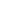

# From Pretrain to Pain: Adversarial Vulnerability of Video Foundation Models Without Task Knowledge

<!-- Page 1 -->

From Pretrain to Pain: Adversarial Vulnerability of Video Foundation Models

Without Task Knowledge

Hui Lu1,2, Yi Yu2*, Song Xia2, Yiming Yang3, Deepu Rajan3, Boon Poh Ng2, Alex Kot2,4, Xudong

Jiang2

1Rapid-Rich Object Search Lab, Interdisciplinary Graduate Programme, Nanyang Technological University, Singapore 2School of Electrical and Electronic Engineering, Nanyang Technological University, Singapore 3College of Computing and Data Science, Nanyang Technological University, Singapore 4VinUniversity, Hainoi, Vietnam {hui007, yuyi0010, xias0002, yiming014}@e.ntu.edu.sg, {asdrajan, ebpng, eackot, exdjiang}@ntu.edu.sg

## Abstract

Large-scale Video Foundation Models (VFMs) has significantly advanced various video-related tasks, either through task-specific models or Multi-modal Large Language Models (MLLMs). However, the open accessibility of VFMs also introduces critical security risks, as adversaries can exploit full knowledge of the VFMs to launch potent attacks. This paper investigates a novel and practical adversarial threat scenario: attacking downstream models or MLLMs fine-tuned from open-source VFMs, without requiring access to the victim task, training data, model query, and architecture. In contrast to conventional transfer-based attacks that rely on taskaligned surrogate models, we demonstrate that adversarial vulnerabilities can be exploited directly from the VFMs. To this end, we propose the Transferable Video Attack (TVA), a temporal-aware adversarial attack method that leverages the temporal representation dynamics of VFMs to craft effective perturbations. TVA integrates a bidirectional contrastive learning mechanism to maximize the discrepancy between the clean and adversarial features, and introduces a temporal consistency loss that exploits motion cues to enhance the sequential impact of perturbations. TVA avoids the need to train expensive surrogate models or access to domain-specific data, thereby offering a more practical and efficient attack strategy. Extensive experiments across 24 video-related tasks demonstrate the efficacy of TVA against downstream models and MLLMs, revealing a previously underexplored security vulnerability in the deployment of video models.

Code and appendix — https://github.com/aloe101/TVA

## Introduction

Large-scale foundation models trained on diverse datasets have achieved remarkable performance across a variety of tasks such as vision-language chatbots (Achiam et al. 2023), multi-modal reasoning (Li et al. 2024c), open-world segmentation (Kirillov et al. 2023), and spatio-temporal understanding (Li et al. 2024d). Among them, video foundation models (Tong et al. 2022; Wang et al. 2024c; Zhai et al. 2023), pretrained on datasets like ImageNet-21k and Kinetics, are well-suited for complex video tasks. Open-source

*Corresponding author Copyright © 2026, Association for the Advancement of Artificial Intelligence (www.aaai.org). All rights reserved.

Video Foundation Models (VFMs) offer strong initialization for domain-specific fine-tuning (Liu et al. 2024a), and serve as key components in Multi-modal Large Language Models (MLLMs) and task-oriented frameworks, such as temporal action detection (Zhang, Wu, and Li 2022) and temporal action segmentation (Chen et al. 2024; Wang et al. 2020).

Despite their strong performance, recent studies (Zhao et al. 2023b; Schlarmann and Hein 2023; Xu et al. 2023; Xia et al. 2024; Li et al. 2024b, 2025a; Wang et al. 2024a; Zhou et al. 2024a,b, 2025a,b) have raised concerns about the security of deep learning models under adversarial threats. Carefully crafted and nearly imperceptible perturbations (Fig. 1) can mislead well-trained models with high success rates, even when the attacker has limited knowledge, such as access to a surrogate model or restricted query budgets. This vulnerability raises concerns that open-source models, when adapted for downstream use, may inadvertently reveal architectural or parameter-level clues that facilitate adversarial attacks. Adversarial attacks are commonly divided into white-box (Szegedy et al. 2013; Yu et al. 2022) and blackbox (Chen et al. 2017) settings, based on whether the attacker can access the victim model’s parameters and architecture. Although white-box attacks assume full transparency, this is often impractical due to deployment and security constraints. Black-box attacks, especially those exploiting transferability, present a more realistic threat to AI systems, requiring much less knowledge of the target model.

Most transfer-based black-box attacks (Wei et al. 2022, 2023; Li et al. 2025b; Zeng et al. 2025; Yu et al. 2025) make strong assumptions about the victim model’s task and training distribution. In action recognition, for instance, attackers often assume knowledge of the dataset (e.g., Kinetics- 400) and label space, allowing them to train surrogate models with similar properties to generate transferable adversarial examples. However, studies (Zhang et al. 2025; Zhou et al. 2023a,b) reveal that such assumptions may not hold in practice due to privacy constraints and data protection laws—particularly when dealing with sensitive biometric data, where models are trained in a self-supervised manner using only features. Furthermore, the increasing size and complexity of VFMs exacerbate the difficulty of training such surrogates, limiting the practicality of these methods.

To bridge this gap, we investigate a more practical threat:

The Fortieth AAAI Conference on Artificial Intelligence (AAAI-26)

<!-- Page 2 -->

**Figure 1.** Overview of TVA: TVA deceives various downstream models or MLLMs using only the open-source “Video backbone” or “Video encoder”. “FC” (Frisbee Catch) indicates a misclassification. “AdaTAD” denotes the SOTA model.

adversarial attacks without access to the victim model’s task-specific training data, outputs, parameters, full knowledge of the architecture, or the necessity of training a new surrogate model. Considering the prevalent adoption of large VFMs, this study explores the vulnerabilities associated with fine-tuning or directly employing open-source video backbones on downstream datasets. In light of this, we introduce a novel and effective transfer-based method, Transferable Video Attack (TVA), capable of deceiving downstream task-specific models and MLLMs without prior knowledge of the target task or training datasets. As shown in Fig. 1, our TVA leverages embeddings from open-source VFMs to perform task-agnostic attacks on task-specific models or MLLMs, thereby causing failures across multiple downstream tasks. Specifically, we introduce three complementary components: 1) a self-supervised embeddinglevel attack that induces sparse and consistent perturbations to escape shared decision boundaries; 2) a bidirectional temporal-aware contrastive loss that aligns clean and adversarial embeddings in both directions to address perturbation update deviations between surrogate and victim models, correct gradient asymmetry in single-direction contrastive objectives, thereby mitigating surrogate overfitting and enhancing cross-model consistency; and 3) a temporal consistency loss designed to disrupt temporal coherence across frames, further amplifying temporal inconsistency.

The contributions of our paper are summarized as follows:

• We begin an investigation into a more practical while challenging adversarial attack problem: attacking various VFM-based downstream models by solely utilizing the information from the open-sourced foundation model.

• We introduce a temporal-aware bidirectional contrastive learning method that enhances attack efficacy by capturing temporal consistency across frames and videos, thereby enabling more effective alignment of temporal representations.

• We emphasize the critical role of temporal flow dynamics in enhancing adversarial transferability in videos. To this end, we propose a novel temporal consistency loss that exploits sequential continuity to improve performance. • Extensive experiments across 24 video-related tasks validate the effectiveness of the proposed approach against VFMs, their downstream models, and MLLMs.

## Related Work

Adversarial attacks are categorized into white-box (Goodfellow, Shlens, and Szegedy 2015) and black-box (Chen et al. 2017), based on the attacker’s access to the model. White-box attacks directly leverage gradients, while blackbox attacks either rely on query feedback (Chen et al. 2017) or exploit the transferability of adversarial examples to unseen models. To improve transferability, optimization-based methods refine gradients to overcome local optima from differing decision boundaries across architectures (Liu et al. 2017). Representative methods include I-FGSM (Kurakin et al. 2018), MI-FGSM (Dong et al. 2018) with momentum, and GRA (Zhu et al. 2023b), which averages nearby gradients for smoothing. Augmentation-based methods diversify inputs to introduce gradient variation. DI (Xie et al. 2019) uses random resizing and padding; SI (Lin et al. 2019) exploits scale-invariance; TI (Dong et al. 2019) applies small horizontal/vertical translations; Admix (Wang et al. 2021a) mixes batch samples, and BSR (Wang et al. 2024b) applies block-wise transformations. Feature-level attacks further enhance transfer by targeting intermediate representations. FDA (Ganeshan, BS, and Babu 2019), FIA (Wang et al. 2021b), NAA (Zhang et al. 2022a), and RPA (Zhang et al. 2022b) assess neuron importance through activations, gradients, or masking. FTM (Liang et al. 2025) enhances transferability by mixing attack-specific perturbations with clean features. Besides, X-Transfer (Huang et al. 2025) uses superensembles and surrogate scaling, while AnyAttack (Zhang et al. 2025) retrains a surrogate via pretrain+fine-tune. In contrast, we are the first to attack downstream video tasks and MLLMs using open-source VFMs.

AI-readable visual equivalent, added: Figure extracted from the paper PDF and converted to an SVG wrapper asset. Use the surrounding page text and caption for interpretation.

<!-- Page 3 -->

Temporal Action Detection (TAD). We adopt TAD as a representative task covering two scenarios: freezing and fine-tuning the foundation model. Our method is broadly applicable to other video-based tasks. TAD aims to identify action categories and their temporal spans in untrimmed videos. As a long-standing challenge in video understanding, TAD has broad applications in areas such as sports analysis and surveillance. Existing methods fall into two categories: feature-based and end-to-end. Feature-based approaches, like ActionFormer (Zhang, Wu, and Li 2022), Tridet (Shi et al. 2023), and DyFaDet (Yang et al. 2024), operate on pre-extracted features from video foundation models (e.g., I3D (Carreira and Zisserman 2017), Video- MAE (Tong et al. 2022; Wang et al. 2023)) using Transformer or CNN architectures. End-to-end methods directly process raw frames, jointly optimizing the encoder and detector (Liu and Wang 2020). E2E-TAD (Liu, Bai, and Bai 2022) highlighted key design choices and proposed a GPU-efficient baseline. Later improvements include TALL- Former (Cheng and Bertasius 2022) with partial backpropagation and Re2TAL (Zhao et al. 2023a) using reversible networks for memory efficiency. AdaTAD (Liu et al. 2024a) further scaled to 1B parameters via PEFT.

Benchmarks for Video-Involved MLLMs. The widespread adoption of MLLMs has been accompanied by continuous advancements in video-related benchmarks. For example, SEEDBench (Li et al. 2024a) and Video- Bench (Ning et al. 2023) encompass a diverse range of video-centric tasks designed to thoroughly assess video understanding capabilities. Nevertheless, certain studies have identified a static spatial bias in these benchmarks, stemming from reliance on single frames (Lei, Berg, and Bansal 2023). To address this limitation, MVBench (Li et al. 2024d) and Tempcompass (Liu et al. 2024b) introduce video datasets that emphasize temporal features such as motion speed, direction, attribute variations, and event sequencing. Our work uses MVBench and SEEDBench for 23 video-related task comprehensive evaluations.

Preliminary Adversarial attacks. Let f be a deep model and L a loss function (e.g., L1 loss). Untargeted adversarial attacks aim to find a perturbation δ that maximizes the loss under the constraint ∥δ∥p ≤ϵ, where ϵ controls imperceptibility. We adopt the ℓ∞-norm in this paper. Formally, we have max ∥δ∥∞≤ϵ L(f(x), f(x + δ)). (1)

A common solution to Eq. 1 is to iteratively update the perturbation δ using the loss gradient. A representative method is the Iterative Fast Gradient Sign Method (I-FGSM) (Kurakin et al. 2018), which updates δ at each step as:

δt+1 = clipϵ {δt + α · sign (∇δtL(f(x), f(x + δt)))}, (2)

where ∇is the gradient operator, sign(·) computes the element-wise sign, and α is the step size. clipϵ(·) ensures perturbations stay within the ℓ∞-bounded region. Problem formulation. Let x ⊂RT ×C×H×W be a video sample with T frames of spatial size H×W and C channels.

We consider a typical video learning setup, where fϕs is a foundation model trained on a large-scale dataset D and used as a backbone for downstream tasks. For each task (e.g., localization, segmentation), a model fϕτ is trained on a dataset Dτ, initialized from or partially sharing weights with fϕs.

ϕs = arg min ϕs E(x,y)∼D [L(fϕs(x), y)], ϕτ = arg min ϕτ E(xτ,yτ)∼Dτ [Lτ(fϕτ (xτ), yτ)], where ϕs share →ϕτ or ϕs init →ϕτ.

(3)

Definition 1 (Transferable Adversarial Attack via Open– Sourced Video Foundation Model). Given a task-specific video model fϕτ and a clean input xτ, the attacker, without any knowledge of the downstream task or dataset, seeks to craft perturbations δs to maximize the loss Lτ, i.e.:

max ∥δs∥∞≤ϵ Lτ (fϕτ (xτ), fϕτ (xτ +δs)) s.t. δs =AT(fϕs, xτ, Dτ), where AT denotes the adversarial attack algorithm, fϕs is a publicly available video foundation model, and Dτ stands for downstream unavailable data.

A common approach is to fine-tune a surrogate model fϕ∗ s to mimic the victim model, but this is difficult without access to Dτ. Alternatively, the attacker can directly optimize an attack strategy AT ∗on the source model to maximize the expected output discrepancy of the target model:

AT ∗=arg max

AT E xτ ∼Dτ h

Lτ fϕτ (xτ), fϕτ xτ +AT (fϕs, xτ)

i

.

Notably, fϕs and fϕτ can be trained on different distributions, D and Dτ, with distinct loss functions, leading to a large gap in input-output mappings and gradients. For instance, cos(∇fϕs(xτ), ∇fϕτ (xτ)) ≪1, indicating severe gradient misalignment that limits the effectiveness of gradient-based adversarial attacks. Further analysis on attacking video backbones. VFMs are typically adapted to downstream tasks τ via: (1) finetuning with additional modules (e.g., adapters), or (2) freezing the backbone fϕb for feature extraction, with taskspecific heads built on top of embeddings z = fϕb(x). Given the central role of these embeddings and the variability from fine-tuning, a natural attack strategy is to exploit the shared, frozen backbone to craft transferable perturbations:

max ∥δs∥∞≤ϵ L fϕτ b(xτ), fϕτ b(xτ +δs)

s.t. δs =AT ∗(fϕb, xτ), where ϕτ b denotes task-specific backbone parameters. Unless stated otherwise, we write ϕb as ϕ and refer to the foundation encoder fϕ as the surrogate model fϕs. Our goal is to generate transferable adversarial examples that mislead both fine-tuned backbones and downstream models fϕτ.

## Methodology

We propose a transferable adversarial attack framework targeting video foundation models and their downstream applications. Our method is composed of three complementary components: 1) a self-supervised embedding-level attack to generate base perturbations, 2) a bidirectional contrastive objective to improve representation alignment across models, and 3) a temporal consistency loss to enhance temporal disruption. We detail each component below.

<!-- Page 4 -->

**Figure 2.** Overview of the Bi-con loss and TC loss: (a) applied to the temporal level, and (b) implemented at the frame level.

Self-supervised Transferable Adversarial Attack We aim to extract the intrinsic vulnerabilities of a frozen video foundation model fϕ without relying on downstream labels or task-specific outputs. The attack is performed in the embedding space and optimized via the surrogate model. Definition 2 (Self-supervised Adversarial Perturbation). Given a frozen foundation model (feature extractor) fϕ and a video x from a downstream dataset Dτ, we extract video embeddings z = fϕ(x) ∈RT ×D, where D is the embedding dimension (e.g., 768 for VideoMAE-base). The goal is to generate a perturbation δ such that the adversarial representation zadv = fϕ(x + δ) deviates from z. Without using task-specific labels or outputs, the attacker optimizes δ via the surrogate fϕ to maximize the embedding-space loss:

max ∥δs∥∞≤ϵ L(z, zadv). (4)

Perturbations are updated over I steps using: δ = clipϵ[δ0 + PI j=1 ∆δj], where ∆δj = α · sign(∇L(z, zadv)) is the update based on fϕ. Usually, L1 loss is adopted to promote sparse deviations in the embedding space LL1 =∥zadv−z∥1.

Gradient Mismatch between Models Although the embedding-level attack enhances transferability, structural differences between models can cause gradient mismatch. To explain this, we represent the surrogate fϕ as m sequential blocks {f 1 ϕ1,..., f m ϕm} with intermediate features {v1,..., vm}, computed recursively as:

vi = f i ϕi(vi−1), where v0 = x. (5)

For a downstream task τ, the victim model fϕτ may involve parameter updates ∆ϕτ to the backbone, and the introduction of new task-specific heads gψτ with updated parameters ∆ψτ. Accordingly, the model can take two common forms:

• Form (a): fined-tuned backbone structure. The blocks are updated to {f 1 ϕ1+∆ϕ1 τ,..., f m ϕm+∆ϕm τ }, with each downstream intermediate features vi τ at block i as:

v0 τ =xτ, vi τ =f i ϕi+∆ϕiτ(vi−1 τ)=f i ϕi(vi−1 τ)+hi

∆ϕiτ(vi−1 τ), (6)

where hi

∆ϕi τ models the effect of the update ∆ϕi τ.

• Form (b): frozen backbone with task-specific head trained from Dτ. The backbone fϕ is fixed, and a new head gψτ is appended, yielding the output:

yτ = gψτ (fϕ(xτ)) = gψτ (z) = gψ(z) + hg

∆ψτ (z), (7)

where z is the extracted embedding. gψτ gψ models the downstream-specific/original decoder, respectively. hg

∆ψτ captures the influence by the update of encoder.

Theorem 1 (Deviation in updating adversarial perturbation). Let fϕτ be the victim model finetuned on task τ. The deviation in perturbation updates between the surrogate and downstream models for Form (a) can be expressed as:

∆δτ−∆δs ←∇L(ym τ)· m Y i=1

∇f i ϕi +∇hi

∆ϕiτ

− m Y i=1

∇f i ϕi

, (8)

and, under the Form (b) head-attached case:

∆δτ −∆δs ←∇L(yτ) · ∇hg

∆ψτ (z) · ∇fϕ(xτ). (9)

See Appendix A.1 for proof of the theorem. Then, we have:

Remark 1. Theorem 1 formally characterizes the deviation in perturbation update dynamics between the surrogate and target models. This deviation arises from the gradient mismatch caused by architectural or parameter discrepancies, particularly the residual transformations h∗

∆ϕ∗ τ introduced by downstream adaptation. These transformations modify the gradient flow, leading to a misalignment of the optimal adversarial update directions between the surrogate and target models. Consequently, perturbations optimized solely on the surrogate may not align with the decision boundaries of the target model, thereby degrading transferability.

Bidirectional Temporal-Aware Contrastive Attack

To mitigate this gap, we adopt a contrastive learning strategy to align clean and adversarial embeddings across models. The core idea is to guide adversarial features zadv toward semantically meaningful yet discriminative directions, using clean embeddings z as anchors. As shown in Fig. 2(a), this is achieved via a contrastive objective that promotes similarity within positive pairs (clean vs. adversarial of the same frame) and dissimilarity across negatives (different frames). Contrastive learning encourages perturbations that shift features away from clean semantics rather than targeting specific task outputs. This results in perturbations that are both task-agnostic and robust to architectural changes, thereby mitigating the gradient mismatch between surrogate and victim models in transferable attacks.

Given a batch of n samples, let z(i) and z(adv)

(i) denote the clean and adversarial embeddings of the i-th sample, respec-

AI-readable visual equivalent, added: Figure extracted from the paper PDF and converted to an SVG wrapper asset. Use the surrounding page text and caption for interpretation.

<!-- Page 5 -->

tively. When using clean embeddings as anchors, the standard one-way contrastive loss is defined as:

Lclean→adv = 1 n n X i=1

L(i)

clean→adv, where L(i)

clean→adv = −log exp(z(i) · z(adv)

(i) /τ) Pn j=1 exp(z(i) · z(adv)

(j) /τ)

.

(10)

Bidirectional Temporal-Aware Contrastive Loss. We can further define another one-way loss using the adversarial embeddings as the anchor:

Ladv→clean = 1 n n X i=1

L(i)

adv→clean, where L(i)

adv→clean = −log exp(z(adv)

(i) · z(i)/τ) Pn j=1 exp(z(adv)

(i) · z(j)/τ).

(11)

Then, we introduce a bidirectional loss LBi-con that aligns clean and adversarial features in both directions:

LBi-con = Lclean→adv + Ladv→clean

2. (12)

Advantages of LBi-con. LBi-con mitigates gradient asymmetry by treating both clean and adversarial features as anchors, ensuring more balanced updates and improved generalization (Fig. 2). While Lclean→adv and Ladv→clean appear symmetric in form, they induce inherently different gradient behaviors during adversarial optimization. As analyzed in Theorem 2, this asymmetry arises from differences in the gradient prefactors with respect to the perturbation δ(i), which can lead to unstable or biased training dynamics. By averaging the two directions, LBi-con resolves this imbalance and stabilizes learning. Moreover, unlike video-level approaches, our frame-level design contrasts each clean frame z(i) with all adversarial frames zadv

(j) in the batch, expanding negative diversity and enhancing temporal saliency. This design improves transferability across models and tasks without relying on downstream-specific priors. Theorem 2 (Gradient Asymmetry in Single-direction Contrastive Loss). Let δ(i) be the adversarial perturbations applied to input x(i) to generate the adversarial feature z(adv)

(i). The gradient of the single-direction contrastive loss from clean to adversarial features w.r.t. δ(i) is given by:

∇δ(i)Lclean→adv = 1 nτ exp

−L(i)

clean→adv

−1 z(i)· dz(adv)

(i) dδ(i)

, (13)

while the reverse-direction gradient becomes:

∇δ(i)Ladv→clean= 1 nτ



exp(−L(i)

adv→clean)z(i)+

X j̸=i qjz(j)−z(i)





· dz(adv)

(i) dδ(i)

, where qj = exp(z(adv)

(i) · z(j)/τ) Pn k=1 exp(z(adv)

(i) · zk/τ).

(14)

These gradients shares the same Jacobian term dz(adv)

(i) dδ(i), but differ in the prefactor. Thus, we have:

∇δ(i)Lclean→adv̸ = ∇δ(i)Ladv→clean. (15)

Remark 2. In Theorem 2, this asymmetry stems from treating clean or adversarial features as static anchors. When the victim model fϕτ diverges from the surrogate fϕ, this one-way setup yields misaligned perturbations.

To address this, we use a bidirectional contrastive loss where clean and adversarial features jointly define the embedding space, yielding balanced gradients and better transferability. As shown in Fig. 2(a), at the frame level, each clean frame z(i) contrasts with all adversarial frames zadv

(j) in the batch, increasing negative diversity and revealing temporally salient frames.

Temporal Consistency Attack While spatial semantics are central to adversarial attacks, temporal consistency is equally important in video understanding tasks. Kim et al. (2023) shows that enforcing temporal continuity significantly improves model stability and performance. For instance, VideoMAE achieves SOTA accuracy in action recognition by applying masked autoencoding over spatiotemporal tokens to preserve coherence.

Inspired by this, we hypothesize that disrupting temporal consistency in the adversarial feature can effectively destabilize downstream models. Breaking smooth frame-to-frame transitions introduces temporal inconsistencies that impair both spatial understanding and temporal reasoning, thereby improving attack transferability. In light of this, we introduce a temporal consistency loss that penalizes similarity between adjacent adversarial frame embeddings. As shown in Fig. 2(b), given a T-frame video, we compute the cosine similarity between consecutive adversarial features zadv t for t-th frame and zadv t+1 for (t+1)-th frame:

LTC = 1 T −1

T −1 X t=1

1 −cos zadv t, zadv t+1

. (16)

Joint Objective for Transferable Video Attacks To craft highly transferable adversarial perturbations, we unify the three complementary objectives into a single loss function. The overall optimization target is defined as:

Ltotal = LL1 + LBi-con + LTC, (17)

where each term captures a distinct aspect of perturbation effectiveness. Specifically, LL1 promotes sparse, consistent deviations to escape shared decision regions. LBi-con aligns clean and adversarial embeddings bidirectionally, reducing surrogate overfitting and improving cross-model consistency. LTC breaks temporal continuity between frames, targeting the temporal priors of video models. Together, these objectives guide perturbations to disrupt spatial, semantic, and temporal cues, yielding attacks with enhanced transferability across downstream tasks and architectures.

Novelty and Advantages. We introduce a task-agnostic attack framework that targets VFMs without relying on downstream task knowledge, labels, or model outputs. Instead of building task-specific surrogates, the method directly leverages the representational structure of frozen backbones. To improve the transferability, we design two

<!-- Page 6 -->

Dataset → Thumos14 (Jiang et al. 2014) Charades (Sigurdsson et al. 2016)

Attack ↓, Model → ActionFormer Tridet DyfaDet AdaTAD Avg. ActionFormer Tridet DyfaDet AdaTAD Avg.

Without attack 50.40 49.85 49.85 53.17 50.07 30.36 29.51 30.07 36.05 31.50

I-FGSM (Kurakin et al. 2018) 7.59 6.94 8.29 21.08 10.98 4.64 4.15 4.00 10.10 5.72 MI-FGSM (Dong et al. 2018) 6.73 6.77 7.02 19.18 9.93 5.10 4.53 4.47 10.06 6.04 DI-FGSM (Xie et al. 2019) 7.38 6.65 8.27 20.93 10.81 7.18 6.03 6.58 12.50 8.07 TI-FGSM (Dong et al. 2019) 10.32 9.15 11.75 30.08 15.33 7.36 6.82 5.83 13.80 8.45 SIM (Lin et al. 2019) 7.83 7.12 8.11 19.72 10.70 5.4 5.01 4.89 9.84 6.29 BSR (Wang et al. 2024b) 46.11 46.99 50.30 52.50 48.98 23.75 22.23 22.28 31.56 24.96 FTM (Liang et al. 2025) 3.55 3.40 4.60 14.17 6.43 4.94 4.60 4.64 8.82 5.75

Our TVA + I-FGSM 1.00 0.63 0.96 10.68 3.32 2.99 3.06 3.57 8.18 4.45 Our TVA + MI-FGSM 0.12 0.44 0.29 4.07 1.23 2.84 2.87 3.61 6.25 3.89 Our TVA + FTM 0.79 0.40 0.45 3.05 1.17 3.00 3.04 3.76 5.71 3.88

**Table 1.** Results of transfer-based adversarial attacks on different models. We report the average mAP (%) ↓. We use the VideoMAE-base as the surrogate model on the temporal action detection task. The data with the strongest attack is bold.

Task ↓, Attack → I-FGSM MI-FGSM DI-FGSM TI-FGSM SIM BSR Our TVA + MI-FGSM

Action Sequence 38.04 28.19 30.43 30.43 9.78 11.96 47.83 Action Antonym 23.53 23.00 18.63 17.65 12.75 14.71 39.22 Fine-grained Action 53.09 38.50 43.21 37.04 23.46 18.52 79.01 Unexpected Action 17.31 20.00 14.42 10.58 6.73 3.85 40.38 Object Interaction 37.11 35.50 37.11 28.87 7.22 12.37 68.04 Scene Transition 19.41 12.50 13.53 8.24 3.53 3.53 52.94 Moving Attribute 35.24 36.50 30.48 20.95 23.81 25.71 57.14 State Change 6.25 3.00 3.75 3.75 6.25 2.50 20.00 Character Order 34.57 31.00 24.69 23.46 16.05 22.22 54.32 Counterfactual Inference 25.00 26.00 23.44 29.69 21.88 21.88 40.62

Avg. 29.52 25.79 24.55 22.74 16.76 15.76 42.10

**Table 2.** Results of various attacks on video-related tasks. We report attack success rate (%) ↑, Avg. denotes the average performance over all 20 tasks. The surrogate model is LauguageBind, and the victim model is VideoLLaVA (Lin et al. 2023).

auxiliary loss functions that capture temporal and representational dynamics. These losses are lightweight, broadly compatible, and can be applied to enhance a wide range of existing attack methods, offering a flexible way to boost performance in diverse video scenarios.

## Experiments

## Experimental Setup

## Evaluation

details. We evaluate on temporal action detection (TAD), MVBench (20 tasks), and SEEDBench (3 tasks), totaling 24 video-related tasks. For TAD, we use the average standard mean Average Precision (mAP) at various Intersection over Union (IoU) thresholds over [0.3:0.7:0.1] for THUMOS14 and [0.1:0.9:0.1] for Charades. For MVBench and SEEDBench, treated as classification tasks, we report attack success rate (ASR), i.e., the percentage of correct answers flipped by the attack. Except for MVBench, we randomly select 100 videos from each task. The randomness test can be found in Appendix A.3. Implementation details. We adopt the MI-FGSM as our base attack. To ensure imperceptibility, the ℓ∞perturbation bound is fixed at ϵ = 8 255 for all experiments. For TAD, we set the attack update iterations I = 4 with the step size α = 2 255 for computational efficiency. For other tasks, we use I = 20 and α = 1 255. More details are in Appendix A.7.

Main Results

Temporal action detection. Table 1 reports results on TAD, with clean input performance shown first, followed by results under adversarial attacks. Our TVA method generates adversarial examples with superior transferability, consistently degrading performance across diverse downstream models. Note that ActionFormer, Tridet, and DyFaDet are top feature-based TAD models (frozen backbone), while AdaTAD is a state-of-the-art end-to-end approach using fine-tuned VideoMAE. We use the original VideoMAE-Base as the surrogate model to ensure a balanced evaluation. TVA nearly nullifies performance in feature-based models and reduces AdaTAD’s accuracy from 53.17% to 3.05%, far outperforming the previous best attack (14.17%). It delivers the most effective attacks on both THUMOS14 and Charades. MVbench. Table 2 presents the performance of various adversarial attack methods across ten representative tasks selected from MVBench. Our method consistently outperforms existing baselines by a large margin across all tasks. The average performance over all 20 tasks (Avg.) further

<!-- Page 7 -->

Surrogate Victim Task I-FGSM MI-FGSM DI-FGSM TI-FGSM SIM BSR X-T AA Our TVA

LanguageBind (Zhu et al. 2023a)

VideoLLaVA (Lin et al. 2023)

AR 46.88 6.25 46.88 37.50 18.75 28.75 - - 71.88 AP 37.25 0 29.41 27.45 13.73 13.73 - - 66.67 PU 15.79 5.26 18.42 15.79 23.68 23.68 - - 21.05 Avg. 33.31 3.84 31.57 26.91 18.72 22.05 - - 53.87

QFormer (Li et al. 2023)

VideoChat2 (Li et al. 2024d)

AR 58.93 66.07 44.64 39.29 23.21 42.86 - - 57.14 AP 51.92 25.00 42.31 48.08 21.15 51.92 - - 53.85 PU 25.00 50.00 25.00 28.12 25.00 25.00 - - 34.38 Avg. 45.28 47.02 37.32 38.50 23.12 39.93 - - 48.42

SigLIP (Zhai et al. 2023)

LLaVA-NeXT (Li et al. 2024c)

AR 38.03 67.61 40.85 28.17 21.13 47.86 32.39 22.54 76.06 AP 40.00 70.00 47.14 31.43 31.43 42.86 38.57 52.86 68.57 PU 32.56 39.53 32.56 20.93 30.23 32.56 25.58 25.58 39.53 Avg. 36.86 59.05 40.18 26.84 27.60 41.09 32.18 33.66 61.39

**Table 3.** ASR (%) ↑across Tasks on SEEDBench. AR, AP, and PU denote Action Recognition, Action Prediction, and Procedure Understanding, respectively. X-T denotes X-Transfer (Huang et al. 2025), AA denotes AnyAttack (Zhang et al. 2025).

L1 Bi-con TC ActionFormer Tridet DyfaDet AdaTAD Avg.

7.59 6.94 8.29 21.08 10.98 0.94 1.01 1.63 12.43 4.00 5.96 6.61 6.86 20.15 9.90 1.00 0.63 0.96 10.68 3.32

6.73 6.77 7.02 19.18 9.93 0.20 0.26 0.38 4.84 1.42 5.46 6.37 6.53 17.91 9.07 0.12 0.44 0.29 4.07 1.23

**Table 4.** Ablation study for the performance of our methods combined by I-FGSM (top) and MI-FGSM (bottom).

confirms the superiority of our approach, reaching 42.10 compared to 29.52 by I-FGSM and 25.79 by MIFGSM. This demonstrates enhanced transferability and robustness of the proposed method. More results are in Appendix A.4. SEEDBench. As shown in Table 3, our TVA generally achieves competitive or superior average rates across all model pairs, outperforming baselines like I-FGSM, with more stable and balanced performance (i.e., lower variance). Besides, using SigLIP as a surrogate model, our method can transfer to commercial models, which achieves ASR 48.8% on Gemini-2.0-flash and 33.3% on GPT5-mini with ϵ = 16 255 on AR.

Further Analysis Ablation. Table 4 presents an ablation study on three components. The full model consistently achieves the highest attack performance, indicating the complementary benefits of integrating all three modules. Removing any individual component leads to a drop in performance, with the largest degradation observed when LBi-con is removed. This highlights the critical role of temporal-aware bidirectional contrastive loss in enhancing attack transferability. Influence of designs and temperature in Bi-con. Fig. 3 shows that our frame-level bidirectional contrastive learning much outperforms both contrastive baselines, demonstrating the importance of fine-grained temporal-aware attack and

**Figure 3.** Performance comparison of different contrastive learning strategies on four TAD models. Video-level uses standard video-level contrast, clean2adv applies one-way clean-to-adversarial loss (Eq. 10), while ours adopts framelevel bidirectional contrast. Our method has the lowest mAP.

bidirectional feature supervision. Please refer to Appendix A.5 for the influence of temperature τ in Bi-con. Resistance to augmentations. We also investigate our attacks under augmentation-based defenses in Appendix A.6.

## Conclusion

Large-scale Video Foundation Models (VFMs) enhance video understanding but introduce new security risks. This paper investigates a more practical and underexplored adversarial threat scenario: transferable adversarial attacks on downstream models fine-tuned or directed from open-source VFMs, without access to the target task, data, or model parameters. We propose Transferable Video Attack (TVA), a task-agnostic framework that exploits the representational structure of VFMs. TVA combines temporal-aware bidirectional contrastive learning with temporal consistency to improve attack transferability. Extensive results across 24 video tasks and many models reveal the vulnerability of VFM-based systems, highlighting the need to reassess their deployment security.

AI-readable visual equivalent, added: Figure extracted from the paper PDF and converted to an SVG wrapper asset. Use the surrounding page text and caption for interpretation.

<!-- Page 8 -->

## Acknowledgments

This work was carried out at the Rapid-Rich Object Search (ROSE) Lab, School of Electrical & Electronic Engineering, Nanyang Technological University (NTU), Singapore. This research is supported by the National Research Foundation, Singapore and Infocomm Media Development Authority under its Trust Tech Funding Initiative. Any opinions, findings and conclusions or recommendations expressed in this material are those of the author(s) and do not reflect the views of National Research Foundation, Singapore and Infocomm Media Development Authority.

## References

Achiam, J.; Adler, S.; Agarwal, S.; Ahmad, L.; Akkaya, I.; Aleman, F. L.; Almeida, D.; Altenschmidt, J.; Altman, S.; Anadkat, S.; et al. 2023. Gpt-4 technical report. arXiv preprint arXiv:2303.08774. Carreira, J.; and Zisserman, A. 2017. Quo vadis, action recognition? a new model and the kinetics dataset. In CVPR. Chen, G.; Huang, Y.; Xu, J.; Pei, B.; Chen, Z.; Li, Z.; Wang, J.; Li, K.; Lu, T.; and Wang, L. 2024. Video mamba suite: State space model as a versatile alternative for video understanding. arXiv preprint arXiv:2403.09626. Chen, P.-Y.; Zhang, H.; Sharma, Y.; Yi, J.; and Hsieh, C.- J. 2017. Zoo: Zeroth order optimization based black-box attacks to deep neural networks without training substitute models. In Proceedings of the 10th ACM workshop on artificial intelligence and security. Cheng, F.; and Bertasius, G. 2022. Tallformer: Temporal action localization with a long-memory transformer. In ECCV. Dong, Y.; Liao, F.; Pang, T.; Su, H.; Zhu, J.; Hu, X.; and Li, J. 2018. Boosting adversarial attacks with momentum. In CVPR. Dong, Y.; Pang, T.; Su, H.; and Zhu, J. 2019. Evading defenses to transferable adversarial examples by translationinvariant attacks. In CVPR. Ganeshan, A.; BS, V.; and Babu, R. V. 2019. Fda: Feature disruptive attack. In ICCV. Goodfellow, I. J.; Shlens, J.; and Szegedy, C. 2015. Explaining and harnessing adversarial examples. In ICLR. Huang, H.; Erfani, S.; Li, Y.; Ma, X.; and Bailey, J. 2025. X- Transfer Attacks: Towards Super Transferable Adversarial Attacks on CLIP. arXiv preprint arXiv:2505.05528. Jiang, Y.-G.; Liu, J.; Zamir, A. R.; Toderici, G.; Laptev, I.; Shah, M.; and Sukthankar, R. 2014. THUMOS challenge: Action recognition with a large number of classes. Kim, H.-S.; Son, M.; Kim, M.; Kwon, M.-J.; and Kim, C. 2023. Breaking temporal consistency: Generating video universal adversarial perturbations using image models. In ICCV. Kirillov, A.; Mintun, E.; Ravi, N.; Mao, H.; Rolland, C.; Gustafson, L.; Xiao, T.; Whitehead, S.; Berg, A. C.; Lo, W.- Y.; et al. 2023. Segment anything. In ICCV. Kurakin, A.; Goodfellow, I. J.; Bengio, S.; Kurakin, A.; Goodfellow, I. J.; and Bengio, S. 2018. Adversarial examples in the physical world. In Artificial intelligence safety and security.

Lei, J.; Berg, T. L.; and Bansal, M. 2023. Revealing Single Frame Bias for Video-and-Language Learning. In ACL. Li, B.; Ge, Y.; Ge, Y.; Wang, G.; Wang, R.; Zhang, R.; and Shan, Y. 2024a. SEED-Bench: Benchmarking Multimodal Large Language Models. In CVPR. Li, F.; Li, K.; Wu, H.; Tian, J.; and Zhou, J. 2024b. DAT: Improving Adversarial Robustness via Generative Amplitude Mix-up in Frequency Domain. In NeurIPS. Li, F.; Li, K.; Wu, H.; Tian, J.; and Zhou, J. 2025a. Toward Robust Learning via Core Feature-Aware Adversarial Training. IEEE TIFS. Li, F.; Zhang, R.; Zhang, H.; Zhang, Y.; Li, B.; Li, W.; Ma, Z.; and Li, C. 2024c. Llava-next-interleave: Tackling multiimage, video, and 3d in large multimodal models. arXiv preprint arXiv:2407.07895. Li, J.; Li, D.; Savarese, S.; and Hoi, S. 2023. Blip-2: Bootstrapping language-image pre-training with frozen image encoders and large language models. In ICML. Li, K.; Wang, Y.; He, Y.; Li, Y.; Wang, Y.; Liu, Y.; Wang, Z.; Xu, J.; Chen, G.; Luo, P.; et al. 2024d. Mvbench: A comprehensive multi-modal video understanding benchmark. In CVPR. Li, W.; Zhang, Z.; Lan, X.; and Jiang, D. 2025b. Transferable Adversarial Face Attack with Text Controlled Attribute. In AAAI. Liang, K.; Dai, X.; Li, Y.; Wang, D.; and Xiao, B. 2025. Improving Transferable Targeted Attacks with Feature Tuning Mixup. In CVPR. Lin, B.; Ye, Y.; Zhu, B.; Cui, J.; Ning, M.; Jin, P.; and Yuan, L. 2023. Video-llava: Learning united visual representation by alignment before projection. arXiv preprint arXiv:2311.10122. Lin, J.; Song, C.; He, K.; Wang, L.; and Hopcroft, J. E. 2019. Nesterov accelerated gradient and scale invariance for adversarial attacks. arXiv preprint arXiv:1908.06281. Liu, Q.; and Wang, Z. 2020. Progressive boundary refinement network for temporal action detection. In AAAI. Liu, S.; Zhang, C.-L.; Zhao, C.; and Ghanem, B. 2024a. End-to-end temporal action detection with 1b parameters across 1000 frames. In CVPR. Liu, X.; Bai, S.; and Bai, X. 2022. An empirical study of end-to-end temporal action detection. In CVPR. Liu, Y.; Chen, X.; Liu, C.; and Song, D. 2017. Delving into transferable adversarial examples and black-box attacks. In ICLR. Liu, Y.; Li, S.; Liu, Y.; Wang, Y.; Ren, S.; Li, L.; Chen, S.; Sun, X.; and Hou, L. 2024b. TempCompass: Do Video LLMs Really Understand Videos? In ACL (Findings). Ning, M.; Zhu, B.; Xie, Y.; Lin, B.; Cui, J.; Yuan, L.; Chen, D.; and Yuan, L. 2023. Video-bench: A comprehensive benchmark and toolkit for evaluating video-based large language models. arXiv preprint arXiv:2311.16103. Schlarmann, C.; and Hein, M. 2023. On the adversarial robustness of multi-modal foundation models. In ICCV.

<!-- Page 9 -->

Shi, D.; Zhong, Y.; Cao, Q.; Ma, L.; Li, J.; and Tao, D. 2023. Tridet: Temporal action detection with relative boundary modeling. In CVPR. Sigurdsson, G. A.; Varol, G.; Wang, X.; Farhadi, A.; Laptev, I.; and Gupta, A. 2016. Hollywood in homes: Crowdsourcing data collection for activity understanding. In ECCV. Szegedy, C.; Zaremba, W.; Sutskever, I.; Bruna, J.; Erhan, D.; Goodfellow, I.; and Fergus, R. 2013. Intriguing properties of neural networks. arXiv preprint arXiv:1312.6199. Tong, Z.; Song, Y.; Wang, J.; and Wang, L. 2022. Videomae: Masked autoencoders are data-efficient learners for self-supervised video pre-training. In NeurIPS. Wang, C.; Yu, Y.; Guo, L.; and Wen, B. 2024a. Benchmarking adversarial robustness of image shadow removal with shadow-adaptive attacks. In ICASSP. Wang, K.; He, X.; Wang, W.; and Wang, X. 2024b. Boosting Adversarial Transferability by Block Shuffle and Rotation. In CVPR. Wang, L.; Huang, B.; Zhao, Z.; Tong, Z.; He, Y.; Wang, Y.; Wang, Y.; and Qiao, Y. 2023. Videomae v2: Scaling video masked autoencoders with dual masking. In CVPR. Wang, X.; He, X.; Wang, J.; and He, K. 2021a. Admix: Enhancing the transferability of adversarial attacks. In ICCV. Wang, Y.; Li, K.; Li, X.; Yu, J.; He, Y.; Chen, G.; Pei, B.; Zheng, R.; Wang, Z.; Shi, Y.; et al. 2024c. Internvideo2: Scaling foundation models for multimodal video understanding. In ECCV. Wang, Z.; Gao, Z.; Wang, L.; Li, Z.; and Wu, G. 2020. Boundary-aware cascade networks for temporal action segmentation. In ECCV. Wang, Z.; Guo, H.; Zhang, Z.; Liu, W.; Qin, Z.; and Ren, K. 2021b. Feature importance-aware transferable adversarial attacks. In ICCV. Wei, Z.; Chen, J.; Goldblum, M.; Wu, Z.; Goldstein, T.; Jiang, Y.-G.; and Davis, L. S. 2023. Towards transferable adversarial attacks on image and video transformers. IEEE TIP. Wei, Z.; Chen, J.; Wu, Z.; and Jiang, Y.-G. 2022. Boosting the transferability of video adversarial examples via temporal translation. In AAAI. Xia, S.; Yang, W.; Yu, Y.; Lin, X.; Ding, H.; Duan, L.; and Jiang, X. 2024. Transferable adversarial attacks on sam and its downstream models. In NeurIPS. Xie, C.; Zhang, Z.; Zhou, Y.; Bai, S.; Wang, J.; Ren, Z.; and Yuille, A. L. 2019. Improving transferability of adversarial examples with input diversity. In CVPR. Xu, X.; Kong, K.; Liu, N.; Cui, L.; Wang, D.; Zhang, J.; and Kankanhalli, M. 2023. An llm can fool itself: A promptbased adversarial attack. arXiv preprint arXiv:2310.13345. Yang, L.; Zheng, Z.; Han, Y.; Cheng, H.; Song, S.; Huang, G.; and Li, F. 2024. Dyfadet: Dynamic feature aggregation for temporal action detection. In ECCV. Yu, Y.; Xia, S.; Lin, X.; Kong, C.; Yang, W.; Lu, S.; Tan, Y.- P.; and Kot, A. C. 2025. Towards Model Resistant to Transferable Adversarial Examples via Trigger Activation. IEEE TIFS.

Yu, Y.; Yang, W.; Tan, Y.-P.; and Kot, A. C. 2022. Towards robust rain removal against adversarial attacks: A comprehensive benchmark analysis and beyond. In CVPR. Zeng, H.; Cui, S.; Chen, B.; and Peng, A. 2025. Everywhere Attack: Attacking Locally and Globally to Boost Targeted Transferability. In AAAI. Zhai, X.; Mustafa, B.; Kolesnikov, A.; and Beyer, L. 2023. Sigmoid loss for language image pre-training. In ICCV. Zhang, C.-L.; Wu, J.; and Li, Y. 2022. Actionformer: Localizing moments of actions with transformers. In ECCV. Zhang, J.; Wu, W.; Huang, J.-t.; Huang, Y.; Wang, W.; Su, Y.; and Lyu, M. R. 2022a. Improving adversarial transferability via neuron attribution-based attacks. In CVPR. Zhang, J.; Ye, J.; Ma, X.; Li, Y.; Yang, Y.; Chen, Y.; Sang, J.; and Yeung, D.-Y. 2025. AnyAttack: Towards Large-scale Self-supervised Adversarial Attacks on Visionlanguage Models. In CVPR. Zhang, Y.; Tan, Y.-a.; Chen, T.; Liu, X.; Zhang, Q.; and Li, Y. 2022b. Enhancing the Transferability of Adversarial Examples with Random Patch. In IJCAI. Zhao, C.; Liu, S.; Mangalam, K.; and Ghanem, B. 2023a. Re2TAL: Rewiring pretrained video backbones for reversible temporal action localization. In CVPR. Zhao, Y.; Pang, T.; Du, C.; Yang, X.; Li, C.; Cheung, N.- M. M.; and Lin, M. 2023b. On evaluating adversarial robustness of large vision-language models. In NeurIPS. Zhou, Z.; Hu, S.; Li, M.; Zhang, H.; Zhang, Y.; and Jin, H. 2023a. Advclip: Downstream-agnostic adversarial examples in multimodal contrastive learning. In MM. Zhou, Z.; Hu, S.; Zhao, R.; Wang, Q.; Zhang, L. Y.; Hou, J.; and Jin, H. 2023b. Downstream-agnostic adversarial examples. In ICCV. Zhou, Z.; Hu, Y.; Song, Y.; Li, Z.; Hu, S.; Zhang, L. Y.; Yao, D.; Zheng, L.; and Jin, H. 2025a. Vanish into Thin Air: Cross-prompt Universal Adversarial Attacks for SAM2. In NeurIPS. Zhou, Z.; Li, B.; Song, Y.; Hu, S.; Wan, W.; Zhang, L. Y.; Yao, D.; and Jin, H. 2025b. NumbOD: A Spatial-Frequency Fusion Attack Against Object Detectors. In AAAI. Zhou, Z.; Li, M.; Liu, W.; Hu, S.; Zhang, Y.; Wan, W.; Xue, L.; Zhang, L. Y.; Yao, D.; and Jin, H. 2024a. Securely Finetuning Pre-trained Encoders Against Adversarial Examples. In IEEE S&P. Zhou, Z.; Song, Y.; Li, M.; Hu, S.; Wang, X.; Zhang, L. Y.; Yao, D.; and Jin, H. 2024b. Darksam: Fooling segment anything model to segment nothing. In NeurIPS. Zhu, B.; Lin, B.; Ning, M.; Yan, Y.; Cui, J.; Wang, H.; Pang, Y.; Jiang, W.; Zhang, J.; Li, Z.; et al. 2023a. Languagebind: Extending video-language pretraining to n-modality by language-based semantic alignment. arXiv preprint arXiv:2310.01852. Zhu, H.; Ren, Y.; Sui, X.; Yang, L.; and Jiang, W. 2023b. Boosting adversarial transferability via gradient relevance attack. In ICCV.
