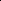

# GCIB: Causal Intervention Guided Graph Information Bottleneck Framework

<!-- Page 1 -->

GCIB: Causal Intervention Guided Graph Information Bottleneck Framework

Hangyuan Du1, Rong Wang1, Lixin Cui2*, Gaoxia Jiang1, Liang Bai3, Wenjian Wang3

1School of Computer and Information Technology, Shanxi University, Taiyuan, 030006, China 2School of Information, Central University of Finance and Economics, Beijing 100081, China 3Key Laboratory of Computational Intelligence and Chinese Information Processing (Shanxi University), Ministry of Education, Taiyuan, 030006, China cuilixin@cufe.edu.cn

## Abstract

Graph neural networks (GNNs) have demonstrated impressive performance in a broad spectrum of fields, but always suffer from the generalization problem when confronted with out-of-distribution (OOD) scenarios. Information bottleneck (IB) principle, which endeavors to learn the minimally sufficient representations for downstream tasks, has been shown to be a promising strategy in dealing with this problem. However, the IB-based methods do not inherently distinguish between causal and non-causal parts in the graph, leading to underperforming OOD generalization ability. In this paper, we develop the Graph Causal Information Bottleneck (GCIB) framework, a causal extension of the IB for graph data, which is capable of jointly compressing abundant information and capturing causal dependency from the input graph. Specifically, we endow graph IB with the ability of maintaining causal control by incorporating the underlying causal structure and introducing intervention operation. On this basis, we formulate the learning objective for GCIB and present its specific implementation. Graph representations learned by GCIB can effectively preserve causal information that fundamentally determines graph properties, resulting in outstanding OOD generalization ability. Extensive experiments on both synthetic and real-world datasets demonstrate the superiority of GCIB over state-of-the-art baselines.

## Introduction

As a potent representation learning technology for graph data, GNNs (Kipf and Welling 2017; Velickovic et al. 2018; Xu et al. 2019) have attracted a significant growing amount of attention from various areas (Gao et al. 2023; Rahmani et al. 2023; Han et al. 2025). The basic learning diagram of GNNs generally follows the empirical risk minimization (ERM) principle with the I.I.D. assumption (Liao, Urtasun, and Zemel 2021), i.e., training and testing graphs are independently sampled from the identical distribution. However, in many real-world applications, such an assumption seldom holds since OOD shifts (i.e. distribution shifts between the training and testing data) (Krueger et al. 2021) may occur due to the uncontrollable generation mechanism of graph data. In such scenarios, GNNs will experience dramatic per-

*Corresponding Author: Lixin Cui Copyright © 2026, Association for the Advancement of Artificial Intelligence (www.aaai.org). All rights reserved.

formance degradation, posing a severe challenge for their reliable application.

Essentially, the main reason for the performance degeneration of GNNs is the shortcut (i.e. spurious correlation) between the irrelevant features and the prediction target conditioned on a given graph category (Lopez-Paz et al. 2017; Zhang et al. 2021). When a GNN model is trained on a dataset where features relevant and irrelevant with graph label co-exist in most training graphs, the model tends to generate predictions relying on the shortcut. Unfortunately, such a shortcut is unstable across unseen testing distributions, thus the model is prone to making unreliable predictions. Make GNNs get rid of the unstable correlation is paramount in overcoming the OOD generalization problem. However, this is not trivial to achieve due to the two fundamental uniqueness of graph data (Wu et al. 2022a), i.e., 1) the distribution characteristics in data generation are nonindependent and non-identical, and 2) both node attributes and structural information would affect the model’s generalization.

In recent years, plenty of methods have emerged to address the graph OOD generalization problem by protecting the model from spurious correlations. One widely adopted strategy is based on invariant learning (Mo et al. 2024; Wu et al. 2022a; Yang et al. 2022), which focuses on extracting the environment-invariant features that are robust to distribution shifts. Invariant learning methods suppose that invariant features sufficiently determine the graph label while spurious features depend on task-irrelevant environmental factors (Li et al. 2024a). Followed by this assumption, several specific learning techniques are employed to identify invariant patterns from graph data, including invariant subgraph extraction (Yang et al. 2022; Jia et al. 2024), contrastive learning (Mo et al. 2024; Yao et al. 2024; Li et al. 2024a), and disentangled representation learning (Zhang et al. 2024, 2025a). Although this line of research has achieved some empirical success, the validity of the identified invariant patterns is questionable, as these methods generally rely on an implicit or explicit prior about joint distribution of spurious features and labels (Yao et al. 2024). In real scenarios, however, the premise can be easily broken by the arbitrary variation of the true distribution (Chen et al. 2023; Wu et al. 2022b). Another line of work formulates the learning objective based on IB principle (Saxe et al. 2018), which at-

The Fortieth AAAI Conference on Artificial Intelligence (AAAI-26)

20905

<!-- Page 2 -->

tempts to learn robust graph representation by maximizing mutual information between derived representation and target while minimizing mutual information between the representation and the input graph (Wu et al. 2020; Miao, Liu, and Li 2022; Yu et al. 2024). Despite the outstanding ability of removing noise, the IB-based methods excessively rely on the statistical correlation between extracted subgraphs and labels, regardless of whether they are associated by the inherently causal relationship. Thus, these methods cannot stably achieve generalization ability in some scenarios, where statistically label-relevant spurious features and labelirrelevant information simultaneously perturb the identification of causal patterns. Several recent works (Mao et al. 2026; Yang et al. 2024; Zhang et al. 2025b) strive to integrate graph invariant learning into the IB framework for enhancing model generalization, however, they do not work well in complex scenarios since the compressed invariant correlations may be inconsistent with the underlying causal dependency.

To sum up, existing methods cannot accurately identify the stable patterns for downstream tasks due to the presence of non-causal correlations. Besides, in practical tasks, there is insufficient prior information about underlying causal and non-causal features in the graph, bringing significant challenges to exclude the non-causal correlations. To address this issue, we propose a novel causal learning model for graph, called GCIB (short for Causal Graph Information Bottleneck), which integrates the capacity of causal control with the information compression ability of IB principle for getting rid of non-casual correlations. Unlike existing IBbased methods that mainly focus on eliminating the spurious correlation or label-irrelevant noise, we develop a novel objective to guide the representation learning from a causal perspective by endowing the IB framework with causal manipulation. Specifically, we first design a causal subgraph extractor to separate the input graph into causal and noncausal subgraphs and encode them into corresponding representations. On this basis, we reformulate the IB principle to further enhance the causality while imposing constraints on the extracted subgraph, where correlations inconsistent with causal dependencies are cut off by performing interventions on causal representations. Then, we built two classifiers upon the causal and non-causal representations, respectively, to generate the joint prediction, whose classification risk is minimized across different interventional distributions. Finally, we conduct comprehensive experiments to verify the superiority of GCIB. Our main contributions can be summarized as follows:

• We develop a causal extension of IB principle to improve the generalization ability of graph learning model, which learns the minimally sufficient graph representation while retaining the causal dependency between the input graph and the prediction. • We provide theoretical analysis to guarantee the rationality of GCIB from causal perspective, and elaborate on the implementation of GCIB for graph classification task. • We conduct comprehensive experiments on both synthetic and real-world datasets. The effectiveness and su- periority have been well-validated with convincing results.

Related Works

Graph Information Bottleneck

IB principle is a constraint based on mutual information (MI) that aims to juice out compressed components from the original data while keeping most predictive information of properties and eliminating label-irrelevant noise. To help GNNs avoid overfitting and improve robustness, GIB (Wu et al. 2020) pioneeringly adapts the IB principle for graph representation learning. For the input graph G and its label Y, the minimally sufficient graph representation Z can be learned by minimizing the following information bottleneck objective:

LGIB = I(G; Z) −βI(Y; Z), (1)

where the Lagrangian multiplier β is used to trade off minimality and sufficiency. In subsequent studies, the IB framework has been employed as an effective graph encoding paradigm. VIB-GSL (Sun et al. 2022) constructs a modelagnostic graph structure learning framework, where a new IB-Graph is extracted as a bottleneck using feature masking and structure learning. To address the subgraph recognition problem, SIB (Yu et al. 2024) proposes a Deep VIB (Alemi et al. 2017) based learning objective and designs a connectivity loss to encourage the model to extract the maximally informative but compressed subgraph. To achieve robust and discriminative representations for dynamic graphs, DGIB (Yuan et al. 2024) decomposes the overall IB objective into two channels that learn the minimal and sufficient representations and guarantee the predictive consensus, respectively. MARIO (Zhu et al. 2024) integrates invariant learning and IB principle to address the distributional-shift-robust problem for unsupervised graph tasks.

Causal View of Graph Learning

In recent years, causal inference provides a novel perspective for understanding and addressing some limitations of GNNs. Unlike common GNNs that are prone to exploit unstable statistical correlations implicit in training data, causality-based methods aim to uncover the inherent causal relations between input graphs and the target. Towards this goal, several emerging studies improve GNNs’ generalization ability by extracting causal information and mitigating spurious correlations through multiple practical implementations. Confounder balancing methods (Fan et al. 2024; Zhu et al. 2025) perform decorrelation operations on graph data to encourage the independence between treatment and confounder, helping the model capture causal features. To introduce appropriate causal mechanisms into model development, some methods (Wu et al. 2022b; Li et al. 2024b; Wu et al. 2024; Behnam and Wang 2024) describe the underlying causal relations and estimate causal effect using the structural causal model (SCM), while some others (Lin, Lan, and Li 2021; Zheng, Yu, and Chen 2024) evaluate causal relationship via the Granger causality. Besides, some

20906

<!-- Page 3 -->

causality-based methods are inspired by counterfactual inference, which aim to answer the counterfactual question: “would the prediction change if the given graph became different from observation?” (Zhang et al. 2023; Jian et al. 2024). Some emerging studies strive to integrate IB principle with graph invariant learning to help the model distill causality from input graph(Mao et al. 2026; Yang et al. 2024; Yuan et al. 2025). They generally adopt the IB paradigm to remove spurious information from the learned representation, and regard the extracted minimally sufficient information that is stably predictive of the target as causal component. However, the IB principle does not fundamentally distinguish causality from non-causal correlation between the extracted information and the prediction target (Kuang et al. 2023), which may not only lead to sub-optimal compression but can also result in misleading predictions. And the problem may become more severe in the presence of simplicity bias, where non-causal features are present as simple and predictive patterns in the training set. Therefore, existing graph IB methods are still far from accurately extracting compressed causal patterns from graph data.

Causal Information Bottleneck Guided Graph

Classification

In this section, we elaborate on the proposed GCIB, a novel IB framework guided by causal intervention. First, we give the formulation of graph classification and analyze the task from a causal perspective. Then, we derive the objective for our GCIB framework. Finally, we present the specific implementation of the model.

## Problem Formulation

Let {Gi, yi}N i=1 be a set of training graphs, where Gi is the ith attributed graph in the training set, and yi denotes the corresponding label. Each attributed graph can be described as G = {V, E, X, A}, where V and E refer to node set and edge set, respectively. X ∈R|V|×d is the matrix of node features, and A ∈R|V|×|V| denotes adjacency matrix of the graph. The task is to develop a GNN encoder g (·) to produce ddimensional graph representation Z ∈Rd, and learn a classifier f (·) based on Z to predict the graph label. In this paper, we aim to develop a model (f ◦g) via the IB paradigm, where g can learn inherently causal representations for the observed graphs without non-causal component, and f generate robust predictions with generalization ability.

Theoretical Analysis and Objectives

Causal Analysis. Here, we construct an SCM to formulate relationships between variables in graph classification, as illustrated in Figure 1. C ←G →C indicates the coexistence of causal part C and non-causal part C in G, where C fundamentally determine graph properties, while C establish a unstable shortcut between G and Y. C →Z ←C denotes that graph representations are generated using both causal and non-causal features. Z →Y means the label prediction depends on the learned graph representations.

C

C

G Y

G: Graph data

C: Causal part of G

ഥC: Non-causal part of G

Z: Graph representation

Y: Graph label

Z

**Figure 1.** Causal relationships between variables in graph classification described by SCM. White nodes and colored nodes denote the observed variables and the unobserved latent variables, respectively.

As for graph IB-based methods, optimizing the objective I(Y; Z) is equivalent to maximizing the information flowing of Z →Y in Figure 1. However, the representation Z is generated according to the path C →Z ←C. That is to say, the correlation from both C and C will be leveraged to maximize I(Y; Z), thus the model cannot inherently distinguish whether the learned correlation is causal or not, resulting in performance degradation in OOD settings. To address this problem, we hope to capture the causal part from the input graph and maintain only causal information in the learned representations. Unfortunately, this is intractable to achieve in practice, since we have no sufficient prior knowledge to directly identify causal information from the graph. Furthermore, the real-world OOD shift usually results from multiple causes, including data selection biases, distribution skew or other peculiarities. This leads to the entanglement of different non-causal components, making it more difficult to cut off unstable shortcut between the input graph and the prediction target. To obtain the robust representation that fundamentally determines graph properties, we propose a causal IB framework for graph data, which captures minimally suf- ficient information within the input graph while maintaining as much causal control over the target as desired.

GCIB Principle. Our problem can be described as finding a causal representation ZC for G, which retains the causal information about the label Y while minimizing the information about G maintained in ZC. Thus, we introduce two concepts: causal entropy and causal information gain (Simoes, Dastani, and van Ommen 2023), which connect information quantities to causal effects. For random variables X and Y, the causal entropy HC(Y |do(X)) measures the information uncertainty remaining about Y when X is intervened. The causal information gain IC(Y |do(X)) quantifies the uncertainty reduction about Y after intervening on X, providing a measure of the causal control that X imposes on Y. Then, we formalize the optimal graph causal representation as follows:

Definition 1 (Optimal Graph Causal Representation). For a graph G and its label Y, the optimal graph causal representation (OGCR) ZC of G should satisfy:

c1. ZC is interventionally sufficient for the label Y, i.e., the causal information gain IC

Y |do

ZC is maximal.

c2. The mutual information I

G; ZC is minimal among

20907

<!-- Page 4 -->

the representation satisfying c1.

Here, do

ZC denotes intervention on ZC via setting it to a specific value. By performing intervention, we can generate an interventional distribution to cut off the spurious link between causal and non-causal variables in Figure 1.

To solve the problem of learning OGCR, we extend the IB principle to formulate GCIB as follows:

Definition 2 (Graph Causal Information Bottleneck). The GCIB principle with trade-off parameter β ≥0 is the objective given by:

min

ZC I

G; ZC

−βIC

Y |do

ZC

. (2)

Intuitively, the first term I

G; ZC is the compression term, which encourages the exclusion of the task-irrelevant information in G. The second term −IC

Y |do

ZC is the causal prediction term, which prompts the model to retain causal information that determines graph properties. And, β indicates the degree of interventional sufficiency, where a larger β favors interventional sufficiency over compression. Guided by the GCIB principle, the learned OGCR only preserves the task-relevant causal information and is robust across different environments.

Upper Bound of GCIB Objective. Due to the intractability of mutual information, the GCIB objective in Eq (2) is difficult to directly optimize. Therefore, we deduce two tractable variational upper bounds for I

G; ZC and −IC

Y |do

ZC

, respectively.

Proposition 1. (Upper bound of I

G; ZC

). For graph G ∈ G and OGCR ZC learned from G, we have

I

G, ZC

≤Ep(G,ZC)

" log p

ZC|G q (ZC)

#

, (3)

where q

ZC is an approximation to the distribution p

ZC

.

Proposition 2. (Upper bound of −IC

Y |do

ZC

). For graph G ∈G with label Y and OGCR ZC learned from G, we have

−IC

Y |do

ZC

≤−Ep(z),p(Y |do(ZC=z))[log q(Y |z)], (4)

where q(Y |z) is the variational approximation of the true posterior p(Y |z).

Please refer to the Appendix A for the detailed proof of Proposition 1 and Proposition 2. According to Eq (3) and Eq (4), we can derive the following objective for GCIB, which we try to minimize:

I

G; ZC

−βIC

Y |do

ZC

≤Ep(G,ZC)

" log p

ZC|G q (ZC)

#

−βEp(z),p(Y |do(ZC=z))[log q(Y |z)].

(5)

For ease of implementation, we can approximate the expectation by Monte Carlo sampling on all training graph instances {Gi, yi}N i=1.

I

G; ZC

−βIC

Y |do

ZC

≤1

N h N X i=1 p(ZC i |Gi) log p

ZC i |Gi q

ZC i

−β

N X j=1 log q yj|do

ZC = zj i

,

(6)

where zj is the intervened representation sample corresponding to the j-th graph instance Gj.

Implementation of GCIB Following the theory analysis, we instantiate the implementation of our method and the optimization of the objective formulated in Eq (6). As illustrated in Figure 3, the GCIB framework consists of four components:

Subgraph Extractor. Since the causality with the graph label mainly lies in the substructure of the graph rather than individual nodes, we follow common practices (Wu et al. 2022b; Jia et al. 2024) to utilize a learnable edge mask to extract causal subgraphs. Specifically, for a given graph G = (V, E, X, A), we adopt a GNN encoder g0 and a MLP φ to generate the mask matrix M ∈R|V|×|V|:

H = g0(G), W = φ(H), Mu,v = Wu ⊙Wv, (7)

where H ∈R|V|×r and W ∈R|V| are the learned rdimensional node representations and the corresponding node attentions, respectively, the value of mask Mu,v indicates the probability that edge (u, v) exists in the causal subgraph GC. Then we extract the edges with highest mask values to construct the causal subgraph GC =

VC, EC and the non-causal subgraph GC =

VC, EC as follow:

EC = Topη(M ⊙A), EC = Top1−η((1 −M) ⊙A), (8)

where Topη(·) selects the top-K edges with a certain ratio, and ⊙denotes the Hadamard product. To avoid the extracted subgraph being overlarge, we adopt a maximum ratio VC /|V| ≤η to constrain the scale of causal subgraph flexibly, instead of extracting a fixed ratio of nodes or edges.

Subgraph Encoder and Classifier. To facilitate the model training, we utilize a parametric Gaussian distribution to describe the prior distribution of ZC ∈Rr.

q

ZC

= N (µ0, Σ0), p

ZC|G

= N (µZC, ΣZC), (9)

where µ ∈Rr and Σ ∈Rr×r are the mean vector and the co-variance matrix of ZC. Subsequently, we employ another GNN encoder to learn node representations HC ∈R|V C|×r of the causal subgraph, and use a readout function to estimate the distribution of the entire subgraph representation. The process can be formally described as follows:

q

ZC

= N (µ0, Σ0), p

ZC|G

= N (µZC, ΣZC). (10)

20908

<!-- Page 5 -->

1 G

2 G

N G

…

Training set Subgraph Extractor

GNN

MLP

0 g



  i M

Causal Subgraphs

Non-causal Subgraphs

…

…

GNN 1g

…

…

OGCR

Non-causal representations

  C iZ

  C iZ

…

…

Intervened Pairs z z

Causal Intervention

Cf

Cf

ˆyz

ˆyz

Cf C iZ

, ˆC i y iy  , ˆ, C i i y y yz yz  , y y z z

      KL | C C i i i p Z G q Z

Subgraph Encoder Classifier

**Figure 2.** The overall framework of our proposed GCIB. Subgraph extractor separates each graph into causal and non-causal subgraphs. Then, subgraph encoder generates representations for them, on which causal intervention is performed to achieve the causal control. Finally, subgraph representations and interventional representations are input to classifiers for predictions.

Following (Alemi et al. 2017), we consider q

ZC to be a fixed r-dimensional spherical Gaussian distribution ZC ∼ N(ZC|0, I). Then we use the reparameterization trick to sample causal subgraph representation, achieve the backpropagation of gradients during optimizing process:

ZC = µZC + ΣZC ⊙ρ, (11)

where ρ ∼N(0, I) denotes an independent Gaussian noise. Having obtained the graph causal representation, we utilize a causal classifier fC to produce a label prediction for ZC:

ˆyC = fC

ZC

. (12)

Similarly, we can generate prediction for the non-causal subgraph using the shared encoder and a shortcut classifier fC.

Causal Intervention. To achieve the causal control by do

ZC operator, we implement the following interventional distribution generating strategy in each epoch. We first record representations of causal and non-causal subgraphs of all the instances into memory banks as C =

ZC i

N i=1 and

C = n

ZC i oN i=1, respectively. For each non-causal subgraph representation z ∈C, we randomly sample a causal representation z ∈C and combine them to construct a intervened pair (z, z). In such a pair, the correlation between causal and non-causal parts is cut off, thus achieving the intervention do

ZC = z

. Accordingly, these newly constructed intervened samples are used for the subsequent objective optimization. By leveraging fC and fC, we formulate the joint prediction of the intervened pair (z, z) as:

˜yz = ˆyz ⊙σ (ˆyz), (13)

where the intervened prediction ˜yz can be viewed as the adjusted prediction of z masked with the non-causal disturbance through a sigmoid function σ(·).

Estimation of Optimizing Objective. For the compression term I

G; ZC in Eq (6), the MI can be approximately estimated by the KL-divergence between p

ZC|G and q

ZC

. Furthermore, to guarantee the quality of causal representation, we adopt the classification loss to train the encoder g0. In terms of minimizing the second term −βIC

Y |do

ZC in Eq (6), q(Y |z) outputs the label prediction of the intervened representation sample, and the classification loss provide a tractable training objective to estimate the maximization of IC

Y |do

ZC in practice. Consequently, we perform intervention do

ZC = z on the learned representations to generate an interventional distribution, then leverage the intervened joint prediction ˜y to estimate the optimization of the causal information gain. The overall loss for GCIB is formulated as:

LGCIB = 1

N h N X i=1

DKL p

ZC i |Gi

∥q

ZC i

+ λℓ(ˆyC,i, yi) +

X

(z,¯z)

βℓ(˜yz, yz)

i

,

(14)

where ˆyC,i is the label prediction of the i-th graph instance Gi merely based on its causal subgraph, ˜yz is the joint prediction of the intervened representation sample pair, yz denotes the ground truth label of the input graph instance corresponding to the causal representation sample z. λ and β are loss coefficients to adjust the impacts of corresponding terms. The overall training procedure of the proposed GCIB is summarized in Algorithm 1 in Appendix B.

## Experiments

Experimental Settings Datasets and Evaluation. We evaluate GCIB through graph classification task on several graph benchmarks, including one synthetic dataset Spurious-Motif (Wu et al. 2022b) with different bias levels b, real-world datasets with certain distribution shifts like MNIST-75sp, Graph-SST2, Molhiv, Molbace, PROTEINS and MUTAG (Knyazev, Taylor, and Amer 2019; Yuan et al. 2023; Hu et al. 2020; Morris et al. 2020), and six DrugOOD datasets (Ji et al. 2022) containing noise. More details and statistics of these datasets are

20909

AI-readable visual equivalent, added: Figure extracted from the paper PDF and converted to an SVG wrapper asset. Use the surrounding page text and caption for interpretation.

AI-readable visual equivalent, added: Figure extracted from the paper PDF and converted to an SVG wrapper asset. Use the surrounding page text and caption for interpretation.

AI-readable visual equivalent, added: Figure extracted from the paper PDF and converted to an SVG wrapper asset. Use the surrounding page text and caption for interpretation.

AI-readable visual equivalent, added: Figure extracted from the paper PDF and converted to an SVG wrapper asset. Use the surrounding page text and caption for interpretation.

AI-readable visual equivalent, added: Figure extracted from the paper PDF and converted to an SVG wrapper asset. Use the surrounding page text and caption for interpretation.

AI-readable visual equivalent, added: Figure extracted from the paper PDF and converted to an SVG wrapper asset. Use the surrounding page text and caption for interpretation.

AI-readable visual equivalent, added: Figure extracted from the paper PDF and converted to an SVG wrapper asset. Use the surrounding page text and caption for interpretation.

<!-- Page 6 -->

## Method

Synthetic datasets Real-world datasets

SPMotif-0.3 SPMotif-0.5 SPMotif-0.8 MNIST-75sp Graph-SST2 Molhiv Molbace PROTEINS MUTAG ACC(%) ACC(%) AUC(%) ERM 44.32±1.37 40.13±1.72 38.72±1.15 14.27±2.33 81.35±1.41 76.18±1.31 77.25±2.87 78.59±3.24 83.24±5.32 GIB 48.64±2.07 45.33±1.55 40.84±1.62 16.41±1.48 80.63±2.14 76.45±1.52 75.52±2.64 81.72±4.46 85.63±4.06 VIB-GSL 52.79±1.88 48.86±1.48 44.16±3.53 17.16±1.20 81.75±1.86 75.22±1.15 77.18±1.95 80.28±4.17 85.77±4.35 SIB 55.22±4.46 50.72±3.87 43.85±2.41 16.82±1.44 82.08±1.38 77.61±1.49 76.80±2.04 80.38±3.88 86.48±3.74 DIR 53.83±1.67 48.48±0.95 44.57±1.22 20.74±0.92 82.15±1.16 76.68±1.24 78.46±1.51 79.62±3.67 82.75±4.61 StableGNN 62.77±1.93 57.51±2.06 51.48±1.78 21.72±1.05 81.89±1.04 77.33±1.52 78.35±1.43 81.70±2.82 87.36±4.12 CaNet 61.18±4.16 55.62±2.77 45.38±2.85 20.15±1.29 82.23±0.86 77.58±2.02 79.31±1.25 78.79±3.51 86.55±5.17 MARIO 63.34±3.10 58.59±2.64 48.25±3.73 21.42±1.26 82.13±1.42 78.19±1.36 79.22±1.33 81.44±3.07 86.38±3.42 Info-IGL 70.34±2.46 65.16±2.04 51.25±1.86 23.83±1.07 83.47±0.97 78.76±0.95 80.64±1.74 78.23±2.96 87.82±3.60 IBCS 73.17±2.05 70.62±2.58 53.48±2.55 25.46±1.18 82.35±1.17 79.31±1.02 80.91±1.37 82.85±3.36 87.24±3.77 Ours 75.07±1.69 71.42±1.83 55.07±2.14 26.65±0.89 85.34±0.95 80.68±0.85 82.46±1.17 83.57±2.84 89.16±3.62

**Table 1.** Graph classification results on synthetic and real-world datasets.

shown in Appendix C. Here, we employ accuracy (ACC) as the evaluation metric on Spurious-Motif, MNIST-75sp, Graph-SST2, and ROC-AUC on the rest datasets.

Baselines. We comprehensively compare GCIB with ERM and three categories of baselines, including IB-based subgraph extraction methods, invariant learning methods and IB-based invariant learning methods. In the first category, we consider GIB (Wu et al. 2020), VIB-GSL (Sun et al. 2022) and SIB (Yu et al. 2024). For the invariant learning based category, we select the methods that extract stable patterns invariant to different environments, such as DIR (Wu et al. 2022b), StableGNN (Fan et al. 2024) and CaNet (Wu et al. 2024). The last category encompasses methods that combine invariant learning with IB like MARIO (Zhu et al. 2024), Info-IGL (Mao et al. 2026) and IBCS (Yuan et al. 2025). Please refer to Appendix C for implementation details.

## Results

and Analysis Synthetic Datasets. We first report classification results on Spurious-Motif with different bias levels in Table 1. From the results, it can be observed that invariant learning based methods overall outperform ERM and IB-based methods, since the two categories of methods mainly capture statistically predictive features from the input graph, which may be unstable in OOD settings. IB-based invariant learning methods achieve further improved results compared to the above baselines, indicating the effectiveness of IB principle on promoting invariant learning to eliminate redundant information. Moreover, our GCIB surpasses all baselines by a considerable margin across different bias settings. These results demonstrate the superiority of our causal constrained information compression objective, which can help the model distinguish between causal and non-causal features.

Real-world Datasets. We also test GCIB together with baselines on five real-world datasets, as presented in Table 1. Similar to synthetic datasets, baseline methods generally fail to achieve satisfying generalization performance across real-world datasets. For example, GIB underperforms ERM on the Graph-SST2 and Molbace datasets, VIB-GSL and SIB are outdone by ERM on Molhiv and Molbace datasets, respectively, while DIR performs worse than ERM on MU- TAG. IB-based invariant learning methods outperform other baselines in most cases, however, Info-IGL underperforms ERM on the PROTEINS dataset. In contrast, our method consistently outperforms other baselines by a certain margin on different datasets. Specifically, our GCIB method surpasses ERM by an average margin of 9% and outperforms the SOTA method IBCS by 2.2% on average. These results verify that our method can effectively handle the complex distribution shifts by learning stable causal representations and achieve powerful OOD generalization ability in the realworld scenario. We also visualize the extracted subgraphs of showcases in Spurious-Motif and MUTAG by GCIB and baselines in Appendix D.

OOD Datasets Containing Noise. To examine performance under the OOD settings accompanied with noise, we report classification results on six DrugOOD datasets with different noisy levels in Table 2. Compared with other baselines, our method consistently achieves superior AUC results on these datasets. The results empirically prove the validity of our method in capturing accurate causal patterns in contrast to baseline methods, which indicates our outstanding generalization and denoising capacity. The main reason is that existing methods attempt to enhance OOD generalization ability by eliminating noise or spurious features during representation learning, neglecting the fact that graph tasks in real scenarios always suffer from both noise and spurious features. Although IBCS proposes specific mechanisms to capture causal, spurious and noisy information contained in graph data, respectively, the assumption that spurious features and noise affect the generation of graph data independently does not necessarily hold in practice. Thus, the method underperforms in several scenarios with high noise levels. On the contrary, with the guidance of causal intervention, our method can compresses non-causal information as

20910

<!-- Page 7 -->

## Method

EC50-Assay EC50-Scaffold

Core Refined General Core Refined General ERM 75.37±1.48 71.28±2.10 67.34±2.78 65.79±1.28 62.24±2.37 60.64±3.37 GIB 77.14±1.33 73.35±1.88 65.52±3.37 66.14±2.24 62.30±3.24 59.52±3.46 VIB-GSL 76.95±1.96 73.62±2.27 67.89±2.61 65.82±1.46 62.44±2.62 60.72±2.88 SIB 77.38±1.15 73.29±1.73 67.25±2.42 66.32±1.58 61.74±2.25 60.89±2.71 DIR 75.63±2.88 68.52±1.64 64.18±2.33 64.73±1.04 60.59±3.46 59.68±2.66 StableGNN 76.26±2.95 69.35±1.56 66.30±1.83 66.27±1.18 61.07±2.58 60.73±1.96

CaNet 74.87±2.51 69.19±2.10 66.75±2.72 65.98±1.15 62.38±2.71 60.59±2.15 MARIO 76.73±1.68 70.88±2.39 66.23±2.04 66.05±1.31 62.56±2.25 59.62±2.84 Info-IGL 77.09±1.24 71.73±1.74 67.71±2.46 66.73±0.98 61.96±2.04 61.44±3.07 IBCS 77.37±1.26 72.05±1.83 67.15±2.19 66.61±0.92 62.45±2.43 60.49±2.76 Ours 78.82±0.95 74.75±1.17 70.11±1.57 67.73±0.71 64.16±1.85 62.65±1.74

**Table 2.** Performance on real-world datasets with noise. We use ROC-AUC (%) to evaluate the results.

Match degree on Spurious-Motif

0.3 0.5 0.8 Bias degree

0.2

0.3

0.4

0.5

Precision@5(%)

MARIO Info-IGL IBCS GCIB

Ablation study on Spurious-Motif

0.3 0.5 0.8 Bias degree

40

50

60

70

80

ACC(%)

GCIB-I GCIB-II GCIB-III GCIB

Ablation study on real-world datasets

Molhiv Molbace PROTEINS MUTAG Dataset

75

80

85

90

AUC(%)

GCIB-I GCIB-II GCIB-III GCIB

**Figure 3.** The first figure illustrates interpretability evaluations on Spurious-Motif measure by precision@5, demonstrating superior interpretable capacity of GCIB. The second and the third figures present ablation studies on Spurious-Motif and four real-world datasets, respectively, emphasizing the necessity and effectiveness of each learning objective of GCIB.

much as possible while maintaining sufficient causal control over the graph label, leading to outstanding performance.

Interpretability Evaluation To evaluate model interpretability, we leverage precision@5 to measure the match degree between edges in the identified and the ground-truth subgraphs. Compared with other IB-based invariant learning methods, our model consistently achieves higher precision@5 score on the Spurious-motif datasets with different bias degrees, as illustrated in Figure 3.

Ablation Study. We conduct ablation experiments to investigate the contribution of each learning objective of GCIB. We compare GCIB with three ablated models and report results in Figure 3. GCIB-I, GCIB-II and GCIB-III refer to the ablated models that remove the first, the second and the third terms of Eq (14), respectively. In all cases, the complete GCIB achieves the best result, significantly outperforming the ablated models, verifying the necessity and effectiveness of each objective of GCIB for learning causal representation.

Sensitivity Analysis. We conduct experiments on two DrugOOD datasets (Core-EC50-Assay and Core-EC50- Scaffold) to examine our model’s sensitivity to hyperparameters λ and β. The AUC results are presented in Figure 4, which indicates that our method remains stable and effective across different hyperparameter settings.

0.1 0.5 1 2 4

0.1

0.5

1

2

4

Sensitivity test on Core-EC50-Assay

77.22

77.46

77.18

76.58

77.38

77.61

76.78

77.63

77.26

76.96 76.78

77.76

77.74

78.16

77.76

78.28

78.14

78.54

78.82

78.37

77.93

77.72

78.23

78.13

78.06 77

77.5

78

78.5

0.1 0.5 1 2 4

0.1

0.5

1

2

4

Sensitivity test on Core-EC50-Scaffold

66.67

66.35

66.86

66.62

66.58

66.84

66.81

66.89

66.74

66.82

66.74

66.95

66.83

66.77

66.8

66.73

66.66

66.97

67.51

67.31

67.73

67.15

67.44

67.27 67.09 66.5

67

67.5

**Figure 4.** Sensitivity of hyperparameters λ and β.

## Conclusion

In this work, we propose a novel framework GCIB to address the graph OOD generalization problem by guiding the information bottleneck principle with causal intervention. The proposed GCIB can learn robust representations that attain maximum information compression while maintaining as much causal control over the prediction target as desired. Extensive experiments demonstrate that our method can achieve outstanding generalization and interpretability. GCIB is the first attempt to extend graph IB to causal context, providing an elegant and flexible framework for learning robust graph representations. In future work, we would like to extend our method to dynamic graphs and further exploit its application in more real-world tasks.

20911

AI-readable visual equivalent, added: Figure extracted from the paper PDF and converted to an SVG wrapper asset. Use the surrounding page text and caption for interpretation.

AI-readable visual equivalent, added: Figure extracted from the paper PDF and converted to an SVG wrapper asset. Use the surrounding page text and caption for interpretation.

AI-readable visual equivalent, added: Figure extracted from the paper PDF and converted to an SVG wrapper asset. Use the surrounding page text and caption for interpretation.

<!-- Page 8 -->

## Acknowledgments

This work is supported by the National Natural Science Foundation of China (62576198, 62576371, 62476157, 62576201), the Humanity and Social Science Foundation of Ministry of Education (24YJAZH022), the Key Research and Development Program of Shanxi Province (202302010101007).

## References

Alemi, A. A.; Fischer, I.; Dillon, J. V.; and Murphy, K. 2017. Deep Variational Information Bottleneck. In ICLR, Toulon, France. Behnam, A.; and Wang, B. 2024. Graph Neural Network Causal Explanation via Neural Causal Models. In ECCV, Milan, Italy, 410–427. Springer. Chen, Y.; Bian, Y.; Zhou, K.; Xie, B.; Han, B.; and Cheng, J. 2023. Does Invariant Graph Learning via Environment Augmentation Learn Invariance? In NeurIPS, New Orleans, LA, USA. Fan, S.; Wang, X.; Shi, C.; Cui, P.; and Wang, B. 2024. Generalizing Graph Neural Networks on Out-of-Distribution Graphs. IEEE Transactions on Pattern Analysis and Machine Intelligence, 46(1): 322–337. Gao, C.; Zheng, Y.; Li, N.; Li, Y.; Qin, Y.; Piao, J.; Quan, Y.; Chang, J.; Jin, D.; He, X.; and Li, Y. 2023. A Survey of Graph Neural Networks for Recommender Systems: Challenges, Methods, and Directions. ACM Transactions on Recommender Systems, 1(1). Han, J.; Cen, J.; Wu, L.; Li, Z.; Kong, X.; Jiao, R.; Yu, Z.; Xu, T.; Wu, F.; Wang, Z.; Xu, H.; Wei, Z.; Zhao, D.; Liu, Y.; Rong, Y.; and Huang, W. 2025. A survey of geometric graph neural networks: data structures, models and applications. Frontiers of Computer Science, 19(11): 1911375. Hu, W.; Fey, M.; Zitnik, M.; Dong, Y.; Ren, H.; Liu, B.; Catasta, M.; and Leskovec, J. 2020. Open Graph Benchmark: Datasets for Machine Learning on Graphs. In NeurIPS, virtual. Ji, Y.; Zhang, L.; Wu, J.; Wu, B.; Huang, L.; Xu, T.; Rong, Y.; Li, L.; Ren, J.; Xue, D.; Lai, H.; Xu, S.; Feng, J.; Liu, W.; Luo, P.; Zhou, S.; Huang, J.; Zhao, P.; and Bian, Y. 2022. DrugOOD: Out-of-Distribution (OOD) Dataset Curator and Benchmark for AI-aided Drug Discovery - A Focus on Affinity Prediction Problems with Noise Annotations. CoRR, abs/2201.09637. Jia, T.; Li, H.; Yang, C.; Tao, T.; and Shi, C. 2024. Graph Invariant Learning with Subgraph Co-mixup for Out-of- Distribution Generalization. In AAAI, Vancouver, Canada, 8562–8570. AAAI Press. Jian, M.; Bai, Y.; Fu, X.; Guo, J.; Shi, G.; and Wu, L. 2024. Counterfactual Graph Convolutional Learning for Personalized Recommendation. ACM Transactions on Intelligent Systems and Technology, 15(4). Kipf, T. N.; and Welling, M. 2017. Semi-Supervised Classification with Graph Convolutional Networks. In ICLR, Toulon, France. OpenReview.net.

Knyazev, B.; Taylor, G. W.; and Amer, M. R. 2019. Understanding Attention and Generalization in Graph Neural Networks. In NeurIPS, Vancouver, BC, Canada, 4204–4214. Krueger, D.; Caballero, E.; Jacobsen, J.; Zhang, A.; Binas, J.; Zhang, D.; Priol, R. L.; and Courville, A. C. 2021. Outof-Distribution Generalization via Risk Extrapolation. In ICML, Virtual Event, 5815–5826. PMLR. Kuang, H.; Liu, H.; Wu, Y.; Satoh, S.; and Ji, R. 2023. Improving Adversarial Robustness via Information Bottleneck Distillation. In NeurIPS, New Orleans, LA, USA. Li, H.; Cao, J.; Zhu, J.; Luo, Q.; He, S.; and Wang, X. 2024a. Augmentation-Free Graph Contrastive Learning of Invariant-Discriminative Representations. IEEE Transactions on Neural Networks and Learning Systems, 35(8): 11157–11167. Li, M.; Liu, X.; Ji, H.; and Zheng, S. 2024b. Causal Subgraph Learning for Generalizable Inductive Relation Prediction. In SIGKDD, Barcelona, Spain, 1610–1620. ACM. Liao, R.; Urtasun, R.; and Zemel, R. S. 2021. A PAC- Bayesian Approach to Generalization Bounds for Graph Neural Networks. In ICLR, Virtual Event, Austria. Open- Review.net. Lin, W.; Lan, H.; and Li, B. 2021. Generative Causal Explanations for Graph Neural Networks. In ICML, Virtual Event, 6666–6679. PMLR. Lopez-Paz, D.; Nishihara, R.; Chintala, S.; Sch¨olkopf, B.; and Bottou, L. 2017. Discovering Causal Signals in Images. In CVPR, Honolulu, HI, USA, 58–66. IEEE Computer Society. Mao, W.; Wu, J.; Liu, H.; Sui, Y.; and Wang, X. 2026. Invariant Graph Learning Meets Information Bottleneck for Out-of-distribution Generalization. Frontiers of Computer Science, 20(1): 2001305. Miao, S.; Liu, M.; and Li, P. 2022. Interpretable and Generalizable Graph Learning via Stochastic Attention Mechanism. In ICML, Baltimore, Maryland, 15524–15543. PMLR. Mo, Y.; Wang, X.; Fan, S.; and Shi, C. 2024. Graph Contrastive Invariant Learning from the Causal Perspective. In AAAI, Vancouver, Canada, 8904–8912. AAAI Press. Morris, C.; Kriege, N. M.; Bause, F.; Kersting, K.; Mutzel, P.; and Neumann, M. 2020. TUDataset: A collection of benchmark datasets for learning with graphs. CoRR, abs/2007.08663. Rahmani, S.; Baghbani, A.; Bouguila, N.; and Patterson, Z. 2023. Graph Neural Networks for Intelligent Transportation Systems: A Survey. IEEE Transactions on Intelligent Transportation Systems, 24(8): 8846–8885. Saxe, A. M.; Bansal, Y.; Dapello, J.; Advani, M.; Kolchinsky, A.; Tracey, B. D.; and Cox, D. D. 2018. On the Information Bottleneck Theory of Deep Learning. In ICLR, Vancouver, BC, Canada. OpenReview.net. Simoes, F. N. F. Q.; Dastani, M.; and van Ommen, T. 2023. Causal Entropy and Information Gain for Measuring Causal Control. In ICAI Workshops, 216–231. Springer.

20912

<!-- Page 9 -->

Sun, Q.; Li, J.; Peng, H.; Wu, J.; Fu, X.; Ji, C.; and Yu, P. S. 2022. Graph Structure Learning with Variational Information Bottleneck. In AAAI, Virtual Event, 4165–4174. AAAI Press. Velickovic, P.; Cucurull, G.; Casanova, A.; Romero, A.; Li`o, P.; and Bengio, Y. 2018. Graph Attention Networks. In ICLR, Vancouver, BC, Canada. OpenReview.net. Wu, Q.; Nie, F.; Yang, C.; Bao, T.; and Yan, J. 2024. Graph Out-of-Distribution Generalization via Causal Intervention. In WWW, Singapore, May 13-17, 2024, 850–860. ACM. Wu, Q.; Zhang, H.; Yan, J.; and Wipf, D. 2022a. Handling Distribution Shifts on Graphs: An Invariance Perspective. In ICLR, Virtual Event. OpenReview.net. Wu, T.; Ren, H.; Li, P.; and Leskovec, J. 2020. Graph Information Bottleneck. In NeurIPS, virtual. Wu, Y.; Wang, X.; Zhang, A.; He, X.; and Chua, T. 2022b. Discovering Invariant Rationales for Graph Neural Networks. In ICLR, Virtual Event. OpenReview.net. Xu, K.; Hu, W.; Leskovec, J.; and Jegelka, S. 2019. How Powerful are Graph Neural Networks? In ICLR, New Orleans, LA, USA. OpenReview.net. Yang, L.; Zheng, J.; Wang, H.; Liu, Z.; Huang, Z.; Hong, S.; Zhang, W.; and Cui, B. 2024. Individual and Structural Graph Information Bottlenecks for Out-of-Distribution Generalization. IEEE Transactions on Knowledge and Data Engineering, 36(2): 682–693. Yang, N.; Zeng, K.; Wu, Q.; Jia, X.; and Yan, J. 2022. Learning Substructure Invariance for Out-of-Distribution Molecular Representations. In NeurIPS, New Orleans, LA, USA, 12964–12978. Yao, T.; Chen, Y.; Chen, Z.; Hu, K.; Shen, Z.; and Zhang, K. 2024. Empowering Graph Invariance Learning with Deep Spurious Infomax. In ICML,Vienna, Austria. Open- Review.net. Yu, J.; Xu, T.; Rong, Y.; Bian, Y.; Huang, J.; and He, R. 2024. Recognizing Predictive Substructures With Subgraph Information Bottleneck. IEEE Transactions on Pattern Analysis and Machine Intelligence, 46(3): 1650–1663. Yuan, H.; Sun, Q.; Fu, X.; Ji, C.; and Li, J. 2024. Dynamic Graph Information Bottleneck. In WWW, Singapore, 469– 480. ACM. Yuan, H.; Yu, H.; Gui, S.; and Ji, S. 2023. Explainability in Graph Neural Networks: A Taxonomic Survey. IEEE Transactions on Pattern Analysis and Machine Intelligence, 45(5): 5782–5799. Yuan, R.; Tang, Y.; Xiao, Y.; and Zhang, W. 2025. IBCS: Learning Information Bottleneck-Constrained Denoised Causal Subgraph for Graph Classification. IEEE Transactions on Pattern Analysis and Machine Intelligence, 47(3): 1627–1643. Zhang, G.; Yuan, G.; Cheng, D.; Liu, L.; Li, J.; and Zhang, S. 2025a. Disentangled contrastive learning for fair graph representations. Neural Networks, 181: 106781. Zhang, K.; Chen, C.; Wang, Y.; Tian, Q.; and Bai, L. 2023. CFGL-LCR: A Counterfactual Graph Learning Framework for Legal Case Retrieval. In SIGKDD, Long Beach, CA, USA, 3332–3341. ACM. Zhang, X.; Cui, P.; Xu, R.; Zhou, L.; He, Y.; and Shen, Z. 2021. Deep Stable Learning for Out-Of-Distribution Generalization. In IEEE CVPR, virtual, 5368–5378. Zhang, Z.; Ouyang, M.; Lin, W.; Lan, H.; and Yang, L. 2025b. Debiasing Graph Representation Learning Based on Information Bottleneck. IEEE Transactions on Neural Networks and Learning Systems, 36(6): 11092–11105. Zhang, Z.; Wang, X.; Qin, Y.; Chen, H.; Zhang, Z.; Chu, X.; and Zhu, W. 2024. Disentangled Continual Graph Neural Architecture Search with Invariant Modular Supernet. In ICML, Vienna, Austria. Zheng, K.; Yu, S.; and Chen, B. 2024. CI-GNN: A Granger causality-inspired graph neural network for interpretable brain network-based psychiatric diagnosis. Neural Networks, 172: 106147. Zhu, Y.; Ma, J.; Wu, L.; Guo, Q.; Hong, L.; and Li, J. 2025. Causal Effect Estimation with Mixed Latent Confounders and Post-treatment Variables. In ICLR, Singapore. OpenReview.net. Zhu, Y.; Shi, H.; Zhang, Z.; and Tang, S. 2024. MARIO: Model Agnostic Recipe for Improving OOD Generalization of Graph Contrastive Learning. In WWW, Singapore, 300– 311. ACM.

20913
