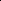

# Geometry-Aware Variational Information Maximization for Deep Incomplete Multi-view Clustering

<!-- Page 1 -->

Geometry-Aware Variational Information Maximization for Deep Incomplete

Multi-view Clustering

Wenlan Chen1, Lu Gao1, Daoyuan Wang1, Fei Guo1 *, Cheng Liang2 *

## 1 School of Computer Science and Engineering, Central South University 2 School of Information Science and Engineering,

Shandong Normal University 244701041@csu.edu.cn, 244711035@csu.edu.cn, 244701040@csu.edu.cn, guofei@csu.edu.cn, alcs417@sdnu.edu.cn

## Abstract

Incomplete multi-view clustering (IMVC) aims to group data into meaningful clusters when each sample is only partially observed across multiple views. Most existing methods either rely on imputation strategies that may introduce noise and distort the underlying data distribution, or adopt crossview alignment techniques that focus on pairwise relationships, often resulting in suboptimal representations and unstable clustering performance. In this paper, we propose Geometry-Aware Variational Information Maximization for Deep Incomplete Multi-view Clustering (GAVIM), a novel imputation-free variational framework that enables robust and coherent incomplete multi-view clustering. Specifically, GAVIM leverages mutual information maximization to preserve the high mutual information between the available multi-view data and the shared embedding. Moreover, we explicitly retain local geometric consistency within each viewspecific latent space under the guidance of an adaptive global supervision signal. Lastly, GAVIM aligns all views simultaneously using a Gramian representation alignment measure, ensuring coherent structure across modalities and promoting unified, semantically meaningful representations. Extensive experiments on five benchmark IMVC datasets with varying levels of view incompleteness demonstrate that GAVIM consistently outperforms state-of-the-art methods in clustering accuracy and representation quality.

## Introduction

Incomplete multi-view clustering (IMVC) aims to partition data into semantically meaningful clusters when multiple views are available but some views suffer from partial observations (Wen et al. 2024b; Liu et al. 2024; Chen et al. 2025). In contrast to conventional multi-view clustering, which presumes that all samples are fully observed across every view, IMVC addresses the more realistic scenario where such assumptions are frequently violated due to incomplete or partially aligned data (Hu and Chen 2019; Huang et al. 2020; Wen et al. 2024a; Xin et al. 2025). This incompleteness substantially degrades the performance of traditional multiview approaches, as the absence of cross-view correspondences undermines the learning of consistent and discriminative representations. To address these challenges, IMVC

*Corresponding authors. Copyright © 2026, Association for the Advancement of Artificial Intelligence (www.aaai.org). All rights reserved.

methods are primarily designed to: (1) alleviate information loss induced by incomplete observations by exploiting all accessible samples, rather than discarding those with missing views; (2) relax the assumption of strictly aligned sample pairs by effectively accommodating imperfect or absent cross-view correspondences; and (3) maintain cross-view semantic consistency and leverage the complementary information unique to each view to mitigate the impact of incomplete observations and improve both the integrity and discriminative capability of the learned representations.

Most existing IMVC methods rely on alignment strategies, which can be broadly divided into four categories: distribution-level, prototype-level, feature-level and structure-level alignments. Distribution-level approaches match global latent distributions across views via Maximum Mean Discrepancy (MMD), adversarial learning, or variational autoencoder-based frameworks (Wang, Cui, and Li 2023; Xu et al. 2023; Zeng et al. 2024; Cai et al. 2024; Xu et al. 2024; Gao and Pu 2025). Prototype-level methods align cluster centroids or representative prototypes to enforce semantic consistency (Li et al. 2023; Jin et al. 2023; Yuan et al. 2024, 2025). Feature-level approaches, often based on contrastive learning, leverage paired samples to enhance cross-view correspondence (Xu et al. 2022; Tang and Liu 2022; Lin et al. 2021; Zhang et al. 2025; Chao et al. 2025). Structure-level alignment aims to preserve and match local neighborhoods or graph structures across views to capture richer geometric and semantic relations (Wen et al. 2023; Wang et al. 2024; Pu et al. 2024; Du et al. 2024). Despite their effectiveness, these methods typically rely on strong assumptions, such as accurate prototype estimation, strict one-to-one correspondences, or clean pre-constructed graphs. In the presence of missing data or noise, these assumptions are often violated which leads to degraded alignment quality and suboptimal clustering performance.

To address these challenges, we propose GAVIM. The overall framework of GAVIM is illustrated in Fig. 1. Firstly, we optimize a variational Evidence Lower Bound (ELBO) objective to jointly infer view-specific latent variables and a shared embedding, which enables the integration of partially observed views into a coherent latent representation without relying on imputation. Next, we derive an adaptive supervisory signal directly from the global representation structure in the latent space to dynamically preserve the local proxim-

The Fortieth AAAI Conference on Artificial Intelligence (AAAI-26)

20289

<!-- Page 2 -->

**Figure 1.** Framework of the GAVIM model. The proposed GAVIM model consists of three key components: a variational ELBO objective with mutual information maximization, local proximity preservation and Gramian volume minimization.

ity across views by minimizing a composite objective comprising a global negative neighborhood entropy regularization, a cross-view similarity matching term and a connection balancing term. Finally, we introduce a Gramian volume minimization strategy that reduces the volume spanned by modality-specific embeddings and the shared representation to simultaneously align all modalities for each sample and enhances the discriminative power of the learned features. This work makes the following key contributions:

• We propose a novel ELBO objective tailored for incomplete multi-view data, where we impose mutual information maximization to retain the high mutual information between existing multi-view data samples and common latent representations. • We propose an adaptive structural regularization for local proximity preservation and design Gramian volume minimization to align all modalities simultaneously, enhancing both the local geometric consistency among samples and the global geometric alignment across modalities. • Extensive experiments on five benchmark datasets demonstrate the effectiveness of our proposed model, which achieves superior performance over most of ten state-of-the-art deep multi-view incomplete clustering methods under various missing data scenarios.

Related Works Most incomplete multi-view clustering methods can be grouped into four alignment strategies. Distribution-level alignment seeks to match global latent distributions across views. For example, MVP (Gao and Pu 2025) aligns views by establishing inter-view correspondences in the latent space via variable permutations and cyclic posterior regularization, while DVIMC (Xu et al. 2024) integrates viewspecific latent posteriors using a Product-of-Experts (PoE) aggregation with a coherence loss that enforces consistency between the aggregated and individual posteriors. Prototype-level alignment focuses on aligning cluster prototypes or centroids across views. For instance, RPCIC (Yuan et al. 2024) employs cross-view contrastive learning to obtain consistent feature representations and introduces a robust prototype discriminative loss to counteract noisy prototype correspondences. Likewise, CPSPAN (Jin et al. 2023) aligns partially paired samples across views and further matches prototype sets through optimal transport-based permutation. Feature-level alignment targets the alignment of feature representations, typically using contrastive learning or paired-sample matching. For example, DSIMVC (Tang and Liu 2022) aligns features by imputing missing views from semantic neighbors and adaptively weighting them to mitigate semantic inconsistencies, whereas DIMVC (Xu et al. 2022) achieves alignment by transferring complementary cluster information-derived via high-dimensional nonlinear mapping into supervisory signals for consistent clustering. Structure-level alignment emphasizes preserving and harmonizing local neighborhood or graph structures across views. For example, HCLS CGL (Wen et al. 2023) con-

20290

AI-readable visual equivalent, added: Figure extracted from the paper PDF and converted to an SVG wrapper asset. Use the surrounding page text and caption for interpretation.

<!-- Page 3 -->

structs a consensus graph guided by a confidence graph built from nearest-neighbor similarities to capture robust intrinsic structures, while FSIMVC-OF (Du et al. 2024) enhances clustering-friendly structures by applying optimal graph filtering on bipartite graphs with linear computational complexity.

## Methods

Problem Definition

Given the incomplete multi-view dataset as X =

Xv ∈RN×dv V v=1, where V denotes the number of views. Each Xv contains a subset of the total N distinct samples, with nv ≤N observed samples in the v-th view. The i-th row of Xv, denoted as xv i ∈Rdv, corresponds to the feature vector of the i-th sample existing in v-th view. For simplicity, we denote a general feature vector from the v-th view as xv and we write {xv} as a shorthand for the multi-view observation {xv}V v=1. Correspondingly, a binary indicator matrix R ∈{0, 1}N×V is introduced, where each entry Riv is defined as 1 if the i-th sample is observed in view v, and 0 otherwise. The objective of IMVC is to partition all N samples into K clusters by jointly exploiting the available information across all X while addressing the challenge of view incompleteness without discarding partially observed samples.

Multi-View VAEs with Mutual Information Maximization

To accommodate incomplete multi-view data and model the underlying structure shared across views with information maximization, we extend the standard variational inference framework to a variationally inspired objective. Specifically, we assume a latent representation z ∈Rd that captures the common semantics of each sample across views. To make the model concrete, we outline the generative process by which each view is modeled from the latent variable, followed by the inference process that estimates the posterior from partially observed views. Generative Process. We postulate that a latent variable z ∼ p(z) governs the generation of all views. Conditioned on z, each view xv is generated independently from a conditional distribution pθv(xv | z). This yields the joint distribution:

pθ({xv}, z) = p(z)

VY v=1 pθv(xv | z), (1)

where p(z) is typically chosen as the standard Gaussian prior (p(z) ∼ N(0, I)). Each conditional distribution pθv(xv | z) = N(xv | µxv, σ2 xvI) has parameters µxv, σ2 xv

= g(z; θv), where g(·; θv) denotes a neural network that maps the latent variable z to the mean and variance of the v-th view’s observation distribution. Inference Process. Since the true posterior p(z | {xv}) is generally intractable, we employ variational inference with an approximate posterior qϕ(z | {xv}) that can handle arbitrary missing-view patterns. For each view v, we adopt a Gaussian encoder qϕv(z | xv) = N(z | µv, σ2 vI) where µv, σ2 v

= f(xv; ϕv) are derived from the available observations. We fuse view-specific posteriors via the Wasserstein barycenter (Qiu et al. 2025), smoothing fusion under partially observed views and empirically outperforming PoE/Mixture of Experts (MoE):

qϕ(z | {xv}) = N(z | µ, σ2I), (2)

with the aggregated mean and variance are given by µ = 1 PV v=1 rv

V X v=1 rvµv, σ = 1 PV v=1 rv

V X v=1 rvσv, (3)

where r ∈{0, 1}V is the binary mask vector from R which indicates the presence of each view. The joint inference variational distribution is then qϕ(z, {xv}) = pD({xv})qϕ(z | {xv}), (4)

where pD({xv}) is the empirical data distribution. Variational Lower Bound. Given the joint generative distribution in Eq. (1) and the joint variational distribution in Eq. (4), maximizing the marginal likelihood of the observations leads to the following ELBO:

LELBO = EpD({xv})qϕ(z|{xv}) log pθ({xv}, z)

qϕ(z, {xv})

= −DKL(qϕ(z)∥p(z)) −Eqϕ(z) [DKL(qϕ({xv} | z)∥pθ({xv} | z))].

(5) The above ELBO suffers from two key limitations: it often prioritizes data reconstruction at the expense of accurate posterior inference when data dimensionality {dv}V v=1 greatly exceeds latent dimensionality d. Meanwhile, powerful decoders can ignore latent variables altogether which results in minimal mutual information between input and latent code. Inspired by (Zhao, Song, and Ermon 2019) and (Higgins et al. 2017), we refine the ELBO by applying a coefficient λ to strengthen the alignment between the aggregated posterior qϕ(z) and the prior p(z). This adjustment serves as a regularization that balances reconstruction and latent representation learning. We further incorporate a mutual information regularization term γIq({xv}; z), where γ is a trade-off coefficient that controls the strength of mutual information maximization. This term encourages the latent code z to capture informative and discriminative features from the inputs {xv}, thus mitigating information collapse. This design alleviates information collapse and improves inference fidelity. Eq. (5) can be reformulated as:

LELBO = −λDKL(qϕ(z)∥p(z)) + γIq({xv}; z)

−Eqϕ(z) [DKL(qϕ({xv} | z)∥pθ({xv} | z))]

= EpD({xv})Eqϕ(z|{xv}) [pθ({xv} | z)]

−(λ + γ −1)DKL(qϕ(z)∥p(z)) −(1 −γ)EpD({xv})DKL(qϕ(z | {xv})∥p(z)),

(6) The detailed derivation of Eq. (6) is provided in the supplementary material A.1. The first term corresponds to the reconstruction loss, which enforces accurate reconstruction

20291

<!-- Page 4 -->

from the latent variable z. The weighted marginal KL divergence DKL(qϕ(z)∥p(z)) regulates the global latent distribution which promotes better generalization and prevents overfitting to individual samples. In practice, this regularization is computed via MMD, as detailed in the supplementary material A.2. The standard sample-wise KL divergence DKL(qϕ(z | {xv})∥p(z)) ensures each posterior remains close to the prior and promotes stable and generalizable latent representations. Thus, the model effectively generates samples while ensuring that variational inference remains faithful to our proposed assumptions.

Global Supervision for Local Proximity Preservation As demonstrated in the previous subsection, the ELBO objective facilitates the inference of both view-specific latent representations and a shared latent embedding z by integrating incomplete multi-view information. However, in the absence of explicit structural regularization, the learned latent spaces across views may remain geometrically inconsistent. To address this issue, we introduce a soft structural constraint that promotes geometric consistency by enforcing uniformity between view-specific and globally shared neighborhood structures. To guide these view-specific distributions toward a semantically coherent structure, we construct a shared probabilistic neighborhood distribution ˜p(j | i) from the aggregated embedding z. Unlike predefined supervision signals (e.g., fixed labels or static affinity graphs),

˜p(j | i) is adaptively derived from the data-driven latent space, which enables flexible neighborhood definitions that reflect the intrinsic geometry of the representation. This adaptivity mitigates the bias introduced by rigid supervision and allows the model to better preserve local semantics. In particular, ˜p(j | i) integrates not only direct relations but also multi-hop semantic dependencies, leading to a denser and more informative supervisory signal. This walk-based neighborhood expansion enriches the structural context and improves the robustness of representation learning across incomplete views. Formally, we define:

˜p(j | i) =

PH h=0(S[h])ij P j∈H(i)

PH h=0(S[h])ij + ε

. (7)

Here, S ∈{0, 1}N×N is a binary adjacency matrix constructed from the k-nearest neighbor graph over z:

Sij =

1, if j ∈Nk(i), 0, otherwise, (8)

where Nk(i) denotes the top-k neighbors of node i measured by the Gaussian kernel similarity exp

−∥zi−zj∥2

2 2κ2

, where κ controls the bandwidth. S0 = I encodes self-loops and the summation over S[h] aggregates connectivity up to Hhop neighborhoods. H(i) denotes the set of nodes reachable from node i with in H hops in the graph. The constant ε ensures numerical stability. As constructed, ˜p(j | i) ≥0 and P j ˜p(j | i) = 1, satisfying the properties of a valid conditional probability distribution.

Regarding each view v, we obtain the view-specific latent representations zv by encoding the observed data xv via the approximate posterior qϕv(z | xv). Based on these representations, we define a view-specific probabilistic neighborhood distribution qv(j | i) as a softmax over negative euclidean distance:

qv(j | i) = exp(Sv ij) P m exp(Sv im), (9)

where Sv ij = − zv i −zv j

2

2, j ∈H(i). This definition ensures that qv(j | i) ≥0 and P j qv(j | i) = 1, making it a valid conditional probability distribution. An alignment loss is introduced to minimize the divergence between the global neighborhood distribution ˜p(j | i) and its viewspecific counterpart qv(j | i):

Llocal =

X v

X i

DKL(˜p(j | i)∥qv(j | i)). (10)

By substituting the softmax definition from Eq. (9), we obtain:

Llocal = V

X ij

˜p(j | i) log ˜p(j | i) −

X v

X ij

˜p(j | i)Sv ij

+

X vi log

X m exp(Sv im).

(11) The three components respectively correspond to the negative entropy of the global distribution, the neighborhood preservation term aligning view-specific similarities with the global structure and a log-sum-exp normalization term acting as a regularizer to prevent the neighborhood probabilities from collapsing onto a few dominant nodes. Together, these terms ensure balanced neighborhood assignments and avoid over-concentration of connections, which stabilizes learning and improves clustering quality.

Simultaneous Multiview Alignment via Gramian Volume Minimization The global supervision for local proximity preservation provides a structural backbone that guides local consistency across views by capturing pairwise relationships among samples. To inject richer semantic characteristics into the learned embeddings and simultaneously unify the sample representation of all views, we enforce the geometric alignment between all modalities directly in a higherdimensional space by adopting the Gramian representation alignment measure instead of the traditional pairwise contrastive paradigm. Theorem 1 (Gramian Volume-based Multiview Alignment). Let Zi = {z1 i, z2 i,..., zV i, zi} ⊂Rd denote the set of normalized latent vectors corresponding to sample i, where zv i is the normalized representation from modality v and zi is the normalized shared latent representation. Let Zi = [z1 i, z2 i,..., zV i, zi] ∈Rd×(V +1) be the column-wise concatenation of these vectors, and define the Gram matrix Gi = Z⊤ i Zi. The volume of the parallelotope spanned by the columns of Zi is given by

Vol(Zi) = p det(Gi). (12)

20292

<!-- Page 5 -->

A detailed justification is provided in the supplementary materials A.3. Based on the Theorem 1, we define the volume-based contrastive loss as follows:

Lvol = −1

B

B X i=1 log exp

−Vol(zi, {zVi i }) / τ

PB j=1 exp

−Vol(zj, {zVi i }) / τ

−1

B

B X i=1 log exp

−Vol(zi, {zVi i }) / τ

PB j=1 exp

−Vol(zi, {zVj j }) / τ

.

(13) Here, B is the batch size, and τ > 0 is a temperature hyperparameter. The sets Vi and Vj denote the available modalities for samples i and j, respectively. This dual-volume contrastive loss consists of two symmetric terms. The first term minimizes the volume of positive pairs (same fused anchor with its own views) contrasted against other anchors, while the second term contrasts the same anchor against other view combinations. Through this bidirectional contrastive mechanism, the loss contributes richer and more precise semantic integration at the sample level.

Overall Loss After presenting all components of the proposed framework, we now summarize the final training objective, which integrates the key terms defined in Eqs (6), (11) and (13). The overall loss function is given by:

Ltotal = −LELBO + α Llocal + β Lvol, (14)

where the hyperparameters α and β control the relative influence of the alignment and volume regularizers, respectively. The complete optimization procedure is detailed in the supplementary materials B.1.

## Experiments

## Experimental Setup

Datasets, Evaluation Metrics and Baselines. We conduct experiments on five benchmark datasets, including CUB (Welinder et al. 2010), Caltech7-5V (Li et al. 2015), Handwritten (Van Breukelen et al. 1998), Scene-15 (He et al. 2024) and CCV (Jiang et al. 2011). Detailed dataset statistics are provided in the supplementary materials. To ensure fair and comprehensive evaluation, we adopt three widely used clustering metrics: Clustering Accuracy (ACC), Normalized Mutual Information (NMI) and Adjusted Rand Index (ARI). We compare our method with ten state-of-the-art incomplete multi-view clustering approaches, including COMPLETER (Lin et al. 2021), DIMVC (Xu et al. 2022), DSIMVC (Tang and Liu 2022), APADC (Xu et al. 2023), CPSPAN (Jin et al. 2023), DVIMC (Xu et al. 2024), RPCIC (Yuan et al. 2024), PMIMC (Yuan et al. 2025), DCG (Zhang et al. 2025) and MVP (Gao and Pu 2025). To thoroughly assess clustering performance under varying degrees of view incompleteness, we evaluate all methods across datasets under four missing rates: η ∈{0.1, 0.3, 0.5, 0.7}. Specifically, for each missing rate η, we randomly select N×η samples from a dataset containing N samples with V views. For each selected sample, we randomly remove between 1 and V −1 views, ensuring that at least one view remains observable.

Implementation Details. All experiments are conducted on a local server running Ubuntu 18.04, equipped with an NVIDIA GeForce RTX 2080Ti GPU and 64 GB of RAM. For all datasets, the batch size is set to 512. The encoder network follows a four-layer fully connected architecture with the structure dv–512–1024–512–d, where dv represents the input dimension of each view and the latent dimension d is fixed at 10. ReLU activation is applied to all hidden layers and the decoder mirrors the encoder structure in reverse. Both the pretraining and training stages use the Adam optimizer, with initial learning rates of 0.001 and 0.0005, respectively. A StepLR scheduler reduces the learning rate by a factor of 0.5 every 20 epochs. Each stage runs for 100 epochs. During pretraining, only the negative evidence lower bound (−LELBO) is used as the optimization objective. During training, the global supervision distribution

˜p(j | i) is updated every 10 epochs. The balancing coefficient λ is chosen from the set {2, 5, 10}, while γ is fixed at 0.01. The bandwidth of the Gaussian kernel is set such that 2κ2 = 1. The number of nearest neighbors k is fixed at 3 and the random walk hop count H is set to 2. The temperature parameter τ is fixed at 0.05. The trade-off coefficient α is selected from the set {10, 100}, while β is fixed at 0.01. Experiments are repeated five times on average. Code: https://github.com/LiangSDNULab/GAVIM.

## Experimental Results and Analysis

To comprehensively evaluate our method, we report clustering performance on five benchmark datasets under four missing rates. As shown in Table 1, the proposed method consistently achieves the best or second-best performance across all datasets and metrics, which highlights its strong effectiveness in handling incomplete multi-view data. For example, on datasets such as CUB and Handwritten, GAVIM consistently outperforms strong baselines like MVP and PMIMC. As the missing rate increases, most competing methods experience a noticeable decline in clustering performance, reflecting their limited robustness in sparse-view scenarios. In contrast, GAVIM shows greater resilience, maintaining comparatively stable performance even under high levels of view incompleteness. The effectiveness and robustness can be attributed to GAVIM’s principled architecture. Specifically, the proposed ELBO objective incorporates mutual information maximization to preserve high informational fidelity between the observed inputs and the shared latent representation, enabling more efficient utilization of incomplete multi-view data. Moreover, the model leverages a structural regularization strategy to maintain local geometric consistency, alongside a Gramian volume minimization mechanism that fosters coherent global alignment across multiple views. In summary, the experimental results confirm the strong effectiveness and robustness of GAVIM. Its consistently superior performance across diverse datasets and varying degrees of view incompleteness demonstrates the strength of its variational framework and underscores its applicability to real-world multi-view clustering tasks.

20293

<!-- Page 6 -->

Missing Rates 0.1 0.3 0.5 0.7 Metrics ACC NMI ARI ACC NMI ARI ACC NMI ARI ACC NMI ARI

CUB

COMPLETER 52.97 65.47 45.98 60.73 68.88 52.78 51.90 61.84 45.11 19.43 17.37 0.73 DIMVC 66.03 61.70 48.96 57.20 56.00 41.25 60.65 55.75 42.81 56.08 51.07 36.65 DSIMVC 72.93 67.82 55.89 66.83 61.78 47.71 68.37 61.55 48.21 67.33 59.89 46.31 APADC 61.93 63.79 43.55 64.23 63.28 46.24 59.70 62.17 44.11 50.33 54.49 35.33 CPSPAN 58.77 62.27 45.35 61.30 64.21 48.93 60.07 64.18 46.42 58.60 62.16 45.23 DVIMC 44.53 41.83 23.78 43.37 45.18 28.29 39.57 34.39 20.52 39.47 36.71 22.41 RPCIC 71.37 70.50 57.24 67.50 67.60 54.28 59.43 60.98 44.52 58.53 61.14 45.14 PMIMC 71.67 70.82 57.84 75.03 72.31 59.99 73.50 69.19 57.82 69.17 66.42 54.17 DCG 74.57 72.11 59.77 71.38 67.82 55.70 68.98 66.30 53.33 62.87 60.97 45.83 MVP 78.67 77.67 66.73 74.97 73.09 61.35 74.20 71.40 59.11 66.53 63.11 50.59 GAVIM 79.93 79.66 69.79 77.10 76.55 64.70 75.80 72.21 60.23 71.10 67.96 54.28

Caltech7-5V

COMPLETER 64.30 63.60 45.60 54.20 50.31 33.10 45.21 37.91 20.80 34.61 25.01 14.40 DIMVC 83.41 73.51 70.11 79.81 67.71 64.30 76.00 60.51 57.60 71.51 55.01 51.60 DSIMVC 76.50 67.21 60.11 78.11 67.00 61.41 72.90 61.71 54.11 62.11 53.00 43.01 APADC 61.20 61.40 46.41 60.90 61.00 45.70 55.01 54.01 35.81 53.90 50.10 32.81 CPSPAN 84.07 74.68 71.12 84.00 74.20 69.79 77.29 69.49 65.80 79.71 72.11 70.14 DVIMC 89.51 81.20 78.61 88.61 79.81 77.41 86.81 76.41 74.61 84.40 73.01 70.71 RPCIC 79.81 72.46 66.67 76.47 68.81 61.65 49.74 49.40 33.52 64.79 58.53 48.91 PMIMC 88.17 80.77 79.45 87.63 79.97 77.36 85.39 76.85 74.22 85.99 77.58 73.98 DCG 56.98 48.14 38.45 57.56 49.10 39.68 54.34 43.46 35.04 55.19 44.14 36.44 MVP 79.59 71.67 67.41 75.83 67.63 62.60 73.56 64.29 59.43 76.71 65.37 61.32 GAVIM 90.58 82.69 80.71 88.94 79.94 77.62 88.03 78.84 76.36 86.64 76.73 74.06

Handwritten

COMPLETER 82.18 77.73 68.92 78.70 69.08 58.14 74.73 67.49 50.21 68.86 62.41 41.06 DIMVC 89.13 80.06 77.96 85.24 74.67 70.83 82.76 71.17 66.81 79.66 68.94 63.12 DSIMVC 81.27 79.47 71.59 81.82 80.27 73.36 81.39 79.23 71.88 77.38 74.80 66.84 APADC 79.45 79.19 70.46 66.35 73.01 50.73 79.35 81.55 72.60 57.03 65.26 51.90 CPSPAN 80.30 78.43 71.84 79.80 79.08 72.28 84.64 80.23 75.34 83.90 80.60 75.25 DVIMC 87.89 83.51 79.66 85.36 82.82 78.50 85.01 82.96 78.50 81.66 80.78 74.85 RPCIC 90.86 83.15 81.15 87.25 80.91 76.87 82.36 76.93 71.17 77.59 74.74 67.01 PMIMC 90.55 83.62 80.96 81.87 79.68 73.31 82.88 80.04 74.39 80.43 78.12 71.18 DCG 72.69 74.66 63.21 77.10 75.55 66.37 69.65 70.78 59.62 75.93 70.96 63.22 MVP 90.55 87.08 84.46 88.69 84.86 81.59 90.76 85.44 83.53 86.74 82.56 78.75 GAVIM 94.79 89.21 88.86 93.69 86.97 86.59 93.56 86.84 86.34 92.42 84.71 84.06

Scene-15

COMPLETER 37.00 41.89 23.60 40.04 42.41 24.22 36.64 38.99 19.70 35.37 37.05 17.58 DIMVC 42.51 41.53 24.45 40.37 38.57 20.84 40.17 35.95 20.59 36.01 32.57 16.29 DSIMVC 29.43 30.38 14.86 31.38 32.54 16.29 27.24 28.68 13.38 28.42 29.09 13.85 APADC 40.90 42.00 24.60 39.90 40.50 23.00 39.00 38.90 22.20 38.60 37.90 21.80 CPSPAN 42.69 38.79 24.56 43.21 39.42 24.94 43.44 39.19 24.96 42.53 38.41 24.38 DVIMC 45.16 45.06 28.64 43.68 42.32 26.68 41.13 39.58 25.03 39.59 36.66 21.56 RPCIC 37.25 35.83 21.08 39.89 40.76 23.85 37.07 40.52 22.06 35.00 38.22 20.81 PMIMC 32.52 33.37 17.32 38.18 40.33 22.20 40.67 42.02 23.52 40.79 42.19 23.91 DCG 37.34 41.04 22.10 38.23 40.97 22.43 35.92 40.86 21.61 35.83 39.05 20.46 MVP 45.70 43.77 27.90 45.81 42.54 27.53 45.28 41.84 26.80 43.14 39.53 24.68 GAVIM 48.09 44.20 30.02 47.92 42.97 29.67 46.62 42.52 27.61 45.00 40.08 25.90

CCV

COMPLETER 20.32 19.73 5.96 20.43 17.32 3.71 19.64 16.41 4.89 18.40 14.77 6.17 DIMVC 22.09 20.66 8.30 19.72 17.40 6.72 17.96 16.32 5.98 16.98 13.18 4.98 DSIMVC 19.74 18.02 7.73 18.71 16.34 6.75 19.61 16.59 6.89 18.59 15.02 6.33 APADC 15.19 14.31 4.71 14.59 13.15 4.45 12.31 8.43 2.53 10.66 5.24 1.28 CPSPAN 14.82 14.99 4.66 18.80 16.18 5.90 17.53 15.78 5.78 17.17 14.91 5.39 DVIMC 17.22 11.78 3.61 16.15 11.87 3.12 14.69 10.25 1.22 14.81 8.45 1.60 RPCIC 19.47 18.60 6.93 14.51 10.78 3.58 13.21 9.26 2.97 14.44 10.02 3.49 PMIMC 15.37 12.18 4.03 15.93 12.95 4.60 17.82 14.37 5.31 15.03 12.20 4.05 DCG 19.52 17.13 7.10 17.50 15.11 5.75 18.25 14.10 6.13 17.53 12.89 5.44 MVP 23.25 20.86 7.62 21.94 19.24 6.88 22.97 19.02 7.17 20.13 17.12 6.36 GAVIM 23.46 21.65 9.41 22.56 18.30 7.90 21.79 17.15 7.34 21.07 17.25 6.69

**Table 1.** Clustering performance comparison across five datasets under four different missing rates. The best results are highlighted in bold, while the second-best results are underlined.

20294

<!-- Page 7 -->

Datasets CUB Caltech7-5V Handwritten Scene-15 CCV LELBO Llocal Lvol NMI ARI NMI ARI NMI ARI NMI ARI NMI ARI ✓ 60.68 47.07 75.28 72.74 76.88 72.25 31.66 19.07 15.35 5.32 ✓ ✓ 76.49 64.58 79.46 75.99 85.39 85.71 40.66 27.67 17.79 7.67 ✓ ✓ 68.89 55.36 75.31 73.82 77.27 72.86 33.37 21.17 16.19 6.15 ✓ ✓ ✓ 76.55 64.70 79.94 77.62 86.97 86.59 42.97 29.67 18.30 7.90

**Table 2.** Ablation study of different modules on five datasets with 0.3 missing rate.

**Figure 2.** ACC on CUB (a) and Caltech7-5V (b) under 0.7 missing rate, with varying trade-off coefficient α and β.

Ablation Study To evaluate the contribution of each loss component, we perform an ablation study on the neighborhood alignment loss (Llocal) and the volume-based contrastive loss (Lvol) under a missing rate of 0.3. The results are summarized in Table 2. We observe that the full model achieves the best clustering performance, which demonstrates the effectiveness of jointly leveraging structural and semantic information. Removing both losses results in a sharp performance drop, which confirms the necessity of proper cross-view alignment. Incorporating only the neighborhood alignment loss brings substantial gains, which emphasizes the importance of structural consistency for robust feature learning under missing views. The volume-based contrastive loss alone also yields moderate improvement by promoting semantic coherence. Together, the two losses are complementary: the former preserves local structure, while the latter enhances global semantic alignment, leading to significantly improved clustering under incomplete conditions.

Parameter Sensitivity Analysis We investigate the sensitivity of our model to the neighborhood alignment weight α and the Gramian volume minimization weight β. Figure 2 presents the ACC under a missing rate of 0.7 w.r.t α and β on two datasets: CUB and Caltech7-5V. The results show that the model exhibits robust performance across a wide range of parameter combinations. Specifically, ACC consistently improves as β decreases, suggesting that reducing the weight on sample-level semantic alignment improves generalization. In contrast, the impact of α is relatively smooth. Optimal performance is generally achieved when α lies in an intermediate range (e.g., α = 10). A small α causes the model to underuse structural cues, while excessively large α values may degrade performance slightly due to overfitting to noisy or spurious structural correlations. Overall, these findings under-

**Figure 3.** t-SNE visualization of the latent representations learned on the Handwritten dataset under 0.5 missing rate.

score the importance of balancing structural coherence with semantic consistency for stable and accurate performance.

Visualization Analysis

To further evaluate the quality of the learned representations, we apply t-SNE (Maaten and Hinton 2008) to visualize the latent representations obtained from the Handwritten dataset under a missing rate of 0.5. As shown in Figure 3, all methods form distinguishable clusters to some extent. However, methods such as DVIMC and PMIMC produce overlapping or scattered clusters, while DCG incorrectly splits samples from the same class into separate groups. In contrast, our model achieves tighter intra-class compactness and clearer inter-class separation, with significantly fewer misclustered or ambiguous points. A key contributor to our model’s superior performance is the incorporation of structural alignment during training, which encourages semantically similar samples to be closely aligned and effectively enhances intraclass cohesion and inter-class separability. These visual results qualitatively support the robustness and discriminative power of our method, which is consistent with the quantitative improvements observed in previous sections.

## Conclusion

In summary, GAVIM tackles incomplete multi-view clustering by jointly maximizing mutual information, preserving local geometric structures and enforcing Gramian-based cross-view alignment to learn coherent and discriminative embeddings. Experiments on benchmark datasets demonstrate that GAVIM delivers robust clustering performance and outperforms existing baselines under various rates of view incompleteness.

20295

AI-readable visual equivalent, added: Figure extracted from the paper PDF and converted to an SVG wrapper asset. Use the surrounding page text and caption for interpretation.

AI-readable visual equivalent, added: Figure extracted from the paper PDF and converted to an SVG wrapper asset. Use the surrounding page text and caption for interpretation.

<!-- Page 8 -->

## Acknowledgments

This work was supported by the National Natural Science Foundation of China (62372279, 62322215, 62532017), and the Natural Science Foundation of Shandong Province (ZR2025QB62, ZR2023MF119). This study was also supported in part by the High-Performance Computing Center of Central South University.

## References

Cai, H.; Huang, W.; Yang, S.; Ding, S.; Zhang, Y.; Hu, B.; Zhang, F.; and Cheung, Y.-M. 2024. Realize Generative Yet Complete Latent Representation for Incomplete Multi-View Learning. IEEE Transactions on Pattern Analysis and Machine Intelligence, 46(5): 3637–3652. Chao, G.; Xu, K.; Xie, X.; and Chen, Y. 2025. Global Graph Propagation with Hierarchical Information Transfer for Incomplete Contrastive Multi-view Clustering. In Proceedings of the AAAI Conference on Artificial Intelligence, volume 39, 15713–15721. Chen, H.; Xu, C.; Guan, Z.; Zhao, W.; and Liu, J. 2025. Biased Incomplete Multi-View Learning. Proceedings of the AAAI Conference on Artificial Intelligence, 39(15): 15767– 15775. Du, L.; Shi, Y.; Chen, Y.; Zhou, P.; and Qian, Y. 2024. Fast and Scalable Incomplete Multi-View Clustering with Duality Optimal Graph Filtering. In Proceedings of the 32nd ACM International Conference on Multimedia, MM ’24, 8893–8902. New York, NY, USA: Association for Computing Machinery. ISBN 9798400706868. Gao, X.; and Pu, J. 2025. Deep Incomplete Multi-view Learning via Cyclic Permutation of VAEs. In The Thirteenth International Conference on Learning Representations. He, C.; Zhu, H.; Hu, P.; and Peng, X. 2024. Robust Variational Contrastive Learning for Partially View-unaligned Clustering. In Proceedings of the 32nd ACM International Conference on Multimedia, MM ’24, 4167–4176. New York, NY, USA: Association for Computing Machinery. ISBN 9798400706868. Higgins, I.; Matthey, L.; Pal, A.; Burgess, C.; Glorot, X.; Botvinick, M.; Mohamed, S.; and Lerchner, A. 2017. beta- VAE: Learning Basic Visual Concepts with a Constrained Variational Framework. In International Conference on Learning Representations. Hu, M.; and Chen, S. 2019. One-Pass Incomplete Multi- View Clustering. In Proceedings of the AAAI Conference on Artificial Intelligence, volume 33, 3838–3845. Huang, Z.; Hu, P.; Zhou, J. T.; Lv, J.; and Peng, X. 2020. Partially View-aligned Clustering. In Larochelle, H.; Ranzato, M.; Hadsell, R.; Balcan, M.; and Lin, H., eds., Advances in Neural Information Processing Systems, volume 33, 2892– 2902. Curran Associates, Inc. Jiang, Y.-G.; Ye, G.; Chang, S.-F.; Ellis, D.; and Loui, A. C. 2011. Consumer video understanding: a benchmark database and an evaluation of human and machine performance. In Proceedings of the 1st ACM International Conference on Multimedia Retrieval, ICMR ’11. New York,

NY, USA: Association for Computing Machinery. ISBN 9781450303361. Jin, J.; Wang, S.; Dong, Z.; Liu, X.; and Zhu, E. 2023. Deep Incomplete Multi-View Clustering with Cross-View Partial Sample and Prototype Alignment. In 2023 IEEE/CVF Conference on Computer Vision and Pattern Recognition (CVPR), 11600–11609. Li, H.; Li, Y.; Yang, M.; Hu, P.; Peng, D.; and Peng, X. 2023. Incomplete Multi-view Clustering via Prototype-based Imputation. In Elkind, E., ed., Proceedings of the Thirty- Second International Joint Conference on Artificial Intelligence, IJCAI-23, 3911–3919. Main Track. Li, Y.; Nie, F.; Huang, H.; and Huang, J. 2015. Large-Scale Multi-View Spectral Clustering via Bipartite Graph. In Proceedings of the Twenty-Ninth AAAI Conference on Artificial Intelligence. Lin, Y.; Gou, Y.; Liu, Z.; Li, B.; Lv, J.; and Peng, X. 2021. COMPLETER: Incomplete Multi-view Clustering via Contrastive Prediction. In 2021 IEEE/CVF Conference on Computer Vision and Pattern Recognition (CVPR), 11169– 11178. Liu, S.; Zhang, J.; Wen, Y.; Yang, X.; Wang, S.; Zhang, Y.; Zhu, E.; Tang, C.; Zhao, L.; and Liu, X. 2024. Sample- Level Cross-View Similarity Learning for Incomplete Multi- View Clustering. In Proceedings of the AAAI Conference on Artificial Intelligence, volume 38, 14017–14025. Maaten, L. v. d.; and Hinton, G. 2008. Visualizing data using t-SNE. Journal of machine learning research, 9(Nov): 2579–2605. Pu, J.; Cui, C.; Chen, X.; Ren, Y.; Pu, X.; Hao, Z.; Yu, P. S.; and He, L. 2024. Adaptive Feature Imputation with Latent Graph for Deep Incomplete Multi-View Clustering. In Proceedings of the AAAI Conference on Artificial Intelligence, volume 38, 14633–14641. Qiu, P.; Zhu, W.; Kumar, S.; Chen, X.; Yang, J.; Sun, X.; Razi, A.; Wang, Y.; and Sotiras, A. 2025. Multimodal Variational Autoencoder: A Barycentric View. In Proceedings of the AAAI Conference on Artificial Intelligence, volume 39, 20060–20068. Tang, H.; and Liu, Y. 2022. Deep Safe Incomplete Multiview Clustering: Theorem and Algorithm. In Chaudhuri, K.; Jegelka, S.; Song, L.; Szepesv´ari, C.; Niu, G.; and Sabato, S., eds., International Conference on Machine Learning, ICML 2022, 17-23 July 2022, Baltimore, Maryland, USA, volume 162 of Proceedings of Machine Learning Research, 21090– 21110. PMLR. Van Breukelen, M. W.; Duin, R.; Tax, D.; and den Hartog, J. 1998. Handwritten digit recognition by combined classifiers. Kybernetika, 34(4): 381–386. Wang, X.; Gao, H.; Wei, X.; Peng, L.; Li, R.; Liu, C.; Wu, S.; and Wong, H.-S. 2024. Contrastive Graph Distribution Alignment for Partially View-Aligned Clustering. In ACM Multimedia, 5240–5249. Wang, Y.; Cui, Z.; and Li, Y. 2023. Distribution-Consistent Modal Recovering for Incomplete Multimodal Learning. In 2023 IEEE/CVF International Conference on Computer Vision (ICCV), 21968–21977.

20296

<!-- Page 9 -->

Welinder, P.; Branson, S.; Mita, T.; Wah, C.; Schroff, F.; Belongie, S.; and Perona, P. 2010. Caltech–UCSD Birds-200-2011 Dataset. Technical Report CNS-TR-2010-001, California Institute of Technology.

Wen, J.; Deng, S.; Wong, W.; Chao, G.; Huang, C.; Fei, L.; and Xu, Y. 2024a. Diffusion-based Missing-view Generation With the Application on Incomplete Multi-view Clustering. In Forty-first International Conference on Machine Learning.

Wen, J.; Liu, C.; Xu, G.; Wu, Z.; Huang, C.; Fei, L.; and Xu, Y. 2023. Highly Confident Local Structure Based Consensus Graph Learning for Incomplete Multi-view Clustering. In 2023 IEEE/CVF Conference on Computer Vision and Pattern Recognition (CVPR), 15712–15721.

Wen, J.; Xu, G.; Tang, Z.; Wang, W.; Fei, L.; and Xu, Y. 2024b. Graph Regularized and Feature Aware Matrix Factorization for Robust Incomplete Multi-View Clustering. IEEE Transactions on Circuits and Systems for Video Technology, 34(5): 3728–3741.

Xin, L.; Yang, W.; Wang, L.; and Yang, M. 2025. Multilevel Reliable Guidance for Unpaired Multiview Clustering. IEEE Transactions on Neural Networks and Learning Systems, 1– 15.

Xu, G.; Wen, J.; Liu, C.; Hu, B.; Liu, Y.; Fei, L.; and Wang, W. 2024. Deep Variational Incomplete Multi-View Clustering: Exploring Shared Clustering Structures. In Proceedings of the AAAI Conference on Artificial Intelligence, volume 38, 16147–16155.

Xu, J.; Li, C.; Peng, L.; Ren, Y.; Shi, X.; Shen, H. T.; and Zhu, X. 2023. Adaptive Feature Projection With Distribution Alignment for Deep Incomplete Multi-View Clustering. IEEE Transactions on Image Processing, 32: 1354–1366.

Xu, J.; Li, C.; Ren, Y.; Peng, L.; Mo, Y.; Shi, X.; and Zhu, X. 2022. Deep Incomplete Multi-View Clustering via Mining Cluster Complementarity. Proceedings of the AAAI Conference on Artificial Intelligence, 36(8): 8761–8769.

Yuan, H.; Lai, S.; Li, X.; Dai, J.; Sun, Y.; and Ren, Z. 2024. Robust Prototype Completion for Incomplete Multiview Clustering. In Proceedings of the 32nd ACM International Conference on Multimedia, MM ’24, 10402–10411. New York, NY, USA: Association for Computing Machinery. ISBN 9798400706868.

Yuan, H.; Sun, Y.; Zhou, F.; Wen, J.; Yuan, S.; You, X.; and Ren, Z. 2025. Prototype Matching Learning for Incomplete Multi-View Clustering. IEEE Transactions on Image Processing, 34: 828–841.

Zeng, P.; Yang, M.; Lu, Y.; Zhang, C.; Hu, P.; and Peng, X. 2024. Semantic Invariant Multi-View Clustering With Fully Incomplete Information. IEEE Transactions on Pattern Analysis and Machine Intelligence, 46(4): 2139–2150.

Zhang, Y.; Lin, Y.; Yan, W.; Yao, L.; Wan, X.; Li, G.; Zhang, C.; Ke, G.; and Xu, J. 2025. Incomplete Multi-view Clustering via Diffusion Contrastive Generation. In Proceedings of the AAAI Conference on Artificial Intelligence, volume 39, 22650–22658.

Zhao, S.; Song, J.; and Ermon, S. 2019. InfoVAE: Balancing Learning and Inference in Variational Autoencoders. In Proceedings of the AAAI Conference on Artificial Intelligence, volume 33, 5885–5892.

20297
