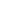

# Graph Domain Adaptation via Homophily-Agnostic Reconstructing Structure

<!-- Page 1 -->

Graph Domain Adaptation via Homophily-Agnostic Reconstructing Structure

Ruiyi Fang1, Shuo Wang2, Ruizhi Pu1*, Qiuhao Zeng1, Hao Zheng3, Ziyan Wang1, Jiale Cai1,

Zhimin Mei1, Song Tang4, Charles Ling1, Boyu Wang1

## 1 Department of Computer Sceince, Western University 2 School of Computer Science and Engineering, University of Electronic

Science and Technology of China 3 School of Computer Science and Engineering, Central South University 4 Institute of Machine Intelligence, University of Shanghai for Science and Technology

## Abstract

Graph Domain Adaptation (GDA) transfers knowledge from labeled source graphs to unlabeled target graphs, addressing the challenge of label scarcity. However, existing GDA methods typically assume that both source and target graphs exhibit homophily, leading existing methods to perform poorly when heterophily is present. Furthermore, the lack of labels in the target graph makes it impossible to assess its homophily level beforehand. To address this challenge, we propose a novel homophily-agnostic approach that effectively transfers knowledge between graphs with varying degrees of homophily. Specifically, we adopt a divide-and-conquer strategy that first separately reconstructs highly homophilic and heterophilic variants of both the source and target graphs, and then performs knowledge alignment separately between corresponding graph variants. Extensive experiments conducted on five benchmark datasets demonstrate the superior performance of our approach, particularly highlighting its substantial advantages on heterophilic graphs.

## Introduction

Graphs are pervasive and have been widely used in numerous real-world scenarios, such as social networks, traffic networks, and recommendation systems (Liu et al. 2021). However, they are often constrained by label scarcity, as annotating structured data remains challenging and costly (Zhang et al. 2019a; Liu et al. 2022). To address this challenge, graph domain adaptation (GDA) has emerged as an effective paradigm for transferring knowledge from labeled source graphs to an unlabeled target graph. Existing GDA methods built on traditional GNNs typically rely on message passing mechanisms that assume homophily (Wu et al. 2020; Xie et al. 2023). Facing heterophilic graphs, existing approaches mainly suffer from two limitations. Firstly, the local neighbors in a graph are nodes that are proximally located, while semantically similar nodes might be far apart on a heterophilic graph (Zhu et al. 2020). Thus, existing methods struggle to capture long-range divergence from distant nodes and to distinguish between homophilic and heterophilic neighbors, which convey different label information, leading to the fact that they perform well on

*Corresponding author Copyright © 2026, Association for the Advancement of Artificial Intelligence (www.aaai.org). All rights reserved.

Class 1

Class 2

Source graph Target graph

Unlabeled

Graph Domain

Adaptation

There is no labels to judge graph is homophilic or heterophilic

Not able to evaluate graph homophily discrepancy

**Figure 1.** Illustration of the graph domain adaptation task (best viewed in color). Given a labeled source graph (color indicates node label) and an unlabeled target graph, there are no labels for us to judge whether the target graph is homophilic or heterophilic.

homophilic graphs often exhibit degraded performance on heterophilic graphs (Fang et al. 2025a).

Some graph clustering methods have been proposed to deal with heterophily by expanding neighbor fields(?He et al. 2021; Luan et al. 2021; Wang and Zhang 2022) or refining the GNN architectures(Bo et al. 2021; Yang et al. 2021). Though the aforementioned methods can not be direct used in GDA due to there exists two critical problems: 1) The training of customized network, the learning of adaptive filter, and graph rewiring (Bi et al. 2022) rely on labeled samples, which makes them not be applicable to unsupervised GDA task (as shown in Fig. 1). 2) The above methods process graph signals could damaging entanglement of homophilic and heterophilic information hinders their ability to mitigate distributional divergence (Fang et al. 2025b).

For unsupervised GDA, the first and foremost challenge we face is that there is no labels for us to judge whether a graph is homophilic or heterophilic. Therefore, it is not practical to develop individual models to handle homophilic and heterophilic graphs separately for GDA. Moreover, it is also subjective to simply classify a graph as homophilic or heterophilic since real-world graph data

The Fortieth AAAI Conference on Artificial Intelligence (AAAI-26)

21047

<!-- Page 2 -->

Source graph

Target graph

𝑮𝑺

𝑮𝑻

𝑿𝑺

𝑿𝑻

Adaptive Filter

𝒁𝑶

𝑺

𝒁𝑬

𝑺

𝒁𝑬

𝑻

𝒁𝑶

𝑻

Structure Reconstruction

𝒁𝑶

𝑺, 𝒁𝑬

𝑺

𝒁𝑶

𝑻, 𝒁𝑬

𝑻

Feature Reconstruction

Feature Reconstruction

Source Domain

(Supervised)

Target Domain (Unsupervised)

Homophily Align

Heterophily Align

Homophily

Homophily

Heterophily

Heterophily

෡𝑨

෡𝑨

𝑯

𝑯

(a) Framework Overview

Airport

Blog

8

6

4

0

6

0

4

0.00 0.25 0.50 0.75 1.00

Density Density

𝑯𝑯𝒏𝒏𝒏𝒏𝒏𝒏𝒏𝒏 𝒗𝒗

𝑯𝑯𝒏𝒏𝒏𝒏𝒏𝒏𝒏𝒏 𝒗𝒗 0.00 0.25 0.50 0.75 1.00

MAG_CN (Original) Reconstruct (Homo) Reconstruct (Heter)

MAG_CN (Original) Reconstruct (Homo) Reconstruct (Heter)

(b) Homophily Distribution of Original and reconstructed graph

**Figure 2.** (a) An overview of our method. RSGDA reconstructs structure to obtain homophilic and heterophilic variant graphs, where the final goal is to minimize the graph distribution shift through separately aligning homophily and heterophily. (b) The blue line represents the graph homophily distribution in five benchmarks. The red and green lines demonstrate that after structural reconstruction, RSGDA can effectively separate reconstructed homophilic and heterophilic variants. Homophily means that similar nodes are prone to connect to each other.

could have various levels of homophily. To address this pivotal challenge, we propose a holistic framework named reconstruction structure GDA (RSGDA) to accommodate real-world graphs in Fig. 2 (a). We first construct new homophilic and heterophilic graphs to explore both homophily and heterophily information. Notably, this graph reconstruction process is fully unsupervised and broadly applicable. Fig. 2 (b) illustrates the effectiveness of the reconstruction process in RSGDA, which enables the extraction of varying levels of homophily by generating separate homophilic and heterophilic graph variants. An adaptive filter is employed to capture both homophilic and heterophilic graph signals, and the resulting features are fed into a homophily-agnostic alignment network that aligns these signals separately. We summarize our contributions as follows:

• We firstly deal with various levels of heterophilic graphs through constructing highly homophilic and heterophilic variants in GDA with homophily-agnostic graph.

• We design an adaptive filtering and alignment mechanism that captures and aligns both homophilic and heterophilic signals of the data without labels.

• Extensive experiments on homophilic and heterophilic benchmarks demonstrate the promising performance of our proposed method.

## Related work

Heterophilic Graph Learning

Heterophilic structure is prevalent in practice, from personal relationships in daily life to chemical and molecular scientific study. Developing powerful heterophilic GNN models is a hot research topic. (Lim et al. 2021b,a) provide general benchmarks for heterophilic graph learning. In addition, many methods have been proposed to revise GNNs for heterophilic graphs. (Yang et al. 2021) specifies propagation weight for each attribute to make GNNs fit heterophilic graphs and (Li et al. 2022) explores the underlying homophilic information by capturing the global correlation of nodes. (Zhu et al. 2020) enlarges receptive field via exploring high-order structure. (Chien et al. 2021) adaptively combines the representation of each layer, and (Chen et al. 2020) integrates embeddings from different depths with a residual operation. Recent studies (Pu et al. 2025b; Luan et al. 2022) reveal that graph homophilc and heterophilic patterns impact graph clustering performance between the test and training sets. However, the above methods failed to explore the role of homophily in GDA and minimize their discrepancy in many aspects (Kang et al. 2024; Li, Pan, and Kang 2024; Pu et al. 2025a; Zhuo et al. 2023, 2024, 2025a).

21048

AI-readable visual equivalent, added: Figure extracted from the paper PDF and converted to an SVG wrapper asset. Use the surrounding page text and caption for interpretation.

AI-readable visual equivalent, added: Figure extracted from the paper PDF and converted to an SVG wrapper asset. Use the surrounding page text and caption for interpretation.

<!-- Page 3 -->

Graph Domain Adaptation Recent Domain Adaptation works have differences from GDA methods (Li et al. 2024a; Chen et al. 2024; Li et al. 2025b, 2024b, 2025a; Wang et al. 2025b; Huang et al. 2025, 2024, 2023). Identifying the differences between the target and source graphs in GDA is crucial. For graphstructured data, several studies have explored cross-graph knowledge transfer using graph domain adaptation (GDA) methods (Shen and Chung 2019; Dai et al. 2022; Shi et al. 2024; Shen, Wang, and Kang 2024; Wang et al. 2025a). Some graph information alignment-based methods (Shen et al. 2020a,b; Yan and Wang 2020; Shen et al. 2023; Zhuo et al. 2025b) adapt graph source node label information by integrating global and local structures from both nodes and their neighbors. UDAGCN (Wu et al. 2020) introduces a dual graph convolutional network that captures both local and global knowledge, adapting it through adversarial training. Furthermore, ASN and GraphAE (Zhang et al. 2021; Guo et al. 2022) consider extracting and aligning graph specific information like node degree and edge shift, enabling the extraction of shared features across networks. SOGA (Mao et al. 2024) is the first to incorporate discriminability by promoting structural consistency between target nodes of the same class, specifically for source-free domain adaptation (SFDA) on graphs. SpecReg (You et al. 2022) applies an optimal transport-based GDA bound and demonstrates that revising the Lipschitz constant of GNNs can enhance performance through spectral smoothness and maximum frequency response. JHGDA (Shi et al. 2023) tackles hierarchical graph structure shifts by aggregating domain discrepancies across all hierarchy levels to provide a comprehensive discrepancy measure. ALEX (Yuan et al. 2023) creates a label-shift-enhanced augmented graph view using a low-rank adjacency matrix obtained through singular value decomposition, guided by a contrasting loss function. SGDA (Qiao et al. 2023) incorporates trainable perturbations (adaptive shift parameters) into embeddings via adversarial learning, enhancing source graphs and minimizing marginal shifts. PA (Liu et al. 2024b) mitigates structural and label shifts by recalibrating edge weights to adjust the influence among neighboring nodes, addressing conditional structure shifts effectively. GAA (Qiao et al. 2023) separately extracts and aligns graph attributes and structural information through a feature graph.

## Methodology

Notation An graph G = {V, E, A, X, Y } consists of a set of nodes V and edges E, along with an adjacency matrix A, a feature matrix X, and a label matrix Y. The adjacency matrix A ∈RN×N encodes the connections between N nodes, where Aij = 1 indicates an edge between nodes i and j, and Aij = 0 means the nodes are not connected. The feature matrix X ∈RN×d represents the node features, with each node described by a d-dimensional feature vector. Finally, Y ∈RN×C contains the labels for the N nodes, where each node is classified into one of C classes. Thus, the symmetric normalized adjacency matrix is ˜A = (D+I)−1

2 (A+I)(D+

0 1 2 3 4 5 6 7 8 910 l-hops

0.0 0.1 0.2 0.3 0.4 0.5 0.6

Homophily…ratio…H(l)

BRAZIL USA EUROPE

(a) Airport

**Figure 3.** This show the changes of homophily ratio in homophilic and heterophilic graphs with different hops. Particularly, the nodes in different hops sharing different neighbors have various homophily ratios.

I)−1

2 and the normalized Laplacian matrix is ˜L = I −˜A. In this work, we explore the task of node classification in an unsupervised setting, where both the node feature matrix X and the graph structure A are given before learning. Now we can define source graph GS =

VS, ES, AS, XS, Y S and target graph GT =

VT, ET, AT, XT

. Local node homophily ratio is a widely used metric for quantifying homophilic and heterophilic patterns. It is defined as the proportion of a node’s neighbors that share the same label as the node (Miao et al. 2024). It is formally defined as

Hv node = |{u | u ∈Nv, yu = yv}|

|Nv| (1)

where where Nv denotes the set of one-hop neighbors of node v and yi is the node i label.

Structure Reconstruction In practice, we can’t know whether a given graph is homophilic or not in unsupervised GDA tasks. Hence, separately developing homophilic and heterophilic methods is unrealistic. Moreover, real graphs always contain both homophilic and heterophilic nodes. To have a holistic model, we develop a structure reconstruction approach. Specifically, we construct a heterophilic graph and a homophilic graph from the original graph.

Homophilic Graph Construction In practice, even the homophilic graph doesn’t have a homophily score of 1, i.e., there exist some heterophilic nodes in the homophilic graph. Thus, we could further improve the homophily level of graph by minimizing the distances among adjacent nodes, which is formulated as:

min

ˆ Ai:

N X j=1

ˆAij ∥xi −xj∥2, where ˆAi: represents the i-th row of ˆX. To avoid the trivial solution ˆX = I, we rewrite the above equation as:

min

ˆ Ai:

N X j=1

ˆAij ∥xi −xj∥2 + ˆA2 ij.

21049

<!-- Page 4 -->

It’s clear that the graph ˆA will be more homophilic when edges are defined by nodes sharing high similarity (Pan and Kang 2023; Xie et al. 2025). As shown in Fig. 3, the homophily ratio H(l) varies significantly across different hop levels, suggesting the need to extract structural information at multiple scales. The homophily ratio is defined as H(l)(G) = 1 |A(l)

ij |

P

A(l)

ij >0 1(yi = yj), where l denotes the number of hops and the exponent of the adjacency matrix A (Ma et al. 2022). Consequently, the message propagation path in the original A could be incorrect when homophily ratio changes of a node are dissimilar due to different hop neighbors. Furthermore, using 1-hop structural information may limit the effectiveness of message propagation. Based on above observation, we empirically design a term to integrate the various hops neighbor relation, i.e., we enforce that all l-hop neighboring nodes are in the set of 1-hop neighborhood. Let ∥xi −xj∥2 = Fij as feature distance, then we can construct a homophilic graph ˆA by solving the following optimization problem:

min

ˆ Aij

ˆAijFij + ˆA2 ij +

ˆA(l)

ij −ˆAij

2

, s.t. ˆAij > 0,

N X j=1

ˆAij = 1,

(2)

where ˆA(l) is the l-hop graph, i.e., ˆA(2) = ˆA × ˆA.

Construction Optimization In practice, we use l = 2 as a representative example, though l can be set to other values by repeating the same procedure. We begin by initializing

ˆA with A, and then reformulate problem (2) using its corresponding Lagrangian function:

min

ˆ Ai:

N X j=1

[ ˆAijFij + (ˆA(2)

ij −ˆAij)2 + ˆA2 ij]

−

N X j=1 λ1j ˆAij −λ2i(

N X j=1

ˆAij −1).

(3)

The derivative of Eq. (3) w.r.t. ˆAij is

Fij + 2(ˆAii + ˆAjj −1)(ˆA(2)

ij −ˆAij) + 2 ˆAij −λ1j −λ2j

+

N X f̸=j

2 ˆAjf[ ˆAij ˆAjf + (ˆA(2) if −ˆAij ˆAjf) −ˆAif].

(4) Remove the self-loop on graph, i.e., let ˆAii = 0. ˆA and ˆA(l) can be regarded as constants at the last iteration. By introducing Cf,

Cf = ˆA(l)

if −ˆAij ˆAjf −ˆAif, i̸ = f we rewrite Eq. (4) as:

Fij−2(ˆA(2)

ij −ˆAij)+2 ˆAij−λ1j−λ2i+

X f̸=j

2 ˆA2 jf ˆAij+2 ˆAjfCf.

(5)

Based on previous work inference (Pan and Kang 2023), to obtain ˆAij, we need to compute λ2j by solving this optimization problem:

min λ2j

N X j=1

[

2 ˆA(2) ij + λ2j −Fij −2 P f̸=j ˆAjfCf

2(2 + P f̸=j ˆA2 jf)

]+ −1. (6)

where [•]+ operator means max(•, 0). Equation (6) can be solved using either a gradient descent algorithm or by formulating it as a linear programming (LP) problem. In this optimization process, l can serve as a trade-off preprocessing parameter, and the resulting solution yields the source and target homophily graph adjacency matrices, denoted as AS

O and AT

O, respectively.

Heterophilic Graph Construction Firstly, we select the nodes that are far away from each other in both feature space and structure space as negative pairs, which prevents us from false negative pairs. Specifically, we use complementary graphs of the similarity graph and the topology graph to construct a heterophily graph. The procedure is formulated as follows: ¯S = 1. −S, ¯A = 1. −˜A,

H = ¯S ⊙¯A,

(7)

The similarity matrix S is computed using the cosine similarity of node features, capturing the closeness between nodes in the feature space. The symbol ⊙denotes the Hadamard product, which enables the identification of nonneighboring relationships in both the feature and topology spaces. In homophilic graphs, nodes of the same class are typically adjacent, while non-adjacent nodes (as reflected in the complementary graph) are more likely to belong to different classes. In contrast, heterophilic graphs often connect nodes from different classes, leading to dissimilar adjacent nodes (Pan and Kang 2023). To construct a heterophilic graph, it is therefore reasonable to select adjacent nodes from both the complementary similarity matrix ¯S and the complementary adjacency matrix ¯A. The resulting reconstructed graph H may be dense; thus, we retain only the top five edges per node, corresponding to the five most dissimilar nodes. In this manner, we obtain the source heterophilic graph adjacency matrix AS

E and the target heterophilic graph adjacency matrix AT

E.

Graph Filtering Based on the assumption that the graph signal should be smooth, i.e., the neighbor nodes tend to be similar, a lowpass filter has been used to obtain smoothed representations(Pan and Kang 2021). One typical low-pass filter (Zhang et al. 2019a) can be formulated as:

Z = (I −1

2L)kX, (8)

where Z is the filtered representation, k is the order of graph filtering. However, Eq. (8) could be ineffective, resulting from its heavy dependence on the raw topological graph, which

21050

<!-- Page 5 -->

could be noisy and incomplete. Additionally, low-pass filtering neglects the high-frequency components in data, which leads to information loss and inferior performance. This would be worse for a heterophilic graph, where highfrequency information plays a critical role(Pan and Kang 2021). Since it is impossible to know whether a given graph is homophilic or not in unsupervised learning, it’s necessary to design a generic filter to handle different types of graphs. To this end, we design an adaptive filter for graph data as follows:

ZE = γ(1

2LE)kX, (9)

ZO = (1 −γ)(I −1

2LO)kX, (10)

where γ is a learnable parameter balancing homophilic and heterophilic representations, LE = I −AE and LO = I −AO are the normalized Laplacian matrices of reconstructed homophilic graph AO and heterophilic graphs AE. Note that our adaptive filter is not simply combining a low-pass and high-pass filter; we apply newly constructed graphs rather than the raw graph, which often has low quality. Finally, we obtain source representation ZS

E and ZS

O and target representation ZT

E and ZT

O.

Homophily-agnostic Alignment Network In this section, we introduce our proposed homophilyagnostic alignment Network to address the nodes GDA task. As shown in Fig. 2 (a), RSGDA contains two unshared encoders and a decoder, and all of them are MLPs. Different from previous methods, which learn and align representations in only one space, two encoders EθE and EθO are utilized to map filtered features and structural graph into homophilic signals and heterophilic signals, respectively. The encoder is applied to preserve different levels of original homophilic information. The obtained representations are:

ZE = EθE(ZE), ZO = EθO(ZO). (11)

Moreover, to alleviate representation collapse, i.e., representations of all nodes tend to be the same, we add a correlation reduction item to prevent it (Zbontar et al. 2021).

LCR = 1 d2 d X i=1

(Kii −1)2 + 1 d2 −d d X i=1

X j̸=i

K2 ij, (12)

where d is the dimension of node attribute, M is the similarity of corresponding nodes in two encoders,

Kij = ZE⊤ i ZOj ∥ZEi∥· ∥ZOj∥.

Afterwards, ZE and ZO are concatenated as Z.

Decoder is employed to obtain reconstructed features ¯Z. We adopt the Scaled Cosine Error as the objective of reconstruction (Hou et al. 2022), which can down-weight easy samples’ contribution by controlling the sharpening parameter β in training:

LRE =

N X i=1

1 − Z⊤ i ¯Zi ∥Zi∥·

¯Zi

!β

, β ≥1. (13)

After the above steps, source and target are processed separately, we finally obtain ZS

E, ZS

O and the target graph ZT

E, ZT

O as their heterophily and homophily representation. To this end, LA utilizes the KL divergence loss between the source graph embeddings ZS

E, ZS

O and the target graph ZT

E, ZT

O and the target graph embeddings ZT

H, which can be formulated as:

LA = KL

ZS

E∥ZT

E

+ KL

ZS

O∥ZT

O

, (14) In summary, the objective of RSGDA can be computed by:

L = LCR + µ1LRE + µ2LA. (15) where µ1 and µ2 are trade-off hyper-parameters. The parameters of the framework are updated via backpropagation. A detailed description of our algorithm is provided in supplementary materials.

Theoretical Analysis of RSGDA To further illustrate how RSGDA reduces the representation gap between domains, we examine the effect of the mixed graph filters on the latent feature distributions. Specifically, we show that under appropriate spectral alignment, the outputs of any hypothesis h ∈H exhibit negligible difference between the source and target domains when evaluated on the filtered and encoded representations. Theorem 1. By using mixed graph filter for source and target graphs, for all input z, we have |Ez∼P O

S [h(z)] − Ez∼P O

T [h(z)]| < ϵ, where ϵ denotes a small positive constant that can be made arbitrarily small as the optimization proceeds.

This result implies that our filter-based spectral normalization and structural alignment promote semantic consistency by minimizing distributional mismatch in the latent space via low-pass alignment, enabling any classifier h to generalize across domains. As optimization proceeds, the bound ϵ tightens, validating the effectiveness of structural reconstruction and spectral filtering for unsupervised GDA. Definition 1 (Structural Difference). We define the structural difference between graph Gs and Gt as

S(GS, GT) = ∥LS

O −LT

O∥2 + ∥LS

E −LT

E∥2. Theorem 2 (Domain Adaptation Bound for Graph Reconstruction). Combining the empirical–source bound, the domain adaptation bound, and the divergence bound, we obtain that with probability at least 1 −δ, for all h ∈H, we have

RT (h) ≤ ˆRS(h) + 2 Rn(H) + r ln(1/δ)

2n + C S(GS, GT) + λ,

(16)

which is precisely inequality with a constant C.

This bound characterizes the generalization ability of RSGDA in unsupervised GDA, where the first three terms reflect source estimation error, and the last term S(Gs, Gt) measures spectral discrepancies between reconstructed homophilic and heterophilic structures. By minimizing S(Gs, Gt) through homophily-agnostic reconstruction and spectral filtering, RSGDA effectively reduces the target risk upper bound.

21051

<!-- Page 6 -->

Datasets #Node #Edge #Homophily Ratio #Label

USA (U) 1,190 13,599 0.6978 4 Brazil (B) 131 1,038 0.4683 Europe (E) 399 5,995 0.4048

ACMv9 (A) 9,360 15,556 0.7798 5 Citationv1 (C) 8,935 15,098 0.8598 DBLPv7 (D) 5,484 8,117 0.8198

ACM3 3,025 2,221,699 0.1034 3 ACM4 57,853 0.8391

Blog1 (B1) 2,300 33,471 0.3991 Blog2 (B2) 2,896 53,836 0.4002

Texas (TX) 183 325 0.0614 5 Cornell (CO) 183 298 0.1220 Wisconsin (WI) 251 515 0.1703

**Table 1.** Dataset Statistics.

## Experiments

Datasets To demonstrate the effectiveness of our approach on domain adaptation for node classification tasks, we evaluate it on four types of datasets: Airport (Ribeiro, Saverese, and Figueiredo 2017), Citation (Wu et al. 2020), Social (Liu et al. 2024a), and WebKB (Pei et al. 2020). The Airport dataset represents airport networks from three regions: the USA (U), Brazil (B), and Europe (E), where nodes denote airports and edges represent flight routes. The Citation dataset includes three citation networks: DBLPv8 (D), ACMv9 (A), and Citationv2 (C), with nodes as articles and edges as citation links. For the Social domain, we use two blog networks, Blog1 (B1) and Blog2 (B2), both extracted from the BlogCatalog dataset. The WebKB dataset contains widely used heterophilic graphs such as Texas (TX), Cornell (CO), and Wisconsin (WI). To further assess the impact of homophily distribution shifts, we curate a real-world dataset exhibiting significant homophily variation. We utilize two commonly referenced ACM datasets: ACM3 (A3), derived from the ACM Paper-Subject-Paper (PSP) network (Fan et al. 2020), and ACM4 (A4), extracted from the ACM2 Paper-Author-Paper (PAP) network (Fu et al. 2020). These datasets exhibit inherently different distributions, making them ideal for evaluating domain adaptation performance.

Baselines We compare RSGDA with representative GDA methods. GCN(Kipf and Welling 2016) introduces a first-order approximation of ChebNet. DANN(Ganin et al. 2016) employs a 2-layer MLP and a gradient reversal layer for domaininvariant feature learning. DANE(Zhang et al. 2019b) aligns shared latent distributions across networks via adversarial regularization. UDAGCN(Wu et al. 2020) captures both local and global knowledge using dual GCNs under adversarial training. ASN(Zhang et al. 2021) extracts domaininvariant features by disentangling domain-specific components. EGI(Zhu et al. 2021) maximizes ego-graph information to model structural transferability. GRADE-N(Wu, He, and Ainsworth 2023) measures distribution shifts via graph

0.3

0.4

0.5

0.6

0.7

0.8

U→B U→E E→B B→E

RSGDA RSGDA_1 RSGDA_2 RSGDA_3

0.5

0.55

0.6

0.65

0.7

0.75

A3→A4 A4→A3 B1→B2 B2→B1

RSGDA RSGDA_1 RSGDA_2 RSGDA_3

0.5

0.6

0.7

0.8

0.9

A→D D→A A→C C→D

RSGDA RSGDA_1 RSGDA_2 RSGDA_3

0.1

0.2

0.3

0.4

0.5

0.6

CO→WI TX→CO TX→WI WI→TX

RSGDA RSGDA_1 RSGDA_2 RSGDA_3

(a) Airport (b) ACM and Blog

(c) Citation (d) WebKB

**Figure 4.** The classification accuracy of RSGDA and its variants on four benchmark datasets.

subtree discrepancies. JHGDA(Shi et al. 2023) leverages hierarchical pooling to exploit multi-level graph structures. SpecReg(You et al. 2022) integrates optimal transport and graph filters for regularized domain adaptation. PA(Liu et al. 2024b) mitigates structure and label shift by reweighting edges based on conditional dependence. HGDA (Fang et al. 2025b) separates homophilic and heterophilic signals using distinct spectral filters.

Performance Comparison

The experimental results are reported in Table 2 and Table 3, where the best and second-best results are marked in bold and underlined, respectively.

Our proposed RSGDA consistently achieves state-of-theart performance across all benchmarks, significantly surpassing prior methods. Specifically, RSGDA obtains the highest accuracy in every cross-domain scenario, with substantial improvements in both homophilic and heterophilic settings. For instance, on the challenging heterophilic WebKB datasets, RSGDA outperforms the second-best method by up to 8.6% on WI →TX, demonstrating its ability to capture complex structure shifts. Compared to the recent strong baseline HGDA, RSGDA shows an average gain of 2.30% on Airport, 2.56% on Citation, and 2.11% on Blog datasets. Notably, it also improves upon PA (Liu et al. 2024b), a leading 2024 method, by a large margin. These improvements validate the effectiveness of our spectral graph reconstruction and homophily-agnostic alignment strategy. In conclusion, the consistent top performance across diverse benchmarks highlights RSGDA’s robustness in handling varying homophily levels and structural discrepancies between source and target graphs.

Ablation Study

To validate the effectiveness of different components in our model, we compare RSGDA with its three ablated variants

21052

<!-- Page 7 -->

## Methods

U →B U →E B →U B →E E →U E →B A3 →A4 A4 →A3 B1 →B2 B2 →B1

GCN 0.366 0.371 0.491 0.452 0.439 0.298 0.373 0.323 0.408 0.451 DANN 0.501 0.386 0.402 0.350 0.436 0.538 0.362 0.325 0.409 0.419

DANE 0.531 0.472 0.491 0.489 0.461 0.520 0.392 0.404 0.464 0.423 UDAGCN 0.607 0.488 0.497 0.510 0.434 0.477 0.404 0.380 0.471 0.468 ASN 0.519 0.469 0.498 0.494 0.466 0.595 0.418 0.409 0.632 0.524 EGI 0.523 0.451 0.417 0.454 0.452 0.588 0.511 0.449 0.494 0.516 GRADE-N 0.550 0.457 0.497 0.506 0.463 0.588 0.449 0.461 0.567 0.541 JHGDA 0.695 0.519 0.511 0.569 0.522 0.740 0.516 0.537 0.619 0.643 SpecReg 0.481 0.487 0.513 0.546 0.436 0.527 0.526 0.518 0.661 0.631 PA 0.621 0.547 0.543 0.516 0.506 0.670 0.619 0.610 0.662 0.654 HGDA 0.721 0.572 0.569 0.584 0.570 0.721 0.718 0.698 0.683 0.677

RSGDA 0.744 0.591 0.571 0.609 0.581 0.740 0.726 0.732 0.709 0.693

**Table 2.** Cross-network node classification on the Airport, ACM and Blog network.

## Methods

A →D D →A A →C C →A C →D D →C CO →WI TX →CO TX →WI WI →TX

GCN 0.632 0.578 0.675 0.635 0.666 0.654 0.218 0.384 0.218 0.308 DANN 0.488 0.436 0.520 0.518 0.518 0.465 0.242 0.318 0.277 0.341

DANE 0.664 0.619 0.642 0.653 0.661 0.709 0.271 0.243 0.281 0.374 UDAGCN 0.684 0.623 0.728 0.663 0.712 0.645 0.624 0.260 0.249 0.375 ASN 0.729 0.723 0.752 0.678 0.752 0.754 0.351 0.378 0.218 0.401 EGI 0.647 0.557 0.676 0.598 0.662 0.652 0.388 0.365 0.247 0.391 GRADE-N 0.701 0.660 0.736 0.687 0.722 0.687 0.348 0.364 0.216 0.415 JHGDA 0.755 0.737 0.814 0.756 0.762 0.794 0.386 0.407 0.281 0.239 SpecReg 0.762 0.654 0.753 0.680 0.768 0.727 0.719 0.214 0.145 0.255 PA 0.752 0.751 0.804 0.768 0.755 0.780 0.279 0.280 0.291 0.288 HGDA 0.791 0.756 0.829 0.787 0.779 0.799 0.381 0.303 0.199 0.371

RSGDA 0.812 0.809 0.834 0.797 0.795 0.808 0.416 0.497 0.425 0.503

**Table 3.** Cross-network node classification on the Citation and WebKB network.

across five benchmarks, as shown in Figure 4. RSGDA1: RSGDA without the correlation reduction loss LCR, used to evaluate its role in mitigating representation collapse. RSGDA2: RSGDA without the feature reconstruction loss LRE, used to assess the impact of alleviate representation collapse. RSGDA3: RSGDA is applied to the original graphs, randomly separating them into two graphs without utilizing the proposed structure reconstruction module.

According to Figure 4, we can draw the following conclusions: (1) RSGDA consistently outperforms all its variants across all domains, demonstrating the overall effectiveness and rationality of the full model. (2) Removing either the correlation reduction loss or the reconstruction loss leads to performance degradation, highlighting the importance of regularization and feature recovery. (3) The most significant performance drop occurs in RSGDA3, indicating that our structure reconstruction mechanism is critical in homophilyagnostic representations and mitigating domain shift.

Parameter Analysis In this section, we analyze the sensitivity of hyperparameters µ1 and µ2 of our method on Airport and WebKB datasets. First, we test the performance with different µ1 and µ2. As shown in Figure 5, RSGDA has competitive performance on a large range of values, which suggests the stability of our method. For a more detailed analysis and re-

0.001 0.1

0.5 0.55 0.6 0.65 0.7 0.75 𝜇1 𝜇2

𝐴𝐶𝐶

(a) U →B

0.001 0.1

0.1 0.15 0.2 0.25 0.3 0.35 0.4 0.45 𝜇1 𝜇2

𝐴𝐶𝐶

(b) TX →WI

**Figure 5.** The influence of parameters µ1 and µ2 on Airport and WebKB datasets.

sult, refer to the Appendix.

## Conclusion

We propose RSGDA, a homophily-agnostic framework for graph domain adaptation. By reconstructing both homophilic and heterophilic graphs and applying an adaptive filter, RSGDA extracts complementary structural signals and mitigates distribution shift without label supervision. Extensive experiments and theoretical analysis validate its robustness and effectiveness across diverse homophily settings.

21053

AI-readable visual equivalent, added: Figure extracted from the paper PDF and converted to an SVG wrapper asset. Use the surrounding page text and caption for interpretation.

AI-readable visual equivalent, added: Figure extracted from the paper PDF and converted to an SVG wrapper asset. Use the surrounding page text and caption for interpretation.

<!-- Page 8 -->

## Acknowledgements

This work is supported by the Natural Sciences and Engineering Research Council of Canada (NSERC), Discovery Grants program.

## References

Bi, W.; Du, L.; Fu, Q.; Wang, Y.; Han, S.; and Zhang, D. 2022. Make Heterophily Graphs Better Fit GNN: A Graph Rewiring Approach. IEEE Transactions on Knowledge and Data Engineering. Bo, D.; Wang, X.; Shi, C.; and Shen, H. 2021. Beyond Lowfrequency Information in Graph Convolutional Networks. In AAAI. Chen, M.; Wei, Z.; Huang, Z.; Ding, B.; and Li, Y. 2020. Simple and deep graph convolutional networks. In ICML. Chen, Z.; Mao, H.; Liu, J.; Song, Y.; Li, B.; Jin, W.; Fatemi, B.; Tsitsulin, A.; Perozzi, B.; Liu, H.; et al. 2024. Text-space graph foundation models: Comprehensive benchmarks and new insights. NeurIPS. Chien, E.; Peng, J.; Li, P.; and Milenkovic, O. 2021. Adaptive Universal Generalized PageRank Graph Neural Network. In ICLR. Dai, Q.; Wu, X.-M.; Xiao, J.; Shen, X.; and Wang, D. 2022. Graph transfer learning via adversarial domain adaptation with graph convolution. IEEE Transactions on Knowledge and Data Engineering. Fan, S.; Wang, X.; Shi, C.; Lu, E.; Lin, K.; and Wang, B. 2020. One2multi graph autoencoder for multi-view graph clustering. In WWW. Fang, R.; Li, B.; Kang, Z.; Zeng, Q.; Dashtbayaz, N. H.; Pu, R.; Wang, B.; and Ling, C. 2025a. On the Benefits of Attribute-Driven Graph Domain Adaptation. In ICLR. Fang, R.; Li, B.; Zhao, J.; Pu, R.; Zeng, Q.; Xu, G.; Ling, C.; and Wang, B. 2025b. Homophily Enhanced Graph Domain Adaptation. In ICML. Fu, X.; Zhang, J.; Meng, Z.; and King, I. 2020. Magnn: Metapath aggregated graph neural network for heterogeneous graph embedding. In WWW. Ganin, Y.; Ustinova, E.; Ajakan, H.; Germain, P.; Larochelle, H.; Laviolette, F.; March, M.; and Lempitsky, V. 2016. Domain-adversarial training of neural networks. Journal of machine learning research. Guo, G.; Wang, C.; Yan, B.; Lou, Y.; Feng, H.; Zhu, J.; Chen, J.; He, F.; and Yu, P. 2022. Learning adaptive node embeddings across graphs. IEEE Transactions on Knowledge and Data Engineering. He, M.; Wei, Z.; Xu, H.; et al. 2021. Bernnet: Learning arbitrary graph spectral filters via bernstein approximation. NeurIPS. Hou, Z.; Liu, X.; Dong, Y.; Wang, C.; Tang, J.; et al. 2022. GraphMAE: Self-Supervised Masked Graph Autoencoders. SIGKDD. Huang, J.; Du, L.; Chen, X.; Fu, Q.; Han, S.; and Zhang, D. 2023. Robust mid-pass filtering graph convolutional networks. In WWW, 328–338.

Huang, J.; Mo, Y.; Shi, X.; Feng, L.; and Zhu, X. 2025. Enhancing the Influence of Labels on Unlabeled Nodes in Graph Convolutional Networks. In ICML. Huang, J.; Shen, J.; Shi, X.; and Zhu, X. 2024. On Which Nodes Does GCN Fail? Enhancing GCN From the Node Perspective. In ICML. Kang, Z.; Xie, X.; Li, B.; and Pan, E. 2024. CDC: a simple framework for complex data Clustering. IEEE Transactions on Neural Networks and Learning Systems. Kipf, T. N.; and Welling, M. 2016. Semi-supervised classification with graph convolutional networks. arXiv preprint arXiv:1609.02907. Li, B.; Pan, E.; and Kang, Z. 2024. Pc-conv: Unifying homophily and heterophily with two-fold filtering. In AAAI. Li, B.; Xie, X.; Lei, H.; Fang, R.; and Kang, Z. 2025a. Simplified pcnet with robustness. Neural Networks, 184: 107099. Li, H.; Wang, W.; Wang, C.; Luo, Z.; Liu, X.; Li, K.; and Cao, X. 2024a. Phrase grounding-based style transfer for single-domain generalized object detection. IEEE Transactions on Circuits and Systems for Video Technology. Li, H.; Xiao, Y.; Liang, K.; Wang, M.; Lan, L.; Li, K.; and Liu, X. 2025b. Let Synthetic Data Shine: Domain Reassembly and Soft-Fusion for Single Domain Generalization. arXiv preprint arXiv:2503.13617. Li, H.; Yang, X.; Wang, M.; Lan, L.; Liang, K.; Liu, X.; and Li, K. 2024b. Object Style Diffusion for Generalized Object Detection in Urban Scene. arXiv preprint arXiv:2412.13815. Li, X.; Zhu, R.; Cheng, Y.; Shan, C.; Luo, S.; Li, D.; and Qian, W. 2022. Finding Global Homophily in Graph Neural Networks When Meeting Heterophily. In ICML. Lim, D.; Hohne, F.; Li, X.; Huang, S. L.; Gupta, V.; Bhalerao, O.; and Lim, S. N. 2021a. Large scale learning on non-homophilous graphs: New benchmarks and strong simple methods. NeurIPS. Lim, D.; Li, X.; Hohne, F.; and Lim, S.-N. 2021b. New benchmarks for learning on non-homophilous graphs. WWW. Liu, C.; Wen, L.; Kang, Z.; Luo, G.; and Tian, L. 2021. Selfsupervised consensus representation learning for attributed graph. In ACM MM. Liu, L.; Kang, Z.; Ruan, J.; and He, X. 2022. Multilayer graph contrastive clustering network. Information Sciences. Liu, M.; Fang, Z.; Zhang, Z.; Gu, M.; Zhou, S.; Wang, X.; and Bu, J. 2024a. Rethinking propagation for unsupervised graph domain adaptation. In AAAI. Liu, S.; Zou, D.; Zhao, H.; and Li, P. 2024b. Pairwise Alignment Improves Graph Domain Adaptation. ICML. Luan, S.; Hua, C.; Lu, Q.; Zhu, J.; Zhao, M.; Zhang, S.; Chang, X.-W.; and Precup, D. 2021. Is Heterophily A Real Nightmare For Graph Neural Networks To Do Node Classification? arXiv preprint arXiv:2109.05641. Luan, S.; Hua, C.; Lu, Q.; Zhu, J.; Zhao, M.; Zhang, S.; Chang, X.-W.; and Precup, D. 2022. Revisiting heterophily for graph neural networks. NeurIPS.

21054

<!-- Page 9 -->

Ma, Y.; Liu, X.; Shah, N.; and Tang, J. 2022. Is Homophily a Necessity for Graph Neural Networks? In ICLR. Mao, H.; Du, L.; Zheng, Y.; Fu, Q.; Li, Z.; Chen, X.; Han, S.; and Zhang, D. 2024. Source free unsupervised graph domain adaptation. WSDM. Miao, R.; Zhou, K.; Wang, Y.; Liu, N.; Wang, Y.; and Wang, X. 2024. Rethinking Independent Cross-Entropy Loss For Graph-Structured Data. In ICML. Pan, E.; and Kang, Z. 2021. Multi-view contrastive graph clustering. NeurIPS. Pan, E.; and Kang, Z. 2023. Beyond homophily: Reconstructing structure for graph-agnostic clustering. In ICML. Pei, H.; Wei, B.; Chang, K. C.-C.; Lei, Y.; and Yang, B. 2020. Geom-GCN: Geometric Graph Convolutional Networks. In ICLR. Pu, R.; Xu, G.; Fang, R.; Bao, B.-K.; Ling, C.; and Wang, B. 2025a. Leveraging group classification with descending soft labeling for deep imbalanced regression. In AAAI. Pu, R.; Yu, L.; Zhan, S.; Xu, G.; Zhou, F.; Ling, C. X.; and Wang, B. 2025b. FedELR: When federated learning meets learning with noisy labels. Neural Networks. Qiao, Z.; Luo, X.; Xiao, M.; Dong, H.; Zhou, Y.; and Xiong, H. 2023. Semi-supervised domain adaptation in graph transfer learning. IJCAI. Ribeiro, L. F.; Saverese, P. H.; and Figueiredo, D. R. 2017. struc2vec: Learning node representations from structural identity. In ACM SIGKDD, 385–394. Shen, X.; and Chung, F. L. 2019. Network embedding for cross-network node classification. arXiv preprint arXiv:1901.07264. Shen, X.; Dai, Q.; Chung, F.-l.; Lu, W.; and Choi, K.-S. 2020a. Adversarial deep network embedding for crossnetwork node classification. In AAAI. Shen, X.; Dai, Q.; Mao, S.; Chung, F.-l.; and Choi, K.-S. 2020b. Network together: Node classification via crossnetwork deep network embedding. IEEE Transactions on Neural Networks and Learning Systems. Shen, X.; Pan, S.; Choi, K.-S.; and Zhou, X. 2023. Domainadaptive message passing graph neural network. Neural Networks. Shen, Z.; Wang, S.; and Kang, Z. 2024. Beyond redundancy: Information-aware unsupervised multiplex graph structure learning. NeurIPS. Shi, B.; Wang, Y.; Guo, F.; Shao, J.; Shen, H.; and Cheng, X. 2023. Improving graph domain adaptation with network hierarchy. In CIKM, 2249–2258. Shi, B.; Wang, Y.; Guo, F.; Xu, B.; Shen, H.; and Cheng, X. 2024. Graph Domain Adaptation: Challenges, Progress and Prospects. Journal of Computer Science and Technology. Wang, S.; Huang, S.; Yuan, J.; Shen, Z.; and Kang, Z. 2025a. Cooperation of Experts: Fusing Heterogeneous Information with Large Margin. ICML. Wang, S.; Wang, B.; Shen, Z.; Deng, B.; and Kang, Z. 2025b. Multi-domain graph foundation models: Robust knowledge transfer via topology alignment. ICML.

Wang, X.; and Zhang, M. 2022. How Powerful are Spectral Graph Neural Networks. In ICML. Wu, J.; He, J.; and Ainsworth, E. 2023. Non-iid transfer learning on graphs. In AAAI. Wu, M.; Pan, S.; Zhou, C.; Chang, X.; and Zhu, X. 2020. Unsupervised domain adaptive graph convolutional networks. In WWW. Xie, X.; Chen, W.; Kang, Z.; and Peng, C. 2023. Contrastive graph clustering with adaptive filter. Expert Systems with Applications. Xie, X.; Li, B.; Pan, E.; Guo, Z.; Kang, Z.; and Chen, W. 2025. One node one model: Featuring the missing-half for graph clustering. In AAAI. Yan, B.; and Wang, C. 2020. Graphae: adaptive embedding across graphs. In ICDE. Yang, L.; Li, M.; Liu, L.; Niu, B.; Wang, C.; Cao, X.; and Guo, Y. 2021. Diverse Message Passing for Attribute with Heterophily. In NeurIPS. You, Y.; Chen, T.; Wang, Z.; and Shen, Y. 2022. Graph domain adaptation via theory-grounded spectral regularization. In ICLR. Yuan, J.; Luo, X.; Qin, Y.; Mao, Z.; Ju, W.; and Zhang, M. 2023. Alex: Towards effective graph transfer learning with noisy labels. In ACM MM. Zbontar, J.; Jing, L.; Misra, I.; LeCun, Y.; and Deny, S. 2021. Barlow twins: Self-supervised learning via redundancy reduction. In ICML. Zhang, X.; Du, Y.; Xie, R.; and Wang, C. 2021. Adversarial separation network for cross-network node classification. In CIKM. Zhang, X.; Liu, H.; Li, Q.; and Wu, X.-M. 2019a. Attributed graph clustering via adaptive graph convolution. Zhang, Y.; Song, G.; Du, L.; Yang, S.; and Jin, Y. 2019b. Dane: Domain adaptive network embedding. IJCAI. Zhu, J.; Yan, Y.; Zhao, L.; Heimann, M.; Akoglu, L.; and Koutra, D. 2020. Beyond homophily in graph neural networks: Current limitations and effective designs. NeurIPS. Zhu, Q.; Yang, C.; Xu, Y.; Wang, H.; Zhang, C.; and Han, J. 2021. Transfer learning of graph neural networks with ego-graph information maximization. NeurIPS. Zhuo, J.; Cui, C.; Fu, K.; Niu, B.; He, D.; Guo, Y.; Wang, Z.; Wang, C.; Cao, X.; and Yang, L. 2023. Propagation is all you need: A new framework for representation learning and classifier training on graphs. In ACM MM. Zhuo, J.; Liu, Y.; Lu, Y.; Ma, Z.; Fu, K.; Wang, C.; Guo, Y.; Wang, Z.; Cao, X.; and Yang, L. 2025a. Dualformer: Dual graph transformer. In ICLR. Zhuo, J.; Lu, Y.; Ning, H.; Fu, K.; Niu, B.; He, D.; Wang, C.; Guo, Y.; Wang, Z.; Cao, X.; et al. 2024. Unified graph augmentations for generalized contrastive learning on graphs. NeurIPS. Zhuo, J.; Ma, Z.; Lu, Y.; Liu, Y.; Fu, K.; Jin, D.; Wang, C.; Wu, W.; Wang, Z.; Cao, X.; et al. 2025b. A Closer Look at Graph Transformers: Cross-Aggregation and Beyond. In NeurIPS.

21055
