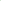

# Heterogeneous Graph Neural Networks for Assumption-Based Argumentation

<!-- Page 1 -->

Heterogeneous Graph Neural Networks for Assumption-Based Argumentation

Preesha Gehlot1*, Anna Rapberger1,2*, Fabrizio Russo1*, Francesca Toni1

1Imperial College London, Department of Computing 2Technical University Dortmund, Faculty of Computer Science {a.rapberger, fabrizio,ft}@imperial.ac.uk

## Abstract

Assumption-Based Argumentation (ABA) is a powerful structured argumentation formalism, but exact computation of extensions under stable semantics is intractable for large frameworks. We present the first Graph Neural Network (GNN) approach to approximate credulous acceptance in ABA. To leverage GNNs, we model ABA frameworks via a dependency graph representation encoding assumptions, claims and rules as nodes, with heterogeneous edge labels distinguishing support, derive and attack relations. We propose two GNN architectures—ABAGCN and ABA- GAT—that stack residual heterogeneous convolution or attention layers, respectively, to learn node embeddings. Our models are trained on the ICCMA 2023 benchmark, augmented with synthetic ABAFs, with hyperparameters optimised via Bayesian search. Empirically, both ABAGCN and ABAGAT outperform a state-of-the-art GNN baseline that we adapt from the abstract argumentation literature, achieving a node-level F1 score of up to 0.71 on the ICCMA instances. Finally, we develop a sound polynomial time extensionreconstruction algorithm driven by our predictor: it reconstructs stable extensions with F1 above 0.85 on small ABAFs and maintains an F1 of about 0.58 on large frameworks. Our work opens new avenues for scalable approximate reasoning in structured argumentation.

## Introduction

Computational argumentation provides formal tools for modelling defeasible reasoning over conflicting information. In the abstract setting, arguments are treated as opaque entities and asymmetric conflicts between them, so-called attacks, as a binary relation, giving rise to abstract argumentation frameworks (AFs) (Dung 1995), which can also be understood as graphs (with arguments as nodes and attacks as edges). By contrast, structured formalisms expose the internal composition of arguments. Assumption-Based Argumentation (ABA) (Bondarenko et al. 1997) is a prominent structured framework, enabling reasoning in domains such as decision support (ˇCyras et al. 2021), planning (Fan 2018), and causal discovery (Russo, Rapberger, and Toni 2024).

The building blocks of ABA are assumptions, which are the defeasible elements of an ABA framework (ABAF), and

*These authors contributed equally. Copyright © 2026, Association for the Advancement of Artificial Intelligence (www.aaai.org). All rights reserved.

inference rules, which are used to construct arguments based on assumptions. Conflicts arise between assumption sets S and T if the conclusion of an argument constructed from S is the contrary of some assumption in T; in this case we say that S attacks T.

Argumentation semantics provide criteria which render sets of assumptions (so-called extensions) jointly acceptable. One of the most popular semantics is the semantics of stable extensions which accepts a set of assumptions S only if it has no internal conflicts and attacks every {x} with x an assumption not in S. While stable extensions neatly characterise acceptable assumption sets, they are hard to compute: verifying credulous acceptance w.r.t. stable extension semantics, i.e., checking if an assumption is contained in any stable extension, is NP-complete (Dimopoulos, Nebel, and Toni 2002). Credulous acceptance plays an important role in several settings, e.g., ABA learning (De Angelis, Proietti, and Toni 2024) relies on it to learn ABAFs from data. Since these settings require fast solutions and real-world ABA frameworks can be very large (Russo, Rapberger, and Toni 2024), relying on exact approaches is often not viable.

In this work, we address this issue by using Graph Neural Networks (GNNs) (Scarselli et al. 2009) to predict credulous acceptance. GNNs leverage the relationships between nodes and edges in a graph to learn representations that capture its structure and allow to predict labels for nodes, edges or the whole graph. Their specialised architecture allows GNNs to amortise the graph analysis and use its stored weights to predict feature of interest (e.g. node labels, as in our case) in constant time after the initial training, thus introducing significant efficiency at inference time. While GNNs have been successfully used to approximate the acceptability of AFs seen as graphs, e.g., as in (Kuhlmann and Thimm 2019; Malmqvist et al. 2020; Cibier and Mailly 2024), to the best of our knowledge their potential remains unexplored for ABA and any other structured argumentation formalism to date. To make GNNs applicable for ABA, we represent ABAFs via dependency graphs. In summary, our contributions are as follows:

• We introduce a faithful dependency graph encoding of ABAFs that distinguishes assumption, claim and rule nodes as well as support, derive, and attack edges. • We develop two heterogeneous GNN architectures— ABAGCN and ABAGAT—composed of residual stacks

The Fortieth AAAI Conference on Artificial Intelligence (AAAI-26)

19117

<!-- Page 2 -->

of relation-specific convolutional or attention layers, respectively, enriched with learnable embeddings and degree-based features. • We implement a training and evaluation pipeline for credulous acceptance combining 380 ICCMA 2023 ABA benchmarks1 with 19,500 additional, synthetically generated ABAFs. Our experiments demonstrate that both ABAGCN and ABAGAT outperform an AF-based GNN baseline based on mapping ABAFs onto AFs and then applying state-of-the-art AFGCNv2, achieving nodelevel F1 up to 0.71 on small ABAFs and 0.65 overall. • Based on our credulous acceptance predictor, we develop a sound poly-time extension-reconstruction algorithm which computes stable extensions with high fidelity. Our algorithm attains F1 of 0.85 on small frameworks and remains above 0.58 on large ABAFs.

Trained models, code to reproduce data and experiments are provided at https://github.com/briziorusso/GNN4ABA.

## Related Work

Kuhlmann and Thimm (2019) were the first to frame credulous acceptance in an AF as a graph-classification problem. They generated random AFs, labeled each argument’s acceptability using the exact CoQuiAAS solver (Lagniez, Lonca, and Mailly 2015), and trained a Graph Convolutional Network (GCN) on two feature sets: the raw adjacency matrix and adjacency augmented with each node’s in- and outdegree. Including degree information improved accuracy to ∼80%, with F1 scores below 0.4, and class-balancing during training enhanced detection of under-represented arguments. Despite only marginal effects from graph topology or dataset size, their GCN reduced runtime from over an hour (CoQuiAAS) to under 0.5s for a full test set.

Malmqvist et al. (2020) then proposed AFGCN, which augments node features with 64-dimensional DeepWalk embeddings (Perozzi, Al-Rfou, and Skiena 2014) before feeding them—alongside the AF’s adjacency matrix—through 4–6 GCN–dropout blocks with residual connections. To address the skewed accept/reject ratio in real AFs, they exclude AFs with very few accepted arguments and introduce a randomised per-epoch masking of labels, forcing the model to infer hidden acceptabilities. This scheme, rather than network depth or explicit class-balancing, accounts for most of AFGCN’s increase to ∼82% accuracy on rebalanced data (62% reported for (Kuhlmann and Thimm 2019) on the same data). Malmqvist, Yuan, and Nightingale (2024) enrich argument representations with graph-level metrics (centralities, PageRank, colouring) and use four GCN–ReLU–dropout blocks plus an epoch-wise reshuffle-and-rebalance routine and a pre-check on the grounded extension (Dung 1995) for faster and more accurate inference, proposing AFGCNv2.

Cibier and Mailly (2024) optimise AFGCNv2 by reimplementing AF parsing and graph-metric computation in Rust, slashing preprocessing time and memory usage. They evaluate AFGCNv2 against two variants—adding five semantic features to random features, or retaining only 11

1Available at https://zenodo.org/records/8348039

“meaningful” features—and assess each with and without dropout. Their results show that pruning degrades accuracy, and that the no-dropout version of “feature-enhanced” version achieves the best overall performance (∼83% accuracy vs ∼75% reported for AFGCNv2 on the same data), highlighting the importance of rich semantic features and careful dropout placement. Finally, they introduce AFGAT, a three-layer GATv2 (an updated attention mechanism (Brody, Alon, and Yahav 2022) with multi-head attention, see §3.2), which surpasses all GCN variants obtaining ∼87% on the same benchmark data from ICCMA.

Craandijk and Bex (2020) propose AGNN, which learns argument embeddings through iterative message passing that internalises conflict-freeness and defense, then uses the resulting acceptance probabilities to drive a constructive backtracking algorithm for extension enumeration. We build on this enumeration strategy for our proposed extensionreconstruction algorithms in §6, adapting it to the nuances of ABAFs instead of AFs.

We adopt AFGCNv2 (Malmqvist, Yuan, and Nightingale 2024) (with AFs instantiated with ABAFs) as our baseline2 but, inspired by the results in (Cibier and Mailly 2024), we replace its handcrafted features with learnable embeddings and experiment with both GCNs and GAT layers. Additionally, we handle class imbalance via loss weighting rather than mini-batch rebalancing and disable the grounded-extension heuristic to test the models’ predictive accuracy on the entire frameworks rather than only on the non-grounded portion of it. In contrast to the AF-focused solvers discussed, we present the first native approximate solver for ABAFs, combining an enriched graphical representation with heterogeneous GCN and GAT-based prediction of assumption acceptability incorporated in an AGNNinspired extension-reconstruction algorithm.

## 3 Preliminaries

We recall the relevant elements of abstract and assumptionbased argumentation, as well as GNNs.

## 3.1 Computational Argumentation

An argumentation framework (AF) (Dung 1995) is a directed graph F = (A, R) where A are arguments and R ⊆ A × A is an attack relation. For x, y∈A, if (x, y)∈R we say x attacks y; for S, T ⊆A, if (x, y)∈R for some x∈A, y∈T, we say S attacks T; E is conflict-free (E ∈cf (F)) iff it does not attack itself. A semantics σ is a function that assigns to each AF a set of sets of arguments, so-called extensions. We focus on stable extensions.

Definition 3.1. Let F = (A, R) be an AF. A set E ∈cf (F) is stable (E ∈stb(F)) iff it attacks each x ∈A \ E.

Assumption-based Argumentation We assume a deductive system, i.e. a tuple (L, R), where L is a set of sentences and R is a set of inference rules over L. A rule r ∈R has the form a0 ←a1,..., an, s.t. ai ∈L for all 0 ≤i ≤n;

2Available at https://github.com/lmlearning/AFGraphLib/tree/ main/AFGCNv2. We could not use the versions from (Cibier and Mailly 2024) as no weights were available at the time of writing.

19118

<!-- Page 3 -->

head(r):= a0 is the head and body(r):= {a1,..., an} is the (possibly empty) body of r. Definition 3.2. An ABA framework (ABAF) (Bondarenko et al. 1997) is a tuple (L, R, A,), where (L, R) is a deductive system, A ⊆L a (non-empty) set of assumptions, and: A →L a contrary function. An ABAF D is flat if head(r) /∈A for all r ∈R. In this work we focus on flat and finite ABAFs, i.e. L and R are finite. We also restrict attention to L consisting of atoms.

An atom p ∈L is tree-derivable (Dung, Kowalski, and Toni 2009) from sets of assumptions S ⊆A and rules R ⊆ R, denoted by S ⊢R p, if there is a finite rooted labeled tree t s.t. i) the root of t is labeled with p, ii) the set of labels for the leaves of t is equal to S or S∪{⊤}, and iii) for each node v that is not a leaf of t there is a rule r ∈R such that v is labeled with head(r) and labels of the children correspond to body(r) or ⊤if body(r) = ∅. We write S ⊢p iff there is R ⊆R such that S ⊢R p; S ⊢p is called an ABA argument.

Let S ⊆A. By S:= {a | a ∈S} we denote the set of all contraries of S. S attacks T ⊆A if there are S′ ⊆S and a ∈T s.t. S′ ⊢a; if S attacks {a} we say S attacks a. S is conflict-free (S ∈cf (D)) if it does not attack itself. We recall the definition of stable extensions for ABA. Definition 3.3. Let D = (L, R, A,) be an ABAF. A set S ⊆A is a stable extension (S ∈stb(D)) iff S ∈cf (D) and attacks each x ∈A \ S. Definition 3.4. An assumption a ∈A is credulously accepted w.r.t. stable extension semantics in an ABAF D = (L, R, A,) iff there is some S ∈stb(D) with a ∈S; a is rejected if it is not credulously accepted. Example 3.5. Consider an ABAF (L, R, A,) with L = {a, b, c, d, p, a, b, c, d}, A = {a, b, c, d} with contraries a, b, c, d, respectively, and rules r1,..., r4, respectively:

c ←a, d p ←b d ←c a ←p, c We obtain two stable extensions: {b, c} and {a, b, d}. Indeed, {b, c} attacks a and d since {b, c} ⊢a and {c} ⊢d; and {a, b, d} attacks c since {a, d} ⊢c.

Viewing tree derivations as arguments, an ABAF induces an AF as follows (ˇCyras et al. 2018). Definition 3.6. The associated AF FD = (A, R) of an ABA D=(L, R, A,) is given by A = {S ⊢p | ∃R ⊆R: S ⊢R p} and R such that (S ⊢p, S′ ⊢p′) ∈R iff p ∈S′.

AFs and ABAFs correspond (ˇCyras et al. 2018): Proposition 3.7. Let D=(L, R, A,) be an ABAF and FD its associated AF. If E ∈stb(FD) then S

S⊢p∈E S ∈stb(D); if S ∈stb(D) then {S′ ⊢p | ∃S′ ⊆S: S′ ⊢p} ∈stb(FD).

Note that the AF instantiation can be exponential in the size of the given ABAF D. To tackle this issue, Lehtonen et al. (2023) propose a poly-time preprocessing technique that yields an ABAF so that the resulting AF is polynomial in the size of D. Their procedure handles the derivation circularity and flattens out the nested argument construction; they show that this construction preserves semantics under projection. In §6 we use this procedure to construct the AFbased GNN baseline that we use to evaluate the performance of our native ABAF GNNs.

## 3.2 Graph Neural

Networks A neural network (NN) is a parametrised function that maps an input vector x ∈Rn to an output through successive layers of neurons. We set the input neurons as h(0) = x and, denoting by h(l) the row-vector of neurons at layer l, each neuron at layer l computes h(l)

i = f

(w(l−1)

i)⊤h(l−1) + b(l−1)

i

, where w(l)

i and b(l)

i are the learnable weight-vector and bias for neuron i in layer l, and f is a (possibly non-linear) activation function (Bishop 2007). In supervised learning, the NN is trained by comparing predictions to ground-truth labels via a loss function (e.g. cross-entropy), and parameters are optimised by back-propagation and gradient descent.

Graph neural networks (GNNs) generalise NNs to consume graph-structured data G = (V, E), by jointly leveraging a node-feature matrix X ∈ R|V |×d (for d features) and an adjacency matrix A. Through repeated neighbourhood-aggregation steps—each propagating (also known as message-passing) and combining information from a node’s neighbours—a GNN learns embeddings that encode both local topology and node attributes (Bronstein et al. 2017). These embeddings can serve tasks such as node classification, where a final projection, a sigmoid and a threshold yield per-node labels. Popular aggregation schemes include Graph Convolutional Networks (Kipf and Welling 2017, GCNs) and Graph Attention Networks (Velickovic et al. 2018, GATs).

GCNs perform matrix-based updates across all nodes simultaneously and treat every neighbour equally. GCNs update node representations by aggregating feature information from each node and its neighbours. At each layer l, the representation matrix H(l) is computed from the previous layer H(l−1) and the graph structure as:

H(l) = f

∆−1/2 ˜A∆−1/2H(l−1)W(l−1)

, where ˜A = A + I is the adjacency matrix of the graph with added self-loops (so each node includes its own features in the aggregation), ∆is the diagonal degree matrix of

˜A, W(l) is a learnable weight matrix for layer l, and f is a (possibly non-linear) activation function. The inclusion of self-loops ensures that nodes can retain and refine their own features across layers, rather than relying solely on neighbouring information. Typically, H(0) = X.

GATs compute learned attention coefficients (Vaswani et al. 2017) to weigh each neighbour’s contribution differently. Unlike GCNs, which treat all neighbouring nodes equally during aggregation, GATs introduce learnable attention mechanisms to assign different weights to different neighbours. Specifically, for a node i, attention coefficients αij are computed between i and each of its neighbours j using shared attention:

αij = exp

LeakyReLU a⊤[Whi ∥Whj]

P k∈N (i) exp (LeakyReLU (a⊤[Whi ∥Whk])),

19119

<!-- Page 4 -->

where W is a learnable weight matrix, a is a learnable attention vector, [· ∥·] denotes vector concatenation, and N(i) is the set of neighbours of node i. LeakyReLU is a non-linear activation function that allows a small negative slope (typically ϵ = 0.2) for negative inputs, helping to avoid dead neurons and improve gradient flow. The updated representation of node i is then computed as a weighted sum of the transformed features of its neighbours: h′ i = σ

P j∈N (i) αijWhj

. To stabilise the learning process, GATv2 (Brody, Alon, and Yahav 2022) employs multihead attention: multiple independent attention mechanisms are applied in parallel, and their outputs are concatenated (in intermediate layers) or averaged (in the output layer).

When modelling heterogeneous graphs—where edges carry distinct semantics—one typically employs relationspecific transformations, e.g. via a Heterogeneous Graph Convolution (HGC) module (Schlichtkrull et al. 2018), and adds residual connections and normalisation between layers to stabilise training. To prevent overfitting, dropout (Srivastava et al. 2014) can be employed after each layer, randomly setting to zero a subset of the weights, and early stopping to terminate training when the validation loss does not improve for a number of steps greater than a patience parameter.

Predicting Acceptance with GNNs Here we detail our proposed GNN architecture to predict credulous acceptance of assumptions in an ABA framework. The core and novel component is the dependency graph, a faithful graph-based representation of an ABAF guiding the GNN learning of the ABA features that help predicting credulous acceptance as detailed in §4.1. The neural machinery adopted to learn to classify the assumption nodes of the dependency graph as credulously accepted or rejected w.r.t. stable extension semantics is then detailed in §4.2.

## 4.1 Dependency Graph

Our proposed graph representation comprises nodes for each atom type (assumption in A and non-assumption in L \ A) and for each rule, and three edge types: support edges (+) linking body atoms to rule nodes; derive edges (▷) linking rule nodes to their head elements; and attack edges (−) connecting contraries to their assumption nodes. Definition 4.1. Let D = (L, R, A,) be an ABAF. The dependency graph GD = (V, E, l) of D is a directed, edgelabelled graph with nodes V = L ∪R, edges

E = {(p, r) | r ∈R, p ∈body(r)} ∪{(r, p) | r ∈R, p ∈head(r)} ∪{(p, a) | a ∈A, a = p}, and edge labellings, for e ∈E, l(e) =

 



+, if e = (p, r), r ∈R, p ∈body(r) ▷, if e = (r, p), r ∈R, p ∈head(r) −, if e = (p, a), a ∈A, a = p

An example of the dependency graph is given in Figure 1. Observation 4.2. GD̸ = GD′ for every two ABAFs D, D′, D̸ = D′, i.e., GD is unique for each ABAF D.

Assumption node Rule node +: support −: attack ▷: derive b b r2 p r4 a a r1 c c r3 d d

−

+ ▷ +

+

+

▷ −

+

▷ −

▷ −

▷

**Figure 1.** Dependency graph GD of the ABAF D from Example 3.5. Assumptions b and c derive a, using r2 and r4.

Since GD contains information about all assumptions, contraries, and rules of a given ABAF D, the ABAF can be fully recovered from GD, thus the semantics are preserved, as for the AF instantiation. In contrast to the AF instantiation, the construction of the dependency graph requires a single pass over the atoms and rules of D.

Rapberger, Ulbricht, and Wallner (2022) define a dependency graph for ABA in the spirit of dependency graphs for logic programming (Konczak, Linke, and Schaub 2006; Fandinno and Lifschitz 2023). However, their representation does not fully preserve the structure of the ABAF, preventing the possibility to extract the ABAF’s extensions from a given dependency graph.3 In contrast, our dependency graph is unique for every ABAF and preserves the semantics.

## 4.2 Neural Architecture

Our GNN operates on the dependency graph’s adjacency matrix W ∈{0, 1}|V |×|V | and an initial node-feature matrix F ∈R|V |×2, where each row Fi contains the in- and out-degrees of node i for each node type: assumptions A, non-assumptions (or claims) C = L \ A, and rules R. Each node contains a self-loop of type ’+’ to propagate its features during learning. This is part of the GNN architecture (see §3) and does not interfere with the semantics; note that GD does not take edges (s, t) ∈L2 into account. In addition, we maintain a learnable embedding matrix L ∈R|V |×de with embedding dimension de, whose entries are optimised jointly with the rest of the GNN. We show a diagram of our model architecture in Figure 2. The core backbone of the GNN consists of M blocks. In each block m:

• A HGC layer performs relation-specific neighbourhood aggregation on the current embeddings H(m−1), using either GCN or GAT convolutional kernels (see §3). • The aggregated output is passed through functional layers for stability and regularisation: we use layernormalisation, ReLU activation, and dropout with rate δ. • A residual connection aggregates the block input H(m−1) to its output, yielding H(m).

3In brief, the dependency graph from (Rapberger, Ulbricht, and Wallner 2022) does not include rule nodes; positive edges (p, q) are introduced whenever p is contained in some rule body of a rule with head q. For example, the rule (a ←p, c) from the example in Figure 1 would yield the same edges as having two rules (a ← p), (a ←c). The introduction of rule nodes was inspired by the conjunction node representation in (Li, Wang, and Gupta 2021).

19120

<!-- Page 5 -->

**Figure 2.** Diagram of the model architecture, including both the feature extraction, using the dependency graph described in §4.1, and the GNN described in §4.2. The Heterogeneous Graph Layer module would apply Convolutional Layers for ABAGCN, or Attention Layers for ABAGAT.

This design allows distinct transformations per edge type while preserving gradient flow in deep architectures consisting of many layers. Each of these components (HGC and functional layers linked by residual connections) form a socalled block. After M blocks, with the parameter M tuned on validation data, we extract the rows of H(M) corresponding to assumption, claim and rule nodes and apply a separate linear classifier head to produce logits z ∈RA+C+R, with A = |A|, C = |C|, and R = |R|.

At inference time, a sigmoid activation yields the predicted probability of credulous acceptance for each assumption. Using a threshold τ, again tuned on validation data, we classify assumptions as accepted or rejected through a forward pass of the GNN that process the input features with our optimised weights obtained via supervised training.

We train the GNNs by minimising a weighted binary cross-entropy loss on the assumption logits, using the Adam optimiser with learning rate λ. Class weights compensate for the imbalance between accepted and rejected assumptions (see §6.1 and Table 1 in Appendix B.1 of (Gehlot et al. 2025) for details on the training and test data). All hyperparameters—including the number of layer blocks M, the embedding dimension de, hidden dimension of each convolution layer, the dropout rate δ, the learning rate λ, the batch size, class-weight multiplier, and classification threshold τ—are chosen via Bayesian optimisation (Snoek, Larochelle, and Adams 2012) with 3-fold crossvalidation, as implemented in (Biewald 2020). Details of tuning and hyperparameters are in Appendix B.3 of (Gehlot et al. 2025).

Extension Reconstruction Here we outline our proposed extension-reconstruction algorithm, whose pseudo-code is shown in Algorithm 1. Given an ABAF D and a predictor M returning probabilities PM, we pick the highest scoring assumption a∗and mark it as accepted (line 3). Before making our next guess, we modify D so that the extensions of the modified ABAF D′ (under projection) correspond to the extensions of D containing a∗ (line 4). Since M is imperfect, this modification may have introduced some inconsistencies in D′, which we check in line 5. If the check passes, we add a∗to our extension E.

We outline the MODIFY(D, a∗) procedure for a given D and a∗. When removing an assumption a∗predicted as accepted, we aim at ensuring that the extensions of the modified D′ projected onto A correspond to the extensions of D that contain a∗. We restrict to A because we introduce dummy-assumptions to ensure that rules that derive the contrary of a∗act as constraints. Concretely, MODIFY(D, a∗) performs the following steps:

1. We remove the assumption a∗and all occurrences of it; that is, we let A′ = A \ {a∗} and we replace any rule r with r′ = head(r) ←body(r) \ {a∗}. 2. We modify each rule r with head(r) = a∗: for each such rule r, we introduce a new dummy assumption dr and replace r with r′ = dr ←body(r) ∪dr. This modification ensures that not all body elements of r can be true (accepted or derived) at the same time. 3. If a∗is the contrary of another assumption c, then c is rejected. We remove c and any rule r with c ∈body(r).

19121

AI-readable visual equivalent, added: Figure extracted from the paper PDF and converted to an SVG wrapper asset. Use the surrounding page text and caption for interpretation.

<!-- Page 6 -->

## Algorithm

1: Extension reconstruction sketch

Require: ABAF D = (L, R, A,), predictor M

1: Initialize extension E ←∅ 2: while A̸ = ∅do 3: a∗←arg maxa∈A PM(a) 4: D′ ←MODIFY(D, a∗) 5: if ISCONFLICTING(D′) then 6: break 7: else 8: E ←E ∪{a∗} 9: return E

4. Lastly, we remove all rules with empty body (facts) from D: for each rule r with body(r) = ∅, we remove r from R and p = head(r) from the body of each rule r′, i.e., we replace r′ with r′′ = head(r′) ←body(r′) \ {p}. If p is the contrary of an assumption c, the assumption is attacked and we proceed as in Step 3. We repeat this process until there are no remaining facts.

Note that MODIFY(D, a∗) runs in polynomial time since it requires a loop over all rules in R, for each p ∈L; thus, Alg. 1 is in P. We establish the soundness of Alg. 1.

Proposition 5.1. For an ABAF D and an assumption a∗, let D′ denote the outcome of MODIFY(D, a∗). If a∗is credulously accepted in D, then the following holds.

{S∩A|S ∈stb(D′)}={S\{a∗}|S ∈stb(D), a∗∈S}

The proof of Prop. 5.1 is given in Appendix A of (Gehlot et al. 2025). With a perfect predictor of acceptance, Alg. 1 would return a valid stable extension. With imperfect predictions, if a∗is not accepted in D, Alg. 1 will encounter a rule of the form dr ←dr indicating a conflict. ISCONFLICT- ING(D′) checks if such a rule exists (line 5). The partially computed set is returned if A = ∅or if a conflict is found.

Empirical Evaluation

In this section we assess the effectiveness of our proposed GNN models—both the convolutional (ABAGCN) and attention-based (ABAGAT) variants—against our AFGCNv2-based baseline on two tasks over ABAFs:

1. Credulous acceptance classification: predicting, for each assumption, whether it is in any stable extension. 2. Extension reconstruction: recovering a full set of accepted assumptions, i.e., a predicted extension.

For task 1 we report node-level precision, recall, F1 and accuracy. For task 2 we treat each stable extension as a set and measure performance using extension-level F1 (details in Appendix B.2 of (Gehlot et al. 2025)).

## 6.1 Data

ICCMA 2023 included an ABA track (but not an approximate one) whose benchmark data comprised of 400 ABAFs defined by four parameters: number of atoms, assumption proportion, maximum rules per atom, and maximum rulebody length. Ground-truth labels are obtained by running

ASPForABA4 (Lehtonen et al. 2024) on every test instance with timeout threshold 10 min, yielding 380 benchmark ABAFs with exact annotations within the ICCMA data.

To obtain a larger training corpus, we used the ABAF generator from (Lehtonen et al. 2024) to produce 48,000 flat ABAFs (47,794 after timeout), extending the parameter ranges. Parameters are shown in Table 1 in Appendix B.1 of (Gehlot et al. 2025). To match the original assumptions acceptance rate (36.7% overall, 60.3% within ABAFs with at least one stable extension), we curated a subset of 19,500 ABAFs (13,000 with at least one accepted assumption, 6,500 with none), yielding 32.5% overall acceptance and 53.4% within ABAFs with at least a solution.

Finally, we used a 75:25 train–test split, stratified across three groups—small ICCMA (25–100 atoms), full ICCMA, and our generated dataset—to ensure a fair comparison with AFGCNv2, which cannot process ABAFs larger than 100 atoms. Accordingly, all results are reported on three test sets: ICCMA small, ICCMA full and ICCMA+Generated.

## 6.2 Baseline

Our baseline implements a three-stage pipeline that reduces ABAF credulous acceptance to an AF classification task: 1. ABAF-AF translation: Given an input ABAF, we use the method from (Lehtonen et al. 2023) and implemented in the AcBar toolkit5 (Lehtonen et al. 2021) to convert the input ABAF into a (poly-sized) AF in polynomial time. 2. Argument classification via AFGCNv2: The generated AF is represented by its adjacency matrix and graph-level features, then fed into the AFGCNv2 solver (see §2) using pre-trained weights for credulous acceptance under stable semantics. To ensure a fair comparison with our models, we disable its grounded-extension pre-check and apply a classification threshold—tuned on a held-out validation set—to the sigmoid output so that any argument with score above the threshold is accepted. 3. Element acceptability recovery: Finally, we derive assumption acceptance in the original ABAF: an assumption a is accepted if the argument {a} ⊢a is accepted. This baseline leverages an existing AF-based GNN solver, providing a direct comparison for our native ABAF GNNs.

## 6.3 Credulous Acceptance Classification

We first evaluate how well each model predicts assumptionlevel acceptance under stable semantics. Figure 3a shows that both our GNNs substantially outperform the AF baseline on the small ICCMA dataset (|L| < 100). We test on this set because AFGCNv2 cannot handle ABAFs greater than this size. F1 increases from 0.5 (AFGCN) to 0.72 (ABAGCN) and 0.74 (ABAGAT); recall climbs by about 10 points; precision improves by about 25 points; and accuracy rises by over 30 points. ABAGAT achieves the highest results across all metrics on this test set, but it is not significantly different from ABAGCN. Statistical tests are provided in Table 3 in Appendix B.5 of (Gehlot et al. 2025).

4Available at https://bitbucket.org/coreo-group/aspforaba 5Available at https://bitbucket.org/lehtonen/acbar

19122

<!-- Page 7 -->

(a) AF vs ABA GNNs on ICCMA data with |L| < 100 (b) CGN vs GAT on ICCMA and generated data

**Figure 3.** Model comparison according to F1, Precision, Recall and Accuracy on different cuts of data: small ICCMA ABAFs (with less than 100 elements) in panel (a) to be able to compare to the AFGCN baseline; comparison between the full ICCMA test set and the test set augmented with our generated data in panel (b).

In Figure 3b we examine the effect of testing only on the ICCMA data versus adding our generated instances. Both ABAGCN and ABAGAT see modest gains in accuracy when testing on the generated ABAFs together with the ICCMA ones, but incur a notable drop in precision and recall, resulting in a decrease in F1. This pattern indicates that synthetic augmentation possibly produced more challenging ABAFs than the ones in the competition. Crucially, despite this worsening in performance, both GNN variants maintain strong performance across the held-out ICCMA and generated test split, demonstrating robust generalisation to larger and more diverse ABA frameworks. Here ABAGCN and ABAGAT do not show significant difference across metrics, apart from ABAGAT surpassing ABAGCN in accuracy and recall on the ICCMA test, while ABAGCN showing significantly better recall than ABAGAT on the ICCMA+Gen set.

Comparing the small ICCMA results in Figure 3a to the (full) ICCMA bars in Figure 3b, F1 dips by under one percentage point, precision by roughly two points and accuracy by about one point on the full dataset, while recall actually climbs by two, to six points, for ABAGCN and ABAGAT, respectively. In other words, on larger ABAFs both GNNs trade a bit of overall and positive-class fidelity for stronger coverage of accepted assumptions.

## 6.4 Extension Reconstruction

For our second experiment, we test the poly-time algorithm from §5, using our approximate ABA models to calculate a stable extension. Our constructive extension-reconstruction method achieves very high F1 (0.85) on small ABAFs (10 atoms), but performance drops sharply to around 0.60 by 50–100 atoms and then plateaus at approximately 0.58 for larger frameworks (see Figure 3 in Appendix B.4 of (Gehlot et al. 2025)). This decline reflects how early misclassifications by the GNN propagate through subsequent modification steps, reducing both precision and recall, but highlights opportunities for future work to mitigate degradation.

We also compare runtimes on 15 of the most challenging ABAFs (4,000–5,000 atoms) from our dataset, held out in the test set. The exact ASPForABA solver averaged 435s per instance, whereas our approximate extension reconstruction ran in 192s—2.3× faster—while still achieving F1 of 0.68 (0.77 accuracy). These results highlight the potential of GNN-driven approximate reasoning to yield speed-ups over exact methods, maintaining a similar level predictive performance as in the acceptance classification task.

## Conclusion

We have demonstrated that heterogeneous GNNs over our dependency-graph encoding can accurately and efficiently approximate credulous acceptance in ABA under stable semantics. Both ABAGCN and ABAGAT outperform an AFbased GNN baseline—achieving node-level F1 of 0.65 overall and up to 0.71 on small frameworks—while our polytime extension-reconstruction procedure reconstructs stable sets with F1 greater than 0.85 on small ABAFs and maintains F1 of about 0.58 at scales of 1,000 atoms. Crucially, on the 4,000–5,000-atom ABAFs where ASPForABA average runtime is 435s, our approximate extension are derived in 192s (2.3× faster) with F1 of 0.68, underscoring substantial runtime gains without sacrificing predictive quality. These findings show that GNNs can bridge the gap between accuracy and tractability in structured argumentation.

Future work includes integrating lightweight symbolic checks to boost precision (e.g. grounded semantics as done in (Malmqvist, Yuan, and Nightingale 2024)), extending the approach to other semantics, including admissible, complete, and preferred, where GNNs may be able to exploit local structural patterns even more efficiently. Additionally we aim at lifting the flatness restriction to handle general ABAFs and cover applications where non-flat ABAFs are used (Russo, Rapberger, and Toni 2024). Together, these directions promise more scalable and interpretable reasoning tools for complex argumentative scenarios.

19123

AI-readable visual equivalent, added: Figure extracted from the paper PDF and converted to an SVG wrapper asset. Use the surrounding page text and caption for interpretation.

AI-readable visual equivalent, added: Figure extracted from the paper PDF and converted to an SVG wrapper asset. Use the surrounding page text and caption for interpretation.

<!-- Page 8 -->

## Acknowledgements

Rapberger and Russo were funded by the ERC under the ERC-POC programme (grant number 101189053) while Toni under the EU’s Horizon 2020 research and innovation programme (grant number 101020934); Toni also by J.P. Morgan and by the Royal Academy of Engineering under the Research Chairs and Senior Research Fellowships scheme.

## References

Biewald, L. 2020. Experiment Tracking with Weights and Biases. Software available from wandb.com. Bishop, C. M. 2007. Pattern recognition and machine learning, 5th Edition. Information science and statistics. Springer. Bondarenko, A.; Dung, P. M.; Kowalski, R. A.; and Toni, F. 1997. An Abstract, Argumentation-Theoretic Approach to Default Reasoning. Artif. Intell., 93: 63–101. Brody, S.; Alon, U.; and Yahav, E. 2022. How Attentive are Graph Attention Networks? In Proc. of ICLR. Bronstein, M. M.; Bruna, J.; LeCun, Y.; Szlam, A.; and Vandergheynst, P. 2017. Geometric Deep Learning: Going beyond Euclidean data. IEEE Signal Process. Mag., 34(4): 18–42. Cibier, P.; and Mailly, J. 2024. Graph Convolutional Networks and Graph Attention Networks for Approximating Arguments Acceptability. In Proc. of COMMA, 25–36. Craandijk, D.; and Bex, F. 2020. AGNN: A Deep Learning Architecture for Abstract Argumentation Semantics. In Proc. of COMMA, 457–458.

ˇCyras, K.; Fan, X.; Schulz, C.; and Toni, F. 2018. Assumption-Based Argumentation: Disputes, Explanations, Preferences. In Handbook of Formal Argumentation., chapter 7, 123–145. College Publications.

ˇCyras, K.; Oliveira, T.; Karamlou, A.; and Toni, F. 2021. Assumption-based argumentation with preferences and goals for patient-centric reasoning with interacting clinical guidelines. Argument & Computation, 12(2): 149–189. De Angelis, E.; Proietti, M.; and Toni, F. 2024. Learning Brave Assumption-Based Argumentation Frameworks via ASP. In Proc. of ECAI, 3445–3452. Dimopoulos, Y.; Nebel, B.; and Toni, F. 2002. On the computational complexity of assumption-based argumentation for default reasoning. Artif. Intell., 141(1): 57–78. Dung, P. M. 1995. On the acceptability of arguments and its fundamental role in nonmonotonic reasoning, logic programming and n-person games. Artif. Intell., 77(2): 321– 357. Dung, P. M.; Kowalski, R. A.; and Toni, F. 2009. Assumption-Based Argumentation. In Argumentation in Artificial Intelligence, 199–218. Springer. Fan, X. 2018. A Temporal Planning Example with Assumption-Based Argumentation. In Proc. of PRIMA, 362–370. Fandinno, J.; and Lifschitz, V. 2023. Positive Dependency Graphs Revisited. Theory Pract. Log. Program., 23(5): 1128–1137.

Gehlot, P.; Rapberger, A.; Russo, F.; and Toni, F. 2025. Heterogeneous Graph Neural Networks for Assumption-Based Argumentation. CoRR, abs/2511.08982. Kipf, T. N.; and Welling, M. 2017. Semi-Supervised Classification with Graph Convolutional Networks. In Proc. of ICLR. Konczak, K.; Linke, T.; and Schaub, T. 2006. Graphs and colorings for answer set programming. Theory Pract. Log. Program., 6(1-2): 61–106. Kuhlmann, I.; and Thimm, M. 2019. Using Graph Convolutional Networks for Approximate Reasoning with Abstract Argumentation Frameworks: A Feasibility Study. In Proc. of SUM, 24–37. Lagniez, J.; Lonca, E.; and Mailly, J. 2015. CoQuiAAS: A Constraint-Based Quick Abstract Argumentation Solver. In Proc. of ICTAI, 928–935. Lehtonen, T.; Rapberger, A.; Toni, F.; Ulbricht, M.; and Wallner, J. P. 2024. Instantiations and Computational Aspects of Non-Flat Assumption-based Argumentation. In Proc. of IJCAI, 3457–3465. Lehtonen, T.; Rapberger, A.; Ulbricht, M.; and Wallner, J. P. 2021. ACBAR–Atomic-based Argumentation Solver. IC- CMA 2023, 42(3): 16. Lehtonen, T.; Rapberger, A.; Ulbricht, M.; and Wallner, J. P. 2023. Argumentation Frameworks Induced by Assumptionbased Argumentation: Relating Size and Complexity. In Proc. of KR, 440–450. Li, F.; Wang, H.; and Gupta, G. 2021. grASP: A Graph Based ASP-Solver and Justification System. CoRR, abs/2104.01190. Malmqvist, L.; Yuan, T.; and Nightingale, P. 2024. Approximating problems in abstract argumentation with graph convolutional networks. Artif. Intell., 336: 104209. Malmqvist, L.; Yuan, T.; Nightingale, P.; and Manandhar, S. 2020. Determining the Acceptability of Abstract Arguments with Graph Convolutional Networks. In Proc. of COMMA, 47–56. Perozzi, B.; Al-Rfou, R.; and Skiena, S. 2014. DeepWalk: online learning of social representations. In Proc. of KDD, 701–710. Rapberger, A.; Ulbricht, M.; and Wallner, J. P. 2022. Argumentation Frameworks Induced by Assumption-Based Argumentation: Relating Size and Complexity. In Proc. of NMR, 92–103. Russo, F.; Rapberger, A.; and Toni, F. 2024. Argumentative Causal Discovery. In Proc. of KR, 938–949. Scarselli, F.; Gori, M.; Tsoi, A. C.; Hagenbuchner, M.; and Monfardini, G. 2009. The Graph Neural Network Model. IEEE Transactions on Neural Networks, 20(1): 61–80. Schlichtkrull, M.; Kipf, T. N.; Bloem, P.; van den Berg, R.; Titov, I.; and Welling, M. 2018. Modeling Relational Data with Graph Convolutional Networks. In Proc. of ESWC, 593–607. Snoek, J.; Larochelle, H.; and Adams, R. P. 2012. Practical Bayesian Optimization of Machine Learning Algorithms. In Proc. of NeurIPS, 2960–2968.

19124

<!-- Page 9 -->

Srivastava, N.; Hinton, G. E.; Krizhevsky, A.; Sutskever, I.; and Salakhutdinov, R. 2014. Dropout: a simple way to prevent neural networks from overfitting. J. Mach. Learn. Res., 15(1): 1929–1958. Vaswani, A.; Shazeer, N.; Parmar, N.; Uszkoreit, J.; Jones, L.; Gomez, A. N.; Kaiser, L.; and Polosukhin, I. 2017. Attention is All you Need. In Proc. of NeurIPS, 5998–6008. Velickovic, P.; Cucurull, G.; Casanova, A.; Romero, A.; Li`o, P.; and Bengio, Y. 2018. Graph Attention Networks. In Proc. of ICLR.

19125
