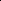

# HGATSolver: A Heterogeneous Graph Attention Solver for Fluid–Structure Interaction

<!-- Page 1 -->

HGATSolver: A Heterogeneous Graph Attention Solver for Fluid–Structure

Interaction

Qin-Yi Zhang1, 2*, Hong Wang3*, Siyao Liu4, Haichuan Lin1, 2, Linying Cao1, 2, Xiao-Hu Zhou1, 2,

Chen Chen1, 2, Shuangyi Wang1, 2†, Zeng-Guang Hou1, 2†

1State Key Laboratory of Multimodal Artificial Intelligence Systems, Institute of Automation, Chinese Academy of Sciences, Beijing 100190, China 2School of Artificial Intelligence, University of Chinese Academy of Sciences, Beijing 100049, China 3University of Science and Technology of China, Hefei 230026, China 4Chengdu University of Technology, Chengdu 610059, China {zhangqinyi2024, shuangyi.wang, zengguang.hou}@ia.ac.cn

## Abstract

Fluid–structure interaction (FSI) systems involve distinct physical domains, fluid and solid, governed by different partial differential equations and coupled at a dynamic interface. While learning-based solvers offer a promising alternative to costly numerical simulations, existing methods struggle to capture the heterogeneous dynamics of FSI within a unified framework. This challenge is further exacerbated by inconsistencies in response across domains due to interface coupling and by disparities in learning difficulty across fluid and solid regions, leading to instability during prediction. To address these challenges, we propose the Heterogeneous Graph Attention Solver (HGATSolver). HGATSolver encodes the system as a heterogeneous graph, embedding physical structure directly into the model via distinct node and edge types for fluid, solid, and interface regions. This enables specialized message-passing mechanisms tailored to each physical domain. To stabilize explicit time stepping, we introduce a novel physics-conditioned gating mechanism that serves as a learnable, adaptive relaxation factor. Furthermore, an Interdomain Gradient-Balancing Loss dynamically balances the optimization objectives across domains based on predictive uncertainty. Extensive experiments on two constructed FSI benchmarks and a public dataset demonstrate that HGAT- Solver achieves state-of-the-art performance, establishing an effective framework for surrogate modeling of coupled multiphysics systems.

Code — https://github.com/Qin-Yi-Zhang/HGATSolver

## Introduction

Numerical simulation of coupled multi-physics systems, governed by interacting sets of partial differential equations (PDEs), is a formidable challenge in computational science (Dowell and Hall 2001). Fluid–Structure Interaction (FSI) is a prime example, with applications ranging from aircraft design (Kamakoti and Shyy 2004) to cardiovascular hemodynamics (Singh et al. 2024; Zhang et al.

*These authors contributed equally. †Corresponding authors. Copyright © 2026, Association for the Advancement of Artificial Intelligence (www.aaai.org). All rights reserved.

Navier-Stokes

Equations

Interface 𝚪

Solid Ωs HGATSolver

𝑭 𝝈

Fluid Ωf

(b) (a)

Navier-Cauchy

Equations

Self Attention

Cross Attention

Fluid Fluid Fluid Fluid Solid Solid Solid Solid Solid Fluid

Self Attention

**Figure 1.** Conceptual overview of HGATSolver. (a) The FSI system couples fluid and solid domains with distinct PDEs and a dynamic interface. (b) We encode this structure as a heterogeneous graph, enabling type-aware attention for intra- and inter-domain physics.

2024). The crux lies not in discretizing the fluid or solid domains separately but in enforcing kinematic and dynamic continuity at their complex, moving interface (Hou, Wang, and Layton 2012). Traditional solvers face stability issues and prohibitive computational costs when handling this coupling, particularly in regimes with strong added-mass effects (Wiggert and Tijsseling 2001), highlighting the need for efficient, learning-based surrogate solvers (Azizzadenesheli et al. 2024; Luo et al. 2024; Wang et al. 2025b,a; Dong et al. 2024).

Neural operators, which learn PDE solution mappings, have emerged as a powerful paradigm (Azizzadenesheli et al. 2024). The Fourier Neural Operator delivers remarkable efficiency on regular, structured grids (Li et al. 2021). To accommodate the irregular meshes characteristic of complex geometries, recent work has turned to graph-based and attention-driven architectures capable of operating on arbitrary discretizations (Li et al. 2023; Wu et al. 2024; Gao et al. 2025). Despite these advances, when applied to coupled systems like FSI, the prevailing approach of consolidating the entire system into a single, homogeneous graph introduces a fundamental mismatch in the model architecture. This unified approach forces a universal message-passing scheme to approximate distinct physical laws, such as the Navier-Stokes

The Fortieth AAAI Conference on Artificial Intelligence (AAAI-26)

<!-- Page 2 -->

Solid

Ours AMG

6.00%

Fluid

4.50% 3.00% 1.50% 0.00%

Ours AMG

(a) (b)

0.040 0.004 Fluid

[m/s] 450 45 Solid

[Pa] Error:

Relative L2 Error (%)

**Figure 2.** Comparison in the interaction region on FI-Valve. (a) Enlarged error maps show reduced error near the interface. (b) Relative ℓ2 errors for fluid and solid domains demonstrate HGATSolver’s superior accuracy compared to a GAT-based baseline.

and elastodynamic equations (Coutand and Shkoller 2006), within the same framework. Consequently, the model fails to exploit the system’s known physical decomposition as a structural inductive bias. As a result, the model must expend considerable resources to rediscover this separation, thereby increasing the complexity of the search space. This limits its physical consistency and generalizability.

Beyond this structural limitation, the learning-based FSI solver confronts two inherent difficulties of the underlying physics. First, the strong coupling at the fluid-solid interface often results in a numerically stiff system, making explicit time-stepping schemes prone to instability. An effective solver requires a mechanism to ensure stable predictions, especially under strongly coupled dynamics across the interface. Second, the training process itself presents a challenge in balancing multiple objectives. The model must minimize prediction errors for both the fluid and solid domains, whose governing equations can differ in scale and sensitivity. Manually tuning the weight of each component during training is fragile and suboptimal.

To address these challenges, we introduce the Heterogeneous Graph Attention Solver (HGATSolver), a framework built on three core principles. First, to resolve the architectural mismatch, we represent the system using a heterogeneous graph (Wang et al. 2022), as shown in Fig. 1. This graph assigns distinct node types to the fluid and solid domains and uses typed edges to capture both the internal dynamics of each domain and the coupling conditions at the interface (Zhao et al. 2021). This representation directly embeds the system’s physical decomposition into the model. As illustrated in Fig. 2, it results in lower prediction errors compared to homogeneous baselines. Second, to ensure numerical stability, we introduce a Physics-Conditioned Gating Mechanism (PCGM). This component adapts the state update by acting as a learned, state-dependent relaxation factor, preventing instabilities in the simulation. Third, to achieve balanced and robust training, we propose Inter-domain Gradient-Balancing Loss (IGBL), allowing the model to autonomously weight the loss for each physical domain based on its learned aleatoric uncertainty (Kendall, Gal, and Cipolla 2018). This eliminates the need for manual loss weighting and enhances the robustness of the training process.

Our work makes the following contributions:

• We propose the first FSI simulation framework built on a heterogeneous graph architecture, which encodes strong physical inductive biases by explicitly encoding the system’s distinct domains and their interface.

• We propose a robust learning framework for stiff, coupled systems, combining PCGM for stability and IGBL for uncertainty-aware training across domains.

• We construct two challenging FSI benchmarks featuring distinct geometries and physical boundary conditions. The first benchmark focuses on flow-induced structural deformation under high-Reynolds-number conditions, while the second models structure-induced fluid dynamics with strong loading. HGATSolver achieves state-of-the-art performance on these benchmarks and a public dataset.

Related Works

Learning-based PDE Solvers

Learning-based solvers have advanced from the griddependent FNO (Li et al. 2021) to graph-based operators that accommodate the unstructured meshes inherent to complex geometries (Li et al. 2023). Token-wise attention is theoretically shown to approximate the PDE solution operator as a learnable integral operator (Hao et al. 2023; Wu et al. 2024; Wang et al. 2025c; Huang et al. 2025). However, prevailing approaches for single-physics problems adopt a structurally uniform graph representation, disregarding domain-specific heterogeneity (Li et al. 2025; Liu et al. 2025). This limitation persists in multi-physics pre-trained models like CoDA-NO (Rahman et al. 2024), which distinguish variables via token types but do not encode the structural separation of physical subdomains. As a result, these models must infer domain boundaries from data rather than leveraging them as structural priors (Wang et al. 2025d; Lv, Liu, and Wang 2025; Wei et al. 2025b,a).

Deep Learning for FSI

FSI presents unique challenges for deep learning due to the coupling of fluid and solid physics through moving interfaces. These systems are often stiff and exhibit highly heterogeneous behaviors, complicating accurate simulation (Zhu, Hu, and Sun 2023; Gao and Wang 2023). Prevalent approaches employ CNNs on structured grids (Han et al. 2022; Hu, Dou, and Zhang 2024), but suffer from mesh distortion issues. Recent methods leverage graph-based models to support unstructured meshes (Gao and Jaiman 2024; Fan and Wang 2024), yet most assume uniform node and edge types, overlooking the distinct physical laws governing fluid and solid regions (Xu et al. 2024). Training is further complicated by the need to learn dynamics across domains with differing numerical scales jointly. Manually tuning fixed loss weights often leads to instability or suboptimal convergence (Liu et al. 2024; Bubl´ık et al. 2023). These limitations highlight the need for models that explicitly encode physical heterogeneity and adaptively learn inter-domain interactions.

AI-readable visual equivalent, added: Figure extracted from the paper PDF and converted to an SVG wrapper asset. Use the surrounding page text and caption for interpretation.

AI-readable visual equivalent, added: Figure extracted from the paper PDF and converted to an SVG wrapper asset. Use the surrounding page text and caption for interpretation.

AI-readable visual equivalent, added: Figure extracted from the paper PDF and converted to an SVG wrapper asset. Use the surrounding page text and caption for interpretation.

AI-readable visual equivalent, added: Figure extracted from the paper PDF and converted to an SVG wrapper asset. Use the surrounding page text and caption for interpretation.

<!-- Page 3 -->

Heterogeneous Graph Neural Networks Research in Heterogeneous Graph Neural Networks has established two primary strategies: those reliant on predefined meta-paths to capture semantics (Fu et al. 2020; Wang et al. 2019), and more flexible meta-relation approaches that learn type-based interactions directly (Hu et al. 2020; Wang et al. 2022). The fundamental structure of a coupled multiphysics system—comprising distinct domains governed by unique physical laws and linked by well-defined interface conditions—presents a natural and compelling mapping to the heterogeneous graph formalism (Bubl´ık et al. 2023; Liu et al. 2024; Yang et al. 2023). While this representation provides a powerful structural prior, modeling the dynamic interactions across different edge types poses a considerable challenge for ensuring stable and accurate prediction.

## Preliminaries

This section defines the FSI governing physics, links neural operators to graph attention, and introduces heterogeneous graphs as a structural prior.

Governing Equations of FSI An FSI system comprises a fluid domain Ωf and a solid domain Ωs coupled at a moving interface Γi. Coupled PDEs govern the system’s evolution.

Within Ωf, the dynamics of an incompressible fluid are described by the Navier-Stokes equations:

ρf

∂uf

∂t + uf · ∇uf

= ∇· σf, ∇· uf = 0, (1)

where ρf is the fluid density, uf is the velocity, and σf = −pI + µf(∇uf + (∇uf)T) is the fluid stress tensor. In the solid domain Ωs, the elastodynamics are governed by the Navier-Cauchy equations:

ρs

∂2ds

∂t2 = ∇· σs, (2)

where ρs is the solid density, ds is the displacement, and σs is the solid stress tensor. The two physics are coupled at the interface Γi by kinematic (no-slip) and dynamic (force equilibrium) conditions:

uf = ∂ds

∂t on Γi, (3)

σf · n = σs · n on Γi. (4)

Here, n is the outward unit normal vector to the interface Γi. The core challenge lies in robustly enforcing these coupling conditions at the complex, moving interface.

Graph Attention as a Neural Operator Neural operators aim to learn mappings between infinitedimensional function spaces by approximating solution operators as integral transforms (Hao et al. 2023; Wu et al. 2024). Given an input field u: Ω→RC and a target location g∗∈Ω, the operator can be written as:

G(u)(g∗) =

Z

Ω κ(g∗, ξ)u(ξ) dξ, (5)

where κ: Ω× Ω→R is a kernel function.

On discrete domains, this integral is approximated by a weighted summation over neighbors:

G(u)(g∗) ≈

X ξj∈N (g∗)

αg∗,j u(ξj), (6)

where αg∗,j are normalized attention weights derived from the kernel κ(g∗, ξj).

This formulation aligns with graph attention mechanisms, where the output at node i is computed as:

h′ i =

X j∈N (i)

αij Whj, (7)

with hj denoting node features, W a learnable projection, and αij a learnable, data-dependent attention weight.

Thus, graph attention can be viewed as a discretized, learnable approximation of an integral operator over the domain Ω(Li et al. 2025).

Heterogeneous Graphs as a Physical Inductive Bias

In FSI systems, fluid and solid regions are governed by different physical laws. Applying a single attention kernel across all regions fails to reflect this structural difference.

To address this, we represent the domain as a heterogeneous graph G = (V, E, TV, TE), where each node is assigned a type in TV = fluid, solid, and each edge belongs to a relation type in TE = f2f, s2s, f2s, s2f, representing fluid–fluid, solid–solid, fluid-to-solid, and solid-to-fluid interactions, respectively. Each edge type corresponds to a specific physical interaction, such as internal dynamics in fluid or solid domains or coupling across the interface.

We define a relation-aware message passing operator. For a node i, the updated feature is computed as:

h′ i =

X τ∈TE

X j∈N (τ)

i α(τ)

ij W(τ)hj, (8)

where N (τ)

i is the set of neighbors of type τ, α(τ)

ij is a relation-specific attention weight, and W(τ) is a learnable projection matrix for each relation.

This formulation allows the model to learn distinct interaction kernels for fluid dynamics, solid deformation, and interface coupling, embedding physical structure directly into the network.

## Method

HGATSolver incorporates three key innovations aligned with the physical nature of FSI: (1) a heterogeneous graph attention processor that distinguishes intra- and interdomain dynamics; (2) an adaptive gating mechanism that modulates interface coupling based on local and global physical context; and (3) a principled uncertainty-based loss to jointly optimise across heterogeneous domains. An overview is illustrated in Fig. 3.

<!-- Page 4 -->

Embedding

Historical States

Normalization

Time Step

FSI Mesh

T0

Fluid

Z-Score

C wself wself

T∆t

T∆t

Fluid Domain

MSE Loss: Ls

MSE Loss: Lf

Solid Domain

Fluid

Decoder Solid

Decoder

Linear 𝒉𝒉𝒗𝒗

(𝟎𝟎)

𝒉𝒉𝒗𝒗

(𝑳𝑳)

C

1-g g

Physics-Conditioned Gating 𝒑𝒑𝒗𝒗 𝒉𝒉𝒗𝒗

(𝟎𝟎)

𝒉𝒉𝒗𝒗

(𝑳𝑳)

1-g g 𝒉𝒉𝒗𝒗

(𝑳𝑳)

𝒉𝒉𝒗𝒗

(𝟎𝟎)

g 1-g

PCGM (Solid)

PCGM (Fluid)

Heterogeneous

Graph

Solid Encoder

Fluid Encoder

HGAT Layers ×N

(a) Heterogeneous Graph Processor

LTotal

Solid wcross

(b) PCGM (c) IGBL

C Concat Fluid Node Physics Parameters 𝒑𝒑𝒗𝒗 Fluid Fluid Solid Solid Solid Fluid Solid Node Fluid Solid

Inter-domain Gradient-Balancing

**Figure 3.** Overview of HGATSolver. (a) The FSI mesh is encoded as a heterogeneous graph with fluid and solid nodes and relation-aware edges. (b) PCGM adaptively blends updated and initial states based on physics parameters. (c) IGBL adjusts domain-wise loss weights based on predictive uncertainty.

Heterogeneous Graph Processor Let G = (V, E) denote the heterogeneous graph with node types TV and edge types TE as defined above. For each node v ∈V, the input feature vector xv ∈Rdin is constructed as:

xv = xstate v ∥xpos v ∥xtime v

, where xstate v contains N past frames of normalized physical quantities (e.g., velocity, displacement), xpos v is the spatial coordinate, and xtime v is a sinusoidal embedding of the time step ∆t.

This input is encoded via a type-specific MLP:

h(0)

v = ϕ(τv)

enc (xv), τv ∈TV. (9)

We then apply L layers of heterogeneous graph attention, passing messages according to the relation type τ ∈TE. For each edge (j →i) of type τ, we compute the attention energy as:

e(τ)

ij = a(τ)⊤· σLeakyReLU

W(τ)

Q hi + W(τ)

K hj

, (10)

Here, W(τ)

Q, W(τ)

K, W(τ)

V ∈ Rd×d are relation-specific learnable projection matrices, and a(τ) ∈Rd is a relationspecific attention vector. which is then normalized across the neighborhood N (τ)

i to obtain the attention coefficient:

α(τ)

ij = exp(e(τ)

ij) P k∈N (τ)

i exp(e(τ)

ik)

. (11)

Messages are first aggregated per relation type:

m(τ)

i =

X j∈N (τ)

i α(τ)

ij · W(τ)

V hj. (12)

We group edge types into intra-domain (Tself) and interdomain (Tcross) sets, where Tself includes edges within the same domain (e.g., f2f, s2s), and Tcross includes crossdomain types (e.g., f2s, s2f). The total message to node i is:

mi = w(τi)

self ·

X τ∈Tself m(τ)

i + w(τi)

cross ·

X τ∈Tcross m(τ)

i, (13)

with learnable weights w(τi)

self, w(τi)

cross ∈R+ and τi denoting the type of node i.

Each layer updates node features via residual connection, normalization, and nonlinearity:

h(l+1)

i = h(l)

i + σ (LayerNorm(mi)). (14)

This relation-aware processor enables HGATSolver to learn physically grounded attention kernels specialized for intra-domain dynamics and interface-driven inter-domain coupling.

PCGM: Physics-Conditioned Gating Mechanism Coupled FSI systems exhibit pronounced disparities in dynamics between fluid and solid regions and discontinuities in response across their shared interface (Augier et al. 2015). These inconsistencies—arising from differences in physical scales, stiffness, and learning difficulty—can lead to numerical instability or overfitting when using fixed, unmoderated GNN updates (Liu et al. 2021). To address this, we introduce the PCGM, a learnable, adaptive relaxation factor for each node.

Rather than fully committing to the raw graph-updated state, each node softly interpolates between its initial (premessage-passing) representation and its updated state, with the interpolation strength determined by local features and global physics parameters.

Let h(0)

v denote the initial node representation from the encoder, and h(L)

v the output after L layers of heterogeneous message passing. Let pv ∈Rdp be the normalized vector of

AI-readable visual equivalent, added: Figure extracted from the paper PDF and converted to an SVG wrapper asset. Use the surrounding page text and caption for interpretation.

AI-readable visual equivalent, added: Figure extracted from the paper PDF and converted to an SVG wrapper asset. Use the surrounding page text and caption for interpretation.

AI-readable visual equivalent, added: Figure extracted from the paper PDF and converted to an SVG wrapper asset. Use the surrounding page text and caption for interpretation.

AI-readable visual equivalent, added: Figure extracted from the paper PDF and converted to an SVG wrapper asset. Use the surrounding page text and caption for interpretation.

AI-readable visual equivalent, added: Figure extracted from the paper PDF and converted to an SVG wrapper asset. Use the surrounding page text and caption for interpretation.

AI-readable visual equivalent, added: Figure extracted from the paper PDF and converted to an SVG wrapper asset. Use the surrounding page text and caption for interpretation.

AI-readable visual equivalent, added: Figure extracted from the paper PDF and converted to an SVG wrapper asset. Use the surrounding page text and caption for interpretation.

<!-- Page 5 -->

static physics parameters (e.g., material density, fluid viscosity). The gating coefficient gv ∈(0, 1) is computed as:

gv = σsigmoid

Wg h h(0)

v ∥h(L)

v ∥pv i

+ bg

, (15)

where Wg and bg are learnable parameters.

The final node representation is then given by:

hfinal v = (1 −gv) · h(0)

v + gv · h(L)

v. (16)

This mechanism enables each node to learn a domain- and context-specific update strength. Importantly, the PCGM does not directly enforce numerical stability. Instead, it provides a smooth, data-driven control over state evolution, mitigating sharp transitions across the fluid–solid interface and moderating spatiotemporal stiffness. This formulation reflects the relaxation strategies used in classical iterative solvers (Van Brummelen 2011), but enables them to be learned end-to-end within a neural framework.

IGBL: Inter-domain Gradient-Balancing Loss FSI involves two physically distinct yet tightly coupled domains, each governed by different dynamics, numerical scales, and learning challenges. Jointly optimizing their predictions under a unified loss is often unstable, as fixed loss weightings fail to adapt to inter-domain discrepancies, especially near the interface.

Inspired by uncertainty-based task weighting (Kendall, Gal, and Cipolla 2018), we treat predictions in each domain as samples from a Gaussian distribution with domainspecific homoscedastic variance. For each domain d ∈ {fluid, solid}, the output is modeled as:

p(yd|x) = N(µd(x), σ2 dI), (17)

where σ2 d captures domain-level uncertainty and is learned during training.

This leads to the following total loss:

Ltotal = 1 2σ2 f

Lf + 1 2σ2s Ls + 1

2 log σ2 f + 1

2 log σ2 s, (18)

where Lf and Ls denote the mean squared error in the fluid and solid regions, respectively.

We refer to this adaptive formulation as IGBL. Unlike general-purpose multi-task loss weighting (Kendall, Gal, and Cipolla 2018; Liu, Liang, and Gitter 2019), IGBL is tailored for coupled multi-physics systems. Here, σ2 d captures the physical complexity and learning difficulty of each domain, enabling the model to dynamically reweight losses based on predictive uncertainty. This not only stabilizes training but also improves accuracy across domains without manual tuning.

## Experiments

Dataset We evaluate models on two newly constructed FSI benchmarks and one public dataset. For the benchmarks, data is partitioned into training, validation, and test sets in an 8:1:1 ratio.

FI-Valve The FI-Valve benchmark captures Fluid- Induced deformation of cardiovascular Valve leaflets under pulsatile inflow (Bornemann and Obrist 2024). It features tightly coupled FSI at transitional-to-high Reynolds numbers. The dataset comprises 320 simulations (∼6,000 mesh elements each) with diverse valve geometries and inflow waveforms.

SI-Vessel The SI-Vessel benchmark focuses on Structure- Induced flow variation in compliant Vessels. It includes both rigid and elastic wall segments subjected to time-varying pressure loading, where wall deformation alters downstream fluid dynamics (Heil and Hazel 2011). The dataset contains 200 simulations (∼13,000 mesh elements each), with varied geometries, material properties, and load profiles.

NS+EW The public NS+EW dataset (Rahman et al. 2024) simulates incompressible Newtonian flow past a fixed cylinder with an elastic strap in a two-dimensional channel. Following their protocol, we evaluate few-shot performance with 5, 25, and 100 training samples, using a fixed geometry and Reynolds numbers of 400 and 4000.

Baselines We compare HGATSolver with a diverse set of baselines, including U-Net (Ronneberger, Fischer, and Brox 2015) as a structured CNN-based model, GCN (Kipf and Welling 2017) and GAT (Veliˇckovi´c et al. 2018) as classical graph neural networks, and HGAT (Wang et al. 2019) as a standard heterogeneous GNN. We further include GINO (Li et al. 2023) and GNOT (Hao et al. 2023) as recent neural operators for PDE learning, along with attention-based solvers Transolver (Wu et al. 2024) and AMG (Li et al. 2025).

## Evaluation

metrics We use the mean relative ℓ2 error as the primary evaluation metric. For FI-Valve and SI-Vessel, we separately evaluate fluid variables (velocity, pressure) and solid variables (displacement, stress). For the NS+EW dataset, we follow its original protocol and report a single combined error. Given N samples, the mean relative ℓ2 error is computed as:

Relative ℓ2 = 1

N

N X i=1

ˆy(i) −y(i)

2 y(i)

2. (19)

Implementation Details For fairness, all models are implemented in PyTorch and trained using the AdamW optimizer with a batch size of 16, a temporal window of 10, and cosine learning rate scheduling for 500 epochs without early stopping. All experiments are conducted on two NVIDIA RTX 5090 GPUs. To ensure reproducibility, all models are trained using the same fixed random seed.

Main Results We evaluate HGATSolver against a suite of strong baselines on our two proposed benchmarks and a public dataset to demonstrate its effectiveness.

<!-- Page 6 -->

## Model

FI-Valve SI-Vessel

Fluid Solid Fluid Solid

U-Net (2015) 7.346 3.521 13.180 5.881 GCN (2017) 5.486 0.471 7.204 0.799 GAT (2018) 4.125 0.459 7.037 0.812 HGAT (2019) 3.218 0.491 5.207 0.818 GINO (2023) 3.312 0.489 5.203 0.827 GNOT (2023) 3.361 0.402 6.902 0.768 Transolver (2024) 2.978 0.318 4.807 0.679 AMG (2025) 3.042 0.312 4.749 0.688

HGATSolver (Ours) 2.649 0.250 4.569 0.652

**Table 1.** Comparison of HGATSolver with baseline methods on two benchmarks. We report the mean Relative ℓ2 Error (%) for both fluid and solid domains.

Quantitative Analysis in Benchmarks To evaluate performance across the two benchmarks, we report separate fluid and solid errors on FI-Valve and SI-Vessel in Table 1. HGATSolver consistently achieves the lowest relative ℓ2 errors across all tasks. On FI-Valve, it reports 2.649% in the fluid domain and 0.250% in the solid domain, outperforming Transolver (2.978%, 0.318%) and AMG (3.042%, 0.312%) by up to 19.9%. On SI-Vessel, HGAT- Solver achieves 4.569% (fluid) and 0.652% (solid), again improving over AMG (4.749%, 0.688%). While attentionbased baselines such as Transolver and AMG perform competitively, especially in fluid regions, they do not achieve consistent accuracy across both domains. GNNs and neural operators like GINO and GNOT exhibit higher errors, particularly in fluid-heavy scenarios. HGATSolver’s improvements are most evident near fluid–solid interfaces, where its heterogeneous graph design and relation-aware attention enable more accurate modeling of coupled dynamics. These results highlight the benefit of embedding domain-specific structure directly into the model architecture.

Few-Shot Generalization Analysis

**Table 2.** highlights HGATSolver’s superior sample efficiency and robustness across flow regimes. It achieves 0.237% error with only 5 training samples at Re = 400, outperforming all other supervised methods and indicating strong generalization even in severely limited data regimes. With 100 samples, the error drops to 0.055%, significantly lower than the next best model at 0.109%. At Re = 4000, where nonlinear flow behavior increases learning difficulty, HGAT- Solver continues to lead with 0.270% error, reflecting stable learning across scales. In contrast, conventional GNNs and attention-based baselines exhibit large error gaps between low and high Reynolds settings or saturate early with increased data. These trends underscore that the model’s heterogeneous architecture and adaptive gating are not only effective for encoding physical inductive biases but also critical for maintaining accuracy and consistency in sparse data and complex regimes.

## Model

Re = 400 Re = 4000

Training Samples 5 25 100 5 25 100

U-Net (2015) 1.891 0.917 0.451 1.805 0.750 0.540 GCN (2017) 0.291 0.195 0.164 0.767 0.497 0.333 GAT (2018) 0.313 0.212 0.179 0.809 0.518 0.354 HGAT (2019) 0.279 0.187 0.158 0.730 0.491 0.321 GINO (2023) 0.349 0.230 0.207 0.846 0.540 0.369 Transolver (2024) 0.324 0.139 0.109 0.769 0.493 0.309 AMG (2025) 0.302 0.132 0.130 0.798 0.490 0.343

HGATSolver (Ours) 0.237 0.084 0.055 0.540 0.475 0.270

**Table 2.** Relative ℓ2 Error (%) on the NS+EW dataset with varying Reynolds numbers and training sample sizes.

Ç√

AMG Error Ground Truth HGATSolver Error

(a)

AMG Error Ground Truth HGATSolver Error

AMG Error Ground Truth HGATSolver Error

(b)

(c)

Solid

0.100 0.550 1.000 Fluid [m/s]

[Pa] 55000 90000 Solid

0.004 0.022 0.040 Fluid [m/s]

[Pa] 45 248 450

Solid

0.030 0.165 0.300 Fluid [m/s]

[MPa] 0.110 0.605 1.100

[m/s]

Solid

0.003 0.022 0.040 Fluid

[MPa] 0.011 0.061 0.110

0.400 2.200 4.000 Fluid [m/s] [m/s] 0.015 0.083 0.150 Fluid

**Figure 4.** Prediction error maps for HGATSolver and AMG across three datasets: (a) FI-Valve, (b) SI-Vessel, and (c) NS+EW.

Qualitative Error Visualization

The spatial distribution of prediction errors across three cases is illustrated in Fig. 4. In (a) FI-Valve, HGATSolver sharply reduces error in the valve leaflet and surrounding flow, particularly near the fluid–solid interface where the AMG accumulates high residuals. In (b) SI-Vessel, both fluid pressure and solid stress fields are better captured, especially across elastic–rigid material junctions, indicating that HGATSolver adapts well to varying material properties. In (c) NS+EW, HGATSolver suppresses error in highvelocity fluid jets, which the AMG fails to resolve. These results confirm HGATSolver’s ability to model multi-domain dynamics more precisely, especially in regions of strong coupling or gradient shifts.

Ablation study

We evaluate the contribution of HGATSolver’s main components through targeted ablations.

AI-readable visual equivalent, added: Figure extracted from the paper PDF and converted to an SVG wrapper asset. Use the surrounding page text and caption for interpretation.

AI-readable visual equivalent, added: Figure extracted from the paper PDF and converted to an SVG wrapper asset. Use the surrounding page text and caption for interpretation.

AI-readable visual equivalent, added: Figure extracted from the paper PDF and converted to an SVG wrapper asset. Use the surrounding page text and caption for interpretation.

AI-readable visual equivalent, added: Figure extracted from the paper PDF and converted to an SVG wrapper asset. Use the surrounding page text and caption for interpretation.

AI-readable visual equivalent, added: Figure extracted from the paper PDF and converted to an SVG wrapper asset. Use the surrounding page text and caption for interpretation.

AI-readable visual equivalent, added: Figure extracted from the paper PDF and converted to an SVG wrapper asset. Use the surrounding page text and caption for interpretation.

AI-readable visual equivalent, added: Figure extracted from the paper PDF and converted to an SVG wrapper asset. Use the surrounding page text and caption for interpretation.

AI-readable visual equivalent, added: Figure extracted from the paper PDF and converted to an SVG wrapper asset. Use the surrounding page text and caption for interpretation.

AI-readable visual equivalent, added: Figure extracted from the paper PDF and converted to an SVG wrapper asset. Use the surrounding page text and caption for interpretation.

AI-readable visual equivalent, added: Figure extracted from the paper PDF and converted to an SVG wrapper asset. Use the surrounding page text and caption for interpretation.

AI-readable visual equivalent, added: Figure extracted from the paper PDF and converted to an SVG wrapper asset. Use the surrounding page text and caption for interpretation.

AI-readable visual equivalent, added: Figure extracted from the paper PDF and converted to an SVG wrapper asset. Use the surrounding page text and caption for interpretation.

<!-- Page 7 -->

## Model

Configuration

FI-Valve SI-Vessel

Fluid Solid Fluid Solid

Full Model 2.649 0.250 4.569 0.652 w/o Physics Params. 2.721 0.262 4.873 0.735 w/o PCGM 3.276 0.340 5.284 0.851 w/o Learnable Agg. 3.054 0.287 4.891 0.699 w/o IGBL 2.853 0.292 4.793 0.711 w/o Time Embedding 3.119 0.315 4.782 0.678

**Table 3.** Ablation study of HGATSolver. We report the mean Relative ℓ2 Error (%) on two benchmarks.

w/o Gate: ||hGNN|| Gating Scalar: g Full Model: g · ||hGNN|| (a) (b) (c)

Solid

20 80 140

4 8 12

Fluid

Solid

2.6 3.0 3.4

0.5 0.9 1.3

Fluid Solid

0.080 0.090 0.100

0.030 0.045 0.060

Fluid

**Figure 5.** Visualization on SI-Vessel: (a) GNN output magnitude without gating, (b) learned physics-conditioned gating scalar g, and (c) final effective update g · ||hGNN||.

Quantitative Impact of Components We assess the contribution of each architectural module through an ablation study on FI-Valve and SI-Vessel, with results shown in Table 3. Removing the PCGM (w/o PCGM) leads to the largest performance drop, with fluid error on FI-Valve increasing from 2.649% to 3.276%, and solid error on SI- Vessel rising from 0.652% to 0.851%. This highlights its role in stabilizing message updates across fluid–solid transitions. Disabling the IGBL (w/o IGBL) results in notable error increases in solid regions (e.g., 0.250% →0.292% on FI-Valve), suggesting the importance of adaptive objective weighting for coupled systems. The removal of time embeddings (w/o Time Embedding) degrades performance across both domains, particularly in FI-Valve solids (0.250% → 0.315%), indicating the benefit of temporal conditioning. Learnable aggregation (w/o Learnable Agg.) and physics parameters (w/o Physics Params.) also contribute measurably, though to a lesser extent.

Analyzing the PCGM We examine how the PCGM regulates update magnitudes across heterogeneous domains. As shown in Fig. 5(a), the ungated GNN outputs (||hGNN||) exhibit high and spatially inconsistent magnitudes in both fluid and solid regions, particularly near deforming vessel walls. The learned gating scalar g in Fig. 5(b) suppresses updates in stiffer solid regions while retaining larger values in dynamically active fluid zones such as central jets. The gated output in Fig. 5(c), computed as g · ||hGNN||, reflects a controlled update profile that preserves necessary nonlinearity in fluid regions while attenuating overshooting in solids.

This modulation contributes directly to the model’s stability and accuracy. By conditioning updates on both physical priors and learned features, PCGM reduces excessive varia-

Better Better

Fluid Error (%) Fluid Error (%) 2.7 3.0 2.8 2.9 4.6 4.8 4.7

0.775

0.650

0.750

0.725

0.700

0.675

Fluid: Solid

Solid Error (%)

0.40

0.35

0.30

0.25

Solid Error (%)

5:1 4:1 3:1

2:1 1:1

1:3 1:2

1:5 1:4

5:1

4:1 2:1

1:1

1:3 1:4 1:5

1:2

Fixed IGBL

Fixed IGBL

3:1

Fluid: Solid

(a) FI-Valve (b) SI-Vessel

**Figure 6.** Effectiveness of the IGBL on the (a) FI-Valve and (b) SI-Vessel. Colored points represent models trained with fixed, manually tuned fluid/solid loss weights. The red star indicates HGATSolver trained with IGBL.

tions near interfaces and stiff materials, thereby preventing instabilities in the state update. The visualized differences confirm that PCGM enables more consistent behavior across domains, validating its role in improving numerical robustness in coupled dynamics.

Effectiveness of IGBL We evaluate the IGBL by comparing it to fixed-weight baselines using manually chosen fluidto-solid loss ratios. For each benchmark, we sweep a range of static weightings (e.g., 1:1 to 1:5) and record the relative ℓ2 errors in both fluid and solid domains. As shown in Fig. 6, the results form a smooth Pareto front, indicating an inherent trade-off: reducing error in one domain often increases it in the other. On FI-Valve, for example, a 1:3 ratio improves solid accuracy but raises fluid error, while more balanced ratios yield mediocre results in both domains.

In contrast, HGATSolver with IGBL automatically learns an effective balance without manual tuning. The resulting solution lies strictly below the Pareto front in both benchmarks, achieving lower errors in both domains simultaneously. This outcome is not interpolated from fixedweight points but emerges from IGBL’s adaptive reweighting, which adjusts gradient contributions based on perdomain predictive uncertainty. The decoupling of domain sensitivities during training allows optimization to avoid trade-off-dominated regimes and converge toward a more favorable solution. These results directly validate that IGBL not only improves final accuracy but also simplifies model selection in multi-objective coupled learning tasks.

## Conclusion

We propose HGATSolver, a learning-based solver for coupled FSI systems that leverages a heterogeneous graph architecture to encode domain-specific physics. Combined with PCGM for enhanced stability and IGBL for adaptive training, HGATSolver achieves state-of-the-art accuracy on two challenging FSI benchmarks we constructed, and shows strong few-shot generalization on a public dataset. Ablation studies confirm that each component contributes independently and complementarily to performance. These results establish HGATSolver as a principled and effective framework for surrogate modeling of multi-physics systems.

AI-readable visual equivalent, added: Figure extracted from the paper PDF and converted to an SVG wrapper asset. Use the surrounding page text and caption for interpretation.

AI-readable visual equivalent, added: Figure extracted from the paper PDF and converted to an SVG wrapper asset. Use the surrounding page text and caption for interpretation.

AI-readable visual equivalent, added: Figure extracted from the paper PDF and converted to an SVG wrapper asset. Use the surrounding page text and caption for interpretation.

AI-readable visual equivalent, added: Figure extracted from the paper PDF and converted to an SVG wrapper asset. Use the surrounding page text and caption for interpretation.

AI-readable visual equivalent, added: Figure extracted from the paper PDF and converted to an SVG wrapper asset. Use the surrounding page text and caption for interpretation.

AI-readable visual equivalent, added: Figure extracted from the paper PDF and converted to an SVG wrapper asset. Use the surrounding page text and caption for interpretation.

<!-- Page 8 -->

## Acknowledgments

This work was supported by the National Natural Science Foundation of China under Grant 62373352.

## References

Augier, B.; Yan, J.; Korobenko, A.; Czarnowski, J.; Ketterman, G.; and Bazilevs, Y. 2015. Experimental and numerical FSI study of compliant hydrofoils. Computational Mechanics, 55(6): 1079–1090. Azizzadenesheli, K.; Kovachki, N.; Li, Z.; Liu-Schiaffini, M.; Kossaifi, J.; and Anandkumar, A. 2024. Neural operators for accelerating scientific simulations and design. Nature Reviews Physics, 6(5): 320–328. Bornemann, K.-M.; and Obrist, D. 2024. Instability mechanisms initiating laminar–turbulent transition past bioprosthetic aortic valves. Journal of Fluid Mechanics, 985: A41. Bubl´ık, O.; Heidler, V.; Pecka, A.; and Vimmr, J. 2023. Neural-network-based fluid–structure interaction applied to vortex-induced vibration. Journal of Computational and Applied Mathematics, 428: 115170. Coutand, D.; and Shkoller, S. 2006. The interaction between quasilinear elastodynamics and the Navier-Stokes equations. Archive for rational mechanics and analysis, 179(3): 303– 352. Dong, H.; Wang, H.; Liu, H.; Luo, J.; and Wang, J. 2024. Accelerating PDE Data Generation via Differential Operator Action in Solution Space. In International Conference on Machine Learning, 11395–11411. PMLR. Dowell, E. H.; and Hall, K. C. 2001. Modeling of fluidstructure interaction. Annual review of fluid mechanics, 33(1): 445–490. Fan, X.; and Wang, J.-X. 2024. Differentiable hybrid neural modeling for fluid-structure interaction. Journal of Computational Physics, 496: 112584. Fu, X.; Zhang, J.; Meng, Z.; and King, I. 2020. Magnn: Metapath aggregated graph neural network for heterogeneous graph embedding. In Proceedings of the web conference 2020, 2331–2341. Gao, R.; and Jaiman, R. K. 2024. Predicting fluid–structure interaction with graph neural networks. Physics of Fluids, 36(1). Gao, W.; and Wang, C. 2023. Active learning based sampling for high-dimensional nonlinear partial differential equations. Journal of Computational Physics, 475: 111848. Gao, W.; Xu, R.; Deng, Y.; and Liu, Y. 2025. Discretizationinvariance? On the Discretization Mismatch Errors in Neural Operators. In The Thirteenth International Conference on Learning Representations. Han, R.; Wang, Y.; Qian, W.; Wang, W.; Zhang, M.; and Chen, G. 2022. Deep neural network based reduced-order model for fluid–structure interaction system. Physics of Fluids, 34(7). Hao, Z.; Wang, Z.; Su, H.; Ying, C.; Dong, Y.; Liu, S.; Cheng, Z.; Song, J.; and Zhu, J. 2023. Gnot: A general neural operator transformer for operator learning. In International Conference on Machine Learning, 12556–12569. PMLR.

Heil, M.; and Hazel, A. L. 2011. Fluid-structure interaction in internal physiological flows. Annual review of fluid mechanics, 43(1): 141–162.

Hou, G.; Wang, J.; and Layton, A. 2012. Numerical methods for fluid-structure interaction—a review. Communications in Computational Physics, 12(2): 337–377.

Hu, J.; Dou, Z.; and Zhang, W. 2024. Fast fluid–structure interaction simulation method based on deep learning flow field modeling. Physics of Fluids, 36(4).

Hu, Z.; Dong, Y.; Wang, K.; and Sun, Y. 2020. Heterogeneous graph transformer. In Proceedings of the web conference 2020, 2704–2710.

Huang, Z.; Wang, H.; Yang, W.; Tang, M.; Xie, D.; Lin, T.-J.; Zhang, Y.; Xing, W. W.; and He, L. 2025. Self-Attention to Operator Learning-based 3D-IC Thermal Simulation. arXiv preprint arXiv:2510.15968.

Kamakoti, R.; and Shyy, W. 2004. Fluid–structure interaction for aeroelastic applications. Progress in Aerospace Sciences, 40(8): 535–558.

Kendall, A.; Gal, Y.; and Cipolla, R. 2018. Multi-task learning using uncertainty to weigh losses for scene geometry and semantics. In Proceedings of the IEEE conference on computer vision and pattern recognition, 7482–7491.

Kipf, T. N.; and Welling, M. 2017. Semi-Supervised Classification with Graph Convolutional Networks. In International Conference on Learning Representations.

Li, Z.; Kovachki, N.; Choy, C.; Li, B.; Kossaifi, J.; Otta, S.; Nabian, M. A.; Stadler, M.; Hundt, C.; Azizzadenesheli, K.; and Anandkumar, A. 2023. Geometry-Informed Neural Operator for Large-Scale 3D PDEs. In Advances in Neural Information Processing Systems, volume 36, 35836–35854.

Li, Z.; Kovachki, N. B.; Azizzadenesheli, K.; liu, B.; Bhattacharya, K.; Stuart, A.; and Anandkumar, A. 2021. Fourier Neural Operator for Parametric Partial Differential Equations. In International Conference on Learning Representations.

Li, Z.; Song, H.; Xiao, D.; Lai, Z.; and Wang, W. 2025. Harnessing Scale and Physics: A Multi-Graph Neural Operator Framework for PDEs on Arbitrary Geometries. In Proceedings of the 31st ACM SIGKDD Conference on Knowledge Discovery and Data Mining, 729–740. Association for Computing Machinery.

Liu, P.; Wang, P.; Ren, X.; Yuan, H.; Hao, Z.; Xu, C.; Cai, S.; and Ni, D. 2025. Aerogto: An efficient graph-transformer operator for learning large-scale aerodynamics of 3d vehicle geometries. In Proceedings of the AAAI Conference on Artificial Intelligence, volume 39, 18924–18932.

Liu, S.; Liang, Y.; and Gitter, A. 2019. Loss-balanced task weighting to reduce negative transfer in multi-task learning. In Proceedings of the AAAI conference on artificial intelligence, volume 33, 9977–9978.

<!-- Page 9 -->

Liu, X.; Ding, J.; Jin, W.; Xu, H.; Ma, Y.; Liu, Z.; and Tang, J. 2021. Graph neural networks with adaptive residual. Advances in Neural Information Processing Systems, 34: 9720–9733. Liu, Y.; Zhao, S.; Wang, F.; and Tang, Y. 2024. A novel method for predicting fluid–structure interaction with large deformation based on masked deep neural network. Physics of Fluids, 36(2). Luo, J.; Wang, J.; Wang, H.; Geng, Z.; Chen, H.; Kuang, Y.; et al. 2024. Neural Krylov iteration for accelerating linear system solving. Advances in Neural Information Processing Systems, 37: 128636–128667. Lv, Q.; Liu, T.; and Wang, H. 2025. Exploiting Edited Large Language Models as General Scientific Optimizers. In Proceedings of the 2025 Conference of the Nations of the Americas Chapter of the Association for Computational Linguistics: Human Language Technologies (Volume 1: Long Papers), 5212–5237. Rahman, M. A.; George, R. J.; Elleithy, M.; Leibovici, D.; Li, Z.; Bonev, B.; White, C.; Berner, J.; Yeh, R. A.; Kossaifi, J.; et al. 2024. Pretraining codomain attention neural operators for solving multiphysics pdes. Advances in Neural Information Processing Systems, 37: 104035–104064. Ronneberger, O.; Fischer, P.; and Brox, T. 2015. U-net: Convolutional networks for biomedical image segmentation. In International Conference on Medical image computing and computer-assisted intervention, 234–241. Springer. Singh, M.; Roubertie, F.; Ozturk, C.; Borchiellini, P.; Rames, A.; Bonnemain, J.; Gollob, S. D.; Wang, S. X.; Naulin, J.; El Hamrani, D.; et al. 2024. Hemodynamic evaluation of biomaterial-based surgery for Tetralogy of Fallot using a biorobotic heart, in silico, and ovine models. Science Translational Medicine, 16(755): eadk2936. Van Brummelen, E. 2011. Partitioned iterative solution methods for fluid–structure interaction. International Journal for Numerical Methods in Fluids, 65(1-3): 3–27. Veliˇckovi´c, P.; Cucurull, G.; Casanova, A.; Romero, A.; Li`o, P.; and Bengio, Y. 2018. Graph Attention Networks. In International Conference on Learning Representations. Wang, H.; Hao, Z.; Wang, J.; Geng, Z.; Wang, Z.; Li, B.; and Wu, F. 2025a. Accelerating Data Generation for Neural Operators via Krylov Subspace Recycling. In The Twelfth International Conference on Learning Representations. Wang, H.; Wang, J.; Ma, M.; Shao, H.; and Liu, H. 2025b. SymMaP: Improving Computational Efficiency in Linear Solvers through Symbolic Preconditioning. In The Thirtyninth Annual Conference on Neural Information Processing Systems. Wang, H.; Xin, H.; Wang, J.; Yang, X.; Zha, F.; Jiang, Y.; et al. 2025c. Mixture-of-Experts Operator Transformer for Large-Scale PDE Pre-Training. In The Thirty-ninth Annual Conference on Neural Information Processing Systems. Wang, H.; Yixuan, J.; Wang, J.; Li, X.; Luo, J.; and huanshuo dong. 2025d. STNet: Spectral Transformation Network for Solving Operator Eigenvalue Problem. In The Thirty-ninth Annual Conference on Neural Information Processing Systems.

Wang, X.; Bo, D.; Shi, C.; Fan, S.; Ye, Y.; and Yu, P. S. 2022. A survey on heterogeneous graph embedding: methods, techniques, applications and sources. IEEE transactions on big data, 9(2): 415–436. Wang, X.; Ji, H.; Shi, C.; Wang, B.; Ye, Y.; Cui, P.; and Yu, P. S. 2019. Heterogeneous graph attention network. In The world wide web conference, 2022–2032. Wei, Y.; Huang, Z.; Li, H.; Xing, W. W.; Lin, T.-J.; and He, L. 2025a. Vflow: Discovering optimal agentic workflows for verilog generation. arXiv preprint arXiv:2504.03723. Wei, Y.; Huang, Z.; Zhao, F.; Feng, Q.; and Xing, W. W. 2025b. MECoT: Markov emotional chain-of-thought for personality-consistent role-playing. In Findings of the Association for Computational Linguistics: ACL 2025, 8297– 8314. Wiggert, D. C.; and Tijsseling, A. S. 2001. Fluid transients and fluid-structure interaction in flexible liquid-filled piping. Applied Mechanics Reviews, 54(5): 455–481. Wu, H.; Luo, H.; Wang, H.; Wang, J.; and Long, M. 2024. Transolver: A Fast Transformer Solver for PDEs on General Geometries. In Proceedings of the 41st International Conference on Machine Learning, volume 235, 53681–53705. PMLR. Xu, J.; Wang, L.; Luo, Z.; Wang, Z.; Zhang, B.; Yuan, J.; and Tan, A. C. 2024. Deep learning enhanced fluid-structure interaction analysis for composite tidal turbine blades. Energy, 296: 131216. Yang, X.; Yan, M.; Pan, S.; Ye, X.; and Fan, D. 2023. Simple and efficient heterogeneous graph neural network. In Proceedings of the AAAI conference on artificial intelligence, volume 37, 10816–10824. Zhang, Q.-Y.; Zhou, X.-H.; Xie, X.-L.; Liu, S.-Q.; Feng, Z.- Q.; Gui, M.-J.; Li, H.; Xiang, T.-Y.; Huang, D.-X.; and Hou, Z.-G. 2024. A Learning-based Acceleration Framework for Transient Hemodynamic Simulations. Procedia Computer Science, 250: 136–142. Zhao, J.; Wang, X.; Shi, C.; Hu, B.; Song, G.; and Ye, Y. 2021. Heterogeneous graph structure learning for graph neural networks. In Proceedings of the AAAI conference on artificial intelligence, volume 35, 4697–4705. Zhu, X.; Hu, X.; and Sun, P. 2023. Physics-informed neural networks for solving dynamic two-phase interface problems. SIAM Journal on Scientific Computing, 45(6): A2912– A2944.
