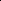

# High-Pass Matters: Theoretical Insights and Sheaflet-Based Design for Hypergraph Neural Networks

<!-- Page 1 -->

High-Pass Matters: Theoretical Insights and Sheaflet-Based Design for

Hypergraph Neural Networks

Ming Li1, Yujie Fang2, Dongrui Shen3, Han Feng3*, Xiaosheng Zhuang3, Kelin Xia4, Pietro Lio5

1Zhejiang Key Laboratory of Intelligent Education Technology and Application, Zhejiang Normal University, Jinhua, China 2School of Computer Science and Technology, Zhejiang Normal University, Jinhua, China 3Department of Mathematics, City University of Hong Kong, Hong Kong, China 4School of Physical & Mathematical Sciences, Nanyang Technological University, Singapore 5Department of Computer Science and Technology, Cambridge University, UK mingli@zjnu.edu.cn, yjfang@zjnu.edu.cn, dongrshen2-c@my.cityu.edu.hk, hanfeng@cityu.edu.hk, xzhuang7@cityu.edu.hk, xiakelin@ntu.edu.sg, pl219@cam.ac.uk

## Abstract

Hypergraph neural networks (HNNs) have shown great potential in modeling higher-order relationships among multiple entities. However, most existing HNNs primarily emphasize low-pass filtering while neglecting the role of highfrequency information. In this work, we present a theoretical investigation into the spectral behavior of HNNs and prove that combining both low-pass and high-pass components leads to more expressive and effective models. Notably, our analysis highlights that high-pass signals play a crucial role in capturing local discriminative structures within hypergraphs. Guided by these insights, we propose a novel sheafletbased HNNs that integrates cellular sheaf theory and framelet transforms to preserve higher-order dependencies while enabling multi-scale spectral decomposition. This framework explicitly emphasizes high-pass components, aligning with our theoretical findings. Extensive experiments on benchmark datasets demonstrate the superiority of our approach over existing methods, validating the importance of highfrequency information in hypergraph learning.

## Appendix

— https://mingli-ai.github.io/HyperSheaflets.pdf

## Introduction

Unlike traditional graphs that model only pairwise relations, hypergraphs capture higher-order interactions among multiple entities, offering richer representations for complex relational structures (Wang and Kleinberg 2024; Mill´an et al. 2025; Antelmi et al. 2023). Recent advances in HNNs have extended spectral and message-passing techniques from graphs to hypergraphs, enabling effective learning over higher-order structures (Kim et al. 2024; Gao et al. 2024). Despite these developments, the spectral design of HNNs remains largely underexplored, particularly in terms of frequency components. While graph neural networks have begun to incorporate both low-pass and high-pass filtering mechanisms (Bo et al. 2021; Zheng et al. 2021; Li et al. 2024), analogous efforts in the hypergraph setting remain

*Corresponding author Copyright © 2026, Association for the Advancement of Artificial Intelligence (www.aaai.org). All rights reserved.

sparse. Most existing HNNs either implicitly favor lowfrequency propagation or neglect the role of high-frequency signals altogether. This gap leaves open a fundamental question: To what extent do high-pass components influence the expressive power and learning performance of HNNs?

In this work, we present a theoretical and practical investigation into this question. We begin by providing rigorous theoretical analysis to demonstrate that incorporating both low-pass and high-pass components yields more expressive and robust hypergraph neural networks than relying on either component alone. Notably, our results reveal that highpass information is particularly essential in capturing finegrained structural variations and node-level distinctions that are often diluted in standard HNN designs. Motivated by these findings, we propose a novel framework, i.e., sheafletbased HNNs, that unifies cellular sheaf theory and framelet transforms to explicitly model both low- and high-frequency components on hypergraphs. The sheaf structure allows us to preserve the directional and functional dependencies in higher-order relations, while framelets provide a principled tool to decompose and process signals at multiple frequency bands, with a particular emphasis on high-pass signals as guided by our theoretical insights.

In summary, our primary contributions are three-fold:

• Theoretical Perspective: We establish a theoretical foundation that characterizes the complementary roles of low- and high-pass components in hypergraph learning, and formally prove that models leveraging both exhibit improved representational capacity.

• Model Design: We propose a Sheaflet-based HGNN framework that integrates the expressive advantages of cellular sheaves and the multi-resolution analysis of framelets, explicitly highlighting and utilizing highfrequency signals.

• Experimental Study: We conduct extensive empirical evaluations across multiple hypergraph benchmarks to validate our theoretical claims and demonstrate the consistent effectiveness of the proposed method.

The Fortieth AAAI Conference on Artificial Intelligence (AAAI-26)

23039

<!-- Page 2 -->

## Related Work

Recent advances in hypergraph learning have yielded various architectures that extend message passing or spectral methods to capture higher-order interactions, including HGNN (Feng et al. 2019), HyperGCN (Yadati et al. 2019), and more recent designs such as HyperND (Prokopchik, Benson, and Tudisco 2022), ED-HNN (Wang et al. 2023), and HDSode(Yan et al. 2024). While some methods explore structural transformations or dynamic systems, the role of frequency components in terms of the spectral perspective remains underexplored. FrameHGNN (Li et al. 2025a) is among the few that incorporate both low- and high-pass signals to address oversmoothing in HNNs. Meanwhile, cellular sheaf theory has been employed to introduce geometric structure into graphs and hypergraphs, such as SheafHyperGNN (Duta et al. 2024), though most focus on singlefrequency propagation. Although some works have explored framelet-based graph neural networks (Zheng et al. 2021; Luo, Mo, and Pan 2024; Li et al. 2024), they do not provide theoretical insights into how low-pass and high-pass components affect model expressivity. Furthermore, the integration of framelets into sheaf-based hypergraph models remains unexplored. While Chen et al. (2023) propose a combination of sheaf and framelet ideas, their work is limited to graphs and does not address hypergraph structures. These gaps motivate our study, in which we provide theoretical insights into the spectral behavior of hypergraph learning, highlighting the significance of high-pass components, and introduces a sheaflet-based model that unifies cellular sheaves and framelet transforms for multi-frequency hypergraph representation learning.

## 3 Theoretical Insights and Findings

In this section, we investigate how high-frequency information influences the generalization error of HNNs in node classification. We first revisit the n-label node classification problem on a hypergraph within a probabilistic framework. Generalization Analysis of Hypergraph Node Classification. Let △n = {x ∈Rn: xj ∈[0, 1] and Pn j=1 xj = 1} and ¯△n = {x ∈Rn: xj ∈{0, 1} and Pn j=1 xj = 1}. Given some observations (x, y) ∈X×Y of nodes/labels, we assume a joint distribution ρ on X ×Y. The task is to learn a classification function f(x) ∈△n, with minimum expected risk R(f), that can predict the label y ∈¯△n for a given node x. Let η(x) ∈△n and the jth component ηj(x) = Pr(y = ej | x) for (x, y) ∼ρ, where ej denotes the jth standard unit vector. We denote the ground truth by fρ = η. Then the generalization error is given by R(f) −R(fρ). Here the expected risk can be defined by 0-1 loss (i.e., 1(f(x)̸ = y) = 1 if f(x)̸ = y, and is zero otherwise), and cross-entropy loss (i.e., ℓ(f(x), y) = Pn j=1 yj log fj(x) for f, y ∈△n). Consider the case n = 2. Let

R(f) =

Z

X×Y

1(f(x)̸ = y)dρ and

Rℓ(f) =

Z

X×Y ℓ(f(x), y)dρ.

Theorem 3.1. Suppose that there exits s ∈(0.5, 1] such that max{η1(x), η2(x)} ≥s for all x ∈X, then

R(f) −R(fρ) ≤ 1 s −0.5[Rℓ(f) −Rℓ(fρ)].

Proof. Let Aj = {x ∈X | Label(fρ(x)) = ej} and Bj = {x ∈X | Label(f(x)) = ej}.

R(f) −R(fρ)

=

X i=1,2

Z

X ηi(x)[1(f(x)̸ = ei) −1(fρ(x)̸ = ei)]dx

=

X i̸=j

Z

X

1(x ∈Ai ∩Bj)[ηi(x) −ηj(x)]dx.

Note that for any x ∈A1 ∩B2, η1(x) > η2(x) but f1(x) ≤ f2(x), which yields

−η1(x) log f1(x) −η2(x) log f2(x) ≥log 2.

Furthermore, we have that

Rℓ(f) −Rℓ(fρ)

=

Z

X

−η1(x) log f1(x) −η2(x) log f2(x)

+ η1(x) log η1(x) + η2(x) log η2(x)dx

≥

Z

X

[1(x ∈A1 ∩B2) + 1(x ∈A2 ∩B1)]·

[log 2 + η1(x) log η1(x) + η2(x) log η2(x)]dx.

Notice that for any t ∈(0, 1), log 2 + t log t + (1 −t) log(1 −t) ≥(2t −1)2/2, which can be verified by checking h′(t) ≥0 and h′′(t) ≥0 with h(t) = log 2+t log t+(1−t) log(1−t)−(2t−1)2/2 for t ≥0.5. Then, by taking t = η1(x) it implies that

2 [Rℓ(f) −Rℓ(fρ)]

≥

X i̸=j

Z

X

[1(x ∈Ai ∩Bj)][ηi(x) −ηj(x)]2dx

≥(2s −1)

X i̸=j

Z

X

[1(x ∈Ai ∩Bj)]|ηi(x) −ηj(x)|dx, where the last inequality is due to the condition max{η1(x), η2(x)} ≥s > 0.5. Therefore, rearranging the above inequality we have

R(f) −R(fρ) ≤ 1 s −0.5 [Rℓ(f) −Rℓ(fρ)].

Corollary 1. Given an encoder f, let η(x; f) = η(f(x)) and the jth component ηj(x; f) = Pr(y = ej | f(x)), for (f(x), y) ∼˜ρ. Then for a decoder g trained with cross entropy loss,

R(g(f)) −R(f˜ρ) ≤ 1 s −0.5[Rℓ(g(f)) −Rℓ(f˜ρ)], where f˜ρ = η(x; f).

23040

<!-- Page 3 -->

Remark 1. The proof of the aforementioned corollary can be accomplished by substituting η(x) with η(x; f).

Remark 2. The component ηj(x; f) is essentially a conditional probability and should be continuous with respect to f. Given two node sets {xm} and {xn}, if we have ηj(xm; f1) > ηj(xm; f2) > 0.5 and ηj(xn; f1) < ηj(xn; f2) < 0.5, then f1 will exhibit relatively more oscillation than f2. Consequently, it is logical to expect that wr(f1, t) > wr(f2, t) for t > 0, since the modulus wr serves as a means of quantifying oscillation. For the definition of modulus, see (Huang et al. 2021) in details.

In the following theorem, we will demonstrate that a highpass filter has the capacity to augment the oscillation of feature expressions.

Theorem 3.2. If H is a highpass filter with all nonzero eigenvalues having lower bound β > 1, then ωr(Hf, t) ≥βωr(f, t).

Proof. Let H = U diag(h1, h2,..., hN)U ∗. When H is a highpass filter with β > 1, we have 0 = h1 < β < h2 ≤ · · · ≤hN. By definition of ωr(f, t), for any s ∈R,

∥(Ts −I)rHf∥2

2 =

N X j=2

|eis√ λj −1|2r|hj ˆf(j)|2

≥β2

N X j=2

|eis√ λj −1|2r| ˆf(j)|2

= β2∥(Ts −I)rf∥2

2.

This proves ∥(Ts −I)rHf∥2 ≥β∥(Ts −I)rf∥2. Due to the arbitrariness of s, we have ωr(Hf, t) ≥βωr(f, t).

Our result shows that representations with larger values of s lead to tighter generalization bounds. This insight motivates a principled approach to design representations that explicitly maximize s, which we address next through framelet analysis on hypergraphs. Framelet-Based Representation Learning for Optimal Generalization. Consider a hypergraph G = (V, E) with N nodes and hypergraph Laplacian L. Let U = [u1,..., uN] denote the matrix of eigenvectors of L, and Λ = diag (λ1,..., λN) be the diagonal matrix of the eigenvalues. We define the Fourier transform for a signal x ∈RN on hypergraph as bx = U⊤x, and the inverse Fourier transform as x = Ubx. Given a set of filters {ar: 0 ≤r ≤ R}, the discrete J-level tight wavelet frame decomposition of x is defined as {Wr,jx: (r, j) ∈Γ} with Γ = {(1, 1), (2, 1),..., (R, 1), (1, 2),..., (R, J)}∪{(0, J)} and

W0,J = Uba∗

0

2−S+J−1Λ

· · · ba∗ 0

2−SΛ

U⊤,

Wr,1 = Uba∗ r

2−SΛ

U⊤,

Wr,j =Uba∗ r

2−S+j−1Λ ba∗

0

2−S+j−2Λ

· · · ba∗ 0

2−SΛ

U⊤ where h∗denotes the complex conjugate of h. Here, S is chosen to be sufficiently large such that the largest eigenvalue λmax of the hypergraph Laplacian satisfies λmax ≤ 2Sπ. The band of the transform is indicated by index r, where r = 0 corresponds to the low frequency component, while 1 ≤r ≤R represents the high-frequency components. The index j denotes the level of the transform. The tightness of the framelet system can be guaranteed by the condition, PR r=1 |bar(ξ)|2 = 1. This ensures that framelet decomposition and reconstruction are invertible, i.e., W⊤

0,JW0,Jx + P r,j W⊤ r,jWr,jx = x. Next we present a Gaussian denoising model that incorporates a frameletbased sparse prior. Theorem 3.3. Consider the additive noise model x = z + σn, with σ > 0 and n ∼N(0, I). Let g(u; γ) = P i γi|ui| denote the weighted ℓ1-norm of u with non-negative parameter γ. We impose a sparsity enforcing prior on z with the tight framelet transform {Wr,j: (r, j) ∈Γ}, i.e., p(z) ∝ exp[−P r,j g(Wr,jz; γr,j)]. Then the MAP estimate is given by z∗= P r,j W⊤ r,jΘr,jWr,jx, where Θr,j are shrinkagethresholding matrices depending on σ, γr,j and Wr,j.

Proof. The MAP estimate maximizes the posterior p(z|x) ∝p(x|z)p(z). Then z∗= argmax z [log p(x|z) + log p(z)].

Substituting the likelihood and prior gives z∗= argmin z



1

2σ2 ∥x −z∥2 2 + X r,j g(Wr,jz; γr,j)



.

By optimality condition, we have

1 σ2 (z∗−x) +

X r,j

∂g(Wr,jz∗; γr,j) ∋0.

Note that the subdifferential of the weighted ℓ1-norm is explicitly given by

∂g(Wr,jz∗; γr,j) = W⊤ r,j ∂g(u; γr,j)|u=Wr,jz∗, where

∂g(u; γr,j) = γr,j ⊙s: ∥s∥∞≤1, s⊤u = ∥u∥1

.

Due to the tight framelet condition, we can decouple the above problem in the transform domain. For each (r, j) ∈Γ we impose that

1 σ2 Wr,j(z∗−x) + ∂g(u; γr,j)|u=Wr,jz∗∋0.

The above inclusion is equivalent to the proximal operator of g(·; σ2γr,j), i.e.,

Wr,jz∗= proxg(Wr,jx), such that

(Wr,jz∗)i =  



(Wr,jx)i −σ2(γr,j)i if (Wr,jx)i > σ2(γr,j)i, (Wr,jx)i + σ2(γr,j)i if (Wr,jx)i < −σ2(γr,j)i, 0 otherwise.

23041

<!-- Page 4 -->

That is

Wr,jz∗= Θr,jWr,jx, where Θr,j = diag(θr,j) and each element of θr,j is defined as

(θr,j)i =

(

1 −σ2(γr,j)i |(Wr,jx)i| if |(Wr,jx)i| > σ2(γr,j)i, 0 otherwise. Again, we apply the tight framelet condition to derive z∗ z∗=

X r,j

W⊤ r,jΘr,jWr,jx.

Remark 3. Suppose the regularization parameters satisfy that γr,j →+∞elementwise for all (r, j) ∈Γ except the index of the low-pass filter (0, J), while λ0,J remains fixed. Then the MAP estimate z∗converges to the lowpass only form, zL = W⊤

0,JΘ0,JW0,Jx. We can also derive a similar result for the high-pass only estimate, zH = P

(r,j)̸=(0,J) W⊤ r,jΘr,jWr,jx. Remark 4. The MAP estimate z∗maximizes the oscillation measure s under mild conditions. Let s(z) = maxj p(y = ej, z) and k∗be the corresponding maximizer. Assume that Pr(y = ej|x) = 1 if j = k∗and is zero otherwise. Then s(z) = Pr(y = ek∗|x)p(x|z) ∝p(x, z), aligning the maximization of s(z) with the joint likelihood. Further we can apply Theorem 3.3 to evaluate, in terms of s, the representations learned via low-pass and high-pass framelets respectively. Theorem 3.4. In the setting of Theorem 3.3, let s(z) = log p(x, z) be the log-likelihood function, and define the low-pass and high-pass estimates:

zL = W⊤

0,JΘ0,JW0,Jx, zH =

X

(r,j)̸=(0,J)

W⊤ r,jΘr,jWr,jx.

Let λmin denote the smallest non-zero eigenvalue of the hypergraph Laplacian. Suppose the low-pass filter a0 satisfies ba0(0) = 1, a = QJ−1 j=0 |ba0

2−S+jλmin

|2 < 1

## 2. If the highfrequency components of x dominate in the sense that:

(1 −2a)



 X λk≥λmin

|bxk|2





1 2

≥

" X λk<λmin

|bxk|2

## 1

2 +

X

(r,j)∈Γ

∥I −Θr,j∥2 ∥bx∥2 +

√

2σε, where ε =max

(X

(r,j)∈Γ g(Wr,jzH; γr,j) −g(Wr,jzL; γr,j)

, 0

) 1

2.

Then we have that s(zL) ≤s(zH).

The proof of Theorem 3.4 is provided in the Appendix. Our analysis shows that the MAP estimate z∗under this model not only admits a closed-form framelet convolution but also favors high-frequency components. These results provide a theoretical foundation for the design of our proposed architecture, which leverages both low-frequency and high-frequency framelet coefficients to improve generalization, as detailed in the next section.

HyperSheaflets In this section, we present the framework of designing sheaflet-based hypergraph neural networks, termed Hyper- Sheaflets, which integrates both low-pass and high-pass filtering by combining cellular sheaf theory with framelet transforms on hypergraphs. To lay the foundation for our model design, we first revisit the definition of cellular sheaves on hypergraphs and the associated linear sheaf hypergraph Laplacian, as introduced by Duta et al. (2024). Basics of Sheaves on Hypergraphs. A cellular sheaf F associated with a hypergraph H is defined as a triple ⟨F(v), F(e), Fv⊴e⟩, where: i) F(v) are vertex stalks: vector spaces associated with each node v; ii) F(e) are hyperedge stalks: vector spaces associated with each hyperedge e; iii) Fv⊴e: F(v) →F(e) are restriction maps: linear maps between each pair v ⊴e, if hyperedge e contains node v.

Then, the linear sheaf hypergraph Laplacian is defined as:

(LF)vv =

X e;v∈e

1 δe

FT v⊴eFv⊴e ∈Rd×d and

(LF)uv = −

X e;u,v∈e

1 δe

FT u⊴eFv⊴e ∈Rd×d, where d is the dimension of the sheaf, Fv⊴e: Rd →Rd represents the linear restriction maps guiding the flow of information from node v to hyperedge e.

In particular, the linear sheaf Laplacian operator for node v applied on a signal x ∈RN×d can be rewritten as:

LF(x)v =

X e;v∈e

1 δe

FT v⊴e(

X u∈e u̸=v

(Fv⊴exv −Fu⊴exu)). (1)

Construction of Sheaflets on Hypergraphs. Following the graph-based sheaflet construction (Chen et al. 2023), we analogously construct hypergraph sheaflets, with careful consideration of hypergraph sheaf theory and guidance from our prior graph framelet framework (Zheng et al. 2021). Let {(ul, λl)}Nd l=1 denote the eigenpairs of the linear sheaf hypergraph Laplacian LF. For j ∈Z and p ∈V, we define the undecimated sheaflets ϕj,p(v) and ψr j,p(v), v ∈V at scale j as follows:

ϕj,p(v):=

Nd X l=1 bα λl

2j ul(p)ul(v), ψr j,p(v):=

Nd X l=1 bβ λl

2j ul(p)ul(v), r = 1,..., n.

(2)

Here, the scaling functions {α; β(1),..., β(n)}, are associated with a filter bank η = {a; b(1),..., b(n)}, satisfying bα(2ξ) = ba(ξ)bα(ξ), bβ(r)(2ξ) = bb(r)(ξ)bα(ξ), ∀ξ ∈R, where bh(ξ) denotes the Fourier transform of a function h, defined by bh(ξ):= P k∈Z h(k) e−2πikξ. Here, α corresponds to the low-pass scaling function, while {β(r)}n r=1

23042

<!-- Page 5 -->

e1 e2 e3

...

Decomposition

,r j W

Reconstruction

,r j F W

Feature

Matrix diag() Low-Pass

High-Pass

1yˆ

...

2 yˆ

3 yˆ

4 yˆ n yˆ

Labels

MLP e1 e2 e3 e1 e3...

e1 e2 e3

HyperSheaflets

Convolution filters

**Figure 1.** An overview of HyperSheaflets.

represent the high-pass functions, and n is the number of high-pass channels in the filter bank.

Sheaflet coefficients V0, W r j ∈RNd×m are defined as:

V0 = ⟨ϕ0,·, X⟩= U⊤bα

Λ

2

UX,

W r j = ψr j,·, X

= U⊤d β(r) Λ

2j+1

UX,

(3)

where X ∈RNd×m denotes the sheaf signal, m is the feature dimension.

Let Wr,j denote the decomposition operators given by V0 = W0,JX and W r j = Wr,jX. To avoid the computational burden of directly computing the eigendecomposition of sheaf Laplacian LF, the Chebyshev polynomials T0, · · ·, Tt of fixed degree t are adopted to approximate the filter bank, where a ≈T0 and b(r) ≈Tr. Consequently, the decomposition operators Wr,j can be approximated as

W0,J ≈U⊤T0(2−K+J−1Λ) · · · T0(2−KΛ)U

= T0(2K+J−2LF) · · · T0(2−KLF),

Wr,1 ≈U⊤Tr(2−KΛ)U = Tr(2−KLF),

Wr,j ≈U⊤Tr(2−K+j−1Λ)T0(2−K+j−2Λ) · · · T0(2−KΛ)U

= Tr(2K+j−1LF)T0(2K+j−2LF) · · · T0(2−KLF).

Hypergraph Neural Networks with Sheaflets. Given a hypergraph G = (V, E), where each node is associated with a feature representation X ∈RN×m, we begin by applying a linear projection to map the input features into a higherdimensional space ˜X ∈RN×(dm). We then reshape ˜X into RNd×m to obtain a structure compatible with the vertex stalk representation. As a result, each node is embedded as a matrix in Rd×m, where d denotes the dimension of the vertex stalk and m corresponds to the number of feature chan- nels. Based on the constructed sheaflet operators on hypergraphs, i.e., W0,J, Wr,j as defined above, we formulate a hypergraph neural network consisting of two layers of sheafletbased spectral convolution. Specifically, the forward propagation is defined as:

˜X(ℓ+1) =σ

W⊤

0,JΘ0,JW0,J ˜X(ℓ)W0,J

+

X r,j

W⊤ r,jΘr,jWr,j ˜X(ℓ)Wr,j

, where ℓ= 0, 1 denotes the first and second layers, respectively, and ˜X(0):= ˜X is the initial input feature matrix. The diagonal matrices Θ0,J = diag(θ0,J), Θr,j = diag(θr,j) contain learnable spectral filter coefficients for the low- and high-frequency components, respectively. The matrices with W0,J, Wr,j are trainable transformation weights applied to the corresponding frequency responses. The nonlinearity σ(·) denotes an activation function such as ReLU. Remark 5. The overall architecture of HyperSheaflets is shown in Figure 1, where we adopt a two-layer design consistent with our experimental setup. In principle, the framework can be extended to deeper architectures by incorporating residual connections and identity mappings, following (Chen et al. 2020). These mechanisms help preserve initial node features and enable stable training by alleviating oversmoothing. A generalized propagation rule for such deeper variants can be expressed as:

˜X(ℓ+1) =σ

1 −αℓ

W⊤

0,JΘ0,JW0,J ˜X(ℓ)+ X r,j

W⊤ r,jΘr,j

· Wr,j ˜X(ℓ) + αℓ˜X

(1 −βℓ)I + βℓΘ(ℓ)

, where αℓ, βℓare two hyperparameters, Θ(ℓ) is the trainable parameter matrix.

23043

AI-readable visual equivalent, added: Figure extracted from the paper PDF and converted to an SVG wrapper asset. Use the surrounding page text and caption for interpretation.

AI-readable visual equivalent, added: Figure extracted from the paper PDF and converted to an SVG wrapper asset. Use the surrounding page text and caption for interpretation.

AI-readable visual equivalent, added: Figure extracted from the paper PDF and converted to an SVG wrapper asset. Use the surrounding page text and caption for interpretation.

AI-readable visual equivalent, added: Figure extracted from the paper PDF and converted to an SVG wrapper asset. Use the surrounding page text and caption for interpretation.

AI-readable visual equivalent, added: Figure extracted from the paper PDF and converted to an SVG wrapper asset. Use the surrounding page text and caption for interpretation.

AI-readable visual equivalent, added: Figure extracted from the paper PDF and converted to an SVG wrapper asset. Use the surrounding page text and caption for interpretation.

AI-readable visual equivalent, added: Figure extracted from the paper PDF and converted to an SVG wrapper asset. Use the surrounding page text and caption for interpretation.

AI-readable visual equivalent, added: Figure extracted from the paper PDF and converted to an SVG wrapper asset. Use the surrounding page text and caption for interpretation.

AI-readable visual equivalent, added: Figure extracted from the paper PDF and converted to an SVG wrapper asset. Use the surrounding page text and caption for interpretation.

<!-- Page 6 -->

Datasets Cora Citeseer Pubmed Cora-CA DBLP-CA Congress

HGNN 79.39 ± 1.36 72.45 ± 1.16 86.44 ± 0.44 82.64 ± 1.65 91.03 ± 0.20 91.26 ± 1.15 HyperGCN 78.45 ± 1.26 71.28 ± 0.82 82.84 ± 8.67 79.48 ± 2.08 89.38 ± 0.25 55.12 ± 1.96 UniGCNII 78.81 ± 1.05 73.05 ± 2.21 88.25 ± 0.40 83.60 ± 1.14 91.69 ± 0.19 94.81 ± 0.81 HyperND 79.20 ± 1.14 72.62 ± 1.49 86.68 ± 1.32 80.62 ± 1.32 90.35 ± 0.26 74.63 ± 3.62 AllDeepSets 76.88 ± 1.80 70.83 ± 1.63 88.75 ± 0.33 81.97 ± 1.50 91.27 ± 0.27 91.80 ± 1.53 AllSetTransformer 78.58 ± 1.47 73.08 ± 1.20 88.72 ± 0.37 83.63 ± 1.47 91.53 ± 0.23 92.16 ± 1.05 ED-HNN 80.31 ± 1.35 73.70 ± 1.38 89.03 ± 0.53 83.97 ± 1.55 91.90 ± 0.19 95.00 ± 0.99 SheafHyperGNN 81.30 ± 1.70 74.71 ± 1.23 87.68 ± 0.60 85.52 ± 1.28 91.59 ± 0.24 91.81 ± 1.60 HyperUFG 81.51 ± 0.99 74.72 ± 2.10 88.73 ± 0.42 85.18 ± 0.69 91.67 ± 0.31 OOM HyperSheaflets(Ours) 81.60 ± 1.92 75.19 ± 1.80 87.19 ± 0.45 85.85 ± 0.92 91.58 ± 0.27 92.07 ± 1.22

Datasets Senate House Actor Amazon Twitch Pokec Rank(↑)

HGNN 48.59 ± 4.52 61.39 ± 2.96 74.47 ± 0.32 23.79 ± 0.24 51.88 ± 0.26 49.82 ± 0.27 8 HyperGCN 42.45 ± 3.67 48.32 ± 2.93 68.67 ± 4.38 22.53 ± 3.94 51.32 ± 1.02 52.43 ± 3.68 10 UniGCNII 49.30 ± 4.25 67.25 ± 2.57 80.48 ± 1.13 26.63 ± 1.32 50.84 ± 0.76 54.25 ± 2.70 5 HyperND 52.82 ± 3.20 51.70 ± 3.37 92.52 ± 0.81 26.08 ± 0.33 51.44 ± 0.67 55.94 ± 0.45 7 AllDeepSets 48.17 ± 5.67 67.82 ± 2.40 82.00 ± 2.33 18.60 ± 0.17 50.72 ± 0.96 51.11 ± 1.04 9 AllSetTransformer 51.83 ± 5.22 69.33 ± 2.20 83.39 ± 1.73 18.60 ± 0.17 50.45 ± 0.76 58.40 ± 0.42 ED-HNN 64.79 ± 5.14 72.45 ± 2.28 91.86 ± 0.43 26.21 ± 0.36 50.86 ± 0.88 59.11 ± 0.57 3rd SheafHyperGNN 68.73 ± 4.68 73.84 ± 2.30 80.09 ± 2.45 26.93 ± 3.04 51.03 ± 0.76 55.34 ± 4.39 4 HyperUFG 67.61 ± 7.00 72.82 ± 2.22 89.32 ± 0.75 40.53 ± 2.25 52.35 ± 0.04 62.30 ± 0.12 2nd HyperSheaflets(Ours) 69.01 ± 5.39 74.49 ± 1.21 84.77 ± 0.53 27.13 ± 0.48 52.29 ± 0.59 59.81 ± 0.55 1st

**Table 1.** Accuracy (%) comparison across 12 datasets, including six homophilic and six heterophilic ones. Results are reported as mean and standard deviation over 10 runs. Best results are in bold; second-best are underlined. OOM: out-of-memory.

5 Experiments 5.1 Experimental Setups Datasets. We evaluate HyperSheaflets on 12 benchmark datasets: Cora, Citeseer, Pubmed, Cora-CA, DBLP-CA (Yadati et al. 2019), House (Chodrow, Veldt, and Benson 2021), Senate, Congress (Fowler 2006), and four recently introduced heterophilic hypergraph datasets, Actor, Twitch, Amazon, and Pokec (Li et al. 2025b). For the first eight datasets, we use a 50%/25%/25% train/validation/test split, while the heterophilic datasets follow the 40%/20%/40% protocol of (Li et al. 2025b) for fair comparison. Dataset statistics, including node- and hyperedge-level homophily (Hnode and Hedge), are summarized in the Appendix. According to homophily ratios, the datasets are grouped into eight homophilic and six heterophilic ones. All models are trained for up to 1,000 epochs with early stopping (patience = 200), and results are reported as the mean accuracy and standard deviation over 10 random splits. Baselines. We compare HyperSheaflets against 9 existing models, including HGNN (Feng et al. 2019), Hyper- GCN (Yadati et al. 2019), UniGCNII (Huang and Yang 2021), HyperND (Prokopchik, Benson, and Tudisco 2022), AllDeepSets (Chien et al. 2022), AllSetTransformer (Chien et al. 2022), ED-HNN (Wang et al. 2023), SheafHyper- GNN (Duta et al. 2024), HyperUFG (Li et al. 2025b).

## 5.2 Overall Performance Comparison Table 1 summarizes the performance of

HyperSheaflets on node classification tasks across eight widely used benchmarks and four recently introduced heterophilic datasets. The results demonstrate that our model consistently performs well across all datasets and achieves state-of-theart performance on the majority of them. Notably, Hyper- Sheaflets shows clear advantages on challenging datasets such as Senate, House, Twitch, and Pokec, highlighting its strong capacity to model complex higher-order relationships. These results underscore the model’s robustness and its effectiveness in handling both homophilic and heterophilic hypergraph structures.

1 2 4 8 16 32 The number of layers

65

70

75

80

Accuracy (%)

Citeseer

1 2 4 8 16 32 The number of layers

65

70

75

80

Accuracy (%)

House

**Figure 2.** Illustration of how HyperSheaflets alleviate oversmoothing.

Potential for Preventing Oversmoothing. We conduct a set of experiments to examine whether HyperSheaflets can maintain stable performance as the network depth increases, i.e., a key indicator of resistance to oversmoothing, which is a well-known limitation in deep GNNs and HNNs. As shown in Figure 2, HyperSheaflets exhibits stable accuracy across a wide range of layer depths (from 1 to 32) on Citeseer and House datasets, which are representative of homophilic and heterophilic hypergraphs, respectively. These results suggest that the proposed model is less prone to oversmoothing, likely due to its multi-frequency design and sheaf-based formulation. While this issue is not the primary focus of our work, the findings highlight the model’s potential for enabling deeper architectures without substantial performance degradation.

## 5.3 Parameter Sensitivity Analysis The scale level in

HyperSheaflets controls the number of hierarchical resolutions used for multi-scale spectral decom-

23044

<!-- Page 7 -->

Datasets Cora Citeseer Pubmed Cora-CA DBLP-CA Congress

Full model 81.60 ± 1.92 75.19 ± 1.80 87.19 ± 0.45 85.85 ± 0.92 91.58 ± 0.27 92.07 ± 1.22 w/o low pass 81.08 ± 1.68 74.23 ± 1.59 86.66 ± 0.53 85.35 ± 1.03 91.42 ± 0.21 91.70 ± 1.54 w/o high pass 30.77 ± 1.85 51.10 ± 1.47 40.19 ± 2.02 22.98 ± 1.93 26.70 ± 0.54 51.67 ± 1.77

Datasets Senate House Actor Amazon Twitch Pokec

Full model 69.01 ± 5.39 74.49 ± 1.21 84.77 ± 0.53 27.13 ± 0.48 52.29 ± 0.59 59.81 ± 0.55 w/o low pass 65.63 ± 5.48 73.68 ± 2.12 84.53 ± 0.45 26.99 ± 0.22 51.93 ± 0.55 59.62 ± 0.45 w/o high pass 64.51 ± 7.51 54.58 ± 3.63 62.41 ± 0.81 26.39 ± 0.70 50.79 ± 0.84 50.41 ± 0.75

**Table 2.** Ablation study on the contributions of low-pass and high-pass components.

position, ranging from the coarsest scale (capturing global structures) to the finest scale (capturing localized variations). We examine its influence by varying the scale level from 1 to 6 on the Citeseer and House datasets. As shown in Figure 3, the model exhibits stable performance across different settings, with slightly better accuracy achieved at lower levels (e.g., 1 or 2). These results suggest that a small number of scales is sufficient for capturing meaningful multifrequency representations, while higher scale levels may introduce redundancy and impose additional computational overhead without significant performance improvement.

1 2 3 4 5 6 The scale level

65

70

75

80

Accuracy (%)

Citeseer

1 2 3 4 5 6 The scale level

65

70

75

80

Accuracy (%)

House

**Figure 3.** Impact of scale level on the overall performance.

## 5.4 Ablation Study and Visualization

To assess the necessity of both low- and high-pass components in HyperSheaflets, we conduct an ablation study by removing each frequency component in turn. Specifically, we compare the full model with two variants: without lowpass and without high-pass. As shown in Table 2, removing the high-pass component consistently causes severe performance degradation across all datasets, underscoring the crucial role of high-pass signals in capturing local variations and preserving node-level discriminability, particularly in non-homophilic or structurally complex settings. In contrast, removing the low-pass component leads to only marginal declines on most datasets, suggesting that although low-pass information aids smoothing and global consistency, it is less critical than high-pass information in our model. These results further corroborate our theoretical finding that highfrequency components play a dominant role in enhancing the expressivity of hypergraph neural networks. Figure 4 further illustrates this observation through a visualization of node embeddings on the Cora dataset. The full model yields well-separated clusters, while the removal of high-pass components leads to severe mixing of class distributions. The

**Figure 4.** Visualization of node embeddings on Cora for the full HyperSheaflets model and its ablated variants.

model without low-pass filtering still maintains clear boundaries among classes, though the clusters are slightly less compact. Overall, the ablation results validate our spectral design and demonstrate that the high-pass component is indispensable for effective hypergraph learning, which aligns well with our theoretical results and insights.

## 6 Conclusion

This work provides a theoretical and empirical investigation into the role of spectral components in HNNs. We prove that combining both low-pass and high-pass signals enhances the expressive power of HNNs, with high-pass components playing a particularly critical role in capturing fine-grained relational structures. Motivated by these insights, we propose HyperSheaflets, a novel sheaflet-based HNNs that integrates cellular sheaf theory and framelet transforms to perform multi-frequency signal processing on hypergraphs. Our model effectively preserves higher-order relational dependencies while emphasizing high-frequency information. Inspired by our theoretical results and analysis, future work is expected to explore more advanced hypergraph neural networks with well-designed multi-frequency filters in the context of complex real-world applications.

23045

AI-readable visual equivalent, added: Figure extracted from the paper PDF and converted to an SVG wrapper asset. Use the surrounding page text and caption for interpretation.

<!-- Page 8 -->

## Acknowledgements

This work was supported in part by the “Pioneer” and “Leading Goose” R&D Program of Zhejiang (No. 2024C03262), and the National Natural Science Foundation of China (No. U21A20473, No. 62172370, No. 62536006, No. 62576371). H. Feng was supported in part by Research Grants Council of Hong Kong under Project CityU11315522 and CityU11303821. X. Zhuang was supported in part by the Research Grants Council of Hong Kong (Project no. CityU 11309122, CityU 11302023, CityU 11301224, and CityU 11300825).

## References

Antelmi, A.; Cordasco, G.; Polato, M.; Scarano, V.; Spagnuolo, C.; and Yang, D. 2023. A survey on hypergraph representation learning. ACM Computing Surveys, 56(1): 1–38. Bo, D.; Wang, X.; Shi, C.; and Shen, H. 2021. Beyond lowfrequency information in graph convolutional networks. In AAAI, 3950–3957. Chen, J.; Wang, Y.; Bodnar, C.; Ying, R.; Lio, P.; and Wang, Y. G. 2023. Dirichlet energy enhancement of graph neural networks by framelet augmentation. arXiv preprint arXiv:2311.05767. Chen, M.; Wei, Z.; Huang, Z.; Ding, B.; and Li, Y. 2020. Simple and deep graph convolutional networks. In ICML, 1725–1735. PMLR. Chien, E.; Pan, C.; Peng, J.; and Milenkovic, O. 2022. You are AllSet: a multiset function framework for hypergraph neural networks. In ICLR. Chodrow, P. S.; Veldt, N.; and Benson, A. R. 2021. Generative hypergraph clustering: from blockmodels to modularity. Science Advances, 7(28): eabh1303. Duta, I.; Cassar`a, G.; Silvestri, F.; and Li`o, P. 2024. Sheaf hypergraph networks. In NeurIPS, 36: 12087–12099. Feng, Y.; You, H.; Zhang, Z.; Ji, R.; and Gao, Y. 2019. Hypergraph neural networks. In AAAI, 3558–3565. Fowler, J. H. 2006. Legislative cosponsorship networks in the US House and Senate. Social Networks, 28(4): 454–465. Gao, Y.; Ji, S.; Han, X.; and Dai, Q. 2024. Hypergraph computation. Engineering, 40: 188–201. Huang, C.; Zhang, Q.; Huang, J.; and Yang, L. 2021. Approximation theorems on graphs. Journal of Approximation Theory, 270: 105620. Huang, J.; and Yang, J. 2021. UniGNN: a unified framework for graph and hypergraph neural networks. In IJCAI, 2563– 2569. Kim, S.; Lee, S. Y.; Gao, Y.; Antelmi, A.; Polato, M.; and Shin, K. 2024. A survey on hypergraph neural networks: An in-depth and step-by-step guide. In KDD, 6534–6544. Li, J.; Zheng, R.; Feng, H.; Li, M.; and Zhuang, X. 2024. Permutation equivariant graph framelets for heterophilous graph learning. IEEE Transactions on Neural Networks and Learning Systems, 35(9): 11634–11648. Li, M.; Fang, Y.; Wang, Y.; Feng, H.; Gu, Y.; Bai, L.; and Lio, P. 2025a. Deep hypergraph neural networks with tight framelets. In AAAI, 18385–18392.

Li, M.; Gu, Y.; Wang, Y.; Fang, Y.; Bai, L.; Zhuang, X.; and Lio, P. 2025b. When hypergraph meets heterophily: New benchmark datasets and baseline. In AAAI, 18377–18384. Luo, T.; Mo, Z.; and Pan, S. J. 2024. Learning adaptive multiresolution transforms via meta-framelet-based graph convolutional network. In ICLR. Mill´an, A. P.; Sun, H.; Giambagli, L.; Muolo, R.; Carletti, T.; Torres, J. J.; Radicchi, F.; Kurths, J.; and Bianconi, G. 2025. Topology shapes dynamics of higher-order networks. Nature Physics, 21: 353––361. Prokopchik, K.; Benson, A. R.; and Tudisco, F. 2022. Nonlinear feature diffusion on hypergraphs. In ICML, 17945– 17958. Wang, P.; Yang, S.; Liu, Y.; Wang, Z.; and Li, P. 2023. Equivariant hypergraph diffusion neural operators. In ICLR. Wang, Y.; and Kleinberg, J. 2024. From Graphs to Hypergraphs: Hypergraph Projection and its Reconstruction. In ICLR. Yadati, N.; Nimishakavi, M.; Yadav, P.; Nitin, V.; Louis, A.; and Talukdar, P. 2019. HyperGCN: A new method for training graph convolutional networks on hypergraphs. In NeurIPS, 1511–1522. Yan, J.; Feng, Y.; Ying, S.; and Gao, Y. 2024. Hypergraph dynamic system. In ICLR. Zheng, X.; Zhou, B.; Gao, J.; Wang, Y. G.; Li´o, P.; Li, M.; and Mont´ufar, G. 2021. How framelets enhance graph neural networks. In ICML, 12761–12771.

23046
