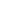

# HyperNoRA: Hyperedge Prediction via Node-Level Relation-Aware Self-Supervised Hypergraph Learning

<!-- Page 1 -->

HyperNoRA: Hyperedge Prediction via Node-Level Relation-Aware

Self-Supervised Hypergraph Learning

Ming Li1, Zhanle Zhu*2, Xinyi Li*2, Lu Bai3, Lixin Cui4, Feilong Cao5†, Ke Lv6,7

1Zhejiang Key Laboratory of Intelligent Education Technology and Application, Zhejiang Normal University, Jinhua, China 2School of Computer Science and Technology, Zhejiang Normal University, Jinhua, China 3School of Artificial Intelligence, Beijing Normal University, Beijing, China 4Central University of Finance and Economics, Beijing, China. 5School of Mathematical Sciences, Zhejiang Normal University, Jinhua, China 6School of Engineering Science, University of Chinese Academy of Sciences, Beijing, China 7Peng Cheng Laboratory, Shenzhen, China mingli@zjnu.edu.cn, zzl0826@zjnu.edu.cn, xinyili@zjnu.edu.cn, bailu@bnu.edu.cn, cuilixin@cufe.edu.cn, caofeilong88@zjnu.edu.cn, luk@ucas.ac.cn

## Abstract

Hyperedge prediction plays a critical role in high-order relational modeling with hypergraphs, yet most existing methods primarily focus on sampling strategies or local aggregation within candidate hyperedges. These approaches often overlook global structural dependencies that are essential for learning expressive node and hyperedge representations. In this paper, we propose HyperNoRA, a novel self-supervised hypergraph learning framework that integrates global nodelevel relation awareness with contrastive learning. Specifically, we construct a global node relation graph that captures both direct and indirect structural correlations, which guides a structure-aware aggregator to enhance node representations with informative global context. To prevent over-smoothing and maintain discriminability, a contrastive learning module is introduced to align representations across graph augmentations while separating semantically dissimilar nodes. Extensive experiments on several benchmark datasets demonstrate that HyperNoRA consistently outperforms state-of-theart baselines, and ablation studies verify the effectiveness of its key components.

## Introduction

Hypergraphs offer a natural and flexible framework for modeling high-order relations in complex systems, where each hyperedge can connect more than two nodes simultaneously (Wang and Kleinberg 2024; Mill´an et al. 2025). This capability makes hypergraphs particularly suitable for a wide range of applications such as drug-target interaction, coauthorship networks, and group recommendation (Antelmi et al. 2023; Zhang et al. 2025). In these contexts, hyperedge prediction, the task of inferring missing or potential hyperedges based on observed hypergraph structures, plays a crucial role in uncovering hidden group-level associations and completing high-order relational data (Chen and Liu 2024).

*These authors contributed equally. †Corresponding author Copyright © 2026, Association for the Advancement of Artificial Intelligence (www.aaai.org). All rights reserved.

With the development of hypergraph neural networks (Kim et al. 2024; Feng et al. 2019; Wang et al. 2023; Li et al. 2025a), several efforts have been made to improve hyperedge prediction through advanced representation learning techniques.

Despite the importance of hyperedge prediction, existing studies predominantly focus on auxiliary techniques such as negative sampling and loss optimization (Hwang et al. 2022; Wang et al. 2025), while paying limited attention to the core design of node aggregation mechanisms. This oversight restricts the ability of models to generate expressive representations for candidate hyperedges. Although recent work like CASH (Ko, Tong, and Kim 2025) introduces contextaware aggregation to capture intra-hyperedge node importance, it remains confined to local information and neglects global structural signals across the hypergraph. Such global dependencies often encode latent semantic constraints and long-range relational patterns that are crucial for accurate hyperedge inference. Without modeling these signals, current methods risk learning incomplete or non-discriminative hyperedge representations, especially under sparse or noisy hypergraph settings.

To address the limitations of existing hyperedge prediction approaches, we propose HyperNoRA, a self-supervised hypergraph learning framework that integrates global structure modeling and discriminative representation learning. The framework is built upon two key components: a structure-aware aggregator and a contrastive learning module, which together enhance the quality of node and hyperedge representations. Specifically, we construct a global node relation graph from the original hypergraph, where both direct hyperedge connections and indirect structural correlations are encoded via shortest-path distances. This graph enables the structure-aware aggregator to identify and incorporate globally relevant neighbors for each node within a candidate hyperedge, thereby enriching node representations with global context beyond local hyperedge boundaries. Such integration of structural signals improves the expressiveness of the learned embeddings. To mitigate po-

The Fortieth AAAI Conference on Artificial Intelligence (AAAI-26)

23047

<!-- Page 2 -->

tential representation homogenization caused by repeatedly aggregating similar neighbors across different hyperedges, we introduce a contrastive learning module that generates two structurally perturbed views of the hypergraph. This module aligns corresponding node embeddings across views while encouraging separation between semantically dissimilar but structurally correlated nodes. The joint optimization of these components allows HyperNoRA to produce robust, diverse, and semantically meaningful node representations, ultimately leading to more accurate and generalizable hyperedge prediction. Experimental results on four real-world benchmark datasets show that HyperNoRA consistently outperforms state-of-the-art baselines across multiple evaluation metrics. Further ablation studies verify the effectiveness of both the structure-aware aggregator and the contrastive learning module in improving prediction performance.

In summary, the primary contributions of this work are three-fold:

• We propose HyperNoRA, a novel model for hyperedge prediction that integrates a structure-aware aggregator and a semantic-aware aggregator, jointly enhancing hyperedge representations by modeling global structural dependencies and local semantic relevance.

• We construct a global node relation graph that explicitly captures high-order structural correlations among nodes via a shortest-path-based formulation.

• We conduct extensive experiments on several benchmark datasets, demonstrating that HyperNoRA consistently outperforms state-of-the-art baselines across multiple evaluation metrics.

## Preliminaries

Notation and Problem Definition. We denote a hypergraph as H = (V, E), where V = {v1,..., v|V|} is the set of nodes and E = {e1,..., e|E|} is the set of hyperedges. Each node vi ∈V is associated with a feature vector xi ∈Rf, and the node feature matrix is denoted as X ∈R|V|×f. A hyperedge ej ∈E is assigned a positive weight wjj, appearing on the diagonal of the weight matrix W ∈R|E|×|E|. The hypergraph structure is captured by an incidence matrix H ∈{0, 1}|V|×|E|, where hij = 1 if vi ∈ej and 0 otherwise. The node degree matrix DV is diagonal with entries dv ii = P j wjjhij, and the hyperedge degree matrix DE has diagonal entries de jj = P i hij. The goal of hyperedge prediction is to determine whether a candidate hyperedge e′ /∈E should be considered a valid hyperedge, given the hypergraph H and the node features X. Global Node Relation Graph. To capture dependencies beyond individual hyperedges, we build a global node relation graph G = (V, E) from the connectivity of H. As shown in Figure 1, nodes that share hyperedges or are linked by multi-hop paths often correlate. We quantify these relations by defining edge weights via shortest-path distances on the hypergraph, then retain each node’s top-k strongest relations to form a sparsified graph Gk = (V, Ek). This graph acts as a global structural prior for aggregation and supports con-

**Figure 1.** Illustration of node relationships in a hypergraph. (a) Original hypergraph structure. (b) Initial Global Node Relationship Graph. (c) Relation strengths centered at node v1, with edge colors indicating relevance (red: strong, green: moderate, blue: weak).

trastive learning, improving node embeddings and hyperedge prediction.

## 3 Proposed Method: HyperNoRA Figure 2 illustrates the overall architecture of

HyperNoRA, which integrates global structural correlation modeling and self-supervised representation learning for hyperedge prediction. Key modules are detailed in the following parts.

## 3.1 Global Node Relation Graph Construction

To capture both direct and indirect structural dependencies among nodes, we construct a global node relation graph G = (V, E) from the original hypergraph H = (V, E). This graph transforms high-order hyperedge interactions into pairwise node relations and enables quantitative modeling of structural relevance through shortest-path distances.

We begin by constructing an initial weighted directed graph G, where edges are formed based on node cooccurrence within hyperedges. Specifically, for each hyperedge ej = {vi1, vi2,..., vim} ∈E, we add a pair of directed edges (vip →viq) and (viq →vip) for every unordered node pair (vip, viq) such that p̸ = q. As an illustrative example, if ej = {v1, v2, v5}, then directed edges are added between each node pair, (v1, v2), (v1, v5), and (v2, v5), in both directions, each initialized with a weight of 1. The weight assigned to each edge (vi, vj) in the initial graph G corresponds to the co-occurrence frequency of nodes vi and vj across hyperedges, i.e., wi,j = P e∈E I(vi ∈e ∧vj ∈e), where I(·) is the indicator function.

To eliminate noisy or insignificant connections, we introduce a filtering threshold ω and prune edges with low cooccurrence frequency:

wi,j =

0, if wi,j ≤ω, wi,j, otherwise. (1)

This denoising step improves the structural quality of G by retaining only statistically meaningful node associations.

Next, to measure indirect node relationships, we apply a shortest-path algorithm on G. Since shortest paths operate on additive costs, we define a cost matrix C = {ci,j} by inverting the edge weights:

ci,j =

∞, if wi,j = 0, (maxw + 1) −wi,j, otherwise, (2)

23048

AI-readable visual equivalent, added: Figure extracted from the paper PDF and converted to an SVG wrapper asset. Use the surrounding page text and caption for interpretation.

<!-- Page 3 -->

**Figure 2.** Schematic of the proposed HyperNoRA framework.

where maxw is the maximum edge weight in G. This ensures that stronger co-occurrence results in shorter path costs.

Let di,j denote the shortest path distance between nodes vi and vj computed on the cost matrix C. To convert distance values into similarity scores, we define a correlation score matrix R = {ri,j} as:

ri,j =

0, if di,j = ∞, (maxd + 1) −di,j, otherwise, (3)

where maxd is the maximum finite distance in the graph. The final global node relation graph G uses R as its edge weight matrix, encoding both direct and transitive structural dependencies among nodes.

## 3.2 Hypergraph Encoding

This module encodes node and hyperedge representations through multi-layer hypergraph convolution. We start by projecting each node’s input feature into a d-dimensional latent space: Xd = W1X + b1, where X ∈R|V|×f is the initial node feature matrix, W1 ∈Rf×d is a learnable weight matrix, and b1 ∈Rd is a learnable bias term.

Hypergraph convolution typically involves two sequential message-passing stages: node-to-hyperedge propagation followed by hyperedge-to-node propagation (Feng et al. 2019; Huang and Yang 2021; Gao et al. 2022). We apply this bidirectional operation for l layers. Let N(0) = Xd denote the initial node embeddings. At each layer l, the message passing proceeds as follows.

First, node features are aggregated to form hyperedge embeddings:

P(l) = PReLU

D−1

E H⊤N(l−1)W2 + b2

, (4)

where H ∈{0, 1}|V|×|E| is the incidence matrix, DE is the hyperedge degree matrix, and W2 ∈Rd×d, b2 ∈Rd are trainable parameters.

Next, hyperedge embeddings are propagated back to update node representations:

N(l) = PReLU

D−1

V HP(l)W3 + b3

, (5)

where DV is the node degree matrix, and W3 ∈Rd×d, b3 ∈Rd are trainable parameters. PReLU activation (He et al. 2015) is adopted to enhance non-linearity in both propagation steps. The final node representations N(l) are used as input to the subsequent prediction and contrastive learning modules.

## 3.3 Hyperedge Prediction

This module constructs hyperedge-level representations by aggregating information from node embeddings. Hyper- NoRA employs a dual-channel aggregation strategy composed of a structure-aware aggregator and a semanticaware aggregator. The former integrates global structural context from the node relation graph, while the latter captures semantic interactions among nodes within the candidate hyperedge. The two views are then adaptively fused to obtain the final hyperedge representation.

Structure-aware aggregator. Given a candidate hyperedge e′ = {v1, v2,..., v|e′|}, we enhance each node representation by incorporating signals from its top-k globally related neighbors in the node relation graph G. For each node vi ∈e′, the structure-enhanced embedding is computed as: nnei vi = 1 k

P vj∈N (k)

vi nvj, where N (k)

vi denotes the top-k

23049

AI-readable visual equivalent, added: Figure extracted from the paper PDF and converted to an SVG wrapper asset. Use the surrounding page text and caption for interpretation.

<!-- Page 4 -->

neighbors of vi in G, selected based on correlation scores, and nvj ∈N(l) are the final node embeddings from the encoder. This branch explicitly captures external structural dependencies that extend beyond the hyperedge itself. It enables the model to leverage patterns such as indirect connectivity, community co-occurrence, and transitive influence, i.e., factors that are often ignored by models restricted to local context. Such structural signals are particularly useful when hyperedges are sparse or exhibit weak internal feature coherence.

We further refine these structure-enhanced embeddings using an attention mechanism to reflect their contribution to the hyperedge:

nsp vi =

X vj∈e′ αi,j · nnei vj W4, (6)

αi,j = exp(svj) P vk∈e′ exp(svk), svj = (nnei vj W5) · x⊤, (7)

where W4, W5 ∈Rd×d are learnable parameters.

A max pooling operation is applied to obtain the structure-aware hyperedge representation: hsp e′ = MaxPooling nsp vi | vi ∈e′

. Semantic-aware aggregator. In contrast, the semanticaware branch focuses solely on the node features within the candidate hyperedge, without relying on any external graph structure. This allows the model to attend to fine-grained interactions and local semantic consistency, such as shared feature patterns or mutual influence among nodes within e′. In contexts where hyperedges are densely connected or node embeddings already encode rich semantics, this view provides a strong signal for hyperedge inference.

We apply an attention mechanism over the original node embeddings to compute updated representations:

nse vi =

X vj∈e′ βi,j · nvjW4, (8)

βi,j = exp(svj) P vk∈e′ exp(svk), svj = (nvjW5) · x⊤, (9)

where the parameters W4, W5, and x are shared with the structure-aware branch to encourage consistent transformation across views and reduce parameter redundancy.

The semantic-aware hyperedge representation is then obtained via max pooling: hse e′ = MaxPooling nse vi | vi ∈e′

. Fusion and prediction. While each channel provides valuable but distinct information, neither is universally superior. To adaptively integrate both views, we employ a gating mechanism:

g = σ(W6[hsp e′ ∥hse e′ ]), (10)

he′ = g ⊙hsp e′ + (1 −g) ⊙hse e′, (11)

where W6 ∈R2d×d is a learnable matrix, and σ(·) denotes the sigmoid function.

The final prediction is computed using a linear classifier:

ˆye′ = σ(he′W7), (12) where W7 ∈Rd×1 is a trainable vector, ˆye′ ∈[0, 1] denotes the predicted probability that e′ is a valid hyperedge.

## 3.4 Self-Supervised Hypergraph Learning

To generate augmented views, we apply two types of perturbations to the original hypergraph. For each hyperedge, a fixed proportion of nodes are randomly masked, and simultaneously, feature masking is applied by randomly zeroing out a portion of the embedding dimensions of the remaining nodes. These operations are independently performed twice to produce two stochastically perturbed hypergraph views, denoted as H1 and H2. Each view is encoded with the hypergraph encoder, yielding node embeddings N(l)

1 and N(l) 2. To facilitate contrastive learning, we introduce a lightweight projection head that transforms node embeddings before comparison: Zi = W9(W8N(l)

i), where W8, W9 are trainable matrices, and Z1, Z2 denote the projected node features for H1 and H2.

The contrastive objective encourages consistency across views by aligning the embeddings of the same node in both augmented views while distinguishing it from its structurally related but non-identical neighbors. This is crucial for avoiding representational collapse, particularly in settings with limited supervision or structural sparsity.

Formally, the contrastive loss is defined as:

Lc = 1

|V|

|V| X i=1

−log pos pos + neg

, (13)

where pos:= exp sim(z(1)

i, z(2)

i)/τ and neg:= P j∈Ni exp sim(z(1)

i, z(2)

j)/τ

. Here, z(1)

i and z(2)

i represent the projected features of node i across the two views. Ni denotes the top-k most correlated nodes to i in G, used as hard negatives, and τ is the temperature parameter.

## 3.5 Model Training

The final training objective combines the supervised hyperedge prediction loss with the contrastive self-supervised regularization. Positive and negative candidate hyperedges are sampled at a 1:1 ratio. The binary cross-entropy loss for hyperedge classification is given by:

Lp = −1

|E′|

X e′∈E′

[ye′ · log(ˆye′) + (1 −ye′) · log(1 −ˆye′)], where ye′ ∈{0, 1} denotes the ground-truth label, and ˆye′ is the predicted probability.

The total loss is a weighted sum: L = Lp + αLc, where α is a hyperparameter that balances the supervised and selfsupervised objectives.

## 3.6 Computational Complexity Analysis The overall computational cost of

HyperNoRA arises from four main components. (1) Hypergraph encoding has complexity O(d|H|l), where |H| is the number of non-zero entries in the incidence matrix and l is the number of convolution layers, which dominates the cost during representation learning. (2) Global node relation extraction requires constructing the global node relationship graph and computing pairwise correlation scores via shortest-path computations

23050

<!-- Page 5 -->

Dataset Metric AUROC AP

Test Set SNS MNS CNS MIX Average SNS MNS CNS MIX Average

Cora

HyperSAGNN 0.617 0.527 0.494 0.540 0.545 0.687 0.574 0.508 0.566 0.584 NHP 0.943 0.641 0.472 0.774 0.703 0.949 0.678 0.509 0.744 0.718 AHP 0.964 0.860 0.572 0.799 0.799 0.961 0.837 0.552 0.740 0.772 CASH 0.923 0.867 0.671 0.824 0.822 0.915 0.854 0.644 0.789 0.801 HyperNoRA 0.930 0.875 0.691 0.834 0.833 0.921 0.861 0.656 0.797 0.809 Imp (%) -3.53% +0.92% +2.98% +1.21% +1.34% -4.16% +0.82% +1.86% +1.01% +1.00%

Citeseer

HyperSAGNN 0.540 0.410 0.473 0.478 0.475 0.627 0.455 0.497 0.507 0.522 NHP 0.991 0.701 0.510 0.817 0.751 0.990 0.731 0.520 0.768 0.751 AHP 0.943 0.881 0.651 0.820 0.824 0.952 0.870 0.660 0.795 0.819 CASH 0.925 0.921 0.720 0.857 0.856 0.928 0.919 0.701 0.831 0.845 HyperNoRA 0.921 0.927 0.733 0.862 0.861 0.925 0.926 0.710 0.836 0.849 Imp (%) -7.06% +0.65% +1.81% +0.58% +0.58% -6.57% +0.76% +1.28% +0.60% +0.47%

DBLP

HyperSAGNN 0.448 0.574 0.572 0.530 0.531 0.562 0.602 0.586 0.577 0.582 NHP 0.663 0.540 0.503 0.572 0.569 0.608 0.523 0.501 0.542 0.544 AHP 0.946 0.820 0.568 0.778 0.778 0.947 0.815 0.561 0.735 0.764 CASH 0.875 0.836 0.708 0.807 0.807 0.874 0.832 0.696 0.793 0.799 HyperNoRA 0.900 0.853 0.683 0.813 0.812 0.904 0.853 0.662 0.793 0.803 Imp(%) -4.86% -2.03% +3.53% +0.74% +0.62% -4.54% +2.52% -4.89% +0.00% +0.50%

NDC class

HyperSAGNN 0.701 0.572 0.601 0.612 0.622 0.829 0.669 0.640 0.632 0.692 NHP 0.839 0.786 0.714 0.721 0.765 0.577 0.375 0.272 0.219 0.361 AHP 0.861 0.799 0.729 0.725 0.779 0.798 0.586 0.375 0.304 0.516 CASH 0.881 0.719 0.653 0.756 0.752 0.852 0.727 0.675 0.750 0.751 HyperNoRA 0.965 0.769 0.711 0.824 0.817 0.949 0.774 0.708 0.802 0.808 Imp (%) +9.53% -3.75% -2.47% +8.99% +4.88% +11.38% +6.46% +4.89% +6.93% +7.59%

**Table 1.** Comparison of AUROC and Average Precision (AP) across four datasets under different test sets.

over |V| nodes, incurring a one-time cost of O(|V|2 log |V|) that is amortized over training. (3) For each candidate hyperedge e′, hyperedge prediction uses a structure-aware aggregator with attention-based aggregation over k neighbors (O(d|e′|k)) and linear transformations (O(d2|e′|)), and a semantic-aware aggregator with shared attention and projection operations (O(d2|e′|)), resulting in O(d2|e′| + d|e′|k) per hyperedge. (4) Contrastive learning projects and compares node features across augmented views and top-k hard negatives, with cost O(|V|d(k + 1)). Since |e′|, l, and k are typically much smaller than |V|, |H|, and the embedding dimension d, the overall complexity can be approximated as O

(|H| + |V| + d) · d

, which scales linearly with the numbers of nodes, hyperedges, and feature dimensions.

4 Experiments 4.1 Experimental Setup Datasets. We evaluate HyperNoRA on four real-world hypergraph datasets widely used for hyperedge prediction (Dong, Sawin, and Bengio 2020; Ko, Tong, and Kim 2025): (1) Cora and Citeseer (Yadati et al. 2019), two co-citation networks where nodes are papers and hyperedges group papers co-cited by the same reference; (2) DBLP (Yadati et al. 2019), a collaboration network with researchers as nodes and co-authorship groups as hyperedges; and (3) NDC class (Benson et al. 2018), a medical dataset where each hyperedge is a drug composed of interacting chemical components (nodes). Node features for Cora, Citeseer, and DBLP are bag-of-words representations of paper abstracts, while for NDC class they are one-hot encodings of drug class labels. Baselines. We compare HyperNoRA with four established hyperedge prediction baselines: HyperSAGNN (Zhang, Zou, and Ma 2020), a self-attention GNN designed for variable-size hyperedges; NHP (Yadati et al. 2020), which leverages hyperedge-aware graph convolution and pooling; AHP (Hwang et al. 2022), which incorporates adversarial negative sampling; and CASH (Ko, Tong, and Kim 2025), a context-aware self-supervised model for intragroup relation modeling. All datasets and baselines are classic and widely adopted in prior work for benchmarking hyperedge prediction performance. Implementation Details. We adopt the evaluation protocol established in (Hwang et al. 2022) to ensure consistency and fairness in performance comparison. For each dataset, five independent data splits are conducted, where the positive samples (i.e., existing hyperedges) are randomly partitioned into training (60%), validation (20%), and test (20%) sets. To comprehensively assess model performance, we evaluate on four variants of validation and test sets, each constructed with negative samples of varying difficulty using different heuristic strategies: (i) SNS (Size-based Negative Sampling), (ii) MNS (Motif-based Negative Sampling), (iii) CNS (Clique-based Negative Sampling), and (iv) MIX (a combination of the above three).

## 4.2 Overall Performance Comparison

HyperNoRA delivers consistently strong performance across all test settings and datasets. As shown in Table 1, it attains the highest AUROC and Average Precision (AP) in the MIX setting and in overall averages, indicating robustness under both structural and semantic challenges. These results confirm the effectiveness of its dual-channel aggregation strategy, which jointly leverages structural and semantic cues for accurate hyperedge prediction.

While HyperNoRA performs slightly below AHP, NHP, or CASH under the SNS setting, this discrepancy is largely

23051

<!-- Page 6 -->

Dataset Metric AUROC AP

Test Set SNS MNS CNS MIX Average SNS MNS CNS MIX Average

Cora w/t SP-CL 0.923 0.868 0.662 0.820 0.818 0.914 0.854 0.626 0.779 0.793 w/t SP 0.924 0.868 0.673 0.825 0.822 0.915 0.855 0.636 0.784 0.797 w/t CL 0.926 0.871 0.681 0.829 0.827 0.918 0.858 0.645 0.792 0.803 Full 0.930 0.875 0.691 0.834 0.833 0.921 0.861 0.656 0.797 0.809 Imp(%) +0.76% +0.81% +4.38% +1.71% +1.83% +0.77% +0.82% +4.79% +2.31% +2.02%

CiteSeer w/t SP-CL 0.897 0.905 0.708 0.836 0.836 0.908 0.917 0.696 0.818 0.832 w/t SP 0.913 0.918 0.718 0.852 0.850 0.918 0.917 0.695 0.828 0.840 w/t CL 0.918 0.923 0.724 0.856 0.855 0.920 0.918 0.690 0.826 0.839 Full 0.921 0.927 0.733 0.862 0.861 0.925 0.926 0.710 0.836 0.849 Imp (%) +2.68% +2.43% +3.53% +3.11% +2.99% +1.87% +0.98% +2.01% +2.20% +2.04%

DBLP w/t SP-CL 0.892 0.844 0.660 0.800 0.799 0.887 0.831 0.618 0.761 0.774 w/t SP 0.898 0.847 0.663 0.804 0.803 0.898 0.838 0.629 0.771 0.784 w/t CL 0.890 0.853 0.683 0.811 0.810 0.890 0.844 0.649 0.780 0.790 Full 0.900 0.853 0.683 0.813 0.812 0.904 0.853 0.662 0.793 0.803 Imp (%) +0.90% +1.07% +3.48% +1.63% +1.63% +1.92% +2.65% +7.12% +4.20% +3.75%

NDC class w/t SP-CL 0.898 0.699 0.636 0.758 0.748 0.856 0.700 0.629 0.733 0.729 w/t SP 0.900 0.703 0.640 0.765 0.752 0.864 0.711 0.640 0.741 0.739 w/t CL 0.963 0.762 0.705 0.818 0.812 0.943 0.761 0.696 0.790 0.797 Full 0.965 0.769 0.711 0.824 0.817 0.949 0.774 0.708 0.802 0.808 Imp (%) +7.46% +10.01% +11.79% +8.71% +9.22% +10.86% +10.57% +12.56% +9.41% +10.84%

**Table 2.** Results for ablation study on HyperNoRA.

due to the nature of the negative samples in that setting. Since SNS constructs relatively easy negatives through random sampling, models that rely on shallow semantic signals or direct connectivity, such as AHP and NHP, can easily distinguish them and thus achieve inflated scores. However, these same models struggle under more challenging conditions. For instance, in the CNS setting of the DBLP dataset, both AHP and NHP suffer substantial drops in AUROC and AP, nearly approaching random performance. This highlights their limited ability to model high-order structural dependencies. In contrast, HyperNoRA maintains stable performance across the more structurally challenging settings (e.g., MNS, CNS, and MIX). Although CASH slightly outperforms HyperNoRA on the CNS subset of DBLP, this can be attributed to CASH’s local aggregation mechanism, which is more sensitive to localized structural perturbations emphasized in CNS. HyperNoRA instead leverages a global node-relation graph to capture structural context, leading to more consistent performance across diverse scenarios.

Another observation arises in the NDC-class dataset: although AHP and NHP report relatively high AUROC scores, their AP scores are significantly lower, indicating poor confidence calibration and difficulty in ranking. This suggests that these models may overfit to easier negatives without capturing the true relational complexity of the data. Hyper- NoRA, on the other hand, leverages both global structural correlations and semantic awareness to construct expressive hyperedge representations. Moreover, its contrastive learning module further improves the discriminability and robustness of node embeddings by encouraging alignment across views while preventing over-smoothing.

## 4.3 Ablation Study To assess the individual contributions of key components within

HyperNoRA, we conduct a series of ablation experiments by selectively removing modules and evaluating the resulting performance. Specifically, we compare the follow- ing model variants: w/t SP-CL: Removes both the structureaware aggregator and the contrastive learning module; w/t SP: Removes only the structure-aware aggregator; w/t CL: Removes only the contrastive learning module; Full: The complete HyperNoRA model with all components.

**Table 2.** reports the results across all four datasets. The full HyperNoRA model consistently achieves the highest AUROC and AP scores, confirming the effectiveness of the proposed design. Comparing w/t SP to the full model highlights the crucial role of the structure-aware aggregator, particularly on DBLP and NDC class. The performance degradation observed in challenging settings like CNS and MIX indicates that capturing global structural dependencies significantly enhances hyperedge representation. Similarly, the contrastive learning module proves essential for improving embedding robustness. Its removal (w/t CL) consistently degrades performance, especially on Cora and NDC class, highlighting its role in learning semantically discriminative representations and alleviating embedding collapse.

## 4.4 Parameter Sensitivity Analysis We analyze the sensitivity of

HyperNoRA to three key hyperparameters: ω, sk, and ck, on the Cora and NDC class datasets. The threshold parameter ω is used in the global node relation graph construction to filter out noisy edges, and is evaluated over the range {0, 1, 2, 3}. The parameter sk controls the number of top-k structurally relevant neighbors selected by the structure-aware aggregator, and is varied within {4, 12, 16, 20, 24, 28, 32}. Meanwhile, ck determines the number of top-k most relevant neighbors considered in the contrastive learning module to suppress over-similar embeddings, with values ranging from {1, 2, 3, 4, 5, 6, 7, 8}. The results, presented in Figure 3, show that tuning these hyperparameters plays a critical role in model performance. Specifically, selecting an appropriate threshold ω helps eliminate spurious correlations in the relation graph, thereby enhancing structural guidance. For sk, moderate values yield

23052

<!-- Page 7 -->

**Figure 3.** Sensitivity analysis of HyperNoRA with respect to key hyperparameters on Cora (top) and NDC class (bottom).

the best results, whereas overly large values risk incorporating irrelevant nodes and introducing noise into the aggregation. Similarly, excessively large ck values may cause the model to over-penalize neighboring nodes with genuine semantic similarity, thus reducing the discriminability of learned representations.

Dataset Shortest Path (s) Train/Epoch (s) Cora 0.84 9.00 Citeseer 0.74 6.33 DBLP 48.34 332.60 NDC class 0.51 7.23

**Table 3.** Runtime records: Preprocessing and Training.

## 4.5 Computational Cost Analysis

To evaluate the computational efficiency and scalability of HyperNoRA, we analyze its runtime and memory consumption, focusing particularly on the global node relation graph construction, which is performed only once as a preprocessing step. We measure the runtime of the shortest path computation module separately, with results reported in Table 3. For scalability assessment, we reimplement the shortest path logic in C++ and test on the largest dataset (DBLP), where the C++ version significantly reduces time and memory overhead. Although the theoretical space complexity of relation graph construction is O(n2), auxiliary matrices contribute to a peak memory usage of 1866.2MB on DBLP in the Python version. To address memory constraints or largescale data, we adopt a C++-based implementation using the Compressed Forward Star (CFS) structure with space complexity O(n + m), paired with the Shortest Path Faster Algorithm (SPFA), which achieves O(m) average time complexity per source. On DBLP, this setup consumes only 5.4MB of memory and completes computation in 10.7 seconds, demonstrating HyperNoRA’s practical efficiency and adaptability to resource-limited environments.

## 5 Related Work

Hyperedge prediction, a fundamental task in hypergraph learning (Li et al. 2025b), has recently attracted growing attention, with many approaches framing it as a classification problem (Yoon et al. 2020; Hwang et al. 2022; Tu et al. 2018). Representative methods include Hyper- SAGNN (Zhang, Zou, and Ma 2020), which introduces a self-attention-based hypergraph neural network to model high-order node interactions and learn scalable hyperedge representations for probabilistic prediction. NHP (Yadati et al. 2020) proposes a hyperedge-aware neural architecture that employs max-min pooling to aggregate node embeddings, preserving structural characteristics inherent to hyperedges. CASH (Ko, Tong, and Kim 2025) presents a contrastive self-supervised framework that incorporates multigranularity contrastive learning via structure-aware hyperedge augmentation, thereby improving representation learning under sparse hypergraph settings.

## 6 Conclusion In this work, we present

HyperNoRA, a relation-aware selfsupervised hypergraph learning framework designed to enhance hyperedge prediction by integrating global structural signals and contrastive objectives. By constructing a global node relation graph and employing structure-aware aggregation, the model captures informative dependencies beyond local hyperedge structures. The contrastive learning module further refines node representations by promoting consistency across views and suppressing redundant structural similarity. Experimental studies demonstrate that HyperNoRA achieves significant improvements over competitive baselines, confirming the advantage of jointly modeling global context and semantic discrimination. There are several promising directions for future work. The construction of relation graph can be extended with learnable similarity metrics or task-specific adaptive path strategies. Also, incorporating multimodal node attributes or temporal dynamics into the relation-aware block may further enhance its effectiveness and applicability in complex real-world systems.

23053

AI-readable visual equivalent, added: Figure extracted from the paper PDF and converted to an SVG wrapper asset. Use the surrounding page text and caption for interpretation.

AI-readable visual equivalent, added: Figure extracted from the paper PDF and converted to an SVG wrapper asset. Use the surrounding page text and caption for interpretation.

AI-readable visual equivalent, added: Figure extracted from the paper PDF and converted to an SVG wrapper asset. Use the surrounding page text and caption for interpretation.

AI-readable visual equivalent, added: Figure extracted from the paper PDF and converted to an SVG wrapper asset. Use the surrounding page text and caption for interpretation.

AI-readable visual equivalent, added: Figure extracted from the paper PDF and converted to an SVG wrapper asset. Use the surrounding page text and caption for interpretation.

AI-readable visual equivalent, added: Figure extracted from the paper PDF and converted to an SVG wrapper asset. Use the surrounding page text and caption for interpretation.

<!-- Page 8 -->

## Acknowledgements

This work was supported in part by the “Pioneer” and “Leading Goose” R&D Program of Zhejiang (No. 2024C03262), and the National Natural Science Foundation of China (No. 62536006, No. U21A20473, No. 62172370, No. 62576371, No. U23A20388, No. 62320106007).

## References

Antelmi, A.; Cordasco, G.; Polato, M.; Scarano, V.; Spagnuolo, C.; and Yang, D. 2023. A survey on hypergraph representation learning. ACM Computing Surveys, 56(1): 1–38. Benson, A. R.; Abebe, R.; Schaub, M. T.; Jadbabaie, A.; and Kleinberg, J. 2018. Simplicial closure and higher-order link prediction. Proceedings of the National Academy of Sciences, E11221–E11230. Chen, C.; and Liu, Y.-Y. 2024. A survey on hyperlink prediction. IEEE Transactions on Neural Networks and Learning Systems, 15034–15050. Dong, Y.; Sawin, W.; and Bengio, Y. 2020. HNHN: Hypergraph networks with hyperedge neurons. arXiv preprint arXiv:2006.12278. Feng, Y.; You, H.; Zhang, Z.; Ji, R.; and Gao, Y. 2019. Hypergraph neural networks. In AAAI, 3558–3565. Gao, Y.; Feng, Y.; Ji, S.; and Ji, R. 2022. HGNN+: General hypergraph neural networks. IEEE Transactions on Pattern Analysis and Machine Intelligence, 45(3): 3181–3199. He, K.; Zhang, X.; Ren, S.; and Sun, J. 2015. Delving deep into rectifiers: Surpassing human-level performance on imagenet classification. In Proceedings of the IEEE International Conference on Computer Vision, 1026–1034. Huang, J.; and Yang, J. 2021. UniGNN:: a unified framework for graph and hypergraph neural networks. In IJCAI, 2563–2569. Hwang, H.; Lee, S.; Park, C.; and Shin, K. 2022. AHP: Learning to negative sample for hyperedge prediction. In SIGIR, 2237–2242. Kim, S.; Lee, S. Y.; Gao, Y.; Antelmi, A.; Polato, M.; and Shin, K. 2024. A survey on hypergraph neural networks: An in-depth and step-by-step guide. In KDD, 6534–6544. Ko, Y.; Tong, H.; and Kim, S.-W. 2025. Enhancing hyperedge prediction with context-aware self-supervised learning. IEEE Transactions on Knowledge and Data Engineering. Li, M.; Fang, Y.; Wang, Y.; Feng, H.; Gu, Y.; Bai, L.; and Lio, P. 2025a. Deep hypergraph neural networks with tight framelets. In AAAI, 18385–18392. Li, M.; Gu, Y.; Wang, Y.; Fang, Y.; Bai, L.; Zhuang, X.; and Lio, P. 2025b. When hypergraph meets heterophily: New benchmark datasets and baseline. In AAAI, 18377–18384. Mill´an, A. P.; Sun, H.; Giambagli, L.; Muolo, R.; Carletti, T.; Torres, J. J.; Radicchi, F.; Kurths, J.; and Bianconi, G. 2025. Topology shapes dynamics of higher-order networks. Nature Physics, 21: 353––361. Tu, K.; Cui, P.; Wang, X.; Wang, F.; and Zhu, W. 2018. Structural deep embedding for hyper-networks. In Proceedings of the AAAI Conference on Artificial Intelligence.

Wang, J.; Chen, J.; Wang, Z.; and Gong, M. 2025. Hypergraph contrastive attention networks for hyperedge prediction with negative samples evaluation. Neural Networks, 181: 106807. Wang, P.; Yang, S.; Liu, Y.; Wang, Z.; and Li, P. 2023. Equivariant hypergraph diffusion neural operators. In ICLR. Wang, Y.; and Kleinberg, J. 2024. From Graphs to Hypergraphs: Hypergraph Projection and its Reconstruction. In ICLR. Yadati, N.; Nimishakavi, M.; Yadav, P.; Nitin, V.; Louis, A.; and Talukdar, P. 2019. HyperGCN: A new method for training graph convolutional networks on hypergraphs. NeurIPS, 1511–1522. Yadati, N.; Nitin, V.; Nimishakavi, M.; Yadav, P.; Louis, A.; and Talukdar, P. 2020. NHP: Neural hypergraph link prediction. In CIKM, 1705–1714. Yoon, S.-e.; Song, H.; Shin, K.; and Yi, Y. 2020. How much and when do we need higher-order information in hypergraphs? A case study on hyperedge prediction. In WWW, 2627–2633. Zhang, Q.; Yang, P.; Yu, J.; Wang, H.; He, X.; Yiu, S.-M.; and Yin, H. 2025. A survey on point-of-interest recommendation: Models, architectures, and security. IEEE Transactions on Knowledge and Data Engineering. Zhang, R.; Zou, Y.; and Ma, J. 2020. Hyper-SAGNN: a selfattention based graph neural network for hypergraphs. In ICLR.

23054
