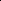

# IGFuse: Interactive 3D Gaussian Scene Reconstruction via Multi-Scans Fusion

<!-- Page 1 -->

IGFuse: Interactive 3D Gaussian Scene Reconstruction via Multi-Scans Fusion

Wenhao Hu1,2*, Zesheng Li3, Haonan Zhou1, Liu Liu2, Xuexiang Wen1, Zhizhong Su2,

Xi Li1, Gaoang Wang1†

1Zhejiang University 2Horizon Robotics 3Nanyang Technological University

## Abstract

Reconstructing complete and interactive 3D scenes remains a fundamental challenge in computer vision and robotics, particularly due to persistent object occlusions and limited sensor coverage. Multi-view observations from a single scene scan often fail to capture the full structural details. Existing approaches typically rely on multi-stage pipelines—such as segmentation, background completion, and inpainting—or require per-object dense scanning, both of which are errorprone, and not easily scalable. We propose IGFuse, a novel framework that reconstructs interactive Gaussian scene by fusing observations from multiple scans, where natural object rearrangement between captures reveal previously occluded regions. Our method constructs segmentation-aware Gaussian fields and enforces bi-directional photometric and semantic consistency across scans. To handle spatial misalignments, we introduce a pseudo-intermediate scene state for unified alignment, alongside collaborative co-pruning strategies to refine geometry. IGFuse enables high-fidelity rendering and object-level scene manipulation without dense observations or complex pipelines. Extensive experiments validate the framework’s strong generalization to novel scene configurations, demonstrating its effectiveness for real-world 3D reconstruction and real-to-simulation transfer.

Code — https://whhu7.github.io/IGFuse

## Introduction

Reconstructing interactive 3D scenes from partially observed environments remains a core challenge in vision and robotics (Zhu et al. 2024; Wang et al. 2024; Pang et al. 2025; Mendonca, Bahl, and Pathak 2023). Recent advances in 3D Gaussian Splatting (Kerbl et al. 2023) have enabled explicit scene representations by modeling geometry and appearance using compact Gaussian primitives. Some approaches, such as Gaussian Grouping (Ye et al. 2023) and DecoupledGaussian (Wang et al. 2025), aim to support interactive scene reconstruction by combining instance-level segmentation with inpainting-based refinement. While partially effective, these multi-stage pipelines face several challenges. Feature-based segmentation often produces inaccu-

*This work was done during an internship at Horizon Robotics. †Corresponding author. Copyright © 2026, Association for the Advancement of Artificial Intelligence (www.aaai.org). All rights reserved.

racies—especially near object boundaries and occluded regions—resulting in misclassified Gaussians, and visual artifacts. These issues require additional post-processing, which increases system complexity. Furthermore, inpainting methods frequently fail to recover fine background details, leading to unrealistic or blurry reconstructions. These limitations compromise the overall fidelity and consistency of the reconstructed scene and reduce the system’s reliability in downstream applications involving object-level understanding or manipulation.

In parallel, recent research has explored integrating 3D Gaussian Splatting into interactive and physically grounded simulation frameworks (Barcellona et al. 2024; Yu et al. 2025; Yang et al. 2025; Lou et al. 2024; Han et al. 2025; Zhu et al. 2025b). Methods such as RoboGSim (Li et al. 2024b) and SplatSim (Qureshi et al. 2024) leverage Gaussian representations to construct photorealistic virtual environments from real-world observations. However, these approaches typically depend on dense multi-view object captures to achieve high-fidelity reconstructions, which limits scalability in practical scenarios.

To address these limitations, we propose leveraging multiple observations of the same scene captured under natural object rearrangements caused by human interactions. These interaction-driven scene states expose previously occluded areas and implicitly provide geometric cues for refining segmentation and structure. Motivated by these insights, we introduce IGFuse, a novel framework for reconstructing interactive 3D scenes by fusing observations across multiple scans. Our method constructs segmentation-aware Gaussian fields for each scan and jointly optimizes them by enforcing bi-directional photometric and semantic consistency. To align scans captured under different scene layouts, we introduce a pseudo scene state that serves as a intermediate reference frame. Additionally, we design collaborative co-pruning strategies to suppress misaligned or inconsistent Gaussians and enhance geometric completeness.

IGFuse enables high-fidelity rendering and object-level scene manipulation—without requiring dense view captures, or multi-stage pipelines. Our framework generalizes well to novel rearranged scene states, offering a scalable and robust solution for 3D scene reconstruction in interactive environments. In summary, our main contributions are:

• We propose IGFuse, a framework for interactive 3D

The Fortieth AAAI Conference on Artificial Intelligence (AAAI-26)

<!-- Page 2 -->

Multi-Scan

Fusion

Scene Decomposition Optimized Objects Novel State

Novel State 1

Novel State M

Optimized Background

Multi-Scans

Object Rearrangement

Scan 1

Scan N

**Figure 1.** Given multiple observed scene scans, we perform multi-state optimization to jointly reconstruct consistent Gaussian fields. The scene is then decomposed into objects and background, which are jointly represented and constrained across scans. This enables the interactive generation of new scene states with coherent object compositions and realistic rendering.

scene reconstruction from multi-scan observations driven by real-world object rearrangements. • We construct segmentation-aware Gaussian fields and enforce bi-directional photometric and semantic consistency across scans to jointly complete the scene. • We introduce a pseudo-intermediate Gaussian state for unified alignment across perturbed scene configurations, improving fusion quality and geometric coherence.

Related Works 3D Gaussian Segmentation Recent methods extend Gaussian Splatting to perform scene segmentation (Zhu et al. 2025a; Hu et al. 2025, 2024). GaussianEditor (Chen et al. 2024) projects 2D masks into 3D via inverse rendering, while Gaussian Grouping (Ye et al. 2023) attaches segmentation features to Gaussians and aligns multi-view IDs using video segmentation (Cheng et al. 2023). Gaga (Lyu et al. 2024) resolves cross-view inconsistencies with a 3D-aware memory bank, and Flash- Splat (Shen, Yang, and Wang 2024) proposes a fast LPbased segmentation framework. Contrastive-learning-based approaches (Wu et al. 2024b; Li et al. 2024a) improve point-level discrimination, and GaussianCut (Jain, Mirzaei, and Gilitschenski 2024) formulates a graph-cut model to separate regions. COB-GS (Zhang et al. 2025) further enhances boundaries via adaptive splitting. However, segmentation alone is insufficient for interactive reconstruction, as 2D-driven biases often produce flawed 3D masks, requiring post-processing and inpainting (Liu et al. 2024; Cao et al. 2024a; Huang, Chou, and Wang 2025). In contrast, we fuse multi-scan observations under varied configurations to achieve mutual visibility, using object transitions to calibrate segmentation errors and produce clean, consistent 3D Gaussians suited for interaction.

Interactive Scene Reconstruction Some approaches simulate interactions using video-based generative models. UniSim (Yang et al. 2023) pre- dicts visual outcomes via autoregressive modeling, and iVideoGPT (Wu et al. 2024a) tokenizes observations and actions for next-token prediction. However, these methods lack strong 3D and physical grounding. Recent systems integrate reconstructed real scenes into interactive simulators: RoboGSim (Li et al. 2024b) embeds Gaussians into Isaac Sim, SplatSim (Qureshi et al. 2024) replaces meshes with splats for photorealistic rendering, and Phys- Gaussian (Xie et al. 2024), Spring-Gaus (Zhong et al. 2024), and NeuMA (Cao et al. 2024b) enable mesh-free physical simulation. These approaches often require dense, perobject 3D capture, whereas our method is more lightweight and scalable—using only a few multi-scan observations with varying scene configurations.

## Method

Preliminary

Segmented Gaussian Splatting (Ye et al. 2023) models a scene as a set of 3D Gaussians, each parameterized as G = {x, Σ, α, c, s}, where x denotes the 3D center position, Σ represents the spatial covariance matrix, α is the opacity coefficient, c is the RGB color vector, and s is a learnable feature vector used for segmentation.

During rendering, each Gaussian is projected onto the 2D image plane using a differentiable α-blending mechanism. Both the final pixel color C and segmentation feature S are computed by accumulating Gaussian contributions weighted by their projected opacities α′ i:

C =

X i∈N ciα′ i i−1 Y j=1

(1 −α′ j), S =

X i∈N siα′ i i−1 Y j=1

(1 −α′ j)

(1)

Modeling from Multi-Scan Observations

Given a set of scans X1, X2,..., XN, where each scan Xi = (Ii, Si) contains image observations Ii and segmentation masks Si captured under different object configurations, our

AI-readable visual equivalent, added: Figure extracted from the paper PDF and converted to an SVG wrapper asset. Use the surrounding page text and caption for interpretation.

AI-readable visual equivalent, added: Figure extracted from the paper PDF and converted to an SVG wrapper asset. Use the surrounding page text and caption for interpretation.

AI-readable visual equivalent, added: Figure extracted from the paper PDF and converted to an SVG wrapper asset. Use the surrounding page text and caption for interpretation.

AI-readable visual equivalent, added: Figure extracted from the paper PDF and converted to an SVG wrapper asset. Use the surrounding page text and caption for interpretation.

AI-readable visual equivalent, added: Figure extracted from the paper PDF and converted to an SVG wrapper asset. Use the surrounding page text and caption for interpretation.

AI-readable visual equivalent, added: Figure extracted from the paper PDF and converted to an SVG wrapper asset. Use the surrounding page text and caption for interpretation.

<!-- Page 3 -->

Composition

Target Gaussian

Object Gaussian

Object Gaussian

（b）multiple object with dense observations

## Background

Gaussian

Segmented Gaussian Field

Post-processing

Inpainting

Target Gaussian

（a）single scan with multi-stage processing

Target Gaussian

Optimized

Gaussian

Segmented Gaussian Field

（c）Our end to end multi-scans gaussian fusion

Optimization

Segmented Gaussian Field

**Figure 2.** Comparison of different paradigms for constructing interactive 3D Gaussian. (a) Traditional single-scan pipelines rely on multi-stage post-processing and inpainting, which may introduce accumulated artifacts. (b) Object-centric approaches require dense multi-view observations of all components, followed by explicit composition. (c) Our proposed end-to-end multiscans fusion model jointly optimizes multi-state Gaussian fields via cross-state supervision, effectively compensating for occlusions across different observations and enabling interactive Gaussian reconstruction.

goal is to fuse multi-scan observations and construct an interactive 3D scene representation. This representation supports realistic rendering under interaction signals, where arbitrary object movements produce plausible and consistent results.

To achieve this, we treat each scan as a discrete scene state and construct a corresponding segmentation-aware Gaussian field Gi, where i ∈1, 2,..., N. These Gaussian fields encode geometry, appearance, and segmentation under different object layouts. The differences across fields {G1,..., GN} reflect object-level interactions and structural changes in the scene.

To integrate information across scans, we adopt a training strategy that randomly samples a pair (Gi, Gj) in each epoch. Using known rigid object transformations, we align the pair and fuse their information by enforcing bi-directional photometric and semantic consistency. This enables mutual supervision, helping to refine occlusion-prone regions and correct segmentation errors. The fusion process is formulated as a joint optimization:

(G∗ i, G∗ j) = arg min

Gi,Gj Ljoint (2)

Given the optimized fields and transformation T, we synthesize a new interactive scene configuration Gt through explicit Gaussian transformation:

{G∗ i, G∗ j }

T−→Gt (3)

By jointly optimizing over scan pairs and explicitly modeling object-level transformation, our framework constructs a coherent and manipulable 3D Gaussian scene representation without relying on dense captures or multi-stage postprocessing.

Gaussian State Transfer To model scene-level transformations, the operator T is defined as an object-aware function that applies per-Gaussian rigid transformations based on semantic identity. Let the Gaussian field be decomposed into foreground and background subsets:

G = Gfg ∪Gbg, Gfg =

O [ o=1

G(o)

fg (4)

where each foreground object o is associated with a rigid transformation T(o). For any Gaussian gi ∈G, let oi denote the object to which it belongs. Then, T is applied as:

T(gi) =

T(oi) · gi, if gi ∈Gfg gi, if gi ∈Gbg

(5)

This formulation ensures spatially consistent transformation and geometric fidelity of object-level transformation while preserving the static background.

Bidirectional Alignment To ensure geometric and semantic consistency across different scene states, we enforce that the rendered outputs from transformed Gaussian fields align with the ground-truth observations in the corresponding target states. As mentioned before, we apply transformation Ti→j to Gi and transformation Tj→i to Gj. For any viewpoint v, the transformed

AI-readable visual equivalent, added: Figure extracted from the paper PDF and converted to an SVG wrapper asset. Use the surrounding page text and caption for interpretation.

AI-readable visual equivalent, added: Figure extracted from the paper PDF and converted to an SVG wrapper asset. Use the surrounding page text and caption for interpretation.

AI-readable visual equivalent, added: Figure extracted from the paper PDF and converted to an SVG wrapper asset. Use the surrounding page text and caption for interpretation.

AI-readable visual equivalent, added: Figure extracted from the paper PDF and converted to an SVG wrapper asset. Use the surrounding page text and caption for interpretation.

AI-readable visual equivalent, added: Figure extracted from the paper PDF and converted to an SVG wrapper asset. Use the surrounding page text and caption for interpretation.

AI-readable visual equivalent, added: Figure extracted from the paper PDF and converted to an SVG wrapper asset. Use the surrounding page text and caption for interpretation.

AI-readable visual equivalent, added: Figure extracted from the paper PDF and converted to an SVG wrapper asset. Use the surrounding page text and caption for interpretation.

AI-readable visual equivalent, added: Figure extracted from the paper PDF and converted to an SVG wrapper asset. Use the surrounding page text and caption for interpretation.

AI-readable visual equivalent, added: Figure extracted from the paper PDF and converted to an SVG wrapper asset. Use the surrounding page text and caption for interpretation.

AI-readable visual equivalent, added: Figure extracted from the paper PDF and converted to an SVG wrapper asset. Use the surrounding page text and caption for interpretation.

AI-readable visual equivalent, added: Figure extracted from the paper PDF and converted to an SVG wrapper asset. Use the surrounding page text and caption for interpretation.

AI-readable visual equivalent, added: Figure extracted from the paper PDF and converted to an SVG wrapper asset. Use the surrounding page text and caption for interpretation.

<!-- Page 4 -->

𝐺𝐺i = {𝑥𝑥i, Σ𝑖𝑖, 𝛼𝛼𝑖𝑖, 𝑐𝑐𝑖𝑖, 𝑠𝑠𝑖𝑖} 𝐺𝐺i→𝑝𝑝= {𝑥𝑥𝑖𝑖

′, Σ𝑖𝑖

′, 𝛼𝛼𝑖𝑖, 𝑐𝑐𝑖𝑖, 𝑠𝑠𝑖𝑖} 𝐺𝐺𝑖𝑖→𝑗𝑗= {𝑥𝑥𝑖𝑖

′′, Σ𝑖𝑖

′′, 𝛼𝛼𝑖𝑖, 𝑐𝑐𝑖𝑖, 𝑠𝑠𝑖𝑖}

𝐺𝐺𝑗𝑗= {𝑥𝑥𝑗𝑗, Σ𝑗𝑗, 𝛼𝛼𝑗𝑗, 𝑐𝑐𝑗𝑗, 𝑠𝑠𝑗𝑗}

𝐺𝐺𝑗𝑗→𝑝𝑝= {𝑥𝑥𝑗𝑗

′, Σ𝑗𝑗

′, 𝛼𝛼𝑗𝑗, 𝑐𝑐𝑗𝑗, 𝑠𝑠𝑗𝑗}

𝐺𝐺j→𝑖𝑖= {𝑥𝑥𝑗𝑗

′′, Σ𝑗𝑗

′′, 𝛼𝛼𝑗𝑗, 𝑐𝑐𝑗𝑗, 𝑠𝑠𝑗𝑗}

Scan i

𝐼𝐼𝐼𝐼𝐼𝐼𝐼𝐼𝐼𝐼𝑆𝑆𝑆𝑆𝑆𝑆𝐼𝐼𝑖𝑖

𝑆𝑆𝑆𝑆𝑆𝑆𝑆𝑆𝑆𝑆𝑆𝑆𝑆𝑆𝑆𝑆𝑆𝑆𝑆𝑆𝑆𝑆𝑆𝑆𝑆𝑆𝑆𝑆𝑆𝑆𝑆𝑆𝑆𝑆𝑖𝑖

Gaussian State i

Pseudo-state

Gaussian State Transfer

Gaussian State j Gaussian State Transfer

Collaborative Co-Pruning ℒ𝑝𝑝seudo

ℒalign

ℒalign

ℒr

ℒr

Scan j

𝐼𝐼𝐼𝐼𝐼𝐼𝐼𝐼𝐼𝐼𝑆𝑆𝑆𝑆𝑆𝑆𝐼𝐼𝑗𝑗

𝑆𝑆𝑆𝑆𝑆𝑆𝑆𝑆𝑆𝑆𝑆𝑆𝑆𝑆𝑆𝑆𝑆𝑆𝑆𝑆𝑆𝑆𝑆𝑆𝑆𝑆𝑆𝑆𝑆𝑆𝑆𝑆𝑆𝑆𝑗𝑗

Collaborative Co-Pruning

**Figure 3.** Overview of our dual-state Gaussian alignment pipeline. Given two input scans (scan i and scan j), the Gaussians in state i are initially constrained by corresponding image observations. After transferring to state j (i.e., Gi →Gi→j), the Gaussians are further supervised by state j’s image via an alignment loss Lalign, and regularized through a co-pruning strategy that enforces 3D consistency by removing mismatched or redundant components. The reverse transfer (Gj →Gj→i) is performed symmetrically. Additionally, both states are transferred into a shared pseudo-state space (Gi→p, Gj→p), where a pseudo-state loss Lpseudo encourages tighter cross-state alignment.

Gaussian fields are rendered into RGB images and segmentation masks, which are then compared with the corresponding ground-truth observations (Iv i, Sv i) and (Iv j, Sv j) from the original states. The total alignment loss combines photometric and segmentation consistency, defined as:

Lalign(Gi, Gj, θ) =

R (Ti→j(Gi), v) −Iv j

1 + ∥R (Tj→i(Gj), v) −Iv i ∥1 + CE fθ (M (Ti→j(Gi), v)), Sv j

+ CE (fθ (M (Tj→i(Gj), v)), Sv i) (6)

where R(·, v) and M(·, v) denote the rendering functions that generate the RGB image and segmentation feature from viewpoint v, as defined in Equation 1. The segmentation output is obtained via a shared classifier fθ, which is jointly applied to both Gi and Gj. Specifically, fθ consists of a linear layer that projects each identity embedding to a (K + 1)dimensional space, where K is the number of instance masks in the 3D scene (Ye et al. 2023). The cross-entropy loss CE(·, ·) measures the semantic alignment between predicted and ground-truth masks.

This bidirectional consistency encourages each transformed Gaussian field to accurately reconstruct the scene content of the opposite state, thereby reinforcing object-level correspondence and enhancing alignment across different scene configurations.

Pseudo-state Guided Alignment To enhance the generalizability of the interactive Gaussian across diverse scene configurations, we introduce a pseudostate Gp that serves as an intermediate reference for supervision. This pseudo-state is constructed by applying geometric constraints, such as collision and boundary regularization, to synthesize a virtual configuration between the two observed states. Unlike the original states, the pseudo-state is not tied to any specific observation but provides a common state that facilitates consistent alignment between Gi and Gj.

We compute transformation matrices Ti→p and Tj→p to transfer the original fields Gi and Gj into Gp. By transforming both fields into this shared pseudo-state, we enable direct comparison and alignment of their rendered outputs. Specifically, we render the transformed fields from the same viewpoint v and enforce photometric and semantic consistency between them. The corresponding loss is defined as:

Lpseudo(Gi, Gj, θ) = ∥R (Ti→p(Gi), v) −R (Tj→p(Gj), v)∥1

+ CE fθ (M (Ti→p(Gi), v)), fθ (M (Tj→p(Gj), v))

(7)

By leveraging a dynamically constructed pseudo-state as an adaptive supervision signal, the model can better reconcile differences between the two input states and generalize more effectively to unseen or intermediate scene configurations.

Collaborative Co-Pruning Inspired by geometric consistency-based filtering strategies (Zhang et al. 2024), we introduce a co-pruning mechanism to suppress residual artifacts arising from imperfect segmentation during cross-state Gaussian transfer. The mechanism removes spatially inconsistent Gaussians by evaluating geometric agreement between the two states. When a Gaussian field is transferred from one state to another, unmatched or misaligned points may remain due to occlusion, noise, or over-segmentation. Our strategy prunes

AI-readable visual equivalent, added: Figure extracted from the paper PDF and converted to an SVG wrapper asset. Use the surrounding page text and caption for interpretation.

AI-readable visual equivalent, added: Figure extracted from the paper PDF and converted to an SVG wrapper asset. Use the surrounding page text and caption for interpretation.

AI-readable visual equivalent, added: Figure extracted from the paper PDF and converted to an SVG wrapper asset. Use the surrounding page text and caption for interpretation.

AI-readable visual equivalent, added: Figure extracted from the paper PDF and converted to an SVG wrapper asset. Use the surrounding page text and caption for interpretation.

AI-readable visual equivalent, added: Figure extracted from the paper PDF and converted to an SVG wrapper asset. Use the surrounding page text and caption for interpretation.

AI-readable visual equivalent, added: Figure extracted from the paper PDF and converted to an SVG wrapper asset. Use the surrounding page text and caption for interpretation.

AI-readable visual equivalent, added: Figure extracted from the paper PDF and converted to an SVG wrapper asset. Use the surrounding page text and caption for interpretation.

AI-readable visual equivalent, added: Figure extracted from the paper PDF and converted to an SVG wrapper asset. Use the surrounding page text and caption for interpretation.

AI-readable visual equivalent, added: Figure extracted from the paper PDF and converted to an SVG wrapper asset. Use the surrounding page text and caption for interpretation.

AI-readable visual equivalent, added: Figure extracted from the paper PDF and converted to an SVG wrapper asset. Use the surrounding page text and caption for interpretation.

AI-readable visual equivalent, added: Figure extracted from the paper PDF and converted to an SVG wrapper asset. Use the surrounding page text and caption for interpretation.

AI-readable visual equivalent, added: Figure extracted from the paper PDF and converted to an SVG wrapper asset. Use the surrounding page text and caption for interpretation.

AI-readable visual equivalent, added: Figure extracted from the paper PDF and converted to an SVG wrapper asset. Use the surrounding page text and caption for interpretation.

<!-- Page 5 -->

these outliers by checking whether transferred Gaussians can be reliably explained by the geometry of the target field.

For each transformed Gaussian gk ∈Ti→j(Gi), we identify its nearest neighbor gl ∈Gj using Euclidean distance. A Gaussian is marked for pruning if the spatial deviation between gk and gl exceeds a predefined threshold τ. The binary pruning indicator mi is computed as:

mi = 1 (∥xk −xl∥2 > τ) (8)

where xk and xl are the 3D centers of gk and gl, and 1(·) denotes the indicator function. Gaussians with mi = 1 are discarded as unreliable or redundant. A symmetric process is applied in the opposite direction, using Gj transformed to the frame of Gi to prune outliers in Gj, resulting in a collaborative co-pruning scheme.

Training Objective The overall training objective combines three loss terms:

Ljoint(Gi, Gj, θ) = Lr(Gi, θ) + Lr(Gj, θ) (9) +λaLalign(Gi, Gj, θ) + λpLpseudo(Gi, Gj, θ)

where Lr denotes the same reconstruction loss adopted from Gaussian Grouping (Ye et al. 2023) (detailed in the appendix), Lalign enforces bidirectional rendering consistency, and Lpseudo introduces regularization through pseudo-state supervision. The weights λa and λp are used to balance the contributions of each term.

## Experiment

Dataset To support multi-scan scene modeling, we construct both synthetic and real-world datasets. The synthetic dataset is generated in Blender (Blender Online Community 2023), where N textured objects from BlenderKit (BlenderKit 2023) are placed within a static background. Additional scans are created by randomly altering object poses to reflect different interaction states. Real-world data is captured in a similar manner using handheld RGB cameras, resulting in 7 synthetic and 5 real scenes. For evaluation, we generate a test configuration for each scene by randomly repositioning objects. We then render images from predefined camera views and compute PSNR and SSIM against ground truth images to assess interaction fidelity under novel object arrangements. Further implementation and dataset details are provided in the appendix.

## Experimental Setup

Implementation details During training, we first optimize the segmented Gaussians using only Lr for 10,000 epochs, then jointly train with Lalign and Lpseudo to refine the dual Gaussian field for another n×5000 epochs, where n is the total number of scans in the scene. The output classification linear layer has 16 input channels and 256 output channels. The pruning threshold parameter τ is set to 0.5. In training, we set λa = 1.0 and λp = 1.0. We use the Adam optimizer for both gaussians and linear layer, with a learning rate of 0.0025 for segmentation feature and 0.0005 for linear layer. All datasets are trained on a single NVIDIA 4090 GPU.

Baselines We compare our method with representative Gaussian Splatting-based scene modeling frameworks. Existing pipelines often involve multi-stage processing, including segmentation, background completion, inpainting, and fine-tuning. We include several representative segmentation methods in our comparison. GaussianEditor (Chen et al. 2024) performs segmentation through inverse rendering optimization. Gaussian Grouping (Ye et al. 2023) clusters Gaussians based on feature similarity. GaussianCut (Jain, Mirzaei, and Gilitschenski 2024) formulates segmentation as a graph-cut optimization problem over Gaussian primitives. We also include Decoupled Gaussian (Wang et al. 2025), which segments objects using Gaussian segmentation feature, then performs remeshing and LaMa-based refinement to complete the scene.

Novel State Synthesis The qualitative results on both synthetic and real-world datasets are shown in Figure 4. GaussianEditor (based on inverse rendering) struggles to precisely segment object boundaries, resulting in edge artifacts that necessitate heavy post-processing. Gaussian Grouping (segmentation-feature based) improves performance but still leaves many residual Gaussians, especially for objects with large contact areas between their bottom surface and the background. Graussiancut (graph-based) achieves the best results among the baselines, although slight boundary artifacts remain. DecoupledGaussian incorporates background Gaussian completion, 2D inpainting, and Gaussian fine-tuning. Its 2D inpainting module LaMa produces the most visually coherent results. However, it still struggles to faithfully restore images with complex backgrounds in real-world data. In contrast, our method achieves the highest PSNR and SSIM for novel-state synthesis across both datasets, while maintaining an end-to-end pipeline and avoiding complex multi-stage post-processing.

As shown in Table 1 and 2, segmentation-only methods yield lower PSNR and SSIM, while adding inpainting improves performance—particularly on synthetic scenes where backgrounds are typically simpler and more structured. In contrast, real-world scenes often involve cluttered or textured backgrounds, making accurate hole filling more challenging and less reliable. Instead of relying on inpainting, we leverage the complementary information across multiple scene states to supervise the optimization of Gaussians, enabling more accurate and consistent scene representation.

Ablation Study Table 3 presents the ablation study evaluating the contribution of each component in our framework: Bidirectional alignment (B), Collaborative co-pruning (C), and Pseudo-state guided alignment (P). Using only Bidirectional alignment already provides a strong baseline, achieving a PSNR of 35.10. Introducing co-pruning yields a slight improvement in structural quality. This is because Bidirec-

<!-- Page 6 -->

GaussianEditor Gaussiancut Gaussian Grouping DecoupledGaussian IGFuse (ours) Ground Truth

**Figure 4.** Qualitative comparison of novel state synthesis under different pipelines. We evaluate on both real-world scenes (top three) and a synthetic scene. While existing methods struggle with object mixing, boundary artifacts, or background corruption, our method achieves significantly more accurate and complete novel state results, closely matching the ground-truth.

## Model

PSNR SSIM

GaussianEditor (CVPR 2024) 28.25 0.946 Gaussian Grouping (ECCV 2024) 28.93 0.950 Gaussiancut (NIPS 2024) 29.01 0.956 DecoupledGaussian (CVPR 2025) 30.27 0.959 IGFuse (ours) 36.93 0.978

**Table 1.** Quantitative comparison of novel state synthesis quality on the synthetic dataset.

## Model

PSNR SSIM

GaussianEditor (CVPR 2024) 21.02 0.849 Gaussian Grouping (ECCV 2024) 21.68 0.853 Gaussiancut (NIPS 2024) 21.81 0.864 DecoupledGaussian (CVPR 2025) 22.28 0.855 IGFuse (ours) 27.18 0.907

**Table 2.** Quantitative comparison of novel state synthesis quality on the real-world dataset.

tional alignment tends to reassign residual Gaussians to have background-like colors or reduced opacity. While copruning helps eliminate these floaters, its overall impact on PSNR is limited. In contrast, incorporating Pseudo-state guided alignment results in a substantial increase in PSNR. This improvement arises from the fact that occlusion am-

B C P PSNR ↑ SSIM ↑

" - - 35.10 0.971 " " - 35.55 0.974 " " " 36.93 0.978

**Table 3.** Ablation study of B (Bidirectional alignment), C (Collaborative co-pruning), and P (Pseudo-state guided alignment).

biguities cannot be fully resolved with only two configurations, additional pseudo-states provide richer supervision across multiple viewpoints, enhancing alignment between the two Gaussian fields and leading to more consistent and photorealistic reconstructions.

Dual Guassian Convergence We investigate the convergence behavior of two Gaussian fields trained from different synthetic scenes. In the absence of Pseudo-state Guided Alignment, PSNR and SSIM differ significantly when evaluated in the target state. These discrepancies stem from occlusions and viewpoint differences that lead to misalignments between the two fields. Even with Bidirectional Alignment, such inconsistencies persist, indicating incomplete convergence. By incorporating Pseudo-state guided Alignment, we enforce consistency across object compositions in both fields, allowing them to observe complementary content and provide mutual su-

AI-readable visual equivalent, added: Figure extracted from the paper PDF and converted to an SVG wrapper asset. Use the surrounding page text and caption for interpretation.

AI-readable visual equivalent, added: Figure extracted from the paper PDF and converted to an SVG wrapper asset. Use the surrounding page text and caption for interpretation.

AI-readable visual equivalent, added: Figure extracted from the paper PDF and converted to an SVG wrapper asset. Use the surrounding page text and caption for interpretation.

AI-readable visual equivalent, added: Figure extracted from the paper PDF and converted to an SVG wrapper asset. Use the surrounding page text and caption for interpretation.

AI-readable visual equivalent, added: Figure extracted from the paper PDF and converted to an SVG wrapper asset. Use the surrounding page text and caption for interpretation.

AI-readable visual equivalent, added: Figure extracted from the paper PDF and converted to an SVG wrapper asset. Use the surrounding page text and caption for interpretation.

AI-readable visual equivalent, added: Figure extracted from the paper PDF and converted to an SVG wrapper asset. Use the surrounding page text and caption for interpretation.

AI-readable visual equivalent, added: Figure extracted from the paper PDF and converted to an SVG wrapper asset. Use the surrounding page text and caption for interpretation.

AI-readable visual equivalent, added: Figure extracted from the paper PDF and converted to an SVG wrapper asset. Use the surrounding page text and caption for interpretation.

AI-readable visual equivalent, added: Figure extracted from the paper PDF and converted to an SVG wrapper asset. Use the surrounding page text and caption for interpretation.

AI-readable visual equivalent, added: Figure extracted from the paper PDF and converted to an SVG wrapper asset. Use the surrounding page text and caption for interpretation.

AI-readable visual equivalent, added: Figure extracted from the paper PDF and converted to an SVG wrapper asset. Use the surrounding page text and caption for interpretation.

AI-readable visual equivalent, added: Figure extracted from the paper PDF and converted to an SVG wrapper asset. Use the surrounding page text and caption for interpretation.

AI-readable visual equivalent, added: Figure extracted from the paper PDF and converted to an SVG wrapper asset. Use the surrounding page text and caption for interpretation.

AI-readable visual equivalent, added: Figure extracted from the paper PDF and converted to an SVG wrapper asset. Use the surrounding page text and caption for interpretation.

AI-readable visual equivalent, added: Figure extracted from the paper PDF and converted to an SVG wrapper asset. Use the surrounding page text and caption for interpretation.

AI-readable visual equivalent, added: Figure extracted from the paper PDF and converted to an SVG wrapper asset. Use the surrounding page text and caption for interpretation.

AI-readable visual equivalent, added: Figure extracted from the paper PDF and converted to an SVG wrapper asset. Use the surrounding page text and caption for interpretation.

AI-readable visual equivalent, added: Figure extracted from the paper PDF and converted to an SVG wrapper asset. Use the surrounding page text and caption for interpretation.

AI-readable visual equivalent, added: Figure extracted from the paper PDF and converted to an SVG wrapper asset. Use the surrounding page text and caption for interpretation.

AI-readable visual equivalent, added: Figure extracted from the paper PDF and converted to an SVG wrapper asset. Use the surrounding page text and caption for interpretation.

AI-readable visual equivalent, added: Figure extracted from the paper PDF and converted to an SVG wrapper asset. Use the surrounding page text and caption for interpretation.

AI-readable visual equivalent, added: Figure extracted from the paper PDF and converted to an SVG wrapper asset. Use the surrounding page text and caption for interpretation.

AI-readable visual equivalent, added: Figure extracted from the paper PDF and converted to an SVG wrapper asset. Use the surrounding page text and caption for interpretation.

AI-readable visual equivalent, added: Figure extracted from the paper PDF and converted to an SVG wrapper asset. Use the surrounding page text and caption for interpretation.

AI-readable visual equivalent, added: Figure extracted from the paper PDF and converted to an SVG wrapper asset. Use the surrounding page text and caption for interpretation.

<!-- Page 7 -->

Gaussian Pseudo Synthetic 1 Synthetic 2 PSNR SSIM PSNR SSIM G1 w/o 37.04 0.979 37.51 0.977 G2 w/o 37.16 0.977 36.14 0.974 G1 w/ 39.26 0.984 37.59 0.977 G2 w/ 39.26 0.984 37.50 0.977

**Table 4.** PSNR and SSIM of G1 and G2 in Syntheti 1 and Synthetic 2 scenes, with and without pseudo-state supervision.

pervision. This promotes convergence toward a shared and coherent optimized representation. Empirically, Gaussian fields trained from either state yield nearly identical PSNR and SSIM when evaluated under same test configuration, demonstrating effective alignment and mutual consistency.

## Background

Separation As shown in Figure 5, when separating only the background, both Gaussian Grouping and Gaussiancut leave residual Gaussians from objects, with larger objects causing noticeable holes. Although DecoupledGaussian employs LaMa to inpaint object mask regions, the inpainting often produces blurry results, especially in complex backgrounds. In contrast, our multi-scan fusion approach effectively generates complete and seamless background reconstructions.

Gaussiancut Gaussian Grouping

DecoupledGaussian IGFuse (ours)

**Figure 5.** Comparison of different techniques for background separation. IGFuse (ours) vs. Decoupled Gaussian, Gaussiancut, and Gaussian Grouping.

Training Iteration To determine a suitable number of iterations for optimizing the Gaussian fields, we evaluated multiple real-world scenes by measuring the mean and variance of PSNR on the test state across different iteration counts. For each scene with n scans, we normalize the total number of iterations by n—that is, the iteration count refers to how many optimization steps each individual scan undergoes. We observe that

**Figure 6.** PSNR vs. Training Iterations with Variance Range

the PSNR stabilizes around 5000 iterations per scan, indicating convergence. Since we align scene pairs analogously to constructing an undirected graph, we set the final number of training iterations to n × 5000, where n is the total number of scans in the scene. Additionally, we observe a gradual increase in variance. This is because, in early iterations, motion-related artifacts result in uniformly low-quality reconstructions. As optimization progresses and overall quality improves, differences in native PSNR across scenes become more pronounced, leading to increased variance.

## Limitations

Despite its effectiveness, IGFuse has several limitations. Existing optimization methods are designed for the entire scene. However, since backgrounds across different scans often share similar structures, focusing optimization specifically on object–background boundaries in future work could lead to a more lightweight model. Additionally, our model does not handle lighting variations, causing static shadows even when objects move, which affects realism. Incorporating relighting into the framework could further enhance simulation fidelity in future work.

## Conclusion

We present IGFuse, an end-to-end framework for interactive 3D scene reconstruction via multi-scan fusion. By leveraging object-level transformations across multiple observed scene states, our method overcomes challenges caused by occlusions and segmentation ambiguity. Through bidirectional consistency and pseudo-state alignment, IGFuse refines geometry and semantics to produce high-quality Gaussian fields that support accurate rendering and object-aware manipulation. Extensive experiments validate the effectiveness of our approach for interactive scene reconstruction in vision tasks.

## Acknowledgments

This work was supported in part by the Zhejiang Provincial Natural Science Foundation of China (No. LD24F020016), the Fundamental Research Funds for the Central Universities (No. 226-2025-00167), and the National Natural Science Foundation of China (No. 62576308).

AI-readable visual equivalent, added: Figure extracted from the paper PDF and converted to an SVG wrapper asset. Use the surrounding page text and caption for interpretation.

AI-readable visual equivalent, added: Figure extracted from the paper PDF and converted to an SVG wrapper asset. Use the surrounding page text and caption for interpretation.

AI-readable visual equivalent, added: Figure extracted from the paper PDF and converted to an SVG wrapper asset. Use the surrounding page text and caption for interpretation.

AI-readable visual equivalent, added: Figure extracted from the paper PDF and converted to an SVG wrapper asset. Use the surrounding page text and caption for interpretation.

AI-readable visual equivalent, added: Figure extracted from the paper PDF and converted to an SVG wrapper asset. Use the surrounding page text and caption for interpretation.

<!-- Page 8 -->

## References

Barcellona, L.; Zadaianchuk, A.; Allegro, D.; Papa, S.; Ghidoni, S.; and Gavves, E. 2024. Dream to Manipulate: Compositional World Models Empowering Robot Imitation Learning with Imagination. arXiv preprint arXiv:2412.14957. Blender Online Community. 2023. Blender - a 3D modelling and rendering package. https://www.blender.org. BlenderKit. 2023. BlenderKit: 3D Asset Library for Blender. https://www.blenderkit.com. Accessed in 2023. Cao, C.; Yu, C.; Wang, F.; Xue, X.; and Fu, Y. 2024a. Mvinpainter: Learning multi-view consistent inpainting to bridge 2d and 3d editing. arXiv preprint arXiv:2408.08000. Cao, J.; Guan, S.; Ge, Y.; Li, W.; Yang, X.; and Ma, C. 2024b. NeuMA: Neural material adaptor for visual grounding of intrinsic dynamics. Advances in Neural Information Processing Systems, 37: 65643–65669. Chen, Y.; Chen, Z.; Zhang, C.; Wang, F.; Yang, X.; Wang, Y.; Cai, Z.; Yang, L.; Liu, H.; and Lin, G. 2024. Gaussianeditor: Swift and controllable 3d editing with gaussian splatting. In Proceedings of the IEEE/CVF conference on computer vision and pattern recognition, 21476–21485. Cheng, H. K.; Oh, S. W.; Price, B.; Schwing, A.; and Lee, J.-Y. 2023. Tracking anything with decoupled video segmentation. In Proceedings of the IEEE/CVF International Conference on Computer Vision, 1316–1326. Han, X.; Liu, M.; Chen, Y.; Yu, J.; Lyu, X.; Tian, Y.; Wang, B.; Zhang, W.; and Pang, J. 2025. Re ˆ 3 Sim: Generating High-Fidelity Simulation Data via 3D-Photorealistic Real-to-Sim for Robotic Manipulation. arXiv preprint arXiv:2502.08645. Hu, W.; Chai, W.; Hao, S.; Cui, X.; Wen, X.; Hwang, J.-N.; and Wang, G. 2025. Pointmap Association and Piecewise- Plane Constraint for Consistent and Compact 3D Gaussian Segmentation Field. arXiv preprint arXiv:2502.16303. Hu, X.; Wang, Y.; Fan, L.; Fan, J.; Peng, J.; Lei, Z.; Li, Q.; and Zhang, Z. 2024. Semantic anything in 3d gaussians. arXiv preprint arXiv:2401.17857. Huang, S.-Y.; Chou, Z.-T.; and Wang, Y.-C. F. 2025. 3D Gaussian Inpainting with Depth-Guided Cross-View Consistency. arXiv preprint arXiv:2502.11801. Jain, U.; Mirzaei, A.; and Gilitschenski, I. 2024. Gaussian- Cut: Interactive segmentation via graph cut for 3D Gaussian Splatting. In The Thirty-eighth Annual Conference on Neural Information Processing Systems. Kerbl, B.; Kopanas, G.; Leimk¨uhler, T.; and Drettakis, G. 2023. 3d gaussian splatting for real-time radiance field rendering. ACM Transactions on Graphics, 42(4): 1–14. Li, H.; Wu, Y.; Meng, J.; Gao, Q.; Zhang, Z.; Wang, R.; and Zhang, J. 2024a. InstanceGaussian: Appearance-Semantic Joint Gaussian Representation for 3D Instance-Level Perception. arXiv preprint arXiv:2411.19235. Li, X.; Li, J.; Zhang, Z.; Zhang, R.; Jia, F.; Wang, T.; Fan, H.; Tseng, K.-K.; and Wang, R. 2024b. Robogsim: A real2sim2real robotic gaussian splatting simulator. arXiv preprint arXiv:2411.11839.

Liu, Z.; Ouyang, H.; Wang, Q.; Cheng, K. L.; Xiao, J.; Zhu, K.; Xue, N.; Liu, Y.; Shen, Y.; and Cao, Y. 2024. Infusion: Inpainting 3d gaussians via learning depth completion from diffusion prior. arXiv preprint arXiv:2404.11613. Lou, H.; Liu, Y.; Pan, Y.; Geng, Y.; Chen, J.; Ma, W.; Li, C.; Wang, L.; Feng, H.; Shi, L.; et al. 2024. Robo-gs: A physics consistent spatial-temporal model for robotic arm with hybrid representation. arXiv preprint arXiv:2408.14873. Lyu, W.; Li, X.; Kundu, A.; Tsai, Y.-H.; and Yang, M.-H. 2024. Gaga: Group Any Gaussians via 3D-aware Memory Bank. arXiv preprint arXiv:2404.07977. Mendonca, R.; Bahl, S.; and Pathak, D. 2023. Structured world models from human videos. arXiv preprint arXiv:2308.10901. Pang, J.-C.; Tang, N.; Li, K.; Tang, Y.; Cai, X.-Q.; Zhang, Z.-Y.; Niu, G.; Sugiyama, M.; and Yu, Y. 2025. Learning View-invariant World Models for Visual Robotic Manipulation. In The Thirteenth International Conference on Learning Representations. Qureshi, M. N.; Garg, S.; Yandun, F.; Held, D.; Kantor, G.; and Silwal, A. 2024. Splatsim: Zero-shot sim2real transfer of rgb manipulation policies using gaussian splatting. arXiv preprint arXiv:2409.10161. Shen, Q.; Yang, X.; and Wang, X. 2024. Flashsplat: 2d to 3d gaussian splatting segmentation solved optimally. In European Conference on Computer Vision, 456–472. Springer. Wang, G.; Pan, L.; Peng, S.; Liu, S.; Xu, C.; Miao, Y.; Zhan, W.; Tomizuka, M.; Pollefeys, M.; and Wang, H. 2024. Nerf in robotics: A survey. arXiv preprint arXiv:2405.01333. Wang, M.; Zhang, Y.; Ma, R.; Xu, W.; Zou, C.; and Morris, D. 2025. DecoupledGaussian: Object-Scene Decoupling for Physics-Based Interaction. arXiv preprint arXiv:2503.05484. Wu, J.; Yin, S.; Feng, N.; He, X.; Li, D.; Hao, J.; and Long, M. 2024a. ivideogpt: Interactive videogpts are scalable world models. Advances in Neural Information Processing Systems, 37: 68082–68119. Wu, Y.; Meng, J.; Li, H.; Wu, C.; Shi, Y.; Cheng, X.; Zhao, C.; Feng, H.; Ding, E.; Wang, J.; et al. 2024b. OpenGaussian: Towards Point-Level 3D Gaussian-based Open Vocabulary Understanding. arXiv preprint arXiv:2406.02058. Xie, T.; Zong, Z.; Qiu, Y.; Li, X.; Feng, Y.; Yang, Y.; and Jiang, C. 2024. Physgaussian: Physics-integrated 3d gaussians for generative dynamics. In Proceedings of the IEEE/CVF Conference on Computer Vision and Pattern Recognition, 4389–4398. Yang, M.; Du, Y.; Ghasemipour, K.; Tompson, J.; Schuurmans, D.; and Abbeel, P. 2023. Learning interactive realworld simulators. arXiv preprint arXiv:2310.06114, 1(2): 6. Yang, S.; Yu, W.; Zeng, J.; Lv, J.; Ren, K.; Lu, C.; Lin, D.; and Pang, J. 2025. Novel Demonstration Generation with Gaussian Splatting Enables Robust One-Shot Manipulation. arXiv preprint arXiv:2504.13175. Ye, M.; Danelljan, M.; Yu, F.; and Ke, L. 2023. Gaussian grouping: Segment and edit anything in 3d scenes. arXiv preprint arXiv:2312.00732.

<!-- Page 9 -->

Yu, J.; Fu, L.; Huang, H.; El-Refai, K.; Ambrus, R. A.; Cheng, R.; Irshad, M. Z.; and Goldberg, K. 2025. Real2Render2Real: Scaling Robot Data Without Dynamics Simulation or Robot Hardware. arXiv preprint arXiv:2505.09601. Zhang, J.; Jiang, J.; Chen, Y.; Jiang, K.; and Liu, X. 2025. COB-GS: Clear Object Boundaries in 3DGS Segmentation Based on Boundary-Adaptive Gaussian Splitting. arXiv preprint arXiv:2503.19443. Zhang, J.; Li, J.; Yu, X.; Huang, L.; Gu, L.; Zheng, J.; and Bai, X. 2024. Cor-gs: sparse-view 3d gaussian splatting via co-regularization. In European Conference on Computer Vision, 335–352. Springer. Zhong, L.; Yu, H.-X.; Wu, J.; and Li, Y. 2024. Reconstruction and simulation of elastic objects with spring-mass 3d gaussians. In European Conference on Computer Vision, 407–423. Springer. Zhu, R.; Qiu, S.; Liu, Z.; Hui, K.-H.; Wu, Q.; Heng, P.-A.; and Fu, C.-W. 2025a. Rethinking End-to-End 2D to 3D Scene Segmentation in Gaussian Splatting. arXiv preprint arXiv:2503.14029. Zhu, S.; Mou, L.; Li, D.; Ye, B.; Huang, R.; and Zhao, H. 2025b. VR-Robo: A Real-to-Sim-to-Real Framework for Visual Robot Navigation and Locomotion. arXiv preprint arXiv:2502.01536. Zhu, S.; Wang, G.; Kong, X.; Kong, D.; and Wang, H. 2024. 3d gaussian splatting in robotics: A survey. arXiv preprint arXiv:2410.12262.
