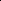

# Interest-driven Deep Multi-modal Clustering

<!-- Page 1 -->

Interest-driven Deep Multi-modal Clustering

Guoliang Zou*, Tongji Chen*, Sijia Li, Jin Qin, Yangdong Ye†, Shizhe Hu†

School of Computer and Artificial Intelligence, Zhengzhou University, Zhengzhou, China jimmyopop8@gmail.com, ieshizhehu@gmail.com

## Abstract

Deep multi-modal clustering fully learns semantically consistent and discriminative cluster representations between multiple modalities in an unlabeled manner. However, existing methods treat all samples equally, ignoring varying sample quality, which limits clustering performance. Inspired by the concept of interest in the recommendation system, we propose a novel interest-driven deep multi-modal clustering (IDMC) framework. It designs a new paradigm to quantify the importance of each sample base on the attention it receives from other samples, which called interest value. This value jointly captures the local geometric structure through the Euclidean distance in feature space and the consistency of pseudo-labels. Then, we design a novel adaptive Bayesian fusion mechanism to dynamically balance the prior features and self-supervisory signals to ensure confidence-based sample importance estimation. Furthermore, we introduce a median normalization constraint and a label consistency constraint to further refine the construction of the interest value. By embedding this interest-guided value into representation learning and cluster optimization, IDMC focuses on the samples with the most information and the most stable semantics, thereby enhancing the performance of multi-modal representation learning. Extensive experiments verify that IDMC is superior to existing state-of-the-art methods in multiple evaluation metrics.

## Introduction

Deep multi-modal clustering (DMC) (Cai et al. 2011; Liu et al. 2018; Zhou and Shen 2020a; Hu et al. 2025a; Li et al. 2025b; Wang, Zhang, and Zhou 2025b) is a core technique for analyzing complex multi-source data by mining consistency and shared features across heterogeneous modalities. It has been applied in bioinformatics (Ma et al. 2016), video QA (Nie et al. 2024), and medical image analysis (Sheng et al. 2019). However, its effectiveness remains limited by the challenge of reliably integrating heterogeneous modalities (Fang et al. 2025, 2023).

Existing methods generally assume that all samples are equally informative and trustworthy, which exacerbates this challenge. Previous studies have attempted to bridge the gap

*Co-first author. †Corresponding author. Copyright © 2026, Association for the Advancement of Artificial Intelligence (www.aaai.org). All rights reserved.

X0 X1 X2 X3 X4 X5 X6 X7 X8 X9

X0

X9

X8

X7

X6

X5

X4

X3

X2

X1

1.0

0.75

0.5

0.25

0.00

0.25 0.50

0.75

1.00 X0

X9

X8

X7

X6

X5

X4

X3

X2

X1

0.0

0.2

0.4

0.6

0.8

1.0

X0 X9 X8 X7 X6 X5 X4 X3 X2 X1 (a) Differences between instances with the illustration of Pearson correlation and cosine similarity

→

(b) The interest value quantifies the importance of each sample

**Figure 1.** The motivation of the IDMC method. (a) The differences between samples determine that samples should not be treated equally. Therefore, it is necessary to design a method to quantify the importance of samples. (b) The interest value is introduced to quantify the importance of each sample based on the attention it receives from others, where Φ(·) in w1 represents the interest score assigned to sample 1 by the remaining samples.

between modalities using unified embedding learning, contrastive objectives, or graph-based regularization (Li et al. 2023; Wang, Zhang, and Zhou 2025a; Yao et al. 2025; Wang et al. 2024). Specifically, common subspace-based DMC methods (Zhu et al. 2024) align modalities by projecting them into a shared low-dimensional space. For example, this work (Wang et al. 2014) encodes strong cross-modal correlations within a common subspace, while efficiently derives

The Fortieth AAAI Conference on Artificial Intelligence (AAAI-26)

29277

AI-readable visual equivalent, added: Figure extracted from the paper PDF and converted to an SVG wrapper asset. Use the surrounding page text and caption for interpretation.

AI-readable visual equivalent, added: Figure extracted from the paper PDF and converted to an SVG wrapper asset. Use the surrounding page text and caption for interpretation.

AI-readable visual equivalent, added: Figure extracted from the paper PDF and converted to an SVG wrapper asset. Use the surrounding page text and caption for interpretation.

<!-- Page 2 -->

......

Encoder

Decoder

Decoder

Feature Alignment

X(1)

X(m)

H(1)

H(m)

Adjacency Matrix

Adjacency Matrix

Fused Feature

X(1) ~X(1) ~

X(m) ~X(m) ~

Lrecon(X(1),X(1),W(1))

~ Lrecon(X(1),X(1),W(1))

~ i Lrecon(X(1),X(1),W(1))

~ i

Lalign(H(1),H(m),W(1),W(m)) i i Lalign(H(1),H(m),W(1),W(m)) i i

Lrecon(X(m),X(m),W(m))

~ Lrecon(X(m),X(m),W(m))

~ i Lrecon(X(m),X(m),W(m))

~ i

LKL(P,Q (m),W(m)) i LKL(P,Q (m),W(m)) i

Q(m) Q(m)

P

Q(1) Q(1)

Approaching

Approaching

LKL(P,Q (1),W(1)) i LKL(P,Q (1),W(1)) i

Adaptive Bayesian Fusion

COSθ

Euclidean distance Euclidean distance

COSθ

Euclidean distance Euclidean distance

Euclidean distance Euclidean distance

Euclidean distance Euclidean distance

Euclidean distance Euclidean distance

Euclidean distance

Euclidean distance

Clustering Assignments

Fused MLP

Interest Values Interest Values

Interest Values Interest Values

Adaptive Bayesian Fusion

DDC

X(1) X(m) ··· X(1) X(m) ··· ~ ~:: Reconstruct input Multi-modal inputs

W(m)

i: Interest value of each sample P: Cluster assignments obtained from fused features Q(1) Q(m) ···: Cluster assignments for each modality

H(1) H(m) ···: Feature representation via autoencoder {X}i=1 m

S1 S2 S3

Sn

S1 S2 S3 Sn...

...

S1 S2 S3

Sn

S1 S2 S3 Sn...

...

S1 S2 S3

Sn

S1 S2 S3 Sn...

...

S1 S2 S3

Sn

S1 S2 S3 Sn...

...

... W(m)

## 1 W(m)W(m) W(m) 3 n

... W(1)

## 1 W(1) W(1) W(1) 3 n

Encoder

**Figure 2.** The framework of IDMC method. The IDMC framework quantifies each sample’s interest value based on its structural representativeness and semantic consistency. To ensure reliable estimation, an adaptive Bayesian fusion mechanism assigns higher weights to more confident signals. The resulting interest values guide feature reconstruction (Lrecon), alignment (Lalign), and clustering (LKL), thereby enhancing clustering performance.

tensor kernels using double discrete cosine transform and lightweight algorithms to preserve local structures in this work (Chen et al. 2024b). ESTMC(Ji and Feng 2025) captures high-order correlations by integrating anchor representation and low-rank tensor learning into a unified objective. Contrastive learning-based DMC methods (Lou et al. 2025; Hu et al. 2025b) improve inter-modal consistency through contrastive loss or distribution alignment. MFLVC (Xu et al. 2022) suppresses invalid target conflicts to enhance semantic consistency. JCTMVC (Hu et al. 2023) improves feature alignment and cluster consistency. DGIG-CMMC (Zou et al. 2025) introduces dual global information guidance to mitigate local information insufficiency. Graph-based DMC methods leverage intra- and inter-modal graph structures via convolution or contrast mechanisms. For instance, This work (Li et al. 2015) uses bipartite graphs to scale graph clustering. GECMC (Xia et al. 2023) unifies inter- and intramodal consistency learning, while SAGL (Guo, Wang, and Shao 2025) ecouples anchor selection and graph construction to enhance scalability and clustering.

However, these methods uniformly focus on the modalitylevel or global alignment without considering that the contribution of each sample to the overall clustering task can be vastly different. As shown in Figure 1 (a), we observed that there are differences between samples using Pearson correlation and cosine similarity in the Crosstask dataset. This observation leads to a fundamental yet underexplored challenge in DMC: not all samples deserve equal focus. Inspired by the concept of interest in recommendation systems (Li et al. 2025a), where interest reflects the level of attention a user gives to an item, we propose a novel interestdriven deep multi-modal clustering (IDMC) method. This approach quantifies the importance of each sample based on the attention it receives from other samples, which we refer to as the interest value. This value drives the model to achieve more reliable clustering in heterogeneous multimodal instances. IDMC primarily addresses two significant problems:

(1) How to quantify the interest value of each sample? Due to the uneven quality of multi-modal samples, treating all samples equally without distinction will severely distort the embedding space.

To address this trouble, we jointly considered two complementary dimensions: 1) Structural representativeness, using Euclidean distance in the feature space to measure the typicality of samples in local geometric structures. 2) Semantic consistency, evaluating the consistency between a sample and the current semantic clustering result through

29278

<!-- Page 3 -->

cosine similarity in the label space. By combining these two perspectives, we have obtained a more robust estimation of sample importance, enabling the model to focus on learning representative and semantically stable data points. However, how to effectively balance these two observation sources naturally introduces the second issue.

(2) How to balance the difference between prior features and self-supervised signals?

The reliability of interest values depends on signal quality: prior features capture local structure but lack global semantics, and self-supervised signals are noisy early on and sensitive to model states. Simple linear fusion risks introducing bias and undermining the interest mechanism.

To solve this, we propose a novel adaptive Bayesian fusion mechanism. It models the confidence and uncertainty of each source and dynamically adjusts weights based on local structure and label consistency. This probabilistic approach ensures that more reliable signals dominate decisionmaking, achieving stable and dependable attention control when embedded in interest value calculation.

Overall, IDMC addresses the challenge of treating all samples equally by embedding interest values into training, enabling targeted and adaptive learning. As shown in Figure 1(b), each sample’s interest value reflects its relation to others, indicating its overall importance. This personalized attention guides the model to focus on more representative and informative samples throughout training.

The main contributions are as follows:

• We propose the novel IDMC framework that explicitly quantifies sample-level importance, enabling the model to focus on semantically reliable and structurally representative instances. • A novel adaptive Bayesian fusion strategy dynamically balances prior features and self-supervised signals based on their reliability, resulting in more reliable attention control. • The method is plug-and-play and parameter-free, allowing seamless integration into existing DMC methods for broad applicability and ease of adoption.

The Proposed Method Problem Fomulation Given input data from m modalities X(1), X(2),..., X(m)

with X(v) ∈Rn×dv, we extract low-dimensional features using modality-specific encoders: H(v) = f (v)

enc (X(v)) ∈ Rn×d. Decoders reconstruct the inputs to preserve modalityspecific information. The fused representation H ∈Rn×d is obtained via an MLP and used to predict clustering assignments P ∈Rn×k, with pseudo-labels denoted as Q ∈ Rn×k. To account for varying sample contributions, each sample is assigned an interest value wi, enabling the model to focus on informative and reliable samples for improved clustering.

Overview The IDMC framework is illustrated in Figure 2. We first quantify each sample’s interest value, which then guides multi-modal representation learning and enhances clustering reliability. The overall loss function is:

Ltotal = m X v=1 n X i=1

Lrecon(X(v)

i, ˜X(v)

i, W(v)

i)

+ m X v=1 m X u=1 n X i,j=1

Lalign(H(v)

i, H(u)

j, W(v,u)

i,j)

+ m X v=1 n X i=1

LKL(Pi, Q(v)

i, W(v)

i)

+ LDDC.

(1)

Here, the first three terms represent interest-driven losses for feature reconstruction, alignment, and cluster consistency, while the last term enhances cluster separability and assignment diversity. IDMC reformulates multi-modal clustering as an interest-aware optimization, where sample importance is explicitly modeled to guide learning across the entire pipeline.

Interest Values Construction The interest value (w(v)

i) indicates the attention given to the i-th sample in the v-th modality. To compute it, we build an adjacency matrix G(v) ∈Rbn×bn using a kNN graph, where an edge e(v)(i, j) exists if h(v)

j is among the k near- est neighbors of h(v)

i (i̸ = j), and bn is the batch size. Each sample then scores its k neighbors using similarity from two sources: feature representations and pseudo-labels. These scores serve as edge weights g(v)(i, j).

To combine the two similarity sources, we design an adaptive Bayesian fusion strategy based on confidence modeling. The computation of w(v)

i is carried out through three steps: confidence estimation, Bayesian fusion, and final interest value calculation based on G(v).

Confidence Modeling. In our method, we define feature similarity estimation using the Euclidean distance and pseudo-label similarity estimation using the cosine similarity, as formulated below:

E(v)

ij = exp(−λ||h(v)

i −h(v)

j ||2

2); Sij = < pi, pj >

||pi|| · ||pj||,

(2) where λ is a scaling parameter, and pi and pj represent the soft pseudo-labels of these two samples, respectively. It is noteworthy that the calculation method of this similarity estimation ensures that their values lie within the interval (0, 1), where a value closer to 1 indicates that the sample pair is more similar. Therefore, we can regard them as two different observed similarity rates.

Next, we introduce a latent random variable θij to represent the true similarity rate between sample pairs, which is the underlying quantity we aim to estimate. To infer θij, we treat θE ij and θS ij as point estimates obtained from two distinct observation sources: θE ij = P(θij | E(v)

ij) and θS ij = P(θij | Sij).

29279

<!-- Page 4 -->

In integrating multi-source information, we often encounter the challenge that estimates derived from different observation sources exhibit varying levels of confidence. The Beta distribution is commonly used successfully to represent the uncertainty of a certain probability or proportion. Therefore, we model the similarity rates (i.e. E(v)

ij, Sij) using Beta distributions to explicitly characterize their confidence levels, i.e., θE ij ∼Beta(αE ij, βE ij); θS ij ∼Beta(αS ij, βS ij). (3)

It should be noted that α and β are the parameters of the Beta distribution, defined as follows in our approach:

αE ij = E(v)

ij · nE ij, βE ij = (1 −E(v)

ij) · nE ij, αS ij = Sij · nS ij, βS ij = (1 −Sij) · nS ij,

(4)

where nE ij, nS ij represent the virtual sample sizes used to control the confidence level, calculated as follows:

nE ij = t

E(v)

ij (1 −E(v)

ij) + ϵ

; nS ij = t Sij(1 −Sij) + ϵ. (5)

Here, ϵ →0+ and t denotes the scaling factor. Probabilities E(v)

ij or Sij near 0 or 1 indicate more virtual samples and higher confidence, serving as strong evidence of dissimilarity or similarity, respectively. In contrast, values near 0.5 reflect greater uncertainty and lower discriminative power, contributing less to the final estimate.

Adaptive Bayesian Fusion. Since E(v)

ij and Sij are the results of independent observations of each other. From Bayes’ theorem, it follows that:

P(θij | E(v)

ij, Sij) ∝P(θij | E(v)

ij) × P(θij | Sij). (6)

According to Eq. (3), we have obtained two estimates of θij under different observation conditions. Therefore, Eq. (6) can be rewritten as:

P(θij | E(v)

ij, Sij) ∝Beta(αE ij, βE ij) × Beta(αS ij, βS ij). (7)

It can be demonstrated that the product of two Beta distributions is still a Beta distribution, with its parameters given by the sum of the parameters of the two distributions. Thus, we have:

P(θij | E(v)

ij, Sij) ∝Beta(αE ij + αS ij, βE ij + βS ij). (8)

Given that we require a deterministic fused value as the final point estimate, we adopt the mean of the Beta posterior distribution:

ˆθij = E[θij | E(v)

ij, Sij]

= αE ij + αS ij αE ij + αS ij + βE ij + βS ij

.

(9)

Finally, The posterior expectation ˆθij represents the score of the sample pair and is accordingly assigned to the weight of edge g(v)(i, j) = ˆθij.

Proposition 1 (Adaptive weighting property). In the proposed adaptive Bayesian fusion framework, the posterior expectation ˆθij for the similarity score of a sample pair (i, j) automatically adjusts the weights according to the confidence levels of each information source, thus achieving adaptive fusion.

Proof. By construction, the virtual sample sizes are defined as Eq. (4), which quantifies the confidence level of each source.

Thus, the posterior Beta distribution has parameters:

αE ij + αS ij = E(v)

ij · nE ij + Sij · nS ij, βE ij + βS ij = (1 −E(v)

ij) · nE ij + (1 −Sij) · nS ij.

(10)

Therefore, the posterior expectation is explicitly a weighted average:

ˆθij = αE ij + αS ij αE ij + αS ij + βE ij + βS ij

= nE ij · E(v)

ij + nS ij · Sij nE ij + nS ij

,

(11)

where the weights are determined by nE ij, nS ij and thus adaptively reflect the confidence levels. Higher confidence level leads to a larger virtual sample size and hence a stronger influence on the fusion.

Interest Values Calculation. After obtaining all the edge weights in G(v), we first normalize the matrix row by row to obtain the new matrix eG(v):

egu ij =

  

  exp(g(v)

ij) P j∈N (v)

i exp(g(v)

ij) if j ∈N (v)

i

0 otherwise,

(12)

where N (v)

i denotes the set of all neighbor indices of the i-th sample in the v-th modality. As previously mentioned, eg(v)

ij can be interpreted as the score that i-th sample assigns to jth sample in the v-th modality. This functions similarly to a weighted voting system; consequently, by summing all the scores assigned to each sample, we can consider this as the sample’s final score.

η(v)

j = bn X i=1,i̸=j eG(v)

ij. (13)

The value of η(v)

i in Eq. (13) reflects the level of interest that all samples give to i-th sample in v-th modality. Intuitively, samples that receive more interest tend to be more important, while those that are often overlooked by others may simply be noise.

To prevent excessive bias in sample scores and to avoid overemphasizing or ignoring certain samples, we impose a median normalization constraint on η(v)

i:

g η(v)

i = min(η(v)

i /med(η(v)), 1), (14)

29280

<!-- Page 5 -->

where med(η(v)) denotes the median of {η(v)

1, η(v) 2,..., η(v) n }. Finally, we employ label consistency constraints to mitigate sample noise and clustering assignment inconsistencies, thereby obtaining refined sample interest values as:

w(v)

i = g η(v)

i · exp(< pi, q(v) i >

||pi|| · ||q(v)

i ||

−ζ(v)), (15)

where ζ(v) = maxjexp(

<pj,q(v)

j >

||pj||·||q(v)

j ||). ζ(v) is a Max-

Normalization constant used to ensure the numerical stability of the exponential term and prevent the w(v)

i magnitude from excessive inflation.

A higher w(v)

i indicates that the sample attracts more attention and is thus more interesting, which we term the interest value. Guided by it, our method adaptively reweights samples to enable more focused and discriminative learning.

Interest-guided Representation Learning Feature Reconstruction. For each modality, we employ an encoder-decoder architecture to reconstruct the original input, preserving modality-dependent information. The reconstruction process is guided by sample-wise interest values w(v)

i, which modulate the contribution of each sample according to its structural and semantic reliability:

L(v)

recon = n X i=1 w(v)

i · X(v)

i −˜X(v)

i

2

2. (16)

Feature Alignment. To enforce semantic consistency, we introduce a contrastive alignment loss that pulls matched samples (positive pairs, H(u)

i and H(v)

i) closer and pushes mismatched pairs apart in the shared space. This loss is adaptively scaled by the sample-wise interest values (w(u)

i and w(v)

i), ensuring the model primarily aligns only semantically stable and structurally consistent instances across modalities:

Lalign = m X u=1 m X v=u+1 w(u)

i · w(v) j · ℓcon(H(u) i, H(v)

j), (17)

where ℓcon(·) is a symmetric contrastive loss function:

ℓcon(H(u)

i, H(v)

j) = −1 n n X i=1 log es(Hu i,Hv i)/τ Pn j=1 1j̸=i(es(Hu i,Hv j)/τ),

(18) where s(·, ·) denotes cosine similarity and τ is a temperature parameter.

Interest-driven Clustering Moudle To obtain discriminative and semantically consistent cluster assignments, the clustering module is driven by interest values to optimize global consistency and modality-specific structure. Let P be the soft assignment from the fused representation and Q(v) be the distribution for modality v. To

## Algorithm

1: The proposed algorithm

Input: Multi-modal data {Xi}m i=1; number of clusters k; hyperparameters τ; learning rate γ. Output: Final cluster assignments.

1: Initialize the neural network parameters{θi}m i=1. 2: while not converge do 3: Extract modality-specific representations {Hi}m i=1 by sharing autoencoders. 4: Calculate interest values of each instance by Eq. (15). 5: Interest-guided representation learning by Eq. (16) and Eq. (17). 6: Interest-driven clustering moudle by Eq. (19) and Eq. (20). 7: Optimize the overall loss Eq. (1) by adam optimizer and back-propagate loss. 8: end while 9: return Obtaining the final clustering result.

align the modality distributions with the fused distribution, we minimize a weighted Kullback-Leibler (KL) divergence:

L(v)

KL = n X i=1 w(v)

i · KL(Pi ∥Q(v) i) (19)

where KL(· ∥·) denotes the KL divergence between the predicted and target distributions. This loss encourages the fused clustering prediction to approach modality-consistent targets, while placing greater emphasis on semantically reliable samples.

To enhance cluster separability and assignment diversity while preventing solution degeneration, we further impose a distribution-level constraint using the deep divergence-based clustering (DDC) objective:

LDDC = 1 k k−1 X i=1 k X j>i µ⊤ i Eµj q µ⊤ i Eµi · µ⊤ j Eµj

+ triu(P ⊤P)

+ 1 k k−1 X i=1 k X j>i γ⊤ i Eγj q γ⊤ i Eγi · γ⊤ j Eγj

,

(20) where k is the number of clusters, E is a Gaussian kernel matrix, and µi, γi are the i-th columns of Q and U, with Uab = exp(−∥αa −eb∥2). The term triu(P ⊤P) sums the upper triangular elements to enforce assignment orthogonality.

The KL and DDC objectives together form a unified interest-driven clustering mechanism that adapts to sample reliability and enforces global semantic consistency while preserving modality-specific topological structures.

Optimization IDMC is trained end-to-end by jointly optimizing representation learning and clustering objectives guided by interest values. These values dynamically adjust sample priorities, allowing the model to focus on informative samples throughout training. The overall optimization process is summarized in Algorithm 1.

29281

<!-- Page 6 -->

## Method

Caltech2M Caltech3M Crosstask Captions MIRFlickr ACC NMI PUR ACC NMI PUR ACC NMI PUR ACC NMI PUR ACC NMI PUR KM 0.416 0.305 0.452 0.463 0.313 0.488 0.451 0.403 0.484 0.656 0.612 0.695 0.404 0.207 0.416 Ncuts 0.399 0.312 0.419 0.426 0.254 0.449 0.462 0.361 0.471 0.549 0.562 0.550 0.486 0.264 0.486 EAMC’20 0.419 0.256 0.419 0.389 0.214 0.401 0.187 0.055 0.199 0.374 0.527 0.387 0.400 0.206 0.401 DEMC’21 0.394 0.222 0.394 0.387 0.270 0.405 0.452 0.350 0.459 0.694 0.602 0.694 0.394 0.170 0.394 SiMVC’21 0.508 0.471 0.528 0.569 0.504 0.608 0.443 0.400 0.482 0.558 0.420 0.558 0.444 0.246 0.454 CoMVC’21 0.466 0.426 0.506 0.541 0.504 0.684 0.447 0.419 0.467 0.611 0.558 0.651 0.490 0.338 0.496 MFLVC’22 0.606 0.528 0.620 0.631 0.566 0.684 0.596 0.517 0.596 0.255 0.263 0.129 0.521 0.368 0.536 SPDMC’23 0.469 0.340 0.520 0.514 0.405 0.527 0.321 0.293 0.363 0.469 0.423 0.484 0.465 0.300 0.474 DealMVC’23 0.600 0.500 0.600 0.595 0.568 0.542 0.335 0.294 0.335 0.320 0.246 0.328 0.454 0.317 0.518 DIVIDE’24 0.582 0.529 0.611 0.609 0.538 0.638 0.447 0.406 0.506 0.436 0.278 0.436 0.343 0.139 0.352 ICMVC’24 0.390 0.255 0.396 0.532 0.403 0.540 0.324 0.313 0.384 0.487 0.429 0.491 0.243 0.067 0.263 CCMVC’25 0.606 0.455 0.612 0.741 0.619 0.741 0.529 0.453 0.529 0.694 0.602 0.694 0.532 0.382 0.534 SSLNMVC’25 0.633 0.548 0.633 0.637 0.591 0.654 0.586 0.537 0.588 0.685 0.619 0.708 0.549 0.380 0.549 IDMC 0.666 0.579 0.674 0.765 0.646 0.765 0.634 0.523 0.634 0.800 0.697 0.800 0.579 0.384 0.575

**Table 1.** Clustering performance comparison on multi-modal datasets.

## Methods

Caltech2M Caltech3M Crosstask Captions MIRFlickr ACC NMI PUR ACC NMI PUR ACC NMI PUR ACC NMI PUR ACC NMI PUR W/O Lrecon 0.647 0.556 0.656 0.744 0.630 0.744 0.605 0.505 0.625 0.781 0.676 0.781 0.554 0.374 0.554 W/O Lalign 0.601 0.492 0.601 0.654 0.521 0.654 0.478 0.368 0.498 0.748 0.640 0.748 0.557 0.373 0.557 W/O LKL 0.596 0.472 0.596 0.662 0.540 0.679 0.563 0.409 0.583 0.769 0.649 0.769 0.451 0.244 0.470 W/O LDDC 0.239 0.272 0.253 0.259 0.296 0.259 0.218 0.388 0.238 0.336 0.496 0.336 0.176 0.101 0.176 All modules 0.666 0.579 0.674 0.765 0.646 0.765 0.634 0.523 0.634 0.800 0.697 0.800 0.579 0.384 0.575

**Table 2.** Ablation study on multi-modal datasets.

## Experiments

Datasets

We evaluate our method on five widely used multi-modal datasets. Caltech contains 1,400 samples across 7 categories, with Caltech2M using WM and CENTRIST modalities, and Caltech3M adding LBP for stepwise multi-modal learning. Crosstask has 2,600 instructional video instances across 9 categories, each with video, audio, and text. Captions offers 3,672 image-text pairs from 8 categories, using VGG16 for images and BERT for text. MIRFlickr includes 12,154 image-tag pairs from MIRFlickr-25K, organized into 6 clusters.

State-of-the-art Methods

We compare our method against a comprehensive set of baselines spanning classical clustering algorithms (K-means (KM) and Normalized Cuts (NCut)) and recent state-of-theart multi-modal clustering approaches (EAMC (Zhou and Shen 2020b), DEMC (Xu et al. 2021), SiMVC (Trosten et al. 2021), CoMVC (Trosten et al. 2021), MFLVC (Xu et al. 2022), DealMVC (Yang et al. 2023), SPDMC (Chen et al. 2024a), DIVIDE (Lu et al. 2024), ICMVC (Chao, Jiang, and Chu 2024), CCMVC (Shi et al. 2025), and SSLNMVC (Yan, Yang, and Tang 2025)).

Implementation Details All experiments used a Windows 10 workstation with Py- Torch 3.8, an NVIDIA RTX 3090 GPU, and 64GB RAM. The IDMC model was trained for 100 epochs, with each experiment repeated 20 runs for reliability. We used a batch size of 100 and optimized with Adam. Within each batch, the k for the kNN adjacency matrix was set to 10. The scaling parameter λ was 0.05, the learning rate γ was adaptively updated, and the contrastive temperature τ was 0.1. Clustering effectiveness was assessed using three metrics: ACC, NMI, and PUR, where higher values indicate superior results.

Clustering Results and Analysis Table 1 shows that IDMC consistently outperforms baselines across all metrics. We have the following observations: (1) IDMC significantly surpasses classical methods (KM and Ncuts) due to deep learning’s ability to model complex semantic and structural multi-modal relationships2. For instance, IDMC achieved 0.666 ACC on Caltech2M, substantially improving upon KM’s 0.416 ACC. (2) IDMC consistently achieves top performance compared to other deep learning methods (contrastive, graph-based, etc.). This is attributed to its accurate quantification of sample importance and dynamic focusing on informative samples, which enhances clustering reliability. (3) On the large-scale and

29282

<!-- Page 7 -->

(a) Crosstask (b) Captions

**Figure 3.** Ablation of interest value effectiveness.

(a) Caltech2M (b) Crosstask

**Figure 4.** The convergence curves on Caltech2M and Crosstask datasets.

noisy MIRFlickr dataset, IDMC maintains strong performance (0.579 ACC), demonstrating its robustness and scalability in handling data heterogeneity and noise.

Ablation Study Ablation on Model Components. We assessed the impact of each IDMC loss component. Removing Lrecon, Lalign, or LKL resulted in performance drops within 20%. Crucially, removing LDDC caused at least a 40% decline. This severe drop occurs because LDDC is essential for preventing target assignment collapse, which LKL cannot ensure alone, leading to trivial clustering solutions without LDDC. These results confirm that all components are necessary for achieving state-of-the-art DMC performance.

Ablation of Interest Value Effectiveness. We conduct an ablation study to evaluate the interest value mechanism by comparing the full IDMC model with two variants: “IDMC- AVG”, using simple average fusion, and “IDMC w/o IV”, which removes interest value entirely. As shown in Figure 3, the full model consistently performs best on Crosstask and Captions. Removing interest value causes the largest performance drop, confirming its critical role in clustering. Additionally, IDMC-AVG underperforms the compared Bayesian fusion approach, highlighting the advantage of our confidence-aware fusion strategy.

Convergence Analysis To validate the convergence of IDMC, we plot the target loss and evaluation metrics over training epochs on the Caltech2M and Crosstask datasets, as shown in Figure 4. We observe that the loss decreases rapidly within the first few iterations, accompanied by a simultaneous sharp increase in

**Figure 5.** Visualization of the proposed method on Crosstask dataset. The left side shows the best result of the baseline, and the right side shows our method.

**Figure 6.** This heatmap visualizes the distribution of the calculated Interest Values (w(v)

i) for a single batch. Color intensity correlates with sample importance; darker areas (values > 1.0) represent instances explicitly focused on by IDMC.

all metrics. Subsequently, both the loss and metrics stabilize. These trends confirm the convergence behavior and effectiveness of the proposed method.

Visualization Analysis To validate IDMC’s effectiveness, t-SNE visualizations (Figure 5) compare it against the best baseline on Crosstask. IDMC generates more distinct and compact clusters, better preserving semantic structure and inter-class boundaries. Conversely, the baseline shows greater overlap and dispersion, confirming IDMC’s superior discriminative power.

In addition, Figure 6 visually presents the distribution of w(v)

i. The heatmap clearly demonstrates the sparsity of the Interest Value distribution, proving that IDMC effectively focuses only on a small number of representative samples. Furthermore, the weight distribution across different modalities exhibits similarity, which confirms that the weighting mechanism and the multi-modal framework benefit each other.

## Conclusion

Our paper proposes a novel Interest-Driven Deep Multimodal Clustering (IDMC) method to overcome the limitation of equally treating all samples. We introduce interest values to quantify sample importance based on structural representativeness and semantic consistency, guiding the model toward reliable instances. A novel adaptive Bayesian fusion mechanism dynamically balances the confidence of these two signals to avoid linear fusion bias. Additionally, a weighted voting mechanism and dual constraints refine the interest value calculation. Extensive experiments validate the method’s effectiveness.

29283

<!-- Page 8 -->

## Acknowledgments

This work was supported by the National Natural Science Foundation of China (project no. 62576320), Henan Province Outstanding Youth Science Fund Program (project no. 252300421223), and China Postdoctoral Science Foundation (project no. 2024T170843 and 2023M743186).

## References

Cai, X.; Nie, F.; Huang, H.; and Kamangar, F. 2011. Heterogeneous image feature integration via multi-modal spectral clustering. In The 24th IEEE Conference on Computer Vision and Pattern Recognition, CVPR 2011, Colorado Springs, CO, USA, 20-25 June 2011, 1977–1984. Chao, G.; Jiang, Y.; and Chu, D. 2024. Incomplete contrastive multi-view clustering with high-confidence guiding. In Proceedings of the AAAI conference on artificial intelligence, volume 38, 11221–11229. Chen, R.; Tang, Y.; Xie, Y.; Feng, W.; and Zhang, W. 2024a. Semisupervised Progressive Representation Learning for Deep Multiview Clustering. IEEE Transactions on Neural Networks and Learning Systems, 35(10): 14341– 14355. Chen, Y.; Wang, S.; Zhao, Y.-P.; and Chen, C. L. P. 2024b. Double Discrete Cosine Transform-Oriented Multi-View Subspace Clustering. IEEE Transactions on Image Processing, 33: 2491–2501. Fang, X.; Easwaran, A.; Genest, B.; and Suganthan, P. N. 2025. Your data is not perfect: Towards cross-domain outof-distribution detection in class-imbalanced data. Expert Systems with Applications. Fang, X.; Liu, D.; Zhou, P.; Xu, Z.; and Li, R. 2023. Hierarchical local-global transformer for temporal sentence grounding. IEEE Transactions on Multimedia. Guo, W.; Wang, Z.; and Shao, W. 2025. Structure anchor graph learning for multi-view clustering. Pattern Recognition, 170: 111880. Hu, S.; Fan, J.; Zou, G.; and Ye, Y. 2025a. Multi-aspect Selfguided Deep Information Bottleneck for Multi-modal Clustering. In Proceedings of the AAAI Conference on Artificial Intelligence, volume 39, 17314–17322. Hu, S.; Zhang, C.; Zou, G.; Lou, Z.; and Ye, Y. 2025b. Deep Multiview Clustering by Pseudo-Label Guided Contrastive Learning and Dual Correlation Learning. IEEE Trans. Neural Networks Learn. Syst., 36(2): 3646–3658. Hu, S.; Zou, G.; Zhang, C.; Lou, Z.; Geng, R.; and Ye, Y. 2023. Joint contrastive triple-learning for deep multi-view clustering. Inf. Process. Manag., 60(3): 103284. Ji, J.; and Feng, S. 2025. Anchors Crash Tensor: Efficient and Scalable Tensorial Multi-View Subspace Clustering. IEEE Transactions on Pattern Analysis and Machine Intelligence, 47(4): 2660–2675. Li, J.; Feng, Z.; He, D.; Chen, H.; Gao, Q.; and Wu, G. 2025a. Contrastive Representation for Interactive Recommendation. In Proceedings of the AAAI Conference on Artificial Intelligence, volume 39, 12058–12066.

Li, X.; Pan, Y. P.; Sun, Y.; Sun, Q.; Sun, Y.; W. Tsang, I.; and Ren, Z. 2025b. Incomplete Multi-view Clustering with Paired and Balanced Dynamic Anchor Learning. IEEE Transactions on Multimedia, 7087–7098. Li, X.; Sun, Y.; Sun, Q.; Ren, Z.; and Sun, Y. 2023. Cross-view graph matching guided anchor alignment for incomplete multi-view clustering. Information Fusion, 100: 101941. Li, Y.; Nie, F.; Huang, H.; and Huang, J. 2015. Large-Scale Multi-View Spectral Clustering via Bipartite Graph. In Proceedings of the Twenty-Ninth AAAI Conference on Artificial Intelligence, January 25-30, 2015, Austin, Texas, USA, 2750–2756. Liu, L.; Nie, F.; Wiliem, A.; Li, Z.; Zhang, T.; and Lovell, B. C. 2018. Multi-Modal Joint Clustering With Application for Unsupervised Attribute Discovery. IEEE Trans. Image Process., 27(9): 4345–4356. Lou, Z.; Xue, H.; Wang, Y.; Zhang, C.; Yang, X.; and Hu, S. 2025. Parameter-Free Deep Multi-Modal Clustering With Reliable Contrastive Learning. IEEE Trans. Image Process., 34: 2628–2640. Lu, Y.; Lin, Y.; Yang, M.; Peng, D.; Hu, P.; and Peng, X. 2024. Decoupled Contrastive Multi-View Clustering with High-Order Random Walks. In Thirty-Eighth AAAI Conference on Artificial Intelligence, AAAI, 14193–14201. Ma, Y.; Hu, X.; He, T.; and Jiang, X. 2016. Multi-view clustering microbiome data by joint symmetric nonnegative matrix factorization with Laplacian regularization. In IEEE International Conference on Bioinformatics and Biomedicine, BIBM 2016, Shenzhen, China, December 15-18, 2016, 625– 630. Nie, J.; Wang, X.; Hou, R.; Li, G.; Chen, H.; and Zhu, W. 2024. Dynamic Spatio-Temporal Graph Reasoning for VideoQA With Self-Supervised Event Recognition. IEEE Trans. Image Process., 33: 4145–4158. Sheng, G.; Hu, X.; Zhang, C.; and Jia, S. 2019. Multi-View Fuzzy Clustering and Its Application for Brain MRI Segmentation. J. Medical Imaging Health Informatics, 9(7): 1541–1546. Shi, F.; Wan, S.; Wu, S.; Wei, H.; and Lu, H. 2025. Deep contrastive coordinated multi-view consistency clustering. Machine Learning, 114(3): 81. Trosten, D. J.; Løkse, S.; Jenssen, R.; and Kampffmeyer, M. 2021. Reconsidering Representation Alignment for Multi- View Clustering. In IEEE Conference on Computer Vision and Pattern Recognition, 1255–1265. Wang, X.; Zhang, Y.; and Zhou, Y. 2025a. Bidirectional Probabilistic Multi-graph Learning and Decomposition for Multi-view Clustering. IEEE Transactions on Image Processing, 1–1. Wang, X.; Zhang, Y.; and Zhou, Y. 2025b. Pseudo- Supervision Affinity Propagation for Efficient and Scalable Multiview Clustering. IEEE Transactions on Neural Networks and Learning Systems, 1–12. Wang, Y.; Lin, X.; Wu, L.; Zhang, W.; and Zhang, Q. 2014. Exploiting Correlation Consensus: Towards Subspace Clustering for Multi-modal Data. In Proceedings of the ACM

29284

<!-- Page 9 -->

International Conference on Multimedia, MM ’14, Orlando, FL, USA, November 03 - 07, 2014, 981–984. Wang, Y.; Yao, X.; Zhu, P.; Li, W.; Cao, M.; and Hu, Q. 2024. Integrated heterogeneous graph attention network for incomplete multi-modal clustering. International Journal of Computer Vision, 132(9): 3847–3866. Xia, W.; Wang, T.; Gao, Q.; Yang, M.; and Gao, X. 2023. Graph Embedding Contrastive Multi-Modal Representation Learning for Clustering. IEEE Trans. Image Process., 32: 1170–1183. Xu, J.; Ren, Y.; Li, G.; Pan, L.; Zhu, C.; and Xu, Z. 2021. Deep embedded multi-view clustering with collaborative training. Information Sciences, 573: 279–290. Xu, J.; Tang, H.; Ren, Y.; Peng, L.; Zhu, X.; and He, L. 2022. Multi-level Feature Learning for Contrastive Multiview Clustering. In IEEE/CVF Conference on Computer Vision and Pattern Recognition, 16030–16039. Yan, W.; Yang, T.; and Tang, C. 2025. Self-supervised Semantic Soft Label Learning Network for Deep Multi-view Clustering. IEEE Transactions on Multimedia. Yang, X.; Jin, J.; Wang, S.; Liang, K.; Liu, Y.; Wen, Y.; Liu, S.; Zhou, S.; Liu, X.; and Zhu, E. 2023. DealMVC: Dual Contrastive Calibration for Multi-view Clustering. In Proceedings of the 31st ACM International Conference on Multimedia, 337–346. Yao, X.; Wang, Y.; Zhu, P.; Lin, W.; Zhao, R.; Guo, Z.; Li, W.; and Hu, Q. 2025. Socialized Coevolution: Advancing a Better World through Cross-Task Collaboration. In Fortysecond International Conference on Machine Learning. Zhou, R.; and Shen, Y. 2020a. End-to-End Adversarial- Attention Network for Multi-Modal Clustering. In 2020 IEEE/CVF Conference on Computer Vision and Pattern Recognition, CVPR 2020, Seattle, WA, USA, June 13-19, 2020, 14607–14616. Zhou, R.; and Shen, Y. 2020b. End-to-End Adversarial- Attention Network for Multi-Modal Clustering. In IEEE/CVF Conference on Computer Vision and Pattern Recognition, 14607–14616. Zhu, P.; Yao, X.; Wang, Y.; Hui, B.; Du, D.; and Hu, Q. 2024. Multiview deep subspace clustering networks. IEEE Transactions on Cybernetics, 54(7): 4280–4293. Zou, G.; Hu, S.; Chen, T.; Wu, Y.; and Ye, Y. 2025. Dual global information guidance for deep contrastive multimodal clustering. Information Sciences, 712: 122158.

29285
