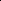

# Invariant Conditional Molecular Generation Under Distribution Shift

<!-- Page 1 -->

Invariant Conditional Molecular Generation Under Distribution Shift

Chunyu Hu1, Tianyin Liao1, Yicheng Sui1, Ran Zhang2, Xiao Wang3, Ziwei Zhang3*

1College of Software, Nankai University 2China CITIC Bank 3School of Computer Science and Engineering, Beihang University {huchunyu, 1120230329, suiyicheng}@mail.nankai.edu.cn, zhangran4@citicbank.com, xiao wang@buaa.edu.cn, zwzhang@buaa.edu.cn

## Abstract

Conditional molecular generation, aiming to generate 2D & 3D molecules that satisfy given properties, has achieved remarkable progress, thanks to the advances in deep generative models such as graph diffusion. However, existing methods generally assume that the given conditions for training and testing are consistent, failing to handle the realistic challenge when there exist distribution shifts between training and testing conditions. Invariant learning is a mainstream paradigm for addressing distribution shifts, but fusing invariant learning principles with conditional molecular generation faces three core challenges: (1) existing invariant learning methods focus on discriminative tasks and cannot be directly adapted to molecule generative tasks; (2) how to distinguish between invariant subgraph and variant subgraph of a molecule graph, which is treated as an integrated input; (3) how to fuse invariant subgraphs, variant subgraphs, and property conditions for effective generation. To tackle these challenges, we propose Invariant Conditional MOLecular generation (IC-MOL), a framework that combines invariant learning with graph diffusion to improve the generalization ability of conditional molecular generation under distribution shifts. Specifically, we first disentangle molecular graphs into invariant and variant subgraphs while maintaining SE(3) equivariance, an important inductive bias for molecular generation. On this basis, we further design a two-phase graph diffusion generation model. In the first phase, we generate an invariant molecular consistent with the target property. In the second phase, we propose a cross-attention mechanism to fuse variant subgraph representations and property conditions to guide the generation of complete molecules while maintaining property alignment. Extensive experiments on the benchmark dataset show that IC-MOL consistently outperforms state-of-the-art baselines across six property conditions under distribution shifts.

## Introduction

Conditional molecular generation, i.e., designing novel molecules with desired chemical properties, is valuable for accelerating drug discovery and material science (Du et al. 2024). Recent advances in deep generative models have significantly advanced conditional molecular generation, with representative approaches including Autoregressive models (ARs) (Goldman, Li, and Coley 2024; Luo and Ji 2022),

*Corresponding author. Copyright © 2026, Association for the Advancement of Artificial Intelligence (www.aaai.org). All rights reserved.

ID

OOD

Train Dataset Test Dataset Generative Model

Condition

Condition

رHOMO [-6,-4] رHOMO [-6,-4]

رHOMO [-6,-4] رHOMO [-3,-2]

**Figure 1.** An example of distribution shifts for conditions, leading to generalization challenges for existing methods.

Normalizing Flows (NFs) (Zang and Wang 2020; Luo, Yan, and Ji 2021) and Diffusion models (DMs) (Feng et al. 2025; Liu et al. 2024; Gu et al. 2024). These models have shown remarkable success in generating novel 2D & 3D molecules while satisfying given property constraints. Despite their significant advances, most existing methods rely on the ideal assumption that the given conditions for training and testing are identically distributed. However, in real-world applications, target property conditions can significantly diverge from those during training, leading to distribution shifts. For instance, in the widely use QM9 dataset (Ramakrishnan et al. 2014), the heat capacity (Cv) of the training molecules lies almost entirely in the range 20−50 cal mol−1K−1, but it is often necessary to seek a target crystal phase with Cv > 60 cal mol−1K−1 for differential catalytic materials (Shahin et al. 2024). As shown in Figure 1, existing methods do not account for such distribution shifts and fail to generate molecules that meet out-of-distribution (OOD) properties (Huang et al. 2023a,b; Mercatali et al. 2024). Therefore, how to design molecular generation methods with OOD generalization abilities has become an urgent requirement for advancing conditional molecular generation, but remains largely unexplored in the literature.

To tackle this problem, we draw inspiration from existing findings that molecular properties are typically highly correlated with certain structure known as invariant subgraphs within molecules, which remain stable across different environments (Klekota and Roth 2008; Phanus-Umporn et al.

The Fortieth AAAI Conference on Artificial Intelligence (AAAI-26)

21823

AI-readable visual equivalent, added: Figure extracted from the paper PDF and converted to an SVG wrapper asset. Use the surrounding page text and caption for interpretation.

AI-readable visual equivalent, added: Figure extracted from the paper PDF and converted to an SVG wrapper asset. Use the surrounding page text and caption for interpretation.

AI-readable visual equivalent, added: Figure extracted from the paper PDF and converted to an SVG wrapper asset. Use the surrounding page text and caption for interpretation.

AI-readable visual equivalent, added: Figure extracted from the paper PDF and converted to an SVG wrapper asset. Use the surrounding page text and caption for interpretation.

AI-readable visual equivalent, added: Figure extracted from the paper PDF and converted to an SVG wrapper asset. Use the surrounding page text and caption for interpretation.

AI-readable visual equivalent, added: Figure extracted from the paper PDF and converted to an SVG wrapper asset. Use the surrounding page text and caption for interpretation.

AI-readable visual equivalent, added: Figure extracted from the paper PDF and converted to an SVG wrapper asset. Use the surrounding page text and caption for interpretation.

AI-readable visual equivalent, added: Figure extracted from the paper PDF and converted to an SVG wrapper asset. Use the surrounding page text and caption for interpretation.

AI-readable visual equivalent, added: Figure extracted from the paper PDF and converted to an SVG wrapper asset. Use the surrounding page text and caption for interpretation.

<!-- Page 2 -->

2018; Zhu et al. 2020; Kao et al. 2022). By learning and preserving such invariant subgraphs for distinct properties, the model could potentially mitigate its reliance on specific distributions. Even when property conditions shift, it can still generate molecules meeting the required criteria based on invariant subgraphs. From another perspective, invariant learning has emerged as a mainstream approach for discriminative graph OOD problems, as it can identify causal features and remove spurious correlation (Li et al. 2022). These motivate us to utilize invariant learning principles to handle distribution shifts of conditional molecular generation, which face the following three challenges.

First, existing graph invariant learning methods (Li et al. 2022; Wu et al. 2022; Chen et al. 2023) are primarily designed for discriminative tasks such as node and graph classification. However, molecular conditional generation further requires that the generated structures are stable, e.g., it should remain equivariant to rotation and translation. Second, existing generative models, such as graph diffusion methods, take molecular graphs as an integrated input. How to distinguish between invariant subgraphs, which determine target properties, and variant subgraphs, which serve as environmental factors such as scaffold, remains unexplored in deep generative models. Lastly, even with decoupled subgraphs, existing methods still lack effective mechanisms to fuse invariant subgraphs, variant subgraphs, and property conditions in the generation process, making it challenging to generate molecules that are structurally valid and property compliant under distribution shifts.

To tackle these challenges, we propose Invariant Conditional MOLecular generation (IC-MOL), a novel framework that combines invariant learning with graph diffusion for 2D & 3D molecular generation under distribution shift. Specifically, we first disentangle molecular graphs into invariant and variant subgraphs through a subgraph predictor trained by using given properties as pseudo-labels. Meanwhile, we adopt E(3)-equivariant GNN (E3GNN) (Satorras, Hoogeboom, and Welling 2021) to maintain SE(3) equivariance, an important inductive bias for molecular generation that ensures the consistency of 3D molecular geometric structures under spatial transformations. Then, we design a two-phase graph diffusion generation model. In the first phase, we focus on invariant molecule generation under the target property conditions. This step is designed to avoid interference from spurious correlations, as it directly leverages the invariant subgraphs. In the second phase, we refine molecules based on the generated invariant molecule by proposing a cross-attention mechanism that fuses variant subgraphs representations and property conditions to generate structurally reasonable 2D & 3D molecules that meet the target properties. We further design a structural consistency loss to ensure the stable preservation of the invariant structure during the whole generation.

Experimental results on benchmark dataset under distribution shift settings demonstrate that our method consistently and significantly outperforms state-of-the-art baselines in terms of structural validity and generalization ability across six property conditions.

Our main contributions are summarized as follows:

• We study the problem of conditional molecular generation under distribution shifts. To the best of our knowledge, this is the first work to tackle this problem.

• We propose a novel framework IC-MOL by integrating invariant learning with graph diffusion. Our method disentangles invariant and variant subgraphs while maintaining SE(3) equivariance, and adopts a two-phase conditional diffusion generation model with a cross-attention mechanism which can generate molecules with structures that meet target properties under distribution shifts.

• Experimental results demonstrate that our method consistently achieves superior performance across six property conditions under distribution shifts.

## Related Work

Graph Invariant Learning for OOD Generalization. To tackle the distribution shift problem of graph data, several recent works have advanced graph invariant learning for OOD generalization. For example, GIL (Li et al. 2022) acquires cross-environment invariant subgraphs through the joint optimization of three modules. DIR (Wu et al. 2022) employs subgraph generation together with distributional intervention under implicit environment partitions to discover invariant graph structures. CIGA (Chen et al. 2022) selects via an information-theoretic objective that maximally preserves invariant intra-class information to guarantee OOD generalization under both structural and attribute shifts. GALA (Chen et al. 2023) extracts maximally invariant subgraphs via an environment assistant model and its proxy predictions. MoleOOD (Li et al. 2022) proposes a molecule representation learning framework to improve model robustness under distribution shifts. Despite the rich research on OOD generalization in graph representation learning, these methods are confined to discriminative tasks and cannot be directly applied to molecule generative tasks. To the best of our knowledge, our method is the first to combine invariant learning with 2D & 3D molecular generation. Molecular Conditional Generation. Recently, there have been several advances in molecular generation in 2D & 3D joint space. JODO (Huang et al. 2023a) treats the 2D topological and 3D geometric structure as continuous variables in a diffusion-based framework. Twigs (Mercatali et al. 2024) propose loop guidance to effectively coordinate the information flow between the trunk process and the steam process during the sampling process.

Very few recent works have specifically targeted generalization of molecular generation under distribution shifts. Lee et al. (Lee, Jo, and Hwang 2023) introduced MOOD, a score-based generative framework that incorporates OOD control directly into the stochastic differential equation (SDE). Klarner et al. (Klarner et al. 2024) proposed contextguided diffusion, which leverages unlabeled molecular data and regularizes diffusion trajectories via smoothness constraints. Although these methods have achieved initial progress, they lack a foundation in invariant learning, a critical limitation for capturing stable structure-property relationships under OOD conditions.

21824

<!-- Page 3 -->

## Problem Formulation

We denote a (3D) molecule as a geometric graph G = (A, x, h), where x ∈RN×3 denotes the 3D coordinates of N atoms, h ∈RN×d1 represents atom features including atom types and formal charges, A ∈RN×N×d2 encodes pairwise bond information, where each channel corresponds to a specific bond-level property such as connectivity, aromaticity, or bond multiplicity, and d1 and d2 are the dimensionality. We assume A is symmetric and has zero diagonals, as molecular bonds are undirected and have no self-loops. As a result, we only consider the lower triangle of A, which can be linearly transformed as A ∈RN(N−1)/2×d2.

## Problem Formulation

## 1 Given a training dataset

Dtrain = {(Gi, yi)}N i=1 drawn from a joint distribution ptrain(G, y), conditional molecular generation aims to generate molecules Gj ∼pθ(G | yj), where yj ∼ptest(y) is the test condition such that the generated molecule is both chemically valid and aligned with the desired property yj. Besides, distributional shifts indicate that the testing property distribution ptest(y) satisfying:

supp(ptest(y))̸ ⊆supp(ptrain(y)), (1)

i.e., the test property conditions y can fall outside the support of the training condition.

Existing conditional generation models do not consider distribution shifts. In this paper, we tackle this problem from the invariance learning perspective. First, we introduce the following assumption.

Assumption 1 We assume each molecule G can be decomposed into two disjoint subgraphs:

• An invariant subgraph Ginv = (Ainv, xinv, hinv), which contains the structural components that causally determine the target property y. • A variant subgraph Gvar = G \ Ginv, which may vary across environments and does not causally affect y.

Following invariant learning literature (Chen et al. 2023; Wu et al. 2022), we posit the existence of a Structural Causal Model (SCM) (Pearl 2009) and the property y satisfies:

y = fy(Ginv) and y ⊥⊥Gvar | Ginv, (2)

where y ⊥⊥Gvar | Ginv indicates that Ginv shields y from the influence of Gvar. fy: Ginv →R denotes the mapping function that takes the invariant subgraph Ginv as input and produces the target property y. This implies that Ginv acts as a sufficient statistic for predicting y. Notice that though Gvar does not influence target molecule properties, it is still an indispensable part that needs to be properly generated to form chemically valid molecules.

## 4 Method

In this section, we first present the overall architecture of the proposed IC-MOL model. Then, we describe the core components of IC-MOL: (1) equivariant subgraph disentanglement; (2) two-phase graph diffusion generation. Lastly, we describe the loss functions and the training process. An overall framework is shown in Figure 2.

## 4.1 The Overall Architecture

To tackle distribution shifts, IC-MOL consists of two key components: equivariant subgraph disentanglement and two-phase graph diffusion generation. Specifically, we first combine SE(3) equivariance with a representative graph invariant learning method GALA (Chen et al. 2023) to achieve the disentanglement of invariant subgraph Ginv and variant subgraph Gvar from the observed molecular graph. Then, we propose a two-phase graph diffusion generation model. In the first phase, the extracted invariant subgraph Ginv is fed into a conditional diffusion model to generate a new invariant molecular aligned with the target property condition y. In the second phase, we generate the complete molecular structure. We encode the Gvar via an E3GNN to obtain a latent representation zs, and through a cross-attention mechanism to fuse variant subgraph representations with the property condition y. The fused context serves as the conditional input for the second phase, guiding the completion of the full molecular graph. Finally, a structural consistency loss between the generated invariant core and the completed molecule enforces preservation of Ginv while permitting flexible variation in Gvar to enhance structural diversity.

## 4.2 Equivariant Subgraph

Disentanglement A key challenge in 3D molecular generation under distribution shifts is to identify and preserve the invariant subgraph across environments while maintaining SE(3) equivariance. Inspired by the GALA framework (Chen et al. 2023) and Assumption 1, we decompose molecule G into an invariant subgraph Ginv that determines the molecular property y, and a variant subgraph Gvar that may be spuriously correlated with y, while the decomposition is equivariant to SE(3).

Under distribution shifts, standard empirical risk minimization (ERM) often fails to generalize, as it tends to overfit to spurious correlations present in the training data. In particular, when

H(Gvar|y) < H(Ginv|y), (3)

where H(·, ·) is the Shannon entropy, the model tends to rely on the variant subgraph Gvar for predictions. To mitigate this, we adopt environment-assisted subgraph selection based on the following assumptions (Chen et al. 2023): for any variant subgraph Gvar, there exist two environments such that p(y|Gvar) differs across them, while p(y|Ginv) remains unchanged. With this assumption, we can partition the training data into two subsets in virtual environments Ev:

1. ˆGp inv: Sampled from estimated invariant subgraphs { ˆGp} dominated by spurious correlations. Here, Gvar retains a strong correlation with y, and p(y|Gvar) stays stable.

2. ˆGn inv: Sampled from estimated invariant subgraphs { ˆGn} where spurious correlations break down. Here, Gvar’s correlation with y weakens, and P(y|Gvar) varies across environments. Note that only Ginv maintains stable relationship with y across both subsets. Thus, we select Ginv by maximizing conditional mutual information:

Ginv ∈arg max

ˆ Gp inv

I(ˆGp inv; ˆGn inv|y), (4)

21825

<!-- Page 4 -->

Variant

Molecule

Variant Molecule

Invariant Molecule

Invariant Molecule Generation Phase

...

Complete Molecule Generation Phase

Invariant Molecule

ℒpred

(a) Equivariant Subgraph Disentanglement

C H

N F

O

Atom Feature

3D Coordinate

Node Representation

Invariant

Variant Representation

Property Prediction Head

(b) Two-phase Graph Diffusion Generation

...

＋noise

Ʊinv Ʊinv... Ʊinv,T Ʊinv,t...

＋noise

Ʊinv,֧ ’... Ʊ...

Complete Molecule

E3GNN ǐ = 1

··· E3GNN ǐ = 1

···

E3GNN ǐ = 1

···

Ʊinv,֩ ’ ƭֱ = 35 Condition

Ʊ = (ƫ, ǜ, ℎ)

Ǟvar

Generated Invariant Molecule ǐ = 2

Condition e.g. ƭֱ = 35

Variant Representation

×

V K

Q Context c

......

**Figure 2.** The framework of IC-MOL. (a) Molecules are disentangled into invariant and variant subgraphs predictor while maintaining SE(3) equivariance, which is trained using given properties as pseudo-labels for subgraph disentanglement. (b) The two-phase graph diffusion generation. In the first phase, our method focuses on generating invariant subgraphs under target property constraints by directly leveraging invariant subgraphs. Then, we generate the complete molecule based on the invariant molecule using cross-attention, which fuses variant subgraph representations and property conditions.

where I(·, ·) measures the mutual information. This method ensures capturing invariant and property-relevant information even as Ginv varies across environments.

To adapt to 3D molecular graphs, we adopt an E3GNN (Satorras, Hoogeboom, and Welling 2021) as the backbone architecture in our framework. This ensures subgraph features remain consistent under molecular rotations/translations, which is a key requirement for 3D conformation generalization. We first leverage E3GNN to extract atom representation. Specifically, the inner product of atom representation is computed and subsequently fed into the sigmoid function to generate edge masks, which quantify the importance of each edge. Edges with mask values exceeding a predefined threshold are designated as components of the invariant subgraph Ginv, whereas those with mask values below the threshold are categorized into the variant subgraph Gvar, which can be defined as Gvar = G \ Ginv. We encode them using separate E3GNN to capture their distinct characteristics:

zinv = E3GNNinv(Ginv), zvar = E3GNNvar(Gvar), (5)

where zinv, zvar denotes node-level representations of invariant and variant subgraphs, respectively. We aggregate zinv as invariant subgraph-level representation hinv via a global pooling operator. Then we introduce an auxiliary prediction head Φinv that takes the pooled invariant subgraph representation hinv as input and predicts the target property value of the 3D molecule. Formally, hinv = Pooling zinv

, ˆyinv = Φinv hinv

, (6)

where ˆyinv is the predicted property value, Pooling(·) represents the global pooling. We train the property prediction head with a mean squared error loss:

Lpred = 1

N

PN i=1

ˆyinv,i −yi

2, (7)

where N denotes the total number of training molecules. This encourages capturing the core causal factors that determine the true property y, which can be applied in the subsequent molecular generation process.

## 4.3 Two-phase Graph Diffusion Generation

Based on equivariant subgraph disentanglement, we propose a two-phase graph diffusion generation model to generate molecules that conform to OOD generalization. To simultaneously generate topological structures and 3D geometric conformations, this two-phase framework operates in a continuous product space combining 2D bond connectivity and 3D atomic coordinates. Specifically, we treat both the discrete bond connectivity and the continuous atomic coordinates as continuous variables and model their joint distribution using a SDE framework, and employ the SE(3)-equivariant Diffusion Graph Transformer (DGT) backbone (Huang et al. 2023a).

Invariant Molecule Generation Phase In the first phase, we generate an invariant subgraph ˆGinv aligned with the target property y. These subgraphs serve as the core of the molecule, ensuring that property-relevant structures are preserved across distribution shifts. We define invariant subgraph as Ginv = (Ainv, xinv, hinv) and formulate the gen-

21826

AI-readable visual equivalent, added: Figure extracted from the paper PDF and converted to an SVG wrapper asset. Use the surrounding page text and caption for interpretation.

AI-readable visual equivalent, added: Figure extracted from the paper PDF and converted to an SVG wrapper asset. Use the surrounding page text and caption for interpretation.

AI-readable visual equivalent, added: Figure extracted from the paper PDF and converted to an SVG wrapper asset. Use the surrounding page text and caption for interpretation.

AI-readable visual equivalent, added: Figure extracted from the paper PDF and converted to an SVG wrapper asset. Use the surrounding page text and caption for interpretation.

AI-readable visual equivalent, added: Figure extracted from the paper PDF and converted to an SVG wrapper asset. Use the surrounding page text and caption for interpretation.

AI-readable visual equivalent, added: Figure extracted from the paper PDF and converted to an SVG wrapper asset. Use the surrounding page text and caption for interpretation.

AI-readable visual equivalent, added: Figure extracted from the paper PDF and converted to an SVG wrapper asset. Use the surrounding page text and caption for interpretation.

AI-readable visual equivalent, added: Figure extracted from the paper PDF and converted to an SVG wrapper asset. Use the surrounding page text and caption for interpretation.

AI-readable visual equivalent, added: Figure extracted from the paper PDF and converted to an SVG wrapper asset. Use the surrounding page text and caption for interpretation.

AI-readable visual equivalent, added: Figure extracted from the paper PDF and converted to an SVG wrapper asset. Use the surrounding page text and caption for interpretation.

AI-readable visual equivalent, added: Figure extracted from the paper PDF and converted to an SVG wrapper asset. Use the surrounding page text and caption for interpretation.

AI-readable visual equivalent, added: Figure extracted from the paper PDF and converted to an SVG wrapper asset. Use the surrounding page text and caption for interpretation.

AI-readable visual equivalent, added: Figure extracted from the paper PDF and converted to an SVG wrapper asset. Use the surrounding page text and caption for interpretation.

AI-readable visual equivalent, added: Figure extracted from the paper PDF and converted to an SVG wrapper asset. Use the surrounding page text and caption for interpretation.

AI-readable visual equivalent, added: Figure extracted from the paper PDF and converted to an SVG wrapper asset. Use the surrounding page text and caption for interpretation.

AI-readable visual equivalent, added: Figure extracted from the paper PDF and converted to an SVG wrapper asset. Use the surrounding page text and caption for interpretation.

AI-readable visual equivalent, added: Figure extracted from the paper PDF and converted to an SVG wrapper asset. Use the surrounding page text and caption for interpretation.

AI-readable visual equivalent, added: Figure extracted from the paper PDF and converted to an SVG wrapper asset. Use the surrounding page text and caption for interpretation.

AI-readable visual equivalent, added: Figure extracted from the paper PDF and converted to an SVG wrapper asset. Use the surrounding page text and caption for interpretation.

AI-readable visual equivalent, added: Figure extracted from the paper PDF and converted to an SVG wrapper asset. Use the surrounding page text and caption for interpretation.

<!-- Page 5 -->

eration of Ginv as a continuous-time denoising diffusion process in the product space RNc(Nc−1)/2×d2 × RNc×3 × RNc×d1, where Nc denotes the number of atoms in Ginv. The forward SDE with t ∈[0, T] is dGinv,t = f(t)Ginv,t dt + g(t) d(winv,A, winv,x, winv,h),

(8) where winv,A, winv,x, winv,h denote standard Wiener process on the bond, coordinate, and feature spaces, respectively, and f(t) and g(t) are the drift coefficient and the diffusion coefficient for the diffusion process. As t →T, Ginv,t gradually approaches an isotropic Gaussian distribution, which serves as the prior distribution for sampling during the generative process.

To enable the reverse denoising process from time T to 0, we learn a reverse-time SDE that transforms the noisy data into the original invariant subgraph, which is formulated as:

dGinv,t = f(t) −g2(t)∇Ginv,t log qt(Ginv,t|y)

dt

+ g(t) d(¯winv,A, ¯winv,x, ¯winv,h), (9)

where ¯winv,A, ¯winv,x, ¯winv,h are the reverse-time standard Wiener processes, ∇Ginv,t log qt(Ginv,t|y) denotes the score function of the noisy invariant subgraph at time t conditioned on the property y.

To parameterize the score function and generate highfidelity invariant subgraphs, we adopt the data prediction model in (Huang et al. 2023a) instead of the noise prediction model. Leveraging self-conditioning, this model takes four inputs: the noisy invariant subgraph Ginv,t at time t, the previously estimated invariant subgraph ˆGinv,0 from the last sampling step, and the noise level log(α2 t /σ2 t) which denotes the signal-to-noise ratio at time t, and the given property y. Formally, the data prediction model is:

dθ1(Ginv,t, ˆGinv,0, log(α2 t /σ2 t), y). (10)

Unlike standard denoising models that recover data directly from noise, our method refines the previous prediction ˆGinv,0. We implement dθ1 with DGT (Huang et al. 2023a), which leverages relational attention for node and edge interaction to ensure invariant subgraph topological and geometric consistency. The data prediction model dθ1(Ginv,t, ˆGinv,0, log(α2 t /σ2 t), y) produces three outputs denoted as (dA θ1, dx θ1, dh θ1), and is trained by by minimizing the mean squared error:

Linv = min θ Et{ rαt σt

EGinv,0,yEGinv,t|Ginv,0[||dA θ1 −A0||2

2

+ λ1||dx θ1 −ˆx0||2

2 + ||dh θ1 −h0||2

2]}, (11)

where λ1 is the loss weights.

Complete Molecule Generation Phase In the second phase, we generate the complete molecule ˆG based on ˆGinv by a cross-attention mechanism. Specifically, our crossattention fuses the variant subgraph representations zvar and the property condition y into a unified conditional context vector c, which guides the diffusion model toward the desired structural and chemical space.

Formally, the complete molecule is represented as ˆG = (ˆ A, ˆx, ˆh). The input of the second second phase is the generated invariant molecule ˆGinv from the first phase and a conditional context vector c. The data prediction model for molecule completion is defined as:

dθ2(ˆGinv,t, ˆG0, log(α2 t /σ2 t), c). (12) The model is trained with a similar loss formulation as in the first phase, formulated as follows:

Lfull = min θ Et{ rαt σt

EG0,cEGinv,t|G0[||dA θ2 −A0||2

2

+ λ2||dx θ2 −ˆx0||2

2 + ||dh θ2 −h0||2

2]}, (13)

where λ2 is the loss weights. In particular, we prove that the two-phase graph diffusion satisfies SE(3)-invariant, the proof is provided in Appendix. Next, we elaborate on the cross-attention to learn the context vector c.

Cross-Attention We propose a cross-attention to guide the second phase diffusion model in generating chemically valid molecules. By fusing variant subgraph representations zvar and property condition y into a unified context c, we enable effective use of this information for generation. Since it is impossible to find invariant subgraphs or variant subgraphs in the sampling process under realistic conditions, we randomly drop the variant subgraph representations during training to improve the quality of the generated samples:

z′ var = m ⊙zvar, m ∼Bernoulli(1 −p), (14) where m is a stochastic binary mask, ⊙denotes elementwise multiplication and p denotes dropout probability. Then, both z′ var and y are projected into a shared latent space via linear transformations:

q = Wqz′ var, k = Wky, v = Wvy, (15)

where Wq, Wk, Wv are parameters and q, k, v ∈Rd are corresponding query, key, and value vectors. The crossattention mechanism computes the attention score and the fused representation as:

zf = softmax q⊤k √ d

· v. (16)

The final fused context vector c is obtained via an output projection using a linear layer:

c = Wo(zf), (17) where Wo is the parameter.

Structural Consistency Loss To ensure that the critical causal structure discovered in the first stage is preserved during the full molecule generation, we introduce a structure consistency loss. Specifically, given the predicted full molecule ˆG from the second-stage diffusion model, we extract the substructure corresponding to the invariant subgraph region ˆG′ inv = (ˆ A′ inv, ˆx′ inv, ˆh′ inv) and enforce it to match the invariant graph output ˆGinv generated in the first stage as follows:

Lcons =

ˆ Ainv −ˆ A′ inv

2

F +

ˆxinv −ˆx′ inv

2

F +

ˆhinv −ˆh′ inv

2

F,

(18) where ∥·∥F denotes the Frobenius norm.

21827

<!-- Page 6 -->

Overall Training Loss The overall loss combines all components to balance prediction accuracy, generation quality, and structural consistency:

Ltotal = Lpred + Linv + Lfull + Lcons. (19)

## 5 Experimental Settings

In this section, we evaluate our method by comparing it with state-of-the-art methods. We first introduce the experimental settings. Then, we present the results on conditional molecule generation with targeted properties. Lastly, we report analyses of our method. We release the code at https://github.com/selena200002/IC-MOL.

## 5.1 Experimental Settings

Datasets. We conduct experiments on the QM9 dataset (Ramakrishnan et al. 2014), which contains molecules up to 9 heavy atoms. It provides comprehensive 2D bonding graphs, 3D conformations, and molecular property. For the conditional generation task, we focus on six quantum properties, namely the heat capacity Cv, the dipole moment µ, the polarizability α, the highest occupied molecular orbital energy ϵHOMO, the lowest unoccupied molecular orbital energy ϵLUMO, and the HOMO-LUMO gap ∆ϵ.

To simulate the distribution shifts in the real world, we split the dataset based on target properties, i.e., we sort samples by the value of each property and split them into training, validation, and test sets based on the sorted results. We adopt two common distribution shifts:

• Condition shift S→L: The training set contains only small property values, whereas the test set contains only large property values. • Condition shift L→S: The training set contains only large property values, whereas the test set contains only small property values.

More experimental details are provided in Appendix. Baselines. We compare IC-MOL with two state-of-the-art conditional molecular generation methods: JODO (Huang et al. 2023a) and Twigs (Mercatali et al. 2024). Besides their original methods, we also combine them with DRO (Sagawa et al. 2019), which are specifically designed to handle OOD issues, as additional baselines. Appendix presents the detailed information of the baselines. Metrics. We generate 10,000 molecules for each evaluation and report the Mean Average Error (MAE) between the target property values and those for the generated samples. We further assess OOD generation quality from both the 2D graph and 3D geometry perspectives. We evaluate validity (Val), atom stability (AtomStb), and molecule stability (MolStb) on 3D geometry, and validity (Val), similarity to the nearest neighbor (SNN), fragment similarity (Frag) and scaffold similarity (Scaf) on the 2D graph. Appendix presents more detailed information. Implementation Details. We train our model for a total of 300k iterations, with the AdamW optimizer (β1 = 0.9, weight decay = 1e−2), the learning rate of 1e−3 and a batch size of 128. We set λ1, λ2 = 0.25. More implementation details are provided in Appendix.

## Method

Cv µ α ∆ϵ ϵHOMO ϵLUMO

JODO 1.235 1.570 8.666 612.6 JODO+DRO 1.594 1.586 8.698 613.4 Twigs 1.313 1.586 8.995 613.0 Twigs+DRO 1.562 1.591 8.683 614.9

IC-MOL 1.209 1.550 8.531 611.4

**Table 1.** MAE of predicted single property under condition shift S→L. The best results are in bold.

## Method

Cv µ α ∆ϵ ϵHOMO ϵLUMO

JODO 2.318 1.742 7.650 585.3 JODO+DRO 2.361 1.742 7.740 584.1 Twigs 2.419 1.775 7.834 589.3 Twigs+DRO 2.305 1.779 7.710 588.0

IC-MOL 2.298 1.741 7.603 583.6

**Table 2.** MAE of predicted single property under condition shift L→S. The best results are in bold.

## 5.2 Comparisons with State-of-the-art

The MAE results of condition shift S→L. Under this OOD setting, the MAE between the properties of generated molecules and the target is shown in Table 1. Our model outperforms other methods across all six properties. For instance, the MAE of Cv is over 2.1% lower than that of the second-best method. This demonstrates our model generates molecules with properties more closely aligned with ground truth, validating its ability to mitigate train-test distribution discrepancies. The MAE results of condition shift L→S. Further, we report the MAE results under condition shift L→S. From Table 2, our method consistently achieves the lowest MAE across all six property conditions, outperforming stateof-the-art methods. This demonstrates that our approach achieves superior control over generated molecular properties under diverse OOD conditions, highlighting its robust generalization and stability across distribution shifts. Other metrics under condition shift S→L. We also present 3D metrics comparisons in Table 3 under condition shift S→L. Our method outperforms state-of-the-art approaches, achieving the highest atom stability and validity across six properties, and the top molecule stability in four. Coupled with its superior validity and atomic stability, these results demonstrate that our method produces more generalization and reliable molecules under OOD conditions.

The quantitative comparisons of 2D molecule generation are shown in Table 4. Our proposed IC-MOL consistently outperforms all baseline models on nearly all evaluation metrics of the QM9 dataset, including the validity and Frag of 2D molecular graphs. The overall evaluation results show that IC-MOL achieves the best comprehensive performance in terms of the chemical validity, structural rationality of generated molecules, and consistency with real molecules. More quantitative comparisons of our method are provided in the Appendix.

21828

<!-- Page 7 -->

Metrics Val ↑ AtomStb ↑ MolStb ↑

Condition Cv µ ∆ε εHOMO α εLUMO Cv µ ∆ε εHOMO α εLUMO Cv µ ∆ε εHOMO α εLUMO

JODO 0.947 0.959 0.922 0.946 0.947 0.954 0.987 0.991 0.982 0.990 0.989 0.978 0.879 0.918 0.853 0.911 0.914 0.839 JODO+DRO 0.920 0.942 0.896 0.944 0.940 0.878 0.975 0.989 0.980 0.990 0.989 0.975 0.783 0.885 0.822 0.907 0.887 0.812 Twigs 0.921 0.930 0.894 0.897 0.884 0.928 0.983 0.989 0.979 0.981 0.980 0.879 0.858 0.879 0.804 0.812 0.821 0.844 Twigs+DRO 0.865 0.925 0.901 0.871 0.950 0.905 0.970 0.986 0.983 0.944 0.989 0.977 0.736 0.831 0.738 0.509 0.907 0.806 IC-MOL 0.953 0.985 0.925 0.968 0.969 0.954 0.989 0.992 0.987 0.990 0.990 0.989 0.875 0.896 0.899 0.985 0.920 0.851

**Table 3.** The results of 3D molecule generation under the condition shift S→L setting. The best results are in bold.

Metrics Val ↑ SNN ↑

Condition Cv µ ∆ε εHOMO α εLUMO Cv µ ∆ε εHOMO α εLUMO

JODO 0.986 0.985 0.992 0.989 0.983 0.983 0.337 0.428 0.296 0.354 0.389 0.362 JODO+DRO 0.984 0.985 0.990 0.991 0.980 0.981 0.331 0.428 0.302 0.354 0.390 0.241 Twigs 0.987 0.984 0.983 0.971 0.982 0.982 0.342 0.408 0.310 0.349 0.394 0.355 Twigs+DRO 0.977 0.980 0.416 0.871 0.983 0.984 0.337 0.410 0.305 0.324 0.390 0.244 IC-MOL 0.990 0.988 0.985 0.991 0.985 0.987 0.331 0.438 0.325 0.350 0.407 0.389

Metrics Frag ↑ Scaf ↑

Condition Cv µ ∆ε εHOMO α εLUMO Cv µ ∆ε εHOMO α εLUMO

JODO 0.865 0.796 0.837 0.838 0.740 0.512 0.523 0.776 0.450 0.221 0.614 0.526 JODO+DRO 0.828 0.786 0.817 0.837 0.714 0.474 0.585 0.782 0.484 0.208 0.601 0.524 Twigs 0.874 0.782 0.820 0.839 0.743 0.492 0.556 0.713 0.533 0.200 0.608 0.501 Twigs+DRO 0.858 0.773 0.825 0.821 0.713 0.557 0.676 0.725 0.530 0.208 0.592 0.546 IC-MOL 0.890 0.793 0.839 0.841 0.793 0.561 0.685 0.786 0.455 0.231 0.648 0.455

**Table 4.** The results of 2D molecule generation under the condition shift S →L setting. The best results are in bold.

Metrics-3D/MAE Val↑ AtomStb↑MolStb↑MAE↓

IC-MOL 0.968 0.990 0.985 611.4 - Lcons 0.968 0.978 0.941 613.6 - cross-attention 0.943 0.975 0.966 615.8 - the second phase 0.953 0.986 0.826 612.4 - the first phase 0.946 0.990 0.911 612.6

Metrics-2D Val↑ SNN↑ Frag↑ Scaf↑

IC-MOL 0.991 0.350 0.841 0.231 - Lcons 0.973 0.349 0.812 0.225 - cross-attention 0.965 0.344 0.817 0.216 - the second phase 0.987 0.355 0.841 0.212 - the first phase 0.989 0.354 0.838 0.221

**Table 5.** Ablation studies on IC-MOL under the condition shift S→L regarding the results of predicted ϵHOMO properties. The best results are in bold.

## 5.3 Ablation Studies We perform ablation experiments by removing

Lcons, crossattention, two-phase graph diffusion generation in IC-MOL to verify the designs of our method. The quantitative results are shown in Table 5. For two-phase graph diffusion generation, we remove each of its phase, denoted as the second phase and the first phase, respectively. It is worth noting that removing the first phase is equivalent to JODO.

By removing cross-attention, various metrics decrease, indicating that cross-attention can integrate information from the variant subgraph and help generate more realistic molecules. When the second phase is removed, the molecular stability decreases significantly, indicating that our second diffusion model plays a decisive role in refining the molecule. When Lcons is removed, the Frag metrics decreases, indicating that our proposed Lcons can ensure the structure of the invariant subgraph.

## 6 Conclusion

In this paper, we study the critical challenge of generalization ability of conditional molecular generation under distribution shifts. We propose IC-MOL, a novel framework that combines invariant learning with graph diffusion to enable OOD generalization. Specifically, our method first disentangles molecular graphs into invariant and variant subgraphs while preserving SE(3) equivariance. We further design a two-phase graph diffusion generation model by first generating invariant molecules aligned with target properties, and then fusing variant subgraph representations and property conditions via a cross-attention mechanism to generate complete molecules. Extensive experimental results demonstrate that under distribution shifts, IC-MOL consistently outperforms state-of-the-art baselines across six property conditions, verifying its superior generalization ability in conditional molecular generation tasks. In future work, we will explore more flexible subgraph disentanglement strategies and adapt to more complex molecular design scenarios.

21829

<!-- Page 8 -->

## Acknowledgments

This work was supported in part by the National Natural Science Foundation of China (No. 62472018, 62322203, 62172052), the Fundamental Research Funds for the Central Universities JK2024-07 and the Natural Science Foundation of Tianjin (No. 24JCQNJC02170).

## References

Chen, Y.; Bian, Y.; Zhou, K.; Xie, B.; Han, B.; and Cheng, J. 2023. Does invariant graph learning via environment augmentation learn invariance? Advances in Neural Information Processing Systems, 36: 71486–71519. Chen, Y.; Zhang, Y.; Bian, Y.; Yang, H.; Kaili, M.; Xie, B.; Liu, T.; Han, B.; and Cheng, J. 2022. Learning causally invariant representations for out-of-distribution generalization on graphs. Advances in Neural Information Processing Systems, 35: 22131–22148. Du, Y.; Jamasb, A. R.; Guo, J.; Fu, T.; Harris, C.; Wang, Y.; Duan, C.; Li`o, P.; Schwaller, P.; and Blundell, T. L. 2024. Machine learning-aided generative molecular design. Nature Machine Intelligence, 6(6): 589–604. Feng, S.; Ni, Y.; yan, L.; Ma, Z.-M.; Ma, W.-Y.; and Lan, Y. 2025. UniGEM: A Unified Approach to Generation and Property Prediction for Molecules. In The Thirteenth International Conference on Learning Representations. Goldman, S.; Li, J.; and Coley, C. W. 2024. Generating molecular fragmentation graphs with autoregressive neural networks. Analytical Chemistry, 96(8): 3419–3428. Gu, S.; Xu, M.; Powers, A.; Nie, W.; Geffner, T.; Kreis, K.; Leskovec, J.; Vahdat, A.; and Ermon, S. 2024. Aligning target-aware molecule diffusion models with exact energy optimization. Advances in Neural Information Processing Systems, 37: 44040–44063. Huang, H.; Sun, L.; Du, B.; and Lv, W. 2023a. Learning joint 2d & 3d diffusion models for complete molecule generation. arXiv preprint arXiv:2305.12347. Huang, L.; Zhang, H.; Xu, T.; and Wong, K.-C. 2023b. Mdm: Molecular diffusion model for 3d molecule generation. In Proceedings of the AAAI Conference on Artificial Intelligence, volume 37, 5105–5112. Kao, Y.-T.; Wang, S.-F.; Wu, M.-H.; Her, S.-H.; Yang, Y.- H.; Lee, C.-H.; Lee, H.-F.; Lee, A.-R.; Chang, L.-C.; and Pao, L.-H. 2022. A substructure-based screening approach to uncover N-nitrosamines in drug substances. Journal of Food and Drug Analysis, 30(1): 150. Klarner, L.; Rudner, T. G.; Morris, G. M.; Deane, C. M.; and Teh, Y. W. 2024. Context-guided diffusion for out-ofdistribution molecular and protein design. In Proceedings of the 41st International Conference on Machine Learning, 24770–24807. Klekota, J.; and Roth, F. P. 2008. Chemical substructures that enrich for biological activity. Bioinformatics, 24(21): 2518–2525. Lee, S.; Jo, J.; and Hwang, S. J. 2023. Exploring chemical space with score-based out-of-distribution generation. In International Conference on Machine Learning, 18872– 18892. PMLR.

Li, H.; Zhang, Z.; Wang, X.; and Zhu, W. 2022. Learning invariant graph representations for out-of-distribution generalization. Advances in Neural Information Processing Systems, 35: 11828–11841. Liu, G.; Xu, J.; Luo, T.; and Jiang, M. 2024. Graph diffusion transformers for multi-conditional molecular generation. Advances in Neural Information Processing Systems, 37: 8065–8092. Luo, Y.; and Ji, S. 2022. An autoregressive flow model for 3d molecular geometry generation from scratch. In International conference on learning representations (ICLR). Luo, Y.; Yan, K.; and Ji, S. 2021. Graphdf: A discrete flow model for molecular graph generation. In International conference on machine learning, 7192–7203. PMLR. Mercatali, G.; Verma, Y.; Freitas, A.; and Garg, V. 2024. Diffusion twigs with loop guidance for conditional graph generation. Advances in Neural Information Processing Systems, 37: 137741–137767. Pearl, J. 2009. Causality. Cambridge university press. Phanus-Umporn, C.; Shoombuatong, W.; Prachayasittikul, V.; Anuwongcharoen, N.; and Nantasenamat, C. 2018. Privileged substructures for anti-sickling activity via cheminformatic analysis. RSC advances, 8(11): 5920–5935. Ramakrishnan, R.; Dral, P. O.; Rupp, M.; and Von Lilienfeld, O. A. 2014. Quantum chemistry structures and properties of 134 kilo molecules. Scientific data, 1(1): 1–7. Sagawa, S.; Koh, P. W.; Hashimoto, T. B.; and Liang, P. 2019. Distributionally robust neural networks for group shifts: On the importance of regularization for worst-case generalization. arXiv preprint arXiv:1911.08731. Satorras, V. G.; Hoogeboom, E.; and Welling, M. 2021. E (n) equivariant graph neural networks. In International conference on machine learning, 9323–9332. PMLR. Shahin, M. B.; Liaqat, S.; Nancarrow, P.; and McCormack, S. J. 2024. Crystal Phase Ionic Liquids for Energy Applications: Heat Capacity Prediction via a Hybrid Group Contribution Approach. Molecules, 29(9): 2130. Wu, Y.-X.; Wang, X.; Zhang, A.; He, X.; and seng Chua, T. 2022. Discovering Invariant Rationales for Graph Neural Networks. In ICLR. Zang, C.; and Wang, F. 2020. Moflow: an invertible flow model for generating molecular graphs. In Proceedings of the 26th ACM SIGKDD international conference on knowledge discovery & data mining, 617–626. Zhu, J.; Liu, Y.; Wen, C.; and Wu, X. 2020. DGDFS: Dependence guided discriminative feature selection for predicting adverse drug-drug interaction. IEEE Transactions on Knowledge and Data Engineering, 34(1): 271–285.

21830
