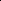

# L2V-CoT: Cross-Modal Transfer of Chain-of-Thought Reasoning via Latent Intervention

<!-- Page 1 -->

L2V-CoT: Cross-Modal Transfer of Chain-of-Thought Reasoning via Latent Intervention

Yu-Liang Zhan*, Xinyu Tang*, Han Wan, Jian Li, Jirong Wen, Hao Sun†

Gaoling School of Artificial Intelligence, Renmin University of China, Beijing, China

{zhanyuliang, xinyu_tang, wanhan2001, lijian2022, jrwen, haosun}@ruc.edu.cn

## Abstract

Recently, Chain-of-Thought (CoT) reasoning has significantly enhanced the capabilities of large language models (LLMs), but Vision-Language Models (VLMs) still struggle with multi-step reasoning tasks due to limited multimodal reasoning data. To bridge this gap, researchers have explored methods to transfer CoT reasoning from LLMs to VLMs. However, existing approaches either need high training costs or require architectural alignment. In this paper, we use Linear Artificial Tomography (LAT) to empirically show that LLMs and VLMs share similar low-frequency latent representations of CoT reasoning despite architectural differences. Based on this insight, we propose L2V-CoT, a novel trainingfree latent intervention approach that transfers CoT reasoning from LLMs to VLMs. L2V-CoT extracts and resamples lowfrequency CoT representations from LLMs in the frequency domain, enabling dimension matching and latent injection into VLMs during inference to enhance reasoning capabilities. Extensive experiments demonstrate that our approach consistently outperforms training-free baselines and even surpasses supervised methods.

## Introduction

Recently, reasoning models have achieved significant advancements in tackling a wide range of complex tasks (OpenAI 2024; Wang et al. 2025a; Guo et al. 2025; Wang et al. 2025b). A crucial factor contributing to this success is the Chain-of-Thought (CoT) method, which allows large language models (LLMs) to decompose complex problems into a sequence of intermediate reasoning steps (Xia et al. 2024). This approach has significantly improved their reasoning and decision-making capabilities (Zhang et al. 2025). In contrast, although Vision–Language Models (VLMs) have shown impressive results on tasks such as visual question answering (Hartsock and Rasool 2024) and image captioning (Kim et al. 2024; Li et al. 2025b), they still struggle with tasks that require multi-step reasoning, such as chart and geometric analysis (Cheng et al. 2025; Zhang et al. 2024). This problem is primarily attributed to the scarcity of multimodal reasoning data, as generating such data is both resourceintensive and time-consuming (Liu et al. 2025).

*These authors contributed equally. †Corresponding author. Copyright © 2026, Association for the Advancement of Artificial Intelligence (www.aaai.org). All rights reserved.

To address this problem, recent studies have explored ways to transfer reasoning capabilities from LLMs to VLMs. Virgo (Du et al. 2025) enables cross-modal reasoning transfer by training VLMs on large amounts of textual Chainof-Thought (CoT) data. However, this approach is hindered by high training costs and limited generalization ability. To overcome this limitation, existing studies transfer reasoning capabilities from LLM to VLM through model merging (Chen et al. 2025; Zhan et al. 2024). Although this method achieves effective transfer, its applicability is limited to scenarios where the VLM and the source LLM are architecturally aligned. However, in real-world scenarios, the LLM backbone of VLM is not always aligned with the strong text reasoning model, which limits the upper bound of reasoning capabilities that can be transferred from LLMs to VLMs. This raises a practical challenge: How can we transfer reasoning abilities from LLMs to VLMs across different architectures?

Inspired by Contrast-Consistent Search (Burns et al. 2022), which suggests that model capabilities can be captured and manipulated through linear transformations, we explore the possibility of transferring reasoning capabilities across different model architectures. However, since models with different modalities often have distinct internal structures, it remains unclear whether the internal reasoning patterns encoded in one modality can be effectively interpreted, aligned, and transferred to another modality.

To further analyze reasoning capabilities across models of different modalities, we apply Linear Artificial Tomography (LAT) (Zou et al. 2023), a representation reading method that extracts latent states with contrastive inputs, to examine the latent representations of them. The findings of our analysis reveal that: (1) The low-frequency components of VLM’s CoT direction representations, derived from linear modeling of CoT and Non-CoT representations, can activate its reasoning ability. In contrast, the high-frequency components do not help. (2) These low-frequency representations have a similar distribution to those of LLMs. The observation suggests a consistent structural alignment in the latent space across modalities, which enables effective cross-modal transfer of reasoning ability.

Based on these insights, we propose Latent Intervention for LLM-to-VLM CoT Transfertion (L2V-CoT), a trainingfree latent intervention method that transfers the general

The Fortieth AAAI Conference on Artificial Intelligence (AAAI-26)

12358

<!-- Page 2 -->

CoT reasoning capabilities of LLMs to VLMs. Specifically, we collect CoT and Non-CoT from LLMs to construct contrastive samples. These samples are then encoded by the reasoning LLM to obtain CoT direction representations. However, representations derived from different architectures often encounter the dimension mismatch problem. To address this, we apply low-pass filtering to the CoT direction representations from the LLM to preserve essential CoT information. Then, we perform resampling in the frequency domain to match the dimension. These resampled representations are injected into the VLM via latent intervention during inference, thereby implicitly enhancing its reasoning ability. As a training-free and model-agnostic method, L2V-CoT enables efficient transfer the reasoning capabilities of LLMs to VLMs. To evaluate its effectiveness, we conduct experiments on multiple visual reasoning benchmarks across diverse VLMs. The experimental results demonstrate that L2V-CoT consistently outperforms other training-free baselines and even surpasses some supervised approaches.

Our contributions can be summarized as follows: • To our best knowledge, we are the first to leverage Linear Artificial Tomography to analyze the transferability of reasoning capabilities between LLMs and VLMs.

• We propose L2V-CoT, a novel training-free method that transfers the general CoT reasoning capability of LLMs to VLMs, thereby enhancing the reasoning ability of VLMs.

• Extensive experiments validate the effectiveness of our approach in transferring CoT reasoning across modalities.

## Related Work

Multimodal Chain-of-Thought Reasoning. As CoT reasoning proves effective in LLMs, recent work has extended it to multimodal tasks (Chen et al. 2024b; Li et al. 2025a). Existing methods fall into two main categories: explicit and implicit methods, which are orthogonal and complementary in enhancing VLM reasoning (Wu et al. 2025). Explicit methods guide reasoning step-by-step via rewards or search without altering model states (Yao et al. 2024). In contrast, implicit methods improve reasoning by modifying internal states (Luo et al. 2025; Zhang et al. 2023). LlamaV-o1 (Thawakar et al. 2025) learns from multimodal CoT data. Given the scarcity of visual CoT annotations, Virgo (Du et al. 2025) trains VLMs on textual CoT data (Du et al. 2025). Parameter mergingmethods further enable training-free transfer from LLMs to VLMs but are constrained to architecture-aligned models (Chen et al. 2025). Our method, L2V-CoT, belongs to the implicit category. It enables architecture-agnostic, training-free CoT transfer from LLMs to VLMs via latent intervention, offering a flexible and generalizable solution for multimodal reasoning.

Activation engineering. Activation engineering modifies a model’s latent states for two main purposes: (1) understanding internal mechanisms and (2) controlling behavior (Zou et al. 2023). It uses representation reading to identify latent states tied to high-level concepts, supporting both interpretability and intervention. This method been applied to reducing hallucinations (Li et al. 2023; Tang et al. 2025a; Li et al. 2024) and adjusting sentiment (Tigges et al. 2024).

While recent work has explored using activation engineering for capability transfer within the model (Tang et al. 2025b), its potential in cross-modal reasoning remains underexplored. In this work, we extend it to understanding and transferring CoT reasoning capabilities across modalities.

Preliminary Linear Artificial Tomography. Linear Artificial Tomography (LAT) is a representation reading technique for identifying internal representations of high-level concepts in deep neural networks (Zou et al. 2023). It serves as a tool for analyzing model behavior, which operates through a three-step process: (1) Designing Stimulus and Task, (2) Collecting Neural Activity, and (3) constructing a Linear Model.

First, to activate the model’s internal representation associated with a target concept or function f, LAT convert prompt {pi}n i=1 into positive {p+ i }n i=1 (elicits f) and negative {p− i }n i=1 (does not). Next, p+ i and p− i are fed into the model M to extract hidden states h+ i (l) and h− i (l) from layer l. In this paper, We extracts representations from finaltoken hidden states (Tang et al. 2025b). Finally, LAT constructs a linear model (Direction Represent) u. The mean of {ui}n i=1 can be used as a transparent and interpretable method for analyzing or activating the concept.

Empirical Analysis In this section, We first introduce the use of LAT in this work. We empirically analyze how VLM and LLM encode CoT reasoning apability using LAT.

Inducing and Capturing Internal Activations. To analyze the transferability of reasoning capabilities across modalities, we use LAT to observe the internal representations of LLMs and VLMs. Specifically, we first design two types of prompts: {q+ i }n i=1 (i.e., "Let’s think step by step.") and {q− i }n i=1 (i.e., "Answer the question directly"). These prompts are separately fed into the LLM to generate the CoT responses {c}n i=1 and the non-CoT responses {d}n i=1. Given positive inputs {ci}n i=1 and negative inputs {di}n i=1, we extract CoT representation sets {hL(ci, l)}n i=1 and {hV (ci, l)}n i=1, as well as vanilla representation sets {hL(di, l)}n i=1 and {hV (di, l)}n i=1, where hL and hV denote internal representations of the LLM and VLM. For our implementation, we use LLaMA3-8B (Meta 2024) to encode LLM representations and Qwen2-VL-7B- Instruct (Wang et al. 2024b) to encode VLM representations.

VLMs and LLMs have similar CoT reasoning encoding patterns. To better understand the properties of CoT representations and non-CoT representations within both LLMs and VLMs, we apply PCA (Jolliffe 2002) for dimensionality reduction and visualize the 2D representations. The visualization results are presented in Figure 1a. We observe that both VLMs and LLMs produce tightly clustered CoT representations across samples, which occupy distinct regions in the latent space compared to their non-CoT counterparts. These findings suggest that VLM and LLM have similar representational encoding schemes for CoT reasoning, despite

12359

<!-- Page 3 -->

b c a

**Figure 1.** (a) Distribution of CoT and non-CoT representations in VLMs and LLMs. (b) Effect of low-pass filtering on VLM CoT direction representation. (c) Effect of low-pass filtering on LLM CoT direction representation.

their architectural differences. This consistency raises an question: Can we leverage this shared encoding pattern to effectively transfer CoT reasoning capabilities from LLMs to VLMs? However, we observe that the CoT representations of VLM cluster less tightly than LLM. The observed discrepancy is due to the heterogeneity between visual and textual modalities: when visual inputs are introduced and jointly trained with language, they induce representation drift in the high-dimensional latent space (Yang, Lu, and Yu 2024). This drift emerges from parameter updates during multimodal joint training and persists in the representations even when processing unimodal textual inputs (Park et al. 2025). Consequently, this results in a gap between the CoT direction representations of LLMs and VLMs, which we will examine in detail in the following analysis.

Low-Frequency CoT direction representations of VLM encode CoT features and activate reasoning ability. We establish linear models to extract the CoT direction representation set uV (l) and uL(l) for VLM and LLM, respectively. Formally, these are defined as:

uL(l) = {hL(ci, l) −hL(di, l)}n i=1, (1) uV (l) = {hV (ci, l) −hV (di, l)}n i=1, (2)

where h(ci, l) and h(di, l) are hidden states at layer l corresponding to the CoT and non-CoT responses, computed by VLM (hV) or LLM (hL). To measure the dispersion of these representations, we compute the trace of their covariance matrix, where a larger trace indicates higher dispersion. Tr(u(l)) = 1 n

Pn i=1 ∥ui −¯u∥2, where ¯u = 1 n

Pn i=1 ui, and {ui}n i=1 is drawn from either uL(l) or uV (l). We found that VLMs show significantly higher dispersion (1117.8) than a b

**Figure 2.** (a) Performance of Qwen2VL and its injected variants on MathVista-math and MMStar-reasoning. “HPF” injects high-frequency features. “LPF” injects low-frequency features. (b) The direction representation distribution for VLM and LLM after low-pass filtering(math domain).

LLMs (176.7). This divergence arises from the fundamental differences in architecture and training methods (Schrodi et al. 2024). LLM capabilities are encoded through linearly separable structures in activation space (Burns et al. 2022), In contrast, VLMs have distinct optimization processes during multimodal pre-training. Consequently, components such as cross-modal attention, projection fusion, and alignment losses are incompatible with the LLM backbone. These inconsistencies introduce a more nonlinear and noisy activation space, ultimately causing shifts in internal representations of VLMs (Yang, Lu, and Yu 2024). To gain a deeper understanding of CoT direction representation shifts, we apply Fourier-domain low-pass filtering to the representations of VLMs, obtaining the low-frequency CoT direction representation ˜uV (l):

˜uV (l) = Re [IFFT (Mk ⊙FFT(uV (l)))], (3)

where FFT(·) denotes the Fast Fourier Transform, IFFT(·) is its inverse operation, ⊙represents Hadamard product and Re[·] extracts the real part to eliminate residual imaginary components. The low-pass mask Mk ∈0, 1d, where d is the domain of uV (l), retains the first k frequency components and is defined as follows:

Mk[i] =

1, if i < k

2 or i > d −k 2, 0, otherwise. (4)

Figure 1b shows the distribution of the original uV (l) and filtered representations low-pass ˜uV. We can observe that filtered representations become significantly more concentrated, and the distribution shape stays stable. Quantitatively, trace drops from 1117.8 to 197.7 (close to LLM’s 176.7). For comparison, applying the same low-pass filtering to uL(l) just causes minimal change (Figure 1c). And we get the trace of low-pass ˜uL is 169.3, only slightly lower than the original value of 176.7. This indicates that filtering removes visualspecific noise while preserving LLM reasoning capability.

To verify if low-frequency filtering preserves CoT information, we average low and high-frequency VLM direction representations and inject them into the VLM. We conduct experiments on the MathVista and MMStar datasets (detailed in the Experiments section). The results are shown in Figure 2. We observe that only low-frequency direction

12360

AI-readable visual equivalent, added: Figure extracted from the paper PDF and converted to an SVG wrapper asset. Use the surrounding page text and caption for interpretation.

AI-readable visual equivalent, added: Figure extracted from the paper PDF and converted to an SVG wrapper asset. Use the surrounding page text and caption for interpretation.

AI-readable visual equivalent, added: Figure extracted from the paper PDF and converted to an SVG wrapper asset. Use the surrounding page text and caption for interpretation.

AI-readable visual equivalent, added: Figure extracted from the paper PDF and converted to an SVG wrapper asset. Use the surrounding page text and caption for interpretation.

AI-readable visual equivalent, added: Figure extracted from the paper PDF and converted to an SVG wrapper asset. Use the surrounding page text and caption for interpretation.

AI-readable visual equivalent, added: Figure extracted from the paper PDF and converted to an SVG wrapper asset. Use the surrounding page text and caption for interpretation.

AI-readable visual equivalent, added: Figure extracted from the paper PDF and converted to an SVG wrapper asset. Use the surrounding page text and caption for interpretation.

AI-readable visual equivalent, added: Figure extracted from the paper PDF and converted to an SVG wrapper asset. Use the surrounding page text and caption for interpretation.

AI-readable visual equivalent, added: Figure extracted from the paper PDF and converted to an SVG wrapper asset. Use the surrounding page text and caption for interpretation.

<!-- Page 4 -->

Text-only Question

Text-only

CoT Question

Text-only non-CoT Question

Step 1: The Image shows two particles, with blue... Step2: Therefore,the...

The correct answer is...

Contrastive

Activation

Extractor

Vision-Text Question

Vanilla VLM

Language Reasoning task

Intervention-Encoder

Block

Latent Intervention

Block

Reasoning

VLM

CoT Response

CoT Response

Non-CoT Response

FFT IFFT a b c d

CoT Response

Non-CoT Response

- +

LPF

CoT Representation

Non-CoT Representation

CoT Direction Representation

CoT Injection

Reasoning

LLM

Resampling

...

Vanilla State Reasoning

LLM

**Figure 3.** (a) The overview of Latent Intervention for LLM-to-VLM CoT Transfertion (L2V-CoT). (b) The block of Intervention- Encoder. (c) Low-pass LLM CoT direction representation extraction process. (d) The block of Latent Intervention.

representation enhances the reasoning ability of VLM. This further shows that low-frequency CoT direction representations in VLMs carry CoT information and can be used to enhance the reasoning ability of model.

Distribution of Low-Frequency CoT direction representations in VLM and LLM exhibit substantial overlap. Due to the scarcity of multimodal reasoning data, the reasoning ability of VLMs falls far behind that of LLMs. Although low-frequency CoT directions can enhance the VLM reasoning abilities, they still limited by the capacity of the VLM itself. To overcome this bottleneck, we investigate transferring the superior reasoning capabilities of LLMs to VLMs via latent intervention. To support this, we analyze the alignment between low-frequency CoT direction representations of VLMs and LLMs. As shown in Figure 2b, their PCAprojected 1D distributions exhibit substantial overlap, indicating a shared latent structure. This indicates the potential for effective knowledge transfer without significant domain mismatch. Consequently, this empirical observation provides strong evidence supporting the feasibility of transferring reasoning capabilities across modalities and disparate model architectures through latent interventions.

CoT Reasoning Capability transfer via

Latent Intervention As previously discussed, LLM and VLM have similar lowpass CoT direction representations. This suggests that the CoT capabilities of LLMs can be transferred to VLMs. We extract CoT direction representations from LLM and inject them to VLMs. However, due to representation dimension mismatch between different architectures, we apply lowpass filtering and resampling in the latent space to align dimension while minimizing the loss of CoT ability. Figure 3 shows the framework. In this section, we first describe the extraction of low-pass CoT pattern representations and then introduce how these direction representations are used to perform latent intervention on vanilla VLMs.

Extraction of low-pass CoT pattern representations As shown in Figure 3b and formalized in Eq. 1, we first collect positive inputs {ci}n i=1 and negative inputs {di}n i=1 from an LLM with predefined questions {qi}n i=1. These pairs are yield CoT direction representations {ui(lL)}n i=1 in the LLM. For unbiased transfer the general CoT reasoning capability of LLM, we compute the mean of {ui(lL)}n i=1 to get the CoT pattern representation v(lL):

v(lL) = 1 n n X i=1

(hL(ci, lL) −hL(di, lL)), (5)

where lL is the index of the layer from which the representation is extracted in LLM. Due to potentially different LLM backbones in the LLM and VLM, we must match their representation dimension. As shown earlier, LPF can preserve CoT information in the direction representations. Therefore, we apply LMN method (Gerlach et al. 2024) to resample {ui(lL)}n i=1 in the frequency domain. This helps reduce the loss of CoT information during dimension alignment. This processing is illustrated in Figure 3c. FFT and IFFT are both

12361

AI-readable visual equivalent, added: Figure extracted from the paper PDF and converted to an SVG wrapper asset. Use the surrounding page text and caption for interpretation.

AI-readable visual equivalent, added: Figure extracted from the paper PDF and converted to an SVG wrapper asset. Use the surrounding page text and caption for interpretation.

AI-readable visual equivalent, added: Figure extracted from the paper PDF and converted to an SVG wrapper asset. Use the surrounding page text and caption for interpretation.

AI-readable visual equivalent, added: Figure extracted from the paper PDF and converted to an SVG wrapper asset. Use the surrounding page text and caption for interpretation.

AI-readable visual equivalent, added: Figure extracted from the paper PDF and converted to an SVG wrapper asset. Use the surrounding page text and caption for interpretation.

<!-- Page 5 -->

## Model

## Method

MathVista MathVerse Benchmarks MMStar DM MV Avg. All General Math Overall T-D T-L V-I V-D V-O All Percep. Reason.

LLAVA

Non-CoT response 35.2 46.7 25.3 20.9 24.0 20.9 21.5 20.0 18.2 43.4 52.8 38.7 22.9 12.8 27.0 Few-Shot CoT 33.7 45.8 23.4 19.3 22.8 19.3 19.7 18.4 16.5 40.4 49.5 35.9 21.1 11.5 25.2 MathNeuro 35.8 46.6 26.6 21.5 24.6 21.5 21.7 20.8 18.9 44.1 51.3 40.5 23.0 13.4 27.6 Modal Merging 36.4 45.3 28.8 21.9 26.8 22.4 22.9 20.8 16.6 43.6 51.3 39.8 23.5 13.4 27.8 RoT 36.8 47.3 27.9 22.9 25.8 23.3 23.1 22.0 20.5 45.6 53.1 41.9 24.8 14.8 29.0 Finetuned CoT 39.9 49.1 32.0 24.1 27.6 24.8 24.0 22.6 21.6 47.0 54.4 43.3 25.8 15.6 30.5 L2V-COT (ours) 41.8 51.0 34.0 25.5 29.5 25.9 25.0 23.2 23.7 48.1 55.6 44.3 26.9 16.2 31.6

InternVL

Non-CoT response 59.3 62.8 56.3 29.9 30.2 33.4 30.8 32.1 23.0 59.5 58.0 60.3 30.5 19.6 39.8 Few-Shot CoT 57.4 61.2 54.1 27.9 28.6 31.1 28.4 30.2 21.1 57.8 56.3 58.5 28.9 18.2 38.0 MathNeuro 59.9 63.1 57.1 30.2 31.0 34.1 31.3 31.0 23.8 59.9 57.5 61.1 31.6 21.0 40.5 Modal Merging 60.4 63.4 57.8 30.9 30.3 34.6 32.5 33.2 24.1 59.3 58.5 59.7 31.9 21.1 40.7 RoT 60.7 63.3 58.5 31.1 32.2 34.5 32.0 32.5 24.3 60.9 58.4 62.1 32.3 21.3 41.3 Finetuned CoT 61.2 63.5 59.3 32.6 35.4 35.3 33.1 33.6 25.5 61.6 59.0 62.9 33.2 21.9 42.1 L2V-COT (ours) 61.6 63.5 60.0 33.3 37.2 35.4 33.9 34.0 26.1 62.0 59.1 63.5 33.7 22.3 42.6

QwenVL

Non-CoT response 60.5 62.6 58.7 26.9 28.6 27.4 27.8 29.4 21.1 63.1 67.4 60.9 33.8 19.1 40.7 Few-Shot CoT 58.4 61.3 56.0 25.3 26.5 26.2 26.4 27.7 19.5 60.2 64.1 58.2 31.9 17.6 38.7 MathNeuro 61.8 63.3 60.5 28.6 30.1 29.8 29.6 30.7 23.0 62.6 64.0 61.9 32.8 21.0 41.4 Modal Merging 61.5 62.3 60.8 29.9 32.6 30.3 29.1 31.9 25.7 63.0 66.1 61.5 34.1 20.3 41.8 RoT 62.9 65.0 61.2 29.7 31.4 30.2 30.0 31.1 25.8 64.4 67.1 63.0 35.1 21.5 42.7 Finetuned CoT 63.7 65.4 62.3 32.8 35.1 33.8 32.4 34.4 28.2 65.0 67.9 63.5 35.3 22.1 43.8 L2V-COT (ours) 64.2 65.9 62.8 35.5 37.9 34.9 34.5 36.7 33.3 65.5 68.2 64.1 35.9 22.6 44.7

Idefics

Non-CoT response 48.4 51.7 45.6 19.8 22.87 21.85 20.97 21.2 12.1 49.2 54.0 46.8 25.9 16.5 32.0 Few-Shot CoT 46.3 50.2 43.0 18.1 21.2 20.0 19.4 19.6 10.3 46.8 51.3 44.5 24.3 14.9 30.1 MathNeuro 49.1 52.4 46.3 19.8 23.4 22.1 20.1 22.0 11.5 49.4 54.1 47.1 26.2 15.9 32.1 Modal Merging 49.3 52.3 46.8 21.0 24.5 23.1 21.5 22.6 13.1 49.7 53.2 47.9 26.3 16.1 32.5 RoT 49.6 52.8 46.9 20.7 24.1 22.6 21.3 22.5 12.8 49.9 54.5 47.6 26.4 17.5 32.8 Finetuned CoT 50.5 53.4 48.1 22.3 25.4 24.2 22.9 24.6 14.4 51.4 55.4 49.4 28.1 18.6 34.2 L2V-COT (ours) 51.8 54.3 49.7 23.5 26.3 25.5 24.6 25.9 15.3 52.3 56.3 50.3 29.3 19.2 35.2

**Table 1.** Performance comparison of different methods across the MathVista (All, General, and Math-related categories), Math- Verse, MMStar (All, Perception, and Reasoning categories), DynaMath (DM), and MathVision (MV) benchmarks. The best result for each task is highlighted in bold. All results are the mean values of five runs using different random seeds.

linear transformations. For computational efficiency, we directly apply the low-pass filter to the aggregated CoT pattern representation v(lL), obtaining the low-pass CoT pattern representation vLP F (lL):

vLPF(lL) = Re [IFFT (LMN (Mk ⊙FFT(v(lL))))], (6) where LMN is resampling method in frequency domain. Since low-pass filtering reduces the energy, we normalize the resulting vector to preserve its directional information and enhance the effectiveness of injection:

ˆvLPF(lL) = ||v(lL)||2 ||vLPF(lL)||2 vLPF(lL). (7)

Latent Intervention As shown in Figure 1d, we inject the low-pass CoT pattern vLPF(lL) into the hidden representation hV (lV) of the Vanilla VLM at layer lV during inference, thereby transferring the reasoning patterns from the LLM to the VLM. Here, hV (lV) denotes the internal neural representation of the VLM activated by the vision-text input during the inference process. To preserve the original capacity of VLM, we follow Tang et al. (2025b) to normalize the updated neural activations after injecting the CoT capability, thereby reducing interference with the original representation space:

ˆhV (lV) = hV (lV) + α · ˆvLPF(lL), (8)

ˆhV (lV) = ||hV (lV)||2

||ˆhV (lV)||2

ˆhV (lV), (9)

where α ∈R+ denotes a positive coefficient that modulates the strength of the injection.

## Experiments

In this section, we first describe the experimental setup, then analyze the main experimental results, and finally conduct further analysis.

## Experimental Setup

Building CoT Reasoning Samples. To transfer the CoT reasoning capability of LLMs, we use the open-source dataset STILL-2 (Min et al. 2024) to extract both CoT responses and non-CoT responses. STILL distills high-quality CoT answers and direct answers from existing large-scale reasoning models (Guo et al. 2025). Following Tang et al. (2025b), we randomly sample 100 examples from each of four domains: math, physics, chemistry, and biology to obtain generalizable CoT pattern representations.

VLMs and LLMs. We apply L2V-CoT to a variety of VLM architectures to evaluate the generalizability. Specifically, we conduct experiments on LLaVA-Next-LLaMA3- 8B (Liu et al. 2024), Idefics2-8B (Laurençon et al. 2024), Qwen2-VL-7B-Instruct (Wang et al. 2024b), and InternVL2-8B (Chen et al. 2024c) (abbreviated as LLaVA, Idefics, QwenVL, and InternVL). For representation transfer, we use DeepSeek-R1-Distill-Qwen-32B (Guo et al. 2025; Wang et al. 2024b), a model with strong reasoning ability. During injection, we align and inject the middle layers of LLM and VLM. Details are provided in Appendix E.

Datasets. To assess the effectiveness of L2V-CoT, we evaluate it on five benchmark: MathVista (Lu et al. 2023), MathVerse (Zhang et al. 2024), MathVision (Wang et al.

12362

<!-- Page 6 -->

a b

**Figure 4.** Effect on Response Length and Accuracy. (a) InternVL2-8B. (b) Qwen2-VL-7B-Instruct.

2024a), Dynamath (Zou et al. 2024), and MMStar (Chen et al. 2024a). MathVerse, MathVision, and DynaMath cover algebra, geometry, and calculus, suitable task, making them well suited for evaluating the reasoning capability of model. MathVista and MMStar contain more diverse vision tasks, enabling a more comprehensive assessment of models’ multifaceted abilities. Detailed can be seen in Appendix F.

Baselines. To demonstrate the effectiveness of our approach, we compare it with several representative baselines: non-CoT response, CoT demonstration method (Few-shot CoT), neuron activation method (MathNeuro) (Christ et al. 2024), representation engineering approach (RoT) (Hu et al. 2024), supervised fine-tuning (Finetuned CoT) (Du et al. 2025), and Model Merging (Chen et al. 2025).

L2V-CoT Substantially Improves the Reasoning Capabilities of VLMs Through Controlled Slow Thinking Injection

The experimental results are shown in Table 1. Few-shot CoT performs worse than non-CoT response. This is mainly because the reasoning process varies across different questions. The reasoning paths in the examples are often not generalizable and may even mislead the model’s reasoning. Unlike such explicit prompting methods, MathNeuro improves VLMs by activating reasoning-related neurons but overlooks their coordination. Modal Merging addresses this by combining a VLM and an LLM that share the same backbone. This method transfers the reasoning ability from the LLM and brings moderate improvements. However, it performs parameter-level fusion and lacks alignment between the transferred LLM and the visual modality. In contrast, RoT achieves more significant improvements. It introduces controllable reasoning activation by contrasting CoT and non-CoT prompts within the VLM’s latent space. Nevertheless, RoT remains constrained by the inherent reasoning limitations of the VLM and does not facilitate the transfer of the more powerful reasoning capabilities from LLMs to VLMs.

Compared to these train-free baselines, our method achieves significantly better performance.Notably, it also outperforms models that are supervised-finetuned on datasets used to build CoT pattern representations. This improvement comes mainly from CoT pattern representations from LLM. We apply latent intervention to switch the latent space of VLM into slow-thinking mode. In this mode,

5 10 15 20 25 Layer

0.25

0.00

0.25

0.50

0.75

1.00

Acc (Percep.)

Percep. Reason.

2.4

2.6

2.8

3.0

3.2

Acc (Reason.)

**Figure 5.** Qwen2-VL-7B-Instruct accuracy gain on MMStar with L2V-CoT injection at different layers. Y-axis indicates accuracy change over non-CoT responses.

a b a b

**Figure 6.** Performance of the explicit method Mulberry combined with L2V-CoT. (a) Llama-11B. (b) Qwen2VL-2B.

the VLM is able to decompose a problem into a series of intermediate reasoning steps, which enhances its reasoning ability. A key indicator of this mode is the increased answer length. To verify that L2V-CoT transfers the slow-thinking pattern from LLMs to VLMs, we visualize the changes in answer length and accuracy on MathVista and MMStar in Figure 5. The results show that our method transfers the reasoning capability of LLMs into VLMs through latent intervention. We also observe that for tasks requiring reasoning, such as MathVista-Math and MMStar-Reasoning, the model produces significantly longer outputs and achieves greater performance improvements.

Detailed Analysis

Layer-wise Representation Injection Universally Boosts Reasoning in Vision-Language Models. We analyze layer-wise injection effects using Qwen2-VL-7B-Instruct, as show in Figure 5. The results show that as the injection layer increases, the performance gain first rises and then declines. This is because lower layers encode perception features, while middle and upper layers handle reasoning (Chen et al. 2025). Injecting into lower layers disturbs perception. As a result, for perception tasks, injecting representations at shallow layers can even hurt performance, and the optimal injection layer tends to be deeper. In contrast, reasoning tasks benefit from early-layer injection. Additionally, when injecting into higher layers, the remaining layers are not sufficient to process the injected representations, which also leads to performance degradation. Notably, injection at any layer consistently enhances VLM reasoning.

12363

AI-readable visual equivalent, added: Figure extracted from the paper PDF and converted to an SVG wrapper asset. Use the surrounding page text and caption for interpretation.

AI-readable visual equivalent, added: Figure extracted from the paper PDF and converted to an SVG wrapper asset. Use the surrounding page text and caption for interpretation.

AI-readable visual equivalent, added: Figure extracted from the paper PDF and converted to an SVG wrapper asset. Use the surrounding page text and caption for interpretation.

AI-readable visual equivalent, added: Figure extracted from the paper PDF and converted to an SVG wrapper asset. Use the surrounding page text and caption for interpretation.

AI-readable visual equivalent, added: Figure extracted from the paper PDF and converted to an SVG wrapper asset. Use the surrounding page text and caption for interpretation.

AI-readable visual equivalent, added: Figure extracted from the paper PDF and converted to an SVG wrapper asset. Use the surrounding page text and caption for interpretation.

<!-- Page 7 -->

a b

**Figure 7.** Effect of injection strength and CoT example number on LLaVA’s MathVerse performance (LLaVA- Next-LLaMA3-8B performance on MathVerse). (a) Injection strength. (b) Number of CoT examples.

L2V-CoT Enhances Explicit Models through Complementary Reasoning Integration. Explicit methods guide the reasoning process by a predefined search structure (e.g., Monte Carlo Tree Search) and a reward model. In contrast, L2V-CoT changes VLM reasoning mode via latent intervention. These are orthogonal and combinable. We combine our method with the explicit method Mulberry (Yao et al. 2024), and present the results in Figure 6. The results show that our method leads to further performance improvements.

Injecting Representations with Moderate Strength Significantly Boosts Reasoning Performance. Injection Strength is key in our method. We study it impact on the performance of L2V-CoT. The results are shown in Figure 7a. When the injection strength is low, the model cannot effectively absorb the reasoning ability from the LLM. As a result, the performance rises with increasing strength. However, when the injection strength becomes too high, the injected representation may disrupt the original semantic information. This can lead to a drop in performance. Overall, representation injection consistently improves model performance. The best performance gain is achieved when the injection strength is set to a moderate level.

Performance Improves with More CoT Examples. L2V-CoT uses LLM CoT examples extract representation. We investigate how example count affects performance. The results are shown in Figure 7b. We can observe that performance improves with more examples. This is because few examples yield CoT patterns with excessive domain bias With more examples, L2V-CoT can extract more general and robust CoT pattern representations. This leads to better transfer of the LLM’s reasoning ability.

L2V-CoT Generalizes Well Across Models of Varying Sizes. We test our method on InternVL2-series VLMs using MathVista and MMStar The results are shown in Figure 8. We observe that L2V-CoT consistently achieves strong performance across models of different sizes. This further demonstrates the effectiveness of our approach.

LPF Method and LLM Representations Effectively Transfer LLM Reasoning Ability. To demonstrate the effectiveness of the LPF method and LLM representations, we conduct an ablation study on L2V-CoT. Specifically, we testhref two variants: "w interpolation" replaces LPF with a b

**Figure 8.** Performance of InternVL2-series VLMs on Math- Vista and MMStar benchmarks. (a) MathVista. (b) MMStar.

## Model

## Method

MathVista MathVerse DynaMath

LLAVA

Direct Response 35.2 20.9 22.9 L2V-COT 41.8 25.5 26.9 w interpolation 31.1 16.3 19.4 w VLM 36.3 22.5 23.2

InternVL

Direct Response 59.3 29.9 30.5 L2V-COT 61.6 33.3 33.7 w interpolation 53.6 21.3 19.1 w VLM 60.1 30.9 31.3

QwenVL

Direct Response 60.5 26.9 33.8 L2V-COT 64.2 35.5 35.9 w interpolation 49.5 18.3 21.7 w VLM 61.4 28.4 33.9

**Table 2.** Ablation study of L2V-CoT. "w interpolation" denotes replacing the LMN method with an interpolationbased method in L2V-COT. “w VLM” uses VLM’s low-pass direction representation to activate its reasoning.

interpolation and "w VLM" uses low-pass direction representation for injection. The results are shown in Table 2. We find that interpolation leads to performance degradation. This is because interpolation causes significant loss of CoT information. As a result, it not only fails to improve the model’s reasoning ability, but also weakens its original performance. Injecting VLM representations performs worse than injecting LLM representations. This is mainly because LLM representations help transfer the reasoning ability of the LLM, which is much stronger than that of the VLM.

## Conclusion

In this paper, we empirically analyze CoT reasoning representations across modalities and architectures using LAT. Our analysis reveals that low-pass CoT direction representations effectively activate reasoning abilities in VLMs and exhibit similar distributions between VLMs and LLMs. Motivated by this insight, we propose L2V-CoT, a training-free method to transfer CoT reasoning capabilities from LLMs to VLMs. Specifically, we extract CoT direction representations from LLMs, performs frequency-domain resampling to align with VLM representation dimension, and injects the resampled representation into VLMs. Extensive experiments demonstrate that L2V-CoT significantly enhances VLM reasoning performance, achieving an average improvement of 3.7% and up to 8.6% across various benchmarks.

12364

AI-readable visual equivalent, added: Figure extracted from the paper PDF and converted to an SVG wrapper asset. Use the surrounding page text and caption for interpretation.

AI-readable visual equivalent, added: Figure extracted from the paper PDF and converted to an SVG wrapper asset. Use the surrounding page text and caption for interpretation.

AI-readable visual equivalent, added: Figure extracted from the paper PDF and converted to an SVG wrapper asset. Use the surrounding page text and caption for interpretation.

AI-readable visual equivalent, added: Figure extracted from the paper PDF and converted to an SVG wrapper asset. Use the surrounding page text and caption for interpretation.

AI-readable visual equivalent, added: Figure extracted from the paper PDF and converted to an SVG wrapper asset. Use the surrounding page text and caption for interpretation.

<!-- Page 8 -->

## Acknowledgments

The work is supported by the National Natural Science Foundation of China (No. 92270118 and No. 62276269) and the Beijing Natural Science Foundation (No. 1232009).

## References

Burns, C.; Ye, H.; Klein, D.; and Steinhardt, J. 2022. Discovering latent knowledge in language models without supervision. arXiv preprint arXiv:2212.03827. Chen, L.; Li, J.; Dong, X.; Zhang, P.; Zang, Y.; Chen, Z.; Duan, H.; Wang, J.; Qiao, Y.; Lin, D.; et al. 2024a. Are we on the right way for evaluating large vision-language models? Advances in Neural Information Processing Systems, 37: 27056–27087. Chen, Q.; Qin, L.; Zhang, J.; Chen, Z.; Xu, X.; and Che, W. 2024b. M3CoT: A Novel Benchmark for Multi-Domain Multi-step Multi-modal Chain-of-Thought. In Ku, L.-W.; Martins, A.; and Srikumar, V., eds., Proceedings of the 62nd Annual Meeting of the Association for Computational Linguistics (Volume 1: Long Papers), 8199–8221. Bangkok, Thailand: Association for Computational Linguistics. Chen, S.; Zhang, J.; Zhu, T.; Liu, W.; Gao, S.; Xiong, M.; Li, M.; and He, J. 2025. Bring reason to vision: Understanding perception and reasoning through model merging. arXiv preprint arXiv:2505.05464. Chen, Z.; Wu, J.; Wang, W.; Su, W.; Chen, G.; Xing, S.; Zhong, M.; Zhang, Q.; Zhu, X.; Lu, L.; et al. 2024c. Internvl: Scaling up vision foundation models and aligning for generic visual-linguistic tasks. In Proceedings of the IEEE/CVF conference on computer vision and pattern recognition, 24185–24198. Cheng, Z.; Chen, Q.; Zhang, J.; Fei, H.; Feng, X.; Che, W.; Li, M.; and Qin, L. 2025. Comt: A novel benchmark for chain of multi-modal thought on large vision-language models. In Proceedings of the AAAI Conference on Artificial Intelligence, volume 39, 23678–23686. Christ, B. R.; Gottesman, Z.; Kropko, J.; and Hartvigsen, T. 2024. Math Neurosurgery: Isolating Language Models’ Math Reasoning Abilities Using Only Forward Passes. arXiv preprint arXiv:2410.16930. Du, Y.; Liu, Z.; Li, Y.; Zhao, W. X.; Huo, Y.; Wang, B.; Chen, W.; Liu, Z.; Wang, Z.; and Wen, J.-R. 2025. Virgo: A preliminary exploration on reproducing o1-like mllm. arXiv preprint arXiv:2501.01904. Gerlach, L.; Gu, W.; Nayak, N.; Qian, X.; and Viren, B. 2024. Waveform resampling with LMN method. Journal of Instrumentation, 19(10): P10029. Guo, D.; Yang, D.; Zhang, H.; Song, J.; Zhang, R.; Xu, R.; Zhu, Q.; Ma, S.; Wang, P.; Bi, X.; et al. 2025. Deepseek-r1: Incentivizing reasoning capability in llms via reinforcement learning. arXiv preprint arXiv:2501.12948. Hartsock, I.; and Rasool, G. 2024. Vision-language models for medical report generation and visual question answering: A review. Frontiers in artificial intelligence, 7: 1430984. Hu, L.; Liu, L.; Yang, S.; Chen, X.; Tan, Z.; Ali, M. A.; Li, M.; and Wang, D. 2024. Understanding reasoning in chain-of-thought from the hopfieldian view. arXiv preprint arXiv:2410.03595. Jolliffe, I. T. 2002. Springer series in statistics. Principal component analysis, 29: 912. Kim, Y.-J.; Kim, M.-J.; An, K.; Ahn, J.; Kim, J.; Heo, Y.-J.; Chang, D.-S.; and Kim, E.-S. 2024. Structure-aware multimodal sequential learning for visual dialog. In Proceedings of the AAAI Conference on Artificial Intelligence, volume 38, 13193–13201. Laurençon, H.; Tronchon, L.; Cord, M.; and Sanh, V. 2024. What matters when building vision-language models? Advances in Neural Information Processing Systems, 37: 87874–87907. Li, K.; Patel, O.; Viégas, F.; Pfister, H.; and Wattenberg, M. 2023. Inference-time intervention: Eliciting truthful answers from a language model. Advances in Neural Information Processing Systems, 36: 41451–41530. Li, Y.; Chen, Z.; Wu, Z.; Zhou, K.; Luo, R.; Zhang, C.; He, Z.; Zhan, Y.; Zhao, W. X.; and Qiu, M. 2025a. Unleashing Perception-Time Scaling to Multimodal Reasoning Models. arXiv preprint arXiv:2510.08964. Li, Y.; Guo, H.; Zhou, K.; Zhao, W. X.; and Wen, J.-R. 2024. Images are Achilles’ heel of alignment: Exploiting visual vulnerabilities for jailbreaking multimodal large language models. In European Conference on Computer Vision, 174– 189. Springer. Li, Y.; Zhou, K.; Zhao, W. X.; Fang, L.; and Wen, J.-R. 2025b. Analyzing and Mitigating Object Hallucination: A Training Bias Perspective. arXiv preprint arXiv:2508.04567. Liu, H.; Li, C.; Li, Y.; Li, B.; Zhang, Y.; Shen, S.; and Lee, Y. J. 2024. Llava-next: Improved reasoning, ocr, and world knowledge, January 2024. URL https://llava-vl. github. io/blog/2024-01-30-llava-next, 1(8). Liu, Z.; Zhou, K.; Zhao, W. X.; Gao, D.; Li, Y.; and Wen, J.-R. 2025. Do we Really Need Visual Instructions? Towards Visual Instruction-Free Fine-tuning for Large Vision- Language Models. arXiv preprint arXiv:2502.11427. Lu, P.; Bansal, H.; Xia, T.; Liu, J.; Li, C.; Hajishirzi, H.; Cheng, H.; Chang, K.-W.; Galley, M.; and Gao, J. 2023. Mathvista: Evaluating mathematical reasoning of foundation models in visual contexts. arXiv preprint arXiv:2310.02255. Luo, R.; Zheng, Z.; Wang, Y.; Ni, X.; Lin, Z.; Jiang, S.; Yu, Y.; Shi, C.; Chu, R.; Zeng, J.; et al. 2025. Ursa: Understanding and verifying chain-of-thought reasoning in multimodal mathematics. arXiv preprint arXiv:2501.04686. Meta, A. 2024. Introducing meta llama 3: The most capable openly available llm to date. Meta AI, 2(5): 6. Min, Y.; Chen, Z.; Jiang, J.; Chen, J.; Deng, J.; Hu, Y.; Tang, Y.; Wang, J.; Cheng, X.; Song, H.; et al. 2024. Imitate, explore, and self-improve: A reproduction report on slow-thinking reasoning systems. arXiv preprint arXiv:2412.09413. OpenAI. 2024. Learning to Reason with Large Language Models. OpenAI Blog and arXiv preprint.

12365

<!-- Page 9 -->

https://openai.com/index/learning-to-reasonwith-llms/ (accessed 2024-09-29). Park, S.; Panigrahi, A.; Cheng, Y.; Yu, D.; Goyal, A.; and Arora, S. 2025. Generalizing from SIMPLE to HARD Visual Reasoning: Can We Mitigate Modality Imbalance in VLMs? In Forty-second International Conference on Machine Learning. Schrodi, S.; Hoffmann, D. T.; Argus, M.; Fischer, V.; and Brox, T. 2024. Two Effects, One Trigger: On the Modality Gap, Object Bias, and Information Imbalance in Contrastive Vision-Language Models. In The Thirteenth International Conference on Learning Representations. Tang, X.; Lv, Z.; Cheng, X.; Li, J.; Zhao, W. X.; Wen, Z.; Zhang, Z.; and Zhou, J. 2025a. Enhancing Cross-task Transfer of Large Language Models via Activation Steering. arXiv preprint arXiv:2507.13236. Tang, X.; Wang, X.; Lv, Z.; Min, Y.; Zhao, W. X.; Hu, B.; Liu, Z.; and Zhang, Z. 2025b. Unlocking General Long Chain-of-Thought Reasoning Capabilities of Large Language Models via Representation Engineering. CoRR. Thawakar, O.; Dissanayake, D.; More, K.; Thawkar, R.; Heakl, A.; Ahsan, N.; Li, Y.; Zumri, M.; Lahoud, J.; Anwer, R. M.; et al. 2025. Llamav-o1: Rethinking step-by-step visual reasoning in llms. arXiv preprint arXiv:2501.06186. Tigges, C.; Hollinsworth, O. J.; Geiger, A.; and Nanda, N. 2024. Language Models Linearly Represent Sentiment. In Belinkov, Y.; Kim, N.; Jumelet, J.; Mohebbi, H.; Mueller, A.; and Chen, H., eds., Proceedings of the 7th BlackboxNLP Workshop: Analyzing and Interpreting Neural Networks for NLP, 58–87. Miami, Florida, US: Association for Computational Linguistics. Wang, K.; Pan, J.; Shi, W.; Lu, Z.; Ren, H.; Zhou, A.; Zhan, M.; and Li, H. 2024a. Measuring multimodal mathematical reasoning with math-vision dataset. Advances in Neural Information Processing Systems, 37: 95095–95169. Wang, P.; Bai, S.; Tan, S.; Wang, S.; Fan, Z.; Bai, J.; Chen, K.; Liu, X.; Wang, J.; Ge, W.; et al. 2024b. Qwen2-vl: Enhancing vision-language model’s perception of the world at any resolution. arXiv preprint arXiv:2409.12191. Wang, Y.; Ren, R.; Wang, Y.; Liu, J.; Zhao, W. X.; Wu, H.; and Wang, H. 2025a. BEE-RAG: Balanced Entropy Engineering for Retrieval-Augmented Generation. arXiv preprint arXiv:2508.05100. Wang, Y.; Ren, R.; Wang, Y.; Zhao, W. X.; Liu, J.; Wu, H.; and Wang, H. 2025b. Unveiling Knowledge Utilization Mechanisms in LLM-based Retrieval-Augmented Generation. In Proceedings of the 48th International ACM SIGIR Conference on Research and Development in Information Retrieval, 1262–1271. Wu, J.; Feng, M.; Zhang, S.; Jin, R.; Che, F.; Wen, Z.; and Tao, J. 2025. Boosting multimodal reasoning with mctsautomated structured thinking. arXiv e-prints, arXiv–2502. Xia, Y.; Wang, R.; Liu, X.; Li, M.; Yu, T.; Chen, X.; McAuley, J.; and Li, S. 2024. Beyond chain-of-thought: A survey of chain-of-x paradigms for llms. arXiv preprint arXiv:2404.15676.

Yang, X.; Lu, J.; and Yu, E. 2024. Adapting multi-modal large language model to concept drift from pre-training onwards. arXiv preprint arXiv:2405.13459. Yao, H.; Huang, J.; Wu, W.; Zhang, J.; Wang, Y.; Liu, S.; Wang, Y.; Song, Y.; Feng, H.; Shen, L.; et al. 2024. Mulberry: Empowering mllm with o1-like reasoning and reflection via collective monte carlo tree search. arXiv preprint arXiv:2412.18319. Zhan, Y.-L.; Lu, Z.-Y.; Sun, H.; and Gao, Z.-F. 2024. Over-parameterized student model via tensor decomposition boosted knowledge distillation. Advances in Neural Information Processing Systems, 37: 69445–69470. Zhang, R.; Jiang, D.; Zhang, Y.; Lin, H.; Guo, Z.; Qiu, P.; Zhou, A.; Lu, P.; Chang, K.-W.; Qiao, Y.; et al. 2024. Mathverse: Does your multi-modal llm truly see the diagrams in visual math problems? In European Conference on Computer Vision, 169–186. Springer. Zhang, Y.; Wang, X.; Wu, L.; and Wang, J. 2025. Enhancing chain of thought prompting in large language models via reasoning patterns. In Proceedings of the AAAI Conference on Artificial Intelligence, volume 39, 25985–25993. Zhang, Z.; Zhang, A.; Li, M.; Zhao, H.; Karypis, G.; and Smola, A. 2023. Multimodal chain-of-thought reasoning in language models. arXiv preprint arXiv:2302.00923. Zou, A.; Phan, L.; Chen, S.; Campbell, J.; Guo, P.; Ren, R.; Pan, A.; Yin, X.; Mazeika, M.; Dombrowski, A.-K.; et al. 2023. Representation engineering: A top-down approach to ai transparency. arXiv preprint arXiv:2310.01405. Zou, C.; Guo, X.; Yang, R.; Zhang, J.; Hu, B.; and Zhang, H. 2024. Dynamath: A dynamic visual benchmark for evaluating mathematical reasoning robustness of vision language models. arXiv preprint arXiv:2411.00836.

12366
