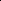

# Learning to Curate Context: Jointly Optimizing Retrieval and Prediction for Multimodal Social Media Popularity

<!-- Page 1 -->

Learning to Curate Context: Jointly Optimizing Retrieval and Prediction for

Multimodal Social Media Popularity

Xovee Xu, Shuojun Lin, Fan Zhou, Jingkuan Song*

University of Electronic Science and Technology of China

Chengdu, Sichuan 610054, China xovee.xu@gmail.com, locklin0223@gmail.com, fan.zhou@uestc.edu.cn, jingkuan.song@gmail.com

## Abstract

Predicting the popularity of user-generated content (UGC) is a crucial but challenging task in social media analysis. While existing retrieval-augmented models enhance predictions by supplying rich contextual information, they remain limited by a fundamental precision-recall dilemma: enlarging the retrieval set increases coverage but introduces noisy, irrelevant context that harms prediction. In this work, we propose a unified framework that learns to retrieve, filter, and predict. Central to our approach is a Mixture-of-Logits-based retrieval module that replaces static similarity metrics with a dynamic, multi-faceted scoring function, enabling the retriever to be directly optimized by the prediction objective. Then an uncertainty-aware filter is designed to perform differentiable subset selection and refine the selected representations using the information bottleneck principle. At last, to enhance predictive robustness, we introduce a confidenceweighted test-time perturbation strategy. By learning to retrieve UGCs that are beneficial for prediction and filtering out uncertainty, our framework provides more relevant and reliable context. Extensive experiments demonstrate that the proposed framework achieves state-of-the-art performance, consistently outperforming strong baselines.

## Introduction

Predicting the popularity of user-generated content (UGC) represents a cornerstone task in modern social network analysis with broad scientific and practical value (Tatar et al. 2014). The core challenge stems from UGC’s informality, noise, and heterogeneity, where engagement outcomes are often stochastic and shaped by network effects, exogenous events, and platform algorithms (Naab and Sehl 2017). Consequently, effective prediction demands models that can jointly reason about the intrinsic quality of multimodal content—spanning text, images, and video—and the extrinsic social context that governs information dissemination among users (Hsu et al. 2024). Reliable solutions enable key applications: improved recommendation and ad allocation for platforms (Jeon et al. 2024; Gu et al. 2024), decision support and personalization for users and creators (Zhou et al. 2024), and societal benefits such as timely publicinterest messaging and early detection of harmful or mis-

*Corresponding author. Copyright © 2026, Association for the Advancement of Artificial Intelligence (www.aaai.org). All rights reserved.

leading virality (Sun et al. 2025; Drolsbach and Pr¨ollochs 2023; Lang et al. 2025). Prior work on UGC popularity prediction in social networks largely follows two streams: content-centric and network/temporal. Content-centric models focus on the intrinsic appeal of UGC itself, evolving from feature-engineering models (Cheng et al. 2014) to deep architectures (CNNs, Transformers) that learn joint multimodal representations (Xie et al. 2020). By contrast, network/temporal models prioritize extrinsic diffusion dynamics, employing temporal point processes (Zhao et al. 2015), survival analysis (Gao et al. 2020), and graph neural networks (GNNs) over follower and content interaction graphs to capture contagion, seasonality, exogenous shocks, and user influence (Li et al. 2021; Zhou et al. 2021; Xu et al. 2021, 2022). Content models scale when only the UGC is available but degrade when exposure mechanisms dominate or trends shift; network/temporal methods excel once early signals or social context are present yet depend on high-quality graphs (often unavailable) and may generalize poorly across platforms or time. Across both streams, accurately learning intrinsic content quality and user preferences—and reliably estimating diffusion paths, temporal momentum, and network topology (Cao et al. 2020; Ji et al. 2023b)—are critical yet challenging due to multimodal noise, sparse or partial observations, and rapidly evolving contexts.

Recently, retrieval-based approaches have emerged as a promising alternative (Cheng et al. 2024). They retrieve relevant UGCs from a large corpus as knowledge augmentations and condition the predictor on these “neighbors.” By grounding popularity prediction in large-scale semantic and social contexts, retrieval-based methods have achieved significant performance gains without relying on explicit network structures. For example, NIPA (Ji et al. 2023a) and MMRA (Zhong et al. 2024) models retrieve relevant UGCs as contextual information to enhance the learning of the target UGC; The SKAPP (Xu et al. 2025) introduces a meta retriever to find UGCs that are similar not only semantically but also in terms of user profiles and posting dynamics.

However, the effectiveness of existing retrieval-based approaches is hindered by two key limitations. (1) Misaligned retrieval and prediction: The retrieval process often relies on proxy objectives (e.g., embedding similarity and scalar scores) rather than being guided by the end task targets.

The Fortieth AAAI Conference on Artificial Intelligence (AAAI-26)

<!-- Page 2 -->

Retrieval Algorithm

Learning

## Model

Database Retrieved

UGCs

Target

UGC Popularity

Existing Retrieval Methods

Our Proposed JRPP Framework

Database Retrieval Algorithm

Retrieved

UGCs

Target

UGC Popularity

Filtering Mechanism

Learning

## Model

Joint Optimization static similarity search dynamic

**Figure 1.** From static retrieval to jointly optimized, taskaligned social media UGC popularity prediction.

This misalignment surfaces off-topic or redundant retrievals, thereby increasing noise in the augmented context and diminishing the predictive gains from retrieval. (2) Sensitivity to retrieval noise: Current models are highly susceptible to retrieval noise and the stochastic nature of social media engagement, as they rarely quantify the predictive quality and ambiguity of retrieved UGCs. Although a few works have proposed post-hoc selection mechanisms (Xu et al. 2025), these are not jointly optimized with UGC representation learning and aggregation, inevitably introducing high variance and poor calibration under distribution shifts.

These limitations motivate a new retrieval-based framework that learns task-aware retrieval and uncertainty-aware context integration end-to-end, ensuring that the retrieved knowledge aligns with the prediction objective. Specifically, we propose JRPP, Jointly optimized Retrieval and Prediction for multimodal social media Popularity. Diverging from the traditional retrieval-based approaches (see a comparison in Figure 1), JRPP integrates retrieval and prediction into a unified, end-to-end trainable architecture. Our solution consists of three core modules. First, we introduce a Mixture-of- Logits (MoL) based retrieval mechanism that replaces static similarity metrics with a dynamic, multi-faceted scoring function, enabling the retriever to be directly optimized by the final prediction objective. Second, to mitigate the impact of retrieval noise, we design a two-stage uncertainty-aware filter, which first selects a high-quality subset of retrieved UGCs via a differentiable Gumbel-Softmax gate and then refines their representations using the information bottleneck principle to isolate task-relevant information. At last, we employ a confidence-weighted test-time perturbation strategy to enhance the model’s robustness against UGC variations.

Our main contributions are summarized as follows:

• We introduce the first joint retrieval and prediction framework for UGC popularity prediction. JRPP optimizes the retrieval module and the learning model in a single loop, eliminating objective mismatch and enabling retrieval to co-adapt with the prediction objective.

• We design a MoL-based retrieval module for expressive, task-aligned matching; an uncertainty-aware filter that couples differentiable subset selection with an IB-based refinement; and a test-time perturbation strategy that self- ensembles predictions for improved robustness. • Extensive experiments on three large-scale social UGC datasets show that JRPP achieves state-of-the-art performance, outperforming strong baselines, up to 25.36% on MSE, 18.29% on MAE, and 5.22% on SRC. Additional experiments including ablation study and parameter analysis further validate the effectiveness of our model.

## Preliminaries

Problem Definition Given a dataset of N multimodal UGCs C = {ci}N i=1, each UGC ci = {ti, vi, ui,... } is composed of multiple data modalities such as text ti, image vi, and user ui. The goal of multimodal UGC popularity prediction is to learn a model M that takes a UGC ci as input and predict its future popularity pi:

ˆpi = M(ci), (1)

where ˆpi is the predicted future popularity of ci. The definition of popularity varies across contexts, e.g., the numbers of likes and reshares of social tweets.

Retrieval-based Popularity Prediction To enhance predictive performance, retrieval-based approaches leverage contextual information from a large database D. Instead of relying solely on the target UGC ci, the model’s input is enriched with a set of k relevant items, Ri = {r1, r2,..., rk}, retrieved from D. These items (UGCs, in our case) are selected using a scoring function s(ci, r) that measures their relevance (e.g., semantic or social similarity) to the target ci. An aggregation function A(·, ·) then fuses the information from ci and the retrieved set Ri. Here Ri is defined as the top-k UGCs according to s(ci, r), equivalently:

Ri = arg max S⊆D: |S|=k

X r∈S s(ci, r). (2)

The final popularity prediction is defined as:

ˆpi = M(A(ci, Ri)), (3)

where ˆpi is the predicted popularity of the target UGC ci.

## 3 Methodology Overview

Our proposed JRPP framework introduces an end-to-end framework that jointly optimizes UGC retrieval and popularity prediction. It features three key modules: a Mixture-of-Logits-based retrieval module for expressive, task-aligned matching; an uncertainty-aware filter that selects and refines retrieved content to reduce noise; and a testtime perturbation method to enhance prediction robustness. Figure 2 presents a framework overview.

Joint Retrieval and Prediction by Mixture of Logits Previous retrieval-based models design the retrieval module with surrogate objectives (e.g., semantic and social similarity) (Zhong et al. 2024; Xu et al. 2025) and then freeze it while a separate learning model aggregates the retrieved UGCs with the query UGC. This separation causes a persistent objective mismatch: the retrieved UGCs are not aligned

<!-- Page 3 -->

(a) Joint Retrieval and Prediction Input Query UGC

UGC Image

Sunrise behind a classic rooftop water tower, casting an urban silhouette…

UGC Text

UGC Features

User Id Post Time

Category And Others ci

D Knowledge Database

Query UGC

Retrieved UGC

Multimodal

Encoder

Multimodal

Encoder

Embedding

Embedding

Embedding

Embedding

< l a t e x i t s h a

1

_ b a s e

6

4

=

" e

8 c

L

/

O

X

U t

S

S

R

K

I

+ e

N s

T

F

Y

O

E u v c

=

"

>

A

A

A

B

/ n i c b

V

D

L

S s

N

A

F

L

2 p r

1 p f

U

X

H l

Z r

A

I d

V

O

S

I t

V l w

Y

L

C v

Y

B b

Q i

T

6 a

Q d

O n k w

M x

F

L

C

P g r b l w o

4 t b v c

O f f

O

G m z

0

N

Y

D

A

4 d z

7 u

W e

O

V

7

M m

V

S

W

9

W

2

U

1 t

Y

N r f

K

2

5

W d b

9

A

/

P w q

C u j

R

B

D a

I

R

G

P

R

N

/

D k n

I

W

0 o

5 i i t

N

+

L

C g

O

P

E

5

7 v

Q m

9 s

P

V

E g

W h f d q

F l

M n w

O

O

Q

+

Y x g p

S

X

X

P

P

F d u z

Y

M s

J p

4 f v q

Y u

S l x

W

X b h m l

W r b s

2

B

V o l d k

C o

U a

L v m

1

A

U k

S

S g o

S

I c

S z m w r

V g

5

K

R a

K

E

U

6 z y j

C

R

N

M

Z k i s d

0 o

G m

I

A y q d d

B

4

/

Q

+ d a

G

S

E

/

E v q

F

C s

V x s p

D q

S c

B

Z

6 e z

I

P

K

Z

S

8

X

/

/

M

G i f

K v n

Z

S

F c a

J o

S

B a

H

/

I

Q j

F a

G

8

C z

R i g h

L

F

Z

5 p g

I p j

O i s g

E

C

0 y

U b q y i

S

7

C

X v

7 x

K u o

2

6 a w

7 y

6 r r

U

Z

R

R x l

O

4

Q x q

Y

M

M

V t

O

A

W

2 t

A

B

A i k

8 w y u

8

G

U

/

G i

/

F u f

C x

G

S

0 a x c w x

/

Y

H z

+

A

A

P

/ l

X

8

=

<

/ l a t e x i t

> f1(xci)

< l a t e x i t s h a

1

_ b a s e

6

4

=

"

S e s r

0 r

D

9

N w

U e n z

8

C q

H

2

F y

/

P i

W

U

=

"

>

A

A

A

B

/ n i c b

V

D

L

S s

N

A

F

L x

W e s r

K q

7 c

D

B a h b k p

S p

L o s u

H

E j

V

L

A

P a

E

O

Y

T

C f t

0

M m

D m

Y l

Y

Q s

B f c e

N

C

E b d

+ h z v

/ x k m b h b

Y e

G

D i c c y

/ z

P

F i z q

S y r

G

9 j

Z

X

V t f

W

O z t

F

X e t n d

2 z c

P

D j s y

S g

S h b

R

L x

S

P

Q

8

L

C l n

I

W

0 r p j j t x

Y

L i w

O

O

0

6

0

2 u c

7

/

7

Q

I

V k

U

X i v p j

F

1

A j w

K m c

8

I

V l p y z

W

P f v a

0

O

A q z

G n p

8

+

Z m

5

K

X

J a d u

2 b

F q l k z o

G

V i

F

6

Q

C

B

V q u

+

T

U

Y

R i

Q

J a

K g

I x

1

L

2 b

S t

W

T o q

F

Y o

T

T r

D x

I

J

I

0 x m e

A

R

7

W s a

4 o

B

K

J

5

F z

9

C

Z

V o b

I j

4

R

+ o

U

I z

9 f d

G i g

M p p

4

G n

J

/

O g c t

H

L x f

+

8 f q

L

8

K y d l

Y

Z w o

G p

L

5

I

T

/ h

S

E

U o

7 w

I

N m a

B

E

8 a k m m

A i m s y

I y x g

I

T p

R s r

6 x

L s x

S

8 v k

0

6

9

Z j d q j b u

L

S r

N e

1

F

G

C

E z i

F

K t h w

C

U

2

4 g

R a

0 g

U

A

K z

/

A

K b

8 a

T

8

W

K

8

G x

/ z

0

R

W j

2

D m

C

P z

A

+ f w

A w

Z

5

W b

<

/ l a t e x i t

> fM(xci)

< l a t e x i t s h a

1

_ b a s e

6

4

=

"

U s

B

P

N y

P x j t e

N

A

K u

G s

/ d t i

X

F k

4 g

=

"

>

A

A

A

B

/

H i c b

V

D

L

S s

N

A

F

L

2 p r

1 p f

0

S

7 d

D

B a h b k p

S p

L o s u

H

F

Z w

T

6 g

D

W

E y n b

R

D

J w

9 m

J m

I

I

9

V f c u

F

D

E r

R

/ i z r

9 x

0 m a h r

Q c

G

D u f c y z

1 z v

J g z q

S z r

2 y h t b

G

5 t

7

5

R

K v

7

B

4 d

H

5 v

F

J

T

0 a

J

I

L

R

L

I h

6

J g

Y c l

5

S y k

X c

U

U p

4

N

Y

U

B x

4 n

P a

9

2

U u

9 x

+ o k

C w

K

7

1

U a

U y f

A k

5

D

5 j

G

C l

J d e s

T l y

7

P g q w m n p

+

9 j h

M z

G

/ c

M

2 a

1 b

A

W

Q

O v

E

L k g

N

C n

R c

8

2 s

0 j k g

S

0

F

A

R j q

U c

2 l a s n

A w

L x

Q i n

8

8 o o k

T

T

G

Z

I

Y n d

K h p i

A

M q n

W w

R f o

7

O t

T

J

G f i

T

0

C x

V a q

L

8

M h x

I m

Q a e n s x j y l

U v

F

/

/ z h o n y r

5

2

M h

X

G i a

E i

W h

/ y

E

I x

W h v

A k

0

Z o

I

S x

V

N

N

M

B

F

M

Z

0

V k i g

U m

S v d

V

0

S

X

Y q

1

9 e

J

7

1 m w

2

4

1

W n e

X t

X a z q

K

M

M p

A

G d b

D h

C t p w

C x o

A o

E

U n u

E

V o w n

4

8

V

4

N z

6

W o y

W j

2

K n

C

H x i f

P

5

P

A l

L

M

=

<

/ l a t e x i t

> g1(xr)

...

< l a t e x i t s h a

1

_ b a s e

6

4

=

"

6 i

8 q u y

Y z c

1 g

D s

4

V

B

T

7 m

U o f

Z

N

F

K o

=

"

>

A

A

A

B

7

H i c b

V

B

N

S

8

N

A

F

H z x s

9 a v q k c v i

0

X w

V

J

I i

1

W

P

B i

8 c

K p i

2

0 o

W y

2 m b p

Z h

N

2

X

4

Q

S

+ h u

8 e

F

D

E q z

/

I m

/

/

G b

Z u

D t g

4 s

D

D

N v

2

P c m

T

K

U w

6

L r f z s b m

1 v b

O b m m v v

H

9 w e

H

R c

O

T l t m y

T

T j

P s s k

Y n u h t

R w

K

R

T

U a

D k

V

R z

G o e

S d

8

L

J d z v

P

H

F t

R

K

I e c

Z r y

I

K

Y j

J

S

L

B

K

F r

J

7 w

8

T

N

I

N

K

1 a

2

5

C

5

B

1

4 h

W k

C g

V a g

8 q

X z b

E s

5 g q

Z p

M b

0

P

D f

F

I

K c a

B

Z

N

8

V u

5 n h q e

U

T e i

I

9 y x

V

N

O

Y m y

B f

L z s i l

V

Y

Y k

S r

R

9

C s l

C

/

Z

I a

W z

M

N

A

7 t

Z

E x x b

F a

9 u f i f

1

8 s w u g

1 y o d

I

M u

W

L

L j

6

J

M

E k z

I

/

H

I y

F

J o z l

F

N

L

K

N

P

C

7 k r

Y m

G r

K

0

P

Z

T t i

V

4 q y e v k a

9

5 j

V q j

Y f r a r

N e

1

F

G

C c

7 i

A

K

/

D g

B p p w

D y w g

Y

G

A

Z i

F

N

0 c

5

L

8

6

7

8

7

E c

X

C

K z

B n

8 g f

P

5

A

/

A q j r

0

=

<

/ l a t e x i t

>

...

< l a t e x i t s h a

1

_ b a s e

6

4

=

"

1

4

T

H t

R

1 x

+

7 n

C a

C

0 w w w v m

C q

8 u

X

6

Q

=

"

>

A

A

A

B

6

H i c b

V

D

L

S g

N

B

E

O y

N r x h f

U

Y

9 e

B o

P g

K e w

G i

R

4

D

X r w

I

C

Z g

H

J

E u

Y n f

Q m

Y

2

Z n l

5 l

Z

I

Y

R

8 g

R c

P i n j

1 k

7 z

5

N

0

6

S

P

W h i

Q

U

N

R

1

U

1

V

5

A

I r o r f j u

5 j c

2 t

7

Z

8 b m

F v

/

+

D w q

H h

8

0 t

J x q h g

2

W

S x i

1

Q m o

R s

E l

N g

0

A j u

J

Q h o

F

A t v

B

+

H b u t

5

9

Q a

R

7

L

B z

N

J

0

I

/ o

U

P

K

Q

M

2 q s

1

L j v

F

0 t u

2

V

2

A r

B

M v

I y

X

I

U

O

8

X v q

D m

K

U

R

S s

M

E

1 b r r u

Y n x p

1

Q

Z z g

T

O

C r

1

U

Y

0

L

Z m

A

6 x a

6 m k

E

W p

/ u j h

0

R i

6 s

M i

B h r

G x

J

Q x b q

7

4 k p j b

S e

R

I

H t j

K g

Z

6

V

V v

L v

7 n d

V

M

T v h

T

L p

P

U o

G

T

L

R

W

E q i

I n

J

/

G s y

4

A q

Z

E

R

N

L

K

F

P c k r

Y i

C r

K j

M

2 m

Y

E

P w

V l

9 e

J

6

1

K

2 a u

W q

4

2 r

U q

2

S x

Z

G

H

M z i

H

S

/

D g

G m p w

B

V o

A g

O

E

Z i

F

N

+ f

R e

X

H e n

Y

9 l a

8

7

J

Z k

7 h

D

5 z

P

H

6

P

P j

M w

=

<

/ l a t e x i t

>

M Low-rank embeddings f(·)

g(·)

< l a t e x i t s h a

1

_ b a s e

6

4

=

" h

A d

B

F

A

F u

J

6 m l y

N

W

9

A g

V

J y

W

9

E

J

2

Q

=

"

>

A

A

A

B

6 n i c b

V

B

N

S

8

N

A

E

J

U r

1 q

/ q h

6

9

L

B b

B

U

0 m

K

V

I

8

F

L x

4 r

2 g

9 o

Q

9 l s

N

+

S z

S b s

T o

Q

S

+ h

O

8 e

F

D

E q

7

/

I m

/

/

G b

Z u

D t j

4

Y e

L w w

8 y

8

I

J

H

C o

O t

+

O

4

W

N z a t n e

J u a

W

/

/

4

P

C o f

H z

S

N n

G q

G

W

+ x

W

M a

6

G

1

D

D p

V

C

8 h

Q

I l

7 y a a

0 y i

Q v

B

N

M b u d

+

5

4 l r

I

2

L

1 i

N

O

E

+ x

E d

K

R

E

K

R t

F

K

D

2 w g

B u

W

K

W

U

X

I

O v

E y

0 k

F c j

Q

H

5 a

/

+

M

G

Z p x

B

U y

S

Y p e

W

6

C f k

Y

1

C i b

5 r

N

R

P

D

U

8 o m

9

A

R

7

1 m q a

M

S

N n y

1

O n

Z

E

L q w x

J

G

G t b

C s l

C

/

T

2

R

0 c i

Y a

R

T

Y z o j i

2

K x

6 c

/

E

/ r

5 d i e

O

N n

Q i

U p c s

W

W i

8

J

U

E o z

J

/

G

8 y

F

J o z l

F

N

L

K

N

P

C k r

Y m

G r

K

0

K

Z

T s i

F

4 q y

+ v k a t

6 t

W r

9 f u r

S q

O

W x

1

G

E

M z i

H

S

/

D g

G h p w

B

0

1 o

A

Y

M

R

P

M

M r v

D n

S e

X

H e n

Y

9 l a

8

H

J

Z

0

7 h

D

5 z

P

H z

9

U j b

4

=

<

/ l a t e x i t

> ci r

Xci

Xr

< l a t e x i t s h a

1

_ b a s e

6

4

=

" i b z

D

D l

/

5 t z

V

D f l p h

G

V

V

N i

4

J

T

S

8

=

"

>

A

A

A

B

+ n i c b

V

D

L

S s

N

A

F

L

2 p r

1 p f q

S

7 d

D

B a h b k p

S p

L o s u

H

E j

V

L

A

P a

E

O

Y

T

C f t

0

M m

D m

Y l a

Y j

/

F j

Q t

F

P o l

7 v w b

J

2

0

W

2 n p g

4

H

D

O v d w z x

4 s

5 k

8 q y v o

C

2 v r

G

5 l

Z x u

7

S z u

7 d

/

Y

J

Y

P

O z

J

K

B

K

F t

E v

F

I

9

D w s

K

W c h b

S u m

O

O

F g u

L

A

4

7

T r

T a

4 y v t

P h

W

R

R e

K e m

M

X

U

C

P

A q

Z z w h

W

W n

L

N

8 s i

9 q

Q

4

C r

M a e n z

7

O

X

H

H m m h

W r

Z s

2

B

V o m d k w r k a

L n m

1

2

A

Y k

S

S g o

S

I c

S

9 m r

V g

5

K

R a

K

E

U

5 n p

U

E i a

Y z

J

B

I

9 o

X

9

M

Q

B

1

Q

6

6

T z

6

D

J

1 q

Z

Y j

8

S

O g

X

K j

R

X f

2

+ k

O

J

B y

G n h

6

M g s p l

7

1

M

/

M

/ r

J

8 q

/ d

F

I

W x o m i

I

V k c

8 h

O

O

V

I

S y

H t

C

Q

C

U o

U n

2 q

C i

W

A

6

K y

J j

L

D

B

R u q

2

S

L s

F e

/ v

I q

6 d

R r d q

P

W u

D

2 v

N

O t

5

H

U

U

4 h h

O o g g

0

X

0

I

R r a

E

E b

C

D z

A

M

7 z

C m

/

F k v

B j v x s d i t

G

D k

O

0 f w

B

8 b n

D

+

+ a k

8

M

=

<

/ l a t e x i t

> gM(xr)

Per-component dot product

M →M

→

Differentiable gating weights

M →M

< l a t e x i t s h a

1

_ b a s e

6

4

=

"

1

4

T

H t

R

1 x

+

7 n

C a

C

0 w w w v m

C q

8 u

X

6

Q

=

"

>

A

A

A

B

6

H i c b

V

D

L

S g

N

B

E

O y

N r x h f

U

Y

9 e

B o

P g

K e w

G i

R

4

D

X r w

I

C

Z g

H

J

E u

Y n f

Q m

Y

2

Z n l

5 l

Z

I

Y

R

8 g

R c

P i n j

1 k

7 z

5

N

0

6

S

P

W h i

Q

U

N

R

1

U

1

V

5

A

I r o r f j u

5 j c

2 t

7

Z

8 b m

F v

/

+

D w q

H h

8

0 t

J x q h g

2

W

S x i

1

Q m o

R s

E l

N g

0

A j u

J

Q h o

F

A t v

B

+

H b u t

5

9

Q a

R

7

L

B z

N

J

0

I

/ o

U

P

K

Q

M

2 q s

1

L j v

F

0 t u

2

V

2

A r

B

M v

I y

X

I

U

O

8

X v q

D m

K

U

R

S s

M

E

1 b r r u

Y n x p

1

Q

Z z g

T

O

C r

1

U

Y

0

L

Z m

A

6 x a

6 m k

E

W p

/ u j h

0

R i

6 s

M i

B h r

G x

J

Q x b q

7

4 k p j b

S e

R

I

H t j

K g

Z

6

V

V v

L v

7 n d

V

M

T v h

T

L p

P

U o

G

T

L

R

W

E q i

I n

J

/

G s y

4

A q

Z

E

R

N

L

K

F

P c k r

Y i

C r

K j

M

2 m

Y

E

P w

V l

9 e

J

6

1

K

2 a u

W q

4

2 r

U q

2

S x

Z

G

H

M z i

H

S

/

D g

G m p w

B

V o

A g

O

E

Z i

F

N

+ f

R e

X

H e n

Y

9 l a

8

7

J

Z k

7 h

D

5 z

P

H

6

P

P j

M w

=

<

/ l a t e x i t

>

M Low-rank embeddings

< l a t e x i t s h a

1

_ b a s e

6

4

=

"

/ h

X

N

5

+ v

D

E d

D

7

L

9

A

9

X

E n

Z b m

2 f

J

Z

M

=

"

>

A

A

A

B

7 i c b

V

D

L

S g

N

B

E

O z

1

G e

M r

6 t

H

L

Y

B

A i

S

N g

V i

R

6

D

X j x

G

M

A

9

I l j

A

7

6

S

R

D

Z m f

X m

V k h

L

P k

J

L x

4

U

8 e r v e

P

N v n

C

R

7

0

M

S

C h q

K q m

+

6 u

I

B

Z c

G

9 f

9 d l

Z

W

1

9

Y

N n

N b

+ e

2 d b

9 w s

F h

Q

0 e

J

Y l h n k

Y h

U

K

6

A a

B

Z d

Y

N

9 w

I b

M

U

K a

R g

I b

A a j

2

6 n f f

E

K l e

S

Q f z

D h

G

P

6

Q

D y f u c

U

W

O l l i

6 x

L j

9

X

Z

9

1

C

0

S

2

7

M

5

B l

4 m

W k

C

B l q c

J

X p x e x

J

E

R p m

K

B a t z

0

N n

5

K l e

F

M

4

C

T f

S

T

T

G l

I o

A

N u

W

S h q i

9 t

P

Z v

R

N y a p

U e

6

U f

K l j

R k p v

6 e

S

G m o

9

T g

M b

G d

I z

V

A v e l

P x

P

6

+ d m

P

6

1 n

I

Z

J w

Y l m y

/ q

J

4

K

Y i

E y f

J z

2 u k

B k x t o

Q y x e

2 t h

A

2 p o s z

Y i

P

I

2

B

G

/ x

5

W

X

S u

C h

7 l

X

L l

/ r

J

Y v c n i y

M

E x n

E

A

J

P

L i

C

K t x

B

D e r

A

Q

M

A z v

M

K b

8

+ i

8

O

O

/

O x

7 x

1 x c l m j u

A

P n

M

8 f

H d

W

P

Y g

=

=

<

/ l a t e x i t

> s(ci, r)

top-k selection

(c) Test Time Perturbation & Prediction retrieved UGCs k Ri r1 r2 rk...

(b) Uncertainty-Aware Filtering

Logits

< l a t e x i t s h a

1

_ b a s e

6

4

=

" i

L r w

I

L

W u s

I

5 k i

Y d

D

7

U

6

R

J e m k

9 k

=

"

>

A

A

A

C

G

H i c b

V

D

L

S g

N

B

E

J z

1

G e

M r

6 t

H

L

Y h

A

8 h d

0 g

0

W

P

A i

8 c o

5 g

F

J

C

L

O

T

T j

J m d m a

Z

6

R

X

C k n

/ w a r

7

G m j

1

5 s c

I z i

Z

7

M

I k

F

D

U

V

V

N

9

1 d

Q

S

S

4

Q c

/

7 d j

Y

2 t

7

Z d n

N

7

+ f

2

D w

6

P j w s l p w

6 h

Y

M

6 g z

J

Z

R u

B d

S

A

4

B

L q y

F

F

A

K

9

J

A w

0

B

A

M x j f p

X

7 z

B b

T h

S j

7 h

J

I

J u

S

I e

S

D z i j a

K

V

G

B

4

T o

+ b

1

C

0

S t

5 c

7 j r x

M

9

I k

W

S o

9

Q o

/ n b

5 i c

Q g

S m a

D

G t

H

0 v w m

5

C

N

X

I m

Y

J r v x

A

Y i y s

Z

0

C

G

1

L

J

Q

B d

J

P

5 t

V

P

0 i p

9 d

6

C

0

L

Y n u

X

P

0

7 k d

D

Q m

E k

Y

2

M

6

Q

4 s i s e q n

4 n

9 e

O c

X

D b

T b i

M

Y g

T

J

F o s

G s

X

B

R u e n r b p

9 r

Y

C g m l l

C m u b

V

Z

S

O q

K

U

M b

0

N

K

W

9

D

A

T

A b

O f

G

M

C

Q c p k q y a

M

K

F

K p p u b l r

6 a z

T h r l k l

8 p

V

R

6 u i

9

V y l l y

O n

J

M

L c k

V

8 c k

O q

5

J

7

U

S

J

0 w

8 k x e y

R u

Z

O

T

P n f l w

P h e t

G

0

4

2 c

0 a

W

4

H z

9

A r

Z

Z o

T

A

=

<

/ l a t e x i t

> ℓ1

Logits

< l a t e x i t s h a

1

_ b a s e

6

4

=

"

V s

+

I r j l n

S r

Y

P l b

4

+ b m h y

+ h

9 p j

I

=

"

>

A

A

A

C

G

H i c b

V

D

L

S g

N

B

E

J z

1

G e

M r

6 t

H

L

Y h

A

8 h d

0 g

0

W

P

A i

8 c o

5 g

F

J

C

L

O

T

T j

J m d m a

Z

6

R

X

C k n

/ w a r

7

G m j

1

5 s c

I z i

Z

7

M

I k

F

D

U

V

V

N

9

1 d

Q

S

S

4

Q c

/

7 d j

Y

2 t

7

Z d n

N

7

+ f

2

D w

6

P j w s l p w

6 h

Y

M

6 g z

J

Z

R u

B d

S

A

4

B

L q y

F

F

A

K

9

J

A w

0

B

A

M x j f p

X

7 z

B b

T h

S j

7 h

J

I

J u

S

I e

S

D z i j a

K

V

G

B

4

T o j

X u

F o l f y

5 n

D

X i

Z

+

R

I s l

Q

6 x

V

+

O n

F

4 h

A k

M k

G

N a f t e h

N

2

E a u

R

M w

D

T f i

Q

1

E l

I p

E

N q

W

S h q

C

6

S b z a

6 f u p

V

X

6

7 k

B p

W x

L d u f p

I q

G h

M

Z

M w s

J

0 h x

Z

F

Z

9

V

L x

P

6

8 d

4

+

C

2 m

A

Z x

Q i

S

L

R

Y

N

Y u

G i c t

P

X

T

7

X w

F

B

M

L

K

F

M c u r y

0

Z

U

U

4

Y

2 o

K

U t

6

W

E m

A m

Y

/

M

Y

A h

5

T

J

V k k c

V

K

F

T

T v

M

L

X

0

1 n n

T

T

K

J b

9

S q j x c

F

6 v l

L

L k c

O

S c

X

5

I r

4

5

I

Z

U y

T

2 p k

T p h

5

J m

8 k j c y c

2 b

O u

/

P h f

C

5 a

N

5 x s

5 o w s w f n

6

B

R g

O o

W o

=

<

/ l a t e x i t

> ℓk fscore(·)...

xr1 xrk

...

Selection Matrix

Gumbel Softmax

S ∈Rk′×k

< l a t e x i t s h a

1

_ b a s e

6

4

=

"

P l a q

+ a

K

/ n

H q

/

H

C

5 n t

L

0

I

W

E

F

T

Q v c

=

"

>

A

A

A

B

+ n i c b

V

D

L

S s

N

A

F

L

2 p r

1 p f q

S

7 d

B

I v o q i

R

F q s u

C

G

5 c

V

7

A

P a

E

C b

T

S

T t

0

M g k z

E

7

X

E f

I o b

F

4 q

4

9

U v c

+

T d

O

2 i y

0

9 c

D

A

4

Z x

7 u

W e

O

H z

M q l

W

1

/

G

6

W

1

9

Y

N r f

J

2

Z

W d b

/

/

A r

B

5

2

Z

Z

Q

I

T

D o

4

Y p

H o

+

0 g

S

R j n p

K

K o

Y

6 c e

C o

N

B n p

O d

P r

O

/ d

0

+

E p

B

G

/

U

7

O

Y u

C

E a c x p

Q j

J

S

W

P

L

M

6

D

J

G a

+

E

H

6 m

H m p

8

J z s z

D

N r d t

2 e w

1 o l

T k

F q

U

K

D t m

V

/

D

U

Y

S

T k

H

C

F

G

Z

J y

4

N i x c l

M k

F

M

W

M

Z

J

V h

I k m

M

8

B

S

N y

U

B

T j k

I i

X

Q e

P b

N

O t

T

K y g k j o x

5

U

1

V

9 v p

C i

U c h b

6 e j

I

P

K p e

9

X

P z

P

G y

Q q u

H

J

T y u

N

E

E

Y

4

X h

4

K

E

W

S q y

8 h

6 s

E

R

U

E

K z b

T

B

G

F

B d

V

Y

L

T

5

B

A

W

O m

2

K r o

E

Z

/ n

L q

6

T b q

D v

N e v

P

2 o t

Z q

F

H

W

U

4

R h

O

4

B w c u

I

Q

W

E

A b

O o

D h

A

Z

7 h

F d

6

M

J

+

P

F e

D c

+

F q

M l o

9 g

5 g j

8 w

P n

8

A

Z

0

O

U

D g

=

=

<

/ l a t e x i t

> x′ r1

< l a t e x i t s h a

1

_ b a s e

6

4

=

"

K x

E

8

W w s

D

+

A

K b

9 y n f s

C

0

+ b d k

+ p

0

0

=

"

>

A

A

A

B

+ n i c b

V

D

L

S s

N

A

F

L

2 p r

1 p f q

S

7 d

B

I v o q i

R

F q s u

C

G

5 c

V

7

A

P a

E

C b

T

S

T t

0

M g k z

E

7

X

E f

I o b

F

4 q

4

9

U v c

+

T d

O

2 i y

0

9 c

D

A

4

Z x

7 u

W e

O

H z

M q l

W

1

/

G

6

W

1

9

Y

N r f

J

2

Z

W d b

/

/

A r

B

5

2

Z

Z

Q

I

T

D o

4

Y p

H o

+

0 g

S

R j n p

K

K o

Y

6 c e

C o

N

B n p

O d

P r

O

/ d

0

+

E p

B

G

/

U

7

O

Y u

C

E a c x p

Q j

J

S

W

P

L

M

6

D

J

G a

+

E

H

6 m

H m p

8

B r

Z m

W f

W

7

L o

9 h

7

V

K n

I

L

U o

E

D b

M

7

+

G o w g n

I e

E

K

M y

T l w

L

F j

5 a

Z

I

K

I o

Z y

S r

D

R

J

I

Y

4

S k a k

4

G m

H

I

V

E u u k

8 e m a d a m

V k

B

Z

H

Q j y t r r v

7 e

S

F

E o

5

S z

0

9

W

Q e

V

C

5

7 u f i f

N

0 h

U c

O

W m l

M e

J

I h w v

D g

U

J s

1

R k

5

T

1

Y

I y o

I

V m y m

C c

K

C

6 q w

W n i

C

B s

N

J t

V

X

Q

J z v

K

X

V

0 m

U

X e a

9 e b t

R a

V

K

O o o w z

G c w

D k

4 c

A k t u

I

E

2 d

A

D

D

A z z

D

K

7 w

Z

T

8 a

L

8

W

5

8

L

E

Z

L

R r

F z

B

H

9 g f

P

4

A a

M m

U

D w

=

=

<

/ l a t e x i t

> x′ r2

< l a t e x i t s h a

1

_ b a s e

6

4

=

"

2

6 p

7 w

G u

A

7

Z

+ q

9

Z

I

9

4

N

R x

O o i

P

B

0

=

"

>

A

A

A

B

/

X i c b

V

D

L

S s

N

A

F

L x

W e s r

P n

Z u g k

X q q i

R

F q s u

C

G

5 c

V

7

A

P a

E

C b

T

S

T t

0

M g k z

E

7

G

G

4

K

+

4 c a

G

I

W

/

/

D n

X

/ j p

M

1

C

W w

8

M

H

M

6

5 l v m

+

D

G j

U t n

2 t

7

G y u r a

+ s

V n a

K m

/ v

7

O

7 t m w e

H

H

R k l

A p

M

2 j l g k e j

6

S h

F

F

O

2 o o q

R n q x

I

C j

0

G e n

6 k

+ v c

7

9

4

T

I

W n

E

7

9

Q

0

J m

6

I

R p w

G

F

C

O l

J c

8

8

H o

R

I j f

0 g f c i

8

V

H j p p

J p l

V c

+ s

2

D

V

7

B m u

Z

O

A

W p

Q

I

G

W

Z

4

N h h

F

O

Q s

I

V

Z k j

K v m

P

H y k

2

R

U

B

Q z k p

U

H i

S

Q x w h

M

0

I n

1

N

O

Q q

J d

N

N

Z

+ s w

6

0

8 r

Q

C i

K h

H

1 f

W

T

P

2

9 k a

J

Q y m n o

6

8 k

8 q

1 z

0 c v

E

/ r

5

+ o

4

M p

N

K

Y

8

T

R

T i e

H w o

S

Z q n

I y q u w h l

Q

Q r

N h

U

E

4

Q

F

1

V k t

P

E

Y

C

Y a

U

L

K

+ s

S n

M

U v

L

5

N

O v e

Y

0 a o b i

0 q z

X t

R

R g h

M

4 h

X

N w

4

B

K a c

A

M t a

A

O

G

R i

G

V g z n o w

X

4

9

4 m

I

+ u

G

M

X

O

E f y

B

8 f k

D

+

I

+

V h

Q

=

=

<

/ l a t e x i t

> x′ rk′...

Refined UGC embeddings

< l a t e x i t s h a

1

_ b a s e

6

4

=

" e s x

D

X s h v

O s

Z d g

B q i

I

X

1 a

V

0

O

C

J g

=

"

>

A

A

A

B

8 n i c b

V

D

L

S g

M x

F

M

4 r

P

V

V d e k m

W

E

R

X

Z a

Z

I d

V l w

4

7

K

K f c

B

0

K

J k

0

0

4

Z m k i

G

5

I

5

S h n

+

H

G h

S

J u

/

R p

/ o

2

Z d h b a e i

B w

O

O d e c u

4

J

E

8

E

N u

O

6 s

7 a

+ s b m

1

X d o p

7

+

7 t

H x x

W j o

4

7

R q

W a s j

Z

V

Q u l e

S

A w

T

X

L

I

2 c

B

C s l

2 h

G

4 l

C w b j i

5 z f u

E

9

O

G

K

/ k

I

0

4

Q

F

M

R l

J

H n

F

K w

E p

+

P y

Y w

D q

P s

Y

X

Y x q

F

T d m j s

H

X i

V e

Q a q o

Q

G t

Q

+ e o

P

F

U

1 j

J o

E

K

Y o z v u

Q k

E

G d

H

A q

W

C z c j

8

1

L

C

F

0

Q k b

M t

1

S

S m

J k g m

0 e e

4

X

O r

D

H

G k t

H

0

S

8

F z

9 v

Z

G

R

2

J h p

H

N r

J

P

K

J

Z

9 n

L x

P

8

9

P

I b o

J

M i

6

T

F

J i k i

4

+ i

V

G

B

Q

O

L

8 f

D

7 l m

F

M

T

U

E k

I

1 t

1 k x

H

R

N

N

K

N i

W y r

Y

E b

/ n k

V d

K p

1

7 x

G r

X

F

/

V

W

W i z p

K

6

B

S d o

U v k o

W v

U

R

H e o h d q

I

I o

W e

0

S t

6 c

8

B

5 c d

6 d j

8

X o m l

P s n

K

A

/ c

D

5

/

A

C

Z

2 k

S

I

=

<

/ l a t e x i t

>

R′

R xci

Query

...

R′

IB zr1 zr2 zrk′ f (·)

IB (µ, σ)

optimize Eq. (12)

Learning

## Model

Popularity

ˆpi xci + ˜x(t) perturbed UGC T

ˆp(1), ˆp(2),..., ˆp(T)

Confidence-weighted

**Figure 2.** Overview of the proposed JRPP framework. It takes the query UGC as input, retrieves relevant UGCs from a database, and predicts query UGC’s future popularity. It consists of three key modules: (a) joint retrieval and prediction; (b) uncertaintyaware retrieval filtering; and (c) test-time perturbations. For clarity, only one retrieved UGC is illustrated.

with what ultimately matters—the accurate popularity prediction, in our case—and improvements to the learning model cannot feed back to shape the retriever (via gradient backpropagation for deep neural networks).

To enable jointly optimized retrieval and prediction, we need not only a scoring function that is parameterized and trained end-to-end under the popularity prediction loss, but also a more expressive retrieval mechanism that is adapted for our joint optimization framework. Inspired by the Mixture-of-Logits (MoL) (Zhai et al. 2023; Ding and Zhai 2025), we propose a new retrieval framework to jointly perform retrieval and popularity prediction for social media UGCs. Without loss of generality, given an arbitrary pair of a query UGC ci and a candidate UGC r, we first project the two UGCs’ multimodal content (text, image, and features from UGC metadata and users) into two embeddings xci, xr ∈Rd via pre-trained multimodal encoders.

Instead of directly assessing the similarity between xci and xr via a single dot-product, we project the input embeddings to a mixture of M pairs of low-rank embeddings:

Xci = {fm(xci)}M m=1, Xr = {gm(xr)}M m=1, (4) where each low-rank embedding fm(x) and gm(x) is processed by a projection layer (fm(·) for query and gm(·) for candidate) with nonlinearity and an ℓ2 normalization. The scoring function s(ci, r) is then defined by a gated sum of per-component cosine scores:

s(ci, r) =

M X m=1 wm(ci, r) fm(ci)⊤gm(r)

∥fm(ci)∥∥gm(r)∥, (5)

where wm(ci, r) ∈[0, 1] is the adaptive gating weights, initialized by fully-connected (FC) layers. This design al- lows the learning model to dynamically emphasize or suppress individual low-rank embeddings per query-candidate UGC pair while retaining the theoretical capacity to overcome the single-vector low-rank bottleneck and approximate any full-rank similarity matrix. This closed-loop optimization yields task-aligned retrieval, better calibration of scores, and more robust behavior under distribution shift, enabling conditional, multi-component matching that co-adapts with the downstream learning model.

Let Ri = {r1, r2,..., rk}, k ≪|D| denote the set of k retrieved UGCs for a query UGC ci from the database D, ranked by the calculated scores s(ci, r). We can aggregate the embeddings of the target and retrieved UGCs by a Transformer-based learning model M for the popularity prediction task:

ˆpi = M ([xci; xr1; xr2;...; xrk]). (6) Apart from the discrete top-k operator used during retrieval, the learning model and the gated weights are differentiable and trained jointly. Next, we introduce an uncertainty-aware filtering mechanism that further improves the quality of Ri.

Uncertainty-Aware Retrieval Filtering Social UGC is notoriously noisy, heterogeneous, and contextually diverse: posts differ wildly in style, length, language and image quality, and topical focus (Krumm, Davies, and Narayanaswami 2008). For a retrieval-based social media popularity prediction model, the quality and relevance of the retrieved UGCs significantly impact the prediction results. The complexity of social UGCs could make a na¨ıve top-k retrieval vulnerable to returning irrelevant or misleading UGCs that degrade downstream popularity prediction. Even when the retrieval framework is trained jointly

AI-readable visual equivalent, added: Figure extracted from the paper PDF and converted to an SVG wrapper asset. Use the surrounding page text and caption for interpretation.

AI-readable visual equivalent, added: Figure extracted from the paper PDF and converted to an SVG wrapper asset. Use the surrounding page text and caption for interpretation.

AI-readable visual equivalent, added: Figure extracted from the paper PDF and converted to an SVG wrapper asset. Use the surrounding page text and caption for interpretation.

AI-readable visual equivalent, added: Figure extracted from the paper PDF and converted to an SVG wrapper asset. Use the surrounding page text and caption for interpretation.

AI-readable visual equivalent, added: Figure extracted from the paper PDF and converted to an SVG wrapper asset. Use the surrounding page text and caption for interpretation.

AI-readable visual equivalent, added: Figure extracted from the paper PDF and converted to an SVG wrapper asset. Use the surrounding page text and caption for interpretation.

AI-readable visual equivalent, added: Figure extracted from the paper PDF and converted to an SVG wrapper asset. Use the surrounding page text and caption for interpretation.

<!-- Page 4 -->

with the predictor, the presence of low-quality candidates in Ri can inject noise into the aggregated representation and force the model to allocate capacity to denoise the retrievals—capacity that could instead be used to learn finegrained popularity cues—and amplifies distribution shift risks at inference time. To address this, we design a twostage, uncertainty-aware filtering pipeline. The first stage performs a differentiable subset selection using Gumbel- Softmax mechanism, and the second stage then refines the representations of the selected UGCs using the theory of information bottleneck (IB) (Tishby, Pereira, and Bialek 2000; Tishby and Zaslavsky 2015; Zhu et al. 2024). This cascaded approach first selects a high-quality subset of candidates and then compresses their representations to preserve maximal information with the popularity labels, while discarding task-irrelevant variability.

Differentiable UGC Selection via Gumbel-Softmax The Gumbel-Softmax gating trick is a differentiable sampling method for discrete distributions. It introduces Gumbel noise to create a continuous, differentiable proxy for the otherwise non-differentiable sampling process. For each candidate UGC’s representation xr, we first use a FC layer fscore(·) to output a single scalar logit ℓr, which represents the UGC’s unnormalized selection probability: ℓr = fscore(xr). To select a subset of size k′, we adapt the Gumbel-Softmax trick to perform a differentiable “soft” selection. Given the retrieval set representations as a matrix R = [xr1, xr2,..., xrk]⊤∈Rk×d and the corresponding logit vector L = [ℓ1, ℓ2,..., ℓk], we generate a selection matrix S ∈Rk′×k through k′ independent sampling operations. For the i-th selection (where i ∈{1,..., k′}), a kdimensional probability vector, which forms the i-th row of S, is generated. Its j-th component is calculated as:

Si,j = exp ((ℓj + ξi,j) /τ) Pk l=1 exp ((ℓl + ξi,l) /τ)

, (7)

where ξi,j ∼Gumbel(0, 1) is an i.i.d. noise sample and τ is the temperature parameter that controls the smoothness of the approximation. Finally, we obtain the embedding matrix R′ ∈Rk′×d of the selected UGCs via a matrix multiplication: R′ = S · R.

Representation Refinement via Information Bottleneck Although the Gumbel-Softmax gate selects a relevant subset, the embeddings in R′ can still contain task-irrelevant noise and redundancy. We therefore introduce a conditional IB that produces query-conditioned, compressed embeddings R′

IB which are informative for predicting pi while discarding superfluous variability. Let R′ = {x′ rj}k′ j=1 and query UGC embedding xci, we define a factorized variational posterior:

qϕ (Z | R′, xci) = k′ Y j=1 qϕ zrj | x′ rj, xci

, (8)

qϕ zrj | x′ rj, xci

= N µj, diag σ2 j

, (9)

Dataset ICIP SMPD Instagram

## UGCs 20,337 305,613 297,865 # users 17,302 38,312 33,935 avg. popularity 200.78 493.14 4,694.26

**Table 1.** Dataset Statistics

with parameters µj, log σ2 j

= fIB h x′ rj; xci i

, (10)

and the reparameterization zrj = µj + σj ⊙ϵj, ϵj ∼ N(0, I). The prior is a standard normal. The overall training minimizes the prediction loss (mean squared error, MSE) and a variational conditional IB loss:

L = LMSE (M (xci, R′

IB), pi) (11)

+ β k′ X j=1

KL qϕ zrj|x′ rj, xci∥N zrj | 0, I

, (12)

where β controls the information-compression trade-off and helps to stabilize the model training. The IB-refined retrieval matrix is:

R′

IB = zr1, zr2,..., zrk′

⊤∈Rk′×dz, (13)

which replaces R′ for the aggregation and prediction.

Robust Prediction With Test-Time Perturbations To enhance the robustness of our model during inference, we apply test-time perturbations on the joint (image-text) embedding with Gaussian noise at multiple scales and aggregate the resulting predictions with similarity-based weights. For an input embedding x, we generate a set of T perturbed versions {˜x(t)}T t=1 by introducing Gaussian noise. The final prediction ˆp is a weighted average of the individual predictions derived from these perturbed embeddings. The weights are based on the cosine similarity between the original and perturbed joint embeddings, giving greater influence to predictions from augmentations that are closer to the original input.

Let ˆp(t)

i be the prediction from the perturbed embedding. A confidence score wt for each prediction is calculated based on its similarity to the original embedding:

wt = 1/

1 −cos x, ˜x(t)

+ ϵ

, (14)

where cos(·, ·) is the cosine similarity and ϵ is a small constant for numerical stability. The final robust prediction ˆpi, is then computed as the normalized weighted average of the individual predictions:

ˆpi =

PT t=1 wtˆp(t)

i

/

PT t=1 wt

. (15)

## Experiments

We now report results for social media popularity prediction, comparing our proposed model with baselines, covering main experiments, right tail prediction, ablation studies, parameter sensitivity, robustness, and case studies.

<!-- Page 5 -->

Dataset ICIP SMPD Instagram

Metric MSE MAE SRC MSE MAE SRC MSE MAE SRC

SVR 1.9009 0.8941 0.5241 6.2996 2.0208 0.2163 7.0534 1.9695 0.4035 HyFea 1.9013 1.0181 0.4497 4.7429 1.7080 0.4677 4.7132 1.6924 0.4708 MFTM 1.8970 0.9772 0.4156 4.0222 1.5481 0.5849 4.3073 1.6132 0.5321 CLSTM 1.8724 0.9823 0.4654 3.9143 1.5005 0.5888 4.2431 1.5882 0.5396 HMMVED 1.8556 0.9497 0.4524 3.7154 1.3636 0.6352 4.2461 1.6017 0.5385 DLBA 2.2290 1.0097 0.3614 4.8693 1.7021 0.4387 5.1425 1.7527 0.4007 MASSL 1.9446 0.9278 0.4499 5.5670 1.8427 0.5271 7.8583 2.2274 0.5188 BLIP 2.0646 0.9961 0.3603 4.3884 1.6340 0.5269 5.2436 1.8058 0.3762 CBAN 1.8098 0.9309 0.4727 4.0443 1.5123 0.5754 4.2808 1.5894 0.5426 NIPA 1.9999 0.9980 0.3989 4.2538 1.6532 0.4086 4.0209 1.5565 0.5696 MMRA 1.7600 0.8684 0.5439 3.5119 1.3730 0.6423 3.9456 1.5070 0.5806 SKAPP 0.9662 0.6367 0.6965 1.8196 0.8249 0.8414 2.0936 1.0369 0.8272

JRPP 0.8972 0.6173 0.7125 1.5178 0.7981 0.8697 1.5627 0.8473 0.8704

**Table 2.** Popularity prediction performance comparison of the baselines and JRPP model on three large-scale UGC datasets.

101 103 105

UGC Popularity

0.0

0.2

0.4

0.6

0.8

1.0

Empirical CCDF

ICIP SMPD Instagram

0 10 20 30 40 50 # of UGCs

100

101

102

103

104

105

## of Users

ICIP SMPD Instagram

**Figure 3.** Dataset distributions. Left: Empirical CCDF of UGC popularity. Right: UGCs per user.

Experimental Settings

Datasets We evaluate on three large-scale, real-world social media UGC datasets: ICIP (Ortis, Farinella, and Battiato 2019), SMPD (Wu et al. 2023), and Instagram (Kim et al. 2020). Summary statistics and distributional characteristics are provided in Table 1 and Figure 3, respectively.

Baselines We compare our model with 12 strong baselines for predicting social media popularity, including featureengineering-based: SVR (Khosla, Das Sarma, and Hamid 2014), HyFea (Lai, Zhang, and Zhang 2020), and MFTM (Hsu et al. 2023); deep-learning-based: CLSTM (Ghosh et al. 2016), HMMVED (Xie, Zhu, and Chen 2023), DLBA (Brunelli, Viola, and Susto 2021), MASSL (Zhang et al. 2022), BLIP (Li et al. 2022), and CBAN (Cheung and Lam 2022); and retrieval-based: NIPA (Ji et al. 2023a), MMRA (Zhong et al. 2024), and SKAPP (Xu et al. 2025).

Metrics Following previous works (Cappallo, Mensink, and Snoek 2015; Xu et al. 2025; Wu et al. 2023), we use mean squared error (MSE), mean absolute error (MAE), and Spearman’s rank correlation (SRC) as evaluation metrics.

Dataset Metric SKAPP JRPP

20% 10% 20% 10%

ICIP

MSE 3.175 4.907 2.648 3.712 MAE 1.422 1.849 1.295 1.530 SRC 0.429 0.231 0.454 0.252

SMPD

MSE 3.381 5.231 3.068 4.581 MAE 1.329 1.683 1.207 1.479 SRC 0.471 0.296 0.508 0.372

Instagram

MSE 3.173 3.900 2.966 3.512 MAE 1.464 1.629 1.358 1.496 SRC 0.605 0.618 0.704 0.678

**Table 3.** Tail prediction performance on the top 20% and top 10% most popular test UGCs.

Implementation Details We use BLIP (Li et al. 2022) and ViT (Dosovitskiy et al. 2021) as the pre-trained models for extracting text and image embeddings, and the embedding size is set to 768. The split of the three datasets is 8:1:1 for training/validation/test sets. The training set is used as the knowledge database. The popularity is log-transformed. We train our model by the Adam optimizer with a learning rate of 10−4. The batch size is 512, the retrieval number k′ after the Gumbel-Softmax gating is ⌊0.8k⌋, the number of low-rank embeddings M in the MoL module is 16, the number of test-time perturbations T is 20. Source code: https://github.com/LOCK233/jrpp

Experimental Results

Performance Comparison The popularity prediction result is reported in Table 2. Across ICIP, SMPD, and Instagram, JRPP consistently outperforms all baselines. Relative to the best counterpart SKAPP, JRPP reduces MSE by 7.14%, 16.59%, and 25.36%, and MAE by 3.05%, 3.25%, and 18.29% on ICIP, SMPD, and Instagram, respectively. It

AI-readable visual equivalent, added: Figure extracted from the paper PDF and converted to an SVG wrapper asset. Use the surrounding page text and caption for interpretation.

<!-- Page 6 -->

0.0

0.5

1.0

1.5

2.0

MSE

ICIP

0

1

2

3

4

SMPD

0

1

2

3

4

Instagram

0.00

0.25

0.50

0.75

1.00

MAE

0.0

0.5

1.0

1.5

0.0

0.5

1.0

1.5 w/o retr.

w/o joint w/o filter w/o pert.

full

0.0

0.2

0.4

0.6

SRC w/o retr.

w/o joint w/o filter w/o pert.

full

0.0

0.2

0.4

0.6

0.8 w/o retr.

w/o joint w/o filter w/o pert.

full

0.0

0.2

0.4

0.6

0.8

**Figure 4.** Ablation of the key modules on three datasets.

25 50 75 100 # Retrieved UGCs

0.86

0.88

0.90

0.92

0.94

MSE

2 4 8 16 32 # Low Rank Emb

0.9

1.0

1.1

1.2

MSE

0 10 20 30 40 # Perturbations

0.85

0.90

0.95

1.00

MSE

**Figure 5.** Hyperparameter sensitivity analysis.

also increases SRC by 0.0160 (+2.30%), 0.0283 (+3.36%), and 0.0432 (+5.22%), indicating superior predictive accuracy and ranking quality. The end-to-end joint optimization aligns the retrieval process directly with the prediction objective, while the Mixture-of-Logits-based retrieval module provides more expressiveness. The uncertainty-aware filter prunes noisy and irrelevant UGCs, and a test-time perturbation strategy enhances robustness, yielding more accurate and reliable social media UGC popularity predictions. These results validate the effectiveness of the proposed JRPP framework for jointly retrieving relevant UGCs and predicting future popularity.

Tail Performance To evaluate the performance on highly popular UGCs, we select the top 20% and 10% of the test UGCs based on ground-truth popularity. We compare our model’s performance with the best baseline SKAPP. The results are shown in Table 3. We can observe that both models encountered significant performance drops. Nevertheless, our model consistently outperforms SKAPP across all datasets and metrics. This robust outperformance in the tail distribution highlights JRPP’s enhanced capability to predict the popularity of popular UGCs.

Ablation Study To validate the contribution of each module in JRPP, we perform ablations on four variants: (1) w/o retrieval: this variant completely removes the retrieval module and degenerates into a non-retrieval traditional model; (2) w/o joint: this variant replaces the MoL-based joint retrieval and prediction module with a standard dot-productbased retriever; (3) w/o filter: this variant removes the uncertainty-aware filtering mechanism; and (4) w/o perturbation: this variant omits the test-time perturbations used to obtain a confidence-weighted prediction. The ablation results are shown in Figure 4. Across all three datasets, the full framework attains the lowest MSE/MAE and the highest SRC, indicating that each component of JRPP contributes to the performance; Removing the retrieval causes the largest degradation, underscoring that high-quality, taskaligned retrieval is foundational; Replacing the MoL-based joint module with a standard retriever yields substantial drops across all metrics, confirming the benefits of aligning retrieval directly with the downstream prediction objective rather than a surrogate similarity objective; Removing the uncertainty-aware filter notably increases prediction error, showing the importance of identifying and refining the most relevant UGCs from the initial retrieved set; At last, removing the test-time perturbations produces a small but consistent decline, suggesting that confidence-based ensembling enhances reliability across diverse UGC scenarios.

In-Depth Analysis Parameter Sensitivity Analysis Here we conduct a sensitivity analysis on three important hyperparameters of our framework: k, the number of retrievals in the joint retrieval and prediction module; M, the number of the low-rank embeddings used in the MoL module; and T, the number of test-time perturbations. The analysis results on the ICIP dataset are shown in Figure 5. We have the following observations: (1) The performance of our model improves as k increases from small values, reflecting that our model is taking the retrieved UGCs as a context augmentation that learns better target UGC representations. Beyond a moderate value, gains saturate and start to decline, which suggests that retrieving too many UGCs may introduce noisy, irrelevant UGCs that harm the prediction; (2) Increasing M enhances the expressivity of the gated similarity (more facets of the content and context alignment) and yields steady gains at low-to-moderate values. However, larger M degrades the prediction performance, which can be attributed to the increased complexity and the risk of overfitting; and (3) Testtime perturbations act as a lightweight ensemble: increasing T initially reduces variance and improves robustness and performance slightly, after which the improvements become insignificant. A large T provides negligible benefit and can degrade performance by averaging over low-confidence perturbations.

Case Study: Retrieval Examples To illustrate how JRPP’s retrieval module operates in practice, we select three query UGCs from the three datasets and examine their retrieval results in Figure 6. In the first case, the query UGC is a photograph of a sunset over a body of

<!-- Page 7 -->

Query UGC 1

13.37

Top Retrieved UGCs

Score: 9.25 7.18 6.43 5.15 4.31 3.51 3.37

Query UGC 2

0.64

Top Retrieved UGCs

Score: 0.62 0.59 0.59 0.57 0.56 0.56 0.56

ICIP

SMPD

Query UGC 3

4.40

Top Retrieved UGCs

Score: 4.38 3.62 2.96 2.84 2.68 2.67 2.59

Instagram

**Figure 6.** Case study of the top retrieved UGCs given three example UGCs from the three datasets. The UGC photos are presented. Below each photo is a selection score defined in the MoL retrieval module. Bottom: Three selection score distributions for the top-50 retrieved UGCs of the three query UGCs, respectively.

water. Our MoL-based joint retrieval and prediction framework successfully identifies a set of relevant UGCs, prioritizing other landscape and sunset scenes with similar color palettes and compositions. The numbers under the photos are the selection scores defined in the MoL-based retrieval module, which indicates the similarity learned by the model between the query UGC and each retrieved UGC. The second case UGC is a close-up photograph of a pink rose, the retrieval module predominantly returns macro shots of flowers exhibiting similar pink-purple hues and petal structures. In the third case, the query UGC portrays a small dog indoors with a toy, and the retrieved UGCs are largely dominated by companion-animal photographs, particularly dogs. We can also observe that the selection scores decrease as the retrieved UGCs become less relevant to the query UGC— the seventh retrieved UGC is a cat photo.

## 5 Conclusion

We present JRPP, a joint retrieval and prediction framework for social media UGC popularity that aligns retrieval with the end task and mitigates retrieval noise. JRPP integrates a MoL-based retrieval module for task-aligned matching, an uncertainty-aware filter that couples differentiable subset selection with an information bottleneck refinement, and a confidence-weighted test-time perturbation scheme for robust prediction. Across three large-scale social UGC datasets, JRPP achieves state-of-the-art results on MSE, MAE, and SRC metrics, surpassing strong baselines. These gains demonstrate that tightly coupling retrieval and prediction yields calibrated context integration and improved generalization. Future directions include better retrieval strategies that are capable of acquiring online social knowledge.

AI-readable visual equivalent, added: Figure extracted from the paper PDF and converted to an SVG wrapper asset. Use the surrounding page text and caption for interpretation.

AI-readable visual equivalent, added: Figure extracted from the paper PDF and converted to an SVG wrapper asset. Use the surrounding page text and caption for interpretation.

AI-readable visual equivalent, added: Figure extracted from the paper PDF and converted to an SVG wrapper asset. Use the surrounding page text and caption for interpretation.

AI-readable visual equivalent, added: Figure extracted from the paper PDF and converted to an SVG wrapper asset. Use the surrounding page text and caption for interpretation.

AI-readable visual equivalent, added: Figure extracted from the paper PDF and converted to an SVG wrapper asset. Use the surrounding page text and caption for interpretation.

AI-readable visual equivalent, added: Figure extracted from the paper PDF and converted to an SVG wrapper asset. Use the surrounding page text and caption for interpretation.

AI-readable visual equivalent, added: Figure extracted from the paper PDF and converted to an SVG wrapper asset. Use the surrounding page text and caption for interpretation.

AI-readable visual equivalent, added: Figure extracted from the paper PDF and converted to an SVG wrapper asset. Use the surrounding page text and caption for interpretation.

AI-readable visual equivalent, added: Figure extracted from the paper PDF and converted to an SVG wrapper asset. Use the surrounding page text and caption for interpretation.

AI-readable visual equivalent, added: Figure extracted from the paper PDF and converted to an SVG wrapper asset. Use the surrounding page text and caption for interpretation.

AI-readable visual equivalent, added: Figure extracted from the paper PDF and converted to an SVG wrapper asset. Use the surrounding page text and caption for interpretation.

AI-readable visual equivalent, added: Figure extracted from the paper PDF and converted to an SVG wrapper asset. Use the surrounding page text and caption for interpretation.

AI-readable visual equivalent, added: Figure extracted from the paper PDF and converted to an SVG wrapper asset. Use the surrounding page text and caption for interpretation.

AI-readable visual equivalent, added: Figure extracted from the paper PDF and converted to an SVG wrapper asset. Use the surrounding page text and caption for interpretation.

AI-readable visual equivalent, added: Figure extracted from the paper PDF and converted to an SVG wrapper asset. Use the surrounding page text and caption for interpretation.

AI-readable visual equivalent, added: Figure extracted from the paper PDF and converted to an SVG wrapper asset. Use the surrounding page text and caption for interpretation.

AI-readable visual equivalent, added: Figure extracted from the paper PDF and converted to an SVG wrapper asset. Use the surrounding page text and caption for interpretation.

AI-readable visual equivalent, added: Figure extracted from the paper PDF and converted to an SVG wrapper asset. Use the surrounding page text and caption for interpretation.

AI-readable visual equivalent, added: Figure extracted from the paper PDF and converted to an SVG wrapper asset. Use the surrounding page text and caption for interpretation.

AI-readable visual equivalent, added: Figure extracted from the paper PDF and converted to an SVG wrapper asset. Use the surrounding page text and caption for interpretation.

AI-readable visual equivalent, added: Figure extracted from the paper PDF and converted to an SVG wrapper asset. Use the surrounding page text and caption for interpretation.

AI-readable visual equivalent, added: Figure extracted from the paper PDF and converted to an SVG wrapper asset. Use the surrounding page text and caption for interpretation.

AI-readable visual equivalent, added: Figure extracted from the paper PDF and converted to an SVG wrapper asset. Use the surrounding page text and caption for interpretation.

AI-readable visual equivalent, added: Figure extracted from the paper PDF and converted to an SVG wrapper asset. Use the surrounding page text and caption for interpretation.

AI-readable visual equivalent, added: Figure extracted from the paper PDF and converted to an SVG wrapper asset. Use the surrounding page text and caption for interpretation.

AI-readable visual equivalent, added: Figure extracted from the paper PDF and converted to an SVG wrapper asset. Use the surrounding page text and caption for interpretation.

AI-readable visual equivalent, added: Figure extracted from the paper PDF and converted to an SVG wrapper asset. Use the surrounding page text and caption for interpretation.

<!-- Page 8 -->

## Acknowledgments

This work is supported in part by the National Natural Science Foundation of China under Grant Nos. 62425208, U22A2097 and 62572097.

## References

Brunelli, L.; Viola, M.; and Susto, G. A. 2021. Instagram Images and Videos Popularity Prediction: A Deep Learning- Based Approach. In Italian Workshop on Artificial Intelligence and Applications for Business and Industries, 1–13. Cao, Q.; Shen, H.; Gao, J.; Wei, B.; and Cheng, X. 2020. Popularity Prediction on Social Platforms with Coupled Graph Neural Networks. In WSDM, 70–78. Cappallo, S.; Mensink, T.; and Snoek, C. G. 2015. Latent Factors of Visual Popularity Prediction. In ICMR, 195–202. Cheng, J.; Adamic, L.; Dow, P. A.; Kleinberg, J. M.; and Leskovec, J. 2014. Can Cascades e Predicted? In WWW, 925–936. Cheng, Z.; Zhang, J.; Xu, X.; Trajcevski, G.; Zhong, T.; and Zhou, F. 2024. Retrieval-Augmented Hypergraph for Multimodal Social Media Popularity Prediction. In KDD, 445– 455. Cheung, T.-h.; and Lam, K.-m. 2022. Crossmodal Bipolar Attention for Multimodal Classification on Social Media. Neurocomputing, 514: 1–12. Ding, B.; and Zhai, J. 2025. Retrieval with Learned Similarities. In WWW, 1626–1637. Dosovitskiy, A.; Beyer, L.; Kolesnikov, A.; Weissenborn, D.; Zhai, X.; Unterthiner, T.; Dehghani, M.; Minderer, M.; Heigold, G.; Gelly, S.; et al. 2021. An Image is Worth 16x16 Words: Transformers for Image Recognition at Scale. In ICLR, 1–21. Drolsbach, C. P.; and Pr¨ollochs, N. 2023. Believability and Harmfulness Shape the Virality of Misleading Social Media Posts. In WWW, 4172–4177. Gao, X.; Jia, X.; Yang, C.; and Chen, G. 2020. Using Survival Theory in Early Pattern Detection for Viral Cascades. TKDE, 34(5): 2497–2511. Ghosh, S.; Vinyals, O.; Strope, B.; Roy, S.; Dean, T.; and Heck, L. 2016. Contextual LSTM (CLSTM) Models for Large Scale NLP Tasks. arXiv:1602.06291. Gu, J.; Xu, X.; Tian, Y.; Hu, Y.; Huang, J.; Zhong, W.; Zhou, F.; and Gao, L. 2024. RRE: A Relevance Relation Extraction Framework for Cross-domain Recommender System at Alipay. In ICME, 1–6. Hsu, C.-C.; Lee, C.-M.; Hou, X.-Y.; and Tsai, C.-H. 2023. Gradient Boost Tree Network Based on Extensive Feature Analysis for Popularity Prediction of Social Posts. In ACM Multimedia, 9451–9455. Hsu, C.-C.; Lee, C.-M.; Lin, Y.-F.; Chou, Y.-S.; Jian, C.-Y.; and Tsai, C.-H. 2024. Revisiting Vision-Language Features Adaptation and Inconsistency for Social Media Popularity Prediction. In ACM Multimedia, 11464–11469. Jeon, H.; Lee, J.-e.; Yun, J.; and Kang, U. 2024. Cold-Start Bundle Recommendation via Popularity-based Coalescence and Curriculum Heating. In WWW, 3277–3286.

Ji, L.; Park, C. H.; Rao, Z.; and Chen, Q. 2023a. Neural Image Popularity Assessment with Retrieval-augmented Transformer. In ACM Multimedia, 2427–2436.

Ji, S.; Lu, X.; Liu, M.; Sun, L.; Liu, C.; Du, B.; and Xiong, H. 2023b. Community-based Dynamic Graph Learning for Popularity Prediction. In KDD, 930–940.

Khosla, A.; Das Sarma, A.; and Hamid, R. 2014. What Makes an Image Popular? In WWW, 867–876.

Kim, S.; Jiang, J.-Y.; Nakada, M.; Han, J.; and Wang, W. 2020. Multimodal Post Attentive Profiling for Influencer Marketing. In WWW, 2878–2884.

Krumm, J.; Davies, N.; and Narayanaswami, C. 2008. User- Generated Content. IEEE Pervasive Computing, 7(4): 10– 11.

Lai, X.; Zhang, Y.; and Zhang, W. 2020. HyFea: Winning Solution to Social Media Popularity Prediction for Multimedia Grand Challenge 2020. In ACM Multimedia, 4565–4569.

Lang, J.; Hong, R.; Xu, J.; Li, Y.; Xu, X.; and Zhou, F. 2025. Biting Off More Than You Can Detect: Retrieval- Augmented Multimodal Experts for Short Video Hate Detection. In WWW, 2763–2774.

Li, H.; Xia, C.; Wang, T.; Wen, S.; Chen, C.; and Xiang, Y. 2021. Capturing Dynamics of Information Diffusion in SNS: A Survey of Methodology and Techniques. ACM Computing Surveys, 55(1): 1–51.

Li, J.; Li, D.; Xiong, C.; and Hoi, S. 2022. BLIP: Bootstrapping Language-Image Pre-training for Unified Vision- Language Understanding and Generation. In ICML, 12888– 12900.

Naab, T. K.; and Sehl, A. 2017. Studies of User-Generated Content: A Systematic Review. Journalism, 18(10): 1256– 1273.

Ortis, A.; Farinella, G. M.; and Battiato, S. 2019. Prediction of Social Image Popularity Dynamics. In ICIAP, 572–582.

Sun, J.; Chen, C.; Hou, C.; Wu, Y.; and Yuan, X. 2025. Multimodal Taylor Series Network for Misinformation Detection. In WWW, 2540–2548.

Tatar, A.; De Amorim, M. D.; Fdida, S.; and Antoniadis, P. 2014. A Survey on Predicting the Popularity of Web Content. Journal of Internet Services and Applications, 5(1): 8.

Tishby, N.; Pereira, F. C.; and Bialek, W. 2000. The Information Bottleneck Method. In Annual Allerton Conference on Communication, Control, and Computing, 368–377.

Tishby, N.; and Zaslavsky, N. 2015. Deep Learning and the Information Bottleneck Principle. In IEEE Information Theory Workshop, 1–5.

Wu, B.; Liu, P.; Cheng, W.-H.; Liu, B.; Zeng, Z.; Wang, J.; Huang, Q.; and Luo, J. 2023. SMP Challenge: An Overview and Analysis of Social Media Prediction Challenge. In ACM Multimedia, 9651–9655.

Xie, J.; Zhu, Y.; and Chen, Z. 2023. Micro-Video Popularity Prediction via Multimodal Variational Information Bottleneck. IEEE Transactions on Multimedia, 25: 24–37.

<!-- Page 9 -->

Xie, J.; Zhu, Y.; Zhang, Z.; Peng, J.; Yi, J.; Hu, Y.; Liu, H.; and Chen, Z. 2020. A Multimodal Variational Encoderdecoder Framework for Micro-Video Popularity Prediction. In WWW, 2542–2548. Xu, X.; Zhang, Y.; Zhou, F.; and Song, J. 2025. Improving Multimodal Social Media Popularity Prediction via Selective Retrieval Knowledge Augmentation. In AAAI, 932–940. Xu, X.; Zhou, F.; Zhang, K.; and Liu, S. 2022. CCGL: Contrastive Cascade Graph Learning. TKDE, 35(5): 4539–4554. Xu, X.; Zhou, F.; Zhang, K.; Liu, S.; and Trajcevski, G. 2021. CasFlow: Exploring Hierarchical Structures and Propagation Uncertainty for Cascade Prediction. TKDE, 35(4): 3484–3499. Zhai, J.; Gong, Z.; Wang, Y.; Sun, X.; Yan, Z.; Li, F.; and Liu, X. 2023. Revisiting Neural Retrieval on Accelerators. In KDD, 5520–5531. Zhang, Z.; Xu, S.; Guo, L.; and Lian, W. 2022. Multi-Modal Variational Auto-Encoder Model for Micro-Video Popularity Prediction. In ICCIP, 9–16. Zhao, Q.; Erdogdu, M. A.; He, H. Y.; Rajaraman, A.; and Leskovec, J. 2015. SEISMIC: A Self-Exciting Point Process Model for Predicting Tweet Popularity. In KDD, 1513– 1522. Zhong, T.; Lang, J.; Zhang, Y.; Cheng, Z.; Zhang, K.; and Zhou, F. 2024. Predicting Micro-Video Popularity via Multi- Modal Retrieval Augmentation. In SIGIR, 2579–2583. Zhou, F.; Xu, X.; Trajcevski, G.; and Zhang, K. 2021. A Survey of Information Cascade Analysis: Models, Predictions, and Recent Advances. ACM Computing Surveys, 54(2): 1– 36. Zhou, M.; Lin, Y.; Liu, G.; Li, Z.; Liao, H.; and Mao, R. 2024. Modeling Personalized Retweeting Behaviors for Multi-Stage Cascade Popularity Prediction. In IJCAI, 2598– 2606. Zhu, K.; Feng, X.; Du, X.; Gu, Y.; Yu, W.; Wang, H.; Chen, Q.; Chu, Z.; Chen, J.; and Qin, B. 2024. An Information Bottleneck Perspective for Effective Noise Filtering on Retrieval-Augmented Generation. In ACL, 1044–1069.
