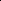

# LWGANet: Addressing Spatial and Channel Redundancy in Remote Sensing Visual Tasks with Light-Weight Grouped Attention

<!-- Page 1 -->

LWGANet: Addressing Spatial and Channel Redundancy in Remote Sensing

Visual Tasks with Light-Weight Grouped Attention

Wei Lu1, Xue Yang2, Si-Bao Chen1*

1MOE Key Lab of ICSP, IMIS Lab of Anhui, Anhui Provincial Key Lab of Multimodal Cognitive Computation, Zenmorn-AHU AI Joint Lab, School of Computer Science and Technology, Anhui University, Hefei 230601, China

2School of Automation and Intelligent Sensing, Shanghai Jiao Tong University, Shanghai 200240, China E23101009@stu.ahu.edu.cn, yangxue-2019-sjtu@sjtu.edu.cn, sbchen@ahu.edu.cn

## Abstract

Light-weight neural networks for remote sensing (RS) visual analysis must overcome two inherent redundancies: spatial redundancy from vast, homogeneous backgrounds, and channel redundancy, where extreme scale variations render a single feature space inefficient. Existing models, often designed for natural images, fail to address this dual challenge in RS scenarios. To bridge this gap, we propose LWGANet, a light-weight backbone engineered for RS-specific properties. LWGANet introduces two core innovations: a Top-K Global Feature Interaction (TGFI) module that mitigates spatial redundancy by focusing computation on salient regions, and a Light-Weight Grouped Attention (LWGA) module that resolves channel redundancy by partitioning channels into specialized, scale-specific pathways. By synergistically resolving these core inefficiencies, LWGANet achieves a superior trade-off between feature representation quality and computational cost. Extensive experiments on twelve diverse datasets across four major RS tasks—scene classification, oriented object detection, semantic segmentation, and change detection—demonstrate that LWGANet consistently outperforms state-of-the-art light-weight backbones in both accuracy and efficiency. Our work establishes a new, robust baseline for efficient visual analysis in RS images.

Code — https://github.com/AeroVILab-AHU/LWGANet

## Introduction

The efficiency of deep learning models (Lu et al. 2025, 2026; Hua et al. 2025; Zhu et al. 2025; Zhang et al. 2025a,b; Ye et al. 2025) for remote sensing (RS) image analysis is inherently constrained by two types of data redundancy. First, spatial redundancy arises from the sparse distribution of salient foreground objects within vast, homogeneous backgrounds such as roads, farmland, or oceans. Naive dense computation over the entire image leads to disproportionate resource allocation toward these background regions, which contribute minimal semantic value.

Second, a more subtle but critical issue is channel redundancy, stemming from the extreme scale variations in RS imagery. A single, unified feature representation struggles

∗Corresponding author. Copyright © 2026, Association for the Advancement of Artificial Intelligence (www.aaai.org). All rights reserved.

Input Image

LWGANet L2 EfficientFormerV2 S2

FasterNet T2

MovingCar

Vegetation

ResNet 18

Building

StaticCar Road

Human

## Background

Tree

**Figure 1.** Visual comparison on the UAVid testing set (Lyu et al. 2020) with UnetFormer (Wang et al. 2022a) as the decoder. FasterNet (Chen et al. 2023), a convolution-based model, excels at capturing building details but struggles with the global context needed for segmenting moving cars. Conversely, EfficientFormer V2 (Li et al. 2023b), leveraging global attention, effectively segments cars but fails to preserve fine-grained building structures. Our LWGANet achieves a superior balance by jointly modeling local details and long-range dependencies.

to capture both fine-grained textures and broad spatial contexts efficiently. For instance, channels specialized for small objects like vehicles are underutilized when processing large structures like runways, and vice-versa. This forces a compromise where a significant portion of the feature space becomes irrelevant for any given scale, leading to computational waste and representational inefficiency.

While existing lightweight backbone networks—such as MobileNetV2 (Sandler et al. 2018)—have been widely adopted in RS applications (e.g., scene classification (Zhang, Zhang, and Wang 2019; Xu, Zhu, and Shu 2022), object detection (Huang et al. 2022; Ai, Luo, and Wang 2025), semantic segmentation (Huang, Chen, and Wang 2022; Li et al.

The Fortieth AAAI Conference on Artificial Intelligence (AAAI-26)

AI-readable visual equivalent, added: Figure extracted from the paper PDF and converted to an SVG wrapper asset. Use the surrounding page text and caption for interpretation.

AI-readable visual equivalent, added: Figure extracted from the paper PDF and converted to an SVG wrapper asset. Use the surrounding page text and caption for interpretation.

AI-readable visual equivalent, added: Figure extracted from the paper PDF and converted to an SVG wrapper asset. Use the surrounding page text and caption for interpretation.

AI-readable visual equivalent, added: Figure extracted from the paper PDF and converted to an SVG wrapper asset. Use the surrounding page text and caption for interpretation.

AI-readable visual equivalent, added: Figure extracted from the paper PDF and converted to an SVG wrapper asset. Use the surrounding page text and caption for interpretation.

AI-readable visual equivalent, added: Figure extracted from the paper PDF and converted to an SVG wrapper asset. Use the surrounding page text and caption for interpretation.

AI-readable visual equivalent, added: Figure extracted from the paper PDF and converted to an SVG wrapper asset. Use the surrounding page text and caption for interpretation.

AI-readable visual equivalent, added: Figure extracted from the paper PDF and converted to an SVG wrapper asset. Use the surrounding page text and caption for interpretation.

AI-readable visual equivalent, added: Figure extracted from the paper PDF and converted to an SVG wrapper asset. Use the surrounding page text and caption for interpretation.

AI-readable visual equivalent, added: Figure extracted from the paper PDF and converted to an SVG wrapper asset. Use the surrounding page text and caption for interpretation.

AI-readable visual equivalent, added: Figure extracted from the paper PDF and converted to an SVG wrapper asset. Use the surrounding page text and caption for interpretation.

AI-readable visual equivalent, added: Figure extracted from the paper PDF and converted to an SVG wrapper asset. Use the surrounding page text and caption for interpretation.

AI-readable visual equivalent, added: Figure extracted from the paper PDF and converted to an SVG wrapper asset. Use the surrounding page text and caption for interpretation.

AI-readable visual equivalent, added: Figure extracted from the paper PDF and converted to an SVG wrapper asset. Use the surrounding page text and caption for interpretation.

AI-readable visual equivalent, added: Figure extracted from the paper PDF and converted to an SVG wrapper asset. Use the surrounding page text and caption for interpretation.

<!-- Page 2 -->

2024), and change detection (You et al. 2024)), these architectures are primarily designed for natural image benchmarks like ImageNet (Deng et al. 2009). Their efficiency typically derives from simplifications based on homogeneous grouping—applying identical operators like depthwise separable convolutions across all channel partitions. This uniform approach, while reducing parameters, fundamentally fails to address channel redundancy in RS data. It forces a single operational logic onto a diverse, multi-scale feature space, leading to computational waste and representational compromises. As a result, they often fail to reconcile the competing demands of local detail preservation and long-range context modeling, especially under the multiscale and cluttered conditions of RS images.

This architectural misalignment leads to a performance trade-off. For instance, convolution-based models such as FasterNet (Chen et al. 2023) exhibit strong local representation but lack the receptive field to capture global dependencies, resulting in poor recognition of diffuse objects. Conversely, transformer-style models like EfficientFormer V2 (Li et al. 2023b) possess enhanced global modeling capabilities but often suppress the high-frequency spatial information critical for detecting small or detailed objects. These limitations motivate the need for a lightweight backbone explicitly designed to mitigate both spatial and channel redundancies in a synergistic manner.

In this work, we propose LWGANet, a novel light-weight backbone architected to resolve this dual redundancy problem in RS images. It is built upon two key principles: (1) To address spatial redundancy, we propose the Top-K Global Feature Interaction (TGFI) module. This component selectively samples a sparse set of informative spatial positions and performs global context aggregation on this reduced token set. The result is a resolution-independent mechanism for long-range dependency modeling with reduced computational cost. (2) To alleviate channel redundancy, we design the Light- Weight Grouped Attention (LWGA) module. It partitions channels into heterogeneous groups, routing each through a specialized pathway optimized for a distinct feature scale— ranging from fine-grained edges to high-level semantics. This structure enables simultaneous multi-scale representation while minimizing channel waste.

Through the integration of TGFI and LWGA, LWGANet achieves a balanced capacity for both fine spatial detail extraction and large-scale semantic modeling. As shown in Figure 1, the network effectively parses diverse RS scenes containing extreme scale variation and complex background interference. In summary, our contributions are as follows:

• We identify spatial and channel redundancy as key bottlenecks for efficient network design in RS images, providing an architectural strategy to tackle both jointly. • We propose the LWGA module, a novel grouped attention architecture that resolves channel redundancy by decoupling features into specialized, multi-scale pathways. • We introduce the TGFI module, a sparse interaction mechanism that mitigates spatial redundancy by efficiently modeling global context on a reduced set of salient features. • We present LWGANet, a new light-weight backbone built upon these principles, and validate its state-of-theart performance and versatility through extensive experiments on 12 datasets across four distinct RS tasks.

## Related Work

The pursuit of efficient deep learning models has led to a variety of light-weight architectures. Early CNN-based efforts, such as MobileNetV2 (Sandler et al. 2018), utilized depthwise separable convolutions to reduce computational cost. More recent techniques include model pruning (Zheng et al. 2023), knowledge distillation (Hinton, Vinyals, and Dean 2015), reparameterization (Ding et al. 2021), and Neural Architecture Search (NAS) (Tan et al. 2019).

Concurrently, Vision Transformers (ViTs) (Dosovitskiy et al. 2020) and their hierarchical variants such as PVT (Wang et al. 2021b) and Swin Transformer (Liu et al. 2021) have introduced a new paradigm. Light-weight ViTs, such as MobileViT (Mehta and Rastegari 2022) and Efficient- FormerV2 (Li et al. 2023b), aim to merge transformer capabilities with mobile efficiency. Despite these advancements, most generic light-weight backbones are primarily optimized on natural image datasets like ImageNet (Deng et al. 2009), which lack the extreme scale variations and high redundancy characteristic of RS imagery.

Although some light-weight CNNs and ViTs have been applied to RS tasks, their performance often plateaus due to their general-purpose nature. While these general-purpose architectures have been adapted for RS tasks, they were not engineered to exploit RS-specific properties. Moreover, they rarely exploit the significant feature redundancy present in RS data. Consequently, a critical need remains for lightweight backbones specifically engineered for RS imagery— architectures that can manage channel redundancy and spatial redundancy. Our proposed LWGANet fills this gap by systematically addressing these challenges through decoupled multi-scale feature representation and sparse global context modeling.

## Approach

This section presents the overall architecture of LWGANet and its core components.

Overview of LWGANet LWGANet adopts a hierarchical architecture with four stages, progressively reducing the spatial resolution by factors of 4, 8, 16, and 32. This multi-scale design is fundamental for handling the diverse object scales prevalent in RS imagery. To accommodate different computational budgets, we propose three variants—L0, L1, and L2—distinguished by their stem layer channel counts (32, 64, and 96), providing a clear trade-off between model capacity and efficiency.

The architecture begins with a stem layer, implemented as a stride-4 convolution, to quickly reduce spatial dimensions while expanding channel capacity. Each stage then comprises a sequence of LWGA blocks, with block counts N1, N2, N3, N4 set to [1, 2, 4, 2] for L0 and L1, and [1, 4, 4,

<!-- Page 3 -->

GPA

RLA Channel

Split Input Channel

Concat Output

SMA/SGA

Position

Regression

Top-K Global

Feature

Top-k Global Feature Interaction (TGFI) Module

SMA TGFI

SGA TGFI

SMA SGA

RLA GPA

**Figure 2.** Illustration of the LWGA module and its submodules. GPA, RLA, SMA and SGA denote gate point attention, regular local attention, sparse medium-range attention and sparse global attention, respectively.

2] for L2. For downsampling between stages, we employ the DRFD module (Lu et al. 2023), chosen for its proven ability to preserve fine details. The multi-level features produced by each stage can be readily fed into task-specific decoders for various downstream applications.

Within each stage, an LWGA block processes the input feature map X first through the LWGA module, producing an enhanced feature map Y. This is followed by a Channel Multilayer Perceptron (CMLP) that refines Y using sequential 1×1 convolutions for channel expansion and restoration. The block is then completed with a residual connection, Batch Normalization (BN), and dropout:

CMLP(Y) = Conv(Act(BN(Conv(Y)))), out = X + BN(drop(CMLP(Y))), (1)

where the dropout rate is 0.0 for L0, 0.1 for L1 and L2.

LWGA Module The LWGA module is the core engine of LWGANet, engineered to resolve channel redundancy through a novel heterogeneous grouping strategy. Traditional lightweight designs often employ homogeneous grouping (e.g., grouped convolutions or multi-head attention), where identical operations are applied to all channel partitions. This uniform processing is inefficient for the extreme scale variations in RS imagery. In contrast, LWGA decouples the feature space by partitioning channels into four specialized, nonoverlapping pathways {X1, X2, X3, X4}, where each segment Xi ∈RH×W ×C/4 is routed through a distinct operator optimized for a specific feature scale.

This channel partitioning allows us to maximize representational efficiency. Each channel group is allocated to a specialized submodule optimized for a distinct feature scale, ensuring that the allocated channels are used with maximum relevance and minimal waste. The four pathways are designed to capture: Point-level Details: X1 is processed by Gate Point Attention (GPA) to enhance fine-grained features. RLA for Local Patterns: X2 is handled by Regular Local Attention (RLA), which uses standard convolutions. This approach leverages their strong inductive bias for local texture and pattern recognition. Medium-range Structures: X3 is fed into Sparse Mediumrange Attention (SMA) to capture contextual information for irregularly shaped objects. Global Context: X4 is processed by Sparse Global Attention (SGA) to model long-range dependencies for overall scene understanding.

By assigning a specialized, computationally efficient operator to each scale-specific task, the LWGA module avoids the compromises inherent in one-size-fits-all approaches. The outputs {R1, R2, R3, R4} are then concatenated, fusing the multi-scale representations into a comprehensive feature map Y ∈RH×W ×C. Figure 2 provides a detailed view of the structure of each submodule.

Top-K Global Feature Interaction (TGFI) Module. Before detailing the SMA and SGA modules, we first introduce TGFI, a key submodule designed to mitigate spatial redundancy for efficient long-range dependency modeling. TGFI is motivated by a core inefficiency in RS imagery: naive global attention mechanisms expend immense computational effort on vast, uninformative background regions. To address this inefficiency, TGFI implements a sparse interaction strategy that focuses computation exclusively on the most informative features, thus overcoming the limitations imposed by spatial redundancy. As shown in Figure 2: (1) Sparse Feature Sampling: It first divides the input features into non-overlapping regions and selects the single most salient feature token (e.g., with the highest activation value) from each region. The spatial coordinates Ploc of these selected features are preserved. This effectively creates a compact yet representative summary of the features. (2) Subspace Interaction: Next, interactions (e.g., via convolutions or attention) are computed only among this reduced set of sampled features. This establishes global relationships in an efficient subspace, drastically reducing the complexity compared to processing the full feature map. (3) Feature Restoration: Finally, the enhanced representations are restored to their original spatial locations using the preserved coordinates Ploc, while non-sampled locations are typically filled via interpolation or identity mapping.

By leveraging the sparse nature of RS data, TGFI serves as an intelligent sampling and interaction mechanism. It not only significantly reduces computational costs but also minimizes interference from irrelevant background noise, enabling efficient and robust global context integration.

GPA Module. The GPA module is designed to highlight fine-grained details critical for detecting small objects or intricate textures in RS imagery. It begins with a 1×1 convolution to expand the input feature X1 from C/4 to C channels, enabling richer feature representations. The expanded features undergo batch normalization and activation. Subsequently, a second 1×1 convolution restores the channel dimension to C/4, yielding X′

1. A sigmoid function is applied to X′

1 to generate an attention map A1, which weights the importance of each feature. The output R1 is computed as R1 = X1 + A1 · X1.

AI-readable visual equivalent, added: Figure extracted from the paper PDF and converted to an SVG wrapper asset. Use the surrounding page text and caption for interpretation.

AI-readable visual equivalent, added: Figure extracted from the paper PDF and converted to an SVG wrapper asset. Use the surrounding page text and caption for interpretation.

AI-readable visual equivalent, added: Figure extracted from the paper PDF and converted to an SVG wrapper asset. Use the surrounding page text and caption for interpretation.

AI-readable visual equivalent, added: Figure extracted from the paper PDF and converted to an SVG wrapper asset. Use the surrounding page text and caption for interpretation.

AI-readable visual equivalent, added: Figure extracted from the paper PDF and converted to an SVG wrapper asset. Use the surrounding page text and caption for interpretation.

AI-readable visual equivalent, added: Figure extracted from the paper PDF and converted to an SVG wrapper asset. Use the surrounding page text and caption for interpretation.

AI-readable visual equivalent, added: Figure extracted from the paper PDF and converted to an SVG wrapper asset. Use the surrounding page text and caption for interpretation.

AI-readable visual equivalent, added: Figure extracted from the paper PDF and converted to an SVG wrapper asset. Use the surrounding page text and caption for interpretation.

AI-readable visual equivalent, added: Figure extracted from the paper PDF and converted to an SVG wrapper asset. Use the surrounding page text and caption for interpretation.

AI-readable visual equivalent, added: Figure extracted from the paper PDF and converted to an SVG wrapper asset. Use the surrounding page text and caption for interpretation.

AI-readable visual equivalent, added: Figure extracted from the paper PDF and converted to an SVG wrapper asset. Use the surrounding page text and caption for interpretation.

AI-readable visual equivalent, added: Figure extracted from the paper PDF and converted to an SVG wrapper asset. Use the surrounding page text and caption for interpretation.

AI-readable visual equivalent, added: Figure extracted from the paper PDF and converted to an SVG wrapper asset. Use the surrounding page text and caption for interpretation.

AI-readable visual equivalent, added: Figure extracted from the paper PDF and converted to an SVG wrapper asset. Use the surrounding page text and caption for interpretation.

AI-readable visual equivalent, added: Figure extracted from the paper PDF and converted to an SVG wrapper asset. Use the surrounding page text and caption for interpretation.

AI-readable visual equivalent, added: Figure extracted from the paper PDF and converted to an SVG wrapper asset. Use the surrounding page text and caption for interpretation.

<!-- Page 4 -->

RLA Module. The RLA module is designed to efficiently capture local spatial features, leveraging the strong inductive bias of convolutions for local pattern recognition. The input feature X2 undergoes a 3×3 convolution (with parameters I=C/4, O=C/4, K=3, S=1, P=1), preserving spatial dimensions. Batch normalization and a non-linear activation follow to produce the output feature R2. This provides a robust foundation for modeling local dependencies.

SMA Module. The SMA module is engineered to capture medium-range contextual information, which is essential for objects with irregular shapes or those spanning beyond the immediate local neighborhood. It operates as follows: the TGFI module first reduces the input feature X3 to X′

3 ∈ R

H

3 × W 3 × C 4, expanding the receptive field while preserving positional coordinates Ploc. The resulting X′

3 is processed to generate an attention map A′

3 that integrates contextual information, computed as follows:

Aij= n= L−1

2 X n=0 α(i±n)j·x(i±n)j+ n= L−1

2 X n=0 α(i±n)(j±n)·x(i±n)(j±n)

+ n= L−1

2 X n=0 αi(j±n)·xi(j±n)+ n= L−1

2 X n=0 α(i∓n)(j±n)·x(i∓n)(j±n),

(2)

where xij represents the feature at position (i, j), and αij are learnable coefficients. The window size L is set to 11. The attention map A′

3 is then interpolated back to the original feature map dimensions using the preserved coordinates Ploc, yielding A3 (A′

3 ∈R H

3 × W 3 × C Ploc −→A3 ∈ RH×W × C

4). R3 is computed as: R3 = A3 · X3.

SGA Module. The SGA module is responsible for capturing long-range dependencies and global context. To balance representation with computational feasibility across stages, it adopts a dynamic, stage-aware strategy that adapts to the decreasing spatial resolution of the feature maps.

For Stages 1 and 2, where feature maps are large, a standard self-attention mechanism is computationally prohibitive due to its quadratic complexity with respect to the number of tokens. Even on the sparsely sampled features from TGFI, this cost remains a bottleneck. To circumvent this, we employ a highly efficient proxy for global attention: a combination of a 5×5 grouped convolution and a 7×7 dilated convolution (dilation=3). This convolutional approach approximates long-range interactions with a complexity that is linear to the number of sampled tokens, offering a powerful yet light-weight solution for capturing expansive context in high-resolution stages. The TGFI module first samples foreground features, reducing the feature map to X′

4 ∈R H

2 × W 2 × C 4 while preserving positional coordinates Ploc. The convolutional attention map A412 is applied to this sparse feature set, and the resulting feature R′

4 = A412 · X′ is then restored to the original resolution using Ploc, i.e., R′

4 ∈R H

2 × W 2 × C Ploc −→R′′

4 ∈RH×W × C 4, and the final output is computed as R4 = BN(R′′

4 + X4). For Stage 3, as the feature map size is considerably reduced, we can afford a more powerful interaction mechanism. The TGFI module again reduces the feature map to

X′

4 ∈R H

2 × W 2 × C 4. A standard global self-attention mechanism (Dosovitskiy et al. 2020) with 4 heads, denoted A43, is then applied to X′

4. The output R′ 4 = A43 · X′ 4 is interpolated back to the full resolution via Ploc, and combined with the input: R4 = BN(R′′

4 + X4). For Stage 4, the feature map is at its smallest spatial dimension, containing highly condensed semantic information. At this final stage, computational cost is no longer the primary constraint. We therefore apply the full-power standard global self-attention directly to the entire (dense) feature map X4, without sparse sampling. This maximalist approach ensures that the model can perform a comprehensive, all-to-all comparison of semantic concepts across the entire scene, which is vital for final classification and high-level understanding. The output is computed as R4 = BN(A44 ·X4 +X4), where A44 denotes the standard global self-attention.

This progressive strategy, moving from highly efficient convolutional approximations to sparse attention and finally to dense global attention, allows LWGANet to model global context with a sophistication that scales gracefully with the network’s depth and feature map size.

Finally, the features from all four pathways, {R1, R2, R3, R4}, are concatenated along the channel dimension. This fusion step integrates the specialized, multi-scale information into a single, comprehensive feature map Y ∈RH×W ×C, ready for subsequent processing.

## Experiments

In this section, we conduct a comprehensive evaluation of LWGANet on 12 public datasets across four key tasks: scene classification on UCM (Yang and Newsam 2010), AID (Xia et al. 2017), and NWPU-RESISC45 (Cheng, Han, and Lu 2017); oriented object detection on DOTA-v1.0/1.5 (Xia et al. 2018) (online testing) and DIOR-R (Cheng et al. 2022); semantic segmentation on UAVid (Lyu et al. 2020) and LoveDA (Wang et al. 2021a) (both online testing); and change detection on LEVIR-CD (Chen and Shi 2020), WHU-CD (Ji, Wei, and Lu 2018), CDD-CD (Lebedev et al. 2018), and SYSU-CD (Shi et al. 2021).

Datasets and Experimental Setup Across all experiments, data preprocessing and training protocols aligned with established methods (Lu et al. 2024; Cai et al. 2024; Wang et al. 2022a; Li et al. 2023c; Wang et al. 2024a), maintaining standard dataset splits and applying the best validation weights for testing. We use a backbone pre-trained on ImageNet-1K (Deng et al. 2009). Detailed dataset statistics and implementation specifics are provided in the Appendix for full reproducibility, accessible at: https://github.com/AeroVILab- AHU/LWGANet/blob/main/figures/LWGANet sup.pdf.

## Evaluation

on Scene Classification We begin by evaluating LWGANet on scene classification, a task that directly tests the model’s multi-scale representation capability. Table 1 presents a comprehensive comparison against SOTA light-weight models, including MobileNet

<!-- Page 5 -->

## Method

Params.

(M) ↓

FLOPs

(G) ↓

Top-1 Accuracy (%) ↑ Speed (FPS) ↑ NWPU AID UCM GPU CPU ARM

MobileNet V2 1.0× 2.28 0.319 95.06 93.65 97.14 11301 49.11 785.4 FasterNet T0 2.68 0.338 93.30 92.85 94.75 18276 106.4 839.7 StarNet S1 2.68 0.431 94.30 91.05 93.10 6045 71.70 459.8 EdgeViT XXS 3.79 0.546 94.75 93.10 95.24 4153 46.36 259.9 EfficientformerV2 S0 3.36 0.396 94.52 93.80 97.14 1299 54.00 272.0 EdgeNeXt XXS 1.17 0.197 92.35 88.10 88.10 8521 100.8 - ⋆MobileViT XXS 1.03 0.333 94.37 93.30 95.00 4811 31.87 453.6 GhostNet V2 0.6× 2.16 0.077 94.65 92.70 94.29 9802 69.96 867.1 LWGANet-L0 1.72 0.186 95.49 94.60 98.57 13234 80.00 687.8

MobileNet V2 2.0× 8.81 1.17 95.35 93.85 97.86 5567 17.03 372.3 FasterNet T1 6.37 0.855 93.73 93.20 94.52 11876 51.42 650.1 StarNet S3 5.5 0.767 93.32 91.40 93.33 4438 47.86 336.8 EdgeViT XS 6.40 1.12 94.89 93.75 94.52 3310 29.95 205.8 PVT V2 B0 3.42 0.533 94.35 93.10 96.43 3843 40.26 243.4 EfficientformerV2 S1 5.87 0.661 94.97 93.95 96.90 1211 36.96 204.5 EdgeNeXt XS 2.15 0.408 92.79 90.45 88.10 5455 56.42 - ⋆MobileViT XS 2.02 0.900 94.90 95.20 96.43 3300 12.99 306.3 GhostNet V2 1.0× 4.93 0.181 95.08 93.80 94.76 6596 42.02 591.7 LWGANet-L1 5.90 0.709 95.70 94.85 98.81 6418 34.08 375.8

MobileNet V2 2.5× 13.7 1.80 95.48 94.45 97.86 3796 12.90 282.4 FasterNet T2 13.8 1.91 95.11 93.60 94.29 6852 26.40 669.8 StarNet S4 7.23 1.07 93.08 89.75 90.71 3093 34.20 235.1 EdgeViT S 12.7 1.90 95.05 93.35 95.95 2318 19.31 141.3 PVT V2 B1 13.5 2.04 94.62 93.45 95.71 2369 15.96 145.3 EfficientformerV2 S2 12.3 1.26 95.14 94.20 97.38 642 24.74 123.8 EdgeNeXt S 5.30 0.960 93.54 91.90 92.62 3844 30.00 - ⋆MobileViT S 5.03 1.75 95.19 95.25 97.14 2681 10.20 152.7 GhostNet V2 2.0× 16.7 0.632 95.44 94.30 95.95 3476 21.32 303.2 LWGANet-L2 13.0 1.87 96.17 95.45 98.57 3308 16.18 274.3

**Table 1.** Experimental results on NWPU, AID, and UCM classification datasets with a training image size of 224×224. The symbol ‘⋆’ indicates a training image size of 256×256. FPS were acquired by the RTX 3090 (GPU), Intel i9-11900K (CPU), and NVIDIA AGX-XAVIER (ARM) with batch sizes of 256, 16, and 32, respectively.

V2 (Sandler et al. 2018), FasterNet (Chen et al. 2023), StarNet (Ma et al. 2024), PVT V2 (Wang et al. 2022b), EdgeViT (Pan et al. 2022), EfficientformerV2 (Li et al. 2023b), EdgeNeXt (Maaz et al. 2022), MobileViT (Mehta and Rastegari 2022), and GhostNet V2 (Tang et al. 2022).

Our LWGANet variants consistently achieve strong performance across all three datasets. For instance, the lightweight LWGANet-L0 demonstrates a compelling balance of accuracy and efficiency, achieving 95.49% Top-1 accuracy on the challenging NWPU dataset. This result surpassed light-weight models like StarNet S1 (+1.19%) while using significantly fewer parameters and FLOPs.

This trend of high accuracy relative to computational cost continues with our larger variants, L1 and L2, which set new benchmarks for light-weight models on these datasets. The consistent high performance, from the texture-rich scenes in UCM to the complex layouts in NWPU, suggests that our LWGA module’s feature decoupling strategy effectively captures the required spectrum of features. The model excels because it does not compromise local detail for global context, or vice versa, validating our core design principle.

## Method

#P (M) ↓

FLOPs

(G) ↓ mAP (%) ↑ DOTA1.0 DOTA1.5 DIOR-R Mean ResNet-50 41.1 211.4 75.87 66.88 64.30 69.02 FasterNet-T2 30.0 160.3 76.17 71.07 63.66 70.30 ARC-R50 74.4 212.0 77.35 68.31 65.51 70.39 LSKNet-S 31.0 161.0 77.49 70.26 65.90 71.22 EfficientFormerV2-S2 29.2 145.1 76.70 72.19 65.00 71.30 DecoupleNet-D2 23.3 142.4 78.04 71.15 67.08 72.09 PKINet-S 30.8 184.6 78.39 71.47 67.03 72.30 LWGANet-L2 29.2 159.1 79.02 72.91 68.53 73.49

**Table 2.** Experimental results on the DOTA 1.0, DOTA 1.5, and DIOR-R test sets with single-scale training and testing.

## Method

Backbone only Speed (FPS) ↑ mAP (%) ↑ #P (M) ↓ FLOPs (G) ↓ EfficientFormerV2-S2 12.0 26.8 15.7 76.70 ARC-R50 56.5 86.6 11.8 77.35 LSKNet-S 14.4 54.4 22.5 77.49 PKINet-S 13.7 70.2 5.4 78.39 LWGANet-L2 12.0 38.8 19.4 79.02

**Table 3.** Speed and accuracy comparison of different backbones on the DOTA 1.0 test set (Xia et al. 2018).

## Analysis

of Practical Efficiency. To assess practical deployment performance, we benchmarked inference speeds (FPS) across GPU, CPU, and ARM platforms, as shown in Table 1. The results highlight LWGANet’s excellent practical efficiency. For instance, our LWGANet-L0 achieved a high throughput of 13,234 FPS on GPU and a strong 80.0 FPS on CPU, outperforming most competing hybrid and Transformer-based models like EfficientformerV2 and EdgeViT by a significant margin. This demonstrates that our design is not only theoretically efficient but also translates to tangible speed in practice. FasterNet, a pure CNN-based model, achieves higher FPS due to its architecture being composed almost entirely of highly optimized standard convolutions. Despite this, LWGANet offers a superior tradeoff: it delivered substantially higher accuracy than FasterNet (+2.19% on NWPU) while maintaining highly competitive, real-world inference speeds, making it a more balanced and powerful solution for practical RS applications.

## Evaluation

on Object Detection Oriented object detection presents a stringent test for any model’s multi-scale capabilities, due to the extreme scale variations where tiny vehicles often co-exist with large airplanes and harbors. We evaluated LWGANet on the challenging DOTA-v1.0/1.5 and DIOR-R datasets to assess the efficacy of our multi-scale design in this demanding context.

We compare against SOTA backbones including ResNet- 50 (He et al. 2016), ARC-R50 (Pu et al. 2023), LSKNet- S (Li et al. 2023a), PKINet-S (Cai et al. 2024), and lightweight backbone networks such as FasterNet-T2 (Chen et al. 2023), EfficientFormerV2-S2 (Li et al. 2023b), and DecoupleNet-D2 (Lu et al. 2024). All backbones are integrated within the Oriented R-CNN (Xie et al. 2021) detector. Parameters (#P), FLOPs, and speeds (FPS) were tested

<!-- Page 6 -->

## Method

#P ↓ FLOPs ↓ FPS ↑ mIoU ↑ EfficientFormerV2-S2 (Li et al. 2023b) 12.7 35.8 54.1 65.2 FasterNet-T2 (Chen et al. 2023) 13.3 49.1 198.8 65.7 ResNet18 (He et al. 2016) 11.7 46.9 115.6 67.8 LWGANet-L2 12.6 50.3 67.3 69.1

## Method

#P (M) ↓ mIoU ↑ FactSeg (Ma et al. 2022) 33.44 50.0 FarSeg (Zheng et al. 2020) 31.37 50.1 LoveNAS (Wang et al. 2024b) 30.49 52.3 UnetFormer (Wang et al. 2022a) 11.73 52.4 RSSFormer (Xu et al. 2023) 30.82 52.4 LWGANet-L2 12.58 53.6

**Table 4.** Segmentation experimental results on the UAVid test set (Lyu et al. 2020) (left) and LoveDA (Wang et al. 2021a) (right) compared to the SOTA methods. #P, FLOPs, and speeds were tested with a 1,024×1,024 input size on the RTX 3090 GPU.

## Method

#P (M) ↓

FLOPs

(B) ↓

LEVIR-CD WHU-CD CDD-CD SYSU-CD Mean IoU ↑ F1 ↑ Pre ↑ IoU ↑ F1 ↑ Pre ↑ IoU ↑ F1 ↑ Pre ↑ IoU ↑ F1 ↑ Pre ↑ IoU ↑ F1 ↑ Pre ↑ BIT (Chen, Qi, and Shi 2022) 3.50 10.6 81.30 89.69 92.33 78.24 87.79 85.07 70.22 82.50 89.03 60.48 75.38 80.08 72.56 83.84 86.63 DMINet (Feng et al. 2023) 6.24 14.6 82.99 90.75 92.52 79.68 88.69 93.84 86.91 92.99 93.03 51.56 68.04 64.47 75.29 85.12 85.97 RFANet (You et al. 2024) 2.86 3.16 84.32 91.49 92.32 87.86 93.54 95.46 87.04 93.07 93.84 69.08 81.71 82.06 82.08 89.95 90.92 A2Net (Li et al. 2023c) 3.78 3.05 84.21 91.43 92.08 88.98 94.17 96.68 87.42 93.29 93.65 70.83 82.93 86.45 82.86 90.46 92.22 A2Net-LWGANet-L0 2.91 2.76 84.94 91.86 92.81 90.24 94.87 96.11 87.24 93.18 94.30 71.54 83.41 86.16 83.49 90.83 92.35

IFNet (Zhang et al. 2020) 35.7 82.3 80.36 89.11 91.64 73.16 84.50 87.92 85.68 92.29 92.03 64.42 78.36 78.49 75.91 86.07 87.52 ChangeFormer (Bandara and Patel 2022) 41.0 203 81.59 89.86 91.12 72.92 84.34 89.08 85.40 92.13 93.39 64.20 78.20 79.70 76.03 86.13 88.32 ICIFNet (Feng et al. 2022) 23.8 25.4 81.75 89.96 91.32 79.24 88.32 92.98 85.73 92.31 93.41 40.65 57.80 71.35 71.84 82.10 87.27 CSViG (You et al. 2023) 38.0 203 84.37 91.52 92.35 82.76 90.57 94.69 87.60 93.39 94.48 69.21 81.80 84.43 80.99 89.32 91.49 CLAFA (Wang et al. 2024a) 14.7 22.0 85.21 92.01 92.96 89.74 94.59 95.59 88.19 93.73 91.87 70.12 82.43 83.66 83.32 90.69 91.02 CLAFA-LWGANet-L2 16.1 22.1 85.90 92.42 93.25 90.92 95.24 96.51 88.27 93.77 91.76 70.79 82.90 87.69 83.97 91.08 92.30

**Table 5.** Change detection experimental results on LEVIR-CD test set (Chen and Shi 2020), WHU-CD test set (Ji, Wei, and Lu 2018), CDD-CD test set (Lebedev et al. 2018), and SYSU-CD test set (Shi et al. 2021).

by 1,024×1,024 input size on the RTX 3090 GPU.

As shown in Table 2, LWGANet-L2 establishes a new SOTA among light-weight backbones. It achieved impressive mAP scores of 79.02% on DOTA-v1.0, 72.91% on DOTA-v1.5, and 68.53% on DIOR-R. This performance surpassed even task-specialized, heavier backbones such as PKINet-S. Furthermore, Table 3 highlights its efficiency: LWGANet was more accurate, used significantly fewer FLOPs (38.8G vs. 70.2G), and was much faster in practice (19.4 FPS vs. 5.4 FPS) than PKINet-S. This strong performance on datasets with vast scale differences confirms that leveraging channel redundancy through feature decoupling is a highly effective strategy for the multi-scale challenge, outperforming the uniform processing of general-purpose architectures. Concurrently, the model’s ability to localize objects accurately within large scenes is supported by the TGFI module’s design, which mitigates spatial redundancy for efficient context aggregation. The results suggest that the flexible receptive fields from our LWGA module are beneficial for localizing irregularly shaped objects. Detailed results for each category are presented in the Appendix.

## Evaluation

on Semantic Segmentation Semantic segmentation demands pixel-level precision, requiring a model to simultaneously recognize fine boundaries and understand broader semantic context. This task directly evaluates the fusion of local and global information within our proposed architecture.

LWGANet was built within the UnetFormer (Wang et al. 2022a) decoder. The results on UAVid and LoveDA (Table 4) confirm the effectiveness of LWGANet. On UAVid, It achieved 69.1% mIoU, and on the more complex LoveDA dataset, it set a new SOTA with 53.6% mIoU, all while maintaining a compact size. This strong performance, especially in scenes featuring both small moving objects and large static structures, underscores the capabilities of our multi-pathway design. As visualized in Figure 1, our model successfully integrates point-level detail with global context, a direct result of the comprehensive representations fused from the four specialized pathways of the LWGA module.

## Evaluation

on Change Detection Change detection requires comparing bi-temporal images to identify semantic changes, a task that is highly sensitive to both subtle feature differences and alignment errors. An effective backbone must provide robust, discriminative features to minimize false positives caused by seasonal or lighting variations. As presented in Table 5, integrating LWGANet as the backbone consistently boosts the performance of SOTA change detection decoders. For instance, A2Net-LWGANet-L0 improved upon the baseline A2Net across all metrics on LEVIR-CD and WHU-CD, while being more parameter-efficient. Similarly, CLAFA-LWGANet-L2 achieved a new SOTA on all four datasets, with a notable 1.18% IoU gain on WHU-CD. These results highlight that the rich, multi-scale features produced by LWGANet provide a more robust foundation for bi-temporal feature comparison. The model’s ability to capture both fine-grained changes and large-scale transformations demonstrates its adaptability and effectiveness for this demanding task.

Across all these RS visual tasks, LWGANet demonstrates exceptional versatility and superior performance, providing an optimal balance between accuracy, parameter efficiency, and computational cost. Notably, LWGANet even surpasses

<!-- Page 7 -->

Components Efficiency Performance Metrics (%) ↑

TGFI LWGA Channels P(M) ↓ FLOPs(G) ↓ FPS ↑ NWPU DOTA-v1.0 (val) LoveDA LEVIR WHU CDD

24 1.92 0.234 22941 94.33 67.61 48.61 82.26 85.84 86.53 ✓ 32 1.72 0.210 95.17 69.47 48.80 83.10 86.31 87.01 ✓ ✓ 32 1.72 0.188 13234 95.49 70.08 49.20 82.93 86.62 86.90

**Table 6.** Ablation study of LWGANet-L0 on its core components. Performance is reported as Top-1 Acc. (%) for NWPU, mAP (%) for DOTA-v1.0 (val), mIoU (%) for LoveDA, and IoU for change detection datasets.

task-specific backbones like LSKNet and PKINet for detection, and RSSFormer for segmentation, in accuracy while maintaining a more light-weight design.

Ablation Studies

Quantitative Analyses. To validate the individual contributions and synergistic effects of our core components, we conducted a detailed ablation study on the TGFI and LWGA modules using LWGANet-L0. The results, summarized in Table 6, confirm that the full model integrating both TGFI and LWGA achieves the highest accuracy on the vast majority of tasks, validating their synergistic benefit. Crucially, the data reveals that TGFI’s sparse sampling not only reduces spatial redundancy but also significantly accelerates the heterogeneous LWGA module, leading to an optimal balance of superior accuracy and high practical inference speed.

Qualitative Analyses. To validate our hypothesis that a synergistic, multi-pathway design is superior to any singleparadigm. We constructed several variants of our network, each exclusively using one type of attention module (GPA, RLA, SMA, or SGA) throughout all blocks. These experiments directly compare the feature extraction capabilities of the standalone modules against the full LWGANet, ensuring a fair comparison by utilizing comparable parameters and FLOPs (stem dims set to 64, 64, 96, 96, and 96).

The qualitative results in Figure 3 provide a visual confirmation of our design’s efficacy. The Class Activation Maps (CAMs) for the standalone modules clearly show their inherent biases: GPA focuses on scattered high-frequency points, RLA activates on local textures, while SMA and SGA produce smoother, larger activation regions. In contrast, the CAM for the full LWGANet is both focused and comprehensive. It precisely highlights the target objects while simultaneously capturing their broader context. This visual evidence demonstrates that LWGA module is not just mixing features, but is successfully fusing complementary representations into a coherent and superior whole.

## Limitations

and Future Works

Future development of LWGANet can be guided by two key objectives: enhancing its architectural adaptivity and improving its practical deployment efficiency. (1) Architectural Adaptivity. LWGANet currently employs a static design with fixed channel partitions and hardcoded hyperparameters. A promising direction is to introduce dynamism, for instance, by using neural architecture search (NAS) to learn optimal channel allocations for each pathway or other structural parameters. This would boost the

Stage1 Stage3

GPA RLA SMA SGA

Stage2

LWGANet L2

**Figure 3.** The class activation maps (CAMs) visual results. The figure selected from the DOTA 1.0 test set.

model’s adaptability to diverse data distributions. (2) Practical Efficiency. While the full LWGANet is highly efficient, the heterogeneous operations within the LWGA module can introduce overhead compared to uniform, convolution-only architectures. The TGFI module effectively mitigates this by reducing the computational load on the attention pathways, thereby boosting throughput. However, to unlock maximum performance on edge devices, future work could focus on optimizing the interplay of these diverse operations. This could involve engineering-driven solutions like operator fusion and custom CUDA kernels, or algorithmic approaches to minimize execution divergence and memory access costs.

## Conclusion

In this paper, we introduced LWGANet, a light-weight backbone that redefines efficient feature extraction for RS images by systematically addressing the core issues of spatial and channel redundancy. Comprehensive experiments on 12 datasets across four major visual tasks validate the superiority in both accuracy and efficiency. By synergistically resolving these core redundancies, LWGANet establishes a new, robust, and versatile baseline for a wide range of RS applications, particularly on resource-constrained devices.

## Acknowledgments

The work was partly supported by the NSFC Key Project of Joint Fund for Enterprise Innovation and Development (U24A20342), Natural Science Foundation of Shanghai (25ZR1402268), and National Natural Science Foundation of China (62576006, 62506229 and 61976004).

AI-readable visual equivalent, added: Figure extracted from the paper PDF and converted to an SVG wrapper asset. Use the surrounding page text and caption for interpretation.

AI-readable visual equivalent, added: Figure extracted from the paper PDF and converted to an SVG wrapper asset. Use the surrounding page text and caption for interpretation.

AI-readable visual equivalent, added: Figure extracted from the paper PDF and converted to an SVG wrapper asset. Use the surrounding page text and caption for interpretation.

AI-readable visual equivalent, added: Figure extracted from the paper PDF and converted to an SVG wrapper asset. Use the surrounding page text and caption for interpretation.

AI-readable visual equivalent, added: Figure extracted from the paper PDF and converted to an SVG wrapper asset. Use the surrounding page text and caption for interpretation.

AI-readable visual equivalent, added: Figure extracted from the paper PDF and converted to an SVG wrapper asset. Use the surrounding page text and caption for interpretation.

AI-readable visual equivalent, added: Figure extracted from the paper PDF and converted to an SVG wrapper asset. Use the surrounding page text and caption for interpretation.

AI-readable visual equivalent, added: Figure extracted from the paper PDF and converted to an SVG wrapper asset. Use the surrounding page text and caption for interpretation.

AI-readable visual equivalent, added: Figure extracted from the paper PDF and converted to an SVG wrapper asset. Use the surrounding page text and caption for interpretation.

AI-readable visual equivalent, added: Figure extracted from the paper PDF and converted to an SVG wrapper asset. Use the surrounding page text and caption for interpretation.

AI-readable visual equivalent, added: Figure extracted from the paper PDF and converted to an SVG wrapper asset. Use the surrounding page text and caption for interpretation.

AI-readable visual equivalent, added: Figure extracted from the paper PDF and converted to an SVG wrapper asset. Use the surrounding page text and caption for interpretation.

AI-readable visual equivalent, added: Figure extracted from the paper PDF and converted to an SVG wrapper asset. Use the surrounding page text and caption for interpretation.

AI-readable visual equivalent, added: Figure extracted from the paper PDF and converted to an SVG wrapper asset. Use the surrounding page text and caption for interpretation.

AI-readable visual equivalent, added: Figure extracted from the paper PDF and converted to an SVG wrapper asset. Use the surrounding page text and caption for interpretation.

<!-- Page 8 -->

## References

Ai, Z.; Luo, H.; and Wang, J. 2025. A Lightweight Multistream Framework for Salient Object Detection in Optical Remote Sensing. IEEE TGRS, 63: 1–15. Bandara, W. G. C.; and Patel, V. M. 2022. A Transformer- Based Siamese Network for Change Detection. In Int’l Geosci. Remote Sens. Symp., 207–210. Cai, X.; Lai, Q.; Wang, Y.; Wang, W.; Sun, Z.; and Yao, Y. 2024. Poly Kernel Inception Network for Remote Sensing Detection. In CVPR. Chen, H.; Qi, Z.; and Shi, Z. 2022. Remote Sensing Image Change Detection With Transformers. IEEE TGRS, 60: 1– 14. Chen, H.; and Shi, Z. 2020. A Spatial-Temporal Attention- Based Method and a New Dataset for Remote Sensing Image Change Detection. RS, 12(10): 1662. Chen, J.; Kao, S.-h.; He, H.; Zhuo, W.; Wen, S.; Lee, C.-H.; and Chan, S.-H. G. 2023. Run, Don’t walk: Chasing higher FLOPS for faster neural networks. In CVPR, 12021–12031. Cheng, G.; Han, J.; and Lu, X. 2017. Remote Sensing Image Scene Classification: Benchmark and State of the Art. Proc. IEEE, 105(10): 1865–1883. Cheng, G.; Wang, J.; Li, K.; Xie, X.; Lang, C.; Yao, Y.; and Han, J. 2022. Anchor-Free Oriented Proposal Generator for Object Detection. IEEE TGRS, 60: 1–11. Deng, J.; Dong, W.; Socher, R.; Li, L.-J.; Li, K.; and Fei- Fei, L. 2009. Imagenet: A large-scale hierarchical image database. In CVPR, 248–255. Ding, X.; Zhang, X.; Ma, N.; Han, J.; Ding, G.; and Sun, J. 2021. RepVGG: Making VGG-Style ConvNets Great Again. In CVPR, 13733–13742. Dosovitskiy, A.; Beyer, L.; Kolesnikov, A.; Weissenborn, D.; Zhai, X.; Unterthiner, T.; Dehghani, M.; Minderer, M.; Heigold, G.; Gelly, S.; Uszkoreit, J.; and Houlsby, N. 2020. An Image is Worth 16x16 Words: Transformers for Image Recognition at Scale. ArXiv, abs/2010.11929. Feng, Y.; Jiang, J.; Xu, H.; and Zheng, J. 2023. Change Detection on Remote Sensing Images Using Dual-Branch Multilevel Intertemporal Network. IEEE TGRS, 61: 1–15. Feng, Y.; Xu, H.; Jiang, J.; Liu, H.; and Zheng, J. 2022. ICIF-Net: Intra-Scale Cross-Interaction and Inter-Scale Feature Fusion Network for Bitemporal Remote Sensing Images Change Detection. IEEE TGRS, 60: 1–13. He, K.; Zhang, X.; Ren, S.; and Sun, J. 2016. Deep Residual Learning for Image Recognition. In CVPR, 770–778. Hinton, G. E.; Vinyals, O.; and Dean, J. 2015. Distilling the Knowledge in a Neural Network. arXiv.org, abs/1503.02531. Hua, Z.-T.; Chen, S.-B.; Lu, W.; Tang, J.; and Luo, B. 2025. Multiscale Adaptive Decoder and Diversity Selection Network for Road Extraction in Remote Sensing Image. IEEE TGRS, 63: 1–13. Huang, H.; Chen, Y.; and Wang, R. 2022. A Lightweight Network for Building Extraction From Remote Sensing Images. IEEE TGRS, 60: 1–12.

Huang, Z.; Li, W.; Xia, X.-G.; Wang, H.; Jie, F.; and Tao, R. 2022. LO-Det: Lightweight Oriented Object Detection in Remote Sensing Images. IEEE TGRS, 60: 1–15. Ji, S.; Wei, S.; and Lu, M. 2018. Fully Convolutional Networks for Multisource Building Extraction From an Open Aerial and Satellite Imagery Data Set. IEEE TGRS, 57(1): 574–586. Lebedev, M.; Vizilter, Y. V.; Vygolov, O.; Knyaz, V. A.; and Rubis, A. Y. 2018. Change detection in remote sensing images using conditional adversarial networks. The International Archives of the Photogrammetry, Remote Sensing and Spatial Information Sciences, 42: 565–571. Li, Y.; Hou, Q.; Zheng, Z.; Cheng, M.-M.; Yang, J.; and Li, X. 2023a. Large Selective Kernel Network for Remote Sensing Object Detection. In ICCV, 16794–16805. Li, Y.; Hu, J.; Wen, Y.; Evangelidis, G.; Salahi, K.; Wang, Y.; Tulyakov, S.; and Ren, J. 2023b. Rethinking Vision Transformers for MobileNet Size and Speed. In ICCV, 16889– 16900. Li, Y.; Zhou, W.; Meng, J.; and Yan, W. 2024. Lightweight and Efficient Multimodal Prompt Injection Network for Scene Parsing of Remote Sensing Scene Images. IEEE TGRS, 62: 1–9. Li, Z.; Tang, C.; Liu, X.; Zhang, W.; Dou, J.; Wang, L.; and Zomaya, A. Y. 2023c. Lightweight Remote Sensing Change Detection With Progressive Feature Aggregation and Supervised Attention. IEEE TGRS, 61: 1–12. Liu, Z.; Lin, Y.; Cao, Y.; Hu, H.; Wei, Y.; Zhang, Z.; Lin, S.; and Guo, B. 2021. Swin Transformer: Hierarchical Vision Transformer using Shifted Windows. In ICCV, 10012– 10022. Lu, W.; Chen, S.-B.; Li, H.-D.; Shu, Q.-L.; Ding, C. H. Q.; Tang, J.; and Luo, B. 2025. LEGNet: A Lightweight Edge- Gaussian Network for Low-Quality Remote Sensing Image Object Detection. In ICCVW, 2844–2853. Lu, W.; Chen, S.-B.; Shu, Q.-L.; Tang, J.; and Luo, B. 2024. DecoupleNet: A Lightweight Backbone Network With Efficient Feature Decoupling for Remote Sensing Visual Tasks. IEEE TGRS, 62: 1–13. Lu, W.; Chen, S.-B.; Tang, J.; Ding, C. H.; and Luo, B. 2023. A Robust Feature Downsampling Module for Remote Sensing Visual Tasks. IEEE TGRS, 61: 1–12. Lu, W.; Li, H.-D.; Wang, C.; Chen, S.-B.; Ding, C. H.; Tang, J.; and Luo, B. 2026. UnravelNet: A backbone for enhanced multi-scale and low-quality feature extraction in remote sensing object detection. ISPRS, 231: 431–442. Lyu, Y.; Vosselman, G.; Xia, G.-S.; Yilmaz, A.; and Yang, M. Y. 2020. UAVid: A semantic segmentation dataset for UAV imagery. ISPRS, 165: 108–119. Ma, A.; Wang, J.; Zhong, Y.; and Zheng, Z. 2022. FactSeg: Foreground Activation-Driven Small Object Semantic Segmentation in Large-Scale Remote Sensing Imagery. IEEE TGRS, 60: 1–16. Ma, X.; Dai, X.; Bai, Y.; Wang, Y.; and Fu, Y. 2024. Rewrite the stars. In CVPR, 5694–5703.

<!-- Page 9 -->

Maaz, M.; Shaker, A.; Cholakkal, H.; Khan, S.; Zamir, S. W.; Anwer, R. M.; and Shahbaz Khan, F. 2022. EdgeNeXt: Efficiently Amalgamated CNN-Transformer Architecture for Mobile Vision Applications. In ECCVW, 3– 20. Mehta, S.; and Rastegari, M. 2022. Mobilevit: light-weight, general-purpose, and mobile-friendly vision transformer. In ICLR. Pan, J.; Bulat, A.; Tan, F.; Zhu, X.; Dudziak, L.; Li, H.; Tzimiropoulos, G.; and Martinez, B. 2022. EdgeViTs: Competing Light-Weight CNNs on Mobile Devices with Vision Transformers. In ECCV, 294–311. Pu, Y.; Wang, Y.; Xia, Z.; Han, Y.; Wang, Y.; Gan, W.; Wang, Z.; Song, S.; and Huang, G. 2023. Adaptive Rotated Convolution for Rotated Object Detection. In ICCV, 6589–6600. Sandler, M.; Howard, A.; Zhu, M.; Zhmoginov, A.; and Chen, L.-C. 2018. MobileNetV2: Inverted Residuals and Linear Bottlenecks. In CVPR, 4510–4520. Shi, Q.; Liu, M.; Li, S.; Liu, X.; Wang, F.; and Zhang, L. 2021. A Deeply Supervised Attention Metric-Based Network and an Open Aerial Image Dataset for Remote Sensing Change Detection. IEEE TGRS, 60: 1–16. Tan, M.; Chen, B.; Pang, R.; Vasudevan, V.; Sandler, M.; Howard, A.; and Le, Q. V. 2019. MnasNet: Platform-Aware Neural Architecture Search for Mobile. In CVPR, 2820– 2828. Tang, Y.; Han, K.; Guo, J.; Xu, C.; Xu, C.; and Wang, Y. 2022. GhostNetV2: Enhance Cheap Operation with Long- Range Attention. In NeurIPS, volume 35, 9969–9982. Wang, G.; Cheng, G.; Zhou, P.; and Han, J. 2024a. Cross- Level Attentive Feature Aggregation for Change Detection. IEEE TCSVT, 34(7): 6051–6062. Wang, J.; Zheng, Z.; Lu, X.; and Zhong, Y. 2021a. LoveDA: A Remote Sensing Land-Cover Dataset for Domain Adaptive Semantic Segmentation. In NeurIPS DB Track. Wang, J.; Zhong, Y.; Ma, A.; Zheng, Z.; Wan, Y.; and Zhang, L. 2024b. LoveNAS: Towards multi-scene land-cover mapping via hierarchical searching adaptive network. ISPRS, 209: 265–278. Wang, L.; Li, R.; Zhang, C.; Fang, S.; Duan, C.; Meng, X.; and Atkinson, P. M. 2022a. UNetFormer: A UNet-like transformer for efficient semantic segmentation of remote sensing urban scene imagery. ISPRS, 190: 196–214. Wang, W.; Xie, E.; Li, X.; Fan, D.-P.; Song, K.; Liang, D.; Lu, T.; Luo, P.; and Shao, L. 2021b. Pyramid Vision Transformer: A Versatile Backbone for Dense Prediction without Convolutions. In ICCV, 568–578. Wang, W.; Xie, E.; Li, X.; Fan, D.-P.; Song, K.; Liang, D.; Lu, T.; Luo, P.; and Shao, L. 2022b. PVT v2: Improved baselines with Pyramid Vision Transformer. CVM, 8(3): 415– 424. Xia, G.-S.; Bai, X.; Ding, J.; Zhu, Z.; Belongie, S.; Luo, J.; Datcu, M.; Pelillo, M.; and Zhang, L. 2018. DOTA: A Large-Scale Dataset for Object Detection in Aerial Images. In CVPR, 3974–3983.

Xia, G.-S.; Hu, J.; Hu, F.; Shi, B.; Bai, X.; Zhong, Y.; Zhang, L.; and Lu, X. 2017. AID: A Benchmark Data Set for Performance Evaluation of Aerial Scene Classification. IEEE TGRS, 55(7): 3965–3981. Xie, X.; Cheng, G.; Wang, J.; Yao, X.; and Han, J. 2021. Oriented R-CNN for Object Detection. In ICCV, 3520–3529. Xu, C.; Zhu, G.; and Shu, J. 2022. A Lightweight and Robust Lie Group-Convolutional Neural Networks Joint Representation for Remote Sensing Scene Classification. IEEE TGRS, 60: 1–15. Xu, R.; Wang, C.; Zhang, J.; Xu, S.; Meng, W.; and Zhang, X. 2023. RSSFormer: Foreground Saliency Enhancement for Remote Sensing Land-Cover Segmentation. TIP, 32: 1052–1064. Yang, Y.; and Newsam, S. 2010. Bag-of-visual-words and spatial extensions for land-use classification. In Proc. 18th SIGSPATIAL Int. Symp. on Adv. in Geogr. Inf. Syst., 270– 279. Ye, Y.; Teng, X.; Yang, H.; Chen, S.; Sun, Y.; Bian, Y.; Tan, T.; Li, Z.; and Yu, Q. 2025. 3MOS: a multi-source, multi-resolution, and multi-scene optical-SAR dataset with insights for multi-modal image matching. Vis. Intell., 3(19). You, Z.-H.; Chen, S.-B.; Wang, J.-X.; and Luo, B. 2024. Robust feature aggregation network for lightweight and effective remote sensing image change detection. ISPRS, 215: 31–43. You, Z.-H.; Wang, J.-X.; Chen, S.-B.; Ding, C. H.; Wang, G.-Z.; Tang, J.; and Luo, B. 2023. Crossed Siamese Vision Graph Neural Network for Remote Sensing Image Change Detection. IEEE TGRS, 61: 1–16. Zhang, B.; Zhang, Y.; and Wang, S. 2019. A Lightweight and Discriminative Model for Remote Sensing Scene Classification With Multidilation Pooling Module. IEEE J. Sel. Topics Appl. Earth Observ. Remote Sens., 12(8): 2636–2653. Zhang, C.; Yue, P.; Tapete, D.; Jiang, L.; Shangguan, B.; Huang, L.; and Liu, G. 2020. A deeply supervised image fusion network for change detection in high resolution bitemporal remote sensing images. ISPRS, 166: 183–200. Zhang, X.; Ma, J.; Wang, G.; Zhang, Q.; Zhang, H.; and Zhang, L. 2025a. Perceive-IR: Learning to Perceive Degradation Better for All-in-One Image Restoration. TIP, 1–1. Zhang, X.; Zhang, H.; Wang, G.; Zhang, Q.; Zhang, L.; and Du, B. 2025b. UniUIR: Considering Underwater Image Restoration as an All-in-One Learner. TIP, 34: 6963–6977. Zheng, Y.-J.; Chen, S.-B.; Ding, C. H.; and Luo, B. 2023. Model Compression Based on Differentiable Network Channel Pruning. IEEE TNNLS, 34(12): 10203–10212. Zheng, Z.; Zhong, Y.; Wang, J.; and Ma, A. 2020. Foreground-Aware Relation Network for Geospatial Object Segmentation in High Spatial Resolution Remote Sensing Imagery. In CVPR, 4096–4105. Zhu, Z.-H.; Lu, W.; Chen, S.-B.; Ding, C. H. Q.; Tang, J.; and Luo, B. 2025. Real-World Remote Sensing Image Dehazing: Benchmark and Baseline. IEEE TGRS, 63: 1–14.
