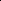

# MaskAD: Parallel Masked Autoencoder for Multi-class Unsupervised Anomaly Detection

<!-- Page 1 -->

MaskAD: Parallel Masked Autoencoder for Multi-class Unsupervised Anomaly Detection

Ruiying Lu1, Gang Liu2, Kang Li3, Long Tian4*, Junwei Zhang1*

1School of Cyber Engineering, Xidian University, Xi’an, China 2Guangzhou Institute of Technology, Xidian University, Guangzhou, China 3School of Electronic Engineering, Xidian University, Xi’an, China 4National Pilot School of Software Engineering, Xidian University, Xi’an, China {luruiying, tianlong}@xidian.edu.cn, liugang@stu.xidian.edu.cn

## Abstract

Multi-class unsupervised anomaly detection endeavors to establish a unified model capable of identifying anomalies across multiple classes when only normal data is accessible. However, widely employed reconstruction-based networks often struggle with the ‘identical shortcut’ issue of both normal and anomalous samples being reconstructed equally well, consequently failing to identify outliers. Although current methodologies attempt to tackle this problem, they remain susceptible to infiltration of anomalous information. In contrast, we introduce a novel scheme to make use of the ‘identical shortcut’ phenomenon rather than pursue to eliminate it. Firstly, inspired by our interesting observation that normal and abnormal regions manifest distinct behaviors when encountering diverse masks, we devise a multi-branch masked autoencoder tailored for multi-class image reconstruction. Subsequently, we introduce a parallel masking scheme to magnify the reconstruction disparity between normal and abnormal regions when confronted with various masks. Ultimately, we propose a reconstruction association discrepancy learning method as a new anomaly localization criterion. The effectiveness of our approach is validated both quantitatively and qualitatively, achieving stateof-the-art results.

Code — https://github.com/liugang-xd/MaskAD

## Introduction

Anomaly detection (AD) stands as a pivotal task with increasingly broad applications across various domains, including industrial inspection (Bergmann et al. 2019), medical image analysis (Fernando et al. 2021), and video surveillance (Ramachandra, Jones, and Vatsavai 2020). Due to the scarcity of anomalous samples, unsupervised anomaly detection methods have garnered considerable attention (Zong et al. 2018; Schlegl et al. 2017, 2019; Gudovskiy, Ishizaka, and Kozuka 2022) by solely modeling the distribution of normal data and subsequently identifying outliers as anomalies. Traditional approaches typically adhere to the ‘one-classone-model’ paradigm (Roth et al. 2022; Gong et al. 2019) involving the training of separate models for different object classes, however, which proves to be computationally

*Corresponding authors. Copyright © 2026, Association for the Advancement of Artificial Intelligence (www.aaai.org). All rights reserved.

intensive and memory-consuming in real-world scenarios. Recently, an ‘all-class-one-model’ framework (You et al. 2022) has emerged, aiming to employ a unified model for anomaly detection across diverse object classes without necessitating fine-tuning. Nonetheless, modeling high-dimensional data poses considerable challenges when attempting to capture multi-class distributions within a unified model.

A common unsupervised technique for learning the distribution of normal data for anomaly detection utilizes reconstruction-based methods. These methods operate under the assumption that a model well-trained with normal data will consistently reconstruct normal patterns, regardless of any defects within the inputs. Consequently, when input with an anomaly sample, the model tends to generate normal samples, resulting in larger reconstruction errors that can serve as indicators for anomaly detection. However, it is worth noting that this assumption may not always hold true, as abnormal inputs can sometimes be effectively reconstructed as well. This phenomenon is commonly referred to as the ‘identical shortcut’ (You et al. 2022; Lu et al. 2023; Gong et al. 2019; Zong et al. 2018). Intuitively, opting to directly return a copy of the input, regardless of its content, appears to be a much simpler solution compared to expending considerable effort to learn the joint distribution. Moreover, in the multi-class scenario, the complexity of the normal data distribution is heightened, enhancing the model’s generalization ability on abnormal data. Recently, various approaches have been pursued to mitigate the impact of the ‘identical shortcut’ issue by incorporating different strategies, such as neighbor masked attention (You et al. 2022), memory mechanisms (Hou et al. 2021), and nominal prototypes (Lu et al. 2023), to prevent the reconstruction of anomalies. Despite their emphasis on limiting the generative capacity of anomalies, these models still remain susceptible to the leakage of anomalous information, potentially struggling with the ‘identical shortcut’ problem.

A straightforward way to prevent anomaly leakage is masking the abnormal information in the original input. For deeper investigation, we employ a masked autoencoder to mask various parts of the input and reconstruct the whole image, widely utilized in language processing (Devlin et al. 2018), computer vision (He et al. 2022), and medical research (Yuan et al. 2023). Interestingly, during the exploration of various masks for image reconstruction, we made a noteworthy observation. As shown in Fig. 1 (a-b), when the anomaly regions are

The Fortieth AAAI Conference on Artificial Intelligence (AAAI-26)

15457

<!-- Page 2 -->

z

GT image masks reconstruction error

GT image masks reconstruction error

Rec Net

Rec Error

Discrepancy

Rec Net

(a) (b) (c)

(d)

**Figure 1.** (a-b)Our observation highlights the motivation of our method. On the one hand, if the abnormal regions are entirely masked, anomalies will be reconstructed as normal patterns. On the other hand, when the abnormal regions are not masked or partially masked, anomalies are preserved due to the ‘identical shortcut’ issue. (c) Traditional single-branch reconstruction pipeline: the model detects anomalies according to the reconstruction error. (d) Our multi-branch reconstruction pipeline with various masks: the discrepancy across different reconstruction results is investigated for anomaly detection.

entirely masked, they are reconstructed as normal patterns because no abnormal information is input into the network. Conversely, when the anomaly regions are unmasked, they are well reconstructed as abnormal parts due to the ‘identical shortcut’ issue. However, for normal images, regardless of whether masked or not, the model could effectively reconstructs normal patterns owing to the well-learned prior knowledge during training.

Leveraging this insight from our observation, we aim to exploit the inherent differences in recovery ability between normal and abnormal regions under diverse masking conditions. Intrinsically, abnormal regions exhibit unstable reconstruction dependent upon the masks of anomaly regions, while normal regions demonstrate consistent reconstruction. Recalling the traditional reconstruction-based methods, as shown in Fig. 1 (c), they consistently adhere to a single-branch pipeline and detect anomalies based on the reconstruction error. Essentially, the training objective of the reconstruction model is to reconstruct input more accurately, while the goal of AD is to identify anomalies. Therefore, conducting AD according to reconstruction error involves a certain of deviation in their primary objectives. To investigate a more objective-consistent AD criterion, this paper introduces a new way to learn the discrepancy in reconstruction ability between normal and abnormal regions. Inspired by our observation, as shown in Fig. 1 (d), we develop a parallel multi-branch reconstruction scheme, wherein the input images are reconstructed under various masking strategies. Furthermore, we introduce a new AD criterion, termed ‘Reconstruction Association Discrepancy’, to quantify reconstruction differences under varied masking strategies. As articulated earlier, abnormal regions exhibit a significantly larger reconstruction discrepancy while normal regions demonstrate lower reconstruction discrepancy.

Go beyond previous methods, this paper proposes an innovative scheme for using the ‘identical shortcut’ phenomenon effectively rather than attempting to eliminate it. We introduce the Parallel Masked Autoencoder, named MAEAD, for unsupervised multi-class image anomaly detection. Firstly, we renovate the MAE (He et al. 2022) to an agnostic masked autoencoder for unified reconstruction. This model aligns with multi-class anomaly detection as it learns to leverage contextual relationships within individual images to infer the features of the masked patches, rather than generally learning the cross-class intertwined patterns. Subsequently, we devise a parallel multi-branch masking reconstruction scheme to investigate the distinct reconstruction abilities of normal and abnormal instances when encountering various masks. Furthermore, we learn the reconstruction association discrepancy by formulating and solving an optimal transport (OT) problem, which derives a new association-based anomaly criterion. Consequently, MaskAD achieves state-of-the-art performance in both anomaly detection and anomaly localization. Furthermore, extensive ablation and insightful case studies are provided to elucidate the efficacy of our approach.

Related Works Multi-class Anomaly Detection Multi-class AD endeavors to develop a unified model capable of identifying anomalies across objects spanning multiple classes when only normal data is available, often suffering from the ‘identical shortcut’ problem (You et al. 2022; Huang et al. 2022). Hypotheses relying on the notion that reconstruction models trained exclusively on normal samples excel in normal regions but encounter difficulties in anomalous regions may no longer be effective (You et al. 2022). Consequently, researchers have adopted various strategies to tackle this issue. For instance, UniAD (You et al. 2022) builds a transformer incorporating a layer-wise query decoder and a neighbor-masked attention module to capture multi-class distributions, intensifying query embedding usage while preventing information leakage by excluding relationships between feature points and their neighbors. HAQTrans (Lu et al. 2023) model the latent space as hierarchical discrete prototypes and use normal prototypes to reconstruct normal patterns, encouraging the model to reconstruct anomalous images as normal. Furthermore, some diffusion-based models enforce the preservation of reconstructed nominal information integrity through feature editing (Yin et al. 2023) or

15458

AI-readable visual equivalent, added: Figure extracted from the paper PDF and converted to an SVG wrapper asset. Use the surrounding page text and caption for interpretation.

AI-readable visual equivalent, added: Figure extracted from the paper PDF and converted to an SVG wrapper asset. Use the surrounding page text and caption for interpretation.

AI-readable visual equivalent, added: Figure extracted from the paper PDF and converted to an SVG wrapper asset. Use the surrounding page text and caption for interpretation.

AI-readable visual equivalent, added: Figure extracted from the paper PDF and converted to an SVG wrapper asset. Use the surrounding page text and caption for interpretation.

AI-readable visual equivalent, added: Figure extracted from the paper PDF and converted to an SVG wrapper asset. Use the surrounding page text and caption for interpretation.

AI-readable visual equivalent, added: Figure extracted from the paper PDF and converted to an SVG wrapper asset. Use the surrounding page text and caption for interpretation.

AI-readable visual equivalent, added: Figure extracted from the paper PDF and converted to an SVG wrapper asset. Use the surrounding page text and caption for interpretation.

AI-readable visual equivalent, added: Figure extracted from the paper PDF and converted to an SVG wrapper asset. Use the surrounding page text and caption for interpretation.

AI-readable visual equivalent, added: Figure extracted from the paper PDF and converted to an SVG wrapper asset. Use the surrounding page text and caption for interpretation.

AI-readable visual equivalent, added: Figure extracted from the paper PDF and converted to an SVG wrapper asset. Use the surrounding page text and caption for interpretation.

AI-readable visual equivalent, added: Figure extracted from the paper PDF and converted to an SVG wrapper asset. Use the surrounding page text and caption for interpretation.

AI-readable visual equivalent, added: Figure extracted from the paper PDF and converted to an SVG wrapper asset. Use the surrounding page text and caption for interpretation.

AI-readable visual equivalent, added: Figure extracted from the paper PDF and converted to an SVG wrapper asset. Use the surrounding page text and caption for interpretation.

AI-readable visual equivalent, added: Figure extracted from the paper PDF and converted to an SVG wrapper asset. Use the surrounding page text and caption for interpretation.

AI-readable visual equivalent, added: Figure extracted from the paper PDF and converted to an SVG wrapper asset. Use the surrounding page text and caption for interpretation.

AI-readable visual equivalent, added: Figure extracted from the paper PDF and converted to an SVG wrapper asset. Use the surrounding page text and caption for interpretation.

AI-readable visual equivalent, added: Figure extracted from the paper PDF and converted to an SVG wrapper asset. Use the surrounding page text and caption for interpretation.

AI-readable visual equivalent, added: Figure extracted from the paper PDF and converted to an SVG wrapper asset. Use the surrounding page text and caption for interpretation.

AI-readable visual equivalent, added: Figure extracted from the paper PDF and converted to an SVG wrapper asset. Use the surrounding page text and caption for interpretation.

AI-readable visual equivalent, added: Figure extracted from the paper PDF and converted to an SVG wrapper asset. Use the surrounding page text and caption for interpretation.

AI-readable visual equivalent, added: Figure extracted from the paper PDF and converted to an SVG wrapper asset. Use the surrounding page text and caption for interpretation.

AI-readable visual equivalent, added: Figure extracted from the paper PDF and converted to an SVG wrapper asset. Use the surrounding page text and caption for interpretation.

AI-readable visual equivalent, added: Figure extracted from the paper PDF and converted to an SVG wrapper asset. Use the surrounding page text and caption for interpretation.

AI-readable visual equivalent, added: Figure extracted from the paper PDF and converted to an SVG wrapper asset. Use the surrounding page text and caption for interpretation.

AI-readable visual equivalent, added: Figure extracted from the paper PDF and converted to an SVG wrapper asset. Use the surrounding page text and caption for interpretation.

AI-readable visual equivalent, added: Figure extracted from the paper PDF and converted to an SVG wrapper asset. Use the surrounding page text and caption for interpretation.

AI-readable visual equivalent, added: Figure extracted from the paper PDF and converted to an SVG wrapper asset. Use the surrounding page text and caption for interpretation.

AI-readable visual equivalent, added: Figure extracted from the paper PDF and converted to an SVG wrapper asset. Use the surrounding page text and caption for interpretation.

AI-readable visual equivalent, added: Figure extracted from the paper PDF and converted to an SVG wrapper asset. Use the surrounding page text and caption for interpretation.

<!-- Page 3 -->

**Figure 2.** The model pipeline: During training, we first extract the features of input images and subsequently mask these features, then input them into a VIT-based reconstruction model. During testing, a reference map is first generated for the test feature map, and both maps are masked by the same groups of diverse masks. These masked feature maps are then input in parallel into the reconstruction model, followed by the discrepancy learning module.

semantic excavation (He et al. 2024b). Despite these models eliminate the ‘identical shortcut’ problem to some extent, they still entirely rely on the single-branch reconstruction pipeline and potentially leakage the anomalous information within the conditions. In contrast, our goal is to exploit the characteristics of the ‘identical shortcut’ phenomenon rather than attempting to eliminate it. We innovatively construct a multi-branch reconstruction scheme to investigate a new discrepancy criterion.

Masked Image Modeling

Recently, Masked Autoencoders (MAE) (He et al. 2022) serve as scalable self-supervised learners for computer vision, which simply masks random patches of the input image and reconstruct the missing pixels. However, directly reconstructing missing pixels for vision pre-training may lead the model to prioritize short-range dependencies and high-frequency details (Ramesh et al. 2021). Alternative approaches based on masked image modeling, such as MaskFeat (Wei et al. 2022) and BEIT (Bao et al. 2021), propose objectives that do not rely on raw pixels. Masked modeling approaches have also been introduced for anomaly detection (Yao et al. 2023), but these still aim to circumvent the ‘identical shortcut’ issue using an MAE-based patch-level reconstruction model. Moreover, Kang et al. (Kang et al. 2024) integrate a multi-layer subspace-like embedding (MLSE) module and a random block mask (RBM) method to selectively emphasize common embeddings, thereby enhancing the ability to reconstruct anomalies as normal to mitigate the ‘identical shortcut’ issue. In contrast to previous usage of MAE, we design AD problem-oriented masking strategies, including random-wise, block-wise, and nominal prototype-oriented masks, grounded in an intriguing observation of distinct asso- ciation discrepancies between normal and abnormal regions. Moreover, rather than detecting anomalies with reconstruction errors, our model strives to find a new AD criterion of the reconstruction discrepancy of normal and abnormal regions across various masks.

## Methodology

Explore Masking for Image Reconstruction Drawing inspiration from Masked Autoencoder (MAE) (He et al. 2022), we renovate it and employ a Vision Transformer (VIT)-based framework to reconstruct the whole input images. As illustrated in Fig. 1, after extensive training, distinct reconstruction regularity emerges for normal and anomalies under various masks. On the one hand, the unmasked regions, whether normal or abnormal, can be effectively reconstructed. This phenomenon is attributed to the issue of the ‘identical shortcut’, whereby both normal and anomalous regions can be effectively reconstructed once input into the reconstruction model. This speculation is also corroborated by previous studies (You et al. 2022; Lu et al. 2023). On the other hand, the reconstruction of masked regions exhibits different behavior: if the masked regions are normal, they can be well reconstructed; if they are anomalous, the reconstruction fails, retrieving indistinct patterns that resemble normal ones. This can be attributed to the scarcity of anomalies and the predominance of normal patterns, making it harder for anomalies to be accurately reconstructed by association with the surrounding unmasked nominal regions. The ‘identical shortcut’ of the anomaly region is cut off initially by applying masks to the input images. In contrast, the dominant normal pixels form informative associations with the entire image, extending beyond the masked area, and thus can be effectively reconstructed.

15459

AI-readable visual equivalent, added: Figure extracted from the paper PDF and converted to an SVG wrapper asset. Use the surrounding page text and caption for interpretation.

<!-- Page 4 -->

Building on this observation and analysis, we aim to capitalize on the ‘identical shortcut’ phenomenon. Typically, reconstruction errors serve as indicators of anomaly likelihood. Yet, our observations motivate us to explore a new AD scheme, quantified by the differences in reconstruction performance between normal and abnormal regions under various masking conditions. In the following sections, we will first present our masked autoencoder framework, then introduce several masking strategies and develop a parallelized masking association discrepancy learning method to enhance the normal-abnormal distinguishability.

Agnostic Masked Autoencoder During training, only normal images are available, denoted as XN (∀x ∈XN: yx = 0), where yx ∈{0, 1} denotes whether an image x is normal or anomalous. As depicted in the top row of Fig. 2, our masked autoencoder is trained undergoes three steps: (i) The input image, denoted as x ∈ RH×W ×3, is fed into a pre-trained EfficientNet to extract visual 3-D feature maps h = fϕ0(x) ∈Rh×w×C; (ii) Mask maps m ∈Rh×w are generated and embedded onto the input features; (iii) The masked feature maps x ⊗m are subsequently fed into the VIT-based encoder-decoder for feature reconstruction.

Masking Strategy during Training: During training, we employ three strategies for training the masked reconstruction model: random masking, block-wise masking, and foreground masking. To strengthen the model’s ability to assemble local information, we uniformly sample random pixels to be masked, which are always isolated and uniformly distributed. To ensure the global region reconstruction ability, we generate block-like masked regions, which are continuous and connected into one piece of the image. Furthermore, to encourage the model to focus on regions with complex contexts, we mask the foreground regions, which are more challenging to reconstruct than background areas. In each iteration, one of the three masking strategies is randomly selected and applied to the input images, which are then fed into the reconstruction model.

Reconstruction Optimization: Our training goal is to predict the complete visual feature maps, including both masked and unmasked tokens. We opt to reconstruct at the feature level rather than the pixel level, as latent features are robust to subtle noise, rotation, and translation variations at the pixel level. The reconstruction model takes the masked feature map h ⊗m ∈Rh×w×C as input, passing through a ViT-based encoder E and a ViT-based decoder D to reconstruct the masked feature map, denoted as bh = D(E(h⊗m)) ∈Rh×w×C. The training objective is defined as: Ltrain = ||h −bh||2

2.

Multi-branch Masking Strategy To better detect anomalous regions, we aim to explore the differing reconstruction abilities of normal and abnormal regions under various masking strategies. Recalling the observation indicates that normal regions consistently reconstruct well, whereas abnormal regions are sensitive to different masks. Thus, during testing, we introduce a parallelized scheme with different masks, in which the discrepancy of reconstruction sensitivity is then used for anomaly score learning. We define the test sample as XT (∀x ∈XT: yx ∈ {0, 1}), encompassing both normal and abnormal test images. The testing stage comprises the following steps: 1) The input image x ∈XT is fed into the pre-trained EfficientNet to extract visual tokens by splitting the 3-D feature maps h = fϕ0(x) ∈Rh×w×C. 2) A reference visual map r ∈Rh×w×C is generated by searching for similar visual tokens within the nominal visual coreset. 3) Both the testing visual map h and reference visual maps r are processed with the same set of masks, generated in three ways. 4) The masked maps are then reconstructed in parallel. 5) Anomaly detection and localization are achieved through a calibrated anomaly score map, refined by measuring the OT distance of the reconstruction discrepancy between the testing and reference visual maps.

Constructing the Reference Visual Maps: Measuring the reconstruction error under various masks is a straightforward method to classify normal and abnormal regions. Ideally, the reconstruction error should remain consistent for normal patches and show upheaval for abnormal patches. However, empirical experiments show that reconstruction errors depend not only on whether the pixel is normal or abnormal but also on whether it is masked. In other words, when a pixel and its surrounding pixels are masked, the reconstruction error increases, regardless of whether the region is normal or abnormal. This poses a challenge, as mask positions affect the sensitivity of the reconstruction in reflecting normality. To address this issue, we developed a method to eliminate this influence by searching for a nominal reference feature map r for each input testing feature map h. First, we split the testing feature map into h × w visual tokens hp ∈RC. We then search for the most similar nominal tokens within the nominal visual feature pool for each testing visual token. The nominal visual feature pool P is obtained using the coreset subsampling mechanism (Sener and Savarese 2018; Sinha et al. 2020) to create nominal visual feature tokens for each object class. The most similar nominal visual token is used to replace the corresponding testing visual token, creating a new feature map r ∈Rh×w×C as a nominal reference. Both the reference feature map r and the original testing feature map h are then input into the reconstruction network, and parallelly processed with the same group of masks to mitigate the negative influence of the masks.

Masking Strategy during Testing: At the testing stage, recognizing the significance of appropriately handling anomalous regions in abnormal images, we adopt a distinct masking strategy compared to the training stage. Intuitively, some masks should cover the anomalous regions to eliminate anomaly information from the input, while others should unmask anomalies to leverage the reconstructed abnormal part according to the ‘identical shortcut’ issue. To this end, we employ three masking strategies with various masking ratios: nominal prototype-oriented masking strategy, random Masking strategy, and block-wise masking strategy. Specifically, we utilize the normalizing flow-based abnormality ranking (Gudovskiy, Ishizaka, and Kozuka 2022; Yao et al. 2023) to generate abnormality score maps Mpo. Then we mask suspicious anomaly regions with a series of masking ra-

15460

<!-- Page 5 -->

tios by comparing each testing visual token with nominal feature prototypes. With this strategy, image patches with higher abnormality scores are designated as masked patches. We parallelly apply prototype-oriented masks (with n mask ratios), random masks (with n mask ratios), block-wise masks (with n mask ratios), and a zero-mask on the testing visual map h and the reference visual map r, respectively. Subsequently, we input the two groups of N = 3n + 1 images into our reconstruction models in parallel, resulting in N reconstructed testing visual maps c h1, c h2,..., c hN, and N reconstructed reference visual maps c r1, c r2,..., c rN.

Association Discrepancy Learning Optimal Transport for Association Discrepancy: By applying N masks to the visual maps, the model generates N reconstructed visual maps in parallel. Since each visual map contains h × w patches, each patch obtains N reconstructed results, leading to N reconstruction errors per patch. Employing the root mean square error (RMSE) as the measure of reconstruction error, we could obtain an N ×1 reconstruction error distribution for each patch. In this paper, we proposed an OT-based measurement to assess the association discrepancy between the distributions of reconstruction errors for the testing and reference visual features. To assemble the reconstruction ability conveyed by masks, we represent the N reconstruction errors per patch as an empirical distribution Ph = PN i=1

1 N δehi, where ehi is the reconstruction error of current patch under the ith masks. This empirical distribution characterizes the reconstruction robustness against different masks. Moreover, in the reconstruction process of reference visual patches, each masking pattern receives equal importance. Consequently, the distribution over reference visual patches is expressed as an empirical distribution Pr = PN j=1

1 N δeri, where erj represents the reconstruction error of the reference patch under the jth mask. To establish the transport matrix M ∗∈RN×N from Ph to Pr, we minimize the objective M ∗= min

M

PN i=1

PN j=1 M i,jCi,j.

Here, the transport matrix M must adhere to the constraints Π([ 1

K ], [ 1

N ]) = {M|M1N = [ 1

N ], M T 1N = [ 1

N ]}, where [ 1

N ] and [ 1

N ] signifies two uniform distributed prior defined in Ph and Pr, respectively. The cost matrix C ∈RN×N is defined as Ci,j = p

(ehi −erj)2. To quantify the reconstruction association discrepancy among normal and abnormal patches, we introduce the average OT distance, inspired by the Sinkhorn algorithm (Cuturi 2013), as follows:

LOT = min

E E

N X i=1

N X j=1

M ∗ i,jCi,j +

N X i=1

N X j=1

M ∗ i,jlnM ∗ i,j.

(1) Association-based Anomaly Criterion: We integrate the association discrepancy into the reconstruction criterion, considering both representation ability and distinguishable discrepancies. The final anomaly score is computed by:

AnomalyScore(x) = upsampling([Rec(h, {c h1,..., c hN}) + AssDis(h, r; x)] ⊗Mpo),

(2)

where the reconstruction error is measured by the average point-wise L2 norm of the reconstruction error Rec(h, {c h1,..., c hN}) = 1 N

P i(||h −c hi||2

2), i = 1,..., N; the association discrepancy is evaluated by AssDis(h, r; x) = M ∗C, and ⊗Mpo is the element-wise multiplication with the masking ranking maps Mpo with ratio 0.01. The transport matrix M ∗acts as a probability to reweight the cost with different masks C, measuring the importance of various distances between two reconstruction error distributions. In pursuit of an enhanced criterion, anomalies typically exhibit high reconstruction errors and association discrepancies, deriving a higher anomaly score. Thus, this design encourages collaboration between reconstruction error and association discrepancy to improve detection and localization performance.

## Experiment

## Experimental Setup

Dataset: (1) The MVTec-AD dataset (Bergmann et al. 2019) is widely utilized in the field of industrial anomaly detection. It comprises 15 classes and includes over 5,000 highresolution images featuring various objects and textures. Ground-truth labels and segmentation maps are provided for evaluating anomalous samples. (2) The VisA dataset (Zou et al. 2022) is a large dataset that has been recently published. It comprises 9,621 normal images and 1,200 anomalous images, all of high resolution. The dataset contains images featuring complex structures, objects positioned in diverse locations, and a variety of object types. Anomalies within the dataset include scratches, dents, color spots, cracks, and structural defects. (3) The Real-IAD dataset (Wang et al. 2024) contains a total of 30 different object categories, making it larger in scale compared to previous anomaly detection datasets. The training set includes 36,645 normal images, while the test set comprises 63,256 normal images and 51,329 anomalous images.

Implementation Details: The input image size is 224 × 224 × 3, after being fed into the pre-trained EfficientNet (Tan and Le 2021), the feature maps become 14×14×272, namely, the patch size is 16. Then we map the channel dimension of each patch into 768, followed by feeding them into a 5-layer ViT-based encoder followed by a 5-layer ViT-based decoder. We use AdamW (Loshchilov and Hutter 2019) with weight decay 0.04 for optimization. Our model is trained for 600 epochs on a single NVIDIA RTX 3090 24GB GPU with batch size 80. During testing, we randomly generate 4 masks for each masking strategy. The ratios for random masking and block-wise masking are fixed at 0.2 and 0.15, respectively, while the prototype-oriented masks are generated adaptively with a ratio range set between 0.01 and 0.08.

## Evaluation

Metrics: Following prior works (He et al. 2024a), we adopt 7 evaluation metrics. Image-level anomaly detection performance is measured by the Area Under the Receiver Operator Curve (AUROC), Average Precision (AP), and F1 score under optimal threshold (F1-max). Pixel-level anomaly localization is measured by AUROC, AP, F1-max and the Area Under the Per-Region-Overlap (AUPRO). The main results are shown as the average across all classes.

15461

<!-- Page 6 -->

Dataset Method Image-level Pixel-level

AUROC AP F1-max AUROC AP F1-max AUPRO

MVTec-AD

RD4AD (Deng and Li 2022) 94.6 96.5 95.2 96.1 48.6 53.8 91.1 DeSTSeg (Zhang et al. 2023b) 89.2 95.5 91.6 93.1 54.3 50.9 64.8 UniAD (You et al. 2022) 96.5 98.8 96.2 96.8 43.4 49.5 90.7 DiAD (He et al. 2024b) 97.2 99.0 96.5 96.8 52.6 55.5 90.7 ViTAD (Zhang et al. 2023a) 98.3 99.4 97.3 97.7 55.3 58.7 91.4 CNC (Wang et al. 2025) 98.6 99.3 - 98.0 56.4 - 93.0 MambaAD (He et al. 2024a) 98.6 99.6 97.8 97.7 56.3 59.2 93.1 MaskAD (Ours) 98.6 99.3 97.8 97.7 59.5 58.9 94.3

VisA

RD4AD (Deng and Li 2022) 92.4 92.4 89.6 98.1 38.0 42.6 91.8 DeSTSeg (Zhang et al. 2023b) 88.9 89.0 85.2 96.1 39.6 43.4 67.4 UniAD (You et al. 2022) 88.8 90.8 85.8 98.3 33.7 39.0 85.5 DiAD (He et al. 2024b) 86.8 88.3 85.1 96.0 26.1 33.0 75.2 ViTAD (Zhang et al. 2023a) 90.5 91.7 86.3 98.2 36.6 41.1 85.1 CNC (Wang et al. 2025) 93.2 92.6 - 98.5 37.8 - 91.4 MambaAD (He et al. 2024a) 94.3 94.5 89.4 98.5 39.4 44.0 91.0 MaskAD (Ours) 94.5 94.8 90.5 98.8 41.9 44.4 92.7

Real-IAD

RD4AD (Deng and Li 2022) 82.4 79.0 73.9 97.3 25.0 32.7 89.6 DeSTSeg (Zhang et al. 2023b) 82.3 79.2 73.2 94.6 37.9 41.7 40.6 UniAD (You et al. 2022) 83.0 80.9 74.3 97.3 21.1 29.2 86.7 DiAD (He et al. 2024b) 75.6 66.4 69.9 88.0 2.9 7.1 58.1 ViTAD (Zhang et al. 2023a) 82.7 80.2 73.7 97.2 24.3 32.3 84.8 MambaAD (He et al. 2024a) 86.3 84.6 77.0 98.5 33.0 38.7 90.5 MaskAD (Ours) 86.9 84.5 78.5 98.4 35.6 39.4 90.3

**Table 1.** Comparison of methods on MVTec-AD, VisA, and Real-IAD datasets.

Dataset → MVTec-AD VisA

Parallel Mpo Reference AssDis Recon Image-level Pixel-level Image-level Pixel-level

Module

- - - - ✓ 91.7 95.8 91.5 96.8 ✓ - - - ✓ 94.2 96.0 92.3 97.4 ✓ - ✓ - ✓ 97.2 96.7 93.6 97.7 ✓ ✓ - - ✓ 97.7 97.1 93.9 98.2 ✓ ✓ ✓ - ✓ 98.0 97.2 93.7 97.5 ✓ ✓ ✓ ✓ - 97.3 96.9 94.0 98.3 ✓ ✓ ✓ ✓ ✓ 98.6 97.7 94.5 98.8

**Table 2.** Ablation studies with AUROC metric on MVTec-AD and VisA.

**Figure 3.** Ablation study on different mask ratios of different mask methods.

Quantitative Results

## Results

on MVTec-AD: MaskAD achieves competitive performance across all metrics, obtaining the highest image-level AUROC (98.6%) and F1-max (97.8%), matching the best results from MambaAD and CNC. For pixel-level detection, our method achieves the highest AP (59.5%) and AUPRO (94.3%), demonstrating superior anomaly localization capa- bility. Notably, MaskAD outperforms strong baselines like ViTAD (98.3% AUROC) in image-level detection.

## Results

on VisA: On the VisA dataset, MaskAD establishes new state-of-the-art results across all image-level metrics (94.5% AUROC, 94.8% AP, 90.5% F1-max) and pixellevel metrics (98.8% AUROC, 41.9% AP, 44.4% F1-max, 92.7% AUPRO). Our method shows significant improve-

15462

AI-readable visual equivalent, added: Figure extracted from the paper PDF and converted to an SVG wrapper asset. Use the surrounding page text and caption for interpretation.

<!-- Page 7 -->

!"#$%&' ()*#" +,)- −(/01 23 +,)- −43 5#,$%& (/01 + 43!"#$%&' ()*#" +,)- −(/01 23 +,)- −43 5#,$%& (/01 + 43

**Figure 4.** Qualitative results for anomaly localization on MVTec-AD.

## Method

Params(M) FLOPs(G) Train Time(H) FPS mAD

RD4AD(Deng and Li 2022) 80.6 28.4 4.1 90.6 82.3 UniAD(You et al. 2022) 24.5 3.6 13.4 56.8 81.7 DeSTSeg(Zhang et al. 2023b) 35.2 122.7 2.5 74.7 81.2 DiAD(He et al. 2024b) 1331.3 451.5 - - 84.0 MambaAD(He et al. 2024a) 25.7 8.3 5.7 20.9 86.0 MaskAD(Ours) 28.5 38.5 2.2 41.5 86.6

**Table 3.** Complexity Comparison. mAD represents the average value of seven metrics on the MVTec-AD dataset.

ments over previous approaches, including a +2.3% gain in image-level AUROC compared to CNC (93.2%) and a +2.0% improvement in pixel-level AP over MambaAD (39.4%).

## Results

on Real-IAD: For the complex Real-IAD dataset, MaskAD achieves the best image-level performance with 86.9% AUROC and 78.5% F1-max, surpassing MambaAD by +0.6% and +1.5% respectively. While DeSTSeg shows higher pixel-level AP (37.9%), our method maintains balanced performance across all metrics with competitive pixellevel AUROC (98.4%) and AUPRO (90.3%). It should be noted that our model requires lower computation complexity than DeSTSeg and MambaAD, while achieving competitive performance when encountering multiple complex classes.

Ablation Studies

We conduct comprehensive experiments on MVTec-AD and VisA to validate the effectiveness of the proposed components, including effects of parallel structure (versus only input one masked image), prototypeoriented anomaly scores Mpo in Eq. 2, reference feature maps (versus uniform distribution), OT-based discrepancy score AssDis(h, r; x), and the basic reconstruction-based anomaly scores Recon(h, {c h1,..., c hN}). The results, as presented in Table 2, reveal the following key observations: (i) The performance of MaskAD without the parallel scheme drops by 2.5% on MVTec-AD and 0.8% on VisA, indicating that the parallel framework contributes to final results. It is crucial to conduct various masks on the inputs; (ii) When we use the reference feature maps as nominal samples, the performance increases by 3.0% on MVTec-AD (from 94.2 to 97.2) and increases by 1.3% on VisA, highlighting the pivotal role of the proposed reference maps to relieve the negative impacts of masks.

Furthermore, we conduct parameter analysis on different mask ratios for three masking strategies, as depicted in Fig. 3. For block-wise and prototype-oriented masking strategies,

**Figure 5.** Reconstruction under different masks.

anomaly detection yields superior results with smaller masking ratios, which might attributed to the typically local area of anomalous regions compared to normal parts. We observe that the performance of localization remains consistently stable across the general trend, demonstrating the robustness of our model.

Qualitative Results

To showcase the effectiveness of our model, we visualize the generated results. As depicted in Fig 4, the OT-based anomaly scoring facilitates the model to accurately localize anomalous regions through reconstruction discrepancy across different masks for various kinds of anomalies. This verifies that our association-based anomaly criterion can highlight the anomalies and provide distinct values for normal and abnormal points, making the detection precise and reducing the false-positive rate.

The distinctiveness of the proposed MaskAD lies in excluding or preserving anomalous information from the input by different masking strategies, making good use of the ‘identical shortcut’ phenomenon. As shown in Fig. 5, our model successfully masks the suspicious anomalous regions via the prototype-oriented masking strategy (the first row). MaskAD successfully reconstructs anomalies into their corresponding

15463

AI-readable visual equivalent, added: Figure extracted from the paper PDF and converted to an SVG wrapper asset. Use the surrounding page text and caption for interpretation.

<!-- Page 8 -->

normal samples when the anomaly regions are masked, and remains the anomalous part when it is straightly input into the model. Subsequently, the proposed well-designed association discrepancy learning model explores the differences across various reconstruction error maps, allowing MaskAD to successfully distinguish anomalies from normal samples.

Complexity Analysis In Table 3, we compare our model with five SoTA methods in terms of model size and computational complexity. Our MaskAD exhibits relatively small parameters and FLOPs while achieving the best detection performance. Despite employing a multiple-branch pipeline, Table 3 showcases its effectiveness in lightweight model design while maintaining high performance.

## Conclusion

We introduce an MAE-based model, MaskAD, for multi-class Unsupervised Anomaly Detection, specifically designed to capitalize on the ‘identical shortcut’ phenomenon and utilize the inherent normal-abnormal discrepancy during masking reconstruction. We hope the intriguing observation could encourage future studies to explore diverse elegant discrepancy criteria, as the commonly used reconstruction objective is not perfectly matched with the aims of anomaly detection. Experimental results demonstrate that MaskAD achieves state-of-the-art performance, validating the efficacy of the proposed reconstruction association discrepancy learning. A new anomaly detection scheme investigating multi-branch varieties is introduced, breaking the traditional single-branch reconstruction pipeline, and potentially applied to time series, text, and video data.

## Acknowledgments

This work was supported in part by the National Natural Science Foundation of China under Grant 62506287, 62372345, and 62506277, the Natural Science Basic Research Plan in Shaanxi Province of China under Grant [2024JCYBQN-0661], Nanning Scientific Research and Technological Development Project (20231042), and Projects of the Industrial Research Plan of Guangxi Institute of Industrial Technology(CYY-HT2023-JSJJ-0021).

## References

Bao, H.; Dong, L.; Piao, S.; and Wei, F. 2021. BEiT: BERT Pre-Training of Image Transformers. In International Conference on Learning Representations. Bergmann, P.; Fauser, M.; Sattlegger, D.; and Steger, C. 2019. MVTec AD–A comprehensive real-world dataset for unsupervised anomaly detection. In Proceedings of the IEEE/CVF conference on computer vision and pattern recognition, 9592– 9600. Cuturi, M. 2013. Sinkhorn distances: Lightspeed computation of optimal transport. Advances in neural information processing systems, 26. Deng, H.; and Li, X. 2022. Anomaly detection via reverse distillation from one-class embedding. In Proceedings of the IEEE/CVF Conference on Computer Vision and Pattern Recognition, 9737–9746. Devlin, J.; Chang, M.-W.; Lee, K.; and Toutanova, K. 2018. Bert: Pre-training of deep bidirectional transformers for language understanding. arXiv preprint arXiv:1810.04805. Fernando, T.; Gammulle, H.; Denman, S.; Sridharan, S.; and Fookes, C. 2021. Deep learning for medical anomaly detection–a survey. ACM Computing Surveys (CSUR), 54(7): 1–37. Gong, D.; Liu, L.; Le, V.; Saha, B.; Mansour, M. R.; Venkatesh, S.; and Hengel, A. v. d. 2019. Memorizing normality to detect anomaly: Memory-augmented deep autoencoder for unsupervised anomaly detection. In Proceedings of the IEEE/CVF International Conference on Computer Vision, 1705–1714. Gudovskiy, D.; Ishizaka, S.; and Kozuka, K. 2022. Cflow-ad: Real-time unsupervised anomaly detection with localization via conditional normalizing flows. In Proceedings of the IEEE/CVF Winter Conference on Applications of Computer Vision, 98–107.

He, H.; Bai, Y.; Zhang, J.; He, Q.; Chen, H.; Gan, Z.; Wang, C.; Li, X.; Tian, G.; and Xie, L. 2024a. MambaAD: Exploring State Space Models for Multi-class Unsupervised Anomaly Detection. arXiv preprint arXiv:2404.06564. He, H.; Zhang, J.; Chen, H.; Chen, X.; Li, Z.; Chen, X.; Wang, Y.; Wang, C.; and Xie, L. 2024b. A diffusion-based framework for multi-class anomaly detection. In Proceedings of the AAAI Conference on Artificial Intelligence, volume 38, 8472–8480. He, K.; Chen, X.; Xie, S.; Li, Y.; Doll´ar, P.; and Girshick, R. 2022. Masked autoencoders are scalable vision learners. In Proceedings of the IEEE/CVF conference on computer vision and pattern recognition, 16000–16009. Hou, J.; Zhang, Y.; Zhong, Q.; Xie, D.; Pu, S.; and Zhou, H. 2021. Divide-and-assemble: Learning block-wise memory for unsupervised anomaly detection. In Proceedings of the IEEE/CVF International Conference on Computer Vision, 8791–8800. Huang, C.; Guan, H.; Jiang, A.; Zhang, Y.; Spratling, M.; and Wang, Y.-F. 2022. Registration based few-shot anomaly detection. In European Conference on Computer Vision, 303–319. Springer. Kang, B.; Zhong, Y.; Sun, Z.; Deng, L.; Wang, M.; and Zhang, J. 2024. MSTAD: A masked subspace-like transformer for multi-class anomaly detection. Knowledge-Based Systems, 283: 111186. Loshchilov, I.; and Hutter, F. 2019. Decoupled weight decay regularization. In Int. Conf. Learn. Represent. Lu, R.; Wu, Y.; Tian, L.; Wang, D.; Chen, B.; Liu, X.; and Hu, R. 2023. Hierarchical vector quantized transformer for multi-class unsupervised anomaly detection. Advances in Neural Information Processing Systems, 36: 8487–8500. Ramachandra, B.; Jones, M. J.; and Vatsavai, R. R. 2020. A survey of single-scene video anomaly detection. IEEE transactions on pattern analysis and machine intelligence, 44(5): 2293–2312.

15464

<!-- Page 9 -->

Ramesh, A.; Pavlov, M.; Goh, G.; Gray, S.; Voss, C.; Radford, A.; Chen, M.; and Sutskever, I. 2021. Zero-shot text-to-image generation. In International conference on machine learning, 8821–8831.

Roth, K.; Pemula, L.; Zepeda, J.; Sch¨olkopf, B.; Brox, T.; and Gehler, P. 2022. Towards total recall in industrial anomaly detection. In Proceedings of the IEEE/CVF Conference on Computer Vision and Pattern Recognition, 14318–14328. Schlegl, T.; Seeb¨ock, P.; Waldstein, S. M.; Langs, G.; and Schmidt-Erfurth, U. 2019. f-AnoGAN: Fast unsupervised anomaly detection with generative adversarial networks. Medical image analysis, 54: 30–44. Schlegl, T.; Seeb¨ock, P.; Waldstein, S. M.; Schmidt-Erfurth, U.; and Langs, G. 2017. Unsupervised anomaly detection with generative adversarial networks to guide marker discovery. In Information Processing in Medical Imaging: 25th International Conference, IPMI 2017, Boone, NC, USA, June 25-30, 2017, Proceedings, 146–157. Springer. Sener, O.; and Savarese, S. 2018. Active Learning for Convolutional Neural Networks: A Core-Set Approach. In International Conference on Learning Representations. Sinha, S.; Zhang, H.; Goyal, A.; Bengio, Y.; Larochelle, H.; and Odena, A. 2020. Small-gan: Speeding up gan training using core-sets. In International Conference on Machine Learning, 9005–9015. PMLR. Tan, M.; and Le, Q. 2021. Efficientnetv2: Smaller models and faster training. In International conference on machine learning, 10096–10106. PMLR. Wang, C.; Zhu, W.; Gao, B.-B.; Gan, Z.; Zhang, J.; Gu, Z.; Qian, S.; Chen, M.; and Ma, L. 2024. Real-iad: A realworld multi-view dataset for benchmarking versatile industrial anomaly detection. In Proceedings of the IEEE/CVF Conference on Computer Vision and Pattern Recognition, 22883–22892. Wang, X.; Wang, X.; Bai, H.; Lim, E. G.; and Xiao, J. 2025. CNC: Cross-modal Normality Constraint for Unsupervised Multi-class Anomaly Detection. In Proceedings of the AAAI Conference on Artificial Intelligence, volume 39, 7943–7951.

Wei, C.; Fan, H.; Xie, S.; Wu, C.-Y.; Yuille, A.; and Feichtenhofer, C. 2022. Masked feature prediction for self-supervised visual pre-training. In Proceedings of the IEEE/CVF Conference on Computer Vision and Pattern Recognition, 14668– 14678. Yao, X.; Zhang, C.; Li, R.; Sun, J.; and Liu, Z. 2023. Onefor-all: Proposal masked cross-class anomaly detection. In Proceedings of the AAAI Conference on Artificial Intelligence, volume 37, 4792–4800. Yin, H.; Jiao, G.; Wu, Q.; Karlsson, B. F.; Huang, B.; and Lin, C. Y. 2023. LafitE: Latent Diffusion Model with Feature Editing for Unsupervised Multi-class Anomaly Detection. arXiv preprint arXiv:2307.08059. You, Z.; Cui, L.; Shen, Y.; Yang, K.; Lu, X.; Zheng, Y.; and Le, X. 2022. A unified model for multi-class anomaly detection. Advances in Neural Information Processing Systems, 35: 4571–4584.

Yuan, M.; Xia, Y.; Dong, H.; Chen, Z.; Yao, J.; Qiu, M.; Yan, K.; Yin, X.; Shi, Y.; Chen, X.; et al. 2023. Devil is in the queries: advancing mask transformers for real-world medical image segmentation and out-of-distribution localization. In Proceedings of the IEEE/CVF Conference on Computer Vision and Pattern Recognition, 23879–23889.

Zhang, J.; Chen, X.; Wang, Y.; Wang, C.; Liu, Y.; Li, X.; Yang, M.-H.; and Tao, D. 2023a. Exploring Plain ViT Recon- struction for Multi-class Unsupervised Anomaly Detection. arXiv preprint arXiv:2312.07495. Zhang, X.; Li, S.; Li, X.; Huang, P.; Shan, J.; and Chen, T. 2023b. DeSTSeg: Segmentation Guided Denoising Student- Teacher for Anomaly Detection. In Proceedings of the IEEE/CVF Conference on Computer Vision and Pattern Recognition, 3914–3923. Zong, B.; Song, Q.; Min, M. R.; Cheng, W.; Lumezanu, C.; Cho, D.; and Chen, H. 2018. Deep autoencoding gaussian mixture model for unsupervised anomaly detection. In International conference on learning representations. Zou, Y.; Jeong, J.; Pemula, L.; Zhang, D.; and Dabeer, O. 2022. SPot-the-Difference Self-Supervised Pre-training for Anomaly Detection and Segmentation. arXiv preprint arXiv:2207.14315.

15465
