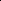

# Masked Clustering Prediction for Unsupervised Point Cloud Pre-training

<!-- Page 1 -->

Masked Clustering Prediction for Unsupervised Point Cloud Pre-training

Bin Ren1,2, Xiaoshui Huang3, Mengyuan Liu4, Hong Liu4, Fabio Poiesi5, Nicu Sebe1, Guofeng Mei5

1University of Trento, Italy 2University of Pisa, Italy 3Shanghai Jiao Tong University, China 4Peking University, China 5Fondazione Bruno Kessler, Italy gmei@fbk.eu

## Abstract

Vision transformers (ViTs) have recently been widely applied to 3D point cloud understanding, with masked autoencoding as the predominant pre-training paradigm. However, the challenge of learning dense and informative semantic features from point clouds via standard ViTs remains underexplored. We propose MaskClu, a novel unsupervised pre-training method for ViTs on 3D point clouds that integrates masked point modeling with clustering-based learning. MaskClu is designed to reconstruct both cluster assignments and cluster centers from masked point clouds, thus encouraging the model to capture dense semantic information. Additionally, we introduce a global contrastive learning mechanism that enhances instance-level feature learning by contrasting different masked views of the same point cloud. By jointly optimizing these complementary objectives, i.e., dense semantic reconstruction, and instance-level contrastive learning. MaskClu enables ViTs to learn richer and more semantically meaningful representations from 3D point clouds. We validate the effectiveness of MaskClu via multiple 3D tasks, including part segmentation, semantic segmentation, object detection, and classification, setting new competitive results.

## Introduction

Unsupervised pre-training has proven to be highly effective in enhancing point cloud understanding, sparking the development of numerous unsupervised methods (Mei et al. 2022b; Eckart et al. 2021; Liang et al. 2024; Zheng et al. 2024; Ma et al. 2025) specifically tailored for 3D point clouds. In general, unsupervised point cloud pre-training approaches can be categorized into three main types: contrastive learning (Grill et al. 2020), clustering-based learning (Mei et al. 2022a), and generative learning (Zheng et al. 2024). Contrastive learning (Rao, Lu, and Zhou 2020; Sanghi 2020) has shown remarkable success in recent point cloud representation tasks. Its core idea is to align representations with positive examples while pushing them away from negative ones, relying heavily on strong data augmentations and scaling effectively with large datasets.

Clustering-based methods (Mei et al. 2022b, 2024), which require minimal domain knowledge, have gained prominence in the pre-training of both 2D and 3D networks. These

Copyright © 2026, Association for the Advancement of Artificial Intelligence (www.aaai.org). All rights reserved.

Masking

Encoder

Point Reconstruct

Clustering Reconstruction

Aug. 1 Aug. 2

Encoder

Clustering

Cross Assign

Encoder

Masking

Encoder

(a) Point-MAE (b) Point-Clustering (c) MaskClu (Ours)

Decoder Decoder

**Figure 1.** The proposed MaskClu (c) combines the strengths of masked modeling (a) and clustering-based learning (b) to produce more informative representations.

approaches group similar feature embeddings and refine network parameters via pseudo-labels generated through clustering. Unlike contrastive learning, which primarily captures intra-object invariance, clustering methods enable the exploration of inter-object similarities (Zhan et al. 2020). On the generative side, methods such as autoencoders (Yang et al. 2018), adversarial generative networks (GAN) (Sarmad, Lee et al. 2019), and autoregressive models (Sun et al. 2020) have been effective in capturing the low-level properties of point clouds. In particular, masked autoencoders (e.g., Point-MAE (Liu, Cai, and Lee 2022), Point-M2AE (Zhang et al. 2022d)) pre-train point cloud ViTs by reconstructing masked point patches, and have outperformed contrastive learning as the state-of-the-art unsupervised approach.

However, MAEs optimize a point-level reconstruction objective that emphasizes spatial relationships in the learned features rather than capturing semantic information. In contrast, clustering methods focus on higher-level feature similarity, producing more semantically meaningful dense representations. This raises an interesting question: Can we combine the strengths of both masked modeling and clustering

Equal contribution: Bin Ren, Xiaoshui Huang. Corresponding author: Guofeng Mei.

The Fortieth AAAI Conference on Artificial Intelligence (AAAI-26)

AI-readable visual equivalent, added: Figure extracted from the paper PDF and converted to an SVG wrapper asset. Use the surrounding page text and caption for interpretation.

<!-- Page 2 -->

learning to achieve better representations? Moreover, considering that both local and global shape information are essential in 3D point cloud analysis, i.e., local information captures the overall structure, while local information provides the fine-grained details crucial for a detailed understanding.

These insights led us to develop MaskClu, a masked clustering prediction approach for unsupervised point cloud pretraining that combines the benefits of both masked modeling and clustering. Specifically, MaskClu applies a graph convolutional network (GCN) to reconstruct both clustering assignments and cluster centers from masked point clouds, enhancing semantic consistency. To further enrich the representations, we incorporate contrastive learning to capture global features effectively. Fig. 1 highlights the differences between MaskClu and prior SOTA solutions. Unlike Point- Clustering (Long et al. 2023), which clusters based solely on coordinates and supervises via cross-view feature similarity, MaskClu exploits both geometric and feature cues, and learns by reconstructing cluster assignments and centers, yielding more robust and semantic representations.

We assess the effectiveness of MaskClu on four benchmarks, including part segmentation, semantic segmentation, object detection, and classification (Chang et al. 2015; Armeni et al. 2016; Dai et al. 2017; Uy et al. 2019). MaskClu demonstrates strong cross-task transferability and delivers competitive performance on dense prediction benchmarks.

Our main contributions are summarized as follows: • We present a novel ViT-based unsupervised pretraining framework for 3D point clouds that unifies masked point modeling with clustering-based representation learning. • We introduce a cluster reconstruction objective that predicts both cluster assignments and centers from masked point clouds, enabling dense semantic feature learning. • We design an instance-level contrastive strategy by contrasting dual masked views to enhance the discriminability of learned representations. • Extensive experiments on multiple benchmarks demonstrate the superiority of our approach over prior state-ofthe-art unsupervised methods in dense prediction tasks.

## Related Work

Contrastive learning has become a prominent framework for unsupervised point cloud representation learning, aiming to maximize agreement between different augmentations of the same point cloud while minimizing similarity across distinct samples. Initially proposed for 2D images (Chen, Kornblith et al. 2020; Grill et al. 2020), it has been effectively extended to 3D data (Huang et al. 2021; Sanghi 2020; Rao, Lu, and Zhou 2020). For instance, Info3D (Sanghi 2020) optimizes mutual information between parts of a point cloud and its transformations to enhance representation quality. PointContrast (Xie et al. 2020) was an early milestone, followed by PointDisc (Liu et al. 2022), which improved feature consistency via geometric priors. Mask- Point (Liu, Cai, and Lee 2022) introduces a binary classification task to distinguish masked object points from noise, while ReCon (Qi et al. 2023) embeds contrastive objectives into generative pipelines to mitigate overfitting in ViT-based methods. Multimodal extensions further enrich this line of work: Jing et al. (Jing, Zhang, and Tian 2021) leverage 2D- 3D correspondences to boost discriminability, and CLIPinspired approaches such as ULIP (Xue et al. 2023) and PointCLIP (Zhang et al. 2022b) demonstrate the benefit of incorporating multimodal supervision (Radford et al. 2021). Despite these advances, contrastive methods often underperform when applied to point cloud ViTs. Clustering learning is an emerging unsupervised paradigm that discovers latent structures by grouping similar feature representations, where the resulting clusters are often used as pseudo-labels to guide representation learning. Deep- Cluster (Caron et al. 2018) iteratively refines representations by applying K-means to 2D features and using clusterbased pseudo-labels, and SL3D (Cendra et al. 2022) extends this idea to 3D via even-cluster sampling for higher-quality pseudo-labels in 3D recognition. SoftClu (Mei et al. 2022b) and CluRender (Mei et al. 2024) leverage clustering and differentiable rendering to extract discriminative features. PointClustering (Long et al. 2023) aligns clusters across different views of a point cloud to improve point- and instancelevel invariance, yielding a robust geometric–semantic modeling framework. However, clustering-based approaches in point cloud ViTs remain in an early stage. Generative models in unsupervised learning reconstruct point clouds from latent representations by encoding inputs into a feature space and decoding them back. FoldingNet (Yang et al. 2018) uses a graph-based encoder and a folding decoder to deform a 2D grid into a 3D shape, while Liu et al. (Liu, Han et al. 2019) extend it with a local-to-global autoencoder. GAN-based methods Panos et al. (Achlioptas, Diamanti et al. 2018) combined hierarchical Bayesian modeling with GANs to synthesize realistic 3D shapes. Inspired by MAE (He et al. 2022), Point- MAE (Pang et al. 2022) simplifies training via MAE. Point- M2AE (Zhang et al. 2022a) adopts a hierarchical design to capture multiscale geometric details, while GD-MAE (Yang et al. 2023) extends visible regions to reconstruct masked areas via a generative decoder. Multimodal integration further enriches representations: PiMAE (Chen et al. 2023) applies cross-modal masking to fuse visual and geometric cues. TAP (Wang et al. 2023) and Ponder (Huang et al. 2023) leverage 2D projections for pretraining. Joint- MAE (Guo et al. 2023) models 2D-3D interactions, and PointGPT (Chen et al. 2024) extends the GPT framework to point clouds. PointDif (Zheng et al. 2024) incorporates diffusion models (Ho, Jain, and Abbeel 2020; Wei et al. 2023) into MAE, while PointMamba (Liang et al. 2024) pioneers state space models (Gu, Goel, and R´e 2022) for point cloud pretraining. Despite progress, generative models remain sensitive to geometric transformations (i.e., rotation, translation) and struggle to reconstruct point clouds from invariant features, limiting their usefulness for downstream tasks.

## Methodology

Preliminary: Point Patch Embedding

We follow Point-BERT (Yu et al. 2022) by first dividing the input point cloud (P ∈RH×3, where H denotes

<!-- Page 3 -->

Mask1

Mask2

View 1:

View 2:

Shared

FPS & KNN

PointNet

Shared

Clustering Learning

Center Points Masked Token Visible Token Learnable Token

Predicted Token Token Dimension Concatenation Transformer Encoder Transformer Decoder

Geo-Semantic Adjacency Constructor Learnable Cls Token R Cluster Center Reconstruction

MinCut Clustering

R R

Adjacency

Matrix

MinCut Assignment

Matrix

Sinkhorn-Knop Sinkhorn-Knopp

Clustering Learning

MinCut Clustering

**Figure 2.** The architecture of the proposed MaskClu for unsupervised point cloud representation learning integrates local clustering and global contrasting. The former learns dense, fine-grained features, while the latter captures instance-level features.

the number of points) into irregular point patches via Farthest Point Sampling (i.e., FPS(·)) and K-Nearest Neighbors (i.e., KNN(·)). This outputs N center points C (C = FPS(P), C ∈RN×3) and the corresponding neighbor points Pi (Pi = KNN(P, C), P ∈RN×k×3) for each center point. Finally, a lightweight PointNet (Li et al. 2018) (denoted as PN(·)) is applied to the point patches to obtain the embedded tokens T = {T1, T2, · · ·, TN}, where T = PN(P) and T ∈RN×d, with d representing the feature dimension. These tokens are then sent to a standard ViT encoder.

Overview

To develop an unsupervised training approach for a standard ViT encoder, fφ: RrN×d →RrN×d, where r denotes the mask ratio in the MAE. fφ is designed to learn informative patch features (F = {fi = fφ(Ti)}N i=1) and a global representation fcls of P, ultimately benefiting downstream tasks. The pipeline of our MaskClu is presented in Fig. 2. We adopted a Siamese architecture (Grill et al. 2020; Chen and He 2021) to perform both patch-level local masked clustering learning and object-level global contrastive learning during unsupervised pre-taining. MaskClu begins by generating two randomly masked views, T a and T b, from the patched features T via two random masks, ma and mb. fφ is then applied to obtain the features [f a cls, Fb] and [f b cls, Fa]. Next, Fa and Fb, along with the learnable token T ma and T mb corresponding to the masked patches, are passed to a weight-sharing decoder dθ that reconstructs the full feature representations (Fa

R and Fb

R). These reconstructed features, combined with the center points C, are used for masked clustering learning, enhancing fφ’s ability in dense prediction tasks. Meanwhile, the feature pairs [f a cls, Fb] and [f b cls, Fa] are used for global contrastive learning, strengthening the global representation capabilities of fφ.

Masked Clustering Learning Traditional MAEs reconstruct masked points by aligning them with a fixed ground-truth shape (Liu, Cai, and Lee 2022; Ren et al. 2024). However, this ground truth corresponds to a single instance from a broader distribution, making optimization challenging and limiting the learning of rotation-invariant features. Furthermore, object-level MAEs often underperform on dense prediction tasks because their objective prioritizes exact geometry reconstruction over capturing higher-level semantic structures, resulting in poor generalization. In contrast, clustering can uncover latent structures by grouping similar feature representations, making it a powerful complement to MAE-based approaches. Yet, conventional clustering suffers from ambiguous group assignments, particularly when applied independently to geometric or semantic cues. While prior work has addressed these aspects in isolation, achieving joint geometric and semantic coherence remains an open challenge. Geo-semantic graph construction To improve clustering quality, we incorporate geometric cues alongside semantic features. Using only feature space can miss spatial relationships, e.g., symmetrical airplane wings may look similar in feature space but differ in spatial layout. By learning representations that are both semantically meaningful and geometrically consistent, our clustering better reflects the true structure of the scene. Given the reconstructed feature matrix FR ∈RN×D and the center point coordinates C ∈RN×3 of each point patch, we construct a geo-semantic graph G = {C, W} by performing Alg. 1, where W is an affinity matrix. Focusing on predetermined anchors, we build W by calculating Euclidean distances for spatial proximity, linking points to neighbors within a set radius, and in-

AI-readable visual equivalent, added: Figure extracted from the paper PDF and converted to an SVG wrapper asset. Use the surrounding page text and caption for interpretation.

AI-readable visual equivalent, added: Figure extracted from the paper PDF and converted to an SVG wrapper asset. Use the surrounding page text and caption for interpretation.

AI-readable visual equivalent, added: Figure extracted from the paper PDF and converted to an SVG wrapper asset. Use the surrounding page text and caption for interpretation.

AI-readable visual equivalent, added: Figure extracted from the paper PDF and converted to an SVG wrapper asset. Use the surrounding page text and caption for interpretation.

<!-- Page 4 -->

## Algorithm

1: Geo-Semantic Graph Construction Require: Center points C ∈RN×3, reconstructed features

FR ∈RN×D, neighbors k Ensure: Affinity matrix W ∈RN×N

1: Dis ←cdist(C, C) # Pairwise distance matrix 2: knn indices ←topk(Dis, k) # Indices of k nearest neighbors 3: Csim ←1 + FR · F⊤ R # Cosine similarity 4: W ←Csim⊙knn mask # Masked by top-k neighbors 5: W ←exp

Dis −Dis

⊙W with Disi = P j Disij # Weighted by pairwise distance

6: W ←W+W⊤ 2 # Symmetric matrix 7: W[i, i] ←0, ∀i # No self-loops 8: return W corporating cosine similarity in feature space. Weighted by spatial distances, the resulting W robustly combines spatial and semantic information for clustering. MinCut clustering uses FR and W from graph G to create semantically and geometrically coherent clusters, aggregating FR into K meaningful groups.

Specifically, we perform message passing to propagate information across connected nodes to refine FR, leveraging the geometric and semantic relationships in W by:

out = ReLU(W · WmFR) + WsFR, (1)

where Wm and Ws are learnable weight matrices for mixing and skip connections. The output out refines the characteristics of each node by integrating information from its local neighborhood, effectively capturing both semantic and spatial relationships. To establish clusters, we further transform this refined feature set to produce a score matrix S∈RN×K that assigns each node to one of K clusters:

S = sofmax (W2(ReLU(W1 · out))/τ), (2)

where W1 and W2 are learnable projection weights that control the transformation into cluster space, and τ is a temperature parameter that tunes the sharpness of the assignment distribution. Using the assignment scores in S, we then calculate the pooled center points ¯Cx = { ¯Cx j |j = 1, 2,..., K}, x ∈{a, b}, which represent the centroids of each cluster and provide a consolidated spatial representation of the clusters. Specifically, we aggregate the original center points into cluster centroids as follows:

¯Cx j = 1 PN i=1 Sx ij

N X i=1

S⊤ ijCi, ¯Cx j ∈RK×3. (3)

This step aggregates information from multiple nodes into compact representative points, where each row of ¯C corresponds to the center of a distinct cluster. Applying Min- Cut clustering on the geo-semantic graph produces a robust structure that mitigates semantic ambiguities while preserving geometric distinctions. This integration is beneficial for complex shapes in 3D scenes, resulting in a feature space that accurately reflects the data’s intrinsic structure. Cluster center reconstruction Unlike conventional MAE methods focused on reconstructing individual points, our approach focuses on the reconstruction of cluster centers (i.e., cluster centroids ¯C), based on the assumption that these centers should form a balanced and uniform partition of the point cloud. Focusing on centroids yields a more structured representation of the underlying geometry. The reconstruction objective for cluster centers is defined as:

Lcts = chamfer(Ca, ¯Cb) + chamfer(Cb, ¯Ca), (4)

where chamfer(·) denotes the Chamfer distance (see Supp. Mat. for details). This objective encourages consistent cluster center reconstruction across different masked versions of the same point cloud, reinforcing both geometric and semantic alignment. Reconstructing cluster centers instead of individual points, this method achieves a compact, high-level view of the data structure that aligns with the clustering objectives outlined in previous sections. Cluster assignment reconstruction To compute the final assignment of the cluster, we first derive the cluster assignment matrix Γ, which reflects the probability that each node will be assigned to each cluster, balancing the semantic and geometric information captured through the previous graph construction and message passing steps. Assuming that each point cloud is divided into approximately equal-sized partitions of

N

K elements, we minimize the distance between each point Cx i and its assigned cluster centroid ¯Cy j, subject to balanced assignments across clusters, i.e.:

min

Γ

1 N

N X i=1

K X j=1

∥Cx i −¯Cy j ∥2

2Γxy ij, s.t. Γxy⊤1N = 1

K 1K, Γ1xy

K = 1

N 1N,

(5)

where x=a, y=b or x=b, y=a. This constraint enforces equal distribution of points across clusters, aligning each node with its most suitable cluster centroid.

To ensure consistency between bidirectional assignments, we define the following loss function:

Lass=−1

N

N,K X i,j=1 stop(Γab ij) log sab ij +stop(Γba ij) log sba ij, (6)

where stop(·) halts gradient propagation during backpropagation for stability. By minimizing Lass, the assignment of the cluster is refined and reconstructed, ensuring the alignment between the geometric and semantic spaces.

Global Contrastive Constraint We devise the proposed global unsupervised learning based on SimSiam (Chen and He 2021). As shown in Fig. 2, our architecture processes two randomly masked views, T a and T b, derived from a single set of point patch embeddings T. The contrastive learning paradigm in MaskClu is outlined in Alg. 2, where Lcontras denotes the contrastive loss.

Optimization Objectives By considering both the masked clustering and contrastive learning, the standard ViTs encoder can be pretrained by minimizing the following objectives:

Ltotal = Lass + Lcts + Lcontras. (7)

<!-- Page 5 -->

## Algorithm

2: Contrastive PyTorch-like Pseudocode 1 # fφ: backbone 2 # h: max-pooling operation 3 for x in loader: # load a batch x with n samples 4 T a, T b = aug(T), aug(T) # random mask aug [f a cls, Fa], [f b cls, Fb] = fφ(T a), fφ(T b) 6 za, zb = pooling(Fa), pooling(Fb) 7 L = D(f a cls, zb) + D(f b cls, za) # loss 8 L.backward() # back-propagate 9 update(fφ) # SGD update 10 11 def D(f, z): # negative cosine similarity 12 z = z.detach() # stop gradient 13 s1= cos(f, z) 14 f = f.detach() 15 z = z.requires_grad_() # re-enable gradient 16 s2= cos(f, z) 17 return (2 - s1 - s2).sum(dim=1).mean()

## Experiments

In this section, we first validated MaskClu on 4 downstream tasks, and then present the ablation analysis. The implementation and other details are provided in our Supplementary Materials (Supp. Mat.).

Downstream tasks We assess the efficacy of our method by fine-tuning our pretrained models on several downstream tasks, i.e., part segmentation, semantic segmentation, classification, and fewshot learning. We compare MaskClu with existing methods with Point Trans. (Engel, Belagiannis, and Dietmayer 2021), PCT (Sauder and Sievers 2019), PointVit-OcCo (Wang et al. 2021), Point-BERT (Yu et al. 2022), MaskPoint (Liu, Cai, and Lee 2022), Point-MAE (Pang et al. 2022), Point- M2AE (Zhang et al. 2022a), Point-MA2E (Zhang et al. 2022d), Point-CMAE (Ren et al. 2024), OcCo (Wang et al. 2021), and CrossPoint (Afham et al. 2022). Part segmentation. Since one component of MaskClu involves clustering, which tends to capture regional semantic information, we initially assess our pre-trained models on part segmentation tasks. We evaluate the segmentation performance of the proposed MaskClu on the ShapeNet- Part dataset (Chang et al. 2015), The segmentation head used in our method follows the design of Point-MAE, remaining relatively simple without employing any propagating operations (Qi, Yi et al. 2017) or DGCNN (Wang et al. 2019). Following PointM2AE (Pang et al. 2022), we extract features from the 4th, 8th, and 12th layers of the Transformer block and concatenate these multi-level features to form the final representation. The mean intersection over union across all categories, i.e., mIoUC (%), and the mean IoU across all instances, i.e., mIoUI (%), are reported. Tab. 1 (Part Seg.) presents the part segmentation results of MaskClu compared to alternative approaches on ShapeNetPart. MaskClu outperforms all other methods in terms of mIoU with a standard ViTs architecture. With MaskClu, we achieve the highest mIoUI of 87.4%, surpassing the second best method (CluRender) by 0.5%. Furthermore, MaskClu reaches 85.6% in mIoUC, outperforming Point-FEMAE and other competitive baselines. These results highlight the superior performance of MaskClu in part

## Methods

Part Seg. Semantic Seg. mIoUC mIoUI mAcc mIoU with single-modal self-Supervised Learning

Scratch 83.4 84.7 68.6 60.0 Point-BERT (Yu et al. 2022) 84.1 85.6 - - MaskPoint (Liu, Cai, and Lee 2022) 84.4 86.0 - - Point-MAE (Pang et al. 2022) 84.2 86.1 69.9 60.8 Point-M2AE (Zhang et al. 2022d) - 86.4 - - PointGPT (Chen et al. 2024) 84.1 86.2 - - Point-FEMAE (Zha et al. 2024) 84.9 86.3 - - SoftClu (Mei et al. 2022b) - 86.1 - 61.6 MaskSurf (Zhang et al. 2022c) 84.6 86.1 69.9 61.6 Point-CMAE (Ren et al. 2024) 84.9 86.0 - - PCP-MAE (Zhang, Zhang, and Yan 2024) 84.9 86.1 71.0 61.3 MaskClu (Ours) 85.2 86.4 71.3 62.1 with hierarchical/multimodal/self-supervised learning

Point-M2AE (Zhang et al. 2022a) 84.8 86.5 - - CrossPoint (Afham et al. 2022) - 85.5 - - CluRender (Mei et al. 2024) - 86.9 - 62.6 PointGPT-L (Chen et al. 2024) 84.8 86.6 - - ACT (Dong et al. 2022) 84.7 86.1 - - ReCon (Qi et al. 2023) 84.8 86.4 71.1 61.2 PointClustering (Long et al. 2023) - 86.7 - 65.6 MaskClu (Ours) 85.6 87.4 72.2 66.4

**Table 1.** Segmentation results on ShapeNetPart and S3DIS Area 5. mIoUC (%) and mIoUI (%) for Part Segmentation, and mAcc (%) and mIoU (%) for Semantic Segmentation.

segmentation. The qualitative results in Fig. 3 indicate that compared to GT or PointMAE, our method produced consistent predictions across various object categories, especially for complex shapes like chairs or motorcycls. Semantic segmentation involves classifying each point in 3D scenes according to its semantic category. Specifically, we assess MaskClu via using the S3DIS benchmark dataset (Armeni et al. 2016). Following the pre-processing, post-processing, and training protocols in (Wang et al. 2021), we divide each room into 1 m × 1 m blocks and use 4,096 points as input to the model. We fine-tune the pre-trained model on Areas [1, 2, 3, 4, 6], and evaluate it on Area 5. Tab. 1 (Semantic Seg.) presents the semantic segmentation results of MaskClu compared with other methods on Area 5 of the S3DIS dataset. We report the overall accuracy (OA) and mean class intersection over union (mIoU). MaskClu outperforms all single-modal selfsupervised learning approaches, achieving the best mAcc of 72.2% and mIoU of 66.3%. Specifically, MaskClu surpasses the second-best method, PointClustering (Long et al. 2023), by 0.9% in mIoU and ReCon (Qi et al. 2023), by 1.1% in mAcc, demonstrating its superiority in semantic segmentation. These results demonstrate the robust generalizability and consistent accuracy of MaskClu in handling complex, diverse scenes—even without multi-modal input. 3D object detection. We adopt 3DETR (Misra, Girdhar, and Joulin 2021) as our baseline, and follow MaskPoint (Liu, Cai, and Lee 2022) by replacing the 3DETR encoder with our pre-trained encoder, then fine-tuning on ScanNetV2 (Dai et al. 2017) for a fair comparison. Unlike MaskPoint and

<!-- Page 6 -->

Ground Truth Point-MAE MaskClu (Ours)

**Figure 3.** Part segmentation results on ShapeNet (Chang et al. 2015) comparing MaskClu(bottom row) using the ViT encoder with PointMAE and ground-truth annotations (top row). Red dashed boxes highlight areas where segmentation failed.

## Methods

Pre Dataset AP25 AP50

Scratch - 62.1 37.9 Point-BERT (Yu et al. 2022) ScanNet 61.0 38.3 MaskPoint (Liu, Cai, and Lee 2022) ScanNet 63.4 40.6 MaskClu (Ours) ShapeNet 63.9 41.4

MaskPoint (12 Enc) (Liu, Cai, and Lee 2022) ScanNet 64.2 42.1 MaskClu (Ours, 12 Enc) ShapeNet 65.0 43.2

**Table 2.** 3D object detection on ScanNet validation set.

Point-BERT, which are pre-trained on the ScanNet-Medium dataset (within the same domain as ScanNetV2), our method is pre-trained only on ShapeNet and fine-tuned on the Scan- NetV2 training set. As shown in Tab. 2, MaskClu achieves an AP50 of 41.4, outperforming Point-BERT by 3.1% and MaskPoint by 0.8% in AP50. Additionally, with a 12-layer encoder, MaskClu reaches an AP50 of 43.2, which represents an improvement of 1.1% over MaskPoint’s AP50 of 42.1. These results shows that MaskClu provides strong transferability for 3D scene understanding tasks. Object Classification on Real Dataset. We assess MaskClu on the ScanObjectNN dataset (Uy, Pham et al. 2019), which consists of 3 subsets: OBJBG (objects with background), OBJONLY (objects without background), and PBT50RS (objects with background and artificially applied perturbations). To ensure comparison fairness, we report the results without a voting strategy (Liu, Fan et al. 2019), and each input point cloud is sampled to 2048 points. Tab. 3 shows that MaskClu achieves competitive performance: 1) With Full Tuning: MaskClu outperforms nearly all baseline methods across all subsets, achieving 90.88% on OBJBG, 90.36% on OBJONLY, and 87.12% on PBT50RS without data augmentation, surpassing Point-MAE and Point-CMAE in these settings. Compared to MaskPoint, MaskClu shows a significant improvement, especially on PBT50RS, with a 1.17% increase in accuracy. Once fine-tuned with rotation data augmentation (used by ACT (Dong et al. 2022) and Point-

## Method

#Params(M)

DA

OBJBG

OBJONLY

PBT50RS with standard ViTs and single-modal (FULL)

Scratch 22.1 × 79.86 80.55 77.24 OcCo (Wang et al. 2021) 22.1 × 84.85 85.54 78.79 Point-BERT (Yu et al. 2022) 22.1 × 87.43 88.12 83.07 MaskPoint (Liu, Cai, and Lee 2022) 22.1 × 89.30 88.10 84.30 Point-MAE (Pang et al. 2022) 22.1 × 90.02 88.29 85.18 Point-CMAE (Ren et al. 2024) 22.1 × 90.02 88.64 85.95 MaskClu (Ours) 22.1 × 90.88 90.36 87.12 Point-CMAE (Ren et al. 2024) 22.1 ✓ 93.46 91.05 88.75 PointClustering (Long et al. 2023) 22.1 ✓ - - 87.30 PointGPT-S (Chen et al. 2024) 29.2 ✓ 93.39 92.43 89.17 MaskClu (Ours) 22.1 ✓ 93.59 92.04 89.28 with hierarchical ViTs/multi-modal/post-process (FULL)

Point-M2AE (Zhang et al. 2022a) 15.3 × 91.22 88.81 86.43 Joint-MAE (Guo et al. 2023) - × 90.94 88.86 86.07 ACT (Dong et al. 2022) 22.1 ✓ 93.29 91.91 88.21 with standard ViTs and single-modal (MLP-LINEAR)

Point-MAE (Pang et al. 2022) 22.1 × 82.58 83.52 73.08 Point-CMAE (Ren et al. 2024) 22.1 × 83.48 83.45 73.15 MaskClu (Ours) 22.1 × 84.18 84.34 76.79 with standard ViTs and single-modal (MLP-3)

Point-MAE (Pang et al. 2022) 22.1 × 84.29 85.24 77.34 Point-CMAE (Ren et al. 2024) 22.1 × 85.88 85.60 77.47 MaskClu (Ours) 22.1 × 87.44 86.92 79.88

**Table 3.** Classification results on ScanObjectNN. DA indicates the use of rotation data augmentation during finetuning. The overall accuracy (OA, %) is reported.

GPT (Chen et al. 2024)), MaskClu achieves state-of-the-art performance of 93.59% on OBJBG, 92.04% on OBJONLY, and 89.28% on PBT50RS, outperforming ACT by 0.3% on OBJBG and by 1.07% on PBT50RS. 2) With MLP-Linear

AI-readable visual equivalent, added: Figure extracted from the paper PDF and converted to an SVG wrapper asset. Use the surrounding page text and caption for interpretation.

AI-readable visual equivalent, added: Figure extracted from the paper PDF and converted to an SVG wrapper asset. Use the surrounding page text and caption for interpretation.

AI-readable visual equivalent, added: Figure extracted from the paper PDF and converted to an SVG wrapper asset. Use the surrounding page text and caption for interpretation.

AI-readable visual equivalent, added: Figure extracted from the paper PDF and converted to an SVG wrapper asset. Use the surrounding page text and caption for interpretation.

AI-readable visual equivalent, added: Figure extracted from the paper PDF and converted to an SVG wrapper asset. Use the surrounding page text and caption for interpretation.

AI-readable visual equivalent, added: Figure extracted from the paper PDF and converted to an SVG wrapper asset. Use the surrounding page text and caption for interpretation.

AI-readable visual equivalent, added: Figure extracted from the paper PDF and converted to an SVG wrapper asset. Use the surrounding page text and caption for interpretation.

AI-readable visual equivalent, added: Figure extracted from the paper PDF and converted to an SVG wrapper asset. Use the surrounding page text and caption for interpretation.

AI-readable visual equivalent, added: Figure extracted from the paper PDF and converted to an SVG wrapper asset. Use the surrounding page text and caption for interpretation.

AI-readable visual equivalent, added: Figure extracted from the paper PDF and converted to an SVG wrapper asset. Use the surrounding page text and caption for interpretation.

AI-readable visual equivalent, added: Figure extracted from the paper PDF and converted to an SVG wrapper asset. Use the surrounding page text and caption for interpretation.

AI-readable visual equivalent, added: Figure extracted from the paper PDF and converted to an SVG wrapper asset. Use the surrounding page text and caption for interpretation.

AI-readable visual equivalent, added: Figure extracted from the paper PDF and converted to an SVG wrapper asset. Use the surrounding page text and caption for interpretation.

AI-readable visual equivalent, added: Figure extracted from the paper PDF and converted to an SVG wrapper asset. Use the surrounding page text and caption for interpretation.

AI-readable visual equivalent, added: Figure extracted from the paper PDF and converted to an SVG wrapper asset. Use the surrounding page text and caption for interpretation.

AI-readable visual equivalent, added: Figure extracted from the paper PDF and converted to an SVG wrapper asset. Use the surrounding page text and caption for interpretation.

AI-readable visual equivalent, added: Figure extracted from the paper PDF and converted to an SVG wrapper asset. Use the surrounding page text and caption for interpretation.

AI-readable visual equivalent, added: Figure extracted from the paper PDF and converted to an SVG wrapper asset. Use the surrounding page text and caption for interpretation.

AI-readable visual equivalent, added: Figure extracted from the paper PDF and converted to an SVG wrapper asset. Use the surrounding page text and caption for interpretation.

AI-readable visual equivalent, added: Figure extracted from the paper PDF and converted to an SVG wrapper asset. Use the surrounding page text and caption for interpretation.

AI-readable visual equivalent, added: Figure extracted from the paper PDF and converted to an SVG wrapper asset. Use the surrounding page text and caption for interpretation.

AI-readable visual equivalent, added: Figure extracted from the paper PDF and converted to an SVG wrapper asset. Use the surrounding page text and caption for interpretation.

AI-readable visual equivalent, added: Figure extracted from the paper PDF and converted to an SVG wrapper asset. Use the surrounding page text and caption for interpretation.

AI-readable visual equivalent, added: Figure extracted from the paper PDF and converted to an SVG wrapper asset. Use the surrounding page text and caption for interpretation.

<!-- Page 7 -->

**Figure 4.** 4 detection results on ScanNet. Red: GT; Blue: predictions. Zoom in for better view. The model robustly handles complex 3D scenes with diverse structures and layouts.

Loss Lcontra(1) Lass(2) Lcts(3) (1, 2) (2, 3) (1, 3) (1, 2, 3)

PBT50RS 86.1 86.5 84.3 86.6 86.9 86.4 87.1

**Table 4.** Ablation study on the impact of joint learning.

#Cluster 2 4 8 16 24 32

PBT50RS 85.46 86.32 86.36 86.71 87.12 86.99

**Table 5.** Ablation on clustering number.

and MLP-3 Fine-Tuning: In both MLP-Linear and MLP- 3 settings, MaskClu demonstrates strong generalization. It achieves 84.18% on OBJBG, 84.34% on OBJONLY, and 76.79% on PBT50RS in MLP-Linear, and 87.44% on OB- JBG, 86.92% on OBJONLY, and 79.88% on PBT50RS with MLP-3. These results highlight the effectiveness of our pretraining, with MaskClu achieving robust performance on ScanObjectNN by capturing both shape and semantic details across diverse objects. More comparisons, including classification and few-shot learning on the synthetic ModelNet40 dataset (Wu, Song et al. 2015), are provided in Supp. Mat.

Ablation study

Pretraining results. We aim to learn dense features via pretraining without altering the ViT encoder. To evaluate the effectiveness of our cluster-assignment reconstruction, we visualize the pretrained patch features propagated to points using Superpoint-Aware Feature Propagation (Mei et al. 2025), and color them via PCA projection (Fig. 5). The resulting visualizations show coherent, semantically meaningful regions (e.g., airplane wings, chair legs) with preserved geometric boundaries, indicating that our pretrained encoder captures both local geometry and object-level structure. Impact of the joint learning. To evaluate the effectiveness of our joint learning objective in MaskClu, we examined the individual and combined contributions of global contrast and local clustering. We trained the network under different configurations such as: (i) using only global contrast (Lcontra), (ii) using only local clustering with 24 clusters (Lass), and (iii) combining both global contrast and local clustering (Lcontra + Lass + Lcts). The results on the PB-T50-RS subset are presented in Tab. 4. Local clustering alone achieved strong performance, underscoring the importance of spatial information in feature learning. However, the joint approach, which integrates global and local clustering, yielded the best performance with an accuracy of 87.12%, demonstrating the advantage of our combined objective for comprehensive feature representation.

**Figure 5.** Visualization of learned representations. Points are color-coded based on the PCA projection of propagated features from the pre-trained encoder. Distinct colors correspond to different feature clusters.

Scratch MaskClu(SH) MaskClu(SC) MaskPoint (SC) Point-BERT (SC)

AP25 AP50 AP25 AP50 AP25 AP50 AP25 AP50 AP25 AP50

62.1 37.9 63.9 41.4 64.4 41.8 63.4 40.6 61.0 38.3

**Table 6.** Comparison of pretraining datasets. Performance of MaskClu pre-trained on ShapeNet (SH) and ScanNet (SC).

Number of clusters. We began by evaluating the impact of varying the number of groups in our method, adjusting K from 2 to 32. As shown in Tab. 5, classification performance on the ScanObjectNN PBT50RS subset improves as the number of clusters increases, peaking at 24 clusters with an accuracy of 87.12%. Beyond this, performance stabilizes, indicating that 24 clusters provide an optimal balance between granularity and feature richness. Comparison of pretraining on ShapeNet and ScanNet. To evaluate the effect of different pretraining datasets, we pre-trained MaskClu on both ShapeNet (SH) and Scan- Net (SC). Tab. 6 reports detection performance in terms of AP25 and AP50, comparing our method with two strong baselines–MaskPoint and Point-BERT–both pre-trained on ScanNet. Our method achieves the highest accuracy when pre-trained on ScanNet, reaching 64.4 AP25 and 41.8 AP50, which surpasses all competing methods. Even when pretrained on ShapeNet, MaskClu still outperforms both Mask- Point and Point-BERT, demonstrating strong generalization across object-centric and scene-centric datasets. These results highlight the robustness of our approach and confirm that our pretraining strategy effectively leverages diverse data sources for downstream tasks. More ablation studies and detailed analysis are provided in the Supp. Mat..

## Conclusion

This paper presented MaskClu, a novel approach for unsupervised point cloud representation learning that leverages deep clustering within a ViT framework. MaskClu captures both geometric structure and semantic content by integrating masked point modeling with clustering-based learning, effectively reconstructing dense semantic features. To enhance instance-level understanding, we introduced a global contrastive learning mechanism that contrasts different masked views of the same point cloud, encouraging ViTs to learn richer, more informative representations. Our findings underscore the potential of clustering-based methods in point cloud pretraining, providing a promising pathway for more robust and semantically meaningful 3D feature learning.

AI-readable visual equivalent, added: Figure extracted from the paper PDF and converted to an SVG wrapper asset. Use the surrounding page text and caption for interpretation.

AI-readable visual equivalent, added: Figure extracted from the paper PDF and converted to an SVG wrapper asset. Use the surrounding page text and caption for interpretation.

AI-readable visual equivalent, added: Figure extracted from the paper PDF and converted to an SVG wrapper asset. Use the surrounding page text and caption for interpretation.

AI-readable visual equivalent, added: Figure extracted from the paper PDF and converted to an SVG wrapper asset. Use the surrounding page text and caption for interpretation.

AI-readable visual equivalent, added: Figure extracted from the paper PDF and converted to an SVG wrapper asset. Use the surrounding page text and caption for interpretation.

AI-readable visual equivalent, added: Figure extracted from the paper PDF and converted to an SVG wrapper asset. Use the surrounding page text and caption for interpretation.

AI-readable visual equivalent, added: Figure extracted from the paper PDF and converted to an SVG wrapper asset. Use the surrounding page text and caption for interpretation.

AI-readable visual equivalent, added: Figure extracted from the paper PDF and converted to an SVG wrapper asset. Use the surrounding page text and caption for interpretation.

AI-readable visual equivalent, added: Figure extracted from the paper PDF and converted to an SVG wrapper asset. Use the surrounding page text and caption for interpretation.

AI-readable visual equivalent, added: Figure extracted from the paper PDF and converted to an SVG wrapper asset. Use the surrounding page text and caption for interpretation.

AI-readable visual equivalent, added: Figure extracted from the paper PDF and converted to an SVG wrapper asset. Use the surrounding page text and caption for interpretation.

AI-readable visual equivalent, added: Figure extracted from the paper PDF and converted to an SVG wrapper asset. Use the surrounding page text and caption for interpretation.

AI-readable visual equivalent, added: Figure extracted from the paper PDF and converted to an SVG wrapper asset. Use the surrounding page text and caption for interpretation.

AI-readable visual equivalent, added: Figure extracted from the paper PDF and converted to an SVG wrapper asset. Use the surrounding page text and caption for interpretation.

<!-- Page 8 -->

## Acknowledgements

This work was supported by PNRR FAIR - Future AI Research (PE00000013), the EU Horizon project “ELIAS - European Lighthouse of AI for Sustainability” (No. 101120237), and the FIS project GUIDANCE (Debugging Computer Vision Models via Controlled Cross-modal Generation) (No. FIS2023-03251). Partially supported by Hunan Natural Science Foundation Project (No. 2025JJ50338) and Shanghai Education Committee AI Project(No. JWAIYB-2).

## References

Achlioptas, P.; Diamanti, O.; et al. 2018. Learning representations and generative models for 3d point clouds. In ICML, 40–49. Afham, M.; Dissanayake, I.; Dissanayake, D.; Dharmasiri, A.; Thilakarathna, K.; and Rodrigo, R. 2022. Crosspoint: Self-supervised cross-modal contrastive learning for 3d point cloud understanding. In CVPR, 9902–9912. Armeni, I.; Sener, O.; Zamir, A. R.; Jiang, H.; Brilakis, I.; Fischer, M.; and Savarese, S. 2016. 3D Semantic Parsing of Large-Scale Indoor Spaces. In CVPR. Caron, M.; Bojanowski, P.; Joulin, A.; and Douze, M. 2018. Deep clustering for unsupervised learning of visual features. In ECCV, 132–149. Cendra, F. J.; Ma, L.; Shen, J.; and Qi, X. 2022. SL3D: Selfsupervised-Self-labeled 3D Recognition. arXiv preprint arXiv:2210.16810. Chang, A. X.; Funkhouser, T.; Guibas, L.; Hanrahan, P.; Huang, Q.; Li, Z.; Savarese, S.; Savva, M.; Song, S.; Su, H.; et al. 2015. Shapenet: An information-rich 3d model repository. arXiv preprint arXiv:1512.03012. Chen, A.; Zhang, K.; Zhang, R.; Wang, Z.; Lu, Y.; Guo, Y.; and Zhang, S. 2023. Pimae: Point cloud and image interactive masked autoencoders for 3d object detection. In CVPR, 5291–5301. Chen, G.; Wang, M.; Yang, Y.; Yu, K.; Yuan, L.; and Yue, Y. 2024. Pointgpt: Auto-regressively generative pre-training from point clouds. NeurIPS, 36. Chen, T.; Kornblith, S.; et al. 2020. A simple framework for contrastive learning of visual representations. ICML. Chen, X.; and He, K. 2021. Exploring Simple Siamese Representation Learning. In CVPR. Dai, A.; Chang, A. X.; Savva, M.; Halber, M.; Funkhouser, T.; and Nießner, M. 2017. Scannet: Richly-annotated 3d reconstructions of indoor scenes. In CVPR, 5828–5839. Dong, R.; Qi, Z.; Zhang, L.; Zhang, J.; Sun, J.; Ge, Z.; Yi, L.; and Ma, K. 2022. Autoencoders as cross-modal teachers: Can pretrained 2d image transformers help 3d representation learning? arXiv preprint arXiv:2212.08320. Eckart, B.; Yuan, W.; Liu, C.; and Kautz, J. 2021. Selfsupervised learning on 3d point clouds by learning discrete generative models. In CVPR, 8248–8257. Engel, N.; Belagiannis, V.; and Dietmayer, K. 2021. Point transformer. IEEE access, 9: 134826–134840.

Grill, J.-B.; Strub, F.; Altch´e, F.; Tallec, C.; Richemond, P. H.; Buchatskaya, E.; Doersch, C.; Pires, B. A.; Guo, Z. D.; Azar, M. G.; et al. 2020. Bootstrap your own latent: A new approach to self-supervised learning. In NeurIPS. Gu, A.; Goel, K.; and R´e, C. 2022. Efficiently Modeling Long Sequences with Structured State Spaces. In ICLR. Guo, Z.; Zhang, R.; Qiu, L.; Li, X.; and Heng, P.-A. 2023. Joint-MAE: 2D-3D joint masked autoencoders for 3D point cloud pre-training. In IJCAI, 791–799. He, K.; Chen, X.; Xie, S.; Li, Y.; Doll´ar, P.; and Girshick, R. 2022. Masked autoencoders are scalable vision learners. In CVPR, 16000–16009. Ho, J.; Jain, A.; and Abbeel, P. 2020. Denoising diffusion probabilistic models. NeurIPS, 33: 6840–6851. Huang, D.; Peng, S.; He, T.; Yang, H.; Zhou, X.; and Ouyang, W. 2023. Ponder: Point cloud pre-training via neural rendering. In CVPR, 16089–16098. Huang, S.; Xie, Y.; Zhu, S.-C.; and Zhu, Y. 2021. Spatiotemporal self-supervised representation learning for 3d point clouds. In CVPR, 6535–6545. Jing, L.; Zhang, L.; and Tian, Y. 2021. Self-supervised feature learning by cross-modality and cross-view correspondences. In CVPR, 1581–1591. Li, C.-L.; Zaheer, M.; Zhang, Y.; Poczos, B.; and Salakhutdinov, R. 2018. Point cloud gan. CoRR, abs/1810.05795. Liang, D.; Zhou, X.; Xu, W.; Zhu, X.; Zou, Z.; Ye, X.; Tan, X.; and Bai, X. 2024. PointMamba: A Simple State Space Model for Point Cloud Analysis. In NeurIPS. Liu, F.; Lin, G.; Foo, C.-S.; Joshi, C. K.; and Lin, J. 2022. Point Discriminative Learning for Data-efficient 3D Point Cloud Analysis. In 3DV, 42–51. IEEE. Liu, H.; Cai, M.; and Lee, Y. J. 2022. Masked discrimination for self-supervised learning on point clouds. In ECCV, 657– 675. Springer. Liu, X.; Han, Z.; et al. 2019. L2g auto-encoder: Understanding point clouds by local-to-global reconstruction with hierarchical self-attention. In ACM MM, 989–997. Liu, Y.; Fan, B.; et al. 2019. Relation-shape convolutional neural network for point cloud analysis. In CVPR, 8895– 8904. Long, F.; Yao, T.; Qiu, Z.; Li, L.; and Mei, T. 2023. Point- Clustering: Unsupervised Point Cloud Pre-Training Using Transformation Invariance in Clustering. In CVPR, 21824– 21834. Ma, Q.; Li, Y.; Ren, B.; Sebe, N.; Konukoglu, E.; Gevers, T.; Van Gool, L.; and Paudel, D. P. 2025. ShapeSplat: A Largescale Dataset of Gaussian Splats and Their Self-Supervised Pretraining. In 3DV. Mei, G.; Huang, X.; Liu, J.; Zhang, J.; and Wu, Q. 2022a. Unsupervised point cloud pre-training via contrasting and clustering. In ICIP, 66–70. IEEE. Mei, G.; Ren, B.; Liu, J.; Riz, L.; Huang, X.; Zheng, X.; Gong, Y.; Yang, M.-H.; Sebe, N.; and Poiesi, F. 2025. Self- Supervised and Generalizable Tokenization for CLIP-Based 3D Understanding. arXiv:2505.18819.

<!-- Page 9 -->

Mei, G.; Saltori, C.; Poiesi, F.; Zhang, J.; Ricci, E.; Sebe, N.; and Wu, Q. 2022b. Data augmentation-free unsupervised learning for 3d point cloud understanding. BMVC. Mei, G.; Saltori, C.; Ricci, E.; Sebe, N.; Wu, Q.; Zhang, J.; and Poiesi, F. 2024. Unsupervised Point Cloud Representation Learning by Clustering and Neural Rendering. IJCV, 1–19. Misra, I.; Girdhar, R.; and Joulin, A. 2021. An end-to-end transformer model for 3d object detection. In CVPR, 2906– 2917. Pang, Y.; Wang, W.; Tay, F. E.; Liu, W.; Tian, Y.; and Yuan, L. 2022. Masked autoencoders for point cloud selfsupervised learning. In ECCV, 604–621. Springer. Qi, C. R.; Yi, L.; et al. 2017. Pointnet++: Deep hierarchical feature learning on point sets in a metric space. In NeurIPS, 5099–5108. Qi, Z.; Dong, R.; Fan, G.; Ge, Z.; Zhang, X.; Ma, K.; and Yi, L. 2023. Contrast with reconstruct: Contrastive 3d representation learning guided by generative pretraining. In ICML, 28223–28243. PMLR. Radford, A.; Kim, J. W.; Hallacy, C.; Ramesh, A.; Goh, G.; Agarwal, S.; Sastry, G.; Askell, A.; Mishkin, P.; Clark, J.; et al. 2021. Learning transferable visual models from natural language supervision. In ICML, 8748–8763. PMLR. Rao, Y.; Lu, J.; and Zhou, J. 2020. Global-Local Bidirectional Reasoning for Unsupervised Representation Learning of 3D Point Clouds. In CVPR. Ren, B.; Mei, G.; Paudel, D. P.; Wang, W.; Li, Y.; Liu, M.; Cucchiara, R.; Van Gool, L.; and Sebe, N. 2024. Bringing masked autoencoders explicit contrastive properties for point cloud self-supervised learning. In ACCV. Sanghi, A. 2020. Info3D: Representation Learning on 3D Objects using Mutual Information Maximization and Contrastive Learning. In ECCV, 626–642. Springer. Sarmad, M.; Lee, H. J.; et al. 2019. Rl-gan-net: A reinforcement learning agent controlled gan network for real-time point cloud shape completion. In CVPR, 5898–5907. Sauder, J.; and Sievers, B. 2019. Self-Supervised Deep Learning on Point Clouds by Reconstructing Space. In NeurIPS, 12942–12952. Sun, Y.; Wang, Y.; Liu, Z.; et al. 2020. Pointgrow: Autoregressively learned point cloud generation with self-attention. In WACV, 61–70. Uy, M. A.; Pham, Q.-H.; Hua, B.-S.; Nguyen, T.; and Yeung, S.-K. 2019. Revisiting point cloud classification: A new benchmark dataset and classification model on real-world data. In CVPR, 1588–1597. Uy, M. A.; Pham, Q.-H.; et al. 2019. Revisiting point cloud classification: A new benchmark dataset and classification model on real-world data. In ICCV, 1588–1597. Wang, H.; Liu, Q.; Yue, X.; Lasenby, J.; and Kusner, M. J. 2021. Unsupervised point cloud pre-training via occlusion completion. In CVPR, 9782–9792. Wang, Y.; Sun, Y.; Liu, Z.; Sarma, S. E.; Bronstein, M. M.; and Solomon, J. M. 2019. Dynamic graph cnn for learning on point clouds. ACM TOG, 38(5): 1–12.

Wang, Z.; Yu, X.; Rao, Y.; Zhou, J.; and Lu, J. 2023. Take- A-Photo: 3D-to-2D Generative Pre-training of Point Cloud Models. In CVPR, 5640–5650. Wei, C.; Mangalam, K.; Huang, P.-Y.; Li, Y.; Fan, H.; Xu, H.; Wang, H.; Xie, C.; Yuille, A.; and Feichtenhofer, C. 2023. Diffusion models as masked autoencoders. In CVPR, 16284–16294. Wu, Z.; Song, S.; et al. 2015. 3d shapenets: A deep representation for volumetric shapes. In CVPR, 1912–1920. Xie, S.; Gu, J.; Guo, D.; Qi, C. R.; Guibas, L.; and Litany, O. 2020. Pointcontrast: Unsupervised pre-training for 3d point cloud understanding. In ECCV, 574–591. Springer. Xue, L.; Gao, M.; Xing, C.; Mart´ın-Mart´ın, R.; Wu, J.; Xiong, C.; Xu, R.; Niebles, J. C.; and Savarese, S. 2023. ULIP: Learning a unified representation of language, images, and point clouds for 3D understanding. In CVPR, 1179–1189. Yang, H.; He, T.; Liu, J.; Chen, H.; Wu, B.; Lin, B.; He, X.; and Ouyang, W. 2023. GD-MAE: generative decoder for MAE pre-training on lidar point clouds. In CVPR, 9403– 9414. Yang, Y.; Feng, C.; Shen, Y.; and Tian, D. 2018. Foldingnet: Point cloud auto-encoder via deep grid deformation. In CVPR, 206–215. Yu, X.; Tang, L.; Rao, Y.; Huang, T.; Zhou, J.; and Lu, J. 2022. Point-bert: Pre-training 3d point cloud transformers with masked point modeling. In CVPR, 19313–19322. Zha, Y.; Ji, H.; Li, J.; Li, R.; Dai, T.; Chen, B.; Wang, Z.; and Xia, S.-T. 2024. Towards compact 3d representations via point feature enhancement masked autoencoders. In AAAI, volume 38, 6962–6970. Zhan, X.; Xie, J.; Liu, Z.; Ong, Y.-S.; and Loy, C. C. 2020. Online deep clustering for unsupervised representation learning. In CVPR, 6688–6697. Zhang, R.; Guo, Z.; Gao, P.; Fang, R.; Zhao, B.; Wang, D.; Qiao, Y.; and Li, H. 2022a. Point-m2ae: multiscale masked autoencoders for hierarchical point cloud pretraining. NeurIPS, 35: 27061–27074. Zhang, R.; Guo, Z.; Zhang, W.; Li, K.; Miao, X.; Cui, B.; Qiao, Y.; Gao, P.; and Li, H. 2022b. Pointclip: Point cloud understanding by clip. In CVPR, 8552–8562. Zhang, X.; Zhang, S.; and Yan, J. 2024. Pcp-mae: Learning to predict centers for point masked autoencoders. NeurIPS, 37: 80303–80327. Zhang, Y.; Lin, J.; He, C.; Chen, Y.; Jia, K.; and Zhang, L. 2022c. Masked surfel prediction for self-supervised point cloud learning. arXiv preprint arXiv:2207.03111. Zhang, Y.; Lin, J.; Li, R.; Jia, K.; and Zhang, L. 2022d. Point-dae: Denoising autoencoders for self-supervised point cloud learning. arXiv:2211.06841. Zheng, X.; Huang, X.; Mei, G.; Hou, Y.; Lyu, Z.; Dai, B.; Ouyang, W.; and Gong, Y. 2024. Point Cloud Pre-training with Diffusion Models. In CVPR, 22935–22945.
