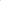

# Nested Graph Pseudo-Label Refinement for Noisy Label Domain Adaptation Learning

<!-- Page 1 -->

Nested Graph Pseudo-Label Refinement for Noisy Label

Domain Adaptation Learning

Yingxu Wang1, Mengzhu Wang2*, Zhichao Huang3, Suyu Liu4, Nan Yin5

1Mohamed bin Zayed University of Artificial Intelligence 2Hebei University of Technology 3JD Industrial, Inc 4Nanyang Technological University 5Hong Kong University of Science and Technology yingxv.wang@gmail.com, dreamkily@gmail.com, iceshzc@gmail.com, suyu.liu@ntu.edu.sg, yinnan8911@gmail.com

## Abstract

Graph Domain Adaptation (GDA) facilitates knowledge transfer from labeled source graphs to unlabeled target graphs by learning domain-invariant representations, which is essential in applications such as molecular property prediction and social network analysis. However, most existing GDA methods rely on the assumption of clean source labels, which rarely holds in real-world scenarios where annotation noise is pervasive. This label noise severely impairs feature alignment and degrades adaptation performance under domain shifts. To address this challenge, we propose Nested Graph Pseudo- Label Refinement (NeGPR), a novel framework tailored for graph-level domain adaptation with noisy labels. NeGPR first pretrains dual branches, i.e., semantic and topology branches, by enforcing neighborhood consistency in the feature space, thereby reducing the influence of noisy supervision. To bridge domain gaps, NeGPR employs a nested refinement mechanism in which one branch selects high-confidence target samples to guide the adaptation of the other, enabling progressive cross-domain learning. Furthermore, since pseudolabels may still contain noise and the pre-trained branches are already overfitted to the noisy labels in the source domain, NeGPR incorporates a noise-aware regularization strategy. This regularization is theoretically proven to mitigate the adverse effects of pseudo-label noise, even under the presence of source overfitting, thus enhancing the robustness of the adaptation process. Extensive experiments on benchmark datasets demonstrate that NeGPR consistently outperforms state-of-the-art methods under severe label noise.

## Introduction

Graph Domain Adaptation (GDA) (You et al. 2022; Cai et al. 2024) has emerged as a prominent technique for leveraging labeled graph data from a source domain to enhance learning on an unlabeled target graph domain. Its efficacy has been demonstrated across diverse applications, including temporally-evolved social network analysis (Wang et al. 2021), molecular property prediction (Zhu et al. 2023), and protein-protein interaction modeling (Cho, Berger, and Peng 2016). The core paradigm typically involves learning domain-invariant node/graph representations that bridge the

*Corresponding author. Copyright © 2026, Association for the Advancement of Artificial Intelligence (www.aaai.org). All rights reserved.

distributional shift between source and target domains, thus enabling effective inference on the target data.

However, the success of standard GDA methods crucially relies on the accurately labeled source data. In practice, source domain labels are often corrupted by noise arising from annotation errors (Dai, Aggarwal, and Wang 2021; Yuan et al. 2023b), subjective judgments (Platanios, Dubey, and Mitchell 2016), or inherent ambiguities in data collection (Chen, Shah, and Kyrillidis 2020). This prevalent issue of label noise can severely misguide the learning of domaininvariant representations (Li, Socher, and Hoi 2020), leading to suboptimal or even detrimental adaptation performance on the target domain (Yin et al. 2025). Existing noise label learning methods typically rely on loss function design to mitigate the impact of noisy labels (Han et al. 2018; Natarajan et al. 2013), which selects clean instances for joint training, and robust loss functions (Wang et al. 2024a, 2025), which leverage small-loss selection or instance mixture models. While effective in controlled settings, these approaches fall short in the presence of domain shifts. The coexistence of distribution shift and label noise leads to misaligned feature spaces, causing noise-robust losses to erroneously align clean features with noisy targets, thereby amplifying negative transfer (Yu et al. 2020). While recent efforts have been made to address GDA under noisy labels (Yuan et al. 2023a; Wang and Yang 2022), they primarily target node classification tasks, leaving a critical gap in addressing graph-level scenarios. Many real-world applications, such as molecular property prediction (Stokes et al. 2020) and social network analysis (Hamilton, Ying, and Leskovec 2017), inherently depend on graph-level classification, where label noise can severely compromise the identification of functional groups and the modeling of community behaviors. The lack of attention to graph-level adaptation under noisy labels significantly limits the practical applicability of existing methods in high-impact domains.

In this paper, we investigate the development of an efficient GDA framework for scenarios involving label noise. However, designing such a framework poses several fundamental challenges: (1) Distribution shift undermines lossbased denoising. Conventional noise-robust loss functions are primarily designed for specific domains and often struggle under distribution shifts. In the presence of noisy la-

The Fortieth AAAI Conference on Artificial Intelligence (AAAI-26)

26697

<!-- Page 2 -->

bels in the source domain, aligning target features with corrupted source representations can lead to noise-aligned embeddings, degrading generalization due to feature misalignment and increased risk of negative transfer. Recent studies in GDA have highlighted that noisy supervision severely hinders feature alignment across domains, especially when relying on pseudo labels or unreliable source signals (Yuan et al. 2023a). These findings underscore the need for noiseaware mechanisms that explicitly account for both label noise and domain discrepancy. (2) Imperfect pseudo labels compromise domain adaptation. Probability-based pseudolabeling has shown promise in bridging distribution shift and mitigating supervision noise (Yuan et al. 2023a; Yin et al. 2023a). However, the reliability of selected pseudo labels is often compromised by erroneous source annotations, leading to residual noise being transferred into the target domain. In Graph Neural Networks (GNNs), such corrupted pseudo labels can propagate through message passing, triggering self-reinforcing error cascades. As each GNN layer aggregates information from potentially mislabeled neighbors, the accumulated noise progressively deteriorates local neighborhood structures and distorts global representations over successive adaptation rounds (Wang et al. 2024c). (3) Label noise impairs distribution alignment in GDA. Existing methods typically adopt explicit (Long et al. 2015) or implicit (Long et al. 2018) strategies to align feature distributions across domains. However, significant label noise corrupts supervision signals, causing samples to drift toward incorrect class regions and disrupting the formation of domain-invariant features. This misalignment undermines the effectiveness of domain discriminators and hampers reliable adaptation. These challenges call for a unified framework that combines noise-robust representation learning, trustworthy pseudo-label refinement, and alignment strategies that preserve class-level semantics across domains.

To tackle these challenges, we propose Nested Graph Pseudo-Label Refinement (NeGPR), a novel framework designed for GDA under noisy labels. To effectively disentangle the impact of label noise from domain distribution shift, NeGPR first pre-trains noise-resilient models from implicit and explicit perspectives by enforcing semantic consistency among neighboring samples in the feature space. The implicit branch promotes feature-level consistency based on learned representations, while the explicit branch captures structural patterns by leveraging graph topology. This dualperspective design improves robustness to noisy supervision and provides a reliable foundation for domain adaptation. Then, to align the domain distribution, NeGPR iteratively leverages cross-branch knowledge, where one branch filters highly reliable target domain samples, and the other branch is fine-tuned accordingly, enabling mutual enhancement and progressive adaptation. However, the filtered pseudo-labels may still contain erroneous category information, and the pre-trained branches have already overfitted to the label noise in the source domain. The interplay of these two factors exacerbates performance degradation during domain adaptation. To tackle this, NeGPR employs a regularization along with a theoretical analysis demonstrating its effectiveness in suppressing the influence of noisy pseudo- labels. Extensive experiments demonstrate that NeGPR significantly outperforms state-of-the-art methods under severe label noise. Our main contributions are summarized as:

• We investigate a novel problem setting, graph domain adaptation learning under label noise, where label noise and domain shift coexist and jointly pose significant challenges for graph representation learning. • We propose NeGPR, a dual-branch framework that integrates noise-resilient pre-training, nested pseudo-label refinement, and theoretically grounded regularization to tackle graph domain adaptation under label noise. • We evaluate NeGPR on extensive datasets, showing that NeGPR significantly outperforms existing approaches under various noise levels and domain shift scenarios.

## Related Work

Graph Domain Adaptation. Graph Domain Adaptation (GDA) has emerged as a critical research topic, aiming to leverage labeled source domain graphs to enable robust representation learning on unlabeled or sparsely labeled target graphs (Lin et al. 2023; Luo et al. 2023; Liu et al. 2024a). To achieve this, most existing approaches first employ Graph Neural Networks (GNNs) (Kipf and Welling 2017) to generate representations for each graph (Wu, Pan, and Zhu 2022; Zhu et al. 2021; Yin et al. 2022). They then commonly use adversarial learning to implicitly align feature distributions and reduce domain discrepancies, apply pseudo-labeling to iteratively refine predictions in the target domain, or incorporate structure-aware strategies to explicitly align graphlevel semantics and topological structures, thereby improving generalization across diverse graph domains (Yin et al. 2023a; Wang et al. 2024b; Liu et al. 2024b). However, these methods often overlook the impact of noisy labels, which can distort learned representations and lead to misaligned distributions and unreliable predictions in the target domain. Although a few label-denoising GDA methods have been proposed, they primarily focus on node-level tasks (Yuan et al. 2023a). To address these limitations, we propose a novel label-denoising domain adaptation method designed for graph-level classification tasks. Learning with Noise Labels. Learning with noisy labels has garnered significant attention for its crucial role in developing robust models under imperfect supervision, which has been widely used in machine learning and computer vision (Zhu et al. 2024). Existing methods typically address label noise by employing robust loss functions, identifying and filtering out noisy samples, or refining labels through correction mechanisms (Feng et al. 2021; Xu et al. 2025). However, existing methods still insufficiently investigate the interplay between label noise and domain adaptation (Yin et al. 2024; Zhu et al. 2024). In particular, applying a model trained on the source domain to the target domain can be regarded as a noisy inference process due to distributional shifts inherent in domain adaptation (Yu et al. 2020; Dan et al. 2024). Furthermore, label noise in the source domain can also degrade model performance (Yuan et al. 2023a; Yu et al. 2024). Critically, conventional methods cannot disentangle whether the observed performance degradation is pri-

26698

<!-- Page 3 -->

**Figure 1.** Overview of the proposed NeGPR. NeGPR consists of a dual-branch pretraining module that captures complementary semantic and structural features under label noise. Then, a nested pseudo-label refinement module alternately selects highconfidence target samples from one branch to guide the other, enabling progressive cross-domain adaptation. The noisy pseudolabel tolerated regularizatio penalizes overconfident predictions to suppress the effect of noisy pseudo labels.

marily attributable to domain shift or label noise, thereby limiting their ability to address the underlying causes of adaptation failure effectively. To address this challenge, we propose a novel learning framework designed to mitigate the effects of domain shift and label noise.

## Methodology

Overview of Framework This work studies the problem of unsupervised graph domain adaptation in the presence of noisy labels and proposes a novel framework, NeGPR, as illustrated in Fig. 1. NeGPR comprises three key components: (1) Noise-Resilient Dual Branches Pre-Training. To effectively suppress the impact of label noise, we first pre-train noise-resilient models from implicit and explicit perspectives by enforcing semantic consistency among neighboring samples in the feature space; (2) Nested Pseudo-Label Refinement. To align category-level distributions, each branch selects highconfidence pseudo-labeled target samples based on prediction confidence and uses them to fine-tune the other branch. This cross-branch refinement mitigates error accumulation from noisy pseudo labels and enables progressive domain adaptation through mutual supervision; (3) Noisy Pseudo- Label Tolerated Regularization. To alleviate the negative impact of noisy pseudo labels, we introduce a noise-aware regularization term with theoretical guarantees. This regularization effectively suppresses error propagation induced by noisy pseudo labels during the adaptation process.

## Problem Formulation

Given a graph G = (V, E, X) with the set of nodes V and edges E ⊆V × V. The X ∈R|V|×d is the node feature matrix, where each row xv ∈Rd denotes the feature of node v ∈V, |V| is the number of nodes, and d denotes the dimension of node features. In our setting, we have access to a labeled source domain Ds = {(Gs i, ys i)}ns i=1 with ns samples, where the labels ys i may be corrupted by noise, and an unlabeled target domain Dt = {Gt j}nt j=1 with nt samples. Both domains share the label space Y = {1, 2, · · ·, C} but follow different data distributions. The goal is to train the graph classification model using both Ds and Dt and achieve high accuracy on the target domain.

Noise-Resilient Dual Branches Pre-Training To mitigate the adverse impact of noisy labels in the source domain, we adopt a dual-branch architecture that captures semantic consistency from implicit and explicit perspectives. Noisy supervision can distort the feature space by pulling semantically similar graphs toward incorrect class boundaries. In contrast, the local relationships among neighboring samples often remain reliable despite label corruption. Motivated by this, we construct two parallel branches that exploit neighborhood consistency to learn robust representations. One branch captures semantic similarity through learned features, while the other incorporates structural information derived from graph topology. This design enhances the model’s resilience to noise and provides a stable foundation for subsequent domain adaptation. Implicit Extraction Branch. The implicit branch follows the MPNNs mechanism (Gilmer et al. 2017), which extracts graph semantics by aggregating neighborhood representations to update the central node embeddings. Specifically, we update the embedding of node u at layer l and then summarize the node embeddings into graph-level:

hl u = COM hl−1 u, AGG hl−1 v∈N(u)

, zIB

G = READOUT hL u u∈V

, where N(u) is the neighbours of node u. COM and AGG denote the combination and aggregation operations, READOUT is the graph pooling function. This formulation allows the implicit branch to capture structural information indirectly through supervised learning with noisy labels. Explicit Extraction Branch. While the implicit branch captures structural semantics indirectly, its performance may deteriorate under domain shifts due to limited sensitivity to distributional changes. To enhance structural awareness, we introduce a complementary branch that explicitly encodes topological information by extracting high-order subgraph patterns (Shervashidze et al. 2011; Nikolentzos, Siglidis, and

26699

AI-readable visual equivalent, added: Figure extracted from the paper PDF and converted to an SVG wrapper asset. Use the surrounding page text and caption for interpretation.

<!-- Page 4 -->

Vazirgiannis 2021). This design enables the model to generate graph-level representations that are more robust to structural discrepancies across domains. Specifically, we formulate the explicit extraction branch as:

hv = ϕ (Sv (G)), ∀v ∈V, zEB

G = READOUT

{hv}v∈V

, where Sv(G) denotes a set of high-order substructures extracted from G (e.g., shortest paths (Borgwardt and Kriegel 2005) or subtree patterns (Shervashidze et al. 2011)), ϕ(·) encodes each substructure into a latent representation, and READOUT(·) aggregates these representations into a graph-level embedding. The resulting zEB

G serves as the explicit topological representation of the graph. Noise-Resilient Pre-Training. To mitigate the impact of label noise in the source domain, we exploit local semantic consistency among graphs in the feature space. Empirically, semantically similar graphs tend to exhibit stable feature distributions, even under corrupted labels (Wang and Isola 2020; Iscen et al. 2022). Based on this insight, we construct a semantic neighbor graph by identifying the top-k nearest neighbors for each source sample using similarity αij = zB

Gi

⊤zB

Gj/||zB

Gi|| · ||zB

Gj|| over graph-level embeddings obtained from each branch, where B ∈{IB, EB}. To enforce prediction consistency within local neighborhoods, we encourage the predicted distribution to align with a weighted average of its semantic neighbors’ predictions:

LB noise = 1 ns ns X i=1

KL



zB

Gi

X j∈top−k(Gi)

αij · zB

Gj



, where KL is the Kullback-Leibler divergence, top−k(Gi) is the top-k nearest neighbors samples of Gi. This regularization guides the model to learn noise-resilient representations by aligning each prediction with its semantic context, rather than relying solely on potentially corrupted labels. In formulation, we pre-train the dual branches with:

LB pre = LB sup + βLB noise, (1)

where LB sup = 1 ns

Pns i=1 l(σ(zB

Gi), yi) is the supervised classification loss, l is the cross-entropy loss and σ is the softmax function. B ∈{IB, EB} indicates the implicit and explicit branches pre-training.

Nested Pseudo-Label Refinement While various domain adaptation techniques such as distribution alignment (Long et al. 2015; Ganin et al. 2016) and adversarial training (Tzeng et al. 2017; Pei et al. 2018) have been widely explored, they often rely on strong assumptions regarding the existence of domain-invariant representations, which may not hold in the presence of label noise. In contrast, pseudo-labeling provides a flexible and data-driven alternative by leveraging model predictions on unlabeled target samples to guide adaptation (Lee et al. 2013; Xie et al. 2020). In our setting, the dual-branch encoder offers two complementary perspectives for estimating target semantics, enabling more reliable pseudo-label selection through confidence-based filtering. This design facilitates progressive adaptation by gradually incorporating trustworthy target samples into training, while retaining the robustness of the noise-resilient pre-trained branches.

Specifically, at each iteration of cross-branch pseudolabel refinement, we select one branch to generate predictions for all target domain samples. For each sample Gt j ∈Dt, we compute the predicted class probability vector ˆyj = Softmax(zB

Gj), where B ∈{IB, EB}. We then select a set of high-confidence samples Tconf defined as:

T B conf =

Gt j ∈Dt | max(ˆyj) ≥ζ

, (2)

where ζ is a pre-defined threshold. The corresponding pseudo-labels are assigned as: ˜yj = arg max(ˆyj), ∀Gt j ∈ T B conf. The selected pseudo-labeled samples {(Gt j, ˜yj)}j are then used to fine-tune the other branch with:

LB′ refine = LB′ pre − 1 |T B conf|

X

Gt j ∈T B conf

˜yj log σ(zB′

Gt j), (3)

where σ(zB′

Gt j) denotes the predicted probability from the other branch B′ and σ is the Softmax operation. The two branches are alternated in subsequent iterations, allowing the model to progressively adapt through mutual supervision.

Noisy Pseudo-Label Tolerated Regularization

Pseudo-labeling facilitates adaptation to the target domain by providing surrogate supervision, yet it inevitably introduces label noise that may compromise model performance (Rizve et al. 2021). To address this issue, we propose a noise-aware regularization term that penalizes overconfident or unstable predictions during refinement. This regularization serves as a soft constraint to suppress the influence of unreliable pseudo-labels, guiding the model toward more consistent and robust predictions. Moreover, we provide a theoretical analysis, which guarantees its ability to mitigate the negative impact of noisy supervision and enhance generalization in the target domain. Specifically, we define the refinement loss with the noisy tolerated regularization as:

LB′

Re =LB′ refine− λ |T B conf|

X

Gt j ∈T B conf log

⟨σ(zB′

Gt j), σ(zB

Gt j)⟩

, (4)

where ⟨σ(zB′

Gt j), σ(zB

Gt j)⟩denotes the inner product between the softmax predictions of the two branches. Here, σ represents the Softmax function, and zB′

Gt j, zB

Gt j are the graph-level embeddings of Gt j produced by branches B′ and B, respectively. B, B′ ∈{IB, EB} with B̸ = B′. For future analysis of the effectiveness of noisy-tolerant regularization, we derive the gradient of Eq. (4) and introduce Lemma 1.

Lemma 1 Let Θ denote the parameters of branch B′. The gradient of Eq. 4 with respect to Θ is given by:

∇ΘLB′

Re = 1 |T B conf|

X

Gt j ∈T B conf

∇ΘzB′

Gt j · (pj −˜yj + λ · gj),

26700

<!-- Page 5 -->

## Algorithm

1: Nested Pseudo-Label Refinement (NeGPR)

Input: Source domain data Ds = {(Gs i, ys i)}, target domain data Dt = {Gt j}, number of iterations T Output: Trained model parameters Θ for implicit branch

(IB) and Θ′ for explicit branch (EB) /Stage 1: Dual Branches Pre-Training/ 1: for B, B′ ∈{IB, EB}, B̸ = B′ do 2: Update Θ with Eq. (1) 3: Update Θ′ with Eq. (1) 4: end for /Stage 2: Nested Refinement with Regularization/ 5: for i = 1 to T do 6: Filter high-confidence samples T B conf from branch B with Eq.(2) 7: Update Θ′ of EB branch by Eq. (4) 8: Filter high-confidence samples T B′ conf from branch B′ with Eq.(2) 9: Update Θ of IB branch by Eq. (4) 10: end for 11: return Dual branches parameters Θ and Θ′ where pj = σ(zB′

Gt j), qj = σ(zB

Gt j), and the regularization gradient gj ∈RC is defined as:

gj: = 1 ⟨pj, qj⟩· J⊤ pjqj, with [Jpj]ck = ∂pj,c

∂zB′ j,k

= pj,c(δck −pj,k).

Here, δck denotes the Kronecker delta, which equals 1 if c = k and 0 otherwise.

From Lemma 1, we observe that when the pseudo label ˜yj is correct, the prediction pj increasingly aligns with it during training, causing the cross-entropy gradient to diminish. This reduction weakens the learning signal from clean samples and allows noisy examples to dominate the optimization. The regularization term gj alleviates this issue by maintaining substantial gradient contributions for clean instances, thus preserving their supervisory effect even as the loss converges. When ˜yj is incorrect, the cross-entropy term pj −˜yj becomes positive, leading to updates that push the model away from the true class. The regularization term gj, which is typically negative at the true class index, counteracts this effect by reducing the gradient magnitude on mislabeled examples. This dampening mechanism limits the influence of noisy labels during optimization.

Learning Framework The overall learning framework is outlined in Algorithm 1, which adopts an alternating dual-branch strategy to progressively refine pseudo labels and suppress the influence of label noise. The process begins with noise-resilient pretraining on the source domain to initialize both the implicit and explicit branches (lines 1–3). At each iteration, one branch generates pseudo labels for the target domain, and

## Methods

P→D D→P C→CM CM→C B→BM BM→B

WL 42.5±2.0 43.6±2.4 50.7±1.5 54.8±2.0 50.6±2.2 25.3±2.3 PathNN 47.5±1.5 41.1±2.0 49.8±1.6 66.9±2.6 50.3±1.6 37.2±2.4 GCN 53.7±2.3 51.8±2.0 49.8±1.6 32.7±2.9 49.7±2.1 55.5±2.7 GIN 48.3±1.9 49.9±1.7 51.2±2.0 52.6±2.5 48.7±2.0 55.8±1.9 GAT 59.2±1.7 57.4±2.0 49.3±2.1 36.4±2.5 51.3±1.9 32.7±2.0 GMT 55.7±2.5 53.9±2.6 50.7±2.1 44.4±1.9 49.2±1.7 32.7±2.2

Co-teaching 55.9±2.2 60.1±1.8 47.7±2.3 48.8±2.0 50.8±2.4 44.2±1.9 Taylor-CE 55.2±2.0 55.7±2.2 51.2±1.8 55.6±2.5 48.7±2.0 44.2±1.9 RTGNN 53.7±2.0 52.6±1.9 51.2±2.0 54.3±1.6 49.2±2.8 55.5±2.3 OMG 56.7±1.7 53.4±2.2 54.5±1.8 57.3±2.7 50.8±2.0 59.3±2.3 SPORT OOM OOM 53.7±2.1 63.9±3.3 51.4±2.6 65.8±3.0

CoCo 62.6±2.5 67.1±2.0 56.8±2.5 67.0±2.8 50.5±2.0 79.3±2.2 DEAL 69.7±1.9 60.0±2.5 52.7±2.1 60.4±2.2 52.4±2.9 68.6±2.8 SGDA 53.3±1.9 55.2±3.3 54.1±2.8 52.6±2.7 49.6±2.4 48.3±2.1 A2GNN 61.6±2.9 68.8±2.7 51.2±2.0 65.4±2.5 52.1±2.7 61.1±2.7 StruRW 52.8±1.9 56.4±3.3 52.8±2.8 51.3±2.7 48.7±2.4 49.7±3.1 PA-BOTH 56.5±2.9 54.2±2.6 51.2±2.9 58.9±2.3 48.7±2.7 47.7±2.5

ROAD 55.2±2.0 59.5±3.0 55.2±2.6 70.2±2.7 52.7±2.1 79.0±2.3 ALEX 68.8±2.1 68.1±2.2 56.2±2.0 69.2±2.9 54.3±2.1 78.8±3.0

NeGPR 72.3±2.6 69.9±2.8 57.3±2.6 73.0±2.3 55.9±3.0 80.0±2.7

**Table 1.** The graph classification results (in %) under semantic information shift (source→target). P, D, C, CM, B, and BM denote PROTEINS, DD, COX2, COX2 MD, BZR, and BZR MD, respectively. Bold indicates the best performance. OOM means out of memory.

high-confidence samples are selected based on prediction probability (lines 6 and 8). These samples are then used to update the other branch via a regularized training objective (lines 7 and 9). The two branches alternate roles throughout training (lines 5–10), enabling mutual correction and promoting robust adaptation under noisy supervision.

## Experiments

Experimental Settings Datasets. To assess the effectiveness of the proposed NeGPR, we conduct extensive experiments on multiple benchmark datasets from TUDataset, covering diverse types of domain shifts. For structure-based domain shifts, we utilize MUTAGENICITY (Kazius, McGuire, and Bursi 2005), NCI1 (Wale, Watson, and Karypis 2008), FRANKEN- STEIN (Orsini, Frasconi, and De Raedt 2015), and PRO- TEINS (Dobson and Doig 2003), where each dataset is partitioned into source and target domains based on variations in edge, node and graph flux density to simulate structural distribution shifts (Yin et al. 2023a). For feature-based domain shifts, we evaluate NeGPR on PROTEINS, DD, BZR, BZR MD, COX2, and COX2 MD (Sutherland, O’brien, and Weaver 2003), where domain discrepancies primarily arise from differences in semantic feature distributions. Baselines. We compare the proposed NeGPR with a comprehensive set of competitive baselines on the datasets above. These baselines include two graph kernel methods: WL (Shervashidze et al. 2011) and PathNN (Michel et al. 2023); four general graph neural networks: GCN (Kipf and Welling 2017), GIN (Xu et al. 2019), GAT (Veliˇckovi´c et al. 2018), and GMT (Baek, Kang, and Hwang 2021); five label denoising methods: Co-teaching (Han et al. 2018), RT- GNN (Qian et al. 2023), Taylor-CE (Feng et al. 2021), OMG (Yin et al. 2023b), and SPORT (Yin et al. 2024);

26701

<!-- Page 6 -->

## Methods

P0→P1 P1→P0 P0→P2 P2→P0 P0→P3 P3→P0 P1→P2 P2→P1 P1→P3 P3→P1 P2→P3 P3→P2

WL 67.5±1.4 31.9±1.9 54.7±0.8 67.0±1.5 24.2±2.4 21.6±1.8 49.8±1.0 43.3±1.7 33.4±1.9 61.2±1.3 32.9±0.8 43.6±2.1 PathNN 68.0±1.4 72.6±2.6 55.1±2.3 38.2±2.8 25.4±2.5 22.6±4.6 39.9±3.1 63.6±1.7 34.4±2.5 27.6±2.2 67.0±1.9 46.7±2.0 GCN 67.3±3.5 73.3±4.3 55.9±1.7 72.1±2.6 23.8±1.7 22.5±1.4 52.3±3.9 63.9±2.4 27.3±1.0 45.6±1.7 30.3±2.1 47.7±1.4 GIN 62.3±2.3 59.5±2.5 50.6±2.1 49.4±2.4 24.8±1.3 60.0±0.9 45.2±0.3 56.4±3.1 66.0±1.2 34.3±1.7 33.4±1.4 48.5±1.9 GAT 62.8±0.8 68.1±1.2 50.1±1.7 66.2±1.4 64.6±2.3 18.0±1.4 48.9±1.0 62.8±1.8 46.5±1.4 25.5±1.1 33.1±0.9 49.0±2.7 GMT 49.6±1.0 51.3±1.3 54.1±1.6 50.6±1.3 53.8±1.1 51.4±1.7 52.9±1.9 53.0±1.1 53.5±1.0 50.4±1.1 52.5±1.2 50.2±1.0

Co-teaching 67.4±0.5 69.2±1.2 54.2±1.7 69.4±0.4 24.7±1.9 25.5±1.3 49.4±0.8 61.4±2.6 38.9±2.1 47.4±2.5 43.0±1.8 46.4±3.3 Taylor-CE 65.7±3.6 66.4±4.3 49.3±3.5 53.6±2.9 27.9±1.5 57.4±2.4 50.6±2.2 42.7±1.8 69.7±1.9 39.6±1.7 40.4±1.3 42.0±2.7 RTGNN 63.0±1.8 70.3±1.2 61.1±1.8 67.7±2.5 26.0±0.7 20.0±0.9 55.1±1.4 67.3±1.7 24.4±1.3 48.9±1.5 34.8±1.2 44.0±1.5 OMG 64.9±1.4 72.2±1.7 47.1±1.1 63.3±1.9 68.1±1.3 22.3±0.8 46.3±2.3 59.3±2.2 52.5±1.8 21.8±1.9 35.1±1.5 43.6±1.3 SPORT 60.7±1.4 65.4±1.8 49.0±1.2 69.1±0.5 54.7±1.1 51.8±1.5 55.3±2.1 64.3±2.4 51.6±1.3 25.8±1.2 34.1±1.7 42.3±1.9

CoCo 66.9±1.3 50.9±1.9 55.2±1.5 64.4±1.4 71.4±1.7 25.9±1.2 51.6±2.6 55.1±2.4 36.7±1.8 56.3±1.2 38.3±1.9 44.5±3.0 DEAL 66.7±2.3 71.6±2.1 55.2±1.9 70.4±3.0 34.7±1.0 58.6±1.7 51.0±2.0 65.3±1.6 43.7±1.8 66.5±1.9 63.4±3.1 46.4±2.3 SGDA 67.8±2.1 59.4±1.3 57.7±1.6 73.1±1.8 38.3±2.4 31.9±2.7 48.2±2.0 48.8±2.2 39.2±2.0 58.6±1.6 40.2±1.8 46.8±2.3 A2GNN 60.7±2.2 65.5±1.8 54.3±2.0 67.5±2.2 60.2±1.9 53.3±1.7 44.2±1.5 63.1±1.8 42.9±2.3 35.7±2.5 46.5±2.0 53.8±2.1 StruRW 62.5±2.1 72.9±1.4 59.2±1.8 71.0±2.0 39.8±1.9 34.9±2.1 49.6±1.6 66.6±2.1 37.4±2.3 61.1±1.7 40.5±1.5 45.9±2.2 PA-BOTH 64.9±1.7 73.6±2.1 58.0±2.2 69.1±1.9 36.5±2.3 54.3±1.5 53.9±1.8 67.2±1.4 42.2±1.6 67.6±2.0 63.1±1.9 45.3±2.1

ROAD 52.2±2.6 53.8±3.2 60.9±2.7 55.9±2.1 63.1±2.0 57.2±2.7 58.6±2.4 58.2±1.7 62.5±2.0 58.2±1.8 61.1±2.5 57.2±1.7 ALEX 68.7±2.7 74.9±3.0 62.5±2.8 68.6±2.6 73.7±2.8 61.3±3.4 62.8±2.6 64.9±2.1 68.2±2.0 61.7±2.2 64.1±3.0 58.0±2.2

NeGPR 71.7±2.4 74.7±2.6 64.5±2.1 73.3±2.1 77.1±2.4 63.2±1.7 63.8±2.5 68.1±2.2 70.5±2.1 68.4±2.4 67.2±2.3 61.0±1.6

**Table 2.** The graph classification results (in %) on the PROTEINS dataset under graph flux density domain shift (source → target). P0, P1, P2 and P3 denote the sub-datasets partitioned with graph flux density. Bold results indicate the best performance.

six graph domain adaptation methods: DEAL (Yin et al. 2022), CoCo (Yin et al. 2023a), SGDA (Qiao et al. 2023), A2GNN (Liu et al. 2024a), StruRW (Liu et al. 2023), and PA-BOTH (Liu et al. 2024b); and two methods that address both label noise and domain adaptation: ALEX (Yuan et al. 2023a) and ROAD (Feng et al. 2023). Implementation Details. We implement NeGPR and all baseline models using PyTorch and conduct all experiments on NVIDIA A100 GPUs to ensure a fair comparison. For NeGPR, the implicit branch (IB) is instantiated with the GMT (Baek, Kang, and Hwang 2021) architecture to capture semantic consistency via message passing, while the explicit branch (EB) employs the PathNN model (Michel et al. 2023) to extract high-order topological structures explicitly. Both branches use 4 GNN layers, with a hidden dimension of 256 and a weight decay of 10−12. The models are trained using the Adam optimizer with a learning rate of 10−4. All the models are trained on noisy labeled source graphs and evaluated on unlabeled target graphs. We set the noise ratio α = 0.3 and the pseudo-label threshold ζ = 0.9 by default. All reported results are averaged over five independent runs.

Performance Comparison We present the results of the proposed NeGPR with all baseline models under the setting of graph domain adaptation on different datasets in Tables 1 and 2. From these tables, we observe that: (1) Label denoising methods consistently outperform general graph-based approaches, as the presence of noisy labels significantly impairs the performance of standard graph models lacking dedicated noisehandling mechanisms. (2) Graph domain adaptation methods generally outperform graph-based and label-denoising approaches by effectively mitigating domain distribution shifts. However, their performance may still degrade when source labels are corrupted, highlighting the need for meth- ods that jointly address domain shift and label noise specific for graphs. (3) Label denoising domain adaptation methods demonstrate superior performance over graph domain adaptation methods, which highlights the importance of explicitly addressing label noise alongside domain alignment to enhance model generalization in noisy cross-domain settings. (4) The proposed NeGPR consistently achieves the highest performance across datasets in most cases, demonstrating its superiority. The outstanding performance is attributed primarily to two factors: (i) the integration of implicit branch and explicit branch enables comprehensive extraction of both structural and semantic features, substantially enhancing representation quality and classification accuracy; and (ii) the nested refinement and noisy tolerated regularization modules jointly promote robust cross-domain adaptation by progressively selecting reliable supervision and suppressing noisy signals.

Ablation Study We conduct ablation studies to examine the contributions of each component in the proposed NeGPR: (1) NeGPR w/o IB: It removes the implicit extraction branch; (2) NeGPR w/o EB: It removes the explicit extraction branch; (3) NeGPR w/o NRL: It removes the noise resilient loss in the pretraining stage; (4) NeGPR w/o NTR: It remove the noisy pseudo-label tolerated regularization loss during fine-tuning.

Experimental results are reported in Table 3. From the results, we find that: (1) NeGPR outperforms NeGPR w/o IB and NeGPR w/o EB, underscoring the importance of integrating implicit and explicit branches that capture semantic and structural information. Their joint modeling enforces multi-view prediction consistency, providing a robust foundation for effective domain adaptation. (2) NeGPR w/o NRL demonstrates inferior performance compared to NeGPR. The NRL effectively reduces the negative impact

26702

<!-- Page 7 -->

## Methods

P0→P1 P1→P0 P0→P2 P2→P0 P0→P3 P3→P0 P1→P2 P2→P1 P1→P3 P3→P1 P2→P3 P3→P2

NeGPR w/o IB 50.8 50.6 50.7 52.2 50.0 48.6 52.0 52.2 47.7 50.8 52.5 50.3 NeGPR w/o EB 50.4 52.1 49.0 52.1 49.0 51.6 46.5 50.4 51.6 50.4 53.3 49.9 NeGPR w/o NRL 68.5 71.4 62.5 70.0 73.6 60.9 61.2 65.2 68.4 64.6 63.8 58.4 NeGPR w/o NTR 69.7 71.0 63.8 70.3 74.8 62.4 62.4 66.2 69.0 65.5 65.8 58.9

NeGPR 71.7 74.7 64.5 73.3 77.1 63.2 63.8 68.1 70.5 68.4 67.2 61.0

**Table 3.** The results of ablation studies on the PROTEINS dataset (source →target). Bold results indicate the best performance.

(a) Threshold ζ (b) Noise ratio α

**Figure 2.** Hyperparameter sensitivity analysis of threshold ζ and noise ratio α on the PROTEINS dataset.

of noisy labels in the source domain by promoting local consistency among neighboring nodes. This constraint enables NeGPR to learn noise-resistant representations suitable for domain adaptation. (3) NeGPR outperforms NeGPR w/o NTR, demonstrating that the noise tolerant regularization effectively mitigates the impact of noisy pseudo-labels by preserving reliable supervision from clean samples. This constraint prevents overfitting and enhances the model’s robustness and generalization across domains.

Sensitivity Analysis We perform a sensitivity analysis to examine how the key hyperparameters of NeGPR, namely the pseudo-label confidence threshold ζ and the noise ratio α, affect its performance. Specifically, ζ governs the selection of highconfidence pseudo-labeled target samples, while α determines the proportion of corrupted labels in the source domain. Both parameters play a critical role in balancing supervision quality and model robustness.

**Figure 2.** illustrates how ζ and α affect the performance of NeGPR on the PROTEINS dataset. We vary ζ within the range of {0.5, 0.6, 0.7, 0.8, 0.9} and α in {0.1, 0.2, 0.3, 0.4, 0.5}. From the results, we observe that: (1) The performance of NeGPR in Figure 2(a) steadily increases as threshold ζ rises. A higher threshold can effectively filter out pseudo-labels with lower confidence, which reduces the risk of propagating incorrect information during model training, enabling the model to learn from more reliable supervision signals. Thus, we set the threshold ζ to 0.9 as default to ensure optimal pseudo-label reliability. (2) Figure 2(b) illustrates a decreasing accuracy trend with an increasing noise ratio α. A higher noise ratio introduces more incorrectly labeled samples into the source domain, thereby degrading the reliability of supervisory signals during training. Consequently, this prevents the model from accurately learning discriminative representations. To maintain a balance between realistic data conditions and robust perfor-

(a) Different backbone for IB (b) Different backbone for EB

**Figure 3.** The performance with different backbones for IB and EB on the PROTEINS dataset.

mance, we set the noise ratio α to 0.3 by default.

Flexible Architecture To assess the impact of different backbone choices for the IB and EB branches, we evaluate various message passing methods in IB, including GCN, GAT, GIN, and GMT, and adopt several graph kernel-based methods in EB, such as Graph Sampling, Random Walk, WL, and PathNN. As shown in Figure 3, and consistently observed across other datasets, GMT and PathNN yield the best performance in most cases. This can be attributed to their superior representation capacity, which provides a solid foundation for capturing both semantic and topological features of graphs. These results further validate our choice of GMT in IB and PathNN in EB, as they offer complementary strengths that enhance the effectiveness of dual-branch modeling.

## Conclusion

This paper introduces NeGPR, a novel noise-aware dualbranch framework designed for robust Graph Domain Adaptation (GDA) under label noise. To tackle noisy supervision and distributional shifts, NeGPR employs a dualbranch pretraining strategy: one branch captures semantic consistency via local message passing, while the other encodes structural features using a graph kernel method, enabling the extraction of complementary graph representations. A nested pseudo-label refinement mechanism progressively aligns source and target domains by alternately using high-confidence predictions from one branch to supervise the other, enhancing cross-branch consistency and mitigating domain gaps. Additionally, a noise-aware regularization term penalizes overconfident or inconsistent predictions, thereby reducing the impact of noisy labels. Extensive experiments across diverse datasets and various noise settings validate the superior robustness and generalization of NeGPR, clearly underscoring its strong promise for reliable graph transfer learning in real-world applications.

26703

AI-readable visual equivalent, added: Figure extracted from the paper PDF and converted to an SVG wrapper asset. Use the surrounding page text and caption for interpretation.

AI-readable visual equivalent, added: Figure extracted from the paper PDF and converted to an SVG wrapper asset. Use the surrounding page text and caption for interpretation.

AI-readable visual equivalent, added: Figure extracted from the paper PDF and converted to an SVG wrapper asset. Use the surrounding page text and caption for interpretation.

AI-readable visual equivalent, added: Figure extracted from the paper PDF and converted to an SVG wrapper asset. Use the surrounding page text and caption for interpretation.

<!-- Page 8 -->

## Acknowledgments

This work is supported by the National Natural Science Foundation of China under Grants No. 62406100 and NO. 92570118. Tianjin Natural Science Foundation under Grants No. 24JCQNJC00320, Beijing Postdoctoral Research Foundation. Beijing Natural Science Foundation No. 4254079.

## References

Baek, J.; Kang, M.; and Hwang, S. J. 2021. Accurate learning of graph representations with graph multiset pooling. arXiv preprint arXiv:2102.11533. Borgwardt, K. M.; and Kriegel, H.-P. 2005. Shortest-path kernels on graphs. In ICDM, 8–pp. IEEE. Cai, R.; Wu, F.; Li, Z.; Wei, P.; Yi, L.; and Zhang, K. 2024. Graph domain adaptation: A generative view. ACM Transactions on Knowledge Discovery from Data, 18(3): 1–24. Chen, J.; Shah, V.; and Kyrillidis, A. 2020. Negative sampling in semi-supervised learning. In ICML, 1704–1714. Cho, H.; Berger, B.; and Peng, J. 2016. Compact integration of multi-network topology for functional analysis of genes. Cell systems, 3(6): 540–548. Dai, E.; Aggarwal, C.; and Wang, S. 2021. Nrgnn: Learning a label noise resistant graph neural network on sparsely and noisily labeled graphs. In KDD, 227–236. Dan, J.; Liu, W.; Xie, X.; Yu, H.; Dong, S.; and Tan, Y. 2024. TFGDA: Exploring topology and feature alignment in semisupervised graph domain adaptation through robust clustering. NeurIPS, 37: 50230–50255. Dobson, P. D.; and Doig, A. J. 2003. Distinguishing enzyme structures from non-enzymes without alignments. Journal of molecular biology, 330(4): 771–783. Feng, L.; Shu, S.; Lin, Z.; Lv, F.; Li, L.; and An, B. 2021. Can cross entropy loss be robust to label noise? In IJCAI, 2206–2212. Feng, Y.; Zhu, H.; Peng, D.; Peng, X.; and Hu, P. 2023. Road: Robust unsupervised domain adaptation with noisy labels. In ACMMM, 7264–7273. Ganin, Y.; Ustinova, E.; Ajakan, H.; Germain, P.; Larochelle, H.; Laviolette, F.; March, M.; and Lempitsky, V. 2016. Domain-adversarial training of neural networks. Journal of machine learning research, 17(59): 1–35. Gilmer, J.; Schoenholz, S. S.; Riley, P. F.; Vinyals, O.; and Dahl, G. E. 2017. Neural message passing for quantum chemistry. In ICML, 1263–1272. Pmlr. Hamilton, W. L.; Ying, R.; and Leskovec, J. 2017. Inductive representation learning on large graphs. In NeurIPS. Han, B.; Yao, Q.; Yu, X.; Niu, G.; Xu, M.; Hu, W.; Tsang, I.; and Sugiyama, M. 2018. Co-teaching: Robust training of deep neural networks with extremely noisy labels. NeurIPS, 31. Iscen, A.; Valmadre, J.; Arnab, A.; and Schmid, C. 2022. Learning with neighbor consistency for noisy labels. 2022 IEEE. In CVPR, 4662–4671. Kazius, J.; McGuire, R.; and Bursi, R. 2005. Derivation and validation of toxicophores for mutagenicity prediction. Journal of medicinal chemistry, 48(1): 312–320.

Kipf, T. N.; and Welling, M. 2017. Semi-supervised classification with graph convolutional networks. In ICLR. Lee, D.-H.; et al. 2013. Pseudo-label: The simple and efficient semi-supervised learning method for deep neural networks. In ICMLW, volume 3, 896. Li, J.; Socher, R.; and Hoi, S. C. 2020. Dividemix: Learning with noisy labels as semi-supervised learning. arXiv preprint arXiv:2002.07394. Lin, M.; Li, W.; Li, D.; Chen, Y.; Li, G.; and Lu, S. 2023. Multi-domain generalized graph meta learning. In AAAI, 4479–4487. Liu, M.; Fang, Z.; Zhang, Z.; Gu, M.; Zhou, S.; Wang, X.; and Bu, J. 2024a. Rethinking propagation for unsupervised graph domain adaptation. In AAAI, 13963–13971. Liu, S.; Li, T.; Feng, Y.; Tran, N.; Zhao, H.; Qiu, Q.; and Li, P. 2023. Structural re-weighting improves graph domain adaptation. In ICML, 21778–21793. PMLR. Liu, S.; Zou, D.; Zhao, H.; and Li, P. 2024b. Pairwise Alignment Improves Graph Domain Adaptation. In ICML, 32552–32575. PMLR. Long, M.; Cao, Y.; Wang, J.; and Jordan, M. 2015. Learning transferable features with deep adaptation networks. In ICML, 97–105. PMLR. Long, M.; Cao, Z.; Wang, J.; and Jordan, M. I. 2018. Conditional adversarial domain adaptation. In NeurIPS. Luo, Y.; Wang, Z.; Chen, Z.; Huang, Z.; and Baktashmotlagh, M. 2023. Source-free progressive graph learning for open-set domain adaptation. IEEE Transactions on Pattern Analysis and Machine Intelligence, 45(9): 11240–11255. Michel, G.; Nikolentzos, G.; Lutzeyer, J. F.; and Vazirgiannis, M. 2023. Path neural networks: Expressive and accurate graph neural networks. In ICML, 24737–24755. PMLR. Natarajan, N.; Dhillon, I. S.; Ravikumar, P. K.; and Tewari, A. 2013. Learning with noisy labels. NeurIPS, 26. Nikolentzos, G.; Siglidis, G.; and Vazirgiannis, M. 2021. Graph kernels: A survey. Journal of Artificial Intelligence Research, 72: 943–1027. Orsini, F.; Frasconi, P.; and De Raedt, L. 2015. Graph invariant kernels. In IJCAI. Pei, Z.; Cao, Z.; Long, M.; and Wang, J. 2018. Multiadversarial domain adaptation. In AAAI, volume 32. Platanios, E. A.; Dubey, A.; and Mitchell, T. 2016. Estimating accuracy from unlabeled data: A bayesian approach. In ICML, 1416–1425. PMLR. Qian, S.; Ying, H.; Hu, R.; Zhou, J.; Chen, J.; Chen, D. Z.; and Wu, J. 2023. Robust training of graph neural networks via noise governance. In WSDM, 607–615. Qiao, Z.; Luo, X.; Xiao, M.; Dong, H.; Zhou, Y.; and Xiong, H. 2023. Semi-supervised domain adaptation in graph transfer learning. In IJCAI, 2279–2287. Rizve, M. N.; Duarte, K.; Rawat, Y. S.; and Shah, M. 2021. In Defense of Pseudo-Labeling: An Uncertainty-Aware Pseudo-label Selection Framework for Semi-Supervised Learning. In ICLR.

26704

<!-- Page 9 -->

Shervashidze, N.; Schweitzer, P.; Van Leeuwen, E. J.; Mehlhorn, K.; and Borgwardt, K. M. 2011. Weisfeilerlehman graph kernels. Journal of Machine Learning Research, 12(9). Stokes, J. M.; Yang, K.; Swanson, K.; Jin, W.; Cubillos- Ruiz, A.; Donghia, N. M.; MacNair, C. R.; French, S.; Carfrae, L. A.; Bloom-Ackermann, Z.; et al. 2020. A deep learning approach to antibiotic discovery. Cell, 180(4): 688–702. Sutherland, J. J.; O’brien, L. A.; and Weaver, D. F. 2003. Spline-fitting with a genetic algorithm: A method for developing classification structure- activity relationships. Journal of chemical information and computer sciences, 43(6): 1906–1915. Tzeng, E.; Hoffman, J.; Saenko, K.; and Darrell, T. 2017. Adversarial discriminative domain adaptation. In CVPR, 7167–7176. Veliˇckovi´c, P.; Cucurull, G.; Casanova, A.; Romero, A.; Li`o, P.; and Bengio, Y. 2018. Graph Attention Networks. ICLR. Wale, N.; Watson, I. A.; and Karypis, G. 2008. Comparison of descriptor spaces for chemical compound retrieval and classification. Knowledge and Information Systems, 14: 347–375. Wang, M.; Li, J.; Su, H.; Yin, N.; Yang, L.; and Li, S. 2024a. GraphCL: Graph-based Clustering for Semi- Supervised Medical Image Segmentation. arXiv preprint arXiv:2411.13147. Wang, M.; Ren, W.; Zhang, Y.; Fan, Y.; xi Shi, D.; Jing, L.; and Yin, N. 2025. Gaussian Mixture Model for Graph Domain Adaptation. In IJCAI. Wang, T.; and Isola, P. 2020. Understanding contrastive representation learning through alignment and uniformity on the hypersphere. In ICML, 9929–9939. PMLR. Wang, Y.; Chang, Y.-Y.; Liu, Y.; Leskovec, J.; and Li, P. 2021. Inductive representation learning in temporal networks via causal anonymous walks. arXiv preprint arXiv:2101.05974. Wang, Y.; Liu, S.; Wang, M.; Liang, S.; and Yin, N. 2024b. Degree distribution based spiking graph networks for domain adaptation. arXiv e-prints, arXiv–2410. Wang, Y.; and Yang, Y. 2022. Bayesian robust graph contrastive learning. arXiv preprint arXiv:2205.14109. Wang, Z.; Sun, D.; Zhou, S.; Wang, H.; Fan, J.; Huang, L.; and Bu, J. 2024c. NoisyGL: A Comprehensive Benchmark for Graph Neural Networks under Label Noise. arXiv preprint arXiv:2406.04299. Wu, M.; Pan, S.; and Zhu, X. 2022. Attraction and repulsion: Unsupervised domain adaptive graph contrastive learning network. IEEE Transactions on Emerging Topics in Computational Intelligence, 6(5): 1079–1091. Xie, Q.; Luong, M.-T.; Hovy, E.; and Le, Q. V. 2020. Selftraining with noisy student improves imagenet classification. In CVPR, 10687–10698. Xu, G.; Yi, L.; Xu, P.; Li, J.; Pu, R.; Shui, C.; Ling, C.; McLeod, A. I.; and Wang, B. 2025. Unraveling the Mysteries of Label Noise in Source-Free Domain Adaptation:

Theory and Practice. IEEE Transactions on Pattern Analysis and Machine Intelligence. Xu, K.; Hu, W.; Leskovec, J.; and Jegelka, S. 2019. How powerful are graph neural networks? In ICLR. Yin, N.; Shen, L.; Chen, C.; Hua, X.-S.; and Luo, X. 2024. Sport: A subgraph perspective on graph classification with label noise. ACM Transactions on Knowledge Discovery from Data, 18(9): 1–20. Yin, N.; Shen, L.; Li, B.; Wang, M.; Luo, X.; Chen, C.; Luo, Z.; and Hua, X.-S. 2022. Deal: An unsupervised domain adaptive framework for graph-level classification. In ACMMM, 3470–3479. Yin, N.; Shen, L.; Wang, M.; Lan, L.; Ma, Z.; Chen, C.; Hua, X.-S.; and Luo, X. 2023a. Coco: A coupled contrastive framework for unsupervised domain adaptive graph classification. In ICML, 40040–40053. PMLR. Yin, N.; Shen, L.; Wang, M.; Luo, X.; Luo, Z.; and Tao, D. 2023b. Omg: Towards effective graph classification against label noise. IEEE Transactions on Knowledge and Data Engineering, 35(12): 12873–12886. Yin, Z.; Feng, Y.; Yan, M.; Song, X.; Peng, D.; and Wang, X. 2025. RoDA: Robust Domain Alignment for Cross-Domain Retrieval Against Label Noise. In AAAI, volume 39, 9535– 9543. You, Y.; Chen, T.; Wang, Z.; and Shen, Y. 2022. Bringing your own view: Graph contrastive learning without prefabricated data augmentations. In WSDM, 1300–1309. Yu, X.; Liu, T.; Gong, M.; Zhang, K.; Batmanghelich, K.; and Tao, D. 2020. Label-noise robust domain adaptation. In ICML, 10913–10924. Yu, Y.; Ko, M.; Shin, S.; Kim, K.; and Lee, K. 2024. Curriculum Fine-tuning of Vision Foundation Model for Medical Image Classification Under Label Noise. NeurIPS, 37: 18205–18224. Yuan, J.; Luo, X.; Qin, Y.; Mao, Z.; Ju, W.; and Zhang, M. 2023a. Alex: Towards effective graph transfer learning with noisy labels. In ACMMM, 3647–3656. Yuan, J.; Luo, X.; Qin, Y.; Zhao, Y.; Ju, W.; and Zhang, M. 2023b. Learning on graphs under label noise. In ICASSP, 1–5. IEEE. Zhu, Q.; Jiao, Y.; Ponomareva, N.; Han, J.; and Perozzi, B. 2023. Explaining and Adapting Graph Conditional Shift. arxiv. Zhu, Q.; Yang, C.; Xu, Y.; Wang, H.; Zhang, C.; and Han, J. 2021. Transfer learning of graph neural networks with egograph information maximization. NeurIPS, 34: 1766–1779. Zhu, Y.; Feng, L.; Deng, Z.; Chen, Y.; Amor, R.; and Witbrock, M. 2024. Robust node classification on graph data with graph and label noise. In AAAI, volume 38, 17220– 17227.

26705
