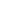

# Noisy Correspondence Learning with Modality Gap Direction Correction

<!-- Page 1 -->

Noisy Correspondence Learning with Modality Gap Direction Correction

Wuyuqing Wang*1, Zeyuan Gu*2, Erkun Yang1†

1School of Electronic Engineering, Xidian University, Xi’an 710071, China 2School of Computer Science and Technology, Xinjiang University, Urumqi 830046, China 24021211899@stu.xidian.edu.cn, guzeyuan@stu.xju.edu.cn, erkunyang@gmail.com

## Abstract

Cross-modal retrieval is crucial for discovering latent correspondences across different modalities. However, existing methods typically assume that training data are well-aligned, an unrealistic assumption since real-world datasets inevitably contain noisy correspondences. Many current approaches attempt to handle noise using strategies borrowed from singlemodal classification, such as the small-loss trick, to identify clean training pairs. However, our experiments reveal that such small-loss-based strategies are less effective for multimodal tasks due to the inherent modality gaps. Through comprehensive analysis, we observe that the deviation directions between paired image-caption features, termed Sample-level Alignment Drift (SAD), are compact and data-dependent. Leveraging this discovery, we introduce the Modality Gap Corrected Similarity (MGCS) framework that can more accurately measure the semantic distances of cross-modal samples, dynamically compensating for misalignment. Within MGCS, we can achieve more reliable noisy data separation to promote correct supervision during cross-modal matching model training. Extensive experiments on three widely used noisy correspondence benchmarks demonstrate that MGCS significantly surpasses current state-of-the-art methods.

Code — https://github.com/wwyq1/MGCS

## Introduction

Cross-modal retrieval aims to identify and retrieve semantically relevant samples across different modalities, playing a pivotal role in diverse applications (Wang et al. 2024). Similar to many deep learning tasks, cross-modal retrieval significantly benefits from large-scale, accurately aligned training data (Zhou, Hassan, and Hoon 2023). However, real-world multi-modal datasets often include inevitable noisy correspondences — misalignment errors between samples of different modalities (Huang et al. 2021). This issue is particularly pronounced in datasets automatically gathered online, exacerbating retrieval inaccuracies (Alayrac et al. 2022). Hence, developing robust methods for cross-modal retrieval under noisy conditions has become a critical research area.

*These authors contributed equally. †Corresponding author. Copyright © 2026, Association for the Advancement of Artificial Intelligence (www.aaai.org). All rights reserved.

**Figure 1.** In the embedding space, dashed lines link each image to matched captions. The caption in red, due to the modality gaps, may be closer to other images that manifest high feature similarity, leading to misalignment. For each sample, the relative orientation of the image-caption pair is not random but data-dependent, which we refer to as SAD.

Recently, a variety of noisy correspondence learning methods (Zha et al. 2024; Yang et al. 2024; Dang et al. 2024, 2025) have adopted small-loss-based strategies (Xia et al. 2021; Ma et al. 2020), originally proposed for image classification, and have demonstrated promising results. However, noisy correspondence learning fundamentally falls within the broader category of multi-modal learning (Huang et al. 2021). As shown in (Ramasinghe et al. 2024; Levy et al. 2024), inherent modality gaps might pose unique challenges in accurately aligning semantic similarity with learned feature similarity in the shared embedding space. Figure 1 illustrates this issue, where mismatched pairs can be ranked ahead of matched ones due to the modality discrepancies. To empirically verify this problem, we conduct experiments across several datasets, evaluating both cross-modal matching and single-modal image classification tasks. All models are trained using comparable contrastive-based loss functions. The loss distributions, shown in Figure 2, reveal a notable difference: single-modal classification tasks exhibit more separable and structured loss patterns than their multimodal counterparts. This observation suggests that applying a uniform small-loss-based sample selection strategy across modalities may lead to less stable and less accurate identification of clean pairs under noisy correspondences, degrading the final matching performance.

The Fortieth AAAI Conference on Artificial Intelligence (AAAI-26)

10163

AI-readable visual equivalent, added: Figure extracted from the paper PDF and converted to an SVG wrapper asset. Use the surrounding page text and caption for interpretation.

<!-- Page 2 -->

**Figure 2.** Loss distributions for noisy and clean data pairs on both single- and multi-modal learning tasks.

To address the aforementioned challenge, we conduct a comprehensive analysis of the modality gap and its impact on correspondence learning. Our investigation reveals that the discrepancy between matched image-caption pairs is not random; instead, it follows a consistent, data-dependent directional bias. We term this phenomenon as Sample-level Alignment Drift (SAD), and show that it can be effectively exploited to mitigate misalignment errors induced by the modality gap. Building upon this key insight, we propose a novel framework called Modality Gap Corrected Similarity learning (MGCS). At its core, MGCS offers a refined cross-modal similarity estimation mechanism, centered on a SAD-driven Rectification (SADR) module. SADR captures two components: a matched drift, representing the samplespecific deviation direction, and an inherent drift, derived by averaging the matched drifts of semantically similar images. The cosine similarity between these two drifts serves as an adjustment factor used to revise the original cross-modal similarities within the division loss. Furthermore, drawing inspiration from (Huh et al. 2024; Yang et al. 2024), we develop a dynamic regularization strategy that utilizes semantic discrepancies to robustly distinguish clean samples from noisy ones. By integrating this adaptive regularization with SADR, MGCS improves the quality of supervision and facilitates a more stable and accurate model convergence.

• We introduce the novel concept of Sample-level Alignment Drift (SAD), highlighting a consistent, datadependent deviation direction prevalent between crossmodal features in the shared embedding space. • We propose an effective framework, MGCS, which includes SAD-driven Rectification (SADR), aiming to establish more accurate similarity measurements, facilitating clean sample selection with dynamic regularization to promote more correct supervision for model training. • Our evaluations confirm MGCS’s superior performance on multiple noisy correspondence benchmarks, outperforming current state-of-the-art approaches.

Related Works Noisy Correspondence Learning We take image-caption retrieval as a proxy task to discuss noisy correspondence learning (Kiros, Salakhutdinov, and Zemel 2014; Liu and Tao 2016; Liang et al. 2024a). Typically, all pairs are assumed to be semantically associated with high similarity scores. However, training data may contain noisy correspondences that refer to mismatched samples that are incorrectly labeled as matches (Liang et al. 2024b). (Huang et al. 2021) raised this issue first and proposed NCR. Motivated by the memorization effect of DNNs (Arpit et al. 2017; Chen et al. 2024), NCR divided training data based on the small-loss trick, and then recast the correspondence label as the soft margin of the division loss. Following this, several works (Feng et al. 2024; Ma et al. 2024a; Dang et al. 2025; Zha et al. 2025) introduce novel criteria to enable finegrained sample selection, such as cross-modal evidential learning paradigms, inconsistent predictions, meta-process and complementary label learning. To promote reliable estimation of noisy correspondence labels, some approaches (Ma et al. 2024b; Han et al. 2024; Duan et al. 2024) aim to refine alignments through alternative strategies like rematched mismatches and pseudo captions. Meanwhile, there are also some methods (Yang et al. 2023; Dang et al. 2024; Yang et al. 2024) that aim to adaptively minimize the impacts of mismatches by refining the loss of data division. Although encouraging results were obtained, they still face the key challenge: unreliable data division for training inefficiency (Zha et al. 2024; Mu, Yang, and Deng 2025).

Modality Gap

(Liang et al. 2022) introduced the concept of modality gap, characterizing it as the disparity between cross-modal feature within a unified embedding space. (Zhang et al. 2023) elucidated that as the gap between image and text manifests itself as a constant vector orthogonal to the embedding space, linear classifiers trained on image embeddings demonstrate robust cross-modal transferability to text embeddings. In contrast, (Schrodi et al. 2025) identified that a significant contributor to the modality gap stems from the information asymmetry between textual and visual modalities, and that straightforward post-hoc adjustments are ineffective for model training. However, prior research has predominantly conceptualized the modality gap as a global distance metric, our work focuses on individual image-caption pair. We propose that the SAD between these samples exhibits data-dependent directionality, and we exploit this property to further characterize and correct the modality misalignment errors as SAD-driven Rectification (SADR).

10164

AI-readable visual equivalent, added: Figure extracted from the paper PDF and converted to an SVG wrapper asset. Use the surrounding page text and caption for interpretation.

<!-- Page 3 -->

**Figure 3.** Overview of MGCS. Firstly, the cross-modal similarity S(I, T) is computed on the extracted features f(I) and g(T); Secondly, SADR could revise the original cross-modal similarity to accurately measure the true semantic distance, compensating for misalignment; Thirdly, the proposed dynamic regularization mechanism could enhance the clean sample selection for more correct supervision; Finally, the matching models are trained based on different sets and division losses.

Proposed Method Let D = {(Ii, Ti, yi)}N i=1 denote a training dataset, where N is the total number of cross-modal samples. Each label yi ∈{0, 1} indicates whether the image-caption pair (Ii, Ti) is a positive correspondence (yi = 1) or a negative one (yi = 0). We assume that ground-truth labels are unavailable and that the observed labels may contain noise. The objective of this work is to learn a robust matching model from the noisy dataset D, so that it generalizes well to unseen data.

Previous works typically adopt triplet loss (Yang et al. 2023) to align features across modalities. To mitigate the impact of noisy correspondences, many approaches (Wang et al. 2024; Chen et al. 2024) take advantage of techniques originally designed for single-modal classification under label noise. In particular, small-loss-based strategies are commonly used to identify clean samples for supervision, which then guide matching model training (Yan et al. 2023). The adopted triplet loss can be formally expressed as:

lhard(Ii, Ti) = [α1 −S(Ii, Ti) + S(Ii, Th)]+

+ [α1 −S(Ii, Ti) + S(Ih, Ti)]+, (1)

where α1 is a hard margin, S(I, T) denotes the crossmodal similarity — typically implemented as cosine similarity (Diao et al. 2021), and [x]+ = max(x, 0) represents the hinge function. The terms Ih and Th correspond to hard negative samples for image and caption, usually obtained by hard negative mining (Gong and Cosma 2023).

Although widely adopted, the above pipeline was originally developed for image classification—a single-modal learning task with relatively homogeneous input. In contrast, the focus of this paper is noisy correspondence learning, which inherently involves multi-modal data, such as image–caption pairs, and presents a more complex learning scenario. Unlike single-modal tasks, multi-modal learning faces the well-documented challenge of the modality gap (Ramasinghe et al. 2024; Levy et al. 2024), reflecting the distributional discrepancies between modalities, which can severely hinder the learning process, especially under noisy

**Figure 4.** We employed UMAP (McInnes, Healy, and Melville 2020) to reduce the dimensionality of the imagecaption pairs for visualization. Lines were drawn to connect each image with its matched captions in distinct colors.

conditions. As illustrated in Figure 2, the commonly used small-loss criterion, while effective in identifying clean samples in single-modal settings, becomes significantly less reliable under noisy correspondences. This is possibly because the deviation between modalities—caused by the modality gap—can obscure true semantic similarities, leading to error classification. Therefore, to successfully adapt the small-loss strategy to multi-modal settings, it is crucial to explicitly address and compensate for the modality gap.

SAD-driven Rectification (SADR)

To better understand and mitigate the impact of the modality gap, we begin with an empirical investigation of the feature alignment between image–caption pairs. We randomly sample several pairs and visualize their feature distributions in Figure 4. The visualization reveals that cross-modal features

10165

AI-readable visual equivalent, added: Figure extracted from the paper PDF and converted to an SVG wrapper asset. Use the surrounding page text and caption for interpretation.

AI-readable visual equivalent, added: Figure extracted from the paper PDF and converted to an SVG wrapper asset. Use the surrounding page text and caption for interpretation.

<!-- Page 4 -->

## Method

/ Dataset Flickr30K MS-COCO ArtEmis

Uni 51.96 51.96 51.96 SADR 6.91 6.13 5.98

**Table 1.** Standard deviation of deviation directions across datasets. Uni denotes the uniformly distributed baseline. Supplementary experiments on diverse stylized imagery data ArtEmis (Achlioptas et al. 2021) show a deviation direction std. of 5.98—slightly lower than natural image data (6.13)—indicating SAD’s robustness to style variation.

are often poorly aligned, clearly demonstrating the existence of the modality gap. Interestingly, when we sample multiple captions associated with the same image, we observe a nonrandom pattern: instead of being evenly scattered, the caption feature tends to deviate in a consistent, data-dependent direction relative to the image feature. This observation suggests a structured cross-modal discrepancy that cannot be attributed to noise alone.

To further validate this directional tendency, we quantify the angular dispersion of deviation vectors among caption features for the same image. Specifically, for each group of L matched caption features, we compute the standard deviation of pairwise angles between their deviation vectors:

sj = s

2 L(L −1) −1

X

1≤x<y≤L (θ(j)

xy −¯θ(j))2, (2)

where θ(j)

xy denotes the angle between the deviation vectors in the j-th sample, and ¯θ(j) is their mean angle. We compare these values against a uniformly random baseline. As shown in Table 1, the deviation directions among real matched pairs exhibit significantly lower variance than those of a uniform distribution. This confirms the presence of a consistent directional bias, which we term Sample-level Alignment Drift (SAD)—a systematic tendency in the deviation from image features to their paired caption features.

The directional tendency described above presents a compelling avenue for addressing errors introduced by the modality gap. Intuitively, to more accurately capture the underlying semantic relationships, we use this directional bias when evaluating similarity. Specifically, if the deviation vector from a caption to its corresponding image aligns with the SAD direction, it suggests that the observed discrepancy is likely attributable to the modality gap rather than an actual semantic mismatch. In such cases, the similarity score between the two modalities should be increased to account for this systematic shift. Conversely, if the deviation direction runs counter to the SAD trend, it may indicate a genuine semantic discrepancy that warrants a reduction in similarity. By incorporating this directional prior, we can more effectively disentangle the modality-induced variance from the true semantic distance, ultimately enhancing the robustness and accuracy of noisy correspondence learning.

To formalize the above intuition, we computed matched drifts between paired and unpaired (hard negative sample) data. For a given image–caption pair (Ii, Ti), we define sample-specific matched drift as:⃗ mii = f(Ii) −g(Ti). (3)

We also compute the matched drifts for a negative caption Th and a negative image Ih:

⃗mhi = f(Ih) −g(Ti),⃗ mih = f(Ii) −g(Th). (4)

To obtain a stable directional prior, we calculate the inherent drift for each image by averaging the matched drifts of its top-n nearest neighbors NN(I):

(⃗ mI i = 1 n

P v,Iv∈NN(Ii)⃗mvv,⃗ mI h = 1 n

P k,Ik∈NN(Ih)⃗mkk. (5)

Then we compute the directional alignment factors—cosine similarities between matched drifts and inherent drifts that indicate how well a given deviation aligns with the learned SAD trend. The above factors act as adaptive weights for adjusting similarity scores in the loss:

    

    fih =⃗ mih·⃗mI i ∥⃗mih∥·∥⃗mI i ∥, fhi =⃗ mhi·⃗mI h ∥⃗mhi∥·∥⃗mI h∥, fii =⃗ mii·⃗mI i ∥⃗mii∥·∥⃗mI i ∥.

(6)

Finally, we integrate the alignment factors fih, fhi, and fii into a modified triplet loss as follows:

ltri(Ii, Ti) = [α1 −S(Ii, Ti) ∗fii + S(Ii, Th) ∗fih]+

+ [α1 −S(Ii, Ti) ∗fii + S(Ih, Ti) ∗fhi]+,(7)

Sample Selection on Dynamic Regularization

For samples with similarity near the hard margin, using a fixed threshold to classify data often results in misjudgments (Yang et al. 2023). Consequently, small-loss strategies do not effectively distinguish clean samples from noisy ones, significantly compromising the efficacy of model training. Inspired by (Huh et al. 2024; Yang et al. 2024), we propose a dynamic regularization term ldr to refine the discrimination of clean samples combined with BMM fitting (Ma and Leijon 2011). Therefore, the division loss is:

ldiv = ltri + βldr, (8)

where β controls the strength of dynamic regularization.

In detail, we first collect the anchors set Da like (Yang et al. 2023) and define them as correctly matched samples {(Ia, Ta, ya = 1)}, the other undivided pairs are represented as Du. Combined with cross-sample similarities sau, sua and self-sample similarities saa, suu, we could define the representation variation by image discrepancy as saa −sua and suu −sau, the representation variation by caption discrepancy as saa −sau and suu −sua. The principle of regularization is that the representation variations computed from semantic variations of both image and caption should

10166

<!-- Page 5 -->

be equivariant. Based on this principle, we adopt the Mean Square Error (MSE) loss to regularize the above similarities.

( la = ∥(saa −sau) −(saa −sua)∥2

2, lu = ∥(suu −sua) −(suu −sau)∥2

2. (9)

Then, we combine the similarity of cross-modal features and a fixed value α2 to design the dynamic margin as αdy:

αdy = α2 ∗(1 − f(Iu) ∗g(Tu) ∥f(Iu)∥∗∥g(Tu)∥). (10)

Moreover, we propose lbalance to balance feature distance and semantic similarity in the shared embedding space, promoting accurate alignment during retrieval:

lbalance = γ ∗∥f(Iu) −g(Tu)∥2

2. (11)

The weighted parameter γ dynamically modulates the Euclidean distance strength between cross-modal features, adapting to diverse hyper-parameter configurations and mitigating the blindness of manual parameter tuning:

γ = β ∗α2 ∗(1 −δ α1

), (12)

where δ is the division threshold for data discrimination. Finally, we formulate the dynamic regularization term ldr as:

ldr = la + lu

2 −αdy

+

+ lbalance. (13)

The Training of Matching Models The clean samples (denoted as clean set Dc) are assigned correspondence labels y = 1, while remaining undivided samples (denoted as noisy set Dn) obtain soft correspondence label y∗ i through inter-modality distance functions, which could reflect the true alignment degree of the i-th sample (Ii, Ti) (Yang et al. 2023). The pairs in Dc and Dn are trained by minimizing the following soft triplet loss:

Lsoft(Ii, Ti) = [ˆαi −S(Ii, Ti) ∗fii + S(Ii, Th) ∗fih]+

+ [ˆαi −S(Ii, Ti) ∗fii + S(Ih, Ti) ∗fhi]+, (14)

where ˆαi the soft margin determined by y∗ i. Like (Huang et al. 2021), ˆαi = my∗ i −1 m−1 α1, where m is the curve parameter. The above formulation is designed to achieve the following goal, i.e., ˆαi will be assigned a small value if y∗ i is close to 0, and a large value otherwise.

## Experiments

Experimental Settings Datasets and Metric. Following (Yang et al. 2024), we evaluated the effectiveness of MGCS on three benchmarks: Flickr30K (Young et al. 2014), MS-COCO (Lin et al. 2014), and a smaller version of Conceptual Captions as CC152K (Sharma et al. 2018). The evaluation metric R@K measures the retrieval success rate of the top K items (Achtert et al. 2006). Our experiments report R@1, R@5, R@10 and their sum for image-caption bidirectional retrieval.

## Methods

Image−→Caption Caption−→Image Sum R@1 R@5 R@10 R@1 R@5 R@10

NCR † 39.5 64.5 73.5 40.3 64.6 73.2 355.6 DECL 39.0 66.1 75.5 40.7 66.3 76.7 364.3 MSCN † 40.1 65.7 76.6 40.6 67.4 76.3 366.7 CRCL † 41.8 67.4 76.5 41.6 68.0 78.4 373.7 BiCro † 40.8 67.2 76.1 42.1 67.6 76.4 368.9 ESC † 42.8 67.3 76.9 44.8 68.2 75.9 375.9 SREM 40.9 67.5 77.1 41.5 68.2 77.0 372.2 CREAM 40.3 68.5 77.1 40.2 68.2 78.3 372.6 UGNCL 43.6 67.1 74.9 42.7 68.4 76.4 373.1 DisNCL 42.9 68.5 76.9 43.9 69.4 77.6 379.1 MGCS 44.9 68.8 78.0 47.4 69.4 77.4 385.9

**Table 2.** Image-Caption Retrieval on CC152K. The best and second-best results are respectively marked in each column.

Implementation Details. MGCS follows the same training settings as in previous works (Huang et al. 2021; Yang et al. 2023, 2024) to make a fair comparison. For the backbone settings, we choose fully connected Faster R-CNN with ResNet-101 as the image embedding extractor f, and Bi-GRU (Schuster and Paliwal 1997) as the text embedding extractor g for caption, without extra preprocessing. Before training, we warmup the matching models MA and MB for 10 epochs to achieve initial convergence with the Adam optimizer (Kingma and Ba 2017) and co-teaching manner (Han et al. 2018). Moreover, we set the margin α1 as 0.2 to calculate the soft margin. In the data division process, we set the hyperparameters α2 = 0.04, δ = 0.5, m=10, n=5 and β = 0.2. At the training stage, the total number of training epochs is 40, learning rate is 1×10−3. On Flickr30K, SAD raises the training iteration time from 4.6 s to 6.8 s—an acceptable trade-off for performance improvement.

Comparison with State-of-the-Arts In this section, we extensively evaluate the performance of MGCS in various noise scenarios and datasets. For Flickr30K and MS-COCO datasets, we specifically conducted comparison experiments in 20%, 40%, and 60% synthetic noise scenarios. The CC152K is collected from the Internet and contains 3%-20% mismatched data pairs in the real world (Dang et al. 2025). We compare MGCS with recent methods: NCR(Huang et al. 2021), DECL (Qin et al. 2022), MSCN (Han et al. 2023), CRCL (Qin et al. 2023), BiCro (Yang et al. 2023), ESC (Yang et al. 2024), SREM (Dang et al. 2024), CREAM (Ma et al. 2024b), UGNCL (Zha et al. 2024), DisNCL (Dang et al. 2025).

## Experiments

on Real-world Noise. In real data (e.g., CC152K), MGCS effectively mitigates modality-gap misalignment but struggles with low semantic overlap or highly ambiguous sample. Table 2 presents the performance comparison of MGCS and other baseline methods on CC152K. MGCS demonstrates outstanding performance across nearly all metrics: for caption-to-image retrieval, MGCS attains 47.4% R@1, substantially outperforming the previous stateof-the-art ESC (44.8%). Similarly, for image-to-caption retrieval, MGCS achieves 44.9% R@1, surpassing UGNCL’s 43.6%. Our method also exhibits a larger improvement in

10167

<!-- Page 6 -->

Noise Methods

Flickr30K MS-COCO Image−→Caption Caption−→Image Sum Image−→Caption Caption−→Image Sum R@1 R@5 R@10 R@1 R@5 R@10 R@1 R@5 R@10 R@1 R@5 R@10

20%

NCR † 75.0 93.9 97.5 58.3 83.0 89.0 496.7 77.7 95.6 98.2 62.6 89.3 95.3 518.7 DECL 77.5 93.8 97.0 56.1 81.8 88.5 494.7 77.5 95.9 98.4 61.7 89.3 95.4 518.2 MSCN † 76.4 94.5 97.6 58.8 83.5 89.2 502.5 78.1 97.2 98.8 64.3 90.4 95.8 524.6 CRCL † 78.9 94.8 97.9 58.7 83.0 89.2 502.5 77.8 96.1 98.5 63.4 90.3 95.9 522.0 BiCro † 76.5 93.1 97.4 58.1 82.3 88.5 502.9 78.2 95.9 98.4 62.5 89.8 95.5 520.3 ESC † 79.0 94.8 97.5 59.1 83.8 89.1 504.7 79.2 97.0 99.1 64.8 90.7 96.0 523.2 SREM 79.5 94.2 97.9 61.2 84.8 90.2 507.8 78.5 96.8 98.8 63.8 90.4 95.8 524.1 CREAM 77.4 95.0 97.3 58.7 84.1 89.8 502.3 78.9 96.3 98.6 63.3 90.1 95.8 523.0 UGNCL 78.4 95.8 97.8 59.8 84.3 89.5 505.6 79.5 97.2 99.0 63.7 90.9 96.0 526.3 DisNCL 79.1 95.5 98.0 60.3 84.9 90.3 508.1 80.4 96.4 98.9 64.8 90.8 96.1 527.4 MGCS 82.2 96.0 98.5 62.0 86.3 92.4 515.4 82.1 98.4 99.3 65.8 92.7 98.0 536.3

40%

NCR † 73.5 92.6 95.8 55.7 80.4 86.9 484.8 76.6 95.6 98.2 61.0 88.9 94.9 515.2 DECL 72.7 92.3 95.4 53.4 79.4 86.4 479.6 75.6 95.5 98.3 59.5 88.3 94.8 512.0 MSCN † 69.5 90.8 95.7 53.2 79.9 86.4 475.5 74.5 96.0 98.1 60.8 89.0 95.0 520.3 CRCL † 74.1 92.6 96.9 55.5 80.9 87.6 487.6 76.6 95.6 98.5 62.3 89.7 95.4 520.1 BiCro † 72.5 91.7 95.3 53.6 79.0 86.4 478.5 75.1 95.9 98.3 59.8 89.1 94.9 513.1 ESC † 76.1 93.1 96.4 56.0 80.8 87.2 489.6 78.6 96.6 99.0 63.2 90.6 95.9 523.9 SREM 76.5 93.9 96.3 57.5 82.7 88.5 495.4 77.2 96.0 98.5 62.1 89.3 95.3 518.4 CREAM 76.3 93.4 97.1 57.0 82.6 88.7 495.1 76.5 95.6 98.3 61.7 89.4 95.3 516.8 DisNCL 76.1 93.2 97.2 58.1 82.5 88.9 496.0 78.5 96.2 98.6 62.8 89.8 95.5 521.4 MGCS 77.9 95.3 97.6 58.6 84.2 90.3 503.9 81.9 98.2 99.0 64.8 92.0 97.5 533.4

60%

NCR † 70.0 91.0 94.4 52.3 76.9 84.0 468.6 72.6 93.8 97.4 57.0 86.4 93.6 500.8 DECL 65.2 88.4 94.0 46.8 74.0 82.2 450.6 73.0 94.2 97.9 57.0 86.6 93.8 502.5 MSCN † 68.8 88.6 93.1 48.8 76.4 84.0 459.7 73.7 95.1 98.5 57.0 86.9 94.0 505.2 CRCL † 70.4 90.4 94.9 52.6 78.1 85.1 471.5 75.2 94.9 98.0 60.1 88.5 94.8 511.5 BiCro † 68.5 89.1 93.1 48.2 74.8 82.7 456.4 73.9 94.7 97.9 58.7 87.0 93.8 506.0 ESC † 72.6 90.9 94.6 53.0 78.6 85.3 475.0 77.2 95.1 98.1 61.1 88.6 94.9 515.0 SREM 71.0 92.1 96.1 54.0 80.1 87.0 480.3 74.5 94.5 97.9 58.7 87.5 93.9 506.9 CREAM 70.6 91.2 96.1 53.3 79.2 87.0 477.4 74.7 94.8 98.0 59.7 88.0 94.6 509.8 DisNCL 68.4 90.3 95.8 51.1 78.2 85.5 469.3 76.5 95.4 98.1 60.6 88.5 94.9 514.1 MGCS 75.3 93.7 96.6 55.3 81.6 87.8 490.3 81.0 97.2 98.4 62.5 90.7 97.1 526.9

**Table 3.** Quantitative evaluation of image-caption retrieval performance under varying synthetic noise ratios (20%, 40%, and 60%) on Flickr30K and MS-COCO datasets. Results marked with (†) indicate experiments conducted by the authors. The best and second-best results are respectively marked in each column.

**Figure 5.** Loss distribution for clean and noisy pairs during data division and visualization of BMM fitting.

R@5 and R@10, which indicates that MGCS could better improve the retrieval accuracy.

## Experiments

on Synthetic Noise. In Table 3, we present experimental results on Flickr30k and MS-COCO, respectively. MGCS consistently performs better from moderate to severe noise in these two datasets than baseline methods in the majority of cases. In Flickr30K with 20% noise, MGCS achieves state-of-the-art performance with 82.2% R@1,

96.0% R@5 and 98.5% R@10 for image-to-caption retrieval, significantly outperforming SREM (79.5% on R@1), UGNCL (95.8% on R@5), SREM (97.9% on R@10). For caption-to-image retrieval, MGCS achieves the best performance improvement: 62.0% R@1, 86.3% R@5 and 92.4% R@10. In the case of MS-COCO, MGCS improves the accuracy score by 1.4%, 1.5%, and 1.2% on average under different evaluation metrics of R@K at 20% noise. At higher noise levels (40% and 60%), MGCS could still demonstrate robust performance in most cases.

## Analysis

of Data Division Process. Combined with ldiv, we classify the undivided samples in Du. As shown in Figure 5, the loss distribution is more consistent and structured compared to Figure 2, according to the division threshold δ for data discrimination, which is beneficial for the reliability and stability of MGCS during the selection of clean samples.

Hyperparameters Analysis

We analyze our choice of hyperparameters on Flickr30K with the noise ratio of 20%. Following (Wang et al. 2023), we set the sum of R@K as the evaluation metric.

10168

AI-readable visual equivalent, added: Figure extracted from the paper PDF and converted to an SVG wrapper asset. Use the surrounding page text and caption for interpretation.

<!-- Page 7 -->

## Methods

Image−→Caption Caption−→Image

Dynamic Regularization SADR Warmup Training R@1 R@5 R@10 R@1 R@5 R@10

✓ ✓ 7.9 18.4 22.8 6.8 16.8 21.6 ✓ ✓ 79.8 94.8 96.9 59.5 84.3 90.1 ✓ ✓ 81.6 95.8 98.0 60.7 85.0 90.6 ✓ ✓ ✓ 82.2 96.0 98.5 62.0 86.3 92.4

**Table 4.** Ablation studies on Flickr30K with 20% noise.

**Figure 6.** Retrieval Performance under different hyperparameters on Flickr30K with the noise ratio of 20%.

The Choice of Division Margin α2: In experiments, we evaluate the impact of α2 setting β at 0.2. As the division margin α2 changes, the retrieval performance will fluctuate slightly. Therefore, we set the division margin α2 at 0.04 when the matching model exhibits optimal retrieval performance, as shown in Figure 6.

The Choice of Weighted Factor β: The different strengths of regularization usually have a significant impact on the retrieval performance. Applying a “coarse-to-fine” strategy, we conduct experiments separately with β ranging from 0.1 to 1, while simultaneously setting the division margin α2 to 0.04, as shown in Figure 6. When β is set to 0.2, the performance of most recall rates is the highest.

Ablation Study In this section, we conduct ablation studies of the proposed components to evaluate their effectiveness in Table 4, which is carried out on Flickr30K with 20% noise.

Impact of Warmup Training: Experiments reveal the importance of warmup training. Without it, performance collapses the most dramatically: Image-to-Caption R@1 drops from 82.2% to 7.9%, while Caption-to-Image R@1 falls from 62.0% to 6.8%, suggesting that warmup training helps the matching model undergo initial convergence.

Effectiveness of Dynamic Regularization: Integrating dynamic regularization significantly boosts performance: Image-to-Caption R@1 increases by 0.6% (81.6% to 82.2%) and Caption-to-Image R@1 improves by 1.3% (60.7% to 62.0%). This fully demonstrates that dynamic regularization not only promotes the identifications of clean correspondences, but also provides more correct supervision signals during matching model training.

Effectiveness of SADR: The implementation of SADR demonstrates significant performance gains. In Image-to- Caption retrieval, R@1 improves from 79.8% to 82.2%,

**Figure 7.** In comparison between our proposed MGCS and a similar method ESC, we present the visualization results of image-caption retrieval and caption-image retrieval of R@10 on the Flickr30k dataset, respectively. Please note that the correct retrieval results are marked in red.

while Caption-to-Image retrieval shows an increase from 59.5% to 62.0%. The above data elucidate that SADR plays a greater role in revising original similarities to compensate for sample-level misalignment, alleviating the inherent impact of the modality gap in the shared embedding space.

## Conclusion

In this paper, we address the critical challenge of noisy correspondences in cross-modal retrieval by proposing a novel framework MGCS. Our key innovation stems from discovering Sample-level Alignment Drift (SAD) - a previously unrecognized phenomenon where cross-modal features exhibit consistent, data-dependent deviation directions in the shared embedding space. Using SAD, MGCS is centered on the SAD-driven Rectification (SADR) mechanism, which could revise the original cosine similarity within the existing small-loss trick, aiming to compensate for sample-level misalignment and alleviate the inherent impact of modality gaps. Complemented by the dynamic regularization strategy that utilizes semantic discrepancies, MGCS could effectively identify clean samples as correct supervision during matching model training, ultimately achieving more accurate retrieval. Extensive experiments demonstrate the superior performance of MGCS under different settings.

10169

AI-readable visual equivalent, added: Figure extracted from the paper PDF and converted to an SVG wrapper asset. Use the surrounding page text and caption for interpretation.

AI-readable visual equivalent, added: Figure extracted from the paper PDF and converted to an SVG wrapper asset. Use the surrounding page text and caption for interpretation.

<!-- Page 8 -->

## Acknowledgments

Our work was supported in part by the National Natural Science Foundation of China (62202365) and Young Elite Scientists Sponsorship Program by CAST (2023QNRC001).

## References

Achlioptas, P.; Ovsjanikov, M.; Haydarov, K.; Elhoseiny, M.; and Guibas, L. J. 2021. ArtEmis: Affective Language for Visual Art. In CVPR. Achtert, E.; B¨ohm, C.; Kr¨oger, P.; Kunath, P.; Pryakhin, A.; and Renz, M. 2006. Efficient reverse k-nearest neighbor search in arbitrary metric spaces. In SIGMOD 2006. Alayrac, J.-B.; Donahue, J.; Luc, P.; Miech, A.; Barr, I.; Hasson, Y.; Lenc, K.; Mensch, A.; Millicah, K.; Reynolds, M.; Ring, R.; Rutherford, E.; Cabi, S.; Han, T.; Gong, Z.; Samangooei, S.; Monteiro, M.; Menick, J.; Borgeaud, S.; Brock, A.; Nematzadeh, A.; Sharifzadeh, S.; Binkowski, M.; Barreira, R.; Vinyals, O.; Zisserman, A.; and Simonyan, K. 2022. Flamingo: a visual language model for few-shot learning. In NeurIPS. Arpit, D.; Jastrzundefinedbski, S.; Ballas, N.; Krueger, D.; Bengio, E.; Kanwal, M. S.; Maharaj, T.; Fischer, A.; Courville, A.; Bengio, Y.; and Lacoste-Julien, S. 2017. A closer look at memorization in deep networks. In ICLR. Chen, X.; Wang, L.; Li, W.; Yang, Y.; Yang, E.; and Deng, C. 2024. Mitigating data imbalance and noise: A divergencebased approach with enhanced sample selection. Neurocomputing. Dang, Z.; Luo, M.; Jia, C.; Dai, G.; Chang, X.; and Wang, J. 2024. Noisy Correspondence Learning with Self- Reinforcing Errors Mitigation. In AAAI. Dang, Z.; Luo, M.; Wang, J.; Jia, C.; Han, H.; Wan, H.; Dai, G.; Chang, X.; and Wang, J. 2025. Disentangled Noisy Correspondence Learning. IEEE Transactions on Image Processing, 2602–2615. Diao, H.; Zhang, Y.; Ma, L.; and Lu, H. 2021. Similarity reasoning and filtration for image-text matching. In AAAI. Duan, Y.; Gu, Z.; Ying, Z.; Qi, L.; Meng, C.; and Shi, Y. 2024. PC2: Pseudo-Classification Based Pseudo-Captioning for Noisy Correspondence Learning in Cross-Modal Retrieval. In ACM MM. New York, NY, USA: Association for Computing Machinery. ISBN 9798400706868. Feng, Z.; Zeng, Z.; Guo, C.; Li, Z.; and Hu, L. 2024. Learning From Noisy Correspondence With Tri-Partition for Cross-Modal Matching. IEEE Transactions on Multimedia, 3884–3896. Gong, Y.; and Cosma, G. 2023. Improving visual-semantic embeddings by learning semantically-enhanced hard negatives for cross-modal information retrieval. Pattern Recogn. Han, B.; Yao, Q.; Yu, X.; Niu, G.; Xu, M.; Hu, W.; Tsang, I.; and Sugiyama, M. 2018. Co-teaching: Robust Training of Deep Neural Networks with Extremely Noisy Labels. In NeurIPS. Han, H.; Miao, K.; Zheng, Q.; and Luo, M. 2023. Noisy Correspondence Learning with Meta Similarity Correction. In CVPR.

Han, H.; Zheng, Q.; Dai, G.; Luo, M.; and Wang, J. 2024. Learning to Rematch Mismatched Pairs for Robust Cross- Modal Retrieval. In CVPR. Huang, Z.; Niu, G.; Liu, X.; Ding, W.; Xiao, X.; Wu, H.; and Peng, X. 2021. Learning with Noisy Correspondence for Cross-modal Matching. In NeurIPS. Huh, M.; Cheung, B.; Wang, T.; and Isola, P. 2024. The Platonic Representation Hypothesis. In ICML. Kingma, D. P.; and Ba, J. 2017. Adam: A Method for Stochastic Optimization. arXiv:1412.6980. Kiros, R.; Salakhutdinov, R.; and Zemel, R. S. 2014. Unifying Visual-Semantic Embeddings with Multimodal Neural Language Models. arXiv:1411.2539. Levy, M.; Ben-Ari, R.; Darshan, N.; and Lischinski, D. 2024. Data roaming and quality assessment for composed image retrieval. In AAAI. Liang, W.; Zhang, Y.; Kwon, Y.; Yeung, S.; and Zou, J. 2022. Mind the gap: understanding the modality gap in multimodal contrastive representation learning. In NeurIPS. Liang, X.; Yang, E.; Deng, C.; and Yang, Y. 2024a. Cross- Former: Cross-Modal Representation Learning via Heterogeneous Graph Transformer. ACM Trans. Multimedia Comput. Commun. Appl., 20(12). Liang, X.; Yang, E.; Yang, Y.; and Deng, C. 2024b. Multi- Relational Deep Hashing for Cross-Modal Search. IEEE Transactions on Image Processing, 3009–3020. Lin, T.-Y.; Maire, M.; Belongie, S.; Hays, J.; Perona, P.; Ramanan, D.; Doll´ar, P.; and Zitnick, C. L. 2014. Microsoft COCO: Common Objects in Context. In ECCV. Liu, T.; and Tao, D. 2016. Classification with Noisy Labels by Importance Reweighting. IEEE Transactions on Pattern Analysis and Machine Intelligence, 447–461. Ma, X.; Huang, H.; Wang, Y.; Erfani, S. R. S.; and Bailey, J. 2020. Normalized loss functions for deep learning with noisy labels. In ICML. Ma, X.; Yang, M.; Li, Y.; Hu, P.; Lv, J.; and Peng, X. 2024a. Cross-Modal Retrieval With Noisy Correspondence via Consistency Refining and Mining. IEEE Transactions on Image Processing, 2587–2598. Ma, X.; Yang, M.; Li, Y.; Hu, P.; Lv, J.; and Peng, X. 2024b. Cross-Modal Retrieval With Noisy Correspondence via Consistency Refining and Mining. IEEE Transactions on Image Processing, 2587–2598. Ma, Z.; and Leijon, A. 2011. Bayesian Estimation of Beta Mixture Models with Variational Inference. IEEE Transactions on Pattern Analysis and Machine Intelligence, 33(11): 2160–2173. McInnes, L.; Healy, J.; and Melville, J. 2020. UMAP: Uniform Manifold Approximation and Projection for Dimension Reduction. arXiv:1802.03426. Mu, C.; Yang, E.; and Deng, C. 2025. Meta-Guided Adaptive Weight Learner for Noisy Correspondence. In SIGIR. Qin, Y.; Peng, D.; Peng, X.; Wang, X.; and Hu, P. 2022. Deep Evidential Learning with Noisy Correspondence for Cross-modal Retrieval. In ACM MM.

10170

<!-- Page 9 -->

Qin, Y.; Sun, Y.; Peng, D.; Zhou, J. T.; Peng, X.; and Hu, P. 2023. Cross-modal active complementary learning with self-refining correspondence. In NeurIPS. Ramasinghe, S.; Shevchenko, V.; Avraham, G.; and Thalaiyasingam, A. 2024. Accept the Modality Gap: An Exploration in the Hyperbolic Space. In CVPR. Schrodi, S.; Hoffmann, D. T.; Argus, M.; Fischer, V.; and Brox, T. 2025. Two Effects, One Trigger: On the Modality Gap, Object Bias, and Information Imbalance in Contrastive Vision-Language Models. In ICLR. Schuster, M.; and Paliwal, K. 1997. Bidirectional recurrent neural networks. IEEE Transactions on Signal Processing, 45(11): 2673–2681. Sharma, P.; Ding, N.; Goodman, S.; and Soricut, R. 2018. Conceptual Captions: A Cleaned, Hypernymed, Image Alttext Dataset For Automatic Image Captioning. In ACL. Wang, T.; Li, F.; Zhu, L.; Li, J.; Zhang, Z.; and Shen, H. T. 2024. Cross-Modal Retrieval: A Systematic Review of Methods and Future Directions. Proceedings of the IEEE, 112(11): 1716–1754. Wang, T.; Lin, K.; Li, L.; Lin, C.-C.; Yang, Z.; Zhang, H.; Liu, Z.; and Wang, L. 2023. Equivariant Similarity for Vision-Language Foundation Models. In ICCV. Xia, X.; Liu, T.; Han, B.; Gong, C.; Wang, N.; Ge, Z.; and Chang, Y. 2021. Robust early-learning: Hindering the memorization of noisy labels. In ICLR. Yan, J.; Yin, Z.; Yang, E.; Yang, Y.; and Huang, H. 2023. Learning with Diversity: Self-Expanded Equalization for Better Generalized Deep Metric Learning. In ICCV. Yang, S.; Xu, Z.; Wang, K.; You, Y.; Yao, H.; Liu, T.; and Xu, M. 2023. BiCro: Noisy Correspondence Rectification for Multi-modality Data via Bi-directional Cross-modal Similarity Consistency. In CVPR. Yang, Y.; Wang, L.; Yang, E.; and Deng, C. 2024. Robust Noisy Correspondence Learning with Equivariant Similarity Consistency. In CVPR. Young, P.; Lai, A.; Hodosh, M.; and Hockenmaier, J. 2014. From image descriptions to visual denotations: New similarity metrics for semantic inference over event descriptions. Transactions of the association for computational linguistics, 67–78. Zha, Q.; Liu, X.; Cheung, Y.-m.; Xu, X.; Wang, N.; and Cao, J. 2024. UGNCL: Uncertainty-Guided Noisy Correspondence Learning for Efficient Cross-Modal Matching. In SIGIR. Zha, Q.; Liu, X.; Peng, S.-J.; ming Cheung, Y.; Xu, X.; and Wang, N. 2025. ReCon: Enhancing True Correspondence Discrimination through Relation Consistency for Robust Noisy Correspondence Learning. In CVPR. Zhang, Y.; HaoChen, J. Z.; Huang, S.-C.; Wang, K.-C.; Zou, J.; and Yeung, S. 2023. Diagnosing and Rectifying Vision Models using Language. In ICLR. Zhou, K.; Hassan, F. H.; and Hoon, G. K. 2023. The State of the Art for Cross-Modal Retrieval: A Survey. IEEE Access, 138568–138589.

10171
