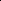

# On Logical Extrapolation for Mazes with Recurrent and Implicit Networks

<!-- Page 1 -->

On Logical Extrapolation for Mazes with Recurrent and Implicit Networks

Brandon Knutson1, Amandin Chyba Rabeendran2, Michael Ivanitskiy1, Jordan Pettyjohn3, Cecilia Diniz Behn1, Samy Wu Fung1, Daniel McKenzie1,

1Department of Applied Mathematics and Statistics, Colorado School of Mines 2Courant Institute of Mathematical Sciences, New York University 3Department of Computer Science, University of Chicago {bknutson,mivanits,cdinizbe,dmckenzie,swufung}@mines.edu, atc9782@nyu.edu, jpettyjohn@uchicago.edu

## Abstract

Recent work suggests that certain neural network architectures—particularly recurrent neural networks (RNNs) and implicit neural networks (INNs)—are capable of logical extrapolation. When trained on easy instances of a task, these networks (henceforth: logical extrapolators) can generalize to more difficult instances. Previous research has hypothesized that logical extrapolators do so by learning a scalable, iterative algorithm for the given task which converges to the solution. We examine this idea more closely in the context of a single task: maze solving. By varying test data along multiple axes — not just maze size — we show that models introduced in prior work fail in a variety of ways, some expected and others less so. It remains uncertain whether any of these models has truly learned an algorithm. However, we provide evidence that a certain RNN has approximately learned a form of ‘deadend-filling’. We show that training these models on more diverse data addresses some failure modes but, paradoxically, does not improve logical extrapolation. We also analyze convergence behavior, and show that models explicitly trained to converge to a fixed point are likely to do so when extrapolating, while models that are not may exhibit more exotic limiting behavior such as limit cycles, even when they correctly solve the problem. Our results (i) show that logical extrapolation is not immune to the problem of goal misgeneralization, and (ii) suggest that analyzing the dynamics of extrapolation may yield insights into designing better logical extrapolators.

Code — https://github.com/mines-opt-ml/robust-maze-learning

## Introduction

A key feature of human learning is the ability to generalize from easy problem instances to harder ones, often by thinking for longer (Schwarzschild et al. 2021b). Work in multiple areas of machine learning has provided empirical evidence that neural networks are also capable of such logical extrapolation (also known as upwards generalization or algorithmic reasoning (Veliˇckovi´c et al. 2022)). Logical extrapolation is a form of out-of-distribution (OOD) generalization in which the test distribution is shifted away from the training distribution along an intuitively defined difficulty

Copyright © 2026, Association for the Advancement of Artificial Intelligence (www.aaai.org). All rights reserved.

**Figure 1.** Three extrapolation dimensions: maze size, percolation, and deadend start. Each shown maze is generated using the indicated parameters. Green denotes the start position and red denotes the target.

axis. These networks usually utilize test-time scaling, which increases their computational budget at test time to boost inference (Dehghani et al. 2018; Gilton, Ongie, and Willett 2021; Schwarzschild et al. 2021b; Bansal et al. 2022; Anil et al. 2022; OpenAI 2024; Geiping et al. 2025). In this work we conduct an in-depth study of logical extrapolation for two classes of neural networks that exhibit test-time scaling by iterating a recurrent block additional times: weight-tied RNNs and INNs, also known as Deep Equilibrium Networks (DEQs) (Bai, Kolter, and Koltun 2019; El Ghaoui et al. 2021; Wu Fung et al. 2022). We focus on a single task — maze-solving — a canonical spatial-reasoning task. We are interested in two intertwined questions:

Q1 Do RNNs and INNs learn an algorithm for maze-solving? Q2 Are the recurrent iterations converging to something? If yes, to what? Does this affect logical extrapolation in any way?

Answering Q1 is necessary for assessing the robustness and trustworthiness of logical extrapolators, as we take ”learn

The Fortieth AAAI Conference on Artificial Intelligence (AAAI-26)

22635

AI-readable visual equivalent, added: Figure extracted from the paper PDF and converted to an SVG wrapper asset. Use the surrounding page text and caption for interpretation.

<!-- Page 2 -->

an algorithm” to mean ”learn a correct and interpretable algorithm that scales to harder problems”. Q2 is important philosophically, as many prior works explain the success of logical extrapolators by claiming that the recurrent part converges to a fixed point. While we confine our analysis to a single task, we suspect our insights will transfer to similar tasks.

To tackle Q1, we use the maze-dataset package (Ivanitskiy et al. 2023, 2025). While previous studies on logical extrapolation in maze-solving have varied the test distribution by increasing maze size only, maze-dataset allows two new distribution shifts: (i) a variable deadend start ∈ {True, False} which, when set to True, constrains the start point to have exactly one neighbor, and (ii) a percolation constant p ∈[0, 1] which probabilistically determines the number of cycles in the maze. See Figure 1. Prior work (Bansal et al. 2022; Anil et al. 2022) has set percolation = 0 and deadend start = True for both training and testing. By varying p and deadend start we expose pretrained models (the RNN of (Bansal et al. 2022) and the INN of (Anil et al. 2022)) to corner cases not considered before. Examining how both models handle mazes containing cycles provides additional evidence that the RNN has learned a variant of the deadendfilling algorithm (Hendrawan 2020b), bolstering results of (Schwarzschild et al. 2023). However, by toggling the seemingly inconsequential deadend start variable, we produce examples of mazes where deadend-filling would succeed, yet both models fail, suggesting that the RNN has not learned deadend-filling. Thus, our answer to Q1 is: A1 Partially. One RNN approximately learns deadend-filling

— it succeeds like deadend-filling on acyclic mazes and fails like deadend-filling on mazes with cycles1. However, it also fails on mazes without a deadend start, revealing a mismatch. We trained many other models, but were unable to find clear-cut evidence of algorithm learning. While (Bansal et al. 2022) observes that, with proper training, RNNs converge to a fixed point even when extrapolating, the results of (Anil et al. 2022) hint at more complex behavior. Specifically, Anil et al. (2022, App. F, App. G) find evidence that RNNs may sometimes converge to limit cycles. To address Q2 rigorously, we quantify this phenomenon using tools from Topological Data Analysis (TDA) (De Silva, Skraba, and Vejdemo-Johansson 2012; Perea and Harer 2015; Tralie and Perea 2018). We find that, while the INN from (Anil et al. 2022) consistently converges to a fixed point, regardless of maze size, the RNN from (Bansal et al. 2022) exhibits more complex limiting behavior. To be correct, the iterative part of a logical extrapolator must converge into the pre-image of the solution after sufficient iterations. However, the exact convergence pattern inside the pre-image does not appear to matter — logical extrapolators that sometimes converge to limit cycles are as performant as extrapolators that always converge to fixed points. Thus, our answer to Q2 is: A2 Yes. Sometimes a fixed point, sometimes something more exotic. No, it doesn’t seem to matter.

1Specifically, the output of the RNN agrees with deadend-filling on 98.8% of 143K test mazes across a variety of sizes and percolation values.

**Figure 2.** Maze input-solution pairs of size 9 × 9 (left) and 49 × 49 (right). Start positions are in green and end positions are in red. Mazes problems/inputs are RGB raster images and solutions are black and white images highlighting the solution path in white.

**Figure 3.** Example of maze with a start position that has multiple neighbors (left); example of a percolated maze (percolation = 0.2) with loops (right).

It is perhaps unsurprising that the pre-trained models we consider (Bansal et al. 2022; Anil et al. 2022) do not generalize to mazes with cycles, as they did not see such mazes in their training data. By retraining them using more diverse training data (i.e., p > 0) we investigate whether these models can be made more performant. We observe that a little bit goes a long way: if even a tiny fraction of training mazes contain cycles, performance is dramatically improved. We hypothesize that this may be because the models have learned to emulate a different maze solving algorithm—one which does generalize to mazes with cycles—although identifying this algorithm remains challenging.

## Preliminaries

and Related Works 2.1 The Maze-Solving Task

In this and prior work (Schwarzschild et al. 2021a,b; Bansal et al. 2022; Anil et al. 2022), maze solving problems are encoded as raster images (Figure 2). Given this RGB input image, the task is to return a black and white image representing the unique path from start to end. We consider the “accuracy” of a model on a single maze to be 1 if its prediction is a valid path of minimal length and 0 otherwise. We use the maze-dataset package (Ivanitskiy et al. 2024, 2025), which provides flexibility to modify maze distributions. The original “easy to hard” dataset (Schwarzschild et al. 2021a) only contains acyclic (i.e. percolation = 0, any path between two nodes is unique) mazes generated via randomized depth-first search (RDFS) and with start positions having exactly degree 1 (i.e., deadend start=True). We remove these restrictions to investigate the behavior of the selected models on out-of-distribution mazes in Section 2.1. More details on our usage of maze-dataset are given in Appendix A.

22636

AI-readable visual equivalent, added: Figure extracted from the paper PDF and converted to an SVG wrapper asset. Use the surrounding page text and caption for interpretation.

AI-readable visual equivalent, added: Figure extracted from the paper PDF and converted to an SVG wrapper asset. Use the surrounding page text and caption for interpretation.

<!-- Page 3 -->

## 2.2 Recurrent Neural

Networks A special class of RNNs, namely, weight-tied input-injected networks (or simply weight-tied RNNs), are used in logical extrapolation (Schwarzschild et al. 2021b; Bansal et al. 2022). For a K-layer weight-tied RNN NΘ, the output is given by

NΘ(d) = PΘ2(uK), where uj = TΘ1(uj−1, d) for j = 1,..., K. (1)

Here, Θ1 and Θ2 are the parameters of the networks TΘ1 and PΘ2 respectively, and Θ:= {Θ1, Θ2}, while d denotes the input features. These networks represent a unique class of architectures that leverage weight sharing across layers to reduce the number of parameters. The input injection at each layer ensures the network does not ‘forget’ the initial data (Bansal et al. 2022). In (Bansal et al. 2022), it is empirically observed that a certain weight-tied RNN extrapolates to larger mazes when applying more iterations. The authors speculate that the reason for this success is that the model has learned to converge to fixed points within its latent space (Section 7, (Bansal et al. 2022)).

## 2.3 Implicit Networks

Drawing motivation from (Bansal et al. 2022), Anil et al. (2022) propose to use implicit neural networks (INNs) for logical extrapolation tasks. INNs are a broad class of architectures whose outputs are the fixed points of an operator parameterized by a neural network. That is,

NΘ(d) = PΘ2(u⋆) where u⋆= TΘ1(u⋆, d). (2)

Here again Θ = {Θ1, Θ2} refers collectively to the parameters of the networks TΘ1 and PΘ2 and d is the input feature, while u⋆represents a fixed point of TΘ. These networks can be interpreted as infinite-depth weight-tied inputinjected recurrent neural networks (El Ghaoui et al. 2021; Bai, Kolter, and Koltun 2019; Winston and Kolter 2020; Fung and Berkels 2024). Unlike traditional networks, INN outputs are not defined by a fixed number of computations but rather by an implicit condition. INNs have been applied to domains as diverse as image classification (Bai, Koltun, and Kolter 2020), inverse problems (Gilton, Ongie, and Willett 2021; Yin, McKenzie, and Fung 2022; Liu et al. 2022; Heaton et al.

2021; Heaton and Wu Fung 2023), optical flow estimation (Bai et al. 2022), game theory (McKenzie et al. 2024), and decision-focused learning (McKenzie, Wu Fung, and Heaton 2024). In principle, INNs are naturally suited for logical extrapolation tasks for which solutions can be characterized by a fixed point condition. Key to logical extrapolation is that this characterization is always the same, regardless of the difficulty of the problem at hand.

## 2.4 Topological Data Analysis in the Latent Space

For both RNNs and INNs, we call {uj}K j=1 ⊂Rn the latent iterates, and n the latent dimension. Note that n may be significantly larger than the output space dimension, so PΘ2 is a projection operator with large-dimensional fibers. Although models are trained to reduce loss (i.e. the discrepancy between NΘ(d) and the true solution x⋆) at every iteration (Bansal et al. 2022; Anil et al. 2022; Schwarzschild et al. 2021b), there is no incentive for the iterative part of the network TΘ1(·, d) to prefer one element of the fiber P −1

Θ2 (x⋆):= {u ∈Rn: PΘ2(u) = x⋆} over another, unless additional constraints are imposed upon TΘ1, such as contractivity (El Ghaoui et al. 2021) or monotonicity (Winston and Kolter 2020). Thus, TΘ1(·, d) may exhibit more complex dynamics than convergence-to-a-point, while NΘ(d) still yields the correct solution. Anil et al. (2022) proposed that, in order for TΘ1(·, d) to exhibit logical extrapolation2, it need not have a unique fixed point, but rather need only possess a global attractor. In other words, no matter which initialization u0 is selected, the latent iterates should exhibit the same asymptotic behaviour. They dub this property “path independence”. In (Anil et al. 2022, App. F, App. G) evidence is provided of instances d where the latent iterates induced by TΘ1(·, d) form a limit cycle, yet NΘ(d) is correct.

If RNNs and INNs can generalize while converging to limit cycles, this has consequences for the design of logical extrapolators. For example, it is common practice to terminate the iteration when the residuals rj:= ∥uj+1−uj∥2 drop below a certain tolerance. However, if the uj have converged to a two-point cycle (see Figure 7) this condition will never be triggered. Thus, it is important to characterize the possible limiting behaviors of the sequence of latent iterates. To do so, we study its shape using topological data analysis (TDA) (De Silva, Skraba, and Vejdemo-Johansson 2012; Perea and Harer 2015; Tralie and Perea 2018). Following prior works using TDA to analyze periodicity (Perea and Harer 2015; Tralie and Perea 2018) we focus on the zeroth and first persistent Betti numbers — denoted as B0 and B1 respectively — of the point cloud {uj}K j=1 ⊂Rn. See Appendix B for precise definitions. TDA examines the shape of the object formed by the union of small balls centered at each uj. B0 counts the number of connected components of this object, while B1 counts the number of loops which encircle a hole (Munch 2017). If the latent iterates have converged to a fixed point, then B0 = 1, B1 = 0, and this holds even if the convergence is only to within some small tolerance. If the latent iterates have converged to a limit cycle, B1 > 0. By computing and interpreting B0 and B1 for a large number of input mazes, we identify three topologically distinct convergence behaviors.

Testing Pre-Trained Models We study two trained maze-solving models from previous works: an RNN from Bansal et al. (2022) which we call DT-Net, and an INN from Anil et al. (2022) which we call PI-Net3. While both works propose multiple models, we focus on the most performant model from each. Both DT-Net and PI-Net contain 0.78M parameters, facilitating fair comparison. DT-Net uses a progressive loss function to encourage improvements at each RNN layer. In this approach, the recurrent module is run for a random number of iterations, and the resulting output is used as the initial input for the RNN, while gradients from the initial iterations

2Note they call this property ‘upwards generalization’. 3PI-Net stands for ‘Path-Independent’ net, as path independence is a feature identified in (Anil et al. 2022) as being strongly correlated with generalization.

22637

<!-- Page 4 -->

**Figure 4.** Left: DT-Net extrapolation accuracy (see Section 2.1) at various maze sizes, with deadend start=True and deadend start=False. Right: Analogous results for PI-Net. Both models extrapolate well to larger mazes given sufficient iterations. However, performance diminishes when the start position is allowed to have neighbors, regardless of the number of iterations. The sample size was limited to 100 mazes due to hours of compute time required for large 99 × 99 mazes.

are discarded. The model is then trained to produce the solution after another random number of iterations. We refer the reader to (Bansal et al. 2022, Section 3.2) for additional details. For PI-Net, path-independence is encouraged in two ways: (i) by using random initialization for half of the batch and zero initialization for the other half, and (ii) by varying the compute budgets/depths of the forward solver during training.

## 3.1 Distribution Shift

Using maze-dataset we explore the out-of-distribution behavior of DT-Net and PI-Net. As shown in Figure 1 we vary the distribution along three dimensions: increasing maze size, setting deadend-start to false, and increasing percolation. Maze size. We first verify the extrapolation performance of DT-Net and PI-Net with increasing maze size. For each maze size n × n, where n ∈{9, 19, 29,..., 99}, we tested each model on 100 mazes. As expected, with sufficient iterations, both models achieve strong performance, confirming the results of (Bansal et al. 2022; Anil et al. 2022). See the plots labeled deadend start=True in Figure 4. Both models achieve perfect accuracy on the 9 × 9 mazes of the training distribution. Furthermore, with 3,000 iterations, DT-Net achieves perfect accuracy and correctly solved all test mazes. PI-Net achieved near perfect accuracy on smaller mazes, but performance diminished for mazes larger than 59 × 59. Importantly, running more iterations usually helps and never harms accuracy. Note that for PI-Net the performance of the model after 1,000 iterations is identical to performance after 3,000 iterations at all tested maze sizes, suggesting that convergence occurred by 1,000 iterations. Deadend start. Allowing the start position to have multiple neighbors, i.e., setting deadend start to False, represents a different out-of-distribution shift from the training dataset. This shift diminishes the performance of both models. See the plots labeled deadend start=False in Figure 4. With this shift, accuracy on 9 × 9 mazes drops from 1.00 to

**Figure 5.** The accuracy of DT-Net rapidly diminishes when percolation increases above 0. DT-Net was iterated 30 times, and the resulting outputs do not change with additional iterations. The corresponding plot for PI-Net is nearly identical.

0.72 for DT-Net and from 1.00 to 0.94 for PI-Net. Interestingly, the fraction of failed predictions remains relatively stable as maze size is increased. There is no clear qualitative difference between mazes that were correctly and incorrectly solved by the models. Both models correctly solve some instances where the start position has multiple neighbors (see Appendix Figure 11). However, we do observe that accuracy decreases monotonically as the degree of the start node increases. There is no discernible pattern to the models’ failures; sometimes they are only one or two pixels away from the correct solution, sometimes they are missing large chunks of the correct path (see Appendix D). Percolation. The final out-of-distribution shift we consider is increasing the percolation value of the test dataset from 0. We reiterate that when percolation equals 0, all mazes are acyclic. Increasing percolation adds cycles to the maze, introducing multiple solutions where there was previously exactly one. This shift significantly reduces accuracy, as shown in Figure 5. Notably, increasing the number of iterations beyond 30 in this setting does not improve model performance.

22638

AI-readable visual equivalent, added: Figure extracted from the paper PDF and converted to an SVG wrapper asset. Use the surrounding page text and caption for interpretation.

AI-readable visual equivalent, added: Figure extracted from the paper PDF and converted to an SVG wrapper asset. Use the surrounding page text and caption for interpretation.

<!-- Page 5 -->

**Figure 6.** Two examples of mazes with cycles. DT-Net fails like deadend-filling by retaining cycles from the input in its prediction. PI-Net approximates deadend-filling but with some segments of white pixels removed. In the first example (top row), IT-Net predicts a minimal path (length 9) that is different from the solution (length 9); in the second example (bottom row), IT-Net predicts a valid non-minimal path (length 11) that is longer than the solution (length 8).

## 3.2 Latent Dynamics

In (Anil et al. 2022, App. F, App. G) evidence of instances d where the latent iterates induced by TΘ1(·, d) form a limit cycle, yet NΘ(d) is correct, is provided. Specifically, the residuals rj:= ∥uj+1 −uj∥2, i.e. the distances between consecutive iterates, are considered. If rj = 0 for all sufficiently large j then the uj have converged to a fixed point. However, (Anil et al. 2022) finds maze instances d such that the residual sequence {rj}K j= ˜ K induced by a variant4 of PI-Net is visually periodic.

We investigate the limiting behavior of PI-Net and DT-Net further. For both models, we consider 100 n × n mazes where n = 9, 19,..., 69. We set percolation = 0 and deadend start=True. We select a “burn-in” parameter ˜K < K and then consider latent iterates {uj}K j= ˜ K. We set ˜K = 3, 001 and K = 3, 400. We observe periodicity of residuals for DT-Net (see Figure 7, third panel) and discover a novel asymptotic behavior of the residuals: convergence to a nonzero value (see Figure 7, panel 1). To explain both behaviors further, we introduce two tools. PCA. Projecting the high-dimensional latent iterates onto their first three principal components provides a glimpse into the underlying geometry of {uj}K j= ˜ K responsible for the observed residual sequences. We identify a sequence of latent iterates for DT-Net that oscillates between two points (see Figure 7, panel 2), yielding constant, non-zero, values of rj equal to the distance between these points. We call such limiting behavior a two-point cycle. We also identify a sequence of latent iterates for DT-Net that oscillates between two loops (see Figure 7, panel 4), yielding values of rj that oscillate around the (non-zero) distance between these loops. We call such limiting behavior a two-loop cycle. To the best of our knowledge, neither of these limiting behaviors has been observed previously in the latent dynamics of a logical extrapolator. TDA. To quantify the frequency with which these limiting

4Although not the variant we consider, see Appendix C.3 for further discussion.

**Figure 7.** Residual plots and corresponding PCA projections for two sequences of DT-Net latent iterates. The left two plots indicate oscillation between two points corresponding to [B0, B1] = [2, 0] for a 19 × 19 maze. The right two plots indicate oscillation between two loops corresponding to [B0, B1] = [2, 2] for a 69 × 69 maze. Both mazes were solved correctly.

behaviors occur, we use TDA (see Section 2.4). This is possible because these limiting behaviors are distinguishable using the zeroth (B0) and first (B1) persistent Betti numbers (see Section 2.4 and Appendix B). Convergence to a point is associated to [B0, B1] = [1, 0], a two-point cycle is associated to [B0, B1] = [2, 0], while a two-loop cycle yields [B0, B1] = [2, 2]. Table 1 summarizes the TDA results.

For PI-Net, every latent sequence converges to a fixedpoint. For DT-Net at every maze size the majority of latent sequences approach a two-point cycle, a minority approach a two-loop cycle, and a few approach some other geometry. We find no correlation between limiting behaviour and accuracy. DT-Net, when given 3000+ iterations, achieves perfect accuracy (see Figure 4, panel 1) even though, for a majority of larger mazes, it converges to a two-point or two-loop cycle. On the other hand, although PI-Net converges to a fixed point for all 69 × 69 mazes we tested, it does not achieve perfect accuracy (see Figure 4, panel 3).

## 4 The Effect of Diversifying Training Data

It is well known that increasing the size of the training dataset improves model generalization (Kaplan et al. 2020). More recent works have also highlighted the importance of training dataset diversity and difficulty for generalization (Rolf et al. 2021; Andreassen et al. 2022). In Section 3 we identified the failure of DT-Net and PI-Net to generalize to mazes with loops. We attempt to address this by training new models on diversified data containing some mazes with loops. We again use DT-Net but replace PI-Net with a simpler

22639

AI-readable visual equivalent, added: Figure extracted from the paper PDF and converted to an SVG wrapper asset. Use the surrounding page text and caption for interpretation.

AI-readable visual equivalent, added: Figure extracted from the paper PDF and converted to an SVG wrapper asset. Use the surrounding page text and caption for interpretation.

<!-- Page 6 -->

n for n × n maze MODEL [B0, B1] 9 19 29 39 49 59

DT-Net [1, 0]∗ 15 0 0 0 0 0

[1, 1] 0 0 0 0

[2, 0] 79 88 95 100 98 98

[2, 1] 0 1 0 0 0 0

[2, 2] 0 5 5 0 2 2

PI-Net [1, 0]∗ 100 100 100 100 100 100

IT-Net [1, 0]∗ 100 100 100 100 100 100

**Table 1.** Betti number frequencies for DT-Net and PI-Net. PI-Net always exhibits fixed-point convergence ([B0, B1] = [1, 0]) whereas DT-Net usually approach a twopoint cycle ([B0, B1] = [2, 0]) or sometimes a two-loop cycle ([B0, B1] = [2, 2]). ∗Sequence converged to within 0.01.

implicit network we call IT-Net.5 We also train and test a model called FF-Net, a fully-convolutional feedforward network with a fixed depth of 30 layers, which serves as a baseline for generalization performance. Unlike DT-Net and IT-Net, FF-Net is incapable of test-time scaling. FF-Net is not weight-tied and so has roughly 10× more weights than IT-Net. To diversify the training data we keep maze size fixed at 9 × 9 while varying the percolation value. Then, we train randomly-initialized instances of DT-Net and IT-Net. We evaluate these models on test data with varying maze size and percolation value; see Figure 9. For more training details, see Appendix C.2.

## Results

Increasing percolation shifts the training distribution closer to that of most test mazes. Thus the observed increase in overall test accuracy shown in Figure 9 and Appendix Figure 13 is expected. We note the surprising jump in overall test accuracy—particularly for DT-Net—in response to a very small increase in percolation from 0 to 0.010. We interpret this switching behavior as a possible indication that diversification induces DT-Net to emulate a different class of algorithms capable of solving mazes with loops. However, this emulation is only approximate. Figure 9 shows that although the overall accuracy of both models increases as p increases, their ability to extrapolate to larger mazes diminishes. We could not identify a clear pattern in (n, p) values for which these models succeed, other than that performance degrades as the test distribution moves away from the training distribution. Consequently, it is hard to say with confidence

5Although the pretrained model and associated code from (Anil et al. 2022) is publicly available and suitable for inference, we encountered difficulties adapting the original implementation for training due to its complexity. To address this and facilitate reproducibility, we developed a simpler, more accessible training implementation.

**Figure 8.** Agreement of pretrained DT-Net and PI-Net with deadend-fill algorithm, across 143K mazes with various size and percolation values. A value of 1.0 (yellow) means predictions perfectly coincide with deadend-filling algorithm, even when incorrect. DT-Net shows near perfect agreement, whereas PI-Net predictions were often qualitatively similar but different by multiple pixels, resulting in low agreement.

that any of these models are behaving algorithmically.

DT-Net and IT-Net have different architectures and were trained with different techniques. And yet Figure 9 and Appendix Figure 13 show that both models generalize nearly equally well. This suggests that generalization is more sensitive to the diversity of the training dataset than the choice of model. Nonetheless, the results indicate specific models may be more suited for different extrapolation directions. Figure 9 shows DT-Net trained with percolation = 0 perfectly solves larger mazes despite only seeing 9×9 mazes in training, and IT-Net trained with percolation = 0 solves mazes with cycles better than the other models despite never seeing cycles in training.

## 5 Have These Networks Learned an

Algorithm?

In analyzing the failures of the pretrained DT-Net on mazes with cycles (see Figure 6) and deadend start=True we observed that the cycles remain part of the output. This is characteristic of the deadend-filling algorithm (Hendrawan 2020a) for maze solving. To study this further, we implemented deadend-filling, generated a large dataset (143K) of mazes with varying percolation and size, and compared the outputs of DT-Net to deadend-filling on these mazes. Our analysis reveals that DT-Net matches the output of deadendfilling — succeeding when deadend-filling succeeds, yielding the same incorrect output when deadend-filling fails — 98.8% of the time (see Figure 8). It appears that DT-Net has indeed learned to emulate6 deadend-filling, at least when deadend start=True.

6We use the word ‘emulate’ to describe this form of agreement between a logical extrapolator and an algorithm. A stronger form of agreement is to match the iterates of the logical extrapolator to the iterates of the algorithm (Veliˇckovi´c et al. 2022). Some evidence that DT-Net and deadend-filling agree in this stronger sense is provided in (Schwarzschild et al. 2023).

22640

AI-readable visual equivalent, added: Figure extracted from the paper PDF and converted to an SVG wrapper asset. Use the surrounding page text and caption for interpretation.

<!-- Page 7 -->

0.0

0.5 ff_net

Test Perc.

Train Perc.

=0.000

Train Perc.

=0.001

Train Perc.

=0.010

Train Perc.

=0.100

Train Perc.

=0.500

Train Perc.

=0.990

0.0

0.5 dt_net

Test Perc.

10 20 30 Maze Size

0.0

0.5 it_net

Test Perc.

10 20 30 Maze Size

10 20 30 Maze Size

10 20 30 Maze Size

10 20 30 Maze Size

10 20 30 Maze Size 0.0

0.2

0.4

0.6

0.8

1.0

Test Accuracy

Training distribution

**Figure 9.** Heatmaps of test accuracy for FF-Net (top row), DT-Net (middle row) and IT-Net (bottom row) across various test maze sizes and test percolation values. A slight increase to training percolation (i.e. moving the gold star up) causes a dramatic increase in overall test accuracy. Each cell corresponds to 1,000 sampled test mazes.

The situation with the pretrained PI-Net is less clear. As shown in Figure 8, PI-Net has low agreement with deadendfilling. However, a closer examination of PI-Net predictions reveals that the disagreement with deadend-filling is often very minor. PI-Net predictions are usually qualitatively very similar to deadend-filling. But for mazes that are large or contain many cycles, PI-Net predictions match deadendfilling but with some segments of white pixels removed (see Figure 6), causing a low agreement. This slight difference with deadend-filling causes the disagreement shown in Figure 8 and suggests that PI-Net also has learned to approximate deadend-fill, but less successfully.

The models trained on diversified data showed superior overall accuracy (see Figure 9) but worse logical extrapolation performance. Further, their predictions were less qualitatively consistent and thus difficult to identify with an algorithm.

## 6 Limitations

One limitation of our work is that we limit ourselves to a single task. We focus on maze solving because it offers a variety of relatively intuitive distributional shifts (see Figure 1). It would be interesting to apply our approach to other logical extrapolation tasks. A second, more philosophical weakness relates to what it means to ‘learn an algorithm’, and what shifts of the test distribution should be considered reasonable.

## Discussion

and Conclusion We present an in-depth look into logical extrapolation for a particular task: maze-solving. We confirm that by increasing the test-time compute budget (i.e., the number of iterations) certain models can solve much larger mazes than those in the training data, an impressive feat of OOD generalization. However, these models fail in interesting ways when the test distribution is shifted along other axes of difficulty. The observed failure modes indicate that logical extrapolators sometimes behave algorithmically, and we present evidence that DT-Net (Bansal et al. 2022) has indeed learned to emulate a simple algorithm for maze-solving, deadend-filling. As deadend-filling is known to fail on mazes with cycles, this also suggests that goal misgeneralization (Shah et al. 2022; Langosco et al. 2022) may be the cause of the observed failures. Perhaps logical extrapolators are learning the simplest algorithm which fits the training data?

However, our experiments with training data diversification show that getting a neural network to learn an algorithm is a challenging task. Although adding mazes with cycles to the training data boosts model performance, the resulting models do not appear to behave algorithmically, and their ability to extrapolate to larger mazes is diminished. Moreover, we show that logical extrapolators can succeed even when their iterative part does not converge to a fixed point, and identify and quantify two exotic limiting behaviors. This complicates the view of logical extrapolators as fixed-point-finding routines (Bansal et al. 2022). This also has consequences for training techniques which assume convergence to a fixed point (Wu Fung et al. 2022; Geng et al. 2021b,a; Ramzi et al. 2022).

To conclude, although there does appear to be something special about logical extrapolation, the usual caveats about OOD generalization still apply. Logical extrapolators may appear to behave algorithmically when the variation of the test distribution is tightly controlled, but respond in unexpected ways to other distribution shifts, much like other neural networks (Darestani, Chaudhari, and Heckel 2021; Gottschling et al. 2025; Heckel et al. 2024). Future work should focus on identifying conditions under which reliable algorithm learning is possible or reliable, and further exploring the relation of latent dynamics with logical extrapolation.

22641

AI-readable visual equivalent, added: Figure extracted from the paper PDF and converted to an SVG wrapper asset. Use the surrounding page text and caption for interpretation.

AI-readable visual equivalent, added: Figure extracted from the paper PDF and converted to an SVG wrapper asset. Use the surrounding page text and caption for interpretation.

AI-readable visual equivalent, added: Figure extracted from the paper PDF and converted to an SVG wrapper asset. Use the surrounding page text and caption for interpretation.

AI-readable visual equivalent, added: Figure extracted from the paper PDF and converted to an SVG wrapper asset. Use the surrounding page text and caption for interpretation.

AI-readable visual equivalent, added: Figure extracted from the paper PDF and converted to an SVG wrapper asset. Use the surrounding page text and caption for interpretation.

AI-readable visual equivalent, added: Figure extracted from the paper PDF and converted to an SVG wrapper asset. Use the surrounding page text and caption for interpretation.

AI-readable visual equivalent, added: Figure extracted from the paper PDF and converted to an SVG wrapper asset. Use the surrounding page text and caption for interpretation.

AI-readable visual equivalent, added: Figure extracted from the paper PDF and converted to an SVG wrapper asset. Use the surrounding page text and caption for interpretation.

AI-readable visual equivalent, added: Figure extracted from the paper PDF and converted to an SVG wrapper asset. Use the surrounding page text and caption for interpretation.

AI-readable visual equivalent, added: Figure extracted from the paper PDF and converted to an SVG wrapper asset. Use the surrounding page text and caption for interpretation.

AI-readable visual equivalent, added: Figure extracted from the paper PDF and converted to an SVG wrapper asset. Use the surrounding page text and caption for interpretation.

AI-readable visual equivalent, added: Figure extracted from the paper PDF and converted to an SVG wrapper asset. Use the surrounding page text and caption for interpretation.

AI-readable visual equivalent, added: Figure extracted from the paper PDF and converted to an SVG wrapper asset. Use the surrounding page text and caption for interpretation.

AI-readable visual equivalent, added: Figure extracted from the paper PDF and converted to an SVG wrapper asset. Use the surrounding page text and caption for interpretation.

AI-readable visual equivalent, added: Figure extracted from the paper PDF and converted to an SVG wrapper asset. Use the surrounding page text and caption for interpretation.

AI-readable visual equivalent, added: Figure extracted from the paper PDF and converted to an SVG wrapper asset. Use the surrounding page text and caption for interpretation.

AI-readable visual equivalent, added: Figure extracted from the paper PDF and converted to an SVG wrapper asset. Use the surrounding page text and caption for interpretation.

AI-readable visual equivalent, added: Figure extracted from the paper PDF and converted to an SVG wrapper asset. Use the surrounding page text and caption for interpretation.

AI-readable visual equivalent, added: Figure extracted from the paper PDF and converted to an SVG wrapper asset. Use the surrounding page text and caption for interpretation.

<!-- Page 8 -->

## Acknowledgments

This work was supported by the National Science Foundation under Grant DMS-2309810.

## References

Andreassen, A. J.; Bahri, Y.; Neyshabur, B.; and Roelofs, R. 2022. The Evolution of Out-of-Distribution Robustness Throughout Fine- Tuning. Transactions on Machine Learning Research. Anil, C.; Pokle, A.; Liang, K.; Treutlein, J.; Wu, Y.; Bai, S.; Kolter, J. Z.; and Grosse, R. B. 2022. Path Independent Equilibrium Models Can Better Exploit Test-Time Computation. In Koyejo, S.; Mohamed, S.; Agarwal, A.; Belgrave, D.; Cho, K.; and Oh, A., eds., Advances in Neural Information Processing Systems, volume 35, 7796–7809. Curran Associates, Inc. Bai, S.; Geng, Z.; Savani, Y.; and Kolter, J. Z. 2022. Deep equilibrium optical flow estimation. In Proceedings of the IEEE/CVF conference on computer vision and pattern recognition, 620–630. Bai, S.; Kolter, J. Z.; and Koltun, V. 2019. Deep Equilibrium Models. Advances in Neural Information Processing Systems, 32.

Bai, S.; Koltun, V.; and Kolter, J. Z. 2020. Multiscale Deep Equilibrium Models. Advances in Neural Information Processing Systems, 33: 5238–5250. Bansal, A.; Schwarzschild, A.; Borgnia, E.; Emam, Z.; Huang, F.; Goldblum, M.; and Goldstein, T. 2022. End-to-end Algorithm Synthesis with Recurrent Networks: Extrapolation without Overthinking. In Koyejo, S.; Mohamed, S.; Agarwal, A.; Belgrave, D.; Cho, K.; and Oh, A., eds., Advances in Neural Information Processing Systems, volume 35, 20232–20242. Curran Associates, Inc. Darestani, M. Z.; Chaudhari, A. S.; and Heckel, R. 2021. Measuring robustness in deep learning based compressive sensing. In International Conference on Machine Learning, 2433–2444. PMLR. De Silva, V.; Skraba, P.; and Vejdemo-Johansson, M. 2012. Topological Analysis of Recurrent Systems. In NIPS 2012 Workshop on Algebraic Topology and Machine Learning, December 8th, Lake Tahoe, Nevada, 1–5.

Dehghani, M.; Gouws, S.; Vinyals, O.; Uszkoreit, J.; and Kaiser, Ł. 2018. Universal transformers. arXiv preprint arXiv:1807.03819. El Ghaoui, L.; Gu, F.; Travacca, B.; Askari, A.; and Tsai, A. 2021. Implicit Deep Learning. SIAM Journal on Mathematics of Data Science, 3(3): 930–958. Fung, S. W.; and Berkels, B. 2024. A Generalization Bound for a Family of Implicit Networks. arXiv preprint arXiv:2410.07427. Geiping, J.; McLeish, S.; Jain, N.; Kirchenbauer, J.; Singh, S.; Bartoldson, B. R.; Kailkhura, B.; Bhatele, A.; and Goldstein, T. 2025. Scaling up Test-Time Compute with Latent Reasoning: A Recurrent Depth Approach. arXiv preprint arXiv:2502.05171. Geng, Z.; Guo, M.-H.; Chen, H.; Li, X.; Wei, K.; and Lin, Z. 2021a. Is Attention Better Than Matrix Decomposition? In International Conference on Learning Representations. Geng, Z.; Zhang, X.-Y.; Bai, S.; Wang, Y.; and Lin, Z. 2021b. On Training Implicit Models. Advances in Neural Information Processing Systems, 34: 24247–24260. Gilton, D.; Ongie, G.; and Willett, R. 2021. Deep Equilibrium Architectures for Inverse Problems in Imaging. IEEE Transactions on Computational Imaging, 7: 1123–1133. Gottschling, N. M.; Antun, V.; Hansen, A. C.; and Adcock, B. 2025. The Troublesome Kernel: On Hallucinations, No Free Lunches, and the Accuracy-Stability Tradeoff in Inverse Problems. SIAM Review, 67(1): 73–104.

Heaton, H.; and Wu Fung, S. 2023. Explainable AI via learning to optimize. Scientific Reports, 13(1): 10103. Heaton, H.; Wu Fung, S.; Gibali, A.; and Yin, W. 2021. Feasibilitybased fixed point networks. Fixed Point Theory and Algorithms for Sciences and Engineering, 2021: 1–19. Heckel, R.; Jacob, M.; Chaudhari, A.; Perlman, O.; and Shimron, E. 2024. Deep learning for accelerated and robust MRI reconstruction. Magnetic Resonance Materials in Physics, Biology and Medicine, 37(3): 335–368. Hendrawan, Y. 2020a. Comparison of Hand Follower and Dead-End Filler Algorithm in Solving Perfect Mazes. In Journal of Physics: Conference Series, volume 1569, 022059. IOP Publishing. Hendrawan, Y. F. 2020b. Comparison of Hand Follower and Dead- End Filler Algorithm in Solving Perfect Mazes. Journal of Physics: Conference Series, 1569(2): 022059. Ivanitskiy, M.; Spies, A. F.; R¨auker, T.; Corlouer, G.; Mathwin, C.; Quirke, L.; Rager, C.; Shah, R.; Valentine, D.; Behn, C. D.; Inoue, K.; and Fung, S. W. 2024. Linearly Structured World Representations in Maze-Solving Transformers. In Fumero, M.; Rodol´a, E.; Domine, C.; Locatello, F.; Dziugaite, K.; and Mathilde, C., eds., Proceedings of UniReps: the First Workshop on Unifying Representations in Neural Models, volume 243 of Proceedings of Machine Learning Research, 133–143. PMLR. Ivanitskiy, M. I.; Sandoval, A.; Spies, A. F.; R¨auker, T.; Knutson, B.; Behn, C. D.; and Fung, S. W. 2025. maze-dataset: Maze Generation with Algorithmic Variety and Representational Flexibility. Journal of Open Source Software, 10(114): 8633. Ivanitskiy, M. I.; Shah, R.; Spies, A. F.; R¨auker, T.; Valentine, D.; Rager, C.; Quirke, L.; Mathwin, C.; Corlouer, G.; Behn, C. D.; and Fung, S. W. 2023. A Configurable Library for Generating and Manipulating Maze Datasets. arXiv:2309.10498. Kaplan, J.; McCandlish, S.; Henighan, T.; Brown, T. B.; Chess, B.; Child, R.; Gray, S.; Radford, A.; Wu, J.; and Amodei, D. 2020. Scaling Laws for Neural Language Models. arXiv:2001.08361. Langosco, L. L. D.; Koch, J.; Sharkey, L. D.; Pfau, J.; and Krueger, D. 2022. Goal Misgeneralization in Deep Reinforcement Learning. In Chaudhuri, K.; Jegelka, S.; Song, L.; Szepesvari, C.; Niu, G.; and Sabato, S., eds., Proceedings of the 39th International Conference on Machine Learning, volume 162 of Proceedings of Machine Learning Research, 12004–12019. PMLR. Liu, J.; Xu, X.; Gan, W.; Kamilov, U.; et al. 2022. Online deep equilibrium learning for regularization by denoising. Advances in Neural Information Processing Systems, 35: 25363–25376. McKenzie, D.; Heaton, H.; Li, Q.; Wu Fung, S.; Osher, S.; and Yin, W. 2024. Three-Operator Splitting for Learning to Predict Equilibria in Convex Games. SIAM Journal on Mathematics of Data Science, 6(3): 627–648. McKenzie, D.; Wu Fung, S.; and Heaton, H. 2024. Differentiating Through Integer Linear Programs with Quadratic Regularization and Davis-Yin Splitting. Transactions on Machine Learning Research. Munch, E. 2017. A User’s Guide to Topological Data Analysis. Journal of Learning Analytics, 4(2): 47–61. OpenAI. 2024. Learning to Reason with LLMs. Accessed: 2025- 04-27. Perea, J. A.; and Harer, J. 2015. Sliding Windows and Persistence: An Application of Topological Methods to Signal Analysis. Foundations of Computational Mathematics, 15: 799–838. Ramzi, Z.; Mannel, F.; Bai, S.; Starck, J.-L.; Ciuciu, P.; and Moreau, T. 2022. SHINE: SHaring the INverse Estimate from the forward pass for bi-level optimization and implicit models. In ICLR 2022- International Conference on Learning Representations.

22642

<!-- Page 9 -->

Rolf, E.; Worledge, T. T.; Recht, B.; and Jordan, M. 2021. Representation Matters: Assessing the Importance of Subgroup Allocations in Training Data. In Meila, M.; and Zhang, T., eds., Proceedings of the 38th International Conference on Machine Learning, volume 139 of Proceedings of Machine Learning Research, 9040–9051. PMLR. Schwarzschild, A.; Borgnia, E.; Gupta, A.; Bansal, A.; Emam, Z.; Huang, F.; Goldblum, M.; and Goldstein, T. 2021a. Datasets for Studying Generalization from Easy to Hard Examples. Schwarzschild, A.; Borgnia, E.; Gupta, A.; Huang, F.; Vishkin, U.; Goldblum, M.; and Goldstein, T. 2021b. Can You Learn an Algorithm? Generalizing from Easy to Hard Problems with Recurrent Networks. Advances in Neural Information Processing Systems, 34: 6695–6706. Schwarzschild, A.; McLeish, S. M.; Bansal, A.; Diaz, G.; Stein, A.; Chandnani, A.; Saha, A.; Baraniuk, R.; Tran-Thanh, L.; Geiping, J.; et al. 2023. Algorithm Design for Learned Algorithms. Shah, R.; Varma, V.; Kumar, R.; Phuong, M.; Krakovna, V.; Uesato, J.; and Kenton, Z. 2022. Goal Misgeneralization: Why Correct Specifications Aren’t Enough For Correct Goals. arXiv:2210.01790. Tralie, C. J.; and Perea, J. A. 2018. (Quasi)Periodicity Quantification in Video Data, Using Topology. SIAM Journal on Imaging Sciences, 11(2): 1049–1077. Veliˇckovi´c, P.; Badia, A. P.; Budden, D.; Pascanu, R.; Banino, A.; Dashevskiy, M.; Hadsell, R.; and Blundell, C. 2022. The clrs algorithmic reasoning benchmark. In International Conference on Machine Learning, 22084–22102. PMLR. Winston, E.; and Kolter, J. Z. 2020. Monotone operator equilibrium networks. Advances in neural information processing systems, 33: 10718–10728. Wu Fung, S.; Heaton, H.; Li, Q.; McKenzie, D.; Osher, S.; and Yin, W. 2022. JFB: Jacobian-Free Backpropagation for Implicit

Networks. In Proceedings of the AAAI Conference on Artificial Intelligence, volume 36, 6648–6656. Yin, W.; McKenzie, D.; and Fung, S. W. 2022. Learning to Optimize: Where Deep Learning Meets Optimization and Inverse Problems. SIAM News.

22643
