# OscuFit: Learning to Fit Osculating Implicit Quadrics for Point Clouds

<!-- Page 1 -->

OscuFit: Learning to Fit Osculating Implicit Quadrics for Point Clouds

Rao Fu1, Qian Li2, Liang Yu3, Jianmin Zheng1,*

1Nanyang Technological University, Singapore 2Hohai University, China 3Alibaba Group, China {rao.fu, asjmzheng}@ntu.edu.sg, qian.li@hhu.edu.cn, liangyu.yl@alibaba-inc.com

## Abstract

This paper addresses the challenge of estimating local surface differential properties, specifically surface normals and curvatures, from raw 3D point clouds. Traditional methods either rely on fitting pre-defined analytic surfaces risking model bias, or directly regress normals and curvatures overlooking their intrinsic geometric correlation. We propose a learning-based approach that locally fits osculating implicit quadrics to recover both normals and curvatures simultaneously. Drawing on classical differential geometry, we exploit the fact that every point on a C2 surface admits an osculating quadric in Monge form that exactly reproduces local differential properties. However, the Monge frame itself depends on the very differential quantities being estimated. To bypass this circularity, we reformulate the Monge-form quadric as an implicit representation in a canonical local frame derived solely from point coordinates, enabling supervised learning without requiring Monge frame alignment. This reformulation allows us to construct a ground-truth dataset of such local-frame quadrics and train a neural network to predict perpoint weights and offsets for a robust weighted least squares fitting process. The learned offsets account for the deviations of neighboring points from the idealized osculating surface. We further incorporate stable curvature formulations into the training loss alongside normal supervision to enhance estimation fidelity. Extensive experiments on diverse datasets demonstrate that our method outperforms prior approaches in normal and curvature estimation from raw point clouds.

Code — https://github.com/bizerfr/OscuFit

## Introduction

Estimating local shape differential properties such as surface normals and curvatures from raw point clouds is a fundamental yet challenging task due to the discrete nature of point-based data. The differential quantities are essential for a variety of downstream applications such as point cloud registration (Pomerleau et al. 2015; Aoki et al. 2019), semantic segmentation (Kalogerakis, Hertzmann, and Singh 2010; Kim et al. 2013; Thomas et al. 2018), neural rendering (Gouraud 1998; Mildenhall et al. 2020; Verbin et al. 2022), surface reconstruction (Kazhdan, Bolitho, and Hoppe

*Corresponding author. Copyright © 2026, Association for the Advancement of Artificial Intelligence (www.aaai.org). All rights reserved.

2006; Kazhdan and Hoppe 2013; Williams et al. 2019), and point cloud upsampling (Huang et al. 2013).

Classical methods estimate differential properties by fitting pre-defined analytic surfaces such as polynomials (Cazals and Pouget 2005) or radial basis functions (Carr et al. 2001) to the point cloud either locally or globally, and then derive the desired quantities from the fitted surface. However, these methods suffer from model bias, as real-world surfaces may not adhere to such restrictive functional forms. Subsequent learning-based approaches, such as PCPNet (Guerrero et al. 2018), directly regress normals and curvatures using neural networks, but treat them as independent targets, neglecting their geometric correlation. More recently, hybrid methods like DeepFit (Ben-Shabat and Gould 2020) and Adafit (Zhu et al. 2021) leverage learning to improve surface fitting through weighted least squares (WLSQ), where the pointwise weights are predicted by a neural network and supervised using ground-truth normals. Nevertheless, they still rely on analytic surface assumptions and thus inherit model bias. Moreover, curvature estimation is excluded from training due to numerical instability in backpropagation, offering no guarantees for accurate curvature prediction (Ben-Shabat and Gould 2020). These limitations motivate a new framework that avoids model bias while jointly estimating normals and curvatures.

From the perspective of differential geometry, osculating quadric surfaces provides a local approximation of the original underlying surface, which exactly matches the surface normal and curvatures at a given point (Do Carmo 2016). For any locally C2 surface, there exists an osculating surface that can be expressed in Monge form. The Monge form is an explicit function defined in a local coordinate system called Monge frame, whose axes are given by the surface normal and the two principal directions (Cazals and Pouget 2005). Unlike pre-defined analytic surfaces, the Monge form introduces no model bias and theoretically guarantees exact agreement with local differential properties up to the second order. However, inferring the Monge form from raw point clouds is challenging. First, the Monge form is defined in the Monge frame, which itself depends on differential properties that we aim to predict. Second, the Monge surface is tangent at the query point, but neighboring points may deviate from it, leading to approximation errors during fitting.

To address these challenges, we reformulate the Monge-

The Fortieth AAAI Conference on Artificial Intelligence (AAAI-26)

<!-- Page 2 -->

form quadric as an implicit representation in a canonical local frame derived solely from point coordinates and propose a learning-based framework to predict pointwise weights and offsets for a weighted least squares (WLSQ) fitting of the osculating surface. Unlike Adafit (Zhu et al. 2021), our method introduces offsets to account for the deviation of neighbor points from the real osculating surface. Rather than fitting the classical Monge form, which requires prior knowledge of the Monge frame, we fit a reformulated osculating implicit quadric in a canonical local frame derived solely from point coordinates. Moreover, we transform the WLSQ fitting to a Rayleigh quotient problem, whose optimal solution corresponds to the eigenvector associated with the smallest eigenvalue of a 3 × 3 matrix. Additionally, we supervise our network using the transformed Monge form, surface normals, and curvatures, with mean and Gaussian curvatures expressed in closed-form and computed via numerically stable formulations. To summarize,

• We present a novel learning-based framework that, for the first time, incorporates the formulation of osculating quadrics into point cloud analysis for estimating local surface differential properties. Rooted in differential geometry, our method fits osculating quadrics through learned weights and offsets, enabling accurate and geometrically consistent estimation of normals and curvatures. • We design geometry-aware loss functions that supervise learning using transformed Monge forms, normals, and both Gaussian and mean curvatures. All curvature terms are derived in closed form to ensure numerical stability and enable effective joint optimization. • We formulate the WLSQ fitting as a Rayleigh quotient problem, which can be efficiently solved via eigen decomposition of a 3 × 3 matrix, enabling fast and accurate estimation of the optimal implicit quadric surface in a manner fully compatible with end-to-end learning. • We construct a new dataset, ABC-Diff, which provides precise ground-truth normals, principal curvatures, and principal directions analytically derived from accurate CAD geometry. Unlike previous datasets that rely on mesh-based approximations and often omit principal directions, ABC-Diff offers comprehensive and highly accurate differential properties.

Related Works

Normal Only. The normals represent the first-order differential property of a surface. Principal Component Analysis (PCA) (Hoppe et al. 1992) estimates normals by computing the eigenvector corresponding to the smallest eigenvalue of the local covariance matrix. A variant of PCA (Mitra and Nguyen 2003) optimizes the neighborhood size to improve accuracy. Voronoi-based methods (Amenta and Bern 1998; Alliez et al. 2007; M´erigot, Ovsjanikov, and Guibas 2010) approximate normals using the Voronoi diagram, where normals are derived from Voronoi poles. Similarly, the Randomized Hough Transform (RHT) (Boulch and Marlet 2012) estimates normals by identifying the maximum of a discrete probability distribution over all possible normal directions. More recently, researchers have focused on employing deep neural networks to predict normals from point clouds. NestiNet (Ben-Shabat, Lindenbaum, and Fischer 2019) leverages PointNet-like architectures (Qi et al. 2017) to regress normals from local patches. A deep iterative method (Lenssen, Osendorfer, and Masci 2020) estimates the tangent plane using a weighted covariance matrix. HSurfNet (Li et al. 2022b) employs a more complex structure, referred to as a hyper-surface, to regress normals from local patches. NeAF (Li et al. 2023c) estimates normals for point cloud patch by learning an angular fields. Du et al. (Du et al. 2023) refine initially estimated normals by adding angular offsets predicted by an MLP. CMGNet (Wu et al. 2024) proposes a Chamfer Normal Distance to address the normal direction inconsistency. Additionally, unsupervised approaches (Li et al. 2023a, 2024b) learn a signed distance function (SDF), where normal vectors are obtained as the gradient of the learned SDF. Although normal orientation is a global property beyond our scope, we also briefly review relevant methods. SHSNet (Li et al. 2023b, 2024a) utilizes a neural network to predict a sign function from globally sampled points to orient normals. Li et al. (Li et al. 2025) incorporate camera parameters as additional inputs to estimate oriented normals. Curvatures Only. Curvature represents the secondorder differential property of a surface. Kalogerakis et al. (Kalogerakis et al. 2007) fit the shape operator of the surface using pairs of neighbor points with corresponding normals. However, this method is sensitive to noise and non-uniform sampling. Lejemble et al. (Lejemble et al. 2021) fit algebraic spheres to estimate curvatures. However, since all normal curvatures on a sphere are equal, this method only ensures accurate mean curvature. More recently, Lachaud (Lachaud et al. 2023) proposes a method to estimate the full curvature tensor by generating random triangles within the local neighborhood and normalizing the corrected curvature measures (Lachaud et al. 2020; Lachaud, Romon, and Thibert 2022) with a corrected area measure. However, the method relies on high-quality input normals and is sensitive to hyperparameter settings. Normal Plus Curvatures. Normal and curvatures can be estimated jointly. Jets (Cazals and Pouget 2005) fit pre-defined local polynomials to a neighborhood of a query point and then derive differential properties from the fitted polynomials. Wavejets (B´earzi, Digne, and Chaine 2018) adopt a similar approach but decompose the polynomials into a radial component and angular oscillations, introducing a new set of basis functions known as Wavejets. DeepFit (Ben- Shabat and Gould 2020) further improves jets by incorporating learned weights from neural networks, reformulating the fitting process as a weighted least squares (WLSQ) optimization. AdaFit (Zhu et al. 2021) improves DeepFit by introducing learned offsets to address outliers and the order inconsistency inherent in Jet-based methods. GraphFit (Li et al. 2022a) leverages graph neural networks to learn pointwise weights and offsets for WLSQ fitting. However, all these methods suffer from model bias, as real-world surfaces may not conform to restrictive functional forms such as polynomials, and they often fail to incorporate curvature estimation into the training due to numerical instability.

<!-- Page 3 -->

Normal 𝒏

Gaussian Curvature 𝜅g

Mean Curvature 𝜅m

Data Pre-processing

Weights 𝑤𝑖

Offsets ∆𝒑𝑖

Predicting Weights and Offsets

Quadric Coefficients 𝒖∗

A Point Cloud 𝑷

Extracting local patch 𝑷𝐾and applying transformation 𝒖 𝒏 𝜅g 𝜅m

Supervision

GT s. t. 𝑔2 + ℎ2 + 𝑖2 = 1

WLSQ Fitting

**Figure 1.** The pipeline of our method for estimating the normal n, Gaussian curvature κg, and mean curvature κm for each query point of a given point cloud P. First, we extract a local patch for each query using K nearest neighbor search, and transform the patch into a local coordinate frame in the data pre-processing step. Second, a neural network predicts weights wi and offsets ∆pi for each points in the local patch. Finally, we perform WLSQ fitting of an osculating implicit quadric using the offset-adjusted points, from which the differential properties are analytically derived. The network is trained using ground-truth supervision from the transformed Monge coefficients ˆu, normals ˆn, Gaussian curvature ˆκg, and mean curvature ˆκm.

## Method

Our method takes as input a point cloud P sampled from an unknown surface M, and outputs normal, Gaussian and mean curvatures for each query point p ∈P. The pipeline consists of three main steps. First, we extract the K nearest neighbors for each query point p to form a local patch, which is then normalized and transformed using PCA into a local coordinate frame. We denote the transformed local patch by PK. Second, a neural network takes the transformed local patch as input and predicts weights and offsets for each neighbor point, where weights guide the weighted least squares (WLSQ) fitting and offsets correct deviations of neighbor points from the osculating surface. Third, we perform WLSQ fitting of an osculating implicit quadric using predicted weights and offsets for each query, from which the differential properties are derived. During training, the neural network is supervised using the transformed Monge form, surface normals, and both Gaussian and mean curvatures. An overview of the pipeline is shown in Fig. 1.

## Preliminaries

We begin by briefly reviewing the standard second-order Monge form, simply referred to as the Monge form. It is defined in the Monge frame, which is centered at a query point located on M and constructed from an orthonormal basis formed by the surface normal and two principal directions. The Monge form is defined as:

z = 1

2(κ1x2 + κ2y2), (1)

where κ1 and κ2 are the principal curvatures. The Monge form defines a local osculating surface at a query point, that matches the normal and curvatures, with the normal aligned to the z-axis of Monge frame, i.e., [0, 0, ±1]. Its compact and analytical structure facilitates the process of estimating local differential properties.

Data Pre-processing We follow the data pre-processing strategy of DeepFit (Ben- Shabat and Gould 2020). For each query point, we extract its K nearest neighbors to form a local patch, translate it to center the query at the origin, and normalize it into a unit sphere using the distance to the farthest neighbor. We then apply PCA to obtain a local coordinate frame, referred to as the local PCA frame, with the corresponding rotation matrix denoted as RPCA, whose columns are the principal directions of the covariance matrix obtained from PCA. We denote the normalized local patch in local PCA frame as PK = {pi}K

## 1 Beyond DeepFit, we also construct the Monge form using ground truth differential properties from

Eq.(1) for each query point to serve as training supervision. However, we do not use the standard Monge form directly. Instead, we transform it into the local PCA frame, where it admits a closed implicit expression. Direct use of the standard Monge form is infeasible because it is defined in the unknown Monge frame. By expressing the Monge form in the local PCA frame, which is derived solely from local point coordinates, we enable supervision of the osculating surface without requiring the construction of the Monge frame.

Specifically, let xM ∈R3 denote the coordinates of a point in the Monge frame {pW, dW

1, dW 2, nW}, where pW is the position of the query point in the world frame, and dW

1, dW

2, and nW are the principal directions and surface normal at p, all expressed in the world frame. The standard Monge form in Eq. (1) can be rewritten in implicit matrix form as: xT

MQMxM + bT

MxM = 0, where QM = Diag(1

2κ1, 1 2κ2, 0) is a 3 × 3 diagonal matrix encoding the principal curvatures in the Monge frame, and bM = [0, 0, −1]T is a column vector ensuring unit normal alignment at the origin. For simplicity, we use x to denote the coordinates in PCA frame. Then, we have: x = RM PxM, where RM P ∈R3×3 denotes the rotation matrix that aligns the Monge frame to the PCA frame. And RM P = RT

PCA[dW

1, dW 2, nW], where RPCA is the PCA basis matrix whose columns are principal directions of PCA in the world frame. Finally, the osculating quadric in the local PCA frame is:

xT RM PQMRT

M P | {z } Q x + bT

MRT

M P | {z } bT x = 0, (2)

where Q ∈R3×3 denotes the second-order coefficient matrix, and b ∈R3 denotes the first-order coefficient vector. Moreover, ∥b∥≡1 holds as a structural identity, due to the fact that rotating a unit vector bM will not change the length.

WLSQ Fitting The underlying mathematical model of our method is WLSQ fitting of the Osculating implicit Quadric defined in

AI-readable visual equivalent, added: Figure extracted from the paper PDF and converted to an SVG wrapper asset. Use the surrounding page text and caption for interpretation.

<!-- Page 4 -->

Eq.(2), from which the differential properties are analytically derived.

Let O = {x ∈R3|f(x) = 0} denote the quadratic osculating surface, where f(x) = xT Qx + bT x is the associated implicit function in matrix form. By expanding f(x), we rewrite it in scalar form as: f(x, y, z) = ϕT (x, y, z)u. ϕ(x, y, z) ∈R9 is the vector of polynomial terms:

ϕ(x, y, z) = [x2, y2, z2, xy, xz, yz, x, y, z]T, (3)

and u = [a, b, c, d, e, f, g, h, i]T denotes the coefficients corresponding to Q and b in Eq. (2).

The implicit function f(x, y, z) measures the algebraic distance from x ∈R3 to the quadratic surface O. A straightforward approach to fitting O to the local patch Pk is to minimize the sum of squared algebraic distances:

u⋆= arg min u

K X i=1 f 2(xi, yi, zi), (4)

where each point pi = (xi, yi, zi) ∈Pk. However, directly minimizing this objective often yields a trivial solution, i.e., u = 0, unless additional constraints such as Pratt’s normalization (Pratt 1987) are imposed. Moreover, the neighbor points do not necessarily lie on the true osculating surface, which can further degrade the fitting accuracy.

To address this issue, we reformulate the objective as a weighted least squares (WLSQ) problem, incorporating weights wi, offsets ∆pi = (∆xi, ∆yi, ∆zi), and an additional constraint to avoid trivial solutions:

u⋆= arg min u

K X i=1 wif 2(x′ i, y′ i, z′ i), s.t. g2 + h2 + i2 = 1.

(5)

where g, h, and i are the first-order coefficients in u, and x′ i = xi + ∆xi, y′ i = yi + ∆yi, and z′ i = zi + ∆zi denote the coordinates of the displaced points. The offsets account for the deviation of neighbor points from the osculating surface. The constraint enforces the gradient at the origin to be a unit vector, aligning with ∥b∥≡1 in Eq.(2).The objective function and the constraint can be rewritten in matrix form:

E = uT Au, s.t. uT Bu = 1,

(6)

where B = Diag(0, 0, 0, 0, 0, 0, 1, 1, 1) is a diagonal matrix, and A ∈R9×9 is a symmetric matrix:

A =

K X i=1 wiϕ(x′ i, y′ i, z′ i)ϕT (x′ i, y′ i, z′ i). (7)

The objective function (6) reduces to a standard generalized Rayleigh quotient (Parlett 1998; Horn and Johnson 2012). Its optimal solution is given by the generalized eigenvector corresponding to the smallest eigenvalue, with the minimal algebraic fitting error equal to that eigenvalue. Specifically, the solution satisfies:(

Au∗= λminBu∗

(u∗)T Bu∗= 1 (8)

where λmin is the smallest generalized eigen value.

However, directly solving the generalized eigenvalue problem can be numerically unstable, as B is not full rank. To address this issue, we reformulate the generalized Rayleigh quotient into a standard Rayleigh quotient, which can be efficiently solved via eigen-decomposition of a 3 × 3 matrix. By blocking A and B, we have:

A =

(A00)6×6 (A01)6×3 (A10)3×6 (A11)3×3

, B =

06×6 06×3 03×6 I3×3

(9)

Let u∗:= [(u∗

0)T 6, (u∗ 1)T 3 ]T. We then rewrite the first row of Eq.(8) in block matrix form as:

A00 A01 A10 A11 u∗

0 u∗

1

= λmin

0 u∗

1

(10)

Eq.(10) can be solved as: ( u∗

0 = −A+ 00A01u∗ 1 (A11 −A10A+

00A01)u∗ 1 = λu∗ 1 (11)

where A+

00 is the pseudo inverse. Let ˜A:= A11 − A10A+

00A01. The optimal solutions of Eq.(8) yields: (˜Au∗

1 = λminu∗ 1 (u∗

1)T u∗ 1 = 1 (12)

As ˜A ∈R3×3 is a 3 × 3 matrix, the objective reduces to a standard Rayleigh quotient. The optimal solution u∗

1 is the normalized eigenvector corresponding to the smallest eigen value λmin, which can be efficiently solved by eigen decomposition on ˜A. The final coefficients of the osculating quadric is:

u∗

0 = −A+ 00A01u∗ 1, u∗= [(u∗

0)T, (u∗ 1)T ]T. (13)

Predicting Weights and Offsets The WLSQ fitting requires weights wi and offsets ∆pi. To this end, we employ a data-driven approach by training a neural network to predict both wi and ∆pi. The network is supervised using the ground-truth of transformed Monge form, along with normal, Gaussian and mean curvatures.

Specifically, we adopt the GraphFit (Li et al. 2022a) backbone, which builds upon PointNet and EdgeConv layers, to extract pointwise features Fi ∈R128 from the input patch PK. An MLP with tanh activation is used to predict the pointwise offsets ∆pi = (∆xi, ∆yi, ∆zi) from Fi, where the tanh activation ensures that the predicted offsets remain within the normalized unit sphere. The offset for the query point itself (the nearest neighbor) is always set to zero, as the query is assumed to lie exactly on the osculating surface.

Unlike previous works (Ben-Shabat and Gould 2020; Zhu et al. 2021; Li et al. 2022a), which regress weights using an MLP with a log-based regularization term to prevent all weights from vanishing, we argue that zero weights are acceptable and even beneficial for certain neighbors, particularly outliers or those affected by high noise. In our framework, weights are computed based on feature space distances to the query point, ensuring that the query point itself, being the closest in feature space, always receives the highest weight. Thus, the weights cannot all vanish.

<!-- Page 5 -->

Let F1 ∈R128 denote the feature vector of the nearest neighbor. Since the query point is identical to its nearest neighbor, F1 can be directly regarded as the feature vector of the query point. The feature space distance to the query point is computed as di = ∥Fi−F1∥. The pointwise weights wi are then calculated using a softmax over the negative distances: wi = SoftMax(−di).

Loss Functions Our loss function consists of four terms that jointly supervise the neural network, which predicts pointwise weights and offsets for WLSQ fitting.

The first term is the fitting loss Lfit, which supervises the solved quadric coefficients u∗using the transformed ground-truth Monge coefficients ˆu in the local PCA frame:

Lf = 1 −|u∗· ˆu|

∥u∗∥∥ˆu∥. (14)

The second term is the normal loss Ln, which supervises the normal derived from the predicted osculating quadric at the query point p. Because p is placed at the origin of the PCA frame, the predicted normal vector corresponds to the first-order coefficients, given by n = [g, h, i]T. n is a unit vector, as enforced by the normalization constraint in Eq. (5). The normal loss Ln is:

Ln = 1 −|n · ˆn|, (15)

where ˆn denotes the normalized ground-truth normal vector. Note that the absolute value | · | is applied to make the loss invariant to normal orientation.

The third and fourth loss terms supervise curvatures. Unlike PCPNet (Guerrero et al. 2018), which learns principal curvatures, or DeepFit (Ben-Shabat and Gould 2020), which derives them via eigen-decomposition of the Weingarten map, we use closed-form expressions to supervise Gaussian curvature and the product of mean curvature with the normal vector. This offers two advantages: (1) it avoids frame-dependent sign ambiguity, since principal curvature signs depend on the choice of normal orientation and local frame; and (2) it improves numerical stability, as eigendecomposition of Weingarten map can be unstable in backpropagation (Ben-Shabat and Gould 2020).

Let κg and κm denote the Gaussian and mean curvatures, respectively. We use the closed-form expressions from (Goldman 2005), evaluated at the query point, i.e., the origin of the local PCA frame, to compute the Gaussian and mean curvature respectively:

κg = nT H∗n, κm = 1

2(nT Hn −Trace(H)) (16)

where H denotes the Hessian matrix and H∗its adjoint. Then the Gaussian curvature loss Lg is:

Lg = ∥tanh(κg) −tanh(ˆκg)∥1, (17)

where ˆκg denotes the ground-truth Gaussian curvature. Furthermore, since curvature values can be unbounded, we apply tanh function to scale it for training.

In contrast, we do not directly supervise the mean curvature. Because its sign, like that of the principal curvatures, depends on the normal direction and the local frame. However, this ambiguity can be resolved by supervising the product of the mean curvature and the normal vector. The mean curvature loss Lm is:

Lm = ∥tanh(κm)n −tanh(ˆκm)ˆn∥1, (18)

where ˆκm denotes the ground-truth mean curvature. Finally, the total loss Ltotal is the sum of all four items:

Ltotal = λ1Lf + λ2Ln + λ3Lg + λ4Lm, (19)

where λ1, λ2, λ3, and λ4 are weighting factors, all set to 1.0 in our experiments.

## Experiments

Implementation. The model is trained for 500 epochs with a batch size of 256 and a patch size K = 256, using Adam with an initial learning rate of 10−3 decayed every 200 epochs, on a single NVIDIA V100 GPU. ABC-Diff Dataset. The PCPNet dataset (Guerrero et al. 2018) suffers from limited accuracy and incomplete curvature information, because its ground-truth values are estimated from discrete triangle meshes, which inevitably introduce errors. Moreover, it does not provide principal directions. To address these limitations, we construct a new dataset based on the ABC dataset (Koch et al. 2019), referred to as the ABC-Diff dataset. Leveraging its parametric surface representations, we randomly sample points from each patch and compute ground-truth normals, principal curvatures, and principal directions using analytical formulas derived from the underlying CAD geometry. Following the PCPNet protocol, we further augment each shape by adding Gaussian white noise at three levels (0.12%, 0.6%, and 1.2%) and applying two types of non-uniform sampling patterns: stripe and gradient.

Comparisons Baselines. We consider three categories of baselines for comparison. First, we select methods that estimate both normals and curvatures, including Jet (Cazals and Pouget 2005), PCPNet (Guerrero et al. 2018), DeepFit (Ben-Shabat and Gould 2020), AdaFit (Zhu et al. 2021), and GraphFit (Li et al. 2022a). Second, we include methods dedicated to normal, including PCA (Hoppe et al. 1992), HSurfNet (Li et al. 2022b), NeAF (Li et al. 2023c), SHSNet (Li et al. 2023b), CMGNet (Wu et al. 2024), NGLO (Li et al. 2023a), and NeuralGF (Li et al. 2024b). Third, we include curvaturespecific methods, including ASO (Lejemble et al. 2021) and CurvCNC (Lachaud et al. 2023). Evaluation. We evaluate three types of local differential properties, including normal, Gaussian curvature, and mean curvature. Since predicted normals are unoriented, we compute the root mean square error (RMSE) of the angle in degrees between predicted and ground-truth normals ignoring orientation. For curvatures, if the method outputs the principal curvatures κ1 and κ2, the Gaussian curvature is derived as κg = κ1·κ2 and the mean curvature as κm = (κ1+κ2)/2. We use rectified RMSE (Guerrero et al. 2018) to measure the error. Since Gaussian curvature is intrinsic and invariant

<!-- Page 6 -->

## Methods

Normal (×10) [↓] Gaussian Curvature (×10−1) [↓] Mean Curvature (×10−1) [↓]

Noise Density Noise Density Noise Density Clean 0.12% 0.6% 1.2% Stripe Gradient Clean 0.12% 0.6% 1.2% Stripe Gradient Clean 0.12% 0.6% 1.2% Stripe Gradient

PCA 1.06 1.51 4.84 5.64 1.30 1.44 - - - - - - - - - - - - Jet 1.02 1.62 5.15 5.76 1.15 1.27 13.5 35.3 67.9 48.0 20.9 27.7 5.78 6.90 9.12 7.80 5.47 5.79 PCPNet 1.18 1.37 2.12 2.93 1.24 1.53 0.30 0.32 0.29 0.21 0.29 0.44 0.68 0.89 0.86 0.98 0.68 1.24 DeepFit 0.77 1.13 2.42 3.39 0.92 0.99 0.95 0.73 0.45 0.39 0.99 0.98 1.42 1.20 0.92 0.88 1.59 1.61 AdaFit 0.66 1.17 2.40 3.37 0.75 0.84 0.44 0.44 0.55 0.70 2.16 0.46 1.38 1.39 1.07 1.02 1.62 1.39 GraphFit 0.55 1.18 2.16 2.92 0.72 0.79 0.32 0.35 0.33 0.30 0.32 0.36 0.64 0.88 0.86 0.90 0.76 0.76 HSurfNet 0.56 1.16 2.13 2.92 0.75 0.76 - - - - - - - - - - - - NeAF 0.53 1.18 2.15 3.03 0.63 0.70 - - - - - - - - - - - - SHSNet 0.59 1.15 2.11 2.93 0.78 0.78 - - - - - - - - - - - - CMGNet 0.59 1.16 2.15 3.06 1.30 0.79 - - - - - - - - - - - - NGLO 0.57 1.16 2.13 2.94 0.70 0.72 - - - - - - - - - - - - NeuralGF 1.93 2.04 4.13 5.28 2.00 2.38 - - - - - - - - - - - - ASO - - - - - - 15.0 15.0 43.6 37.3 14.4 14.3 4.08 4.34 6.91 18.3 4.33 6.07 CurvCNC - - - - - - 0.45 0.45 0.59 0.85 0.45 0.64 5.91 5.73 6.04 7.46 6.45 6.79 OscuFit 0.45 1.06 2.07 2.89 0.49 0.57 0.29 0.31 0.22 0.20 0.28 0.29 0.56 0.80 0.80 0.82 0.58 0.56

**Table 1.** Comparison of RMSE for normal angle, Gaussian curvature, and mean curvature on ABC-Diff dataset under six sampling patterns: different noise levels (clean, 0.12%, 0.6%, 1.2%), and varying densities (stripe, gradient). ‘–’ denotes unsupported outputs.

0⁰

60⁰

PCA AdaFit SHSNet CMGNet NGLO OscuFit

Clean 0.12% 0.6% 1.2% Stripe Gradient Noise Density

11.42 14.06 13.98 14.16 13.80 22.46

15.16 16.55 16.26 17.16 17.53 18.70

19.65 20.93 20.72 19.80 19.83 44.52

22.58 22.89 23.07 22.72 26.35 55.74

5.39 8.49 8.72 8.55 9.17 16.57

5.51 7.03 7.62 8.68 9.07 19.72

**Figure 2.** Visual comparisons of normal estimation on the ABC-Diff dataset. Shapes are color-coded by the angular error in degrees, with blue indicating low error and yellow indicating high error. The numbers show the RMSE.

to normal orientation, we evaluate it using signed values. In contrast, the sign of mean curvature depends on the normal and chosen local frame, so we compare mean curvature in an unsigned manner using absolute value.

As shown in Tab.1, our method outperforms the stateof-the-art in both normal and curvatures estimation. This improvement stems from two key factors. First, we explicitly supervise the network to fit the ground-truth osculating quadrics, which are derived analytically from CAD geometry. Second, we incorporate curvature supervisions through a numerically stable formulation, allowing the network to effectively capture higher-order geometric structures. In contrast, prior fitting-based methods such as DeepFit and AdaFit rely on pre-defined analytic surface and use only normal supervision ignoring curvatures. This not only leads to model

Jet PCPNet DeepFit GraphFit CurvCNC OscuFit

Gaussian Curvature Error Map Mean Curvature Error Map

0.0068 0.0272 0.0273 0.0396 0.0285 0.4030

0.1673 0.1752 0.2517 1.2077 0.9936 2.7815

0.0123 0.0392 0.0235 0.0484 0.0238 0.3023

0.1741 0.2044 0.1908 0.2468 0.2019 0.4311

0.5080 0.6773 0.7565 0.8584 0.9926 2.7847

0.2018 0.2827 0.2522 0.2444 0.2215 0.3401

High

Low

**Figure 3.** Visual comparison of Gaussian and mean curvature estimation using rectified errors on the ABC-Diff dataset. Shapes are color-coded by the error in logarithmic scale, with blue/yellow indicating low/high error.

bias but also fails to guarantee accurate curvature estimation. Although direct regression methods such as PCPNet support supervision of both normals and curvatures, they treat these differential properties as independent tasks, neglecting their geometric correlation. Visual comparisons are provided in Figs.2 and 3.

To further evaluate generalizability, we test the models trained on the ABC-Diff dataset directly on the PCPNet dataset without retraining. Our method continues to achieve state-of-the-art performance. It is worth noting that curvature values are unbounded and sensitive to scale, which can

AI-readable visual equivalent, added: Figure extracted from the paper PDF and converted to an SVG wrapper asset. Use the surrounding page text and caption for interpretation.

AI-readable visual equivalent, added: Figure extracted from the paper PDF and converted to an SVG wrapper asset. Use the surrounding page text and caption for interpretation.

AI-readable visual equivalent, added: Figure extracted from the paper PDF and converted to an SVG wrapper asset. Use the surrounding page text and caption for interpretation.

AI-readable visual equivalent, added: Figure extracted from the paper PDF and converted to an SVG wrapper asset. Use the surrounding page text and caption for interpretation.

AI-readable visual equivalent, added: Figure extracted from the paper PDF and converted to an SVG wrapper asset. Use the surrounding page text and caption for interpretation.

AI-readable visual equivalent, added: Figure extracted from the paper PDF and converted to an SVG wrapper asset. Use the surrounding page text and caption for interpretation.

AI-readable visual equivalent, added: Figure extracted from the paper PDF and converted to an SVG wrapper asset. Use the surrounding page text and caption for interpretation.

AI-readable visual equivalent, added: Figure extracted from the paper PDF and converted to an SVG wrapper asset. Use the surrounding page text and caption for interpretation.

AI-readable visual equivalent, added: Figure extracted from the paper PDF and converted to an SVG wrapper asset. Use the surrounding page text and caption for interpretation.

AI-readable visual equivalent, added: Figure extracted from the paper PDF and converted to an SVG wrapper asset. Use the surrounding page text and caption for interpretation.

AI-readable visual equivalent, added: Figure extracted from the paper PDF and converted to an SVG wrapper asset. Use the surrounding page text and caption for interpretation.

AI-readable visual equivalent, added: Figure extracted from the paper PDF and converted to an SVG wrapper asset. Use the surrounding page text and caption for interpretation.

AI-readable visual equivalent, added: Figure extracted from the paper PDF and converted to an SVG wrapper asset. Use the surrounding page text and caption for interpretation.

AI-readable visual equivalent, added: Figure extracted from the paper PDF and converted to an SVG wrapper asset. Use the surrounding page text and caption for interpretation.

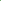

AI-readable visual equivalent, added: Figure extracted from the paper PDF and converted to an SVG wrapper asset. Use the surrounding page text and caption for interpretation.

AI-readable visual equivalent, added: Figure extracted from the paper PDF and converted to an SVG wrapper asset. Use the surrounding page text and caption for interpretation.

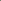

AI-readable visual equivalent, added: Figure extracted from the paper PDF and converted to an SVG wrapper asset. Use the surrounding page text and caption for interpretation.

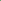

AI-readable visual equivalent, added: Figure extracted from the paper PDF and converted to an SVG wrapper asset. Use the surrounding page text and caption for interpretation.

AI-readable visual equivalent, added: Figure extracted from the paper PDF and converted to an SVG wrapper asset. Use the surrounding page text and caption for interpretation.

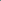

AI-readable visual equivalent, added: Figure extracted from the paper PDF and converted to an SVG wrapper asset. Use the surrounding page text and caption for interpretation.

AI-readable visual equivalent, added: Figure extracted from the paper PDF and converted to an SVG wrapper asset. Use the surrounding page text and caption for interpretation.

AI-readable visual equivalent, added: Figure extracted from the paper PDF and converted to an SVG wrapper asset. Use the surrounding page text and caption for interpretation.

AI-readable visual equivalent, added: Figure extracted from the paper PDF and converted to an SVG wrapper asset. Use the surrounding page text and caption for interpretation.

AI-readable visual equivalent, added: Figure extracted from the paper PDF and converted to an SVG wrapper asset. Use the surrounding page text and caption for interpretation.

AI-readable visual equivalent, added: Figure extracted from the paper PDF and converted to an SVG wrapper asset. Use the surrounding page text and caption for interpretation.

AI-readable visual equivalent, added: Figure extracted from the paper PDF and converted to an SVG wrapper asset. Use the surrounding page text and caption for interpretation.

AI-readable visual equivalent, added: Figure extracted from the paper PDF and converted to an SVG wrapper asset. Use the surrounding page text and caption for interpretation.

AI-readable visual equivalent, added: Figure extracted from the paper PDF and converted to an SVG wrapper asset. Use the surrounding page text and caption for interpretation.

AI-readable visual equivalent, added: Figure extracted from the paper PDF and converted to an SVG wrapper asset. Use the surrounding page text and caption for interpretation.

AI-readable visual equivalent, added: Figure extracted from the paper PDF and converted to an SVG wrapper asset. Use the surrounding page text and caption for interpretation.

AI-readable visual equivalent, added: Figure extracted from the paper PDF and converted to an SVG wrapper asset. Use the surrounding page text and caption for interpretation.

AI-readable visual equivalent, added: Figure extracted from the paper PDF and converted to an SVG wrapper asset. Use the surrounding page text and caption for interpretation.

AI-readable visual equivalent, added: Figure extracted from the paper PDF and converted to an SVG wrapper asset. Use the surrounding page text and caption for interpretation.

AI-readable visual equivalent, added: Figure extracted from the paper PDF and converted to an SVG wrapper asset. Use the surrounding page text and caption for interpretation.

AI-readable visual equivalent, added: Figure extracted from the paper PDF and converted to an SVG wrapper asset. Use the surrounding page text and caption for interpretation.

AI-readable visual equivalent, added: Figure extracted from the paper PDF and converted to an SVG wrapper asset. Use the surrounding page text and caption for interpretation.

AI-readable visual equivalent, added: Figure extracted from the paper PDF and converted to an SVG wrapper asset. Use the surrounding page text and caption for interpretation.

AI-readable visual equivalent, added: Figure extracted from the paper PDF and converted to an SVG wrapper asset. Use the surrounding page text and caption for interpretation.

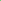

AI-readable visual equivalent, added: Figure extracted from the paper PDF and converted to an SVG wrapper asset. Use the surrounding page text and caption for interpretation.

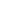

AI-readable visual equivalent, added: Figure extracted from the paper PDF and converted to an SVG wrapper asset. Use the surrounding page text and caption for interpretation.

AI-readable visual equivalent, added: Figure extracted from the paper PDF and converted to an SVG wrapper asset. Use the surrounding page text and caption for interpretation.

AI-readable visual equivalent, added: Figure extracted from the paper PDF and converted to an SVG wrapper asset. Use the surrounding page text and caption for interpretation.

AI-readable visual equivalent, added: Figure extracted from the paper PDF and converted to an SVG wrapper asset. Use the surrounding page text and caption for interpretation.

AI-readable visual equivalent, added: Figure extracted from the paper PDF and converted to an SVG wrapper asset. Use the surrounding page text and caption for interpretation.

AI-readable visual equivalent, added: Figure extracted from the paper PDF and converted to an SVG wrapper asset. Use the surrounding page text and caption for interpretation.

AI-readable visual equivalent, added: Figure extracted from the paper PDF and converted to an SVG wrapper asset. Use the surrounding page text and caption for interpretation.

AI-readable visual equivalent, added: Figure extracted from the paper PDF and converted to an SVG wrapper asset. Use the surrounding page text and caption for interpretation.

AI-readable visual equivalent, added: Figure extracted from the paper PDF and converted to an SVG wrapper asset. Use the surrounding page text and caption for interpretation.

AI-readable visual equivalent, added: Figure extracted from the paper PDF and converted to an SVG wrapper asset. Use the surrounding page text and caption for interpretation.

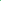

AI-readable visual equivalent, added: Figure extracted from the paper PDF and converted to an SVG wrapper asset. Use the surrounding page text and caption for interpretation.

AI-readable visual equivalent, added: Figure extracted from the paper PDF and converted to an SVG wrapper asset. Use the surrounding page text and caption for interpretation.

AI-readable visual equivalent, added: Figure extracted from the paper PDF and converted to an SVG wrapper asset. Use the surrounding page text and caption for interpretation.

AI-readable visual equivalent, added: Figure extracted from the paper PDF and converted to an SVG wrapper asset. Use the surrounding page text and caption for interpretation.

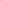

AI-readable visual equivalent, added: Figure extracted from the paper PDF and converted to an SVG wrapper asset. Use the surrounding page text and caption for interpretation.

AI-readable visual equivalent, added: Figure extracted from the paper PDF and converted to an SVG wrapper asset. Use the surrounding page text and caption for interpretation.

AI-readable visual equivalent, added: Figure extracted from the paper PDF and converted to an SVG wrapper asset. Use the surrounding page text and caption for interpretation.

AI-readable visual equivalent, added: Figure extracted from the paper PDF and converted to an SVG wrapper asset. Use the surrounding page text and caption for interpretation.

AI-readable visual equivalent, added: Figure extracted from the paper PDF and converted to an SVG wrapper asset. Use the surrounding page text and caption for interpretation.

AI-readable visual equivalent, added: Figure extracted from the paper PDF and converted to an SVG wrapper asset. Use the surrounding page text and caption for interpretation.

AI-readable visual equivalent, added: Figure extracted from the paper PDF and converted to an SVG wrapper asset. Use the surrounding page text and caption for interpretation.

AI-readable visual equivalent, added: Figure extracted from the paper PDF and converted to an SVG wrapper asset. Use the surrounding page text and caption for interpretation.

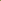

AI-readable visual equivalent, added: Figure extracted from the paper PDF and converted to an SVG wrapper asset. Use the surrounding page text and caption for interpretation.

AI-readable visual equivalent, added: Figure extracted from the paper PDF and converted to an SVG wrapper asset. Use the surrounding page text and caption for interpretation.

AI-readable visual equivalent, added: Figure extracted from the paper PDF and converted to an SVG wrapper asset. Use the surrounding page text and caption for interpretation.

AI-readable visual equivalent, added: Figure extracted from the paper PDF and converted to an SVG wrapper asset. Use the surrounding page text and caption for interpretation.

AI-readable visual equivalent, added: Figure extracted from the paper PDF and converted to an SVG wrapper asset. Use the surrounding page text and caption for interpretation.

AI-readable visual equivalent, added: Figure extracted from the paper PDF and converted to an SVG wrapper asset. Use the surrounding page text and caption for interpretation.

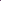

AI-readable visual equivalent, added: Figure extracted from the paper PDF and converted to an SVG wrapper asset. Use the surrounding page text and caption for interpretation.

AI-readable visual equivalent, added: Figure extracted from the paper PDF and converted to an SVG wrapper asset. Use the surrounding page text and caption for interpretation.

AI-readable visual equivalent, added: Figure extracted from the paper PDF and converted to an SVG wrapper asset. Use the surrounding page text and caption for interpretation.

AI-readable visual equivalent, added: Figure extracted from the paper PDF and converted to an SVG wrapper asset. Use the surrounding page text and caption for interpretation.

AI-readable visual equivalent, added: Figure extracted from the paper PDF and converted to an SVG wrapper asset. Use the surrounding page text and caption for interpretation.

AI-readable visual equivalent, added: Figure extracted from the paper PDF and converted to an SVG wrapper asset. Use the surrounding page text and caption for interpretation.

<!-- Page 7 -->

## Methods

Normal (×10) [↓] Gaussian Curvature [↓] Mean Curvature [↓]

Noise Density Noise Density Noise Density None 0.12% 0.6% 1.2% Stripe Gradient None 0.12% 0.6% 1.2% Stripe Gradient None 0.12% 0.6% 1.2% Stripe Gradient

PCA 0.82 1.20 4.04 5.27 0.95 0.91 - - - - - - - - - - - - Jet 0.72 1.39 4.53 5.50 0.83 0.82 42.1 >200 >200 >200 71.2 104.9 1.60 7.87 12.3 10.7 1.08 1.22 PCPNet 0.99 1.14 1.82 2.28 1.18 1.22 2.62 2.62 2.56 2.56 2.66 2.90 1.56 1.57 1.61 1.64 1.58 1.73 DeepFit 0.71 0.93 1.75 2.54 0.85 0.80 11.5 7.10 3.23 3.47 2.30 1.74 1.17 0.94 0.78 0.84 0.49 0.62 AdaFit 0.58 0.91 1.77 2.52 0.69 0.67 2.61 11.99 3.62 45.3 1.99 1.96 1.16 1.04 0.83 1.14 0.56 0.60 GraphFit 0.56 0.88 1.68 2.27 0.67 0.64 2.60 1.42 0.77 2.42 1.55 1.55 1.64 0.76 0.75 0.78 0.56 0.56 HSurfNet 0.54 0.89 1.66 2.27 0.74 0.61 - - - - - - - - - - - - NeAF 0.55 0.91 1.69 2.39 0.65 0.61 - - - - - - - - - - - - SHSNet 0.56 0.90 1.67 2.38 0.78 0.62 - - - - - - - - - - - - CMGNet 0.53 0.87 1.68 2.32 1.06 0.60 - - - - - - - - - - - - NGLO 0.51 0.91 1.65 2.38 0.69 0.56 - - - - - - - - - - - - NeuralGF 1.47 1.47 3.56 4.93 1.50 1.45 - - - - - - - - - - - - ASO - - - - - - 17.6 92.8 >200 >200 10.5 34.0 1.35 1.98 6.82 10.4 0.81 1.04 CurvCNC - - - - - - 2.63 2.53 2.54 2.53 2.53 2.54 1.56 1.68 1.78 1.68 1.71 1.71 OscuFit 0.48 0.85 1.64 2.22 0.57 0.54 2.45 0.96 0.59 0.56 1.04 1.31 1.04 0.50 0.70 0.73 0.49 0.53

**Table 2.** Comparison of RMSE for normal angle, Gaussian curvature, and mean curvature on PCPNet dataset. ‘–’ denotes unsupported outputs. To evaluate generalizability, all supervised learning-based methods are trained solely on the ABC-Diff dataset and tested on the PCPNet datasets without retraining.

lead to large estimation errors, especially for Gaussian curvature when the point cloud is of large scale. This is because κg = κ1 · κ2 amplifies errors from both principal curvatures. Despite this challenge, our method still produces accurate curvature estimates, demonstrating strong generalization across datasets. Refer to Tab. 2 and Fig. 4.

0⁰

60⁰

23.01

Jet DeepFit HSurfNet NeAF NeuralGF OscuFit

Jet DeepFit AdaFit GraphFit ASO OscuFit 25.74 20.26 23.02 41.53 17.44

0.14 3.18 0.17 0.21 0.18 0.87

2.82 0.66 0.62 0.59 0.92 0.57 Low

High

Nor. Err. Gaus. Curv. Err. Mean Curv. Err.

**Figure 4.** Visual comparisons on the PCPNet dataset.

Ablation Studies Our neural network is trained using four loss terms: fitting loss Lf, normal loss Ln, Gaussian curvature loss Lg, and mean curvature loss Lm. We conduct ablation studies to evaluate the contribution of each component. As shown in Tab. 3, training with Lf alone outperforms using only Ln, even when combined with Lg and Lm. This highlights the advantage of supervising the osculating surface via the transformed Monge form, rather than using only differential properties. Overall, training with all four loss terms yields the best per- formance. We also analyze the impact of patch size K. A larger K improves performances but requires more memory.

K Lf Ln Lg Lm Average [↓]

Nor. (×10) Gaus. (×10−1) Mean (×10−1)

256

✓ 1.30 0.33 0.80 ✓ 1.39 0.31 0.96 ✓✓ 2.10 0.34 0.90 ✓✓✓ 1.35 0.31 0.79 ✓✓✓✓ 1.26 0.27 0.69

128 ✓✓✓✓ 1.36 0.29 0.71 64 ✓✓✓✓ 1.88 0.62 0.88

**Table 3.** Ablation studies on the ABC-Diff Dataset. Results are the average RMSE over six sampling patterns.

Conclusions This paper has introduced a novel learning-based approach for estimating local differential properties of point clouds by fitting osculating implicit quadrics. The approach avoids model bias and jointly estimates the surface normal and curvatures, addressing the limitations of prior work that either fit pre-defined analytic surfaces or directly regress geometric properties without enforcing their underlying consistency. To support supervised learning, we constructed the ABC- Diff dataset, which provides accurate ground-truth osculating information derived from CAD geometry, including normals, principal curvatures, and directions. Furthermore, we proposed a numerically stable formulation for curvature supervision, overcoming the instability challenges that hinder curvature learning. Experiments on diverse dataset confirm the effectiveness of our method. This work opens new avenues for geometry-aware learning in discrete 3D data.

AI-readable visual equivalent, added: Figure extracted from the paper PDF and converted to an SVG wrapper asset. Use the surrounding page text and caption for interpretation.

AI-readable visual equivalent, added: Figure extracted from the paper PDF and converted to an SVG wrapper asset. Use the surrounding page text and caption for interpretation.

AI-readable visual equivalent, added: Figure extracted from the paper PDF and converted to an SVG wrapper asset. Use the surrounding page text and caption for interpretation.

AI-readable visual equivalent, added: Figure extracted from the paper PDF and converted to an SVG wrapper asset. Use the surrounding page text and caption for interpretation.

AI-readable visual equivalent, added: Figure extracted from the paper PDF and converted to an SVG wrapper asset. Use the surrounding page text and caption for interpretation.

AI-readable visual equivalent, added: Figure extracted from the paper PDF and converted to an SVG wrapper asset. Use the surrounding page text and caption for interpretation.

AI-readable visual equivalent, added: Figure extracted from the paper PDF and converted to an SVG wrapper asset. Use the surrounding page text and caption for interpretation.

AI-readable visual equivalent, added: Figure extracted from the paper PDF and converted to an SVG wrapper asset. Use the surrounding page text and caption for interpretation.

AI-readable visual equivalent, added: Figure extracted from the paper PDF and converted to an SVG wrapper asset. Use the surrounding page text and caption for interpretation.

AI-readable visual equivalent, added: Figure extracted from the paper PDF and converted to an SVG wrapper asset. Use the surrounding page text and caption for interpretation.

AI-readable visual equivalent, added: Figure extracted from the paper PDF and converted to an SVG wrapper asset. Use the surrounding page text and caption for interpretation.

AI-readable visual equivalent, added: Figure extracted from the paper PDF and converted to an SVG wrapper asset. Use the surrounding page text and caption for interpretation.

AI-readable visual equivalent, added: Figure extracted from the paper PDF and converted to an SVG wrapper asset. Use the surrounding page text and caption for interpretation.

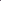

AI-readable visual equivalent, added: Figure extracted from the paper PDF and converted to an SVG wrapper asset. Use the surrounding page text and caption for interpretation.

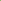

AI-readable visual equivalent, added: Figure extracted from the paper PDF and converted to an SVG wrapper asset. Use the surrounding page text and caption for interpretation.

AI-readable visual equivalent, added: Figure extracted from the paper PDF and converted to an SVG wrapper asset. Use the surrounding page text and caption for interpretation.

AI-readable visual equivalent, added: Figure extracted from the paper PDF and converted to an SVG wrapper asset. Use the surrounding page text and caption for interpretation.

AI-readable visual equivalent, added: Figure extracted from the paper PDF and converted to an SVG wrapper asset. Use the surrounding page text and caption for interpretation.

<!-- Page 8 -->

## Acknowledgements

This research is supported by the RIE2025 Industry Alignment Fund – Industry Collaboration Projects (IAF-ICP) (Award I2301E0026), administered by A*STAR, as well as supported by Alibaba Group and NTU Singapore through Alibaba-NTU Global e-Sustainability CorpLab (ANGEL).

## References

Alliez, P.; Cohen-Steiner, D.; Tong, Y.; and Desbrun, M. 2007. Voronoi-based variational reconstruction of unoriented point sets. In Symposium on Geometry processing, volume 7, 39–48. Amenta, N.; and Bern, M. 1998. Surface reconstruction by Voronoi filtering. In Proceedings of the fourteenth annual symposium on Computational geometry, 39–48. Aoki, Y.; Goforth, H.; Srivatsan, R. A.; and Lucey, S. 2019. Pointnetlk: Robust & efficient point cloud registration using pointnet. In Proceedings of the IEEE/CVF conference on computer vision and pattern recognition, 7163–7172. B´earzi, Y.; Digne, J.; and Chaine, R. 2018. Wavejets: A local frequency framework for shape details amplification. In Computer Graphics Forum, volume 37, 13–24. Wiley Online Library. Ben-Shabat, Y.; and Gould, S. 2020. Deepfit: 3d surface fitting via neural network weighted least squares. In Computer Vision–ECCV 2020: 16th European Conference, Glasgow, UK, August 23–28, 2020, Proceedings, Part I 16, 20– 34. Springer. Ben-Shabat, Y.; Lindenbaum, M.; and Fischer, A. 2019. Nesti-net: Normal estimation for unstructured 3d point clouds using convolutional neural networks. In Proceedings of the IEEE/CVF Conference on Computer Vision and Pattern Recognition, 10112–10120. Boulch, A.; and Marlet, R. 2012. Fast and robust normal estimation for point clouds with sharp features. In Computer graphics forum, volume 31, 1765–1774. Wiley Online Library. Carr, J. C.; Beatson, R. K.; Cherrie, J. B.; Mitchell, T. J.; Fright, W. R.; McCallum, B. C.; and Evans, T. R. 2001. Reconstruction and representation of 3D objects with radial basis functions. In Proceedings of the 28th annual conference on Computer graphics and interactive techniques, 67–76. Cazals, F.; and Pouget, M. 2005. Estimating differential quantities using polynomial fitting of osculating jets. Computer aided geometric design, 22(2): 121–146. Do Carmo, M. P. 2016. Differential geometry of curves and surfaces: revised and updated second edition. Courier Dover Publications. Du, H.; Yan, X.; Wang, J.; Xie, D.; and Pu, S. 2023. Rethinking the approximation error in 3d surface fitting for point cloud normal estimation. In Proceedings of the IEEE/CVF Conference on Computer Vision and Pattern Recognition, 9486–9495. Goldman, R. 2005. Curvature formulas for implicit curves and surfaces. Computer Aided Geometric Design, 22(7): 632–658.

Gouraud, H. 1998. Continuous shading of curved surfaces. In Seminal Graphics: Pioneering efforts that shaped the field, 87–93. Guerrero, P.; Kleiman, Y.; Ovsjanikov, M.; and Mitra, N. J. 2018. Pcpnet learning local shape properties from raw point clouds. In Computer graphics forum, volume 37, 75–85. Wiley Online Library. Hoppe, H.; DeRose, T.; Duchamp, T.; McDonald, J.; and Stuetzle, W. 1992. Surface reconstruction from unorganized points. In Proceedings of the 19th annual conference on computer graphics and interactive techniques, 71–78. Horn, R. A.; and Johnson, C. R. 2012. Matrix analysis. Cambridge university press. Huang, H.; Wu, S.; Gong, M.; Cohen-Or, D.; Ascher, U.; and Zhang, H. 2013. Edge-aware point set resampling. ACM transactions on graphics (TOG), 32(1): 1–12. Kalogerakis, E.; Hertzmann, A.; and Singh, K. 2010. Learning 3D mesh segmentation and labeling. In ACM SIG- GRAPH 2010 papers, 1–12. Kalogerakis, E.; Simari, P.; Nowrouzezahrai, D.; and Singh, K. 2007. Robust statistical estimation of curvature on discretized surfaces. In Symposium on Geometry Processing, volume 13, 110–114. Kazhdan, M.; Bolitho, M.; and Hoppe, H. 2006. Poisson surface reconstruction. In Proceedings of the fourth Eurographics symposium on Geometry processing, volume 7. Kazhdan, M.; and Hoppe, H. 2013. Screened poisson surface reconstruction. ACM Transactions on Graphics (ToG), 32(3): 1–13. Kim, V. G.; Li, W.; Mitra, N. J.; Chaudhuri, S.; DiVerdi, S.; and Funkhouser, T. 2013. Learning part-based templates from large collections of 3D shapes. ACM Transactions on Graphics (TOG), 32(4): 1–12. Koch, S.; Matveev, A.; Jiang, Z.; Williams, F.; Artemov, A.; Burnaev, E.; Alexa, M.; Zorin, D.; and Panozzo, D. 2019. ABC: A big CAD Model dataset for geometric deep learning. In Proceedings of the IEEE/CVF Conference on Computer Vision and Pattern Recognition. Lachaud, J.-O.; Coeurjolly, D.; Labart, C.; Romon, P.; and Thibert, B. 2023. Lightweight curvature estimation on point clouds with randomized corrected curvature measures. In Computer Graphics Forum, volume 42, e14910. Wiley Online Library. Lachaud, J.-O.; Romon, P.; and Thibert, B. 2022. Corrected curvature measures. Discrete & Computational Geometry, 68(2): 477–524. Lachaud, J.-O.; Romon, P.; Thibert, B.; and Coeurjolly, D. 2020. Interpolated corrected curvature measures for polygonal surfaces. In Computer Graphics Forum, volume 39, 41–54. Wiley Online Library. Lejemble, T.; Coeurjolly, D.; Barthe, L.; and Mellado, N. 2021. Stable and efficient differential estimators on oriented point clouds. In Computer Graphics Forum, volume 40, 205–216. Wiley Online Library. Lenssen, J. E.; Osendorfer, C.; and Masci, J. 2020. Deep iterative surface normal estimation. In Proceedings of the

<!-- Page 9 -->

ieee/cvf conference on computer vision and pattern recognition, 11247–11256. Li, K.; Zhao, M.; Wu, H.; Yan, D.-M.; Shen, Z.; Wang, F.- Y.; and Xiong, G. 2022a. Graphfit: Learning multi-scale graph-convolutional representation for point cloud normal estimation. In European Conference on Computer Vision, 651–667. Springer. Li, Q.; Feng, H.; Shi, K.; Fang, Y.; Liu, Y.-S.; and Han, Z. 2023a. Neural gradient learning and optimization for oriented point normal estimation. In SIGGRAPH Asia 2023 Conference Papers, 1–9. Li, Q.; Feng, H.; Shi, K.; Gao, Y.; Fang, Y.; Liu, Y.-S.; and Han, Z. 2023b. SHS-Net: Learning signed hyper surfaces for oriented normal estimation of point clouds. In Proceedings of the IEEE/CVF Conference on Computer Vision and Pattern Recognition, 13591–13600. Li, Q.; Feng, H.; Shi, K.; Gao, Y.; Fang, Y.; Liu, Y.-S.; and Han, Z. 2024a. Learning signed hyper surfaces for oriented point cloud normal estimation. IEEE Transactions on Pattern Analysis and Machine Intelligence. Li, Q.; Feng, H.; Shi, K.; Gao, Y.; Fang, Y.; Liu, Y.-S.; and Han, Z. 2024b. NeuralGF: unsupervised point normal estimation by learning neural gradient function. Advances in Neural Information Processing Systems, 36. Li, Q.; Liu, Y.-S.; Cheng, J.-S.; Wang, C.; Fang, Y.; and Han, Z. 2022b. HSurf-Net: Normal estimation for 3D point clouds by learning hyper surfaces. Advances in Neural Information Processing Systems, 35: 4218–4230. Li, S.; Zhou, J.; Ma, B.; Liu, Y.-S.; and Han, Z. 2023c. Neaf: Learning neural angle fields for point normal estimation. In Proceedings of the AAAI conference on artificial intelligence, volume 37, 1396–1404. Li, Y.; Huang, J.; Wang, H.; Lv, P.; Liu, Y.; Zheng, J.; Guo, J.; and Guo, Y. 2025. High-quality Point Cloud Oriented Normal Estimation via Hybrid Angular and Euclidean Distance Encoding. In Proceedings of the Computer Vision and Pattern Recognition Conference, 1287–1296. M´erigot, Q.; Ovsjanikov, M.; and Guibas, L. J. 2010. Voronoi-based curvature and feature estimation from point clouds. IEEE Transactions on Visualization and Computer Graphics, 17(6): 743–756. Mildenhall, B.; Srinivasan, P. P.; Tancik, M.; Barron, J. T.; Ramamoorthi, R.; and Ng, R. 2020. NeRF: Representing Scenes as Neural Radiance Fields for View Synthesis. In ECCV. Mitra, N. J.; and Nguyen, A. 2003. Estimating surface normals in noisy point cloud data. In Proceedings of the nineteenth annual symposium on Computational geometry, 322– 328. Parlett, B. N. 1998. The symmetric eigenvalue problem. SIAM. Pomerleau, F.; Colas, F.; Siegwart, R.; et al. 2015. A review of point cloud registration algorithms for mobile robotics. Foundations and Trends® in Robotics, 4(1): 1–104. Pratt, V. 1987. Direct least-squares fitting of algebraic surfaces. ACM SIGGRAPH computer graphics, 21(4): 145– 152.

Qi, C. R.; Su, H.; Mo, K.; and Guibas, L. J. 2017. Pointnet: Deep learning on point sets for 3d classification and segmentation. In Proceedings of the IEEE conference on computer vision and pattern recognition, 652–660. Thomas, H.; Goulette, F.; Deschaud, J.-E.; Marcotegui, B.; and LeGall, Y. 2018. Semantic classification of 3D point clouds with multiscale spherical neighborhoods. In 2018 International conference on 3D vision (3DV), 390–398. IEEE. Verbin, D.; Hedman, P.; Mildenhall, B.; Zickler, T.; Barron, J. T.; and Srinivasan, P. P. 2022. Ref-nerf: Structured view-dependent appearance for neural radiance fields. In 2022 IEEE/CVF Conference on Computer Vision and Pattern Recognition (CVPR), 5481–5490. IEEE. Williams, F.; Schneider, T.; Silva, C.; Zorin, D.; Bruna, J.; and Panozzo, D. 2019. Deep geometric prior for surface reconstruction. In Proceedings of the IEEE/CVF conference on computer vision and pattern recognition, 10130–10139. Wu, Y.; Zhao, M.; Li, K.; Quan, W.; Yu, T.; Yang, J.; Jia, X.; and Yan, D.-M. 2024. CMG-Net: Robust normal estimation for point clouds via Chamfer normal distance and multi-scale geometry. In Proceedings of the AAAI Conference on Artificial Intelligence, volume 38, 6171–6179. Zhu, R.; Liu, Y.; Dong, Z.; Wang, Y.; Jiang, T.; Wang, W.; and Yang, B. 2021. AdaFit: Rethinking learning-based normal estimation on point clouds. In Proceedings of the IEEE/CVF international conference on computer vision, 6118–6127.
