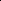

# Otter: Mitigating Background Distractions of Wide-Angle Few-Shot Action Recognition with Enhanced RWKV

<!-- Page 1 -->

Otter: Mitigating Background Distractions of Wide-Angle Few-Shot Action

Recognition with Enhanced RWKV

Wenbo Huang1 2, Jinghui Zhang1*, Zhenghao Chen3, Guang Li4, Lei Zhang5*, Yang Cao2, Fang

Dong1, Takahiro Ogawa4, Miki Haseyama4

1Southeast University, Nanjing 211189, Jiangsu, China; 2Institute of Science Tokyo, Tokyo 152-8550, Japan; 3The University of Newcastle, Callaghan, NSW 2308, Australia; 4Hokkaido University, Sapporo 060-0808, Hokkaido, Japan; 5Nanjing Normal University, Nanjing 210023, Jiangsu, China. wenbohuang1002@outlook.com, {jhzhang, fdong}@seu.edu.cn, zhenghao.chen@newcastle.edu.au,

{guang, ogawa, mhaseyama}@lmd.ist.hokudai.ac.jp, cao@c.titech.ac.jp, leizhang@njnu.edu.cn

## Abstract

Wide-angle videos in few-shot action recognition (FSAR) effectively express actions within specific scenarios. However, without a global understanding of both subjects and background, recognizing actions in such samples remains challenging because of the background distractions. Receptance Weighted Key Value (RWKV), which learns interaction between various dimensions, shows promise for global modeling. While directly applying RWKV to wideangle FSAR may fail to highlight subjects due to excessive background information. Additionally, temporal relation degraded by frames with similar backgrounds is difficult to reconstruct, further impacting performance. Therefore, we design the CompOund SegmenTation and Temporal REconstructing RWKV (Otter). Specifically, the Compound Segmentation Module (CSM) is devised to segment and emphasize key patches in each frame, effectively highlighting subjects against background information. The Temporal Reconstruction Module (TRM) is incorporated into the temporal-enhanced prototype construction to enable bidirectional scanning, allowing better reconstruct temporal relation. Furthermore, a regular prototype is combined with the temporal-enhanced prototype to simultaneously enhance subject emphasis and temporal modeling, improving wide-angle FSAR performance. Extensive experiments on benchmarks such as SSv2, Kinetics, UCF101, and HMDB51 demonstrate that Otter achieves state-of-the-art performance. Extra evaluation on the VideoBadminton dataset further validates the superiority of Otter in wide-angle FSAR.

Code — https://github.com/wenbohuang1002/Otter

## Introduction

The difficulties of video collection and labeling complicates traditional data-driven training based on fully labeled datasets. Fortunately, few-shot action recognition (FSAR) improves learning efficiency and reduces the labeling dependency by classifying unseen actions from extremely few

*Corresponding author. Copyright © 2026, Association for the Advancement of Artificial Intelligence (www.aaai.org). All rights reserved.

Smaller subject proportion

…

?????? Degraded temporal relation

… 2 3 4 5 F Clear temporal relation

Larger subject proportion RWKV

Snowboarding ②

Snowboarding ①

## Background

distractions

①, ②are different actions!

**Figure 1.** Smaller subject proportion (red circles) and degraded temporal relation (red dotted lines) both contribute to background distractions in wide-angle FSAR. As a result, wide-angle samples are more challenging to recognize compared with regular samples.

video samples. Therefore, FSAR has diverse real-world applications, including health monitoring and motion analysis (Yan et al. 2023; Wang et al. 2023b). However, recognizing similar actions under regular viewpoint is a nontrivial problem in FSAR. For instance, distinguishing “indoor climbing” and “construction working” is challenging, as subjects exhibit similar actions against a wall. To mitigate this issue, wide-angle videos provide contextual background, such as a “climbing wall” or a “construction site”, expressing actions within specific scenarios more accurately. According to established definitions (Lai et al. 2021; Zhang et al. 2025), wide-angle videos with a greater field of view (FoV) are widespread1. FoV estimation (Lee et al. 2021; Hold-Geoffroy et al. 2023) on popular FSAR benchmarks further reveals that approximately 35% of samples per dataset fall into this category, yet remain unexplored.

On the other hand, effectively modeling wide-angle videos remains a critical issue due to the difficulty of accurately interpreting both subjects and background content. Recent success in recurrent model-based architectures

1This work adopts the widely accepted definition of wide-angle as FoV exceeding 80◦.

The Fortieth AAAI Conference on Artificial Intelligence (AAAI-26)

AI-readable visual equivalent, added: Figure extracted from the paper PDF and converted to an SVG wrapper asset. Use the surrounding page text and caption for interpretation.

AI-readable visual equivalent, added: Figure extracted from the paper PDF and converted to an SVG wrapper asset. Use the surrounding page text and caption for interpretation.

AI-readable visual equivalent, added: Figure extracted from the paper PDF and converted to an SVG wrapper asset. Use the surrounding page text and caption for interpretation.

<!-- Page 2 -->

has led to methods such as Receptance Weighted Key Value (RWKV) (Peng et al. 2023, 2024), which demonstrate strong performance in global modeling across various tasks by enabling token interaction through linear interpolation, thereby expanding the receptive field and efficiently capturing subject–background dependencies.

To seamlessly apply RWKV in wide-angle FSAR, two key challenges remain, primarily due to background distractions, as illustrated in Figure 1. Challenge 1: Lack of primary subject highlighting in RWKV. As shown in the “snowboarding” examples, the primary subject occupies a smaller proportion in wide-angle frames. When RWKV is directly applied for global feature extraction, it tends to capture massive secondary background information “snow” rather than the primary subject “athlete”. Since the background serves as contextual information while the subject is crucial for determining feature representation, this reversal of primary and secondary information may lead to potential misclassification. Challenge 2: Absence of temporal relation reconstruction in RWKV. Temporal relation plays a significant role in FSAR, primarily in perceiving action direction and aligning frames. From the “snowboarding” example, we observe that abundant background information in similar frames obscures the evolution of primary subject “athlete”, causing temporal relation degraded in wide-angle samples. However, RWKV focuses on global modeling but lacks the capability to reconstruct temporal relation, increasing the difficulty of recognizing wide-angle samples.

Although current attempts achieve promising results (Fu et al. 2020; Wang et al. 2023a; Perrett et al. 2021; Huang et al. 2024; Wang et al. 2022; Xing et al. 2023a), few works address the two aforementioned challenges simultaneously. Therefore, we propose the CompOund SegmenTation and Temporal REconstructing RWKV (Otter), which highlights subjects and restores temporal relations in wide-angle FSAR. To be specific, we devise the Compound Segmentation Module (CSM) to adaptively segment each frame into patches and highlight the subject before feature extraction. This enables RWKV to focus on the subject rather than being overwhelmed by secondary background information. We further design the Temporal Reconstruction Module (TRM), integrated into temporal-enhanced prototype construction to perform bidirectional feature scanning across frames, enabling RWKV to reconstruct temporal relations degraded in wide-angle videos. Additionally, we combine a regular prototype with a temporal-enhanced prototype to simultaneously achieve subject highlighting and temporal relation reconstruction. This strategy significantly improves the performance of wide-angle FSAR.

To the best of our knowledge, the proposed Otter is the first attempt of utilizing RWKV for wide-angle FSAR. The core contribution is threefold.

• The CSM is introduced to highlight the primary subject in RWKV. It segments each frame into multiple patches, learns adaptive weights from each patch to highlight the subject, and then reassembles the patches in their original positions. This process enables more effective detection of inconspicuous subjects in wide-angle FSAR.

• The TRM is designed to reconstruct temporal relations in RWKV. It performs bidirectional scanning of frame features and reconstructs the temporal relation via a weighted average of the scanning results for the temporal-enhanced prototype. This module mitigates temporal relation degradation in wide-angle FSAR.

• The state-of-the-art (SOTA) performance achieved by Otter is validated through extensive experiments on prominent FSAR benchmarks, including SSv2, Kinetics, UCF101, and HMDB51. Additional analyses on wideangle VideoBadminton dataset emphasize superiority of Otter, particularly in wide-angle FSAR.

Related works

## 2.1 Few-Shot Learning

Few-shot learning, which aims to classify unseen classes using extremely limited samples, is a crucial area in the deep learning community (Fei-Fei, Fergus, and Perona 2006). It encompasses three main paradigms: augmentation, optimization, and metric-based. Augmentation-based methods (Hariharan and Girshick 2017; Wang et al. 2018; Zhang et al. 2018; Chen et al. 2019; Li et al. 2020) address data scarcity by generating synthetic samples to augment the training set. In contrast, optimization-based methods (Finn, Abbeel, and Levine 2017; Ravi and Larochelle 2017; Rusu et al. 2018; Jamal and Qi 2019; Rajeswaran et al. 2019) focus on modifying the optimization process to enable efficient fine-tuning with few samples. Among these approaches, the metric-based paradigm (Snell, Swersky, and Zemel 2017; Oreshkin, Rodr´ıguez L´opez, and Lacoste 2018; Sung et al. 2018; Hao et al. 2019; Wang et al. 2020) is the most widely adopted in practical applications due to its simplicity and effectiveness. Specifically, these methods construct class prototypes and perform classification by the similarity between query features and class prototypes using learnable metrics.

## 2.2 Few-Shot Action Recognition

Metric-based meta-learning is the mainstream paradigm in FSAR due to its simplicity and effectiveness. This approach embeds support features into class prototypes to represent various classes. Most methods rely on temporal alignment to match queries with prototypes. For example, the dynamic time warping (DTW) algorithm is used in OTAM for similarity calculation (Cao et al. 2020). Subsequent works, including ITANet (Zhang, Zhou, and He 2021), T2AN (Li et al. 2022), and STRM (Thatipelli et al. 2022), further optimize temporal alignment. To focus more on local features, TRX (Perrett et al. 2021), HyRSM (Wang et al. 2022), SloshNet (Xing et al. 2023b), SA-CT (Zhang et al. 2023), and Manta (Huang et al. 2025) employ fine-grained or multiscale modeling. Additionally, models are enhanced with supplementary information such as depth (Fu et al. 2020), optical flow (Wanyan et al. 2023), and motion cues (Wang et al. 2023a; Wu et al. 2022; Huang et al. 2024). Despite achieving satisfactory performance, They are unable to address challenges in wide-angle FSAR simultaneously.

<!-- Page 3 -->

+

-

-

+

+

+

+

L L

L

L f

S

Q

Support Set

Query Set

CSM

Backbone

TRM

CSM

TRM

A

A

A

1 2,, Q Q Q y y y

Q Y D

1 2,, Q Q Q y y y

Q Y fS f Q fS f Q

2P

1P ce

() f

() sim, 

() sim, 

2 P

1 P total

①Motion Segmentation

③Prototype 2 Construction ④Training Objective

②Prototype 1 Construction

**Figure 2.** The overall architecture of the Otter. Main components CSM and TRM are specified combination of core units (§ 3.3). To be specific, 1⃝Motion Segmentation with CSM and backbone (§ 3.4). 2⃝Prototype 1 Construction with TRM for reconstructing temporal relation (§ 3.5). 3⃝Prototype 2 Construction with regular prototype (§ 3.5). 4⃝Training Objective Ltotal is the loss combination of cross-entropy loss Lce, L1

P from 2⃝, and L2 P from 3⃝(§ 3.6). Notion A⃝/ A⃝: averaging/weighted averaging.

+⃝/ +⃝: element-wise plus/weighted element-wise plus.

## 2.3 RWKV Model

The RWKV model is initially proposed for natural language processing (NLP) (Peng et al. 2023, 2024), combining the parallel processing capabilities of Transformers with the linear complexity of RNNs. This fusion enables RWKV to achieve efficient global modeling with reduced memory usage and accelerated inference speed following data-driven training. Building on this foundation, the vision- RWKV (VRWKV) model is developed for computer vision tasks and has demonstrated notable success (Duan et al. 2024). Additionally, numerous studies have explored integrating RWKV with Diffusion or CLIP, achieving remarkable results in various domains (Fei et al. 2024; Gu et al. 2024; He et al. 2024; Yuan et al. 2024). However, the potential of RWKV in wide-angle FSAR remains unexplored.

## Methodology

## 3.1 Problem Definition

Following settings in previous literature (Cao et al. 2020; Perrett et al. 2021), three parts including training set Dtrain, validation set Dval, and testing set Dtest without overlap (Dtrain∩Dval∩Dtest = ∅) are divided from datasets. Each part is further split into two non-overlapping sets including support S with at least one labeled sample of each class and query Q with all unlabeled samples (S ∩Q = ∅). The aim of FSAR is to classify samples from Q into one class of S. A large number of few-shot tasks are randomly selected and combined from Dtrain. We define few-shot setting as N-way K-shot from S with N classes, K samples in each class.

Successive F frames are uniformly extracted from a video each time. The kth (k = 1, · · ·, K) sample of the nth (n = 1, · · ·, N) class of S is defined as Sn,k and randomly selected sample from Q is denoted as Qr (r ∈Z+).

Sn,k = h sn,k

1,..., sn,k

F i

∈RF ×C×H×W,

Qγ = [qγ

1,..., qγ F ] ∈RF ×C×H×W,

(1)

in which F, C, H, and W represent frames, channels, height, and width, respectively.

## 3.2 Overall Architecture

We demonstrate the overall architecture of Otter via a simple 3-way 3-shot example in Figure 2. The following two main components of Otter are built from specific combinations of core units (§ 3.3). At the first stage of motion segmentation, CSM works for highlighting subjects before feature extracting via backbone (§ 3.4). TRM is introduced in the second stage of prototype 1 (temporal-enhanced) construction, reconstructing the temporal relation (§ 3.5). Prototype 2 (regular) construction is the third stage, retaining subject emphasis (§ 3.5). Finally, distances calculated from weighted average of two prototypes are employed in crossentropy loss Lce. In order to further distinguish class prototypes, the prototype similarities serve as L1 p and L2 p. The weighted combination of three loss including Lce, L1 p and L2 p is the training objective Ltotal (§ 3.6).

## 3.3 Core Units

In order to simplify equation writing, we use wildcard symbol △. Self-attention can be simulated through five tensors: receptance R, weight W, key K∗, value V, and gate G. To handle spatial, temporal, and channel-wise features, we design three core units: Spatial Mixing, Temporal Mixing, and Channel Mixing, inspired by the architecture of RWKV-5/6. The main components, CSM and TRM, are specific combinations of these core units, for subject highlighting and temporal relation reconstruction in wide-angle FSAR.

To be specific, Spatial Mixing (Figure 3a) is designed to aggregate features from different spatial locations. Let rt, kt, vt, and gt denote the tth features of R, K∗, V, and G, respectively. This design allows the model to capture dependencies across different regions of the image, thereby enhancing its

AI-readable visual equivalent, added: Figure extracted from the paper PDF and converted to an SVG wrapper asset. Use the surrounding page text and caption for interpretation.

AI-readable visual equivalent, added: Figure extracted from the paper PDF and converted to an SVG wrapper asset. Use the surrounding page text and caption for interpretation.

AI-readable visual equivalent, added: Figure extracted from the paper PDF and converted to an SVG wrapper asset. Use the surrounding page text and caption for interpretation.

AI-readable visual equivalent, added: Figure extracted from the paper PDF and converted to an SVG wrapper asset. Use the surrounding page text and caption for interpretation.

AI-readable visual equivalent, added: Figure extracted from the paper PDF and converted to an SVG wrapper asset. Use the surrounding page text and caption for interpretation.

AI-readable visual equivalent, added: Figure extracted from the paper PDF and converted to an SVG wrapper asset. Use the surrounding page text and caption for interpretation.

<!-- Page 4 -->

W V

Q-Shift

R

G

N

N σ

K*

Bi-WK*V

(a) Spatial Mixing

W V R

G

N

N μ σ

K*

WK*V

(b) Time Mixing

R

N

Q-Shift / μ

N σ σ

K*

(c) Channel Mixing

**Figure 3.** Core units of RWKV. N⃝: normalization, × ⃝/ ·⃝: matrix/element-wise multiplication, σ⃝: activation function.

ability to model global spatial features.

△t = W△· Q-Shift△(x)

= W△· [x + (1 −µ△) ⊙x′], ∀△∈{r, k∗, v, g}, x′

[h′,w′] = Concat x[h′−1,w′,0:C/4], x[h′+1,w′,C/4:C/2], x[h′,w′−1,C/2:3C/4], x[h′,w′+1,3C/4:C]

,

(2) where µ is a learnable vector for the calculation of R, K∗, and V while Concat (·) means concatenate operation. “:” separates the start and end index. Row and column index of x are denoted by h′ and w′. Then attention result (wk∗v)t is calculated according to the following definition.

(wk∗v)t = Bi-WK∗V (K∗, V)t

=

Pt−1 i=0,i̸=t e−(|t−i|−1)·w+k∗ i vi + eu+k∗ t vt Pt−1 i=0,i̸=t e−(|t−i|−1)·w+k∗ i + eu+k∗ t, (3)

W is determined by vector w. After combining with rt and gt, the oth feature of output O can be calculated as ot = σ (gt) ⊙Norm (rt ⊗(wk∗v)t), (4) in which σ (·) denotes activation function while Norm (·) represents normalization.

As illustrated Figure 3b, we observe that the main discrepancies between Time Mixing and Spatial Mixing are △t and WK∗V (·). The former one can be defined as

△t= W△· [xt + (1 −µ△) ⊙xt −1], ∀△∈{r, k∗, v, g},

(5) while the latter can be written as

(wk∗v)t = WK∗V (K∗, V)t

=

Pt−1 i=0,i̸=t e−(t−i−1)·w+k∗ i vi + eu+k∗ t vt Pt−1 i=0,i̸=t e−(t−i−1)·w+k∗ i + eu+k∗ t, (6)

After achieving O with the same way, the combination of current and past states enable long-term modeling.

In order to capture dependencies between multiple dimensions of input, Channel Mixing (Figure 3c) mixes information from various channels by R and V, as

O = σr (R) ⊙σv (V). (7) σr (·) and σv (·) means two difference kinds of activation function applied for R and V.

S-Mix

C-Mix

Conv

S-Mix

C-Mix

Conv S-Mix

C-Mix

Frame

S-Mix

C-Mix

Conv σ

() Seg,

() RT,, 

**Figure 4.** The structure of Compound Segmentation Module (CSM).

## 3.4 Motion Segmentation

Compound Segmentation Module (CSM) As demonstrated in Figure 4, each frame is segmented into HW/p2 patches with Seg (·, ·). Using random frames s, q ∈ RC×H×W from Sn,k, Qr as simple examples.

△p= Seg (△, p) ∈RC×p×p, ∀△∈{s, q}. (8)

H and W must be divisible by p. The operations of Spatial Mixing, Time Mixing, and Channel Mixing can be written as S-Mix (·), T-Mix (·), and C-Mix (·), respectively. The output △α of S-Mix (·) is connected with the input △p for capturing region associations of patches, as

△α= [S-Mix (△p) ⊕△p] ∈RC×p×p, ∀△∈{s, q}. (9)

The activation function σ (·) in S-Mix (·) is Sigmoid (·). Through the same method of connection with △α, the output △β of T-Mix (·) can be achieved.

△β= [C-Mix (△α) ⊕△α] ∈RC×p×p, ∀△∈{s, q}, (10)

where the σr (·) and σv (·) of C-Mix (·) are Sigmoid (·) and Relu (·). Following C3-STISR (Zhao et al. 2022), learnable weights lw△∈RC×p×p can be achieved from △p and △β via convolution Conv (·) and residual connection.

lw△= Sigmoid

Conv

△β

⊕△p

, ∀△∈{s, q}. (11)

Restoring all element-wise multiplication of lw△and △β can highlight subject in frames. We write the corresponding operation in RT (..., ·,...) with the output ˙△.

˙△= RT

..., lw△⊙△β,...

∈RC×H×W, ∀△∈{s, q}.

(12) According to (9) and (10), the final outputs ˆ△(∀△∈{s, q}) of CSM are calculated via S-Mix (·) and C-Mix (·). We place each ˆ△in its raw position for residual connection with inputs ˆSn,k, ˆQγ, thereby achieving subject highlighting.

Feature Extraction D-dimensional features Sn,k f, Qγ f ∈ RF ×D are extracted by sending ˆSn,k, ˆQγ into backbone fθ (·): RC×H×W 7→RD.

AI-readable visual equivalent, added: Figure extracted from the paper PDF and converted to an SVG wrapper asset. Use the surrounding page text and caption for interpretation.

AI-readable visual equivalent, added: Figure extracted from the paper PDF and converted to an SVG wrapper asset. Use the surrounding page text and caption for interpretation.

AI-readable visual equivalent, added: Figure extracted from the paper PDF and converted to an SVG wrapper asset. Use the surrounding page text and caption for interpretation.

<!-- Page 5 -->

T-Mix

C-Mix

R

Conv

T-Mix

C-Mix

O

Conv

A σ σ

**Figure 5.** The structure of Temporal Reconstruction Module (TRM). O⃝: ordered scanning. R⃝: reserved scanning.

## 3.5 Prototype Construction Temporal Reconstruction Module (TRM) In order to reconstruct temporal relation, TRM illustrated in

Figure 5 has two branches for bidirectional scanning of Sn,k f and Qγ f. Using ordered ˚△as an example, T-Mix (·) with SiLU (·) and C-Mix (·) are applied based on (9) and (10) for long-term modeling. Learned weight ˚ lw

△can also be achieved according to (11). The ordered output `△is the element-wise multiplication of ˚ lw

△and ˚△:

`△= h

˚ lw

△⊙˚△ i

∈RF ×D, ∀△∈ n

Sn,k f, Qγ f o

. (13)

In the same way, reversed output ´△can also be achieved. The final result ˜△is the average Avg (·, ·) of `△and ´△connected with the original input, as:

˜△=

△+Avg

`△, ´△

∈RF ×D, ∀△∈ n

Sn,k f, Qγ f o

. (14) After the TRM, temporal relation is recovered.

Prototype and Distance P n

1 is prototype of the nth support class, being achieved via average calculation of ˜Sn,k f:

P n

1 = 1 K

K X k=1

˜Sn,k f ∈RF ×D. (15)

The distance between ˜Qγ f and P n

1 is D1.

D1 =

P n

1 −˜Qγ f

. (16)

For further distinguishing classes of the prototype P1, we apply the sum of cosine similarity function Sim (·, ·) for L1

P:

L1

P =

X n̸=n′

Sim

P n

1, P n′ 1

,

P n

1, P n′ 1

∈P1. (17)

The prototype 2 is constructed without TRM. Therefore, the nth support prototype P n

2 can be computed from Sn,k f. Then the corresponding distance D2 between Qγ f and P n

2 can also be achieved. After the same cosine similarity calculation, L2

P is applied for differentiating classes of P2.

## 3.6 Training Objective

The distance D between nth class and Qγ f is the weighted mean value of D1 and D2 with weight ω. Therefore, the predicted label ˜yj

Q ∈˜YQ of query is

˜yj

Q = argmin n (D), D =

2 X i=1 ωiDi. (18)

˜yj

Q and the ground truth yj

Q ∈YQ are applied in crossentropy loss Lce calculation.

Lce = −1

N

N X j=1 yj

Q log

˜yj

Q

. (19)

The training objective Ltotal is the combination of Lce, L1

P, and L2

P under weight factor λ as:

Ltotal = λ0Lce + λ1L1

P + λ2L2

P, (20)

4 Experiments 4.1 Experimental Configuration

Data Processing Temporal-related SSv2 (Goyal et al. 2017), spatial-related Kinetics (Carreira and Zisserman 2017), UCF101 (Kay et al. 2017), and HMDB51 (Kuehne et al. 2011) are most frequently-used benchmark datasets for FSAR. A wide-angle dataset VideoBadminton (Li et al. 2024) is employed for evaluating real-world performance. In order to prove the effectiveness of our Otter, the sampling intervals setting of decoding videos are each 1 frame. Based on widely-used data split (Zhu and Yang 2018; Cao et al. 2020; Zhang et al. 2020), Dtrain, Dval, and Dtest (Dtrain ∩ Dval∩Dtest = ∅) are divided from each dataset. Then further split of support S and query Q are executed for FSAR.

According to TSN (Wang et al. 2016), each frame are sized into 3 × 256 × 256 while F of successive frames is set to 8. 3×224×224 random crops and horizontal flipping data augmentation is applied during training while only the center crop is utilized in testing. As an exception, horizontal flipping is absent in SSv2 because of many actions with horizontal direction such as “Pulling S from left to right2”.

Implementation Details and Evaluation Metrics Standard 5-way 1-shot and 5-shot setting are adopted for FSAR. We select ResNet-50, ViT-B, VMamba-B, and VRWKV- B with ImageNet pre-trained weights initialization as our backbone. The dimension D of features is 2048.

The larger SSv2 are trained with 75,000 tasks while other datasets only require 10,000 tasks. SGD optimization for training is applied with initial learning rate 10−3. The Dval determines hyper-parameters such as distance weight (ω1 = ω2 = 0.5), weight factor of loss λ (λ0 = 0.8, λ1 = λ2 = 0.1) and patch size (p = 56). Average accuracy of 10,000 random tasks from Dtest is recorded during testing stage. Experiments are most conducted on a server with two 32GB NVIDIA Tesla V100 PCIe GPUs.

2“S” means “something”.

AI-readable visual equivalent, added: Figure extracted from the paper PDF and converted to an SVG wrapper asset. Use the surrounding page text and caption for interpretation.

<!-- Page 6 -->

## Methods

Reference Pre-Backbone SSv2 Kinetics UCF101 HMDB51 1-shot 5-shot 1-shot 5-shot 1-shot 5-shot 1-shot 5-shot STRM (Thatipelli et al. 2022) CVPR’22 ImageNet-RN50 N/A 68.1 N/A 86.7 N/A 96.9 N/A 76.3 SloshNet (Xing et al. 2023a) AAAI’23 ImageNet-RN50 46.5 68.3 N/A 87.0 N/A 97.1 N/A 77.5 SA-CT (Zhang et al. 2023) MM’23 ImageNet-RN50 48.9 69.1 71.9 87.1 85.4 96.3 61.2 76.9 GCSM (Yu et al. 2023) MM’23 ImageNet-RN50 N/A N/A 74.2 88.2 86.5 97.1 61.3 79.3 GgHM (Xing et al. 2023b) ICCV’23 ImageNet-RN50 54.5 69.2 74.9 87.4 85.2 96.3 61.2 76.9 STRM (Thatipelli et al. 2022) CVPR’22 ImageNet-ViT N/A 70.2 N/A 91.2 N/A 98.1 N/A 81.3 SA-CT (Zhang et al. 2023) MM’23 ImageNet-ViT N/A 66.3 N/A 91.2 N/A 98.0 N/A 81.6 ⋆TRX (Perrett et al. 2021) CVPR’21 ImageNet-RN50 53.8 68.8 74.9 85.9 85.7 96.3 83.5 85.5 ⋆HyRSM (Wang et al. 2022) CVPR’22 ImageNet-RN50 54.1 68.7 73.5 86.2 83.6 94.6 80.2 86.1 ⋆MoLo (Wang et al. 2023a) CVPR’23 ImageNet-RN50 56.6 70.7 74.2 85.7 86.2 95.4 87.3 86.3 ⋆SOAP (Huang et al. 2024) MM’24 ImageNet-RN50 61.9 85.8 86.1 93.8 94.1 99.3 86.4 88.4 ⋆Manta (Huang et al. 2025) AAAI’25 ImageNet-RN50 63.4 87.4 87.4 94.2 95.9 99.2 86.8 88.6 ⋆MoLo (Wang et al. 2023a) CVPR’23 ImageNet-ViT 61.1 71.7 78.9 95.8 88.4 97.6 81.3 84.4 ⋆SOAP (Huang et al. 2024) MM’24 ImageNet-ViT 66.7 87.2 89.9 95.5 96.8 99.5 89.3 89.8 ⋆Manta (Huang et al. 2025) AAAI’25 ImageNet-ViT 66.2 89.3 88.2 96.3 97.2 99.5 88.9 88.8 ⋆MoLo (Wang et al. 2023a) CVPR’23 ImageNet-ViR 60.9 71.8 79.1 95.7 88.2 97.5 81.2 84.6 ⋆SOAP (Huang et al. 2024) MM’24 ImageNet-ViR 66.4 87.1 89.8 95.8 96.6 99.1 88.8 89.7 ⋆Manta (Huang et al. 2025) AAAI’25 ImageNet-ViR 66.5 89.2 88.1 96.1 96.7 99.2 88.7 89.5 AmeFu-Net (Fu et al. 2020) MM’20 ImageNet-RN50 N/A N/A 74.1 86.8 85.1 95.5 60.2 75.5 MTFAN (Wu et al. 2022) CVPR’22 ImageNet-RN50 45.7 60.4 74.6 87.4 84.8 95.1 59.0 74.6 AMFAR (Wanyan et al. 2023) CVPR’23 ImageNet-RN50 61.7 79.5 80.1 92.6 91.2 99.0 73.9 87.8 ⋆Lite-MKD (Liu et al. 2023) MM’23 ImageNet-RN50 55.7 69.9 75.0 87.5 85.3 96.8 66.9 74.7 ⋆Lite-MKD (Liu et al. 2023) MM’23 ImageNet-ViT 59.1 73.6 78.8 90.6 89.6 98.4 71.1 77.4 ⋆Lite-MKD (Liu et al. 2023) MM’23 ImageNet-ViR 59.1 73.7 78.5 90.5 89.7 97.9 71.2 77.5 Otter Ours ImageNet-RN50 64.7 88.5 90.5 96.4 96.8 99.2 88.1 89.8 Otter Ours ImageNet-ViT 67.2 89.9 91.8 97.3 97.7 99.4 89.9 90.6 Otter Ours ImageNet-ViR 67.1 89.8 91.7 96.8 97.5 99.3 89.5 90.5

**Table 1.** Comparison (↑Acc. %) on ResNet-50 (ImageNet-RN50), ViT-B (ImageNet-ViT), and VRWKV-B (ImageNet-ViR) are separated by dashed line. Bold texts denotes the global best results while Underline texts serve as the local best. From top to bottom, the whole table is divided into three parts including RGB-based, multimodal, and our Otter. In the first two parts, “⋆” represents our implementation with the same setting. “N/A” indicates not available.

## 4.2 Comparison with Various Methods We implement many methods under the same setting for fair comparison with

Otter. The average accuracy (↑higher indicates better) is illustrated in Table 1.

ResNet-50 Methods Using SSv2 under 1-shot setting as representative results, we find that Otter outperforms the current SOTA method Manta which focuses on long subsequences from 63.4% to 64.7%. A similar improvement can also be discovered in other datasets with different shots.

ViT-B Methods The larger model capacity makes ViT-B perform better than ResNet-50. We observe that the previous SOTA performance is achieved by SOAP or Manta. Being similar with ResNet-50, Otter reveals superior performance, surpassing previous methods.

VRWKV-B Methods As an emerging model, VRWKV-B can efficiently extract feature form promising regions association. Compared with other backbones, we observe that the overall trend in performance has no significant changes. The proposed Otter focus on improving wide-angle samples, achieving new SOTA performance.

## 4.3 Essential Components and Factors Key Components In order to analyze the effect of key components in

Otter, we conduct experiments with only

CSM TRM SSv2 Kinetics 1-shot 5-shot 1-shot 5-shot ✗ ✗ 54.6 69.2 78.1 85.3 ✓ ✗ 61.3 85.6 89.4 94.8 ✗ ✓ 59.5 83.4 87.8 92.7 ✓ ✓ 64.7 88.5 90.5 96.4

**Table 2.** Comparison (↑Acc. %) of key components.

CSM, TRM, and both of them. As demonstrated in Table 2, we observe that CSM and TRM both improve the performance. In our design, CSM highlights subject within wideangle frames before feature extraction. Then TRM reconstructs the degraded temporal relations. Two modules operate successively and complement each other, indicating that full Otter achieves optimal performance.

Patch Design in CSM A deeper research on patch design in CSM is indicated in Table 3. It is obvious that the performance is increasing with more fine grained design segmentation (less p). If p is further reduced to 28, the performance will have a decline. We also consider multi-scale patch configurations and observe that p=56 consistently performs better. This may be attributed to the fact that multi-scale design introduces redundant features. Therefore, we adopt p=56

<!-- Page 7 -->

p SSv2 Kinetics 1-shot 5-shot 1-shot 5-shot p = 224 62.7 86.4 87.7 94.6 p = 112 63.6 87.1 89.5 95.2 p = 56 64.7 88.5 90.5 96.4 p = 28 64.1 87.9 90.2 95.8 p ∈{28, 56} 64.2 88.1 90.1 96.1 p ∈{56, 112} 63.7 87.9 89.6 95.8

**Table 3.** Comparison (↑Acc. %) of patch design in CSM.

O⃝ R⃝ SSv2 Kinetics 1-shot 5-shot 1-shot 5-shot ✓ ✗ 63.2 87.3 89.7 95.7 ✗ ✓ 60.6 85.2 89.1 94.2 ✓ ✓ 64.7 88.5 90.5 96.4

**Table 4.** Comparison (↑Acc. %) of direction design in TRM.

with 4×4 segmentation in our patch design.

Direction Design in TRM As illustrated in Table 4, the experiments with unidirectional and bidirectional scanning is conducted to verify the effect of direction design in TRM. Two types of unidirectional scanning are inferior to bidirectional design. The reserved scanning (R⃝) even harms the performance of ordered scanning (O⃝). This may be explained by the confusion of directional related actions. Therefore, the bidirectional design is indispensable in TRM.

## 4.4 Wide-Angle Evaluation Performance on Wide-Angle Dataset In order to evaluate Otter on wide-angle scenario, we employ

VideoBadminton dataset with all wide-sample samples for testing. Form the results in Table 5, it is Otter that obviously far ahead of other methods without specific design for wideangle samples. Owing to highlighted subject and reconstructed temporal relation, Otter mitigates background distractions. Therefore, the performance on challenging wideangle samples is significantly improved.

## Methods

VB→VB KI→VB 1-shot 5-shot 1-shot 5-shot MoLo 60.2 64.5 58.9 61.7 SOAP 63.5 66.9 60.1 63.1 Manta 64.1 67.1 62.1 65.3 Otter 71.2 75.8 69.5 72.6

**Table 5.** Comparison (↑Acc. %) with wide-angle dataset. VB→VB: training and testing both on VideoBadminton, KI→VB: Kinetics training while VideoBadminton testing.

CAM Visualization In Figure 6, subjects are inconspicuous and similar background makes temporal relation degradation. From the CAM results without Otter, the focuses of model are mostly in the background while the subject in distance is entirely ignored. When being equipped with Otter, most of focuses are transferred to subjects and background is

O w/o w/

2 3 4 5 6 8 1

**Figure 6.** CAM of “smash” from VideoBadminton. O: Original, w/: with Otter, w/o: without Otter.

not completely overlooked. Compared with only focusing on the subject nearby, Otter can capture both of subjects playing badminton. These prove that Otter helps the model better understand “smash”, an action that requires interaction between two subjects, mitigating background distractions and achieving better performance in wide-angle FSAR.

Various FoV To rigorously evaluate Otter on wide-angle samples, frames with varying FoV are essential. Given that FoV is primarily determined by complementary metal oxide semiconductor (CMOS) size and lens focal length (Liao et al. 2023), we utilized PQDiff (Zhang et al. 2024) for outpainting magnification (Um) and introduced the distortion factor (Ud) in the VideoBadminton dataset to simulate diverse CMOS sizes and focal lengths. This approach results in five distinct FoV levels, with higher levels indicating a wider FoV. As indicated in Figure 7, we observe that recent methods all have a drastic downward trend with the increasing level of FoV. Although our Otter is also negatively influenced, the downward trend is much more stable, revealing the outstanding performance of wide-angle FSAR.

Lv.0 Lv.1 Lv.2 Lv.3 Lv.4 FoV Level

20

30

40

50

60

70

Acc. (%)

60.2 55.1 50.0 44.7 39.2

71.2 70.7 70.4 70.1 69.8

Ours SOAP

Manta MoLo

(a) 1-shot

Lv.0 Lv.1 Lv.2 Lv.3 Lv.4 FoV Level

30

40

50

60

70

80

Acc. (%)

64.5 60.2 56.3 52.5 48.1

75.8 75.5 74.8 74.4 73.7

Ours SOAP

Manta MoLo

(b) 5-shot

**Figure 7.** Comparison (↑Acc. %) with various FoV levels.

## 5 Conclusion

In this work, we propose Otter which is specially designed against background distractions of wide-angle FSAR. Otter highlights subjects in each frames via adaptive segmentation and enhancement of CSM. Temporal relation degradation caused by too many frames with similar background is reconstructed by bidirectional scanning of TRM. Otter achieves new SOTA performance on several widely-used datasets. Further studies demonstrate the competitiveness of our proposed method, especially for mitigating background distractions of wide-angle FSAR. We hope this work will inspire upcoming research in FSAR community.

<!-- Page 8 -->

## Acknowledgments

The authors would like to appreciate all participants of peer review and cloud servers provided by Paratera Ltd. Wenbo Huang sincerely thanks those who offered companionship and encouragement during the most challenging times, even though life has since taken everyone on different paths. This work is supported by Science and Technology Major Special Program of Jiangsu Province under Grant No. BG2024028; Jiangsu Provincial Frontier Technology Research and Development Program under Grant No. BF2024070; National Natural Science Foundation of China under Grant Nos. 62472094, 62572119, 62232004, 62373194; Shenzhen Science and Technology Program under Grant No. KJZD20240903100814018; Jiangsu Provincial Key Laboratory of Network and Information Security under Grant No. BM2003201; Key Laboratory of Computer Network and Information Integration (Ministry of Education, China) under Grant No. 93K-9; Collaborative Innovation Center of Novel Software Technology and Industrialization; Collaborative Innovation Center of Wireless Communications Technology; the Fundamental Research Funds for the Central Universities; JSPS KAKENHI Nos. JP23K21676, JP24K02942, JP24K23849, JP25K21218, JP23K24851; JST PRESTO Grant No. JP- MJPR23P5; JST CREST Grant No. JPMJCR21M2; JST NEXUS Grant No. JPMJNX25C4; and Startup Funds from The University of Newcastle, Australia.

## References

Cao, K.; Ji, J.; Cao, Z.; Chang, C.-Y.; and Niebles, J. C. 2020. Few-shot video classification via temporal alignment. In CVPR. Carreira, J.; and Zisserman, A. 2017. Quo vadis, action recognition? a new model and the kinetics dataset. In CVPR. Chen, Z.; Fu, Y.; Wang, Y.-X.; Ma, L.; Liu, W.; and Hebert, M. 2019. Image deformation meta-networks for one-shot learning. In CVPR. Duan, Y.; Wang, W.; Chen, Z.; Zhu, X.; Lu, L.; Lu, T.; Qiao, Y.; Li, H.; Dai, J.; and Wang, W. 2024. Vision-rwkv: Efficient and scalable visual perception with rwkv-like architectures. arXiv preprint arXiv:2403.02308. Fei, Z.; Fan, M.; Yu, C.; Li, D.; and Huang, J. 2024. Diffusion-rwkv: Scaling rwkv-like architectures for diffusion models. arXiv preprint arXiv:2404.04478. Fei-Fei, L.; Fergus, R.; and Perona, P. 2006. One-shot learning of object categories. IEEE Transactions on Pattern Analysis and Machine Intelligence. Finn, C.; Abbeel, P.; and Levine, S. 2017. Model-agnostic meta-learning for fast adaptation of deep networks. In ICML. Fu, Y.; Zhang, L.; Wang, J.; Fu, Y.; and Jiang, Y.-G. 2020. Depth guided adaptive meta-fusion network for few-shot video recognition. In ACM MM. Goyal, R.; Ebrahimi Kahou, S.; Michalski, V.; Materzynska, J.; Westphal, S.; Kim, H.; Haenel, V.; Fruend, I.; Yianilos, P.; Mueller-Freitag, M.; et al. 2017. The” something something” video database for learning and evaluating visual common sense. In ICCV. Gu, T.; Yang, K.; An, X.; Feng, Z.; Liu, D.; Cai, W.; and Deng, J. 2024. RWKV-CLIP: A Robust Vision-Language Representation Learner. arXiv preprint arXiv:2406.06973. Hao, F.; He, F.; Cheng, J.; Wang, L.; Cao, J.; and Tao, D. 2019. Collect and select: Semantic alignment metric learning for few-shot learning. In CVPR. Hariharan, B.; and Girshick, R. 2017. Low-shot visual recognition by shrinking and hallucinating features. In ICCV. He, Q.; Zhang, J.; Peng, J.; He, H.; Li, X.; Wang, Y.; and Wang, C. 2024. Pointrwkv: Efficient rwkv-like model for hierarchical point cloud learning. arXiv preprint arXiv:2405.15214. Hold-Geoffroy, Y.; Pich´e-Meunier, D.; Sunkavalli, K.; Bazin, J.-C.; Rameau, F.; and Lalonde, J.-F. 2023. A perceptual measure for deep single image camera and lens calibration. IEEE Transactions on Pattern Analysis and Machine Intelligence. Huang, W.; Zhang, J.; Li, G.; Zhang, L.; Wang, S.; Dong, F.; Jin, J.; Ogawa, T.; and Haseyama, M. 2025. Manta: Enhancing Mamba for Few-Shot Action Recognition of Long Sub-Sequence. In AAAI. Huang, W.; Zhang, J.; Qian, X.; Wu, Z.; Wang, M.; and Zhang, L. 2024. SOAP: Enhancing Spatio-Temporal Relation and Motion Information Capturing for Few-Shot Action Recognition. In ACM MM. Jamal, M. A.; and Qi, G.-J. 2019. Task agnostic metalearning for few-shot learning. In CVPR. Kay, W.; Carreira, J.; Simonyan, K.; Zhang, B.; Hillier, C.; Vijayanarasimhan, S.; Viola, F.; Green, T.; Back, T.; Natsev, P.; et al. 2017. The kinetics human action video dataset. arXiv preprint arXiv:1705.06950. Kuehne, H.; Jhuang, H.; Garrote, E.; Poggio, T.; and Serre, T. 2011. HMDB: a large video database for human motion recognition. In ICCV. Lai, W.-S.; Shih, Y.; Liang, C.-K.; and Yang, M.-H. 2021. Correcting face distortion in wide-angle videos. IEEE Transactions on Image Processing. Lee, J.; Go, H.; Lee, H.; Cho, S.; Sung, M.; and Kim, J. 2021. Ctrl-c: Camera calibration transformer with lineclassification. In ICCV. Li, K.; Zhang, Y.; Li, K.; and Fu, Y. 2020. Adversarial feature hallucination networks for few-shot learning. In CVPR. Li, Q.; Chiu, T.-C.; Huang, H.-W.; Sun, M.-T.; and Ku, W.-S. 2024. Benchmarking Badminton Action Recognition with a New Fine-Grained Dataset. arXiv preprint arXiv:2403.12385. Li, S.; Liu, H.; Qian, R.; Li, Y.; See, J.; Fei, M.; Yu, X.; and Lin, W. 2022. Ta2n: Two-stage action alignment network for few-shot action recognition. In AAAI. Liao, K.; Nie, L.; Huang, S.; Lin, C.; Zhang, J.; Zhao, Y.; Gabbouj, M.; and Tao, D. 2023. Deep learning for camera calibration and beyond: A survey. arXiv preprint arXiv:2303.10559.

<!-- Page 9 -->

Liu, B.; Zheng, T.; Zheng, P.; Liu, D.; Qu, X.; Gao, J.; Dong, J.; and Wang, X. 2023. Lite-MKD: A Multi-modal Knowledge Distillation Framework for Lightweight Few-shot Action Recognition. In ACM MM. Oreshkin, B.; Rodr´ıguez L´opez, P.; and Lacoste, A. 2018. Tadam: Task dependent adaptive metric for improved fewshot learning. In NeurIPS. Peng, B.; Alcaide, E.; Anthony, Q.; Albalak, A.; Arcadinho, S.; Biderman, S.; Cao, H.; Cheng, X.; Chung, M.; Grella, M.; et al. 2023. Rwkv: Reinventing rnns for the transformer era. In EMNLP. Peng, B.; Goldstein, D.; Anthony, Q.; Albalak, A.; Alcaide, E.; Biderman, S.; Cheah, E.; Du, X.; Ferdinan, T.; Hou, H.; et al. 2024. Eagle and finch: Rwkv with matrix-valued states and dynamic recurrence. In COLM. Perrett, T.; Masullo, A.; Burghardt, T.; Mirmehdi, M.; and Damen, D. 2021. Temporal-relational crosstransformers for few-shot action recognition. In CVPR. Rajeswaran, A.; Finn, C.; Kakade, S. M.; and Levine, S. 2019. Meta-learning with implicit gradients. In NeurIPS. Ravi, S.; and Larochelle, H. 2017. Optimization as a model for few-shot learning. In ICLR. Rusu, A. A.; Rao, D.; Sygnowski, J.; Vinyals, O.; Pascanu, R.; Osindero, S.; and Hadsell, R. 2018. Meta-learning with latent embedding optimization. In ICLR. Snell, J.; Swersky, K.; and Zemel, R. 2017. Prototypical networks for few-shot learning. In NeurIPS. Sung, F.; Yang, Y.; Zhang, L.; Xiang, T.; Torr, P. H.; and Hospedales, T. M. 2018. Learning to compare: Relation network for few-shot learning. In CVPR. Thatipelli, A.; Narayan, S.; Khan, S.; Anwer, R. M.; Khan, F. S.; and Ghanem, B. 2022. Spatio-temporal relation modeling for few-shot action recognition. In CVPR. Wang, L.; Xiong, Y.; Wang, Z.; Qiao, Y.; Lin, D.; Tang, X.; and Van Gool, L. 2016. Temporal segment networks: Towards good practices for deep action recognition. In ECCV. Wang, X.; Zhang, S.; Qing, Z.; Gao, C.; Zhang, Y.; Zhao, D.; and Sang, N. 2023a. MoLo: Motion-augmented Long-short Contrastive Learning for Few-shot Action Recognition. In CVPR. Wang, X.; Zhang, S.; Qing, Z.; Tang, M.; Zuo, Z.; Gao, C.; Jin, R.; and Sang, N. 2022. Hybrid relation guided set matching for few-shot action recognition. In CVPR. Wang, X.; Zhu, Z.; Xu, W.; Zhang, Y.; Wei, Y.; Chi, X.; Ye, Y.; Du, D.; Lu, J.; and Wang, X. 2023b. Openoccupancy: A large scale benchmark for surrounding semantic occupancy perception. In ICCV. Wang, Y.-X.; Girshick, R.; Hebert, M.; and Hariharan, B. 2018. Low-shot learning from imaginary data. In CVPR. Wang, Z.; Zhao, Y.; Li, J.; and Tian, Y. 2020. Cooperative bi-path metric for few-shot learning. In ACM MM. Wanyan, Y.; Yang, X.; Chen, C.; and Xu, C. 2023. Active Exploration of Multimodal Complementarity for Few-Shot Action Recognition. In CVPR.

Wu, J.; Zhang, T.; Zhang, Z.; Wu, F.; and Zhang, Y. 2022. Motion-modulated temporal fragment alignment network for few-shot action recognition. In CVPR. Xing, J.; Wang, M.; Liu, Y.; and Mu, B. 2023a. Revisiting the Spatial and Temporal Modeling for Few-shot Action Recognition. In AAAI. Xing, J.; Wang, M.; Ruan, Y.; Chen, B.; Guo, Y.; Mu, B.; Dai, G.; Wang, J.; and Liu, Y. 2023b. Boosting Few-shot Action Recognition with Graph-guided Hybrid Matching. In ICCV. Yan, C.; Zhang, S.; Liu, Y.; Pang, G.; and Wang, W. 2023. Feature prediction diffusion model for video anomaly detection. In ICCV. Yu, T.; Chen, P.; Dang, Y.; Huan, R.; and Liang, R. 2023. Multi-Speed Global Contextual Subspace Matching for Few-Shot Action Recognition. In ACM MM. Yuan, H.; Li, X.; Qi, L.; Zhang, T.; Yang, M.-H.; Yan, S.; and Loy, C. C. 2024. Mamba or rwkv: Exploring high-quality and high-efficiency segment anything model. arXiv preprint arXiv:2406.19369. Zhang, H.; Zhang, L.; Qi, X.; Li, H.; Torr, P. H.; and Koniusz, P. 2020. Few-shot action recognition with permutation-invariant attention. In ECCV. Zhang, K.; Huang, J.-B.; Echevarria, J.; DiVerdi, S.; and Hertzmann, A. 2025. MaDCoW: Marginal Distortion Correction for Wide-Angle Photography with Arbitrary Objects. In CVPR. Zhang, R.; Che, T.; Ghahramani, Z.; Bengio, Y.; and Song, Y. 2018. Metagan: An adversarial approach to few-shot learning. In NeurIPS. Zhang, S.; Huang, J.; Zhou, Q.; Wang, Z.; Wang, F.; Luo, J.; and Yan, J. 2024. Continuous-multiple image outpainting in one-step via positional query and a diffusion-based approach. In ICLR. Zhang, S.; Zhou, J.; and He, X. 2021. Learning implicit temporal alignment for few-shot video classification. In IJCAI. Zhang, Y.; Fu, Y.; Ma, X.; Qi, L.; Chen, J.; Wu, Z.; and Jiang, Y.-G. 2023. On the Importance of Spatial Relations for Fewshot Action Recognition. In ACM MM. Zhao, M.; Wang, M.; Bai, F.; Li, B.; Wang, J.; and Zhou, S. 2022. C3-stisr: Scene text image super-resolution with triple clues. In IJCAI. Zhu, L.; and Yang, Y. 2018. Compound memory networks for few-shot video classification. In ECCV.
