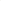

# Personalized Federated Graph-Level Clustering Network

<!-- Page 1 -->

Personalized Federated Graph-Level Clustering Network

Jingxin Liu1, Wenxuan Tu2,3,*, Renda Han2, Junlong Wu2, Haotian Wang2, Guohui Liu2,

Xiangyan Tang2, Yue Yang2,*

## 1 School of Cyberspace Security, Hainan University, Haikou, China 2 School of Computer Science and Technology, Hainan

University, Haikou, China 3 Hainan Blockchain Technology Engineering Research Center, Haikou, China {ljx_0417, twx, yangyuefgws}@hainanu.edu.cn

## Abstract

In the federated clustering task, structural heterogeneity across clients inevitably impedes effective multi-source information sharing. To solve this issue, Personalized Federated Learning (PFL) has emerged as a potentially effective solution for image and text clustering. Unlike Euclidean data, graph-structured data exhibits diverse and fragile local patterns, which widely exist in real-world scenarios. Multi-graph data analysis in the federated learning setting is challenging and important, yet remains underexplored. This motivates us to propose a novel PERsonalized Federated graph-lEvel Clustering neTwork (PERFECT), which generates a specialized aggregation strategy for each client by uploading key model parameters and representative samples without sharing private information. Specifically, for each client, we first reconstruct privacy-preserving representative samples in a minmax optimization manner and then upload these samples to the server for subsequent personalized parameter aggregation. On the server, we first extract graph-level embeddings from the uploaded data, and then estimate affinities among multiple learned embeddings to formulate a personalized aggregation strategy for each client. Subsequently, to help each local model better identify the cluster boundaries, we utilize clustering-wise gradient to update the key components in the personalized model parameters from the server. Extensive experimental results have demonstrated the effectiveness and superiority of PERFECT over its competitors.

Code — https://github.com/Ljx0417/PERFECT

## Introduction

Federated graph learning (FGL), as a distributed learning paradigm, aims to allow multiple clients to collaboratively train a global graph learning model while preserving data privacy (Wang et al. 2025). This technology is suitable for multiple application scenarios, such as personalized recommendation (Wu et al. 2022) and social network analysis (Lei et al. 2023), and cross-modal retrieval (Wang et al. 2024d).

The key prerequisite for the success of current FGL methods lies in the assumption that all samples within each client graph are labeled (Tan et al. 2024). However, such an assumption may not always hold in real-world scenarios, as

*Corresponding authors: Wenxuan Tu and Yue Yang Copyright © 2026, Association for the Advancement of Artificial Intelligence (www.aaai.org). All rights reserved.

**Figure 1.** A performance comparison among our proposed method (Ours), FedGCN (Liu et al. 2025a), and Local Model on SM non-IID settings. The vertical axis denotes clustering accuracy (ACC), while the horizontal axis corresponds to the client ID. Although FedGCN outperforms the Local Model in terms of overall average ACC, its performance degrades on minority clients due to structural heterogeneity. In contrast, our method consistently achieves the best performance across all clients, effectively mitigating the performance drop caused by non-IID data distributions.

clients may possess a large amount of unlabeled graph data. Therefore, it is crucial to research clustering tasks in FGL scenarios. Current federated graph clustering methods can be broadly classified into two categories: 1) federated nodelevel clustering (Liu et al. 2025b), where each client possesses a single graph to collaborate with multiple clients for grouping unlabeled nodes; 2) federated graph-level clustering, which collaboratively optimizes with multiple clients holding multiple non-IID graphs to divide these graphs into different groups. In this study, we focus on the second category, as federated graph-level clustering (FGLC) remains an under-explored area with several unresolved issues. For example, FedGCN (Liu et al. 2025a) is the first work to explore FGLC. It extracts structure-guided features from non-IID graphs on the clients and attempts to obtain the consensus prototypes in an unsupervised manner. However, as shown in Fig. 1, FedGCN sacrifices the clustering performance of certain clients. The main reason for this phenomenon lies in the fact that FedGCN overlooks the structural distribution

The Fortieth AAAI Conference on Artificial Intelligence (AAAI-26)

23721

AI-readable visual equivalent, added: Figure extracted from the paper PDF and converted to an SVG wrapper asset. Use the surrounding page text and caption for interpretation.

<!-- Page 2 -->

heterogeneity of graph data across clients. In addition, in the absence of label supervision, the forced alignment of multiple prototypes further exacerbates the issue. Thus, the consensus information is returned to each client to generate new cluster centers that deviate from the originals, which limits the clustering performance of certain clients.

An intuitive solution is to leverage prior clustering knowledge to uncover potential inter-client correlations, where we further employ the formulated personalized aggregation strategy to update each local model for better clustering. While these methods have been well-studied for images and texts (Chen and Chao 2021), it is still a challenging problem for graph-structured data. A key challenge lies in fragile and diverse structures leading to substantial structural heterogeneity across clients (Tu et al. 2024c). This makes it difficult to accurately explore the inter-client correlations, increasing the risk of heterogeneous information propagation. To address this challenge, our goal is to collect representative information that offers a promising solution to accurately capture potential inter-client correlations at the server. Once the correlations are correctly established, the diffusion of heterogeneous information from the server to clients can be effectively mitigated, while clustering-friendly information is retained and integrated into each local model.

Based on the above observations, we propose a novel personalized FGLC network, termed PERFECT. Its core idea is to upload reconstructed representative samples to explore inter-client correlations under privacy constraints, enabling better clustering for each local model. Specifically, for each client, we first select representative samples from each cluster and generate their counterpart in a min-max optimization manner. Here, the reconstructed structure approximates the raw one in latent space under consistent attribute inputs, while generating structural differences in the original space. Moreover, the node attributes are reconstructed using technology similar to Gaussian noise. In this way, these resultant samples are uploaded without exposing raw data. On the server, we learn these uploaded samples to obtain the graphlevel embeddings, which are then utilized to estimate the potential correlations among clients. After that, we leverage the potential correlations to customize a personalized aggregation strategy for each client to mitigate structural heterogeneity. Finally, we utilize the clustering-wise gradient to selectively update the key components in the returned model parameters for better clustering. Our main contributions are listed below:

• New research task: To the best of our knowledge, this is the first attempt to explore a personalized learning paradigm in an unsupervised FGL setting, which mitigates the structural heterogeneity across clients. • Novel FGL framework: We propose a novel personalized FGLC framework, termed PERFECT. It not only effectively formulates a personalized aggregation strategy for mitigating structural heterogeneity but also enhances clustering performance. • Better clustering results: Experiments on five unlabeled non-IID settings demonstrate the effectiveness of PER- FECT over existing baselines in FGLC tasks.

## Related Work

Federal Graph Learning Federated Learning (FL) enables multiple participants to train local models while preserving data privacy and aggregating updated model parameters at the server to optimize the global model (Wang et al. 2024b). With the widespread application of graph data, FGL has garnered more attention (Meng et al. 2024). For instance, FedGraph (Chen et al. 2022) proposes a lightweight cross-client convolution operation that utilizes labels to capture inter-client correlations for feature sharing. FedPUB (Baek et al. 2023) constructs a labeled random graph that is returned to clients to derive multiple functional embeddings. They are used to compute similarity to identify different communities for mitigating multisource heterogeneity. FedTAD (Zhu et al. 2024) leverages label distribution and structural homogeneity for topologyaware data-free knowledge distillation, which enables the local models to transmit the reliable knowledge to correct the global model. Previous literature has shown that the FGL framework can be integrated with advanced technologies to make progress with the help of graph data labels. However, the structure of graph-level data is complex and diverse, especially in the absence of labels, making it difficult to reach a consensus on multi-source information. To support better clustering, we attempt to customize an aggregation strategy for the multiple graphs of each client to mitigate consensus bias caused by structural heterogeneity.

Graph-Level Clustering Although significant success has been made in graph clustering tasks (Liu et al. 2023a; Tu et al. 2025, 2024d; Peng et al. 2025), existing methods mainly focus on clustering among nodes within a single graph. However, with the widespread application of multi-graph data in real-world scenarios, researchers have gradually shifted their attention from a single graph to multiple graphs (Wang, Tu, and Cheng 2025). For example, GLCC (Wei et al. 2023) develops a general graphlevel clustering framework that captures multi-granularity information to provide a comprehensive graph embedding for better clustering. DCGLC (Cai et al. 2024a) proposes an end-to-end graph-level clustering network that leverages graph contrastive learning to integrate multi-perspective cluster information for more robust clustering. Differently, to cope with the cluster collapse problem, UDGC (Hu et al. 2023) designs an optimization scheme to align the model space and representation space, effectively training model parameters to enhance clustering performance. Commonly, the performance of graph-level clustering can be improved via fine-tuning different model parameters for each sample. Notably, these methods assume that multi-source data are processed separately within individual models, which overlooks the potential correlations among these samples. In contrast, we extend the PFL method into the graph-level clustering task to establish correlations among samples.

## Methodology

Fig. 2 shows the architecture of PREFECT. The core idea is to exploit prior clustering knowledge to infer a specified

23722

<!-- Page 3 -->

**Figure 2.** The PERFECT framework consists of three core parts, i.e., the privacy-preserving sample transformation scheme that generates privacy-preserving representative samples for subsequent personalized information sharing, the personalized information sharing strategy that captures inter-client correlations to mitigate the structural heterogeneity for each client, and the clustering-wise parameter optimization mechanism that preserves the key model parameters for better clustering. Three components are seamlessly integrated into a unified optimization framework.

aggregation strategy for each client without sharing private information. This process consists of three stages: privacypreserving sample transformation, personalized information sharing, and clustering-wise parameter optimization.

## Preliminaries

Notations Given a set of I undirected graphs on each client, denoted as G = {G1, · · ·, GI}, the i-th graph is represented as Gi = (Vi, Ei), where Vi and Ei are the corresponding sets of nodes and edges, respectively. The node attributes matrix is X ∈RN×d, and the original adjacency matrix is A ∈RN×N, where N and d is the number of nodes and the node attributes dimension in a graph, respectively.

Graph Isomorphism Network To effectively extract graph embeddings, we utilize the Graph Isomorphism Network (GIN) with a message-passing mechanism to aggregate information from neighboring nodes. For instance, at the l-th layer, the embeddings of node v are obtained as h(l)

v = MLP

(1 + ω(l)) · h(l−1)

v +

X u∈N (v) h(l−1)

u

, (1)

where N(v) is the set of neighbors of node v, ω(l) is a learnable parameter at l-th layer, and MLP denotes a multilayer perception. Notably, the initial embedding h(0)

v is set as xv.

Local Model Learning In each client, to learn graph-level embeddings, we first construct a GIN encoder F to extract node embeddings, where the node embeddings of each graph are formulated as H = F(X, A). The graph-level embeddings of the i-th graph zi ∈Z can be pooled from all nodes embeddings, as zi = READOUT({hv | v ∈Vi}), where READOUT(·) can be implemented through operations such as mean pooling, sum pooling, etc. Then, Z is fed into the K-means algorithm to obtain multiple prototypes (i.e., cluster centers). The distance between each graph-level embedding and each prototype is subsequently calculated to select the top k% high-confidence samples from each cluster. Here, these collected samples are denoted Go, where i-th graph Go i = {Vo i, Eo i } is characterized by the adjacency matrix Ao and node attributes Xo.

Optimization Objective We minimize the overall objective to optimize the learned node embeddings H, as

L = LMSE + LKL, (2)

where LMSE denotes reconstructed loss and LKL denotes clustering loss following FedGCN (Liu et al. 2025a).

Privacy-Preserving Sample Transformation

After collecting the Go, our goal is to upload them to the server for subsequent personalized information sharing. However, due to privacy constraints, the Go cannot be directly shared. Thus, we design a privacy-preserving sample transformation scheme to upload reconstructed samples.

23723

AI-readable visual equivalent, added: Figure extracted from the paper PDF and converted to an SVG wrapper asset. Use the surrounding page text and caption for interpretation.

<!-- Page 4 -->

For the reconstructed structure, we construct a structuretransform network, including a structure generator Fϕ and a structure corrector FΦ. For the reconstructed attributes, we add Gaussian noise to the raw attributes.

Structure Generator To generate the reconstructed adjacency matrix that differs from Ao, in the first step, we utilize Fϕ µ and Fϕ σ to extract the distribution of Ao and Xo as µ = Fϕ µ(Ao, Xo), log(σ) = F ϕ σ (Ao, Xo), (3)

where µ and σ denote the mean value and standard deviation, respectively. In this way, the reconstructed adjacent matrix incorporates controlled variability in the latent space.

In the second step, to sample from this latent space while maintaining inconsistency, we use the reparameterization trick to compute standard node embeddings as Hϕ = µ + exp(σ)⊙ϵ, where ϵ is a random noise factor that follows the standard normal distribution N(0, 1). Then, we decode the Hϕ to obtain the reconstructed adjacency matrix Aϕ by the transform model g that is implemented by MLP as

Aϕ = g

Hϕ(Hϕ)⊤

. (4)

In the third step, to enhance the consistency between the reconstructed distribution and the original distribution while preserving their structural inconsistency, we minimize the generator loss Lϕ as

Lϕ = −||Aϕ −Ao|| + DKL q(Aϕ|Ao, Xo)||p(Ao)

, (5)

where p(·) represents the prior distribution and q(·) is the posterior distribution. DKL aims to correct the latent distribution by aligning the variational posterior with the predefined prior. Here, the former component enforces maximal differences between the Ao and the Aϕ. The latter component ensures the consistency of their distributions.

In the final step, to ensure the structural validity of Aϕ, we impose additional constraints (i.e., symmetry and nonnegativity constraints) as Aϕ ←||Softmax(Aϕ+(Aϕ)⊤

2)||1.

Structure Corrector To ensure the consistency of representations can be learned from Ao and Aϕ, we design an structure corrector FΦ as

HΦ = FΦ(Aϕ, Xo) = δ(AϕXoW + b), (6)

where δ(·) is the activation function, W and b are learnable weight matrix and bias matrix, respectively. Moreover, the optimization objective of this FΦ is defined as

LΦ = ||Hϕ −HΦ||2 + DKL q(HΦ|Xo, Aϕ)||p(Hϕ)

, (7)

where the first term encourages the consistency of the generated embedding HΦ and prior embedding Hϕ in latent space, while the second term expects the consistency of their distribution. Then, LΦ as an input guides the Fϕ to optimize.

For the reconstructed attributes Xϕ, we add Gaussian noise into the Xo. Subsequently, we upload representative samples (i.e., Aϕ, Xϕ) to the server.

In summary, the proposed privacy-preserving sample transformation scheme offers two major advantages: it 1) collects and uploads the reconstructed representative samples, which are different from the raw samples, and 2) these samples are as approximate as possible in latent space that preserves more trustworthy clustering properties of each cluster within the client, while serving as reliable samples for subsequent personalized information sharing.

Personalized Information Sharing After the server receives the Aϕ and Xϕ, we aim to design a personalized aggregation strategy for each client to mitigate the adverse effects caused by structural heterogeneity. This process mainly involves three steps.

Firstly, we construct a personalized information-sharing network, which consists of three components, i.e., the input projector, the personalized learner, and the output projector. In detail, to map samples of different clients into a consistent Hilbert space, we construct two MLP models as the input projector and output projector, respectively. Then, we establish the GIN model as the personalized learner that preserves the properties of uploaded samples from each client. Next, we extract the graph-level embeddings ¯Z of all clients. The optimization process as Eq. (2).

Secondly, we compute the mean embedding vector ¯zm of m-th client by averaging the columns of ¯Zm ∈ ¯Z, where ¯z represents the semantic information of representative samples from each client. Subsequently, we leverage ¯z to evaluate the potential affinity S between clients as sij = ¯zi(¯zj)⊤

∥¯zi∥·∥¯zj∥, where sij ∈S denotes affinity value between ¯zi and ¯zj.

Finally, to mitigate the structural heterogeneity of different clients, we employ S to formulate a personalized aggregation strategy for each local model parameter ˜θ of as

˜θm ←

M X j=1 αmj · θj + ¯θ, αij = exp(sij) PM k=1 exp(sik)

, (8)

where αmj denotes the normalized similarity between the m-th client and the j-th client, θ and ¯θ are local model parameters and global model parameters, respectively. Meanwhile, the personalized clustering-wise gradient ∇m for the m-th client is obtained in a manner consistent with ¯θ. Then we calculate the gradient-guide signal ∆∇m from the adjacent rounds as ∆∇m = ∇(t)

m −∇(t−1)

m, where ∇(t)m and ∇(t−1)m denote the gradients of the global model at the t-th and (t−1)-th epochs, respectively. Notably, since ∆∇m contains the clustering-oriented optimization direction, it is sent back to each client to guide local model update for better clustering.

The merits of the proposed personalized information sharing can be outlined as: 1) by extracting the inter-client correlations from the uploaded information, we formulate a personalized aggregation strategy that mitigates structural heterogeneity; and 2) in return, the obtained personalized ˜θ of each client promotes a local model for better clustering.

Clustering-Wise Parameter Optimization Then, on each client, we propose a clustering-wise parameter optimization mechanism to selectively update ˜θm that are beneficial for clustering.

23724

<!-- Page 5 -->

## Algorithm

1: Training Procedure of PERFECT

Input: Graphs G; attribute matrix X; adjacency matrix A; server epoch Eglobal; client epoch Elocal; structuretransform network epoch Esn; any single client m. Output: Clustering results p at each client. Initialize θ(0) and R(0) at the server. for i = 1 to Eglobal do for j = 1 to Elocal do

## Clustering-Wise Parameter Optimization if i! = 1&j = 1 then

Calculate Ψ with H and ∆∇m. Calculate µΨ and σΨ from Ψ by Eq. (9). Obtain ˜Ψ with µΨ, σΨ, and Ψ. Update ˜θm with ˜Ψ and R by Eq. (10). end if Generate H with X and A by Eq.(1). Obtain Xo from X, and Ao from A. # Privacy-Preserving Sample Transformation for k = 1 to Esn do

Obtain µ and σ from Xo and Ao by Eq. (3). Obtain Hϕ with µ and σ. Obtain Aϕ with Xo and Ao by Eq. (4). Optimize this network by Eqs. (5) and (7). end for end for # Personalized Information Sharing Upload the Xϕ, Aϕ, and θm to the server. Obtain ¯Z from Xϕ and Aϕ, and obtain the ∆∇m Calculate ¯z from ¯Z, and then obtain S from ¯z. Obtain ˜θm by Eq. (8). Backpropagate the ˜θm and ∆∇m to each client. end for Obtain clustering results p at clients by K-means. return p

In the first step, to evaluate the importance of ˜θm, we leverage the returned ∆∇m to calculate the importance score of ˜θm as Ψ = H⊤H∥∆∇m∥2. Then, to mitigate this process bias, we introduce the normalized operation as µΨ = 1

|L|

L X i=1

Ψ(i), σΨ = v u u t 1

|L|

L X i=1

(Ψ(i) −µ)2, (9)

where µΨ denotes the mean score, σΨ denotes standard deviation, L denotes the number of GIN layer. Subsequently, the normalized importance score is derived as ˜Ψ = δ

Ψ−µΨ σΨ

.

In the second step, we utilize ˜Ψ and the regularization matrix R to retain clustering-friendly information in ˜θm as

˜θm ←˜θm ⊙R, R ←R ⊙exp(−˜Ψ), (10)

where exp(·) is an exponential function, and R is initialized as an all-ones matrix at the beginning of training.

In this way, the collaborative learning between local clients and the server can be further refined for better clustering. Algorithm 1 provides the details of the PERFECT learning process.

## Experiments

## Experiment

Setup Benchmark Datasets To evaluate the effectiveness of the proposed method, we conduct experiments on 15 benchmark graph-level datasets from five domains, including Small Molecule (e.g., MUTAG, BZR, COX2, DHFR, PTC_MR, AIDS, BZR_MD), Bioinformatics (e.g., DD, PROTEINS), Synthetic (e.g., SYNTHETIC), Social Networks (e.g., COLLAB, IMDB-MULTI), and Computer Vision (e.g., Letter-high, Letter-low, Letter-med) (Morris et al. 2020). In addition, to simulate graph-level data heterogeneity, we adopt the non-IID settings from FedGCN (Liu et al. 2025a).

Baseline Methods We compare PERFECT with two types of baseline methods, i.e., 1) three classic FL aggregation strategies, namely FedAvg (McMahan et al. 2017), FedPer (Arivazhagan et al. 2019), and FedProx (Tian et al. 2020); 2) six state-of-the-art FGL methods, including FedSage (Ke et al. 2021), GCFL (Han et al. 2021), FedStar (Tan et al. 2023), LG-FGAD (Cai et al. 2024b), FGAD (Cai et al. 2024c), and FedGCN (Liu et al. 2025a).

Implementation Details To ensure the fairness of experimental results, all methods are implemented based on the PyTorch framework, and experiments are conducted on a single NVIDIA GeForce RTX 4090 GPU. On each client, we adopt a three-layer GIN model (Xu et al. 2018) to extract graph-level embedding, with a batch size of 128 and a learning rate of 1e-2. Moreover, we use a three-layer variational autoencoder as the structure generator and a one-layer MLP as the structure corrector, both optimized using a learning rate of 1e-3. Based on this setup, we select k% representative samples to upload. On the server, we design two MLP models as an input projector and an output projector, respectively. In addition, we develop a three-layer GIN model to extract graph-level embedding from uploaded samples, with the same batch size for each local model. We employ Adam (Kingma and Ba 2014) as the optimizer for both the local and global models. In the FL framework, each client communicates with the server 10 times, during which both the local and global models are trained for 10 epochs in each communication round, respectively.

## Evaluation

Metrics We employ four widely-used clustering metrics to evaluate the FGLC performance of all compared methods, i.e., Accuracy (ACC) (Tu et al. 2024b; Liu et al. 2022; Fu et al. 2025; Wang et al. 2023; Tu et al. 2021, 2022), Normalized Mutual Information (NMI) (Guan et al. 2024; Huang et al. 2025), Adjusted Rand Index (ARI) (Liu et al. 2025c; Tu et al. 2024a; Wang et al. 2024c,a), and F1 Score (F1) (Ke et al. 2024; Wang et al. 2024a; Wan, Huang, and Ye 2024; Tu et al. 2021; Liu et al. 2023b).

Experimental Results Performance Comparison in FGLC Table 1 reports the FGLC performance of nine methods under five non-IID settings. To ensure the fairness of the experiment, each experiment is repeated five times, and the mean and standard deviation of the four clustering metrics are evaluated. From these results, some significant observations can

23725

<!-- Page 6 -->

Classes Domain Metric FedAvg FedPer FedProx FedSage ∗ GCFL ∗ FedStar ∗ LG-FGAD † FGAD † FedGCN PERFECT AISTATS 17 MLSys 20 arXiv 19 NeurIPS 21 NeurIPS 21 AAAI 23 IJCAI 24 MM 24 AAAI 25 Ours

2

SM

(7)

ACC 71.6±0.7 72.3±0.3 73.3±0.8 55.6±1.4 61.1±1.8 58.9±2.4 65.8±0.8 66.4±2.4 75.9±0.8 76.8±1.5 NMI 16.3±2.8 17.6±1.2 18.4±3.0 12.2±1.3 8.7±2.4 12.0±1.2 18.8±1.9 20.2±2.6 24.9±3.0 25.1±5.0 ARI 20.4±1.5 21.7±1.6 21.7±3.3 7.6±0.6 9.4±2.4 0.1±0.8 3.4±1.1 4.3±3.2 31.1±3.4 32.1±4.7 F1 62.1±1.0 62.9±0.8 63.0±2.2 50.2±1.0 43.3±1.6 49.7±2.8 62.9±0.6 63.8±2.6 67.1±1.5 70.3±2.6

SM-BIO

(9)

ACC 66.7±0.2 68.4±0.4 68.0±0.6 57.4±2.2 60.1±1.8 59.5±1.6 59.6±1.5 63.5±1.0 69.2±0.6 70.4±0.9 NMI 11.1±1.3 10.5±1.3 11.5±1.0 5.2±2.1 4.7±2.4 5.3±1.6 9.0±1.4 14.7±1.1 14.0±2.7 17.7±3.4 ARI 13.8±1.1 13.5±0.5 15.1±1.0 4.2±2.7 3.2±2.3 3.8±2.0 7.8±1.7 2.1±2.0 17.5±3.1 21.5±3.3 F1 57.4±1.5 56.7±1.0 59.8±2.2 49.9±0.5 47.3±1.5 51.7±2.2 56.0±2.6 60.7±1.5 59.1±0.9 62.8±3.3

SM-BIO-SY

(10)

ACC 67.3±1.0 67.5±0.8 67.9±0.9 57.6±1.9 59.1±2.0 57.9±2.6 58.4±0.5 62.2±1.3 68.6±1.3 70.3±0.5 NMI 11.9±3.2 5.6±6.7 9.6±3.0 20.6±1.9 14.4±2.2 15.7±2.4 7.6±0.4 14.6±2.6 13.5±2.1 16.7±2.7 ARI 14.5±3.5 6.6±8.2 13.4±2.9 17.6±2.4 13.7±2.8 16.1±3.0 6.4±0.8 3.0±2.9 17.2±3.6 20.6±2.7 F1 57.7±2.2 46.8±8.4 60.4±1.2 49.4±1.7 52.3±1.9 52.3±2.2 54.6±0.7 56.7±0.8 59.4±3.8 61.5±2.4

## 3 SN (2)

ACC 56.3±6.4 52.1±3.5 60.4±7.8 53.3±1.9 52.1±2.3 51.7±2.7 37.9±2.5 41.2±1.9 66.6±2.3 67.6±0.9 NMI 15.2±11.0 8.4±8.4 22.2±11.7 14.8±1.4 12.5±2.3 13.7±2.8 9.6±2.9 5.8±2.4 30.4±6.6 34.7±1.7 ARI 14.7±11.6 6.5±6.8 23.6±13.5 11.6±2.8 13.2±2.3 12.4±1.9 0.4±0.7 0.5±1.4 34.1±5.3 35.6±1.5 F1 40.8±7.1 37.7±13.7 49.6±6.0 49.3±2.0 52.3±1.6 50.7±2.3 26.3±3.5 35.8±1.6 50.7±2.4 51.5±1.4

15 CV

(3)

ACC 26.9±2.6 26.5±1.4 31.4±3.3 10.1±1.4 13.7±2.0 12.4±2.7 26.9±1.7 23.3±0.4 34.6±2.8 35.9±1.4 NMI 30.9±0.9 27.6±1.7 32.1±1.7 30.5±1.7 17.7±2.4 22.4±2.5 32.5±1.4 26.4±0.5 34.2±1.4 35.2±0.7 ARI 14.2±1.2 13.1±1.0 17.2±2.3 13.6±1.8 14.3±2.7 15.3±2.1 8.5±1.3 8.8±0.5 19.3±1.8 21.0±1.2 F1 23.2±3.2 23.5±1.2 28.3±3.0 10.4±1.7 13.2±1.4 11.6±1.9 25.9±1.5 22.2±0.6 31.6±3.1 33.9±1.3

∗Note that these supervised FGL methods are adapted to the unsupervised scenario. † Note that these unsupervised FGL tasks are manually converted into federated graph-level clustering tasks.

**Table 1.** Performance comparison across different federated graph-level clustering tasks. Notably, all compared methods are evaluated under an unsupervised scenario on five non-IID settings to ensure a fair comparison.

**Figure 3.** Performance comparison between FGL methods with limited labels and PERFECT on five non-IID settings.

be summarized: 1) compared to FL aggregation strategies, taking the results on the SM setting, PERFECT significantly outperforms FedAvg, FedPer, and FedProx by 5.2%, 4.5%, and 3.5% in ACC, respectively. These results verify that our global aggregation strategy can effectively prompt each local model to learn clustering-friendly graph-level embeddings. 2) PERFECT consistently outperforms FedSage, GCFL, FedStar, LG-FGAD, and FGAD on ACC under all non-IID settings. This is due to the fact that these FGL methods are not tailored for FGLC tasks. 3) PERFECT outperforms the strongest baseline method, FedGCN, in clustering results. For example, under the SM, SM-BIO, SM-BIO- SY, SN, and CV settings, it achieves ACC improvements of 0.9%, 1.2%, 1.7%, 1.0%, and 1.3%, respectively. This improvement stems from PERFECT’s personalized aggregation strategy for each client, which effectively mitigates the adverse impact of structural heterogeneity on clustering.

**Figure 4.** Module ablation for PIS and CPO.

Comparison with FGL Methods Using Limited Labels To further validate the superiority of PERFECT, we compare it with three FGL methods (i.e., FedSage, GCFL, FedStar) with a limited amount of labeled data, where each method is trained using only 2% of the labeled data. The experimental results in Fig. 3 show that PERFECT exhibits strong competitiveness in the unsupervised FGL scenario, even compared to supervised FGL tasks with limited labeled data.

Module Ablation To demonstrate the effectiveness of the proposed Personalized Information Sharing (PIS) strategy and Clustering-wise Parameter Optimization (CPO) mechanism, we design module ablation experiments on four non- IID settings. Concretely, “w/o P” and “w/o C” denote two PERFECT variants with the PIS strategy and the CPO mech-

23726

AI-readable visual equivalent, added: Figure extracted from the paper PDF and converted to an SVG wrapper asset. Use the surrounding page text and caption for interpretation.

AI-readable visual equivalent, added: Figure extracted from the paper PDF and converted to an SVG wrapper asset. Use the surrounding page text and caption for interpretation.

<!-- Page 7 -->

**Figure 5.** The sensitivity of PERFECT with the variation of the hyperparameter k under five non-IID settings.

Domains Model ACC NMI ARI F1 ∆

SM

(7)

Local 70.4±1.0 13.7±5.5 18.5±5.7 59.9±3.1 - PERFECT_V1 73.9±2.3 14.8±9.1 19.0±9.9 61.7±7.9 ↑1.7 PERFECT_V2 73.5±1.9 15.8±9.0 19.5±9.2 62.7±6.5 ↑2.3 PERFECT 76.8±1.5 25.1±5.0 32.1±4.7 70.3±2.6 ↑10.5

SM-BIO

(9)

Local 65.9±0.2 13.1±1.8 12.4±2.5 56.8±1.9 - PERFECT_V1 69.3±1.5 11.0±5.4 15.4±5.7 59.8±1.2 ↑1.8 PERFECT_V2 68.3±1.5 10.3±3.4 12.3±4.3 59.7±0.2 ↑0.6 PERFECT 70.4±0.9 17.7±3.4 21.5±3.3 62.8±3.3 ↑6.1

SM-BIO-SY

(10)

Local 65.9±0.7 8.2±5.3 10.2±6.3 51.4±4.3 - PERFECT_V1 67.6±0.7 6.5±4.4 7.8±5.1 54.1±3.5 ↑0.1 PERFECT_V2 68.8±1.1 9.4±5.3 12.8±6.3 57.0±3.8 ↑3.1 PERFECT 70.3±0.5 16.7±2.7 20.6±2.7 61.5±2.4 ↑8.4

SN (2)

Local 51.3±3.6 11.7±5.7 12.7±5.0 37.5±4.0 - PERFECT_V1 62.6±6.0 25.2±9.3 24.7±9.8 50.0±1.0 ↑12.3 PERFECT_V2 56.5±7.8 17.8±9.1 16.0±9.5 45.7±6.1 ↑5.7 PERFECT 67.6±0.9 34.7±1.7 35.6±1.5 51.5±1.4 ↑19.1

CV

(3)

Local 29.8±2.4 30.8±2.7 16.3±1.9 25.4±1.7 - PERFECT_V1 30.4±2.6 30.1±1.6 16.5±1.4 28.0±3.2 ↑0.7 PERFECT_V2 30.2±3.1 29.0±3.0 15.5±2.2 28.0±3.5 ↑0.1 PERFECT 35.9±1.4 35.2±0.7 21.0±1.2 33.9±1.3 ↑5.9

**Table 2.** Analysis of PERFECT and its three variants. “↑” denotes the average improvement in terms of four metrics.

anism being removed, respectively. “BS” denotes the local model of PERFECT. As seen in Fig. 4, we can observe that 1) compared to “BS”, “w/o P” and “w/o C” show significant performance improvement on the four non-IID settings, indicating that either the PIS strategy or the CPR mechanism plays an essential role for better clustering in FGL framework; 2) when compared to “w/o C”, PERFECT achieves noticeable improvements, which reveals that the CPO mechanism retains key model parameters to promote the local model for well-separated cluster; and 3) PERFECT consistently outperforms “w/o P” on these settings, verifying that formulating a specified aggregation strategy for each client to help each local model to alleviate structural heterogeneity for better clustering. Based on these observations, the ablation study results strongly support the rationality and effectiveness of each component proposed in PERFECT.

## Analysis

of the PIS Strategy To further analyze the effectiveness of the PIS strategy, we compare PERFECT with its three variants on four non-IID settings. Specifically, “Local” denotes only relying on local training in the non-FL scenario. “PERFECT_V1” denotes the global model to learn a consensus model parameter for all clients. “PERFECT_V2” denotes using mean aggregation to generate the consensus model parameters from different ¯z. Table 2 shows the ex- perimental results of PERFECT and its variants on five non- IID settings. As seen, we can observe the following. Firstly, “Local” shows a significant decline compared to “PER- FECT_V1”, “PERFECT_V2”, and PERFECT, which indicates that multi-client collaborative learning is meaningful. Secondly, compared the PERFECT, “PERFECT_V1”, and “PERFECT_V2” have a marked reduction. The reasons behind this are two-fold as below. On the one hand, the consistent model parameters are sent back to force all local models to update in a uniform direction, leading to them deviating from their originally optimal learning direction. On the other hand, the PIS strategy can effectively extract inter-client relationships to tailor an aggregation strategy for each client, which promotes each local model for better clustering.

## Analysis

of Hyper-Parameter k PERFECT introduces a hyperparameter k to select the ratio of representative samples to be uploaded to the server. We conduct hyperparameter experiments on five non-IID settings, varying the k from 1% to 20%, and analyze the impact of k. From the experimental results in Fig. 5, we can see that the performance shows a trend of first rising and then dropping with the variation of k. This implies that PERFECT needs a proper k to collect and preserve the representative information. Moreover, the optimal k value falls within the range of [1%, 20%] on all non-IID settings. This indicates that selecting a relatively small k is both reasonable and beneficial for FGLC. Based on these observations, we set the value of k to 10%.

## Conclusion

In this paper, we investigate a practical yet challenging problem, i.e., the graph-level data heterogeneity raised from the structural differences across multiple clients. To tackle this issue, we propose a novel personalized federated graph-level clustering framework termed PERFECT, which could be the first to introduce personalized learning into the FGLC. In our method, the proposed privacy-preserving sample transformation scheme, personalized information sharing strategy, and clustering-wise parameter optimization mechanism can extract the inter-client correlations to help each local model formulate a specified aggregation strategy for better clustering. Extensive experiments on five non-IID settings have demonstrated that PERFECT can effectively address structural heterogeneity and significantly outperforms existing methods. Future work may leverage the personalized learning idea to explore the attribute-missing graphs and extend the proposed PERFECT to a more efficient version.

23727

AI-readable visual equivalent, added: Figure extracted from the paper PDF and converted to an SVG wrapper asset. Use the surrounding page text and caption for interpretation.

<!-- Page 8 -->

## Acknowledgments

This work was supported by the National Natural Science Foundation of China (NSFC) (Grant No. 62506102, 62562026), the Key Research and Development Program of Hainan Province (Grant No. ZDYF2024GXJS014, ZDYF2023GXJS163), Collaborative Innovation Project of Hainan University (Grant No. XTCX2022XXB02), the Natural Science Foundation of Hainan University (Grant No. XJ2400009401), and the Science Foundation Youth Fund Project Natural of Hainan Province (Grant No. 624QN279).

## References

Arivazhagan, M. G.; Aggarwal, V.; Singh, A. K.; and Choudhary, S. 2019. Federated Learning with Personalization Layers. arXiv preprint arXiv:1912.00818. Baek, J.; Jeong, W.; Jin, J.; Yoon, J.; and Hwang, S. J. 2023. Personalized Subgraph Federated Learning. In Proceedings of the International Conference on Machine Learning, 1396–1415. Cai, J.; Zhang, Y.; Fan, J.; Du, Y.; and Guo, W. 2024a. Dual Contrastive Graph-level Clustering with Multiple Cluster Perspectives alignment. In Proceedings of the International Joint Conference on Artificial Intelligence, 3770–3779. Cai, J.; Zhang, Y.; Fan, J.; and Ng, S.-K. 2024b. Lg-fgad: an Effective Federated Graph Anomaly Detection Framework. In Proceedings of the International Joint Conference on Artificial Intelligence, 3760–3769. Cai, J.; Zhang, Y.; Lu, Z.; Guo, W.; and Ng, S.-K. 2024c. Towards Effective Federated Graph Anomaly Detection Via Self-boosted Knowledge Distillation. In Proceedings of the ACM International Conference on Multimedia, 5537–5546. Chen, F.; Li, P.; Miyazaki, T.; and Wu, C. 2022. FedGraph: Federated Graph Learning with Intelligent Sampling. IEEE Transactions on Parallel and Distributed Systems, 33(8): 1775–1786. Chen, H.-Y.; and Chao, W.-L. 2021. On Bridging Generic and Personalized Federated Learning for Image Classification. arXiv preprint arXiv:2107.00778. Fu, L.; Deng, B.; Huang, S.; Liao, T.; Pan, S.; and Chen, C. 2025. Less is More: Federated Graph Learning with Alleviating Topology Heterogeneity from A Causal Perspective. In Proceedings of the International Conference on Machine Learning, 17727–17745. Guan, R.; Li, Z.; Li, X.; and Tang, C. 2024. Pixel-superpixel Contrastive Learning and Pseudo-label Correction for Hyperspectral Image Clustering. In Proceedings of IEEE International Conference on Acoustics, Speech and Signal Processing, 6795–6799. Han, X.; Jing, M.; Li, X.; and Carl, Y. 2021. Federated Graph Classification over Non-iid Graphs. In Proceedings of the Conference on Neural Information Processing Systems, 18839–18852. Hu, M.; Chen, C.; Liu, W.; Zhang, X.; Liao, X.; and Zheng, X. 2023. Learning Uniform Clusters on Hypersphere for Deep Graph-level Clustering. arXiv preprint arXiv:1912.00818.

Huang, S.; Fu, L.; Liao, T.; Deng, B.; Zhang, C.; and Chen, C. 2025. FedBG: Proactively Mitigating Bias in Cross- Domain Graph Federated Learning Using Background Data. In Proceedings of the International Joint Conference on Artificial Intelligence, 5408–5416. Ke, L.; Lingyuan, M.; Meng, L.; Yue, L.; Wenxuan, T.; Siwei, W.; Sihang, Z.; Xinwang, L.; Fuchun, S.; and Kunlun, H. 2024. A Survey of Knowledge Graph Reasoning on Graph Types: Static, Dynamic, and Multi-modal. IEEE Transactions on Pattern Analysis and Machine Intelligence, 46(12): 9456–9478. Ke, Z.; Carl, Y.; Xiaoxiao, L.; Lichao, S.; and Ming, Y. S. 2021. Subgraph Federated Learning with Missing Neighbor Generation. In Proceedings of the Conference on Neural Information Processing Systems, 6671–6682. Kingma, D.; and Ba, J. 2014. Adam: A Method for Stochastic Optimization. arXiv preprint arXiv:1412.6980. Lei, R.; Wang, P.; Zhao, J.; Lan, L.; Tao, J.; Deng, C.; Feng, J.; Wang, X.; and Guan, X. 2023. Federated Learning over Coupled Graphs. IEEE Transactions on Parallel and Distributed Systems, 34(4): 1159–1172. Liu, J.; Cheng, J.; Han, R.; Tu, W.; Wang, J.; and Peng, X. 2025a. Federated Graph-level Clustering Network. In Proceedings of the AAAI Conference on Artificial Intelligence, 18870–18878. Liu, J.; Han, R.; Tu, W.; Wang, H.; Wu, J.; and Cheng, J. 2025b. Federated Node-Level Clustering Network with Cross-subgraph Link Mending. In Proceedings of the International Conference on Machine Learning, 38540–38556. Liu, J.; Tang, X.; Han, R.; Tu, W.; and Wang, R. 2025c. Adaptive Feature Boosting and Distribution Refinement for Graph Clustering. Pattern Recognition, 171: 112309– 112320. Liu, Y.; Tu, W.; Zhou, S.; Liu, X.; Song, L.; Yang, X.; and Zhu, E. 2022. Deep Graph Clustering via Dual Correlation Reduction. In Proceedings of the AAAI Conference on Artificial Intelligence, 7603–7611. Liu, Y.; Yang, X.; Zhou, S.; Liu, X.; Wang, S.; Liang, K.; Tu, W.; and Li, L. 2023a. Simple Contrastive Graph Clustering. IEEE Transactions on Neural Networks and Learning Systems, 35(10): 13789–13800. Liu, Y.; Yang, X.; Zhou, S.; Liu, X.; Wang, Z.; Liang, K.; Tu, W.; Li, L.; Duan, J.; and Chen, C. 2023b. Hard Sample Aware Network for Contrastive Deep Graph Clustering. In Proceedings of the AAAI Conference on Artificial Intelligence, 8914–8922. McMahan, B.; Moore, E.; Ramage, D.; Hampson, S.; and y Arcas, B. A. 2017. Communication-Efficient Learning of Deep Networks from Decentralized Data. In Proceedings of the International Conference on Artificial Intelligence and Statistics, 1273–1282. Meng, L.; Liang, K.; Yu, H.; Liu, Y.; Zhou, S.; Liu, M.; and Liu, X. 2024. FedEAN: Entity-Aware Adversarial Negative Sampling for Federated Knowledge Graph Reasoning. IEEE Transactions on Knowledge and Data Engineering, 36(12): 8206–8219.

23728

<!-- Page 9 -->

Morris, C.; Kriege, N. M.; Bause, F.; Kersting, K.; Mutzel, P.; and Neumann, M. 2020. Tudataset: A Collection of Benchmark Datasets for Learning with Graphs. arXiv preprint arXiv:2007.08663.

Peng, X.; Liu, B.; Guan, R.; and Tu, W. 2025. Multi-view Graph Clustering with Dual Structure Awareness for Remote Sensing Data. In Proceedings of the ACM International Conference on Multimedia, 2313–2322.

Tan, Y.; Liu, Y.; Long, G.; Jiang, J.; Lu, Q.; and Zhang, C. 2023. Federated Learning on Non-IID Graphs via Structural Knowledge Sharing. In Proceedings of the AAAI Conference on Artificial Intelligence, 9953–9961.

Tan, Z.; Wan, G.; Huang, W.; and Ye, M. 2024. Fedssp: Federated Graph Learning with Spectral Knowledge and Personalized Preference. In Proceedings of the Conference on Neural Information Processing Systems, 34561–34581.

Tian, L.; Kumar, S. A.; Manzil, Z.; Maziar, S.; Ameet, T.; and Virginia, S. 2020. Federated Optimization in Heterogeneous Networks. In Proceedings of Machine Learning and SSystems, 429–450.

Tu, W.; Guan, R.; Zhou, S.; Ma, C.; Peng, X.; Cai, Z.; Liu, Z.; Cheng, J.; and Liu, X. 2024a. Attribute-Missing Graph Clustering Network. In Proceedings of the AAAI Conference on Artificial Intelligence, 15392–15401.

Tu, W.; Liao, Q.; Zhou, S.; Peng, X.; Ma, C.; Liu, Z.; Liu, X.; Cai, Z.; and He, K. 2024b. RARE: Robust Masked Graph Autoencoder. IEEE Transactions on Knowledge and Data Engineering, 36(10): 5340–5353.

Tu, W.; Xiao, B.; Liu, X.; Zhou, S.; Cai, Z.; and Cheng, J. 2024c. Revisiting Initializing Then Refining: An Incomplete and Missing Graph Imputation Network. IEEE Transactions on Neural Networks and Learning Systems, 36(2): 3244– 3257.

Tu, W.; Zhou, S.; Liu, X.; Cai, Z.; Zhao, Y.; Liu, Y.; and He, K. 2025. WAGE: Weight-sharing Attribute-missing Graph Autoencoder. IEEE Transactions on Pattern Analysis and Machine Intelligence, 47(7): 5760–5777.

Tu, W.; Zhou, S.; Liu, X.; Ge, C.; Cai, Z.; and Liu, Y. 2024d. Hierarchically Contrastive Hard Sample Mining for Graph Self-supervised Pre-training. IEEE Transactions on Neural Networks and Learning Systems, 35(11): 16748–16761.

Tu, W.; Zhou, S.; Liu, X.; Guo, X.; Cai, Z.; Zhu, E.; and Cheng, J. 2021. Deep Fusion Clustering Network. In Proceedings of the AAAI Conference on Artificial Intelligence, 9978–9987.

Tu, W.; Zhou, S.; Liu, X.; Liu, Y.; Cai, Z.; Zhu, E.; Zhang, C.; and Cheng, J. 2022. Initializing Then Refining: A Simple Graph Attribute Imputation Network. In Proceedings of the International Joint Conference on Artificial Intelligence, 3494–3500.

Wan, G.; Huang, W.; and Ye, M. 2024. Federated Graph Learning under Domain Shift with Generalizable Prototypes. In Proceedings of the AAAI Conference on Artificial Intelligence, 15429–15437.

Wang, H.; Jia, Y.; Zhang, M.; Hu, Q.; Ren, H.; Sun, P.; Wen, Y.; and Zhang, T. 2024a. FedDSE: Distribution-aware Submodel Extraction for Federated Learning over Resourceconstrained Devices. In Proceedings of the International Conference of World Wide Web, 2902–2913. Wang, H.; Li, Y.; Xu, W.; Li, R.; Zhan, Y.; and Zeng, Z. 2023. DaFKD: Domain-aware Federated Knowledge Distillation. In Proceedings of the IEEE/CVF Conference on Computer Vision and Pattern Recognition, 20412–20421. Wang, H.; Xu, H.; Li, Y.; Xu, Y.; Li, R.; and Zhang, T. 2024b. FedCDA: Federated Learning with Cross-rounds Divergence-aware Aggregation. In Proceedings of the International Conference on Learning Representations. Wang, H.; Zheng, P.; Han, X.; Xu, W.; Li, R.; and Zhang, T. 2024c. FedNLR: Federated Learning with Neuron-wise Learning Rates. In Proceedings of the ACM SIGKDD Conference on Knowledge Discovery and Data Mining, 3069– 3080. Wang, J.; Tu, W.; and Cheng, J. 2025. Hierarchical Shortestpath Graph Kernel Network. In Proceedings of the Annual Conference on Neural Information Processing Systems. Wang, L.; Tu, W.; Wang, J.; Wang, X.; Cheng, J.; and Liu, J. 2025. Federated Invariant Graph Learning for Non-IID Graphs. In Proceedings of the Annual Conference on Neural Information Processing Systems. Wang, T.; Li, F.; Zhu, L.; Li, J.; Zhang, Z.; and Shen, H. 2024d. Cross-Modal Retrieval: A Systematic Review of Methods and Future Directions. Proceedings of the IEEE, 112(11): 1716–1754. Wei, J.; Gu, Y.; Chen, B.; Sun, G.; Qin, Y.; Liu, X.; Luo, X.; and Zhang, M. 2023. Glcc: A General Framework for Graph-level Clustering. In Proceedings of the AAAI Conference on Artificial Intelligence, 4391–4399. Wu, C.; Wu, F.; Lyu, L.; Qi, T.; Huang, Y.; and Xie, X. 2022. A Federated Graph Neural Network Framework for Privacypreserving Personalization. Nature Communications, 13(1): 3091. Xu, K.; Hu, W.; Leskovec, J.; and Jegelka, S. 2018. How Powerful are Graph Neural Networks? arXiv preprint arXiv:1810.00826. Zhu, Y.; Li, X.; Wu, Z.; Wu, D.; Hu, M.; and Li, R.-H. 2024. FedTAD: Topology-aware Data-free Knowledge Distillation for Subgraph Federated Learning. arXiv preprint arXiv:2404.14061.

23729
