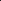

# PhysicsCorrect: A Training-Free Approach for Stable Neural PDE Simulations

<!-- Page 1 -->

PhysicsCorrect: A Training-Free Approach for Stable Neural PDE Simulations

Xinquan Huang1*, Paris Perdikaris1

1University of Pennsylvania {huang26, pgp}@seas.upenn.edu

## Abstract

Neural networks have emerged as powerful surrogates for solving partial differential equations (PDEs), offering significant computational speedups over traditional methods. However, these models suffer from a critical limitation: error accumulation during long-term rollouts, where small inaccuracies compound exponentially, eventually causing complete divergence from physically valid solutions. We present PhysicsCorrect, a training-free correction framework that enforces PDE consistency at each prediction step by formulating correction as a linearized inverse problem based on PDE residuals. Our key innovation is an efficient caching strategy that precomputes the Jacobian and its pseudoinverse during an offline warm-up phase, reducing computational overhead by two orders of magnitude compared to standard correction approaches. Across three representative PDE systems, including Navier-Stokes fluid dynamics, wave equations, and the chaotic Kuramoto-Sivashinsky equation, PhysicsCorrect reduces prediction errors by up to 100× while adding negligible inference time (under 5%). The framework integrates seamlessly with diverse architectures, including Fourier Neural Operators, UNets, and Vision Transformers, effectively transforming unstable neural surrogates into reliable simulation tools that bridge the gap between deep learning’s computational efficiency and the physical fidelity demanded by practical scientific applications.

Code — https://github.com/summerwine668/PhysicsCorrect Extended version — https://arxiv.org/abs/2507.02227

## Introduction

Simulating physical systems governed by partial differential equations (PDEs) is fundamental to numerous scientific and engineering disciplines. Achieving stable long-term rollouts is especially critical for applications such as optimal control, inverse design, and computational imaging. While classical numerical methods like finite-difference (Smith 1985), finite-element (Reddy 1993), and spectral-element methods (Patera 1984) provide accurate solutions, they often demand substantial computational resources, limiting their real-time applicability.

*Corresponding author Copyright © 2026, Association for the Advancement of Artificial Intelligence (www.aaai.org). All rights reserved.

**Figure 1.** PhysicsCorrect stabilizes neural PDE solver rollouts by projecting erroneous predictions back onto the manifold of physically consistent solutions.

Neural PDE solvers have emerged as promising alternatives offering significant computational efficiency (Guo, Li, and Iorio 2016; Zhu et al. 2019; Geneva and Zabaras 2020; Wandel, Weinmann, and Klein 2021; Huang et al. 2024; Zhou et al. 2024; Alkin et al. 2024; Gao, Kaltenbach, and Koumoutsakos 2025). These approaches approximate PDE solution operators, enabling rapid inference once trained. However, they face a fundamental challenge: error accumulation during autoregressive rollouts, where small errors compound exponentially, leading to numerical instability and divergence (Sanchez-Gonzalez et al. 2020).

Current mitigation strategies, such as injecting random noise during training (Sanchez-Gonzalez et al. 2020) or multi-step training regimes, often fall short because prediction errors are structured rather than random. Newer approaches like PDE-refiner (Lippe et al. 2023) employ generative diffusion models at each step, but introduce substantial computational overhead that may negate the speed advantages of neural solvers.

We propose a fundamentally different approach that directly corrects each prediction using the governing PDE itself. Our key insight is that the PDE residual provides a natural signal for correction. By formulating this as a linear inverse problem based on the Jacobian of the PDE residual, we efficiently project predictions onto the manifold of physically consistent solutions (Figure 1).

The Fortieth AAAI Conference on Artificial Intelligence (AAAI-26)

22057

AI-readable visual equivalent, added: Figure extracted from the paper PDF and converted to an SVG wrapper asset. Use the surrounding page text and caption for interpretation.

<!-- Page 2 -->

Our approach requires no additional training, operates efficiently during inference, and is compatible with any pretrained neural PDE solver. For many PDEs, the Jacobian matrix and its pseudoinverse can be precomputed in an offline warm-up phase, resulting in minimal computational overhead. Even for highly nonlinear PDEs with imperfect Jacobian approximations, the correction significantly improves long-term stability. Our contributions are:

• A physics-informed correction framework that leverages PDE residuals for stable long-term rollouts without retraining neural models. • An efficient caching strategy that precomputes the Jacobian pseudoinverse during an offline phase, reducing computational burden while maintaining accuracy. • Demonstration of broad applicability across multiple PDEs (Navier-Stokes, wave equation, Kuramoto- Sivashinsky) and architectures (FNO, UNet, ViT), showing consistent improvements in accuracy and stability.

In the following section, we review related work on neural PDE solvers and existing approaches for improving rollout stability, before detailing our physics-informed correction framework in Section 3 and validating its performance across diverse PDE systems in Section 4.

## Background

& Related Work

Neural PDE Solvers. Neural operators have emerged as powerful surrogates for solving time-dependent PDEs, offering significant computational speedups over traditional numerical methods by learning mappings between function spaces to approximate PDE solution operators. The Fourier Neural Operator (FNO) (Li et al. 2020) established a foundation by performing spectral domain convolutions to capture global dependencies with excellent generalization. The field has since evolved with specialized architectures: messagepassing networks (Brandstetter, Worrall, and Welling 2022) for complex geometries, Clifford neural networks (Brandstetter et al. 2022) for physical invariances, and transformerbased approaches like GNOT (Hao et al. 2023), Transolver (Wu et al. 2024), and CViT (Wang et al. 2025) that combine attention mechanisms with physical priors.

For time-dependent PDEs, these models are typically applied autoregressively, predicting the next state from the current one. While they excel at one-step predictions on indistribution data, they struggle with long-term rollout stability. Small errors accumulate and amplify over multiple time steps, eventually causing catastrophic divergence, one of the most significant barriers to deploying neural operators in real-world applications.

Strategies for Improving Rollout Stability. Several approaches have been developed to address this challenge. Sanchez-Gonzalez et al. (Sanchez-Gonzalez et al. 2020) introduced adversarial training with random noise injection to build robustness against perturbations, while Brandstetter et al. (Brandstetter, Worrall, and Welling 2022) proposed multi-step training where loss is computed over prediction sequences, allowing models to compensate for their errors.

Recent advances leverage generative models: PDE- Refiner (Lippe et al. 2023) adapts diffusion models to iteratively denoise predicted states, and Hu et al. (Hu et al. 2024) employs wavelet-based diffusion to improve spectral accuracy. While effective, these methods introduce substantial computational overhead during training or inference, often negating the efficiency advantages of neural surrogates.

Physics-Based Correction Approaches. An alternative strategy leverages the governing equations to correct predictions without requiring model retraining. Cao et al. (Cao et al. 2023) developed PDE residual minimization methods for Bayesian inference using goal-oriented a-posteriori error estimation (Jha and Oden 2022), later extended to nonlinear variational problems (Jha 2024). While promising, these approaches often introduce significant computational overhead. Other research has focused on enforcing specific physical constraints. Jiang et al. (Jiang et al. 2020) implemented spectral projection layers for divergence-free conditions in fluid simulations, and Duruisseaux et al. (Duruisseaux et al. 2024) generalized this to broader linear differential constraints. These methods are computationally efficient but limited to specific physical aspects rather than ensuring complete PDE satisfaction.

Our Approach. Our work bridges these approaches through a correction framework that enforces PDE satisfaction at each timestep via residual minimization. Unlike existing methods, our approach requires no additional training, employs efficient caching strategies to minimize computational overhead, and generalizes across different PDE types and neural architectures. By treating physical consistency as an online correction problem, we achieve stable long-term rollouts while preserving the computational advantages of neural PDE solvers.

## 3 Methodology Long-term Evolution with Neural PDE

Solvers. Consider time-dependent PDEs of the general form:

S u, ∂u

∂t, ∂2u

∂2t,..., ∂u

∂x, ∂2u

∂2x,...

= 0, (1)

where u represents the solution defined on spatial domain x ∈X and temporal domain t ∈[0, T]. Neural PDE solvers approximate the time-evolution operator of such systems. Given a current state u(x, t), a neural network ϕθ with parameters θ predicts the state at the next time step:

u(x, t + ∆t) = ϕθ(u(x, t)). (2)

For long-term simulations starting from an initial condition u0, the state at time t is obtained through repeated application of ϕθ:

ut = ϕθ(ϕθ(...ϕθ(u0) + ϵ0...) + ϵt−1), (3)

where ϵt represents the prediction error at step t.

The Challenge of Error Accumulation. The fundamental challenge in autoregressive rollouts is that prediction errors compound over time, often leading to numerical instability or complete divergence from the true solution trajectory. Existing approaches attempt to address this problem

22058

<!-- Page 3 -->

by either: (1) Enhancing model robustness through specialized training regimes like noise injection or multi-step training, which requires substantial additional training data and computational resources; or (2) Applying post-hoc corrections through computationally expensive denoising procedures that may negate the efficiency advantages of neural solvers. Both approaches face limitations because prediction errors exhibit complex, structured patterns rather than random noise. These errors depend on the specific state distribution and are difficult to anticipate through data augmentation alone. Moreover, even highly accurate neural operators may eventually diverge during sufficiently long rollouts.

Here we propose an alternative paradigm: a lightweight, physics-informed correction mechanism that operates during inference without requiring model retraining. By explicitly minimizing the PDE residual at each time step, we project predictions back onto the manifold of physically valid solutions, effectively transforming a challenging multistep prediction problem into a sequence of more manageable one-step predictions. This approach aims to strike an optimal balance between computational efficiency and numerical stability, providing a general solution for accurate long-term simulations across different PDE types and neural architectures.

## 3.1 The PhysicsCorrect Framework: Linearized PDE Residual Correction Problem

Formulation. The core idea of our PhysicsCorrect approach is to leverage the governing PDE itself as a form of implicit supervision, correcting neural network predictions to better satisfy the underlying physics. For a state ut at time t, a neural operator produces a prediction ˆut+1 for the next time step. Our goal is to find a correction term uc t+1 such that the corrected prediction ˆut+1 + uc t+1 better approximates the true solution ut+1.

While the ground truth ut+1 is unavailable during inference, we can evaluate how well a candidate solution satisfies the governing equation by computing the PDE residual. For a discretized PDE, this residual LPDE(ut, ut+1) is obtained by substituting ut and ut+1 into Equation 1. A physically consistent solution would yield a residual of zero (or for second-order time derivatives, the residual would depend on ut, ut+1, and ut−1).

Efficient Correction via Linear Approximation. A natural approach would be to directly minimize the PDE residual with respect to the correction term:

uc∗ t+1 = arg min uc t+1

∥LPDE(ut, ˆut+1 + uc t+1)∥2. (4)

However, directly solving this optimization problem would require iterative methods with adaptive learning rates, introducing significant computational overhead that could negate the efficiency advantages of neural PDE solvers. Instead, we linearize the problem using a first-order Taylor expansion of the residual around the current prediction ˆut+1:

LPDE(ut, ˆut+1 + uc t+1) ≈LPDE(ut, ˆut+1)

+ ∂LPDE(ut, ˆut+1)

∂ˆut+1 uc t+1. (5)

0 25 50 75 100 125 150 175 200 Time step

0.000

0.001

0.002

Relative L2 error

Average rollout error baseline one step rollout predictor-corrector

**Figure 2.** Long-term rollout accuracy comparison for the 2D Navier-Stokes benchmark. The baseline neural operator (brown) exhibits error accumulation, while our predictorcorrector approach (blue) maintains stability throughout the simulation, closely matching the performance of idealized one-step rollouts (yellow).

This approximation is valid when the correction term uc t+1 is sufficiently small, a condition typically satisfied when the neural operator has been adequately trained for direct full physical prediction (directly approximate ut+1). When using the residual prediction (ut+1 −ut), this assumption will be relaxed (see the sensitivity analysis in the Appendix). Setting the linearized residual to zero yields a linear system:

∂LPDE(ut, ˆut+1)

∂ˆut+1 uc t+1 = −LPDE(ut, ˆut+1). (6)

This can be expressed in the standard form Ax = b, where A is the Jacobian matrix of the PDE residual with respect to

ˆut+1, x is the correction term uc t+1 we seek to determine, and b is the negative PDE residual −LPDE(ut, ˆut+1). The correction term can then be obtained by solving this linear system, typically using least-squares methods to handle potential ill-conditioning or over-determined systems. Unlike training-based approaches that learn to predict corrections from residuals, our method directly inverts the linearized PDE operator, avoiding the need for additional training data and mitigating potential distribution shifts between training and inference.

Predictor-Corrector Pipeline. Based on this formulation, we implement PhysicsCorrect as a two-step predictorcorrector pipeline:

## 1 Prediction Step:

The neural operator ϕθ produces a prediction ˆut+1 = ϕθ(ut). 2. Correction Step: We solve the linear system in Equation 6 to obtain the correction term uc t+1 and compute the corrected prediction ˜ut+1 = ˆut+1 + uc t+1.

This corrected state ˜ut+1 then serves as input for the next prediction step. By ensuring that each state better satisfies the underlying PDE, we significantly reduce error accumulation during autoregressive rollouts. As shown in Figure 2, this approach maintains stability and accuracy over hundreds of time steps when applied to the 2D Navier-Stokes equation, while the baseline prediction eventually diverges due to accumulated errors. The figure also illustrates how

22059

<!-- Page 4 -->

0 25 50 75 100 125 150 175 200 Time step

10 5

10

10 3

Relative L2 error

Rollout error

Baseline + Corrector

+ Corrector (J cached)

+ Corrector (J cached)

0 25 50 75 100 125 150 175 200 Time step

10 0

10 1

10 2

L1 norm of PDE residual

Rollout PDE residual

Baseline + Corrector

+ Corrector (J cached)

+ Corrector (J cached)

**Figure 3.** PhysicsCorrect’s caching strategy efficiency on 2D Navier-Stokes. Left: Relative L2 error vs. reference solutions over 200 time steps. Right: PDE residual magnitude per step. While the baseline (brown) shows increasing error and residual, both uncached (yellow) and Jacobian-cached (blue) corrections maintain low values. Pseudoinverse caching (red) preserves performance while reducing computational cost by 163x.

our method’s performance closely approaches that of idealized one-step rollouts, effectively transforming a challenging multi-step prediction problem into a sequence of more manageable one-step predictions.

Our formulation assumes that the neural operator’s prediction provides a good initial approximation, allowing the linearization to be effective. This assumption generally holds but may be challenged in highly chaotic systems or with poor initialization (see sensitivity analysis in the Appendix). Nevertheless, the effectiveness of our approach across different PDEs and networks is demonstrated empirically in Section 4, even in challenging regimes.

Efficient Implementation via Jacobian Caching. While the physics-informed correction significantly improves rollout stability, a naive implementation would introduce substantial computational overhead from two expensive operations at each time step: (1) evaluating the Jacobian matrix, and (2) solving the resulting least-squares problem. The Jacobian evaluation requires computing gradients between two spatial fields of dimension M × N, where M and N represent the height and width of the domain. This operation, typically performed through automatic differentiation, scales poorly with increasing resolution. Similarly, solving the least-squares problem via singular value decomposition is numerically stable but computationally intensive.

We introduce a key optimization that dramatically reduces this computational burden. For many time-dependent PDEs, we observe that the Jacobian matrix remains constant across different time steps and initial conditions when the residual LPDE(ut, ˆut+1) is linear with respect to ˆut+1. This property allows us to precompute the Jacobian matrix once during an offline warm-up phase, along with its Moore-Penrose pseudoinverse A†. During inference, we can then directly compute the correction as uc t+1 = A†b, where b = −LPDE(ut, ˆut+1). This approach effectively transforms the correction step from an expensive numerical operation to a simple matrix multiplication, resulting in minimal computational overhead during rollout.

For this caching strategy to be effective, in the Jacobian calculation, the PDE residual must maintain linearity with respect to ˆut+1. To satisfy this requirement while preserving numerical stability, we employ a semi-implicit discretization scheme that treats linear terms (e.g., diffusion) implicitly to ensure stability, while handling nonlinear terms (e.g., advection) explicitly to preserve Jacobian constancy. For example, in the 2D Navier-Stokes equations, we implement a Crank-Nicolson scheme with implicit diffusion and explicit advection terms (more details are in the Appendix). This formulation ensures that the Jacobian remains constant across all predictions and initial conditions, while maintaining adequate numerical stability.

As demonstrated in Figure 3, our caching strategy achieves accuracy comparable to the non-cached version while reducing computational cost by approximately 160x. The precomputation phase for a 64x64 resolution grid requires only 8.74 seconds, after which the correction adds minimal overhead to the neural operator’s inference time (0.90 vs. 0.69 seconds for 200 time steps). Importantly, even for chaotic systems where the approximation to the Jacobian matrix is relatively poor with the semi-implicit discretization, the correction still substantially improves rollout stability. We observe that this approach works effectively even when applying it to chaotic systems with nonlinear residual terms, as we demonstrate with the Kuramoto-Sivashinsky equation in Section 4.3.

## Experiments

We evaluate the PhysicsCorrect framework on three representative PDE systems (Figure 4) that vary in complexity, dimensionality, and dynamical behavior: the 2D Navier-Stokes equations (incompressible fluid flow), the 2D wave equation (second-order hyperbolic PDE), and the 1D Kuramoto-Sivashinsky equation (fourth-order nonlinear PDE exhibiting chaotic behavior). For each system, we test our approach with three neural network architectures: Fourier Neural Operator (FNO) (Li et al. 2020), UNet (Wandel, Weinmann, and Klein 2020), and Vision Transformer (ViT) (Dosovitskiy et al. 2020). All models are trained to generalize across different initial conditions using the Adam optimizer and L1 loss. Performance is measured by the relative L2 error between predictions and numerical solutions.

Our experiments are designed to address three key questions: whether the correction framework improves the stability and accuracy of long-term rollouts across different neural architectures; how effective the caching strategy is in main-

22060

<!-- Page 5 -->

FNO U-Net ViT FNO U-Net ViT FNO U-Net ViT

10 3

10 2

10 1

10 0

10 1

Relative Error

Corrector Improvement across PDEs and Models

NS Baseline NS Corrected

Wave Baseline Wave Corrected

KS Baseline KS Corrected

0

1

2

3

Relative Cost (×)

Relative Cost (Corrected / Baseline) Baseline

**Figure 4.** Performance comparison of our physics-informed correction approach across different PDE systems and neural architectures. Left axis (bars): Relative L2 error of baseline models (lighter colors) versus corrected models (darker colors) for Navier-Stokes (NS), wave equation, and Kuramoto-Sivashinsky (KS) equations at the final state after long rollouts (1000 time step rollout for NS and KS equations; 100 time steps for wave equation). Error bars represent the standard deviation for 5 seeds. Right axis (line): Relative computational cost of the corrected approach compared to baseline. The correction framework consistently reduces error across all PDEs and architectures with minimal computational overhead. Detailed rollout histories and comparison with baseline models are provided in the Appendix.

taining accuracy while reducing computational overhead; and how the correction performs on systems with different levels of nonlinearity and chaotic behavior. Network details and training parameters are provided in the Appendix.

4.1 2D Navier-Stokes equation We first evaluate our approach on the 2D incompressible Navier-Stokes equation with a Reynolds number of 1,000 and forcing term f(x, y) = 0.1 sin(2π(x+y))+cos(2π(x+ y)) (more details are in the Appendix) This system exhibits complex vorticity dynamics and is widely used as a benchmark for fluid simulation.

Experimental Setup. We train our models on a dataset of 1,000 trajectories generated from Gaussian random initial vorticity fields ω0 ∼N

0, 83(−∆+ 64I)−4.0, simulated on a 64×64 grid with a time step of 0.01. For the PDE residual formulation, we employ a semi-implicit Crank-Nicolson scheme with explicit advection and implicit diffusion terms. We evaluate performance on 64 test trajectories, each simulated for 1,000 time steps.

One-Step Correction Performance. Figure 5 demonstrates the effect of our correction on a single prediction step. The baseline FNO prediction contains small but structured errors that our method effectively eliminates. The correction reduces the relative L2 error by an order of magnitude (from 3.3e-5 to 5.5e-6) while simultaneously reducing the PDE residual to near zero, indicating that the corrected state closely satisfies the governing equation.

Long-Term Rollout Stability. Figure 4 shows the longterm rollout performance across different neural architectures (FNO, UNet, and ViT). All baseline models exhibit error accumulation that eventually leads to complete divergence from the reference solution. In contrast, models aug- mented with our physics-informed corrector maintain stable and accurate predictions throughout the entire 1,000-step simulation, regardless of the underlying architecture. The PDE residual (more details and comparison with baseline models are shown in the Appendix) remains consistently low for all corrected models, confirming that our approach enforces physical consistency at each time step and prevents error accumulation.

The results demonstrate that our correction framework effectively transforms inherently unstable neural PDE solvers into stable simulation tools without requiring architecturespecific modifications or additional training. This universality is particularly valuable as it allows practitioners to leverage any pre-trained neural operator while ensuring physical consistency and long-term stability.

Understanding the Limits of Residual-Based Correction. Even with perfect numerical methods, discretization introduces small but non-zero PDE residuals in reference solutions, as shown in the leftmost panel of Figure 6. Since our method targets zero residual, this creates a fundamental discrepancy – we optimize toward a slightly different objective than the true numerical solution, introducing small inherent errors (fourth panel of Figure 6). To investigate this limitation, we conducted an idealized experiment where we subtract the reference solution’s residual from the prediction’s residual before correction. This adjustment aligns our optimization target precisely with the numerical reference, resulting in significantly improved accuracy (relative L2 error reduced from 3.3e-5 to 6.1e-7) as shown in the rightmost panel of Figure 6. While impractical for real applications where reference solutions are unavailable, it demonstrates the theoretical upper bound of our method’s performance.

This experiment yields two important insights: first, the quality of PDE discretization directly impacts correction ac-

22061

<!-- Page 6 -->

2.5 0.0 2.5 ×10

3

0

2 ×10

7

0

2 ×10

8

2.5 5.0

×10

2

0

5 ×10

4

**Figure 5.** One-step correction on the 2D Navier-Stokes equation. From left to right: ground truth solution from numerical simulation, prediction error of baseline FNO, prediction error after our correction, PDE residual of baseline prediction, and PDE residual after correction. Note the significant reduction in both error magnitude (10× improvement) and PDE residual (100× improvement), demonstrating that our correction effectively projects predictions onto the manifold of physically consistent solutions.

0.5 1.0 1.5 ×10

3

0

5 ×10

4

0.5 1.0 1.5 ×10

3

0

2 ×10

8

2.5

0.0

2.5 ×10

9

**Figure 6.** The visualization of one test sample: PDE residual using (from left to right) numerical reference result, corrected prediction, the corrected prediction with reference PDE residual, the errors of corrected prediction, and the errors of corrected prediction with reference PDE residual.

curacy; and second, even with standard discretization, our method achieves substantial error reduction (approximately 85%) relative to the theoretical optimum. These findings suggest that using finer discretization schemes for residual computation could further improve correction performance in practice (further discussion is in the Appendix).

4.2 2D wave equation

We test our approach on the 2D wave equation, a secondorder linear PDE that models various physical phenomena, including mechanical waves, electromagnetic waves, and seismic propagation (more details are in the Appendix).

Experimental Setup. We generate data on a 128 × 128 grid using 512 Gaussian random fields as initial conditions with periodic boundaries. Training data consists of the first 10 time steps (recorded at intervals of ∆t = 10−2), while testing evaluates generalization over 100 time steps. For residual computation, we employ an implicit scheme with central finite differences for the time derivatives.

Neural Architecture Considerations. An interesting finding emerged during our wave equation experiments: standard first-order residual prediction (predicting ut+1 − ut) consistently failed to capture the essential physics (see Appendix for more results). To resolve this, we revisited the problem through the lens of second-order dynamics, training networks to predict δut = ut+1 + ut−1 −2ut instead. This formulation resonates with the oscillatory nature of wave phenomena, providing a significantly more stable formulation. This insight highlights how the representation of physical dynamics can fundamentally shape neural network performance, even before correction mechanisms are applied.

Results. Figure 4 shows the long-term rollout performance of different neural architectures with and without our correction framework. Even with the improved second-order formulation, baseline models (particularly ViT and UNet) still exhibit error growth over time. Our physics-informed corrector consistently enhances prediction accuracy across all architectures, maintaining low PDE residuals throughout the simulation. The wave equation results demonstrate our method’s effectiveness on linear PDEs with oscillatory dynamics. Interestingly, the performance improvement is more pronounced for architectures that struggle more with the baseline formulation (ViT and UNet), suggesting that our correction approach can help compensate for architecturespecific weaknesses in capturing certain physical dynamics.

## 4.3 Kuramoto-Sivashinsky equation Our final and most challenging test case is the

Kuramoto–Sivashinsky (KS) equation, a fourth-order nonlinear PDE that exhibits chaotic dynamics (more details are in the Appendix). This system tests our method’s effectiveness on strongly nonlinear, chaotic dynamics where prediction errors can amplify rapidly and where linearization approximations are most severely challenged.

Experimental Setup. We simulate the KS equation on a spatial domain [0, 64] with a resolution of 512 points, focusing on the chaotic regime. Starting from v(x, 50), we generate 512 trajectories for training (first 500 steps) and 64 trajectories for testing (full 1000 steps) using a spectral method with temporal step size 0.05 (Dresdner et al. 2023).

Challenges with Chaotic Systems. The KS equation presents unique challenges for our correction approach. The standard strategy of using semi-implicit discretization (implicit for linear terms, explicit for nonlinear terms) to obtain a constant Jacobian proves inadequate due to the equation’s strong nonlinearity and chaotic behavior. A fully implicit discretization would provide better residual definition but would require re-computing the Jacobian and its pseudoinverse at each time step, negating the computational advantages of our caching strategy.

Effectiveness of Approximate Correction. Surprisingly, as shown in Figure 4, our approach with cached pseudoinverse still provides significant stability improvements despite using an approximation of the true Jacobian. Figure 7(a) shows a qualitative comparison between baseline FNO predictions (top) and corrected predictions (bottom), demonstrating that our method successfully maintains the complex spatiotemporal patterns of the KS equation over long rollouts. To further investigate the impact of Jacobian approximation in chaotic systems, we conducted additional experiments varying the frequency of Jacobian updates, as shown in Figure 7(b). The results reveal that recalculating the Jacobian every 3-10 time steps provides minimal improvement over the fully cached approach (updating only once at initialization). This suggests that for the KS equation, the primary benefit comes from the initial projection toward the physically consistent manifold rather than from having a perfectly accurate Jacobian at each step.

22062

AI-readable visual equivalent, added: Figure extracted from the paper PDF and converted to an SVG wrapper asset. Use the surrounding page text and caption for interpretation.

AI-readable visual equivalent, added: Figure extracted from the paper PDF and converted to an SVG wrapper asset. Use the surrounding page text and caption for interpretation.

AI-readable visual equivalent, added: Figure extracted from the paper PDF and converted to an SVG wrapper asset. Use the surrounding page text and caption for interpretation.

AI-readable visual equivalent, added: Figure extracted from the paper PDF and converted to an SVG wrapper asset. Use the surrounding page text and caption for interpretation.

AI-readable visual equivalent, added: Figure extracted from the paper PDF and converted to an SVG wrapper asset. Use the surrounding page text and caption for interpretation.

AI-readable visual equivalent, added: Figure extracted from the paper PDF and converted to an SVG wrapper asset. Use the surrounding page text and caption for interpretation.

AI-readable visual equivalent, added: Figure extracted from the paper PDF and converted to an SVG wrapper asset. Use the surrounding page text and caption for interpretation.

AI-readable visual equivalent, added: Figure extracted from the paper PDF and converted to an SVG wrapper asset. Use the surrounding page text and caption for interpretation.

<!-- Page 7 -->

(a) (b)

**Figure 7.** Performance of PhysicsCorrect on the chaotic Kuramoto-Sivashinsky equation. (a) Spatiotemporal evolution over 1000 time steps comparing ground truth, baseline FNO prediction, and error magnitude for uncorrected (top) and corrected (bottom) predictions. (b) Impact of Jacobian update frequency on KS equation prediction error over 1000 steps. Periodic recomputation offers minimal improvement over the fully cached approach, while semi-implicit discretization for both Jacobian and residual shows notably higher errors.

These findings lead to an important insight: accurate definition of the PDE residual is more critical than perfect estimation of the Jacobian pseudoinverse. This, in turn, supports the validity of separating the residual evaluation from the Jacobian precomputation, as the correction remains effective even when the precomputed Jacobian is only approximate. Even with an approximate linear correction, projecting predictions toward the physically consistent manifold provides sufficient regularization to prevent error accumulation. This observation is particularly significant for chaotic systems, where traditional methods often struggle to maintain longterm stability, and offers a favorable trade-off between computational efficiency and prediction accuracy.

## 5 Discussion

Summary of Contributions. We introduced PhysicsCorrect, a training-free, physics-informed correction framework that significantly enhances neural PDE solver stability during long-term rollouts. Our approach works with any pretrained neural operator with minimal computational overhead through efficient caching. Across Navier-Stokes, wave equation, and Kuramoto-Sivashinsky systems, our method reduces prediction errors by 1-2 orders of magnitude compared to baselines, with consistent benefits across FNO, UNet, and ViT architectures. By enforcing physical consistency at each step, we transform multi-step rollouts into sequences of well-conditioned one-step predictions. Remarkably, even with approximate linearization and cached Jacobians, the method substantially improves stability in chaotic systems, demonstrating robust practical utility.

## Limitations

& Future Work. Despite its effectiveness, PhysicsCorrect faces three key limitations that suggest directions for future work: (1) computational scalability to high-resolution simulations, as Figure 8 demonstrates quadratic scaling of time and memory requirements with resolution, which could be mitigated by inverting the Jacobian approximately using iterative methods that only require Jacobian-vector products; (2) discretization-induced

**Figure 8.** PhysicsCorrect’s computational scaling with grid resolution for 2D Navier-Stokes. Plots show computation time (left), GPU memory usage (center), and peak memory consumption (right). All metrics scale quadratically with resolution, highlighting memory and compute requirements as the primary limitation for high-resolution applications, and indicating challenges in scaling to fully 3D problems.

errors creating an inherent gap between our correction target and true numerical references, potentially improvable through higher-order discretization schemes; moreover, it can be naturally combined with spatio-temporal decomposition training frameworks (Huang et al. 2023), preserving the large spatial- and temporal-interval advantages of purely neural PDE solvers while enhancing stability through physics-based correction; and (3) potential breakdown of linearization approximations in extreme chaotic systems, which might be addressed by hybrid approaches combining efficient linear correction with occasional nonlinear optimization steps.

Conclusions. This work demonstrates that enforcing physical consistency through direct projection onto the manifold of valid solutions provides a powerful, computationefficient approach to stabilizing neural PDE solvers without requiring additional training or expensive denoising. The method’s simplicity, generality, and efficiency make it immediately applicable across scientific and engineering applications, effectively bridging the gap between deep learning’s computational advantages and the physical fidelity demanded by practical applications.

22063

AI-readable visual equivalent, added: Figure extracted from the paper PDF and converted to an SVG wrapper asset. Use the surrounding page text and caption for interpretation.

AI-readable visual equivalent, added: Figure extracted from the paper PDF and converted to an SVG wrapper asset. Use the surrounding page text and caption for interpretation.

AI-readable visual equivalent, added: Figure extracted from the paper PDF and converted to an SVG wrapper asset. Use the surrounding page text and caption for interpretation.

AI-readable visual equivalent, added: Figure extracted from the paper PDF and converted to an SVG wrapper asset. Use the surrounding page text and caption for interpretation.

AI-readable visual equivalent, added: Figure extracted from the paper PDF and converted to an SVG wrapper asset. Use the surrounding page text and caption for interpretation.

AI-readable visual equivalent, added: Figure extracted from the paper PDF and converted to an SVG wrapper asset. Use the surrounding page text and caption for interpretation.

<!-- Page 8 -->

## Acknowledgments

This work was supported by the U.S. Department of Energy, Advanced Scientific Computing Research program, under the “Resolution-invariant deep learning for accelerated propagation of epistemic and aleatory uncertainty in multi-scale energy storage systems, and beyond” project (Project No. 81824), and Penn AIxScience fellowship.

## References

Alkin, B.; F¨urst, A.; Schmid, S.; Gruber, L.; Holzleitner, M.; and Brandstetter, J. 2024. Universal physics transformers: A framework for efficiently scaling neural operators. Advances in Neural Information Processing Systems, 37: 25152–25194. Brandstetter, J.; Berg, R. v. d.; Welling, M.; and Gupta, J. K. 2022. Clifford Neural Layers for PDE Modeling. ArXiv:2209.04934 [physics]. Brandstetter, J.; Worrall, D.; and Welling, M. 2022. Message Passing Neural PDE Solvers. arXiv, 1–27. ArXiv: 2202.03376. Cao, L.; O’Leary-Roseberry, T.; Jha, P. K.; Oden, J. T.; and Ghattas, O. 2023. Residual-based error correction for neural operator accelerated infinite-dimensional Bayesian inverse problems. Journal of Computational Physics, 486: 112104. Dosovitskiy, A.; Beyer, L.; Kolesnikov, A.; Weissenborn, D.; Zhai, X.; Unterthiner, T.; Dehghani, M.; Minderer, M.; Heigold, G.; Gelly, S.; Uszkoreit, J.; and Houlsby, N. 2020. An Image is Worth 16x16 Words: Transformers for Image Recognition at Scale. ArXiv: 2010.11929. Dresdner, G.; Kochkov, D.; Norgaard, P.; Zepeda-N´u˜nez, L.; Smith, J. A.; Brenner, M. P.; and Hoyer, S. 2023. Learning to correct spectral methods for simulating turbulent flows. ArXiv:2207.00556 [cs]. Duruisseaux, V.; Liu-Schiaffini, M.; Berner, J.; and Anandkumar, A. 2024. Towards Enforcing Hard Physics Constraints in Operator Learning Frameworks. In ICML 2024 AI for Science Workshop. Gao, H.; Kaltenbach, S.; and Koumoutsakos, P. 2025. Generative learning of the solution of parametric partial differential equations using guided diffusion models and virtual observations. Computer Methods in Applied Mechanics and Engineering, 435: 117654. Geneva, N.; and Zabaras, N. 2020. Modeling the dynamics of PDE systems with physics-constrained deep autoregressive networks. Journal of Computational Physics, 403: 109056. Guo, X.; Li, W.; and Iorio, F. 2016. Convolutional neural networks for steady flow approximation. In Proceedings of the 22nd ACM SIGKDD international conference on knowledge discovery and data mining, 481–490. Hao, Z.; Wang, Z.; Su, H.; Ying, C.; Dong, Y.; Liu, S.; Cheng, Z.; Song, J.; and Zhu, J. 2023. GNOT: A General Neural Operator Transformer for Operator Learning. In Proceedings of the 40th International Conference on Machine Learning, 12556–12569. PMLR. ISSN: 2640-3498.

Hu, P.; Wang, R.; Zheng, X.; Zhang, T.; Feng, H.; Feng, R.; Wei, L.; Wang, Y.; Ma, Z.-M.; and Wu, T. 2024. Wavelet Diffusion Neural Operator. ArXiv:2412.04833 [cs]. Huang, X.; Shi, W.; Gao, X.; Wei, X.; Zhang, J.; Bian, J.; Yang, M.; and Liu, T.-Y. 2024. LordNet: An efficient neural network for learning to solve parametric partial differential equations without simulated data. Neural Networks, 176: 106354. Huang, X.; Shi, W.; Meng, Q.; Wang, Y.; Gao, X.; Zhang, J.; and Liu, T.-Y. 2023. NeuralStagger: Accelerating Physicsconstrained Neural PDE Solver with Spatial-temporal Decomposition. In Proceedings of the 40th International Conference on Machine Learning, 13993–14006. PMLR. ISSN: 2640-3498. Jha, P. K. 2024. Residual-Based Error Corrector Operator to Enhance Accuracy and Reliability of Neural Operator Surrogates of Nonlinear Variational Boundary-Value Problems. Computer Methods in Applied Mechanics and Engineering, 419: 116595. ArXiv:2306.12047 [math]. Jha, P. K.; and Oden, J. T. 2022. Goal-oriented a-posteriori estimation of model error as an aid to parameter estimation. Journal of Computational Physics, 470: 111575. Jiang, C. M.; Kashinath, K.; Prabhat; and Marcus, P. 2020. Enforcing Physical Constraints in CNNs through Differentiable PDE Layer. In ICLR 2020 Workshop on Integration of Deep Neural Models and Differential Equations. Li, Z.; Kovachki, N.; Azizzadenesheli, K.; Liu, B.; Bhattacharya, K.; Stuart, A.; and Anandkumar, A. 2020. Fourier Neural Operator for Parametric Partial Differential Equations. ArXiv: 2010.08895. Lippe, P.; Veeling, B. S.; Perdikaris, P.; Turner, R. E.; and Brandstetter, J. 2023. PDE-Refiner: Achieving Accurate Long Rollouts with Neural PDE Solvers. ArXiv:2308.05732 [cs]. Patera, A. T. 1984. A spectral element method for fluid dynamics: laminar flow in a channel expansion. Journal of computational Physics, 54(3): 468–488. Reddy, J. N. 1993. An introduction to the finite element method. New York, 27(14). Sanchez-Gonzalez, A.; Godwin, J.; Pfaff, T.; Ying, R.; Leskovec, J.; and Battaglia, P. W. 2020. Learning to Simulate Complex Physics with Graph Networks. ArXiv: 2002.09405. Smith, G. D. 1985. Numerical solution of partial differential equations: finite difference methods. Oxford university press. Wandel, N.; Weinmann, M.; and Klein, R. 2020. Learning Incompressible Fluid Dynamics from Scratch – Towards Fast, Differentiable Fluid Models that Generalize. ArXiv: 2006.08762. Wandel, N.; Weinmann, M.; and Klein, R. 2021. Teaching the incompressible Navier–Stokes equations to fast neural surrogate models in three dimensions. Physics of Fluids, 33(4). Wang, S.; Seidman, J. H.; Sankaran, S.; Wang, H.; Pappas, G. J.; and Perdikaris, P. 2025. CViT: Continuous Vision Transformer for Operator Learning. ArXiv:2405.13998 [cs].

22064

<!-- Page 9 -->

Wu, H.; Luo, H.; Wang, H.; Wang, J.; and Long, M. 2024. Transolver: A Fast Transformer Solver for PDEs on General Geometries. ArXiv:2402.02366. Zhou, H.; Ma, Y.; Wu, H.; Wang, H.; and Long, M. 2024. Unisolver: PDE-conditional transformers are universal PDE solvers. arXiv preprint arXiv:2405.17527. Zhu, Y.; Zabaras, N.; Koutsourelakis, P.-S.; and Perdikaris, P. 2019. Physics-constrained deep learning for highdimensional surrogate modeling and uncertainty quantification without labeled data. Journal of Computational Physics, 394: 56–81.

22065
