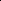

# Posterior Label Smoothing for Node Classification

<!-- Page 1 -->

Posterior Label Smoothing for Node Classification

Jaeseung Heo1, MoonJeong Park1, Dongwoo Kim1, 2

1Graduate School of Artificial Intelligence, POSTECH, South Korea 2Department of Computer Science & Engineering, POSTECH, South Korea jsheo12304@postech.ac.kr, mjeongp@postech.ac.kr, dongwookim@postech.ac.kr

## Abstract

Label smoothing is a widely studied regularization technique in machine learning. However, its potential for node classification in graph-structured data, spanning homophilic to heterophilic graphs, remains largely unexplored. We introduce posterior label smoothing, a novel method for transductive node classification that derives soft labels from a posterior distribution conditioned on neighborhood labels. The likelihood and prior distributions are estimated from the global statistics of the graph structure, allowing our approach to adapt naturally to various graph properties. We evaluate our method on 10 benchmark datasets using eight baseline models, demonstrating consistent improvements in classification accuracy. The following analysis demonstrates that soft labels mitigate overfitting during training, leading to better generalization performance, and that pseudo-labeling effectively refines the global label statistics of the graph.

Code — https://github.com/ml-postech/PosteL Extended version — https://arxiv.org/abs/2406.00410

## Introduction

Soft label, which contains class-wise probabilities, has demonstrated remarkable success in training neural networks across various domains, including computer vision and natural language processing (Lukov et al. 2022; M¨uller, Kornblith, and Hinton 2019; Szegedy et al. 2016; Vasudeva, Dolz, and Lombaert 2024; Vaswani et al. 2017; Zhang et al. 2021a). One of the popular approaches to obtain a soft label is label smoothing, which introduces uniform noise into the ground-truth labels. Despite its simplicity, this technique effectively regularizes the output distribution and enhances generalization (Pereyra et al. 2017). Knowledge distillation (Hinton, Vinyals, and Dean 2015) is another effective option, which trains a teacher model with a given one-hot label and utilizes its output as a soft-label to train the student model.

One of the most convincing explanations of why knowledge distillation works is that soft label enables the learning of “dark knowledge” included in instances (Allen-Zhu and Li 2023; Hinton, Vinyals, and Dean 2015). Since additional

Copyright © 2026, Association for the Advancement of Artificial Intelligence (www.aaai.org). All rights reserved.

information captured by the teacher model that one-hot labels cannot convey is encoded as a soft label, the student model learns richer features.

Considering the graph dataset, the relation between nodes that the graph already contains can be helpful for node classification. As the quote says, “You can tell a person by the company they keep,” our idea is to encode the neighbor’s information into the soft label. More specifically, we utilize the posterior distribution, i.e., the probability of the node label given its neighbor nodes’ labels. This principle naturally generalizes both homophilic and heterophilic settings: in homophilic graphs, a target node is likely to have the same label as its neighbors, whereas in heterophilic graphs, the target node is likely to have different labels, which is supported by our theoretical analysis.

Existing approaches that generate soft labels in the graph domain build up the method based on a more specified assumption that nodes tend to share the same label with their neighboring nodes. Based on this assumption, they construct soft labels by naively aggregating the labels of neighboring nodes (Wang et al. 2021; Zhou et al. 2023). This approach aligns well with homophilic graphs, where nodes of the same class are likely to be connected, leading to improved generalization. However, it conflicts with the nature of heterophilic graphs, where edges frequently connect nodes with different labels.

Based on this intuition, we propose Posterior Label Smoothing (PosteL), a novel method that derives the soft label as the posterior distribution. The likelihood is approximated by the product of conditional label distributions over the node’s neighborhood. To estimate the prior and conditional distributions, we count label occurrences at nodes and label co-occurrences across edges, thereby constructing global statistics that capture the label dependencies encoded in the graph structure. The resulting soft label, therefore, encapsulates rich information from both the local neighborhood structure and the global label distribution.

Since PosteL needs the information of label cooccurrences and global statistics of the graph, accurate information would be important for the success of our approach. However, we can only access the labels of train nodes, while the labels of test nodes remain unknown. The lack of information can result in weakening the efficacy of our method. To address this issue, we propose an itera-

The Fortieth AAAI Conference on Artificial Intelligence (AAAI-26)

21708

<!-- Page 2 -->

tive pseudo-labeling procedure that utilizes pseudo-labels to re-obtain soft labels. Specifically, neighbor nodes’ information is updated and recalculated by the prior and likelihood, which are also re-estimated by pseudo labels.

We apply our smoothing method to eight baseline neural network models, including a multi-layer perceptron and variants of graph neural networks, and test their performances on 10 graph benchmarks, including five homophilic and five heterophilic graphs. Across 80 model–dataset combinations, the soft label approach with iterative pseudolabeling improves classification accuracy in 76 cases.

In summary, we make the following contributions: • We propose a novel posterior label smoothing (PosteL) method that leverages local neighborhood structure and global adjacency statistics to derive soft labels. • We prove that, under mild conditions, PosteL reflects the structural properties of the graph, particularly by preventing the soft label from being similar to the neighborhood labels in heterophilic graphs. • We comprehensively evaluate PosteL on eight baseline neural network models and 10 graph datasets, achieving accuracy improvements in 76 of 80 model–dataset combinations.

## Related Work

## 2.1 Node Classification

Various works leverage graph structures in different ways to perform node classification. Early approaches such as GCN (Kipf and Welling 2016), GraphSAGE (Hamilton, Ying, and Leskovec 2017), and GAT (Veliˇckovi´c et al. 2017) aggregate neighbor representations under the homophilic assumption. For tackling class imbalance on homophilic graphs, GraphSMOTE (Zhao, Zhang, and Wang 2021), Im- GAGN (Qu et al. 2021), and GraphENS (Park, Song, and Yang 2022) have been proposed. Meanwhile, H2GCN (Zhu et al. 2020) and U-GCN (Jin et al. 2021) enhance performance on heterophilic graphs by aggregating representations from multi-hop neighbors. Other research focuses on adaptively learning the graph structure itself. For instance, GPR-GNN (Chien et al. 2020) and CPGNN (Zhu et al. 2021) determine which nodes to aggregate, while ChebNet (Defferrard, Bresson, and Vandergheynst 2016), APPNP (Gasteiger, Bojchevski, and G¨unnemann 2018), and BernNet (He et al. 2021) focus on learning appropriate filters from graph signals.

## 2.2 Classification with Soft Labels Hinton, Vinyals, and

Dean (2015) demonstrate that training a small student model with soft labels derived from a large teacher model’s predictions outperforms training with onehot labels. This approach, known as knowledge distillation (KD), has proven effective for both model compression and performance improvement (Jiao et al. 2020; Liu et al. 2019; Tang and Wang 2018).

Alternatively, simpler methods for generating soft labels exist. Label smoothing (Szegedy et al. 2016) adds uniform noise to one-hot labels, and its benefits have been widely explored. For instance, M¨uller, Kornblith, and Hinton (2019)

show that the label smoothing improves model calibration, while Lukasik et al. (2020) connect the label smoothing to label-correction techniques and demonstrate its utility in addressing label noise. The label smoothing is popular in computer vision (Lukov et al. 2022; Vasudeva, Dolz, and Lombaert 2024; Zhang et al. 2021a) and NLP (Guo et al. 2021; Song et al. 2020; Vaswani et al. 2017), yet it remains relatively underexplored in the graph domain.

To our knowledge, only two studies specifically propose label smoothing techniques for node classification. SALS (Wang et al. 2021) smooths a node’s label to match those of its neighbors, and ALS (Zhou et al. 2023) aggregates neighborhood labels with adaptive refinements. However, neither work focuses on heterophilic graphs, where nodes often connect to dissimilar neighbors. Meanwhile, other studies have proposed smoothing the prediction output based on the graph structure (Xie, Kannan, and Kuo 2023; Zhang et al. 2021b), but their motivations differ substantially from the label smoothing approach investigated in this paper (e.g., they adjust output logits rather than training labels).

## 3 Method

In this section, we present our label smoothing approach for node classification and propose a new training strategy that iteratively refines soft labels via pseudo-labels obtained after training.

## 3.1 Posterior Label Smoothing

Let G = (V, E, X) be a graph, where V is a set of nodes, and E is a set of edges, and X ∈R|V|×d is the d-dimensional node feature matrix. We consider a transductive node classification scenario in which we observe the graph structure for all nodes, including test nodes, but only the labels of nodes in the training set. For each node i in a training set, we have a label yi ∈[K], where K is the total number of classes. Let ei ∈{0, 1}K be a one-hot encoding of yi, i.e., eik = 1 if yi = k and P k eik = 1. We propose an effective relabeling method to allocate a new soft label to each node based on the local neighborhood structure and global label statistics. Let ˆYi be a random variable representing the soft label of node i. Given the one-hop neighborhood N(i) = {j | (i, j) ∈E}, we compute the posterior distribution of ˆYi conditioned on the labels of its neighbors using Bayes’ rule:

P(ˆYi = k | {Yj = yj}j∈N (i))

= P({Yj = yj}j∈N (i)| ˆYi = k)P(ˆYi = k) PK ℓ=1 P({Yj = yj}j∈N (i)| ˆYi = ℓ)P(ˆYi = ℓ)

. (1)

To obtain the likelihood P({Yj = yj}j∈N (i)| ˆYi = k), we assume that the labels of the neighboring nodes are conditionally independent given ˆYi, i.e.,

P({Yj}j∈N (i) | ˆYi) =

Y j∈N (i)

P(Yj | ˆYi). (2)

We empirically verify the conditional independence assumption in Section 5.2.

21709

<!-- Page 3 -->

𝑃(| ෠𝑌𝑖=) = # of edges 𝑢, 𝑣with 𝑌𝑢=, 𝑌𝑣= # of edges 𝑢, 𝑣with 𝑌𝑢= 𝑃(|෠𝑌𝑖=) = = 1

2

𝑃(| ෠𝑌𝑖=) = = 1

2

𝑃(| ෠𝑌𝑖=) = = 1

2 = = 1

2

Conditional distribution (Eq 3)

* Edges 𝑢, 𝑣with 𝑢, 𝑣∈𝒱𝑡𝑟𝑎𝑖𝑛are only considered before pseudo-labeling

𝑃෠𝑌𝑖= = # 𝑜𝑓 𝑠 # 𝑜𝑓𝑛𝑜𝑑𝑒𝑠= 2

5

𝑃෠𝑌𝑖= = # 𝑜𝑓 𝑠 # 𝑜𝑓𝑛𝑜𝑑𝑒𝑠= 3

5

Prior distribution

𝑃, ෠𝑌𝑖= = 𝑃(| ෠𝑌𝑖=)𝑃(| ෠𝑌𝑖=) = 1

4

𝑃, ෠𝑌𝑖= = 𝑃(| ෠𝑌𝑖=)𝑃(| ෠𝑌𝑖=) = 1

4

Joint distribution (Eq 2)

𝑃(෠𝑌𝑖= |,) = 𝑷(, |෡𝒀𝒊=)𝑷(෡𝒀𝒊=)

𝑷, ෡𝒀𝒊= 𝑷෡𝒀𝒊= + 𝑷(, |෡𝒀𝒊=)𝑷(෡𝒀𝒊=) =

1 4 × 2 5 1 4 × 2 5 + 1 4 × 3 5

= 2

5

Goal: to obtain posterior distribution (Eq 1)

𝒊

: target node 𝒊 ∈𝓥𝒕𝒓𝒂𝒊𝒏, ∈𝓥\𝓥𝒕𝒓𝒂𝒊𝒏 𝒊

,: class 1: class 0

Original graph 𝒊

After pseudo-labeling

Re-estimate… 1. posterior distribution

𝑃(෠𝑌𝑖= |),,

2. conditional distribution 3. prior distribution

**Figure 1.** Overall illustration of posterior label smoothing. To relabel the node label, we compute the posterior distribution of the label given neighborhood labels. The likelihood and prior distributions are estimated from global statistics. The statistics are updated through the pseudo-labels after training, resulting in an iterative algorithm.

There are multiple ways to model the individual conditionals in the factorized form of Equation (2). In this work, we use the global statistics between adjacent nodes to estimate the conditional. Specifically, we define

P(Yj = m| ˆYi = n)

:= |{(u, v) | yv = m, yu = n, (u, v) ∈E}|

|{(u, v) | yu = n, (u, v) ∈E}|. (3)

We also estimate the prior distribution from global label frequencies. Concretely, we set P(ˆYi = m):= |{u | yu = m}|/|V|. In Appendix G, we investigate alternative designs for the likelihood and compare their performances. Figure 1 presents an example of obtaining the posterior distribution on a toy graph.

The posterior distribution serves as a soft label for model training. However, to prevent the posterior from becoming overly confident, we incorporate a small amount of uniform noise, ϵ. Additionally, because the most probable label from the posterior may not always align with the ground-truth, e.g., due to label noise or limited local information, we interpolate the posterior with the one-hot label. To this end, we obtain the target label ˆei used for actual training as

ˆei = α˜ei + (1 −α)ei, (4)

where ˜eik ∝P(ˆYi = k | {Yj = yj}j∈N (i)) + βϵ, and α and β are hyperparameters controlling the weights of interpolation and uniform noise. By enforcing α < 1/2, we can keep the most probable label of the target label the same as the ground-truth label, but we find that this condition is not necessary for empirical experiments. We refer to our method as PosteL (Posterior Label smoothing). The detailed algorithm of PosteL is shown in Algorithm 1 in Appendix A.

## 3.2 Iterative Pseudo-labeling

Posterior relabeling derives a node’s soft label by leveraging the labels of its neighbors. However, its effectiveness can be limited by certain graph properties, particularly sparsity and label noise. For instance, if a node has no labeled neighbors, the likelihood term becomes uniform, making the posterior depend solely on the prior; if only a few neighbors are labeled and those labels are noisy, the posterior can become skewed. These challenges are more pronounced in sparse graphs: in the Cornell dataset, for example, 26.35% of nodes have no labeled neighbors, making posterior relabeling especially difficult.

To address these limitations, we propose updating the likelihoods and priors using pseudo-labels generated for the validation and test nodes. Specifically, we first train a graph neural network with the target labels obtained from Equation (4) and then use its predictions on the validation and test nodes to obtain pseudo-labels. We assign each unlabeled node the most probable class from the model’s output. Next, we update the likelihood and prior based on these pseudolabels, while retaining the ground-truth labels for training nodes, to recalibrate both the posterior smoothing and the resulting soft labels.

We repeat this cycle of training and re-calibration un-

21710

AI-readable visual equivalent, added: Figure extracted from the paper PDF and converted to an SVG wrapper asset. Use the surrounding page text and caption for interpretation.

AI-readable visual equivalent, added: Figure extracted from the paper PDF and converted to an SVG wrapper asset. Use the surrounding page text and caption for interpretation.

AI-readable visual equivalent, added: Figure extracted from the paper PDF and converted to an SVG wrapper asset. Use the surrounding page text and caption for interpretation.

AI-readable visual equivalent, added: Figure extracted from the paper PDF and converted to an SVG wrapper asset. Use the surrounding page text and caption for interpretation.

<!-- Page 4 -->

til we achieve the best validation loss, aiming to maximize node classification performance. Intuitively, if posterior label smoothing improves predictive accuracy through better likelihood and prior estimation, then the resulting pseudolabels should, in turn, further refine these distributions, provided that the pseudo-labels contain minimal errors. The detailed algorithms for the training process involving iterative pseudo-labeling are presented in Algorithm 2 in Appendix A.

Theoretical Analysis of PosteL We analyze how PosteL behaves under different graph homophily and heterophily conditions in a binary classification setting. Specifically, we demonstrate how PosteL (i) adapts label assignments based on the neighborhood label distribution and (ii) remains robust across both homophilic and heterophilic graphs. While our focus here is on binary classification for clarity, a similar argument extends to multi-class scenarios as well.

Recall from Equation (3) that PosteL captures the adjacency relationship via empirical edge statistics. In the binary setting, let Nk(i) denote the set of neighbors of node i with label k ∈{0, 1}. Further, we define the class homophily ck for each label k as ck:= |{(i, j) | (i, j) ∈E, yi = k, yj = k}|

|{(i, j) | (i, j) ∈E, yi = k}|, (5)

which measures how likely two adjacent nodes are both labeled k among all edges that include a node labeled k. Thus, ck > 0.5 indicates that nodes labeled k tend to be adjacent to others with label k, i.e., homophilic, whereas ck < 0.5 indicates they tend to connect to nodes with the opposite label, i.e., heterophilic.

The following lemma states the condition under which the posterior of label k is higher than 1 −k. Lemma 1 (Homophilic graph). Suppose that the classes are balanced, i.e., P(ˆY = 0) = P(ˆY = 1) and the graph is homophilic, i.e., ck > 1 −c1−k. Then, for any node i with neighbors N(i), the posterior probability satisfies,

P(ˆYi = k|{Yj = yj}j∈N (i)) > 0.5 if and only if

|Nk(i)| > |N1−k(i)| · log c1−k −log(1 −ck)

log ck −log(1 −c1−k).

Intuitively, Lemma 1 states that if the graph is sufficiently homophilic, having more neighbors with label k than with label 1 −k pushes the posterior probability for k above 0.5.

A similar statement holds for heterophilic graphs. Lemma 2 (Heterophilic graph). Under the same assumptions used in Lemma 1, but now with a heterophilic condition, i.e., ck < 1 −c1−k, we have,

P(ˆYi = k|{Yj = yj}j∈N (i)) > 0.5 if and only if

|Nk(i)| < |N1−k(i)| · log c1−k −log(1 −ck)

log ck −log(1 −c1−k).

Target Node

Homophilic Graph

SALS PosteL

SALS PosteL

SALS PosteL

Heterophilic Graph

SALS PosteL

SALS PosteL

SALS PosteL

T

T

T

**Figure 2.** Toy example illustrating the difference between PosteL and SALS (Wang et al. 2021). The leftmost column shows three examples of a target node (represented as T) with different local neighborhood structures. The second and third columns show how SALS and PosteL create soft labels with homophilic and heterophilic graphs, respectively.

Lemma 2 indicates that in a heterophilic graph, having fewer neighbors of label k than of label 1 −k can make the posterior favor k. Detailed proofs are provided in Appendix B. These two lemmas highlight the key difference between PosteL and the neighborhood aggregation method in Wang et al. (2021). In their method, naively aggregating neighborhood labels for smoothing on heterophilic graphs results in the soft label being dominated by the majority neighborhood label. This majority dominance contradicts the inherent heterophilic property, where nodes are more likely to connect to dissimilar labels. In contrast, Lemma 2 demonstrates that PosteL assigns a lower probability to the majority neighborhood label in heterophilic graphs, thereby mitigating majority dominance, while Lemma 1 shows that PosteL effectively retains similarity to the majority neighbor label in homophilic graphs. Moreover, nodes in heterophilic graphs tend to connect with nodes that have different labels, which implies that |Nyi(i)| < |N1−yi(i)|. In this case, PosteL preserves the ground-truth label as the most probable label. A similar effect is also found in homophilic graphs.

Additionally, we extend the previous results to accommodate the degrees of nodes with heterophilic graphs as follows.

Lemma 3 (Same degree). With a balanced heterophilic graph where 0 < ck < 0.5, if two nodes n and m have the same degree d and |Nk(n)| > |Nk(m)|, then

P(ˆYn = k | {Yj}j∈N (n)) < P(ˆYm = k | {Yj}j∈N (m)).

Lemma 3 shows that for nodes with the same degree, the posterior probability for a label k decreases as more neighbors share that label.

21711

<!-- Page 5 -->

Homophilic Heterophilic

Cora CiteSeer PubMed Computers Photo Chameleon Actor Squirrel Texas Cornell

GCN 87.14±1.01 79.86±0.67 86.74±0.27 83.32±0.33 88.26±0.73 59.61±2.21 33.23±1.16 46.78±0.87 77.38±3.28 65.90±4.43 +LS 87.77±0.97 81.06±0.59 87.73±0.24 89.08±0.30 94.05±0.26 64.81±1.53 33.81±0.75 49.53±1.10 77.87±3.11 67.87±3.77 +KD 87.90±0.90 80.97±0.56 87.03±0.29 88.56±0.36 93.64±0.31 64.49±1.38 33.33±0.78 49.38±0.64 78.03±2.62 63.61±5.57 +SALS 88.10±1.08 80.52±0.85 87.23±0.13 88.88±0.54 93.80±0.31 63.00±1.75 33.24±0.92 49.16±0.77 70.00±3.93 58.36±7.54 +ALS 88.10±0.85 81.02±0.52 87.30±0.30 89.18±0.36 93.88±0.27 64.11±1.29 34.05±0.49 47.44±0.76 77.38±2.13 71.64±3.28 +PosteL 88.56±0.90 82.10±0.50 88.00±0.25 89.30±0.23 94.08±0.35 65.80±1.23 35.16±0.43 52.76±0.64 80.82±2.79 80.33±1.80 ∆ +1.42(↑) +2.24(↑) +1.26(↑) +5.98(↑) +5.82(↑) +6.19(↑) +1.93(↑) +5.98(↑) +3.44(↑) +14.43(↑)

GAT 88.03±0.79 80.52±0.71 87.04±0.24 83.32±0.39 90.94±0.68 63.13±1.93 33.93±2.47 44.49±0.88 80.82±2.13 78.21±2.95 +LS 88.69±0.99 81.27±0.86 86.33±0.32 88.95±0.31 94.06±0.39 65.16±1.49 34.55±1.15 45.94±1.60 78.69±4.10 74.10±4.10 +KD 87.47±0.94 80.79±0.60 86.54±0.31 88.99±0.46 93.76±0.31 65.14±1.47 35.13±1.36 43.86±0.85 79.02±2.46 73.44±2.46 +SALS 88.64±0.94 81.23±0.59 86.49±0.25 88.75±0.36 93.74±0.37 62.76±1.42 33.91±1.41 42.29±0.94 74.92±4.43 65.57±10.00 +ALS 88.60±0.92 81.09±0.68 87.06±0.24 89.57±0.35 94.16±0.36 66.15±1.25 34.05±0.52 46.85±1.45 78.03±3.11 75.08±3.77 +PosteL 89.21±1.08 82.13±0.64 87.08±0.19 89.60±0.29 94.31±0.31 66.28±1.14 35.92±0.72 49.38±1.05 80.33±2.62 80.33±1.81 ∆ +1.18(↑) +1.61(↑) +0.04(↑) +6.28(↑) +3.37(↑) +3.15(↑) +1.99(↑) +4.89(↑) −0.49(↓) +2.12(↑)

BernNet 88.52±0.95 80.09±0.79 88.48±0.41 87.64±0.44 93.63±0.35 68.29±1.58 41.79±1.01 51.35±0.73 93.12±0.65 92.13±1.64 +LS 88.80±0.92 80.37±1.05 87.40±0.27 88.32±0.38 93.70±0.21 69.58±0.94 39.60±0.53 52.39±0.60 91.80±1.80 90.49±1.48 +KD 87.78±0.99 81.20±0.86 87.59±0.41 87.35±0.40 93.96±0.40 67.75±1.42 41.04±0.89 51.25±0.83 93.61±1.31 90.33±2.30 +SALS 88.77±0.85 81.20±0.61 88.61±0.35 88.87±0.33 94.22±0.43 64.62±0.85 40.15±1.07 46.19±0.78 85.90±4.10 88.03±3.12 +ALS 89.13±0.79 81.17±0.67 89.19±0.46 89.52±0.30 94.54±0.32 67.92±1.07 40.51±0.61 51.83±1.31 93.77±1.31 92.79±1.48 +PosteL 89.39±0.92 82.46±0.67 89.07±0.29 89.56±0.35 94.54±0.36 69.65±0.83 40.40±0.67 53.11±0.87 93.93±1.15 92.95±1.80 ∆ +0.87(↑) +2.37(↑) +0.59(↑) +1.92(↑) +0.91(↑) +1.36(↑) −1.39(↓) +1.76(↑) +0.81(↑) +0.82(↑)

**Table 1.** Classification accuracy on 10 node classification datasets. ∆represents the performance improvement achieved by PosteL compared to the backbone model trained with the ground-truth label. All results of the backbone model trained with the ground-truth label are sourced from He et al. (2021).

Lemma 4 (Different degree). With a balanced heterophilic graph where 0 < ck < 0.5, if there are two nodes n and m with degrees dn and dm such that dn > dm and |Nk(n)| = |Nk(m)|, implying that |N1−k(n)| > |N1−k(m)|, then

P(ˆYn = k | {Yj}j∈N (n)) > P(ˆYm = k | {Yj}j∈N (m)).

Lemma 4 highlights that for nodes with different degrees but the same number of neighbors labeled k, the posterior probability of k increases for nodes with more neighbors overall. This captures how higher connectivity amplifies the effect of dissimilar neighbors in heterophilic settings.

In Figure 2, we illustrate the difference between SALS (Wang et al. 2021) and PosteL with different levels of homophily. The first column shows three examples of a target node (represented as T) with different local neighborhood structures. The second and third columns show how SALS and PosteL make soft labels with homophilic and heterophilic graphs, respectively. We visualize Lemma 3 through the heterophilic parts of the first and second graphs (rows) and Lemma 4 through the first and third graphs (rows). As the results indicate, both methods perform similarly in homophilic graphs but not in heterophilic ones. We note that the behavior of ALS (Zhou et al. 2023) is challenging to analyze due to the presence of the learnable component in their method. Except for the learnable part, the basic aggregation method of ALS is similar to that of SALS.

## Experiments

The experimental section is composed of two parts. First, we evaluate the performance of our method for node classification through various datasets and models. Second, we pro- vide a comprehensive analysis highlighting the importance of each design choice.

## 5.1 Node Classification

In this section, we evaluate the improvements in node classification performance achieved by our method across a range of datasets and backbone models. We aim to demonstrate the robustness and consistent effectiveness of our approach across graphs with varying structural and label characteristics.

Datasets We assess the performance of our method across 10 node classification datasets. To examine the effect of our method on diverse types of graphs, we conduct experiments on both homophilic and heterophilic graphs. For the homophilic setting, we evaluate our method on five datasets: Cora, CiteSeer, and PubMed, which are citation networks where nodes represent documents and edges correspond to citation links (Sen et al. 2008; Yang, Cohen, and Salakhudinov 2016), as well as the Amazon co-purchase graphs Computers and Photo (McAuley et al. 2015), where nodes represent products and edges indicate frequent co-purchases. For the heterophilic setting, we use five datasets: Chameleon and Squirrel, which are Wikipedia networks where nodes represent pages and edges correspond to mutual links (Rozemberczki, Allen, and Sarkar 2021); Actor, a co-occurrence network where nodes represent actors and edges indicate co-appearances on the same Wikipedia pages (Tang et al. 2009); and Texas and Cornell, which are webpage graphs where nodes represent web pages and edges denote hyperlinks (Pei et al. 2020). Detailed statistics of each dataset are illustrated in Appendix C.

21712

<!-- Page 6 -->

[0,0]

[0,1]

[0,2]

[1,1]

[1,2]

[2,2]

0.0

0.2

0.4

## 0.6 Product of Marginals

[0,0]

[0,1]

[0,2]

[1,1]

[1,2]

[2,2]

0.0

0.1

0.2

0.3

0.4

Joint Distribution

(a) PubMed

[0,0]

[0,1]

[0,2]

[0,3]

[0,4]

[1,1]

[1,2]

[1,3]

[1,4]

[2,2]

[2,3]

[2,4]

[3,3]

[3,4]

[4,4]

0.0

0.1

0.2

0.3

0.4

Product of Marginals

[0,0]

[0,1]

[0,2]

[0,3]

[0,4]

[1,1]

[1,2]

[1,3]

[1,4]

[2,2]

[2,3]

[2,4]

[3,3]

[3,4]

[4,4]

0.0

0.1

0.2

0.3

## 0.4 Joint Distribution

(b) Cornell

**Figure 3.** Estimated likelihood via product of marginals P(Yj|Yi = 0, j ∈N(i)) × P(Yk|Yi = 0, k ∈N(i)) and empirical joint distribution P(Yj, Yk|Yi = 0, j, k ∈N(i)).

## Experimental Setup

and Baselines We evaluate the performance of PosteL across various backbone models, including a multi-layer perceptron (MLP) without graph structure, and seven widely used graph neural networks: GCN (Kipf and Welling 2016), GAT (Veliˇckovi´c et al. 2017), APPNP (Gasteiger, Bojchevski, and G¨unnemann 2018), ChebNet (Defferrard, Bresson, and Vandergheynst 2016), GPR-GNN (Chien et al. 2020), BernNet (He et al. 2021), and OrderedGNN (Song et al. 2023). We follow the experimental setup and backbone implementations of He et al. (2021). Specifically, we use fixed 10 sets of train, validation, and test splits with ratios of 60%/20%/20%, respectively, and measure the accuracy at the lowest validation loss. Each model is trained for 1,000 epochs, with early stopping applied if the validation loss does not improve over the last 200 epochs. Details of the experimental setup, including the hyperparameter search spaces and additional implementation specifics, are provided in Appendix D.

We compare our method with two domain-agnostic soft labeling methods, including label smoothing (LS) (Szegedy et al. 2016) and knowledge distillation (KD) (Hinton, Vinyals, and Dean 2015), as well as two label smoothing methods designed for node classification: SALS (Wang et al. 2021) and ALS (Zhou et al. 2023).

## Results

Table 1 reports the classification accuracy and 95% confidence intervals for each of the three models across ten datasets. Complete results, including the performance of APPNP, ChebNet, MLP, GPR-GNN, and OrderedGNN, are presented in Table 9 of Appendix G. Our method outperforms baseline methods in 76 out of 80 experimental settings. In 41 of these cases, the performance improvements exceed the 95% confidence interval, highlighting the robustness of our approach. On the Cornell dataset, using the GCN backbone, PosteL achieves a substantial improvement of 14.43%.

Compared to other soft labeling methods, PosteL consistently achieves superior performance. In particular, our method outperforms SALS and ALS, which are label smoothing methods specifically tailored for node classification, on both homophilic and heterophilic datasets. The improvements are especially significant on heterophilic datasets, indicating that the heterophily-aware label assignment strategy of PosteL effectively enhances classification performance in heterophilic graph settings.

Nevertheless, on the Actor dataset, PosteL exhibits relatively weaker performance compared to other datasets. We provide an analysis of the reasons behind this weaker performance in Appendix E. In summary, on the Actor dataset, PosteL behaves similarly to uniform label smoothing due to nearly identical conditional distributions across different labels.

## 5.2 Empirical Analysis

In this section, we analyze the main experimental results from multiple perspectives, including validation of the conditional independence assumption, analysis of loss curves, and computational complexity. Further analyses provided in Appendix G include hyperparameter sensitivity, ablation studies, scalability to large-scale graphs, and comparisons of likelihood model design choices.

Empirical Validation of the Conditional Independence in Equation (2) In Equation (2), we approximate the joint conditional distribution of neighborhood labels using the product of individual conditional distributions. Although this factorization is exact when the neighborhood labels are conditionally independent given the central node’s label, this assumption is often violated in real-world datasets. To empirically validate our approximation, we compare the true joint distribution P(Yj = n, Yk = m|Yi = l) to the product of marginals P(Yj = n|Yi = l) × P(Yk = m|Yi = l). Figure 3 illustrates these distributions for the case l = 0. We observe that the product of marginals closely approximates the joint distribution, supporting the validity of our approximation.

Loss Curves Analysis We examine how soft labels affect GNN training dynamics by plotting the loss curves of GCN on the Squirrel dataset. Figure 4a compares the training, validation, and test losses when using ground-truth (GT) labels and PosteL labels. With PosteL, the gap between training loss and validation/test losses is noticeably smaller, indicating reduced overfitting. While the model trained with ground-truth labels begins to overfit after 50 epochs, PosteL remains stable through 200 epochs.

We hypothesize that correctly predicting PosteL labels, which encode local neighborhood information, enhances the model’s understanding of the graph structure and thereby improves generalization. Similar context-prediction strategies have been used as pretraining methods in previous studies (Hu et al. 2019; Rong et al. 2020). Loss curves for homophilic datasets are provided in Figure 9 and heterophilic in Figure 10 in Appendix G, showing consistent patterns across datasets.

21713

<!-- Page 7 -->

0 200 400 600 800 Epoch

1.00

2.00

3.00

GT

Training Validation Test

0 200 400 600 800 Epoch

1.30

1.40

1.50

## 1.60 PosteL

(a) Ground-truth vs. PosteL labels

0 200 400 600 800 Epoch

1.46

1.48

1.50

## 1.52 Training Loss

w/o iteration Iteration 1 Iteration 2 Iteration 3 Iteration 4

0 200 400 600 800 Epoch

1.10

1.20

1.30

1.40

1.50

## 1.60 Test Loss

(b) Loss curves across iterations

**Figure 4.** Loss curve comparisons: (a) using ground-truth (GT) labels versus PosteL labels on the Squirrel dataset; (b) across iterations of iterative pseudo-labeling on the Cornell dataset.

Effect of Iterative Pseudo-labeling We analyze the impact of iterative pseudo-labeling by examining the loss curves across iterations. Figure 4b shows the loss curves on the Cornell dataset, where test losses consistently decrease with each iteration. In this example, the model achieves its best performance after four iterations. On average, the best performance is observed at 1.13 iterations. The average number of iterations used to report the results in Table 9 is detailed in Appendix F.

Complexity Analysis The computational complexity of the posterior calculation is O(|E|K), which is negligible compared to the time complexity of a single pass through an L-layer GCN with fixed hidden dimension h, O(L|E|h + L|V|h2), since the posterior is computed once before training. The training time scales linearly with the number of pseudo-labeling iterations, but experiments show that an average of 1.13 iterations is sufficient, making our approach practical. A detailed complexity analysis can be found in Appendix F.

## 5.3 Posterior Estimation with Limited Labels

Our method estimates posterior probabilities from training set statistics. However, when training labels are limited, these estimated distributions may substantially deviate from the oracle distributions, potentially leading to inaccurate posterior probabilities. To examine this issue, we evaluate the quality of the estimated distributions using only 10% of the training data described in Section 5.1.

**Figure 5.** compares the conditional distributions on the Cornell dataset estimated using (1) training labels only, (2) training labels combined with pseudo-labels for validation and test nodes, and (3) all ground-truth labels. The con-

1 2 3 4 5 0.0

0.2

0.4

P(Yj|Yi = 1)

1 2 3 4 5 0.0

0.1

0.2 P(Yj|Yi = 2)

1 2 3 4 5 0.0

0.2

0.4

P(Yj|Yi = 3)

(a) Training labels

1 2 3 4 5 0.0

0.2

0.5

P(Yj|Yi = 1)

1 2 3 4 5 0.0

0.2

0.5

P(Yj|Yi = 2)

1 2 3 4 5 0.0

0.2

0.4 P(Yj|Yi = 3)

(b) Training labels with pseudo-labels

1 2 3 4 5 0.0

0.2

0.4

P(Yj|Yi = 1)

1 2 3 4 5 0.0

0.2

0.5

P(Yj|Yi = 2)

1 2 3 4 5 0.0

0.2

0.4 P(Yj|Yi = 3)

(c) Ground-truth labels (Oracle)

**Figure 5.** Estimated conditional distributions obtained from (a) training labels only, (b) training labels combined with pseudo-labels, and (c) all ground-truth labels.

IPL Cora CiteSeer Texas Cornell

GCN – 80.66±0.89 73.52±1.43 67.05±14.92 58.36±19.19 +PosteL ✗ 81.59±1.23 74.97±1.62 69.67±14.76 64.59±15.25 +PosteL ✓ 82.33±1.28 76.15±1.05 71.48±13.93 67.54±16.40

**Table 2.** Accuracy of the model trained with a limited training labels. The IPL column indicates whether iterative pseudo-labeling was applied: ✗without IPL and ✓with IPL.

ditional distributions estimated from limited training data show substantial deviation from the oracle distributions derived from all labels. In contrast, incorporating pseudolabels reduces this discrepancy, yielding conditional distributions that closely match the oracle. We provide the same analysis on the other datasets in Appendix G.

**Table 2.** reports the classification accuracy of GCNs trained on 10% of the training data. Despite the limited availability of training labels, PosteL consistently enhances predictive accuracy. Particularly in the Texas and Cornell datasets, where pseudo-labeling substantially improves conditional distribution estimation, iterative pseudo-labeling achieves greater improvements compared to other datasets. This highlights the importance of refining conditional distributions to estimate posterior probabilities accurately.

## 6 Conclusion

We introduce a novel posterior label smoothing method for node classification on graphs. By combining local neighborhoods with global label statistics, PosteL improves model generalization. Extensive experiments on multiple datasets and models confirm its effectiveness, demonstrating significant performance gains over baseline methods.

21714

<!-- Page 8 -->

## Acknowledgements

We are grateful to Sangwoo Seo for providing insightful comments on this work. This work was supported by the National Research Foundation of Korea (NRF) grant funded by the Korea government(MSIT) (RS-2024- 00337955; RS-2023-00217286) and Institute of Information & communications Technology Planning & Evaluation (IITP) grant funded by the Korea government(MSIT) (RS- 2024-00457882, National AI Research Lab Project; RS- 2019-II191906, Artificial Intelligence Graduate School Program(POSTECH)).

## References

Allen-Zhu, Z.; and Li, Y. 2023. Towards Understanding Ensemble, Knowledge Distillation and Self-Distillation in Deep Learning. In The Eleventh International Conference on Learning Representations. Chien, E.; Peng, J.; Li, P.; and Milenkovic, O. 2020. Adaptive universal generalized pagerank graph neural network. arXiv preprint arXiv:2006.07988. Defferrard, M.; Bresson, X.; and Vandergheynst, P. 2016. Convolutional neural networks on graphs with fast localized spectral filtering. Advances in neural information processing systems, 29. Gasteiger, J.; Bojchevski, A.; and G¨unnemann, S. 2018. Predict then propagate: Graph neural networks meet personalized pagerank. arXiv preprint arXiv:1810.05997. Guo, B.; Han, S.; Han, X.; Huang, H.; and Lu, T. 2021. Label confusion learning to enhance text classification models. In Proceedings of the AAAI conference on artificial intelligence, volume 35, 12929–12936. Hamilton, W.; Ying, Z.; and Leskovec, J. 2017. Inductive Representation Learning on Large Graphs. In Guyon, I.; Luxburg, U. V.; Bengio, S.; Wallach, H.; Fergus, R.; Vishwanathan, S.; and Garnett, R., eds., Advances in Neural Information Processing Systems, volume 30. Curran Associates, Inc. He, M.; Wei, Z.; Xu, H.; et al. 2021. Bernnet: Learning arbitrary graph spectral filters via bernstein approximation. Advances in Neural Information Processing Systems, 34: 14239–14251. Hinton, G.; Vinyals, O.; and Dean, J. 2015. Distilling the Knowledge in a Neural Network. In NIPS Deep Learning and Representation Learning Workshop. Hu, W.; Liu, B.; Gomes, J.; Zitnik, M.; Liang, P.; Pande, V.; and Leskovec, J. 2019. Strategies for pre-training graph neural networks. arXiv preprint arXiv:1905.12265. Jiao, X.; Yin, Y.; Shang, L.; Jiang, X.; Chen, X.; Li, L.; Wang, F.; and Liu, Q. 2020. TinyBERT: Distilling BERT for Natural Language Understanding. In Findings of the Association for Computational Linguistics: EMNLP 2020, 4163–4174. Association for Computational Linguistics. Jin, D.; Yu, Z.; Huo, C.; Wang, R.; Wang, X.; He, D.; and Han, J. 2021. Universal Graph Convolutional Networks. In Beygelzimer, A.; Dauphin, Y.; Liang, P.; and Vaughan, J. W., eds., Advances in Neural Information Processing Systems.

Kipf, T. N.; and Welling, M. 2016. Semi-supervised classification with graph convolutional networks. arXiv preprint arXiv:1609.02907. Liu, Y.; Chen, K.; Liu, C.; Qin, Z.; Luo, Z.; and Wang, J. 2019. Structured Knowledge Distillation for Semantic Segmentation. In 2019 IEEE/CVF Conference on Computer Vision and Pattern Recognition (CVPR), 2599–2608. Lukasik, M.; Bhojanapalli, S.; Menon, A.; and Kumar, S. 2020. Does label smoothing mitigate label noise? In International Conference on Machine Learning, 6448–6458. PMLR. Lukov, T.; Zhao, N.; Lee, G. H.; and Lim, S.-N. 2022. Teaching with soft label smoothing for mitigating noisy labels in facial expressions. In European Conference on Computer Vision, 648–665. Springer. McAuley, J.; Targett, C.; Shi, Q.; and Van Den Hengel, A. 2015. Image-based recommendations on styles and substitutes. In Proceedings of the 38th international ACM SIGIR conference on research and development in information retrieval, 43–52. M¨uller, R.; Kornblith, S.; and Hinton, G. E. 2019. When does label smoothing help? Advances in neural information processing systems, 32. Park, J.; Song, J.; and Yang, E. 2022. GraphENS: Neighbor- Aware Ego Network Synthesis for Class-Imbalanced Node Classification. In International Conference on Learning Representations. Pei, H.; Wei, B.; Chang, K. C.-C.; Lei, Y.; and Yang, B. 2020. Geom-gcn: Geometric graph convolutional networks. arXiv preprint arXiv:2002.05287. Pereyra, G.; Tucker, G.; Chorowski, J.; Kaiser, Ł.; and Hinton, G. 2017. Regularizing neural networks by penalizing confident output distributions. arXiv preprint arXiv:1701.06548. Qu, L.; Zhu, H.; Zheng, R.; Shi, Y.; and Yin, H. 2021. Imgagn: Imbalanced network embedding via generative adversarial graph networks. In Proceedings of the 27th ACM SIGKDD Conference on Knowledge Discovery & Data Mining, 1390–1398. Rong, Y.; Bian, Y.; Xu, T.; Xie, W.; Wei, Y.; Huang, W.; and Huang, J. 2020. Self-supervised graph transformer on large-scale molecular data. Advances in neural information processing systems, 33: 12559–12571. Rozemberczki, B.; Allen, C.; and Sarkar, R. 2021. Multiscale attributed node embedding. Journal of Complex Networks, 9(2): cnab014. Sen, P.; Namata, G.; Bilgic, M.; Getoor, L.; Galligher, B.; and Eliassi-Rad, T. 2008. Collective classification in network data. AI magazine, 29(3): 93–93. Song, M.; Zhao, Y.; Wang, S.; and Han, M. 2020. Learning recurrent neural network language models with contextsensitive label smoothing for automatic speech recognition. In ICASSP 2020-2020 IEEE International Conference on Acoustics, Speech and Signal Processing (ICASSP), 6159– 6163. IEEE.

21715

<!-- Page 9 -->

Song, Y.; Zhou, C.; Wang, X.; and Lin, Z. 2023. Ordered gnn: Ordering message passing to deal with heterophily and over-smoothing. arXiv preprint arXiv:2302.01524. Szegedy, C.; Vanhoucke, V.; Ioffe, S.; Shlens, J.; and Wojna, Z. 2016. Rethinking the Inception Architecture for Computer Vision. In Proceedings of the IEEE Conference on Computer Vision and Pattern Recognition (CVPR). Tang, J.; Sun, J.; Wang, C.; and Yang, Z. 2009. Social influence analysis in large-scale networks. In Proceedings of the 15th ACM SIGKDD international conference on Knowledge discovery and data mining, 807–816. Tang, J.; and Wang, K. 2018. Ranking Distillation: Learning Compact Ranking Models With High Performance for Recommender System. In Proceedings of the 24th ACM SIGKDD International Conference on Knowledge Discovery & Data Mining, KDD ’18, 2289–2298. New York, NY, USA: Association for Computing Machinery. Vasudeva, S. A.; Dolz, J.; and Lombaert, H. 2024. GeoLS: Geodesic label smoothing for image segmentation. In Medical Imaging with Deep Learning, 468–478. PMLR. Vaswani, A.; Shazeer, N.; Parmar, N.; Uszkoreit, J.; Jones, L.; Gomez, A. N.; Kaiser, L. u.; and Polosukhin, I. 2017. Attention is All you Need. In Guyon, I.; Luxburg, U. V.; Bengio, S.; Wallach, H.; Fergus, R.; Vishwanathan, S.; and Garnett, R., eds., Advances in Neural Information Processing Systems, volume 30. Curran Associates, Inc. Veliˇckovi´c, P.; Cucurull, G.; Casanova, A.; Romero, A.; Lio, P.; and Bengio, Y. 2017. Graph attention networks. arXiv preprint arXiv:1710.10903. Wang, Y.; Cai, Y.; Liang, Y.; Wang, W.; Ding, H.; Chen, M.; Tang, J.; and Hooi, B. 2021. Structure-aware label smoothing for graph neural networks. arXiv preprint arXiv:2112.00499. Xie, T.; Kannan, R.; and Kuo, C.-C. J. 2023. Label efficient regularization and propagation for graph node classification. IEEE transactions on pattern analysis and machine intelligence. Yang, Z.; Cohen, W.; and Salakhudinov, R. 2016. Revisiting semi-supervised learning with graph embeddings. In International conference on machine learning, 40–48. PMLR. Zhang, C.-B.; Jiang, P.-T.; Hou, Q.; Wei, Y.; Han, Q.; Li, Z.; and Cheng, M.-M. 2021a. Delving Deep Into Label Smoothing. IEEE Transactions on Image Processing, 30: 5984–5996. Zhang, W.; Yang, M.; Sheng, Z.; Li, Y.; Ouyang, W.; Tao, Y.; Yang, Z.; and Cui, B. 2021b. Node dependent local smoothing for scalable graph learning. Advances in Neural Information Processing Systems, 34: 20321–20332. Zhao, T.; Zhang, X.; and Wang, S. 2021. Graphsmote: Imbalanced node classification on graphs with graph neural networks. In Proceedings of the 14th ACM international conference on web search and data mining, 833–841. Zhou, K.; Choi, S.-H.; Liu, Z.; Liu, N.; Yang, F.; Chen, R.; Li, L.; and Hu, X. 2023. Adaptive label smoothing to regularize large-scale graph training. In Proceedings of the 2023 SIAM International Conference on Data Mining (SDM), 55– 63. SIAM.

Zhu, J.; Rossi, R. A.; Rao, A.; Mai, T.; Lipka, N.; Ahmed, N. K.; and Koutra, D. 2021. Graph neural networks with heterophily. In Proceedings of the AAAI conference on artificial intelligence, volume 35, 11168–11176. Zhu, J.; Yan, Y.; Zhao, L.; Heimann, M.; Akoglu, L.; and Koutra, D. 2020. Beyond Homophily in Graph Neural Networks: Current Limitations and Effective Designs. In Larochelle, H.; Ranzato, M.; Hadsell, R.; Balcan, M.; and Lin, H., eds., Advances in Neural Information Processing Systems, volume 33, 7793–7804. Curran Associates, Inc.

21716
